====================
**Tampon Önbelleği**
====================

Bu bölümde eskiden ismine *tampon önbelleği (buffer cache)* denilen önbellek mekanizması 
üzerinde duracağız. Çekirdeğin 2.4 versiyonundan önce sayfa önbelleği ile tampon 
önbelleği ayrı veri yapıları biçiminde organize edilmişti. 2.4 çekirdeği ile birlikte tampon
önbelleği sayfa önbelleğinin içerisine gömüldü ve *tampon önbelleği (buffer cache)* terimi yerine 
*tampon başları (buffer heads)* terimi de kullanılmaya başlandı. Biz kitabımızda bu önbellek 
mekanizması için geleneksel olarak *tampon önbelleği* terimini kullanacağız. 

Çekirdek evrimleştikçe sayfa önbelleği ve tampon önbelleği üzerinde peek çok iyileştirmeler yapılmıştır. 
Biz kitabımızın bu bölümünde güncel çekirdeklerdeki tasarımı ele alıp açıklayacağız. Gelecekte tampon 
mekanizmasının çekirdeğin veri yolundan tamamen çıkartılması da düşünülmektedir. 

Giriş
=====

Sayfa önbelleği bir dosyanın içerisindeki bilgileri önbellekte tutmak için kullanılmaktadır. Linux çekirdeğinde 
dosya içeriğine ilişkin olmayan diskin metadata alanlarını önbelleklemek için kullanılan önbellek 
sistemine *tampon önbelleği* denilmektedir. Yani sayfa önbelleğinin amacı dosyanın içeriklerini önbelleklemekken 
tampon önbelleğinin amacı disk metadata bloklarını önbelleklemektir. 

Biz dosya sistemini ele aldığımız bölümde *simplefs* dosya sistemimizde blokları ``sb_bread`` fonksiyonuyla okumuştuk. 
Bu fonksiyona okuyacağımız blok numarasını vermiştik, fonksiyondan da ``buffer_head`` nesnesi elde etmiştik. 
``sb_bread`` fonksiyonunun prototipi şöyleydi:

.. code-block:: c

    static inline struct buffer_head *sb_bread(struct super_block *sb, sector_t block);

Fonksiyon başarı durumunda bize okunan bloğa ilişkin bir ``buffer_head`` nesnesi veriyordu. Biz o
bölümde okunan blokların aynı zamanda sayfa önbelleğine de yerleştirildiğini söylemiştik. Bu
bölümde bu tamponlama sistemini ele alıp bu sistemin sayfa önbelleğiyle ilişkisi üzerinde
duracağız.

Eskiden çekirdeğin 2.4 versiyonu öncesinde tampon önbelleği ile sayfa önbelleği birbirinden tamamen
ayrıydı. Tampon önbelleği dosya sisteminin bloklarını önbelleklerken, sayfa önbelleği dosya
içeriklerini önbellekliyordu. Bu iki önbellek sisteminin veri yapıları da birbirinden ayrıydı.
2.4 öncesi çekirdeklerdeki bu iki önbellek sistemini aşağıdaki şekille betimleyebiliriz:

.. figure:: _static/old-dual-cache.png
   :alt: 2.4 öncesi ayrık sayfa ve tampon önbellekleri
   :align: center
   :width: 45%

Sayfa önbelleği 2.4 öncesinde read-only bir önbellekti. Kirli veri orada durmuyordu, oradan diske
geri yazım da yapılmıyordu. O dönemlerde yazma sahipliği tampon önbelleğindeydi. O dönemlerde bu
iki önbelleğin birbirinden ayrık olmasının yarattığı en önemli sorunlardan biri disk bloğunun her
iki önbellekte de bulunabilmesiydi. Örneğin biz blok okuması yoluyla bir bloğu okumuş olalım. Bu
blok tampon önbelleğine giriyordu. Ancak aynı blok bir dosyanın da parçasıysa aynı zamanda bu blok
sayfa önbelleğinde de bulunuyordu. Tabii bu durumla genellikle karşılaşılmıyordu. Çekirdeğin 2.4
versiyonuyla bu iki önbellek sistemi birleştirildi. Tampon önbelleği sayfa önbelleğinin içine
oturtuldu. 2.4 ve sonrasındaki organizasyonu şekilsel olarak şöyle gösterebiliriz:

.. figure:: _static/unified-cache.png
   :alt: 2.4 ve sonrasında birleştirilmiş önbellek organizasyonu
   :align: center
   :width: 45%

Tampon önbelleğinin sayfa önbelleğinin içerisine oturtulmasıyla artık her disk bloğu toplamda tek
bir yerde önbelleklenmektedir. Bu durum hem sistemin ele alınmasını kolaylaştırmış hem de
tutarlılığı artırmıştır.

Blok Aygıtlarına İlişkin Inode Nesneleri
=========================================

Linux çekirdeğinde blok aygıtlarının *blok aygıt sürücüsü (block device driver)* denilen aygıt
sürücüler tarafından yönetildiğini belirtmiştik. İşte bir blok aygıtı kullanıldığı zaman ona
ilişkin bir ``inode`` nesnesi de sistem tarafından yaratılmaktadır. Yani blok aygıtları da birer
dosya gibi ele alınmaktadır. O halde blok aygıtları için de bir sayfa önbelleği bulunmaktadır.
Örneğin sistemimizdeki diski temsil eden ``/dev/sda`` blok aygıtını göz önüne alalım. Bu blok 
aygıtı için çekirdek blok aygıt sürücüsünün ön ayak olmasıyla bir inode nesnesi oluşturmaktadır. Bu blok aygıtındaki 
okumalarda ve yazmalarda bu ``inode`` nesnesinin sayfa önbelleği kullanılmaktadır. Blok aygıtları için oluşturulan ``inode`` 
nesneleri ``bdevfs`` isimli bir dosya sistemi içerisindedir. Bu dosya sistemi ``/proc/filesystems`` içerisinde görünmesine 
karşın mount edilememektedir. 

Blok aygıtları için yaratılan ``inode`` nesneleri kullanıcı tarafından görülmez. Bu ``inode``
nesneleri güncel çekirdeklerde blok aygıtları için ``gendisk`` nesneleri oluşturulurken çağrılan
``blk_alloc_disk`` ya da ``blk_mq_alloc_disk`` fonksiyonlarının çağrı zincirindeki ``bdev_alloc``
fonksiyonunda yaratılmaktadır. Güncel çekirdeklerdeki ``blk_alloc_disk`` ve ``blk_mq_alloc_disk``
fonksiyonlarından ``bdev_alloc`` fonksiyonuna kadar giden çağrı zinciri şöyledir:

.. figure:: _static/bdev-alloc-callchain.png
   :alt: bdev_alloc çağrı zinciri
   :width: 45%

Blok aygıt sürücülerine ilişkin çekirdek mimarisi ve fonksiyonları çekirdeğin çeşitli versiyonlarında
defalarca değiştirilmiştir. Biz ``blk_alloc_disk`` ve ``blk_mq_alloc_disk`` fonksiyonlarını aygıt
sürücü mimarilerini konu aldığımız bölümde ele alacağız.

Linux çekirdeklerinde blok aygıtları için en genel yapı ``gendisk`` isimli yapıdır. Biz bu yapıyla
daha önce tanışmıştık. Blok aygıtlarının bilgileri ise ``block_device`` isimli bir yapıyla temsil
edilmektedir. ``gendisk`` nesnesi içerisinde ``block_device`` nesnesinin adresi tutulmaktadır:

.. code-block:: c

    struct gendisk {
        /* ... */
        struct block_device *part0;
        /* ... */
    };

Blok aygıtına ilişkin ``inode`` nesnesinin adresi eskiden doğrudan ``block_device`` nesnesinin
içerisindeki ``bd_inode`` elemanında tutuluyordu:

.. code-block:: c

    struct block_device {
        /* ... */
        struct inode *bd_inode;
        /* ... */
    };

Ancak çekirdeğin 6.9 versiyonundan itibaren artık blok aygıtına ilişkin ``inode`` nesnesinin adresi
``block_device`` nesnesi içerisinde tutulmamaktadır. Bunun yerine artık güncel çekirdeklerde
``block_device`` nesnesi içerisinde doğrudan blok aygıtına ilişkin ``address_space`` nesnesinin
(yani sayfa önbelleğinin) adresi tutulmaktadır:

.. code-block:: c

    struct block_device {
        /* ... */
        struct address_space    *bd_mapping;
        /* ... */
    };

Tabii yeni çekirdeklerde de ``address_space`` nesnesinden hareketle ``inode`` nesnesine
erişilebilmektedir. ``address_space`` yapısının ``host`` elemanının o ``address_space`` nesnesine
ilişkin ``inode`` nesnesinin adresini tuttuğunu anımsayınız. Aslında güncel çekirdeklerde
``block_device`` nesnesi ile bu nesneye ilişkin ``inode`` nesnesi ``bdev_inode`` denilen bir yapıda
alt alta bulundurulmuştur:

.. code-block:: c

    struct bdev_inode {
        struct block_device bdev;
        struct inode vfs_inode;
    };

Bu yerleşimi şekilsel olarak şöyle de gösterebiliriz:

.. figure:: _static/bdev-inode-layout.png
   :alt: bdev_inode yapısının bellek yerleşimi
   :align: center
   :class: fig-mapping5
   :width: 40%

Dolayısıyla aslında eğer elimizde ``block_device`` nesnesinin adresi varsa ``container_of``
makrosuyla yapının ``vfs_inode`` elemanına erişebiliriz. Tabii bunun tersini de yapabiliriz. Güncel
çekirdeklerde ``block/bdev.c`` dosyası içerisinde bu erişimleri yapan inline fonksiyonlar
bulundurulmuştur:

.. code-block:: c

    static inline struct bdev_inode *BDEV_I(struct inode *inode)
    {
        return container_of(inode, struct bdev_inode, vfs_inode);
    }

    static inline struct inode *BD_INODE(struct block_device *bdev)
    {
        return &container_of(bdev, struct bdev_inode, bdev)->vfs_inode;
    }

``gendisk`` nesnesi ve ``block_device`` nesnesi blok aygıt sürücüsü çekirdeğe yüklenirken blok
aygıt sürücülerinin ``init`` fonksiyonları tarafından yaratılmaktadır. Bu konuyu aygıt sürücü
mimarisinin açıklandığı bölümde ele alacağız.

Blok aygıtlarına ilişkin ``inode`` nesneleriyle blok aygıtını ``open`` fonksiyonuyla açtığımızda
elde ettiğimiz ``inode`` nesnesini karıştırmayınız. Örneğin diskimizi yöneten aygıt sürücüye
ilişkin aygıt dosyası ``/dev/sda1`` olsun. Bu aygıt dosyasına ilişkin aygıt sürücü sistem boot
edilirken çekirdeğe yüklenmektedir. Biz bu aygıt sürücüyü ``open`` fonksiyonuyla şöyle açmış
olalım:

.. code-block:: c

    fd = open("/dev/sda1", O_RDONLY);

Buradan hareketle bir dosya nesnesi ve bir ``inode`` nesnesi oluşturulmaktadır. Ancak ``fd`` dosya
nesnesine ilişkin bu ``inode`` nesnesi yukarıda sözünü ettiğimiz blok aygıt sürücüsünün ``inode``
nesnesi değildir. Dolayısıyla biz ``fd`` betimleyicisini kullanarak ``read`` fonksiyonuyla okuma
yaptığımızda burada oluşturulan ``inode`` nesnesinin önbelleği kullanılmaz, blok aygıt sürücüsünün
önbelleği kullanılır. Aslında bir blok aygıtını açtığımızda oluşturulan ``inode`` nesnesi blok
aygıtına erişmekte kullanılan bir anahtar gibidir. Blok aygıtının önbelleği blok aygıtına ilişkin
``inode`` nesnesinin içerisindedir. Aygıt dosyasından elde edilen dosya nesnesi ve ``inode``
nesnesi yoluyla aygıt sürücünün ``inode`` nesnesine nasıl erişildiği aşağıdaki şekilde
özetlenmektedir:

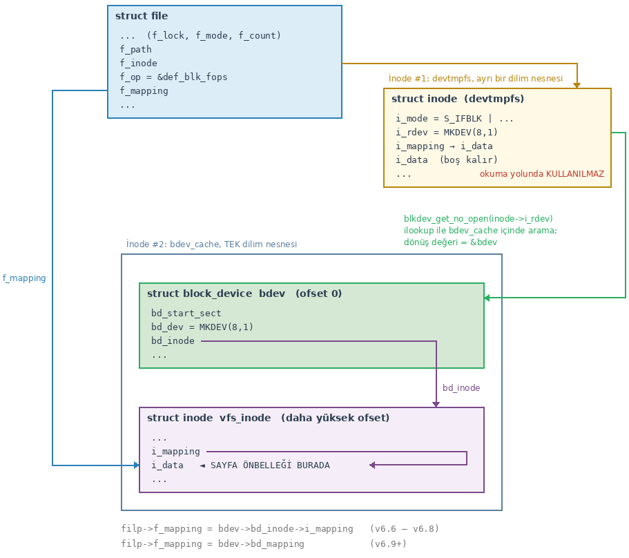

Yukarıda da belirttiğimiz gibi zaten bu önbelleğe artık ``block_device`` nesnesi yoluyla doğrudan
erişilebilmektedir. Sayfa önbelleğini anlattığımız önceki bölümde dosya açılırken dosya nesnesinin
(``struct file``) ``f_mapping`` elemanının ``inode`` nesnesinin ``i_data`` elemanını gösterir hale
getirildiğini belirtmiştik. İşte blok aygıt sürücüleri ``open`` fonksiyonu ile açılırken artık
dosya nesnesinin ``f_mapping`` elemanı aygıt dosyasına ilişkin ``inode`` nesnesinin ``i_data``
elemanını değil blok aygıtına ilişkin ``inode`` nesnesinin ``i_data`` elemanını gösterir duruma
getirilmektedir. Yani örneğin biz blok aygıt dosyasını ``open`` fonksiyonuyla açıp ``read`` işlemi
yaptığımızda ``f_mapping`` yoluyla başvurulacak önbellek blok aygıtına ilişkin önbellek olacaktır.

Aşağıdaki tabloda blok aygıt dosyasına ilişkin ``inode`` nesnesi ile blok aygıtına ilişkin
``inode`` nesnesinin nelerden sorumlu olduğu belirtilmektedir. Burada "Dosya Inode" blok aygıtı
açılarak elde edilen ``inode`` nesnesini, "bdev Inode" ise blok aygıtına ilişkin ``inode``
nesnesini belirtmektedir:

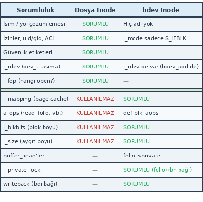

Tampon Önbelleğinin Organizasyonu
=================================

Tampon önbelleğinin amacının dosyanın sayfalarını değil blok aygıtının bloklarını önbelleklemek olduğunu ve 2.4 ile
birlikte tampon önbelleğinin sayfa önbelleğinin içerisine oturtulduğunu belirtmiştik. Şimdi tampon önbelleğinin
yapısı üzerinde duralım.

Tamponlar sayfaların içerisinde (genel olarak *folio*'ların içerisinde) bulunmaktadır. Bir sayfanın tipik olarak 4K
büyüklüğünde olduğunu anımsayınız. Sayfa içerisindeki tamponların büyüklüğü blok aygıt sürücüsü tarafından
belirlenmektedir. Eskiden bu belirleme blok aygıt sürücüsünü oluşturanlar tarafından ``blk_queue_logical_block_size``
fonksiyonuyla ayarlanıyordu. Güncel çekirdeklerde artık bu ayarlama ``queue_limits`` yapısının
``logical_block_size`` elemanı ile yapılmaktadır. Bu blok büyüklüğü değeri çekirdek tarafından ``block_device``
nesnesine ilişkin ``inode`` nesnesinin ``i_blkbits`` elemanında 2'nin kuvvet değeri olarak saklanmaktadır. (Yani
örneğin burada 9 değeri varsa tampon büyüklüğü 512, 10 değeri varsa 1024'tür.) Bu değeri bu elemana yerleştiren
``set_blocksize`` isimli bir fonksiyon da vardır. Burada bir noktaya daha dikkatinizi çekmek istiyoruz. Aslında her
ne kadar blok büyüklüğünü belirten ``i_blkbits`` değeri işin başında sürücü tarafından belirleniyorsa da bu değer
dosya sistemini yazanlar tarafından değiştirilerek dosya sisteminin blok büyüklüğüne ayarlanmaktadır. *simplefs*
dosya sistemimizde biz bu ayarlamayı şöyle yapmıştık:

.. code-block:: c

    sb_set_blocksize(sb, SIMPLEFS_BLOCK_SIZE);

Bu fonksiyon hem ``super_block`` nesnesi içerisindeki ``s_blocksize`` elemanını hem de ``block_device`` nesnesine
ilişkin ``inode`` nesnesinin ``i_blkbits`` elemanını set etmektedir.

Tampon büyüklüğü için bazı kısıtlar da vardır. 6.12 çekirdeği öncesinde tampon büyüklüğü için kısıtlar şöyleydi:

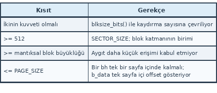

6.12'ye kadar bir tampon bir sayfanın içinde bulunmak zorundaydı, dolayısıyla sayfa uzunluğundan büyük olamıyordu.
Ancak 6.12 ile birlikte artık tamponlar sayfaların içerisinde değil *folio*'lar içerisinde tutulmaya başlanmıştır.
*Folio*'ların sayfalardan büyük olabildiğini (*large folio*) anımsayınız. Güncel kısıtlar şöyledir:

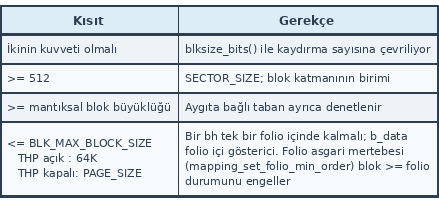

Buradaki mantıksal blok büyüklüğü blok aygıt sürücüsü tarafından blok aygıtındaki en küçük transfer birimi olarak
set edilen değerdir. Bugünkü disklerde bu değer genellikle 512 olan sektör büyüklüğündedir. Örneğin dosya sisteminin
blok uzunluğu 1024 byte ise 4K'lık bir sayfa içerisinde 4 tampon bulunabilmektedir. Ancak örneğin dosya sisteminin
blok büyüklüğü 4K ise sayfa içerisinde tek bir tampon bulunabilmektedir.

Aslında dosya sistemini yazanlar bu tampon büyüklüğünü ``super_block`` okuması gibi işlemlerde önce küçültüp sonra
uygun değere getirebilmektedir. Aşağıdaki tabloda yaygın dosya sistemlerinin kullandığı blok büyüklükleri yani
başka bir deyişle tampon büyüklükleri verilmiştir (tablonun sonuna *simplefs* dosya sistemimizi de ekledik):

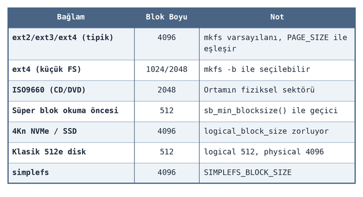

Görüldüğü gibi yaygın dosya sistemlerinde en büyük blok büyüklüğü sayfa büyüklüğü olan 4K'dır. 6.12 ve sonrasında
blokların 4K'dan büyük olabileceğini belirtmiştik.

buffer_head Yapısı
------------------

Tampon önbelleğindeki sayfalar içerisinde bulunan tamponlar ``buffer_head`` yapısıyla temsil edilmektedir. Biz bu
``buffer_head`` yapısıyla dosya sistemini incelerken karşılaşmıştık. Linux çekirdeklerinde ``buffer_head`` yapısının
elemanlarında da zamanla değişiklikler yapılmıştır. Güncel çekirdeklerdeki ``buffer_head`` yapısı
``include/linux/buffer_head.h`` dosyası içerisinde şöyle tanımlanmıştır:

.. code-block:: c

    struct buffer_head {
        unsigned long b_state;              /* buffer state bitmap (see above) */
        struct buffer_head *b_this_page;    /* circular list of page's buffers */
        union {
            struct page *b_page;            /* the page this bh is mapped to */
            struct folio *b_folio;          /* the folio this bh is mapped to */
        };

        sector_t b_blocknr;                 /* start block number */
        size_t b_size;                      /* size of mapping */
        char *b_data;                       /* pointer to data within the page */

        struct block_device *b_bdev;
        bh_end_io_t *b_end_io;              /* I/O completion */
        void *b_private;                    /* reserved for b_end_io */
        struct list_head b_assoc_buffers;   /* associated with another mapping */
        struct address_space *b_assoc_map;  /* mapping this buffer is
                                               associated with */
        atomic_t b_count;                   /* users using this buffer_head */
        spinlock_t b_uptodate_lock;         /* Used by the first bh in a page, to
                                             * serialise IO completion of other
                                             * buffers in the page */
    };

Yapının ``b_state`` elemanı tamponun o anki durumunu belirtmektedir. Yapının anonim birlik elemanına dikkat ediniz:

.. code-block:: c

    union {
        struct page  *b_page;           /* the page this bh is mapped to  */
        struct folio *b_folio;          /* the folio this bh is mapped to */
    };

Burada tamponun içinde bulunduğu sayfanın ya da *folio* nesnesinin adresi tutulmaktadır. 6.12 versiyonuyla birlikte
büyük tamponların sayfalar içerisinde değil bir sayfa grubunu temsil eden *folio*'lar içerisinde bulunduğunu
belirtmiştik. Yapının ``b_blocknr`` elemanı bu tamponun diskteki hangi bloğun bilgilerini tuttuğunu belirtmektedir.
Yapının ``b_size`` elemanı tamponun byte cinsinden büyüklüğünü, ``b_data`` elemanı tampon bilgilerinin başlangıç
adresini tutmaktadır. Yapının ``b_this_page`` elemanı aynı sayfadaki (ya da *folio*'daki) sonraki tamponun yerini
tutan döngüsel bağlı listede düğüm belirtmektedir. Bu bağlı listenin ilk elemanı ``page`` yapısının (``folio``
yapısının ``page`` yapısıyla çakıştırıldığını anımsayınız) ``private`` elemanında tutulmaktadır.

``buffer_head`` yapısının elemanlarının anlamlarını aşağıdaki tabloda düzenli bir biçimde listeliyoruz:

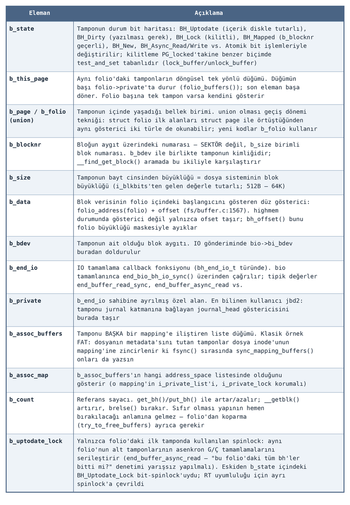

``uffer_head`` nesnesinin durumunu belirten b?state elemanına ilişkin bayraklar da şunlardır:

``buffer_head`` nesnesinin durumunu belirten ``b_state`` elemanına ilişkin bayraklar da şunlardır:

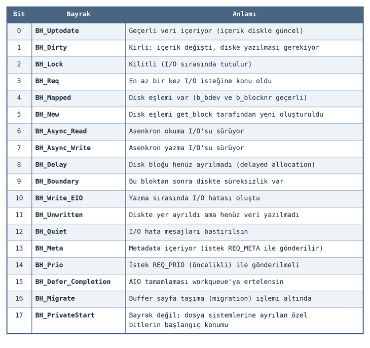

``buffer_head`` nesnelerinin içerisinde tampon içeriğinin bulunmadığına, ``buffer_head`` nesnelerinin tamponu yönetmek
için gerekli bilgileri barındırdığına dikkat ediniz. Tamponlar sayfaların (genel olarak *folio*'ların) içerisindedir.
``buffer_head`` nesneleri ise kendi dilim önbelleğinden (*slab cache*) tahsis edilmektedir. Çekirdekte ``buffer_head``
nesnelerini tahsis etmek için ``bh_cachep`` isimli bir ``kmem_cache`` nesnesi bulunmaktadır:

.. code-block:: c

    /* fs/buffer.c */

    static struct kmem_cache *bh_cachep __read_mostly;

Blok Numarasından Hareketle Bloğa İlişkin Tampon Bilgilerinin Elde Edilmesi
---------------------------------------------------------------------------

*Folio*'ların içerisindeki tamponlara ilişkin ``buffer_head`` nesneleri döngüsel bir bağlı listede tutulmaktadır. Bu
bağlı listenin ilk elemanı da ``page`` yapısının (ya da ``folio`` yapısının) ``private`` elemanı tarafından
gösterilmektedir. Örneğin tamponlar 1024 byte uzunluğunda olsun. Bu durumda bir sayfa içerisinde 4 tampon
bulunacaktır. Bu tamponlara ilişkin ``buffer_head`` nesnelerinin organizasyonu şöyle olacaktır (burada *folio*'ların
bir sayfadan oluştuğunu varsayıyoruz):

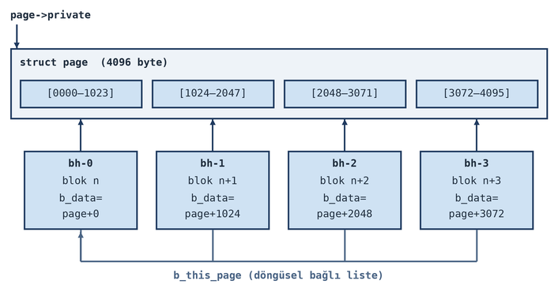

Tabii bir sayfadaki tüm tamponlar dolu olmak zorunda değildir. Ancak buradaki bağlı liste sayfadaki (genel olarak
*folio*'daki) tüm tamponları dolaşmaktadır. Buradaki döngüsel bağlı listeyi şöyle de gösterebiliriz:

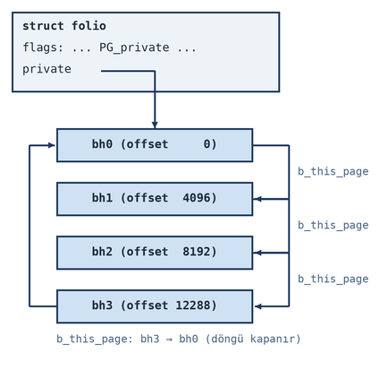

Bir kez daha anımsatmak istiyoruz: Buradaki önbellek blok aygıtı için tahsis edilen ``inode`` nesnesinin
önbelleğidir.

Peki çekirdek belli bir bloğa ilişkin tamponu blok aygıt sürücüsünün ``inode`` önbelleğinde nasıl arayıp
bulabilmektedir? Örneğin dosya sisteminde bir blok 1024 byte uzunluğunda olsun ve biz 1654 numaralı bloğa ilişkin
tamponu önbellekte aramak isteyelim. Anımsanacağı gibi ``inode`` önbelleğinin arama mekanizması sayfa temelinde
yapılmaktadır. İşte çekirdek önce blok numarasından hareketle o bloğun içinde bulunduğu sayfa indeksini, sayfa
indeksinden hareketle de tampona ilişkin ``buffer_head`` nesnesini elde etmektedir. Sayfa indeksinin elde edilmesi
için önce bloğun aygıtın başından itibaren byte *offset*'i elde edilir. Örneğimizde 1654 numaralı bloğun aygıttaki
*offset* numarasını 1654 ile 1024'ü çarparak elde edebiliriz. Çekirdek zaten öteleme miktarını ``inode`` nesnesinin
``i_blkbits`` elemanında tuttuğu için bu işlemi doğrudan ``1654 << i_blkbits`` biçiminde yapmaktadır. Artık 1654
numaralı bloğun aygıtın kaçıncı *offset*'inde olduğunu hesapladık. Şimdi bu *offset*'i sayfa uzunluğuna bölerek
sayfa indeksini elde edebiliriz. Bu işlemleri şöyle genelleştirebiliriz:

.. code-block:: c

    const int blkbits = bd_mapping->host->i_blkbits;    /* = 10 */
    index = ((loff_t)block << blkbits) / PAGE_SIZE;

Örneğimizde bloğun byte *offset*'i ``1654 << 10 = 1693696`` biçimindedir. Bu değeri sayfa uzunluğu olan 4096'ya
bölersek sayfa indeksini 413 olarak elde ederiz. İşte bu 413'üncü sayfa ``inode`` nesnesinin sayfa önbelleğinde
aranacaktır. Biz bu sayfanın bulunduğunu varsayalım. 413'üncü sayfa 1652 ... 1655 numaralı dört tamponu
barındırmaktadır (ilk tampon = 413 * 4 = 1652). Artık bu sayfa (ya da genel *folio*) nesnesinden hareketle ``page``
yapısının ``private`` göstericisi yoluyla sayfa içerisindeki ilk ``buffer_head`` nesnesine erişilir. Erişilmek
istenen tamponun sayfa içerisindeki kaçıncı tampon olduğu zaten hesaplanabilmektedir. Örneğimizde sayfadaki ilk
tampon 1652 olduğuna göre ve biz 1654 numaralı tamponu elde edeceğimize göre bu döngüsel bağlı listede iki kere
ilerleyip tampona ilişkin ``buffer_head`` nesnesine ulaşabiliriz. Tabii tampon verilerine aslında ``buffer_head``
olmadan doğrudan da erişebilir. Ancak çekirdek tamponla ilgili işlemlerde mecburen bu ``buffer_head`` nesnesi
içerisindeki diğer bilgileri kullanmak zorundadır.

Burada bir noktaya bir kez daha dikkatinizi çekmek istiyoruz. ``buffer_head`` nesneleriyle tampon verilerini
birbirine karıştırmayınız. Tampon sayfanın (genel olarak *folio*'nun) içerisindedir. Ancak ``buffer_head`` nesneleri
bunlara ilişkin dilim önbelleğinden tahsis edilmiş olan nesnelerdir. ``buffer_head`` nesnelerine tamponu yönetmek
için mecburen başvurulmaktadır. Neyin nerede olduğunu aşağıdaki tabloyla özetlemek istiyoruz:

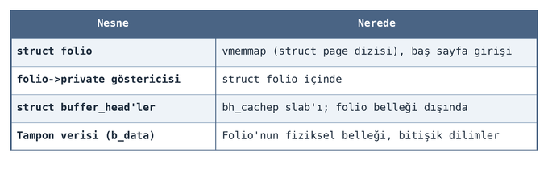

Bu ilişkiyi aşağıdaki şekille de gösterebiliriz:

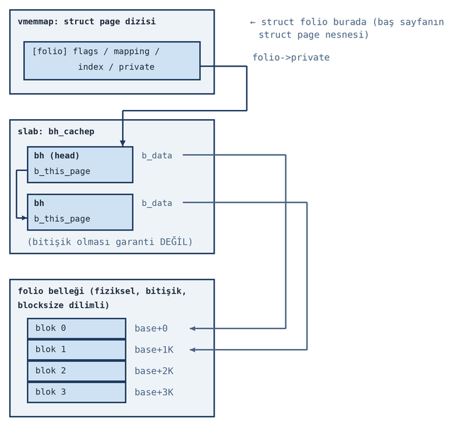

Blok numarasından tampona erişime ilişkin adımları daha düzenli bir biçimde aşağıdaki tabloyla da gösterbiliriz:

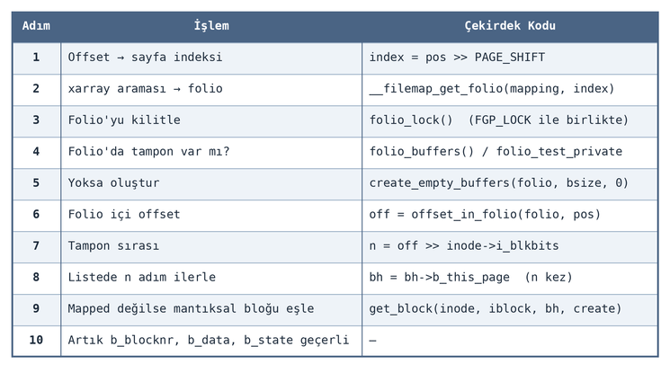

Peki ``buffer_head`` nesneleri ne zaman oluşturulmaktadır? İşte çekirdek tampon önbelleğindeki bir tampona
eriştiğinde eğer o tamponun içinde bulunduğu sayfa için (genel olarak *folio* için) ``buffer_head`` nesneleri
oluşturulmadıysa onlar için ``buffer_head`` nesnelerini oluşturmaktadır. Örneğin tamponların 1024 byte olduğu bir
sistemde ilk kez bir sayfanın tamponuna erişildiğini düşünelim. İşte bu durumda çekirdek o sayfa için gereken 4
tamponu da yaratıp bunları döngüsel olarak bağlı listede tutmaktadır. Tabii bu durumda sayfadaki diğer üç tampon
henüz kullanılmamaktadır. Yani boş durumdadır. Ancak çekirdek yalnızca erişilen tampon için değil sayfanın tüm
tamponları için ``buffer_head`` nesnelerini yaratmaktadır.

Tampon Önbelleğine Erişim Yapan Çekirdek Fonksiyonları
======================================================

Şimdi de tampon önbelleğine erişim yapan çekirdek fonksiyonlarını inceleyelim. ``bdev_getblk`` isimli çekirdek
fonksiyonu bir blok aygıtından tampon önbelleği yoluyla belli bir bloğu elde etmek için kullanılmaktadır.
Fonksiyonun prototipi şöyledir:

.. code-block:: c

    struct buffer_head *bdev_getblk(struct block_device *bdev, sector_t block, unsigned size, gfp_t gfp)

Fonksiyonun birinci parametresi blok aygıtını temsil eden ``block_device`` nesnesinin adresini almaktadır. İkinci
parametresi erişilecek bloğun numarasını belirtmektedir. Üçüncü parametre ise blok büyüklüğünü belirtmektedir. Blok
büyüklüğü aslında anımsanacağı gibi blok aygıtına ilişkin ``inode`` nesnesinin ``i_blkbits`` elemanında da
bulunmaktadır. Ancak bu fonksiyon bu eleman set edilmeden önce de kullanılabilmektedir. Bazen işin başında dosya
sisteminin blok büyüklüğünden bağımsız büyüklükte blokların da okunması gerekebilmektedir. Bu tür durumlar için
fonksiyon ayrıca blok büyüklüğünü de üçüncü parametreyle almaktadır. Son parametre bu işlemler sırasında çağrılacak
``alloc_pages`` gibi, ``kmem_cache_alloc`` gibi tahsisat işlemlerinde kullanılacak bayrakları belirtmektedir.
Örneğin tipik olarak bu bayrak ``GFP_KERNEL | __GFP_MOVABLE`` biçiminde geçilebilir. Fonksiyon başarı durumunda
``buffer_head`` nesnesinin adresine, başarısızlık durumunda ``NULL`` adrese geri dönmektedir. Bu fonksiyon yukarıda
görmüş olduğumuz tüm işlemleri yaparak tampon zaten tahsis edilmişse ona ilişkin ``buffer_head`` nesnesini, tampon
tahsis edilmemişse onu tahsis ederek yarattığı ``buffer_head`` nesnesini bize vermektedir. Fonksiyonun güncel
çekirdeklerdeki sadeleştirilmiş çağrı zinciri şöyledir:

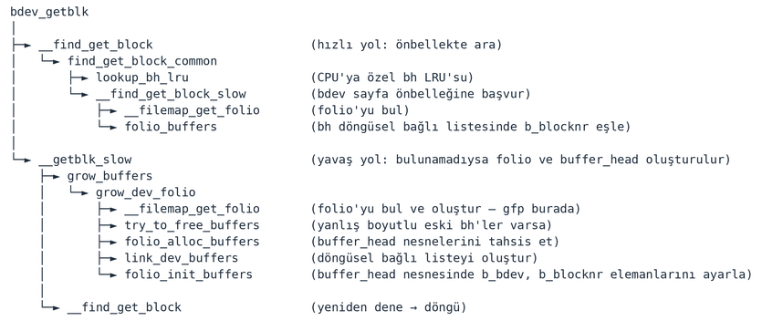

``bdev_getblk`` fonksiyonu aygıt sürücülerin kullanabilmesi için *export* edilmiştir.

Çekirdek içerisinde ``bdev_getblk`` fonksiyonunu çağıran ``__getblk`` isimli bir fonksiyon da bulunmaktadır.
İsminden de anlaşılacağı gibi fonksiyon aygıt sürücüler için *export* edilmemiştir:

.. code-block:: c

    static inline struct buffer_head *__getblk(struct block_device *bdev, sector_t block, unsigned size)

Fonksiyonun ``bdev_getblk`` fonksiyonundan farklı olarak bayrak parametresi almadığına dikkat ediniz. Güncel
çekirdeklerde bu fonksiyon şöyle yazılmıştır:

.. code-block:: c

    static inline struct buffer_head *__getblk(struct block_device *bdev, sector_t block, unsigned size)
    {
        gfp_t gfp;

        gfp = mapping_gfp_constraint(bdev->bd_mapping, ~__GFP_FS);
        gfp |= __GFP_MOVABLE | __GFP_NOFAIL;

        return bdev_getblk(bdev, block, size, gfp);
    }

Görüldüğü gibi bayrak parametresi fonksiyonun içerisinde oluşturulmaktadır. Bu fonksiyon aslında blok aygıtına
ilişkin ``mapping->gfp_mask`` bayraklarını kullanarak blok erişimini yapmaktadır. Yani bayraklar blok aygıtına
ilişkin önbelleğin ``address_space`` nesnesinden elde edilmektedir. Bu fonksiyonun ``sb_getblk`` isimli bir
sarmalayıcısı da vardır:

.. code-block:: c

    static inline struct buffer_head *sb_getblk(struct super_block *sb, sector_t block)
    {
        return __getblk(sb->s_bdev, block, sb->s_blocksize);
    }

Bu fonksiyon ``super_block`` nesnesi yoluyla aynı işlemi yapmaktadır.

Tampon önbelleği üzerinde işlem yapan en yüksek seviyeli fonksiyon ``sb_bread`` fonksiyonudur. Biz bu fonksiyonu
*simplefs* dosya sistemimizi gerçekleştirirken kullanmıştık. Fonksiyonun prototipine dikkat ediniz:

.. code-block:: c

    struct buffer_head *sb_bread(struct super_block *sb, sector_t block);

Bu fonksiyon dosya sistemine ilişkin ``super_block`` nesnesini ve okunacak blok numarasını parametre olarak
almaktadır. Fonksiyonun ikinci parametresindeki tür isminin ``sector_t`` olması kafanızı karıştırmasın. Fonksiyon
sektör numarasını değil blok numarasını parametre olarak almaktadır. ``sb_bread`` fonksiyonu yüksek seviyeli bir
fonksiyondur. ``super_block`` nesnesi içerisindeki ``s_bdev`` elemanından blok aygıtını temsil eden ``block_device``
nesnesini, ``s_blocksize`` elemanından da blok büyüklüğünü elde eder ve işlemlerini ``bdev_getblk`` fonksiyonunu
çağırarak yapar. Fonksiyonun ``buffer_head`` nesnesi ile geri döndüğüne dikkat ediniz. Bu fonksiyon yukarıda
belirttiğimiz tüm işlemleri yapmaktadır. Tabii fonksiyon başarısız da olabilir. Bu durumda ``NULL`` adresle geri
dönmektedir. ``sb_bread`` fonksiyonu aygıt sürücülerin kullanabilmesi için *export* edilmiştir.

Biz *simplefs* dosya sistemimizde bu fonksiyonu çok kullanmıştık. Örneğin boş data bloklarını tutan *bitmap* bloğunu
şu çağrıyla okumuştuk:

.. code-block:: c

    if ((sfs_sb->data_bitmap_bh = sb_bread(sb, SIMPLEFS_DATA_BITMAP_LOCATION)) == NULL) {
        /* ... */
    }

Dolayısıyla *simplefs* dosya sistemimizde aslında biz bloklara *"blok aygıtına ilişkin inode nesnesinin tampon
önbelleği yoluyla"* erişmiştik.

Tamponu yöneten ``buffer_head`` nesnesi içerisinde tamponun kullanım sayacı bulunmaktadır. Bu sayaç tamponu kullanan
fonksiyonlar tarafından zaten artırılmaktadır. ``buffer_head`` nesnesinin kullanımı bittikten sonra onun sayacını
azaltmak için ``brelse`` fonksiyonu çağrılmalıdır. ``brelse`` fonksiyonunun prototipi şöyledir:

.. code-block:: c

    void brelse(struct buffer_head *bh);

Güncel çekirdeklerde bu fonksiyon şöyle tanımlanmıştır:

.. code-block:: c

    static inline void brelse(struct buffer_head *bh)
    {
        if (bh)
            __brelse(bh);
    }

    void __brelse(struct buffer_head *bh)
    {
        if (atomic_read(&bh->b_count)) {
            put_bh(bh);  /* b_count-- */
            return;
        }
        WARN(1, KERN_ERR "VFS: brelse: Trying to free free buffer\n");
    }

Tabii ``buffer_head`` nesneleri sayaç 0'a düştüğünde dilim önbelleğine hemen geri verilmez. *Folio* yaşadığı sürece
sayaç 0'a düşmüş olsa bile bunlar yaşamaya devam eder. Bunların dilim önbelleğine geri verilmesi ancak bellek
baskısı altında sayfa *"geri alımı (page reclaim)"* ile gerçekleşmektedir.

Tampona ilişkin çeşitli bayrakların ``buffer_head`` nesnesinin ``b_state`` elemanında tutulduğunu anımsayınız. İşte
bir tampon kirlendiğinde de ``buffer_head`` nesnesinin ``b_state`` elemanının ``BH_Dirty`` bayrağı
``mark_buffer_dirty`` fonksiyonuyla set edilmektedir:

.. code-block:: c

    void mark_buffer_dirty(struct buffer_head *bh);

Tabii bir tampon kirlendiğinde o tamponun içinde bulunduğu sayfanın da kirli hale getirilmesi gerekir. Geri yazım
sırasında sayfada (genel olarak *folio*'da) tamponlar varsa bu tamponların hepsi değil yalnızca kirli olan tamponlar
geri yazılmaktadır.

Peki biz yukarıdaki fonksiyonları kullanmadan bir blok aygıtını ``open`` fonksiyonuyla açıp onun belli yerinden
``read`` fonksiyonu ile okuma yaptığımızda ne olmaktadır? Tampon önbelleğinin aslında blok aygıtına ilişkin
``inode`` nesnesinin sayfa önbelleğinde organize edildiğini belirtmiştik. İşte blok aygıtına normal bir biçimde
``read`` fonksiyonuyla okuma yapıldığında aslında sayfa önbelleğinde tamponların bulunduğu aynı sayfa üzerinden
okuma gerçekleştirilmektedir. Bu durumu aşağıdaki şekille açıklayabiliriz:

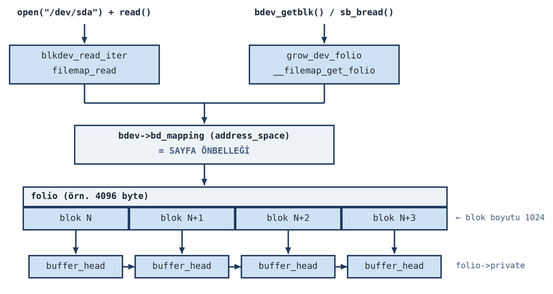

Yani okuma sırasında herhangi bir tampon işleminin yapılmasına gerek yoktur. Çünkü zaten tamponlar sayfaların
(*folio*'ların) içerisindedir. Ancak yazma durumu söz konusu olduğunda mecburen yazılacak yerin bir tampon
içerisinde olup olmadığına da bakılması gerekir. Çünkü ``buffer_head`` nesnesi üzerinde de güncellemeler
yapılmaktadır. Yazma işleminin nasıl yapıldığını da aşağıdaki şekille açıklayabiliriz:

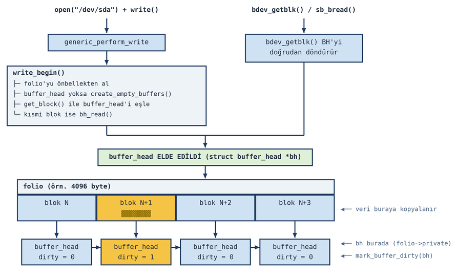

