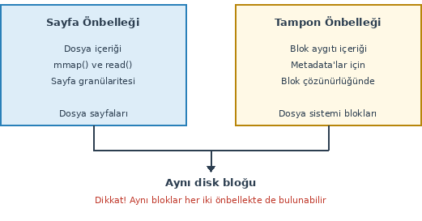
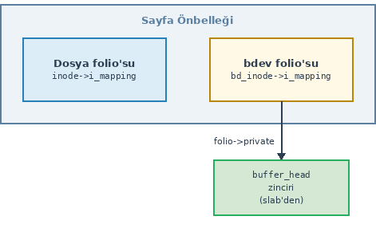
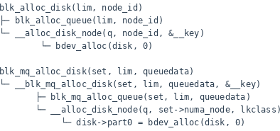
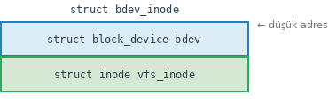

====================
**Tampon Önbelleği**
====================

Bu bölümde eskiden ismine *tampon önbelleği (buffer cache)* denilen önbellek mekanizması 
üzerinde duracağız. Çekirdeğin 2.4 versiyonundan önce sayfa önbelleği ile tampon 
önbelleği ayrı veri yapıları biçiminde organize edilmişti. 2.4 çekirdeği ile birlikte tampon
önbelleği sayfa önbelleğinin içerisine gömüldü ve *tampon önbelleği (buffer cache)* terimi yerine 
*tampon başları (buffer heads)* terimi de kullanılmaya başlandı. Biz kitabımızda bu önbellek 
mekanizması için geleneksel olarak *tampon önbelleği* terimini kullanacağız. 

Çekirdek evrimleştikçe sayfa önbelleği ve tampon önbelleği üzerinde peek çok iyileştirmeler yapılmıştır. 
Biz kitabımızın bu bölümünde güncel çekirdeklerdeki tasarımı ele alıp açıklayacağız. Gelecekte tampon 
mekanizmasının çekirdeğin veri yolundan tamamen çıkartılması da düşünülmektedir. 

Giriş
=====

Sayfa önbelleği bir dosyanın içerisindeki bilgileri önbellekte tutmak için kullanılmaktadır. Linux çekirdeğinde 
dosya içeriğine ilişkin olmayan diskin metadata alanlarını önbelleklemek için kullanılan önbellek 
sistemine *tampon önbelleği* denilmektedir. Yani sayfa önbelleğinin amacı dosyanın içeriklerini önbelleklemekken 
tampon önbelleğinin amacı disk metadata bloklarını önbelleklemektir. 

Biz dosya sistemini ele aldığımız bölümde *simplefs* dosya sistemimizde blokları ``sb_bread`` fonksiyonuyla okumuştuk. 
Bu fonksiyona okuyacağımız blok numarasını vermiştik, fonksiyondan da ``buffer_head`` nesnesi elde etmiştik. 
``sb_bread`` fonksiyonunun prototipi şöyleydi:

.. code-block:: c

    static inline struct buffer_head *sb_bread(struct super_block *sb, sector_t block);

Fonksiyon başarı durumunda bize okunan bloğa ilişkin bir ``buffer_head`` nesnesi veriyordu. Biz o
bölümde okunan blokların aynı zamanda sayfa önbelleğine de yerleştirildiğini söylemiştik. Bu
bölümde bu tamponlama sistemini ele alıp bu sistemin sayfa önbelleğiyle ilişkisi üzerinde
duracağız.

Eskiden çekirdeğin 2.4 versiyonu öncesinde tampon önbelleği ile sayfa önbelleği birbirinden tamamen
ayrıydı. Tampon önbelleği dosya sisteminin bloklarını önbelleklerken, sayfa önbelleği dosya
içeriklerini önbellekliyordu. Bu iki önbellek sisteminin veri yapıları da birbirinden ayrıydı.
2.4 öncesi çekirdeklerdeki bu iki önbellek sistemini aşağıdaki şekille betimleyebiliriz:

Sayfa önbelleği 2.4 öncesinde read-only bir önbellekti. Kirli veri orada durmuyordu, oradan diske
geri yazım da yapılmıyordu. O dönemlerde yazma sahipliği tampon önbelleğindeydi. O dönemlerde bu
iki önbelleğin birbirinden ayrık olmasının yarattığı en önemli sorunlardan biri disk bloğunun her
iki önbellekte de bulunabilmesiydi. Örneğin biz blok okuması yoluyla bir bloğu okumuş olalım. Bu
blok tampon önbelleğine giriyordu. Ancak aynı blok bir dosyanın da parçasıysa aynı zamanda bu blok
sayfa önbelleğinde de bulunuyordu. Tabii bu durumla genellikle karşılaşılmıyordu. Çekirdeğin 2.4
versiyonuyla bu iki önbellek sistemi birleştirildi. Tampon önbelleği sayfa önbelleğinin içine
oturtuldu. 2.4 ve sonrasındaki organizasyonu şekilsel olarak şöyle gösterebiliriz:

Tampon önbelleğinin sayfa önbelleğinin içerisine oturtulmasıyla artık her disk bloğu toplamda tek
bir yerde önbelleklenmektedir. Bu durum hem sistemin ele alınmasını kolaylaştırmış hem de
tutarlılığı artırmıştır.

Blok Aygıtlarına İlişkin Inode Nesneleri
=========================================

Linux çekirdeğinde blok aygıtlarının *blok aygıt sürücüsü (block device driver)* denilen aygıt
sürücüler tarafından yönetildiğini belirtmiştik. İşte bir blok aygıtı kullanıldığı zaman ona
ilişkin bir ``inode`` nesnesi de sistem tarafından yaratılmaktadır. Yani blok aygıtları da birer
dosya gibi ele alınmaktadır. O halde blok aygıtları için de bir sayfa önbelleği bulunmaktadır.
Örneğin sistemimizdeki diski temsil eden ``/dev/sda`` blok aygıtını göz önüne alalım. Bu blok 
aygıtı için çekirdek blok aygıt sürücüsünün ön ayak olmasıyla bir inode nesnesi oluşturmaktadır. Bu blok aygıtındaki 
okumalarda ve yazmalarda bu ``inode`` nesnesinin sayfa önbelleği kullanılmaktadır. Blok aygıtları için oluşturulan ``inode`` 
nesneleri ``bdevfs`` isimli bir dosya sistemi içerisindedir. Bu dosya sistemi ``/proc/filesystems`` içerisinde görünmesine 
karşın mount edilememektedir. 

Blok aygıtları için yaratılan ``inode`` nesneleri kullanıcı tarafından görülmez. Bu ``inode``
nesneleri güncel çekirdeklerde blok aygıtları için ``gendisk`` nesneleri oluşturulurken çağrılan
``blk_alloc_disk`` ya da ``blk_mq_alloc_disk`` fonksiyonlarının çağrı zincirindeki ``bdev_alloc``
fonksiyonunda yaratılmaktadır. Güncel çekirdeklerdeki ``blk_alloc_disk`` ve ``blk_mq_alloc_disk``
fonksiyonlarından ``bdev_alloc`` fonksiyonuna kadar giden çağrı zinciri şöyledir:

Blok aygıt sürücülerine ilişkin çekirdek mimarisi ve fonksiyonları çekirdeğin çeşitli versiyonlarında
defalarca değiştirilmiştir. Biz ``blk_alloc_disk`` ve ``blk_mq_alloc_disk`` fonksiyonlarını aygıt
sürücü mimarilerini konu aldığımız bölümde ele alacağız.

Linux çekirdeklerinde blok aygıtları için en genel yapı ``gendisk`` isimli yapıdır. Biz bu yapıyla
daha önce tanışmıştık. Blok aygıtlarının bilgileri ise ``block_device`` isimli bir yapıyla temsil
edilmektedir. ``gendisk`` nesnesi içerisinde ``block_device`` nesnesinin adresi tutulmaktadır:

.. code-block:: c

    struct gendisk {
        /* ... */
        struct block_device *part0;
        /* ... */
    };

Blok aygıtına ilişkin ``inode`` nesnesinin adresi eskiden doğrudan ``block_device`` nesnesinin
içerisindeki ``bd_inode`` elemanında tutuluyordu:

.. code-block:: c

    struct block_device {
        /* ... */
        struct inode *bd_inode;
        /* ... */
    };

Ancak çekirdeğin 6.9 versiyonundan itibaren artık blok aygıtına ilişkin ``inode`` nesnesinin adresi
``block_device`` nesnesi içerisinde tutulmamaktadır. Bunun yerine artık güncel çekirdeklerde
``block_device`` nesnesi içerisinde doğrudan blok aygıtına ilişkin ``address_space`` nesnesinin
(yani sayfa önbelleğinin) adresi tutulmaktadır:

.. code-block:: c

    struct block_device {
        /* ... */
        struct address_space    *bd_mapping;
        /* ... */
    };

Tabii yeni çekirdeklerde de ``address_space`` nesnesinden hareketle ``inode`` nesnesine
erişilebilmektedir. ``address_space`` yapısının ``host`` elemanının o ``address_space`` nesnesine
ilişkin ``inode`` nesnesinin adresini tuttuğunu anımsayınız. Aslında güncel çekirdeklerde
``block_device`` nesnesi ile bu nesneye ilişkin ``inode`` nesnesi ``bdev_inode`` denilen bir yapıda
alt alta bulundurulmuştur:

.. code-block:: c

    struct bdev_inode {
        struct block_device bdev;
        struct inode vfs_inode;
    };

Bu yerleşimi şekilsel olarak şöyle de gösterebiliriz:

Dolayısıyla aslında eğer elimizde ``block_device`` nesnesinin adresi varsa ``container_of``
işlemiyle yapının ``vfs_inode`` elemanına erişebiliriz. Tabii bunun tersini de yapabiliriz. Güncel
çekirdeklerde ``block/bdev.c`` dosyası içerisinde bu erişimleri yapan inline fonksiyonlar
bulundurulmuştur:

.. code-block:: c

    static inline struct bdev_inode *BDEV_I(struct inode *inode)
    {
        return container_of(inode, struct bdev_inode, vfs_inode);
    }

    static inline struct inode *BD_INODE(struct block_device *bdev)
    {
        return &container_of(bdev, struct bdev_inode, bdev)->vfs_inode;
    }

``gendisk`` nesnesi ve ``block_device`` nesnesi blok aygıt sürücüsü çekirdeğe yüklenirken blok
aygıt sürücülerinin ``init`` fonksiyonları tarafından yaratılmaktadır. Bu konuyu aygıt sürücü
mimarisinin açıklandığı bölümde ele alacağız.
