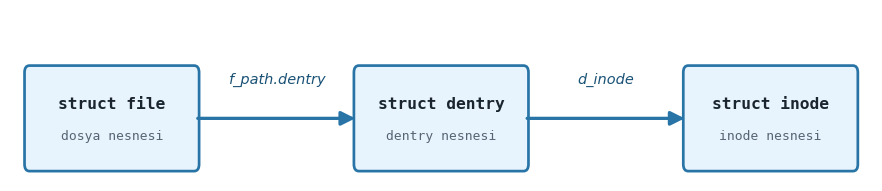
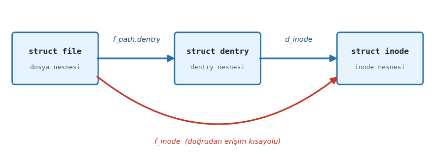

.. _dosya-sistemi-1:

=========================
Dosya Sistemi - I. Bölüm
=========================

Bu bölümde dikkatimizi dosya sistemine illişkin çekirdek veri yapıları üzerine yönelteceğiz. Bilindiği gibi 
UNIX/Linux sistemlerinde pek çok kavram kullanıcıya bir dosya gibi gösterilmektedir. Biz bu birinci bölümde belli bir derinliğe 
kadar çekirdeğin dosya işlemleri için oluşturduğu organizasyon üzerinde duracağız. Daha sonra ikinci bölümde
dosya sistemine ilişkin aşağı seviyeli ayrıntıları ele alacağız.

Giriş
-----

İşletim sistemlerinin *dosya sistemi (file system)* denilen alt sistemlerinin iki tarafı vardır: **Disk tarafı**
ve  **bellek tarafı**. Dosya bilgileri disk üzerindeki bloklarda tutulmaktadır. (Bu bloklara Microsoft dünyasında
*cluster* da denilmektedir.) Hangi dosyaların diskin hangi bloklarında tutulduğu, dosyaların
metadata bilgilerinin diskte nasıl saklandığı gibi belirlemeler dosya sisteminin disk tarafını;
diskteki dosya sisteminin çekirdekteki temsilinin oluşturulması ve işletim sisteminin açılan
dosyalar için yaptığı düzenlemeler ise dosya sisteminin bellek tarafını oluşturmaktadır.

Disk Aktarımına İlişkin Temel Bilgiler
--------------------------------------

Biz kursumuzda "disk" terimini ikinci bellekleri belirten genel bir terim olarak kullanacağız. 
Bir süre önceye kadar disk olarak ağırlıklı biçimde *hard disk* dnilen elektromekanik birimler 
kullanılıyordu. Ancak bir süredir artık disk olarak yarı iletken teknolojiler kullanılarak oluşturulmuş 
*SSD (Solid State Disk)* denilen diskler kullanılmaktadır. Bugün ağırlıklı olarak kullandığımız SSD disklerin 
herhangi bir mekanik parçası yoktur. SSD'ler *NAND Flash* denilen bellek teknolojisini kullanmaktadır. 
SSD'ler hard disklere göre oldukça hızlıdır. Ancak onların en önemli handikapları belli bir yazma ömrünün 
olmasıdır. SSD'lerde aynı bölgeye belli sayıdan daha fazla yazma yapıldığında artık SSD'nin o bölgesi 
bozulabilmektedir. Tabii teknoloji bu bakımdan da ilerleme içerisindedir. SSD teknolojisi ile USB yuvalarına
taktığımız flash belleklerin teknolojisi birbirine benzemektedir.

Sektörler ve Disk Denetleyicisi
~~~~~~~~~~~~~~~~~~~~~~~~~~~~~~~

Kullandığımız disk birimi ister *hard disk* olsun isterse SSD olsun disk ile bilgisayarımızın
RAM'i arasındaki transferler *sektör (sector)* denilen byte blokları düzeyinde yapılmaktadır. Sektör
bir diskten okunabilecek ya da bir diske yazılabilecek en küçük birimdir. Bir sektör tipik olarak
512 byte'tır. Diskte byte düzeyinde erişim yoktur. Sektörel erişim vardır. Örneğin diskteki bir
sektörde bulunan bir byte üzerinde değişiklik ancak şöyle yapılabilmektedir: Önce o byte'ın
içinde bulunduğu sektör RAM'e okunur. Sonra byte RAM üzerinde değiştirilir. Sonra aynı sektör
yeniden diske yazılır.

Diskteki her sektörün ilk sektör 0 olmak üzere bir mantıksal numarası vardır. Hard disklerde
ardışıl numaralı mantıksal sektörler disk üzerinde de fiziksel olarak peşi sıra bulunmaktadır.
Mekanik hard disklerde bilgiler *track* denilen yollara yazılmaktadır. Ardışıl sektörler aynı
track'te bulunurlar. Dolayısıyla hard disklerde diskin kafası bir kez konumlandırıldığında
ardışıl sektörlere daha hızlı okuma yazma yapılabilmektedir. SSD'ler mekanik öğe barındırmadığı
için rastgele erişimlidir. Yani her sektörden okuma aynı hızda yapılmakta ve her sektöre yazma da
aynı hızda yapılmaktadır.

Modern bilgisayar sistemlerinde disk birimine doğrudan erişilmez. Disk erişimlerinde bu işleme
aracılık eden ismine *disk denetleyicisi (disk controller)* denen yerel bir işlemciden
faydalanılmaktadır. Yani sistem programcıları ya da işletim sistemlerini yazanlar disk
denetleyicisini programlar, disk denetleyicisi isteği elektriksel olarak disk birimine iletir,
okuma yazma işlemleri de disk birimi tarafından yapılır:

.. graphviz::

   digraph disk_hierarchy {
       rankdir=TB;
       node [shape=box, style="rounded,filled", fillcolor="#D6E8FA",
             fontname="DejaVu Sans", margin="0.3,0.2"];
       edge [color="#555555"];

       OS         [label="İşletim Sistemi"];
       CPU        [label="CPU / RAM"];
       Controller [label="Disk Denetleyicisi\n(Disk Controller)"];
       Disk       [label="Disk\n(HDD / SSD)", fillcolor="#D5F5D5"];

       OS -> CPU -> Controller -> Disk;
   }

Bugünkü masaüstü bilgisayarlarımızda *SATA* ve *NVMe* en çok kullanılan disk denetleyicileridir.

DMA (Direct Memory Access)
~~~~~~~~~~~~~~~~~~~~~~~~~~

Peki işletim sistemi tarafından disk denetleyicisi "falanca sektörleri oku" ya da "falanca 
sektörlere yaz" biçiminde  programlandıktan sonra aktarım nasıl yapılmaktadır?  Aktarım CPU
tarafından tek tek byte'ların denetleyiciden alınarak RAM'e yerleştirilmesi yoluyla
yapılmamaktadır. (Çok eskiden ilk PC mimarilerinde aktarım böyle de yapılabiliyordu.) Çünkü
CPU'nun bu işle meşgul olması önemli bir zaman kaybı oluşturmaktadır. Bu tür disk ile RAM
arasındaki aktarımlar için *DMA (Direct Memory Access)* denilen yardımcı denetleyiciler
kullanılmaktadır.

Tipik olarak CPU'da çalışan kod (yani işletim sistemi) disk denetleyicisine transfer isteğini
ve aktarımda kullanılacak bellek alanlarının adresini bildirir. Disk denetleyicisi de disk
birimini ve DMA'yı elektriksel düzeyde programlayarak aktarımın DMA üzerinden doğrudan RAM'e
yapılmasını sağlar. Aktarım sırasında artık CPU bu işle meşgul olmaz, işletim sistemi de
CPU'yu başka bir thread'i çalıştırması için *bağlamsal geçişe (task switch)* sokar. Tabii
aktarım işlemi bittiğinde disk denetleyicisi CPU'yu bir donanım kesmesi yoluyla durumdan
haberdar etmektedir.

Yani disk ile RAM arasındaki aktarım işlemleri tipik olarak şöyle yapılmaktadır:

1. İşletim sistemi disk denetleyicisine aktarılacak sektörlere ilişkin bilgileri ve transfer
   adreslerini CPU yoluyla elektriksel olarak iletir.
2. Okuma söz konusuysa disk denetleyicisi disk birimine elektriksel düzeyde komutlar göndererek
   sektörlerin okunmasını ve DMA yoluyla bunların RAM'de uygun yerlere aktarılmasını sağlar.
   Eğer yazma söz konusuysa RAM'de belirtilen adresteki bilgiler yine DMA yoluyla disk birimine
   iletilerek yazma gerçekleştirilir.
3. Aktarım işlemi bittiğinde disk denetleyicisi bir donanım kesmesi yoluyla CPU'yu durumdan
   haberdar eder.
4.  İşletim sistemi aktarım için gereken kodları çalıştırdıktan sonra aktarım bitene kadar meşgul 
    bir döngüde beklemez. Başka thread'ler çalıştırılabiliyorsa *bağlamsal geçiş (context switch)* 
    oluşturarak CPU'nun boş biçimde beklemesinin önüne geçer.

Bu süreci aşağıdaki diyagram özetlemektedir:

.. graphviz::

   digraph dma_flow {
       rankdir=TB;
       graph [splines=ortho, fontname="DejaVu Sans",
              nodesep=0.8, ranksep=0.9];
       node  [shape=box, style="rounded,filled", fontname="DejaVu Sans",
              margin="0.32,0.20", fontsize=11];
       edge  [fontname="DejaVu Sans", fontsize=9, color="#444444"];

       /* IRQ yayını üstten yönlendiren görünmez köprü */
       IRQ_kpr [label="", shape=point, style=invis,
                width=0.01, height=0.01, fixedsize=true];

       /* Üst katman: yazılım zinciri */
       App        [label="Uygulama\nI/O çağrısı",
                   fillcolor="#EEEDFE", color="#534AB7", fontcolor="#3C3489"];
       CPU        [label="OS / CPU\nKesmeyi alır",
                   fillcolor="#EEEDFE", color="#534AB7", fontcolor="#3C3489"];
       Driver     [label="Aygıt Sürücüsü\nKomut hazırlar",
                   fillcolor="#EEEDFE", color="#534AB7", fontcolor="#3C3489"];
       Controller [label="Denetleyici\nIRQ tetikler",
                   fillcolor="#FAEEDA", color="#854F0B", fontcolor="#633806"];

       /* Alt katman: DMA donanımı */
       Memory     [label="Bellek (RAM)\nDMA hedefi",
                   fillcolor="#E1F5EE", color="#0F6E56", fontcolor="#085041"];
       DMA        [label="DMA Motoru\nCPU'dan bağımsız",
                   fillcolor="#E1F5EE", color="#0F6E56", fontcolor="#085041"];
       Disk       [label="Disk Donanımı\nHDD / SSD / FTL",
                   fillcolor="#EAF3DE", color="#3B6D11", fontcolor="#27500A"];

       /* Sıra düzeni */
       { rank=source; IRQ_kpr; }
       { rank=same;   App; CPU; Driver; Controller; }
       { rank=same;   Memory; DMA; Disk; }

       /* 1. Komut zinciri */
       App    -> CPU        [label="read()/write()"];
       CPU    -> Driver     [label="I/O isteği"];
       Driver -> Controller [label="komutu gönder"];

       /* 2. Donanım komutları */
       Controller -> Disk [label="komut gönder"];
       Controller -> DMA  [label="DMA tablo ayarı",
                            style=dashed, color="#888780",
                            fontcolor="#5F5E5A"];

       /* 3. Veri akışı (DMA, CPU katılmadan) */
       Disk -> DMA    [label="veri aktarır",
                        style=dashed, color="#1D9E75", fontcolor="#0F6E56"];
       DMA  -> Memory [label="RAM'e yazar",
                        style=dashed, color="#1D9E75", fontcolor="#0F6E56"];

       /* 4. Kesme — IRQ_kpr üzerinden üstten kıvrılarak CPU'ya */
       Controller -> IRQ_kpr [color="#E24B4A", penwidth=2.0,
                               arrowhead=none, weight=0];
       IRQ_kpr    -> CPU     [color="#E24B4A", penwidth=2.0,
                               label="Transfer tamamlandı → Kesme (IRQ)",
                               fontcolor="#E24B4A", weight=0];
   }

Eskiden Intel tabanlı PC mimarisinde ISA bus kullanıldığı zamanlarda tek bir merkezi DMA
denetleyicisi (Intel 8237) vardı. Ancak daha sonra PCI bus kullanılmaya başlanmasıyla birlikte
artık transfer yapabilen her donanım birimi kendi DMA denetleyicisini de içermeye başladı.
Bugün Intel tabanlı ve Apple Silicon tabanlı bilgisayar mimarilerinde disk denetleyicisi kendi
içerisindeki DMA denetleyicisini programlayarak transferi gerçekleştirmektedir. Disk
denetleyicilerinin programlanması ise artık uzunca bir süredir *bellekten tabanlı IO
(memory-mapped IO)* tekniği ile yapılmaktadır.

Hard disklerde disk birimi içerisinde önbellekler (cache) de bulundurulmaktadır. Böylece disk denetleyicisi aynı 
sektörleri disk biriminden istediği zaman disk birimi eğer ilgili sektörler önbellek içerisindeyse hiç kafa 
hareketleri yapmadan onları doğrudan önbellekten verebilmektedir. Bugünlerde örneğin 1 TB'lık hard disklerde 64MB, 
128, 256 MB civarında önbellekler kullanılmaktadır. Yalnızca hard disklede değil SSD'lerde de bir önbellek sistemi 
vardır. SSD'lerdeki önbellek sistemi özellikle yazma işlemlerinde hız kazancı sağlamakta ve aynı sektörlere sürekli 
yazım yapıldığında o bölgenin *aşınmasını (wearing)* engellemektedir. Tabii bu öönbellek sistemleri tamamen disk 
birimleri tarafından içsel olarak (built-in) işletilmektedir. Bu önbellek sistemleri işletim sistemleri tarafından 
erişilebilir değildir.

Blok Kavramı
~~~~~~~~~~~~

Yukarıda da belirttiğimiz gibi bir disk biriminde transfer edilecek en küçük birime sektör denilmektedir. Bir sektör 
tipik olarak 512 byte uzunluğundadır. Ancak aslında sektör uzunlukları da disk üreticilerine bağlı olarak değişebilmektedir. 
512 byte sektör uzunlukları bugün için standart bir uzunluktur. Tabii zaman geçtikçe diskler büyüdüğü için sektör 
uzunluklarının da büyüyebileceğini söylemek istiyoruz. Nitekim 4K uzunluğunda sektörlere sahip olan diskler özellikle 
büyük sistemlerde gittikçe yaygınlaşmaktadır. Disk birimi her sektöre ilk sektör 0 olmak üzere mantıksal bir numara 
vermektedir. Yani adeta disk üzerindeki her sektörün bir adresi vardır. Disk denetleyicisi disk birimine transfer 
edilecek sektörlerin numaralarını elektriksel düzeyde iletmektedir. (Bu biçimde mantıksal sektör numaraları kullanılmadan 
önce 80'lerde ve 90'ların ilk yarısında sektörlerin yerleri "fiziksel koordinat sistemi" denilen "hangi yüz (head)", 
"hangi track", "hangi sektör dilimi" biçiminde üç parametreyle belirtiliyordu.)

Sektör kavramı aslında dosya sistemleri için küçük bir depolama birimidir. İşletim sistemleri
bir dosyanın parçası olabilecek en küçük disk alanı için sektör yerine *blok (block)* ya da
*cluster* denilen daha büyük birimleri kullanmaktadır. Blok terimi daha çok UNIX/Linux
sistemlerinde kullanılmaktadır. Microsoft ise blok yerine *cluster* terimini kullanmaktadır.
Bir blok ardışıl n tane sektörden oluşmaktadır. Uygulamada bu n değeri 2'nin bir kuvveti olur. Ardışıllık hard disklerde 
önemli bir unsurdur. Çünkü hard disklerde en önemli zaman kaybı mekanik bir birim olan disk kafasının track hizasına 
çekilmesinde yaşanmaktadır. Disk kafası track hizasına çekildiğinde disk dönerken artık ardışıl sektörler hiç kafa 
hareketi yapılmadan okunup yazılabilmektedir. Peki neden işletim sistemi dosyalar söz konusu olduğunda bir dosyanın 
parçası olabilecek en küçük birim için sektör değil de ardışıl n tane sektör kullanmaktadır? İşte bunun birkaç nedeni 
vardır:

1. Dosyaların parçaları disk üzerinde ardışıl yerlerde olmak zorunda değildir. Eğer dosyalar
   çok fazla parçadan oluşursa hard disklerde (ve kısmen de olsa SSD'lerde de) bu parçalar disk
   üzerinde daha fazla yayılmış olur, bunlara erişmek için gereken zaman artar.

2. Eğer dosyanın parçaları sektör gibi küçük birimlerden oluşsaydı bu parçaların diskteki
   yerlerine ilişkin metadata tabloları büyürdü. Bu da hem disk alanını hem de işletim sisteminin
   bellekte yaptığı düzenlemede alan verimsizliği oluştururdu.

3. CPU'ların kullandığı sayfalama mekanizmasında genellikle 4K uzunluklar kullanılmaktadır.
   Dosya parçalarının 4K uzunluğun katlarında olması dosya sistemi ile sayfalama sistemi arasında
   daha iyi bir uyumun ortaya çıkmasına yol açmaktadır.

Peki bu durumda işletim sistemleri blok denilen dosyanın parçası olabilecek en küçük birim için hangi uzunluğu 
kullanmaktadır? İşte genellikle bu karar disk formatlanırken diskin (disk bölümünün) büyüklüğüne bakılarak verilmektedir. 
Dosyaların son bloklarında kalan kullanılmayan alanların oluşmasına *içsel bölünme (internal fragmentation)* 
denilmektedir. Küçük disklerde (disk bölümlerinde) içsel bölünmenin etkisi daha büyük olacağından blokların 1K gibi 
küçük uzunluklarda alınması uygun olabilir. Ancak orta büyüklükte disklerde içsel bölünmenin etkisi göreli olarak 
azalacağı için bloklar 4k gibi bir değerde seçilebilmektedir. Büyük disklerde ise 8K, 16K blok büyüklükleri tercih 
edilmektedir. Aslında blok büyüklükleri ilgili disk bölümü formatlanırken (Linux sistemlerinde ``mkfs.xxx`` programlarıyla 
formatlama yapılmaktadır) belirlenmektedir. Yani kullanıcı isterse kendisi bu programda kendi tercih ettiği blok 
uzunluğunu kullanabilir. Ancak kullanıcılar genellikle böyle bir belirleme yapmazlar. Bu durumda bu programlar disk 
bölümünün büyüklüğüne bağlı olarak yukarıda açıkladığımız gibi uygun bir blok büyüklüğünü seçerler.

UNIX/Linux sistemlerinde dosya sistemi için tek bir kök vardır. Blok aygıtları (örneğin hard
diskler, flash bellekler vb.) belli bir dizine mount edilmektedir. Mount işlemi bir dizin üzerine
uygulanır; mount işlemi sonucunda o dizinin içeriği görünmez, artık mount edilen dosya sisteminin
kök dizini mount dizininde gözükür. Dolayısıyla bu sistemlerde farklı dizinler farklı blok
büyüklüklerine ilişkin dosya sistemlerinin içerisinde olabilmektedir.

Anımsanacağı gibi ``stat`` POSIX fonksiyonu ya da komut satırından uygulanan *stat* komutu belli
bir dosyanın bilgilerini verirken o dosyanın içinde bulunduğu dosya sisteminin blok uzunluğunu
da vermektedir. Linux sistemlerinde bu bilgi doğrudan dosya sistemine ilişkin blok aygıtı
üzerinde ``dumpe2fs`` programıyla da elde edilebilmektedir.

Windows sistemlerinde de *cluster* adı altında blok sistemi kullanılmaktadır. O sistemlerde blok
uzunluklarını *chkdsk* programı ile ya da *fsutil* programı ile komut satırından elde
edebilirsiniz.

İşletim sistemleri işlemlerini kolaylaştırmak için her bloğa bir numara da vermektedir. Örneğin
bir bloğun 4K (tipik olarak 8 sektör) olduğunu düşünelim. İşletim sistemi için ilgili disk (aslında
disk bölümü ya da genel olarak blok aygıtı da diyebiliriz) bloklardan oluşmaktadır. Örneğin
diskin (disk bölümünün) ilk 8 sektörü artık 0'ıncı bloktur. Sonraki 8 sektör 1'inci bloktur.

İşletim sistemi içsel olarak artık ilgili diski bloklardan oluşan ve her bloğun bir numarasının
olduğu mantıksal bir depolama alanı gibi ele almaktadır. Yani işletim sistemi için yalnızca
sektörlerin değil aynı zamanda dosya sistemine ilişkin blokların da numaraları vardır.

Sayfa Önbelleği (Page Cache)
~~~~~~~~~~~~~~~~~~~~~~~~~~~~

İşletim sistemleri son okunan ya da yazılan disk bloklarını RAM'de bir önbellek sisteminde
saklamaktadır. Bu önbellek sistemine genel olarak *işletim sisteminin disk önbellek sistemi*
denilmektedir. Linux dünyasında eskiden bu önbellek sistemine *buffer cache* deniliyordu. Sonra
bu önbellek sistemi iyileştirildi ve ismi *page cache* olarak değiştirildi.

İşletim sistemlerinin bu disk önbellek sistemleri disk erişimini ciddi boyutta azaltmakta ve
sistem performansı üzerinde en önemli olumlu etkilerden birini oluşturmaktadır. Eğer işletim
sistemlerinde böyle bir disk önbellek sistemi olmasaydı sistemler çok yavaş çalışırdı.

Dosyalardan Okuma ve Yazma İşlemleri
----------------------------------------------

Biz UNIX/Linux sistemlerinde bir dosyadan okuma yapmak için ya da bir dosyaya yazma yapmak için
``read``/``write`` POSIX fonksiyonlarını kullanmış olalım. Bu fonksiyonlar çekirdek içerisindeki
``sys_read`` ve ``sys_write`` sistem fonksiyonlarını çalıştırmaktadır.

İşletim sistemi bellek tarafında yaptığı organizasyonla okunacak ya da yazılacak bilginin ilgili
blok aygıtının (disk bölümünün) kaç numaralı bloğuna ve sektörüne ilişkin olduğunu
belirleyebilmektedir. Ancak ``sys_read`` ve ``sys_write`` gibi sistem fonksiyonları hemen diske
yönelmez. Bu fonksiyonlar önce dosyanın ilgili bölümünün RAM'de oluşturulmuş bir sayfa önbelleği
(*page cache*) içerisinde olup olmadığına bakmaktadır. Eğer ilgili bölüm bu önbellek sisteminin
içerisinde varsa bu fonksiyonlar diske hiç erişmeden dolayısıyla da hiç bloke olmadan bu okuma
yazma işlemini gerçekleştirmektedir.

``read``/``write`` POSIX fonksiyonları çağrıldığında yapılan işlemler aşağıdaki diyagramda
özetlenmiştir:

.. graphviz::

   digraph rw_flow {
       rankdir=TB;
       node [shape=box, style="rounded,filled", fillcolor="#D6E8FA",
             fontname="DejaVu Sans", margin="0.3,0.2"];
       edge [fontname="DejaVu Sans", fontsize=9, color="#444444"];

       POSIX  [label="read / write POSIX Fonksiyonları"];
       Sys    [label="sys_read / sys_write"];
       Check  [label="Page Cache'te bilgi var?",
               shape=diamond, fillcolor="#FFF3CD"];
       Copy   [label="Veriyi kopyala\n(disk erişimi yok)", fillcolor="#D5F5D5"];
       DiskIO [label="Gerçek disk I/O başlat\n(okuma / yazma)"];
       Update [label="Page Cache güncellenir", fillcolor="#D5F5D5"];

       POSIX  -> Sys    [label="Çekirdek Moduna Geçiş",
                         fontsize=13, fontcolor="#1a5fa8"];
       Sys    -> Check;
       Check  -> Copy   [label="Evet"];
       Check  -> DiskIO [label="Hayır"];
       DiskIO -> Update;
   }

Peki dosyadaki okunacak ya da yazılacak kısım sayfa önbelleğinde (*page cache*) yoksa gerçek
transfer nasıl yapılmaktadır? Linux sistemlerinde bu transferlerin yapıldığı birime *blok aygıt
sürücüleri (block device drivers)* denilmektedir.

Bir Linux sistemi kurulduğunda zaten temel disk denetleyicileri üzerinden transfer yapabilen blok
aygıt sürücüleri çekirdeğin içerisine gömülmüş durumda olur. Ancak sistem programcısının kendisi
de blok aygıt sürücüleri yazabilir. Örneğin bir gömülü Linux sisteminde yeni bir SD kart birimi
için bir blok aygıt sürücüsü yazmak zorunda kalabilirsiniz.

İşletim sistemi bu IO isteklerini hemen blok aygıt sürücüsüne göndermez. Çünkü çok sayıda
farklı proses aynı disk sektörlerini okuyacak ya da o sektörlere yazacak olabilir. İşletim
sistemi önce istekleri sıraya dizer, mümkünse birleştirir, bu biçimdeki iyileştirme işleminden
sonra istekleri blok aygıt sürücüsüne gönderir. Bu sürece *IO çizelgelemesi (IO scheduling)*
denilmektedir.

O halde bir dosya okuması ya da yazması sonucunda gelişen olayları şöyle özetleyebiliriz:

1. Kullanıcı modunda çalışan program (yani proses) ``read`` ya da ``write`` POSIX fonksiyonlarını
   çağırır. (UNIX/Linux sistemlerindeki C derleyicilerinin standart dosya fonksiyonları da eğer
   okunacak ya da yazılacak kısım kendi tamponlarında yoksa zaten bu POSIX fonksiyonlarını
   çağırmaktadır.)

2. ``read`` ve ``write`` POSIX fonksiyonları Linux'ta ``sys_read`` ve ``sys_write`` isimli sistem
   fonksiyonlarını çağırır. Artık akış kullanıcı modundan (user mode) çekirdek moduna (kernel
   mode) geçmiştir.

3. ``sys_read`` ve ``sys_write`` fonksiyonları önce okunacak ya da yazılacak yerin Linux'un disk
   önbellek sistemi olan sayfa önbelleğinde (*page cache*, eski ismiyle *buffer cache*) olup
   olmadığına bakar. Eğer ilgili disk blokları sayfa önbelleğinde varsa akış hiç bloke olmadan
   sayfa önbelleği içerisinden karşılanır. Aksi hâlde Linux çekirdeği isteği *IO çizelgeleyicisi
   (IO scheduler)* denilen çekirdek birimine iletir; ``read``/``write`` çağrısını yapan thread
   bloke edilir.

4. IO çizelgeleyicisi istekleri çizelgeler. Okuma işlemi söz konusuysa sayfa önbelleğinde
   transfer edilecek önbellek bloklarını tahsis eder. Yazma işlemi söz konusuysa diske transfer
   edilecek önbellek bloklarını belirler. Blok aygıt sürücüsüne transfer edilecek sektörleri ve
   transfere ilişkin bellek adreslerini iletir.

5. Gerçek transfer işlemi blok aygıt sürücüsü tarafından yapılmaktadır. İşletim sistemi blok
   aygıt sürücüsüne hangi sektörlerin sayfa önbelleğindeki hangi adreslere (ya da tersi yönde)
   transfer edileceğini bir kuyruk sistemi yardımıyla iletmektedir.

6. Blok aygıt sürücüsü diskten istenen sektörleri sayfa önbelleği içerisinde belirtilen adrese
   ya da sayfa önbelleğindeki bilgileri diskin belirtilen sektörlerine transfer eder.

7. Artık okuma söz konusuysa okunan bilgi sayfa önbelleği içerisindedir. İşlemi başlatan
   thread'in blokesi çözülür. ``sys_read`` sistem fonksiyonu bunu sayfa önbelleği içerisinden
   programcının kullanıcı modundaki adresine kopyalar.

Tabii bugün kullandığımız Linux sistemlerinde aslında disk transflerini yapan blok aygıt sürücüleri zaten çekirdek 
imajı içerisine gömülmüş bir biçimde bulunmaktadır. Ancak nadiren de olsa sistem programcısının yeni birtakım aygıtlar 
için blok aygıt sürücüleri yazması gerekebilmektedir.

Yukarıda maddeler halinde açıkladığımız süreci bir şekille de özetleyebiliriz:

.. graphviz::

   digraph io_pipeline {
       rankdir=TB;
       node [shape=box, style="rounded,filled", fillcolor="#D6E8FA",
             fontname="DejaVu Sans", margin="0.3,0.18", width=4];
       edge [fontname="DejaVu Sans", fontsize=9, color="#444444"];

       S1 [label="1) Program read() / write() çağırır\n(veya stdio tamponları doluysa/boşaldıysa)"];
       S2 [label="2) POSIX → sys_read / sys_write\nUser Mode ➜ Kernel Mode"];
       S3 [label="3) Page Cache kontrolü:\n· Varsa → bloke olmaz, bellekten oku/yaz\n· Yoksa → adım 4'e geç"];
       S4 [label="4) I/O çizelgeleyicisine gönderilir\nThread bloke edilir"];
       S5 [label="5) I/O Çizelgeleyicisi\n· Page Cache'te yer ayırır\n· Blok aygıt sürücüsüne iletir"];
       S6 [label="6) Blok aygıt sürücüsü\n· Sektörleri belirler\n· Page Cache adresleriyle eşleştirir\n· İsteği donanıma iletir"];
       S7 [label="7) Gerçek transfer (donanım)\n· Tamamlanınca kesme gönderilir\n· Veri artık page cache'tedir\n· Thread'in blokesi çözülür",
           fillcolor="#D5F5D5"];
       S8 [label="8) Kernel Mode → User Mode\n· Okuma: veri kullanıcıya kopyalanır\n· Yazma: geri dönüş yapılır",
           fillcolor="#D5F5D5"];

       S1 -> S2 -> S3 -> S4 -> S5 -> S6 -> S7 -> S8;
   }

Linux sistemlerinde yukarıda özetlediğimiz olaylar silsilesi zaman içerisinde değişikliklere
uğratılarak ve sürekli geliştirilerek bugünkü durumuna getirilmiştir.

Yazma İşleminin Ayrıntıları
~~~~~~~~~~~~~~~~~~~~~~~~~~~

Buradaki süreçte yazma olayı söz konusu olduğunda bazı ayrıntılar da devreye girmektedir.
Kullanıcı modundaki program ``write`` POSIX fonksiyonunu çağırıp bu fonksiyon da ``sys_write``
fonksiyonunu çağırdığında bu sistem fonksiyonu yazılmak istenen bilgiler diske yazılana kadar
``write`` işlemini yapan thread'i bloke etmez. Yazma işlemi her zaman Linux'un RAM'deki sayfa
önbelleğine yapılmaktadır. ``sys_write`` fonksiyonu yazmayı sayfa önbelleği içerisine yaptıktan
sonra hemen "başarılı" olarak geri dönmektedir.

Sistem programlama terminolojisinde IO işlemlerinde *senkron* terimi "fonksiyon geri döndüğünde
tüm işlemlerin yapılıp bitmiş olması" anlamına gelmektedir. *Asenkron* terimi ise "işlemin
başlatılması, fonksiyonun geri dönmesi ancak işlemin aslında arka planda devam etmesi" anlamına
gelmektedir. Görüldüğü gibi modern işletim sistemlerinde diske yazma işlemi aslında disk 
bağlamında *senkron* bir işlem değildir.

Ancak bunun bir istisnası vardır. Eğer bir dosya ``O_DSYNC`` ya da ``O_SYNC`` bayraklarıyla
açılmışsa o dosyaya yapılan yazma işlemleri aygıta aktarılana kadar thread ``write`` fonksiyonunda
bloke edilmektedir. Yani bu bayraklar yazma işlemlerinin senkron yapılmasını sağlamaktadır.

Gecikmeli Yazım ve Flush Thread'leri
~~~~~~~~~~~~~~~~~~~~~~~~~~~~~~~~~~~~~

Peki yazma işleminde sayfa önbelleğine yazılan bilgiler çekirdek tarafından ne zaman gerçek
aygıta aktarılmaktadır? İşte işletim sistemleri bu tür durumlarda kasten araya belli bir gecikme
koymaktadır. Böylece peşi sıra yapılan ``write`` işlemlerinin tek tek gereksiz biçimde aygıta
aktarılması engellenir, bunlar biriktirilerek ve çizelgelenerek blok aygıt sürücüsüne aktarılır.
Bu biçimdeki aktarmaya *gecikmeli yazım (delayed write)* da denilmektedir.

Buradaki süreci aşağıdaki şekille özetleyebiliriz:

.. graphviz::

   digraph delayed_write {
       rankdir=LR;
       node [shape=box, style="rounded,filled", fillcolor="#D6E8FA",
             fontname="DejaVu Sans", margin="0.25,0.18"];
       edge [fontname="DejaVu Sans", fontsize=9, color="#444444"];

       write   [label="write()\nKullanıcı Modu"];
       sysw    [label="sys_write()\nÇekirdek Modu"];
       cache   [label="Page Cache'e kopyala\n(sayfa \"dirty\" olarak işaretlenir)",
                fillcolor="#FFF3CD"];
       ret     [label="Geri dönüş\n(User Mode)", fillcolor="#D5F5D5"];
       flush   [label="Flusher Thread\n(Asenkron)", fillcolor="#F8D7DA"];
       sched   [label="I/O Çizelgeleyici"];
       driver  [label="Blok Aygıt\nSürücüsü"];
       ctrl    [label="Disk\nDenetleyicisi"];
       disk    [label="Disk\nDonanımı", fillcolor="#D5F5D5"];

       write  -> sysw  -> cache -> ret;
       cache  -> flush [style=dashed, label="zaman geçince"];
       flush  -> sched -> driver -> ctrl -> disk;
   }

Peki işletim sistemi transfer işlemlerini ne kadar süre bekletmektedir? Eğer transfer çok uzun süre bekletilirse 
elektrik kesilmesi gibi durumlarda kayıplar fazlalaşır. İşte modern işletim sistemlerinde kirlenmiş sayfaların 
*flush* edilmesi *çekirdek thread'leri (kernel threads)* tarafından yapılmaktadır. Örneğin Linux sistemlerinde 
bu işlemlerden *flush* isimli çekirdek thread'leri sorumludur. Eskiden Linux çekirdeklerinin 2.6.32 versiyonuna 
kadar bu işşlemler *pdflush* isimli tek bir çekirdek thread tarafından yapılıyordu. Bu versiyondan sonra
artık her blok aygıt sürücüsü için ayrı bir flush thread'i oluşturulmaya başlandı. Bu thread'leri komut satırında 
şöyle görüntüleyebilirsiniz:

.. code-block:: bash

   $ ps -aux | grep flush

flush thread'leri arka planda sürekli olarak sayfa önbelleğini izler. Orada *kirlenmiş (dirty)*
olan sektörleri ilgili blok aygıt sürücüsüne gönderir. Peki bu işleyişte yazma gecikmesi takriben kaç saniye 
civarında olmaktadır? Aslında bu gecikme süresi başka faktörlere de bağlı olarak değişebilmektedir Burada fikir 
vermek amacıyla modern Linux sistemleri için bu sürenin ortalama 5 saniye civarında olduğunu söyleyebiliriz. 
Ancak bu değerler de değiştirilebilmektedir. flush thread'lerinin parametreleri hakkında aşağıda tabloda özet bir 
bilgi veriyoruz:

.. rst-class:: centered-headers

.. list-table::
   :header-rows: 1
   :widths: 28 18 60

   * - Parametre
     - Varsayılan Değer
     - Anlamı
   * - ``dirty_writeback_centisecs``
     - 500
     - Flusher thread'in periyodik olarak çalıştığı aralık (santi saniye
       cinsinden). 500 cs = 5 saniye. Bu aralıkta çekirdek *dirty* sayfaları
       kontrol eder.
   * - ``dirty_expire_centisecs``
     - 3000
     - Bir *dirty* sayfa en fazla bu kadar süre (santi saniye cinsinden)
       RAM'de kalabilir. 3000 cs = 30 saniye sonra *süresi dolmuş* sayılır
       ve flush edilir.
   * - ``dirty_ratio`` / ``dirty_background_ratio``
     - %20 / %10 civarı
     - RAM'in ne kadarı *dirty* sayfalarla dolarsa flush işleminin
       başlatılacağını belirler (bellek baskısı durumunda
       zaman beklenmez).
       
Bu değerler proc dosya sisteminden görüntülenebilmektedir:

.. code-block:: bash

   $ cat /proc/sys/vm/dirty_writeback_centisecs
   $ cat /proc/sys/vm/dirty_expire_centisecs

*sysctl* komutu ile de bu değerler değiştirilebilmektedir:

.. code-block:: bash

   $ sudo sysctl -w vm.dirty_writeback_centisecs=100

*sysctl* komutu zaten kendi içerisinde ``/proc/sys`` dizinindeki dosyalar üzerinde güncelleme
işlemleri yapmaktadır.

flush thread'lerinin çalışması daha ayrıntılı olarak *sayfa önbelleği (page cache)* konusunun
ele alındığı bölümde açıklanacaktır.

Gecikmeli Yazımın Gerekçeleri
~~~~~~~~~~~~~~~~~~~~~~~~~~~~~~

*Gecikmeli yazım (delayed write)* işleminin gerekçeleri nelerdir? En önemli gerekçe peşi sıra
yapılan yazma işlemlerinin tek hamlede aygıta yansıtılmasıdır. Bu sayede yazma işlemini yapan
thread bloke olmaz ve toplamda bu işlemler paralel yürütüldüğü için sistem performansı yükselir.
Aynı zamanda flash belleklerde ve SSD'lerde bu gecikme sürekli yazım sonucunda oluşan belleğin
aşınmasını (wearing) da kısmen engellemektedir. (Aslında bu "eskime" sorunu asıl olarak flash
belleklerdeki ve SSD içerisindeki önbellekler ve *FTL (Flash Translation Layer)* sayesinde 
azaltılmaktadır.)

Kirlenmiş Sayfaların Erken Flush Edilmesi
~~~~~~~~~~~~~~~~~~~~~~~~~~~~~~~~~~~~~~~~~

Sayfa önbelleğinde kirlenen sayfalar bazı durumlarda işletim sisteminin *tazeleyici (flusher)*
thread'lerini beklemeden de diske aktarılabilmektedir. Örneğin bir dosya kapatıldığında artık
bu işlem arka planda dosyanın kirlenmiş sayfalarının da diske yazılmasına yol açmaktadır.

UNIX/Linux sistemlerinin çoğunda bazı özel sistem fonksiyonları yoluyla ya da ``open``
fonksiyonundaki bayraklarla da bu duruma müdahale edilebilmektedir.

``sync`` POSIX fonksiyonu çağrıldığında o anda dosya sistemine ilişkin *kirlenmiş (dirty olan)*
sayfaların hepsi flush edilmektedir:

.. code-block:: c

   #include <unistd.h>

   void sync(void);

``sync`` fonksiyonu *asenkron (asynchronous)* biçimde çalışmaktadır. Yani fonksiyon geri döndüğünde tüm blokların
flush edilmiş olma garantisi yoktur. Aynı zamanda Linux sistemlerde *sync* isimli bir kabuk komutu
da bulunmaktadır. Bu komut ``sync`` fonksiyonunu çağırmaktadır.

``fsync`` POSIX fonksiyonu ise belli bir dosyaya ilişkin kirlenmiş sayfaların flush edilmesi için
kullanılmaktadır:

.. code-block:: c

   #include <unistd.h>

   int fsync(int fildes);

``fsync`` fonksiyonu *senkron (synchronous)* çalışmaktadır. Yani fonksiyon geri döndüğünde sayfa
önbelleğindeki kirlenmiş sayfaların flush edilmiş olması garanti edilmektedir.

Bir dosya açılırken ``open`` POSIX fonksiyonunda kullanılan konuyla ilgili üç bayrak vardır:

``O_DSYNC`` **Bayrağı**
   Bu bayrak POSIX'in *"Base Definitions"* bölümündeki *"Synchronized I/O Data Integrity Completion"*
   başlığında açıklanan yazma koşullarının sağlanacağını belirtmektedir. Bu bayrak kullanıldığında
   aşağıdaki iki durumun çekirdek tarafından sağlanması garanti edilmektedir:

   - Dosyaya yazdırılan bilgilerin ``write`` fonksiyonu geri döndüğünde hedefe transfer edilmiş
     olması.
   - Yazılan bilginin dosyadan okunabilmesi için gereken metadata bilgilerinin hedefe transfer
     edilmiş olması. (Tüm metadata bilgilerinin hedefe transfer edilmiş olması gerekmemektedir.)

``O_SYNC`` **Bayrağı**
   Bu bayrak POSIX'in *"Base Definitions"* bölümündeki *"Synchronized I/O File Integrity Completion"*
   başlığında açıklanan koşulların sağlanacağını belirtmektedir. ``O_SYNC`` bayrağı ``O_DSYNC``
   bayrağını kapsamaktadır. Fakat bu bayrak ``write`` fonksiyonu geri dönmeden önce tüm metadata
   bilgilerinin hedefe transfer edilmiş olmasını zorunlu tutmaktadır.

``O_RSYNC`` **Bayrağı**
   Bu okuma işlemi ile ilgilidir. Tek başına değil ``O_DSYNC`` ya da ``O_SYNC`` bayraklarıyla
   birlikte kullanılır. Eğer ``O_RSYNC`` bayrağı ``O_DSYNC`` bayrağı ile birlikte kullanılırsa
   ``read`` işlemini etkileyecek olan daha önce yapılmış ``write`` işlemleri varsa ``read``
   fonksiyonu geri dönmeden önce bu ``write`` işlemleri için ``O_DSYNC`` bayrağında belirtilen
   semantik uygulanmaktadır. Eğer bu bayrak ``O_SYNC`` ile birlikte kullanılırsa ``read`` işlemini
   etkileyecek olan daha önce yapılmış ``write`` işlemleri varsa ``read`` fonksiyonu geri dönmeden
   önce bu ``write`` işlemleri için ``O_SYNC`` bayrağında belirtilen semantik uygulanmaktadır.

Standart C Kütüphanesinin Süreçteki Yeri ve İşlevi
~~~~~~~~~~~~~~~~~~~~~~~~~~~~~~~~~~~~~~~~~~~~~~~~~~

Peki C'nin standart dosya fonksiyonları bu süreçte nerede yer almaktadır? C'nin dosya fonksiyonları
aslında neticede POSIX fonksiyonlarını çağırmaktadır. Ancak C'nin standart dosya fonksiyonları
işletim sisteminin okuma yazma fonksiyonlarını daha az çağırmak için *kullanıcı alanında (user
space)* her dosya için bir önbellek de oluşturmaktadır. Bu önbellek sistemine genellikle önbellek
yerine *tamponlama (buffering)* sistemi, burada kullanılan önbelleğe de *tampon (buffer)*
denilmektedir.

Örneğin Linux'ta biz C'nin ``getc`` gibi dosya fonksiyonunu çağırmış olalım. Standart C
kütüphanesi ``fgetc`` ile 1 byte okumak istediğimizde ``read`` POSIX fonksiyonu ile 1 byte
okumamaktadır. ``fgetc`` fonksiyonu ``read`` POSIX fonksiyonu ile ``<stdio.h>`` dosyasında belirtilen 
``BUFSIZ`` kadar byte'ı bir tampona okumakta ve oradan 1 byte'ı programcıya vermektedir.  Böylece sonradan 
okunanacak byte'lar için hiç read fonksiyonu çağrılmayacak ve istek hemen bu tampondan karşılanacaktır. Aynı 
durum yazma için de söz konusudur. Bu nedenle C'nin standart dosya fonksiyonlarına *tamponlı IO (buffered IO)* 
fonksiyonları da denilmektedir. Buradaki önbellek sisteminin POSIX fonksiyonlarını dolayısıyla da sistem 
fonksiyonlarını daha az çağırmak için oluşturulduğuna dikkat ediniz. O hâlde C'nin standart dosya fonksiyonlarıyla 
yapılan tipik bir okuma işlemi şöyle gerçekleşmektedir:

.. graphviz::

   digraph read_chain {
       rankdir=TB;
       node [shape=box, style="rounded,filled", fillcolor="#D6E8FA",
             fontname="DejaVu Sans", margin="0.3,0.2"];
       edge [fontname="DejaVu Sans", fontsize=10, color="#444444"];

       C      [label="C'deki okuma fonksiyonu"];
       POSIX  [label="read() — POSIX fonksiyonu"];
       Sys    [label="sys_read() — Sistem fonksiyonu"];
       Dots   [label="...", shape=plaintext, style="",
               fontname="DejaVu Sans", fontsize=16];

       C     -> POSIX [label="Tampona bakılıyor",
                        fontsize=13, fontcolor="#1a5fa8"];
       POSIX -> Sys   [label="Çekirdek moduna geçiliyor",
                        fontsize=13, fontcolor="#1a5fa8"];
       Sys   -> Dots;
   }

Tabii biz kursumuzda okuma ve yazma süreçleri üzerinde dururken olaylar silsilesini standart C fonksiyonlarından 
başlatmayacağız. POSIX fonksiyonlarından ya da sistem fonksiyonlarından başlatacağız.

C'deki bu tamponlama yani önbellek mekanizması aslında yalnızca C'ye özgü değildir. Diğer prgramlama dillerinin de 
standart kütüphanelerinde benzer biçimde tamponlamalar yapılmaktadır. Örneğin C++'taki ``<iostream>`` fonksiyonları, 
C#'tan kullanılan .NET sınıfları, Java'da kullanılan IO sınıfları, C'de olduğu gibi hep kullanıcı alanında 
oluşturulan tamponlama mekanizması eşliğine çalışmaktadır. Ancak bunların hepsi Linux sistemlerinde neticede POSIX 
fonksiyonlarını, onlar da sistem fonksiyonlarını çağırmaktadır.

POSIX dosya fonksiyonlarının Linux'taki işletim sisteminin sistem fonksiyonlarını çağırdığını belirtmiştik. İşletim 
sisteminin sistem fonksiyonları ilgili disk bloğu sayfa önbellekte olsa bile belli bir yavaşlık oluşturmaktadır. 
Programın akışının kullanıcı modundan çekirdek moduna geçirilmesi ve akışın ilgili sistem fonksiyonuna aktarılması 
göreli bir zaman kaybına yol açmaktadır. Bu nedenle ayrıca bu kütüphanelerin kullanıcı modunda tamponlama yapması 
önemli olmaktadır.

UNIX/Linux sistemlerinde kullanılan standart C kütüphaneleri aynı zamanda POSIX fonksiyonlarını
da içermektedir. Bilindiği gibi bugün masaüstü Linux sistemlerinde en fazla kullanılan standart C
kütüphanesi GNU'nun *libc* kütüphanesidir. Eğer standart C fonksiyonlarının ve POSIX
fonksiyonlarının nasıl yazıldığını merak ediyorsanız gömülü Linux sistemleri için daha minimalist
biçimde yazılmış olan kütüphanelerin kaynak kodlarını inceleyebilirsiniz. Bu iş için iki alternatif
*musl* ve *uclibc* kütüphaneleridir. *uclibc* kütüphanesine *Mikro C kütüphanesi* de denilmektedir.
Bu kütüphanelerin kaynak kodlarını `elixir.bootlin.com <https://elixir.bootlin.com>`_ sitesinden
inceleyebilirsiniz. Bu site yalnızca Linux çekirdekleri için değil başka projeler için de kodlar
üzerinde gezinme olanağı sunmaktadır. Sadeliği nedeniyle *musl* kütüphanesini incelemenizi salık
veririz. Kütüphanenin kodları üzerinde gezinebilmek için aşağıdaki bağlantıdan
faydalanabilirsiniz:

`https://elixir.bootlin.com/musl/v1.2.5/source <https://elixir.bootlin.com/musl/v1.2.5/source>`_

task_struct İçerisindeki Dosya Sistemine İlişkin Veri Yapıları
--------------------------------------------------------------

Şimdiye kadar blok ve sektör düzeyinde okuma yazmaların kabaca nasıl gerçekleştirildiğini
açıkladık. Ancak çekirdeğin açık dosyalar için oluşturduğu organizasyon hakkında bilgi vermedik.
Şimdi sürecin bu yönü üzerinde duracağız.

Anımsanacağı gibi UNIX/Linux sistemlerinde dosyalar ``open`` isimli POSIX fonksiyonuyla
açılmaktadır. ``open`` POSIX fonksiyonu başarı durumunda ismine *dosya betimleyicisi (file
descriptor)* denilen bir handle değeri vermektedir. ``read``, ``write``, ``lseek``, ``close``
gibi POSIX'in diğer dosya fonksiyonları bu dosya betimleyicisini parametre olarak alıp hangi
dosya üzerinde işlem yapılacağını bu betimleyiciden hareketle belirlemektedir. ``open``, 
``read``, ``write``, ``lseek``, ``close`` gibi POSIX'in temel dosya fonksiyonları Linux 
sistemlerinde aslında neredeyse doğrudan Linux'un ilgili sistem fonksiyonlarını çağırmaktadır:

.. code-block:: none

   open  ---> sys_open
   read  ---> sys_read
   write ---> sys_write
   lseek ---> sys_lseek
   close ---> sys_close

Bu nedenle birtakım ayrıntıları da göz ardı edersek biz Linux sistemlerinde dosya işlemlerini
yapan temel POSIX fonksiyonlarının aslında doğrudan ``sys_xxx`` sistem fonksiyonlarını çağırdığını
varsayabiliriz.

``task_struct`` yapısı (proses kontrol bloğu) içerisinde proseslere ilişkin dosya işlemleri için
kullanılan iki önemli eleman bulunmaktadır:

.. code-block:: c

   struct task_struct {
       /* ... */

       /* Filesystem information: */
       struct fs_struct        *fs;

       /* Open file information: */
       struct files_struct     *files;

       /* ... */
   };

Bu iki eleman çok uzun süredir ``task_struct`` yapısı içerisinde bulunmaktadır. Ancak buradaki
``fs_struct`` ve ``files_struct`` yapılarının içeriğinde çekirdeğin versiyonları ilerledikçe
çeşitli değişiklikler de yapılmıştır.

fs_struct Yapısı
~~~~~~~~~~~~~~~~

``fs_struct`` yapısı açık dosyalara ilişkin yapılan organizasyonla ilgili değildir.
Prosesin kök dizini ve çalışma dizini gibi dosya sistemine ilişkin proses bilgileri burada
tutulmaktadır. Mevcut çekirdeklerde ``fs_struct`` yapısı ``include/linux/fs_struct.h`` dosyası
içerisinde şöyle bildirilmiştir:

.. code-block:: c

   struct fs_struct {
       int users;
       spinlock_t lock;
       seqcount_spinlock_t seq;
       int umask;
       int in_exec;
       struct path root, pwd;
   } __randomize_layout;

Buradaki ``root`` ve ``pwd`` elemanları sırasıyla prosesin kök dizinini ve çalışma dizinini
(current working directory) tutmaktadır. ``umask`` elemanı ise prosesin umask değerini
tutmaktadır. Buradaki ``path`` yapısı da şöyle bildirilmiştir:

.. code-block:: c

   struct path {
       struct vfsmount *mnt;
       struct dentry *dentry;
   } __randomize_layout;

``vfsmount`` ve ``dentry`` yapıları ilerleyen bölümlerde ele alınacaktır. 

Çekirdeğin 2.6'lı versiyonlarında ``fs_struct`` yapısı şöyleydi:

.. code-block:: c

   struct fs_struct {
       int users;
       spinlock_t lock;
       seqcount_t seq;
       int umask;
       int in_exec;
       struct path root, pwd;
   };

Çekirdeğin 2.4'lü versiyonlarında şöyleydi:

.. code-block:: c

   struct fs_struct {
       atomic_t count;
       rwlock_t lock;
       int umask;
       struct dentry * root, * pwd, * altroot;
       struct vfsmount * rootmnt, * pwdmnt, * altrootmnt;
   };

2.2'li versiyonlarında da şöyleydi:

.. code-block:: c

   struct fs_struct {
       atomic_t count;
       int umask;
       struct dentry * root, * pwd;
   };

Çekirdeğin öğrenci ödevi gibi olan 0.01 versiyonunda bu yapı yoktu. Bu yapıdaki bilgiler doğrudan
``task_struct`` içerisinde bulunmaktaydı:

.. code-block:: c

   struct task_struct {
       /* ... */

       unsigned short umask;
       struct m_inode * pwd;
       struct m_inode * root;
       unsigned long close_on_exec;

       /* ... */
   };

Ayrıntıları göz ardı edersek bu ``fs_struct`` yapısındaki en önemli elemanlar "prosesin kök dizinin yeri",
"prosesin çalışma dizinin yeri" ve "prosesin *umask* değeri" dir.

files_struct Yapısı
~~~~~~~~~~~~~~~~~~~

``task_struct`` içerisindeki ``files`` isimli gösterici prosesin açmış olduğu dosyalara ilişkin
bilgilerin tutulduğu ``files_struct`` türünden yapı nesnesini göstermektedir. ``files_struct``
yapısı da zaman içerisinde değişikliklere uğratılmıştır. Güncel çekirdeklerde bu yapı
``include/linux/fdtable.h`` dosyası içerisinde şöyle bildirilmiştir:

.. code-block:: c

   struct files_struct {
   /*
    * read mostly part
    */
       atomic_t count;
       bool resize_in_progress;
       wait_queue_head_t resize_wait;

       struct fdtable __rcu *fdt;
       struct fdtable fdtab;
   /*
    * written part on a separate cache line in SMP
    */
       spinlock_t file_lock ____cacheline_aligned_in_smp;
       unsigned int next_fd;
       unsigned long close_on_exec_init[1];
       unsigned long open_fds_init[1];
       unsigned long full_fds_bits_init[1];
       struct file __rcu * fd_array[NR_OPEN_DEFAULT];
   };

Buradaki ``fdtable`` yapısı da şöyle bildirilmiştir:

.. code-block:: c

    struct fdtable {
        unsigned int max_fds;
        struct file __rcu **fd;      /* current fd array */
        unsigned long *close_on_exec;
        unsigned long *open_fds;
        unsigned long *full_fds_bits;
        struct rcu_head rcu;
    };

2.6'lı çekirdeklerde bu yapı şöyleydi:

.. code-block:: c

   struct files_struct {
   /*
    * read mostly part
    */
       atomic_t count;
       struct fdtable __rcu *fdt;
       struct fdtable fdtab;
   /*
    * written part on a separate cache line in SMP
    */
       spinlock_t file_lock ____cacheline_aligned_in_smp;
       int next_fd;
       struct embedded_fd_set close_on_exec_init;
       struct embedded_fd_set open_fds_init;
       struct file __rcu * fd_array[NR_OPEN_DEFAULT];
   };

2.4'lü çekirdeklerde şöyleydi:

.. code-block:: c

   struct files_struct {
       atomic_t count;
       rwlock_t file_lock;
       int max_fds;
       int max_fdset;
       int next_fd;
       struct file ** fd;          /* current fd array */
       fd_set *close_on_exec;
       fd_set *open_fds;
       fd_set close_on_exec_init;
       fd_set open_fds_init;
       struct file * fd_array[NR_OPEN_DEFAULT];
   };

2.2'li çekirdeklerde bu yapı bir eleman dışında aşağı yukarı aynıydı:

.. code-block:: c

   struct files_struct {
       atomic_t count;
       int max_fds;
       int max_fdset;
       int next_fd;
       struct file ** fd;      /* current fd array */
       fd_set *close_on_exec;
       fd_set *open_fds;
       fd_set close_on_exec_init;
       fd_set open_fds_init;
       struct file * fd_array[NR_OPEN_DEFAULT];
   };

Çekirdeğin 0.01 versiyonunda bu bilgiler doğrudan ``task_struct`` içerisinde bulunuyordu:

.. code-block:: c

   struct task_struct {
       /* ... */

       unsigned short umask;
       struct m_inode * pwd;
       struct m_inode * root;
       unsigned long close_on_exec;

       /* ... */
   };

Dosya Nesnesi ve Dosya Betimleyici Tablosu
------------------------------------------

Linux'ta ne zaman ``open`` POSIX fonksiyonuyla bir dosya açılsa ``sys_open`` sistem fonksiyonu
açılan dosya için ``file`` isimli (``struct file`` türünden) bir yapı nesnesini tahsis edip
dosya işlemleri için gereken bilgileri bu yapı nesnesinin içerisine yerleştirmektedir.
``sys_read``, ``sys_write``, ``sys_lseek``, ``sys_close`` gibi sistem fonksiyonları da dosya
üzerinde işlem yapabilmek için bu ``file`` yapısındaki bilgileri kullanmaktadır. İşletim
sistemlerinde bu amaçla kullanılan nesnelere *dosya nesnesi (file object)* de denilmektedir.
Tabii sistem fonksiyonları ve çekirdek bu dosya nesnelerine ``task_struct`` nesnesinden hareketle 
erişmektedir. Zaten ``files_struct`` yapısı bu erişime ilişkin bilgileri de içermektedir. Biz aşağıdaki 
gibi bir dosya açmış olalım:

.. code-block:: c

   fd = open(...);

``sys_open`` sistem fonksiyonu açılmak istenen dosyanın diskteki yerini ve metadata bilgilerini bulur O bilgilerden 
hareketle bir dosya nesnesi (``file`` yapısı türünden bir nesne) oluşturur o dosya nesnesinin adresini de izleyen paragrafta 
açıklayacağımız gibi *dosya betimleyici tablosu (file desciptor table)* denilen bir tablonun içerisine yerleştirir. Böylece 
``sys_read``, ``sys_write``, ``sys_lseek``, `sys_close`` gibi sistem fonksiyonları ``task_struct`` nesnesinden hareketle bu 
dosya nesnesine erişebilmektedir. Güncel çekirdeklerde ``file`` yapısı ``include/linux/fs.h`` dosyasının içerisinde şöyle 
bildirilmiştir:

.. code-block:: c

   struct file {
       spinlock_t                   f_lock;
       fmode_t                      f_mode;
       const struct file_operations *f_op;
    struct address_space         *f_mapping;
       void                        *private_data;
       struct inode                *f_inode;
       unsigned int                 f_flags;
       unsigned int                 f_iocb_flags;
       const struct cred           *f_cred;
       struct fown_struct          *f_owner;
       /* --- cacheline 1 boundary (64 bytes) --- */
       struct path                  f_path;
       union {
           struct mutex             f_pos_lock;
           u64                      f_pipe;
       };
       loff_t                       f_pos;
   #ifdef CONFIG_SECURITY
       void                        *f_security;
   #endif
       /* --- cacheline 2 boundary (128 bytes) --- */
       errseq_t                     f_wb_err;
       errseq_t                     f_sb_err;
   #ifdef CONFIG_EPOLL
       struct hlist_head           *f_ep;
   #endif
       union {
           struct callback_head     f_task_work;
           struct llist_node        f_llist;
           struct file_ra_state     f_ra;
           freeptr_t                f_freeptr;
       };
       file_ref_t                   f_ref;
       /* --- cacheline 3 boundary (192 bytes) --- */
   } __randomize_layout
   __attribute__((aligned(4)));

Eskiden bu yapının içeriği daha küçüktü. Zaman içerisinde bu yapıda da değişilikler ve eklemeler yapılmıştır.
Biz bu ``file`` yapısını izleyen paragraflarda yeniden ele alacağız. 

UNIX/Linux sistemlerinde bir dosya açıldığında ``open`` POSIX fonksiyonunun açık dosyaya erişmekte kullanılan ve ismine 
*dosya betimleyicisi (file descriptor)* denilen int türden bir handle değeri ile geri döndüğünü anımsayınız. İşte dosya 
betimleyicileri aslında dosya betimleyici tablosunda bir indeks belirtmektedir. Dosya betimleyici tablosu dosya nesnelerinin
(yani ``file`` yapısı türünden nesnelerin) adreslerini tutan bir gösterici dizisidir. Bu tabloyu şöyle temsil edebiliriz:

.. image:: /_static/fd-table.svg
   :alt: Dosya Betimleyici Tablosu
   :align: center
   :width: 70%
   
Güncel çekirdeklerde dosya betimleyici tablosuna ``task_struct`` nesnesinden hareketle birkaç hamlede erişilmektedir:

.. image:: /_static/access-to-fdtable.svg
   :alt: Dosya Betimleyici Tablosuna Erişim
   :align: center
   :width: 70%

Dosya betimleyici tablosunun prosese özgü olduğuna dikkat ediniz. Bir proseste açılmış olan dosyaya ilişkin dosya
nesnesinin adresi o prosesteki dosya betimleyici tablosuna yazılmaktadır. Dosya betimleyicileri sistem genelinde
bir değer belirtmemektedir, dosya betimleyici değerleri yalnızca ilgili proses için anlamlıdır. Örneğin 12 numaralı
betimleyici bir proseste bir dosyayı belirtirken diğer bir proseste başka bir dosyayı belirtiyor olabilir.
Dolayısıyla biz bir proseste bir dosya açıp elde ettiğimiz dosya betimleyicisini başka bir prosese prosesler arası
haberleşme yöntemleriyle iletsek o proseste o betimleyicinin hiçbir anlamı olmaz. Ancak anımsanacağı gibi özel bir
durum olarak üst proses ``fork`` işlemi yaptığında üst prosesin dosya betimleyici tablosu alt prosese *sığ (shallow)*
kopyalanmaktadır. Böylece üst proses ile alt proses aynı dosya üzerinde işlem yapabilmektedir. (Linux çekirdeklerinde 
trace işlemleri için ``sys_pidfd_getfd`` isimli bir sistem fonksiyonu bulundurulmuştur. Bu sistem fonksiyonu başka bir 
prosesin dosya betimleyici tablosunda betimleyici tahsis etmektedir. Ayrıca çekirdekte başka bir prosesten açmış olduğu 
dosyaya ilişkin  bir betimleyicinin elde edilmesini sağlayan ``sys_pidfd_open`` isimli bir sistem fonksiyonu da 
bulunmaktadır.)

Şimdi ``sys_open`` sistem fonksiyonuyla bir dosya açıldığında dosya betimleyicisinin (file descriptor) nasıl elde
edildiğini açıklayalım. Güncel çekirdeklerde bu sürece ilişkin veri yapısı biraz ayrıntılıdır. Biz bu ayrıntılardan
bahsedeceğiz ancak önce çekirdeğin "öğrenci ödevi gibi olan" 0.01 versiyonunda bu süreci açıklayalım. Bu ilkel
versiyonda henüz ``files_struct`` biçiminde bir yapı yoktu. Açık dosya bilgileri doğrudan ``task_struct`` içerisinde
bulunan aşağıdaki elemanlarda saklanıyordu:

.. code-block:: c

   struct task_struct {
       /* ... */

       unsigned long close_on_exec;
       struct file *filp[NR_OPEN];

       /* ... */
   };

Burada ``filp`` isimli dizinin ``struct file *`` türünden olduğuna dikkat ediniz. Yani ``filp``
dizisi file nesnelerinin adreslerini tutan bir gösterici dizisidir. Bu versiyonda ``NR_OPEN``
şöyle tanımlanmıştır:

.. code-block:: c

   #define NR_OPEN 20

İzleyen paragraflarda da anlayacağınız üzere bu ilkel versiyonda bir proses en fazla 20 dosyayı açık durumda
tutabiliyordu. UNIX/Linux dünyasında dosya nesnelerinin adreslerini tutan bu gösterici dizilerine *dosya betimleyici
tablosu (file descriptor table)* denilmektedir. Yukarıda da belirttiğimiz gibi dosya betimleyici tablosu dosya
nesnelerinin adreslerini tutan bir gösterici dizisi biçimindedir. Bir kez daha dosya betimleyici tablosunu temsili 
biçimde gösteriyoruz:

.. image:: /_static/fd-table.svg
   :alt: Dosya Betimleyici Tablosu
   :align: center
   :width: 70%

Buradaki sayılar dizinin indekslerini belirtmektedir. Tabii zamanla dosyalar kapanınca bu dizinin elemanlarının da 
boşa düşeceğine dikkat ediniz. Boş elemanlara NULL adres yerleştirilmektedir. İşte ``open`` POSIX fonksiyonunun 
(yani ``sys_open`` sistem fonksiyonunun) verdiği *dosya betimleyicisi (file descriptor)* aslında dosya betimleyici 
tablosu dizisinde bir indeks belirtmektedir. ``open`` POSIX fonksiyonunun (dolayısıyla ``sys_open`` sistem fonksiyonunun) 
dosya betimleyici tablosundaki en düşük boş indeksi vereceği POSIX standartlarında garanti edilmiştir. Dosya betimleyici 
tablosunun (yani ``struct file *``) dizisinin uzunluğunun "aynı anda açık tutulabilecek" dosya sayısını
da belirttiğine dikkat ediniz.

Yukarıdaki 0.01 versiyonunda konuyla ilgili ``unsigned long`` türden ``close_on_exec`` isimli bir elemanın da
bulunduğunu görüyorsunuz. Bu elemanın her biti bir betimleyicinin *close-on-exec* durumunu belirtmektedir. Söz
konusu bit 1 ise ilgili betimleyici ``exec`` işlemleri sırasında kapatılır, 0 ise kapatılmaz. POSIX standartlarında
bir dosya açıldığında close-on-exec bayrağının varsayılan durumda 0 olduğu belirtilmiştir. (Yani varsayılan durumda
``exec`` işlemlerinde dosya kapatılmamaktadır.) Bu ilkel versiyonda zaten bir prosesin maksimum açık tutacağı dosya
sayısı 20'dir. O zamanlarda ``long`` türü 32 bitti. Yani bu ``unsigned long`` eleman bütün dosya betimleyicilerinin
*close-on-exec* bayraklarını tutmak için yeterliydi.

``sys_open`` sistem fonksiyonu öncelikle dosya betimleyici tablosundaki ilk boş betimleyiciyi bulmaya çalışır.
Çünkü dosya betimleyici tablosu tamamen doluysa zaten bir dosya nesnesinin oluşturulup işlemlere devam edilmesinin
de bir anlamı olmayacaktır. Peki dosya betimleyici tablosundaki ilk boş betimleyici nasıl bulunmaktadır? Düz
mantıkla "mademki dosya betimleyici tablosundaki boş indekslerde ``NULL`` adres var o zaman ilk ``NULL`` adres
görülene kadar bir döngü ile sıralı arama yapılabilir" diye düşünebilirsiniz. Eğer dosya betimleyici tabloları
0.01 versiyonundaki gibi çok küçük olsaydı sıralı arama yapmanın önemli bir sakıncası olmayabilirdi. Gerçekten
de 0.01 versiyonunda boş betimleyici şöyle bulunmuştur:

.. code-block:: c

   int sys_open(const char * filename, int flag, int mode) {
       /* ... */

       for (fd = 0; fd < NR_OPEN; fd++)
           if (!current->filp[fd])
               break;

       /* ... */
   }

Görüldüğü gibi bu ilkel versiyonda dosya betimleyici tablosu üzerinde tek tek sıralı arama yapılmış, ilk boş
betimleyici (yani ``NULL`` adres içeren ilk dizi elemanının indeksi) elde edilmiştir. Ancak uzunca bir süredir
proseslerin varsayılan dosya betimleyici tablolarının varsayılan uzunlukları 1024'tür ve bu uzunluk da
büyütülebilmektedir. 1024 elemanlı bir tabloda sıralı arama ile ilk ``NULL`` olan dizi elemanının indeksinin
bulunması yavaş bir işlemdir. İşte bir süre sonra Linux çekirdeklerinde bu arama işlemi bit düzeyinde aramayla
hızlandırılmıştır. 

Bit düzeyinde arama yönteminde dosya betimleyici tablosunun uzunluğu kadar bit dizisi oluşturulur. Sonra o bit 
dizisindeki ilk 0 olan bitin indeksi bulunmaya çalışılır. Bu bit dizisindeki 0 olan bitler betimleyici tablosundaki 
boş elemanları, 1 olan bitler dolu olan elemanları belirtmektedir. İşlemcilerde belli bir yazmaçtaki (ya da Intel 
işlemcileri söz konusuysa bellek adresindeki) "ilk 0 olan bitin indeksini veren özel makine komutları" bulunmaktadır. 
Tabii işlemci 32 bit ise bu makine komutları 32 bitlik yani 4 byte'lık bir veri üzerinde, 64 bit ise 64 bitlik yani 
8 byte'lık bir veri üzerinde işlem yapabilmektedir. Örneğin elimizdeki işlemcinin 64 bit olduğunu düşünelim. Bu 
işlemcilerdeki C derleyicilerinde ``unsigned long`` türü 8 byte yani 64 bittir. Bu durumda örneğin 1024 eleman 
uzunluğundaki dosya betimleyici tablosu için 16 elemanlı bir ``unsigned long`` dizi bitmap olarak kullanılabilir. 
Tabii bu sistemlerde ilk 0 bitini bulan makine komutları zaten 64 bitlik bir bilgi üzerinde bu işi yapabilmektedir.
O halde çekirdek tasarımcısı 16 elemanlı bir döngü kullanıp dizinin her elemanı için bu özel makine komutunu 
kullanarak işlemleri hızlandırabilir. Ancak belli bir süreden sonra bu yöntem de biraz daha geliştirilerek arama 
işlemi biraz daha hızlandırılmıştır. Bu ikinci hızlandırma yönteminde ikinci bir bit dizisi kullanılmaktadır. 
Ancak ikinci bit dizisinin her biti birinci bit dizisindeki ``unsigned long`` elemanın tüm bitlerinin 0 olup 
olmadığını tutmaktadır. Bu durumda güncel çekirdeklerde önce bu ikinci bit dizisindeki ilk 1 olan bit bulunur.
Sonra bu bitin indeksi birinci bit dizisine indeks yapılarak oradaki ``unsigned long`` değer içerisinde ilk 0 
olan bit elde edilir. Bu yöntemde örneğin birinci bit dizisinin aşağıdaki gibi olduğunu varsayalım:

.. code-block:: text

   1111 1111 1111 1111 1111 1111 1111 1111 1111 1111 - 1111 1111 1111 1111 1111 1111 1111 1111 1111 1111 -
   1111 1111 1111 1111 1111 1111 1111 1111 1111 1111 - 1111 1101 1111 1111 1111 1111 1111 1111 1111 1111 - ....

Burada birinci bit dizisi ``unsigned long`` dizi biçimindedir. Görüldüğü gibi bu dizinin ilk üç elemanında hiç
0 olan bit yoktur. İlk 0 olan bit 3'üncü indekstedir. Bu durumda ikinci bit dizisi de aşağıdaki gibi olacaktır:

.. code-block:: text

   0001.....

Bu hızlandırma mantığında önce ikinci bit dizisindeki ilk 1 olan bitin indeksi elde edilir. Örneğimizde bu
3'tür. Sonra birinci bit dizisinin 3'üncü indeksteki ``unsigned long`` elemanında ilk 0 olan bitin indeksi
bulunur. Bu yöntemde birkaç makine komutuyla istenen bilginin elde edilebildiğine dikkat ediniz.

Çekirdek dokümantasyonunda her dosya betimleyicisinin boş mu dolu mu olduğunu tutan bitmap'e "birinci düzey
bitmap", bu bitmap'teki ilk boş ``unsigned long`` elemanın dizi indeksini veren ikinci bitmap'e ise "ikinci
düzey bitmap" denilmektedir.

2.6 çekirdeğine kadar (bu çekirdek de dahil) bit dizileri için ``fd_set`` isimli bir yapı kullanılıyordu. Sonraları
bu ``fd_set`` yapısı bırakıldı. Örneğin çekirdeğin 2.2 ve 2.4 versiyonundaki ``include/linux/sched.h`` içerisindeki
``files_struct`` yapısı şöyleydi:

.. code-block:: c

   struct files_struct {
       atomic_t count;
       rwlock_t file_lock;     /* Protects all the below members. Nests inside tsk->alloc_lock */
       int max_fds;
       int max_fdset;
       int next_fd;
       struct file ** fd;      /* current fd array */
       fd_set *close_on_exec;
       fd_set *open_fds;
       fd_set close_on_exec_init;
       fd_set open_fds_init;
       struct file * fd_array[NR_OPEN_DEFAULT];
   };

Burada görmüş olduğunuz ``fd_set`` yapısı "bit dizilerini" temsil etmektedir. Bu yapı şöyle bildirilmiştir:

.. code-block:: c

   typedef __kernel_fd_set     fd_set;

   typedef struct {
       unsigned long fds_bits [__FDSET_LONGS];
   } __kernel_fd_set;

Buradaki ``__FDSET_LONGS`` sembolik sabiti 32 bit sistemlerde 32 değerini, 64 bit sistemlerde 16 değerini
vermektedir. Yani bu yapının içerisindeki ``fds_bits`` elemanı toplamda 1024 biti tutan ``unsigned long``
türünden dizidir. 2.6 çekirdeği dahil olmak üzere bit dizisi anlamında çekirdekte bu ``fd_set`` yapısı
kullanılmıştır. Ancak bu ``fd_set`` temsilinin tasarımında da aslında kusurlar vardır. Bu temsilde bit dizisi
büyütülmek istendiğinde artık bu ``fd_set`` temsili işe yaramaz hale gelmektedir. Bu nedenle artık güncel
çekirdeklerde ``fd_set`` yerine doğrudan ``unsigned long *`` türünden bir gösterici tutulup bu göstericinin
gösterdiği yer için belli uzunlukta ``unsigned long`` dizi tahsis edilmektedir. Aslında uzun süre kullanılmış
olan bu ``fd_set`` temsilinden vazgeçilmesi iyi olmuştur. Yukarıdaki çekirdeğin 2.4 versiyonundaki
``files_struct`` yapısında dosya betimleyici tablosunun uzunluğu yapının ``max_fds`` elemanında tutulmaktadır.
Çünkü işin başında bu tablo 1024 elemanlık olsa da daha sonra büyütülebilmektedir. Bu versiyonda dosya
betimleyici tablosunun adresinin de ``fd`` elemanında tutulduğuna dikkat ediniz. Dosyaların close-on-exec
bayrakları da yine yapının ``close_on_exec`` elemanında tutulmaktadır.

Yukarıdaki ``files_struct`` yapısı biraz kafanızı karıştırabilir. Sanki bu yapıda aynı amaçla kullanılan
birden fazla eleman varmış gibi gelebilir. Konuya açıklık getirmek amacıyla bu versiyondaki yapı elemanlarının
hepsinin işlevlerini tek tek açıklayalım:

Bir proses yaratıldığında işin başında dosya betimleyici tablosu için, boş betimleyici tespit etmek için ve
close-on-exec bayrakları için ``files_struct`` yapısı içerisinde alanlar ayrılmıştır:

.. code-block:: c

   struct files_struct {
       /* ... */

       fd_set close_on_exec_init;               /* close-on-exec bayrakları için kullanılan statik bitmap */
       fd_set open_fds_init;                    /* açık dosya betimleyicilerini tutan statik bitmap */
       struct file * fd_array[NR_OPEN_DEFAULT]; /* dosya betimleyici tablosu için ayrılmış statik dizi */

       /* ... */
   };

Burada ``NR_OPEN_DEFAULT`` 32 bit sistemlerde 32, 64 bit sistemlerde 64 değerini vermektedir. Eğer proses dosya
betimleyici tablosunu genişletmezse zaten bu tablolar ve bitmap'ler ``files_struct`` yapısı içerisinde hazır bir
biçimde tutulmaktadır.

Çekirdek her zaman dosya tablosunun yerini ``fd`` göstericisinin gösterdiği yerde, açık dosya betimleyicilerinin
bitmap'ini ``open_fds`` göstericisinin gösterdiği yerde, close-on-exec bayraklarına ilişkin bitmap'i ise
``close_on_exec`` göstericisinin gösterdiği yerde aramaktadır. Yapının bu elemanlarına dikkat ediniz:

.. code-block:: c

   struct files_struct {
       /* ... */

       struct file ** fd;          /* current fd array */
       fd_set *close_on_exec;
       fd_set *open_fds;

       fd_set close_on_exec_init;
       fd_set open_fds_init;
       struct file * fd_array[NR_OPEN_DEFAULT];

       /* ... */
   };

İşin başında varsayılan durumda ``fd`` göstericisi ``fd_array`` elemanını, ``close_on_exec`` göstericisi
``close_on_exec_init`` elemanını ve ``open_fds`` göstericisi de ``open_fds_init`` elemanını göstermektedir.

``current`` göstericisinden hareketle ``fdx`` betimleyicisinin gösterdiği yerdeki dosya nesnesine
(``struct file``) ``current->files->fd[fdx]`` ifadesiyle erişilebilir. Bu erişimi kolaylaştırmak için 2.2 ve
2.4 çekirdeklerinde ``fcheck`` isimli çekirdek fonksiyonu bulundurulmuştur:

.. code-block:: c

   static inline struct file * fcheck(unsigned int fd)
   {
       struct file * file = NULL;
       struct files_struct *files = current->files;

       if (fd < files->max_fds)
           file = files->fd[fd];
       return file;
   }

Ancak bu fonksiyon export edilmemiştir. Yani aygıt sürücüler tarafından kullanılamamaktadır. Aslında çekirdekte
bir dosya betimleyicisinden hareketle dosya nesnesini elde etmek için daha yüksek seviyeli ``fget`` fonksiyonu
kullanılmaktadır. Bu fonksiyon 2.2 ve 2.4 versiyonlarında aşağıdaki gibi yazılmıştır:

.. code-block:: c

   struct file fastcall *fget(unsigned int fd)
   {
       struct file * file;
       struct files_struct *files = current->files;

       read_lock(&files->file_lock);
       file = fcheck(fd);
       if (file)
           get_file(file);
       read_unlock(&files->file_lock);

       return file;
   }

Bu fonksiyonun ``fcheck`` fonksiyonu kullanılarak yazıldığını görüyorsunuz. Ancak bu fonksiyon ileride
göreceğimiz gibi dosya nesnesi içerisindeki (``struct file`` yapısındaki) sayacı da güvenli bir biçimde
artırmaktadır. ``fget`` fonksiyonu da bu versiyonlarda export edilmemiştir.

Çekirdeğin 2.6 versiyonlarına gelindiğinde ``files_struct`` yapısının içerisi ``fdtable`` isimli bir yapı ile
biraz daha derli toplu fakat biraz daha karmaşık hale getirilmiştir. 2.6'lı versiyonlardaki ``files_struct``
yapısı şöyledir:

.. code-block:: c

   struct files_struct {
   /*
    * read mostly part
    */
       atomic_t count;
       struct fdtable __rcu *fdt;
       struct fdtable fdtab;
   /*
    * written part on a separate cache line in SMP
    */
       spinlock_t file_lock ____cacheline_aligned_in_smp;
       int next_fd;
       struct embedded_fd_set close_on_exec_init;
       struct embedded_fd_set open_fds_init;
       struct file __rcu * fd_array[NR_OPEN_DEFAULT];
   };

``fdtable`` yapısı da şöyledir:

.. code-block:: c

   struct fdtable {
       unsigned int max_fds;
       struct file __rcu **fd;      /* current fd array */
       fd_set *close_on_exec;
       fd_set *open_fds;
       struct rcu_head rcu;
       struct fdtable *next;
   };

Artık bu yapılar da ``include/linux/fdtable.h`` isimli dosya oluşturularak oraya taşınmıştır. Bu versiyonlarda
çekirdek her zaman ``fdt`` göstericisinin gösterdiği yerden işlemine başlamaktadır. ``fdt`` göstericisi işin
başında yapı içerisindeki ``fdtab`` yapı nesnesini göstermektedir. ``fdtab`` yapı nesnesinin içerisinde de
önceki versiyonlarda olduğu gibi ``fd``, ``close_on_exec``, ``open_fds`` göstericileri vardır. Bu göstericiler
de işin başında ``files_struct`` içerisindeki ``fd_array``, ``close_on_exec_init`` ve ``open_fds_init``
elemanlarını göstermektedir. Ancak ileride aslında ``files_struct`` içerisindeki ``fdt`` göstericisi başka bir
``fdtable`` nesnesini, ``fdtable`` nesnesinin içerisindeki göstericiler de büyütülmüş başka nesneleri gösterir
hale gelebilmektedir.

Bu versiyonlarda ``current`` göstericisinden hareketle ``fdx`` betimleyicisinin gösterdiği yerdeki dosya
nesnesine (``struct file``) ``current->files->fdt->fd[fdx]`` ifadesiyle erişilebilir. Bu versiyonlarda da bu
erişimi bazı kontrollerle sağlayan ayrı fonksiyonlar ve makrolar da bulundurulmuştur. Örneğin
``fcheck_files`` fonksiyonu şöyle tanımlanmıştır:

.. code-block:: c

   static inline struct file * fcheck_files(struct files_struct *files, unsigned int fd)
   {
       struct file * file = NULL;
       struct fdtable *fdt = files_fdtable(files);

       if (fd < fdt->max_fds)
           file = rcu_dereference_check_fdtable(files, fdt->fd[fd]);
       return file;
   }

   #define files_fdtable(files)    \
           (rcu_dereference_check_fdtable((files), (files)->fdt))

   #define fcheck(fd)  fcheck_files(current->files, fd)

Yani çekirdek içerisinde ``fcheck`` makrosuyla fd numaralı betimleyiciye ilişkin dosya nesnesi elde edilebilmektedir. 
Ancak ``check_files`` fonksiyonu da export edilmemiştir. 2.6'lı çekirdeklerde de dosya betimleyicisinden hareketle dosya 
nesnesi içerisindeki sayacı artırarak dosya nesnesini elde eden daha yüksek seviyeli ``fget`` fonksiyon 
da bulunmaktadır:

.. code-block:: c

   struct file *fget(unsigned int fd)
   {
       return __fget(fd, FMODE_PATH);
   }
   EXPORT_SYMBOL(fget);

Biz burada bu fonksiyonun çağırdığı fonksiyonları gözden geçirmeyeceğiz. Ancak bu fonksiyonun artık export
edildiğine dikkat ediniz. Yani bu versiyondan itibaren aygıt sürücüler de dosya betimleyicisinden hareketle
dosya nesnesine bu fonksiyon yoluyla erişebilmektedir. Çekirdekteki nesnenin sayacını artırarak erişim sağlayan
fonksiyonlar genel olarak ``get`` soneki ile, sayacı eksilten fonksiyonlar da ``put`` soneki ile
isimlendirilmiştir. ``fget`` fonksiyonuyla elde edilen dosya nesnesi ``fput`` fonksiyonuyla geri
bırakılmaktadır:

.. code-block:: c

   void fput(struct file *file)
   {
       if (atomic_long_dec_and_test(&file->f_count))
           __fput(file);
   }

Belli bir zamandan sonra artık bit dizisi oluşturmak için ``fd_set`` yapısının kullanılmasından vazgeçilmiştir.
Güncel çekirdeklerdeki açık dosyalara ilişkin veri yapısı 2.6 ile çok benzerdir. Ancak yukarıda da belirttiğimiz
gibi artık ``fd_set`` yapısı kullanılmamaktadır. Güncel çekirdeklerdeki ``files_struct`` yapısı şöyledir:

.. code-block:: c

   struct files_struct {
   /*
    * read mostly part
    */
       atomic_t count;
       bool resize_in_progress;
       wait_queue_head_t resize_wait;

       struct fdtable __rcu *fdt;
       struct fdtable fdtab;
   /*
    * written part on a separate cache line in SMP
    */
       spinlock_t file_lock ____cacheline_aligned_in_smp;
       unsigned int next_fd;
       unsigned long close_on_exec_init[1];
       unsigned long open_fds_init[1];
       unsigned long full_fds_bits_init[1];
       struct file __rcu * fd_array[NR_OPEN_DEFAULT];
   };

``fdtable`` yapısı da şöyledir:

.. code-block:: c

   struct fdtable {
       unsigned int max_fds;
       struct file __rcu **fd;      /* current fd array */
       unsigned long *close_on_exec;
       unsigned long *open_fds;
       unsigned long *full_fds_bits;
       struct rcu_head rcu;
   };

Görüldüğü gibi artık bit dizileri ``fd_set`` yerine doğrudan ``unsigned long`` türden bir dizi biçiminde
oluşturulmaktadır. Yine bu versiyonlarda da ``fdx`` numaralı dosya betimleyicisinin gösterdiği yerdeki dosya
nesnesine ``current->files->fdt->fd[fdx]`` ifadesiyle erişilmektedir. Fakat artık güncel versiyonlarda
``fcheck`` biçiminde bir makro ve ``fcheck_files`` isimli bir fonksiyon yoktur. Ancak yine güncel versiyonlarda da
dosya betimleyicisi yoluyla dosya nesnesine erişimi referans sayacını artırarak yapan ``fget`` fonksiyonu
bulunmaktadır:

.. code-block:: c

   struct file *fget(unsigned int fd)
   {
       return __fget(fd, FMODE_PATH);
   }
   EXPORT_SYMBOL(fget);

Yine referans sayacını azaltarak nesneyi bırakmak için ``fput`` fonksiyonu kullanılmaktadır:

.. code-block:: c

   void fput(struct file *file)
   {
       if (unlikely(file_ref_put(&file->f_ref)))
           __fput_deferred(file);
   }
   EXPORT_SYMBOL(fput);

Güncel çekirdeklerde dosya betimleyici tablosundaki ilk boş betimleyicinin bulunmasının bit dizilerinde "ilk 0
olan bitin bulunması" problemi biçiminde ele alındığını belirtmiştik. Bunun için güncel çekirdeklerde iki düzey
bitmap kullanılıyordu. Güncel çekirdeklerdeki ``fdtable`` yapısının içerisinde bulunan ``open_fds`` birinci
düzey bitmap'i, ``full_fds_bits`` ise ikinci düzey bitmap'i belirtmektedir. Tüm dosya betimleyicilerinin dolu
mu boş mu olduğu bilgisi ``open_fds`` bitmap'inde tutulmaktadır. ``full_fds_bits`` bitmap'i ise ``open_fds``
bitmap'indeki tüm bitleri 1 olan ilk ``unsigned long`` elemanın indeksinin bulunmasında kullanılmaktadır.
Güncel çekirdeklerdeki ``files_struct`` ve ``fdtable`` yapılarını aşağıda yeniden veriyoruz:

.. code-block:: c

   struct files_struct {
   /*
    * read mostly part
    */
       atomic_t count;
       bool resize_in_progress;
       wait_queue_head_t resize_wait;

       struct fdtable __rcu *fdt;
       struct fdtable fdtab;
   /*
    * written part on a separate cache line in SMP
    */
       spinlock_t file_lock ____cacheline_aligned_in_smp;
       unsigned int next_fd;
       unsigned long close_on_exec_init[1];
       unsigned long open_fds_init[1];
       unsigned long full_fds_bits_init[1];
       struct file __rcu * fd_array[NR_OPEN_DEFAULT];
   };

   struct fdtable {
       unsigned int max_fds;
       struct file __rcu **fd;      /* current fd array */
       unsigned long *close_on_exec;
       unsigned long *open_fds;
       unsigned long *full_fds_bits;
       struct rcu_head rcu;
   };

Şimdi de bir dizisi içerisindek,i ilk 0 olan bitin nasıl elde edildiği üzerinde duralım. 
Uzun süredir bir bit dizisi içerisindeki ilk 0 olan bitin indeksini elde etmek için ``find_next_zero_bit``
isimli bir çekirdek fonksiyonu kullanılmaktadır. Tabii bu fonksiyon nihayetinde yukarıda da bahsettiğimiz gibi
işlemciye özgü makine komutlarını kullanmaktadır. Çekirdeğin güncel versiyonlarında ``sys_open`` sistem
fonksiyonundan başlanarak ilk boş dosya betimleyicisinin bulunması için yapılan çağrılar şöyledir:

.. code-block:: text

   sys_open --> do_sys_open --> do_sys_openat2 --> __get_unused_fd_flags --> alloc_fd --> find_next_fd -->
   find_next_zero_bit

Bu çağrı zincirinde bir dizi içerisinde ilk 0 olan bitin bulunması işlemini ``find_next_zero_bit`` fonksiyonu
yapmaktadır. İlk 0 olan bitin bulunması aslında baştan başlanarak yapılmamaktadır. ``files_struct`` yapısı
içerisindeki ``next_fd`` elemanı aramanın başlatılacağı yeri belirtmektedir. Yani ``next_fd`` elemanının
belirttiği değerden küçük tüm dosya betimleyicileri doludur. Dolayısıyla arama ``full_fds_bits`` dizisinin
hemen başından başlatılmamaktadır. Tabii eğer ``next_fd`` elemanının belirttiği dosya betimleyicisinden daha
küçük bir betimleyici kapatılırsa çekirdek zaten bu ``next_fd`` elemanını güncellemektedir.

Güncel çekirdeklerdeki ``find_next_fd`` fonksiyonu şöyle yazılmıştır:

.. code-block:: c

   static unsigned int find_next_fd(struct fdtable *fdt, unsigned int start)
   {
       unsigned int maxfd = fdt->max_fds; /* always multiple of BITS_PER_LONG */
       unsigned int maxbit = maxfd / BITS_PER_LONG;
       unsigned int bitbit = start / BITS_PER_LONG;
       unsigned int bit;

       /*
        * Try to avoid looking at the second level bitmap
        */
       bit = find_next_zero_bit(&fdt->open_fds[bitbit], BITS_PER_LONG,
                   start & (BITS_PER_LONG - 1));
       if (bit < BITS_PER_LONG)
           return bit + bitbit * BITS_PER_LONG;

       bitbit = find_next_zero_bit(fdt->full_fds_bits, maxbit, bitbit) * BITS_PER_LONG;
       if (bitbit >= maxfd)
           return maxfd;
       if (bitbit > start)
           start = bitbit;
       return find_next_zero_bit(fdt->open_fds, maxfd, start);
   }

Fonksiyonun birinci parametresi ``fdtable`` nesnesinin adresini, ikinci parametresi ise aramanın başlatılacağı
betimleyicinin numarasını belirtmektedir. Fonksiyon önce ikinci düzey bitmap'te arama yapmadan birinci düzey
bitmap'te, dizinin hemen aramanın yapılacağı indeksinde hızlı bir arama yapar. Eğer bu aramadan sonuç elde
edilemezse önce ikinci düzey bitmap'te birinci düzey bitmap için dizi indeksini elde eder, sonra birinci düzey
bitmap'te arama yapar. ``find_next_zero_bit`` fonksiyonu da güncel çekirdeklerde şöyle tanımlanmıştır:

.. code-block:: c

   unsigned long find_next_zero_bit(const unsigned long *addr, unsigned long size,
                                    unsigned long offset)
   {
       if (small_const_nbits(size)) {
           unsigned long val;

           if (unlikely(offset >= size))
               return size;

           val = *addr | ~GENMASK(size - 1, offset);
           return val == ~0UL ? size : ffz(val);
       }

       return _find_next_zero_bit(addr, size, offset);
   }

Buradaki ``small_const_nbits`` fonksiyonu ``find_next_fd`` fonksiyonundaki ilk hızlı aramanın ve birinci düzey
bitmap'teki aramanın yapılabilmesi için kontrol sağlamaktadır. Yani arama tek bir dizi elemanı üzerinde
yapılacaksa bu ``if`` deyiminin doğru olduğu kısım çalıştırılacaktır. Eğer arama birden fazla dizi elemanı
üzerinde yapılacaksa bu durumda arama ``_find_next_zero_bit`` fonksiyonuna yaptırılmaktadır. Bu fonksiyon da
şöyle tanımlanmıştır:

.. code-block:: c

   unsigned long _find_next_zero_bit(const unsigned long *addr, unsigned long nbits,
                                     unsigned long start)
   {
       return FIND_NEXT_BIT(~addr[idx], /* nop */, nbits, start);
   }

   #define FIND_NEXT_BIT(FETCH, MUNGE, size, start)                             
   ({                                                                           \
       unsigned long mask, idx, tmp, sz = (size), __start = (start);            \
                                                                                \
       if (unlikely(__start >= sz))                                             \
           goto out;                                                            \
                                                                                \
       mask = MUNGE(BITMAP_FIRST_WORD_MASK(__start));                           \
       idx = __start / BITS_PER_LONG;                                           \
                                                                                \
       for (tmp = (FETCH) & mask; !tmp; tmp = (FETCH)) {                        \
           if ((idx + 1) * BITS_PER_LONG >= sz)                                 \
               goto out;                                                        \
           idx++;                                                               \
       }                                                                        \
                                                                                \
       sz = min(idx * BITS_PER_LONG + __ffs(MUNGE(tmp)), sz);                   \
   out:                                                                         \
       sz;                                                                      \
   })

Burada dizi elemanlarında arama ``FIND_NEXT_BIT`` makrosuyla yapılmıştır. Tabii bu makro içerisindeki döngü
ancak birinci düzey bitmap aramasında çalıştırılacaktır.

Burada şöyle bir özet yapmak istiyoruz:

1. Çekirdek hemen ikinci düzey bitmap'e (``full_fds_bits``) yönelmez. Önce ``open_fds`` dizisinde tek bir
   ``unsigned long`` elemanda hızlı bir arama yapar.

2. Eğer yukarıdaki arama başarısız olursa bu durumda önce ikinci düzey bitmap'te (``full_fds_bits``) ilk 0
   olan bitin indeksi elde edilir. Birinci düzey bitmap'te (``open_fds``) yalnızca bu indeksteki
   ``unsigned long`` dizi elemanında arama yapılır.

3. ``find_next_zero_bit`` fonksiyonu ``unsigned long`` dizisinin yalnızca tek bir elemanında mı yoksa belli
   bir elemandan itibaren dizinin geri kalan tüm elemanlarında mı arama yapılacağına ``small_const_nbits``
   çağrısıyla karar vermektedir.

Peki yukarıdaki kodlarda bitmap dizisinin belli bir ``unsigned long`` elemanında işlemcinin özel makine
komutlarıyla arama işlemi tam nerede yapılmaktadır? İşte yukarıdaki kodlar incelenirse makine dili düzeyinde
aramanın ``ffz`` fonksiyonunda ve ``__ffs`` fonksiyonunda yapıldığı görülecektir.

Dosya Betimleyici Tablolarının clone ve fork İşlemleri Sırasında Kopyalanması
-----------------------------------------------------------------------------

POSIX sistemlerinde dolayısıyla da Linux çekirdeğinde thread'lerin ayrı dosya betimleyici tabloları yoktur.
Dosya betimleyicileri ve dosya betimleyici tablosu prosese özgüdür. Yani siz bir prosesin hangi thread'inde
dosya açmış olursanız olun bu dosya bilgisi prosese özgüdür, siz prosesin herhangi bir thread'inde bu dosyaya
erişebilirsiniz. Bir thread yaratıldığında thread'e ilişkin ``task_struct`` nesnesinin ``fs`` ve ``files`` gibi
elemanları onu yaratan thread'in ``task_struct`` nesnesinden sığ kopyalama yoluyla (yani gösterici elemanları söz
konusu olduğunda yalnızca göstericilerin içerisindeki adreslerin kopyalanmasıyla) kopyalanmaktadır. Dolayısıyla 
aslında prosesin bütün thread'leri açık dosyalara ilişkin aynı veri yapısı nesnelerini kullanmaktadır. ``task_struct`` 
yapısının ilgili kısmına dikkat ediniz:

.. code-block:: c

   struct task_struct {
       /* ... */

       /* Filesystem information: */
       struct fs_struct        *fs;

       /* Open file information: */
       struct files_struct     *files;

       /* ... */
   };

Burada yeni ``task_struct`` nesnesi yaratılıp diğer ``task_struct`` nesnesinden yeni yaratılan ``task_struct``
nesnesine sığ kopyalama yapıldığında ``files`` göstericisinin de aslında aynı ``files_struct`` nesnesini
göstereceğine dikkat ediniz. Yani toplamda aslında proses için tek bir ``files_struct`` nesnesi bulunmaktadır.
Dolayısıyla bir prosesin tüm thread'leri aslında aynı bilgilere erişip onları kullanmaktadır.

Anımsanacağı gibi ``fork`` fonksiyonuyla alt proses yaratılırken alt proses üst prosesle aynı açık dosyaları
görebiliyordu. Peki bu güncel çekirdeklerde nasıl sağlanmaktadır? Örneğin üst proses ``open`` fonksiyonuyla
bir dosya açmış olsun. Açılan dosyanın da dosya betimleyicisi 3 olsun. Şimdi bu proses ``fork`` yaptığında
bu prosesin tamamen özdeş bir kopyası oluşturulacaktır. Ancak alt proses 3 numaralı betimleyiciyi de ``fork``
işleminden sonra kullanabilecektir. ``fork`` işleminden sonra üst prosesin 3 numaralı betimleyicisi ile alt
prosesin 3 numaralı betimleyicisi aynı dosya nesnesini gösterecektir. Özetle ``fork`` işlemi sırasında üst
prosesin açmış olduğu dosyalar da adeta alt prosese aktarılmış gibi olmaktadır. Peki bu çekirdek veri
yapısında nasıl sağlanmaktadır? Anımsanacağı gibi ``fork`` işlemi sonrasında artık prosesler birbirinden
bağımsızdır. Yani ``fork`` işleminden sonra artık birinin açtığı dosya diğeri tarafından görülemez. İşte
``fork`` işlemi sırasında tamamen alt proses için yeni bir ``files_struct`` nesnesi ve yeni bir dosya
betimleyici tablosu (``fd`` dizisi) yaratılmaktadır. Ancak üst prosesin dosya betimleyici tablosundaki
adresler yeni yaratılan alt prosesteki dosya betimleyici tablosuna kopyalanmaktadır. Böylece üst prosesin
dosya betimleyici tablosunun aynı numaralı betimleyicileriyle alt prosesin dosya betimleyici tablosunun aynı
numaralı betimleyicileri aynı dosya nesnelerini gösteriyor durumda olur. Tabii artık üst ve alt proseslerin
yeni açacağı dosyalar onlara özgü olacaktır. Paylaşılan dosya nesneleri yalnızca ``fork`` öncesinde açılmış
olanlardır. fork işlemi sırasında yapılan işlemleri aşağıdaki şekille de pekiştirmek istiyoruz:

.. graphviz::

   digraph fork_fd {
       rankdir=LR;
       graph [fontname="DejaVu Sans", nodesep=0.6, ranksep=0.9, splines=ortho];
       node  [shape=box, style="rounded,filled", fontname="DejaVu Sans",
              margin="0.25,0.15", fontsize=11];
       edge  [fontname="DejaVu Sans", fontsize=9, color="#444444"];

       /* ── Üst proses yapıları ── */
       ptask  [label="task_struct\n(üst proses)",
               fillcolor="#EEEDFE", color="#534AB7", fontcolor="#3C3489"];
       pfiles [label="files_struct\n(üst — mevcut)",
               fillcolor="#EEEDFE", color="#534AB7", fontcolor="#3C3489"];
       pfd    [label="fd tablosu (üst)\nfd[0]  fd[1]  fd[2]",
               fillcolor="#EEEDFE", color="#534AB7", fontcolor="#3C3489"];

       /* ── Alt proses yapıları (fork sonrası yeni tahsis) ── */
       ctask  [label="task_struct\n(alt proses)",
               fillcolor="#E1F5EE", color="#0F6E56", fontcolor="#085041"];
       cfiles [label="files_struct\n(alt — yeni tahsis)",
               fillcolor="#E1F5EE", color="#0F6E56", fontcolor="#085041"];
       cfd    [label="fd tablosu (alt)\nfd[0]  fd[1]  fd[2]",
               fillcolor="#E1F5EE", color="#0F6E56", fontcolor="#085041"];

       /* ── Paylaşılan dosya nesneleri (kopyalanmaz) ── */
       file0  [label="struct file\n(dosya nesnesi 0)",
               fillcolor="#FAEEDA", color="#854F0B", fontcolor="#633806"];
       file1  [label="struct file\n(dosya nesnesi 1)",
               fillcolor="#FAEEDA", color="#854F0B", fontcolor="#633806"];
       file2  [label="struct file\n(dosya nesnesi 2)",
               fillcolor="#FAEEDA", color="#854F0B", fontcolor="#633806"];

       /* ── Sütun hizalaması ── */
       { rank=same; ptask;  ctask;  }
       { rank=same; pfiles; cfiles; }
       { rank=same; pfd;    cfd;    }
       { rank=same; file0;  file1;  file2; }

       /* ── Üst proses bağlantıları ── */
       ptask  -> pfiles;
       pfiles -> pfd;
       pfd    -> file0;
       pfd    -> file1;
       pfd    -> file2;

       /* ── Alt proses bağlantıları ── */
       ctask  -> cfiles [label="yeni tahsis"];
       cfiles -> cfd    [label="yeni tahsis"];
       cfd    -> file0  [color="#E24B4A", penwidth=2.0,
                          label="sığ kopya", fontcolor="#E24B4A"];
       cfd    -> file1  [color="#E24B4A", penwidth=2.0];
       cfd    -> file2  [color="#E24B4A", penwidth=2.0];

       /* ── fork() çağrısı ── */
       ptask -> ctask [label="fork()", style=dashed,
                        color="#888780", fontcolor="#5F5E5A",
                        constraint=false];
   }

Dosya betimleyici tablosunun kopyalanmasını için şöyle bir şekille de temsil edebiliriz:

.. image:: /_static/fd_table.svg
   :alt: Fork sonrası fd tabloları sığ kopyası
   :align: center
   :width: 70%
   
Dosya Sistemine İlişkin Üç Önemli Yapı: file, inode ve dentry 
-------------------------------------------------------------------------

Şimdiye kadar açık dosyalara ilişkin çekirdeğin oluşturduğu veri yapıları hakkında şu bilgileri
edindik:

- Açık dosyalara ilişkin ``task_struct`` içerisindeki veri yapıları.
- Dosya betimleyicilerinin anlamı ve dosya betimleyicisi yoluyla dosya nesnelerine nasıl
  erişildiği.
- En düşük boş betimleyicinin elde edilmesine ilişkin yöntemler.

Şimdi çekirdeğin açık dosyalar üzerinde işlemler yaparken kullandığı üç önemli yapıyı ele alacağız: ``file``, ``inode`` 
ve ``dentry``.

file Yapısı
~~~~~~~~~~~

Çekirdeğin açılmış olan dosyalara ilişkin bilgileri dosya nesnesi dediğimiz ``file`` türünden bir yapı nesnesi 
içerisinde tuttuğunu zaten daha önce söylemiştik. Burada biraz daha ayrıntılara girecğiz.

Dosya nesnesini temsil eden ``file`` yapısı güncel çekirdeklerde``include/linux/fs.h`` dosyasında aşağıdaki gibi bildirilmiştir:

.. code-block:: c

   struct file {
       spinlock_t                      f_lock;
       fmode_t                         f_mode;
       const struct file_operations    *f_op;
       struct address_space            *f_mapping;
       void                            *private_data;
       struct inode                    *f_inode;
       unsigned int                    f_flags;
       unsigned int                    f_iocb_flags;
       const struct cred               *f_cred;
       struct fown_struct              *f_owner;
       /* --- cacheline 1 boundary (64 bytes) --- */
       struct path                     f_path;
       union {
           /* regular files (with FMODE_ATOMIC_POS) and directories */
           struct mutex                f_pos_lock;
           /* pipes */
           u64                         f_pipe;
       };
       loff_t                          f_pos;
   #ifdef CONFIG_SECURITY
       void                            *f_security;
   #endif
       /* --- cacheline 2 boundary (128 bytes) --- */
       errseq_t                        f_wb_err;
       errseq_t                        f_sb_err;
   #ifdef CONFIG_EPOLL
       struct hlist_head               *f_ep;
   #endif
       union {
           struct callback_head        f_task_work;
           struct llist_node           f_llist;
           struct file_ra_state        f_ra;
           freeptr_t                   f_freeptr;
       };
       file_ref_t                      f_ref;
       /* --- cacheline 3 boundary (192 bytes) --- */
   } __randomize_layout
   __attribute__((aligned(4)));    /* lest something weird decides that 2 is OK */

Yapı bildirimindeki bazı elemanların bazı konfigürasyon seçenekleri seçildiğinde yapıya dahil edildiğine dikkat
ediniz. Eskiden ``file`` yapısı daha az elemana sahipti. Zaman içerisinde bu yapıda değişiklikler ve eklemeler
yapılmış, yapı bugünkü durumuna gelmiştir. Örneğin çekirdeğin "öğrenci ödevi gibi olan" 0.01 versiyonunda bu
yapı şöyleydi:

.. code-block:: c

   struct file {
       unsigned short f_mode;
       unsigned short f_flags;
       unsigned short f_count;
       struct m_inode * f_inode;
       off_t f_pos;
   };

Çekirdeğin 2.2'li versiyonlarında yapı şöyle bildirilmişti:

.. code-block:: c

   struct file {
       struct file             *f_next, **f_pprev;
       struct dentry           *f_dentry;
       struct file_operations  *f_op;
       mode_t                  f_mode;
       loff_t                  f_pos;
       unsigned int            f_count, f_flags;
       unsigned long           f_reada, f_ramax, f_raend, f_ralen, f_rawin;
       struct fown_struct      f_owner;
       unsigned int            f_uid, f_gid;
       int                     f_error;

       unsigned long           f_version;

       /* needed for tty driver, and maybe others */
       void                    *private_data;
   };

Çekirdeğin 2.4 versiyonunda ``file`` yapısı şöyleydi:

.. code-block:: c

   struct file {
       struct list_head        f_list;
       struct dentry           *f_dentry;
       struct vfsmount         *f_vfsmnt;
       struct file_operations  *f_op;
       atomic_t                f_count;
       unsigned int            f_flags;
       mode_t                  f_mode;
       loff_t                  f_pos;
       unsigned long           f_reada, f_ramax, f_raend, f_ralen, f_rawin;
       struct fown_struct      f_owner;
       unsigned int            f_uid, f_gid;
       int                     f_error;

       size_t                  f_maxcount;
       unsigned long           f_version;

       /* needed for tty driver, and maybe others */
       void                    *private_data;

       /* preallocated helper kiobuf to speedup O_DIRECT */
       struct kiobuf           *f_iobuf;
       long                    f_iobuf_lock;
   };

Çekirdeğin 2.6 versiyonundaki ``file`` yapısı güncel versiyonlara daha fazla benzemektedir:

.. code-block:: c

   struct file {
       /*
        * fu_list becomes invalid after file_free is called and queued via
        * fu_rcuhead for RCU freeing
        */
       union {
           struct list_head            fu_list;
           struct rcu_head             fu_rcuhead;
       } f_u;
       struct path                     f_path;
   #define f_dentry                    f_path.dentry
   #define f_vfsmnt                    f_path.mnt
       const struct file_operations    *f_op;
       spinlock_t                      f_lock;  /* f_ep_links, f_flags, no IRQ */
   #ifdef CONFIG_SMP
       int                             f_sb_list_cpu;
   #endif
       atomic_long_t                   f_count;
       unsigned int                    f_flags;
       fmode_t                         f_mode;
       loff_t                          f_pos;
       struct fown_struct              f_owner;
       const struct cred               *f_cred;
       struct file_ra_state            f_ra;

       u64                             f_version;
   #ifdef CONFIG_SECURITY
       void                            *f_security;
   #endif
       /* needed for tty driver, and maybe others */
       void                            *private_data;

   #ifdef CONFIG_EPOLL
       /* Used by fs/eventpoll.c to link all the hooks to this file */
       struct list_head                f_ep_links;
   #endif /* #ifdef CONFIG_EPOLL */
       struct address_space            *f_mapping;
   #ifdef CONFIG_DEBUG_WRITECOUNT
       unsigned long f_mnt_write_state;
   #endif
   };

``file`` yapısının tüm elemanlarının ``f_`` öneki ile başlatılarak isimlendirildiğine de dikkat ediniz.

file Yapısının Elemanları
^^^^^^^^^^^^^^^^^^^^^^^^^

Biz yukarıda çekirdeğin çeşitli versiyonlarına ilişkin ``file`` yapılarını verdik. Peki bu yapının elemanları
nelerdir ve ne amaçla bu yapıda yer almaktadır? Aslında ``file`` yapısında çekirdeğin açık bir dosya üzerinde işlem
yapabilmesi için gerekli olan bilgiler bulunmaktadır. ``file`` yapısındaki elemanlar farklı konulara ilişkin olduğu
için bu noktada bu elemanların hepsini tek tek açıklamayacağız. Ancak ``file`` yapısının dosya işlemleri için
kritik önemdeki bazı elemanları hakkında açıklamalar yapmak istiyoruz.

Açık bir dosyanın ``open`` POSIX fonksiyonunda (yani ``sys_open`` sistem fonksiyonunda) kullanılan açış
bayrakları (``O_`` ile başlayan bayrakları kastediyoruz) ``file`` yapısının ``f_flags`` elemanında
saklanmaktadır. Örneğin ``open`` fonksiyonu ile dosya şöyle açılmış olsun:

.. code-block:: c

   fd = open("test.txt", O_RDWR|O_APPEND);

Buradaki ``O_RDWR`` ve ``O_APPEND`` bayrakları ``file`` yapısının ``f_flags`` elemanında saklanmaktadır.
Bu ``f_flags``elemanının daha etkin işleme sokulabilecek biçimde yeniden düzenlenmiş hali yapının ``f_mode`` 
elemanında saklanmaktadır. (Bu ``f_mode`` elemanının ``inode`` yapısındaki ``i_mode`` elemanıyla doğrudan bir ilgisi
yoktur.) Okuma yazma işlemlerinin *dosya göstericisi (file pointer)* denilen bir offset'ten itibaren yapıldığını
anımsayınız. İşte dosya göstericisinin konumu da ``file`` yapısının ``f_pos`` elemanında tutulmaktadır. Dosya
nesnelerini birden fazla betimleyici gösterebilmektedir. Örneğin ``dup`` ve ``dup2`` POSIX fonksiyonları aynı
dosya nesnesini gösteren farklı bir betimleyicinin oluşturulmasına yol açmaktadır. Benzer biçimde ``fork``
işlemi sonrasında üst prosesin dosya betimleyici tablosunun betimleyicileri ile alt prosesin dosya betimleyici
tablosunun aynı numaralı betimleyicileri aynı dosya nesnesini gösteriyor durumda olur. Bu durumda ``close``
fonksiyonu ile dosya kapatıldığında dosya nesnesi hemen silinmez. Çünkü onu kullanan başka betimleyiciler de
bulunuyor olabilir. İşte ``file`` yapısının içerisindeki ``f_count`` elemanı o dosya nesnesinin kaç
betimleyici tarafından gösterildiği bilgisini tutmaktadır. Her betimleyici ``close`` fonksiyonu ile
kapatıldığında bu sayaç 1 eksiltilir. Sayaç 0'a düştüğünde dosya nesnesi silinir. İşte bu referans sayacı
``file`` yapısının içerisinde uzunca bir süredir ``f_count`` ismiyle bulunuyordu. Ancak güncel 6'lı
çekirdeklerde artık bu elemanın ismi ``f_ref`` biçimindedir. Çekirdek ``file`` nesnesi üzerinde işlemlerde
yapının ``f_lock`` elemanı ile belirtilen spinlock nesnesini kullanmaktadır. Aşağıda ``file`` yapısının gördüğümüz 
önemli elemanlarının listesini veriyoruz:

.. code-block:: c

   struct file {
       /* ... */

       spinlock_t      f_lock;
       fmode_t         f_mode;
       unsigned int    f_flags;
       loff_t          f_pos;
       atomic_long_t   f_count;    /* güncel çekirdeklerde: file_ref_t f_ref */

       /* ... */
   };

inode Yapısı
~~~~~~~~~~~~~

Çekirdek açık bir dosya üzerinde read/write gibi işlemleri yaparken bir biçimde dosyanın diskteki bloklarına
erişeceğine göre ve dosyanın son okunma tarihi, son güncelleme tarihi, dosya uzunluğu gibi bilgileri de
güncelleyeceğine göre bu bilgilere nasıl erişmektedir? İşte aslında dosyaların
uzunluk gibi, erişim hakları gibi, tarih-zaman bilgisi gibi metadata bilgileri diskte tutulmaktadır.
(Ext dosya sistemlerinde bu bilgilerin diskte tutulduğu yere *inode blok* denilmektedir.) Çekirdek dosyanın
bu metadata bilgilerini diskten okuyarak bellekte ``inode`` türünden bir yapı nesnesinin içerisine
yerleştirmektedir. Biz dosyaların metadata bilgilerinin tutulduğu bu ``inode`` türünden nesnelere
*inode nesneleri* de diyeceğiz. ``inode`` yapısı dosyanın diskteki bilgilerini bellekte temsil eden bir
veri yapısıdır. Yani çekirdek dosyanın metadata bilgilerine erişmek için sürekli diske başvurmamaktadır.
O bilgileri diskten çekip *inode nesnesi* biçiminde bellekte saklamaktadır. 

Güncel çekirdeklerde ``inode`` yapısı *include/linux/fs.h* dosyası içerisinde şöyle bildirilmiştir:

.. code-block:: c

    struct inode {
        umode_t                         i_mode;
        unsigned short                  i_opflags;
        unsigned int                    i_flags;
    #ifdef CONFIG_FS_POSIX_ACL
        struct posix_acl                *i_acl;
        struct posix_acl                *i_default_acl;
    #endif
        kuid_t                          i_uid;
        kgid_t                          i_gid;

        const struct inode_operations   *i_op;
        struct super_block              *i_sb;
        struct address_space            *i_mapping;

    #ifdef CONFIG_SECURITY
        void                            *i_security;
    #endif

        /* Stat data, not accessed from path walking */
        unsigned long                   i_ino;
        /*
         * Filesystems may only read i_nlink directly.  They shall use the
         * following functions for modification:
         *
         *    (set|clear|inc|drop)_nlink
         *    inode_(inc|dec)_link_count
         */
        union {
            const unsigned int i_nlink;
            unsigned int __i_nlink;
        };
        dev_t                           i_rdev;
        loff_t                          i_size;
        time64_t                        i_atime_sec;
        time64_t                        i_mtime_sec;
        time64_t                        i_ctime_sec;
        u32                             i_atime_nsec;
        u32                             i_mtime_nsec;
        u32                             i_ctime_nsec;
        u32                             i_generation;
        spinlock_t                      i_lock;   /* i_blocks, i_bytes, maybe i_size */
        unsigned short                  i_bytes;
        u8                              i_blkbits;
        enum rw_hint                    i_write_hint;
        blkcnt_t                        i_blocks;

    #ifdef __NEED_I_SIZE_ORDERED
        seqcount_t                      i_size_seqcount;
    #endif

        /* Misc */
        struct inode_state_flags        i_state;
        /* 32-bit hole */
        struct rw_semaphore             i_rwsem;

        unsigned long                   dirtied_when;       /* jiffies of first dirtying */
        unsigned long                   dirtied_time_when;

        struct hlist_node               i_hash;
        struct list_head                i_io_list;          /* backing dev IO list */
    #ifdef CONFIG_CGROUP_WRITEBACK
        struct bdi_writeback            *i_wb;              /* the associated cgroup wb */

        /* foreign inode detection, see wbc_detach_inode() */
        int                             i_wb_frn_winner;
        u16                             i_wb_frn_avg_time;
        u16                             i_wb_frn_history;
    #endif
        struct list_head                i_lru;              /* inode LRU list */
        struct list_head                i_sb_list;
        struct list_head                i_wb_list;          /* backing dev writeback list */
        union {
            struct hlist_head           i_dentry;
            struct rcu_head             i_rcu;
        };
        atomic64_t                      i_version;
        atomic64_t                      i_sequence;         /* see futex */
        atomic_t                        i_count;
        atomic_t                        i_dio_count;
        atomic_t                        i_writecount;
    #if defined(CONFIG_IMA) || defined(CONFIG_FILE_LOCKING)
        atomic_t                        i_readcount;        /* struct files open RO */
    #endif
        union {
            const struct file_operations *i_fop;            /* former ->i_op->default_file_ops */
            void (*free_inode)(struct inode *);
        };
        struct file_lock_context        *i_flctx;
        struct address_space            i_data;
        union {
            struct list_head            i_devices;
            int                         i_linklen;
        };
        union {
            struct pipe_inode_info      *i_pipe;
            struct cdev                 *i_cdev;
            char                        *i_link;
            unsigned                    i_dir_seq;
        };

    #ifdef CONFIG_FSNOTIFY
        __u32                           i_fsnotify_mask;    /* all events this inode cares about */
        /* 32-bit hole reserved for expanding i_fsnotify_mask */
        struct fsnotify_mark_connector __rcu *i_fsnotify_marks;
    #endif

        void                            *i_private;         /* fs or device private pointer */
    } __randomize_layout;

Yapının pek çok elemanı olduğunu görüyorsunuz. Biz burada yalnızca yapının bazı elemanlarını
açıklayacağız. Yapının ``i_uid`` ve ``i_gid`` elemanları dosyanın kullanıcı ve grup id'lerini, ``i_mode`` elemanı dosyanın
erişim haklarını (rwx) belirtmektedir. Dosyanın byte uzunluğu yapının ``i_size`` elemanında tutulmaktadır.
``i_atime_sec``, ``i_atime_nsec`` dosyadan yapılan son okuma zamanını, ``i_mtime_sec``, ``i_mtime_nsec``
dosyaya yapılan son yazma zamanını ve ``i_ctime_sec``, ``i_ctime_nsec`` ise dosyanın ``inode`` bilgilerinin
son değiştirilme zamanını belirtmektedir. Yapının ``i_sb`` elemanı dosyanın içinde bulunduğu blok aygıtına
ilişkin ``super_block`` nesnesinin adresini tutmaktadır. ``super_block`` nesneleri hakkında bilgiler vereceğiz.
Nesne üzerindeki işlemlerde senkronizasyon sağlamak için yapının ``i_lock`` elemanı kullanılmaktadır. 
``inode`` genel bir yapıdır. Dosyanın disk bloklarının yeri doğrudan ``inode`` nesnesinde tutulmaz. Dosya
sistemine ilişkin nesnelerin içerisinde tutulmaktadır. Aşağıda ``inode`` yapısının önemli elemanlarını bir
tablo halinde veriyoruz:

.. list-table:: ``inode`` Yapısının Önemli Elemanları
   :header-rows: 1
   :widths: 38 62

   * - Eleman
     - Açıklama
   * - ``i_lock``
     - Nesneye erişimde kullanılan senkronşzasyon nesnesi
   * - ``i_sb->s_dev``
     - Dosyanın yaşadığı aygıtın numarası
   * - ``i_ino``
     - Inode numarası
   * - ``i_mode``
     - (S_IFMT) + izin bitleri (rwx)
   * - ``i_nlink``
     - Hard link sayısı
   * - ``i_uid``
     - Kullanıcı id'si
   * - ``i_gid``
     - Grup id'si
   * - ``i_rdev``
     - Aygıt dosyalarında major:minor numarası
   * - ``i_size``
     - Dosya içeriğinin bayt cinsinden boyutu
   * - ``i_sb->s_blocksize``
     - I/O blok uzunluğu
   * - ``i_blocks``
     - 512-baytlık birimde tahsisli blok sayısı
   * - ``i_atime_sec`` + ``i_atime_nsec``
     - Son erişim zamanı
   * - ``i_mtime_sec`` + ``i_mtime_nsec``
     - Son içerik değişiklik zamanı
   * - ``i_ctime_sec`` + ``i_ctime_nsec``
     - Son inode değişiklik zamanı

``stat`` fonksiyonu (``sys_stat`` sistem fonksiyonu), ``fstat`` fonksiyonu (``sys_fstat`` sistem fonksiyonu)
ve ``lstat`` fonksiyonu (``sys_lstat`` sistem fonksiyonu) dosya bilgilerini dosyaya ilişkin ``inode``
nesnesinden elde etmektedir.

``inode`` yapısı gittikçe genişleyerek yukarıdaki duruma gelmiştir. Çekirdeğin 0.01 versiyonunda bu yapı
``m_inode`` ismiyle şöyle bildirilmişti:

.. code-block:: c

    struct m_inode {
        unsigned short  i_mode;
        unsigned short  i_uid;
        unsigned long   i_size;
        unsigned long   i_mtime;
        unsigned char   i_gid;
        unsigned char   i_nlinks;
        unsigned short  i_zone[9];
    /* these are in memory also */
        struct task_struct *i_wait;
        unsigned long   i_atime;
        unsigned long   i_ctime;
        unsigned short  i_dev;
        unsigned short  i_num;
        unsigned short  i_count;
        unsigned char   i_lock;
        unsigned char   i_dirt;
        unsigned char   i_pipe;
        unsigned char   i_mount;
        unsigned char   i_seek;
        unsigned char   i_update;
    };

Çekirdeğin 2.2'li versiyonlarında şu hale getirilmiştir:

.. code-block:: c

    struct inode {
        struct list_head        i_hash;
        struct list_head        i_list;
        struct list_head        i_dentry;

        unsigned long           i_ino;
        unsigned int            i_count;
        kdev_t                  i_dev;
        umode_t                 i_mode;
        nlink_t                 i_nlink;
        uid_t                   i_uid;
        gid_t                   i_gid;
        kdev_t                  i_rdev;
        off_t                   i_size;
        time_t                  i_atime;
        time_t                  i_mtime;
        time_t                  i_ctime;
        unsigned long           i_blksize;
        unsigned long           i_blocks;
        unsigned long           i_version;
        unsigned long           i_nrpages;
        struct semaphore        i_sem;
        struct semaphore        i_atomic_write;
        struct inode_operations *i_op;
        struct super_block      *i_sb;
        struct wait_queue       *i_wait;
        struct file_lock        *i_flock;
        struct vm_area_struct   *i_mmap;
        struct vm_area_struct   *i_mmap_shared;
        struct page             *i_pages;
        struct dquot            *i_dquot[MAXQUOTAS];

        unsigned long           i_state;

        unsigned int            i_flags;
        unsigned char           i_pipe;
        unsigned char           i_sock;

        int                     i_writecount;
        unsigned int            i_attr_flags;
        __u32                   i_generation;
        union {
            struct pipe_inode_info      pipe_i;
            struct minix_inode_info     minix_i;
            struct ext2_inode_info      ext2_i;
            struct hpfs_inode_info      hpfs_i;
            struct ntfs_inode_info      ntfs_i;
            struct msdos_inode_info     msdos_i;
            struct umsdos_inode_info    umsdos_i;
            struct iso_inode_info       isofs_i;
            struct nfs_inode_info       nfs_i;
            struct sysv_inode_info      sysv_i;
            struct affs_inode_info      affs_i;
            struct ufs_inode_info       ufs_i;
            struct efs_inode_info       efs_i;
            struct romfs_inode_info     romfs_i;
            struct coda_inode_info      coda_i;
            struct smb_inode_info       smbfs_i;
            struct hfs_inode_info       hfs_i;
            struct adfs_inode_info      adfs_i;
            struct qnx4_inode_info      qnx4_i;
            struct usbdev_inode_info    usbdev_i;
            struct socket               socket_i;
            void                        *generic_ip;
        } u;
    };

O zamanlar dosya sistemine özgü bilgiler tam ters olarak ``inode`` nesnesinin içerisinde tutuluyordu.
Çekirdeğin 2.4'lü versiyonlarında küçük değişiklikler yapılmıştır:

.. code-block:: c

    struct inode {
        struct list_head        i_hash;
        struct list_head        i_list;
        struct list_head        i_dentry;

        struct list_head        i_dirty_buffers;
        struct list_head        i_dirty_data_buffers;

        unsigned long           i_ino;
        atomic_t                i_count;
        kdev_t                  i_dev;
        umode_t                 i_mode;
        nlink_t                 i_nlink;
        uid_t                   i_uid;
        gid_t                   i_gid;
        kdev_t                  i_rdev;
        loff_t                  i_size;
        time_t                  i_atime;
        time_t                  i_mtime;
        time_t                  i_ctime;
        unsigned int            i_blkbits;
        unsigned long           i_blksize;
        unsigned long           i_blocks;
        unsigned long           i_version;
        unsigned short          i_bytes;
        struct semaphore        i_sem;
        struct rw_semaphore     i_alloc_sem;
        struct semaphore        i_zombie;
        struct inode_operations *i_op;
        struct file_operations  *i_fop;   /* former ->i_op->default_file_ops */
        struct super_block      *i_sb;
        wait_queue_head_t       i_wait;
        struct file_lock        *i_flock;
        struct address_space    *i_mapping;
        struct address_space    i_data;
        struct dquot            *i_dquot[MAXQUOTAS];
        /* These three should probably be a union */
        struct list_head        i_devices;
        struct pipe_inode_info  *i_pipe;
        struct block_device     *i_bdev;
        struct char_device      *i_cdev;

        unsigned long           i_dnotify_mask;    /* Directory notify events */
        struct dnotify_struct   *i_dnotify;        /* for directory notifications */

        unsigned long           i_state;

        unsigned int            i_flags;
        unsigned char           i_sock;

        atomic_t                i_writecount;
        unsigned int            i_attr_flags;
        __u32                   i_generation;
        union {
            struct minix_inode_info     minix_i;
            struct ext2_inode_info      ext2_i;
            struct ext3_inode_info      ext3_i;
            struct hpfs_inode_info      hpfs_i;
            struct ntfs_inode_info      ntfs_i;
            struct msdos_inode_info     msdos_i;
            struct umsdos_inode_info    umsdos_i;
            struct iso_inode_info       isofs_i;
            struct nfs_inode_info       nfs_i;
            struct sysv_inode_info      sysv_i;
            struct affs_inode_info      affs_i;
            struct ufs_inode_info       ufs_i;
            struct efs_inode_info       efs_i;
            struct romfs_inode_info     romfs_i;
            struct shmem_inode_info     shmem_i;
            struct coda_inode_info      coda_i;
            struct smb_inode_info       smbfs_i;
            struct hfs_inode_info       hfs_i;
            struct adfs_inode_info      adfs_i;
            struct qnx4_inode_info      qnx4_i;
            struct reiserfs_inode_info  reiserfs_i;
            struct bfs_inode_info       bfs_i;
            struct udf_inode_info       udf_i;
            struct ncp_inode_info       ncpfs_i;
            struct proc_inode_info      proc_i;
            struct socket               socket_i;
            struct usbdev_inode_info    usbdev_i;
            struct jffs2_inode_info     jffs2_i;
            void                        *generic_ip;
        } u;
    };

Çekirdeğin 2.6 versiyonlarında da yapı üzerinde yine değişiklikler yapılmıştır. Artık dosya sistemine
ilişkin bilgiler ileride açıklayacağımız gibi gömme sistemiyle yapıyla ilişkilendirilmiştir:

.. code-block:: c

    struct inode {
        /* RCU path lookup touches following: */
        umode_t                         i_mode;
        uid_t                           i_uid;
        gid_t                           i_gid;
        const struct inode_operations   *i_op;
        struct super_block              *i_sb;

        spinlock_t                      i_lock;   /* i_blocks, i_bytes, maybe i_size */
        unsigned int                    i_flags;
        struct mutex                    i_mutex;

        unsigned long                   i_state;
        unsigned long                   dirtied_when;   /* jiffies of first dirtying */

        struct hlist_node               i_hash;
        struct list_head                i_wb_list;      /* backing dev IO list */
        struct list_head                i_lru;          /* inode LRU list */
        struct list_head                i_sb_list;
        union {
            struct list_head            i_dentry;
            struct rcu_head             i_rcu;
        };
        unsigned long                   i_ino;
        atomic_t                        i_count;
        unsigned int                    i_nlink;
        dev_t                           i_rdev;
        unsigned int                    i_blkbits;
        u64                             i_version;
        loff_t                          i_size;
    #ifdef __NEED_I_SIZE_ORDERED
        seqcount_t                      i_size_seqcount;
    #endif
        struct timespec                 i_atime;
        struct timespec                 i_mtime;
        struct timespec                 i_ctime;
        blkcnt_t                        i_blocks;
        unsigned short                  i_bytes;
        struct rw_semaphore             i_alloc_sem;
        const struct file_operations    *i_fop;         /* former ->i_op->default_file_ops */
        struct file_lock                *i_flock;
        struct address_space            *i_mapping;
        struct address_space            i_data;
    #ifdef CONFIG_QUOTA
        struct dquot                    *i_dquot[MAXQUOTAS];
    #endif
        struct list_head                i_devices;
        union {
            struct pipe_inode_info      *i_pipe;
            struct block_device         *i_bdev;
            struct cdev                 *i_cdev;
        };

        __u32                           i_generation;

    #ifdef CONFIG_FSNOTIFY
        __u32                           i_fsnotify_mask;    /* all events this inode cares about */
        struct hlist_head               i_fsnotify_marks;
    #endif

    #ifdef CONFIG_IMA
        /* protected by i_lock */
        unsigned int                    i_readcount;        /* struct files open RO */
    #endif
        atomic_t                        i_writecount;
    #ifdef CONFIG_SECURITY
        void                            *i_security;
    #endif
    #ifdef CONFIG_FS_POSIX_ACL
        struct posix_acl                *i_acl;
        struct posix_acl                *i_default_acl;
    #endif
        void                            *i_private;         /* fs or device private pointer */
    };

dentry Yapısı
~~~~~~~~~~~~~~~~~~

Peki bir dosya açıldığında dosyanın dosya sistemindeki yeri (örneğin yol ifadesi) çekirdek tarafından
nasıl saklanmaktadır? İşte çekirdek her dosya açıldığında o dosyanın dizin girişi bilgilerini (yani
dosya sisteminde nerede olduğu bilgisini ve bazı diğer bilgileri) ismine *dentry* denilen bir yapı
nesnesine yerleştirmektedir. Açılmış olan dosyanın dosya sistemindeki yerine ilişkin bu nesnelere biz
*dentry nesneleri* diyeceğiz. Bu noktada hikayeye *dentry* isimli başka bir aktörün daha katıldığını
görüyorsunuz. Güncel çekirdeklerde ``dentry`` yapısı *include/linux/dcache.h* dosyası içerisinde şöyle
bildirilmiştir:

.. code-block:: c

    struct dentry {
        /* RCU lookup touched fields */
        unsigned int d_flags;               /* protected by d_lock */
        seqcount_spinlock_t d_seq;          /* per dentry seqlock */
        struct hlist_bl_node d_hash;        /* lookup hash list */
        struct dentry *d_parent;            /* parent directory */
        union {
            struct qstr __d_name;           /* for use ONLY in fs/dcache.c */
            const struct qstr d_name;
        };
        struct inode *d_inode;              /* Where the name belongs to - NULL is
                                             * negative */
        union shortname_store d_shortname;
        /* --- cacheline 1 boundary (64 bytes) was 32 bytes ago --- */

        /* Ref lookup also touches following */
        const struct dentry_operations *d_op;
        struct super_block *d_sb;           /* The root of the dentry tree */
        unsigned long d_time;               /* used by d_revalidate */
        void *d_fsdata;                     /* fs-specific data */
        /* --- cacheline 2 boundary (128 bytes) --- */
        struct lockref d_lockref;           /* per-dentry lock and refcount
                                             * keep separate from RCU lookup area if
                                             * possible!
                                             */

        union {
            struct list_head d_lru;         /* LRU list */
            wait_queue_head_t *d_wait;      /* in-lookup ones only */
        };
        struct hlist_node d_sib;            /* child of parent list */
        struct hlist_head d_children;       /* our children */
        /*
         * d_alias and d_rcu can share memory
         */
        union {
            struct hlist_node d_alias;              /* inode alias list */
            struct hlist_bl_node d_in_lookup_hash;  /* only for in-lookup ones */
            struct rcu_head d_rcu;
        } d_u;
    };

2.6'lı çekirdeklerde ``dentry`` yapısı şöyleydi:

.. code-block:: c

    struct dentry {
        /* RCU lookup touched fields */
        unsigned int d_flags;               /* protected by d_lock */
        seqcount_t d_seq;                   /* per dentry seqlock */
        struct hlist_bl_node d_hash;        /* lookup hash list */
        struct dentry *d_parent;            /* parent directory */
        struct qstr d_name;
        struct inode *d_inode;              /* Where the name belongs to - NULL is
                                             * negative */
        unsigned char d_iname[DNAME_INLINE_LEN];    /* small names */

        /* Ref lookup also touches following */
        unsigned int d_count;               /* protected by d_lock */
        spinlock_t d_lock;                  /* per dentry lock */
        const struct dentry_operations *d_op;
        struct super_block *d_sb;           /* The root of the dentry tree */
        unsigned long d_time;               /* used by d_revalidate */
        void *d_fsdata;                     /* fs-specific data */

        struct list_head d_lru;             /* LRU list */
        /*
         * d_child and d_rcu can share memory
         */
        union {
            struct list_head d_child;       /* child of parent list */
            struct rcu_head d_rcu;
        } d_u;
        struct list_head d_subdirs;         /* our children */
        struct list_head d_alias;           /* inode alias list */
    };

2.4'lü ve 2.2'li çekirdeklerde ``dentry`` yapısı daha sadeydi:

.. code-block:: c

    struct dentry {
        atomic_t d_count;
        unsigned int d_flags;
        struct inode  *d_inode;         /* Where the name belongs to - NULL is negative */
        struct dentry *d_parent;        /* parent directory */
        struct list_head d_hash;        /* lookup hash list */
        struct list_head d_lru;         /* d_count = 0 LRU list */
        struct list_head d_child;       /* child of parent list */
        struct list_head d_subdirs;     /* our children */
        struct list_head d_alias;       /* inode alias list */
        int d_mounted;
        struct qstr d_name;
        unsigned long d_time;           /* used by d_revalidate */
        struct dentry_operations  *d_op;
        struct super_block *d_sb;       /* The root of the dentry tree */
        unsigned long d_vfs_flags;
        void *d_fsdata;                 /* fs-specific data */
        unsigned char d_iname[DNAME_INLINE_LEN];    /* small names */
    };

Çekirdeğin öğrenci ödevi gibi olan 0.01 versiyonunda dizin girişleri için ``dentry`` ya da benzeri
bir yapı yoktu.

Peki ``dentry`` nesnelerinin içerisinde neler tutulmaktadır? Temel olarak ``dentry`` nesnelerinin
içerisinde dosyaya erişmek için kullanılan *dizin girişi (directory entry)* bilgileri tutulmaktadır.
Ancak bu bilgiler iyi bir biçimde organize edilmiştir. Örneğin ``dentry`` nesneleri içerisinde hızlı
erişim sağlamak için üst dizine ilişkin ``dentry`` nesnesinin adresi de tutulmaktadır. İzleyen
paragraflarda da açıklayacağımız üzere ``dentry`` nesneleri bir önbellek içerisinde de saklanmaktadır.
Bu önbellek yönetimi için gereken bilgiler de ``dentry`` nesnelerinin içerisinde tutulmaktadır. Biz
aşağıda bir tablo biçiminde güncel çekirdeklerdeki ``dentry`` yapısının önemli elemanlarını listeliyoruz:

.. list-table:: ``dentry`` Yapısının Önemli Elemanları
   :header-rows: 1
   :widths: 25 75

   * - Eleman
     - Açıklama
   * - ``d_flags``
     - Dentry durum bayrakları. RCU lookup sırasında kontrol edilir, ``d_lock`` ile korunur.
   * - ``d_hash``
     - Global dcache hash tablosundaki bucket zinciri (``hlist_bl_node``, bit-lock korumalı).
       ``__d_lookup_rcu()`` bu zinciri tarar.
   * - ``d_parent``
     - Üst dizin ``dentry``'sini gösterir. Lookup sırasında path bileşeni doğrulamasında
       kullanılır.
   * - ``d_name`` / ``__d_name``
     - Bileşen adı (``struct qstr``: hash + len + name gösterici). Hash karşılaştırması
       lookup'un ilk hızlı eleme adımıdır.
   * - ``d_inode``
     - Lookup sonucunda döndürülen ``inode``.
   * - ``d_sb``
     - Kök superblock işaretçisi. Lookup sırasında ``dentry``'nin doğru mount noktasına
       ait olup olmadığı bu alan üzerinden doğrulanır.

Dizin girişinin isminin ``d_name`` elemanında ``qstr`` olarak tutulduğuna dikkat ediniz. ``qstr``
yapısı güncel çekirdeklerde *include/linux/dcache.h* dosyası içerisinde şöyle bildirilmiştir:

.. code-block:: c

    struct qstr {
        union {
            struct {
                HASH_LEN_DECLARE;
            };
            u64 hash_len;
        };
        const unsigned char *name;
    };

Burada dizin girişinin isminin bulunduğu adresin ve ismin uzunluğunun tutulduğuna dikkat ediniz.

file, inode ve dentry Nesneleri Arasındaki İlişki
-------------------------------------------------

Şimdi dosya sistemine ilişkin nesnelerin birbirleriyle ilişkisi hakkında bir özet yapalım:

.. list-table::
   :header-rows: 1
   :widths: 30 70

   * - Nesne
     - Açıklama
   * - Dosya Nesnesi (``struct file``)
     - Açılmış dosyalar üzerinde işlem yapmak için gereken tüm bilgilerin tutulduğu nesne.
   * - Inode Nesnesi (``struct inode``)
     - Dosyanın diskteki metadata bilgilerini tutan nesne.
   * - Dentry Nesnesi (``struct dentry``)
     - Dosyanın dosya sistemi üzerinde yerini ve buna ilişkin bazı bilgileri tutan nesne.

Peki dosyanın ilişkin olduğu ``inode`` nesnesine ve ``dentry`` nesnesine dosya nesnesi yoluyla
nasıl erişilmektedir? Uzunca bir süre (2.6'ya kadar ve 2.6'lı versiyonlar da dahil olmak üzere)
dosya nesnesinin (``file`` yapısının) içerisinde ``dentry`` nesnesinin adresi, ``dentry`` nesnesinin
içerisinde de o dizin girişinin ``inode`` nesnesinin adresi tutuluyordu:

   ``file`` nesnesinden ``dentry`` üzerinden ``inode`` nesnesine erişim zinciri.

Ancak daha sonraları dosya nesnesinden hareketle ``inode`` nesnesine daha kolay bir erişimin
sağlanabilmesi için dosya nesnesinin içerisinde de doğrudan ``inode`` nesnesinin adresi tutulmaya
başlanmıştır:

   ``f_inode`` alanıyla eklenen doğrudan ``inode`` erişim kısayolu.

UNIX/Linux sistemlerinde bir dosya sistemi kök dizinde bir yere mount edilebilmektedir. Yani aslında
bir yol ifadesine ilişkin dosya ile diğer bir yol ifadesine ilişkin dosya farklı fiziksel aygıtlarda
bulunuyor olabilir. Çekirdeğin bazı durumlarda bir dosyanın hangi dosya sisteminin içerisinde
bulunduğunu anlaması da gerekebilmektedir. Bu bilgilere dosyanın *mount* bilgileri denilmektedir.
Eskiden çekirdeğin 2.2 versiyonunda dosyanın mount bilgileri ``dentry`` nesnesi içerisinde
tutuluyordu. 2.4 ile birlikte dosyanın mount bilgileri daha düzenli bir biçimde ``file`` yapısının
(dosya nesnesinin) ``vfsmount`` isimli yapı türünden ``f_vfsmnt`` elemanında tutulmaya başlandı.
2.6 çekirdeklerinden itibaren de dosyanın ``dentry`` nesnesinin adresi ve ``vfsmount`` bilgileri
``path`` isimli bir yapıya yerleştirilmiş ve ``file`` yapısının içerisindeki ``f_path`` elemanında
tutulmaya başlanmıştır. 2.6 ve sonrasına ilişkin durum şöyledir:

.. code-block:: c

    struct file {
        /* ... */

        struct path     f_path;
        struct inode    *f_inode;

        /* ... */
    };

``path`` yapısı da şöyle bildirilmiştir:

.. code-block:: c

    struct path {
        struct vfsmount *mnt;
        struct dentry   *dentry;
    } __randomize_layout;

Buradaki ``__randomize_layout`` belirleyicisi sonraları eklenmiştir.

Biz aynı dosyayı birden fazla kez ``open`` fonksiyonuyla açmış olalım. Örneğin:

.. code-block:: c

    fd1 = open("test.txt", O_RDONLY);
    fd2 = open("test.txt", O_RDONLY);

Bu durumda ne olacaktır? İşte çekirdek farklı dosya da olsa aynı dosya da olsa her açılan dosya için
ayrı bir dosya nesnesi (yani ``struct file`` nesnesi) oluşturmaktadır. (Çünkü örneğin aynı dosyayı
birden fazla kez açtığımızda bu dosyaların hepsinin dosya göstericileri farklı olmaktadır. Dosya
göstericilerinin de dosya nesnesi içerisinde saklandığını anımsayınız.) Ancak örneğimizdeki iki dosya
neticede aslında diskte aynı dosyayı belirtmektedir. O halde bu iki dosya için ayrı ``dentry`` ve
``inode`` nesnelerinin oluşturulmasına gerek yoktur. Kaldı ki farklı prosesler de aynı dosyayı açmış
olabilirler. Bunlar için de ayrı ``dentry`` ve ``inode`` nesnelerinin oluşturulmasına gerek yoktur.
O halde her açılan yeni dosya için çekirdek yeni bir dosya nesnesi yarattığı halde aynı dosyalar
açıldığında bu dosyalar için tek bir ``dentry`` ve ``inode`` nesnesi oluşturmaktadır. Bunun için
tabii ``open`` fonksiyonuyla bir dosya açıldığında çekirdeğin
*bu dosyaya ilişkin dentry nesnesi ve inode nesnesi daha önce yaratılmış mı*
diye bir araştırma yapması gerekmektedir. Bu araştırmayı yapabilmesi için de çekirdeğin bir biçimde
bütün yaratılmış olan ``dentry`` ve ``inode`` nesnelerini bir yerde tutması gerekir.

dentry ve inode Önbellekleri
----------------------------

Çekirdek ``dentry`` ve ``inode`` nesneleri için ayrı önbellek (cache) sistemleri oluşturmaktadır.
Bunlara Linux sistemlerinde *dentry önbelleği (dentry cache)* ve *inode önbelleği (inode cache)*
denilmektedir. Bir dosya açıldığında çekirdek o dosyaya ilişkin ``dentry`` ve ``inode`` nesneleri
zaten bu önbellek sistemlerinde varsa hiç diske gitmeden doğrudan bu önbelleklerden onları alıp
kullanmaktadır. Bir dosyayı onu açmış olan bütün prosesler kapatmış olsa bile o dosyaya ilişkin
``dentry`` ve ``inode`` nesneleri bu önbellek sistemlerinde kalmaya devam edebilir. Çünkü dosyalar
(özellikle bazı merkezi dosyalar) bir kere değil farklı prosesler tarafından defalarca açılıp
kullanılabilmektedir. (Örneğin ``/etc/passwd`` dosyası pek çok proses tarafından dolaylı bir biçimde
açılıp kullanılabilmektedir.) Bu tür durumlarda onların bu önbellekler içerisinde biriktirilmesi
sistem performansını oldukça iyileştirmektedir. Tabii bu önbellek sistemlerinin de belli bir büyüklüğü
vardır. Bu önbellek sistemleri dolduğunda ``dentry`` ve ``inode`` nesnelerinin bazıları bu
önbelleklerden atılmaktadır. Linux'taki bu tür önbellek sistemlerinde önbellekten çıkarma için genel
olarak *LRU (Least Recently Used)* denilen *önbellek yer değiştirme (cache replacement) algoritması*
işletilmektedir. Yani önbellekten toplamda en az kullanılanlar değil *son zamanlarda en az
kullanılanlar* çıkartılmaktadır.

Geldiğimiz noktaya kadarki konuları dikkate aldığımızda ``open`` fonksiyonuyla bir dosyanın açılması
durumunda sırasıyla şunların yapıldığını söyleyebiliriz:

1. Prosesin dosya betimleyici tablosunda ilk boş bir betimleyici (yani dizi indeksi) hızlı bir biçimde
   bulunur.

2. Bir dosya nesnesi (``struct file`` nesnesi) yaratılır ve elemanlarına gerekli ilkdeğerler verilir.

3. Dosyaya ilişkin ``dentry`` nesnesi ve ``inode`` nesnesi ``dentry`` önbelleğinde ve ``inode``
   önbelleğinde varsa oradan alınır, yoksa bu nesnelere ilişkin bilgiler diskten hareketle elde edilir
   ve bu nesneler yaratılarak bu önbelleklere yerleştirilir. Aynı zamanda ``dentry`` ve ``inode``
   nesnelerinin adresleri dosya nesnesine de yerleştirilmektedir.

4. Dosya nesnesinin adresi dosya betimleyici tablosuna yerleştirilir ve yerleştirilen dizi indeksi
   dosya betimleyicisi olarak geri döndürülür.

Ancak dosya açılırken henüz ele almadığımız başka süreçler de işin içerisine girmektedir.

Burada bir noktaya dikkatinizi çekmek istiyoruz. Prosesin çalışma dizini ve kök dizini proses kontrol
bloğunda yol ifadesi ile değil ``dentry`` nesnesi ile tutulmaktadır. Güncel çekirdeklerde bu bilgiler
şöyle tutuluyordu:

.. code-block:: c

    struct task_struct {
        /* ... */

        struct fs_struct *fs;

        /* ... */
    };

    struct fs_struct {
        /* ... */

        struct path root, pwd;

        /* ... */
    } __randomize_layout;

``path`` yapısı da şöyleydi:

.. code-block:: c

    struct path {
        struct vfsmount *mnt;
        struct dentry   *dentry;
    } __randomize_layout;

Görüldüğü gibi çekirdek prosesin kök dizinini ve çalışma dizinini yol ifadesi biçiminde değil
``dentry`` nesnesi biçiminde tutmaktadır.

Açık Dosyalara İlişkin Alıştırmalar
-----------------------------------

Şimdi dosya sisteminin temel veri yapıları üzerinde görmüş olduğumuz konulara ilişkin bazı
alıştırmalar yapalım. Alıştırmaların kodlarını en sonunda bir bütün olarak vereceğiz. 

``f_pos`` Elemanının Elde Edilmesi
~~~~~~~~~~~~~~~~~~~~~~~~~~~~~~~~~~

İlk örneğimizde bir dosya betimleyicisine ilişkin dosya nesnesini elde ederek onun ``f_pos`` elemanını
yazdırmaya çalışalım. Dosya nesnesindeki ``f_pos`` elemanının dosya göstericisinin değerini tuttuğunu
anımsayınız. Bu işlemi bir aygıt sürücü yazarak ``ioctl`` yoluyla gerçekleştirebiliriz. (Kursumuzda
kullandığımız Linux makinedeki çekirdek sürümü 6.9.2'dir.) Bunun için oluşturduğumuz ``ioctl``
fonksiyonuna dikkat ediniz:

.. code-block:: c

    static long ioctl_test1(struct file *filp, unsigned long arg)
    {
        struct file *f;
        int fd = (int) arg;
        loff_t fpos;

        if (fd < 0 || fd >= current->files->fdt->max_fds) {
            printk(KERN_INFO "file descriptor is not valid!..\n");
            return -EBADF;
        }

        f = current->files->fdt->fd[fd];
        if (f == NULL) {
            printk(KERN_INFO "file descriptor is not valid!..\n");
            return -EBADF;
        }

        spin_lock(&fd_file(f)->f_lock);
        pos = f->f_pos;
        spin_unlock(&fd_file(f)->f_lock);

        printk(KERN_INFO "File pointer offset: %lld\n", (long long)pos);

        return 0;
    }

Burada daha önceden de belirttiğimiz gibi dosya betimleyicisinden hareketle dosya nesnesine
``current->files->fdt->fd[fd]`` ifadesiyle erişilmiştir. Ancak erişmeden önce ``fd`` ile belirtilen
betimleyicinin o anda çekirdek tarafından tahsis edilmiş olan dosya betimleyici tablosunun
uzunluğundan büyük olup olmadığına da bakılmıştır:

.. code-block:: c

    if (fd < 0 || fd >= current->files->fdt->max_fds) {
        printk(KERN_INFO "file descriptor is not valid!..\n");
        return -EBADF;
    }

Örneğimizde ``file`` yapısının ``f_pos`` elemanına ``spinlock`` kilidi ile erişildiğini de görüyorsunuz.
``spinlock`` nesnelerinin kullanımını ayrı bir bölümde ele alacağız.

Burada önemli bir nokta üzerinde durmak istiyoruz. Biz test amacıyla dosya betimleyicisinden hareketle
dosya nesnesine ``current->files->fdt->fd[fd]`` ifadesiyle eriştik. Ancak bu erişim aslında güvenli
değildir. Çünkü tam bu erişim yapılırken eğer dosya betimleyici tablosu büyütülürse ya da bu
betimleyici üzerinde işlem yapılırsa bizim kodumuz kararsız bir durumla karşı karşıya kalır. Tabii
çekirdek durup dururken dosya betimleyici tablomuz üzerinde işlem yapmaz. Çekirdek ancak biz bir dosya
işlemi yaptığımızda bizim dosya betimleyici tablomuza erişmektedir. Çünkü dosya betimleyici tablosu
prosese özgüdür. O halde biz ``ioctl`` çağrısı yaparken aynı zamanda başka bir thread'te (ya da alt
proseste) dosya işlemi yapmıyorsak bir sorun da oluşmayacaktır. Ancak genel olarak çekirdeğin
uyguladığı senkronizasyon mekanizmasına uygun hareket etmek gerekir. Linux çekirdeklerinin bir süredir
*kilitsiz (lock-free)* veri yapılarından olan RCU mekanizmasının kullandığını belirtmiştik. Biz bu
veri yapısı üzerindeki ayrıntıları *çekirdeğin senkronizasyon mekanizmalarını* anlattığımız bölümde
açıklayacağız.

Buradaki diğer bir nokta da nesnelerin referans sayaçlarıyla ilgilidir. Daha önceden de belirttiğimiz
gibi çekirdek nesneleri farklı amaçlarla birden fazla kaynak tarafından kullanılabilmektedir. Bu tür
çekirdek nesnelerinde bu nedenle hep bir sayaç tutulmaktadır. Bir çekirdek nesnesi üzerinde işlem
yapacak kişi eğer bu sayacı artırmazsa çekirdek onu boşaltabilir. İşlem yapan kişi de tanımsız
davranışla karşılaşabilir. Tabii yukarıdaki gibi prosese özgü test işlemlerinde çekirdek bizim
programımız talep etmedikten sonra kapatma işlemleri yapmayacaktır. Ancak genel olarak bu tür
durumlarda *çekirdek kaynağı boşaltmasın diye* nesnenin referans sayacı artırılmalı, kullanım
bittikten sonra da azaltılmalıdır. Daha önceden de belirttiğimiz gibi Linux çekirdeklerinde sayacı
artırarak nesneyi elde eden fonksiyonlar *get* soneki ile sayacı azaltarak nesneyi bırakan fonksiyonlar
ise *put* soneki ile isimlendirilmiştir. Örneğin ``fget`` isimli yüksek seviyeli çekirdek fonksiyonu
dosya betimleyicisinden hareketle bize dosya nesnesini RCU mekanizmasını kullanarak dosya nesnesinin
sayacını da artırarak vermektedir. ``fput`` fonksiyonu da sayacı azaltarak dosya nesnesini geri
bırakmaktadır. ``fget`` ve ``fput`` fonksiyonlarının prototipleri şöyledir:

.. code-block:: c

    struct file *fget(unsigned int fd);
    void fput(struct file *);

Bu fonksiyonların prototipleri *include/linux/file.h* dosyası içerisindedir. Güncel çekirdeklerde
``fget`` fonksiyonu *fs/file.c* dosyası içerisinde, ``fput`` fonksiyonu ise *fs/file_table.c*
içerisinde tanımlanmıştır. ``fget`` ve ``fput`` fonksiyonları export edildiği için aygıt sürücüler
içerisinde de kullanılabilmektedir. Bu durumda biz yukarıdaki testi daha basit bir biçimde ``fget``
ve ``fput`` fonksiyonlarını kullanarak aşağıdaki gibi de yapabiliriz:

.. code-block:: c

    static long ioctl_test2(struct file *filp, unsigned long arg)
    {
        struct file *f;
        loff_t pos;
        int fd;

        fd = (int)arg;
        if ((f = fget(fd)) == NULL) {
            printk(KERN_INFO "file descriptor is not valid!..\n");
            return -EBADF;
        }

        spin_lock(&f->f_lock);
        pos = f->f_pos;
        spin_unlock(&f->f_lock);

        printk(KERN_INFO "File pointer offset: %ld\n", (long)pos);

        fput(f);

        return 0;
    }

Güncel çekirdeklere ``fget`` ve ``fput`` işlemlerini daha etkin gerçekleştirmek için ``fdget`` ve
``fdput`` isimli fonksiyonlar da eklenmiştir. Bu fonksiyonların prototipleri şöyledir:

.. code-block:: c

    static struct fd fdget(unsigned int fd);
    static void fdput(struct fd fd);

Kursun yapıldığı makinede bulunan 6.9.2 çekirdeğinde ``struct fd`` yapısı şöyle bildirilmiştir:

.. code-block:: c

    struct fd {
        struct file *file;
        unsigned int flags;
    };

Ancak en yeni çekirdeklerde ``fd`` yapısı şöyledir:

.. code-block:: c

    struct fd {
        unsigned long word;
    };

    #define FDPUT_FPUT       1
    #define FDPUT_POS_UNLOCK 2

``struct fd`` yapısı bir süre önceye kadar ``flags`` elemanı da içeriyordu, sonra bu eleman kaldırılıp
göstericinin en düşük anlamlı 2 biti kullanılmaya başlandı. Her durumda buradaki bayrak değeri
``FDPUT_FPUT`` (1) ya da ``FDPUT_POS_UNLOCK`` (2) değerini içermektedir. Bu fonksiyonlar referans
sayacının gereksiz artırılıp eksiltilmesinin önüne geçmek için bulundurulmuştur. Eğer proseste bu
``files_struct`` yapısını kullanan başka bir thread yoksa bu durumda referans sayacının artırılıp
eksiltilmesine de gerek yoktur. Bu fonksiyonlar bu bilgiyi ``flags`` olarak kodlayıp işlemin daha
etkin yapılmasını sağlamaktadır. Bu işlemleri şekilsel olarak şöyle ifade edebiliriz:

.. code-block:: none

    fdget(fd)
    └── __fdget(fd)
            ├── files->count == 1  →  FDPUT_FPUT = 0
            └── files->count  > 1  →  FDPUT_FPUT = 1

    fdput(f)
    └── FDPUT_FPUT set edilmiş mi?
            ├── Evet   →  fput() çağır
            └── Hayır  →  hiçbir şey yapma

En yeni çekirdeklerde dosya nesnesine erişim için yalnızca ``fdget`` değil ``fd_file`` fonksiyonun da
kullanılması gerekmektedir. ``fd_file`` fonksiyonu ``fd`` yapısını parametre olarak alıp onun
içerisindeki dosya nesnesinin adresini vermektedir. ``fdput`` güncel çekirdeklerde
*include/linux/file.h* dosyası içerisinde şöyle tanımlanmıştır:

.. code-block:: c

    static inline void fdput(struct fd fd)
    {
        if (unlikely(fd.word & FDPUT_FPUT))
            fput(fd_file(fd));
    }

Örneğin:

.. code-block:: c

    struct fd f = fdget(fd);
    struct file *file = fd_file(f);

Bir süre önceye kadar ``fdget`` ve ``fdput`` export edilmemişti. Ancak güncel çekirdeklerde artık
``fdget`` ve ``fdput`` fonksiyonları export edilmiştir.

Her ne kadar yeni çekirdeklerde ``fdget`` ve ``fdput`` daha hızlı çalışıyorsa da ``fget`` ve ``fput``
basit arayüzü ve kullanım kolaylığı ve eskiden beri aynı biçimde bulunması nedeniyle tercih edilebilir.

``dup`` Fonksiyonunun Gerçekleştirimi
~~~~~~~~~~~~~~~~~~~~~~~~~~~~~~~~~~~~~

Şimdi de ``dup`` POSIX fonksiyonunun işlevini yerine getiren (yani ``sys_dup`` sistem fonksiyonu gibi
çalışan) bir fonksiyonu kendimiz yazalım. Çekirdeği yeniden derlememek için bu işlemi de bir aygıt
sürücüye yaptırabiliriz. Bunun için bir ``ioctl`` kodu oluşturacağız. Bu ``ioctl`` kodu kullanıcı
modundan çağrılırken ``ioctl`` fonksiyonunun üçüncü parametresine aşağıdaki gibi bir yapı nesnesinin
adresini geçireceğiz:

.. code-block:: c

    struct FDDUP {
        int fd;
        int fd_dup;
    };

Burada yapının ``fd`` elemanı çiftlenecek dosya betimleyicisini belirtmektedir. ``fd_dup`` elemanı ise
çiftleme sonucunda elde edilecek yeni betimleyiciyi belirtmektedir. (Yani biz fonksiyonu çağırmadan
önce yapının ``fd`` elemanına çiftlenecek betimleyiciyi yerleştireceğiz, fonksiyon da bunu çiftleyip
yeni betimleyiciyi yapının ``fd_dup`` elemanına yerleştirecek.) Bu elemanların ``dup`` fonksiyonu ile
ilişkisini şöyle temsil edebiliriz:

.. code-block:: c

    fd_dup = dup(fd);

Dosya betimleyicisini çiftleyen ``ioctl`` kodu düz bir biçimde test amaçlı olarak (yani bazı
kusurlarla) şöyle yazılabilir:

.. code-block:: c

    static long ioctl_test3(struct file *filp, unsigned long arg)
    {
        struct file *f;
        struct fdtable *fdt;
        struct file **fd_table;
        struct FDDUP fddup;
        int i;

        f = NULL;

        if (copy_from_user(&fddup, (struct FDDUP *)arg, sizeof(fddup)) != 0)
            return -EFAULT;

        fdt = current->files->fdt;
        fd_table = fdt->fd;

        if (fddup.fd < 0 || fddup.fd >= fdt->max_fds)
            return -EBADF;
        if (fd_table[fddup.fd] == NULL)
            return -EBADF;

        for (i = 0; i < fdt->max_fds; ++i)
            if (fd_table[i] == NULL) {
                f = fd_table[fddup.fd];
                fd_table[i] = f;
                ++f->f_count.counter;       /* atomic_long_inc(&f->f_count); */
                fddup.fd_dup = i;
                break;
            }
        if (f == NULL)
            return -EMFILE;

        if (copy_to_user((struct FDDUP *)arg, &fddup, sizeof(fddup)) != 0)
            return -EFAULT;

        return 0;
    }

Fonksiyonumuzda önce kullanıcı modundaki ``fddup`` nesnesini çekirdek moduna ``copy_from_user``
fonksiyonu ile kopyaladık:

.. code-block:: c

    if (copy_from_user(&fddup, (struct FDDUP *)arg, sizeof(fddup)) != 0)
        return -EFAULT;

Sonra fonksiyonumuzda çiftlenecek dosya betimleyicisinin geçerli bir betimleyici olup olmadığına
baktık:

.. code-block:: c

    fdt = current->files->fdt;
    fd_table = fdt->fd;

    if (fddup.fd < 0 || fddup.fd >= fdt->max_fds)
        return -EBADF;
    if (fd_table[fddup.fd] == NULL)
        return -EBADF;

Bu işlemden sonra fonksiyonumuzda bir döngü içerisinde ilk boş betimleyiciyi bulup, çiftlenecek olan
betimleyicinin gösterdiği dosya nesnesinin adresini bu boş betimleyiciye yerleştirdik. Bu tür
işlemlerde dosya nesnesinin sayacının artırılması gerektiğini anımsayınız:

.. code-block:: c

    for (i = 0; i < fdt->max_fds; ++i)
        if (fd_table[i] == NULL) {
            f = fd_table[fddup.fd];
            fd_table[i] = f;
            ++f->f_count.counter;       /* atomic_long_inc(&f->f_count); */
            fddup.fd_dup = i;
            break;
        }
    if (f == NULL)
        return -EMFILE;

Kursumuzun yapıldığı 6.9.2 çekirdeğinde dosya nesnesinin sayacının ``file`` yapısının içerisinde şöyle
tutulduğunu yeniden anımsatmak istiyoruz:

.. code-block:: c

    struct file {
        /* ... */

        atomic_long_t   f_count;

        /* ... */
    };

Burada aslında ``atomic_long_t`` türü bir yapı biçiminde bildirilmiştir:

.. code-block:: c

    typedef struct {
        long counter;
    } atomic_long_t;

Neden bu sayacın doğrudan ``long`` bir yapı elemanında tutulmayıp başka bir yapının elemanı yapıldığını
merak edebilirsiniz. Bunun amacı aslında bu elemanın gizlenmek istenmesidir. Bu ``atomic_long_t``
türüyle belirtilen değerler üzerinde işlemler atomik düzeyde özel fonksiyonlarla yapılmaktadır. Aslında
``atomic_long_t`` türünün ``atomic_t`` isimli ``int`` türden versiyonu da vardır. Eskiden çekirdeklerde
``atomic_long_t`` yerine yalnızca ``atomic_t`` türü bulunuyordu. Sonra ``atomic_long_t`` türü de
eklendi. ``atomic_long_t`` türü üzerinde atomik işlem yapan fonksiyonların bizim için bu konu bağlamında
önemli olan birkaçını aşağıda veriyoruz:

.. code-block:: c

    void atomic_long_set(atomic_long_t *v, long i);
    long atomic_long_read(const atomic_long_t *v);
    void atomic_long_inc(atomic_long_t *v);
    void atomic_long_dec(atomic_long_t *v);

``atomic_t`` ve ``atomic_long_t`` türleri hakkında ayrıntıları başka bir başlıkta ele alacağız.

Fonksiyonumuzda en sonunda yeniden çekirdek modundaki ``fddup`` nesnesi kullanıcı modundaki prosesin
``fddup`` nesnesine ``copy_to_user`` fonksiyonu ile kopyalanmıştır:

.. code-block:: c

    if (copy_to_user((struct FDDUP *)arg, &fddup, sizeof(fddup)) != 0)
        return -EFAULT;

Fonksiyonumuzdaki döngüde aslında mantıksal bir kusur da vardır. Biz döngüde yalnızca o andaki dosya
betimleyici tablosunda arama yaptık. Halbuki çekirdek aslında başlangıçta küçük bir dosya betimleyici
tablosunu tutarken daha sonra bunu gerektiğinde proses limitinin izin verdiği kadar yükseltebilmektedir.
Halbuki bizim kodumuz bunu göz ardı etmiştir. Yani aslında işin başında anımsayacağınız gibi
``max_fds`` 64 bit sistemlerde 64 elemanlı bir dosya betimleyici tablosunun uzunluğunu tutmaktadır.
Halbuki default durumda prosesin dosya betimleyici tablosu 1024 geçerli uzunluğa sahiptir. O halde
aslında bizim ``max_fds`` ile belirtilen dosya betimleyici tablosu elemanlarının hepsi doluysa dosya
betimleyici tablosunu prosesin kaynak limitlerinde belirtilen değere (default durumda 1024) büyütüp
arama işlemini oradan devam ettirmemiz gerekirdi. Ancak bunu biz yapmadık.

Fonksiyonumuzda ilk boş betimleyicinin aranmasının düz mantıkla bir ``for`` döngüsü içerisinde —tıpkı
çekirdeğin ilkel versiyonlarındaki gibi— yapıldığına dikkat ediniz. Aslında testi yaptığımız makinedeki
Linux çekirdeğinde anımsayacağınız gibi ilk boş betimleyiciyi hızlı bir biçimde bulabilmek için iki
düzey bitmap kullanılıyordu. Bu versiyonlarda ilk boş betimleyiciyi bulan ``get_unused_fd_flags``
isimli daha yüksek seviyeli bir çekirdek fonksiyonu bulunmaktadır. Bu fonksiyon export edildiği için
aygıt sürücülerden de kullanılabilmektedir. Fonksiyon şöyle yazılmıştır:

.. code-block:: c

    int get_unused_fd_flags(unsigned flags)
    {
        return __get_unused_fd_flags(flags, rlimit(RLIMIT_NOFILE));
    }
    EXPORT_SYMBOL(get_unused_fd_flags);

Fonksiyonun başka bir fonksiyonu çağırdığını görüyorsunuz. Fonksiyonun ``flags`` parametresi boş dosya
betimleyicisini bulurken aynı zamanda dosyaya ilişkin ``O_CLOEXEC`` bayrağının da set edilmesini
sağlayabilmektedir. Tabii böyle bir şeyi istemiyorsanız bu parametreye 0 geçebilirsiniz. (Yani bu
fonksiyonun parametresi ya ``O_CLOEXEC`` biçiminde ya da 0 biçiminde geçilebilmektedir.)
``get_unused_fd_flags`` fonksiyonu aynı zamanda *gerektiğinde dosya betimleyici tablosunu büyütme
işlemini de* kendisi yapmaktadır. Dolayısıyla bu yüksek seviyeli fonksiyon hem aygıt sürücüler
tarafından hem de çekirdek kodları üzerinde değişiklik yapacak kişiler tarafından bu tür durumlarda
tercih edilmektedir. ``get_unused_fd_flags`` fonksiyonu başarı durumunda yeni boş betimleyiciye,
başarısızlık durumunda ise ``-EMFILE`` ya da ``-ENOMEM`` değerlerinden birine geri dönmektedir.
Eskiden (örneğin çekirdeğin 2.2, 2.4 ve 2.6 versiyonlarında) ``get_unused_fd_flags`` fonksiyonu
yerine ``flags``'siz ``get_unused_fd`` fonksiyonu bulunuyordu:

.. code-block:: c

    int get_unused_fd(void);

``get_unused_fd_flags`` fonksiyonu çekirdeğin 2.6.23 versiyonunda eklenmiştir.

Aslında çekirdek içerisinde RCU mekanizması eşliğinde ``files_struct`` yapısının adresini alarak
``current->files->fdt`` gösterisini elde eden ``files_fdtable`` isimli bir çekirdek fonksiyonu da
bulunmaktadır. Bu durumda dosya betimleyici tablosuna şöyle de erişebilirdik:

.. code-block:: c

    fdt = files_fdtable(current->files);
    fd_table = fdt->fd;

RCU mekanizması eşliğinde dosya nesnesini (``struct file`` nesnesini) dosya betimleyici tablosuna
yerleştiren ``fd_install`` isimli export edilmiş yüksek seviyeli bir çekirdek fonksiyonu da
bulunmaktadır:

.. code-block:: c

    void fd_install(unsigned int fd, struct file *file);

Eğer işlemler RCU mekanizmasına uyumlu olacaksa dosya betimleyicisinin dosya betimleyici tablosuna
yerleştirilmesi için ``fd_install`` fonksiyonu tercih edilmelidir. Linux çekirdeğinde dosyalar kapatılması 
close_fd fonksiyonu ile sağlanmatadır. Biz örneğimizde bu fonksiyonu kullandık fakat bu fonksiyonun açıklamasını 
başka bir başlık altında yapacapız.

Böylece yukarıdaki fonksiyonu şu hale getirebiliriz:

.. code-block:: c

    static long ioctl_test4(struct file *filp, unsigned long arg)
    {
        struct file *f;
        struct FDDUP fddup;

        if (copy_from_user(&fddup, (struct FDDUP *)arg, sizeof(fddup)) != 0)
            return -EFAULT;

        if ((f = fget(fddup.fd)) == NULL)
            return -EBADF;

        if ((fddup.fd_dup = get_unused_fd_flags(0)) < 0) {
            fput(f);
            return fddup.fd_dup;
        }

        if (copy_to_user((struct FDDUP *)arg, &fddup, sizeof(fddup)) != 0) {
            fput(f);
            return -EFAULT;
        }

        fd_install(fddup.fd_dup, f);

        /*
        fd_table = current->files->fdt->fd;
        fd_table[fddup.fd_dup] = f;
        */

        return 0;
    }
