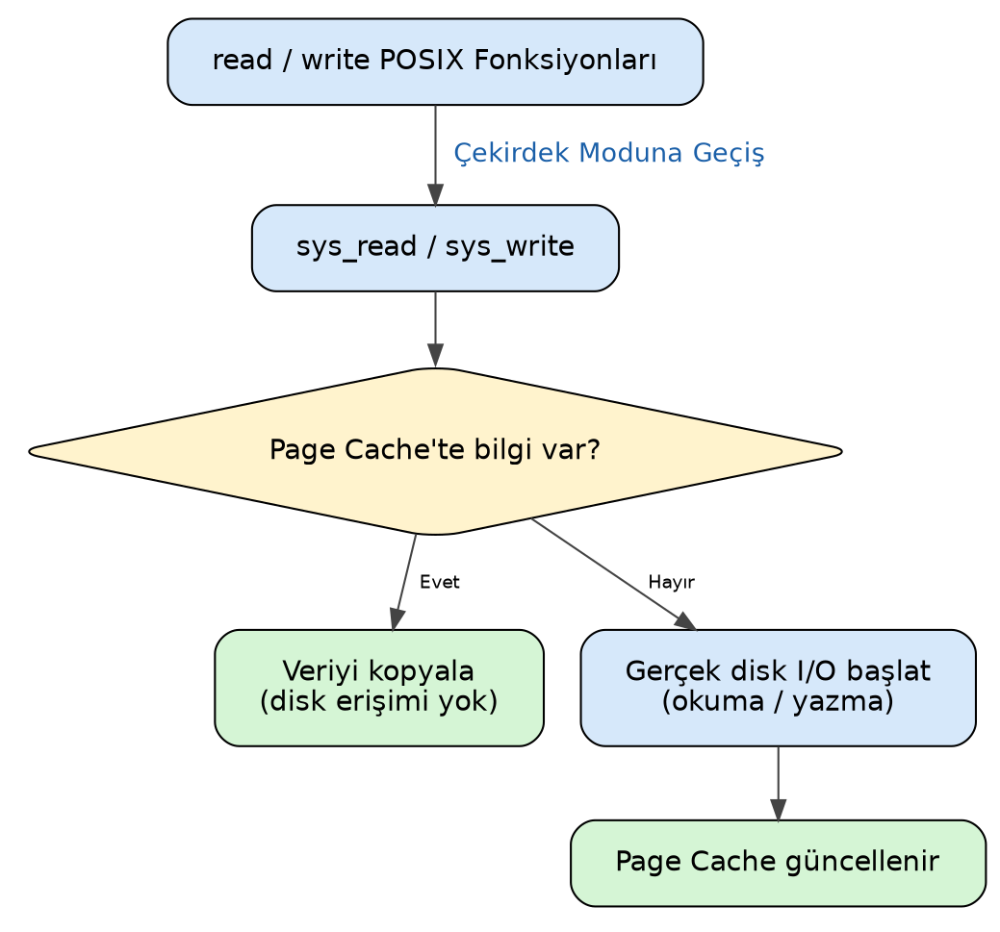
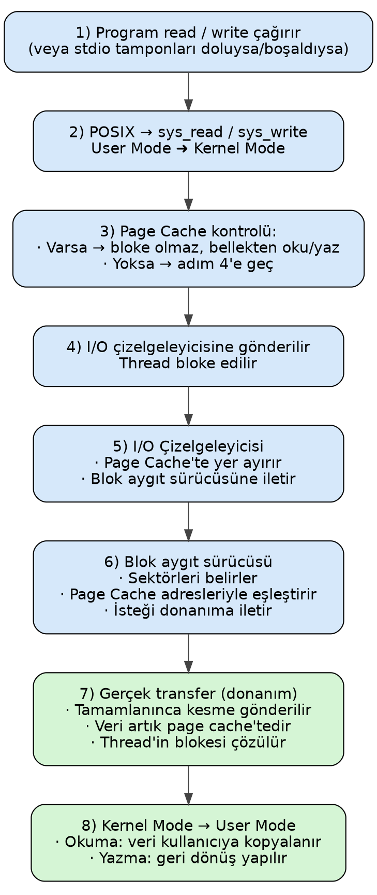
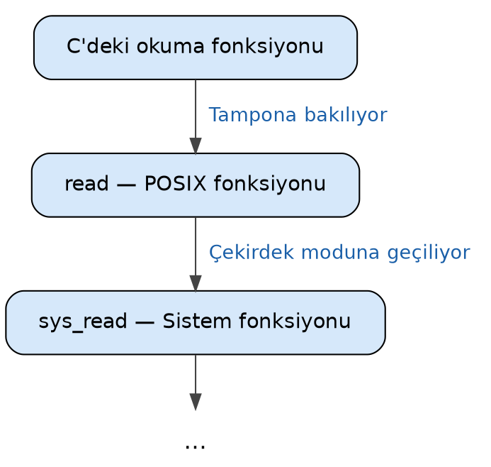
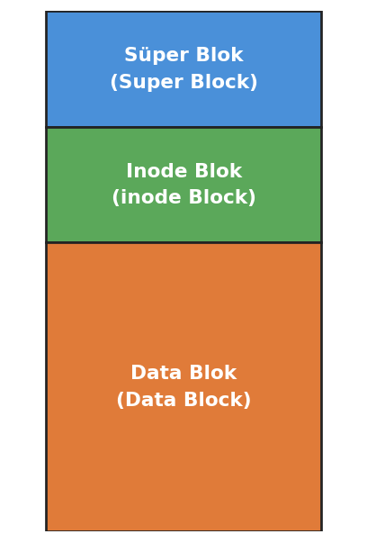
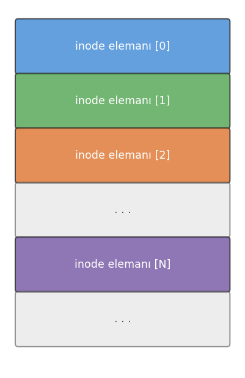
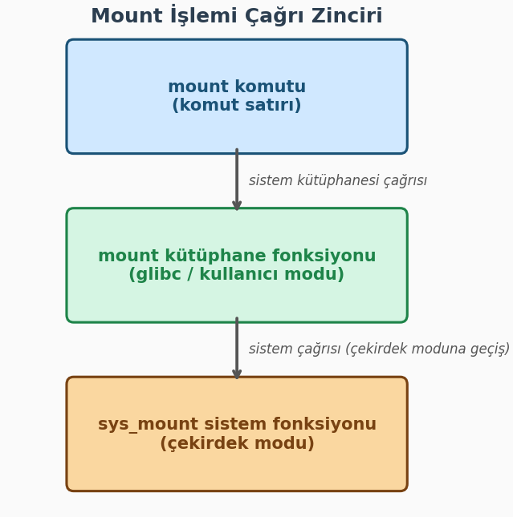
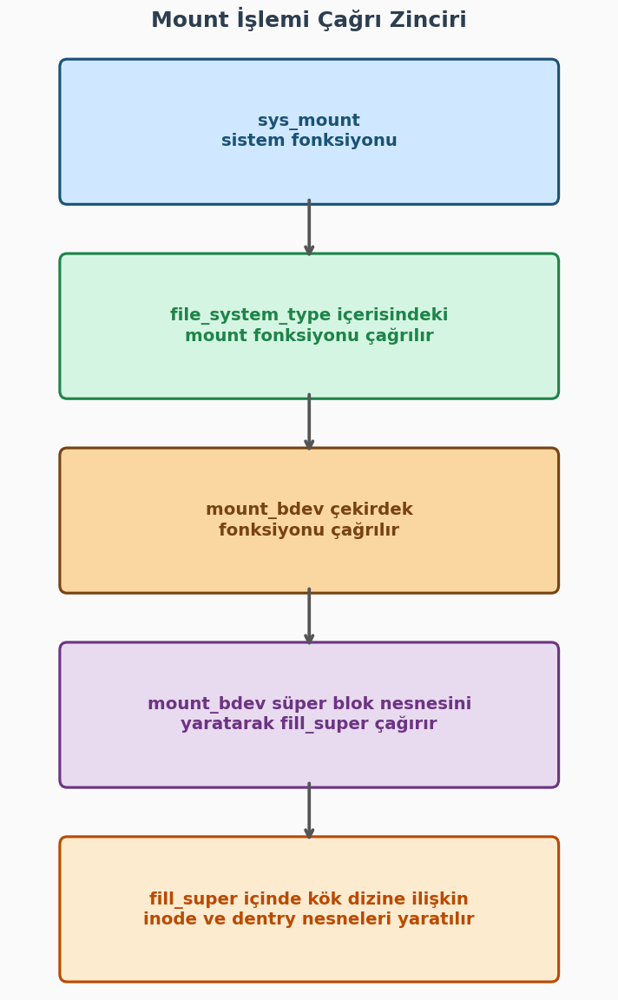

.. _dosya-sistemi-1:

=========================
Dosya Sistemi - I. Bölüm
=========================

Bu bölümde dikkatimizi dosya sistemine illişkin çekirdek veri yapıları üzerine yönelteceğiz. Bilindiği gibi 
UNIX/Linux sistemlerinde pek çok kavram kullanıcıya bir dosya gibi gösterilmektedir. Biz bu birinci bölümde belli bir derinliğe 
kadar çekirdeğin dosya işlemleri için oluşturduğu organizasyon üzerinde duracağız. Daha sonra ikinci bölümde
dosya sistemine ilişkin aşağı seviyeli ayrıntıları ele alacağız.

Giriş
=====

İşletim sistemlerinin *dosya sistemi (file system)* denilen alt sistemlerinin iki tarafı vardır: **Disk tarafı**
ve  **bellek tarafı**. Dosya bilgileri disk üzerindeki bloklarda tutulmaktadır. (Bu bloklara Microsoft dünyasında
*cluster* da denilmektedir.) Hangi dosyaların diskin hangi bloklarında tutulduğu, dosyaların
metadata bilgilerinin diskte nasıl saklandığı gibi belirlemeler dosya sisteminin disk tarafını;
diskteki dosya sisteminin çekirdekteki temsilinin oluşturulması ve işletim sisteminin açılan
dosyalar için yaptığı düzenlemeler ise dosya sisteminin bellek tarafını oluşturmaktadır.

Temel Kavramlar
===============

Önce temel kavramları tanıtacağız. Konuları ele alırken bu kavramlardan faydalanacağız. 

Disk Aktarımına İlişkin Temel Bilgiler
--------------------------------------

Biz kursumuzda "disk" terimini ikinci bellekleri belirten genel bir terim olarak kullanacağız. 
Bir süre önceye kadar disk olarak ağırlıklı biçimde *hard disk* dnilen elektromekanik birimler 
kullanılıyordu. Ancak bir süredir artık disk olarak yarı iletken teknolojiler kullanılarak oluşturulmuş 
*SSD (Solid State Disk)* denilen diskler kullanılmaktadır. Bugün ağırlıklı olarak kullandığımız SSD disklerin 
herhangi bir mekanik parçası yoktur. SSD'ler *NAND Flash* denilen bellek teknolojisini kullanmaktadır. 
SSD'ler hard disklere göre oldukça hızlıdır. Ancak onların en önemli handikapları belli bir yazma ömrünün 
olmasıdır. SSD'lerde aynı bölgeye belli sayıdan daha fazla yazma yapıldığında artık SSD'nin o bölgesi 
bozulabilmektedir. Tabii teknoloji bu bakımdan da ilerleme içerisindedir. SSD teknolojisi ile USB yuvalarına
taktığımız flash belleklerin teknolojisi birbirine benzemektedir.

Sektörler ve Disk Denetleyicisi
-------------------------------

Kullandığımız disk birimi ister *hard disk* olsun isterse SSD olsun disk ile bilgisayarımızın
RAM'i arasındaki transferler *sektör (sector)* denilen byte blokları düzeyinde yapılmaktadır. Sektör
bir diskten okunabilecek ya da bir diske yazılabilecek en küçük birimdir. Bir sektör tipik olarak
512 byte'tır. Diskte byte düzeyinde erişim yoktur. Sektörel erişim vardır. Örneğin diskteki bir
sektörde bulunan bir byte üzerinde değişiklik ancak şöyle yapılabilmektedir: Önce o byte'ın
içinde bulunduğu sektör RAM'e okunur. Sonra byte RAM üzerinde değiştirilir. Sonra aynı sektör
yeniden diske yazılır.

Diskteki her sektörün ilk sektör 0 olmak üzere bir mantıksal numarası vardır. Hard disklerde
ardışıl numaralı mantıksal sektörler disk üzerinde de fiziksel olarak peşi sıra bulunmaktadır.
Mekanik hard disklerde bilgiler *track* denilen yollara yazılmaktadır. Ardışıl sektörler aynı
track'te bulunurlar. Dolayısıyla hard disklerde diskin kafası bir kez konumlandırıldığında
ardışıl sektörlere daha hızlı okuma yazma yapılabilmektedir. SSD'ler mekanik öğe barındırmadığı
için rastgele erişimlidir. Yani her sektörden okuma aynı hızda yapılmakta ve her sektöre yazma da
aynı hızda yapılmaktadır.

Modern bilgisayar sistemlerinde disk birimine doğrudan erişilmez. Disk erişimlerinde bu işleme
aracılık eden ismine *disk denetleyicisi (disk controller)* denen yerel bir işlemciden
faydalanılmaktadır. Yani sistem programcıları ya da işletim sistemlerini yazanlar disk
denetleyicisini programlar, disk denetleyicisi isteği elektriksel olarak disk birimine iletir,
okuma yazma işlemleri de disk birimi tarafından yapılır:

.. graphviz::

   digraph disk_hierarchy {
       rankdir=TB;
       node [shape=box, style="rounded,filled", fillcolor="#D6E8FA",
             fontname="DejaVu Sans", margin="0.3,0.2"];
       edge [color="#555555"];

       OS         [label="İşletim Sistemi"];
       CPU        [label="CPU / RAM"];
       Controller [label="Disk Denetleyicisi\n(Disk Controller)"];
       Disk       [label="Disk\n(HDD / SSD)", fillcolor="#D5F5D5"];

       OS -> CPU -> Controller -> Disk;
   }

Bugünkü masaüstü bilgisayarlarımızda *SATA* ve *NVMe* en çok kullanılan disk denetleyicileridir.


DMA (Direct Memory Access)
--------------------------

Peki işletim sistemi tarafından disk denetleyicisi "falanca sektörleri oku" ya da "falanca 
sektörlere yaz" biçiminde  programlandıktan sonra aktarım nasıl yapılmaktadır?  Aktarım CPU
tarafından tek tek byte'ların denetleyiciden alınarak RAM'e yerleştirilmesi yoluyla
yapılmamaktadır. (Çok eskiden ilk PC mimarilerinde aktarım böyle de yapılabiliyordu.) Çünkü
CPU'nun bu işle meşgul olması önemli bir zaman kaybı oluşturmaktadır. Bu tür disk ile RAM
arasındaki aktarımlar için *DMA (Direct Memory Access)* denilen yardımcı denetleyiciler
kullanılmaktadır.

Tipik olarak CPU'da çalışan kod (yani işletim sistemi) disk denetleyicisine transfer isteğini
ve aktarımda kullanılacak bellek alanlarının adresini bildirir. Disk denetleyicisi de disk
birimini ve DMA'yı elektriksel düzeyde programlayarak aktarımın DMA üzerinden doğrudan RAM'e
yapılmasını sağlar. Aktarım sırasında artık CPU bu işle meşgul olmaz, işletim sistemi de
CPU'yu başka bir thread'i çalıştırması için *bağlamsal geçişe (task switch)* sokar. Tabii
aktarım işlemi bittiğinde disk denetleyicisi CPU'yu bir donanım kesmesi yoluyla durumdan
haberdar etmektedir.

Yani disk ile RAM arasındaki aktarım işlemleri tipik olarak şöyle yapılmaktadır:

1. İşletim sistemi disk denetleyicisine aktarılacak sektörlere ilişkin bilgileri ve transfer
   adreslerini CPU yoluyla elektriksel olarak iletir.
2. Okuma söz konusuysa disk denetleyicisi disk birimine elektriksel düzeyde komutlar göndererek
   sektörlerin okunmasını ve DMA yoluyla bunların RAM'de uygun yerlere aktarılmasını sağlar.
   Eğer yazma söz konusuysa RAM'de belirtilen adresteki bilgiler yine DMA yoluyla disk birimine
   iletilerek yazma gerçekleştirilir.
3. Aktarım işlemi bittiğinde disk denetleyicisi bir donanım kesmesi yoluyla CPU'yu durumdan
   haberdar eder.
4.  İşletim sistemi aktarım için gereken kodları çalıştırdıktan sonra aktarım bitene kadar meşgul 
    bir döngüde beklemez. Başka thread'ler çalıştırılabiliyorsa *bağlamsal geçiş (context switch)* 
    oluşturarak CPU'nun boş biçimde beklemesinin önüne geçer.

Bu süreci aşağıdaki diyagram özetlemektedir:

.. graphviz::

   digraph dma_flow {
       rankdir=TB;
       graph [splines=ortho, fontname="DejaVu Sans",
              nodesep=0.8, ranksep=0.9];
       node  [shape=box, style="rounded,filled", fontname="DejaVu Sans",
              margin="0.32,0.20", fontsize=11];
       edge  [fontname="DejaVu Sans", fontsize=9, color="#444444"];

       /* IRQ yayını üstten yönlendiren görünmez köprü */
       IRQ_kpr [label="", shape=point, style=invis,
                width=0.01, height=0.01, fixedsize=true];

       /* Üst katman: yazılım zinciri */
       App        [label="Uygulama\nI/O çağrısı",
                   fillcolor="#EEEDFE", color="#534AB7", fontcolor="#3C3489"];
       CPU        [label="OS / CPU\nKesmeyi alır",
                   fillcolor="#EEEDFE", color="#534AB7", fontcolor="#3C3489"];
       Driver     [label="Aygıt Sürücüsü\nKomut hazırlar",
                   fillcolor="#EEEDFE", color="#534AB7", fontcolor="#3C3489"];
       Controller [label="Denetleyici\nIRQ tetikler",
                   fillcolor="#FAEEDA", color="#854F0B", fontcolor="#633806"];

       /* Alt katman: DMA donanımı */
       Memory     [label="Bellek (RAM)\nDMA hedefi",
                   fillcolor="#E1F5EE", color="#0F6E56", fontcolor="#085041"];
       DMA        [label="DMA Motoru\nCPU'dan bağımsız",
                   fillcolor="#E1F5EE", color="#0F6E56", fontcolor="#085041"];
       Disk       [label="Disk Donanımı\nHDD / SSD / FTL",
                   fillcolor="#EAF3DE", color="#3B6D11", fontcolor="#27500A"];

       /* Sıra düzeni */
       { rank=source; IRQ_kpr; }
       { rank=same;   App; CPU; Driver; Controller; }
       { rank=same;   Memory; DMA; Disk; }

       /* 1. Komut zinciri */
       App    -> CPU        [label="read()/write()"];
       CPU    -> Driver     [label="I/O isteği"];
       Driver -> Controller [label="komutu gönder"];

       /* 2. Donanım komutları */
       Controller -> Disk [label="komut gönder"];
       Controller -> DMA  [label="DMA tablo ayarı",
                            style=dashed, color="#888780",
                            fontcolor="#5F5E5A"];

       /* 3. Veri akışı (DMA, CPU katılmadan) */
       Disk -> DMA    [label="veri aktarır",
                        style=dashed, color="#1D9E75", fontcolor="#0F6E56"];
       DMA  -> Memory [label="RAM'e yazar",
                        style=dashed, color="#1D9E75", fontcolor="#0F6E56"];

       /* 4. Kesme — IRQ_kpr üzerinden üstten kıvrılarak CPU'ya */
       Controller -> IRQ_kpr [color="#E24B4A", penwidth=2.0,
                               arrowhead=none, weight=0];
       IRQ_kpr    -> CPU     [color="#E24B4A", penwidth=2.0,
                               label="Transfer tamamlandı → Kesme (IRQ)",
                               fontcolor="#E24B4A", weight=0];
   }

Eskiden Intel tabanlı PC mimarisinde ISA bus kullanıldığı zamanlarda tek bir merkezi DMA
denetleyicisi (Intel 8237) vardı. Ancak daha sonra PCI bus kullanılmaya başlanmasıyla birlikte
artık transfer yapabilen her donanım birimi kendi DMA denetleyicisini de içermeye başladı.
Bugün Intel tabanlı ve Apple Silicon tabanlı bilgisayar mimarilerinde disk denetleyicisi kendi
içerisindeki DMA denetleyicisini programlayarak transferi gerçekleştirmektedir. Disk
denetleyicilerinin programlanması ise artık uzunca bir süredir *bellekten tabanlı IO
(memory-mapped IO)* tekniği ile yapılmaktadır.

Hard disklerde disk birimi içerisinde önbellekler (cache) de bulundurulmaktadır. Böylece disk denetleyicisi aynı 
sektörleri disk biriminden istediği zaman disk birimi eğer ilgili sektörler önbellek içerisindeyse hiç kafa 
hareketleri yapmadan onları doğrudan önbellekten verebilmektedir. Bugünlerde örneğin 1 TB'lık hard disklerde 64MB, 
128, 256 MB civarında önbellekler kullanılmaktadır. Yalnızca hard disklede değil SSD'lerde de bir önbellek sistemi 
vardır. SSD'lerdeki önbellek sistemi özellikle yazma işlemlerinde hız kazancı sağlamakta ve aynı sektörlere sürekli 
yazım yapıldığında o bölgenin *aşınmasını (wearing)* engellemektedir. Tabii bu öönbellek sistemleri tamamen disk 
birimleri tarafından içsel olarak (built-in) işletilmektedir. Bu önbellek sistemleri işletim sistemleri tarafından 
erişilebilir değildir.

Blok Kavramı
------------

Yukarıda da belirttiğimiz gibi bir disk biriminde transfer edilecek en küçük birime sektör denilmektedir. Bir sektör 
tipik olarak 512 byte uzunluğundadır. Ancak aslında sektör uzunlukları da disk üreticilerine bağlı olarak değişebilmektedir. 
512 byte sektör uzunlukları bugün için standart bir uzunluktur. Tabii zaman geçtikçe diskler büyüdüğü için sektör 
uzunluklarının da büyüyebileceğini söylemek istiyoruz. Nitekim 4K uzunluğunda sektörlere sahip olan diskler özellikle 
büyük sistemlerde gittikçe yaygınlaşmaktadır. Disk birimi her sektöre ilk sektör 0 olmak üzere mantıksal bir numara 
vermektedir. Yani adeta disk üzerindeki her sektörün bir adresi vardır. Disk denetleyicisi disk birimine transfer 
edilecek sektörlerin numaralarını elektriksel düzeyde iletmektedir. (Bu biçimde mantıksal sektör numaraları kullanılmadan 
önce 80'lerde ve 90'ların ilk yarısında sektörlerin yerleri "fiziksel koordinat sistemi" denilen "hangi yüz (head)", 
"hangi track", "hangi sektör dilimi" biçiminde üç parametreyle belirtiliyordu.)

Sektör kavramı aslında dosya sistemleri için küçük bir depolama birimidir. İşletim sistemleri
bir dosyanın parçası olabilecek en küçük disk alanı için sektör yerine *blok (block)* ya da
*cluster* denilen daha büyük birimleri kullanmaktadır. Blok terimi daha çok UNIX/Linux
sistemlerinde kullanılmaktadır. Microsoft ise blok yerine *cluster* terimini kullanmaktadır.
Bir blok ardışıl n tane sektörden oluşmaktadır. Uygulamada bu n değeri 2'nin bir kuvveti olur. Ardışıllık hard disklerde 
önemli bir unsurdur. Çünkü hard disklerde en önemli zaman kaybı mekanik bir birim olan disk kafasının track hizasına 
çekilmesinde yaşanmaktadır. Disk kafası track hizasına çekildiğinde disk dönerken artık ardışıl sektörler hiç kafa 
hareketi yapılmadan okunup yazılabilmektedir. Peki neden işletim sistemi dosyalar söz konusu olduğunda bir dosyanın 
parçası olabilecek en küçük birim için sektör değil de ardışıl n tane sektör kullanmaktadır? İşte bunun birkaç nedeni 
vardır:

1. Dosyaların parçaları disk üzerinde ardışıl yerlerde olmak zorunda değildir. Eğer dosyalar
   çok fazla parçadan oluşursa hard disklerde (ve kısmen de olsa SSD'lerde de) bu parçalar disk
   üzerinde daha fazla yayılmış olur, bunlara erişmek için gereken zaman artar.

2. Eğer dosyanın parçaları sektör gibi küçük birimlerden oluşsaydı bu parçaların diskteki
   yerlerine ilişkin metadata tabloları büyürdü. Bu da hem disk alanını hem de işletim sisteminin
   bellekte yaptığı düzenlemede alan verimsizliği oluştururdu.

3. CPU'ların kullandığı sayfalama mekanizmasında genellikle 4K uzunluklar kullanılmaktadır.
   Dosya parçalarının 4K uzunluğun katlarında olması dosya sistemi ile sayfalama sistemi arasında
   daha iyi bir uyumun ortaya çıkmasına yol açmaktadır.

Peki bu durumda işletim sistemleri blok denilen dosyanın parçası olabilecek en küçük birim için hangi uzunluğu 
kullanmaktadır? İşte genellikle bu karar disk formatlanırken diskin (disk bölümünün) büyüklüğüne bakılarak verilmektedir. 
Dosyaların son bloklarında kalan kullanılmayan alanların oluşmasına *içsel bölünme (internal fragmentation)* 
denilmektedir. Küçük disklerde (disk bölümlerinde) içsel bölünmenin etkisi daha büyük olacağından blokların 1K gibi 
küçük uzunluklarda alınması uygun olabilir. Ancak orta büyüklükte disklerde içsel bölünmenin etkisi göreli olarak 
azalacağı için bloklar 4k gibi bir değerde seçilebilmektedir. Büyük disklerde ise 8K, 16K blok büyüklükleri tercih 
edilmektedir. Aslında blok büyüklükleri ilgili disk bölümü formatlanırken (Linux sistemlerinde ``mkfs.xxx`` programlarıyla 
formatlama yapılmaktadır) belirlenmektedir. Yani kullanıcı isterse kendisi bu programda kendi tercih ettiği blok 
uzunluğunu kullanabilir. Ancak kullanıcılar genellikle böyle bir belirleme yapmazlar. Bu durumda bu programlar disk 
bölümünün büyüklüğüne bağlı olarak yukarıda açıkladığımız gibi uygun bir blok büyüklüğünü seçerler.

UNIX/Linux sistemlerinde dosya sistemi için tek bir kök vardır. Blok aygıtları (örneğin hard
diskler, flash bellekler vb.) belli bir dizine mount edilmektedir. Mount işlemi bir dizin üzerine
uygulanır; mount işlemi sonucunda o dizinin içeriği görünmez, artık mount edilen dosya sisteminin
kök dizini mount dizininde gözükür. Dolayısıyla bu sistemlerde farklı dizinler farklı blok
büyüklüklerine ilişkin dosya sistemlerinin içerisinde olabilmektedir.

Anımsanacağı gibi ``stat`` POSIX fonksiyonu ya da komut satırından uygulanan *stat* komutu belli
bir dosyanın bilgilerini verirken o dosyanın içinde bulunduğu dosya sisteminin blok uzunluğunu
da vermektedir. Linux sistemlerinde bu bilgi doğrudan dosya sistemine ilişkin blok aygıtı
üzerinde ``dumpe2fs`` programıyla da elde edilebilmektedir.

Windows sistemlerinde de *cluster* adı altında blok sistemi kullanılmaktadır. O sistemlerde blok
uzunluklarını *chkdsk* programı ile ya da *fsutil* programı ile komut satırından elde
edebilirsiniz.

İşletim sistemleri işlemlerini kolaylaştırmak için her bloğa bir numara da vermektedir. Örneğin
bir bloğun 4K (tipik olarak 8 sektör) olduğunu düşünelim. İşletim sistemi için ilgili disk (aslında
disk bölümü ya da genel olarak blok aygıtı da diyebiliriz) bloklardan oluşmaktadır. Örneğin
diskin (disk bölümünün) ilk 8 sektörü artık 0'ıncı bloktur. Sonraki 8 sektör 1'inci bloktur.

İşletim sistemi içsel olarak artık ilgili diski bloklardan oluşan ve her bloğun bir numarasının
olduğu mantıksal bir depolama alanı gibi ele almaktadır. Yani işletim sistemi için yalnızca
sektörlerin değil aynı zamanda dosya sistemine ilişkin blokların da numaraları vardır.

Sayfa Önbelleği (Page Cache)
----------------------------

İşletim sistemleri son okunan ya da yazılan disk bloklarını RAM'de bir önbellek sisteminde
saklamaktadır. Bu önbellek sistemine genel olarak *işletim sisteminin disk önbellek sistemi*
denilmektedir. Linux dünyasında eskiden bu önbellek sistemine *buffer cache* deniliyordu. Sonra
bu önbellek sistemi iyileştirildi ve ismi *page cache* olarak değiştirildi.

İşletim sistemlerinin bu disk önbellek sistemleri disk erişimini ciddi boyutta azaltmakta ve
sistem performansı üzerinde en önemli olumlu etkilerden birini oluşturmaktadır. Eğer işletim
sistemlerinde böyle bir disk önbellek sistemi olmasaydı sistemler çok yavaş çalışırdı.

Linux sistemlerinde sayfa önbelleği oldukça kritik öğelerden biridir. Biz burada yalnızca bu 
kavramı tanıttık. Sayfa önbelleği "bellek yönetiminin" ele alındığı bölümde ayrı bir başlık altında 
ayrıntılarıyla gözden geçirilecektir.  

Okuma ve Yazma İşlemleri
========================

Biz UNIX/Linux sistemlerinde bir dosyadan okuma yapmak için ya da bir dosyaya yazma yapmak için
``read``/``write`` POSIX fonksiyonlarını kullanmış olalım. Bu fonksiyonlar çekirdek içerisindeki
``sys_read`` ve ``sys_write`` sistem fonksiyonlarını çalıştırmaktadır.

İşletim sistemi bellek tarafında yaptığı organizasyonla okunacak ya da yazılacak bilginin ilgili
blok aygıtının (disk bölümünün) kaç numaralı bloğuna ve sektörüne ilişkin olduğunu
belirleyebilmektedir. Ancak ``sys_read`` ve ``sys_write`` gibi sistem fonksiyonları hemen diske
yönelmez. Bu fonksiyonlar önce dosyanın ilgili bölümünün RAM'de oluşturulmuş bir sayfa önbelleği
(*page cache*) içerisinde olup olmadığına bakmaktadır. Eğer ilgili bölüm bu önbellek sisteminin
içerisinde varsa bu fonksiyonlar diske hiç erişmeden dolayısıyla da hiç bloke olmadan bu okuma
yazma işlemini gerçekleştirmektedir.

``read``/``write`` POSIX fonksiyonları çağrıldığında yapılan işlemler aşağıdaki diyagramda
özetlenmiştir:



Peki dosyadaki okunacak ya da yazılacak kısım sayfa önbelleğinde (*page cache*) yoksa gerçek
transfer nasıl yapılmaktadır? Linux sistemlerinde bu transferlerin yapıldığı birime *blok aygıt
sürücüleri (block device drivers)* denilmektedir.

Bir Linux sistemi kurulduğunda zaten temel disk denetleyicileri üzerinden transfer yapabilen blok
aygıt sürücüleri çekirdeğin içerisine gömülmüş durumda olur. Ancak sistem programcısının kendisi
de blok aygıt sürücüleri yazabilir. Örneğin bir gömülü Linux sisteminde yeni bir SD kart birimi
için bir blok aygıt sürücüsü yazmak zorunda kalabilirsiniz.

İşletim sistemi bu IO isteklerini hemen blok aygıt sürücüsüne göndermez. Çünkü çok sayıda
farklı proses aynı disk sektörlerini okuyacak ya da o sektörlere yazacak olabilir. İşletim
sistemi önce istekleri sıraya dizer, mümkünse birleştirir, bu biçimdeki iyileştirme işleminden
sonra istekleri blok aygıt sürücüsüne gönderir. Bu sürece *IO çizelgelemesi (IO scheduling)*
denilmektedir.

O halde bir dosya okuması ya da yazması sonucunda gelişen olayları şöyle özetleyebiliriz:

1. Kullanıcı modunda çalışan program (yani proses) ``read`` ya da ``write`` POSIX fonksiyonlarını
   çağırır. (UNIX/Linux sistemlerindeki C derleyicilerinin standart dosya fonksiyonları da eğer
   okunacak ya da yazılacak kısım kendi tamponlarında yoksa zaten bu POSIX fonksiyonlarını
   çağırmaktadır.)

2. ``read`` ve ``write`` POSIX fonksiyonları Linux'ta ``sys_read`` ve ``sys_write`` isimli sistem
   fonksiyonlarını çağırır. Artık akış kullanıcı modundan (user mode) çekirdek moduna (kernel
   mode) geçmiştir.

3. ``sys_read`` ve ``sys_write`` fonksiyonları önce okunacak ya da yazılacak yerin Linux'un disk
   önbellek sistemi olan sayfa önbelleğinde (*page cache*, eski ismiyle *buffer cache*) olup
   olmadığına bakar. Eğer ilgili disk blokları sayfa önbelleğinde varsa akış hiç bloke olmadan
   sayfa önbelleği içerisinden karşılanır. Aksi hâlde Linux çekirdeği isteği *IO çizelgeleyicisi
   (IO scheduler)* denilen çekirdek birimine iletir; ``read``/``write`` çağrısını yapan thread
   bloke edilir.

4. IO çizelgeleyicisi istekleri çizelgeler. Okuma işlemi söz konusuysa sayfa önbelleğinde
   transfer edilecek önbellek bloklarını tahsis eder. Yazma işlemi söz konusuysa diske transfer
   edilecek önbellek bloklarını belirler. Blok aygıt sürücüsüne transfer edilecek sektörleri ve
   transfere ilişkin bellek adreslerini iletir.

5. Gerçek transfer işlemi blok aygıt sürücüsü tarafından yapılmaktadır. İşletim sistemi blok
   aygıt sürücüsüne hangi sektörlerin sayfa önbelleğindeki hangi adreslere (ya da tersi yönde)
   transfer edileceğini bir kuyruk sistemi yardımıyla iletmektedir.

6. Blok aygıt sürücüsü diskten istenen sektörleri sayfa önbelleği içerisinde belirtilen adrese
   ya da sayfa önbelleğindeki bilgileri diskin belirtilen sektörlerine transfer eder.

7. Artık okuma söz konusuysa okunan bilgi sayfa önbelleği içerisindedir. İşlemi başlatan
   thread'in blokesi çözülür. ``sys_read`` sistem fonksiyonu bunu sayfa önbelleği içerisinden
   programcının kullanıcı modundaki adresine kopyalar.

Tabii bugün kullandığımız Linux sistemlerinde aslında disk transflerini yapan blok aygıt sürücüleri zaten çekirdek 
imajı içerisine gömülmüş bir biçimde bulunmaktadır. Ancak nadiren de olsa sistem programcısının yeni birtakım aygıtlar 
için blok aygıt sürücüleri yazması gerekebilmektedir.


Yukarıda maddeler halinde açıkladığımız süreci bir şekille de özetleyebiliriz:



Linux sistemlerinde yukarıda özetlediğimiz olaylar silsilesi zaman içerisinde değişikliklere
uğratılarak ve sürekli geliştirilerek bugünkü durumuna getirilmiştir.

Yazma İşleminin Ayrıntıları
---------------------------

Buradaki süreçte yazma olayı söz konusu olduğunda bazı ayrıntılar da devreye girmektedir.
Kullanıcı modundaki program ``write`` POSIX fonksiyonunu çağırıp bu fonksiyon da ``sys_write``
fonksiyonunu çağırdığında bu sistem fonksiyonu yazılmak istenen bilgiler diske yazılana kadar
``write`` işlemini yapan thread'i bloke etmez. Yazma işlemi her zaman Linux'un RAM'deki sayfa
önbelleğine yapılmaktadır. ``sys_write`` fonksiyonu yazmayı sayfa önbelleği içerisine yaptıktan
sonra hemen "başarılı" olarak geri dönmektedir.

Sistem programlama terminolojisinde IO işlemlerinde *senkron* terimi "fonksiyon geri döndüğünde
tüm işlemlerin yapılıp bitmiş olması" anlamına gelmektedir. *Asenkron* terimi ise "işlemin
başlatılması, fonksiyonun geri dönmesi ancak işlemin aslında arka planda devam etmesi" anlamına
gelmektedir. Görüldüğü gibi modern işletim sistemlerinde diske yazma işlemi aslında disk 
bağlamında *senkron* bir işlem değildir.

Ancak bunun bir istisnası vardır. Eğer bir dosya ``O_DSYNC`` ya da ``O_SYNC`` bayraklarıyla
açılmışsa o dosyaya yapılan yazma işlemleri aygıta aktarılana kadar thread ``write`` fonksiyonunda
bloke edilmektedir. Yani bu bayraklar yazma işlemlerinin senkron yapılmasını sağlamaktadır.

Gecikmeli Yazım ve Flush Thread'leri
------------------------------------

Peki yazma işleminde sayfa önbelleğine yazılan bilgiler çekirdek tarafından ne zaman gerçek
aygıta aktarılmaktadır? İşte işletim sistemleri bu tür durumlarda kasten araya belli bir gecikme
koymaktadır. Böylece peşi sıra yapılan ``write`` işlemlerinin tek tek gereksiz biçimde aygıta
aktarılması engellenir, bunlar biriktirilerek ve çizelgelenerek blok aygıt sürücüsüne aktarılır.
Bu biçimdeki aktarmaya *gecikmeli yazım (delayed write)* da denilmektedir.

Buradaki süreci aşağıdaki şekille özetleyebiliriz:

.. graphviz::

   digraph delayed_write {
       rankdir=LR;
       node [shape=box, style="rounded,filled", fillcolor="#D6E8FA",
             fontname="DejaVu Sans", margin="0.25,0.18"];
       edge [fontname="DejaVu Sans", fontsize=9, color="#444444"];

       write   [label="write()\nKullanıcı Modu"];
       sysw    [label="sys_write()\nÇekirdek Modu"];
       cache   [label="Page Cache'e kopyala\n(sayfa \"dirty\" olarak işaretlenir)",
                fillcolor="#FFF3CD"];
       ret     [label="Geri dönüş\n(User Mode)", fillcolor="#D5F5D5"];
       flush   [label="Flusher Thread\n(Asenkron)", fillcolor="#F8D7DA"];
       sched   [label="I/O Çizelgeleyici"];
       driver  [label="Blok Aygıt\nSürücüsü"];
       ctrl    [label="Disk\nDenetleyicisi"];
       disk    [label="Disk\nDonanımı", fillcolor="#D5F5D5"];

       write  -> sysw  -> cache -> ret;
       cache  -> flush [style=dashed, label="zaman geçince"];
       flush  -> sched -> driver -> ctrl -> disk;
   }

Peki işletim sistemi transfer işlemlerini ne kadar süre bekletmektedir? Eğer transfer çok uzun süre bekletilirse 
elektrik kesilmesi gibi durumlarda kayıplar fazlalaşır. İşte modern işletim sistemlerinde kirlenmiş sayfaların 
*flush* edilmesi *çekirdek thread'leri (kernel threads)* tarafından yapılmaktadır. Örneğin Linux sistemlerinde 
bu işlemlerden *flush* isimli çekirdek thread'leri sorumludur. Eskiden Linux çekirdeklerinin 2.6.32 versiyonuna 
kadar bu işşlemler *pdflush* isimli tek bir çekirdek thread tarafından yapılıyordu. Bu versiyondan sonra
artık her blok aygıt sürücüsü için ayrı bir flush thread'i oluşturulmaya başlandı. Bu thread'leri komut satırında 
şöyle görüntüleyebilirsiniz:

.. code-block:: bash

   $ ps -aux | grep flush

flush thread'leri arka planda sürekli olarak sayfa önbelleğini izler. Orada *kirlenmiş (dirty)*
olan sektörleri ilgili blok aygıt sürücüsüne gönderir. Peki bu işleyişte yazma gecikmesi takriben kaç saniye 
civarında olmaktadır? Aslında bu gecikme süresi başka faktörlere de bağlı olarak değişebilmektedir Burada fikir 
vermek amacıyla modern Linux sistemleri için bu sürenin ortalama 5 saniye civarında olduğunu söyleyebiliriz. 
Ancak bu değerler de değiştirilebilmektedir. flush thread'lerinin parametreleri hakkında aşağıda tabloda özet bir 
bilgi veriyoruz:

.. rst-class:: centered-headers

.. list-table::
   :header-rows: 1
   :widths: 28 18 60

   * - Parametre
     - Varsayılan Değer
     - Anlamı
   * - ``dirty_writeback_centisecs``
     - 500
     - Flusher thread'in periyodik olarak çalıştığı aralık (santi saniye
       cinsinden). 500 cs = 5 saniye. Bu aralıkta çekirdek *dirty* sayfaları
       kontrol eder.
   * - ``dirty_expire_centisecs``
     - 3000
     - Bir *dirty* sayfa en fazla bu kadar süre (santi saniye cinsinden)
       RAM'de kalabilir. 3000 cs = 30 saniye sonra *süresi dolmuş* sayılır
       ve flush edilir.
   * - ``dirty_ratio`` / ``dirty_background_ratio``
     - %20 / %10 civarı
     - RAM'in ne kadarı *dirty* sayfalarla dolarsa flush işleminin
       başlatılacağını belirler (bellek baskısı durumunda
       zaman beklenmez).
       
Bu değerler proc dosya sisteminden görüntülenebilmektedir:

.. code-block:: bash

   $ cat /proc/sys/vm/dirty_writeback_centisecs
   $ cat /proc/sys/vm/dirty_expire_centisecs

*sysctl* komutu ile de bu değerler değiştirilebilmektedir:

.. code-block:: bash

   $ sudo sysctl -w vm.dirty_writeback_centisecs=100

*sysctl* komutu zaten kendi içerisinde ``/proc/sys`` dizinindeki dosyalar üzerinde güncelleme
işlemleri yapmaktadır.

flush thread'lerinin çalışması daha ayrıntılı olarak *sayfa önbelleği (page cache)* konusunun
ele alındığı bölümde açıklanacaktır.

Gecikmeli Yazımın Gerekçeleri
-----------------------------

*Gecikmeli yazım (delayed write)* işleminin gerekçeleri nelerdir? En önemli gerekçe peşi sıra
yapılan yazma işlemlerinin tek hamlede aygıta yansıtılmasıdır. Bu sayede yazma işlemini yapan
thread bloke olmaz ve toplamda bu işlemler paralel yürütüldüğü için sistem performansı yükselir.
Aynı zamanda flash belleklerde ve SSD'lerde bu gecikme sürekli yazım sonucunda oluşan belleğin
aşınmasını (wearing) da kısmen engellemektedir. (Aslında bu "eskime" sorunu asıl olarak flash
belleklerdeki ve SSD içerisindeki önbellekler ve *FTL (Flash Translation Layer)* sayesinde 
azaltılmaktadır.)

Kirlenmiş Sayfaların Erken Flush Edilmesi
-----------------------------------------

Sayfa önbelleğinde kirlenen sayfalar bazı durumlarda işletim sisteminin *tazeleyici (flusher)*
thread'lerini beklemeden de diske aktarılabilmektedir. Örneğin bir dosya kapatıldığında artık
bu işlem arka planda dosyanın kirlenmiş sayfalarının da diske yazılmasına yol açmaktadır.

UNIX/Linux sistemlerinin çoğunda bazı özel sistem fonksiyonları yoluyla ya da ``open``
fonksiyonundaki bayraklarla da bu duruma müdahale edilebilmektedir.

``sync`` POSIX fonksiyonu çağrıldığında o anda dosya sistemine ilişkin *kirlenmiş (dirty olan)*
sayfaların hepsi flush edilmektedir:

.. code-block:: c

   #include <unistd.h>

   void sync(void);

``sync`` fonksiyonu *asenkron (asynchronous)* biçimde çalışmaktadır. Yani fonksiyon geri döndüğünde tüm blokların
flush edilmiş olma garantisi yoktur. Aynı zamanda Linux sistemlerde *sync* isimli bir kabuk komutu
da bulunmaktadır. Bu komut ``sync`` fonksiyonunu çağırmaktadır.

``fsync`` POSIX fonksiyonu ise belli bir dosyaya ilişkin kirlenmiş sayfaların flush edilmesi için
kullanılmaktadır:

.. code-block:: c

   #include <unistd.h>

   int fsync(int fildes);

``fsync`` fonksiyonu *senkron (synchronous)* çalışmaktadır. Yani fonksiyon geri döndüğünde sayfa
önbelleğindeki kirlenmiş sayfaların flush edilmiş olması garanti edilmektedir.

Bir dosya açılırken ``open`` POSIX fonksiyonunda kullanılan konuyla ilgili üç bayrak vardır:

``O_DSYNC`` **Bayrağı**
   Bu bayrak POSIX'in *"Base Definitions"* bölümündeki *"Synchronized I/O Data Integrity Completion"*
   başlığında açıklanan yazma koşullarının sağlanacağını belirtmektedir. Bu bayrak kullanıldığında
   aşağıdaki iki durumun çekirdek tarafından sağlanması garanti edilmektedir:

   - Dosyaya yazdırılan bilgilerin ``write`` fonksiyonu geri döndüğünde hedefe transfer edilmiş
     olması.
   - Yazılan bilginin dosyadan okunabilmesi için gereken metadata bilgilerinin hedefe transfer
     edilmiş olması. (Tüm metadata bilgilerinin hedefe transfer edilmiş olması gerekmemektedir.)

``O_SYNC`` **Bayrağı**
   Bu bayrak POSIX'in *"Base Definitions"* bölümündeki *"Synchronized I/O File Integrity Completion"*
   başlığında açıklanan koşulların sağlanacağını belirtmektedir. ``O_SYNC`` bayrağı ``O_DSYNC``
   bayrağını kapsamaktadır. Fakat bu bayrak ``write`` fonksiyonu geri dönmeden önce tüm metadata
   bilgilerinin hedefe transfer edilmiş olmasını zorunlu tutmaktadır.

``O_RSYNC`` **Bayrağı**
   Bu okuma işlemi ile ilgilidir. Tek başına değil ``O_DSYNC`` ya da ``O_SYNC`` bayraklarıyla
   birlikte kullanılır. Eğer ``O_RSYNC`` bayrağı ``O_DSYNC`` bayrağı ile birlikte kullanılırsa
   ``read`` işlemini etkileyecek olan daha önce yapılmış ``write`` işlemleri varsa ``read``
   fonksiyonu geri dönmeden önce bu ``write`` işlemleri için ``O_DSYNC`` bayrağında belirtilen
   semantik uygulanmaktadır. Eğer bu bayrak ``O_SYNC`` ile birlikte kullanılırsa ``read`` işlemini
   etkileyecek olan daha önce yapılmış ``write`` işlemleri varsa ``read`` fonksiyonu geri dönmeden
   önce bu ``write`` işlemleri için ``O_SYNC`` bayrağında belirtilen semantik uygulanmaktadır.


Standart C Kütüphanesinin Süreçteki Yeri ve İşlevi
--------------------------------------------------

Peki C'nin standart dosya fonksiyonları bu süreçte nerede yer almaktadır? C'nin dosya fonksiyonları
aslında neticede POSIX fonksiyonlarını çağırmaktadır. Ancak C'nin standart dosya fonksiyonları
işletim sisteminin okuma yazma fonksiyonlarını daha az çağırmak için *kullanıcı alanında (user
space)* her dosya için bir önbellek de oluşturmaktadır. Bu önbellek sistemine genellikle önbellek
yerine *tamponlama (buffering)* sistemi, burada kullanılan önbelleğe de *tampon (buffer)*
denilmektedir.

Örneğin Linux'ta biz C'nin ``getc`` gibi dosya fonksiyonunu çağırmış olalım. Standart C
kütüphanesi ``fgetc`` ile 1 byte okumak istediğimizde ``read`` POSIX fonksiyonu ile 1 byte
okumamaktadır. ``fgetc`` fonksiyonu ``read`` POSIX fonksiyonu ile ``<stdio.h>`` dosyasında belirtilen 
``BUFSIZ`` kadar byte'ı bir tampona okumakta ve oradan 1 byte'ı programcıya vermektedir.  Böylece sonradan 
okunanacak byte'lar için hiç read fonksiyonu çağrılmayacak ve istek hemen bu tampondan karşılanacaktır. Aynı 
durum yazma için de söz konusudur. Bu nedenle C'nin standart dosya fonksiyonlarına *tamponlı IO (buffered IO)* 
fonksiyonları da denilmektedir. Buradaki önbellek sisteminin POSIX fonksiyonlarını dolayısıyla da sistem 
fonksiyonlarını daha az çağırmak için oluşturulduğuna dikkat ediniz. O hâlde C'nin standart dosya fonksiyonlarıyla 
yapılan tipik bir okuma işlemi şöyle gerçekleşmektedir:



Tabii biz kursumuzda okuma ve yazma süreçleri üzerinde dururken olaylar silsilesini standart C fonksiyonlarından 
başlatmayacağız. POSIX fonksiyonlarından ya da sistem fonksiyonlarından başlatacağız.

C'deki bu tamponlama yani önbellek mekanizması aslında yalnızca C'ye özgü değildir. Diğer prgramlama dillerinin de 
standart kütüphanelerinde benzer biçimde tamponlamalar yapılmaktadır. Örneğin C++'taki ``<iostream>`` fonksiyonları, 
C#'tan kullanılan .NET sınıfları, Java'da kullanılan IO sınıfları, C'de olduğu gibi hep kullanıcı alanında 
oluşturulan tamponlama mekanizması eşliğine çalışmaktadır. Ancak bunların hepsi Linux sistemlerinde neticede POSIX 
fonksiyonlarını, onlar da sistem fonksiyonlarını çağırmaktadır.

POSIX dosya fonksiyonlarının Linux'taki işletim sisteminin sistem fonksiyonlarını çağırdığını belirtmiştik. İşletim 
sisteminin sistem fonksiyonları ilgili disk bloğu sayfa önbellekte olsa bile belli bir yavaşlık oluşturmaktadır. 
Programın akışının kullanıcı modundan çekirdek moduna geçirilmesi ve akışın ilgili sistem fonksiyonuna aktarılması 
göreli bir zaman kaybına yol açmaktadır. Bu nedenle ayrıca bu kütüphanelerin kullanıcı modunda tamponlama yapması 
önemli olmaktadır.

UNIX/Linux sistemlerinde kullanılan standart C kütüphaneleri aynı zamanda POSIX fonksiyonlarını
da içermektedir. Bilindiği gibi bugün masaüstü Linux sistemlerinde en fazla kullanılan standart C
kütüphanesi GNU'nun *libc* kütüphanesidir. Eğer standart C fonksiyonlarının ve POSIX
fonksiyonlarının nasıl yazıldığını merak ediyorsanız gömülü Linux sistemleri için daha minimalist
biçimde yazılmış olan kütüphanelerin kaynak kodlarını inceleyebilirsiniz. Bu iş için iki alternatif
*musl* ve *uclibc* kütüphaneleridir. *uclibc* kütüphanesine *Mikro C kütüphanesi* de denilmektedir.
Bu kütüphanelerin kaynak kodlarını `elixir.bootlin.com <https://elixir.bootlin.com>`_ sitesinden
inceleyebilirsiniz. Bu site yalnızca Linux çekirdekleri için değil başka projeler için de kodlar
üzerinde gezinme olanağı sunmaktadır. Sadeliği nedeniyle *musl* kütüphanesini incelemenizi salık
veririz. Kütüphanenin kodları üzerinde gezinebilmek için aşağıdaki bağlantıdan
faydalanabilirsiniz:

`https://elixir.bootlin.com/musl/v1.2.5/source <https://elixir.bootlin.com/musl/v1.2.5/source>`_

task_struct İçerisindeki Dosya Sistemine İlişkin Veri Yapıları
==============================================================

Şimdiye kadar blok ve sektör düzeyinde okuma yazmaların kabaca nasıl gerçekleştirildiğini
açıkladık. Ancak çekirdeğin açık dosyalar için oluşturduğu organizasyon hakkında bilgi vermedik.
Şimdi sürecin bu yönü üzerinde duracağız.

Anımsanacağı gibi UNIX/Linux sistemlerinde dosyalar ``open`` isimli POSIX fonksiyonuyla
açılmaktadır. ``open`` POSIX fonksiyonu başarı durumunda ismine *dosya betimleyicisi (file
descriptor)* denilen bir handle değeri vermektedir. ``read``, ``write``, ``lseek``, ``close``
gibi POSIX'in diğer dosya fonksiyonları bu dosya betimleyicisini parametre olarak alıp hangi
dosya üzerinde işlem yapılacağını bu betimleyiciden hareketle belirlemektedir. ``open``, 
``read``, ``write``, ``lseek``, ``close`` gibi POSIX'in temel dosya fonksiyonları Linux 
sistemlerinde aslında neredeyse doğrudan Linux'un ilgili sistem fonksiyonlarını çağırmaktadır:

.. code-block:: none

   open  ---> sys_open
   read  ---> sys_read
   write ---> sys_write
   lseek ---> sys_lseek
   close ---> sys_close

Bu nedenle birtakım ayrıntıları da göz ardı edersek biz Linux sistemlerinde dosya işlemlerini
yapan temel POSIX fonksiyonlarının aslında doğrudan ``sys_xxx`` sistem fonksiyonlarını çağırdığını
varsayabiliriz.

``task_struct`` yapısı (proses kontrol bloğu) içerisinde proseslere ilişkin dosya işlemleri için
kullanılan iki önemli eleman bulunmaktadır:

.. code-block:: c

   struct task_struct {
       /* ... */

       /* Filesystem information: */
       struct fs_struct        *fs;

       /* Open file information: */
       struct files_struct     *files;

       /* ... */
   };

Bu iki eleman çok uzun süredir ``task_struct`` yapısı içerisinde bulunmaktadır. Ancak buradaki
``fs_struct`` ve ``files_struct`` yapılarının içeriğinde çekirdeğin versiyonları ilerledikçe
çeşitli değişiklikler de yapılmıştır.

fs_struct Yapısı
----------------

``fs_struct`` yapısı açık dosyalara ilişkin yapılan organizasyonla ilgili değildir.
Prosesin kök dizini ve çalışma dizini gibi dosya sistemine ilişkin proses bilgileri burada
tutulmaktadır. Mevcut çekirdeklerde ``fs_struct`` yapısı ``include/linux/fs_struct.h`` dosyası
içerisinde şöyle bildirilmiştir:

.. code-block:: c

   struct fs_struct {
       int users;
       spinlock_t lock;
       seqcount_spinlock_t seq;
       int umask;
       int in_exec;
       struct path root, pwd;
   } __randomize_layout;

Buradaki ``root`` ve ``pwd`` elemanları sırasıyla prosesin kök dizinini ve çalışma dizinini
(current working directory) tutmaktadır. ``umask`` elemanı ise prosesin umask değerini
tutmaktadır. Buradaki ``path`` yapısı da şöyle bildirilmiştir:

.. code-block:: c

   struct path {
       struct vfsmount *mnt;
       struct dentry *dentry;
   } __randomize_layout;

``vfsmount`` ve ``dentry`` yapıları ilerleyen bölümlerde ele alınacaktır. 

Çekirdeğin 2.6'lı versiyonlarında ``fs_struct`` yapısı şöyleydi:

.. code-block:: c

   struct fs_struct {
       int users;
       spinlock_t lock;
       seqcount_t seq;
       int umask;
       int in_exec;
       struct path root, pwd;
   };

Çekirdeğin 2.4'lü versiyonlarında şöyleydi:

.. code-block:: c

   struct fs_struct {
       atomic_t count;
       rwlock_t lock;
       int umask;
       struct dentry * root, * pwd, * altroot;
       struct vfsmount * rootmnt, * pwdmnt, * altrootmnt;
   };


2.2'li versiyonlarında da şöyleydi:

.. code-block:: c

   struct fs_struct {
       atomic_t count;
       int umask;
       struct dentry * root, * pwd;
   };

Çekirdeğin öğrenci ödevi gibi olan 0.01 versiyonunda bu yapı yoktu. Bu yapıdaki bilgiler doğrudan
``task_struct`` içerisinde bulunmaktaydı:

.. code-block:: c

   struct task_struct {
       /* ... */

       unsigned short umask;
       struct m_inode * pwd;
       struct m_inode * root;
       unsigned long close_on_exec;

       /* ... */
   };

Ayrıntıları göz ardı edersek bu ``fs_struct`` yapısındaki en önemli elemanlar "prosesin kök dizinin yeri",
"prosesin çalışma dizinin yeri" ve "prosesin *umask* değeri" dir.

files_struct Yapısı
-------------------

``task_struct`` içerisindeki ``files`` isimli gösterici prosesin açmış olduğu dosyalara ilişkin
bilgilerin tutulduğu ``files_struct`` türünden yapı nesnesini göstermektedir. ``files_struct``
yapısı da zaman içerisinde değişikliklere uğratılmıştır. Güncel çekirdeklerde bu yapı
``include/linux/fdtable.h`` dosyası içerisinde şöyle bildirilmiştir:

.. code-block:: c

   struct files_struct {
   /*
    * read mostly part
    */
       atomic_t count;
       bool resize_in_progress;
       wait_queue_head_t resize_wait;

       struct fdtable __rcu *fdt;
       struct fdtable fdtab;
   /*
    * written part on a separate cache line in SMP
    */
       spinlock_t file_lock ____cacheline_aligned_in_smp;
       unsigned int next_fd;
       unsigned long close_on_exec_init[1];
       unsigned long open_fds_init[1];
       unsigned long full_fds_bits_init[1];
       struct file __rcu * fd_array[NR_OPEN_DEFAULT];
   };

Buradaki ``fdtable`` yapısı da şöyle bildirilmiştir:

.. code-block:: c

    struct fdtable {
        unsigned int max_fds;
        struct file __rcu **fd;      /* current fd array */
        unsigned long *close_on_exec;
        unsigned long *open_fds;
        unsigned long *full_fds_bits;
        struct rcu_head rcu;
    };

2.6'lı çekirdeklerde bu yapı şöyleydi:

.. code-block:: c

   struct files_struct {
   /*
    * read mostly part
    */
       atomic_t count;
       struct fdtable __rcu *fdt;
       struct fdtable fdtab;
   /*
    * written part on a separate cache line in SMP
    */
       spinlock_t file_lock ____cacheline_aligned_in_smp;
       int next_fd;
       struct embedded_fd_set close_on_exec_init;
       struct embedded_fd_set open_fds_init;
       struct file __rcu * fd_array[NR_OPEN_DEFAULT];
   };

2.4'lü çekirdeklerde şöyleydi:

.. code-block:: c

   struct files_struct {
       atomic_t count;
       rwlock_t file_lock;
       int max_fds;
       int max_fdset;
       int next_fd;
       struct file ** fd;          /* current fd array */
       fd_set *close_on_exec;
       fd_set *open_fds;
       fd_set close_on_exec_init;
       fd_set open_fds_init;
       struct file * fd_array[NR_OPEN_DEFAULT];
   };

2.2'li çekirdeklerde bu yapı bir eleman dışında aşağı yukarı aynıydı:

.. code-block:: c

   struct files_struct {
       atomic_t count;
       int max_fds;
       int max_fdset;
       int next_fd;
       struct file ** fd;      /* current fd array */
       fd_set *close_on_exec;
       fd_set *open_fds;
       fd_set close_on_exec_init;
       fd_set open_fds_init;
       struct file * fd_array[NR_OPEN_DEFAULT];
   };

Çekirdeğin 0.01 versiyonunda bu bilgiler doğrudan ``task_struct`` içerisinde bulunuyordu:

.. code-block:: c

   struct task_struct {
       /* ... */

       unsigned short umask;
       struct m_inode * pwd;
       struct m_inode * root;
       unsigned long close_on_exec;

       /* ... */
   };

Dosya Nesnesi ve Dosya Betimleyici Tablosu
==========================================

Linux'ta ne zaman ``open`` POSIX fonksiyonuyla bir dosya açılsa ``sys_open`` sistem fonksiyonu
açılan dosya için ``file`` isimli (``struct file`` türünden) bir yapı nesnesini tahsis edip
dosya işlemleri için gereken bilgileri bu yapı nesnesinin içerisine yerleştirmektedir.
``sys_read``, ``sys_write``, ``sys_lseek``, ``sys_close`` gibi sistem fonksiyonları da dosya
üzerinde işlem yapabilmek için bu ``file`` yapısındaki bilgileri kullanmaktadır. İşletim
sistemlerinde bu amaçla kullanılan nesnelere *dosya nesnesi (file object)* de denilmektedir.
Tabii sistem fonksiyonları ve çekirdek bu dosya nesnelerine ``task_struct`` nesnesinden hareketle 
erişmektedir. Zaten ``files_struct`` yapısı bu erişime ilişkin bilgileri de içermektedir. Biz aşağıdaki 
gibi bir dosya açmış olalım:

.. code-block:: c

   fd = open(...);

``sys_open`` sistem fonksiyonu açılmak istenen dosyanın diskteki yerini ve metadata bilgilerini bulur O bilgilerden 
hareketle bir dosya nesnesi (``file`` yapısı türünden bir nesne) oluşturur o dosya nesnesinin adresini de izleyen paragrafta 
açıklayacağımız gibi *dosya betimleyici tablosu (file desciptor table)* denilen bir tablonun içerisine yerleştirir. Böylece 
``sys_read``, ``sys_write``, ``sys_lseek``, `sys_close`` gibi sistem fonksiyonları ``task_struct`` nesnesinden hareketle bu 
dosya nesnesine erişebilmektedir. Güncel çekirdeklerde ``file`` yapısı ``include/linux/fs.h`` dosyasının içerisinde şöyle 
bildirilmiştir:

.. code-block:: c

   struct file {
       spinlock_t                   f_lock;
       fmode_t                      f_mode;
       const struct file_operations *f_op;
    struct address_space         *f_mapping;
       void                        *private_data;
       struct inode                *f_inode;
       unsigned int                 f_flags;
       unsigned int                 f_iocb_flags;
       const struct cred           *f_cred;
       struct fown_struct          *f_owner;
       /* --- cacheline 1 boundary (64 bytes) --- */
       struct path                  f_path;
       union {
           struct mutex             f_pos_lock;
           u64                      f_pipe;
       };
       loff_t                       f_pos;
   #ifdef CONFIG_SECURITY
       void                        *f_security;
   #endif
       /* --- cacheline 2 boundary (128 bytes) --- */
       errseq_t                     f_wb_err;
       errseq_t                     f_sb_err;
   #ifdef CONFIG_EPOLL
       struct hlist_head           *f_ep;
   #endif
       union {
           struct callback_head     f_task_work;
           struct llist_node        f_llist;
           struct file_ra_state     f_ra;
           freeptr_t                f_freeptr;
       };
       file_ref_t                   f_ref;
       /* --- cacheline 3 boundary (192 bytes) --- */
   } __randomize_layout
   __attribute__((aligned(4)));

Eskiden bu yapının içeriği daha küçüktü. Zaman içerisinde bu yapıda da değişilikler ve eklemeler yapılmıştır.
Biz bu ``file`` yapısını izleyen paragraflarda yeniden ele alacağız. 

UNIX/Linux sistemlerinde bir dosya açıldığında ``open`` POSIX fonksiyonunun açık dosyaya erişmekte kullanılan ve ismine 
*dosya betimleyicisi (file descriptor)* denilen int türden bir handle değeri ile geri döndüğünü anımsayınız. İşte dosya 
betimleyicileri aslında dosya betimleyici tablosunda bir indeks belirtmektedir. Dosya betimleyici tablosu dosya nesnelerinin
(yani ``file`` yapısı türünden nesnelerin) adreslerini tutan bir gösterici dizisidir. Bu tabloyu şöyle temsil edebiliriz:

.. image:: /_static/fd-table.svg
   :alt: Dosya Betimleyici Tablosu
   :align: center
   :width: 70%
   
Güncel çekirdeklerde dosya betimleyici tablosuna ``task_struct`` nesnesinden hareketle birkaç hamlede erişilmektedir:

.. image:: /_static/access-to-fdtable.png
   :alt: Dosya Betimleyici Tablosuna Erişim
   :align: center
   :width: 80%

Dosya betimleyici tablosunun prosese özgü olduğuna dikkat ediniz. Bir proseste açılmış olan dosyaya ilişkin dosya
nesnesinin adresi o prosesteki dosya betimleyici tablosuna yazılmaktadır. Dosya betimleyicileri sistem genelinde
bir değer belirtmemektedir, dosya betimleyici değerleri yalnızca ilgili proses için anlamlıdır. Örneğin 12 numaralı
betimleyici bir proseste bir dosyayı belirtirken diğer bir proseste başka bir dosyayı belirtiyor olabilir.
Dolayısıyla biz bir proseste bir dosya açıp elde ettiğimiz dosya betimleyicisini başka bir prosese prosesler arası
haberleşme yöntemleriyle iletsek o proseste o betimleyicinin hiçbir anlamı olmaz. Ancak anımsanacağı gibi özel bir
durum olarak üst proses ``fork`` işlemi yaptığında üst prosesin dosya betimleyici tablosu alt prosese *sığ (shallow)*
kopyalanmaktadır. Böylece üst proses ile alt proses aynı dosya üzerinde işlem yapabilmektedir. (Linux çekirdeklerinde 
trace işlemleri için ``sys_pidfd_getfd`` isimli bir sistem fonksiyonu bulundurulmuştur. Bu sistem fonksiyonu başka bir 
prosesin dosya betimleyici tablosunda betimleyici tahsis etmektedir. Ayrıca çekirdekte başka bir prosesten açmış olduğu 
dosyaya ilişkin  bir betimleyicinin elde edilmesini sağlayan ``sys_pidfd_open`` isimli bir sistem fonksiyonu da 
bulunmaktadır.)

Şimdi ``sys_open`` sistem fonksiyonuyla bir dosya açıldığında dosya betimleyicisinin (file descriptor) nasıl elde
edildiğini açıklayalım. Güncel çekirdeklerde bu sürece ilişkin veri yapısı biraz ayrıntılıdır. Biz bu ayrıntılardan
bahsedeceğiz ancak önce çekirdeğin "öğrenci ödevi gibi olan" 0.01 versiyonunda bu süreci açıklayalım. Bu ilkel
versiyonda henüz ``files_struct`` biçiminde bir yapı yoktu. Açık dosya bilgileri doğrudan ``task_struct`` içerisinde
bulunan aşağıdaki elemanlarda saklanıyordu:

.. code-block:: c

   struct task_struct {
       /* ... */

       unsigned long close_on_exec;
       struct file *filp[NR_OPEN];

       /* ... */
   };

Burada ``filp`` isimli dizinin ``struct file *`` türünden olduğuna dikkat ediniz. Yani ``filp``
dizisi file nesnelerinin adreslerini tutan bir gösterici dizisidir. Bu versiyonda ``NR_OPEN``
şöyle tanımlanmıştır:

.. code-block:: c

   #define NR_OPEN 20

İzleyen paragraflarda da anlayacağınız üzere bu ilkel versiyonda bir proses en fazla 20 dosyayı açık durumda
tutabiliyordu. UNIX/Linux dünyasında dosya nesnelerinin adreslerini tutan bu gösterici dizilerine *dosya betimleyici
tablosu (file descriptor table)* denilmektedir. Yukarıda da belirttiğimiz gibi dosya betimleyici tablosu dosya
nesnelerinin adreslerini tutan bir gösterici dizisi biçimindedir. Bir kez daha dosya betimleyici tablosunu temsili 
biçimde gösteriyoruz:

.. image:: /_static/fd-table.svg
   :alt: Dosya Betimleyici Tablosu
   :align: center
   :width: 70%

Buradaki sayılar dizinin indekslerini belirtmektedir. Tabii zamanla dosyalar kapanınca bu dizinin elemanlarının da 
boşa düşeceğine dikkat ediniz. Boş elemanlara NULL adres yerleştirilmektedir. İşte ``open`` POSIX fonksiyonunun 
(yani ``sys_open`` sistem fonksiyonunun) verdiği *dosya betimleyicisi (file descriptor)* aslında dosya betimleyici 
tablosu dizisinde bir indeks belirtmektedir. ``open`` POSIX fonksiyonunun (dolayısıyla ``sys_open`` sistem fonksiyonunun) 
dosya betimleyici tablosundaki en düşük boş indeksi vereceği POSIX standartlarında garanti edilmiştir. Dosya betimleyici 
tablosunun (yani ``struct file *``) dizisinin uzunluğunun "aynı anda açık tutulabilecek" dosya sayısını
da belirttiğine dikkat ediniz.

Yukarıdaki 0.01 versiyonunda konuyla ilgili ``unsigned long`` türden ``close_on_exec`` isimli bir elemanın da
bulunduğunu görüyorsunuz. Bu elemanın her biti bir betimleyicinin *close-on-exec* durumunu belirtmektedir. Söz
konusu bit 1 ise ilgili betimleyici ``exec`` işlemleri sırasında kapatılır, 0 ise kapatılmaz. POSIX standartlarında
bir dosya açıldığında close-on-exec bayrağının varsayılan durumda 0 olduğu belirtilmiştir. (Yani varsayılan durumda
``exec`` işlemlerinde dosya kapatılmamaktadır.) Bu ilkel versiyonda zaten bir prosesin maksimum açık tutacağı dosya
sayısı 20'dir. O zamanlarda ``long`` türü 32 bitti. Yani bu ``unsigned long`` eleman bütün dosya betimleyicilerinin
*close-on-exec* bayraklarını tutmak için yeterliydi.

``sys_open`` sistem fonksiyonu öncelikle dosya betimleyici tablosundaki ilk boş betimleyiciyi bulmaya çalışır.
Çünkü dosya betimleyici tablosu tamamen doluysa zaten bir dosya nesnesinin oluşturulup işlemlere devam edilmesinin
de bir anlamı olmayacaktır. Peki dosya betimleyici tablosundaki ilk boş betimleyici nasıl bulunmaktadır? Düz
mantıkla "mademki dosya betimleyici tablosundaki boş indekslerde ``NULL`` adres var o zaman ilk ``NULL`` adres
görülene kadar bir döngü ile sıralı arama yapılabilir" diye düşünebilirsiniz. Eğer dosya betimleyici tabloları
0.01 versiyonundaki gibi çok küçük olsaydı sıralı arama yapmanın önemli bir sakıncası olmayabilirdi. Gerçekten
de 0.01 versiyonunda boş betimleyici şöyle bulunmuştur:

.. code-block:: c

   int sys_open(const char * filename, int flag, int mode) {
       /* ... */

       for (fd = 0; fd < NR_OPEN; fd++)
           if (!current->filp[fd])
               break;

       /* ... */
   }

Görüldüğü gibi bu ilkel versiyonda dosya betimleyici tablosu üzerinde tek tek sıralı arama yapılmış, ilk boş
betimleyici (yani ``NULL`` adres içeren ilk dizi elemanının indeksi) elde edilmiştir. Ancak uzunca bir süredir
proseslerin varsayılan dosya betimleyici tablolarının varsayılan uzunlukları 1024'tür ve bu uzunluk da
büyütülebilmektedir. 1024 elemanlı bir tabloda sıralı arama ile ilk ``NULL`` olan dizi elemanının indeksinin
bulunması yavaş bir işlemdir. İşte bir süre sonra Linux çekirdeklerinde bu arama işlemi bit düzeyinde aramayla
hızlandırılmıştır. 

Bit düzeyinde arama yönteminde dosya betimleyici tablosunun uzunluğu kadar bit dizisi oluşturulur. Sonra o bit 
dizisindeki ilk 0 olan bitin indeksi bulunmaya çalışılır. Bu bit dizisindeki 0 olan bitler betimleyici tablosundaki 
boş elemanları, 1 olan bitler dolu olan elemanları belirtmektedir. İşlemcilerde belli bir yazmaçtaki (ya da Intel 
işlemcileri söz konusuysa bellek adresindeki) "ilk 0 olan bitin indeksini veren özel makine komutları" bulunmaktadır. 
Tabii işlemci 32 bit ise bu makine komutları 32 bitlik yani 4 byte'lık bir veri üzerinde, 64 bit ise 64 bitlik yani 
8 byte'lık bir veri üzerinde işlem yapabilmektedir. Örneğin elimizdeki işlemcinin 64 bit olduğunu düşünelim. Bu 
işlemcilerdeki C derleyicilerinde ``unsigned long`` türü 8 byte yani 64 bittir. Bu durumda örneğin 1024 eleman 
uzunluğundaki dosya betimleyici tablosu için 16 elemanlı bir ``unsigned long`` dizi bitmap olarak kullanılabilir. 
Tabii bu sistemlerde ilk 0 bitini bulan makine komutları zaten 64 bitlik bir bilgi üzerinde bu işi yapabilmektedir.
O halde çekirdek tasarımcısı 16 elemanlı bir döngü kullanıp dizinin her elemanı için bu özel makine komutunu 
kullanarak işlemleri hızlandırabilir. Ancak belli bir süreden sonra bu yöntem de biraz daha geliştirilerek arama 
işlemi biraz daha hızlandırılmıştır. Bu ikinci hızlandırma yönteminde ikinci bir bit dizisi kullanılmaktadır. 
Ancak ikinci bit dizisinin her biti birinci bit dizisindeki ``unsigned long`` elemanın tüm bitlerinin 0 olup 
olmadığını tutmaktadır. Bu durumda güncel çekirdeklerde önce bu ikinci bit dizisindeki ilk 1 olan bit bulunur.
Sonra bu bitin indeksi birinci bit dizisine indeks yapılarak oradaki ``unsigned long`` değer içerisinde ilk 0 
olan bit elde edilir. Bu yöntemde örneğin birinci bit dizisinin aşağıdaki gibi olduğunu varsayalım:

.. code-block:: text

   1111 1111 1111 1111 1111 1111 1111 1111 1111 1111 - 1111 1111 1111 1111 1111 1111 1111 1111 1111 1111 -
   1111 1111 1111 1111 1111 1111 1111 1111 1111 1111 - 1111 1101 1111 1111 1111 1111 1111 1111 1111 1111 - ....

Burada birinci bit dizisi ``unsigned long`` dizi biçimindedir. Görüldüğü gibi bu dizinin ilk üç elemanında hiç
0 olan bit yoktur. İlk 0 olan bit 3'üncü indekstedir. Bu durumda ikinci bit dizisi de aşağıdaki gibi olacaktır:

.. code-block:: text

   0001.....

Bu hızlandırma mantığında önce ikinci bit dizisindeki ilk 1 olan bitin indeksi elde edilir. Örneğimizde bu
3'tür. Sonra birinci bit dizisinin 3'üncü indeksteki ``unsigned long`` elemanında ilk 0 olan bitin indeksi
bulunur. Bu yöntemde birkaç makine komutuyla istenen bilginin elde edilebildiğine dikkat ediniz.

Çekirdek dokümantasyonunda her dosya betimleyicisinin boş mu dolu mu olduğunu tutan bitmap'e "birinci düzey
bitmap", bu bitmap'teki ilk boş ``unsigned long`` elemanın dizi indeksini veren ikinci bitmap'e ise "ikinci
düzey bitmap" denilmektedir.

2.6 çekirdeğine kadar (bu çekirdek de dahil) bit dizileri için ``fd_set`` isimli bir yapı kullanılıyordu. Sonraları
bu ``fd_set`` yapısı bırakıldı. Örneğin çekirdeğin 2.2 ve 2.4 versiyonundaki ``include/linux/sched.h`` içerisindeki
``files_struct`` yapısı şöyleydi:

.. code-block:: c

   struct files_struct {
       atomic_t count;
       rwlock_t file_lock;     /* Protects all the below members. Nests inside tsk->alloc_lock */
       int max_fds;
       int max_fdset;
       int next_fd;
       struct file ** fd;      /* current fd array */
       fd_set *close_on_exec;
       fd_set *open_fds;
       fd_set close_on_exec_init;
       fd_set open_fds_init;
       struct file * fd_array[NR_OPEN_DEFAULT];
   };

Burada görmüş olduğunuz ``fd_set`` yapısı "bit dizilerini" temsil etmektedir. Bu yapı şöyle bildirilmiştir:

.. code-block:: c

   typedef __kernel_fd_set     fd_set;

   typedef struct {
       unsigned long fds_bits [__FDSET_LONGS];
   } __kernel_fd_set;

Buradaki ``__FDSET_LONGS`` sembolik sabiti 32 bit sistemlerde 32 değerini, 64 bit sistemlerde 16 değerini
vermektedir. Yani bu yapının içerisindeki ``fds_bits`` elemanı toplamda 1024 biti tutan ``unsigned long``
türünden dizidir. 2.6 çekirdeği dahil olmak üzere bit dizisi anlamında çekirdekte bu ``fd_set`` yapısı
kullanılmıştır. Ancak bu ``fd_set`` temsilinin tasarımında da aslında kusurlar vardır. Bu temsilde bit dizisi
büyütülmek istendiğinde artık bu ``fd_set`` temsili işe yaramaz hale gelmektedir. Bu nedenle artık güncel
çekirdeklerde ``fd_set`` yerine doğrudan ``unsigned long *`` türünden bir gösterici tutulup bu göstericinin
gösterdiği yer için belli uzunlukta ``unsigned long`` dizi tahsis edilmektedir. Aslında uzun süre kullanılmış
olan bu ``fd_set`` temsilinden vazgeçilmesi iyi olmuştur. Yukarıdaki çekirdeğin 2.4 versiyonundaki
``files_struct`` yapısında dosya betimleyici tablosunun uzunluğu yapının ``max_fds`` elemanında tutulmaktadır.
Çünkü işin başında bu tablo 1024 elemanlık olsa da daha sonra büyütülebilmektedir. Bu versiyonda dosya
betimleyici tablosunun adresinin de ``fd`` elemanında tutulduğuna dikkat ediniz. Dosyaların close-on-exec
bayrakları da yine yapının ``close_on_exec`` elemanında tutulmaktadır.

Yukarıdaki ``files_struct`` yapısı biraz kafanızı karıştırabilir. Sanki bu yapıda aynı amaçla kullanılan
birden fazla eleman varmış gibi gelebilir. Konuya açıklık getirmek amacıyla bu versiyondaki yapı elemanlarının
hepsinin işlevlerini tek tek açıklayalım:

Bir proses yaratıldığında işin başında dosya betimleyici tablosu için, boş betimleyici tespit etmek için ve
close-on-exec bayrakları için ``files_struct`` yapısı içerisinde alanlar ayrılmıştır:

.. code-block:: c

   struct files_struct {
       /* ... */

       fd_set close_on_exec_init;               /* close-on-exec bayrakları için kullanılan statik bitmap */
       fd_set open_fds_init;                    /* açık dosya betimleyicilerini tutan statik bitmap */
       struct file * fd_array[NR_OPEN_DEFAULT]; /* dosya betimleyici tablosu için ayrılmış statik dizi */

       /* ... */
   };

Burada ``NR_OPEN_DEFAULT`` 32 bit sistemlerde 32, 64 bit sistemlerde 64 değerini vermektedir. Eğer proses dosya
betimleyici tablosunu genişletmezse zaten bu tablolar ve bitmap'ler ``files_struct`` yapısı içerisinde hazır bir
biçimde tutulmaktadır.

Çekirdek her zaman dosya tablosunun yerini ``fd`` göstericisinin gösterdiği yerde, açık dosya betimleyicilerinin
bitmap'ini ``open_fds`` göstericisinin gösterdiği yerde, close-on-exec bayraklarına ilişkin bitmap'i ise
``close_on_exec`` göstericisinin gösterdiği yerde aramaktadır. Yapının bu elemanlarına dikkat ediniz:

.. code-block:: c

   struct files_struct {
       /* ... */

       struct file ** fd;          /* current fd array */
       fd_set *close_on_exec;
       fd_set *open_fds;

       fd_set close_on_exec_init;
       fd_set open_fds_init;
       struct file * fd_array[NR_OPEN_DEFAULT];

       /* ... */
   };

İşin başında varsayılan durumda ``fd`` göstericisi ``fd_array`` elemanını, ``close_on_exec`` göstericisi
``close_on_exec_init`` elemanını ve ``open_fds`` göstericisi de ``open_fds_init`` elemanını göstermektedir.

``current`` göstericisinden hareketle ``fdx`` betimleyicisinin gösterdiği yerdeki dosya nesnesine
(``struct file``) ``current->files->fd[fdx]`` ifadesiyle erişilebilir. Bu erişimi kolaylaştırmak için 2.2 ve
2.4 çekirdeklerinde ``fcheck`` isimli çekirdek fonksiyonu bulundurulmuştur:

.. code-block:: c

   static inline struct file * fcheck(unsigned int fd)
   {
       struct file * file = NULL;
       struct files_struct *files = current->files;

       if (fd < files->max_fds)
           file = files->fd[fd];
       return file;
   }

Ancak bu fonksiyon export edilmemiştir. Yani aygıt sürücüler tarafından kullanılamamaktadır. Aslında çekirdekte
bir dosya betimleyicisinden hareketle dosya nesnesini elde etmek için daha yüksek seviyeli ``fget`` fonksiyonu
kullanılmaktadır. Bu fonksiyon 2.2 ve 2.4 versiyonlarında aşağıdaki gibi yazılmıştır:

.. code-block:: c

   struct file fastcall *fget(unsigned int fd)
   {
       struct file * file;
       struct files_struct *files = current->files;

       read_lock(&files->file_lock);
       file = fcheck(fd);
       if (file)
           get_file(file);
       read_unlock(&files->file_lock);

       return file;
   }

Bu fonksiyonun ``fcheck`` fonksiyonu kullanılarak yazıldığını görüyorsunuz. Ancak bu fonksiyon ileride
göreceğimiz gibi dosya nesnesi içerisindeki (``struct file`` yapısındaki) sayacı da güvenli bir biçimde
artırmaktadır. ``fget`` fonksiyonu da bu versiyonlarda export edilmemiştir.

Çekirdeğin 2.6 versiyonlarına gelindiğinde ``files_struct`` yapısının içerisi ``fdtable`` isimli bir yapı ile
biraz daha derli toplu fakat biraz daha karmaşık hale getirilmiştir. 2.6'lı versiyonlardaki ``files_struct``
yapısı şöyledir:

.. code-block:: c

   struct files_struct {
   /*
    * read mostly part
    */
       atomic_t count;
       struct fdtable __rcu *fdt;
       struct fdtable fdtab;
   /*
    * written part on a separate cache line in SMP
    */
       spinlock_t file_lock ____cacheline_aligned_in_smp;
       int next_fd;
       struct embedded_fd_set close_on_exec_init;
       struct embedded_fd_set open_fds_init;
       struct file __rcu * fd_array[NR_OPEN_DEFAULT];
   };

``fdtable`` yapısı da şöyledir:

.. code-block:: c

   struct fdtable {
       unsigned int max_fds;
       struct file __rcu **fd;      /* current fd array */
       fd_set *close_on_exec;
       fd_set *open_fds;
       struct rcu_head rcu;
       struct fdtable *next;
   };

Artık bu yapılar da ``include/linux/fdtable.h`` isimli dosya oluşturularak oraya taşınmıştır. Bu versiyonlarda
çekirdek her zaman ``fdt`` göstericisinin gösterdiği yerden işlemine başlamaktadır. ``fdt`` göstericisi işin
başında yapı içerisindeki ``fdtab`` yapı nesnesini göstermektedir. ``fdtab`` yapı nesnesinin içerisinde de
önceki versiyonlarda olduğu gibi ``fd``, ``close_on_exec``, ``open_fds`` göstericileri vardır. Bu göstericiler
de işin başında ``files_struct`` içerisindeki ``fd_array``, ``close_on_exec_init`` ve ``open_fds_init``
elemanlarını göstermektedir. Ancak ileride aslında ``files_struct`` içerisindeki ``fdt`` göstericisi başka bir
``fdtable`` nesnesini, ``fdtable`` nesnesinin içerisindeki göstericiler de büyütülmüş başka nesneleri gösterir
hale gelebilmektedir.

Bu versiyonlarda ``current`` göstericisinden hareketle ``fdx`` betimleyicisinin gösterdiği yerdeki dosya
nesnesine (``struct file``) ``current->files->fdt->fd[fdx]`` ifadesiyle erişilebilir. Bu versiyonlarda da bu
erişimi bazı kontrollerle sağlayan ayrı fonksiyonlar ve makrolar da bulundurulmuştur. Örneğin
``fcheck_files`` fonksiyonu şöyle tanımlanmıştır:

.. code-block:: c

   static inline struct file * fcheck_files(struct files_struct *files, unsigned int fd)
   {
       struct file * file = NULL;
       struct fdtable *fdt = files_fdtable(files);

       if (fd < fdt->max_fds)
           file = rcu_dereference_check_fdtable(files, fdt->fd[fd]);
       return file;
   }

   #define files_fdtable(files)    \
           (rcu_dereference_check_fdtable((files), (files)->fdt))

   #define fcheck(fd)  fcheck_files(current->files, fd)

Yani çekirdek içerisinde ``fcheck`` makrosuyla fd numaralı betimleyiciye ilişkin dosya nesnesi elde edilebilmektedir. 
Ancak ``check_files`` fonksiyonu da export edilmemiştir. 2.6'lı çekirdeklerde de dosya betimleyicisinden hareketle dosya 
nesnesi içerisindeki sayacı artırarak dosya nesnesini elde eden daha yüksek seviyeli ``fget`` fonksiyon 
da bulunmaktadır:

.. code-block:: c

   struct file *fget(unsigned int fd)
   {
       return __fget(fd, FMODE_PATH);
   }
   EXPORT_SYMBOL(fget);

Biz burada bu fonksiyonun çağırdığı fonksiyonları gözden geçirmeyeceğiz. Ancak bu fonksiyonun artık export
edildiğine dikkat ediniz. Yani bu versiyondan itibaren aygıt sürücüler de dosya betimleyicisinden hareketle
dosya nesnesine bu fonksiyon yoluyla erişebilmektedir. Çekirdekteki nesnenin sayacını artırarak erişim sağlayan
fonksiyonlar genel olarak ``get`` soneki ile, sayacı eksilten fonksiyonlar da ``put`` soneki ile
isimlendirilmiştir. ``fget`` fonksiyonuyla elde edilen dosya nesnesi ``fput`` fonksiyonuyla geri
bırakılmaktadır:

.. code-block:: c

   void fput(struct file *file)
   {
       if (atomic_long_dec_and_test(&file->f_count))
           __fput(file);
   }

Belli bir zamandan sonra artık bit dizisi oluşturmak için ``fd_set`` yapısının kullanılmasından vazgeçilmiştir.
Güncel çekirdeklerdeki açık dosyalara ilişkin veri yapısı 2.6 ile çok benzerdir. Ancak yukarıda da belirttiğimiz
gibi artık ``fd_set`` yapısı kullanılmamaktadır. Güncel çekirdeklerdeki ``files_struct`` yapısı şöyledir:

.. code-block:: c

   struct files_struct {
   /*
    * read mostly part
    */
       atomic_t count;
       bool resize_in_progress;
       wait_queue_head_t resize_wait;

       struct fdtable __rcu *fdt;
       struct fdtable fdtab;
   /*
    * written part on a separate cache line in SMP
    */
       spinlock_t file_lock ____cacheline_aligned_in_smp;
       unsigned int next_fd;
       unsigned long close_on_exec_init[1];
       unsigned long open_fds_init[1];
       unsigned long full_fds_bits_init[1];
       struct file __rcu * fd_array[NR_OPEN_DEFAULT];
   };

``fdtable`` yapısı da şöyledir:

.. code-block:: c

   struct fdtable {
       unsigned int max_fds;
       struct file __rcu **fd;      /* current fd array */
       unsigned long *close_on_exec;
       unsigned long *open_fds;
       unsigned long *full_fds_bits;
       struct rcu_head rcu;
   };

Görüldüğü gibi artık bit dizileri ``fd_set`` yerine doğrudan ``unsigned long`` türden bir dizi biçiminde
oluşturulmaktadır. Yine bu versiyonlarda da ``fdx`` numaralı dosya betimleyicisinin gösterdiği yerdeki dosya
nesnesine ``current->files->fdt->fd[fdx]`` ifadesiyle erişilmektedir. Fakat artık güncel versiyonlarda
``fcheck`` biçiminde bir makro ve ``fcheck_files`` isimli bir fonksiyon yoktur. Ancak yine güncel versiyonlarda da
dosya betimleyicisi yoluyla dosya nesnesine erişimi referans sayacını artırarak yapan ``fget`` fonksiyonu
bulunmaktadır:

.. code-block:: c

   struct file *fget(unsigned int fd)
   {
       return __fget(fd, FMODE_PATH);
   }
   EXPORT_SYMBOL(fget);

Yine referans sayacını azaltarak nesneyi bırakmak için ``fput`` fonksiyonu kullanılmaktadır:

.. code-block:: c

   void fput(struct file *file)
   {
       if (unlikely(file_ref_put(&file->f_ref)))
           __fput_deferred(file);
   }
   EXPORT_SYMBOL(fput);

Güncel çekirdeklerde dosya betimleyici tablosundaki ilk boş betimleyicinin bulunmasının bit dizilerinde "ilk 0
olan bitin bulunması" problemi biçiminde ele alındığını belirtmiştik. Bunun için güncel çekirdeklerde iki düzey
bitmap kullanılıyordu. Güncel çekirdeklerdeki ``fdtable`` yapısının içerisinde bulunan ``open_fds`` birinci
düzey bitmap'i, ``full_fds_bits`` ise ikinci düzey bitmap'i belirtmektedir. Tüm dosya betimleyicilerinin dolu
mu boş mu olduğu bilgisi ``open_fds`` bitmap'inde tutulmaktadır. ``full_fds_bits`` bitmap'i ise ``open_fds``
bitmap'indeki tüm bitleri 1 olan ilk ``unsigned long`` elemanın indeksinin bulunmasında kullanılmaktadır.
Güncel çekirdeklerdeki ``files_struct`` ve ``fdtable`` yapılarını aşağıda yeniden veriyoruz:

.. code-block:: c

   struct files_struct {
   /*
    * read mostly part
    */
       atomic_t count;
       bool resize_in_progress;
       wait_queue_head_t resize_wait;

       struct fdtable __rcu *fdt;
       struct fdtable fdtab;
   /*
    * written part on a separate cache line in SMP
    */
       spinlock_t file_lock ____cacheline_aligned_in_smp;
       unsigned int next_fd;
       unsigned long close_on_exec_init[1];
       unsigned long open_fds_init[1];
       unsigned long full_fds_bits_init[1];
       struct file __rcu * fd_array[NR_OPEN_DEFAULT];
   };

   struct fdtable {
       unsigned int max_fds;
       struct file __rcu **fd;      /* current fd array */
       unsigned long *close_on_exec;
       unsigned long *open_fds;
       unsigned long *full_fds_bits;
       struct rcu_head rcu;
   };

Şimdi de bir dizisi içerisindek,i ilk 0 olan bitin nasıl elde edildiği üzerinde duralım. 
Uzun süredir bir bit dizisi içerisindeki ilk 0 olan bitin indeksini elde etmek için ``find_next_zero_bit``
isimli bir çekirdek fonksiyonu kullanılmaktadır. Tabii bu fonksiyon nihayetinde yukarıda da bahsettiğimiz gibi
işlemciye özgü makine komutlarını kullanmaktadır. Çekirdeğin güncel versiyonlarında ``sys_open`` sistem
fonksiyonundan başlanarak ilk boş dosya betimleyicisinin bulunması için yapılan çağrılar şöyledir:

.. code-block:: text

   sys_open --> do_sys_open --> do_sys_openat2 --> __get_unused_fd_flags --> alloc_fd --> find_next_fd -->
   find_next_zero_bit

Bu çağrı zincirinde bir dizi içerisinde ilk 0 olan bitin bulunması işlemini ``find_next_zero_bit`` fonksiyonu
yapmaktadır. İlk 0 olan bitin bulunması aslında baştan başlanarak yapılmamaktadır. ``files_struct`` yapısı
içerisindeki ``next_fd`` elemanı aramanın başlatılacağı yeri belirtmektedir. Yani ``next_fd`` elemanının
belirttiği değerden küçük tüm dosya betimleyicileri doludur. Dolayısıyla arama ``full_fds_bits`` dizisinin
hemen başından başlatılmamaktadır. Tabii eğer ``next_fd`` elemanının belirttiği dosya betimleyicisinden daha
küçük bir betimleyici kapatılırsa çekirdek zaten bu ``next_fd`` elemanını güncellemektedir.

Güncel çekirdeklerdeki ``find_next_fd`` fonksiyonu şöyle yazılmıştır:

.. code-block:: c

   static unsigned int find_next_fd(struct fdtable *fdt, unsigned int start)
   {
       unsigned int maxfd = fdt->max_fds; /* always multiple of BITS_PER_LONG */
       unsigned int maxbit = maxfd / BITS_PER_LONG;
       unsigned int bitbit = start / BITS_PER_LONG;
       unsigned int bit;

       /*
        * Try to avoid looking at the second level bitmap
        */
       bit = find_next_zero_bit(&fdt->open_fds[bitbit], BITS_PER_LONG,
                   start & (BITS_PER_LONG - 1));
       if (bit < BITS_PER_LONG)
           return bit + bitbit * BITS_PER_LONG;

       bitbit = find_next_zero_bit(fdt->full_fds_bits, maxbit, bitbit) * BITS_PER_LONG;
       if (bitbit >= maxfd)
           return maxfd;
       if (bitbit > start)
           start = bitbit;
       return find_next_zero_bit(fdt->open_fds, maxfd, start);
   }

Fonksiyonun birinci parametresi ``fdtable`` nesnesinin adresini, ikinci parametresi ise aramanın başlatılacağı
betimleyicinin numarasını belirtmektedir. Fonksiyon önce ikinci düzey bitmap'te arama yapmadan birinci düzey
bitmap'te, dizinin hemen aramanın yapılacağı indeksinde hızlı bir arama yapar. Eğer bu aramadan sonuç elde
edilemezse önce ikinci düzey bitmap'te birinci düzey bitmap için dizi indeksini elde eder, sonra birinci düzey
bitmap'te arama yapar. ``find_next_zero_bit`` fonksiyonu da güncel çekirdeklerde şöyle tanımlanmıştır:

.. code-block:: c

   unsigned long find_next_zero_bit(const unsigned long *addr, unsigned long size,
                                    unsigned long offset)
   {
       if (small_const_nbits(size)) {
           unsigned long val;

           if (unlikely(offset >= size))
               return size;

           val = *addr | ~GENMASK(size - 1, offset);
           return val == ~0UL ? size : ffz(val);
       }

       return _find_next_zero_bit(addr, size, offset);
   }

Buradaki ``small_const_nbits`` fonksiyonu ``find_next_fd`` fonksiyonundaki ilk hızlı aramanın ve birinci düzey
bitmap'teki aramanın yapılabilmesi için kontrol sağlamaktadır. Yani arama tek bir dizi elemanı üzerinde
yapılacaksa bu ``if`` deyiminin doğru olduğu kısım çalıştırılacaktır. Eğer arama birden fazla dizi elemanı
üzerinde yapılacaksa bu durumda arama ``_find_next_zero_bit`` fonksiyonuna yaptırılmaktadır. Bu fonksiyon da
şöyle tanımlanmıştır:

.. code-block:: c

   unsigned long _find_next_zero_bit(const unsigned long *addr, unsigned long nbits,
                                     unsigned long start)
   {
       return FIND_NEXT_BIT(~addr[idx], /* nop */, nbits, start);
   }

   #define FIND_NEXT_BIT(FETCH, MUNGE, size, start)                             
   ({                                                                           \
       unsigned long mask, idx, tmp, sz = (size), __start = (start);            \
                                                                                \
       if (unlikely(__start >= sz))                                             \
           goto out;                                                            \
                                                                                \
       mask = MUNGE(BITMAP_FIRST_WORD_MASK(__start));                           \
       idx = __start / BITS_PER_LONG;                                           \
                                                                                \
       for (tmp = (FETCH) & mask; !tmp; tmp = (FETCH)) {                        \
           if ((idx + 1) * BITS_PER_LONG >= sz)                                 \
               goto out;                                                        \
           idx++;                                                               \
       }                                                                        \
                                                                                \
       sz = min(idx * BITS_PER_LONG + __ffs(MUNGE(tmp)), sz);                   \
   out:                                                                         \
       sz;                                                                      \
   })

Burada dizi elemanlarında arama ``FIND_NEXT_BIT`` makrosuyla yapılmıştır. Tabii bu makro içerisindeki döngü
ancak birinci düzey bitmap aramasında çalıştırılacaktır.

Burada şöyle bir özet yapmak istiyoruz:

1. Çekirdek hemen ikinci düzey bitmap'e (``full_fds_bits``) yönelmez. Önce ``open_fds`` dizisinde tek bir
   ``unsigned long`` elemanda hızlı bir arama yapar.

2. Eğer yukarıdaki arama başarısız olursa bu durumda önce ikinci düzey bitmap'te (``full_fds_bits``) ilk 0
   olan bitin indeksi elde edilir. Birinci düzey bitmap'te (``open_fds``) yalnızca bu indeksteki
   ``unsigned long`` dizi elemanında arama yapılır.

3. ``find_next_zero_bit`` fonksiyonu ``unsigned long`` dizisinin yalnızca tek bir elemanında mı yoksa belli
   bir elemandan itibaren dizinin geri kalan tüm elemanlarında mı arama yapılacağına ``small_const_nbits``
   çağrısıyla karar vermektedir.

Peki yukarıdaki kodlarda bitmap dizisinin belli bir ``unsigned long`` elemanında işlemcinin özel makine
komutlarıyla arama işlemi tam nerede yapılmaktadır? İşte yukarıdaki kodlar incelenirse makine dili düzeyinde
aramanın ``ffz`` fonksiyonunda ve ``__ffs`` fonksiyonunda yapıldığı görülecektir.

Dosya Betimleyici Tablolarının clone ve fork İşlemleri Sırasında Kopyalanması
-----------------------------------------------------------------------------

POSIX sistemlerinde dolayısıyla da Linux çekirdeğinde thread'lerin ayrı dosya betimleyici tabloları yoktur.
Dosya betimleyicileri ve dosya betimleyici tablosu prosese özgüdür. Yani siz bir prosesin hangi thread'inde
dosya açmış olursanız olun bu dosya bilgisi prosese özgüdür, siz prosesin herhangi bir thread'inde bu dosyaya
erişebilirsiniz. Bir thread yaratıldığında thread'e ilişkin ``task_struct`` nesnesinin ``fs`` ve ``files`` gibi
elemanları onu yaratan thread'in ``task_struct`` nesnesinden sığ kopyalama yoluyla (yani gösterici elemanları söz
konusu olduğunda yalnızca göstericilerin içerisindeki adreslerin kopyalanmasıyla) kopyalanmaktadır. Dolayısıyla 
aslında prosesin bütün thread'leri açık dosyalara ilişkin aynı veri yapısı nesnelerini kullanmaktadır. ``task_struct`` 
yapısının ilgili kısmına dikkat ediniz:

.. code-block:: c

   struct task_struct {
       /* ... */

       /* Filesystem information: */
       struct fs_struct        *fs;

       /* Open file information: */
       struct files_struct     *files;

       /* ... */
   };

Burada yeni ``task_struct`` nesnesi yaratılıp diğer ``task_struct`` nesnesinden yeni yaratılan ``task_struct``
nesnesine sığ kopyalama yapıldığında ``files`` göstericisinin de aslında aynı ``files_struct`` nesnesini
göstereceğine dikkat ediniz. Yani toplamda aslında proses için tek bir ``files_struct`` nesnesi bulunmaktadır.
Dolayısıyla bir prosesin tüm thread'leri aslında aynı bilgilere erişip onları kullanmaktadır.

Anımsanacağı gibi ``fork`` fonksiyonuyla alt proses yaratılırken alt proses üst prosesle aynı açık dosyaları
görebiliyordu. Peki bu güncel çekirdeklerde nasıl sağlanmaktadır? Örneğin üst proses ``open`` fonksiyonuyla
bir dosya açmış olsun. Açılan dosyanın da dosya betimleyicisi 3 olsun. Şimdi bu proses ``fork`` yaptığında
bu prosesin tamamen özdeş bir kopyası oluşturulacaktır. Ancak alt proses 3 numaralı betimleyiciyi de ``fork``
işleminden sonra kullanabilecektir. ``fork`` işleminden sonra üst prosesin 3 numaralı betimleyicisi ile alt
prosesin 3 numaralı betimleyicisi aynı dosya nesnesini gösterecektir. Özetle ``fork`` işlemi sırasında üst
prosesin açmış olduğu dosyalar da adeta alt prosese aktarılmış gibi olmaktadır. Peki bu çekirdek veri
yapısında nasıl sağlanmaktadır? Anımsanacağı gibi ``fork`` işlemi sonrasında artık prosesler birbirinden
bağımsızdır. Yani ``fork`` işleminden sonra artık birinin açtığı dosya diğeri tarafından görülemez. İşte
``fork`` işlemi sırasında tamamen alt proses için yeni bir ``files_struct`` nesnesi ve yeni bir dosya
betimleyici tablosu (``fd`` dizisi) yaratılmaktadır. Ancak üst prosesin dosya betimleyici tablosundaki
adresler yeni yaratılan alt prosesteki dosya betimleyici tablosuna kopyalanmaktadır. Böylece üst prosesin
dosya betimleyici tablosunun aynı numaralı betimleyicileriyle alt prosesin dosya betimleyici tablosunun aynı
numaralı betimleyicileri aynı dosya nesnelerini gösteriyor durumda olur. Tabii artık üst ve alt proseslerin
yeni açacağı dosyalar onlara özgü olacaktır. Paylaşılan dosya nesneleri yalnızca ``fork`` öncesinde açılmış
olanlardır. fork işlemi sırasında yapılan işlemleri aşağıdaki şekille de pekiştirmek istiyoruz:

.. graphviz::

   digraph fork_fd {
       rankdir=LR;
       graph [fontname="DejaVu Sans", nodesep=0.6, ranksep=0.9, splines=ortho];
       node  [shape=box, style="rounded,filled", fontname="DejaVu Sans",
              margin="0.25,0.15", fontsize=11];
       edge  [fontname="DejaVu Sans", fontsize=9, color="#444444"];

       /* ── Üst proses yapıları ── */
       ptask  [label="task_struct\n(üst proses)",
               fillcolor="#EEEDFE", color="#534AB7", fontcolor="#3C3489"];
       pfiles [label="files_struct\n(üst — mevcut)",
               fillcolor="#EEEDFE", color="#534AB7", fontcolor="#3C3489"];
       pfd    [label="fd tablosu (üst)\nfd[0]  fd[1]  fd[2]",
               fillcolor="#EEEDFE", color="#534AB7", fontcolor="#3C3489"];

       /* ── Alt proses yapıları (fork sonrası yeni tahsis) ── */
       ctask  [label="task_struct\n(alt proses)",
               fillcolor="#E1F5EE", color="#0F6E56", fontcolor="#085041"];
       cfiles [label="files_struct\n(alt — yeni tahsis)",
               fillcolor="#E1F5EE", color="#0F6E56", fontcolor="#085041"];
       cfd    [label="fd tablosu (alt)\nfd[0]  fd[1]  fd[2]",
               fillcolor="#E1F5EE", color="#0F6E56", fontcolor="#085041"];

       /* ── Paylaşılan dosya nesneleri (kopyalanmaz) ── */
       file0  [label="struct file\n(dosya nesnesi 0)",
               fillcolor="#FAEEDA", color="#854F0B", fontcolor="#633806"];
       file1  [label="struct file\n(dosya nesnesi 1)",
               fillcolor="#FAEEDA", color="#854F0B", fontcolor="#633806"];
       file2  [label="struct file\n(dosya nesnesi 2)",
               fillcolor="#FAEEDA", color="#854F0B", fontcolor="#633806"];

       /* ── Sütun hizalaması ── */
       { rank=same; ptask;  ctask;  }
       { rank=same; pfiles; cfiles; }
       { rank=same; pfd;    cfd;    }
       { rank=same; file0;  file1;  file2; }

       /* ── Üst proses bağlantıları ── */
       ptask  -> pfiles;
       pfiles -> pfd;
       pfd    -> file0;
       pfd    -> file1;
       pfd    -> file2;

       /* ── Alt proses bağlantıları ── */
       ctask  -> cfiles [label="yeni tahsis"];
       cfiles -> cfd    [label="yeni tahsis"];
       cfd    -> file0  [color="#E24B4A", penwidth=2.0,
                          label="sığ kopya", fontcolor="#E24B4A"];
       cfd    -> file1  [color="#E24B4A", penwidth=2.0];
       cfd    -> file2  [color="#E24B4A", penwidth=2.0];

       /* ── fork() çağrısı ── */
       ptask -> ctask [label="fork()", style=dashed,
                        color="#888780", fontcolor="#5F5E5A",
                        constraint=false];
   }

Dosya betimleyici tablosunun kopyalanmasını için şöyle bir şekille de temsil edebiliriz:

.. image:: /_static/fd_table.svg
   :alt: Fork sonrası fd tabloları sığ kopyası
   :align: center
   :width: 70%
   
Dosya Sistemine İlişkin Üç Önemli Yapı: file, inode ve dentry 
=============================================================

Şimdiye kadar açık dosyalara ilişkin çekirdeğin oluşturduğu veri yapıları hakkında şu bilgileri
edindik:

- Açık dosyalara ilişkin ``task_struct`` içerisindeki veri yapıları.
- Dosya betimleyicilerinin anlamı ve dosya betimleyicisi yoluyla dosya nesnelerine nasıl
  erişildiği.
- En düşük boş betimleyicinin elde edilmesine ilişkin yöntemler.

Şimdi çekirdeğin açık dosyalar üzerinde işlemler yaparken kullandığı üç önemli yapıyı ele alacağız: ``file``, ``inode`` 
ve ``dentry``.


file Yapısı
-----------

Çekirdeğin açılmış olan dosyalara ilişkin bilgileri dosya nesnesi dediğimiz ``file`` türünden bir yapı nesnesi 
içerisinde tuttuğunu zaten daha önce söylemiştik. Burada biraz daha ayrıntılara girecğiz.

Dosya nesnesini temsil eden ``file`` yapısı güncel çekirdeklerde``include/linux/fs.h`` dosyasında aşağıdaki gibi bildirilmiştir:

.. code-block:: c

   struct file {
       spinlock_t                      f_lock;
       fmode_t                         f_mode;
       const struct file_operations    *f_op;
       struct address_space            *f_mapping;
       void                            *private_data;
       struct inode                    *f_inode;
       unsigned int                    f_flags;
       unsigned int                    f_iocb_flags;
       const struct cred               *f_cred;
       struct fown_struct              *f_owner;
       /* --- cacheline 1 boundary (64 bytes) --- */
       struct path                     f_path;
       union {
           /* regular files (with FMODE_ATOMIC_POS) and directories */
           struct mutex                f_pos_lock;
           /* pipes */
           u64                         f_pipe;
       };
       loff_t                          f_pos;
   #ifdef CONFIG_SECURITY
       void                            *f_security;
   #endif
       /* --- cacheline 2 boundary (128 bytes) --- */
       errseq_t                        f_wb_err;
       errseq_t                        f_sb_err;
   #ifdef CONFIG_EPOLL
       struct hlist_head               *f_ep;
   #endif
       union {
           struct callback_head        f_task_work;
           struct llist_node           f_llist;
           struct file_ra_state        f_ra;
           freeptr_t                   f_freeptr;
       };
       file_ref_t                      f_ref;
       /* --- cacheline 3 boundary (192 bytes) --- */
   } __randomize_layout
   __attribute__((aligned(4)));    /* lest something weird decides that 2 is OK */

Yapı bildirimindeki bazı elemanların bazı konfigürasyon seçenekleri seçildiğinde yapıya dahil edildiğine dikkat
ediniz. Eskiden ``file`` yapısı daha az elemana sahipti. Zaman içerisinde bu yapıda değişiklikler ve eklemeler
yapılmış, yapı bugünkü durumuna gelmiştir. Örneğin çekirdeğin "öğrenci ödevi gibi olan" 0.01 versiyonunda bu
yapı şöyleydi:

.. code-block:: c

   struct file {
       unsigned short f_mode;
       unsigned short f_flags;
       unsigned short f_count;
       struct m_inode * f_inode;
       off_t f_pos;
   };

Çekirdeğin 2.2'li versiyonlarında yapı şöyle bildirilmişti:

.. code-block:: c

   struct file {
       struct file             *f_next, **f_pprev;
       struct dentry           *f_dentry;
       struct file_operations  *f_op;
       mode_t                  f_mode;
       loff_t                  f_pos;
       unsigned int            f_count, f_flags;
       unsigned long           f_reada, f_ramax, f_raend, f_ralen, f_rawin;
       struct fown_struct      f_owner;
       unsigned int            f_uid, f_gid;
       int                     f_error;

       unsigned long           f_version;

       /* needed for tty driver, and maybe others */
       void                    *private_data;
   };

Çekirdeğin 2.4 versiyonunda ``file`` yapısı şöyleydi:

.. code-block:: c

   struct file {
       struct list_head        f_list;
       struct dentry           *f_dentry;
       struct vfsmount         *f_vfsmnt;
       struct file_operations  *f_op;
       atomic_t                f_count;
       unsigned int            f_flags;
       mode_t                  f_mode;
       loff_t                  f_pos;
       unsigned long           f_reada, f_ramax, f_raend, f_ralen, f_rawin;
       struct fown_struct      f_owner;
       unsigned int            f_uid, f_gid;
       int                     f_error;

       size_t                  f_maxcount;
       unsigned long           f_version;

       /* needed for tty driver, and maybe others */
       void                    *private_data;

       /* preallocated helper kiobuf to speedup O_DIRECT */
       struct kiobuf           *f_iobuf;
       long                    f_iobuf_lock;
   };

Çekirdeğin 2.6 versiyonundaki ``file`` yapısı güncel versiyonlara daha fazla benzemektedir:

.. code-block:: c

   struct file {
       /*
        * fu_list becomes invalid after file_free is called and queued via
        * fu_rcuhead for RCU freeing
        */
       union {
           struct list_head            fu_list;
           struct rcu_head             fu_rcuhead;
       } f_u;
       struct path                     f_path;
   #define f_dentry                    f_path.dentry
   #define f_vfsmnt                    f_path.mnt
       const struct file_operations    *f_op;
       spinlock_t                      f_lock;  /* f_ep_links, f_flags, no IRQ */
   #ifdef CONFIG_SMP
       int                             f_sb_list_cpu;
   #endif
       atomic_long_t                   f_count;
       unsigned int                    f_flags;
       fmode_t                         f_mode;
       loff_t                          f_pos;
       struct fown_struct              f_owner;
       const struct cred               *f_cred;
       struct file_ra_state            f_ra;

       u64                             f_version;
   #ifdef CONFIG_SECURITY
       void                            *f_security;
   #endif
       /* needed for tty driver, and maybe others */
       void                            *private_data;

   #ifdef CONFIG_EPOLL
       /* Used by fs/eventpoll.c to link all the hooks to this file */
       struct list_head                f_ep_links;
   #endif /* #ifdef CONFIG_EPOLL */
       struct address_space            *f_mapping;
   #ifdef CONFIG_DEBUG_WRITECOUNT
       unsigned long f_mnt_write_state;
   #endif
   };

``file`` yapısının tüm elemanlarının ``f_`` öneki ile başlatılarak isimlendirildiğine de dikkat ediniz.

file Yapısının Elemanları
~~~~~~~~~~~~~~~~~~~~~~~~~

Biz yukarıda çekirdeğin çeşitli versiyonlarına ilişkin ``file`` yapılarını verdik. Peki bu yapının elemanları
nelerdir ve ne amaçla bu yapıda yer almaktadır? Aslında ``file`` yapısında çekirdeğin açık bir dosya üzerinde işlem
yapabilmesi için gerekli olan bilgiler bulunmaktadır. ``file`` yapısındaki elemanlar farklı konulara ilişkin olduğu
için bu noktada bu elemanların hepsini tek tek açıklamayacağız. Ancak ``file`` yapısının dosya işlemleri için
kritik önemdeki bazı elemanları hakkında açıklamalar yapmak istiyoruz.

Açık bir dosyanın ``open`` POSIX fonksiyonunda (yani ``sys_open`` sistem fonksiyonunda) kullanılan açış
bayrakları (``O_`` ile başlayan bayrakları kastediyoruz) ``file`` yapısının ``f_flags`` elemanında
saklanmaktadır. Örneğin ``open`` fonksiyonu ile dosya şöyle açılmış olsun:

.. code-block:: c

   fd = open("test.txt", O_RDWR|O_APPEND);

Buradaki ``O_RDWR`` ve ``O_APPEND`` bayrakları ``file`` yapısının ``f_flags`` elemanında saklanmaktadır.
Bu ``f_flags``elemanının daha etkin işleme sokulabilecek biçimde yeniden düzenlenmiş hali yapının ``f_mode`` 
elemanında saklanmaktadır. (Bu ``f_mode`` elemanının ``inode`` yapısındaki ``i_mode`` elemanıyla doğrudan bir ilgisi
yoktur.) Okuma yazma işlemlerinin *dosya göstericisi (file pointer)* denilen bir offset'ten itibaren yapıldığını
anımsayınız. İşte dosya göstericisinin konumu da ``file`` yapısının ``f_pos`` elemanında tutulmaktadır. Dosya
nesnelerini birden fazla betimleyici gösterebilmektedir. Örneğin ``dup`` ve ``dup2`` POSIX fonksiyonları aynı
dosya nesnesini gösteren farklı bir betimleyicinin oluşturulmasına yol açmaktadır. Benzer biçimde ``fork``
işlemi sonrasında üst prosesin dosya betimleyici tablosunun betimleyicileri ile alt prosesin dosya betimleyici
tablosunun aynı numaralı betimleyicileri aynı dosya nesnesini gösteriyor durumda olur. Bu durumda ``close``
fonksiyonu ile dosya kapatıldığında dosya nesnesi hemen silinmez. Çünkü onu kullanan başka betimleyiciler de
bulunuyor olabilir. İşte ``file`` yapısının içerisindeki ``f_count`` elemanı o dosya nesnesinin kaç
betimleyici tarafından gösterildiği bilgisini tutmaktadır. Her betimleyici ``close`` fonksiyonu ile
kapatıldığında bu sayaç 1 eksiltilir. Sayaç 0'a düştüğünde dosya nesnesi silinir. İşte bu referans sayacı
``file`` yapısının içerisinde uzunca bir süredir ``f_count`` ismiyle bulunuyordu. Ancak güncel 6'lı
çekirdeklerde artık bu elemanın ismi ``f_ref`` biçimindedir. Çekirdek ``file`` nesnesi üzerinde işlemlerde
yapının ``f_lock`` elemanı ile belirtilen spinlock nesnesini kullanmaktadır. Aşağıda ``file`` yapısının gördüğümüz 
önemli elemanlarının listesini veriyoruz:

.. code-block:: c

   struct file {
       /* ... */

       spinlock_t      f_lock;
       fmode_t         f_mode;
       unsigned int    f_flags;
       loff_t          f_pos;
       atomic_long_t   f_count;    /* güncel çekirdeklerde: file_ref_t f_ref */

       /* ... */
   };

inode Yapısı
------------

Çekirdek açık bir dosya üzerinde read/write gibi işlemleri yaparken bir biçimde dosyanın diskteki bloklarına
erişeceğine göre ve dosyanın son okunma tarihi, son güncelleme tarihi, dosya uzunluğu gibi bilgileri de
güncelleyeceğine göre bu bilgilere nasıl erişmektedir? İşte aslında dosyaların
uzunluk gibi, erişim hakları gibi, tarih-zaman bilgisi gibi metadata bilgileri diskte tutulmaktadır.
(Ext dosya sistemlerinde bu bilgilerin diskte tutulduğu yere *inode blok* denilmektedir.) Çekirdek dosyanın
bu metadata bilgilerini diskten okuyarak bellekte ``inode`` türünden bir yapı nesnesinin içerisine
yerleştirmektedir. Biz dosyaların metadata bilgilerinin tutulduğu bu ``inode`` türünden nesnelere
*inode nesneleri* de diyeceğiz. ``inode`` yapısı dosyanın diskteki bilgilerini bellekte temsil eden bir
veri yapısıdır. Yani çekirdek dosyanın metadata bilgilerine erişmek için sürekli diske başvurmamaktadır.
O bilgileri diskten çekip *inode nesnesi* biçiminde bellekte saklamaktadır. 

Güncel çekirdeklerde ``inode`` yapısı *include/linux/fs.h* dosyası içerisinde şöyle bildirilmiştir:

.. code-block:: c

    struct inode {
        umode_t                         i_mode;
        unsigned short                  i_opflags;
        unsigned int                    i_flags;
    #ifdef CONFIG_FS_POSIX_ACL
        struct posix_acl                *i_acl;
        struct posix_acl                *i_default_acl;
    #endif
        kuid_t                          i_uid;
        kgid_t                          i_gid;

        const struct inode_operations   *i_op;
        struct super_block              *i_sb;
        struct address_space            *i_mapping;

    #ifdef CONFIG_SECURITY
        void                            *i_security;
    #endif

        /* Stat data, not accessed from path walking */
        unsigned long                   i_ino;
        /*
         * Filesystems may only read i_nlink directly.  They shall use the
         * following functions for modification:
         *
         *    (set|clear|inc|drop)_nlink
         *    inode_(inc|dec)_link_count
         */
        union {
            const unsigned int i_nlink;
            unsigned int __i_nlink;
        };
        dev_t                           i_rdev;
        loff_t                          i_size;
        time64_t                        i_atime_sec;
        time64_t                        i_mtime_sec;
        time64_t                        i_ctime_sec;
        u32                             i_atime_nsec;
        u32                             i_mtime_nsec;
        u32                             i_ctime_nsec;
        u32                             i_generation;
        spinlock_t                      i_lock;   /* i_blocks, i_bytes, maybe i_size */
        unsigned short                  i_bytes;
        u8                              i_blkbits;
        enum rw_hint                    i_write_hint;
        blkcnt_t                        i_blocks;

    #ifdef __NEED_I_SIZE_ORDERED
        seqcount_t                      i_size_seqcount;
    #endif

        /* Misc */
        struct inode_state_flags        i_state;
        /* 32-bit hole */
        struct rw_semaphore             i_rwsem;

        unsigned long                   dirtied_when;       /* jiffies of first dirtying */
        unsigned long                   dirtied_time_when;

        struct hlist_node               i_hash;
        struct list_head                i_io_list;          /* backing dev IO list */
    #ifdef CONFIG_CGROUP_WRITEBACK
        struct bdi_writeback            *i_wb;              /* the associated cgroup wb */

        /* foreign inode detection, see wbc_detach_inode() */
        int                             i_wb_frn_winner;
        u16                             i_wb_frn_avg_time;
        u16                             i_wb_frn_history;
    #endif
        struct list_head                i_lru;              /* inode LRU list */
        struct list_head                i_sb_list;
        struct list_head                i_wb_list;          /* backing dev writeback list */
        union {
            struct hlist_head           i_dentry;
            struct rcu_head             i_rcu;
        };
        atomic64_t                      i_version;
        atomic64_t                      i_sequence;         /* see futex */
        atomic_t                        i_count;
        atomic_t                        i_dio_count;
        atomic_t                        i_writecount;
    #if defined(CONFIG_IMA) || defined(CONFIG_FILE_LOCKING)
        atomic_t                        i_readcount;        /* struct files open RO */
    #endif
        union {
            const struct file_operations *i_fop;            /* former ->i_op->default_file_ops */
            void (*free_inode)(struct inode *);
        };
        struct file_lock_context        *i_flctx;
        struct address_space            i_data;
        union {
            struct list_head            i_devices;
            int                         i_linklen;
        };
        union {
            struct pipe_inode_info      *i_pipe;
            struct cdev                 *i_cdev;
            char                        *i_link;
            unsigned                    i_dir_seq;
        };

    #ifdef CONFIG_FSNOTIFY
        __u32                           i_fsnotify_mask;    /* all events this inode cares about */
        /* 32-bit hole reserved for expanding i_fsnotify_mask */
        struct fsnotify_mark_connector __rcu *i_fsnotify_marks;
    #endif

        void                            *i_private;         /* fs or device private pointer */
    } __randomize_layout;

Yapının pek çok elemanı olduğunu görüyorsunuz. Biz burada yalnızca yapının bazı elemanlarını
açıklayacağız. Yapının ``i_uid`` ve ``i_gid`` elemanları dosyanın kullanıcı ve grup id'lerini, ``i_mode`` elemanı dosyanın
erişim haklarını (rwx) belirtmektedir. Dosyanın byte uzunluğu yapının ``i_size`` elemanında tutulmaktadır.
``i_atime_sec``, ``i_atime_nsec`` dosyadan yapılan son okuma zamanını, ``i_mtime_sec``, ``i_mtime_nsec``
dosyaya yapılan son yazma zamanını ve ``i_ctime_sec``, ``i_ctime_nsec`` ise dosyanın ``inode`` bilgilerinin
son değiştirilme zamanını belirtmektedir. Yapının ``i_sb`` elemanı dosyanın içinde bulunduğu blok aygıtına
ilişkin ``super_block`` nesnesinin adresini tutmaktadır. ``super_block`` nesneleri hakkında bilgiler vereceğiz.
Nesne üzerindeki işlemlerde senkronizasyon sağlamak için yapının ``i_lock`` elemanı kullanılmaktadır. 
``inode`` genel bir yapıdır. Dosyanın disk bloklarının yeri doğrudan ``inode`` nesnesinde tutulmaz. Dosya
sistemine ilişkin nesnelerin içerisinde tutulmaktadır. Aşağıda ``inode`` yapısının önemli elemanlarını bir
tablo halinde veriyoruz:

.. list-table:: ``inode`` Yapısının Önemli Elemanları
   :header-rows: 1
   :widths: 38 62

   * - Eleman
     - Açıklama
   * - ``i_lock``
     - Nesneye erişimde kullanılan senkronşzasyon nesnesi
   * - ``i_sb->s_dev``
     - Dosyanın yaşadığı aygıtın numarası
   * - ``i_ino``
     - Inode numarası
   * - ``i_mode``
     - (S_IFMT) + izin bitleri (rwx)
   * - ``i_nlink``
     - Hard link sayısı
   * - ``i_uid``
     - Kullanıcı id'si
   * - ``i_gid``
     - Grup id'si
   * - ``i_rdev``
     - Aygıt dosyalarında major:minor numarası
   * - ``i_size``
     - Dosya içeriğinin bayt cinsinden boyutu
   * - ``i_sb->s_blocksize``
     - I/O blok uzunluğu
   * - ``i_blocks``
     - 512-baytlık birimde tahsisli blok sayısı
   * - ``i_atime_sec`` + ``i_atime_nsec``
     - Son erişim zamanı
   * - ``i_mtime_sec`` + ``i_mtime_nsec``
     - Son içerik değişiklik zamanı
   * - ``i_ctime_sec`` + ``i_ctime_nsec``
     - Son inode değişiklik zamanı

``stat`` fonksiyonu (``sys_stat`` sistem fonksiyonu), ``fstat`` fonksiyonu (``sys_fstat`` sistem fonksiyonu)
ve ``lstat`` fonksiyonu (``sys_lstat`` sistem fonksiyonu) dosya bilgilerini dosyaya ilişkin ``inode``
nesnesinden elde etmektedir.

``inode`` yapısı gittikçe genişleyerek yukarıdaki duruma gelmiştir. Çekirdeğin 0.01 versiyonunda bu yapı
``m_inode`` ismiyle şöyle bildirilmişti:

.. code-block:: c

    struct m_inode {
        unsigned short  i_mode;
        unsigned short  i_uid;
        unsigned long   i_size;
        unsigned long   i_mtime;
        unsigned char   i_gid;
        unsigned char   i_nlinks;
        unsigned short  i_zone[9];
    /* these are in memory also */
        struct task_struct *i_wait;
        unsigned long   i_atime;
        unsigned long   i_ctime;
        unsigned short  i_dev;
        unsigned short  i_num;
        unsigned short  i_count;
        unsigned char   i_lock;
        unsigned char   i_dirt;
        unsigned char   i_pipe;
        unsigned char   i_mount;
        unsigned char   i_seek;
        unsigned char   i_update;
    };

Çekirdeğin 2.2'li versiyonlarında şu hale getirilmiştir:

.. code-block:: c

    struct inode {
        struct list_head        i_hash;
        struct list_head        i_list;
        struct list_head        i_dentry;

        unsigned long           i_ino;
        unsigned int            i_count;
        kdev_t                  i_dev;
        umode_t                 i_mode;
        nlink_t                 i_nlink;
        uid_t                   i_uid;
        gid_t                   i_gid;
        kdev_t                  i_rdev;
        off_t                   i_size;
        time_t                  i_atime;
        time_t                  i_mtime;
        time_t                  i_ctime;
        unsigned long           i_blksize;
        unsigned long           i_blocks;
        unsigned long           i_version;
        unsigned long           i_nrpages;
        struct semaphore        i_sem;
        struct semaphore        i_atomic_write;
        struct inode_operations *i_op;
        struct super_block      *i_sb;
        struct wait_queue       *i_wait;
        struct file_lock        *i_flock;
        struct vm_area_struct   *i_mmap;
        struct vm_area_struct   *i_mmap_shared;
        struct page             *i_pages;
        struct dquot            *i_dquot[MAXQUOTAS];

        unsigned long           i_state;

        unsigned int            i_flags;
        unsigned char           i_pipe;
        unsigned char           i_sock;

        int                     i_writecount;
        unsigned int            i_attr_flags;
        __u32                   i_generation;
        union {
            struct pipe_inode_info      pipe_i;
            struct minix_inode_info     minix_i;
            struct ext2_inode_info      ext2_i;
            struct hpfs_inode_info      hpfs_i;
            struct ntfs_inode_info      ntfs_i;
            struct msdos_inode_info     msdos_i;
            struct umsdos_inode_info    umsdos_i;
            struct iso_inode_info       isofs_i;
            struct nfs_inode_info       nfs_i;
            struct sysv_inode_info      sysv_i;
            struct affs_inode_info      affs_i;
            struct ufs_inode_info       ufs_i;
            struct efs_inode_info       efs_i;
            struct romfs_inode_info     romfs_i;
            struct coda_inode_info      coda_i;
            struct smb_inode_info       smbfs_i;
            struct hfs_inode_info       hfs_i;
            struct adfs_inode_info      adfs_i;
            struct qnx4_inode_info      qnx4_i;
            struct usbdev_inode_info    usbdev_i;
            struct socket               socket_i;
            void                        *generic_ip;
        } u;
    };

O zamanlar dosya sistemine özgü bilgiler tam ters olarak ``inode`` nesnesinin içerisinde tutuluyordu.
Çekirdeğin 2.4'lü versiyonlarında küçük değişiklikler yapılmıştır:

.. code-block:: c

    struct inode {
        struct list_head        i_hash;
        struct list_head        i_list;
        struct list_head        i_dentry;

        struct list_head        i_dirty_buffers;
        struct list_head        i_dirty_data_buffers;

        unsigned long           i_ino;
        atomic_t                i_count;
        kdev_t                  i_dev;
        umode_t                 i_mode;
        nlink_t                 i_nlink;
        uid_t                   i_uid;
        gid_t                   i_gid;
        kdev_t                  i_rdev;
        loff_t                  i_size;
        time_t                  i_atime;
        time_t                  i_mtime;
        time_t                  i_ctime;
        unsigned int            i_blkbits;
        unsigned long           i_blksize;
        unsigned long           i_blocks;
        unsigned long           i_version;
        unsigned short          i_bytes;
        struct semaphore        i_sem;
        struct rw_semaphore     i_alloc_sem;
        struct semaphore        i_zombie;
        struct inode_operations *i_op;
        struct file_operations  *i_fop;   /* former ->i_op->default_file_ops */
        struct super_block      *i_sb;
        wait_queue_head_t       i_wait;
        struct file_lock        *i_flock;
        struct address_space    *i_mapping;
        struct address_space    i_data;
        struct dquot            *i_dquot[MAXQUOTAS];
        /* These three should probably be a union */
        struct list_head        i_devices;
        struct pipe_inode_info  *i_pipe;
        struct block_device     *i_bdev;
        struct char_device      *i_cdev;

        unsigned long           i_dnotify_mask;    /* Directory notify events */
        struct dnotify_struct   *i_dnotify;        /* for directory notifications */

        unsigned long           i_state;

        unsigned int            i_flags;
        unsigned char           i_sock;

        atomic_t                i_writecount;
        unsigned int            i_attr_flags;
        __u32                   i_generation;
        union {
            struct minix_inode_info     minix_i;
            struct ext2_inode_info      ext2_i;
            struct ext3_inode_info      ext3_i;
            struct hpfs_inode_info      hpfs_i;
            struct ntfs_inode_info      ntfs_i;
            struct msdos_inode_info     msdos_i;
            struct umsdos_inode_info    umsdos_i;
            struct iso_inode_info       isofs_i;
            struct nfs_inode_info       nfs_i;
            struct sysv_inode_info      sysv_i;
            struct affs_inode_info      affs_i;
            struct ufs_inode_info       ufs_i;
            struct efs_inode_info       efs_i;
            struct romfs_inode_info     romfs_i;
            struct shmem_inode_info     shmem_i;
            struct coda_inode_info      coda_i;
            struct smb_inode_info       smbfs_i;
            struct hfs_inode_info       hfs_i;
            struct adfs_inode_info      adfs_i;
            struct qnx4_inode_info      qnx4_i;
            struct reiserfs_inode_info  reiserfs_i;
            struct bfs_inode_info       bfs_i;
            struct udf_inode_info       udf_i;
            struct ncp_inode_info       ncpfs_i;
            struct proc_inode_info      proc_i;
            struct socket               socket_i;
            struct usbdev_inode_info    usbdev_i;
            struct jffs2_inode_info     jffs2_i;
            void                        *generic_ip;
        } u;
    };

Çekirdeğin 2.6 versiyonlarında da yapı üzerinde yine değişiklikler yapılmıştır. Artık dosya sistemine
ilişkin bilgiler ileride açıklayacağımız gibi gömme sistemiyle yapıyla ilişkilendirilmiştir:

.. code-block:: c

    struct inode {
        /* RCU path lookup touches following: */
        umode_t                         i_mode;
        uid_t                           i_uid;
        gid_t                           i_gid;
        const struct inode_operations   *i_op;
        struct super_block              *i_sb;

        spinlock_t                      i_lock;   /* i_blocks, i_bytes, maybe i_size */
        unsigned int                    i_flags;
        struct mutex                    i_mutex;

        unsigned long                   i_state;
        unsigned long                   dirtied_when;   /* jiffies of first dirtying */

        struct hlist_node               i_hash;
        struct list_head                i_wb_list;      /* backing dev IO list */
        struct list_head                i_lru;          /* inode LRU list */
        struct list_head                i_sb_list;
        union {
            struct list_head            i_dentry;
            struct rcu_head             i_rcu;
        };
        unsigned long                   i_ino;
        atomic_t                        i_count;
        unsigned int                    i_nlink;
        dev_t                           i_rdev;
        unsigned int                    i_blkbits;
        u64                             i_version;
        loff_t                          i_size;
    #ifdef __NEED_I_SIZE_ORDERED
        seqcount_t                      i_size_seqcount;
    #endif
        struct timespec                 i_atime;
        struct timespec                 i_mtime;
        struct timespec                 i_ctime;
        blkcnt_t                        i_blocks;
        unsigned short                  i_bytes;
        struct rw_semaphore             i_alloc_sem;
        const struct file_operations    *i_fop;         /* former ->i_op->default_file_ops */
        struct file_lock                *i_flock;
        struct address_space            *i_mapping;
        struct address_space            i_data;
    #ifdef CONFIG_QUOTA
        struct dquot                    *i_dquot[MAXQUOTAS];
    #endif
        struct list_head                i_devices;
        union {
            struct pipe_inode_info      *i_pipe;
            struct block_device         *i_bdev;
            struct cdev                 *i_cdev;
        };

        __u32                           i_generation;

    #ifdef CONFIG_FSNOTIFY
        __u32                           i_fsnotify_mask;    /* all events this inode cares about */
        struct hlist_head               i_fsnotify_marks;
    #endif

    #ifdef CONFIG_IMA
        /* protected by i_lock */
        unsigned int                    i_readcount;        /* struct files open RO */
    #endif
        atomic_t                        i_writecount;
    #ifdef CONFIG_SECURITY
        void                            *i_security;
    #endif
    #ifdef CONFIG_FS_POSIX_ACL
        struct posix_acl                *i_acl;
        struct posix_acl                *i_default_acl;
    #endif
        void                            *i_private;         /* fs or device private pointer */
    };

dentry Yapısı
-------------

Peki bir dosya açıldığında dosyanın dosya sistemindeki yeri (örneğin yol ifadesi) çekirdek tarafından
nasıl saklanmaktadır? İşte çekirdek her dosya açıldığında o dosyanın dizin girişi bilgilerini (yani
dosya sisteminde nerede olduğu bilgisini ve bazı diğer bilgileri) ismine *dentry* denilen bir yapı
nesnesine yerleştirmektedir. Açılmış olan dosyanın dosya sistemindeki yerine ilişkin bu nesnelere biz
*dentry nesneleri* diyeceğiz. Bu noktada hikayeye *dentry* isimli başka bir aktörün daha katıldığını
görüyorsunuz. Güncel çekirdeklerde ``dentry`` yapısı *include/linux/dcache.h* dosyası içerisinde şöyle
bildirilmiştir:

.. code-block:: c

    struct dentry {
        /* RCU lookup touched fields */
        unsigned int d_flags;               /* protected by d_lock */
        seqcount_spinlock_t d_seq;          /* per dentry seqlock */
        struct hlist_bl_node d_hash;        /* lookup hash list */
        struct dentry *d_parent;            /* parent directory */
        union {
            struct qstr __d_name;           /* for use ONLY in fs/dcache.c */
            const struct qstr d_name;
        };
        struct inode *d_inode;              /* Where the name belongs to - NULL is
                                             * negative */
        union shortname_store d_shortname;
        /* --- cacheline 1 boundary (64 bytes) was 32 bytes ago --- */

        /* Ref lookup also touches following */
        const struct dentry_operations *d_op;
        struct super_block *d_sb;           /* The root of the dentry tree */
        unsigned long d_time;               /* used by d_revalidate */
        void *d_fsdata;                     /* fs-specific data */
        /* --- cacheline 2 boundary (128 bytes) --- */
        struct lockref d_lockref;           /* per-dentry lock and refcount
                                             * keep separate from RCU lookup area if
                                             * possible!
                                             */

        union {
            struct list_head d_lru;         /* LRU list */
            wait_queue_head_t *d_wait;      /* in-lookup ones only */
        };
        struct hlist_node d_sib;            /* child of parent list */
        struct hlist_head d_children;       /* our children */
        /*
         * d_alias and d_rcu can share memory
         */
        union {
            struct hlist_node d_alias;              /* inode alias list */
            struct hlist_bl_node d_in_lookup_hash;  /* only for in-lookup ones */
            struct rcu_head d_rcu;
        } d_u;
    };

2.6'lı çekirdeklerde ``dentry`` yapısı şöyleydi:

.. code-block:: c

    struct dentry {
        /* RCU lookup touched fields */
        unsigned int d_flags;               /* protected by d_lock */
        seqcount_t d_seq;                   /* per dentry seqlock */
        struct hlist_bl_node d_hash;        /* lookup hash list */
        struct dentry *d_parent;            /* parent directory */
        struct qstr d_name;
        struct inode *d_inode;              /* Where the name belongs to - NULL is
                                             * negative */
        unsigned char d_iname[DNAME_INLINE_LEN];    /* small names */

        /* Ref lookup also touches following */
        unsigned int d_count;               /* protected by d_lock */
        spinlock_t d_lock;                  /* per dentry lock */
        const struct dentry_operations *d_op;
        struct super_block *d_sb;           /* The root of the dentry tree */
        unsigned long d_time;               /* used by d_revalidate */
        void *d_fsdata;                     /* fs-specific data */

        struct list_head d_lru;             /* LRU list */
        /*
         * d_child and d_rcu can share memory
         */
        union {
            struct list_head d_child;       /* child of parent list */
            struct rcu_head d_rcu;
        } d_u;
        struct list_head d_subdirs;         /* our children */
        struct list_head d_alias;           /* inode alias list */
    };

2.4'lü ve 2.2'li çekirdeklerde ``dentry`` yapısı daha sadeydi:

.. code-block:: c

    struct dentry {
        atomic_t d_count;
        unsigned int d_flags;
        struct inode  *d_inode;         /* Where the name belongs to - NULL is negative */
        struct dentry *d_parent;        /* parent directory */
        struct list_head d_hash;        /* lookup hash list */
        struct list_head d_lru;         /* d_count = 0 LRU list */
        struct list_head d_child;       /* child of parent list */
        struct list_head d_subdirs;     /* our children */
        struct list_head d_alias;       /* inode alias list */
        int d_mounted;
        struct qstr d_name;
        unsigned long d_time;           /* used by d_revalidate */
        struct dentry_operations  *d_op;
        struct super_block *d_sb;       /* The root of the dentry tree */
        unsigned long d_vfs_flags;
        void *d_fsdata;                 /* fs-specific data */
        unsigned char d_iname[DNAME_INLINE_LEN];    /* small names */
    };

Çekirdeğin öğrenci ödevi gibi olan 0.01 versiyonunda dizin girişleri için ``dentry`` ya da benzeri
bir yapı yoktu.

Peki ``dentry`` nesnelerinin içerisinde neler tutulmaktadır? Temel olarak ``dentry`` nesnelerinin
içerisinde dosyaya erişmek için kullanılan *dizin girişi (directory entry)* bilgileri tutulmaktadır.
Ancak bu bilgiler iyi bir biçimde organize edilmiştir. Örneğin ``dentry`` nesneleri içerisinde hızlı
erişim sağlamak için üst dizine ilişkin ``dentry`` nesnesinin adresi de tutulmaktadır. İzleyen
paragraflarda da açıklayacağımız üzere ``dentry`` nesneleri bir önbellek içerisinde de saklanmaktadır.
Bu önbellek yönetimi için gereken bilgiler de ``dentry`` nesnelerinin içerisinde tutulmaktadır. Biz
aşağıda bir tablo biçiminde güncel çekirdeklerdeki ``dentry`` yapısının önemli elemanlarını listeliyoruz:

.. list-table:: ``dentry`` Yapısının Önemli Elemanları
   :header-rows: 1
   :widths: 25 75

   * - Eleman
     - Açıklama
   * - ``d_flags``
     - Dentry durum bayrakları. RCU lookup sırasında kontrol edilir, ``d_lock`` ile korunur.
   * - ``d_hash``
     - Global dcache hash tablosundaki bucket zinciri (``hlist_bl_node``, bit-lock korumalı).
       ``__d_lookup_rcu()`` bu zinciri tarar.
   * - ``d_parent``
     - Üst dizin ``dentry``'sini gösterir. Lookup sırasında path bileşeni doğrulamasında
       kullanılır.
   * - ``d_name`` / ``__d_name``
     - Bileşen adı (``struct qstr``: hash + len + name gösterici). Hash karşılaştırması
       lookup'un ilk hızlı eleme adımıdır.
   * - ``d_inode``
     - Lookup sonucunda döndürülen ``inode``.
   * - ``d_sb``
     - Kök superblock işaretçisi. Lookup sırasında ``dentry``'nin doğru mount noktasına
       ait olup olmadığı bu alan üzerinden doğrulanır.

Dizin girişinin isminin ``d_name`` elemanında ``qstr`` olarak tutulduğuna dikkat ediniz. ``qstr``
yapısı güncel çekirdeklerde *include/linux/dcache.h* dosyası içerisinde şöyle bildirilmiştir:

.. code-block:: c

    struct qstr {
        union {
            struct {
                HASH_LEN_DECLARE;
            };
            u64 hash_len;
        };
        const unsigned char *name;
    };

Burada dizin girişinin isminin bulunduğu adresin ve ismin uzunluğunun tutulduğuna dikkat ediniz.

file, inode ve dentry Nesneleri Arasındaki İlişki
-------------------------------------------------

Şimdi dosya sistemine ilişkin nesnelerin birbirleriyle ilişkisi hakkında bir özet yapalım:

.. list-table::
   :header-rows: 1
   :widths: 30 70

   * - Nesne
     - Açıklama
   * - Dosya Nesnesi (``struct file``)
     - Açılmış dosyalar üzerinde işlem yapmak için gereken tüm bilgilerin tutulduğu nesne.
   * - Inode Nesnesi (``struct inode``)
     - Dosyanın diskteki metadata bilgilerini tutan nesne.
   * - Dentry Nesnesi (``struct dentry``)
     - Dosyanın dosya sistemi üzerinde yerini ve buna ilişkin bazı bilgileri tutan nesne.

Peki dosyanın ilişkin olduğu ``inode`` nesnesine ve ``dentry`` nesnesine dosya nesnesi yoluyla
nasıl erişilmektedir? Uzunca bir süre (2.6'ya kadar ve 2.6'lı versiyonlar da dahil olmak üzere)
dosya nesnesinin (``file`` yapısının) içerisinde ``dentry`` nesnesinin adresi, ``dentry`` nesnesinin
içerisinde de o dizin girişinin ``inode`` nesnesinin adresi tutuluyordu:

.. figure:: _static/file-dentry-inode-1.png
   :align: center
   :alt: file → dentry → inode zinciri
   :width: 80%

   ``file`` nesnesinden ``dentry`` üzerinden ``inode`` nesnesine erişim zinciri.

Ancak daha sonraları dosya nesnesinden hareketle ``inode`` nesnesine daha kolay bir erişimin
sağlanabilmesi için dosya nesnesinin içerisinde de doğrudan ``inode`` nesnesinin adresi tutulmaya
başlanmıştır:

.. figure:: _static/file-dentry-inode-2.png
   :align: center
   :alt: file → dentry → inode zinciri ve file → inode doğrudan erişimi
   :width: 80%

   ``f_inode`` alanıyla eklenen doğrudan ``inode`` erişim kısayolu.


UNIX/Linux sistemlerinde bir dosya sistemi kök dizinde bir yere mount edilebilmektedir. Yani aslında
bir yol ifadesine ilişkin dosya ile diğer bir yol ifadesine ilişkin dosya farklı fiziksel aygıtlarda
bulunuyor olabilir. Çekirdeğin bazı durumlarda bir dosyanın hangi dosya sisteminin içerisinde
bulunduğunu anlaması da gerekebilmektedir. Bu bilgilere dosyanın *mount* bilgileri denilmektedir.
Eskiden çekirdeğin 2.2 versiyonunda dosyanın mount bilgileri ``dentry`` nesnesi içerisinde
tutuluyordu. 2.4 ile birlikte dosyanın mount bilgileri daha düzenli bir biçimde ``file`` yapısının
(dosya nesnesinin) ``vfsmount`` isimli yapı türünden ``f_vfsmnt`` elemanında tutulmaya başlandı.
2.6 çekirdeklerinden itibaren de dosyanın ``dentry`` nesnesinin adresi ve ``vfsmount`` bilgileri
``path`` isimli bir yapıya yerleştirilmiş ve ``file`` yapısının içerisindeki ``f_path`` elemanında
tutulmaya başlanmıştır. 2.6 ve sonrasına ilişkin durum şöyledir:

.. code-block:: c

    struct file {
        /* ... */

        struct path     f_path;
        struct inode    *f_inode;

        /* ... */
    };

``path`` yapısı da şöyle bildirilmiştir:

.. code-block:: c

    struct path {
        struct vfsmount *mnt;
        struct dentry   *dentry;
    } __randomize_layout;

Buradaki ``__randomize_layout`` belirleyicisi sonraları eklenmiştir.

Biz aynı dosyayı birden fazla kez ``open`` fonksiyonuyla açmış olalım. Örneğin:

.. code-block:: c

    fd1 = open("test.txt", O_RDONLY);
    fd2 = open("test.txt", O_RDONLY);

Bu durumda ne olacaktır? İşte çekirdek farklı dosya da olsa aynı dosya da olsa her açılan dosya için
ayrı bir dosya nesnesi (yani ``struct file`` nesnesi) oluşturmaktadır. (Çünkü örneğin aynı dosyayı
birden fazla kez açtığımızda bu dosyaların hepsinin dosya göstericileri farklı olmaktadır. Dosya
göstericilerinin de dosya nesnesi içerisinde saklandığını anımsayınız.) Ancak örneğimizdeki iki dosya
neticede aslında diskte aynı dosyayı belirtmektedir. O halde bu iki dosya için ayrı ``dentry`` ve
``inode`` nesnelerinin oluşturulmasına gerek yoktur. Kaldı ki farklı prosesler de aynı dosyayı açmış
olabilirler. Bunlar için de ayrı ``dentry`` ve ``inode`` nesnelerinin oluşturulmasına gerek yoktur.
O halde her açılan yeni dosya için çekirdek yeni bir dosya nesnesi yarattığı halde aynı dosyalar
açıldığında bu dosyalar için tek bir ``dentry`` ve ``inode`` nesnesi oluşturmaktadır. Bunun için
tabii ``open`` fonksiyonuyla bir dosya açıldığında çekirdeğin
*bu dosyaya ilişkin dentry nesnesi ve inode nesnesi daha önce yaratılmış mı*
diye bir araştırma yapması gerekmektedir. Bu araştırmayı yapabilmesi için de çekirdeğin bir biçimde
bütün yaratılmış olan ``dentry`` ve ``inode`` nesnelerini bir yerde tutması gerekir.

dentry ve inode Önbellekleri
============================

Çekirdek ``dentry`` ve ``inode`` nesneleri için ayrı önbellek (cache) sistemleri oluşturmaktadır.
Bunlara Linux sistemlerinde *dentry önbelleği (dentry cache)* ve *inode önbelleği (inode cache)*
denilmektedir. Bir dosya açıldığında çekirdek o dosyaya ilişkin ``dentry`` ve ``inode`` nesneleri
zaten bu önbellek sistemlerinde varsa hiç diske gitmeden doğrudan bu önbelleklerden onları alıp
kullanmaktadır. Bir dosyayı onu açmış olan bütün prosesler kapatmış olsa bile o dosyaya ilişkin
``dentry`` ve ``inode`` nesneleri bu önbellek sistemlerinde kalmaya devam edebilir. Çünkü dosyalar
(özellikle bazı merkezi dosyalar) bir kere değil farklı prosesler tarafından defalarca açılıp
kullanılabilmektedir. (Örneğin ``/etc/passwd`` dosyası pek çok proses tarafından dolaylı bir biçimde
açılıp kullanılabilmektedir.) Bu tür durumlarda onların bu önbellekler içerisinde biriktirilmesi
sistem performansını oldukça iyileştirmektedir. Tabii bu önbellek sistemlerinin de belli bir büyüklüğü
vardır. Bu önbellek sistemleri dolduğunda ``dentry`` ve ``inode`` nesnelerinin bazıları bu
önbelleklerden atılmaktadır. Linux'taki bu tür önbellek sistemlerinde önbellekten çıkarma için genel
olarak *LRU (Least Recently Used)* denilen *önbellek yer değiştirme (cache replacement) algoritması*
işletilmektedir. Yani önbellekten toplamda en az kullanılanlar değil *son zamanlarda en az
kullanılanlar* çıkartılmaktadır.

Geldiğimiz noktaya kadarki konuları dikkate aldığımızda ``open`` fonksiyonuyla bir dosyanın açılması
durumunda sırasıyla şunların yapıldığını söyleyebiliriz:

1. Prosesin dosya betimleyici tablosunda ilk boş bir betimleyici (yani dizi indeksi) hızlı bir biçimde
   bulunur.

2. Bir dosya nesnesi (``struct file`` nesnesi) yaratılır ve elemanlarına gerekli ilkdeğerler verilir.

3. Dosyaya ilişkin ``dentry`` nesnesi ve ``inode`` nesnesi ``dentry`` önbelleğinde ve ``inode``
   önbelleğinde varsa oradan alınır, yoksa bu nesnelere ilişkin bilgiler diskten hareketle elde edilir
   ve bu nesneler yaratılarak bu önbelleklere yerleştirilir. Aynı zamanda ``dentry`` ve ``inode``
   nesnelerinin adresleri dosya nesnesine de yerleştirilmektedir.

4. Dosya nesnesinin adresi dosya betimleyici tablosuna yerleştirilir ve yerleştirilen dizi indeksi
   dosya betimleyicisi olarak geri döndürülür.

Ancak dosya açılırken henüz ele almadığımız başka süreçler de işin içerisine girmektedir.

Burada bir noktaya dikkatinizi çekmek istiyoruz. Prosesin çalışma dizini ve kök dizini proses kontrol
bloğunda yol ifadesi ile değil ``dentry`` nesnesi ile tutulmaktadır. Güncel çekirdeklerde bu bilgiler
şöyle tutuluyordu:

.. code-block:: c

    struct task_struct {
        /* ... */

        struct fs_struct *fs;

        /* ... */
    };

    struct fs_struct {
        /* ... */

        struct path root, pwd;

        /* ... */
    } __randomize_layout;

``path`` yapısı da şöyleydi:

.. code-block:: c

    struct path {
        struct vfsmount *mnt;
        struct dentry   *dentry;
    } __randomize_layout;

Görüldüğü gibi çekirdek prosesin kök dizinini ve çalışma dizinini yol ifadesi biçiminde değil
``dentry`` nesnesi biçiminde tutmaktadır.

Açık Dosyalara İlişkin Alıştırmalar
===================================

Şimdi dosya sisteminin temel veri yapıları üzerinde görmüş olduğumuz konulara ilişkin bazı
alıştırmalar yapalım. Alıştırmaların kodlarını en sonunda bir bütün olarak vereceğiz. 

``f_pos`` Elemanının Elde Edilmesi
----------------------------------

İlk örneğimizde bir dosya betimleyicisine ilişkin dosya nesnesini elde ederek onun ``f_pos`` elemanını
yazdırmaya çalışalım. Dosya nesnesindeki ``f_pos`` elemanının dosya göstericisinin değerini tuttuğunu
anımsayınız. Bu işlemi bir aygıt sürücü yazarak ``ioctl`` yoluyla gerçekleştirebiliriz. (Kursumuzda
kullandığımız Linux makinedeki çekirdek sürümü 6.9.2'dir.) Bunun için oluşturduğumuz ``ioctl``
fonksiyonuna dikkat ediniz:

.. code-block:: c

    static long ioctl_test1(struct file *filp, unsigned long arg)
    {
        struct file *f;
        int fd = (int) arg;
        loff_t fpos;

        if (fd < 0 || fd >= current->files->fdt->max_fds) {
            printk(KERN_INFO "file descriptor is not valid!..\n");
            return -EBADF;
        }

        f = current->files->fdt->fd[fd];
        if (f == NULL) {
            printk(KERN_INFO "file descriptor is not valid!..\n");
            return -EBADF;
        }

        spin_lock(&fd_file(f)->f_lock);
        pos = f->f_pos;
        spin_unlock(&fd_file(f)->f_lock);

        printk(KERN_INFO "File pointer offset: %lld\n", (long long)pos);

        return 0;
    }

Burada daha önceden de belirttiğimiz gibi dosya betimleyicisinden hareketle dosya nesnesine
``current->files->fdt->fd[fd]`` ifadesiyle erişilmiştir. Ancak erişmeden önce ``fd`` ile belirtilen
betimleyicinin o anda çekirdek tarafından tahsis edilmiş olan dosya betimleyici tablosunun
uzunluğundan büyük olup olmadığına da bakılmıştır:

.. code-block:: c

    if (fd < 0 || fd >= current->files->fdt->max_fds) {
        printk(KERN_INFO "file descriptor is not valid!..\n");
        return -EBADF;
    }

Örneğimizde ``file`` yapısının ``f_pos`` elemanına ``spinlock`` kilidi ile erişildiğini de görüyorsunuz.
``spinlock`` nesnelerinin kullanımını ayrı bir bölümde ele alacağız.

Burada önemli bir nokta üzerinde durmak istiyoruz. Biz test amacıyla dosya betimleyicisinden hareketle
dosya nesnesine ``current->files->fdt->fd[fd]`` ifadesiyle eriştik. Ancak bu erişim aslında güvenli
değildir. Çünkü tam bu erişim yapılırken eğer dosya betimleyici tablosu büyütülürse ya da bu
betimleyici üzerinde işlem yapılırsa bizim kodumuz kararsız bir durumla karşı karşıya kalır. Tabii
çekirdek durup dururken dosya betimleyici tablomuz üzerinde işlem yapmaz. Çekirdek ancak biz bir dosya
işlemi yaptığımızda bizim dosya betimleyici tablomuza erişmektedir. Çünkü dosya betimleyici tablosu
prosese özgüdür. O halde biz ``ioctl`` çağrısı yaparken aynı zamanda başka bir thread'te (ya da alt
proseste) dosya işlemi yapmıyorsak bir sorun da oluşmayacaktır. Ancak genel olarak çekirdeğin
uyguladığı senkronizasyon mekanizmasına uygun hareket etmek gerekir. Linux çekirdeklerinin bir süredir
*kilitsiz (lock-free)* veri yapılarından olan RCU mekanizmasının kullandığını belirtmiştik. Biz bu
veri yapısı üzerindeki ayrıntıları *çekirdeğin senkronizasyon mekanizmalarını* anlattığımız bölümde
açıklayacağız.

Buradaki diğer bir nokta da nesnelerin referans sayaçlarıyla ilgilidir. Daha önceden de belirttiğimiz
gibi çekirdek nesneleri farklı amaçlarla birden fazla kaynak tarafından kullanılabilmektedir. Bu tür
çekirdek nesnelerinde bu nedenle hep bir sayaç tutulmaktadır. Bir çekirdek nesnesi üzerinde işlem
yapacak kişi eğer bu sayacı artırmazsa çekirdek onu boşaltabilir. İşlem yapan kişi de tanımsız
davranışla karşılaşabilir. Tabii yukarıdaki gibi prosese özgü test işlemlerinde çekirdek bizim
programımız talep etmedikten sonra kapatma işlemleri yapmayacaktır. Ancak genel olarak bu tür
durumlarda *çekirdek kaynağı boşaltmasın diye* nesnenin referans sayacı artırılmalı, kullanım
bittikten sonra da azaltılmalıdır. Daha önceden de belirttiğimiz gibi Linux çekirdeklerinde sayacı
artırarak nesneyi elde eden fonksiyonlar *get* soneki ile sayacı azaltarak nesneyi bırakan fonksiyonlar
ise *put* soneki ile isimlendirilmiştir. Örneğin ``fget`` isimli yüksek seviyeli çekirdek fonksiyonu
dosya betimleyicisinden hareketle bize dosya nesnesini RCU mekanizmasını kullanarak dosya nesnesinin
sayacını da artırarak vermektedir. ``fput`` fonksiyonu da sayacı azaltarak dosya nesnesini geri
bırakmaktadır. ``fget`` ve ``fput`` fonksiyonlarının prototipleri şöyledir:

.. code-block:: c

    struct file *fget(unsigned int fd);
    void fput(struct file *);

Bu fonksiyonların prototipleri *include/linux/file.h* dosyası içerisindedir. Güncel çekirdeklerde
``fget`` fonksiyonu *fs/file.c* dosyası içerisinde, ``fput`` fonksiyonu ise *fs/file_table.c*
içerisinde tanımlanmıştır. ``fget`` ve ``fput`` fonksiyonları export edildiği için aygıt sürücüler
içerisinde de kullanılabilmektedir. Bu durumda biz yukarıdaki testi daha basit bir biçimde ``fget``
ve ``fput`` fonksiyonlarını kullanarak aşağıdaki gibi de yapabiliriz:

.. code-block:: c

    static long ioctl_test2(struct file *filp, unsigned long arg)
    {
        struct file *f;
        loff_t pos;
        int fd;

        fd = (int)arg;
        if ((f = fget(fd)) == NULL) {
            printk(KERN_INFO "file descriptor is not valid!..\n");
            return -EBADF;
        }

        spin_lock(&f->f_lock);
        pos = f->f_pos;
        spin_unlock(&f->f_lock);

        printk(KERN_INFO "File pointer offset: %ld\n", (long)pos);

        fput(f);

        return 0;
    }

Güncel çekirdeklere ``fget`` ve ``fput`` işlemlerini daha etkin gerçekleştirmek için ``fdget`` ve
``fdput`` isimli fonksiyonlar da eklenmiştir. Bu fonksiyonların prototipleri şöyledir:

.. code-block:: c

    static struct fd fdget(unsigned int fd);
    static void fdput(struct fd fd);

Kursun yapıldığı makinede bulunan 6.9.2 çekirdeğinde ``struct fd`` yapısı şöyle bildirilmiştir:

.. code-block:: c

    struct fd {
        struct file *file;
        unsigned int flags;
    };

Ancak en yeni çekirdeklerde ``fd`` yapısı şöyledir:

.. code-block:: c

    struct fd {
        unsigned long word;
    };

    #define FDPUT_FPUT       1
    #define FDPUT_POS_UNLOCK 2

``struct fd`` yapısı bir süre önceye kadar ``flags`` elemanı da içeriyordu, sonra bu eleman kaldırılıp
göstericinin en düşük anlamlı 2 biti kullanılmaya başlandı. Her durumda buradaki bayrak değeri
``FDPUT_FPUT`` (1) ya da ``FDPUT_POS_UNLOCK`` (2) değerini içermektedir. Bu fonksiyonlar referans
sayacının gereksiz artırılıp eksiltilmesinin önüne geçmek için bulundurulmuştur. Eğer proseste bu
``files_struct`` yapısını kullanan başka bir thread yoksa bu durumda referans sayacının artırılıp
eksiltilmesine de gerek yoktur. Bu fonksiyonlar bu bilgiyi ``flags`` olarak kodlayıp işlemin daha
etkin yapılmasını sağlamaktadır. Bu işlemleri şekilsel olarak şöyle ifade edebiliriz:

.. code-block:: none

    fdget(fd)
    └── __fdget(fd)
            ├── files->count == 1  →  FDPUT_FPUT = 0
            └── files->count  > 1  →  FDPUT_FPUT = 1

    fdput(f)
    └── FDPUT_FPUT set edilmiş mi?
            ├── Evet   →  fput() çağır
            └── Hayır  →  hiçbir şey yapma

En yeni çekirdeklerde dosya nesnesine erişim için yalnızca ``fdget`` değil ``fd_file`` fonksiyonun da
kullanılması gerekmektedir. ``fd_file`` fonksiyonu ``fd`` yapısını parametre olarak alıp onun
içerisindeki dosya nesnesinin adresini vermektedir. ``fdput`` güncel çekirdeklerde
*include/linux/file.h* dosyası içerisinde şöyle tanımlanmıştır:

.. code-block:: c

    static inline void fdput(struct fd fd)
    {
        if (unlikely(fd.word & FDPUT_FPUT))
            fput(fd_file(fd));
    }

Örneğin:

.. code-block:: c

    struct fd f = fdget(fd);
    struct file *file = fd_file(f);

Bir süre önceye kadar ``fdget`` ve ``fdput`` export edilmemişti. Ancak güncel çekirdeklerde artık
``fdget`` ve ``fdput`` fonksiyonları export edilmiştir.

Her ne kadar yeni çekirdeklerde ``fdget`` ve ``fdput`` daha hızlı çalışıyorsa da ``fget`` ve ``fput``
basit arayüzü ve kullanım kolaylığı ve eskiden beri aynı biçimde bulunması nedeniyle tercih edilebilir.

``dup`` Fonksiyonunun Gerçekleştirimi
-------------------------------------

Şimdi de ``dup`` POSIX fonksiyonunun işlevini yerine getiren (yani ``sys_dup`` sistem fonksiyonu gibi
çalışan) bir fonksiyonu kendimiz yazalım. Çekirdeği yeniden derlememek için bu işlemi de bir aygıt
sürücüye yaptırabiliriz. Bunun için bir ``ioctl`` kodu oluşturacağız. Bu ``ioctl`` kodu kullanıcı
modundan çağrılırken ``ioctl`` fonksiyonunun üçüncü parametresine aşağıdaki gibi bir yapı nesnesinin
adresini geçireceğiz:

.. code-block:: c

    struct FDDUP {
        int fd;
        int fd_dup;
    };

Burada yapının ``fd`` elemanı çiftlenecek dosya betimleyicisini belirtmektedir. ``fd_dup`` elemanı ise
çiftleme sonucunda elde edilecek yeni betimleyiciyi belirtmektedir. (Yani biz fonksiyonu çağırmadan
önce yapının ``fd`` elemanına çiftlenecek betimleyiciyi yerleştireceğiz, fonksiyon da bunu çiftleyip
yeni betimleyiciyi yapının ``fd_dup`` elemanına yerleştirecek.) Bu elemanların ``dup`` fonksiyonu ile
ilişkisini şöyle temsil edebiliriz:

.. code-block:: c

    fd_dup = dup(fd);

Dosya betimleyicisini çiftleyen ``ioctl`` kodu düz bir biçimde test amaçlı olarak (yani bazı
kusurlarla) şöyle yazılabilir:

.. code-block:: c

    static long ioctl_test3(struct file *filp, unsigned long arg)
    {
        struct file *f;
        struct fdtable *fdt;
        struct file **fd_table;
        struct FDDUP fddup;
        int i;

        f = NULL;

        if (copy_from_user(&fddup, (struct FDDUP *)arg, sizeof(fddup)) != 0)
            return -EFAULT;

        fdt = current->files->fdt;
        fd_table = fdt->fd;

        if (fddup.fd < 0 || fddup.fd >= fdt->max_fds)
            return -EBADF;
        if (fd_table[fddup.fd] == NULL)
            return -EBADF;

        for (i = 0; i < fdt->max_fds; ++i)
            if (fd_table[i] == NULL) {
                f = fd_table[fddup.fd];
                fd_table[i] = f;
                ++f->f_count.counter;       /* atomic_long_inc(&f->f_count); */
                fddup.fd_dup = i;
                break;
            }
        if (f == NULL)
            return -EMFILE;

        if (copy_to_user((struct FDDUP *)arg, &fddup, sizeof(fddup)) != 0)
            return -EFAULT;

        return 0;
    }

Fonksiyonumuzda önce kullanıcı modundaki ``fddup`` nesnesini çekirdek moduna ``copy_from_user``
fonksiyonu ile kopyaladık:

.. code-block:: c

    if (copy_from_user(&fddup, (struct FDDUP *)arg, sizeof(fddup)) != 0)
        return -EFAULT;

Sonra fonksiyonumuzda çiftlenecek dosya betimleyicisinin geçerli bir betimleyici olup olmadığına
baktık:

.. code-block:: c

    fdt = current->files->fdt;
    fd_table = fdt->fd;

    if (fddup.fd < 0 || fddup.fd >= fdt->max_fds)
        return -EBADF;
    if (fd_table[fddup.fd] == NULL)
        return -EBADF;

Bu işlemden sonra fonksiyonumuzda bir döngü içerisinde ilk boş betimleyiciyi bulup, çiftlenecek olan
betimleyicinin gösterdiği dosya nesnesinin adresini bu boş betimleyiciye yerleştirdik. Bu tür
işlemlerde dosya nesnesinin sayacının artırılması gerektiğini anımsayınız:

.. code-block:: c

    for (i = 0; i < fdt->max_fds; ++i)
        if (fd_table[i] == NULL) {
            f = fd_table[fddup.fd];
            fd_table[i] = f;
            ++f->f_count.counter;       /* atomic_long_inc(&f->f_count); */
            fddup.fd_dup = i;
            break;
        }
    if (f == NULL)
        return -EMFILE;

Kursumuzun yapıldığı 6.9.2 çekirdeğinde dosya nesnesinin sayacının ``file`` yapısının içerisinde şöyle
tutulduğunu yeniden anımsatmak istiyoruz:

.. code-block:: c

    struct file {
        /* ... */

        atomic_long_t   f_count;

        /* ... */
    };

Burada aslında ``atomic_long_t`` türü bir yapı biçiminde bildirilmiştir:

.. code-block:: c

    typedef struct {
        long counter;
    } atomic_long_t;

Neden bu sayacın doğrudan ``long`` bir yapı elemanında tutulmayıp başka bir yapının elemanı yapıldığını
merak edebilirsiniz. Bunun amacı aslında bu elemanın gizlenmek istenmesidir. Bu ``atomic_long_t``
türüyle belirtilen değerler üzerinde işlemler atomik düzeyde özel fonksiyonlarla yapılmaktadır. Aslında
``atomic_long_t`` türünün ``atomic_t`` isimli ``int`` türden versiyonu da vardır. Eskiden çekirdeklerde
``atomic_long_t`` yerine yalnızca ``atomic_t`` türü bulunuyordu. Sonra ``atomic_long_t`` türü de
eklendi. ``atomic_long_t`` türü üzerinde atomik işlem yapan fonksiyonların bizim için bu konu bağlamında
önemli olan birkaçını aşağıda veriyoruz:

.. code-block:: c

    void atomic_long_set(atomic_long_t *v, long i);
    long atomic_long_read(const atomic_long_t *v);
    void atomic_long_inc(atomic_long_t *v);
    void atomic_long_dec(atomic_long_t *v);

``atomic_t`` ve ``atomic_long_t`` türleri hakkında ayrıntıları başka bir başlıkta ele alacağız.

Fonksiyonumuzda en sonunda yeniden çekirdek modundaki ``fddup`` nesnesi kullanıcı modundaki prosesin
``fddup`` nesnesine ``copy_to_user`` fonksiyonu ile kopyalanmıştır:

.. code-block:: c

    if (copy_to_user((struct FDDUP *)arg, &fddup, sizeof(fddup)) != 0)
        return -EFAULT;

Fonksiyonumuzdaki döngüde aslında mantıksal bir kusur da vardır. Biz döngüde yalnızca o andaki dosya
betimleyici tablosunda arama yaptık. Halbuki çekirdek aslında başlangıçta küçük bir dosya betimleyici
tablosunu tutarken daha sonra bunu gerektiğinde proses limitinin izin verdiği kadar yükseltebilmektedir.
Halbuki bizim kodumuz bunu göz ardı etmiştir. Yani aslında işin başında anımsayacağınız gibi
``max_fds`` 64 bit sistemlerde 64 elemanlı bir dosya betimleyici tablosunun uzunluğunu tutmaktadır.
Halbuki default durumda prosesin dosya betimleyici tablosu 1024 geçerli uzunluğa sahiptir. O halde
aslında bizim ``max_fds`` ile belirtilen dosya betimleyici tablosu elemanlarının hepsi doluysa dosya
betimleyici tablosunu prosesin kaynak limitlerinde belirtilen değere (default durumda 1024) büyütüp
arama işlemini oradan devam ettirmemiz gerekirdi. Ancak bunu biz yapmadık.

Fonksiyonumuzda ilk boş betimleyicinin aranmasının düz mantıkla bir ``for`` döngüsü içerisinde —tıpkı
çekirdeğin ilkel versiyonlarındaki gibi— yapıldığına dikkat ediniz. Aslında testi yaptığımız makinedeki
Linux çekirdeğinde anımsayacağınız gibi ilk boş betimleyiciyi hızlı bir biçimde bulabilmek için iki
düzey bitmap kullanılıyordu. Bu versiyonlarda ilk boş betimleyiciyi bulan ``get_unused_fd_flags``
isimli daha yüksek seviyeli bir çekirdek fonksiyonu bulunmaktadır. Bu fonksiyon export edildiği için
aygıt sürücülerden de kullanılabilmektedir. Fonksiyon şöyle yazılmıştır:

.. code-block:: c

    int get_unused_fd_flags(unsigned flags)
    {
        return __get_unused_fd_flags(flags, rlimit(RLIMIT_NOFILE));
    }
    EXPORT_SYMBOL(get_unused_fd_flags);

Fonksiyonun başka bir fonksiyonu çağırdığını görüyorsunuz. Fonksiyonun ``flags`` parametresi boş dosya
betimleyicisini bulurken aynı zamanda dosyaya ilişkin ``O_CLOEXEC`` bayrağının da set edilmesini
sağlayabilmektedir. Tabii böyle bir şeyi istemiyorsanız bu parametreye 0 geçebilirsiniz. (Yani bu
fonksiyonun parametresi ya ``O_CLOEXEC`` biçiminde ya da 0 biçiminde geçilebilmektedir.)
``get_unused_fd_flags`` fonksiyonu aynı zamanda *gerektiğinde dosya betimleyici tablosunu büyütme
işlemini de* kendisi yapmaktadır. Dolayısıyla bu yüksek seviyeli fonksiyon hem aygıt sürücüler
tarafından hem de çekirdek kodları üzerinde değişiklik yapacak kişiler tarafından bu tür durumlarda
tercih edilmektedir. ``get_unused_fd_flags`` fonksiyonu başarı durumunda yeni boş betimleyiciye,
başarısızlık durumunda ise ``-EMFILE`` ya da ``-ENOMEM`` değerlerinden birine geri dönmektedir.
Eskiden (örneğin çekirdeğin 2.2, 2.4 ve 2.6 versiyonlarında) ``get_unused_fd_flags`` fonksiyonu
yerine ``flags``'siz ``get_unused_fd`` fonksiyonu bulunuyordu:

.. code-block:: c

    int get_unused_fd(void);

``get_unused_fd_flags`` fonksiyonu çekirdeğin 2.6.23 versiyonunda eklenmiştir.

Aslında çekirdek içerisinde RCU mekanizması eşliğinde ``files_struct`` yapısının adresini alarak
``current->files->fdt`` gösterisini elde eden ``files_fdtable`` isimli bir çekirdek fonksiyonu da
bulunmaktadır. Bu durumda dosya betimleyici tablosuna şöyle de erişebilirdik:

.. code-block:: c

    fdt = files_fdtable(current->files);
    fd_table = fdt->fd;

RCU mekanizması eşliğinde dosya nesnesini (``struct file`` nesnesini) dosya betimleyici tablosuna
yerleştiren ``fd_install`` isimli export edilmiş yüksek seviyeli bir çekirdek fonksiyonu da
bulunmaktadır:

.. code-block:: c

    void fd_install(unsigned int fd, struct file *file);

Eğer işlemler RCU mekanizmasına uyumlu olacaksa dosya betimleyicisinin dosya betimleyici tablosuna
yerleştirilmesi için ``fd_install`` fonksiyonu tercih edilmelidir. Linux çekirdeğinde dosyalar kapatılması 
close_fd fonksiyonu ile sağlanmatadır. Biz örneğimizde bu fonksiyonu kullandık fakat bu fonksiyonun açıklamasını 
başka bir başlık altında yapacağız.

Böylece yukarıdaki fonksiyonu şu hale getirebiliriz:

.. code-block:: c

    static long ioctl_test4(struct file *filp, unsigned long arg)
    {
        struct file *f;
        struct FDDUP fddup;

        if (copy_from_user(&fddup, (struct FDDUP *)arg, sizeof(fddup)) != 0)
            return -EFAULT;

        if ((f = fget(fddup.fd)) == NULL)
            return -EBADF;

        if ((fddup.fd_dup = get_unused_fd_flags(0)) < 0) {
            fput(f);
            return fddup.fd_dup;
        }

        fd_install(fddup.fd_dup, f);

        if (copy_to_user((struct FDDUP *)arg, &fddup, sizeof(fddup)) != 0) {
            close_fd(fddup.fd_dup);
            return -EFAULT;
        }      

        /*
        fd_table = current->files->fdt->fd;
        fd_table[fddup.fd_dup] = f;
        */

        return 0;
    }

Alıştırmalara İlişkin Aygıt Sürücünün Kaynak Kodu
-------------------------------------------------

Yukarıdaki alıştırma işlemlerine ilişkin aygıt sürücü kodunu bir bütün olarak aşağıda veriyoruz:

``test-driver.h``

.. code-block:: c

    #ifndef TEST_DRIVER_H_
    #define TEST_DRIVER_H_

    #include <linux/stddef.h>
    #include <linux/ioctl.h>

    struct FDDUP {
        int fd;
        int fd_dup;
    };

    #define TEST_DRIVER_MAGIC       't'
    #define IOC_TEST1               _IOR(TEST_DRIVER_MAGIC, 0, int)
    #define IOC_TEST2               _IOR(TEST_DRIVER_MAGIC, 1, int)
    #define IOC_TEST3               _IOWR(TEST_DRIVER_MAGIC, struct FDDUP)
    #define IOC_TEST4               _IOWR(TEST_DRIVER_MAGIC, 3, struct FDDUP)

    #endif

``test-driver.c``

.. code-block:: c

    #include <linux/module.h>
    #include <linux/kernel.h>
    #include <linux/fs.h>
    #include <linux/cdev.h>
    #include <linux/fdtable.h>
    #include <linux/file.h>
    #include "test-driver.h"

    MODULE_LICENSE("GPL");
    MODULE_AUTHOR("Kaan Aslan");
    MODULE_DESCRIPTION("test-driver");

    static int test_driver_open(struct inode *inodep, struct file *filp);
    static int test_driver_release(struct inode *inodep, struct file *filp);
    static ssize_t test_driver_read(struct file *filp, char *buf, size_t size, loff_t *off);
    static ssize_t test_driver_write(struct file *filp, const char *buf, size_t size, loff_t *off);
    static long test_driver_ioctl(struct file *filp, unsigned int cmd, unsigned long arg);

    static long ioctl_test1(struct file *filp, unsigned long arg);
    static long ioctl_test2(struct file *filp, unsigned long arg);
    static long ioctl_test3(struct file *filp, unsigned long arg);
    static long ioctl_test4(struct file *filp, unsigned long arg);

    static dev_t g_dev;
    static struct cdev g_cdev;
    static struct file_operations g_fops = {
        .owner          = THIS_MODULE,
        .open           = test_driver_open,
        .read           = test_driver_read,
        .write          = test_driver_write,
        .release        = test_driver_release,
        .unlocked_ioctl = test_driver_ioctl
    };

    static int __init test_driver_init(void)
    {
        int result;

        printk(KERN_INFO "test-driver module initialization...\n");

        if ((result = alloc_chrdev_region(&g_dev, 0, 1, "test-driver")) < 0) {
            printk(KERN_INFO "cannot alloc char driver!...\n");
            return result;
        }
        cdev_init(&g_cdev, &g_fops);
        if ((result = cdev_add(&g_cdev, g_dev, 1)) < 0) {
            unregister_chrdev_region(g_dev, 1);
            printk(KERN_ERR "cannot add device!...\n");
            return result;
        }

        return 0;
    }

    static void __exit test_driver_exit(void)
    {
        cdev_del(&g_cdev);
        unregister_chrdev_region(g_dev, 1);

        printk(KERN_INFO "test-driver module exit...\n");
    }

    static int test_driver_open(struct inode *inodep, struct file *filp)
    {
        printk(KERN_INFO "test-driver opened...\n");

        return 0;
    }

    static int test_driver_release(struct inode *inodep, struct file *filp)
    {
        printk(KERN_INFO "test-driver closed...\n");

        return 0;
    }

    static ssize_t test_driver_read(struct file *filp, char *buf, size_t size, loff_t *off)
    {
        printk(KERN_INFO "test-driver read...\n");

        return 0;
    }

    static ssize_t test_driver_write(struct file *filp, const char *buf, size_t size, loff_t *off)
    {
        printk(KERN_INFO "test-driver write...\n");

        return 0;
    }

    static long test_driver_ioctl(struct file *filp, unsigned int cmd, unsigned long arg)
    {
        long result;

        printk(KERN_INFO "test_driver_ioctl...\n");

        switch (cmd) {
            case IOC_TEST1:
                result = ioctl_test1(filp, arg);
                break;
            case IOC_TEST2:
                result = ioctl_test2(filp, arg);
                break;
            case IOC_TEST3:
                result = ioctl_test3(filp, arg);
                break;
            case IOC_TEST4:
                result = ioctl_test4(filp, arg);
                break;
            default:
                result = -ENOTTY;
        }

        return result;
    }

    static long ioctl_test1(struct file *filp, unsigned long arg)
    {
        struct file *f;
        loff_t fpos;
        int fd;

        fd = (int) arg;
        if (fd < 0 || fd >= current->files->fdt->max_fds) {
            printk(KERN_INFO "file descriptor is not valid!..\n");
            return -EBADF;
        }

        f = current->files->fdt->fd[fd];
        if (f == NULL) {
            printk(KERN_INFO "file descriptor is not valid!..\n");
            return -EBADF;
        }

        spin_lock(&fd_file(f)->f_lock);
        pos = f->f_pos;
        spin_unlock(&fd_file(f)->f_lock);

        printk(KERN_INFO "File pointer offset: %lld\n", (long long)pos);

        return 0;
    }

    static long ioctl_test2(struct file *filp, unsigned long arg)
    {
        struct file *f;
        int fd = (int)arg;

        if ((f = fget(fd)) == NULL) {
            printk(KERN_INFO "file descriptor is not valid!..\n");
            return -EBADF;
        }

        printk(KERN_INFO "File pointer offset: %ld\n", (long)f->f_pos);

        fput(f);

        return 0;
    }

    static long ioctl_test3(struct file *filp, unsigned long arg)
    {
        struct file *f;
        struct fdtable *fdt;
        struct file **fd_table;
        struct FDDUP fddup;
        int i;

        f = NULL;

        if (copy_from_user(&fddup, (struct FDDUP *)arg, sizeof(fddup)) != 0)
            return -EFAULT;

        fdt = current->files->fdt;
        fd_table = fdt->fd;

        if (fddup.fd < 0 || fddup.fd >= fdt->max_fds)
            return -EBADF;
        if (fd_table[fddup.fd] == NULL)
            return -EBADF;

        for (i = 0; i < fdt->max_fds; ++i)
            if (fd_table[i] == NULL) {
                f = fd_table[fddup.fd];
                fd_table[i] = f;
                ++f->f_count.counter;       /* atomic_long_inc(&f->f_count); */
                fddup.fd_dup = i;
                break;
            }
        if (f == NULL)
            return -EMFILE;

        if (copy_to_user((struct FDDUP *)arg, &fddup, sizeof(fddup)) != 0)
            return -EFAULT;

        return 0;
    }

    static long ioctl_test4(struct file *filp, unsigned long arg)
    {
        struct file *f;
        struct FDDUP fddup;

        if (copy_from_user(&fddup, (struct FDDUP *)arg, sizeof(fddup)) != 0)
            return -EFAULT;

        if ((f = fget(fddup.fd)) == NULL)
            return -EBADF;

        if ((fddup.fd_dup = get_unused_fd_flags(0)) < 0) {
            fput(f);
            return fddup.fd_dup;
        }

        fd_install(fddup.fd_dup, f);

        /*
        fd_table = current->files->fdt->fd;
        fd_table[fddup.fd_dup] = f;
        */

        if (copy_to_user((struct FDDUP *)arg, &fddup, sizeof(fddup)) != 0) {
            close_fd(fddup.fd_dup);
            return -EFAULT;
        }

        return 0;
    }

    module_init(test_driver_init);
    module_exit(test_driver_exit);


``Makefile``

.. code-block:: makefile

    obj-m += ${file}.o

    all:
        make -C /lib/modules/$(shell uname -r)/build M=${PWD} modules
    clean:
        make -C /lib/modules/$(shell uname -r)/build M=${PWD} clean


``load``

.. code-block:: bash

    #!/bin/bash

    module=$1
    mode=666

    /sbin/insmod ./${module}.ko ${@:2} || exit 1
    major=$(awk "\$2 == \"$module\" {print \$1}" /proc/devices)
    rm -f $module
    mknod -m $mode $module c $major 0


``unload``

.. code-block:: bash

    #!/bin/bash

    module=$1

    /sbin/rmmod ./${module}.ko || exit 1
    rm -f $module


``app.c``

.. code-block:: c

    #include <stdio.h>
    #include <stdlib.h>
    #include <stdint.h>
    #include <fcntl.h>
    #include <unistd.h>
    #include <sys/ioctl.h>
    #include "test-driver.h"

    void exit_sys(const char *msg);

    int main(int argc, char *argv[])
    {
        int fd_dev;
        int fd;
        struct FDDUP fddup;
        off_t pos;

        if (argc != 2) {
            fprintf(stderr, "wrong number of arguments!..\n");
            exit(EXIT_FAILURE);
        }

        if ((fd_dev = open("test-driver", O_RDONLY)) == -1)
            exit_sys("open");

        if ((fd = open(argv[1], O_RDONLY)) == -1)
            exit_sys("open");
        lseek(fd, 100, 0);

        fddup.fd = fd;
        if (ioctl(fd_dev, IOC_TEST4, &fddup) == -1)
            exit_sys("ioctl");

        pos = lseek(fddup.fd_dup, 0, 1);
        printf("%jd\n", (intmax_t)pos);

        close(fd);
        close(fddup.fd);
        close(fd_dev);

        return 0;
    }

    void exit_sys(const char *msg)
    {
        perror(msg);

        exit(EXIT_FAILURE);
    }

Çekirdekte Dosyaların Açılması ve Kapatılması Süreci
====================================================

Bu bölümde ``sys_open`` ve ``sys_close`` sistem fonksiyonlarından hareketle dosyaların açılması ve kapatılması sürecine 
ilişkin çekirdek kodlarını inceleyeceğiz. 

sys_open Sistem Fonksiyonunun Çekirdek Gerçekleştirimi
------------------------------------------------------

Bir dosya açılırken çekirdek kabaca neler yapmaktadır? Bilindiği gibi kullanıcı modundan ``open`` POSIX
fonksiyonuyla bir dosya açılmak istendiğinde ``open`` fonksiyonu ``sys_open`` sistem fonksiyonunu çağırmaktadır.
Dosya açma işlemi ``sys_open`` fonksiyonu tarafından yapılmaktadır. 2.6 çekirdeğinden itibaren
``sys_open`` sistem fonksiyonun kodlarında önemli bir değişiklik olmamıştır. Güncel çekirdeklerde
``sys_open`` fonksiyonu *fs/open.c*
dosyası içerisinde şöyle tanımlanmıştır:

.. code-block:: c

    SYSCALL_DEFINE3(open, const char __user *, filename, int, flags, umode_t, mode)
    {
        if (force_o_largefile())
            flags |= O_LARGEFILE;
        return do_sys_open(AT_FDCWD, filename, flags, mode);
    }

2.6 çekirdeğinden bu yana asıl açım işlemleri ``do_sys_open`` fonksiyonu tarafından yapılmaktadır. Ancak
fonksiyonların kodları üzerinde zamanla çeşitli değişiklikler yapılmıştır. ``do_sys_open`` fonksiyonu export
edilmemiştir. Fonksiyonun prototipi şöyledir:

.. code-block:: c

    int do_sys_open(int dfd, const char __user *filename, int flags, mode_t mode);

``do_sys_open`` fonksiyonu aynı zamanda ``openat`` fonksiyonu (yani ``sys_openat`` sistem fonksiyonu) tarafından
da çağrılan ortak bir fonksiyondur. Bu nedenle fonksiyonun birinci parametresi ``openat`` fonksiyonundaki
"göreli yol ifadeleri için orijin olarak kullanılacak dosya betimleyicisini" belirtmektedir.
``do_sys_open`` fonksiyonun birinci parametresine dikkat ediniz. Bu parametreye ``AT_FDCWD`` özel değeri
geçilmiştir. ``openat`` fonksiyonunun birinci parametresindeki betimleyiciye ``AT_FDCWD`` özel değeri geçilirse
fonksiyonun tamamen ``open`` gibi davrandığını anımsayınız. ``sys_openat`` sistem fonksiyonu da güncel
çekirdeklerde *fs/open.c* dosyasında şöyle tanımlanmıştır:

.. code-block:: c

    SYSCALL_DEFINE4(openat, int, dfd, const char __user *, filename, int, flags, umode_t, mode)
    {
        if (force_o_largefile())
            flags |= O_LARGEFILE;
        return do_sys_open(dfd, filename, flags, mode);
    }

Görüldüğü gibi ``openat`` sistem fonksiyonu da aslında ``do_sys_open`` fonksiyonunu çağırmaktadır.

Şimdi çağrı zincirinin devam edelim. Güncel çekirdeklerde ``do_sys_open`` fonksiyonu *fs/open.c* dosyasında
şöyle tanımlanmıştır:

.. code-block:: c

    long do_sys_open(int dfd, const char __user *filename, int flags, umode_t mode)
    {
        struct open_how how = build_open_how(flags, mode);
        return do_sys_openat2(dfd, filename, &how);
    }

Fonksiyonda önce ``build_open_how`` fonksiyonu çağrılmıştır. Bu fonksiyon açış bayraklarını ve
erişim haklarını
bazı kontroller uygulayarak ek bir yapı içinde toplamaktadır. Fonksiyonun bu işlemden sonra ``do_sys_openat2``
fonksiyonunu çağırdığını görüyorsunuz. Güncel çekirdeklerde bu fonksiyon da *fs/open.c* dosyasında şöyle
tanımlanmıştır:

.. code-block:: c

    static long do_sys_openat2(int dfd, const char __user *filename,
            struct open_how *how)
    {
        struct open_flags op;
        int fd = build_open_flags(how, &op);
        struct filename *tmp;

        if (fd)
            return fd;

        tmp = getname(filename);
        if (IS_ERR(tmp))
            return PTR_ERR(tmp);

        fd = get_unused_fd_flags(how->flags);
        if (fd >= 0) {
            struct file *f = do_filp_open(dfd, tmp, &op);
            if (IS_ERR(f)) {
                put_unused_fd(fd);
                fd = PTR_ERR(f);
            } else {
                fd_install(fd, f);
            }
        }
        putname(tmp);
        return fd;
    }

Fonksiyondaki bazı ayrıntıları göz ardı edersek birkaç noktaya dikkatinizi çekmek istiyoruz.
``build_open_flags`` fonksiyonu ``open`` fonksiyonuna verilen bayrakları çekirdeğin işleyebilmesi için daha
uygun bir hale getirmektedir. Bu fonksiyon tarafından daha uygun hale getirilen açış bayrakları ``open_flags``
isimli bir yapı nesnesinde saklanmaktadır. ``getname`` fonksiyonu ise kullanıcı modundaki yol ifadesini çekirdek
moduna kopyalayarak çekirdek bir yapıya yerleştirmektedir. Bundan sonra yukarıda görmüş olduğumuz
``get_unused_fd_flags`` fonksiyonu çağrılarak ilk boş betimleyici elde edilmiştir. (POSIX standartlarına göre
``open`` fonksiyonunun dosya betimleyici tablosundaki ilk boş betimleyiciyi vermek zorunda olduğuna dikkat
ediniz.) Bundan sonra bütün geri kalan önemli işlemler ``do_filp_open`` fonksiyonu tarafından yapılmaktadır.
``do_sys_open`` ve ``do_sys_openat2`` fonksiyonları aygıt sürücüler için export edilmemiştir. Ancak
``do_filp_open`` fonksiyonu export edilmiş bir fonksiyondur. Güncel çekirdeklerdeki bu çağrı silsilesini şöyle
gösterebiliriz:

.. graphviz::

   digraph open_call_chain {
       rankdir=TB;
       graph [bgcolor="transparent", pad="0.4", nodesep="0.5", ranksep="0.6"];
       node  [shape=box, style="filled,rounded", fillcolor="#dce8f5", color="#1565c0",
              fontname="Courier New", fontsize=11, width=2.2];
       edge  [color="#555577", arrowsize=0.8];

       sys_open       [label="sys_open"];
       do_sys_open    [label="do_sys_open"];
       do_sys_openat2 [label="do_sys_openat2"];
       do_filp_open   [label="do_filp_open", fillcolor="#1565c0",
                        fontcolor="white", style="filled,rounded,bold"];

       sys_open       -> do_sys_open;
       do_sys_open    -> do_sys_openat2;
       do_sys_openat2 -> do_filp_open;
   }

Akış ``do_filp_open`` fonksiyonuna geldiğinde artık dosya betimleyici tablosunda boş betimleyici bulunmuştur.
*filp* sözcüğü Linux çekirdeklerinde dosya nesnesini (yani ``struct file`` nesnesi) gösteren göstericiler için
kullanılmaktadır. (Yani *filp* sözcüğü ``struct file *`` anlamında kullanılmaktadır.)

``do_filp_open`` fonksiyonu güncel çekirdeklerde *fs/namei.c* dosyasında şöyle tanımlanmıştır:

.. code-block:: c

    struct file *do_filp_open(int dfd, struct filename *pathname,
            const struct open_flags *op)
    {
        struct nameidata nd;
        int flags = op->lookup_flags;
        struct file *filp;

        set_nameidata(&nd, dfd, pathname, NULL);
        filp = path_openat(&nd, op, flags | LOOKUP_RCU);
        if (unlikely(filp == ERR_PTR(-ECHILD)))
            filp = path_openat(&nd, op, flags);
        if (unlikely(filp == ERR_PTR(-ESTALE)))
            filp = path_openat(&nd, op, flags | LOOKUP_REVAL);
        restore_nameidata();
        return filp;
    }

Fonksiyon kabaca şu bilgileri parametre yoluyla almaktadır:

- Göreli yol ifadelerinin nereden itibaren çözüleceğine ilişkin dosya betimleyicisini
- Açılacak dosyanın yol ifadesini
- Dosya açış bayraklarını

``do_filp_open`` fonksiyonu çekirdek modülleri ve aygıt sürücüler için export edilmemiştir.

Linux çekirdeklerinde çok eskiden beri çekirdek modülleri aygıt sürücüler tarafından kullanım için
tasarlanmış ``filp_open`` isimli bir fonksiyon da bulunmaktadır. ``do_filp_open`` fonksiyonu çekirdek tarafından kullanılan
bir fonksiyondur. Halbuki ``filp_open`` fonksiyonu aygıt sürücüler tarafından kullanılabilsin diye
tasarlanmıştır. ``do_filp_open`` fonksiyonu yol ifadesini kullanıcı alanından çekerken ``filp_open``
fonksiyonunda yol ifadesi zaten çekirdek alanı içerisinde bulunmak zorundadır. Tabii ``filp_open`` fonksiyonu da
nihayetinde ``do_filp_open`` fonksiyonunu çağırmaktadır. Güncel çekirdeklerde ``filp_open`` fonksiyonu
*fs/open.c* dosyasında şöyle tanımlanmıştır:

.. code-block:: c

    struct file *filp_open(const char *filename, int flags, umode_t mode)
    {
        struct filename *name = getname_kernel(filename);
        struct file *file = ERR_CAST(name);

        if (!IS_ERR(name)) {
            file = file_open_name(name, flags, mode);
            putname(name);
        }
        return file;
    }
    EXPORT_SYMBOL(filp_open);

``filp_open`` fonksiyonunun parametrelerinin ``open`` fonksiyonuna (dolayısıyla ``sys_open`` sistem fonksiyonuna)
benzediğine dikkat ediniz. ``filp_open`` fonksiyonunun birinci parametresi olan yol ifadesi kullanıcı modunda bir
adres değil çekirdek modunda bir adres belirtmektedir. Buradaki ``file_open_name`` fonksiyonu da *fs/open.c*
dosyasında şöyle tanımlanmıştır:

.. code-block:: c

    struct file *file_open_name(struct filename *name, int flags, umode_t mode)
    {
        struct open_flags op;
        struct open_how how = build_open_how(flags, mode);
        int err = build_open_flags(&how, &op);
        if (err)
            return ERR_PTR(err);
        return do_filp_open(AT_FDCWD, name, &op);
    }

Görüldüğü gibi bu fonksiyon da aslında çekirdek alanındaki yol ifadesini uygun biçime dönüştürerek
``do_filp_open`` fonksiyonunu çağırmaktadır. ``do_filp_open`` fonksiyonun hangi fonksiyonlar tarafından
çağrıldığını aşağıdaki şekille görselleştirmek istiyoruz:

.. graphviz::

   digraph filp_callers {
       rankdir=TB;
       compound=true;
       graph [bgcolor="transparent", pad="0.5", nodesep="0.6", ranksep="0.7"];
       node  [shape=box, style="filled,rounded", fontname="Courier New", fontsize=10];
       edge  [color="#444466", arrowsize=0.85];

       subgraph cluster_user {
           label="Kullanıcı Alanı (User Space)";
           style=filled; fillcolor="#f1f8e9"; color="#558b2f"; fontsize=11;
           fontname="Helvetica"; labeljust="l";

           open_fn   [label="open()",   fillcolor="#c5e1a5", color="#558b2f"];
           openat_fn [label="openat()", fillcolor="#c5e1a5", color="#558b2f"];
       }

       subgraph cluster_kernel {
           label="Çekirdek Alanı (Kernel Space)";
           style=filled; fillcolor="#e3f2fd"; color="#1565c0"; fontsize=11;
           fontname="Helvetica"; labeljust="l";

           sys_open       [label="sys_open()",       fillcolor="#bbdefb", color="#1565c0"];
           sys_openat     [label="sys_openat()",     fillcolor="#bbdefb", color="#1565c0"];
           do_sys_open    [label="do_sys_open()",    fillcolor="#90caf9", color="#1565c0"];
           do_sys_openat2 [label="do_sys_openat2()", fillcolor="#90caf9", color="#1565c0"];
           filp_open_node [label="filp_open()",      fillcolor="#bbdefb", color="#1565c0"];
           do_filp_open   [label="do_filp_open()\n(Ortak Nokta)",
                            fillcolor="#1565c0", fontcolor="white",
                            style="filled,rounded,bold", color="#0d47a1"];
           file_ops       [label="[Dosya Açma İşlemleri]",
                            fillcolor="#e8eaf6", color="#3949ab", style="filled,rounded"];
       }

       open_fn        -> sys_open       [label="syscall", style=dashed, color="#777799"];
       openat_fn      -> sys_openat     [label="syscall", style=dashed, color="#777799"];
       sys_open       -> do_sys_open;
       sys_openat     -> do_sys_open;
       do_sys_open    -> do_sys_openat2;
       do_sys_openat2 -> do_filp_open;
       filp_open_node -> do_filp_open;
       do_filp_open   -> file_ops;
   }

.. warning::

   Burada son çekirdek sürümlerine (7'li sürümleri kastediyoruz) ilişkin bir uyarıda bulunmak istiyoruz.
   ``do_filp_open`` fonksiyonu çok eskiden beri Linux çekirdeklerinde bulunmaktadır. Ancak çekirdeğin 7'li
   versiyonlarından itibaren bu fonksiyonun ismi ``do_file_open`` biçiminde değiştirilmiştir. Buna dikkat ediniz.

Çekirdek modülleri ve aygıt sürücüler için bulundurulmuş olan ``filp_open`` fonksiyonu çağrıldığında
bir dosya nesnesi oluşturulup o dosya nesnesinin adresi (yani ``struct file`` nesnesinin adresi) geri dönüş değeri olarak
verilmektedir. ``filp_open`` fonksiyonunun parametrik yapısına dikkat ediniz:

.. code-block:: c

    struct file *filp_open(const char *filename, int flags, umode_t mode);

``filp_open`` fonksiyonunun herhangi bir prosesle ilişkili bir dosya açmamaktadır. Yani bu fonksiyon
oluşturduğu bu dosya nesnesinin adresini herhangi bir prosesin dosya betimleyici tablosuna yazmamaktadır. Açılan
dosya herhangi bir proses tarafından kullanılabilecek bir dosya değildir. Bu dosya yalnızca çekirdek modülleri ve
aygıt sürücüler tarafından kullanılabilmektedir. ``filp_open`` fonksiyonuyla açılmış olan dosyalar
``filp_close`` fonksiyonuyla kapatılabilirler. Güncel çekirdeklerde ``filp_close`` fonksiyonu da *fs/open.c*
içerisinde şöyle tanımlanmıştır:

.. code-block:: c

    int filp_close(struct file *filp, fl_owner_t id)
    {
        int retval;

        retval = filp_flush(filp, id);
        fput_close(filp);

        return retval;
    }
    EXPORT_SYMBOL(filp_close);

``filp_open`` fonksiyonu ile çekirdek modülü ya da aygıt sürücü bir dosyayı açtığında artık o
dosyadan okuma ve o dosyaya yazma işlemleri güncel çekirdeklerde *fs/read_write.c* dosyası içerisindeki ``kernel_read`` ve
``kernel_write`` fonksiyonları yoluyla yapılmaktadır. Bu fonksiyonların da prototipleri şöyledir:

.. code-block:: c

    ssize_t kernel_read(struct file *file, void *buf, size_t count, loff_t *pos);
    ssize_t kernel_write(struct file *file, const void *buf, size_t count, loff_t *pos);

Fonksiyonların parametrik yapılarının ``read`` ve ``write`` POSIX fonksiyonlarını andırdığına dikkat ediniz.
Ancak bu fonksiyonlar dosya betimleyicisini değil dosya nesnesinin adresini parametre olarak almaktadır. Ayrıca
fonksiyonlar dosya göstericisinin gösterdiği yerden itibaren değil son parametreleri ile belirtilen offset'ten
işlemlerini yapmaktadır. Bu fonksiyonlardaki aktarım adresleri kullanıcı modundaki adresler değil çekirdek
modundaki adreslerdir. Her ne kadar bu fonksiyonlar zaten dosya göstericisini de parametre olarak alıyorsa da
dosya göstericisini konumlandırmak için ayrıca ``vfs_llseek`` isimli bir fonksiyon da bulunmaktadır:

.. code-block:: c

    loff_t vfs_llseek(struct file *file, loff_t offset, int whence);

``kernel_read``, ``kernel_write`` ve ``vfs_llseek`` fonksiyonlarının hepsi export edilmiş durumdadır.

Aşağıda çekirdek modülü içerisinde dosya işlemlerinin yapılmasına yönelik basit bir örnek veriyoruz.
İşlemler çekirdek modülünün ``init`` fonksiyonunda yapılmaktadır:

.. code-block:: c

    static int test_module_init(void)
    {
        struct file *f;
        char *buf;
        ssize_t nread;
        loff_t pos;

        if ((f = filp_open("/etc/hostname", O_RDONLY, 0)) == NULL) {
            printk(KERN_INFO "cannot open file!...\n");
            return PTR_ERR(f);
        }

        if ((buf = kzalloc(100 + 1, GFP_KERNEL)) == NULL) {
            printk(KERN_INFO "cannot allocate memory!...\n");
            filp_close(f, NULL);
            return -ENOMEM;
        }

        pos = 0;
        if ((nread = kernel_read(f, buf, 100, &pos)) < 0) {
            kfree(buf);
            filp_close(f, NULL);
            return (int)nread;
        }

        buf[nread] = '\0';
        printk(KERN_INFO "%s\n", buf);

        kfree(buf);
        filp_close(f, NULL);

        return 0;
    }

Burada dosyanın ``filp_open`` fonksiyonuyla açıldığını, ``kernel_read`` fonksiyonuyla dosyadan
okuma yapıldığını ve dosyanın ``filp_close`` fonksiyonuyla kapatıldığını görüyorsunuz. ``kzalloc`` fonksiyonu çekirdek alanında
içi 0'larla dolu dinamik tahsisat yapmaktadır. Modülü yükledikten sonra okunanları görmek için *dmesg* komutunu
çalıştırmalısınız.

Çekirdek modülünün tüm kodları aşağıda verilmektedir:

``test_module.c``

.. code-block:: c

    #include <linux/module.h>
    #include <linux/kernel.h>
    #include <linux/fs.h>
    #include <linux/sched/signal.h>

    MODULE_LICENSE("GPL");

    static int test_module_init(void);
    static void test_module_exit(void);

    static int test_module_init(void)
    {
        struct file *f;
        char *buf;
        ssize_t nread;
        loff_t pos;

        if ((f = filp_open("/etc/hostname", O_RDONLY, 0)) == NULL) {
            printk(KERN_INFO "cannot open file!...\n");
            return PTR_ERR(f);
        }

        if ((buf = kzalloc(100 + 1, GFP_KERNEL)) == NULL) {
            printk(KERN_INFO "cannot allocate memory!...\n");
            filp_close(f, NULL);
            return -ENOMEM;
        }

        pos = 0;
        if ((nread = kernel_read(f, buf, 100, &pos)) < 0) {
            kfree(buf);
            filp_close(f, NULL);
            return (int)nread;
        }

        buf[nread] = '\0';
        printk(KERN_INFO "%s\n", buf);

        kfree(buf);
        filp_close(f, NULL);

        return 0;
    }

    static void test_module_exit(void)
    {
        printk(KERN_INFO "test_module_exit...\n");
    }

    module_init(test_module_init);
    module_exit(test_module_exit);

``Makefile``

.. code-block:: makefile

    obj-m += ${file}.o

    all:
    	make -C /lib/modules/$(shell uname -r)/build M=${PWD} modules
    clean:
    	make -C /lib/modules/$(shell uname -r)/build M=${PWD} clean


Çekirdeği 0.01 Versiyonundaki sys_open Fonksiyonu
-------------------------------------------------

Şimdi yeniden çekirdeğin öğrenci ödevi gibi olan ilkel 0.01 versiyonundaki ``sys_open`` fonksiyonuna göz
gezdirelim:

.. code-block:: c

    int sys_open(const char * filename,int flag,int mode)
    {
        struct m_inode * inode;
        struct file * f;
        int i,fd;

        mode &= 0777 & ~current->umask;
        for(fd=0 ; fd<NR_OPEN ; fd++)
            if (!current->filp[fd])
                break;
        if (fd>=NR_OPEN)
            return -EINVAL;
        current->close_on_exec &= ~(1<<fd);
        f=0+file_table;
        for (i=0 ; i<NR_FILE ; i++,f++)
            if (!f->f_count) break;
        if (i>=NR_FILE)
            return -EINVAL;
        (current->filp[fd]=f)->f_count++;
        if ((i=open_namei(filename,flag,mode,&inode))<0) {
            current->filp[fd]=NULL;
            f->f_count=0;
            return i;
        }
    /* ttys are somewhat special (ttyxx major==4, tty major==5) */
        if (S_ISCHR(inode->i_mode))
            if (MAJOR(inode->i_zone[0])==4) {
                if (current->leader && current->tty<0) {
                    current->tty = MINOR(inode->i_zone[0]);
                    tty_table[current->tty].pgrp = current->pgrp;
                }
            } else if (MAJOR(inode->i_zone[0])==5)
                if (current->tty<0) {
                    iput(inode);
                    current->filp[fd]=NULL;
                    f->f_count=0;
                    return -EPERM;
                }
        f->f_mode = inode->i_mode;
        f->f_flags = flag;
        f->f_count = 1;
        f->f_inode = inode;
        f->f_pos = 0;
        return (fd);
    }

Bu ilkel versiyonda sistemde neredeyse modern işletim sistemlerinin sahip olduğu hiçbir önbellek sistemi ve
hızlandırıcı unsur yoktur. Fonksiyon işlemine şöyle başlatılmıştır:

.. code-block:: c

    mode &= 0777 & ~current->umask;

Burada önce prosesin ``umask`` değeri ile dosya açış modu maskelenmiştir. Sonra dosya betimleyici tablosundaki
ilk boş betimleyici bir döngü ile elde edilmiştir:

.. code-block:: c

    for(fd=0 ; fd<NR_OPEN ; fd++)
        if (!current->filp[fd])
            break;
    if (fd>=NR_OPEN)
        return -EINVAL;

Bu ilkel versiyonda zaten prosesin açabileceği dosya sayısı (``NR_OPEN`` değeri) 20 idi. Bundan sonra prosesin
*close-on-exec* bayrağı reset edilmiştir:

.. code-block:: c

    current->close_on_exec &= ~(1<<fd);

Tüm dosyaların *close-on-exec bayrakları* ``task_struct`` içerisindeki ``unsigned long`` türden ``close_on_exec``
elemanında tutulmaktadır. Zaten bu versiyonda prosesin açabileceği dosya sayısı 20 ile kısıtlıdır.

Bu ilkel versiyonda henüz çekirdekte bir heap sistemi yoktu. Dolayısıyla bütün dosya nesneleri baştan statik
düzeyde bir dizide saklanmıştır:

.. code-block:: c

    struct file file_table[NR_FILE];

Bütün dosya nesnelerinin toplam sayısı da (``NR_FILE`` değeri) 64'tü. Fonksiyonda daha sonra bu 64 dosya
betimleyicisi dolaşılarak sıralı arama ile boş olan bir tanesi elde edilmiştir:

.. code-block:: c

    f=0+file_table;
    for (i=0 ; i<NR_FILE ; i++,f++)
        if (!f->f_count) break;
    if (i>=NR_FILE)
        return -EINVAL;

Dosya nesnesinin o zamanlarda da ``f_count`` isimli bir sayaç elemanı bulunmaktaydı. Burada sayacı 0 olan dosya
nesnesinin elde edildiğine dikkat ediniz. Bundan sonra bu nesnenin adresi dosya betimleyici tablosundaki ilgili
betimleyicinin belirttiği dizi elemanına yerleştirilmiştir:

.. code-block:: c

    (current->filp[fd]=f)->f_count++;

Bu noktada henüz dosya nesnesinin elemanlarına atamalar yapılmamıştır. Bu versiyonda dosya açım işleminin
büyük kısmı ``open_namei`` isimli fonksiyon tarafından yapılmaktadır:

.. code-block:: c

    if ((i=open_namei(filename,flag,mode,&inode))<0) {
        current->filp[fd]=NULL;
        f->f_count=0;
        return i;
    }

``open_namei`` fonksiyonu isimsel olarak uzun süre kullanılmıştır. Nihayet bu ilkel versiyonda dosya nesnesinin
elemanlarına ilk değerler verilerek fonksiyon dosya betimleyicisiyle geri döndürülmüştür:

.. code-block:: c

    f->f_mode = inode->i_mode;
    f->f_flags = flag;
    f->f_count = 1;
    f->f_inode = inode;
    f->f_pos = 0;
    return (fd);

sys_close Sistem Fonksiyonunun Çekirdek Gerçekleştirimi
-------------------------------------------------------

Peki prosesin ``sys_open`` sistem fonksiyonuyla açtığı bir dosya nasıl kapatılmaktadır? Dosya kapatılırken
çekirdeğin dosya betimleyici tablosunda ilgili betimleyicinin boşaltması, dosyanın blokları page cache
içerisinde kirlenmiş (dirty) olarak bulunuyorsa onların da flush etmesi gerekir. Ancak dosya nesnesi başka
prosesler tarafından da (alt prosesleri kastediyoruz) kullanılabildiği için ve ``dup`` gibi fonksiyonlarla
çiftlenmiş olabileceği için doğrudan serbest bırakılmamakta yalnızca sayacı eksiltilmektedir. Tabii dosya
betimleyicisi serbest bırakıldığında aynı zamanda artık bu dosya betimleyicisinin boş olduğunu gösteren ilgili
bitmap'lerde de güncellemeler yapılmaktadır. Kapatılan dosyaların dentry ve inode nesnesi üzerinde de bazı
güncellemeler yapılmaktadır. Güncel çekirdeklerde ``sys_close`` fonksiyonu *fs/open.c* dosyasında şöyle
tanımlanmıştır:

.. code-block:: c

    SYSCALL_DEFINE1(close, unsigned int, fd)
    {
        int retval;
        struct file *file;

        file = file_close_fd(fd);
        if (!file)
            return -EBADF;

        retval = filp_flush(file, current->files);

        /*
         * We're returning to user space. Don't bother
         * with any delayed fput() cases.
         */
        fput_close_sync(file);

        if (likely(retval == 0))
            return 0;

        /* can't restart close syscall because file table entry was cleared */
        if (retval == -ERESTARTSYS ||
            retval == -ERESTARTNOINTR ||
            retval == -ERESTARTNOHAND ||
            retval == -ERESTART_RESTARTBLOCK)
            retval = -EINTR;

        return retval;
    }

Bu fonksiyonda kabaca şunlar yapılmaktadır:

- ``file_close_fd`` fonksiyonu ile prosesin dosya betimleyici tablosundaki ilgili betimleyiciye ilişkin adrese
  ``NULL`` yerleştirilir ve betimleyici için boş betimleyicilerin hızlı bulunmasını sağlayan iki düzey
  bitmap'te güncellemeler yapılır. Bu fonksiyon aynı zamanda betimleyiciye ilişkin dosya nesnesinin adresini
  de geri döndürmektedir.

- ``filp_flush`` fonksiyonu dosyanın page cache içerisinde bulunan kirlenmiş bloklarını flush etmektedir.
  Dosyanın metadata bilgileri de bu sırada flush edilmektedir.

- ``fput_close_sync`` fonksiyonu dosya nesnesinin sayacını azaltıp dosyaya ilişkin dentry ve inode nesneleri
  üzerinde ayrıntıları daha sonra anlatılacak olan bazı güncellemeleri yapmaktadır.

Yol İfadelerinin Çözümlenmesi ve Dentry Önbelleğinin Organizasyonu
==================================================================

İşletim sistemlerinde bir yol ifadesi verildiğinde çekirdek, yol ifadesine ilişkin dosya ya da dizinin ve o
dosya ya da dizinin içinde bulunduğu dizininin ``dentry`` ve ``inode`` nesnelerini bulmaya çalışır. (Bir dizindeki
dosya ya da dizin üzerinde işlem yapıldığında o dosya ya da dizinin içerisinde bulunduğu dizinler üzerinde
de işlemlerin yapılması gerekebilmektedir.) Bu sürece işletim sistemlerinde *yol ifadesinin çözümlenmesi
(pathname resolution)* ya da *yol ifadesinin aranması (pathname lookup)* denilmektedir. Örneğin ``open``
fonksiyonuyla aşağıdaki gibi bir dosya açmak isteyelim:

.. code-block:: c

    fd = open("/home/kaan/Study/LinuxKernel/sample.c", O_RDONLY);

Çekirdek ``"/home/kaan/Study/LinuxKernel/sample.c"`` biçiminde bir yol ifadesini aldığında
öncelikle bu yol ifadesinin hedefi olan dosya ya da dizinin (burada *sample.c*) ve o dosya ya da
dizinin içinde bulunduğu dizinin (burada ``"LinuxKernel"``) inode ve dentry nesnelerini bulmaya çalışır.
Çekirdek bu işlemi bir döngü içerisinde yol ifadesini *yol bileşenlerine (path component)* ayırarak
adım adım gerçekleştirmektedir. Yukarıdaki yol ifadesinin yol bileşenleri şunlardır:

.. code-block:: c

    "home"
    "kaan"
    "Study"
    "LinuxKernel"
    "sample.c"

Tabii çekirdeğin bu yol bileşenlerini tek tek doğrulaması da gerekmektedir. Örneğin burada ``"kaan"`` yol
bileşeninin bir dizin belirtmesi gerekir. Eğer kaan dizin girişi ``"home"`` dizinin altında varsa ama bir
dosya belirtiyorsa (yani bir dizin belirtmiyorsa) çözümleme işlemine devam etmenin bir anlamı yoktur.
Ayrıca çekirdeğin yol ifadesini çözümlerken ilgili dizinler için erişim haklarını da kontrol etmesi
gerekmektedir. Bir yol ifadesindeki tüm dizinlerin ``"x"`` hakkına sahip olması gerektiğini anımsayınız.

Yol ifadelerinin çözümlenmesi sırasında yol bileşenleri öncelikle *dentry önbelleğinde (dentry cache)*
aranmaktadır. Örneğin "kökün altında home dizini var mı?" araması yapılırken ``"home"`` dizinine ilişkin
dentry nesnesi dentry önbelleğinden hızlı bir biçimde elde edilebilmektedir. İzleyen paragraflarda da
açıklayacağımız gibi dentry önbelleği içerisindeki bir dentry nesnesi "negatif değilse" zaten ona ilişkin
inode nesnesi de inode önbelleği içerisinde bulunmaktadır. Böylece pek çok yol ifadesi aslında hiç diske
başvurulmadan dentry ve inode önbellek mekanizması sayesinde hızlı bir biçimde çözülebilmektedir. Tabii
bir yol bileşeni bu önbelleklerde yoksa bu durumda artık disk okumaları yapılıp ilgili yol bileşenine
ilişkin dentry ve inode nesneleri önbelleklere alınacaktır. Daha önceden de belirttiğimiz gibi aslında
diskte son okunan bloklar da "sayfa önbelleğinin (page cache)" içerisindedir. Disk okuması sırasında
hemen diske yönelinmemekte önce bu sayfa önbelleğine bakılmaktadır. Şimdi yol ifadesinin bu önbellek
sistemleri kullanılarak nasıl çözüldüğüne ilişkin örnek verelim. Yol ifadesi aşağıdaki gibi olsun:

.. code-block:: c

    "/home/kaan/Study/LinuxKernel/sample.c"

Çekirdek önce dentry önbelleğinde üst dizini kök olan ``"home"`` isminde dizin belirten bir giriş var mı
diye arama yapar. Bu girişin bulunduğunu düşünelim. Bundan sonra çekirdek bu sefer üst dizini ``"home"``
olan ``"kaan"`` isminde dizin belirten bir giriş var mı diye bakar. Aramalar böyle devam eder. Örneğin
çekirdeğin üst dizini ``"LinuxKernel"`` olan ``"sample.c"`` isimli girişi dentry önbelleğinde bulamadığını
varsayalım. Bu durumda artık gerçekten bu bilgiler diskten alınacak ve ``"sample.c"`` dosyasına ilişkin
dentry nesnesi ve inode nesnesi ilgili önbelleklere yerleştirilecektir.

Yol ifadeleri çözümlenirken her yol bileşeni önce *dentry önbelleğinde (dentry cache)* aranmaktadır.
Eğer yol bileşeni dentry önbelleğinde varsa doğrudan oradan alınarak çözümleme işlemine devam edilir.
Eğer yol bileşeni dentry önbelleğinde yoksa disk okuması yapılarak bir dentry nesnesi oluşturulur ve
tabii yeni oluşturulan nesne de dentry önbelleğine yerleştirilir. Örneğin aşağıdaki gibi bir yol
ifadesi olsun:

.. code-block:: c

    "/home/kaan/Study/LinuxKernel/sample.c"

Burada kökün altında ``"home"`` isimli yol bileşeni dentry önbelleğinde varsa hemen oradan alınır. Benzer
biçimde ``"home"`` dizininin altında ``"kaan"`` isimli dizin için dentry önbelleğinde bir dentry nesnesi zaten
varsa hemen bu nesne oradan alınacaktır. Ancak örneğin ``"Study"`` yol bileşenine ilişkin bir dentry nesnesi
dentry önbelleğinde yoksa artık bu yol bileşeni için dentry nesnesi disk okuması yapılarak elde edilecek
ve dentry önbelleğine yerleştirilecektir. Böylece çok kullanılan yol bileşenleri zamanla dentry
önbelleği içerisinde biriktirilmiş olmaktadır. Bu da yol ifadelerinin çözümlenmesini oldukça
hızlandırmaktadır. Dentry önbellek sistemi Linux çekirdeklerine 2'li versiyonlarla eklenmiştir. Bunun
öncesinde dentry nesneleri bir önbellek sisteminde biriktirilmiyordu. Her zaman tekrar tekrar bu bilgiler
disk işlemi yapılarak (tabii *sayfa önbelleğine (page cache)* de bakılarak) elde ediliyordu.

dentry Yapısının Dentry Önbelleği İle İlgili Elemanları 
--------------------------------------------------------

Önclikle güncel çekirdeklerdeki ``dentry`` yapısını anımsatmak istiyoruz: 

.. code-block:: c

    struct dentry {
        /* ... */

        struct qstr d_name;
        union shortname_store d_shortname;
        struct dentry *d_parent;
        struct hlist_node d_sib;        /* child of parent list */
        struct hlist_head d_children;   /* our children */
        struct inode *d_inode;
        struct lockref d_lockref;       /* per-dentry lock and refcount
                                         * keep separate from RCU lookup area if
                                         * possible!
                                         */
        struct super_block *d_sb;
        struct hlist_bl_node d_hash;    /* lookup hash list */

        /* ... */
    };

Yapının ``qstr`` elemanının yol bileşeninin (yani dizin girişinin) ismini tuttuğunu anımsayınız. ``qstr``
yapısı güncel çekirdeklerde şöyle bildirilmiştir:

.. code-block:: c

    struct qstr {
        union {
            struct {
                HASH_LEN_DECLARE;
            };
            u64 hash_len;
        };
        const unsigned char *name;
    };

Eskiden bu yapı şöyle bildirilmişti:

.. code-block:: c

    struct qstr {
        unsigned int hash;
        unsigned int len;
        const unsigned char *name;
    };

Dentry Nesnelerinde Dizin Girişi İsminin Saklanması
~~~~~~~~~~~~~~~~~~~~~~~~~~~~~~~~~~~~~~~~~~~~~~~~~~~~

Günümüz çekirdeklerinde dentry önbelleği için kullanılan hash algoritması biraz karmaşık hale
gelmiştir. Bu durum ``qstr`` yapısının da değişmesine yol açmıştır. Dentry nesnesi içerisindeki
``qstr`` yapısında ilgili dizin girişinin ismi (``name`` elemanını kastediyoruz), bunun byte uzunluğu
(``len`` elemanını kastediyoruz) ve ilgili ismin hash değeri tutulmaktadır. Burada ismin başlangıç
adresinin yanı sıra neden aynı zamanda onun byte uzunluğunun da tutulduğunu merak edebilirsiniz. Linux'un
dosya sistemi farklı dosya sistemlerini destekleyecek biçimde genel oluşturulmuştur. Bazı dosya
sistemlerinde ismin sonunda null karakterin bulundurulması uygun olmayabilmektedir. Bu nedenle buradaki
ismin sonunda null karakter olmak zorunda olmadığı için ayrıca ismin uzunluğu da saklanmıştır. Aynı
zamanda isim uzunluğunun saklanması hash tablosunda arama yapılırken de performans kazancı sağlamaktadır.

``qstr`` içerisindeki hash değeri dentry nesnesi için oluşturulan bütünsel hash değeri değil yalnızca
buradaki ismin hash değeridir. Dentry nesnelerinin bütünsel hash değerleri o dizin girişinin içinde
bulunduğu dizine ilişkin dentry nesnesinin adresi de kullanılarak oluşturulmaktadır. Bu konuyu izleyen
paragraflarda açacağız.

İki dizin girişinin isimlerinin karşılaştırılmak istendiğini varsayalım (çekirdekte bu durumla sık
karşılaşılmaktadır). Bildiğiniz gibi iki yazının karşılaştırılması bir döngü içerisinde onların
karşılıklı karakterlerinin karşılaştırılması yoluyla yapılmaktadır. Oysa karşılaştırma işleminden önce
bunların hash değerlerine ve uzunluklarına bakılarak bu işlem hızlandırılabilir. Yani önce isimlerin hash
değerleri, sonra isimlerin uzunlukları karşılaştırılabilir. Eğer isimlerin hash değerleri ve uzunluklar
aynıysa karşılıklı karakterlerin karşılaştırması aşamasına geçilebilir. Örneğin ``"mehmet.c"`` dizin girişi
ismi ile ``"mehtap.c"`` dizin girişi isminin karşılaştırılacağını düşünelim. Bunların önce hash değerlerine,
sonra uzunluklarına bakılır. Bunların hash değerleri ve uzunlukları aynıysa karşılıklı karakterler
karşılaştırılır. Tabii isimden hash değerinin elde edilmesi de bir çaba gerektirmektedir. Fakat çekirdek
çoğu durumda zaten karşılaştırılacak isim için hash değerini elde etmek zorundadır. Ancak
karşılaştırılacak isim için hash değerinin elde edilmesi gerekmiyorsa hash karşılaştırması yapılmadan
isimlerin uzunluklarına bakılıp, uzunluklar eşit değilse karşılıklı karakterlerin karşılaştırılması
işlemine geçilir.

Güncel çekirdeklerdeki ``qstr`` yapısı içerisindeki birliğin ve yapının anonim (anonymous) olduğuna 
dikkat ediniz. Buradaki ``HASH_LEN_DECLARE`` makrosu şöyle define edilmiştir:

.. code-block:: c

    #define HASH_LEN_DECLARE    u32 hash; u32 len

Dolayısıyla aslında burada ``hash_len`` elemanı bütünü, ``hash`` ve ``len`` elemanları ise bütünün
parçalarını belirtmektedir. Yani aslında bu yapının eski çekirdeklerdeki ``qstr`` yapısı ile
organizasyonel bir farklılığı yoktur. Bu yapıda yalnızca hash değeri ile uzunluk 64 bit içerisinde
birleştirilmiştir. Böylece hash değeri ile uzunluk bilgisi 64 bit sistemlerde tek hamlede (tek bir
makine komutuyla) karşılaştırılabilmektedir.

Bir dentry nesnesinin isminin tutulacağı alan çekirdeğin heap sisteminde ``kmalloc`` fonksiyonu ile tahsis edilmektedir. 
Ancak bu konuda bir zaman kazancı sağlayabilmek amacıyla kısa dizin girişi isimleri doğrudan dentry yapısının
içerisindeki küçük bir dizide saklanmaktadır. Güncel çekirdeklerde yapının ``d_shortname`` elemanı bu
diziyi barındırmaktadır:

.. code-block:: c

    union shortname_store {
        unsigned char string[DNAME_INLINE_LEN];
        unsigned long words[DNAME_INLINE_WORDS];
    };

Buradaki ``string`` elemanı ``DNAME_INLINE_LEN`` uzunluğundadır. ``DNAME_INLINE_LEN`` ise güncel
çekirdeklerde şöyle define edilmiştir:

.. code-block:: c

    #define DNAME_INLINE_LEN (DNAME_INLINE_WORDS*sizeof(unsigned long))

    #ifdef CONFIG_64BIT
    # define DNAME_INLINE_WORDS 5
    #else
    # ifdef CONFIG_SMP
    #  define DNAME_INLINE_WORDS 9
    # else
    #  define DNAME_INLINE_WORDS 11
    # endif
    #endif

Bugünkü 64 bit Linux sistemlerinde bu dizi 40 byte uzunluğunda, 32 bit sistemlerde ise 36 byte ya da 44
byte uzunluğundadır. Bu durumda çekirdek her zaman dizin girişi ismini ``qstr`` yapısının ``name``
elemanının gösterdiği yerde arar. İşin başında bu ``name`` elemanı zaten ``dentry`` içerisindeki bir diziyi
göstermektedir. Ancak eğer bu dizinin uzunluğu isim için yetmezse çekirdeğin heap alanında isim için
tahsisat yapılır, isim o tahsis edilmiş alana kopyalanır ve yapının bu ``name`` elemanı da o alanı
gösterir hale getirilir. (Biz bu temayı dosya betimleyici tablosu ve ``close-on-exec`` dizisinin tahsis
edilmesi konusunda da görmüştük.) Eski çekirdeklerde bu küçük dizi doğrudan dentry yapısının ``d_iname``
elemanında tutuluyordu.

Dentry Nesnelerindeki Hiyerarşik İlişkiler: d_parent, d_sib ve d_children
~~~~~~~~~~~~~~~~~~~~~~~~~~~~~~~~~~~~~~~~~~~~~~~~~~~~~~~~~~~~~~~~~~~~~~~~~~~

Bir dentry nesnesine ilişkin üst dizinin dentry nesnesi de genellikle dentry önbelleğinde
bulunmaktadır. Ancak bunun bir garantisi yoktur. Yol ifadesi çözümlenirken üst dizinlere ilişkin dentry
nesneleri de dentry önbelleğine yerleştirilmektedir. (Ancak daha sonra üst dizine ilişkin dentry nesnesi
az kullanıldığından dolayı dentry önbelleğinden atılmış da olabilir.) İşte dentry yapısının ``d_parent``
elemanı ilgili dizin girişinin içinde bulunduğu dizinin dentry nesnesinin adresini tutmaktadır. O halde
çekirdek bir dentry nesnesini dentry önbelleğinde bulursa onun üst dizinine ilişkin dentry nesnesine
hızlı bir biçimde erişebilmektedir. Aynı durum yapının ``d_sib`` ve ``d_children`` elemanları için de
benzerdir. Yapının ``d_sib`` elemanı aynı dizindeki dizin girişlerine ilişkin kardeş dentry nesnelerinin
tutulduğu bağlı liste düğümüdür. Kardeş dentry nesnelerinin kök düğümü de yapının ``d_children``
elemanında saklanmaktadır. Burada bağlı liste için ``list_head`` yerine ``hlist_node`` yapısı kullanılmış
olsa da aslında bu elemanların hash tablosuyla bir ilgisi yoktur. Bu elemanlar bağlı liste düğümleri
belirtmektedir. Çekirdek bir dizinin altındaki girişleri gözden geçirmek istediğinde dizine ilişkin
dentry nesnesini bulup onun ``d_children`` bağlı listesini dolaşmaktadır. Tabii bu bağlı listede
dizindeki tüm dizin girişlerine ilişkin dentry nesnelerinin hepsi dentry önbelleğinde bulunmak zorunda
değildir. Ancak arama sırasında olmayanlar zaten diskten okunup önbelleğe alınmaktadır.

Dentry nesnelerinin ilişkin olduğu inode nesnelerinin adresleri dentry yapısının ``d_inode`` elemanında
tutulmaktadır. Dentry nesnelerinin yalnızca yol ifadelerinin çözümlenmesi gibi işlemlerde kullanıldığına
dikkat ediniz. Dosya üzerinde işlem yapabilmek için o dosyaya ilişkin inode nesnesinin elde edilmesi
gerekmektedir.

Dentry Nesnelerinin Sayaçları ve Kilitlenmesi: d_lockref
~~~~~~~~~~~~~~~~~~~~~~~~~~~~~~~~~~~~~~~~~~~~~~~~~~~~~~~~~

Pek çok çekirdek nesnesinde olduğu gibi dentry nesnelerinde de bir sayaç vardır. Güncel çekirdeklerde bu
sayaç yapının ``lockref`` yapısı türünden ``d_lockref`` elemanında tutulmaktadır. Eski çekirdeklerde bu
sayaç doğrudan ``int`` ya da ``unsigned int`` türünden ``d_count`` elemanında tutuluyordu. Güncel
çekirdeklerde bu sayaç ``lockref`` yapısı içerisindeki spinlock nesnesi ile korunmaktadır:

.. code-block:: c

    struct lockref {
        union {
    #if USE_CMPXCHG_LOCKREF
            aligned_u64 lock_count;
    #endif
            struct {
                spinlock_t lock;
                int count;
            };
        };
    };

Eski çekirdeklerde RCU mekanizması bu kadar yoğun kullanılmıyordu. Bu nedenle bu sayaç dentry yapısının
içerisindeki nesnenin diğer elemanlarını da koruyan ``d_lock`` nesnesi yoluyla korunuyordu.

Dentry Nesnelerinde Dosya Sistemi Bilgisinin Saklanması: d_sb
~~~~~~~~~~~~~~~~~~~~~~~~~~~~~~~~~~~~~~~~~~~~~~~~~~~~~~~~~~~~~

Her dentry nesnesi bir dosya sisteminin içerisindedir. UNIX/Linux sistemlerinde tek bir dizin ağacının
bulunduğunu anımsayınız. Farklı dosya sistemleri aynı ağaca mount edilmektedir. Ağacın bir dizini bir
dosya sisteminin içerisindeyken diğer bir dizini başka bir dosya sisteminin (ya da disk bölümünün)
içerisinde olabilir. İşte her dentry nesnesinin hangi dosya sisteminin (ya da disk bölümünün) içerisinde
olduğu dentry nesnesinin ``super_block`` yapısı türünden ``d_sb`` elemanında tutulmaktadır. ``super_block``
yapısı bir dosya sisteminin bilgilerini tutan bir yapıdır. Her mount işleminde —eğer daha önce
yaratılmadıysa— bir ``super_block`` nesnesi yaratılmaktadır. ``super_block`` yapısı ileride ayrıntılı bir
biçimde ele alınacaktır.

.. note::

   Aslında sizin de gördüğünüz gibi çekirdeğin dosya sistemi *nesne yönelimli* bir tasarımı
   andırmaktadır. Ancak işletim sisteminin çekirdekleri C++ gibi C'den daha yüksek seviyeli
   nesne yönelimli dillerle kodlanmazlar. Bu dillerdeki yüksek seviye kontrol kaybına yol
   açabilmektedir. Rust ise daha önceden de belirttiğimiz gibi yeni çekirdeklerde halen çok
   çok küçük bir oranda kullanılmaktadır.

Dentry Önbelleğinin Yapısı 
----------------------------

Şimdi dentry önbelleğinin nasıl organize edildiği üzerinde duralım. (Dentry önbelleğine İngilizce
kısaca *dcache* de denilmektedir.) Dentry önbelleği bir hash tablosu biçiminde oluşturulmuştur. Bu hash
tablosunun adresi güncel çekirdeklerde ``fs/dcache.c`` dosyası içerisinde ``dentry_hashtable`` global
değişkeninde tutulmaktadır:

.. code-block:: c

    static struct hlist_bl_head *dentry_hashtable __ro_after_init __used;

Tanımdaki ``__ro_after_init`` ve ``__used`` belirleyicileri gcc'ye özgüdür. 2.2 ve 2.4 çekirdeklerinde
dentry hash tablosu şöyle tanımlanmıştı:

.. code-block:: c

    static struct list_head *dentry_hashtable;

2.6 çekirdeklerindeki tanımlama ise şöyleydi:

.. code-block:: c

    static struct hlist_head *dentry_hashtable __read_mostly;

2.6 çekirdeklerinin son versiyonlarında bu tanımlama değiştirilerek güncel çekirdeklerdekine benzer hale
getirilmiştir.

Güncel çekirdeklerdeki ``hlist_bl_head``, hash tablosunun bağlı liste zincirlerini tutan bir yapıdır.
Bu yapı şöyle bildirilmiştir:

.. code-block:: c

    struct hlist_bl_head {
        struct hlist_bl_node *first;
    };

Görüldüğü gibi aslında ``hlist_bl_head`` yalnızca ``hlist_bl_node`` türünden bir adres tutmaktadır.
``hlist_bl_node`` yapısı da şöyle bildirilmiştir:

.. code-block:: c

    struct hlist_bl_node {
        struct hlist_bl_node *next, **pprev;
    };

Bu durumda ``dentry_hashtable`` göstericisi aslında ``hlist_bl_head`` türünden nesnelerden oluşan diziyi
göstermektedir. Bu dizinin uzunluğu dolaylı bir biçimde ``d_cache_shift``` global değişkeninde tutulmaktadır. 

Tabii kursumuzun başında da gördüğümüz gibi aslında ``hlist_bl_node`` yapısı başka bir yapının içerisine 
(burada ``dentry``yapısı) gömülmüş durumdadır. Güncel çekirdeklerde hash tablosuna ilişkin zincirler dentry yapısının
``d_hash`` elemanlarını göstermektedir. Başka bir deyişle hash tablosu zincirleri aslında dentry yapısı
içerisindeki ``d_hash`` elemanlarını birbirine bağlamaktadır.

Biz daha önce hash tablolarının çekirdekte ``hlist_head`` ve ``hlist_node`` yapılarıyla oluşturulduğunu
görmüştük. Ancak buradaki yapılar elemanları aynı olsa da ``hlist_bl_head`` ve ``hlist_bl_node``
biçimindedir. İsimlerdeki ``bl`` harfleri *bit lock* sözcüklerinden kısaltılmıştır. Çünkü dentry hash
tablosunda ``hlist_bl_head`` yapısındaki ``first`` isimli göstericinin düşük anlamlı biti spinlock kilidi
için kullanılmaktadır.

Dentry Hash Değerinin Hesaplanması
~~~~~~~~~~~~~~~~~~~~~~~~~~~~~~~~~~~~

Dentry hash tablosu için dentry nesnesinden hash değeri oluştururken hem dizin girişinin ismi hem de onun
üst dizinine ilişkin dentry nesnesinin adresi kullanılmaktadır. Arama sırasında hash değeri yine dizin
girişinin isminden ve üst dizine ilişkin dentry nesnesinin adresinden elde edilmektedir.  Ancak çakışma 
durumunda zincirde arama yapılırken hem dizin girişinin ismine hem de onun üst dizinine ilişkin dentry 
nesnesinin adresine bakılmaktadır. Örneğin `"/home/kaan/Study"`` yol ifadesinde ``Study`` girişinin hash 
tablosunda arandığını düşünelim. Bu noktaya gelindiğine göre çekirdeğin zaten ``kaan`` dizininin dentry 
nesnesini bulmuş olması gerekir. O halde ``kaan`` dizininin dentry nesnesinin adresinden ve ``Study`` 
isminden hash değeri oluşturularak hash tablosunun o indeksindeki bağlı listede arama yapılacaktır. Tabii 
bu arama yapılırken dizin girişinin ismiyle üst dizinin dentry nesnesinin adresi uyuşuyor mu diye
bakılacaktır. Yukarıda da belirttiğimiz gibi isimler hemen karşılaştırılmamakta önce onların hash
değerleri ve uzunlukları karşılaştırılmaktadır. Buradan da görüldüğü gibi dentry hash tablosunda *Study*
isminde bir giriş aranmamaktadır; "üst dizini falanca olan ``Study`` isminde bir giriş" aranmaktadır. Burada
bir noktaya dikkat ediniz. Üst dizini ``kaan`` olan pek çok ``Study`` dizin girişi olabilir. Bu nedenle
zincirdeki karşılaştırmada üst dizinin ismi değil üst dizinin dentry nesnesinin adresi kullanılmaktadır.
Çünkü isimler aynı olsa da her farklı dizin girişi için ayrı bir dentry nesnesi oluşturulmaktadır.

Şimdi yeniden yol ifadesinin nasıl çözümlendiğine dikkat edelim. Yol ifadesi aşağıdaki gibi olsun:

.. code-block:: c

    fd = open("/home/kaan/Study/LinuxKernel/sample.c", O_RDONLY);

Burada çekirdek önce yol ifadesinin mutlak mı göreli mi olduğuna bakar. Böylece çekirdek arama işlemi için ilk
dentry nesnesini yol ifadesini veren prosesin ``task_struct`` yapısı içerisinden elde eder.
(Prosesin ``task_struct`` yapısı içerisinde prosesin kök dizininin ve çalışma dizinin dentry nesne
adreslerinin tutulduğunu anımsayınız.) Örneğimizdeki yol ifadesi mutlaktır. Böylece çekirdek kök dizine
ilişkin dentry nesnesinin adresini ve ``home`` ismini kullanarak hash değerini hesaplar ve hash tablosunda
``home`` girişini arar. Eğer bulursa sonraki yol bileşenine geçer, bulamazsa önce onu diskten elde edip
ondan sonra yoluna devam eder. Biz ``home`` girişinin dentry hash tablosunda bulunduğunu varsayalım. Bu
sefer çekirdek aynı biçimde ``kaan`` ismiyle ``home`` girişinin dentry nesne adresini kullanarak hash
değerini elde edecek ve ``kaan`` girişini benzer biçimde arayacaktır. İşlemler bu biçimde bir döngü
içerisinde devam edecektir.

Dentry Hash Tablosunun Uzunluğu
~~~~~~~~~~~~~~~~~~~~~~~~~~~~~~~~~

Peki dentry hash tablosu hangi uzunluktadır? Dentry hash tablosunun kova (bucket) uzunluğu (yani kaç
tane dizi elemanından oluştuğu) sistem boot edilirken eldeki fiziksel RAM'e bakılarak belirlenmektedir.
Hash tablosunun tahsisatı bu süreç içerisinde güncel çekirdeklerde ``mm/mm_init.c`` dosyasındaki
``alloc_large_system_hash`` fonksiyonu tarafından yapılmaktadır. Tahsisatın yapılmasında kullanılan çağrı
şöyledir:

.. code-block:: c

    dentry_hashtable =
        alloc_large_system_hash("Dentry cache",
                                sizeof(struct hlist_bl_head),
                                dhash_entries,
                                13,
                                HASH_EARLY | HASH_ZERO,
                                &d_hash_shift,
                                NULL,
                                0,
                                0);
    d_hash_shift = 32 - d_hash_shift;

Bu çağrı ile tahsisat yapıldıktan sonra ``d_cache_shift`` değeri elde edilmektedir. Gördüğünüz gibi bu
değer de 32'den çıkartılarak saklanmıştır. Yani sonuç olarak ``d_hash_shift`` değişkeninde hash
tablosunun uzunluğu "sola öteleme miktarı ile" başka bir deyişle 2'nin kuvveti ile tutulmaktadır. Aslında
bu tür tabloların uzunlukları genellikle çekirdek parametreleriyle de ayarlanabilmektedir. Dentry hash
tablosunun uzunluğu çekirdeğin ``dhash_entries`` parametresiyle boot işleminde ayarlanabilmektedir. Bunun
için boot parametresi aşağıdaki örnekteki gibi oluşturulabilir:

.. code-block:: text

    dhash_entries=262144

Çekirdek bu biçimde boot edilirse ``d_hash_shift`` değeri 18 olacaktır. ``d_hash_shift`` değişkeni
``fs/dcache.c`` dosyası içerisinde tanımlanmıştır, ancak export edilmemiştir. Çekirdek boot işlemiyle
birlikte kendini initialize ederken ``printk`` fonksiyonu ile çeşitli log mesajlarını da çekirdeğin ring
tamponuna yazdırmaktadır. Çalışan çekirdekte dentry hash tablosunun uzunluğu aşağıdaki komutla elde
edilebilir:

.. code-block:: console

    $ dmesg | grep "Dentry cache"

Kursun yapıldığı makinedeki çıktı şöyledir:

.. code-block:: text

    [    0.461843] Dentry cache hash table entries: 1048576 (order: 11, 8388608 bytes, linear)

Burada tablonun toplam 1048576 elemandan (yani kovadan) oluştuğu belirtilmiştir. *Order: 11* bilgisi bu
hash tablosu için toplam 2 üzeri kaç sayfanın ayrıldığını belirtmektedir. Bir sayfa 4K (4096 byte)
olduğundan hash tablosu için toplam 2\ :sup:`11` × 4096 = 8.388.608 byte yer ayrılmıştır. Tablonun her
elemanı bir gösterici tuttuğuna göre ve göstericiler de 64 bit Linux sistemlerinde 8 byte uzunlukta
olduğuna göre tablonun toplam eleman sayısı 2\ :sup:`11` * 4096 / 8 = 1.048.576 kadardır.

Dentry hash tablosunun uzunluğunu (yani kova sayısını) ayarlamak için bir çekirdek konfigürasyon
parametresi bulunmamaktadır.

Burada bir noktaya dikkat ediniz. Yukarıda açıkladığımız uzunluk hash tablosunun uzunluğudur. Her dentry
nesnesi yaratıldıkça bu tabloya eklenmektedir. Zamanla dentry nesnelerinin sayısı artabilir ve dentry
nesneleri çekirdek alanında fazla yer kaplar hale gelebilir. Çekirdek bellek baskısı oluştuğunda bazı alt
sistemlere yönelerek orada boşaltımlar yapabilmektedir. İşte bellek baskısı altında çekirdek son
zamanlarda en az başvurulan kullanılmayan dentry nesnelerini bellekten atarak onların kapladığı alanı geri
alabilmektedir. (Ancak çekirdek hiçbir zaman initialize aşamasında yarattığı dentry hash tablosunu
küçültmemektedir. Yalnızca tablodaki dentry nesnelerini gerektiğinde boşaltmaktadır.)

Dentry Nesnelerinin Grupları
~~~~~~~~~~~~~~~~~~~~~~~~~~~~

Dentry önbelleğindeki dentry nesneleri üç gruba ayrılmaktadır:

1. **Kullanımda olan dentry nesneleri.** Bunlara *pozitif dentry nesneleri* de denilmektedir. Bunların
   referans sayaçları 0'dan büyüktür.
2. **Kullanımda olmayan dentry nesneleri.** Bunların referans sayaçları 0'dır.
3. **Negatif dentry nesneleri.** Bunların da referans sayaçları 0'dır.

Hem kullanımda olmayan dentry nesnelerinin hem de negatif dentry nesnelerinin referans sayaçları 0
olduğuna göre bunların arasında ne farklılık vardır? Kullanımda olan ve kullanımda olmayan dentry
nesnelerinin ilişkin olduğu inode nesneleri inode önbelleğinde bulunmaktadır. Yani örneğin bir dentry
nesnesinin referans sayacı 0'a düşmüş olsa bile ona ilişkin inode nesnesi o anda inode önbelleğinde
tutulmaya devam etmektedir. Ancak negatif dentry nesnelerine ilişkin inode nesneleri inode önbelleğinde
bulunmamaktadır. O halde referans sayacı 0 olan dentry nesneleri kendi aralarında iki gruba ayrılmaktadır:
inode nesneleri inode önbelleğinde bulunanlar ve inode nesneleri inode önbelleğinde bulunmayanlar. İşte
referans sayacı 0 olan ancak onlara ilişkin inode nesneleri inode önbelleğinde bulunmayan dentry
nesnelerine *negatif dentry nesneleri* denilmektedir. Negatif dentry nesnelerinin ``d_inode`` göstericileri
``NULL`` durumundadır. Negatif dentry nesneleri tipik olarak "aslında olmayan bir dosya üzerinde işlem
yapılmak istendiğinde" oluşturulmaktadır. Örneğin ``open`` fonksiyonu ile ``xxx.txt`` isimli bir dosyayı
``O_RDONLY`` modunda açmaya çalışalım. Ancak dosya diskte mevcut olmasın. Bu durumda çekirdek ``xxx.txt``
dosyasına ilişkin dizin girişi için dentry nesnesini yine de oluşturup dentry önbelleğine
yerleştirmektedir. Ancak bu girişe ilişkin bir inode nesnesi bulunmamaktadır. Şimdi siz "mademki dosya
diskte yok bu durumda neden onun için bir dentry nesnesi oluşturulup dentry önbelleğinde saklanıyor" diye
merak edebilirsiniz. İşte olmayan dosyalara erişmeye çalışmak aslında çok karşılaşılan durumlardandır.
Bazen dosyalar üzerinde "var mı yok mu" biçiminde senkronizasyon amaçlı kontrol işlemleri
yapılabilmektedir. Bazı olmayan dosyaların ya da dizinlerin aranması işlemi de sanıldığından çok daha fazla
yapılabilmektedir. (Örneğin bir dizin silinmiş olabilir. Ancak ``PATH`` çevre değişkeninde o dizin hala
bulunuyor olabilir. Bu durumda ``exec`` işlemlerinde ``exec`` fonksiyonları o dizinler üzerinde başarısız
açma işlemleri yapacaktır.) Deneyimlere göre yol ifadesinin çözümlenme işlemlerinin %30–50 kadarı
bir dizin girişinin var olmaması nedeniyle başarısızlıkla sonuçlanmaktadır. İşte bu tür
durumlarda başarısız aramalara ilişkin dizin girişlerine ilişkin dentry nesnelerinin "bir sonraki sefer
başarısızlık daha kolay anlaşılsın diye" dentry önbelleğinde saklanması performansı artırmaktadır.

Burada ""negatif dentry" tanımlamasıyla ilgili bir nokta üzerinde de durmak istiyoruz. Negatif dentry
nesnelerine ilişkin bir inode nesnesinin inode önbelleğinde bulunmadığını belirtmiştik. Bu nedenle bu
dentry nesnelerinin ``d_inode`` göstericileri ``NULL`` durumundaydı. Ancak aslında negatif dentry
nesnelerinin referans sayaçları geçici olarak 0'dan büyük hale gelebilmektedir. Örneğin başarısız aramalar
yapılırken dentry nesnesinin referans sayacı artırılıp geçici bir süre 0'dan büyük hale gelebilmektedir.
Ancak kararlı durumda onların referans sayaçları 0 olur.

Yukarıdaki üç grup dentry nesnesi de dentry önbelleğinde yani dentry hash tablosunda tutulmaktadır. Pekiyi
sistem bellek baskısı altında hangi dentry nesnelerini önbellekten atmaktadır? İzleyen paragrafta bunun
üzerinde duracağız.

Dentry Nesnelerinin Dentry Önbelleğinden Atılması
~~~~~~~~~~~~~~~~~~~~~~~~~~~~~~~~~~~~~~~~~~~~~~~~~

Bellek baskısı altında çekirdek her zaman referans sayacı 0 olan dentry nesnelerini dentry önbelleğinden (yani
dentry hash tablosundan) atmaktadır. Kullanımda olan yani referans sayacı 0'dan büyük olan dentry nesneleri
dentry önbelleğinden atılmamaktadır. Pekiyi çok fazla sayıda referans sayacı 0 olan dentry nesnesi dentry
önbelleğinde bulunuyorsa ve çekirdek bunların bir kısmını önbellekten atmak istiyorsa ne olacaktır? İşte
çekirdek genel olarak bu tür durumlarda "son zamanlarda en az kullanılan nesneleri" bu tür önbelleklerden atma
yoluna gitmektedir. Buna İngilizce *LRU (Least Recently Used)* politikası denilmektedir. LRU politikası tipik
olarak bir bağlı liste ile gerçekleştirilmektedir. Bu gerçekleştirimde aday nesneler bir bağlı listede tutulur.
LRU listesine gelen elemanlar listenin başına yerleştirilir. Bunlara erişilince erişilen eleman bağlı listede
öne alınır. Böylece son zamanlarda az erişilenler bağlı listenin sonunda kalmış olur. İşte bellek baskısı
oluştuğunda da bağlı listenin sonundan atma (eviction) yapılmaktadır. Ancak dentry LRU listelerinin çalışma
biçimi biraz farklıdır.

Linux çekirdeğinde bir dentry nesnesinin LRU listesine yerleştirilmesi için onun referans sayacının 0 olması
gerekir. Yani yalnızca referans sayacı 0 olan, başka bir deyişle "kullanılmayan" ve ""negatif durumda olan"
dentry nesneleri LRU listesine yerleştirilmektedir. (LRU listesinde bulunan dentry nesneleri zaten aynı zamanda
dentry önbelleği içerisindedir.) LRU listesindeki dentry nesnelerine herhangi bir biçimde referans edildiğinde
bunların referans sayaçları artırıldığı için bunlar LRU listelerinden de çıkarılmaktadır. Linux çekirdeğinde 
referans sayacı 0'a düşen dentry nesneleri LRU listesinin başına değil sonuna yerleştirilmektedir. Süreci şöyle
özetleyebiliriz:

1. Referans sayacı 0'a düşen dentry nesneleri LRU listesinin sonuna (başına değil) eklenir.
2. Bellek baskısı oluştuğunda sondan başlanarak atma (eviction) uygulanır.

Referans sayacı 0'a düşen dentry nesnelerinin neden LRU listesinin başına değil de sonuna alındığını merak edebilirsiniz. 
Çekirdek dentry nesnelerini başa eklemek yerine, onları listenin sonuna eklemeyi ve yalnızca temizlik sırasında (reclaim) 
gerçekten "hakedenleri" başa taşımayı tercih etmektedir. Listenin başına ekleme yapmanın kilit maliyeti sonuna ekleme
yapmanın kilit maliyetinden daha fazladır. 

Eskiden referans sayacı 0 olan (yani referans sayacı 0'a düşmüş olan ve negatif olan) dentry nesneleri
toplamda tek bir LRU bağlı listesinde tutuluyordu. Çekirdeğin 2.6.18 versiyonuyla birlikte her dosya
sistemi ya da disk bölümü için ayrı bir LRU bağlı listesi tutulmaya başlandı. Güncel çekirdeklerde bu
nedenle dentry önbelleği için LRU bağlı listeleri ``include/linux/fs.h`` dosyası içerisinde bildirilmiş olan 
``super_block`` yapısı içerisine taşınmıştır:

.. code-block:: c

    struct super_block {
        /* ... */

        struct list_lru s_dentry_lru;

        /* ... */
    };

Buradaki ``list_lru`` yapısı da ``include/linux/list_lru.h`` dosyası içerisinde şöyle bildirilmiştir:

.. code-block:: c

    struct list_lru {
        struct list_lru_node *node;
    #ifdef CONFIG_MEMCG
        struct list_head      list;
        int                   shrinker_id;
        bool                  memcg_aware;
        struct xarray         xa;
    #endif
    #ifdef CONFIG_LOCKDEP
        struct lock_class_key *key;
    #endif
    };

Burada bazı konfigürasyon parametrelerine bağlı olarak bazı elemanların yapıya dahil edildiğini
görüyorsunuz. Yapının ``node`` elemanında ``list_lru_node`` isimli bir yapı türünden dizinin adresi
tutulmaktadır. (Dizinin uzunluğu çekirdek tarafından biliniyor durumdadır.) ``list_lru_node`` yapısı da
yine ``include/linux/list_lru.h`` dosyası içerisinde şöyle bildirilmiştir:

.. code-block:: c

    struct list_lru_node {
        /* global list, used for the root cgroup in cgroup aware lrus */
        struct list_lru_one lru;
        atomic_long_t       nr_items;
    } ____cacheline_aligned_in_smp;

Buradaki ``list_lru_one`` yapısı da yine *include/linux/list_lru.h* dosyasında şöyle bildirilmiştir:

.. code-block:: c

    struct list_lru_one {
        struct list_head list;
        /* may become negative during memcg reparenting */
        long             nr_items;
        /* protects all fields above */
        spinlock_t       lock;
    };

Bu yapılar neden bu kadar karmaşıktır? İşte zaman içerisinde dentry önbelleği için LRU bağlı listeleri
NUMA mimarisinde her NUMA bank'ı için ayrı bir tane olacak biçimde çoklanmıştır. Eğer söz konusu
bilgisayar NUMA değil de SMP kullanıyorsa aslında burada bir tane bağlı liste bulunmaktadır. NUMA
(Non-uniform Memory Access) ve SMP (Symmetric Multiprocessor) mimariler kursumuzun bellek yönetimi
kısmında ele alınacaktır. Bugün kullandığımız bilgisayar kartlarının çok büyük bölümü SMP mimarisine
uygun tasarlanmıştır. Ancak çekirdek kodları hem NUMA hem de SMP mimarilerini destekleyecek biçimde genel
oluşturulmuştur. Yukarıdaki veri yapısının özeti şöyle ifade edilebilir: "``super_block`` yapısı içerisinde
bir tane değil NUMA bank'larının (node'larının) sayısı kadar LRU listesi vardır. Bu LRU listeleri bir
dizi biçiminde tutulmaktadır."

Dentry önbelleğindeki LRU listelerinde dentry nesneleri dentry yapısının ``d_lru`` elemanı yoluyla
tutulmaktadır:

.. code-block:: c

    struct dentry {
        /* ... */

        struct list_head d_lru;

        /* ... */
    };

Eskiden dentry önbelleğine ilişkin LRU listesi NUMA mimarisi için özel bir organizasyona sahip değildi.
Dolayısıyla çok daha basitti. Dentry önbellek sisteminin zaten Linux çekirdeklerine 2'li versiyonlarla
eklendiğini belirtmiştik. Çekirdeğin 2.2 versiyonlarında dentry önbelleği olmasına karşın ayrı bir LRU
listesi bulunmuyordu. Referans sayacı 0 olan dentry nesneleri için LRU listesi çekirdeğin 2.4
versiyonuyla eklenmiştir. O zamanlarda yukarıda da belirttiğimiz gibi zaten tek bir liste vardı ve NUMA
mimarisi için özel bir destek düşünülmemişti. 2.4 ve 2.6 versiyonlarının sonlarına kadar dentry
önbelleğine ilişkin LRU listesi ``fs/dcache.c`` dosyasında aşağıdaki gibi tanımlanmıştır:

.. code-block:: c

    static LIST_HEAD(dentry_unused);

Bellek baskısı oluştuğunda LRU listesinin sonunda kalanların dentry önbelleğinden atıldığını belirttik. Ancak
aslında dentry önbelleğinden atma sürecinde LRU listesinin sonundaki dentry nesneleri bazı kontrollere sokularak
dentry önbelleğinden atılmaktadır. Güncel çekirdeklerde yapılan kontroller şunlardır:

- Eğer dentry nesnesi kilitlenmişse önbellekten atılmamaktadır.
- Eğer dentry nesnesi bir dizine ilişkinse ve bu dizinin altında önbellekte bulunan başka dentry nesneleri varsa
  (başka bir deyişle ``d_subdirs`` listesi boş değilse) bu dentry nesnesi önbellekten atılmaz.
- Çekirdek LRU listesindeki dentry nesnesinin ``d_flags`` elemanının ``DCACHE_REFERENCED`` biti set edilmişse onu
  önbellekten atmaz. O nesneyi LRU listesinin başına taşıyarak ve o biti reset ederek ona "ikinci bir şans
  (second chance)"" vermektedir.

Buradaki son madde üzerinde biraz durmak istiyoruz. Çekirdek bazı durumlarda dentry nesnesine eriştiğinde dentry
yapısı içerisindeki ``d_flags`` elemanının ``DCACHE_REFERENCED`` bitini 1 yapmaktadır. Bellek baskısı oluşup
çekirdek *shrink* işlemi için devreye girdiğinde nesnelerin bu bitlerini de kontrol eder. Bu biti 1 olan dentry
nesnelerini dentry önbelleğinden atmaz; bu biti 0 yaparak onları LRU listesinin başına alır. Bu duruma
"ikinci şans (second chance)"" denilmektedir. Bu bit bazı özel durumlarda çekirdek tarafından set edilmektedir.
Örneğin yol ifadeleri çözümlenirken eğer bir yol bileşenine ilişkin dentry nesnesi LRU listesindeyse onun
referans sayacı artırılarak nesne LRU listesinden çıkartılır. Daha sonra diğer yol bileşenine geçildiğinde
nesnenin referans sayacı düşürülür. Böylece nesne LRU listesine geri döner. Ancak bu durumda çekirdek bu biti
set ederek nesneye ikinci bir şans vermektedir. İkinci şansın verildiği yani ``DCACHE_REFERENCED`` bitinin set
edildiği diğer bazı durumlar şunlardır:

- ``d_move`` fonksiyonunda bir dentry nesnesinin ismi değiştirdiğinde çekirdek bu biti set etmektedir.
- ``d_splice_alias`` fonksiyonunda bir inode ile bir dentry nesnesi arasında bağlantı kurulurken veya bu bağlantı
  güncellenirken bu bayrak set edilmektedir.

Aşağıda güncel çekirdeklerde bellek baskısı oluştuğunda çağrılan fonksiyonları özet olarak veriyoruz.
Bu konuyu ileride bellek yönetimini ele aldığımız bölümde açıklayacağız:

.. code-block:: text

            .....
            shrink_slab()  ← Tüm slab cache'ler için shrinker'ları çağırır
                    ↓
     ┌──────────────────────────────┐
     │   DENTRY SHRINKER ÇAĞRISI    │
     └──────────────────────────────┘
                    ↓
        super_cache_scan()  ← dentry cache shrinker
                    ↓
        prune_dcache_sb(sb, sc->nr_to_scan)
                    ↓
                    ├─> freed = list_lru_shrink_walk(
                    │       &sb->s_dentry_lru,
                    │       sc,
                    │       dentry_lru_isolate,  ← Callback fonksiyon
                    │       &dispose)
                    │
                    └─> LRU listesini tara
                            ↓
        ┌───────────────────────────────────────┐
        │   HER DENTRY İÇİN ÇAĞRILIR            │
        └───────────────────────────────────────┘
                            ↓
        dentry_lru_isolate(item, lru, lru_lock, &dispose)
                            ↓
        ┌───────────────────────────────────────┐
        │  DCACHE_REFERENCED KONTROLÜ BURADA!   │
        └───────────────────────────────────────┘
                            ↓
            spin_lock(&dentry->d_lock)
                            ↓
            if (d_flags & DCACHE_REFERENCED) {
                d_flags &= ~DCACHE_REFERENCED;  ← Bit temizle
                return LRU_ROTATE;              ← Başa döndür, silme!
            }
                            ↓
            d_lru_shrink_move(lru, dentry, &dispose);
            return LRU_REMOVED;  ← Silinecekler listesine ekle
                            │
        ┌───────────────────┘
        │
        └─> shrink_dentry_list(&dispose)        ← Seçilmiş dentry'leri sil
                    ↓
            while (!list_empty(&dispose)) {
                dentry = list_entry(...)
                    ↓
                lock_for_kill(dentry)            ← Güvenli kilitleme
                    ↓
                shrink_kill(dentry)
                    ↓
                __dentry_kill(dentry)
                    ↓
                dentry_unlink_inode()           ← inode ilişkisini kes
                    ↓
                __d_free()                      ← Belleği serbest bırak
            }
            .....

Son olarak dentry önbellek sistemi için bir özet yapmak istiyoruz:

- Toplamda tek bir dentry önbellek sistemi vardır.
- Her ``super_block`` nesnesinde her NUMA düğümü için ayrı birer dentry LRU listesi vardır. Her LRU listesindeki dentry
  nesnelerinin bir biti isim aramasında set edilmekte, sonra reclaim işlemi sırasında o biti 1 olanlar
  listenin başına alınmaktadır.
- Dentry hash tablosuna dentry elemanları üst dizinin dentry nesnesi ve dizin giriş ismi anahtar
  yapılarak yerleştirilmektedir.
-  Bellek baskısı oluştuğunda LRU listeleri sondan başa doğru gözden geçirilip uygun nesneler önbellekten atılmaktadır. 

Dentry Önbelleğinin proc ve sys Dosya Sistemleri Yoluyla İzlenmesi
~~~~~~~~~~~~~~~~~~~~~~~~~~~~~~~~~~~~~~~~~~~~~~~~~~~~~~~~~~~~~~~~~~

Bilindiği gibi çekirdek çalışma sırasında bazı bilgileri kullanıcı modundan erişilebilsin diye *proc*
dosya sistemi içerisindeki çeşitli dosyalara yazmaktadır. (Aslında *proc* dosya sistemindeki bilgiler
talep edildiğinde verilmektedir.) Dentry önbellek sistemi için önemli olacak birkaç *proc* dosyası vardır.
Bunlar hakkında kısaca bilgiler vermek istiyoruz:

``/proc/sys/fs/dentry-state`` dosyasında dentry önbelleğinin genel durumu hakkında bilgiler
bulunmaktadır. Bu dosyanın içeriği aşağıdakine benzer biçimdedir:

.. code-block:: console

    $ cat /proc/sys/fs/dentry-state
    188967  139941  45  0  25807  0

Buradaki bilgiler şöyledir:

.. list-table:: /proc/sys/fs/dentry-state Alanları
   :widths: 25 75
   :header-rows: 1

   * - Alan Adı
     - Açıklama
   * - ``nr_dentry``
     - Toplam dentry sayısı
   * - ``nr_unused``
     - Kullanılmayan (LRU listesinde) dentry sayısı
   * - ``age_limit``
     - Yaşlandırma eşiği (saniye)
   * - ``want_pages``
     - Reclaim sırasında istenen sayfa sayısı
   * - ``shrink_list_len``
     - Shrinker listesi uzunluğu
   * - ``unused_ratio``
     - Kullanılmayan oran (bazı sürümlerde)

Buradaki ``nr_dentry`` alanında dentry önbelleğindeki toplam dentry nesne sayısı belirtilmektedir. ``nr_unused``
alanında LRU listesindeki toplam nesne sayısı (yani referans sayacı 0 olan) belirtilmektedir. Buradaki
``age_limit`` çekirdeklerde hiçbir zaman kullanılmamıştır. Dolayısıyla buradaki 45 saniye belirlemesine
ilişkin çekirdeğin herhangi bir yerinde bir gerçekleştirim bulunmamaktadır. ``unused_ratio`` ise tüm
dentry nesneleri ile kullanılmayanların oranını belirtmektedir. Ancak bu bilgi her çekirdekte
güncellenmemektedir.

``/proc/slabinfo`` dosyası dilimli tahsisat sistemindeki öğelerin izlenmesi için kullanılan genel bir
dosyadır. Dentry nesneleri de (tabii inode nesneleri de) dilimli tahsisat sistemiyle tahsis edildiği için
dentry nesnelerinin tahsisatları hakkında bu dosyaya başvurularak bir bilgi edinilebilir. Dosyadaki
dentry dilimli tahsisat sistemi hakkında örnek bilgi aşağıdakine benzer bir biçimde rapor edilmektedir:

.. code-block:: console

    $ sudo cat /proc/slabinfo | grep dentry
    dentry  189187 189231  192  21  1 : tunables  0  0  0 : slabdata  9011  9011  0

Buradaki sütunların başlıkları şöyledir:

.. code-block:: text

    name <active_objs> <num_objs> <objsize> <objperslab> <pagesperslab> : tunables <limit>
    <batchcount> <sharedfactor> : slabdata <active_slabs> <num_slabs> <sharedavail>

Biz kursumuzda *dilimli tahsisat sistemini (slab allocator)* çekirdeğin heap sisteminin anlatıldığı
bölümde ayrıntılarıyla inceleyeceğiz. Buradaki *aktif nesne sayısı (örneğimizdeki 189187 değeri)* tahsis
edilmiş olan ve henüz iade edilmemiş olan dentry nesnelerinin sayısını, *toplam nesne sayısı
(örneğimizdeki 189231 değeri)* ise çekirdek tarafından dilimli tahsisat sistemi yoluyla tahsis edilmiş
nesnelerin toplam sayısını belirtmektedir.

Ayrıca *sys* dosya sistemi içerisinde dilimli tahsisat sistemine ilişkin ``/sys/kernel/slab/dentry`` dizini
bulundurulmaktadır. Bu dizinin içeriği şöyledir:

.. code-block:: console

    $ ls
    aliases      ctor            object_size      poison                    shrink             store_user
    align        destroy_by_rcu  objects_partial  reclaim_account           skip_kfence        total_objects
    cache_dma    hwcache_align   objs_per_slab    red_zone                  slabs              trace
    cpu_partial  min_partial     order            remote_node_defrag_ratio  slabs_cpu_partial  usersize
    cpu_slabs    objects         partial          sanity_checks             slab_size          validate

Burada görüldüğü gibi dentry dilimli tahsisat sistemi hakkında daha ayrıntılı bilgiler yer almaktadır.
Bu konu ileride ele alınacaktır.

Güncel çekirdeklerde ``/proc/dentry-state`` dosyasındaki dentry önbelleğine ilişkin bilgiler çekirdek
tarafından ``fs/dcache.c`` dosyası içerisindeki ``dentry_stat_t`` türünden ``dentry_stat`` isimli bir yapı
nesnesinde tutulmaktadır:

.. code-block:: c

    struct dentry_stat_t {
        long nr_dentry;
        long nr_unused;
        long age_limit;   /* age in seconds */
        long want_pages;  /* pages requested by system */
        long nr_negative; /* # of unused negative dentries */
        long dummy;       /* Reserved for future use */
    };

    static struct dentry_stat_t dentry_stat = {
        .age_limit = 45,
    };

Aslında bu yapı nesnesinin içeriği doğrudan ``/proc/dentry-state`` dosyasına yansıtılmaktadır. Çekirdek
bu yapıyı işlemler sırasında güncellemektedir. İlgili proc dosyaları okunduğunda da değerler bu yapıdan
alınarak verilmektedir. *UNIX/Linux Sistem Programlama* kurslarından da anımsayacağınız gibi aslında
*pro*c ve *sys* dosya sistemleri içerisindeki dosyalar gerçek birer dosya değildir. Bu dosyalar okunmak
istendiğinde çekirdek modüllerinin ilgili fonksiyonları çağrılmakta; çekirdek modülleri de bu bilgileri
sağlayıp o anda talep eden prosese vermektedir. Yani örneğin biz ``/proc/dentry-state`` dosyasını okumak
istediğimizde çekirdek içerisindeki aşağıdaki fonksiyon çağrılıp bilgiler çekirdekteki fonksiyonlar
yoluyla elde edilip talep eden prosese verilmektedir:

.. code-block:: c

    static int proc_nr_dentry(const struct ctl_table *table, int write,
                              void *buffer, size_t *lenp, loff_t *ppos)
    {
        dentry_stat.nr_dentry = get_nr_dentry();
        dentry_stat.nr_unused = get_nr_dentry_unused();
        dentry_stat.nr_negative = get_nr_dentry_negative();
        return proc_doulongvec_minmax(table, write, buffer, lenp, ppos);
    }

Biz burada bellek baskısı oluştuğunda dentry önbelleğinden dentry nesnelerinin nasıl atıldığı konusunun
ayrıntıları üzerinde durmayacağız. Bu konu aslında birincil olarak *bellek yönetimi (memory management)*
ile ilgilidir. Dolayısıyla *bellek yönetimi (memory management)* konusu içerisinde ele alınacaktır.

Biz dentry nesneleri hakkında belli bir derinliğe kadar bilgiler edindik. Şimdi de inode nesneleri
hakkında belli bir derinliğe kadar bilgiler edineceğiz.

Inode Kavramının ve Inode Nesnelerinin Ayrıntılı Bir Biçimde Ele Alınması
===============================================================================

Biz daha önce inode nesnelerinden ve inode yapısından temel düzeyde bahsetmiştik. Bu bölümde konuyu 
ayrıntılı bir biçimde ele alacağız.

.. _inode-disk-organizasyonu:

Inode Tabanlı Dosya Sistemlerinin Disk Organizasyonu
----------------------------------------------------

Bir dosyaya ilişkin tüm bilgiler (yani *stat* fonksiyonuyla elde ettiğimiz tüm bilgiler) aslında diskte bir
metadata alanda tutulmaktadır. Inode tabanlı dosya sistemlerinde bu metadata alanına *inode blok (inode block)*
denilmektedir. Ayrıntıları bir yana bırakırsak tipik bir ext ailesi (ext2, ext3, ext4) inode tabanlı dosya
sisteminin disk tarafında disk bölümü kabaca üç bölgeye ayrılmaktadır: Süper blok, inode blok ve data block. Bunu
şekilsel olarak şöyle gösterebiliriz:



   Disk bölümünün üç temel bölgesi: Süper Blok, Inode Blok ve Data Blok.

Disk bölümünün tüm metadata alanlarına yönelik parametrik bilgiler süper blokta tutulmaktadır. Inode blok
dosyalara ilişkin metadata bilgilerinin tutulduğu bölümdür. Dosyaların parçaları ise data blokta tutulmaktadır.
Inode blok, inode elemanlarından oluşmaktadır:



   Inode blok her dosya için bir inode elemanı içeren indeksli bir yapıdır.

İşte disk bölümündeki her dosya için inode blok içerisinde bir inode elemanı bulunmaktadır. Örneğin ext4 dosya
sisteminde inode elemanları aşağıdaki yapıyla temsil edilmiştir:

.. code-block:: c

    struct ext4_inode {
        __le16  i_mode;
        __le16  i_uid;
        __le32  i_size_lo;
        __le32  i_atime;
        __le32  i_ctime;
        __le32  i_mtime;
        __le32  i_dtime;
        __le16  i_gid;
        __le16  i_links_count;
        __le32  i_blocks_lo;
        __le32  i_flags;
        union {
            struct {
                __le32  l_i_version;
            } linux1;
            struct {
                __u32   h_i_translator;
            } hurd1;
        } osd1;
        __le32  i_block[15];
        __le32  i_generation;
        __le32  i_file_acl_lo;
        __le32  i_size_high;
        __le32  i_obso_faddr;
        union {
            struct {
                __le16  l_i_blocks_high;
                __le16  l_i_file_acl_high;
                __le16  l_i_uid_high;
                __le16  l_i_gid_high;
                __le16  l_i_checksum_lo;
                __le16  l_i_reserved;
            } linux2;
            struct {
                __u8    h_i_frag;
                __u8    h_i_fsize;
                __u16   h_i_mode_high;
                __u16   h_i_uid_high;
                __u16   h_i_gid_high;
                __u32   h_i_author;
            } hurd2;
        } osd2;
        __le16  i_extra_isize;
        __le16  i_checksum_hi;
        __le32  i_ctime_extra;
        __le32  i_mtime_extra;
        __le32  i_atime_extra;
        __le32  i_crtime;
        __le32  i_crtime_extra;
        __le32  i_version_hi;
        __le32  i_projid;
    };

Bir dosyaya ilişkin tüm bilgiler inode bloktaki dosyaya ilişkin inode elemanında tutulmaktadır. Bu bilgilerden
bazıları şunlardır:

- Dosyanın türü ve erişim hakları
- Dosyanın kullanıcı ve grup id değerleri
- Dosyanın tarih ve zaman bilgileri
- Dosyanın hard link sayacı
- Dosyanın uzunluğu
- Dosya bloklarının diskte hangi bloklarda tutulduğu bilgisi

Linux çekirdeği bir dosya üzerinde işlem yapmadan önce o dosyaya ilişkin inode bilgilerini elde etmek
zorundadır. Disk bölümündeki inode blokta her inode elemanının ilki 0 olmak üzere bir numarası vardır. Buna
ilgili dosyanın *inode numarası* denilmektedir. Dosyaların inode numaraları *ls* komutunda *-i* seçeneğiyle
görüntülenmektedir. Örneğin:

.. code-block:: bash

    $ ls -i
    2392296 app             2392301 mydisk.dat       2392275 test-driver.ko     2392645 test-module.mod.c
    2392265 app.c           2389502 sample           2392266 test-driver.mod    2392647 test-module.mod.o
    ...

ext2, ext3, ext4 gibi inode tabanlı dosya sistemlerinin disk organizasyonu hakkında çeşitli ayrıntılar
vardır. Biz bu kısmı daha sonra ele alacağız. Burada yalnızca *inode* kavramını açıklayabilmek için bu
girişi yaptık. ext dosya sistemleri ayrıntılı biçimde başka bir bölümde ele alınacaktır.

Linux çekirdeği diskteki bir dosyaya erişmeden önce (dizinler de birer dosya gibidir) o dosyanın diskteki inode
bilgilerini elde ederek bellekte bir inode nesnesi oluşturmaktadır. Inode nesneleri diskteki inode elemanlarındaki
bilgilerle birtakım gerekli diğer bilgileri tutmaktadır. Biz daha önce inode yapısı hakkında temel bilgiler
vermiştik. Burada güncel çekirdeklerdeki inode yapısını yeniden anımsatmak istiyoruz:

.. code-block:: c

    struct inode {
        umode_t                                  i_mode;
        unsigned short                           i_opflags;
        kuid_t                                   i_uid;
        kgid_t                                   i_gid;
        unsigned int                             i_flags;

    #ifdef CONFIG_FS_POSIX_ACL
        struct posix_acl                        *i_acl;
        struct posix_acl                        *i_default_acl;
    #endif

        const struct inode_operations           *i_op;
        struct super_block                      *i_sb;
        struct address_space                    *i_mapping;

    #ifdef CONFIG_SECURITY
        void                                    *i_security;
    #endif

        /* Stat data, not accessed from path walking */
        unsigned long                            i_ino;
        /*
         * Filesystems may only read i_nlink directly.  They shall use the
         * following functions for modification:
         *
         *    (set|clear|inc|drop)_nlink
         *    inode_(inc|dec)_link_count
         */
        union {
            const unsigned int               i_nlink;
            unsigned int                     __i_nlink;
        };
        dev_t                                    i_rdev;
        loff_t                                   i_size;
        time64_t                                 i_atime_sec;
        time64_t                                 i_mtime_sec;
        time64_t                                 i_ctime_sec;
        u32                                      i_atime_nsec;
        u32                                      i_mtime_nsec;
        u32                                      i_ctime_nsec;
        u32                                      i_generation;
        spinlock_t                               i_lock;           /* i_blocks, i_bytes, maybe i_size */
        unsigned short                           i_bytes;
        u8                                       i_blkbits;
        enum rw_hint                             i_write_hint;
        blkcnt_t                                 i_blocks;

    #ifdef __NEED_I_SIZE_ORDERED
        seqcount_t                               i_size_seqcount;
    #endif

        /* Misc */
        u32                                      i_state;
        /* 32-bit hole */
        struct rw_semaphore                      i_rwsem;

        unsigned long                            dirtied_when;     /* jiffies of first dirtying */
        unsigned long                            dirtied_time_when;

        struct hlist_node                        i_hash;
        struct list_head                         i_io_list;        /* backing dev IO list */
    #ifdef CONFIG_CGROUP_WRITEBACK
        struct bdi_writeback                    *i_wb;             /* the associated cgroup wb */

        /* foreign inode detection, see wbc_detach_inode() */
        int                                      i_wb_frn_winner;
        u16                                      i_wb_frn_avg_time;
        u16                                      i_wb_frn_history;
    #endif
        struct list_head                         i_lru;            /* inode LRU list */
        struct list_head                         i_sb_list;
        struct list_head                         i_wb_list;        /* backing dev writeback list */
        union {
            struct hlist_head                i_dentry;
            struct rcu_head                  i_rcu;
        };
        atomic64_t                               i_version;
        atomic64_t                               i_sequence;       /* see futex */
        atomic_t                                 i_count;
        atomic_t                                 i_dio_count;
        atomic_t                                 i_writecount;
    #if defined(CONFIG_IMA) || defined(CONFIG_FILE_LOCKING)
        atomic_t                                 i_readcount;      /* struct files open RO */
    #endif
        union {
            const struct file_operations    *i_fop;            /* former ->i_op->default_file_ops */
            void                            (*free_inode)(struct inode *);
        };
        struct file_lock_context                *i_flctx;
        struct address_space                     i_data;
        union {
            struct list_head                 i_devices;
            int                              i_linklen;
        };
        union {
            struct pipe_inode_info          *i_pipe;
            struct cdev                     *i_cdev;
            char                            *i_link;
            unsigned                         i_dir_seq;
        };

    #ifdef CONFIG_FSNOTIFY
        __u32                                    i_fsnotify_mask;  /* all events this inode cares about */
        /* 32-bit hole reserved for expanding i_fsnotify_mask */
        struct fsnotify_mark_connector __rcu    *i_fsnotify_marks;
    #endif

    #ifdef CONFIG_FS_ENCRYPTION
        struct fscrypt_inode_info               *i_crypt_info;
    #endif

    #ifdef CONFIG_FS_VERITY
        struct fsverity_info                    *i_verity_info;
    #endif

        void                                    *i_private;        /* fs or device private pointer */
    } __randomize_layout;

Inode Tabanlı Dosya Sistemlerinde Dizin Girişlerinin Diskteki Organizasyonu
---------------------------------------------------------------------------

UNIX/Linux sistemlerinde kullanılan inode tabanlı dosya sistemlerinde dizinlerle (directories) dosyaların
(regular files) disk organizasyonu tamamen aynıdır. Yani diskte bir dosya nasıl tutuluyorsa bir dizin de
aynı biçimde tutulmaktadır. Bir dosyanın normal bir dosya mı yoksa bir dizin mi belirttiği inode
elemanındaki ``i_mode`` alanının bir bitinde saklanmaktadır. (Bu dosya sistemleri aramaları
hızlandırmak için zamanla dosyanın hangi türden olduğu bilgisini dizin girişlerinde de tutmaya
başlamıştır.) Bir dizini siz "dizin girişlerinden (directory entries)" oluşan bir dosya gibi
düşünebilirsiniz. Bir dizinin içeriği temsili olarak şöyledir:

.. code-block:: text

    Dizin Dosyasının İçeriği
    ─────────────────────────
    dizin_girişi
    dizin_girişi
    dizin_girişi
    .....

Biz bu bağlamda dizinlerin de birer dosya gibi organize edildiğini vurgulamak için "dizin" yerine
*dizin dosyası* terimini de kullanacağız. (UNIX/Linux dünyasında *dizin dosyası* biçiminde bir terim
yoktur.) Dizin dosyası içerisindeki dizin girişleri inode tabanlı dosya sistemlerinde eşit uzunlukta
değildir. Dosya isimleri uzun olabileceği için eşit uzunluktaki girişlerin çok yer kaplayacağı
düşünülmüştür. Tabii dizin girişleri eşit uzunlukta olmadığı için girişlere indeksli biçimde değil
ancak sıralı biçimde erişilebilmektedir. Zaten dizin girişlerinde indeksli erişimin gerektiği bir
durum yoktur. Örneğin ext2, ext3 ve ext4 dosya sistemlerindeki dizin girişlerinin formatı şöyledir:

.. list-table::
   :widths: 14 10 10 12 30
   :header-rows: 1

   * - inode
     - rec_len
     - name_len
     - file_type
     - name[]
   * - (4 byte)
     - (2 byte)
     - (1 byte)
     - (1 byte)
     - (değişken uzunluk)

Bu format ``fs/ext4/ext4.h`` dosyasında aşağıdaki yapıyla da temsil edilmiştir:

.. code-block:: c

    struct ext4_dir_entry_2 {
        __le32 inode;        // 0: Bu girişin işaret ettiği inode numarası
        __le16 rec_len;      // 4: Bu girişin toplam uzunluğu (byte)
        __u8   name_len;     // 6: Dosya adının uzunluğu (byte)
        __u8   file_type;    // 7: Dosya tipi (regular, dir, symlink vs.)
        char   name[];       // 8: Dosya adı (null terminate yok!)
    };

Aynı yapı ``fs/ext2/ext2.h`` dosyası içerisinde ``ext2_dir_entry_2`` ismiyle de bildirilmiştir.

Buradaki ilk alan (``inode`` alanı) dosyanın bilgilerinin disk bölümünün inode bloğundaki kaçıncı inode
elemanında tutulduğunu belirtmektedir. Inode numarası aslında diskin inode blok denilen metadata
bölümünde bir indeks belirtmektedir. (Dizin girişine ilişkin inode numarasının *ls* komutunda *-i*
seçeneği ile de görüntülendiğini anımsayınız.) ``rec_len`` alanı dizin girişinin kaç byte yer
kapladığını, ``name_len`` alanı ise dosya isminin byte uzunluğunu belirtmektedir. ext4 dosya sisteminde
bir dizin girişinin isminin uzunluğu en fazla 255 byte olabilmektedir. Dizin girişinin ``file_type``
elemanında dizin girişinin türü tutulmaktadır. Aslında bu bilgi inode elemanın içerisinde de vardır.
Ancak dosyanın türünün inode elemanına gidilmeden daha hızlı bir biçimde elde edilmesi için bu bilginin
ayrıca dizin girişlerinde de tutulması uygun görülmüştür. Nihayet dizin girişinin sonunda değişken
uzunlukta dizin girişinin ismi tutulmaktadır. Burada hem ``rec_len`` alanının hem de ``name_len``
alanının ayrı ayrı tutulmasının nedenini merak edebilirsiniz. Ne de olsa yukarıdaki yapıda değişken
olan tek alan dosya isminin uzunluğudur. İşte bir dizin girişi bittiğinde diğeri hemen onun bittiği
yerden başlamak zorunda değildir. Arada hizalama boşlukları (padding) bulundurulabilmektedir. (ext
dosya sistemleri dizin girişlerini 4 byte'a hizalamaktadır.) Dosya türü ``file_type`` alanında
aşağıdaki değerlerle tutulmaktadır.

.. list-table:: ``file_type`` Alanı Değerleri
   :widths: 8 14 40
   :header-rows: 1

   * - Değer
     - Binary
     - Tür
   * - 0
     - 0000 0000
     - Bilinmiyor
   * - 1
     - 0000 0001
     - Normal dosya (regular file)
   * - 2
     - 0000 0010
     - Dizin
   * - 3
     - 0000 0011
     - Character device
   * - 4
     - 0000 0100
     - Block device
   * - 5
     - 0000 0101
     - FIFO (named pipe)
   * - 6
     - 0000 0110
     - Socket
   * - 7
     - 0000 0111
     - Symlink

UNIX/Linux sistemlerinde birden fazla dizin girişinde aynı inode numarası varsa bu duruma bu
sistemlerde *hard link* denilmektedir. Hard link sayesinde farklı dizin girişleri aslında aynı dosyayı
belirtiyor durumda olur. Bilindiği gibi hard link'ler komut satırında *ln* komutuyla oluşturulmaktadır.
Örneğin:

.. code-block:: bash

    $ ln x.txt y.txt

Burada ``x.txt`` girişi hangi inode elemanına referans ediyorsa yaratılan ``y.txt`` girişi de aynı
inode elemanına referans eder hale getirilmiştir. Dosya bilgileri inode elemanında saklandığı için bu
dizin girişlerine *"ls -l"* ile bakıldığında tüm bilgileri aynı görünecektir:

.. code-block:: bash

    $ ls -li x.txt y.txt
    2392600 -rw-rw-r-- 2 kaan kaan 15 Kas 15 11:04 x.txt
    2392600 -rw-rw-r-- 2 kaan kaan 15 Kas 15 11:04 y.txt

Bu durumda bir dizin girişi silindiğinde işletim sisteminin hemen ona karşı gelen inode elemanını
diskten silmemesi gerekir. Çünkü o inode elemanını kullanan başka dizin girişleri de olabilmektedir. İşte bunu
sağlamak için inode elemanın içerisinde bir sayaç tutulmaktadır. Her hard link oluşturulduğunda bu
sayaç 1 artırılır. Her hard link dizin girişi silindiğinde bu sayaç 1 eksiltilir. Inode elemanı sayaç
0'a düştüğünde gerçek anlamda silinmektedir. Inode elemanlarındaki hard link sayacının *"ls -l"*
komutunda da görüntülendiğini anımsayınız. Yukarıdaki *ls* komutunda görüntülenen iki girişin de hard
link sayacının 2 olduğuna dikkat ediniz.

Burada bir noktaya da dikkatinizi çekmek istiyoruz. Inode kavramı her ne kadar inode tabanlı dosya sisemlerinden
geliyorsa da aslında Linux çekirdeği inode tabanlı olmayan dosya sistemlerindeki dosyalar için de bellekte 
bir inode nesnesi oluşturup onlara birer inode numarası atamaktadır. Bu işlemlerden dosya sistemine ilişkin 
çekirdek modülleri sorumludur.

Aynı Inode Nesnesini Gösteren Dentry Nesneleri
~~~~~~~~~~~~~~~~~~~~~~~~~~~~~~~~~~~~~~~~~~~~~~~

Önceki paragrafta bir inode elemanının diskte birden fazla dizin girişi tarafından gösterilebildiğini belirtmiştik. Aynı durum dosya
sisteminin bellek tarafında da söz konusudur. Yani dentry önbelleğindeki birden fazla dentry nesnesi aynı inode
nesnesini gösterebilmektedir. Çekirdek, aynı zamanda bir inode elemanının hangi dentry nesneleri tarafından
gösterildiğini de bir bağlı listede tutmaktadır. (Ancak disk tarafındaki organizasyonda inode elemanının içerisinde
ona referans eden dizin girişleri tutulmamaktadır. Bu nedenle bir dosyanın tüm hard link'leri ancak tüm dizin
ağacının gözden geçirilmesiyle elde edilebilmektedir.) Inode nesnesine referans eden dentry nesneleri, Linux
çekirdeklerinde uzun süredir inode yapısının ``i_dentry`` bağlı liste elemanında tutulmaktadır. Güncel çekirdeklerde
bu eleman şöyle bildirilmiştir:

.. code-block:: c

    struct inode {
        /* ... */

        union {
            struct hlist_head   i_dentry;
            struct rcu_head     i_rcu;
        };

        /* ... */
    };

2.2 ve 2.4 çekirdeklerinde yukarıdaki gibi bir birlik (``union``) yoktu. ``i_dentry`` bağlı listesi doğrudan inode
yapısının içerisindeydi. İlk ilkel versiyon olan 0.01 versiyonunda ``m_inode`` yapısında böyle bir eleman zaten
bulunmuyordu. (Bu eleman ilk kez 0.11 versiyonunda eklenmiştir.)

Inode Önbelleği
===============

Linux çekirdeği inode nesnelerini de *inode önbelleği (inode cache)* denilen bir önbellekte tutmaktadır. Nasıl 
erişilen dizin girişleri dentry önbelleğinde tutuluyorsa erişilen inode nesneleri de inode önbelleğinde tutulmaktadır. 
Linux çekirdeğinde temel işlem yönü dentry nesnelerinden inode nesnelerine doğrudur. Dolayıyla eğer bir dentry nesnesi 
dentry önbelleğinde bulunuyorsa ona ilişkin inode nesnesi de inode önbelleğinde bulunmaktadır. Ancak bunun tek bir 
istisnası vardır.  Eğer bir dentry nesnesi var olmayan bir dizin girişini belirtiyorsa (bu durum olmayan bir dosyaya 
ilişkin *dosya araması (name lookup)* yapıldığında oluşabilmektedir) bu durumda dentry nesnesine ilişkin bir inode 
nesnesi inode önbelleğinde bulunmayacaktır. Bunlara *negatif dentry nesneleri* dendiğini anımsayınız.

Inode Önbelleğinin Organizasyonu
---------------------------------

Linux'ta inode önbelleğinin organizasyonu zaman içerisinde değişikliklere uğratılmıştır. Güncel çekirdeklerde
inode nesneleri için tek bir hash tablosu kullanılmaktadır. Bu hash tablosunun adresi ``fs/inode.c`` içerisindeki 
global ``inode_hashtable`` değişkeninde, büyüklüğü de nin kuvveti olarak 2'aynı dosyadaki ``i_hash_shift`` değişkeninde 
saklanmaktadır. (Yani örneğin bu değer 16 ise tablo 2^16 = 65536 kova uzunluğundadır.) Ayrıca çekirdek hash fonksiyonunda 
indeks elde etmede kullanmak için 2^i_hash_shift - 1 değerini de ``i_hash_mask`` global değişkeninde tutmaktadır. 
(Yani bu ``i_hash_mask`` değeri toplam kova sayısının 1 eksik değeridir.) Inode hash tablosunun büyüklüğü (yani kova sayısı) 
güncel çekirdeklerde sistemdeki RAM miktarı dikkate alınarak aşağıdaki formülle hesaplanmaktadır:

.. code-block:: none

   Toplam kova sayısı ≈ (toplam_ram_miktarı / 8192)

Örneğin 8GB RAM bulunan bir sistemdeki inode hash tablosunun kova uzunluğu 1M kadar olacaktır. Hash tablosunun
uzunluğu (yani kova sayısı) sistem boot edilirken ``ihash_entries`` isimli çekirdek parametresiyle de
değiştirilebilmektedir. Ancak bunun için bir çekirdek konfigürasyon parametresi bulunmamaktadır. Çekirdeğin inode
hash tablosu için belirlediği uzunluk ``dmesg`` komutuyla da aşağıdaki gibi elde edilebilmektedir:

.. code-block:: bash

   $ dmesg | grep -i "inode-cache"

Buradan aşağıdakine benzer çıktı görüntülenecektir:

.. code-block:: none

   Inode-cache hash table entries: 131072 (order: 8, 1048576 bytes)


Inode Önbelleğine İlişkin Hash Tablosunun Yapısı ve LRU Listeleri
-----------------------------------------------------------------

Inode hash tablosuna inode nesneleri ``super_block`` nesnesinin adresi ve inode numarası anahtar yapılarak
yerleştirilmektedir. Arama da buna göre yapılmaktadır. Çünkü UNIX/Linux sistemlerinde farklı dosya sistemlerindeki
dosyaların inode numaraları aynı olabilmektedir. Yani inode numaraları tüm dizin ağacında *tek (unique)* olmak
zorunda değildir, yalnızca belli bir dosya sisteminde tek olmak zorundadır.

Tıpkı dentry önbellek sisteminde olduğu gibi inode önbellek sisteminde de son zamanlarda en az kullanılan inode 
nesnelerinin önbellekte tutulmasını sağlamak amacıyla bir LRU bağlı listesi oluşturulmuştur. Tıpkı dentry önbelleğinde 
olduğu gibi LRU listesi her süper bloktaki her NUMA düğümü için bir tane oluşturulmaktadır. inode önbelleğinin 
LRU listeleri ``super_block`` yapısı içerisinde ``s_inode_lru`` elemanında tutulmaktadır:

.. code-block:: c

   struct super_block {
       /* ... */

       struct list_lru     s_inode_lru;

       /* ... */
   };

Biz dentry LRU listelerini incelerken zaten ``list_lru`` yapısını ele almıştık. 

Inode LRU listelerinde kullanılmakta olan inode nesneleri tutulmaz. Yalnızca referans sayacı 0'a düşmüş olan inode 
nesneleri tutulur. Bir inode nesnesinin referans sayacı 0'a düştüğünde çekirdek inode nesnesini ilgili LRU listesinin
sonuna (başına değil) yerleştirmektedir. LRU listelerinde bulunan bir inode nesnesi kullanıldığında onun referans sayacı 
artırılacağı için LRU listesinden de çıkartılmaktadır. Güncel çekirdeklerde tıpkı dentry nesnelerinde olduğu gibi inode 
nesnelerinde de bayrak mekanizmasıyla "ikinci şans" yöntemi aynı gerekçelerle kullanılmaktadır. ``I_REFERENCED`` bayrağının
set edildiği tipik durumlar şunlardır:

- Yol ifadesinin çözümlenmesi sırasında
- d_move fonksiyonunda bir dentry nesnesinin ismi eğiştirildiğinde çekirdek bu biti set etmektedir. 
- d_splice_alias fonksiyonunda bir inode ile bir dentry nesnesi arasında bağlantı kurulurken veya bu bağlantı güncellenirken 
  bu bayrak set edilmektedir.

Çekirdek ayrıca ``super_block`` yapısının içerisinde o süper bloğa ilişkin disk bölümünün önbelleğinde bulunan
bütün inode nesnelerini de ``s_inodes`` isimli bir bağlı listede tutmaktadır:

.. code-block:: c

   struct super_block {
       /* ... */

       struct list_lru     s_inode_lru;
       struct list_head    s_inodes;        /* all inodes */

       /* ... */
   };

Bu durumda mevcut çekirdeklerdeki inode önbellek sistemini şöyle özetleyebiliriz:

- Toplamda tek bir inode önbellek sistemi vardır.
- Her ``super_block`` nesnesinde her NUMA düğümü için ayrı LRU listeleri tutulmaktadır.
- Bir disk bölümündeki tüm inode nesneleri de ayrıca ``super_block`` yapısı içerisinde tutulmaktadır.
- Inode nesneleri inode hash tablosuna ``super_block`` nesne adresi ve inode numarası anahtar yapılarak
  yerleştirilmektedir.

2.6 çekirdeklerinde de inode hash tablosunun genel organizasyonu güncel çekirdeklerdekiyle aynıydı. Yine toplamda
tek bir hash tablosu vardı. Ancak LRU listeleri her ``super_block`` nesnesinde bulunmuyordu. Toplamda global
düzeyde ``fs/inode.c`` dosyasında iki inode listesi bulunduruluyordu:

.. code-block:: c

   LIST_HEAD(inode_in_use);
   LIST_HEAD(inode_unused);
   static struct hlist_head *inode_hashtable __read_mostly;

Buradaki ``inode_unused`` listesi referans sayacı 0'a düşmüş olan inode nesnelerinin bulunduğu listeydi. Bu liste
teknik olarak bir LRU listesi değildi. Ancak inode nesnelerinin referans sayacı 0'a düştüğünde çekirdek bu
nesneleri ``inode_unused`` listesinin başına yerleştiriyordu. Bellek baskısı oluştuğunda reclaim işlemi yine
sondan başa doğru yapılıyordu.

2.4 ve 2.2 çekirdeklerinde de genel organizasyon ``fs/inode.c`` dosyasında 2.6 çekirdeğindeki gibiydi:

.. code-block:: c

   static LIST_HEAD(inode_in_use);
   static LIST_HEAD(inode_unused);
   static struct list_head *inode_hashtable;

Linux'un öğrenci ödevi gibi olan ilkel 0.01 versiyonunda zaten çekirdeğin bir heap sistemi ve bir inode önbellek
sistemi yoktu. Sistemde bütün inode elemanları global bir dizide tutuluyordu ve oradan boş olanlar tahsis
ediliyordu. Bu inode dizisi de 32 elemanlı çok küçük bir diziydi. Eğer inode dizisindeki tüm inode elemanları
kullanılıyorsa çekirdek panic oluşturup çöküyordu. Aşağıda bu versiyondaki ``fs/inode.c`` dosyası içerisindeki
``get_empty_inode`` fonksiyonunu görüyorsunuz:

.. code-block:: c

   #define NR_INODE 32

   struct m_inode inode_table[NR_INODE]={{0,},};

   struct m_inode * get_empty_inode(void)
   {
       struct m_inode * inode;
       int inr;

       while (1) {
           inode = NULL;
           inr = last_allocated_inode;
           do {
               if (!inode_table[inr].i_count) {
                   inode = inr + inode_table;
                   break;
               }
               inr++;
               if (inr>=NR_INODE)
                   inr=0;
           } while (inr != last_allocated_inode);
           if (!inode) {
               for (inr=0 ; inr<NR_INODE ; inr++)
                   printk("%04x: %6d\t",inode_table[inr].i_dev,
                       inode_table[inr].i_num);
               panic("No free inodes in mem");
           }
           last_allocated_inode = inr;
           wait_on_inode(inode);
           while (inode->i_dirt) {
               write_inode(inode);
               wait_on_inode(inode);
           }
           if (!inode->i_count)
               break;
       }
       memset(inode,0,sizeof(*inode));
       inode->i_count = 1;
       return inode;
   }


Inode Nesnelerinin Önbellekten Atılması
-----------------------------------------

Peki inode önbelleğinden inode nesneleri nasıl çıkarılmaktadır? Daha önceden de belirttiğimiz gibi bir dentry
nesnesi dentry önbelleğinde bulunuyorsa ona ilişkin inode nesnesi de inode önbelleğinde bulunmaktadır. Çünkü
dentry nesneleri inode nesnelerinin nesne sayacını (inode yapısındaki ``i_count`` elemanını) artırmaktadır. Bir
inode nesnesinin inode önbelleğinden atılabilmesi için onun referans sayacının 0'a düşmüş olması gerekir. (Zaten
inode nesnesi LRU listesine referans sayacı 0 olduğunda girmektedir.) Bellek baskısı oluştuğunda çekirdek yine
``super_block`` nesnelerinden hareketle LRU listelerini sondan itibaren dolaşıp belirlenen miktarda inode
nesnesini önbellekten atmaktadır. Tabii çekirdek bir inode nesnesi *kirli (dirty)* durumdaysa onu inode önbelleğinden
atmamaktadır. Çünkü kirli inode elemanları başka bir çekirdek thread'i tarafından flush edilmektedir. Benzer
biçimde o anda inode nesnesi kilitliyse yine o inode elemanı da inode önbelleğinden atılmamaktadır. Özetle inode
nesnesinin inode önbelleğinden atılmasının koşulları şunlardır:

1. Inode nesnesinin referans sayacı (yani ``i_count`` elemanı) 0 olmalıdır. (Zaten nesne LRU listesindeyse onun
   referans sayacı 0 olmak zorundadır. Ancak bu durumun bazı istisnaları olabilmektedir.)
2. Inode nesnesi *kirli (dirty)* olmamalıdır. (Inode nesnesi kirli olduğu halde inode önbelleğinde
   bulunabilmektedir.)
3. Inode nesnesi o anda *kilitli (locked)* olmamalıdır.

Güncel çekirdeklerde LRU listesindeki inode nesnelerinin inode önbelleğinden atılıp atılmayacağına ``fs/inode.c``
dosyası içerisindeki ``inode_lru_isolate`` fonksiyonunda karar verilmektedir:

.. code-block:: c

   static enum lru_status inode_lru_isolate(struct list_head *item,
       struct list_lru_one *lru, spinlock_t *lru_lock, void *arg)
   {
       struct list_head *freeable = arg;
       struct inode *inode = container_of(item, struct inode, i_lru);

       if (!spin_trylock(&inode->i_lock))
           return LRU_SKIP;

       /*
       * Referenced or dirty inodes are still in use. Give them another pass
       * through the LRU as we cannot reclaim them now.
       */
       if (atomic_read(&inode->i_count) ||
           (inode->i_state & ~I_REFERENCED)) {
           list_lru_isolate(lru, &inode->i_lru);
           spin_unlock(&inode->i_lock);
           this_cpu_dec(nr_unused);
           return LRU_REMOVED;
       }

       /* recently referenced inodes get one more pass */
       if (inode->i_state & I_REFERENCED) {
           inode->i_state &= ~I_REFERENCED;
           spin_unlock(&inode->i_lock);
           return LRU_ROTATE;
       }

       if (inode_has_buffers(inode) || !mapping_empty(&inode->i_data)) {
           inode_pin_lru_isolating(inode);
           spin_unlock(&inode->i_lock);
           spin_unlock(&lru->lock);
           if (remove_inode_buffers(inode)) {
               unsigned long reap;
               reap = invalidate_mapping_pages(&inode->i_data, 0, -1);
               if (current_is_kswapd())
                   __count_vm_events(KSWAPD_INODESTEAL, reap);
               else
                   __count_vm_events(PGINODESTEAL, reap);
               mm_account_reclaimed_pages(reap);
           }
           inode_unpin_lru_isolating(inode);
           return LRU_RETRY;
       }

       WARN_ON(inode->i_state & I_NEW);
       inode->i_state |= I_FREEING;
       list_lru_isolate_move(lru, &inode->i_lru, freeable);
       spin_unlock(&inode->i_lock);

       this_cpu_dec(nr_unused);
       return LRU_REMOVED;
   }

Dentry önbelleğinden bir dentry nesnesinin atıldığını varsayalım. Peki buna ilişkin inode nesnesinin bu olay
nedeniyle referans sayacı 0'a düşmüşse o inode nesnesi de inode önbelleğinden o sırada atılacak mıdır? İşte
dentry önbelleğinin shrink edilmesi ile inode önbelleğinin shrink edilmesi farklı zamanlarda yapılmaktadır.
Dolayısıyla çekirdek bir dentry nesnesini dentry önbelleğinden atarken o sırada ona ilişkin inode nesnesini
koşullar sağlanmış olsa bile inode önbelleğinden atmaya çalışmamaktadır. Inode önbelleğinin shrink edilmesi
farklı bir periyotta yapılmaktadır.

Örnek Senaryolar
-----------------

Şimdi de bu önbellek sisteminin nasıl işletildiğini daha iyi anlayabilmek için birkaç örnek senaryo üzerinde
durmak istiyoruz.

**Senaryo 1: Dosyanın Açılıp Kapatılması**

Varsayalım ki ``sample.txt`` isimli bir dosya ``open`` fonksiyonuyla açılıp hemen ``close`` fonksiyonuyla
kapatılmış olsun. Bu sırada dentry ve inode önbelleklerine ilişkin şu olaylar gerçekleşecektir:

1. Dosya açılırken *yol ifadesinin çözümlenmesi (pathname resolution)* sırasında ilgili dosyanın dentry nesnesi
   dentry önbelleğinde yoksa dentry önbelleğine alınacaktır. Dosya açılmasından dolayı yaratılan dosya nesnesi 
   (yani ``struct file`` nesnesi) bu dentry nesnesine referans ettiği için dentry nesnesinin referans sayacı 
   eğer dentry nesnesi yeni yaratılmışsa 1 yapılacak, zaten dentry önbelleğinde varsa  1 artırılacaktır.

2. Dosya açılırken ilgili dosyanın inode bilgileri inode önbelleğinde aranacak, yoksa inode önbelleğine
   yerleştirilecektir. Bu inode nesnesi dentry nesnesi tarafından referans edildiği için onun da referans sayacı
   1 artırılacaktır.

3. Dosya kapatıldığında dosya nesnesi yok edilirken dentry nesnesinin referans sayacı 1 eksiltilecektir. Eğer
   dentry nesnesinin referans sayacı 0'a düşerse çekirdek onu dentry LRU listesinin sonuna yerleştirecektir.
   Tabii bu dentry nesnesinin referans sayacı düşürülürken ona ilişkin inode nesnesinin de referans sayacı
   düşürülmektedir. O inode nesnesinin de referans sayacı eğer 0'a düşerse o inode nesnesi de inode LRU
   listesinin sonuna yerleştirilecektir.

4. Eğer dentry nesnesi ve ona ilişkin inode nesnesi LRU listelerine aktarılmışsa artık zamanla bellek baskısı
   oluştuğunda listenin sonundan itibaren boşaltım yapılırken bunlar bu önbelleklerden tamamen atılacaktır.

Burada bir noktaya dikkat ediniz: Dosya nesnesi dentry nesnesinin referans sayacını 1 artırmaktadır, dentry
nesnesi de inode nesnesinin referans sayacını 1 artırmaktadır.

**Senaryo 2: stat Fonksiyonunun Kullanımı**

Şimdi de dosya nesnesi oluşturmayan bir işlem yapıldığında önbellek bağlamında neler olduğuna bakalım. Örneğin
bir dosyanın bilgileri ``stat`` fonksiyonuyla elde edilmek istensin. Bu durumda önbellek bağlamında sırasıyla
şunlar olacaktır:

1. İlgili dosyaya ilişkin dentry nesnesi dentry önbelleğinde aranacak, bulunamazsa oluşturularak dentry
   önbelleğine yerleştirilecektir. Bu işlem dentry nesnesinin referans sayacını 1 artıracaktır.

2. Dentry nesnesine ilişkin inode nesnesi inode önbelleğinde aranacak, bulunamazsa oluşturularak inode
   önbelleğine yerleştirilecektir. Bu işlem inode nesnesinin referans sayacını 1 artıracaktır.

3. Inode nesnesi içerisindeki bilgiler kullanıcı modundaki prosese teslim edilecektir.

4. İşlem bittikten sonra dentry nesnesinin referans sayacı 1 eksiltilecektir. Eğer nesnenin referans sayacı 0'a
   düşerse nesne dentry LRU listesinin sonuna yerleştirilecektir. Tabii bu sırada inode nesnesinin referans
   sayacı da 1 eksiltilecektir. Eğer inode referans sayacı da 0'a düşerse inode nesnesi de inode LRU listesinin
   sonuna yerleştirilecektir.

6. Bellek baskısı oluştuğunda eğer bu nesneler kullanılmamışlarsa ve listenin sonlarına doğru da ilerlemişlerse
   bu önbelleklerden atılacaklardır.


Inode Önbelleği İzleme Araçları
---------------------------------

Çekirdek inode önbellek sistemi hakkında da bazı bilgileri *proc* dosya sistemi yoluyla dış dünyaya iletmektedir.
Bunları da açıklamak istiyoruz:

``/proc/sys/fs/inode-state`` dosyası inode önbelleği hakkında bilgi veren temel bir dosyadır. Bu dosya
okunduğunda aşağıdaki formatta bilgiler verilmektedir:

.. code-block:: bash

   $ cat /proc/sys/fs/inode-state
   42418	532	0	0	0	0	0

Buradaki birinci sütunda (örneğimizdeki 42418) inode önbelleğindeki toplam inode nesnelerinin sayısı, ikinci
sütunda ise LRU listesindeki kullanılmayan inode nesnelerinin sayısı (örneğimizde 532) rapor edilmektedir.
Kullanılmayan inode nesneleri referans sayacı (yani ``i_count`` elemanı) 0 olan nesnelerdir. Bazı istisnalar
dışında zaten kullanılmayan inode nesneleri LRU listelerine alınmaktadır. Diğer sütunlar güncel çekirdeklerde
kullanılmamaktadır. Bu sütunlarda hep 0 bulunmaktadır. Bu dosya okunduğunda çekirdekte ``fs/inode.c`` dosyasında
bulunan aşağıdaki fonksiyon çağrılmaktadır:

.. code-block:: c

   static int proc_nr_inodes(const struct ctl_table *table, int write,
       void *buffer, size_t *lenp, loff_t *ppos)
   {
       inodes_stat.nr_inodes = get_nr_inodes();
       inodes_stat.nr_unused = get_nr_inodes_unused();
       return proc_doulongvec_minmax(table, write, buffer, lenp, ppos);
   }

``/proc/sys/fs/inode-nr`` dosyası da yukarıdaki iki sütunu vermektedir:

.. code-block:: bash

   $ cat /proc/sys/fs/inode-nr
   42421	532

Yine dilimli tahsisat sistemi yoluyla inode önbellek tahsisat dilimleri hakkında bilgiler ``/proc/slabinfo``
dosyasından elde edilebilmektedir. Örneğin:

.. code-block:: bash

   $ sudo cat /proc/slabinfo | grep inode
   isofs_inode_cache        46     46    688   23    4 : tunables    0    0    0 : slabdata      2      2      0
   btrfs_inode               0      0   1088   30    8 : tunables    0    0    0 : slabdata      0      0      0
   fscrypt_inode_info        0      0    128   32    1 : tunables    0    0    0 : slabdata      0      0      0
   mqueue_inode_cache       34     34    960   34    8 : tunables    0    0    0 : slabdata      1      1      0
   fuse_inode               72     72    896   36    8 : tunables    0    0    0 : slabdata      2      2      0
   ecryptfs_inode_cache      0      0   1024   32    8 : tunables    0    0    0 : slabdata      0      0      0
   fat_inode_cache          20     20    792   20    4 : tunables    0    0    0 : slabdata      1      1      0
   squashfs_inode_cache      0      0    704   23    4 : tunables    0    0    0 : slabdata      0      0      0
   ext4_inode_cache      14013  14013   1184   27    8 : tunables    0    0    0 : slabdata    519    519      0
   hugetlbfs_inode_cache    50     50    648   25    4 : tunables    0    0    0 : slabdata      2      2      0
   sock_inode_cache       1498   1521    832   39    8 : tunables    0    0    0 : slabdata     39     39      0
   tracefs_inode_cache    1584   1584    672   24    4 : tunables    0    0    0 : slabdata     66     66      0
   proc_inode_cache       5060   5060    712   23    4 : tunables    0    0    0 : slabdata    220    220      0
   shmem_inode_cache      1965   1980    792   20    4 : tunables    0    0    0 : slabdata     99     99      0
   inode_cache           19289  19350    640   25    4 : tunables    0    0    0 : slabdata    774    774      0


Süper Blok Nesneleri
=====================

Şimdi de dikkatimizi süper blok nesnelerine ve *dosya sistemlerinin kaydettirilmesine (file system registration)*
çevirelim. Daha önceden de belirttiğimiz gibi mount edilen her dosya sistemi için Linux çekirdeği süper blok
nesnesi denilen bir nesne oluşturmaktadır. Süper blok nesneleri çekirdekte ``include/fs.h`` dosyası içerisindeki
``super_block`` yapısıyla temsil edilmektedir. Görüldüğü gibi yapı oldukça büyüktür ve bazı elemanlar çeşitli
konfigürasyon seçenekleriyle yapıya dahil edilmektedir.

Güncel çekirdeklerde ``super_block`` yapısı şöyle bildirilmiştir:

.. code-block:: c

   struct super_block {
       struct list_head            s_list;             /* Keep this first */
       dev_t                       s_dev;              /* search index; _not_ kdev_t */
       unsigned char               s_blocksize_bits;
       unsigned long               s_blocksize;
       loff_t                      s_maxbytes;         /* Max file size */
       struct file_system_type     *s_type;
       const struct super_operations   *s_op;
       const struct dquot_operations   *dq_op;
       const struct quotactl_ops       *s_qcop;
       const struct export_operations  *s_export_op;
       unsigned long               s_flags;
       unsigned long               s_iflags;           /* internal SB_I_* flags */
       unsigned long               s_magic;
       struct dentry               *s_root;
       struct rw_semaphore         s_umount;
       int                         s_count;
       atomic_t                    s_active;
   #ifdef CONFIG_SECURITY
       void                        *s_security;
   #endif
       const struct xattr_handler * const *s_xattr;
   #ifdef CONFIG_FS_ENCRYPTION
       const struct fscrypt_operations *s_cop;
       struct fscrypt_keyring       *s_master_keys;    /* master crypto keys in use */
   #endif
   #ifdef CONFIG_FS_VERITY
       const struct fsverity_operations *s_vop;
   #endif
   #if IS_ENABLED(CONFIG_UNICODE)
       struct unicode_map          *s_encoding;
       __u16                       s_encoding_flags;
   #endif
       struct hlist_bl_head        s_roots;            /* alternate root dentries for NFS */
       struct list_head            s_mounts;           /* list of mounts; _not_ for fs use */
       struct block_device         *s_bdev;
       struct file                 *s_bdev_file;
       struct backing_dev_info     *s_bdi;
       struct mtd_info             *s_mtd;
       struct hlist_node           s_instances;
       unsigned int                s_quota_types;      /* Bitmask of supported quota types */
       struct quota_info           s_dquot;            /* Diskquota specific options */

       struct sb_writers           s_writers;

       /*
       * Keep s_fs_info, s_time_gran, s_fsnotify_mask, and
       * s_fsnotify_info together for cache efficiency. They are frequently
       * accessed and rarely modified.
       */
       void                        *s_fs_info;         /* Filesystem private info */

       /* Granularity of c/m/atime in ns (cannot be worse than a second) */
       u32                         s_time_gran;
       /* Time limits for c/m/atime in seconds */
       time64_t                    s_time_min;
       time64_t                    s_time_max;
   #ifdef CONFIG_FSNOTIFY
       u32                         s_fsnotify_mask;
       struct fsnotify_sb_info     *s_fsnotify_info;
   #endif

       /*
       * q: why are s_id and s_sysfs_name not the same? both are human
       * readable strings that identify the filesystem
       * a: s_id is allowed to change at runtime; it's used in log messages,
       * and we want to when a device starts out as single device (s_id is dev
       * name) but then a device is hot added and we have to switch to
       * identifying it by UUID
       * but s_sysfs_name is a handle for programmatic access, and can't
       * change at runtime
       */
       char                        s_id[32];           /* Informational name */
       uuid_t                      s_uuid;             /* UUID */
       u8                          s_uuid_len;         /* Default 16, possibly smaller for weird filesystems */

       /* if set, fs shows up under sysfs at /sys/fs/$FSTYP/s_sysfs_name */
       char                        s_sysfs_name[UUID_STRING_LEN + 1];

       unsigned int                s_max_links;

       /*
       * The next field is for VFS *only*. No filesystems have any business
       * even looking at it. You had been warned.
       */
       struct mutex                s_vfs_rename_mutex; /* Kludge */

       /*
       * Filesystem subtype. If non-empty the filesystem type field
       * in /proc/mounts will be "type.subtype"
       */
       const char                  *s_subtype;

       const struct dentry_operations *s_d_op;         /* default d_op for dentries */

       struct shrinker             *s_shrink;          /* per-sb shrinker handle */

       /* Number of inodes with nlink == 0 but still referenced */
       atomic_long_t               s_remove_count;

       /* Read-only state of the superblock is being changed */
       int                         s_readonly_remount;

       /* per-sb errseq_t for reporting writeback errors via syncfs */
       errseq_t                    s_wb_err;

       /* AIO completions deferred from interrupt context */
       struct workqueue_struct     *s_dio_done_wq;
       struct hlist_head           s_pins;

       /*
       * Owning user namespace and default context in which to
       * interpret filesystem uids, gids, quotas, device nodes,
       * xattrs and security labels.
       */
       struct user_namespace       *s_user_ns;

       /*
       * The list_lru structure is essentially just a pointer to a table
       * of per-node lru lists, each of which has its own spinlock.
       * There is no need to put them into separate cachelines.
       */
       struct list_lru             s_dentry_lru;
       struct list_lru             s_inode_lru;
       struct rcu_head             rcu;
       struct work_struct          destroy_work;

       struct mutex                s_sync_lock;        /* sync serialisation lock */

       /*
       * Indicates how deep in a filesystem stack this SB is
       */
       int                         s_stack_depth;

       /* s_inode_list_lock protects s_inodes */
       spinlock_t      s_inode_list_lock ____cacheline_aligned_in_smp;
       struct list_head            s_inodes;           /* all inodes */

       spinlock_t                  s_inode_wblist_lock;
       struct list_head            s_inodes_wb;        /* writeback inodes */
   } __randomize_layout;

2.6 çekirdeklerinde ``super_block`` yapısı şöyleydi:

.. code-block:: c

   struct super_block {
       struct list_head            s_list;             /* Keep this first */
       dev_t                       s_dev;              /* search index; _not_ kdev_t */
       unsigned long               s_blocksize;
       unsigned char               s_blocksize_bits;
       unsigned char               s_dirt;
       loff_t                      s_maxbytes;         /* Max file size */
       struct file_system_type     *s_type;
       const struct super_operations   *s_op;
       const struct dquot_operations   *dq_op;
       const struct quotactl_ops       *s_qcop;
       const struct export_operations  *s_export_op;
       unsigned long               s_flags;
       unsigned long               s_magic;
       struct dentry               *s_root;
       struct rw_semaphore         s_umount;
       struct mutex                s_lock;
       int                         s_count;
       int                         s_need_sync;
       atomic_t                    s_active;
   #ifdef CONFIG_SECURITY
       void                        *s_security;
   #endif
       struct xattr_handler        **s_xattr;

       struct list_head            s_inodes;           /* all inodes */
       struct hlist_head           s_anon;             /* anonymous dentries for (nfs) exporting */
       struct list_head            s_files;
       /* s_dentry_lru and s_nr_dentry_unused are protected by dcache_lock */
       struct list_head            s_dentry_lru;       /* unused dentry lru */
       int                         s_nr_dentry_unused; /* # of dentry on lru */

       struct block_device         *s_bdev;
       struct backing_dev_info     *s_bdi;
       struct mtd_info             *s_mtd;
       struct list_head            s_instances;
       struct quota_info           s_dquot;            /* Diskquota specific options */

       int                         s_frozen;
       wait_queue_head_t           s_wait_unfrozen;

       char                        s_id[32];           /* Informational name */

       void                        *s_fs_info;         /* Filesystem private info */
       fmode_t                     s_mode;

       /*
       * The next field is for VFS *only*. No filesystems have any business
       * even looking at it. You had been warned.
       */
       struct mutex                s_vfs_rename_mutex; /* Kludge */

       /* Granularity of c/m/atime in ns. Cannot be worse than a second */
       u32                         s_time_gran;

       /*
       * Filesystem subtype.  If non-empty the filesystem type field
       * in /proc/mounts will be "type.subtype"
       */
       char                        *s_subtype;

       /*
       * Saved mount options for lazy filesystems using
       * generic_show_options()
       */
       char                        *s_options;
   };

2.4 ve 2.2 çekirdeklerinde ise ``super_block`` yapısı şöyleydi:

.. code-block:: c

   struct super_block {
       struct list_head            s_list;             /* Keep this first */
       kdev_t                      s_dev;
       unsigned long               s_blocksize;
       unsigned char               s_blocksize_bits;
       unsigned char               s_dirt;
       unsigned long long          s_maxbytes;         /* Max file size */
       struct file_system_type     *s_type;
       struct super_operations     *s_op;
       struct dquot_operations     *dq_op;
       struct quotactl_ops         *s_qcop;
       unsigned long               s_flags;
       unsigned long               s_magic;
       struct dentry               *s_root;
       struct rw_semaphore         s_umount;
       struct semaphore            s_lock;
       int                         s_count;
       atomic_t                    s_active;

       struct list_head            s_dirty;            /* dirty inodes */
       struct list_head            s_locked_inodes;    /* inodes being synced */
       struct list_head            s_files;

       struct block_device         *s_bdev;
       struct list_head            s_instances;
       struct quota_info           s_dquot;            /* Diskquota specific options */

       union {
           struct minix_sb_info    minix_sb;
           struct ext2_sb_info     ext2_sb;
           struct ext3_sb_info     ext3_sb;
           struct hpfs_sb_info     hpfs_sb;
           struct ntfs_sb_info     ntfs_sb;
           struct msdos_sb_info    msdos_sb;
           struct isofs_sb_info    isofs_sb;
           struct nfs_sb_info      nfs_sb;
           struct sysv_sb_info     sysv_sb;
           struct affs_sb_info     affs_sb;
           struct ufs_sb_info      ufs_sb;
           struct efs_sb_info      efs_sb;
           struct shmem_sb_info    shmem_sb;
           struct romfs_sb_info    romfs_sb;
           struct smb_sb_info      smbfs_sb;
           struct hfs_sb_info      hfs_sb;
           struct adfs_sb_info     adfs_sb;
           struct qnx4_sb_info     qnx4_sb;
           struct reiserfs_sb_info reiserfs_sb;
           struct bfs_sb_info      bfs_sb;
           struct udf_sb_info      udf_sb;
           struct ncp_sb_info      ncpfs_sb;
           struct usbdev_sb_info   usbdevfs_sb;
           struct jffs2_sb_info    jffs2_sb;
           struct cramfs_sb_info   cramfs_sb;
           void                    *generic_sbp;
       } u;
   };

Linux'un ilkel 0.01 versiyonunda ``super_block`` yapısı da oldukça minimalistti:

.. code-block:: c

   struct super_block {
       unsigned short      s_ninodes;
       unsigned short      s_nzones;
       unsigned short      s_imap_blocks;
       unsigned short      s_zmap_blocks;
       unsigned short      s_firstdatazone;
       unsigned short      s_log_zone_size;
       unsigned long       s_max_size;
       unsigned short      s_magic;
   /* These are only in memory */
       struct buffer_head  *s_imap[8];
       struct buffer_head  *s_zmap[8];
       unsigned short      s_dev;
       struct m_inode      *s_isup;
       struct m_inode      *s_imount;
       unsigned long       s_time;
       unsigned char       s_rd_only;
       unsigned char       s_dirt;
   };

Dosya Sisteminin Mount Edilmesi
================================

Bir dosya sistemi biraz karmaşık bir süreçle çekirdek tarafında kullanılabilir hale gelmektedir. Şimdi bu
süreçlerin üzerinde duracağız.

Süper blok nesneleri dosya sistemi mount edilirken oluşturulmaktadır. Mount işlemi bir dosya sisteminin dizin
ağacındaki bir dizine iliştirilmesi anlamına gelmektedir. Mount işlemi tipik olarak komut satırında *mount*
komutu ile (tabii biz komut diyoruz ama aslında *mount* bir programdır) yapılmaktadır. Komutun yalın
genel biçimi şöyledir:

.. code-block:: none

   mount [-t <dosya_sisteminin_tür_ismi>] <blok_aygıt_dosyası> <mount_noktası>

Burada mount noktası dosya sisteminin kökünün monte edileceği dizini belirtmektedir. Örneğin:

.. code-block:: bash

   $ mount -t ext4 /dev/sbd1 /home/kaan

Mount işlemi sırasında dosya sisteminin tür ismi hiç belirtilmeyebilir. Bu durumda tür otomatik belirlenmeye
çalışılır. Tabii dosya sisteminin türü otomatik olarak belirlenemezse hata oluşmaktadır. *mount* programı
aslında Linux sistemlerinde *mount* isimli kütüphane fonksiyonunu çağırarak işlemini yapmaktadır. Bu
fonksiyonun parametrik yapısı şöyledir:

.. code-block:: c

   #include <sys/mount.h>

   int mount(const char *source, const char *target, const char *filesystemtype,
             unsigned long mountflags, const void *_Nullable data);

*mount* komutu ve ``mount`` fonksiyonu POSIX standartlarında bulunmamaktadır. Linux'ta ``mount`` kütüphane
fonksiyonu ``sys_mount`` sistem fonksiyonunu çağırmaktadır. Yani aslında ``mount`` kütüphane fonksiyonunun
tek yaptığı şey ``mount`` sistem fonksiyonunu çağırmaktır:



   *mount* komutundan çekirdek moduna uzanan çağrı zinciri

Mount edilmiş olan dosya sistemi komut satırında *umount* komutuyla unmount edilebilmektedir. Komutun yalın
genel biçimi şöyledir:

.. code-block:: none

   umount <mount_noktası ya da blok_aygıt_dosyası>

Örneğin:

.. code-block:: bash

   $ umount /home/kaan

*umount* komutu ``umount`` ya da ``umount2`` kütüphane fonksiyonlarını çağırarak işlemini yapmaktadır.
Bu fonksiyonların prototipleri şöyledir:

.. code-block:: c

   #include <sys/mount.h>

   int umount(const char *target);
   int umount2(const char *target, int flags);

``umount`` ve ``umount2`` kütüphane fonksiyonları da sırasıyla ``sys_umount`` ve ``sys_umount2`` sistem
fonksiyonlarını çağırmaktadır.

Dosya Sistemlerinin Çekirdeğe Kaydettirilmesi
==============================================

Bir dosya sistemini çekirdeğin kullanabilmesi için onun çekirdeğe kaydettirilmesi (*register ettirilmesi*) gerekmektedir. 
Çekirdek kaydettirilen  tüm dosya sistemlerini bir "tek bağlı listede (*single linked list*)" tutmaktadır. Mount 
işlemi de kaydettirilen bu bilgiler kullanılarak gerçekleştirilmektedir.

Çekirdekte kaydettirilmiş olan tüm dosya sistemleri ``file_systems`` isimli global tek bir bağlı listede
tutulmaktadır:

.. code-block:: c

   static struct file_system_type *file_systems;

Bu bağlı listede ``file_system_type`` yapısı türünden nesneler bulunmaktadır. ``file_systems`` değişkeni ilk
düğümün yerini tutmaktadır.


   ``file_systems`` bağlı listesinin genel yapısı

Linux çekirdeğinde çok uzun süredir dosya sistemleri ``fs/filesystem.c`` dosyası içerisinde
``register_filesystem`` isimli fonksiyonla kaydettirilmektedir. Güncel çekirdeklerde bu fonksiyon şöyle
yazılmıştır:

.. code-block:: c

   int register_filesystem(struct file_system_type * fs)
   {
       int res = 0;
       struct file_system_type ** p;

       if (fs->parameters &&
           !fs_validate_description(fs->name, fs->parameters))
           return -EINVAL;

       BUG_ON(strchr(fs->name, '.'));
       if (fs->next)
           return -EBUSY;
       write_lock(&file_systems_lock);
       p = find_filesystem(fs->name, strlen(fs->name));
       if (*p)
           res = -EBUSY;
       else
           *p = fs;
       write_unlock(&file_systems_lock);
       return res;
   }

   EXPORT_SYMBOL(register_filesystem);

Burada ``find_filesystem`` fonksiyonu eğer kaydettirilmek istenen dosya sistemi bağlı listede yoksa
eklemenin yapılacağı son düğümün ``next`` elemanının adresiyle, kaydettirilmek istenen dosya sistemi zaten
bağlı listede varsa ``-EBUSY`` errno değeriyle geri dönmektedir. Bu fonksiyon da şöyle yazılmıştır:

.. code-block:: c

   static struct file_system_type **find_filesystem(const char *name, unsigned len)
   {
       struct file_system_type **p;
       for (p = &file_systems; *p; p = &(*p)->next)
           if (strncmp((*p)->name, name, len) == 0 &&
               !(*p)->name[len])
               break;
       return p;
   }

Fonksiyonun eğer ilgili düğüm bulunamazsa son düğümün ``next`` göstericisinin adresiyle, bulunursa NULL adresle
geri döndüğüne dikkat ediniz.

``register_filesystem`` fonksiyonu export edilmiş olduğu için çekirdek modülleri tarafından da
çağrılabilmektedir. Dosya sistemini bu fonksiyonla register ettirecek kişi önce ``file_system_type`` yapısı
türünden statik ömürlü bir nesne oluşturup onun adresini ``register_filesystem`` fonksiyonuna geçirmelidir.
``file_system_type`` yapısı güncel çekirdeklerde ``include/fs.h`` dosyası içerisinde şöyle bildirilmiştir:

.. code-block:: c

   struct file_system_type {
       const char *name;
       int fs_flags;
   #define FS_REQUIRES_DEV         1
   #define FS_BINARY_MOUNTDATA     2
   #define FS_HAS_SUBTYPE          4
   #define FS_USERNS_MOUNT         8       /* Can be mounted by userns root */
   #define FS_DISALLOW_NOTIFY_PERM 16      /* Disable fanotify permission events */
   #define FS_ALLOW_IDMAP          32      /* FS has been updated to handle vfs idmappings. */
   #define FS_RENAME_DOES_D_MOVE   32768   /* FS will handle d_move() during rename() internally. */
       int (*init_fs_context)(struct fs_context *);
       const struct fs_parameter_spec *parameters;
       struct dentry *(*mount) (struct file_system_type *, int,
               const char *, void *);
       void (*kill_sb) (struct super_block *);
       struct module *owner;
       struct file_system_type *next;
       struct hlist_head       fs_supers;

       struct lock_class_key   s_lock_key;
       struct lock_class_key   s_umount_key;
       struct lock_class_key   s_vfs_rename_key;
       struct lock_class_key   s_writers_key[SB_FREEZE_LEVELS];

       struct lock_class_key   i_lock_key;
       struct lock_class_key   i_mutex_key;
       struct lock_class_key   invalidate_lock_key;
       struct lock_class_key   i_mutex_dir_key;
   };

Programcı bu yapının tüm elemanlarını doldurmak zorunda değildir. Yalnızca gerekli birkaç elemanını doldurması
yeterlidir. Diğer elemanlar çekirdek tarafından gerektiğinde kullanılmaktadır. Eskiden bu yapı daha sade bir
görünümündeydi. Örneğin 2.6 çekirdeklerinde şöyleydi:

.. code-block:: c

   struct file_system_type {
       const   char *name;
       int     fs_flags;
       int     (*get_sb) (struct file_system_type *, int,
                   const char *, void *, struct vfsmount *);
       struct dentry *(*mount) (struct file_system_type *, int,
               const char *, void *);
       void    (*kill_sb) (struct super_block *);
       struct module *owner;
       struct file_system_type * next;
       struct list_head fs_supers;

       struct lock_class_key s_lock_key;
       struct lock_class_key s_umount_key;
       struct lock_class_key s_vfs_rename_key;

       struct lock_class_key i_lock_key;
       struct lock_class_key i_mutex_key;
       struct lock_class_key i_mutex_dir_key;
       struct lock_class_key i_alloc_sem_key;
   };

2.4 ve 2.2 çekirdeklerinde de şöyleydi:

.. code-block:: c

   struct file_system_type {
       const   char *name;
       int     fs_flags;
       struct super_block *(*read_super) (struct super_block *, void *, int);
       struct  module *owner;
       struct  file_system_type * next;
       struct  list_head fs_supers;
   };

Linux'un ilkel 0.01 versiyonunda zaten dosya sisteminin register ettirilmesi diye bir kavram da yoktu.

``register_filesystem`` fonksiyonu ile register ettirilmiş olan dosya sistemi ``unregister_filesystem``
fonksiyonuyla unregister ettirilebilir. Tipik olarak ``register_filesystem`` fonksiyonu çekirdek modülünün
init fonksiyonunda, ``unregister_filesystem`` fonksiyonu ise çekirdek modülünün exit fonksiyonunda
çağrılmalıdır. ``unregister_filesystem`` fonksiyonu ``file_system_type`` nesnesini bağlı listeden
silmektedir. Güncel çekirdeklerde bu fonksiyon ``fs/filesystem.c`` dosyasında aşağıdaki gibi
tanımlanmıştır:

.. code-block:: c

   int unregister_filesystem(struct file_system_type * fs)
   {
       struct file_system_type ** tmp;

       write_lock(&file_systems_lock);
       tmp = &file_systems;
       while (*tmp) {
           if (fs == *tmp) {
               *tmp = fs->next;
               fs->next = NULL;
               write_unlock(&file_systems_lock);
               synchronize_rcu();
               return 0;
           }
           tmp = &(*tmp)->next;
       }
       write_unlock(&file_systems_lock);

       return -EINVAL;
   }


``file_system_type`` Yapısının Doldurulması
--------------------------------------------

Güncel Linux çekirdeklerinde ``file_system_type`` yapısının, eğer yüksek seviyeli çekirdek fonksiyonlarından
faydalanılacaksa, dosya sistemini yazanlar tarafından doldurması gereken elemanları şunlardır:

.. code-block:: c

   static struct file_system_type myfs_type = {
       .owner   = THIS_MODULE,
       .name    = "myfs",
       .mount   = myfs_mount,
       .kill_sb = myfs_kill_super,
   };

Yapının ``owner`` elemanına ``THIS_MODULE`` değeri atanmalıdır. Her dosya sisteminin bir ismi vardır. Yapının
``name`` elemanı bu ismi belirtmektedir. Dosya sistemi mount edilmek istendiğinde çekirdek ``file_systems``
bağlı listesinde arama yaparak bizim yerleştirdiğimiz yapı nesnesini bulur ve onun ``mount`` elemanında
belirtilen fonksiyonu çağırır. Yani bu yapının ``mount`` elemanına *dosya sistemimiz mount edildiğinde
çağrılacak fonksiyonu* yerleştirmeliyiz. Dosya sistemi unmount edilirken eğer ``super_block`` nesnesinin
referans sayacı 0'a düşerse ``kill_sb`` elemanında belirtilen fonksiyon çağrılmaktadır. O halde dosya
sistemini gerçekleştiren sistem programcısı yapının ``mount`` elemanına ve ``kill_sb`` elemanına uygun
parametrik yapılara sahip fonksiyonların adreslerini yerleştirmesi gerekir. Örneğimizde yapının bu
elemanlarına ``myfs_mount`` ve ``myfs_kill_super`` fonksiyonlarının adresleri yerleştirilmiştir.

Yeni çekirdeklerde bir süredir yapının ``mount`` elemanına alternatif olarak ``init_fs_context`` isimli bir
eleman daha bulundurulmaktadır. ``init_fs_context`` elemanı da bir fonksiyon göstericisidir ve mount işlemi
sırasında çağrılmaktadır. ``init_fs_context`` elemanı ``mount`` elemanına daha modern bir alternatiftir.
Sistem programcısı yapının ya ``mount`` elemanını ya da ``init_fs_context`` elemanını kullanır. Eğer yapının
bu iki elemanı da set edilmişse çekirdek yalnızca mount işlemi sırasında ``init_fs_context`` elemanında
belirtilen fonksiyonu çağırmaktadır. Her ne kadar ``init_fs_context`` elemanı ile yeni bir alternatif
oluşturulmuşsa da ``mount`` elemanı *deprecated* yapılmamıştır. Yani eski ``mount`` elemanının kullanımı
devam etmektedir ve bu eleman ``init_fs_context`` elemanından daha kolay bir kullanım sunmaktadır.


mount Fonksiyonu ve mount_bdev / mount_nodev
---------------------------------------------

``file_system_type`` yapısının ``mount`` elemanına adresi yerleştirilecek fonksiyonun parametrik yapısı şöyle
olmalıdır:

.. code-block:: c

   static struct dentry *myfs_mount(struct file_system_type *fs_type, int flags,
                                    const char *dev_name, void *data)
   {
       /* ... */
   }

Fonksiyonun birinci parametresi register ettirilmiş olan ``file_system_type`` nesnesinin adresini
belirtmektedir. ``sys_mount`` sistem fonksiyonu ``file_systems`` bağlı listesinde belirtilen isimdeki
``file_system_type`` nesnesini bularak onun adresini bu fonksiyonun birinci parametresine geçirmektedir.
Fonksiyonun diğer parametreleri ``sys_mount`` sistem fonksiyonundan gelen parametrelerdir. Bir dosya sistemi
mount edilirken dosya sisteminin içinde bulunduğu blok aygıtına ilişkin blok aygıt dosyasının belirtildiğini
anımsayınız. İşte bu blok aygıt dosyası fonksiyonun üçüncü parametresine, mount bayrakları ikinci
parametresine ve mount edilecek sisteme ilişkin özel bilgiler de dördüncü parametresine geçirilmektedir.

``file_system_type`` yapısının ``mount`` elemanına girilen fonksiyon aşağıdaki işlemleri yapmalıdır:

1. Bir ``super_block`` nesnesi oluşturup bunun içini doldurmalıdır.
2. Mount edilecek dosya sisteminin kök dizinine ilişkin inode ve dentry nesnelerini yaratıp bunları inode ve
   dentry önbelleklerine yerleştirmelidir.
3. Fonksiyon kök dizine ilişkin dentry nesnesinin adresiyle geri dönmelidir.

Aslında Linux çekirdeğinde mount edilecek dosya sistemi için ``super_block`` nesnesini oluşturan daha yüksek
seviyeli fonksiyonlar da bulunmaktadır. Bu amaçla kullanılan iki önemli çekirdek fonksiyonu ``mount_nodev``
ve ``mount_bdev`` isimli fonksiyonlarıdır. Bu fonksiyonlar export edilmiştir. ``mount_nodev`` ve
``mount_bdev`` fonksiyonlarının prototipleri ``include/linux/fs.h`` dosyası içerisinde şöyle bildirilmiştir:

.. code-block:: c

   struct dentry *mount_nodev(struct file_system_type *fs_type, int flags, void *data,
           int (*fill_super)(struct super_block *, void *, int));

   struct dentry *mount_bdev(struct file_system_type *fs_type, int flags,
           const char *dev_name, void *data,
           int (*fill_super)(struct super_block *, void *, int));

Bu fonksiyonların tanımlamaları ``fs/super.c`` dosyası içerisinde yapılmıştır.

``mount_nodev`` fonksiyonu ramdisk gibi disk tabanlı olmayan dosya sistemlerinin gerçekleştirilmesinde,
``mount_bdev`` fonksiyonu ise disk tabanlı dosya sistemlerinin gerçekleştirilmesinde kullanılmaktadır.

Çekirdeğin en yeni versiyonlarında artık ``mount_bdev`` ve ``mount_nodev`` gibi fonksiyonlar kaldırılmıştır.
Artık mount işlemi sırasında ``file_system_type`` yapısının ``init_fs_context`` elemanındaki fonksiyon
çağrılmaktadır. (Geçmişe doğru uyumu korumak için en yeni versiyonlarda da ``mount`` elemanı muhafaza
edilmiştir. Ancak bu eleman NULL adres içeriyorsa yapının ``init_fs_context`` elemanına başvurulmaktadır.)
En yeni çekirdeklerde ``mount_bdev`` ve ``mount_nodev`` fonksiyonlarının işlevlerini ``get_tree_bdev``
fonksiyonu almıştır. Mount sırasında ``file_system_type`` yapısının ``mount`` elemanı yerine alternatif
``init_fs_context`` elemanının da kullanılmaya başlanması 2019 başlarında Linux 5.1 ile başlamıştır. Bu yeni
``init_fs_context`` elemanına context oluşturan bir fonksiyon girilmektedir. Bu fonksiyon içerisinde de
context işlemlerine yönelik fonksiyonlar set edilmektedir. Örneğin:

.. code-block:: c

   static const struct fs_context_operations myfs_context_ops = {
       .get_tree = myfs_get_tree,
   };

   static int myfs_init_fs_context(struct fs_context *fc)
   {
       fc->ops = &myfs_context_ops;
       return 0;
   }

   static struct file_system_type myfs_type = {
       .owner            = THIS_MODULE,
       .name             = "myfs",
       .init_fs_context  = myfs_fs_init_context,
       .kill_sb          = myfs_kill_super,
   };

   static int myfs_get_tree(struct fs_context *fc)
   {
       return get_tree_bdev(fc, myfs_fill_super);
   }

Burada mount işlemi sırasında artık ``myfs_fs_init_context`` fonksiyonundan hareketle ``myfs_context_ops``
fonksiyonu çağrılacaktır. İşte bu fonksiyon içerisinde de ``get_tree_bdev`` fonksiyonu çağrılmıştır. Biz
izleyen paragraflarda daha çok eski arayüz olan ``mount_bdev`` ve ``mount_nodev`` fonksiyonlarını temel
alacağız.

Çekirdek süper blok nesnelerini ``file_system_type`` yapısının ``fs_supers`` elemanındaki bağlı listede
tutmaktadır. Yani her dosya sistemi türü için o dosya sistemi türünden disk bölümlerinin mount edilmesi
sonucunda elde edilen süper blok nesneleri o dosya sistemi türüne ilişkin ``file_system_type`` yapısının
içerisinde tutulmaktadır:

.. code-block:: c

   struct file_system_type {
       /* ... */

       struct hlist_head   fs_supers;

       /* ... */
   };

Bu bağlı listenin düğümlerini ``super_block`` yapısının ``s_list`` elemanı oluşturmaktadır:

.. code-block:: c

   struct super_block {
       /* ... */

       struct list_head    s_list;

       /* ... */
   };

Ayrıca Linux çekirdeği tüm süper blok nesnelerini de ``fs/super.c`` dosyası içerisindeki ``super_blocks``
isimli bağlı listede tutmaktadır:

.. code-block:: c

   static LIST_HEAD(super_blocks);

Böylece çekirdek gerektiğinde hem belli bir dosya sistemine ilişkin süper blok nesnelerine hem de sistemdeki
tüm süper blok nesnelerine bu bağlı listeler yoluyla erişebilmektedir.


mount_bdev ile Disk Tabanlı Dosya Sistemi Yazımı
-------------------------------------------------

O halde disk tabanlı bir dosya sistemini çekirdeğin yüksek seviyeli ``mount_bdev`` fonksiyonunu kullanarak
yazacak olan sistem programcıları ``mount`` fonksiyonunun içerisinde doğrudan bu fonksiyonu çağırırlar.
Örneğin:

.. code-block:: c

   static struct dentry *myfs_mount(struct file_system_type *fs_type, int flags,
                                    const char *dev_name, void *data)
   {
        return mount_bdev(fs_type, flags, dev_name, data, myfs_fill_super);
   }

Burada ``mount`` fonksiyonunun parametrelerinin ``mount_bdev`` fonksiyonuna doğrudan aktarıldığını
görüyorsunuz. Ancak ``mount_bdev`` fonksiyonunun son parametresi dosya sistemini gerçekleştiren programcı
tarafından oluşturulup fonksiyona verilmektedir. Bu son parametre bir callback fonksiyondur ve süper blok
nesnesinin içinin sistem programcısı tarafından doldurulmasına olanak sağlamaktadır. ``mount_bdev`` fonksiyonu
kabaca bizim için şunları yapmaktadır:

1. ``dev_name`` parametresindeki aygıt dosyasını kullanarak blok aygıt sürücüsüne erişir.
2. Daha önce bu disk bölümü için bir süper blok nesnesi oluşturulmuş mu diye kontrol eder ve
   oluşturulmamışsa süper blok nesnesini oluşturur.
3. Oluşturduğu ``super_block`` nesnesinin ``s_bdev`` ve ``s_dev`` elemanlarına değerlerini atar.
4. Sistem programcısının son parametreye geçirdiği ``fill_super`` fonksiyonunu çağırarak oluşturduğu süper
   blok nesnesinin içinin sistem programcısı tarafından doldurulmasını sağlar.

Yukarıda da belirttiğimiz gibi artık en yeni çekirdeklerde ``mount_bdev`` fonksiyonu kaldırılmıştır.
``mount_bdev`` fonksiyonunun işlevi ``get_tree_bdev`` fonksiyonu tarafından yapılmaktadır. Bu yeni arayüzün
kullanımı biraz daha zordur. Çünkü burada iki aşamalı işlem yapılmaktadır. Önce ``file_system_type``
yapısının ``init_fs_context`` elemanına bir fonksiyon girilmekte, o fonksiyonda context fonksiyonları set
edilmektedir. Ancak eski arayüzü yeni biçime dönüştürmek zor değildir. Yeniden bu arayüzdeki genel yapıyı
anımsatmak istiyoruz:

.. code-block:: c

   static const struct fs_context_operations myfs_context_ops = {
       .get_tree = myfs_get_tree,
   };

   static int myfs_init_fs_context(struct fs_context *fc)
   {
       fc->ops = &myfs_context_ops;
       return 0;
   }

   static struct file_system_type myfs_type = {
       .owner            = THIS_MODULE,
       .name             = "myfs",
       .init_fs_context  = myfs_fs_init_context,
       .kill_sb          = myfs_kill_super,
   };

   static int myfs_get_tree(struct fs_context *fc)
   {
       return get_tree_bdev(fc, myfs_fill_super);
   }

``mount_nodev`` fonksiyonu da benzer işlemleri yapmaktadır. Ancak bir blok aygıtı söz konusu olmadığı için
bazı aşamalar farklı bir biçimde gerçekleştirilmektedir. ``mount_nodev`` fonksiyonu da en yeni çekirdeklerde
kaldırılmıştır. Bunun yerine ``get_tree_nodev`` fonksiyonu kullanılmaktadır.

Sistem programcısının ``mount`` fonksiyonunun ``mount_bdev`` ya da ``mount_nodev`` fonksiyonlarının geri
dönüş değeriyle geri döndürüldüğüne dikkat ediniz.

Peki o halde mount edilecek dosya sisteminin kök dizinine ilişkin inode ve dentry nesneleri nerede
yaratılmaktadır? İşte aslında bu nesneleri sistem programcısı ``fill_super`` fonksiyonunun içerisinde
yaratmaktadır. ``fill_super`` fonksiyonu içerisinde minimal olarak sistem programcısı ``super_block``
yapısının aşağıdaki elemanlarını doldurmalıdır:

- Yapının ``unsigned long`` türünden ``s_magic`` elemanı dosya sistemini belirten sihirli bir sayı ile
  doldurulmalıdır.

- Yapının ``super_operations`` türünden ``s_ops`` elemanı süper blok işlemlerinde çağrılacak fonksiyonları
  içerecek biçimde doldurulmalıdır. ``super_operations`` fonksiyon göstericilerinden oluşan büyük bir
  yapıdır. Ancak sistem programcısı bu yapının hepsini değil yalnızca bazı elemanlarını doldurabilir.
  ``super_operations`` yapısı şöyle bildirilmiştir:

  .. code-block:: c

     struct super_operations {
         struct inode *(*alloc_inode)(struct super_block *sb);
         void (*destroy_inode)(struct inode *);

         void (*dirty_inode) (struct inode *);
         int (*write_inode) (struct inode *, int);
         void (*drop_inode) (struct inode *);
         void (*delete_inode) (struct inode *);
         void (*put_super) (struct super_block *);
         void (*write_super) (struct super_block *);
         int (*sync_fs)(struct super_block *sb, int wait);
         int (*freeze_fs) (struct super_block *);
         int (*unfreeze_fs) (struct super_block *);
         int (*statfs) (struct dentry *, struct kstatfs *);
         int (*remount_fs) (struct super_block *, int *, char *);
         void (*clear_inode) (struct inode *);
         void (*umount_begin) (struct super_block *);

         int (*show_options)(struct seq_file *, struct vfsmount *);
         int (*show_stats)(struct seq_file *, struct vfsmount *);
     #ifdef CONFIG_QUOTA
         ssize_t (*quota_read)(struct super_block *, int, char *, size_t, loff_t);
         ssize_t (*quota_write)(struct super_block *, int, const char *, size_t, loff_t);
     #endif
         int (*bdev_try_to_free_page)(struct super_block*, struct page*, gfp_t);
     };

- Yapının ``s_blocksize`` ve ``s_blocksize_bits`` elemanları sırasıyla dosya sistemindeki bir bloğun
  büyüklüğünü ve bu büyüklüğün 2 tabanına göre logaritma değerini tutacak biçimde doldurulmalıdır. Aslında
  bu elemanların doldurulması için zaten çekirdeğin içerisinde ``sb_set_blocksize`` isimli bir fonksiyon
  bulunmaktadır:

  .. code-block:: c

     int sb_set_blocksize(struct super_block *sb, int size);

- Yapının ``s_fs_info`` elemanı dosya sistemine özgü süper blok bilgilerini tutan yapı nesnesini gösterecek
  biçimde set edilmelidir. Her dosya sisteminin o dosya sistemine özgü süper blok bilgileri de bulunmaktadır.
  Bu konuyu izleyen paragraflarda açıklayacağız.

- Sistem programcının ``fill_super`` fonksiyonu içerisinde kök dizine ilişkin inode ve dentry nesnelerini
  yaratması ve bu yaratımları yaptıktan sonra da ``super_block`` yapısının ``s_root`` elemanına kök dizine
  ilişkin dentry nesnesinin adresini yerleştirmesi gerekir. Güncel çekirdeklerin içerisinde bir inode nesnesi
  yaratılmışsa onu gösterecek bir dentry nesnesinin yaratılmasını sağlayan ``d_make_root`` isimli export
  edilmiş bir çekirdek fonksiyonu da bulunmaktadır:

  .. code-block:: c

     struct dentry *d_make_root(struct inode *root_inode);

İşte aslında ``mount_bdev`` ve ``mount_nodev`` fonksiyonları ``fill_super`` fonksiyonu tarafından
``super_block`` yapısının ``s_root`` elemanına yerleştirilen dentry nesnesinin adresiyle geri dönmektedir.


Mount İşleminin Özet Akışı
---------------------------

Yukarıdaki süreçler biraz karmaşık gibi gözükebilir. Aşağıdaki şekil işlemlerin hangi adımlardan geçilerek
gerçekleştirildiğine ilişkin özet bir görünüm sunmaktadır:



   ``sys_mount`` çağrısından ``fill_super``'a uzanan tam çağrı zinciri

Mount İşleminden Sonraki Operasyonlar
---------------------------------------

Biz yukarıdaki aşamalarda yalnızca bir dosya sisteminin mount edilebilmesi için gerekli olan minimal işlemleri
açıkladık. Peki ya mount işleminden sonra mount edilen kök dizine geçilip burada dosya yaratılmak istense ya
da dizin yaratılmak istense yeni gerçekleştirilen dosya sistemi bu işlemleri nasıl yapabilecektir? İşte bu
tür işlemler hep çekirdeğin sistem programcısı tarafından yazılmış olan fonksiyonları çağrılarak
yapılmaktadır. İzleyen paragraflarda bu mekanizma üzerinde temel açıklamaları yapacağız.