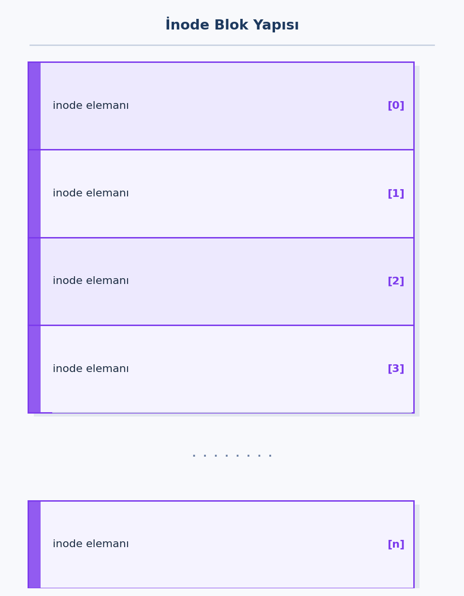
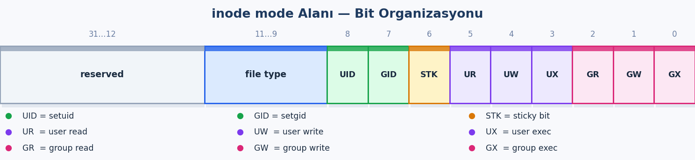

.. _dosya-sistemi-2:

=========================
Dosya Sistemi - II. Bölüm
=========================

Bu bölümde Linux çekirdeğinin dosya sistemine ilişkin bazı ayrıntıları ``simplefs`` isimli bir dosya sistemini 
gerçekleşitrerek açıklayacağız. ``simplefs`` dosya sistemi **Linux Kernel - İşletim Sistemlerinin Tasatımı ve Gerçekleştirilmesi**
kursuna sınıf içerisinde tasarlanmış oldukça basit bir dosya sistemidir. Bu dosya sistemini bugün yoğun biçimde kullandığımız
*ext2* gibi *ext4* gibi dosya sistemlerinin basit bir biçimi gibi düşünebilirsiniz. 

Hazırlık İşlemleri
==================

*simplfs* dosya sistemiminin gerçekleştirimine başlamadan önce bazı hazırlık bilgileri vereceğiz.

Linux Çekirdeğinde Kullanılan Temel Türlere İlişkin typedef İsimleri
---------------------------------------------------------------------

Linux çekirdeğinin kodlamasında tür ve uzunluk belirten bazı typedef tür isimleri kullanılmıştır.
Çekirdeğin içsel kodlarında belli uzunlukta tamsayı türleri ``include/linux/types.h`` dosyası
içerisinde aşağıdaki isimlerle typedef edilmiştir:

.. code-block:: c

    typedef unsigned char      __u8;
    typedef signed char        __s8;
    typedef unsigned short     __u16;
    typedef signed short       __s16;
    typedef unsigned int       __u32;
    typedef signed int         __s32;
    typedef unsigned long long __u64;
    typedef signed long long   __s64;

    typedef __u8    u8;
    typedef __s8    s8;
    typedef __u16   u16;
    typedef __s16   s16;
    typedef __u32   u32;
    typedef __s32   s32;
    typedef __u64   u64;
    typedef __s64   s64;

    typedef unsigned long  ulong;
    typedef unsigned int   uint;
    typedef unsigned short ushort;

Endian bilgisinin de vurgulandığı türler ``include/uapi/linux/types.h`` dosyası içerisinde
aşağıdaki gibi typedef edilmiştir:

.. code-block:: c

    typedef __u16 __bitwise __le16;
    typedef __u16 __bitwise __be16;
    typedef __u32 __bitwise __le32;
    typedef __u32 __bitwise __be32;
    typedef __u64 __bitwise __le64;
    typedef __u64 __bitwise __be64;

Burada işaretli tamsayı türlerinin bulunmadığına dikkat ediniz.

C'ye C99 ile eklenen *intN_t* ve *uintN_t* tür isimleri (örneğin *int32_t* ya da *uint32_t* gibi
tür isimleri) Linux çekirdek kodlarında kullanılmamaktadır. Zaten bunların bildirimleri C'ye özgü
``<stdint.h>`` içerisindedir. Linux çekirdeğinde C'nin herhangi bir standart başlık dosyası
kullanılmamaktadır. Bu nedenle çekirdek kodlamaları yapılırken yukarıda belirttiğimiz *typedef*
türlerini tercih etmelisiniz.

Loop Aygıtları
---------------

Bir dosya sistemini gerçekleştirirken bizim bir diske gereksinimimiz olacaktır. Neyse ki Linux'ta bir 
dosyanın bir disk gibi kullanılmasını sağlayan ismine *loop* denilen aygıt sürücüler bulunmaktadır. Bu *loop* 
aygıtları sayesinde bir dosyayı disk gibi kullanarak denemelerimizi kolay bir biçimde yapabileceğiz. O halde önce bu *loop* aygıt
sürücüsünün nasıl kullanıldığını açıklayalım.

*loop* aygıt sürücülerine ilişkin aygıt dosyaları Linux'ta ``/dev`` dizininin altında
bulunmaktadır:

.. code-block:: bash

    $ ls /dev/loop* -l
    brw-rw---- 1 root disk  7,   0 Kas 23 12:22 /dev/loop0
    brw-rw---- 1 root disk  7,   1 Kas 23 12:22 /dev/loop1
    brw-rw---- 1 root disk  7,   2 Kas 23 12:22 /dev/loop2
    brw-rw---- 1 root disk  7,   3 Kas 23 12:22 /dev/loop3
    brw-rw---- 1 root disk  7,   4 Kas 23 12:22 /dev/loop4
    brw-rw---- 1 root disk  7,   5 Kas 23 12:22 /dev/loop5
    brw-rw---- 1 root disk  7,   6 Kas 23 12:22 /dev/loop6
    brw-rw---- 1 root disk  7,   7 Kas 23 12:22 /dev/loop7
    crw-rw---- 1 root disk 10, 237 Kas 23 12:22 /dev/loop-control

Görüldüğü gibi bu sistemde majör numaraları aynı olan, minör numaraları farklı olan 8 loop aygıtı
bulunmaktadır.

Loop Aygıtları İçin Dosya Oluşturma
~~~~~~~~~~~~~~~~~~~~~~~~~~~~~~~~~~~

Bir loop aygıtını kullanıma hazır hale getirmek için önce onun kullanacağı bir dosyanın
oluşturulması gerekir. Linux'ta komut satırında içi 0'larla dolu olan bir dosya *dd* (*disk dump*)
komutuyla oluşturulabilir. *dd* komutu aslında iki dosyayı blok blok kopyalamaktadır. Komutta
*if* (*input file*) komut satırı argümanı kaynak dosyayı, *of* (*output file*) komut satırı
argümanı ise hedef dosyayı belirtmektedir. Blok uzunluğu *bs* (*block size*) komut satırı
argümanıyla, kopyalanacak blok sayısı ise *count* argümanıyla belirtilmektedir. *bs* argümanı
kullanılmayabilir; bu durumda varsayılan blok büyüklüğü 512 alınmaktadır. Eğer *count* argümanı
kullanılmazsa tüm kaynak dosya kopyalanana kadar işlemlere devam edilmektedir. Linux'ta
``/dev/zero`` aygıt sürücüsü okunduğunda hep 0 baytı veren bir aygıt sürücüdür. Bu bilgiler
eşliğinde içi 0'larla dolu 10 MB civarında bir dosya şöyle oluşturulabilir:

.. code-block:: bash

    $ dd if=/dev/zero of=mydisk.dat bs=512 count=20480

Bu komutla elimizde içi sıfırlarla dolu 10 MB'lık bir dosya elde etmiş olacağız.

Loop Aygıtlarını Yapılandırma
~~~~~~~~~~~~~~~~~~~~~~~~~~~~~

Dosyayı oluşturduktan sonra onun loop aygıtı tarafından disk gibi kullanılmasını sağlamalıyız.
Bu işlem *losetup* programıyla yapılmaktadır. *losetup* programı şöyle kullanılmaktadır:

.. code-block:: text

    losetup <loop_aygıt_dosyası> <disk_olarak_kullanılacak_dosya>

Örneğin:

.. code-block:: bash

    $ sudo losetup /dev/loop0 mydisk.dat

``/dev/loop`` aygıtına erişebilmek için programın *sudo* ile çalıştırılması gerekmektedir.

Artık elimizde ``mydisk.dat`` dosyasını kullanan *loop0* isimli bir blok aygıtı bulunmaktadır.
Sistemdeki blok aygıtlarını *lsblk* komutu ile görüntülediğimizde bu aygıtı da görmeliyiz:

.. code-block:: bash

    $ lsblk
    NAME   MAJ:MIN RM   SIZE RO TYPE MOUNTPOINTS
    loop0    7:0    0    10M  0 loop
    sda      8:0    0   120G  0 disk
    ├─sda1   8:1    0     1M  0 part
    ├─sda2   8:2    0   513M  0 part /boot/efi
    └─sda3   8:3    0 119,5G  0 part /
    sr0     11:0    1   2,8G  0 rom  /media/kaan/Linux Mint 22.1 Cinnamon 64-bit


Loop Aygıtına İlişkin Diskin Formatlanması ve Mount Edilmesi
~~~~~~~~~~~~~~~~~~~~~~~~~~~~~~~~~~~~~~~~~~~~~~~~~~~~~~~~~~~~

Artık ``/dev/loop0`` dosyasını bir disk gibi kullanabiliriz. Bu diske yazma yaptığımızda bu
işlemden yalnızca bu dosya etkilenecektir. Örneğin bu diskimizi ext2 dosya sistemiyle
formatlayalım:

.. code-block:: bash

    $ sudo mkfs.ext2 /dev/loop0
    mke2fs 1.47.0 (5-Feb-2023)
    Discarding device blocks: bitti
    Creating filesystem with 2560 4k blocks and 2560 inodes

    Allocating group tables: bitti
    Düğüm tabloları yazılıyor: bitti
    Süperblokların ve dosya sisteminin hesap bilgileri yazılıyor: bitti

Şimdi de bu dosya sistemini mount edelim. Bunun için önce mount noktası olarak kullanılacak boş
bir dizin oluşturmamız gerekir. (Aslında mount noktası içi dolu bir dizin de olabilir; bu durumda
mount işleminden sonra o dizinin içeriğine unmount yapılana kadar erişilemez.):

.. code-block:: bash

    $ mkdir ext2-test

Mount işlemi şöyle yapılabilir:

.. code-block:: bash

    $ sudo mount /dev/loop0 ext2-test

Artık *ext2-test* dizinine geçtiğimizde yeni bir kök dizine geçmiş oluruz. Mount sonrasında mount
noktasına ilişkin dizinin (örneğimizdeki *ext2-test*) sahibi ve grubu *root* olacaktır. Tabii
isterseniz *chown* komutuyla bunu değiştirebilirsiniz:

.. code-block:: bash

    $ sudo chown kaan:study ext2-test

Eğer dizinin sahibini *root* olarak bırakırsanız bu dizinde girdi yaratmak için hep *sudo*
komutunu kullanmak zorunda kalırsınız.

Geri Alma İşlemleri
~~~~~~~~~~~~~~~~~~~~

Peki bu işlemlerin hepsi nasıl geri alınacaktır? Geri alımları sırasıyla tersine yapmak gerekir.
Önce unmount işlemi yapılmalıdır:

.. code-block:: bash

    $ sudo umount ext2-test

Bundan sonra *loop* aygıtının dosyayla ilişkisinin kesilerek onun blok aygıtı durumundan
çıkartılması gerekir. Bunun için *"losetup -d"* komutu kullanılmaktadır:

.. code-block:: bash

    $ sudo losetup -d /dev/loop0

Artık *lsblk* komutunda *loop0* aygıtını görmememiz gerekir:

.. code-block:: bash

    $ lsblk
    NAME   MAJ:MIN RM   SIZE RO TYPE MOUNTPOINTS
    sda      8:0    0   120G  0 disk
    ├─sda1   8:1    0     1M  0 part
    ├─sda2   8:2    0   513M  0 part /boot/efi
    └─sda3   8:3    0 119,5G  0 part /
    sr0     11:0    1   2,8G  0 rom  /media/kaan/Linux Mint 22.1 Cinnamon 64-bit

Tabii burada oluşturduğumuz ``mydisk.dat`` dosyası kalmaya devam etmektedir. Biz o dosyayı yine
*losetup* ile blok aygıtı gibi kullanabiliriz ve işlemlerimize kaldığımız yerden devam
edebiliriz.

Loop Aygıtlarının Kullanım Akışı
~~~~~~~~~~~~~~~~~~~~~~~~~~~~~~~~

Aşağıdaki şema, loop aygıtının tipik kullanım akışını özetlemektedir:

.. code-block:: text

    ┌─────────────────────────────────────────────────────────────┐
    │                   Loop Aygıtı Kullanım Akışı                │
    └──────────────────────────┬──────────────────────────────────┘
                               │
                               ▼
    ┌─────────────────────────────────────────────────────────────┐
    │  1. Disk dosyası oluştur                                    │
    │     dd if=/dev/zero of=mydisk.dat bs=512 count=20480        │
    └──────────────────────────┬──────────────────────────────────┘
                               │
                               ▼
    ┌─────────────────────────────────────────────────────────────┐
    │  2. Loop aygıtına bağla                                     │
    │     sudo losetup /dev/loop0 mydisk.dat                      │
    └──────────────────────────┬──────────────────────────────────┘
                               │
                               ▼
    ┌─────────────────────────────────────────────────────────────┐
    │  3. Dosya sistemi oluştur (formatla)                        │
    │     sudo mkfs.ext2 /dev/loop0                               │
    └──────────────────────────┬──────────────────────────────────┘
                               │
                               ▼
    ┌─────────────────────────────────────────────────────────────┐
    │  4. Mount et                                                │
    │     mkdir ext2-test                                         │
    │     sudo mount /dev/loop0 ext2-test                         │
    └──────────────────────────┬──────────────────────────────────┘
                               │
                               ▼
    ┌─────────────────────────────────────────────────────────────┐
    │  5. Kullan  (ext2-test dizini üzerinden erişim)             │
    └──────────────────────────┬──────────────────────────────────┘
                               │
                               ▼
    ┌─────────────────────────────────────────────────────────────┐
    │  6. Geri al (ters sırayla)                                  │
    │     sudo umount ext2-test                                   │
    │     sudo losetup -d /dev/loop0                              │
    └─────────────────────────────────────────────────────────────┘

Little-Endian/Big Endian Sorunu
--------------------------------

Eğer Linux çekirdeği için yazılan kodların hem *little-endian* hem de *big-endian* makinelerde sorunsuz
çalışması isteniyorsa diskten okunan bilgilerin endian dönüştürmesine sokulması gerekir. İşte bunun için Linux 
çekirdeğinde *endian* dönüştürmesi yapan yardımcı fonksiyonlar bulundurulmuştur. Bu fonksiyonların listesini 
aşağıda veriyoruz:

.. code-block:: none

   le16_to_cpu    be16_to_cpu
   le32_to_cpu    be32_to_cpu
   le64_to_cpu    be64_to_cpu

Bu fonksiyonların (aslında birer makro olarak yazılmıştır) başındaki *le* öneki parametrenin *little-endian*
olduğunu, *be* öneki ise *big-endian* olduğunu belirtmektedir. Örneğin ``le32_to_cpu`` fonksiyonu parametre
olarak 32 bitlik işaretsiz *little-endian* bir değeri alır. Eğer o anda çalışılan CPU *little-endian* ise onu
dönüştürmez, *big-endian* ise onu *big-endian* formata dönüştürür. Bu fonksiyonların parametresi gösterici
olan biçimleri de vardır:

.. code-block:: none

   le16_to_cpup    be16_to_cpup
   le32_to_cpup    be32_to_cpup
   le64_to_cpup    be64_to_cpup

Tabii yukarıdakilerin bir de ters biçimleri bulunmaktadır:

.. code-block:: none

   cpu_to_le16    cpu_to_be16    cpu_to_le16p    cpu_to_be16p
   cpu_to_le32    cpu_to_be32    cpu_to_le32p    cpu_to_be32p
   cpu_to_le64    cpu_to_be64    cpu_to_le64p    cpu_to_be64p

simplefs Dosya Sisteminin Tasarımı
==================================

Sıfırdan bir dosya sistemi tasarlanacaksa öncelikle dosya sisteminin disk organizasyonu üzerinde
belirlemelerin yapılması gerekir. Her dosya sisteminin bir metadata alanı bir de data alanı vardır.
Metadata alanında dosya sistemine ilişkin parametrik bilgiler ve önemli bölümlerin bilgileri
bulundurulur. Data alanı dosyaların içindeki bilgilerin saklandığı alandır. Bugün kullandığımız
dosya sistemleri evrim süreci içerisinde sürekli iyileştirilmiş ve bugünkü durumlarına
getirilmiştir. Dolayısıyla örneğin ext4 gibi bir dosya sisteminin ya da FAT32 gibi bir dosya
sisteminin gerçekleştirimini bir proje biçiminde yapmak gerekir. Yani bunun için belli bir süre düzenli
çalışma zamanının ayrılması gerekir. Biz burada oldukça basit bir dosya sistemini gerçekleştirmeye
çalışacağız. Bu dosya sistemini *simplefs* olarak isimlendireceğiz.

simplefs Dosya Sisteminin Disk Organizasyonu
--------------------------------------------

*simplefs* dosya sisteminin disk organizasyonu aşağıdaki şekilde gösterilmektedir:


   ``simplefs`` dosya sisteminin disk organizasyonu

*simplefs* dosya sistemimizin ilk bloğu (yani ilk 4096 byte'ı) süper bloktur. Burada dosya
sistemimize ilişkin önemli parametrik bilgiler tutulmaktadır. UNIX/Linux sistemlerinde her dosyanın
bilgileri diskte *inode blok* denilen bir grup bloktaki inode elemanlarında tutulmaktadır.

Inode Blok Yapısı
~~~~~~~~~~~~~~~~~~

Inode blok, aşağıdaki gibi inode elemanlarından oluşmaktadır:



   Inode blok yapısı

Her dosya ve dizin için dosya sisteminin diskte bir inode elemanını tahsis etmesi gerekir. Boş bir
inode elemanının belirlenebilmesi için inode tabanlı dosya sistemlerinde genellikle bir *inode
bitmap* kullanılmaktadır. Bu *inode bitmap* içerisindeki her bit ilgili inode elemanının boş mu
dolu mu olduğunu göstermektedir. Dosya sistemimizde inode bitmap bir blok yer kapladığına göre
toplamda 4096 × 8 = 32768 inode elemanının durumu tutulabilmektedir.

Inode tabanlı dosya sistemlerinde *data blok* içerisindeki blokların da boş mu dolu mu olduğu
bilgisi benzer biçimde bir *data bitmap* ile tutulmaktadır. Bu *data bitmap* içerisindeki her bit
diskteki data bloğunun boş mu dolu mu olduğu bilgisini tutmaktadır.

Pek çok dosya sisteminin disk organizasyonunda dizinler de birer dosyaymış gibi ele alınmaktadır.
Dolayısıyla her dizin data bloğunda bir blok yer kaplamaktadır. Genellikle kök dizin belli bir
yerde bulundurulur. Kök dizinin yeri de süper blokta belirtilir. Tabii kök dizin için en uygun yer
data bloklarının ilk bloğudur.

*simplefs* dosya sistemimizde her dosya ve dizin en fazla bir blok (yani varsayılan olarak 4096
byte) uzunluğunda olabilmektedir. Bu kısıtı koyduğumuzda artık dosyanın bloklarının yerlerini
tutmamıza gerek kalmaz. *simplefs* dosya sistemimizdeki inode elemanlarının sayısı formatlama
sırasında belirlenebilmektedir. Ancak *data bitmap* ve *inode bitmap* 4096 × 8 = 32768 bitten
oluştuğuna göre dosya sistemi de en fazla 32768 × 4096 = 134 MB büyüklüğünde bir diski
desteklemektedir.

Süper Blok Yapısı
~~~~~~~~~~~~~~~~~~

Diskimizin süper blok bilgileri aşağıdaki C yapısıyla tanımlanmıştır:

.. code-block:: c

    struct simplefs_disk_super_block {
        __le32 magic;              /* 0x53494D46 ("SIMF") */
        __le32 block_size;         /* 4096 */
        __le32 inode_count;        /* Total inodes */
        __le32 block_count;        /* Total blocks */
        __le32 free_inodes;        /* Free inodes */
        __le32 free_blocks;        /* Free blocks */
        __le32 inode_table_block;  /* Start of the inode table (3) */
        __le32 inode_table_size;   /* Size of the inode table */
        __le32 data_block_start;   /* Start of data blocks */
        __u8   padding[4060];      /* Padding to 4096 bytes */
    };

Buradaki *__le32* türü *little endian* 4 byte'lık tamsayı türünü temsil etmektedir. Buradaki
*little endian* belirlemesiyle derleyici özel bir işlem uygulamaz; yalnızca dosya sistemini
gerçekleştirenler için okunabilirliği artırmaktadır. Yani burada söylenmek istenen şey
"makineniz big endian olsa bile bu bilgiler diskte little endian biçiminde tutulmaktadır"
bilgisidir.

Her dosya sisteminde bir *sihirli sayı* (*magic number*) bulundurulur. *simplefs* dosya
sistemimizdeki sihirli sayı süper blokta ``0x53494D46`` ("SIMF") biçiminde tutulmaktadır.
Süper blok içerisindeki ``block_size`` elemanı her zaman 4096 biçimindedir. İleride bu dosya
sistemini farklı blok uzunluklarıyla da çalışabilir hale getirebilirsiniz. Ancak bizim dosya
sistemimizde bir blok her zaman 4096 byte'tır.

Süper bloktaki ``inode_count`` elemanı inode elemanlarının toplam sayısını belirtmektedir. Disk
bölümü içerisinde toplamda buradaki sayıdan daha fazla dosya ve dizin bulunamaz; çünkü her dosya
ve dizin için bir inode elemanı kullanılmaktadır. ``block_count`` alanında ise diskteki tüm
blokların sayısı tutulmaktadır; bu bloklara metadata blokları da dahildir. ``free_inodes`` ve
``free_blocks`` elemanları kullanılmayan inode elemanlarının ve blokların sayısını belirtmektedir.

Inode tablosunun yeri ``inode_table_block`` alanında tutulmaktadır. Dosya sistemimizde burada her
zaman 3 değeri bulunacaktır. Ancak bu dosya sistemini iyileştirmek isterseniz geleceğe uyum için
bu alan bulundurulmaktadır. Inode elemanlarının sayısı formatlama sırasında belirtilmektedir.
Dolayısıyla inode bloktaki blok sayısı da değişebilmektedir. Inode bloğun bir blok uzunlukta
olmayabileceğine dikkat ediniz. ``data_block_start`` alanında data bloğun başlangıç blok numarası
bulunmaktadır. Data bloğun ilk bloğunda kök dizinin içeriğinin bulunduğunu anımsayınız.

Bu alanların anlamları aşağıdaki tabloda özetlenmiştir:

.. list-table:: simplefs Süper Blok Alanları
   :widths: 22 10 68
   :header-rows: 1

   * - Alan
     - Tür
     - Açıklama
   * - ``magic``
     - ``__le32``
     - ``0x53494D46`` — sihirli sayı ("SIMF")
   * - ``block_size``
     - ``__le32``
     - Her zaman 4096 byte
   * - ``inode_count``
     - ``__le32``
     - Format sırasında belirlenir
   * - ``block_count``
     - ``__le32``
     - Aygıt boyutu / 4096
   * - ``free_inodes``
     - ``__le32``
     - Dinamik güncellenir
   * - ``free_blocks``
     - ``__le32``
     - Dinamik güncellenir
   * - ``inode_table_block``
     - ``__le32``
     - Her zaman 3
   * - ``inode_table_size``
     - ``__le32``
     - ``(inode_count + 63) / 64`` — yukarı yuvarlanır
   * - ``data_block_start``
     - ``__le32``
     - ``3 + inode_table_size + 1``
   * - ``padding[4060]``
     - ``__u8[]``
     - Bloğu 4096 byte'a tamamlamak için dolgu

İzleyen paragraflarda da göreceğimiz gibi bir inode elemanı inode blokta 64 byte yer kaplamaktadır.
Dolayısıyla bir blokta 64 inode elemanı bulunmaktadır. Yukarıdaki tabloda ``inode_table_size``
açıklamasında inode elemanlarının sayısı 64'e doğru yukarı yuvarlanmıştır.

Disk *simplefs* dosya sistemi ile formatlanırken inode sayısı da formatlama sırasında
belirtilmektedir. Örneğin:

.. code-block:: bash

    $ ./mkfs.simplefs /dev/loop0 512

Disk Inode Elemanının Yapısı
~~~~~~~~~~~~~~~~~~~~~~~~~~~~~
 
Inode bloğun inode elemanlarından oluştuğunu ve *simplefs* dosya sistemimizde bu bloğun değişken
uzunlukta olabileceğini belirtmiştik. *simplefs* dosya sisteminde diskteki bir inode elemanının
alanları ``simplefs_disk_inode`` adlı C yapısıyla tanımlanmıştır:
 
.. code-block:: c
 
    struct simplefs_disk_inode {
        __le32 mode;            /* File type + permissions */
        __le32 uid;             /* Owner user ID */
        __le32 gid;             /* Owner group ID */
        __le32 size;            /* File size in bytes */
        __le32 nlink;           /* Hard link count */
        __le32 blocks;          /* Block count (0 or 1) */
        __le32 block_no;        /* Data block number */
        __le32 ctime;           /* Creation time */
        __le32 mtime;           /* Modification time */
        __le32 atime;           /* Access time */
        __u8   padding[24];     /* Padding to 64 bytes */
    };
 
Inode elemanının ``mode`` alanında dosyanın tür bilgisi ve erişim hakları tutulmaktadır. Burada
Linux'un uyguladığı bitsel organizasyon kullanılmaktadır:
 

 
   inode ``mode`` alanının bit organizasyonu
 
.. list-table:: ``mode`` Alanı Bit Açıklamaları
   :widths: 12 88
   :header-rows: 1
 
   * - Kısaltma
     - Açıklama
   * - ``UID``
     - setuid biti
   * - ``GID``
     - setgid biti
   * - ``STK``
     - sticky bit
   * - ``UR``
     - Kullanıcı okuma (*user read*)
   * - ``UW``
     - Kullanıcı yazma (*user write*)
   * - ``UX``
     - Kullanıcı çalıştırma (*user execute*)
   * - ``GR``
     - Grup okuma (*group read*)
   * - ``GW``
     - Grup yazma (*group write*)
   * - ``GX``
     - Grup çalıştırma (*group execute*)
 
Inode elemanının ``uid`` ve ``gid`` alanları dosyaya ilişkin kullanıcı ve grup kimliklerini
belirtmektedir. ``size`` alanı dosyanın uzunluğunu, ``nlink`` alanı hard link sayacını
belirtmektedir. *simplefs* sistemimizde dosyalar en fazla bir blok yer kapladığından yalnızca tek
bir bloğun yeri tutulacaktır. Inode elemanının ``block_no`` alanı dosyanın bulunduğu bloğu
belirtmektedir.
 
Inode elemanının ``ctime``, ``mtime`` ve ``atime`` alanları sırasıyla inode bilgilerinin son
güncelleme zamanını, dosyanın son değiştirilme zamanını ve dosyanın son okunma zamanını
belirtmektedir.
Buradaki zamanlar 01/01/1970'ten geçen saniye sayısı biçiminde tutulmaktadır. Biz burada her ne
kadar *dosya* terimini kullandıysak da dizinleri de kastetmekteyiz; çünkü dizinlerin de inode
elemanları vardır.
 
Inode tabanlı dosya sistemlerinde inode bloktaki ilk inode elemanı *reserved* bırakılmaktadır. Bu
inode elemanının inode numarası 0'dır. (Eski sistemlerde 0 numaralı inode elemanı "başarısızlık"
anlamında kullanılıyordu.) Linux'un ext dosya sistemlerinde ilk 2 inode elemanı *reserved*
yapılmıştır. Biz *simplefs* dosya sistemimizde yalnızca 0 numaralı inode elemanını *reserved*
yapacağız. Bizim dosya sistemimizde kök dizinin bilgileri her zaman 1 numaralı inode elemanında
bulunacaktır.

Dizin Girişleri
~~~~~~~~~~~~~~~~
 
*simplefs* dosya sistemimizdeki her dizin girişi eşit uzunluktadır. (ext dosya sistemlerinde
bunların eşit uzunlukta olmadığını anımsayınız.) *simplefs* dosya sistemimizdeki dizin
girişlerinin formatı ``simplefs_disk_dentry`` yapısıyla tanımlanmıştır:
 
.. code-block:: c
 
    #define SIMPLEFS_FILENAME_MAXLEN        32
 
    struct simplefs_disk_dentry {
        __le32 inode;                           /* İnode number */
        char name[SIMPLEFS_FILENAME_MAXLEN];    /* File name */
    };
 
Dizin girişinin ilk alanında ilgili dosyanın inode numarası bulunmaktadır. Dosya ismi her zaman
32 byte yer kaplamaktadır. Dosya isminin sonunda null karakter vardır. Biz genel olarak dizin
girişlerindeki isimlerin sonuna null padding uygulayacağız. Bu durumda dosya isimleri en fazla
31 karakter olabilmektedir.
 
Formatlama Programı: mkfs.simplefs
------------------------------------
 
Bir dosya sistemini gerçekleştirirken ilk yapacağımız işlemlerden biri formatlama programının
yazılmasıdır. Formatlama programı disk bölümünü (yani blok aygıtını) metadata alanlarını
oluşturarak kullanıma hazır hale getirmektedir. Dosya sistemi aygıt sürücümüz bu metadata
alanlarını kullanacaktır. Biz formatlama programımıza *mkfs.simplefs* ismini vereceğiz.
 
*simplefs* dosya sisteminin formatlanması sırasında şu işlemler yapılmalıdır:
 
1. Süper blok bilgileri oluşturulup blok aygıtının ilk bloğuna yazılmalıdır.
 
2. Inode bitmap'ta 0 ve 1 numaralı inode elemanlarının bitleri 1 yapılmalıdır. Anımsayacağınız
   gibi 0 numaralı inode elemanı *reserved* durumdaydı, 1 numaralı inode elemanı ise kök dizine
   ilişkindi.
 
3. Data bitmap'in de ilk duruma getirilmesi gerekir. 0 numaralı data bloğu kök dizini içerdiği
   için onun bitinin 1 yapılması gerekir.
 
4. Inode bloğun da ilk durumuna getirilmesi gerekir. Inode bloğun ilk inode elemanı 0'lar
   içerecek biçimde boş bırakılmalıdır. Ancak sonraki inode elemanı (yani 1 numaralı inode
   elemanı) kök dizin bilgilerini tutacak biçimde güncellenmelidir.
 
5. Sıra kök dizindeki dizin girişlerinin başlangıçtaki durumunu oluşturmaya gelmiştir. Kök
   dizinde "." ve ".." isimli iki dizin girişinin bulundurulması gerekir. Bu dizin girişlerinin
   inode numaralarının yine kök dizinin inode numarasını (örneğimizde 1) içermesi gerekmektedir.
 
Format programımızda önce komut satırı argümanları kontrol edilmiştir:
 
.. code-block:: c
 
    int n_inodes = DEF_NUMBER_OF_INODES;
    int fd;
 
    if (argc > 3) {
        fprintf(stderr, "too many arguments!\n");
        fprintf(stderr, "usage: mkfs.simplefs <device_path> [number_of_inodes]\n");
        exit(EXIT_FAILURE);
    }
    if (argc == 1) {
        fprintf(stderr, "too few arguments!\n");
        fprintf(stderr, "usage: mkfs.simplefs <device_path> [number_of_inodes]\n");
        exit(EXIT_FAILURE);
    }
 
    if (argc == 3) {
        n_inodes = atoi(argv[2]);
        if (n_inodes < MIN_NUMBER_OF_INODES || n_inodes > MAX_NUMBER_OF_INODES) {
            fprintf(stderr, "incorrect number of inodes!...\n");
            exit(EXIT_FAILURE);
        }
    }
 
Sonra aygıt dosyası ``open`` fonksiyonuyla açılmıştır:
 
.. code-block:: c
 
    if ((fd = open(argv[1], O_WRONLY)) == -1)
        exit_sys(argv[1]);
 
Süper bloğun yazılması ``write_super_block`` fonksiyonu tarafından yapılmaktadır:
 
.. code-block:: c
 
    int write_super_block(int fd, int n_inodes, struct simplefs_disk_super_block *sbd)
    {
        uint64_t size;
 
        sbd->magic = SIMPLEFS_MAGIC;
        sbd->block_size = SIMPLEFS_BLOCK_SIZE;
        sbd->inode_count = n_inodes;
        /*
        if (ioctl(fd, BLKGETSIZE64, &size) == -1)
            return -1;
        */
        if ((size = lseek(fd, 0, SEEK_END)) == -1)
            return -1;
 
        sbd->block_count = size / SIMPLEFS_BLOCK_SIZE;
        sbd->free_inodes = n_inodes - 2;
        sbd->inode_table_block = 3;
        sbd->inode_table_size = (n_inodes + INODE_SIZE - 1) / INODE_SIZE;
        sbd->data_block_start = 3 + sbd->inode_table_size;
        sbd->free_blocks = sbd->block_count - sbd->data_block_start - 1;
 
        lseek(fd, 0, SEEK_SET);
        if (write(fd, sbd, sizeof(*sbd)) != (ssize_t)sizeof(*sbd))
            return -1;
 
        return 0;
    }
 
Burada diskin uzunluğunu bulmak için dosya göstericisini sona çekip onun konumunu aldık. Aslında
aynı işlem blok aygıt sürücülerine ``BLKGETSIZE64`` ioctl komutu gönderilerek de yapılabilmektedir.
``write_super_block`` fonksiyonunun ikinci parametresinin inode elemanlarının sayısını belirttiğine
dikkat ediniz.
 
Süper bloğu oluşturduktan sonra inode bitmap ve data bitmap blokları oluşturulmalıdır. Inode
bitmap içerisindeki her bit bir inode elemanının dolu mu boş mu olduğunu tutmaktadır. Başlangıçta
ilk iki inode elemanı doludur. Anımsayacağınız gibi 0'ıncı inode elemanı pek çok inode tabanlı
dosya sisteminde hiç kullanılmamaktadır. Bizim dosya sistemimizde kök dizinin bilgileri 1 numaralı
inode elemanındadır. Inode bitmap'in ilk iki bitini 1'leyip geri kalan bitlerini 0'lamak için en
pratik yöntem önce içi sıfırlarla dolu bir dizi almak, sonra dizinin ilk elemanının düşük anlamlı
iki bitini 1'lemektir. Bu işlem formatlama programımızda şöyle yapılmıştır:
 
.. code-block:: c
 
    unsigned char bitmap[SIMPLEFS_BLOCK_SIZE] = {0};
    /* ... */
 
    bitmap[0] = 0x03;           /* first two bits in inode bitmap must be 1 */
    if (write(fd, bitmap, SIMPLEFS_BLOCK_SIZE) != SIMPLEFS_BLOCK_SIZE) {
        fprintf(stderr, "cannot write inode bitmap!..\n");
        exit(EXIT_FAILURE);
    }
 
Data bitmap'in yalnızca ilk biti 1 olmalıdır. Çünkü diskin data bloğunda yalnızca ilk blok
(orada kök dizinin olduğunu anımsayınız) doludur. Bu işlem de formatlama programımızda şöyle
yapılmıştır:
 
.. code-block:: c
 
    bitmap[0] = 0x01;       /* first bit in data bitmap must be 1 */
    if (write(fd, bitmap, SIMPLEFS_BLOCK_SIZE) != SIMPLEFS_BLOCK_SIZE) {
        fprintf(stderr, "cannot write data bitmap!..\n");
        exit(EXIT_FAILURE);
    }
 
Sıra inode tablosunun yazılmasına gelmiştir. Inode tablosundaki ilk inode elemanının boş olması
gerektiğini anımsayınız. Sonraki inode elemanı (yani 1 numaralı inode elemanı) kök dizinine
ilişkin inode elemanı olmalıdır. Format programımızda inode tablosu ``write_inode_table`` isimli
bir fonksiyonla ilk haline getirilmiştir:
 
.. code-block:: c
 
    int write_inode_table(int fd, struct simplefs_disk_super_block *sbd)
    {
        unsigned char buf[SIMPLEFS_BLOCK_SIZE] = {0};
        struct simplefs_disk_inode inoded = {0};
        time_t curtime;
        off_t pos;
 
        pos = lseek(fd, 0, SEEK_CUR);
        for (int i = 0; i < sbd->inode_table_size; ++i)
            if (write(fd, buf, SIMPLEFS_BLOCK_SIZE) != SIMPLEFS_BLOCK_SIZE)
                return -1;
 
        lseek(fd, pos, SEEK_SET);
        if (write(fd, &inoded, sizeof(inoded)) != (ssize_t)sizeof(inoded))
            return -1;
 
        inoded.mode = S_IFDIR | S_IRWXU | S_IRWXG | S_IRWXO;
        inoded.uid = 0;
        inoded.gid = 0;
        inoded.size = SIMPLEFS_BLOCK_SIZE;
        inoded.nlink = 3;
        inoded.blocks = 1;
        inoded.block_no = sbd->data_block_start;
 
        curtime = time(NULL);
        inoded.ctime = curtime;
        inoded.mtime = curtime;
        inoded.atime = curtime;
 
        if (write(fd, &inoded, sizeof(inoded)) != (ssize_t)sizeof(inoded))
            return -1;
 
        return 0;
    }
 
Kök dizine ilişkin inode elemanının ``size`` alanına ``SIMPLEFS_BLOCK_SIZE`` değerini
yerleştirdiğimize dikkat ediniz. Pek çok dosya sisteminde dizin dosyalarının uzunluğu onlar için
ayrılan blokların toplam uzunluğu ile ifade edilmektedir. Biz de *simplefs* dosya sistemimizde
tüm dizinlerin uzunluklarını ``SIMPLEFS_BLOCK_SIZE`` yani 4096 biçiminde set edeceğiz.
 
Artık son olarak kök dizinin girişlerinin oluşturulması gerekir. Kök dizinin ilk girişinin "."
ve ".." dizinlerinden oluşması zorunludur. Bu dizin girişlerini kök dizine ilişkin bloğun ilk iki
girişine yazmak için formatlama programımızda ``write_dentries`` fonksiyonu kullanılmıştır:
 
.. code-block:: c
 
    int write_dentries(int fd, struct simplefs_disk_super_block *sbd)
    {
        unsigned char buf[SIMPLEFS_BLOCK_SIZE] = {0};
        struct simplefs_disk_dentry de = {0};
 
        lseek(fd, sbd->data_block_start * SIMPLEFS_BLOCK_SIZE, SEEK_SET);
        if (write(fd, buf, SIMPLEFS_BLOCK_SIZE) != SIMPLEFS_BLOCK_SIZE)
            return -1;
 
        lseek(fd, sbd->data_block_start * SIMPLEFS_BLOCK_SIZE, SEEK_SET);
        de.inode = 2;
        strcpy(de.name, ".");
        if (write(fd, &de, SIMPLEFS_DENTRY_LEN) != SIMPLEFS_DENTRY_LEN)
            return -1;
 
        de.inode = 2;
        strcpy(de.name, "..");
        if (write(fd, &de, SIMPLEFS_DENTRY_LEN) != SIMPLEFS_DENTRY_LEN)
            return -1;
 
        return 0;
    }
 
Formatlama programımızın tamamı ``mkfs.simplefs.c`` ismiyle aşağıda verilmiştir:
 
.. code-block:: c
 
    #include <stdio.h>
    #include <stdlib.h>
    #include <string.h>
    #include <stdint.h>
    #include <time.h>
    #include <fcntl.h>
    #include <sys/stat.h>
    #include <unistd.h>
    #include <sys/ioctl.h>
    #include <linux/fs.h>
    #include <linux/types.h>
 
    #define SIMPLEFS_BLOCK_SIZE         4096
    #define DEF_NUMBER_OF_INODES        1024
    #define MAX_NUMBER_OF_INODES        (4096 * 8)
    #define MIN_NUMBER_OF_INODES        50
    #define INODE_SIZE                  64
    #define SIMPLEFS_FILENAME_MAXLEN    32
    #define SIMPLEFS_DENTRY_LEN         36
    #define SIMPLEFS_MAGIC              0x53494D46
 
    struct simplefs_disk_super_block {
        __le32 magic;              /* 0x464D4953 ("SIMF") */
        __le32 block_size;         /* 4096 */
        __le32 inode_count;        /* Total inodes */
        __le32 block_count;        /* Total blocks */
        __le32 free_inodes;        /* Free inodes */
        __le32 free_blocks;        /* Free blocks */
        __le32 inode_table_block;  /* Start of the inode table (3) */
        __le32 inode_table_size;   /* Size of the inode table */
        __le32 data_block_start;   /* Start of data blocks */
        __u8   padding[4060];      /* Padding to 4096 bytes */
    };
 
    struct simplefs_disk_inode {
        __le32 mode;            /* File type + permissions */
        __le32 uid;             /* Owner user ID */
        __le32 gid;             /* Owner group ID */
        __le32 size;            /* File size in bytes */
        __le32 nlink;           /* Hard link count */
        __le32 blocks;          /* Block count (0 or 1) */
        __le32 block_no;        /* Data block number */
        __le32 ctime;           /* Creation time */
        __le32 mtime;           /* Modification time */
        __le32 atime;           /* Access time */
        __u8   padding[24];     /* Padding to 64 bytes */
    };
 
    struct simplefs_disk_dentry {
        __le32 inode;                           /* Inode number */
        char name[SIMPLEFS_FILENAME_MAXLEN];    /* File name */
    };
 
    int write_super_block(int fd, int n_inodes, struct simplefs_disk_super_block *sbd);
    int write_inode_table(int fd, struct simplefs_disk_super_block *sbd);
    int write_dentries(int fd, struct simplefs_disk_super_block *sbd);
    void exit_sys(const char *msg);
 
    /* usage: mkfs.simplefs <device_path> [number_of_inodes] */
 
    int main(int argc, char *argv[])
    {
        int n_inodes = DEF_NUMBER_OF_INODES;
        int fd;
        unsigned char bitmap[SIMPLEFS_BLOCK_SIZE] = {0};
        struct simplefs_disk_super_block sbd = {0};
 
        if (argc > 3) {
            fprintf(stderr, "too many arguments!\n");
            fprintf(stderr, "usage: mkfs.simplefs <device_path> [number_of_inodes]\n");
            exit(EXIT_FAILURE);
        }
        if (argc == 1) {
            fprintf(stderr, "too few arguments!\n");
            fprintf(stderr, "usage: mkfs.simplefs <device_path> [number_of_inodes]\n");
            exit(EXIT_FAILURE);
        }
 
        if (argc == 3) {
            n_inodes = atoi(argv[2]);
            if (n_inodes < MIN_NUMBER_OF_INODES || n_inodes > MAX_NUMBER_OF_INODES) {
                fprintf(stderr, "incorrect number of inodes!. Number of inodes must be "
                                "between 50 and 32768...\n");
                exit(EXIT_FAILURE);
            }
        }
 
        if ((fd = open(argv[1], O_WRONLY)) == -1)
            exit_sys(argv[1]);
 
        if (write_super_block(fd, n_inodes, &sbd) == -1)
            exit_sys("write_super_block");
 
        bitmap[0] = 0x03;       /* first two bits in inode bitmap must be 1 */
        if (write(fd, bitmap, SIMPLEFS_BLOCK_SIZE) != SIMPLEFS_BLOCK_SIZE) {
            fprintf(stderr, "cannot write inode bitmap!..\n");
            exit(EXIT_FAILURE);
        }
 
        bitmap[0] = 0x01;       /* first bit in data bitmap must be 1 */
        if (write(fd, bitmap, SIMPLEFS_BLOCK_SIZE) != SIMPLEFS_BLOCK_SIZE) {
            fprintf(stderr, "cannot write data bitmap!..\n");
            exit(EXIT_FAILURE);
        }
 
        if (write_inode_table(fd, &sbd) == -1) {
            fprintf(stderr, "cannot write inode table!..\n");
            exit(EXIT_FAILURE);
        }
 
        if (write_dentries(fd, &sbd) == -1) {
            fprintf(stderr, "cannot write dentries!..\n");
            exit(EXIT_FAILURE);
        }
 
        printf("mkfs.simplefs completed successfully...\n");
 
        return 0;
    }
 
    int write_super_block(int fd, int n_inodes, struct simplefs_disk_super_block *sbd)
    {
        uint64_t size;
 
        sbd->magic = SIMPLEFS_MAGIC;
        sbd->block_size = SIMPLEFS_BLOCK_SIZE;
        sbd->inode_count = n_inodes;
        /*
        if (ioctl(fd, BLKGETSIZE64, &size) == -1)
            return -1;
        */
        if ((size = lseek(fd, 0, SEEK_END)) == -1)
            return -1;
 
        sbd->block_count = size / SIMPLEFS_BLOCK_SIZE;
        sbd->free_inodes = n_inodes - 2;
        sbd->inode_table_block = 3;
        sbd->inode_table_size = (n_inodes + INODE_SIZE - 1) / INODE_SIZE;
        sbd->data_block_start = 3 + sbd->inode_table_size;
        sbd->free_blocks = sbd->block_count - sbd->data_block_start - 1;
 
        lseek(fd, 0, SEEK_SET);
        if (write(fd, sbd, sizeof(*sbd)) != (ssize_t)sizeof(*sbd))
            return -1;
 
        return 0;
    }
 
    int write_inode_table(int fd, struct simplefs_disk_super_block *sbd)
    {
        unsigned char buf[SIMPLEFS_BLOCK_SIZE] = {0};
        struct simplefs_disk_inode inoded = {0};
        time_t curtime;
        off_t pos;
 
        pos = lseek(fd, 0, SEEK_CUR);
        for (int i = 0; i < sbd->inode_table_size; ++i)
            if (write(fd, buf, SIMPLEFS_BLOCK_SIZE) != SIMPLEFS_BLOCK_SIZE)
                return -1;
 
        lseek(fd, pos, SEEK_SET);
        if (write(fd, &inoded, sizeof(inoded)) != (ssize_t)sizeof(inoded))
            return -1;
 
        inoded.mode = S_IFDIR | S_IRWXU | S_IRWXG | S_IRWXO;
        inoded.uid = 0;
        inoded.gid = 0;
        inoded.size = SIMPLEFS_BLOCK_SIZE;
        inoded.nlink = 3;
        inoded.blocks = 1;
        inoded.block_no = sbd->data_block_start;
 
        curtime = time(NULL);
        inoded.ctime = curtime;
        inoded.mtime = curtime;
        inoded.atime = curtime;
 
        if (write(fd, &inoded, sizeof(inoded)) != (ssize_t)sizeof(inoded))
            return -1;
 
        return 0;
    }
 
    int write_dentries(int fd, struct simplefs_disk_super_block *sbd)
    {
        unsigned char buf[SIMPLEFS_BLOCK_SIZE] = {0};
        struct simplefs_disk_dentry de = {0};
 
        lseek(fd, sbd->data_block_start * SIMPLEFS_BLOCK_SIZE, SEEK_SET);
        if (write(fd, buf, SIMPLEFS_BLOCK_SIZE) != SIMPLEFS_BLOCK_SIZE)
            return -1;
 
        lseek(fd, sbd->data_block_start * SIMPLEFS_BLOCK_SIZE, SEEK_SET);
        de.inode = 2;
        strcpy(de.name, ".");
        if (write(fd, &de, SIMPLEFS_DENTRY_LEN) != SIMPLEFS_DENTRY_LEN)
            return -1;
 
        de.inode = 2;
        strcpy(de.name, "..");
        if (write(fd, &de, SIMPLEFS_DENTRY_LEN) != SIMPLEFS_DENTRY_LEN)
            return -1;
 
        return 0;
    }
 
    void exit_sys(const char *msg)
    {
        perror(msg);
 
        exit(EXIT_FAILURE);
    }

simplefs Dosya Sistemi Aygıt Sürücüsünün Gerçekleştirimi
========================================================

``simplefs`` dosya sistemini bir aygıt sürücü olarak yazacağız. Yazıma iskelet bir çekirdek modülü ile başlayabiliriz:

``simplefs.c``

.. code-block:: c

   #include <linux/module.h>
   #include <linux/kernel.h>
   #include <linux/fs.h>

   MODULE_LICENSE("GPL");
   MODULE_AUTHOR("Kaan Aslan");
   MODULE_DESCRIPTION("simplefs");

   static int __init simplefs_module_init(void)
   {
       printk(KERN_INFO "simplefs module init\n");

       return 0;
   }

   static void __exit simplefs_module_exit(void)
   {
       printk(KERN_INFO "simplefs module exit\n");
   }

   module_init(simplefs_module_init);
   module_exit(simplefs_module_exit);

Dosya sistemi aygıt sürücüleri için ilk yapılacak şey ``file_system_type`` türünden global bir nesne tenımlayıp onu
çekirdek modülünün init fonksiyonunda ``register_filesystem`` fonksiyonu ile register ettirmektir:

.. code-block:: c

   static struct file_system_type simplefs_type = {
       .owner = THIS_MODULE,
       .name = "simplefs",
       .mount = simplefs_mount,
       .kill_sb = simplefs_kill_sb,
       .fs_flags = FS_REQUIRES_DEV,
   };

   static int __init simplefs_module_init(void)
   {
       int result;

       if ((result = register_filesystem(&simplefs_type)) != 0)
           return result;

       printk(KERN_INFO "simplefs module init\n");

       return 0;
   }

Anımsayacağınız gibi kullanıcı dosya sistemimizi mount etmeye çalıştığında ``file_system_type`` yapısının ``mount``
elemanına yerleştirilen fonksiyon çağrılmaktadır. Biz bu fonksiyon içerisinde çekirdeğin daha yüksek seviyeli
``mount_bdev`` fonksiyonunu çağırarak mount işlemlerini bu fonksiyona yaptırabiliriz. Yine anımsayacağınız gibi en
yeni çekirdeklerde artık ``mount_bdev`` fonksiyonu yerine ``get_tree_bdev`` fonksiyonu kullanılıyordu. Biz
``simplefs`` dosya sistemimizde önce ``mount_bdev`` fonksiyonunu kullanacağız. Sonra bunu ``get_tree_bdev``
fonksiyonunu kullanacak biçimde değiştireceğiz. ``simplefs`` dosya sistemimizdeki ``simplefs_mount`` fonksiyonu
şöyle yazılmıştır:

.. code-block:: c

   static struct dentry *simplefs_mount(struct file_system_type *type, int flags, const char *dev, void *data)
   {
       return mount_bdev(type, flags, dev, data, simplefs_fill_super);
   }

Burada gerekli işlemlerin çoğu zaten ``mount_bdev`` fonksiyonu tarafından yapılmaktadır. Bizim ``mount_bdev``
fonksiyonu tarafından oluşturulan süper blok nesnesini doldurmamız gerekir. ``mount_bdev`` bu doldurma işlemi için
bizim ``simplefs_fill_super`` fonksiyonumuzu çağırmaktadır. Peki bu süper blok nesnesinin içini nasıl
doldurmalıyız?

.. code-block:: c

   static int simplefs_fill_super(struct super_block *sb, void *data, int silent)
   {
       /* ... */

       return 0;
   }

super_block Nesnesinin İçinin Doldurulması
------------------------------------------

Bizim ``super_block`` yapısı ile temsil edilen süper blok nesnesinin tüm elemanlarını doldurmamıza gerek yoktur.
Ancak yapının aşağıdaki elemanlarını mutlaka doldurmamız gerekir:

``s_magic``: Bu elemana bizim dosya sistemimize ilişkin kendi belirlediğimiz 4 byte'lık bir sihirli sayı atamamız gerekir.
Dosya sistemimizdeki sihirli sayı şöyledir:

.. code-block:: c

   #define SIMPLEFS_MAGIC           0x53494D46
   /* ... */

   sb->s_magic = SIMPLEFS_MAGIC;

``s_blocksize``: ``super_block`` yapısının ``s_blocksize`` ve ``s_blocksize_bits`` elemanlarına dosya sisteminde bir bloğun byte
uzunluğu ve onun log2 değeri yazılmalıdır. Bu işlem için ``sb_set_blocksize`` fonksiyonundan faydalanılabilir.
Örneğin:

.. code-block:: c

   sb_set_blocksize(sb, SIMPLEFS_BLOCK_SIZE);

Bu fonksiyon başarı durumunda bizim ikinci parametreye geçtiğimiz blok uzunluğuna, başarısızlık durumunda 0
değerine geri dönmektedir. Ancak fonksiyon normal bir işleyişte başarısız olamayacağı için hata kontrolünün
yapılmasına gerek yoktur.

``s_maxbytes``: Bu elemana bir dosyada bulunabilecek maksimum byte sayısı yerleştirilmelidir. Bizim ``simplefs`` 
dosya sistemimizde bir dosyada en fazla ``SIMPLEFS_BLOCK_SIZE`` kadar byte tutulabilmektedir. Bu elemana şöyle değer atayabiliriz:

.. code-block:: c

   sb->s_maxbytes = SIMPLEFS_BLOCK_SIZE;

``s_op``: ``super_block`` yapısının ``s_op`` elemanına çekirdek tarafından çeşitli durumlarda çağrılacak fonksiyonların
adresleri yerleştirilmelidir. Biz çekirdeğin bu çok biçimli davranışından daha önce bahsetmiştir. Bu elemana
``super_operations`` isimli bir yapı nesnesinin adresi yerleştirilmelidir. Anımsanacağı gibi bu
``super_operations`` yapısı fonksiyon göstericilerinden oluşmaktadır. Ancak bu yapının da tüm elemanlarının
doldurulması gerekmez. Bizim ``simplefs`` dosya sistemimizde bu yapının aşağıdaki elemanlarına yerleştirme
yapacağız:

.. code-block:: c

   static const struct super_operations simplefs_super_ops = {
       .alloc_inode = simplefs_alloc_inode,
       .free_inode  = simplefs_free_inode,
       .write_inode = simplefs_write_inode,
       .evict_inode = simplefs_evict_inode,
       .statfs      = simple_statfs,
   };

Bu elemanlara girilecek fonksiyonların parametrik yapısı aşağıdaki gibi olmalıdır:

.. code-block:: c

   static struct inode *simplefs_alloc_inode(struct super_block *sb);
   static void simplefs_free_inode(struct inode *inode);
   static int simplefs_write_inode(struct inode *inode, struct writeback_control *wbc);
   static void simplefs_evict_inode(struct inode *inode);

simplefs dosya sistemimiz için süper blok nesnesinin s_op elemanına yerleştirmeyi şöyle yapabiliriz:

.. code-block:: c

   sb->s_op = &simplefs_super_ops;

Biz bu fonksiyonların ne zaman çağrılacağını ve bunların içerisinde ne yapılması gerektiğini izleyen paragraflarda
açıklayacağız.

``s_fs_info``: Çekirdek süper blok nesnelerini ``super_block`` isimli yapıyla temsil etmektedir. Ancak her dosya sisteminin
kendine özgü bir süper blok formatı da vardır. İşte çekirdeğin ``super_block`` yapısından hareketle sistem
programcısının kendi dosya sistemine ilişkin süper blok bilgilerine erişebilmesi gerekir. ``super_block``
yapısının ``s_fs_info`` elemanı bunun için kullanılmaktadır. Biz bu noktada dosya sistemimize ilişkin süper
blok bilgilerini diskten okuyup bunu bir yapı nesnesi içerisinde saklamalıyız. Ancak aslında bizim yalnızca
kendi dosya sistemimize ilişkin diskteki süper blok bilgilerini değil aynı zamanda onun yönetimine yönelik
bilgileri de saklamamız gerekir. Bunun için dosya sistemi tasarımcıları tipik olarak kendi dosya
sistemlerinin süper blok yönetimine ilişkin bir yapı oluşturup diskteki süper blok bilgilerini bu yapı nesnesinin
içerisinde saklamaktadır. ``super_block`` yapısının ``s_fs_info`` elemanına da bu nesnenin adresini
yerleştirmektedir. Biz ``simplefs`` dosya sistemimizdeki süper blok yönetimi için aşağıdaki gibi bir yapı
oluşturabiliriz:

.. code-block:: c

   struct simplefs_super_block {
       struct simplefs_disk_super_block *sbd;
       struct buffer_head *sb_bh;
       struct buffer_head *inode_bitmap_bh;
       struct buffer_head *data_bitmap_bh;
       unsigned long *inode_bitmap;
       unsigned long *data_bitmap;
       spinlock_t lock;
   };

Burada yapının ``sbd`` elemanı bizim diskte tuttuğumuz süper blok bilgilerini göstermektedir. Biz zaten formatlama
programında bu yapıyı aşağıdaki gibi oluşturmuştuk:

.. code-block:: c

   struct simplefs_disk_super_block {
       __le32 magic;              /* 0x464D4953 ("SIMF") */
       __le32 block_size;         /* 4096 */
       __le32 inode_count;        /* Total inodes */
       __le32 block_count;        /* Total blocks */
       __le32 free_inodes;        /* Free inodes */
       __le32 free_blocks;        /* Free blocks */
       __le32 inode_table_block;  /* Start of the inode table (3) */
       __le32 inode_table_size;   /* Size of the inode table */
       __le32 data_block_start;   /* Start of data blocks */
       __u8   padding[4060];      /* Padding to 4096 bytes */
   };

Buradaki ``super_block`` yapısının ``s_fs_info`` elemanı için oluşan durumu aşağıdaki şekil betimlemektedir:



Artık çekirdek bize ``super_block`` nesnesini verdiğinde biz kendi sistemimize ilişkin tüm süper blok bilgilerine
erişiyor olacağız. ``simplefs_super_block`` yapısının ``sbd`` dışındaki diğer elemanlarını izleyen paragraflarda
açıklayacağız.

Biz yukarıdaki bazı süreçlerle doldurulacak elemanlar dışında ``simplefs_fill_super`` fonksiyonumuzun ilk kısmını
şöyle oluşturabiliriz:

.. code-block:: c

   static int simplefs_fill_super(struct super_block *sb, void *data, int silent)
   {
       sb->s_magic = SIMPLEFS_MAGIC;
       sb_set_blocksize(sb, SIMPLEFS_BLOCK_SIZE);
       sb->s_maxbytes = SIMPLEFS_BLOCK_SIZE;
       sb->s_op = &simplefs_super_ops;
       sb->s_flags |= SB_NOATIME;

       /* ... */

       return 0;
   }

``sb->s_flags |= SB_NOATIME`` işlemini dosya sisteminin basit tutulmasını sağlamak amacıyla uyguladık. Bu bayrak
dosyaların erişim zamanlarının güncellenmesini engelleyecektir. İzleyen paragraflarda ``super_block`` yapısının
``s_fs_info`` elemanın ve diğer önemlş elemanlarının nasıl doldurulacağını farklı başlıklar altında açıklayacağız.

Süper Bloğun Diskten Okunması ve sb_bread Fonksiyonu
----------------------------------------------------

Anımsanacağı gibi ``s_fs_info`` bu eleman bizim dosya sistemimizdeki süper blok işlemlerini 
yönetecek ``simplefs_super_block`` nesnesinin adresini tutmaktadır.
Bizim öncelikle bu nesneyi çekirdeğin heap sisteminde tahsis etmemiz gerekir. Biz çekirdeğin heap sistemini henüz
incelemedik. Burada ``kzalloc`` isimli çekirdek fonksiyonuyla bu tahsisatı yapacağız. ``kzalloc`` fonksiyonu
``kmalloc`` fonksiyonun tahsis edilen alanı sıfırlayan bir biçimidir. ``kzalloc`` (ya da ``kmalloc``) ile tahsis edilmiş 
alanlar ``kfree`` fonksiyonuyla serbest bırakılmaktadır. Tahsisatı şöyle yapabiliriz:

.. code-block:: c

   struct simplefs_super_block *sfs_sb;
   /* ... */

   if ((sfs_sb = kzalloc(sizeof(struct simplefs_super_block), GFP_KERNEL)) == NULL) {
       printk(KERN_INFO "cannot allocate simplefs super block!..\n");
       return -ENOMEM;
   }

Biz içi sıfırlarla doldurulmuş ``simplefs_super_block`` türünden bir nesneyi tahsis etmiş olduk. Bu nesnenin
içini doldurmamız gerekir. Bu nesne bizim kendi dosya sistemimizin süper blok işlemleri için faydalanacağımız
elemanlardan oluşmaktadır. Biz önce yapının ``sbd`` elemanını dolduralım. Bu eleman anımsayacağınız gibi bizim
dosya sistemimizin diskteki süper blok bilgilerini tutmaktadır. O halde bizim bu noktada diskin süper bloğunu
(yani 0 numaralı bloğunu) okumamız gerekir. Bu işlemi yapmanın klasik yolu çekirdeğin biraz daha yüksek
seviyeli ``sb_bread`` fonksiyonunu kullanmaktır. Çekirdeğin ``sb_bread`` fonksiyonu süper blok içerisindeki
blok aygıtı bilgilerinden ve blok uzunluğundan faydalanarak diskin belirttiğimiz numaralı bloğunu okumaktadır.
``sb_bread`` fonksiyonun prototipi şöyledir:

.. code-block:: c

   struct buffer_head *sb_bread(struct super_block *sb, sector_t block);

Fonksiyonun birinci parametresi ``super_block`` nesnesinin adresini, ikinci parametresi ise okunacak bloğun
numarasını almaktadır. (Tabii bizim bu fonksiyonu çağırmadan önce ``super_block`` nesnesine blok büyüklüğünü
yerleştirmemiz gerekir.) Fonksiyon okunan bloğu çekirdekte temsil eden ``buffer_head`` nesnesinin adresine geri
dönmektedir. Biz ``buffer_head`` yapısını ve organizasyonunu bellek yönetimi kısmında göreceğiz. Linux'ta bu
``buffer_head`` tasarımına yeni ve modern bir alternatif de eklenmiştir. Buna *bio* sistemi de denilmektedir.
Ancak diskin metadata alanları ile ilgili okuma yazma işlemleri için buffer_head daha uygun bir sistemdir.
``buffer_head`` sistemi  çekirdekten atılabilecek bir tasarım değildir. Çünkü pek çok dosya sistemi
halen bu ``buffer_head`` tasarımını kullanmaktadır. Güncel çekirdeklerde ``buffer_head`` yapısı
``include/linux/buffer_head.h`` dosyasında şöyle bildirilmiştir:

.. code-block:: c

   struct buffer_head {
       unsigned long b_state;              /* buffer state bitmap (see above) */
       struct buffer_head *b_this_page;    /* circular list of page's buffers */
       union {
           struct page  *b_page;           /* the page this bh is mapped to */
           struct folio *b_folio;          /* the folio this bh is mapped to */
       };
       sector_t b_blocknr;                 /* start block number */
       size_t   b_size;                    /* size of mapping */
       char    *b_data;                    /* pointer to data within the page */

       struct block_device *b_bdev;
       bh_end_io_t         *b_end_io;      /* I/O completion */
       void                *b_private;     /* reserved for b_end_io */
       struct list_head     b_assoc_buffers;   /* associated with another mapping */
       struct address_space *b_assoc_map;  /* mapping this buffer is associated with */
       atomic_t    b_count;                /* users using this buffer_head */
       spinlock_t  b_uptodate_lock;        /* Used by the first bh in a page, to
                                            * serialise IO completion of other
                                            * buffers in the page */
   };

Okunan bloğun bilgileri yapının ``b_data`` elemanından elde edilmektedir. Bizim bu aşamada bu ``buffer_head``
tasarımını bilmemize gerek yoktur.

``sb_bread`` fonksiyonu başarısızlık durumunda NULL adrese geri dönmektedir. 

``sb_bread`` fonksiyonuyla okunan blok ``brelse`` fonksiyonuyla geri bırakılmaktadır. Fonksiyonun parametrik
yapısı şöyledir:

.. code-block:: c

   void brelse(struct buffer_head *bh);

Pek çok çekirdek nesnesinde olduğu gibi ``buffer_head`` nesnelerinde de bir sayaç bulunmaktadır. ``sb_bread``
bu sayacı artırmaktadır. ``brelse`` önce sayacı 1 azaltır, eğer sayaç 0'a düşerse ``buffer_head`` nesnesini
*dilim önbelleğine (slab cache)* iade eder. ``buffer_head`` nesneleri ayrı bir dilim önbelleğinden tahsis
edilmektedir. Dilimli tahsisat sistemi konusunu *Bellek Yönetimi* bölümünde ayrıntılı bir biçimde ele
alacağız.

Biz ``simplefs_fill_super`` fonksiyonumuzda diskimizin süper bloğunu şöyle okuyabiliriz:

.. code-block:: c

   if ((sfs_sb->sb_bh = sb_bread(sb, 0)) == NULL) {
       result = -EIO;
       goto EXIT1;
   }

Görüldüğü gibi biz diskimizin süper bloğunu kendi süper bloğumuzu yönetmekte kullanacağımız
``simplefs_super_block`` yapısının ``sb_bh`` elemanına yerleştirdik. Çünkü bu bloktan elde ettiğimiz disk süper
blok bilgilerinin bulunduğu bellek alanının da yaşıyor olması gerekmektedir.

.. code-block:: c

   if ((sfs_sb->sb_bh = sb_bread(sb, 0)) == NULL) {
       printk(KERN_INFO "cannot read simplefs disk super block!..\n");
       result = -EIO;
       goto EXIT1;
   }

Şimdi artık biz diskimizin süper bloğunu okuduk. Kendi disk süper blok bilgilerimizi ``simplefs_super_block``
nesnesinin ``sbd`` elemanına yerleştirebiliriz:

.. code-block:: c

   struct simplefs_disk_super_block *sbd;
   /* ... */

   sbd = (struct simplefs_disk_super_block *) sfs_sb->sb_bh->b_data;
   sfs_sb->sbd = sbd;

Biz burada disk süper blok bilgilerine erişirken birden fazla ``->`` operatörü kullanmamak için ``sbd`` isminde
bir gösterici kullandık. Aslında derleyiciler optimizasyon seçenekleri açıksa birden fazla ``->`` operatörünü
zaten optimize etmektedir.

Dosya Sisteminde Güncellenen Disk Bloklarının Aygıta Yazılması
--------------------------------------------------------------

Linux çekirdek kodlamalarında blok aygıtlarından okuma işlemleri doğrudan yapılıyor olmasına karşın yazma
işlemleri doğrudan değil gecikmeli bir biçimde (yani asenkron biçimde) yapılmaktadır. Örneğin biz bir bloğu
``sb_bread`` fonksiyonu ile blok aygıtından okumak istediğimizde bu fonksiyon bloğu önce sayfa belleğinde
arar, eğer blok sayfa önbelleğinde varsa doğrudan oradan verir. Eğer blok sayfa önbelleğinde yoksa bu
fonksiyon bloke oluşturarak senkron bir biçimde aygıttan okuma yapılmasını sağlamaktadır.

Şimdi okuduğumuz bloğun üzerinde değişiklikler yaptıktan sonra onu yeniden diske yazmak isteyelim. İşte
yazma işlemini doğrudan yapmayız. ``mark_buffer_dirty`` isimli fonksiyonla onu *kirli* olarak işaretleriz.
Kirli sayfaların diske yazılması ``bdi_writeback`` isimli bir thread tarafından bir süre sonra yapılmaktadır.
Dosya sistemini kodlarken ne zaman okuduğumuz bir blok üzerinde değişiklik yapsak onun yazımını sağlamak için
``mark_buffer_dirty`` fonksiyonu ile onun kirlenmiş olduğunu belirtmemiz gerekir.
``mark_buffer_dirty`` fonksiyonunun çağrı zinciri şöyledir:

.. code-block:: none

   mark_buffer_dirty(bh)
   └─ __set_buffer_dirty(bh)
       ├─ set_buffer_dirty(bh)                 ← BH_Dirty flag'i set et
       └─ __set_page_dirty()
               └─ __set_page_dirty_nobuffers() veya
               __set_page_dirty_buffers()
                   └─ mapping->host → mark_inode_dirty_pages()
                       └─ I_DIRTY_PAGES flag → __mark_inode_dirty()

Blok kirli olarak işaretlendikten sonra çekirdeğin ``bdi_writeback`` thread'i onu aşağıdaki çağrı
zinciriyle flush etmektedir:

.. code-block:: none

   wb_writeback()
   └─ writeback_sb_inodes()
       └─ __writeback_single_inode()
               └─ do_writepages()                      ← buraya gelir
                   └─ mapping->a_ops->writepages()
                       └─ (örn.) ext4_writepages()
                           └─ mpage_writepages() / iomap_writepages()
                                   └─ submit_bio()     ← block layer'a ilet

En sonunda ilgili bloğun yazım için blok aygıt sürücüsüne iletildiğini görüyorsunuz.

Benzer biçimde inode önbelleğindeki inode nesneleri üzerinde de değişiklikler yaptığımızda
``mark_inode_dirty`` fonksiyonu ile onun kirlenmiş olduğunu belirtmeliyiz. ``mark_inode_dirty``
fonksiyonunun çağrı zinciri şöyledir:

.. code-block:: none

   mark_inode_dirty()
   └─ __mark_inode_dirty()
       ├─ inode_io_list_move_locked()   ← b_dirty listesine ekle
       └─ wb_wakeup()                   ← writeback thread'i uyandır

Kirli inode nesneleri de yine çekirdeğin ``bdi_writeback`` thread'i tarafından dosya sisteminin
``super_operations`` nesnesinde belirtilen ``write_inode`` fonksiyonu çağrılarak diske yazılmaktadır.
Buradaki akışı şöyle açıklayabiliriz:

.. code-block:: none

   wb_workfn()                                  ← kworker thread
    └─ wb_do_writeback()
         └─ wb_writeback()
              ├─ writeback_sb_inodes()
              │    └─ __writeback_single_inode()
              │         ├─ do_writepages()      ← sayfa verisi
              │         └─ write_inode()        ← inode metadata
              └─ inode_io_list_del()            ← listeden çıkar

Biz sayfa önbelleği ve tampon (buffer) yönetimi konularını kitabımızın "Bellek Yönetimi" bölümünde ayrıntılarıyla 
açıklayacağız.

simplefs Süper Bloğunun ve Bitmap Bloklarının Diskten Okunması
--------------------------------------------------------------

Diskimizdeki süper bloğu okuduktan sonra ilk yapacağımız şey sihirli sayı karşılaştırmasıdır. Sihirli sayı
karşılaştırması ile diskimizin ``simplefs`` dosya sistemiyle formatlanıp formatlanmadığını kesin olarak
anlayamayabiliriz. Ancak olasılığı azaltırız. Örneğin:

.. code-block:: c

   if (le32_to_cpu(sbd->magic) != SIMPLEFS_MAGIC) {
       printk(KERN_INFO "invalid magic number for simplefs: %08X\n", sbd->magic);
       result = -EINVAL;
       goto EXIT2;
   }

Sihirli sayı tesadüfen de (olasılık oldukça az) doğrulanabilir. Olasılığı azaltmak için dosya sistemine
ilişkin başka değerler de kontrol edilebilir. Örneğin bizim dosya sistemimizde blok büyüklükleri sabit
4096 byte'tır. Bu karşılaştırmayı da yapabiliriz. Örneğin bizim dosya sistemimizde inode tablosunun blok
numarası her zaman 3'tür. Bu karşılaştırmayı da yapabiliriz:

.. code-block:: c

   if (le32_to_cpu(sbd->block_size) != SIMPLEFS_BLOCK_SIZE) {
       printk(KERN_INFO "invalid block size for simplefs: %08X\n", sbd->block_size);
       result = -EINVAL;
       goto EXIT2;
   }
   if (le32_to_cpu(sbd->inode_table_block) != 3) {
       printk(KERN_INFO "invalid inode table for simplefs: %08X\n", sbd->inode_table_block);
       result = -EINVAL;
       goto EXIT2;
   }

Şimdi sıra *inode bitmap* ve *data bitmap* bloklarının okunarak ``simplefs_super_block`` yapısının
içerisinde saklanmasına gelmiştir. ``simplefs_super_block`` yapısını anımsatmak istiyoruz:

.. code-block:: c

   struct simplefs_super_block {
       struct simplefs_disk_super_block *sbd;
       struct buffer_head *sb_bh;
       struct buffer_head *inode_bitmap_bh;
       struct buffer_head *data_bitmap_bh;
       unsigned long *inode_bitmap;
       unsigned long *data_bitmap;
       spinlock_t lock;
   };

Bizim önce *inode bitmap*'i diskten okuyup onun ``buffer_head`` adresini yapının ``inode_bitmap_bh``
elemanına, sonra da onun bilgilerin bulunduğu yerin adresini de yapının ``inode_bitmap`` elemanına
yerleştirmemiz gerekir. Aynı şeyi tabii *data bitmap* için de yapmalıyız. *Data bitmap*'i diskten okuyup
onun ``buffer_head`` adresini yapının ``data_bitmap_bh`` elemanına, onun bilgilerinin bulunduğu yerin
adresini de yapının ``data_bitmap`` elemanına yerleştirmemiz gerekir. Bu işlemleri şöyle yapabiliriz:

.. code-block:: c

   #define SIMPLEFS_INODE_BITMAP_LOCATION    1
   #define SIMPLEFS_DATA_BITMAP_LOCATION     2
   /* ... */

   if ((sfs_sb->inode_bitmap_bh = sb_bread(sb, SIMPLEFS_INODE_BITMAP_LOCATION)) == NULL) {
       printk(KERN_INFO "cannot read simplefs inode bitmap!..\n");
       result = -EIO;
       goto EXIT2;
   }
   sfs_sb->inode_bitmap = (unsigned long *) sfs_sb->inode_bitmap_bh->b_data;

   if ((sfs_sb->data_bitmap_bh = sb_bread(sb, SIMPLEFS_DATA_BITMAP_LOCATION)) == NULL) {
       printk(KERN_INFO "cannot read simplefs data bitmap!..\n");
       result = -EINVAL;
       goto EXIT3;
   }
   sfs_sb->data_bitmap = (unsigned long *) sfs_sb->data_bitmap_bh->b_data;

Burada ``simplefs_super_block`` yapısının ``inode_bitmap`` ve ``data_bitmap`` elemanlarının neden ``char *``
değil de ``unsigned long *`` türünden olduğunu merak edebilirsiniz. Linux çekirdeğindeki bitmap'ler üzerinde
işlem yapan yardımcı çekirdek fonksiyonları genel olarak bitmap adreslerini ``unsigned long`` olarak
almaktadır. İzleyen paragraflarda Linux çekirdeğindeki bitmap'ler üzerinde işlem yapan fonksiyonları gözden
geçireceğiz.

Yukarıdaki işlemlerden sonra ``simplefs_fill_super`` fonksiyonumuzda geldiğimiz yere kadarki kısmı özetleme
amacıyla vermek istiyoruz:

.. code-block:: c

   static int simplefs_fill_super(struct super_block *sb, void *data, int silent)
   {
       struct simplefs_super_block *sfs_sb;
       struct simplefs_disk_super_block *sbd;
       struct inode *root_inode;
       int result;

       sb->s_magic = SIMPLEFS_MAGIC;
       sb_set_blocksize(sb, SIMPLEFS_BLOCK_SIZE);
       sb->s_maxbytes = SIMPLEFS_BLOCK_SIZE;
       sb->s_op = &simplefs_super_ops;
       sb->s_flags |= SB_NOATIME;

       if ((sfs_sb = kzalloc(sizeof(struct simplefs_super_block), GFP_KERNEL)) == NULL) {
           printk(KERN_INFO "cannot allocate simplefs super block!..\n");
           return -ENOMEM;
       }
       sb->s_fs_info = sfs_sb;
       spin_lock_init(&sfs_sb->lock);

       if ((sfs_sb->sb_bh = sb_bread(sb, 0)) == NULL) {
           printk(KERN_INFO "cannot read simplefs disk super block!..\n");
           result = -EIO;
           goto EXIT1;
       }

       sbd = (struct simplefs_disk_super_block *) sfs_sb->sb_bh->b_data;
       sfs_sb->sbd = sbd;

       if (le32_to_cpu(sbd->magic) != SIMPLEFS_MAGIC) {
           printk(KERN_INFO "invalid magic number for simplefs: %08X\n", sbd->magic);
           result = -EINVAL;
           goto EXIT2;
       }
       if (le32_to_cpu(sbd->block_size) != SIMPLEFS_BLOCK_SIZE) {
           printk(KERN_INFO "invalid block size for simplefs: %08X\n", sbd->block_size);
           result = -EINVAL;
           goto EXIT2;
       }
       if (le32_to_cpu(sbd->inode_table_block) != 3) {
           printk(KERN_INFO "invalid inode table for simplefs: %08X\n", sbd->inode_table_block);
           result = -EINVAL;
           goto EXIT2;
       }

       if ((sfs_sb->inode_bitmap_bh = sb_bread(sb, SIMPLEFS_INODE_BITMAP_LOCATION)) == NULL) {
           printk(KERN_INFO "cannot read simplefs inode bitmap!..\n");
           result = -EIO;
           goto EXIT2;
       }
       sfs_sb->inode_bitmap = (unsigned long *) sfs_sb->inode_bitmap_bh->b_data;

       if ((sfs_sb->data_bitmap_bh = sb_bread(sb, SIMPLEFS_DATA_BITMAP_LOCATION)) == NULL) {
           printk(KERN_INFO "cannot read simplefs data bitmap!..\n");
           result = -EIO;
           goto EXIT3;
       }
       sfs_sb->data_bitmap = (unsigned long *) sfs_sb->data_bitmap_bh->b_data;

       /* ... */

   EXIT3:
       brelse(sfs_sb->inode_bitmap_bh);
   EXIT2:
       brelse(sfs_sb->sb_bh);
   EXIT1:
       kfree(sfs_sb);

       return result;
   }

Kök Dizine İlişkin Inode Nesnesinin Oluşturulması
--------------------------------------------------

Artık ``simplefs_fill_super`` fonksiyonumuzda sıra kök dizine inode elemanını ve dentry nesnesini oluşturmaya
gelmiştir. Bu aşamada durum biraz daha karmaşık hale gelecektir. Bizim diskteki bir inode elemanını okuyacak bir
fonksiyon yazmamız gerekir. Çünkü kök dizinin değil ileride belli bir inode numarasına ilişkin inode elemanının
da diskten okunması gerekecektir. Biz bu aşamada belli bir inode numarasına ilişkin inode elemanını diskten
okuyan aşağıdaki parametrik yapıya sahip bir fonksiyon yazacağız:

.. code-block:: c

   static struct inode *simplefs_iget(struct super_block *sb, unsigned long ino)
   {
       /* ... */
   }

Fonksiyonun birinci parametresi çekirdeğin süper blok nesne adresini, ikinci parametresi ise inode numarasını
almaktadır. Fonksiyon başarı durumunda diskten okunan inode nesnesinin adresine, başarısızlık durumunda ise
başarısızlığı belirten geçersiz adrese geri dönmektedir. Linux çekirdeğinde adrese geri dönen fonksiyonlar
istenirse aynı zamanda errno değerini de tutabilmektedir. Çok yüksek adreslerin bir bölümü aslında Linux
çekirdeğinde geçerli bir adres belirtmemektedir. İşte bu biçimdeki Linux için geçersiz adresler aslında errno
değerini barındırmaktadır. Bu işlemler için çekirdekte inline fonksiyon bulundurulmuştur: ``IS_ERR``,
``PTR_ERR``, ``ERR_PTR`` makroları. ``IS_ERR`` fonksiyonu bir adres bilgisini alır. Onun Linux için geçerli
bir adres olup olmadığına bakar. Eğer adres geçersizse onun içerisine depolanmış olan negatif errno değeri
``PTR_ERR`` fonksiyonuyla elde edilmektedir. İçerisinde negatif errno değerini barındıran bir adres bilgisi de
``ERR_PTR`` fonksiyonuyla oluşturulmaktadır. Linux çekirdeğindeki başarısızlık ve errno değerlerinin hangi
biçimlerde bulunduğunu aşağıda maddeler halinde özetliyoruz:

1. Bir çekirdek fonksiyonu tamsayı türlerine ilişkin bir değere geri dönüyorsa geri dönüş değerinin negatif
   olması fonksiyonun başarısız olduğunu gösterir. Bu negatif değerin pozitiflisi errno değerini vermektedir.

2. Bir çekirdek fonksiyonu bir adrese geri dönüyorsa fonksiyonun başarısı verilen adresin değerine bağlıdır.
   Eğer verilen adres çok büyük bir adresse fonksiyon başarısız olmuştur. Bu kontrol ``IS_ERR`` inline
   fonksiyonuyla yapılmaktadır.

3. Adrese geri dönen çekirdek fonksiyonu eğer başarısızsa negatif errno değeri ``PTR_ERR`` inline fonksiyonuyla
   elde edilir.

4. Biz negatif bir errno değerini bir adres gibi geri döndüreceksek bunun için ``ERR_PTR`` inline fonksiyonunu
   kullanmalıyız.

Biz de çekirdek kodlaması yaparken çekirdekte uygulanan bu biçime (*convention*) uymalıyız.

Biz ``simplefs_iget`` fonksiyonunun içini yazdığımızı varsayarsak ``simplefs_fill_super`` fonksiyonumuz
içerisinde kök dizine ilişkin inode elemanını diskten şöyle okuyabiliriz:

.. code-block:: c

   #define SIMPLEFS_ROOT_INO    1
   /* ... */
   struct inode *root_inode;
   /* ... */

   root_inode = simplefs_iget(sb, SIMPLEFS_ROOT_INO);
   if (IS_ERR(root_inode)) {
       printk(KERN_INFO "cannot read root inode!..\n");
       result = PTR_ERR(root_inode);
       goto EXIT4;
   }
   /* ... */

   EXIT4:
       brelse(sfs_sb->data_bitmap_bh);
   EXIT3:
       brelse(sfs_sb->inode_bitmap_bh);
   EXIT2:
       brelse(sfs_sb->sb_bh);
   EXIT1:
       kfree(sfs_sb);

Şimdi dosya sistemimiz için diskten bir inode elemanını okuyan ``simplefs_iget`` fonksiyonunun içini yazalım.
Anımsayacağınız gibi inode nesneleri çekirdek tarafından bir önbellek içerisinde saklanıyordu. Bizim dosya
sistemimize ilişkin inode elemanları da yine bu önbellek içerisinde saklanacaktır. Dolayısıyla biz bir inode
nesnesini elde etmek istediğimizde önce inode önbelleğine bakıp eğer talep ettiğimiz inode elemanı zaten inode
önbelleği içerisinde varsa hiç disk okuması yapmadan onu önbellekten alıp geri döndürmeliyiz. Eğer talep
ettiğimiz inode nesnesi inode önbelleğinde yoksa bu durumda gerçek disk okuması yapmalıyız.

Çekirdekte bir inode nesnesini inode önbelleğinden alan, yoksa onu tahsis edip adresini bize veren
``iget_locked`` yüksek seviyeli bir fonksiyon bulunmaktadır. Eskiden bu fonksiyonun ismi *iget* biçimindeydi.
Sonra ismi ``iget_locked`` olarak değiştirildi. ``iget_locked`` fonksiyonu ``fs/inode.c`` dosyasında aşağıdaki
gibi tanımlanmıştır:

.. code-block:: c

   struct inode *iget_locked(struct super_block *sb, unsigned long ino)
   {
       struct hlist_head *head = inode_hashtable + hash(sb, ino);
       struct inode *inode;
   again:
       inode = find_inode_fast(sb, head, ino, false);
       if (inode) {
           if (IS_ERR(inode))
               return NULL;
           wait_on_inode(inode);
           if (unlikely(inode_unhashed(inode))) {
               iput(inode);
               goto again;
           }
           return inode;
       }

       inode = alloc_inode(sb);
       if (inode) {
           struct inode *old;

           spin_lock(&inode_hash_lock);
           /* We released the lock, so.. */
           old = find_inode_fast(sb, head, ino, true);
           if (!old) {
               inode->i_ino = ino;
               spin_lock(&inode->i_lock);
               inode->i_state = I_NEW;
               hlist_add_head_rcu(&inode->i_hash, head);
               spin_unlock(&inode->i_lock);
               spin_unlock(&inode_hash_lock);
               inode_sb_list_add(inode);

               /* Return the locked inode with I_NEW set, the
                * caller is responsible for filling in the contents
                */
               return inode;
           }

           /*
            * Uhhuh, somebody else created the same inode under
            * us. Use the old inode instead of the one we just
            * allocated.
            */
           spin_unlock(&inode_hash_lock);
           destroy_inode(inode);
           if (IS_ERR(old))
               return NULL;
           inode = old;
           wait_on_inode(inode);
           if (unlikely(inode_unhashed(inode))) {
               iput(inode);
               goto again;
           }
       }
       return inode;
   }
   EXPORT_SYMBOL(iget_locked);

Burada önce inode nesnesi inode önbelleğinde aranmış, eğer bulunamamışsa yeni bir inode nesnesi
``alloc_inode`` fonksiyonuyla oluşturularak verilmiştir. Tabii oluşturulan bu inode nesnesi de aynı zamanda
inode önbelleğine yerleştirilmiştir. Çekirdekte yeni bir inode nesnesinin tahsis edilmesi ``alloc_inode``
fonksiyonu tarafından yapılmaktadır. Ancak bu fonksiyon da aslında tahsisatı çok biçimli olarak ``super_block``
nesnesine yerleştirdiğimiz ``super_operations`` nesnesi içerisindeki ``alloc_inode`` fonksiyonunu çağırarak
yapmaktadır. Yani sonuç olarak aslında ``iget_locked`` fonksiyonu inode nesnesini inode önbelleğinde bulmazsa
bizim süper blok nesnesine yerleştirdiğimiz fonksiyonu çağırarak tahsisatı bize yaptırmaktadır. O halde bizim
``super_operations`` nesnesine yerleştirdiğimiz ``alloc_inode`` fonksiyonunda kendi inode nesnemizi tahsis
etmemiz gerekir. Çekirdekteki ``fs/inode.c`` dosyası içerisinde bulunan ``alloc_inode`` fonksiyonu aşağıdaki
gibi tanımlanmıştır:

.. code-block:: c

   struct inode *alloc_inode(struct super_block *sb)
   {
       const struct super_operations *ops = sb->s_op;
       struct inode *inode;

       if (ops->alloc_inode)
           inode = ops->alloc_inode(sb);
       else
           inode = alloc_inode_sb(sb, inode_cachep, GFP_KERNEL);

       if (!inode)
           return NULL;

       if (unlikely(inode_init_always(sb, inode))) {
           if (ops->destroy_inode) {
               ops->destroy_inode(inode);
               if (!ops->free_inode)
                   return NULL;
           }
           inode->free_inode = ops->free_inode;
           i_callback(&inode->i_rcu);
           return NULL;
       }

       return inode;
   }

Burada önce ``super_operations`` nesnesi içerisindeki ``alloc_inode`` fonksiyon göstericisinin NULL olup
olmadığına bakılmış, eğer bu elemana bir fonksiyon adresi yerleştirilmişse o fonksiyon çağrılmıştır:

.. code-block:: c

   if (ops->alloc_inode)
       inode = ops->alloc_inode(sb);
   else
       inode = alloc_inode_sb(sb, inode_cachep, GFP_KERNEL);

Eğer ``super_operations`` nesnesinin ``alloc_inode`` elemanı NULL ise bu durumda inode tahsisatı çekirdek
içerisindeki ``alloc_inode_sb`` fonksiyonuna yaptırılmıştır. Ancak dosya sistemlerinde çoğu kez her dosya
sisteminin kendi inode nesnesini kendisinin tahsis etmesi gerekmektedir. Bunun nedenini izleyen paragraflarda
anlayacaksınız.

O halde bizim ``simplefs_iget`` fonksiyonumuzda inode nesnesini şöyle elde edebiliriz:

.. code-block:: c

   struct inode *inode;
   /* ... */

   if ((inode = iget_locked(sb, ino)) == NULL)
       return ERR_PTR(-ENOMEM);

Tabii mademki ``iget_locked`` inode nesnesini inode önbelleğinde bulamazsa bizim süper bloğumuza ilişkin
``alloc_inode`` fonksiyonunu çağırmaktadır, o halde bizim bu noktada artık ``alloc_inode`` fonksiyonumuzun
içini yazmamız gerekir. Bizim süper bloğuna yerleştirdiğimiz ``alloc_inode`` fonksiyonu şöyleydi:

.. code-block:: c

   static struct inode *simplefs_alloc_inode(struct super_block *sb)
   {
       /* ... */
   }

Görüldüğü gibi fonksiyon tahsis edilen inode nesnesiyle geri dönmektedir. Ancak burada bazı ayrıntılar vardır.
Aslında sistem programcısı bu tahsisat fonksiyonunda ``struct inode`` türünden bir nesne tahsis etmemektedir.
Sistem programcısı bu fonksiyonda kendi dosya sistemine ilişkin inode nesnesini tahsis eder fakat onu sanki
``struct inode`` nesnesiymiş gibi geri döndürür. Dosya sistemlerinin standart inode yapısından farklı inode
temsilleri olabilir. Bu nedenle her dosya sistemi aslında kendine özgü bir inode yapısı oluşturmaktadır. Bu
durumu nesne yönelimli programlama tekniğindeki taban sınıf-türemiş sınıf olgusuna benzetebiliriz. Bu
bağlamda ``struct inode`` adeta bir taban sınıf gibidir. Sistem programcısının kendisinin oluşturduğu inode
yapısı da adeta türemiş sınıf gibidir. Biz ``simplefs`` dosya sistemimiz için aşağıdaki gibi bir inode yapısı
oluşturabiliriz:

.. code-block:: c

   struct simplefs_inode {
       __u32 block_no;
       struct inode vfs_inode;
   };

Görüldüğü gibi aslında bizim kendi inode yapımız çekirdeğin inode yapısını da tutmaktadır. Böylece sistem
programcısı ``alloc_inode`` fonksiyonu içerisinde aslında ``struct inode`` türünden değil ``struct
simplefs_inode`` türünden nesne tahsis eder, ancak nesnenin ``vfs_inode`` elemanının adresiyle geri döner.
Böylece çekirdek ne zaman bize bizim bir inode nesnemizin adresini verse ``container_of`` makrosuyla biz kendi
inode nesnemize erişebiliriz. Dosya sistemimize ilişkin ``simplefs_inode`` yapısı içerisinde standart inode
nesnesinin yanı sıra aynı zamanda ilgili inode elemanının diskteki hangi blokta tutulduğu bilgisinin de
bulunduğuna dikkat ediniz:

.. code-block:: none

   simplefs_inode
   ┌────────────┐
   │  block_no  │
   ├────────────┤ ──────────▶ fonksiyonun döndürdüğü adres
   │ vfs_inode  │
   └────────────┘

Pekiyi biz ``alloc_inode`` fonksiyonumuz içerisinde ``simplefs_inode`` nesnesini nasıl tahsis edeceğiz? İşte
aslında bu konu ileride alacağımız *dilimli tahsisat sistemi (slab allocator)* denilen çekirdek tahsisat
mekanizması ile ilgilidir. Çekirdek içerisinde dinamik tahsisatlar hızlı yapılsın diye hep aynı büyüklükte
bloklardan oluşan ve ismine *dilim (slab)* denilen ayrık heap alanları oluşturulabilmektedir. Ayrıca Linux
çekirdeği başlangıçta bazı sabit uzunluklu bloklar barındıran hazır dilimler de oluşturmaktadır. Çekirdeğin
``kmalloc`` ve ``kzalloc`` gibi genel tahsisat fonksiyonları bu hazır dilimlerden tahsisat yapmaktadır. Biz
``simplefs_inode`` nesnelerimizi ``kmalloc`` veya ``kzalloc`` gibi fonksiyonlarla tahsis edebiliriz. Ancak
tam olarak ``simplefs_inode`` kadar uzunlukta bloklara sahip olan ayrı bir dilimli tahsisat nesnesi oluşturmak
daha etkin bir yöntemdir. Biz dilimli tahsisat nesnelerinin nasıl oluşturulacağını ileride göreceğiz. Ancak
burada bu işlemi yapan fonksiyon çağrısını vermekle yetineceğiz:

.. code-block:: c

   static struct kmem_cache *simplefs_inode_cachep;
   /* ... */

   simplefs_inode_cachep = kmem_cache_create("simplefs_inode_cache",
           sizeof(struct simplefs_inode), 0, SLAB_HWCACHE_ALIGN, NULL);

Fonksiyon başarı durumunda dilimli tahsisat sistemine ilişkin bilgilerin saklandığı ``kmem_cache`` türünden
yapı nesnesinin adresine, başarısızlık durumunda NULL adrese geri dönmektedir. Başarısızlık durumunda modülün
init fonksiyonunun ``-ENOMEM`` errno değeri ile geri döndürülmesi uygun olur.

Biz yarattığımız bu dilimli tahsisat nesnesinden blok tahsisatını ``kmem_cache_alloc`` fonksiyonuyla yaparız.
Örneğin:

.. code-block:: c

   struct simplefs_inode *inode_sfs;
   /* ... */

   inode_sfs = kmem_cache_alloc(simplefs_inode_cachep, GFP_KERNEL);

Fonksiyon başarısızlık durumunda NULL adrese geri dönmektedir.

``kmem_cache_alloc`` fonksiyonuyla tahsis edilen alan ``kmem_cache_free`` fonksiyonuyla serbest bırakılmaktadır:

.. code-block:: c

   kmem_cache_free(simplefs_inode_cachep, inode_sfs);

``kmem_cache_create`` fonksiyonu ile yaratılmış olan dilimli tahsisat nesnesi ``kmem_cache_destroy``
fonksiyonuyla yok edilmektedir:

.. code-block:: c

   kmem_cache_destroy(simplefs_inode_cachep);

Yukarıda da belirttiğimiz gibi ``iget_locked`` çekirdek fonksiyonu eğer belirtilen numaralı inode nesnesi inode
önbelleği içerisinde varsa doğrudan onu oradan alıp geri dönmektedir. Ancak belirtilen numaralı inode nesnesi
inode önbelleğinde yoksa bu durumda bizim ``super_operations`` nesnesine yerleştirdiğimiz ``alloc_inode``
fonksiyonu ile tahsisat yapılmaktadır. O halde bizim bu noktada dosya sistemimize ilişkin inode nesnesini tahsis
edecek fonksiyonu yazmamız gerekir. Bu fonksiyonu şöyle yazabiliriz:

.. code-block:: c

   static struct inode *simplefs_alloc_inode(struct super_block *sb)
   {
       struct simplefs_inode *inode_sfs;

       if ((inode_sfs = kmem_cache_alloc(simplefs_inode_cachep, GFP_KERNEL)) == NULL)
           return NULL;
       inode_init_once(&inode_sfs->vfs_inode);

       return &inode_sfs->vfs_inode;
   }

inode nesnesi tahsis edildikten sonra onun içerisindeki elemanlara ``inode_init_once`` fonksiyonu ile ilk
değerlerin verildiğine dikkat ediniz.

Tabii bu inode tahsisatını serbest bırakan ``super_operations`` fonksiyonunun da bu noktada yazılması gerekir:

.. code-block:: c

   static void simplefs_free_inode(struct inode *inode)
   {
       struct simplefs_inode *inode_sfs = container_of(inode, struct simplefs_inode, vfs_inode);

       kmem_cache_free(simplefs_inode_cachep, inode_sfs);
   }

``simplefs_inode`` yapımızın ``block_no`` elemanına henüz bir değer atamadık. Bu eleman inode elemanının
bulunduğu disk bloğunun numarasını tutmaktadır. inode nesnesinin içi, inode elemanı diskten elde edilerek
doldurulacaktır. ``simplefs_iget`` fonksiyonumuzun içi henüz şu durumdadır:

.. code-block:: c

   static struct inode *simplefs_iget(struct super_block *sb, unsigned long ino)
   {
       struct inode *inode;

       if ((inode = iget_locked(sb, ino)) == NULL)
           return ERR_PTR(-ENOMEM);

       /* ... */

       return NULL;
   }

Artık biz inode nesnesini tahsis etmiş olduk. Şimdi diskte ilgili inode elemanını bulup onun içerisindeki
bilgilerden hareketle bu nesnenin içini doldurmamız gerekir. Bunu da bir fonksiyona yaptıralım. Bu işlemi
yapan fonksiyonumuzun parametrik yapısı şöyledir:

.. code-block:: c

   static struct simplefs_disk_inode *simplefs_get_inode_disk(struct super_block *sb,
               unsigned long ino, struct buffer_head **bhpp)
   {
       /* ... */
   }

Fonksiyonun birinci parametresi süper blok nesnesinin adresini, ikinci parametresi inode numarasını almaktadır.
Fonksiyon diskteki inode elemanı ile geri dönmektedir. Ancak fonksiyonun geri döndürdüğü adresin fonksiyon
çıkışında da yaşıyor olması gerekir. Bu adres okunan bloktaki bir yer olduğu için bloğun da referans sayacının
artırılarak page cache içerisinde muhafaza edilmesi gerekmektedir. Bu nedenle okunan bloğun ``buffer_head``
adresi ayrıca dışarıya iletilmiştir. Biz fonksiyonun son parametresine bir ``buffer_head`` göstericisinin
adresini geçiririz. Fonksiyon da ``buffer_head`` nesnesinin adresini bu göstericiye yerleştirir.

Bizim ``simplefs_get_inode_disk`` fonksiyonunda öncelikle elde etmek istediğimiz inode elemanının diskimizin
hangi bloğunda ve o bloğun hangi offset'inde olduğunu belirlememiz gerekir. Bu belirlemeyi şöyle yapabiliriz:

.. code-block:: c

   #define SIMPLEFS_DISK_INODE_SIZE    sizeof(struct simplefs_disk_inode)

   block_no     = ino * SIMPLEFS_DISK_INODE_SIZE / SIMPLEFS_BLOCK_SIZE;
   block_offset = ino * SIMPLEFS_DISK_INODE_SIZE % SIMPLEFS_BLOCK_SIZE;

Ancak burada bir noktaya dikkat ediniz. inode elemanlarının diskte bir blokta başlayıp diğer bloktan devam
etmesi iyi bir tasarım değildir. Bunun engellenmesi için inode elemanlarının uzunluğunun blok uzunluğuna tam
bölünmesi gerekir. Bizim ``simplefs`` dosya sistemimizde diskteki inode elemanlarımız 64 byte uzunluktadır. Bu
değer de 4096'ya tam bölünebilmektedir. Ancak eğer blok uzunluğu inode elemanlarının diskteki uzunluğuna tam
bölünemeseydi her bloğun sonunda kullanılmayan alan oluşurdu. Dolayısıyla yukarıdaki hesap da hatalı olurdu.
Bu durumda (bizim tasarımızda geçerli değil) inode elemanının blok numarası ve blok offseti şöyle elde
edilebilirdi:

.. code-block:: c

   #define SIMPLEFS_INODE_TABLE_LOCATION       3
   #define SIMPLEFS_DISK_INODE_SIZE            sizeof(struct simplefs_disk_inode)
   #define SIMPLEFS_DISK_INODE_PER_BLOCK       (SIMPLEFS_BLOCK_SIZE / SIMPLEFS_DISK_INODE_SIZE)

   block_no     = SIMPLEFS_INODE_TABLE_LOCATION + ino / SIMPLEFS_INODES_PER_BLOCK;
   block_offset = (ino % SIMPLEFS_DISK_INODE_PER_BLOCK) * SIMPLEFS_DISK_INODE_SIZE;

``ino`` numaralı inode elemanının diskimizin hangi bloğunda ve hangi offset'inde olduğunu belirledikten sonra
artık bloğu ``sb_bread`` fonksiyonu ile okuyabiliriz:

.. code-block:: c

   if ((bh = sb_bread(sb, block_no)) == NULL)
       return ERR_PTR(-EIO);

Artık ``simplefs_get_inode_disk`` fonksiyonumuzu tamamlayabiliriz:

.. code-block:: c

   static struct simplefs_disk_inode *simplefs_get_inode_disk(struct super_block *sb,
           unsigned long ino, struct buffer_head **bhpp)
   {
       int block_no, block_offset;
       struct buffer_head *bh;
       struct simplefs_disk_inode *disk_inode;

       block_no     = SIMPLEFS_INODE_TABLE_LOCATION
                      + ino * SIMPLEFS_DISK_INODE_SIZE / SIMPLEFS_BLOCK_SIZE;
       block_offset = ino * SIMPLEFS_DISK_INODE_SIZE % SIMPLEFS_BLOCK_SIZE;

       if ((bh = sb_bread(sb, block_no)) == NULL)
           return ERR_PTR(-EIO);

       disk_inode = (struct simplefs_disk_inode *)(bh->b_data + block_offset);
       *bhpp = bh;

       return disk_inode;
   }

Artık diskten inode elemanını okumuş durumdayız. Şimdi bu bilgilerden hareketle ``simplefs_iget`` fonksiyonunda
inode nesnesinin içini doldurmamız gerekir. Aşağıda ``simplefs_iget`` fonksiyonunun yeni durumunu veriyoruz:

.. code-block:: c

   #define SIMPLEFS_SB(sb)      ((struct simplefs_super_block *)(((sb)->s_fs_info)))
   #define SIMPLEFS_DISK_SB(sb) (SIMPLEFS_SB(sb)->sbd)

   static struct inode *simplefs_iget(struct super_block *sb, unsigned long ino)
   {
       struct inode *inode;
       struct simplefs_disk_inode *disk_inode;
       struct buffer_head *bh;
       struct simplefs_disk_super_block *sfs_sbd;

       sfs_sbd = SIMPLEFS_DISK_SB(sb);
       if (ino >= sfs_sbd->inode_count)
           return ERR_PTR(-EINVAL);

       if ((inode = iget_locked(sb, ino)) == NULL)
           return ERR_PTR(-ENOMEM);

       if (!(inode->i_state & I_NEW))
           return inode;

       disk_inode = simplefs_get_inode_disk(sb, ino, &bh);
       if (IS_ERR(disk_inode)) {
           iget_failed(inode);
           return (struct inode *)disk_inode;
       }

       /* ... */

       return inode;
   }

Burada önce ``super_block`` nesnesinden hareketle dosya sistemimize ilişkin ``simplefs_disk_super_block``
nesnesine ``SIMPLEFS_DISK_SB`` makrosu ile erişilmiştir. Bizim dosya sistemimizde olabilecek en büyük inode
değeri zaten bu yapının içerisindeki ``inode_count`` elemanında bulunuyordu. Böylece ``simplefs_iget``
fonksiyonu içerisinde yanlışlıkla olmayan bir inode elemanı okunmak istenirse fonksiyon hemen başarısızlıkla
geri dönmektedir:

.. code-block:: c

   sfs_sbd = SIMPLEFS_DISK_SB(sb);
   if (ino >= sfs_sbd->inode_count)
       return ERR_PTR(-EINVAL);

Anımsayacağınız gibi ``iget_locked`` fonksiyonu eğer inode nesnesi inode önbelleğinde varsa onu alıyor, yoksa
tahsis edip bize veriyordu. İşte bizim inode nesnesinin yeni tahsis edilmiş olup olmadığını anlamamız gerekir.
Çekirdekteki kodlar eğer inode elemanı yeni tahsis edilmişse inode yapısının ``i_state`` elemanında ``I_NEW``
bayrağını set etmektedir. Biz de fonksiyonda bu bayrağı kontrol ettik:

.. code-block:: c

   if (!(inode->i_state & I_NEW))
       return inode;

Artık akış ancak yeni tahsis edilmiş bir inode nesnesi söz konusuysa aşağıya geçecektir. Fonksiyonumuzda
bundan sonra diskten inode elemanı okunmuştur:

.. code-block:: c

   disk_inode = simplefs_get_inode_disk(sb, ino, &bh);
   if (IS_ERR(disk_inode)) {
       iget_failed(inode);
       return (struct inode *)disk_inode;
   }

Artık tahsis edilen inode nesnesinin elemanları diskten alınan inode bilgileri ile doldurulmalıdır. Tabii biz
tahsis ettiğimiz inode nesnesinin tüm elemanlarını doldurmak zorunda değiliz. Yalnızca dosya sistemimize
yönelik bazı elemanların doldurulması yeterli olacaktır. Doldurma işlemini şöyle yapabiliriz:

.. code-block:: c

   inode->i_mode = le32_to_cpu(disk_inode->mode);
   i_uid_write(inode, le32_to_cpu(disk_inode->uid));
   i_gid_write(inode, le32_to_cpu(disk_inode->gid));
   set_nlink(inode, le32_to_cpu(disk_inode->nlink));
   inode->i_blocks = le32_to_cpu(disk_inode->blocks);
   inode->i_size = le32_to_cpu(disk_inode->size);
   inode_set_atime(inode, le32_to_cpu(disk_inode->atime), 0);
   inode_set_mtime(inode, le32_to_cpu(disk_inode->mtime), 0);
   inode_set_ctime(inode, le32_to_cpu(disk_inode->ctime), 0);

inode nesnesinin elemanları doldurulurken bazı sarma çekirdek fonksiyonlarının da kullanıldığına dikkat ediniz.
``i_uid_write`` ve ``i_gid_write`` fonksiyonları dosyanın kullanıcı id'si ve grup id'si değerlerini inode
nesnesi içerisine yerleştirmektedir. Burada bu işlem için neden fonksiyon çağrıldığını merak edebilirsiniz.
Daha önce de belirttiğimiz gibi Linux çekirdeklerine belli bir süreden sonra çeşitli alt sistemler için
*isim alanları (name spaces)* eklenmiştir. Belli bir kullanıcı id'si ve grup id'si o isim alanına ilişkin
kullanıcı id'si ve grup id'sine dönüştürülmektedir. Linux çekirdeği farklı isim alanlarında aynı id'ler
bulunabilmesine izin veriyor olsa da aslında kendi içerisinde bu id'leri ayırmaktadır. Bu fonksiyonlar isim
alanlarındaki id'leri çekirdeğin kullandığı id'lere dönüştürmektedir. Aslında varsayılan isim alanında
bulunuluyorsa bu çekirdekler aynı id değerlerini inode nesnesinin içerisine yerleştirmektedir. Örneğimizde
dosyanın hard link sayacı da ``set_nlink`` fonksiyonuyla set edilmiştir. Çünkü hard link sayacının atomik bir
biçimde birkaç durum gözetilerek yerleştirilmesi gerekmektedir.

Linux çekirdeklerinde dosyanın tarih zaman bilgilerinin tutulma biçimi versiyonlarla üç kez değiştirilmiştir.
Eskiden yalnızca 01/01/1970'ten geçen saniye sayısı tutuluyordu. Sonra ``timespec`` yapısı kullanılmaya
başlandı. Bu yapıyı kullanıcı modu uygulamalarından da anımsayacaksınız. Bu ``timespec`` yapısı hem
01/01/1970'ten geçen saniye sayısını hem de bu saniyeden sonraki nano saniye sayısını tutuyordu. Nihayet yeni
çekirdeklerde artık tarih ve zaman bilgisi inode nesnesinde iki ayrı yapı elemanıyla tutulmaktadır. Çekirdekteki
bu değişimlerden etkilenmek istenmiyorsa tarih zaman bilgisi doğrudan değil çekirdeğin içerisindeki
``inode_set_atime``, ``inode_set_mtime``, ``inode_set_ctime`` fonksiyonlarıyla set edilmelidir. Bu fonksiyonlar
uzunca bir süredir çekirdeklerde bulunmaktadır ve set işlemini çekirdeğin o versiyonundaki formata göre
yapmaktadır.

inode nesnesinin doldurulurken inode nesnesinin belirttiği dosyanın bilgilerinin hangi data block içerisinde
olduğu da saklanmalıdır. Çünkü biz ileride inode nesnesinden hareketle dosyaya ilişkin bilgilere ulaşmak
isteyeceğiz. Bu bilgi zaten diskteki inode elemanında bulunuyordu. O halde bu bilginin inode nesnesine
yerleştirilmesi şöyle yapılabilir:

.. code-block:: c

   struct simplefs_inode *inode_sfs;
   /* ... */

   inode_sfs = container_of(inode, struct simplefs_inode, vfs_inode);
   inode_sfs->block_no = disk_inode->block_no;

inode nesne adresinin bizim ``simplefs_inode`` yapımızın içerisindeki ``vfs_inode`` isimli elemanın adresi
olduğunu anımsayınız. Biz ``container_of`` makrosuyla yukarı çıkarak asıl nesnemizin adresini elde etmekteyiz.

``simplefs_iget`` fonksiyonundan çıkarken nesne sayacını artırdığımız iki nesneyi de geri bırakmamız gerekir:

.. code-block:: c

   brelse(bh);
   unlock_new_inode(inode);

Artık ``simplefs_iget`` fonksiyonunda inode nesnemizin içini de doldurmuş olduk. Fonksiyonun son hali
şöyledir:

.. code-block:: c

   static struct inode *simplefs_iget(struct super_block *sb, unsigned long ino)
   {
       struct inode *inode;
       struct simplefs_disk_inode *disk_inode;
       struct buffer_head *bh;
       struct simplefs_disk_super_block *sfs_sbd;
       struct simplefs_inode *inode_sfs;

       sfs_sbd = SIMPLEFS_DISK_SB(sb);
       if (ino >= sfs_sbd->inode_count)
           return ERR_PTR(-EINVAL);

       if ((inode = iget_locked(sb, ino)) == NULL)
           return ERR_PTR(-ENOMEM);

       if (!(inode->i_state & I_NEW))
           return inode;

       disk_inode = simplefs_get_inode_disk(sb, ino, &bh);
       if (IS_ERR(disk_inode)) {
           iget_failed(inode);
           return (struct inode *)disk_inode;
       }

       inode->i_mode = le32_to_cpu(disk_inode->mode);
       i_uid_write(inode, le32_to_cpu(disk_inode->uid));
       i_gid_write(inode, le32_to_cpu(disk_inode->gid));
       set_nlink(inode, le32_to_cpu(disk_inode->nlink));
       inode->i_blocks = le32_to_cpu(disk_inode->blocks);
       inode->i_size   = le32_to_cpu(disk_inode->size);
       inode_set_atime(inode, le32_to_cpu(disk_inode->atime), 0);
       inode_set_mtime(inode, le32_to_cpu(disk_inode->mtime), 0);
       inode_set_ctime(inode, le32_to_cpu(disk_inode->ctime), 0);

       inode_sfs = container_of(inode, struct simplefs_inode, vfs_inode);
       inode_sfs->block_no = disk_inode->block_no;

       /* ... */

       brelse(bh);
       unlock_new_inode(inode);

       return inode;
   }

Şimdi bizim son olarak inode nesnesine ilişkin ``inode_operations`` ve ``file_operations`` adreslerini
oluşturmamız gerekmektedir. Çekirdek, izleyen paragraflarda da ayrıntılandıracağımız gibi inode kavramına
ilişkin işlemler yapılırken ``inode_operations`` fonksiyonlarını, dosyaların bilgileri üzerinde işlemler
yapılırken ``file_operations`` fonksiyonlarını çağırmaktadır.

Inode Nesnesine inode_operations İşlevlerinin Atanması
---------------------------------------------------------

Anımsanacağı gibi inode yapısının içerisinde fonksiyon göstericilerinden oluşan ``i_op`` ve ``i_fop`` isminde
iki önemli eleman bulunuyordu:

.. code-block:: c

   struct inode {
       /* ... */

       const struct inode_operations *i_op;

       union {
           const struct file_operations  *i_fop;   /* former ->i_op->default_file_ops */
           void (*free_inode)(struct inode *);
       };

       /* ... */
   };

Ne zaman bir inode nesnesine ilişkin disk işlemi yapılacak olsa çekirdek inode nesnesinin ``i_op`` elemanından
hareketle ``inode_operations`` yapısının ilgili fonksiyonunu çağırmaktadır. Örneğin inode elemanı bir dizine
ilişkin olsun. Bu dizinde de bir dosya aranacak olsun. Linux çekirdeği bizim dosya sistemimizi bilmediğine
göre arama işlemi için bizim bir fonksiyonumuzu çağırması gerekir. Ya da örneğin bu dizinde yeni bir dosya
yaratılacak olsun. Linux çekirdeği bizim dizin organizasyonumuzu bilmediğine göre bu işlem için de bizim bir
fonksiyonumuzu çağırması gerekir. Bir dizin içerisindeki bir dosyanın isminin değiştirilmek istendiğini
düşünelim. Linux çekirdeği bizim dosya sistemimize ilişkin disk organizasyonunu bilmediğinde yine bu işlem
için bizim bir fonksiyonumuzu çağırması gerekir. İşte ``inode_operations`` yapısı bu fonksiyonları
barındırmaktadır. Biz daha önce bu operations yapılarından kısaca bahsetmiştik. Güncel Linux çekirdeklerinde
``inode_operations`` yapısını yeniden anımsatmak istiyoruz:

.. code-block:: c

   struct inode_operations {
       struct dentry * (*lookup) (struct inode *,struct dentry *, unsigned int);
       const char * (*get_link) (struct dentry *, struct inode *, struct delayed_call *);
       int (*permission) (struct mnt_idmap *, struct inode *, int);
       struct posix_acl * (*get_inode_acl)(struct inode *, int, bool);

       int (*readlink) (struct dentry *, char __user *,int);

       int (*create) (struct mnt_idmap *, struct inode *,struct dentry *,
               umode_t, bool);
       int (*link) (struct dentry *,struct inode *,struct dentry *);
       int (*unlink) (struct inode *,struct dentry *);
       int (*symlink) (struct mnt_idmap *, struct inode *,struct dentry *,
               const char *);
       struct dentry *(*mkdir) (struct mnt_idmap *, struct inode *,
                   struct dentry *, umode_t);
       int (*rmdir) (struct inode *,struct dentry *);
       int (*mknod) (struct mnt_idmap *, struct inode *,struct dentry *,
               umode_t,dev_t);
       int (*rename) (struct mnt_idmap *, struct inode *, struct dentry *,
               struct inode *, struct dentry *, unsigned int);
       int (*setattr) (struct mnt_idmap *, struct dentry *, struct iattr *);
       int (*getattr) (struct mnt_idmap *, const struct path *,
               struct kstat *, u32, unsigned int);
       ssize_t (*listxattr) (struct dentry *, char *, size_t);
       int (*fiemap)(struct inode *, struct fiemap_extent_info *, u64 start,
               u64 len);
       int (*update_time)(struct inode *, int);
       int (*atomic_open)(struct inode *, struct dentry *,
               struct file *, unsigned open_flag,
               umode_t create_mode);
       int (*tmpfile) (struct mnt_idmap *, struct inode *,
               struct file *, umode_t);
       struct posix_acl *(*get_acl)(struct mnt_idmap *, struct dentry *,
                       int);
       int (*set_acl)(struct mnt_idmap *, struct dentry *,
               struct posix_acl *, int);
       int (*fileattr_set)(struct mnt_idmap *idmap,
                   struct dentry *dentry, struct file_kattr *fa);
       int (*fileattr_get)(struct dentry *dentry, struct file_kattr *fa);
       struct offset_ctx *(*get_offset_ctx)(struct inode *inode);
   } ____cacheline_aligned;

Burada pek çok fonksiyon göstericisinin bulunduğunu görüyorsunuz. Tabii daha önceden de belirttiğimiz gibi
aslında sistem programcısının bütün bu göstericiler için fonksiyonları oluşturmasına mutlak anlamda gerek
yoktur. Dosya sisteminin desteklediği işlemlere yönelik fonksiyonların yazılması yeterli olmaktadır.

Burada önemli bir noktanın üzerinde durmak istiyoruz. Bir inode nesnesi bir dizine ya da bir dosyaya ilişkin
olabilir. Bir dizin için yapılacak işlemlerle dosya için yapılacak işlemler tamamen farklıdır. Dolayısıyla
inode nesnesine ``inode_operations`` fonksiyonlarını atarken onun bir dizin mi dosya mı olduğuna yönelik
kontrol de yapmalısınız. Örneğin:

.. code-block:: c

   static struct inode *simplefs_iget(struct super_block *sb, unsigned long ino)
   {
       /* ... */

       if (S_ISDIR(inode->i_mode)) {
           inode->i_op = &simplefs_dir_inode_ops;
           /* ... */
       }
       else {
           inode->i_op = &simplefs_file_inode_ops;
           /* ... */
       }

       /* ... */
    }

Burada ``S_ISDIR`` makrosuyla dosyanın erişim haklarında onun bir dizin olup olmadığı bilgisine bakılmaktadır.
Duruma göre farklı yapılar inode nesnesinin ``i_op`` elemanına atanmıştır. Buradaki
``simplefs_dir_inode_ops`` ve ``simplefs_file_inode_ops`` nesneleri global düzeyde tanımlanmıştır. Peki biz
``simplefs`` dosya sistemimizi test edilebilir hale getirmek için ``inode_operations`` yapısının minimal hangi
elemanlarına fonksiyon yerleştirmeliyiz? Bizim dizin üzerinde yapacağımız işlemlere göre minimal olarak
aşağıdaki fonksiyonları yazmamız gerekir:

.. code-block:: c

   static const struct inode_operations simplefs_dir_inode_ops = {
       .lookup = simplefs_lookup,
       .create = simplefs_create,
       .mkdir  = simplefs_mkdir,
       .unlink = simplefs_unlink,
       .rmdir  = simplefs_rmdir,
   };

``lookup`` fonksiyonu bizim dosya sistemimize ilişkin yol ifadeleri çözümlenirken, ``create`` fonksiyonu ilgili 
dizinde yeni bir dizin girişi yaratılırken çağrılmaktadır. ``mkdir``, ``unlink`` ve ``rmdir`` fonksiyonları ise 
bizim dizinimizde sırasıyla dizin yaratılırken, bir dizin girişi silinirken ve bir dizin silinirken çağrılmaktadır.
Biz dosya sistemimizde test amaçlı önce minimal olarak ``lookup`` fonksiyonunu yazacağız. Dolayısıyla bizim 
``inode_operations`` nesnemiz başlangıçta şöyle olacaktır:

.. code-block:: c

   static const struct inode_operations simplefs_dir_inode_ops = {
       .lookup = simplefs_lookup,
   };

``lookup`` fonksiyonunun parametrik yapısı şöyle olmalıdır:

.. code-block:: c

   static struct dentry *simplefs_lookup(struct inode *dir, struct dentry *dentry, unsigned int flags)
   {
       /* ... */
   }

Fonksiyonun birinci parametresi dizine ilişkin inode nesnesinin adresini almaktadır. İkinci parametre çekirdek
tarafından oluşturulmuş olan ve içerisine aranacak dosyanın isminin yerleştirildiği dentry nesnesinin adresini
almaktadır. Yani fonksiyon birinci parametresiyle belirtilen dizinde ikinci parametresiyle belirtilen dosyayı
aramalıdır. Fonksiyonun üçüncü parametresi arama işleminin bazı ayrıntılarına ilişkin bayrakları
belirtmektedir. Bu bayraklar aramanın hangi amaçla yapıldığı hakkında ek bilgi vermektedir. Eğer bu fonksiyon
NULL ile geri döndürülürse fonksiyona geçirilen ve çekirdek tarafından yaratılmış olan dentry nesnesi çekirdek
tarafından kullanılır. Ancak bazı durumlarda zaten bu inode nesnesine ilişkin dentry nesneleri de bulunuyor
olabilir. Bu durumda fonksiyonu zaten bulunan dentry nesnesi ile geri döndürmek gerekir.

Bizim ``simplefs`` dosya sistemimizdeki ``lookup`` fonksiyonu ne yapmalıdır? İşte bizim bu ``lookup``
fonksiyonu içerisinde dizinimize ilişkin disk bloğunu elde edip oradaki dentry girişlerinde arama yapmamız
gerekir. Dosya sistemimizin disk tarafındaki dizin girişleri şöyle organize edilmişti:

.. code-block:: c

   #define SIMPLEFS_FILENAME_MAXLEN    32

   struct simplefs_disk_dentry {
       __le32 inode;                           /* inode number */
       char name[SIMPLEFS_FILENAME_MAXLEN];    /* File name */
   };

Daha önceden de belirttiğimiz gibi aslında dizinler birer dosya gibidir. Dizin dosyalarının içerisinde dosya
bilgileri olarak dizin girişlerine ilişkin bilgiler bulunmaktadır. Yani bizim dizinimize ilişkin blok
içerisinde yukarıdaki formatta kayıtlar bulunmaktadır. Buradaki dosya isminin sonunda null karakterin
bulunduğunu anımsatmak istiyoruz. O halde dosya sistemimize ilişkin ``lookup`` fonksiyonu şöyle yazılabilir:

.. code-block:: c

   static struct dentry *simplefs_lookup(struct inode *dir, struct dentry *dentry, unsigned int flags)
   {
       struct super_block *sb = dir->i_sb;
       struct simplefs_inode *inode_sfs = container_of(dir, struct simplefs_inode, vfs_inode);
       struct buffer_head *bh;
       struct simplefs_disk_dentry *de;
       struct inode *inode = NULL;
       int i;

       if (dentry->d_name.len > SIMPLEFS_FILENAME_MAXLEN - 1)
           return ERR_PTR(-ENAMETOOLONG);

       if ((bh = sb_bread(sb, inode_sfs->block_no)) == NULL)
           return ERR_PTR(-EIO);

       de = (struct simplefs_disk_dentry *)bh->b_data;
       for (i = 0; i < SIMPLEFS_MAX_DENTRIES; ++i) {
           if (de[i].inode == 0)            /* deleted entry */
               continue;
           if (strcmp(de[i].name, dentry->d_name.name) == 0) {
               inode = simplefs_iget(sb, le32_to_cpu(de[i].inode));
               if (IS_ERR(inode))
                   return (struct dentry *)inode;
               break;
           }
       }

       brelse(bh);

       return d_splice_alias(inode, dentry);
   }

Burada önce aranacak dosya ismi için bir uzunluk kontrolü yaptık:

.. code-block:: c

   if (dentry->d_name.len > SIMPLEFS_FILENAME_MAXLEN - 1)
       return ERR_PTR(-ENAMETOOLONG);

``lookup`` fonksiyonumuzda daha sonra dizine ilişkin blok okunmuştur:

.. code-block:: c

   if ((bh = sb_bread(sb, inode_sfs->block_no)) == NULL)
       return ERR_PTR(-EIO);

Tabii bu blok zaten sayfa önbelleğinde varsa gerçek bir okuma yapılmayacaktır. Fonksiyonumuzda sonra doğrusal
arama yapılmıştır:

.. code-block:: c

   de = (struct simplefs_disk_dentry *)bh->b_data;
   for (i = 0; i < SIMPLEFS_MAX_DENTRIES; ++i) {
       if (de[i].inode == 0)            /* deleted entry */
           continue;
       if (strcmp(de[i].name, dentry->d_name.name) == 0) {
           inode = simplefs_iget(sb, le32_to_cpu(de[i].inode));
           if (IS_ERR(inode)) {
               brelse(bh);
               return (struct dentry *)inode;
           }
           break;
       }
   }

Bu arama sırasında ilgili dizin girişindeki inode elemanının 0 olması bu dizin girişinin silinmiş olduğu
anlamına gelmektedir. Bu nedenle bu dizin girişi aramada geçilmiştir. Bizim dosya sistemimizde her dentry
elemanı 36 byte uzunluğundadır. Yukarıdaki döngüde biz dizin bloğunun sonuna kadar her dizin girişini
gözden geçirmekteyiz. Tabii bu işlem bir zaman kaybına yol açacaktır. *ext2* ve *ext4* gibi dosya
sistemlerinde dizin girişlerinin sonu da bir biçimde bilinmektedir. Böylece o dosya sistemlerinde tüm blok
ya da bloklar sonuna kadar gözden geçirilmemektedir. Burada biz bloğun sonuna kadar gözden geçirme
zorunluluğunu ortadan kaldırmak için ``simplefs_disk_dentry`` yapısının içerisine bir *son giriş mi*
bayrağı tutabiliriz.

Yukarıdaki kodda eğer dizin girişi bulunmuşsa ona ilişkin inode nesnesi daha önce yazmış olduğumuz
``simplefs_iget`` fonksiyonuyla elde edilmiştir. Elde edilen bu inode nesnesinin fonksiyonun parametresiyle
bize verilen dentry nesnesine bağlanması gerekmektedir. Bu bağlantıyı yapmak için çekirdek içerisinde
``d_add`` ve ``d_splice_alias`` fonksiyonları bulundurulmuştur. ``d_splice_alias`` eğer bu inode nesnesine
referans eden dentry önbelleğinde zaten bir dentry nesnesi varsa bu fonksiyon zaten olan nesnenin adresini
geri döndürmektedir. Eğer böyle bir durumun olmadığından eminsek bağlamayı daha hızlı biçimde ``d_add``
fonksiyonuyla yapıp ``lookup`` fonksiyonundan NULL adresle geri dönebiliriz.

Biz yukarıda dosya sistemimizde ``inode_operations`` yapısına eğer inode elemanı bir dizin belirtiyorsa ona
minimal olarak bir ``lookup`` fonksiyonu yerleştirdik. Ancak inode elemanının bir dosya belirtmesi durumunda
``inode_operations`` yapısına başka fonksiyonların yerleştirilmesi gerekebilmektedir. Biz hızlı bir test
ortamı oluşturmak için buraya şimdilik içi boş bir ``inode_operations`` nesnesi atayacağız:

.. code-block:: c

   static const struct inode_operations simplefs_file_inode_ops = {
       NULL
   };

simplefs_fill_super Fonksiyonunun Tamamlanması
---------------------------------------------------

Biz yukarıda inode nesnesi oluşturan ``simplefs_iget`` isimli bir fonksiyon yazdık. Aslında
gerçekleştirimi biz ``simplefs_fill_super`` fonksiyonundan başlamıştık. Bu ``simplefs_iget`` fonksiyonunu
``simplefs_fill_super`` fonksiyonundan çağırmıştık:

.. code-block:: c

   root_inode = simplefs_iget(sb, SIMPLEFS_ROOT_INO);
   if (IS_ERR(root_inode)) {
       printk(KERN_INFO "cannot read root inode!..\n");
       result = PTR_ERR(root_inode);
       goto EXIT4;
   }

Şimdi ``simplefs_fill_super`` fonksiyonuna geri dönüp kaldığımız yerden devam edelim. ``simplefs_iget`` ile
ilgili bazı eklemeleri de daha sonra yapacağız. Bizim ``simplefs_fill_super`` fonksiyonunda, mount edilen kök
dizine ilişkin inode nesnesini oluşturduktan sonra, bu inode nesnesine referans eden bir kök dentry nesnesi de
oluşturup onun adresini ``super_block`` nesnesinin ``s_root`` elemanına yerleştirmemiz gerekir. Bu işlem tek
hamlede ``d_make_root`` isimli yüksek seviyeli çekirdek fonksiyonuyla yapılabilmektedir. Fonksiyon şöyle
yazılmıştır:

.. code-block:: c

   struct dentry *d_make_root(struct inode *root_inode)
   {
       struct dentry *res = NULL;

       if (root_inode) {
           res = d_alloc_anon(root_inode->i_sb);
           if (res)
               d_instantiate(res, root_inode);
           else
               iput(root_inode);
       }
       return res;
   }
   EXPORT_SYMBOL(d_make_root);

``d_make_root`` fonksiyonu kök inode nesnesini alıp, dentry nesnesi yaratarak bu inode nesnesiyle dentry
nesnesini ilişkilendirmekte ve yarattığı dentry nesnesi ile geri döndürmektedir. Biz
``simplefs_fill_super`` fonksiyonumuzda bu fonksiyonu şöyle çağırabiliriz:

.. code-block:: c

   if ((sb->s_root = d_make_root(root_inode)) == NULL) {
       result = -ENOMEM;
       goto EXIT4;
   }

``d_make_root`` fonksiyonunun başarısız durumunda ``iput(root_inode)`` işlemini de yaptığına dikkat ediniz.

Bilindiği gibi bir fonksiyonda çeşitli noktalarda tahsisatlar yapılıyorsa bunların geri alımları *ters sırada
goto tekniği* kullanılarak yapılmalıdır. Bu yöntem boşaltım işlemlerinde kod tekrarını ortadan kaldırmaktadır.
Biz de ``simplefs_fill_super`` fonksiyonumuzda bu tekniği kullandık:

.. code-block:: c

   EXIT4:
       brelse(sfs_sb->data_bitmap_bh);
   EXIT3:
       brelse(sfs_sb->inode_bitmap_bh);
   EXIT2:
       brelse(sfs_sb->sb_bh);
   EXIT1:
       kfree(sfs_sb);

Bu durumda geldiğimiz noktaya kadar ``simplefs_fill_super`` fonksiyonunun kodu şöyledir:

.. code-block:: c

   static int simplefs_fill_super(struct super_block *sb, void *data, int silent)
   {
       struct simplefs_super_block *sfs_sb;
       struct simplefs_disk_super_block *sbd;
       struct inode *root_inode;
       int result;

       sb->s_magic = SIMPLEFS_MAGIC;
       sb_set_blocksize(sb, SIMPLEFS_BLOCK_SIZE);
       sb->s_maxbytes = SIMPLEFS_BLOCK_SIZE;
       sb->s_op = &simplefs_super_ops;
       sb->s_flags |= SB_NOATIME;

       if ((sfs_sb = kzalloc(sizeof(struct simplefs_super_block), GFP_KERNEL)) == NULL) {
           printk(KERN_INFO "cannot allocate simplefs super block!..\n");
           return -ENOMEM;
       }
       sb->s_fs_info = sfs_sb;
       spin_lock_init(&sfs_sb->lock);

       if ((sfs_sb->sb_bh = sb_bread(sb, 0)) == NULL) {
           printk(KERN_INFO "cannot read simplefs disk super block!..\n");
           result = -EIO;
           goto EXIT1;
       }

       sbd = (struct simplefs_disk_super_block *) sfs_sb->sb_bh->b_data;
       sfs_sb->sbd = sbd;

       if (le32_to_cpu(sbd->magic) != SIMPLEFS_MAGIC) {
           printk(KERN_INFO "invalid magic number for simplefs: %08X\n", sbd->magic);
           result = -EINVAL;
           goto EXIT2;
       }
       if (le32_to_cpu(sbd->block_size) != SIMPLEFS_BLOCK_SIZE) {
           printk(KERN_INFO "invalid block size for simplefs: %08X\n", sbd->block_size);
           result = -EINVAL;
           goto EXIT2;
       }
       if (le32_to_cpu(sbd->inode_table_block) != 3) {
           printk(KERN_INFO "invalid inode table for simplefs: %08X\n", sbd->inode_table_block);
           result = -EINVAL;
           goto EXIT2;
       }

       if ((sfs_sb->inode_bitmap_bh = sb_bread(sb, SIMPLEFS_INODE_BITMAP_LOCATION)) == NULL) {
           printk(KERN_INFO "cannot read simplefs inode bitmap!..\n");
           result = -EIO;
           goto EXIT2;
       }
       sfs_sb->inode_bitmap = (unsigned long *) sfs_sb->inode_bitmap_bh->b_data;

       if ((sfs_sb->data_bitmap_bh = sb_bread(sb, SIMPLEFS_DATA_BITMAP_LOCATION)) == NULL) {
           printk(KERN_INFO "cannot read simplefs data bitmap!..\n");
           result = -EIO;
           goto EXIT3;
       }
       sfs_sb->data_bitmap = (unsigned long *) sfs_sb->data_bitmap_bh->b_data;

       root_inode = simplefs_iget(sb, SIMPLEFS_ROOT_INO);
       if (IS_ERR(root_inode)) {
           printk(KERN_INFO "cannot read root inode!..\n");
           result = PTR_ERR(root_inode);
           goto EXIT4;
       }

       if ((sb->s_root = d_make_root(root_inode)) == NULL) {
           result = -ENOMEM;
           goto EXIT4;
       }

       return 0;

   EXIT4:
       brelse(sfs_sb->data_bitmap_bh);
   EXIT3:
       brelse(sfs_sb->inode_bitmap_bh);
   EXIT2:
       brelse(sfs_sb->sb_bh);
   EXIT1:
       kfree(sfs_sb);

       return result;
   }

Unmount İşlemi Sırasında Boşaltımların Yapılması
------------------------------------------------

Biz artık mount yapabilir bir duruma geldik. Anımsayacağınız gibi unmount işlemi sırasında ``file_system_type`` 
nesnesindeki ``kill_sb`` fonksiyonu çağrılyordu. Biz henüz bu fonksiyonun da içini yazmadık. Eğer bu fonksiyonun içi
yazılmazsa unmount işlemi sırasında bazı geri alımlar yapılamamış olur. Her ne kadar bu durum çekirdeğin
çökmesine neden olmayacak olsa da *bellek sızıntısının (memory leak)* oluşmasına yol açacaktır. ``kill_sb``
fonksiyonunda bizim ``simplefs_fill_super`` fonksiyonunda yaptığımız işlemleri geri almamız gerekir.
``simplefs_kill_sb`` fonksiyonunda geri alımları şöyle yapabiliriz:

.. code-block:: c

   static void simplefs_kill_sb(struct super_block *sb)
   {
       struct simplefs_super_block *sfs_sb = sb->s_fs_info;

       kill_block_super(sb);

       if (sfs_sb) {
           if (sfs_sb->data_bitmap_bh)
               brelse(sfs_sb->data_bitmap_bh);
           if (sfs_sb->inode_bitmap_bh)
               brelse(sfs_sb->inode_bitmap_bh);
           if (sfs_sb->sb_bh)
               brelse(sfs_sb->sb_bh);
           kfree(sfs_sb);
       }

       printk(KERN_INFO "unmount super block...\n");
   }

simplefs Dosya Sisteminin Test Edilmesi
----------------------------------------

Biz henüz dosya sistemimizin gerçekleştirimini bitirmedik. Ancak bu aşamada artık çekirdek modülümüzü
derleyip onu *insmod* komutuyla yükleyip basit bir test uygulayabiliriz. Çünkü bu tür projelerde test
aşamasına ne kadar erken geçilirse o kadar iyidir. Derlemeyi oluşturduğumuz make dosyasını kullanarak
şöyle yapabiliriz:

.. code-block:: bash

   $ make file=simplefs

Elde ettiğimiz ``simplefs.ko`` dosyasını şöyle yükleyebiliriz:

.. code-block:: bash

   $ sudo insmod simplefs.ko

Biz modülümüzü yüklediğimizde modülümüzün init fonksiyonu çağrılacaktır. Anımsayacağınız gibi init
fonksiyonu içerisinde dosya sistemini kaydettirmiştik. Kaydettirilen dosya sistemleri ``/proc/filesystems`` 
dosyası yoluyla görüntülenebilmektedir.

.. code-block:: bash

   $ cat /proc/filesystems

.. code-block:: none

   nodev   sysfs
   nodev   tmpfs
   nodev   bdev
   nodev   proc
   nodev   cgroup
   nodev   cgroup2
   nodev   cpuset
   nodev   devtmpfs
   nodev   configfs
   nodev   debugfs
   nodev   tracefs
   nodev   securityfs
   nodev   sockfs
   nodev   bpf
   nodev   pipefs
   nodev   ramfs
   nodev   hugetlbfs
   nodev   devpts
           ext3
           ext2
           ext4
           squashfs
           vfat
   nodev   ecryptfs
           fuseblk
   nodev   fuse
   nodev   fusectl
   nodev   efivarfs
   nodev   mqueue
   nodev   pstore
           btrfs
   nodev   autofs
   nodev   binfmt_misc
           iso9660
           simplefs

Burada listenin sonunda *simplefs* dosya sistemimizin de bulunduğunu görüyorsunuz. Bu listede başında
``nodev`` bulunan dosya sistemleri *disk tabanlı olmayan*, diğerleri ise *disk tabanlı olan* dosya
sistemlerini belirtmektedir. Başka bir deyişle ``nodev`` içeren dosya sistemleri bir blok aygıtı
kullanmamakta, ``nodev`` içermeyen dosya sistemleri bir blok aygıtı kullanmaktadır.

Peki bizim dosya sistemimiz için yazdığımız kodlar ne zaman devreye girecektir? İşte yukarıda da
belirttiğimiz gibi aslında her şey mount işlemiyle devreye sokulmaktadır. O halde bizim test için mount
işlemi de yapmamız gerekir. mount işlemi için önce mount noktası olabilecek bir dizin yaratmalıyız.
Örneğin:

.. code-block:: bash

   $ mkdir simplefs-root

mount işlemi yapılırken bizim dosya sistemimiz henüz otomatik tespit edilmeye elverişli değildir. Bu
nedenle mount komutunda *"-t simplefs"* komut satırı argümanını da bulundurmalıyız. Tabii önce loop
aygıtını ayarlamayı da unutmayınız. mount işlemi için yapılacak işlemleri şöyle listeleyebiliriz:

.. code-block:: bash

   $ sudo losetup /dev/loop0 simplefs.dat
   $ sudo insmod simplefs.ko
   $ sudo mount -t simplefs /dev/loop0 simplefs-root

Artık mount işlemini yaptık. Ancak mount dizinine geçtiğimizde *ls* komutunu kullanamayız. Çünkü *ls*
komutu dosya sistemimize ilişkin henüz yazmadığımız ``file_operations`` yapısındaki ``iterate_shared`` ya
da ``iterate`` fonksiyonlarının çağrılmasına yol açacaktır. Ancak biz dosya sistemimiz için ``lookup``
fonksiyonunu yazmıştık. Bu fonksiyon sayesinde yol ifadeleri bizim dizinimizde çözülürken sorun
oluşmayacaktır.

*lsblk* komutunda artık dosya sistemimizin mount edildiğini görebileceğiz:

.. code-block:: bash

   $ lsblk

.. code-block:: none

   NAME   MAJ:MIN RM   SIZE RO TYPE MOUNTPOINTS
   loop0    7:0    0    10M  0 loop /home/kaan/Study/LinuxKernel/FileSystem/Simplefs/simplefs-root
   sda      8:0    0   120G  0 disk
   ├─sda1   8:1    0     1M  0 part
   ├─sda2   8:2    0   513M  0 part /boot/efi
   └─sda3   8:3    0 119,5G  0 part /
   sr0     11:0    1   2,8G  0 rom  /media/kaan/Linux Mint 22.1 Cinnamon 64-bit

Tüm mount noktalarını *mount* komutunun argümansız kullanımıyla da elde edebilirdik:

.. code-block:: bash

   $ mount

   ....
   binfmt_misc on /proc/sys/fs/binfmt_misc type binfmt_misc (rw,nosuid,nodev,noexec,relatime)
   tmpfs on /run/user/1000 type tmpfs (rw,nosuid,nodev,relatime,size=808388k,nr_inodes=202097,mode=700,uid=1000,gid=1000,inode64)
   gvfsd-fuse on /run/user/1000/gvfs type fuse.gvfsd-fuse (rw,nosuid,nodev,relatime,user_id=1000,group_id=1000)
   /dev/loop0 on /home/kaan/Study/LinuxKernel/FileSystem/Simplefs/simplefs-root type simplefs (rw,relatime)

Bu bilgi de aslında ``/proc/mounts`` dosyasından elde edilmektedir.

Aşağıda şu ana kadar geldiğimiz noktaya kadarki ``simplefs`` dosya sistemi aygıt sürücümüzün kodlarını bir
bütün olarak veriyoruz.

``simplefs.c``

.. code-block:: c

   #include <linux/module.h>
   #include <linux/kernel.h>
   #include <linux/fs.h>
   #include <linux/buffer_head.h>

   MODULE_LICENSE("GPL");
   MODULE_AUTHOR("Kaan Aslan");
   MODULE_DESCRIPTION("simplefs");

   #define SIMPLEFS_BLOCK_SIZE              4096
   #define SIMPLEFS_MAGIC                   0x53494D46
   #define SIMPLEFS_INODE_BITMAP_LOCATION   1
   #define SIMPLEFS_DATA_BITMAP_LOCATION    2
   #define SIMPLEFS_INODE_TABLE_LOCATION    3
   #define SIMPLEFS_ROOT_INO                1
   #define SIMPLEFS_FILENAME_MAXLEN         32

   struct simplefs_disk_super_block {
       __le32 magic;              /* 0x464D4953 ("SIMF") */
       __le32 block_size;         /* 4096 */
       __le32 inode_count;        /* Total inodes */
       __le32 block_count;        /* Total blocks */
       __le32 free_inodes;        /* Free inodes */
       __le32 free_blocks;        /* Free blocks */
       __le32 inode_table_block;  /* Start of the inode table (3) */
       __le32 inode_table_size;   /* Size of the inode table */
       __le32 data_block_start;   /* Start of data blocks */
       __u8   padding[4060];      /* Padding to 4096 bytes */
   };

   struct simplefs_super_block {
       struct simplefs_disk_super_block *sbd;
       struct buffer_head *sb_bh;
       struct buffer_head *inode_bitmap_bh;
       struct buffer_head *data_bitmap_bh;
       unsigned long *inode_bitmap;
       unsigned long *data_bitmap;
       spinlock_t lock;
   };

   struct simplefs_inode {
       __u32 block_no;
       struct inode vfs_inode;
   };

   struct simplefs_disk_inode {
       __le32 mode;        /* File type + permissions */
       __le32 uid;         /* Owner user ID */
       __le32 gid;         /* Owner group ID */
       __le32 size;        /* File size in bytes */
       __le32 nlink;       /* Hard link count */
       __le32 blocks;      /* Block count (0 or 1) */
       __le32 block_no;    /* Data block number */
       __le32 ctime;       /* Creation time */
       __le32 mtime;       /* Modification time */
       __le32 atime;       /* Access time */
       __u8   padding[24]; /* Padding to 64 bytes */
   };

   struct simplefs_disk_dentry {
       __le32 inode;                           /* Inode number */
       char name[SIMPLEFS_FILENAME_MAXLEN];    /* File name */
   };

   #define SIMPLEFS_DISK_DENTRY_SIZE  sizeof(struct simplefs_disk_dentry)
   #define SIMPLEFS_MAX_DENTRIES      (SIMPLEFS_BLOCK_SIZE / SIMPLEFS_DISK_DENTRY_SIZE)

   #define SIMPLEFS_SB(sb)       ((struct simplefs_super_block *)(((sb)->s_fs_info)))
   #define SIMPLEFS_DISK_SB(sb)  (SIMPLEFS_SB(sb)->sbd)

   #define SIMPLEFS_DISK_INODE_SIZE       sizeof(struct simplefs_disk_inode)
   #define SIMPLEFS_DISK_INODE_PER_BLOCK  (SIMPLEFS_BLOCK_SIZE / SIMPLEFS_DISK_INODE_SIZE)

   static struct dentry *simplefs_mount(struct file_system_type *type, int flags,
                                        const char *dev, void *data);
   static int simplefs_fill_super(struct super_block *sb, void *data, int silent);
   static void simplefs_kill_sb(struct super_block *sb);
   static struct inode *simplefs_alloc_inode(struct super_block *sb);
   static void simplefs_free_inode(struct inode *inode);
   static int simplefs_write_inode(struct inode *inode, struct writeback_control *wbc);
   static void simplefs_evict_inode(struct inode *inode);
   static struct inode *simplefs_iget(struct super_block *sb, unsigned long ino);
   static struct simplefs_disk_inode *simplefs_get_inode_disk(struct super_block *sb,
           unsigned long ino, struct buffer_head **bhp);
   static struct dentry *simplefs_lookup(struct inode *dir, struct dentry *dentry,
                                         unsigned int flags);

   static struct file_system_type simplefs_type = {
       .owner    = THIS_MODULE,
       .name     = "simplefs",
       .mount    = simplefs_mount,
       .kill_sb  = simplefs_kill_sb,
       .fs_flags = FS_REQUIRES_DEV,
   };

   static const struct super_operations simplefs_super_ops = {
       .alloc_inode = simplefs_alloc_inode,
       .free_inode  = simplefs_free_inode,
       .write_inode = simplefs_write_inode,
       .evict_inode = simplefs_evict_inode,
       .statfs      = simple_statfs,
   };

   static const struct inode_operations simplefs_dir_inode_ops = {
       .lookup = simplefs_lookup,
   };

   static const struct inode_operations simplefs_file_inode_ops = {
       NULL
   };

   static struct kmem_cache *simplefs_inode_cachep;

   static int __init simplefs_module_init(void)
   {
       int result;

       simplefs_inode_cachep = kmem_cache_create("simplefs_inode_cache",
               sizeof(struct simplefs_inode), 0, SLAB_HWCACHE_ALIGN, NULL);
       if (simplefs_inode_cachep == NULL) {
           printk(KERN_ERR "cannot allocate slab cache\n");
           return -ENOMEM;
       }

       if ((result = register_filesystem(&simplefs_type)) != 0) {
           printk(KERN_ERR "cannot register file system\n");
           goto EXIT;
       }

       printk(KERN_INFO "simplefs module init\n");

       return 0;
   EXIT:
       kmem_cache_destroy(simplefs_inode_cachep);

       return result;
   }

   static void __exit simplefs_module_exit(void)
   {
       unregister_filesystem(&simplefs_type);
       kmem_cache_destroy(simplefs_inode_cachep);

       printk(KERN_INFO "simplefs module exit\n");
   }

   static struct dentry *simplefs_mount(struct file_system_type *type, int flags,
                                        const char *dev, void *data)
   {
       return mount_bdev(type, flags, dev, data, simplefs_fill_super);
   }

   static int simplefs_fill_super(struct super_block *sb, void *data, int silent)
   {
       struct simplefs_super_block *sfs_sb;
       struct simplefs_disk_super_block *sbd;
       struct inode *root_inode;
       int result;

       sb->s_magic = SIMPLEFS_MAGIC;
       sb_set_blocksize(sb, SIMPLEFS_BLOCK_SIZE);
       sb->s_maxbytes = SIMPLEFS_BLOCK_SIZE;
       sb->s_op = &simplefs_super_ops;
       sb->s_flags |= SB_NOATIME;

       if ((sfs_sb = kzalloc(sizeof(struct simplefs_super_block), GFP_KERNEL)) == NULL) {
           printk(KERN_INFO "cannot allocate simplefs super block!..\n");
           return -ENOMEM;
       }
       sb->s_fs_info = sfs_sb;
       spin_lock_init(&sfs_sb->lock);

       if ((sfs_sb->sb_bh = sb_bread(sb, 0)) == NULL) {
           printk(KERN_INFO "cannot read simplefs disk super block!..\n");
           result = -EIO;
           goto EXIT1;
       }

       sbd = (struct simplefs_disk_super_block *) sfs_sb->sb_bh->b_data;
       sfs_sb->sbd = sbd;

       if (le32_to_cpu(sbd->magic) != SIMPLEFS_MAGIC) {
           printk(KERN_INFO "invalid magic number for simplefs: %08X\n", sbd->magic);
           result = -EINVAL;
           goto EXIT2;
       }
       if (le32_to_cpu(sbd->block_size) != SIMPLEFS_BLOCK_SIZE) {
           printk(KERN_INFO "invalid block size for simplefs: %08X\n", sbd->block_size);
           result = -EINVAL;
           goto EXIT2;
       }
       if (le32_to_cpu(sbd->inode_table_block) != 3) {
           printk(KERN_INFO "invalid inode table for simplefs: %08X\n", sbd->inode_table_block);
           result = -EINVAL;
           goto EXIT2;
       }

       if ((sfs_sb->inode_bitmap_bh = sb_bread(sb, SIMPLEFS_INODE_BITMAP_LOCATION)) == NULL) {
           printk(KERN_INFO "cannot read simplefs inode bitmap!..\n");
           result = -EIO;
           goto EXIT2;
       }
       sfs_sb->inode_bitmap = (unsigned long *) sfs_sb->inode_bitmap_bh->b_data;

       if ((sfs_sb->data_bitmap_bh = sb_bread(sb, SIMPLEFS_DATA_BITMAP_LOCATION)) == NULL) {
           printk(KERN_INFO "cannot read simplefs data bitmap!..\n");
           result = -EIO;
           goto EXIT3;
       }
       sfs_sb->data_bitmap = (unsigned long *) sfs_sb->data_bitmap_bh->b_data;

       root_inode = simplefs_iget(sb, SIMPLEFS_ROOT_INO);
       if (IS_ERR(root_inode)) {
           printk(KERN_INFO "cannot read root inode!..\n");
           result = PTR_ERR(root_inode);
           goto EXIT4;
       }

       if ((sb->s_root = d_make_root(root_inode)) == NULL) {
           result = -ENOMEM;
           goto EXIT4;
       }

       return 0;

   EXIT4:
       brelse(sfs_sb->data_bitmap_bh);
   EXIT3:
       brelse(sfs_sb->inode_bitmap_bh);
   EXIT2:
       brelse(sfs_sb->sb_bh);
   EXIT1:
       kfree(sfs_sb);

       return result;
   }

   static void simplefs_kill_sb(struct super_block *sb)
   {
       struct simplefs_super_block *sfs_sb = sb->s_fs_info;

       kill_block_super(sb);

       if (sfs_sb) {
           if (sfs_sb->data_bitmap_bh)
               brelse(sfs_sb->data_bitmap_bh);
           if (sfs_sb->inode_bitmap_bh)
               brelse(sfs_sb->inode_bitmap_bh);
           if (sfs_sb->sb_bh)
               brelse(sfs_sb->sb_bh);
           kfree(sfs_sb);
       }

       printk(KERN_INFO "unmount super block...\n");
   }

   static struct inode *simplefs_alloc_inode(struct super_block *sb)
   {
       struct simplefs_inode *inode_sfs;

       if ((inode_sfs = kmem_cache_alloc(simplefs_inode_cachep, GFP_KERNEL)) == NULL)
           return NULL;
       inode_init_once(&inode_sfs->vfs_inode);

       return &inode_sfs->vfs_inode;
   }

   static void simplefs_free_inode(struct inode *inode)
   {
       struct simplefs_inode *inode_sfs = container_of(inode, struct simplefs_inode, vfs_inode);

       kmem_cache_free(simplefs_inode_cachep, inode_sfs);
   }

   static int simplefs_write_inode(struct inode *inode, struct writeback_control *wbc)
   {
       return 0;
   }

   static void simplefs_evict_inode(struct inode *inode)
   {
       /* ... */
   }

   static struct inode *simplefs_iget(struct super_block *sb, unsigned long ino)
   {
       struct inode *inode;
       struct simplefs_disk_inode *disk_inode;
       struct buffer_head *bh;
       struct simplefs_disk_super_block *sfs_sbd;
       struct simplefs_inode *inode_sfs;

       sfs_sbd = SIMPLEFS_DISK_SB(sb);
       if (ino >= sfs_sbd->inode_count)
           return ERR_PTR(-EINVAL);

       if ((inode = iget_locked(sb, ino)) == NULL)
           return ERR_PTR(-ENOMEM);

       if (!(inode->i_state & I_NEW))
           return inode;

       disk_inode = simplefs_get_inode_disk(sb, ino, &bh);
       if (IS_ERR(disk_inode)) {
           iget_failed(inode);
           return (struct inode *)disk_inode;
       }

       inode->i_mode = le32_to_cpu(disk_inode->mode);
       i_uid_write(inode, le32_to_cpu(disk_inode->uid));
       i_gid_write(inode, le32_to_cpu(disk_inode->gid));
       set_nlink(inode, le32_to_cpu(disk_inode->nlink));
       inode->i_blocks = le32_to_cpu(disk_inode->blocks);
       inode->i_size   = le32_to_cpu(disk_inode->size);
       inode_set_atime(inode, le32_to_cpu(disk_inode->atime), 0);
       inode_set_mtime(inode, le32_to_cpu(disk_inode->mtime), 0);
       inode_set_ctime(inode, le32_to_cpu(disk_inode->ctime), 0);

       inode_sfs = container_of(inode, struct simplefs_inode, vfs_inode);
       inode_sfs->block_no = disk_inode->block_no;

       if (S_ISDIR(inode->i_mode)) {
           inode->i_op = &simplefs_dir_inode_ops;
           /* ... */
       }
       else {
           inode->i_op = &simplefs_file_inode_ops;
           /* ... */
       }
       brelse(bh);
       unlock_new_inode(inode);

       return inode;
   }

   static struct simplefs_disk_inode *simplefs_get_inode_disk(struct super_block *sb,
           unsigned long ino, struct buffer_head **bhpp)
   {
       int block_no, block_offset;
       struct buffer_head *bh;
       struct simplefs_disk_inode *disk_inode;

       block_no     = SIMPLEFS_INODE_TABLE_LOCATION
                      + ino * SIMPLEFS_DISK_INODE_SIZE / SIMPLEFS_BLOCK_SIZE;
       block_offset = ino * SIMPLEFS_DISK_INODE_SIZE % SIMPLEFS_BLOCK_SIZE;

       if ((bh = sb_bread(sb, block_no)) == NULL)
           return ERR_PTR(-EIO);

       disk_inode = (struct simplefs_disk_inode *)(bh->b_data + block_offset);
       *bhpp = bh;

       return disk_inode;
   }

   static struct dentry *simplefs_lookup(struct inode *dir, struct dentry *dentry, unsigned int flags)
   {
       struct super_block *sb = dir->i_sb;
       struct simplefs_inode *inode_sfs = container_of(dir, struct simplefs_inode, vfs_inode);
       struct buffer_head *bh;
       struct simplefs_disk_dentry *de;
       struct inode *inode = NULL;
       int i;

       if (dentry->d_name.len > SIMPLEFS_FILENAME_MAXLEN - 1)
           return ERR_PTR(-ENAMETOOLONG);

       if ((bh = sb_bread(sb, inode_sfs->block_no)) == NULL)
           return ERR_PTR(-EIO);

       de = (struct simplefs_disk_dentry *)bh->b_data;
       for (i = 0; i < SIMPLEFS_MAX_DENTRIES; ++i) {
           if (de[i].inode == 0)            /* deleted entry */
               continue;
           if (strcmp(de[i].name, dentry->d_name.name) == 0) {
               inode = simplefs_iget(sb, le32_to_cpu(de[i].inode));
               if (IS_ERR(inode)) {
                   brelse(bh);
                   return (struct dentry *)inode;
               }
               break;
           }
       }

       brelse(bh);

       return d_splice_alias(inode, dentry);
   }

   module_init(simplefs_module_init);
   module_exit(simplefs_module_exit);

``Makefile``

.. code-block:: makefile

   obj-m += ${file}.o

   all:
   	make -C /lib/modules/$(shell uname -r)/build M=${PWD} modules
   clean:
   	make -C /lib/modules/$(shell uname -r)/build M=${PWD} clean

Biz henüz dosya sistemimizde *ls* gibi komutların çalışmasını sağlayacak fonksiyonları yazmadık.
Dolayısıyla mount ettiğimiz dosya sistemi için *ls* komutunu uygularsak hata ortaya çıkacaktır:

.. code-block:: bash

   $ ls simplefs-root

   ls: 'simplefs-root' dizini açılamıyor: Böyle bir aygıt ya da adres yok

Ancak dosya sistemimiz için ``lookup`` fonksiyonunu yazdık. Bu ``lookup`` fonksiyonu yol ifadeleri
çözülürken dizin içerisindeki dosya aramaları sırasında kullanılmaktadır. Yani biz bu haliyle dosya
sistemimize ilişkin bir giriş için yol ifadesi belirtebiliriz. Henüz dosya sistemimizin kökünde yalnızca
iki dosya bulunduğunu anımsayınız. Bunlar ``"."`` ve ``".."`` dosyalarıdır. Biz test amacıyla ``".."``
dizini için *ls* komutunu kullanabiliriz. ``".."`` dizin girişi bizim dosya sistemimizde ``lookup``
fonksiyonumuz tarafından bulunacaktır. *ls* komutu da üst dizinde listeleme yapacağı için aşağıdaki komut
çalışacaktır:

.. code-block:: bash

   $ ls simplefs-root/..

   load      mkfs.simplefs    modules.order   simplefs.c    simplefs.ko   simplefs.mod.c  simplefs.o     unload
   Makefile  mkfs.simplefs.c  Module.symvers  simplefs.dat  simplefs.mod  simplefs.mod.o  simplefs-root

Burada ``lookup`` fonksiyonumuzun ``".."`` dizin girişini bulup verebildiğini görüyoruz.

Kodumuzda şimdilik bir senkronizasyon gerekmemiştir. Ancak dosya sistemimiz için eksik olan fonksiyonları
yazarken bazı yerlerde senkronizasyon uygulamamız gerekecektir.

Dizin Girişlerinin Elde Edilmesi
---------------------------------------

Şimdi de dosya sistemimize dizin listesinin elde edilebilmesi için gereken fonksiyonları yerleştirelim.
Anımsanacağı gibi *ls* programı dizini ``opendir`` POSIX fonksiyonuyla açıp ``readdir`` POSIX fonksiyonuyla
dizin girişlerini sırasıyla okumakta ve sonunda da dizini ``closedir`` POSIX fonksiyonuyla kapatmaktadır.
Güncel Linux çekirdeklerinde ``readdir`` POSIX fonksiyonu ``sys_getdents64`` isimli sistem fonksiyonunu
çağırmaktadır. ``sys_getdents64`` fonksiyonu talep edilen miktardaki dizin girişini kullanıcı alanındaki
tampona kopyalamaktadır. İşte ``sys_getdents64`` fonksiyonu bu işlemlerin yapılmasını belli bir noktada
``file_operations`` yapısının ``iterate`` ya da ``iterate_shared`` fonksiyonunu çağırarak dosya sistemine
havale etmektedir. Yeni çekirdeklerdeki bu çağırma silsilesi şöyledir:

.. code-block:: none

   SYSCALL_DEFINE3(getdents64, ...)            [fs/readdir.c]
   │
   └─→ iterate_dir(file, ctx)                  [fs/readdir.c]
           │
           ├─→ down_read(&inode->i_rwsem)      [Okuma kilidi]
           │
           ├─→ file->f_op->iterate_shared(file, ctx)  [Dosya sistemi callback]
           │       │
           │       └─→ ext4_readdir()                 [fs/ext4/dir.c]
           │       └─→ simplefs_readdir()             [Sizin implementasyonunuz]
           │
           └─→ up_read(&inode->i_rwsem)        [Kilidi serbest bırak]

``sys_getdents64`` fonksiyonunun parametrik yapısı şöyledir:

.. code-block:: c

   long sys_getdents64(unsigned int fd, struct linux_dirent64 __user *dirent,
                       unsigned int count);

Fonksiyonun birinci parametresi dizine ilişkin dosya betimleyicisini, ikinci parametresi dizin girişlerinin
yerleştirileceği tamponun adresini ve üçüncü parametresi de bu tamponun uzunluğunu belirtmektedir. ``readdir``
POSIX fonksiyonu ``sys_getdents64`` sistem fonksiyonunu çağırarak bir grup dizin girişini tamponlamakta ve
bu tampondaki girişleri vermektedir.

Yukarıda da belirttiğimiz gibi sistemin düzgün çalışması için bizim de dizine ilişkin inode nesnesinin
``i_fop`` elemanına yerleştirdiğimiz ``file_operations`` nesnesinde ``iterate`` ya da ``iterate_shared``
fonksiyonlarını girmiş olmamız gerekir. Bu işlemi ``simplefs_iget`` fonksiyonu içerisinde aşağıdaki gibi
yapabiliriz:

.. code-block:: c

   static const struct file_operations simplefs_dir_inode_fops = {
       .owner          = THIS_MODULE,
       .iterate_shared = simplefs_iterate_shared
   };

   static struct inode *simplefs_iget(struct super_block *sb, unsigned long ino)
   {
       /* ... */

       if (S_ISDIR(inode->i_mode)) {
           inode->i_op  = &simplefs_dir_inode_ops;
           inode->i_fop = &simplefs_dir_inode_fops;   /* BU SATIRI YENİ EKLEDİK */
           /* ... */
       }
       else {
           inode->i_op = &simplefs_file_inode_ops;
           /* ... */
       }

       /* ... */
   }

``file_operations`` yapısının ``iterate`` fonksiyonu dizin girişi dolaşılırken güncelleme yapıldığı
durumda, ``iterate_shared`` fonksiyonu ise güncelleme yapılmadığı durumda kullanılmaktadır. Biz dosya
sistemimizde ``iterate_shared`` fonksiyonunu kullanacağız. ``file_operations`` yapısının ``iterate_shared``
elemanına gireceğimiz fonksiyonun parametrik yapısı şöyle olmalıdır:

.. code-block:: c

   static int simplefs_iterate_shared(struct file *file, struct dir_context *ctx)
   {
       /* ... */
   }

Fonksiyonun birinci parametresi dosya nesnesinin adresini belirtmektedir. Biz bu parametreden hareketle
dizine ilişkin inode nesnesine erişebiliriz. Fonksiyonun ikinci parametresi ``dir_context`` isimli bir yapı
türünden nesnenin adresini belirtmektedir. Bu parametrenin gösterdiği nesne çekirdek tarafından tahsis
edilmiş durumdadır. ``dir_context`` yapısı şöyle bildirilmiştir:

.. code-block:: c

   struct dir_context {
       filldir_t actor;
       loff_t pos;
   };

Yapının ``actor`` elemanını biz doğrudan kullanmayacağız. ``pos`` elemanı kaçıncı dizin girişinin elde
edilmek istendiğini belirtmektedir. Örneğin bu fonksiyon çağrıldığında eğer ``pos == 0`` ise bizim
``"."`` girişini, ``pos == 1`` ise ``".."`` girişini vermemiz gerekir. Fonksiyon başarı durumunda 0
değerine, başarısızlık durumunda negatif errno değerine geri döndürülmelidir.

Bizim ``simplefs_iterate_shared`` fonksiyonunda önce ``file`` nesnesinden hareketle dizine ilişkin inode
nesnesine ve oradan da kendi dosya sistemimize ilişkin inode bilgilerine erişmemiz gerekir. Anımsanacağı
gibi ``file`` yapısının ``f_inode`` elemanı dosya nesnesine ilişkin inode nesnesinin adresini tutmaktadır.
Çekirdek içerisinde ``include/linux/fs.h`` dosyası içerisinde bu elemana dönen ``file_inode`` isimli bir
inline fonksiyon da bulundurulmuştur:

.. code-block:: c

   static inline struct inode *file_inode(const struct file *f)
   {
       return f->f_inode;
   }

İleride birtakım değişikliklerin olabileceği fikriyle elemana doğrudan erişmek yerine bu fonksiyonla
erişmeyi tercih edebilirsiniz:

.. code-block:: c

   struct inode *inode;
   struct simplefs_inode *inode_sfs;

   inode = file_inode(file);
   inode_sfs = container_of(inode, struct simplefs_inode, vfs_inode);

Fonksiyonda güvenlik amacıyla bazı kontrolleri de yapabiliriz. Örneğin:

.. code-block:: c

   if (ctx->pos >= SIMPLEFS_MAX_DENTRIES)
       return 0;

   if (inode_sfs->block_no == 0) {
       printk(KERN_INFO "unallocated disk block for directory!..\n");
       return 0;
   }

Biz artık bu fonksiyonda dizin girişlerini ``ctx->pos`` indeksinden başlayarak tek tek dolaşmalıyız. Daha
önce ``lookup`` fonksiyonunda kendi dosya sistemimiz için dizin girişlerini dolaşan bir döngü
oluşturmuştuk. Oradaki döngüye benzer bir döngü ile işlemlerimizi yapabiliriz. Dizin girişlerini dolaşırken
bizim ``dir_context`` yapısındaki ``pos`` elemanını her yinelemede artırmamız gerekir. Kullanıcı modundaki
``readdir`` fonksiyonu ``sys_getdents64`` sistem fonksiyonunu çağırdığını söylemiştik. Bu sistem fonksiyonu
çağrılırken fonksiyona bir tamponun adresi ve uzunluğu parametre olarak geçirilmektedir. Böylece bir dizin
girişi bile okunacak olsa aslında birden fazla giriş okunup tamponlanmaktadır. ``sys_getdents64`` sistem
fonksiyonu neticede bizim dosya sistemimizdeki ``iterate_shared`` fonksiyonunu çağıracaktır.
``iterate_shared`` fonksiyonu içerisinde sistem programcısının her dizin girişini ``dir_emit`` isimli bir
fonksiyonla kullanıcı moduna iletmesi gerekmektedir. Kullanıcı modundaki tampon dolduğunda bizim
``iterate_shared`` fonksiyonumuzu sonlandırmamız gerekir. Tamponun dolduğu ``dir_emit`` fonksiyonunun geri
dönüş değeriyle anlaşılmaktadır. ``dir_emit`` fonksiyonu mevcut çekirdeklerde şöyle yazılmıştır:

.. code-block:: c

   static inline bool dir_emit(struct dir_context *ctx, const char *name, int namelen, 
                               u64 ino, unsigned type)
   {
       return ctx->actor(ctx, name, namelen, ctx->pos, ino, type);
   }

Fonksiyonun birinci parametresi ``dir_context`` nesnesinin adresini, ikinci parametresi dizin girişinin
dosya ismini (ismin sonunda null karakterin bulunması zorunlu değildir), üçüncü parametresi dosya isminin
uzunluğunu, dördüncü parametresi inode numarasını ve beşinci parametresi de bulunan girişin dosya türünü
belirtmektedir. Fonksiyon başarı durumunda sıfır dışı herhangi bir değere, başarısızlık durumunda 0
değerine geri dönmektedir. ``dir_emit`` fonksiyonu herhangi bir errno koduna geri dönmemektedir.

``dir_emit`` fonksiyonunun son parametresi iletilen dizin girişinin türünü belirtmektedir. Önemli tür
belirten sembolik sabitler şunlardır:

.. list-table::
   :header-rows: 1
   :widths: 20 80

   * - DT Değeri
     - Anlamı
   * - ``DT_DIR``
     - Directory (Dizin)
   * - ``DT_REG``
     - Regular File (Normal dosya)
   * - ``DT_LNK``
     - Symbolic Link
   * - ``DT_CHR``
     - Character Device
   * - ``DT_BLK``
     - Block Device
   * - ``DT_FIFO``
     - FIFO / Named Pipe
   * - ``DT_SOCK``
     - Socket
   * - ``DT_UNKNOWN``
     - Type Unknown

Biz örneğimizde bu parametre için ``DT_UNKNOWN`` değerini argüman olarak geçtik. Bu durumda dosyanın türü
daha ileri aşamalarda tespit edilmektedir.

``simplefs`` dosya sistemimizin ``iterate_shared`` fonksiyonunda bizim dizin girişlerini dolaşarak onları
``dir_emit`` fonksiyonu ile kullanıcı alanına iletmemiz gerekir. Bu işlemi şöyle yapabiliriz:

.. code-block:: c

   for (i = ctx->pos; i < SIMPLEFS_MAX_DENTRIES; ++i) {
       if (de[i].inode == 0) {
           ctx->pos = i + 1;
           continue;
       }
       ino = le32_to_cpu(de[i].inode);

       if (!dir_emit(ctx, de[i].name, strlen(de[i].name), ino, DT_UNKNOWN)) {
           brelse(bh);
           return 0;
       }

       ctx->pos = i + 1;
   }

Burada bir döngü içerisinde dizin için ayrılan bloktaki tüm dizin girişleri gözden geçirilmiştir. Bir
dosya silindiğinde biz onun dizin girişindeki inode numarasını 0 yapacağız. Dolayısıyla döngüde inode
numarası 0 olan dizin girişleri atlanmıştır. ``dir_emit`` fonksiyonunun ``getdents64`` sistem fonksiyonun
oluşturduğu tamponu doldurduğunu belirtmiştik. İşte kullanıcı alanındaki bu tampon dolduğunda ``dir_emit``
fonksiyonu 0 değeri ile geri dönmektedir. Biz de yukarıdaki döngüde ``dir_emit`` fonksiyonu 0 ile geri
döndüğünde işlemimizi sonlandırdık. Örneğimizdeki ``iterate_shared`` fonksiyonun bütünsel hali şöyledir:

.. code-block:: c

   static int simplefs_iterate_shared(struct file *file, struct dir_context *ctx)
   {
       struct inode *inode;
       struct simplefs_inode *inode_sfs;
       struct buffer_head *bh;
       struct simplefs_disk_dentry *de;
       unsigned long ino;
       int i;

       inode     = file_inode(file);
       inode_sfs = container_of(inode, struct simplefs_inode, vfs_inode);

       if (ctx->pos >= SIMPLEFS_MAX_DENTRIES)
           return 0;

       if (inode_sfs->block_no == 0) {
           printk(KERN_INFO "unallocated disk block for directory!..\n");
           return 0;
       }

       if ((bh = sb_bread(inode->i_sb, inode_sfs->block_no)) == NULL) {
           printk(KERN_INFO "cannot read directory block from disk!..\n");
           return -EIO;
       }
       de = (struct simplefs_disk_dentry *)bh->b_data;

       for (i = ctx->pos; i < SIMPLEFS_MAX_DENTRIES; ++i) {
           if (de[i].inode == 0) {
               ctx->pos = i + 1;
               continue;
           }
           ino = le32_to_cpu(de[i].inode);

           if (!dir_emit(ctx, de[i].name, strlen(de[i].name), ino, DT_UNKNOWN)) {
               brelse(bh);
               return 0;
           }

           ctx->pos = i + 1;
       }
       brelse(bh);

       return 0;
   }

Aşağıda geldiğimiz yere kadarki ``simplefs`` dosya sistemine ilişkin çekirdek kodlarını bütünsel olarak
veriyoruz.

``simplefs.c``

.. code-block:: c

   #include <linux/module.h>
   #include <linux/kernel.h>
   #include <linux/fs.h>
   #include <linux/buffer_head.h>

   MODULE_LICENSE("GPL");
   MODULE_AUTHOR("Kaan Aslan");
   MODULE_DESCRIPTION("simplefs");

   #define SIMPLEFS_BLOCK_SIZE              4096
   #define SIMPLEFS_MAGIC                   0x53494D46
   #define SIMPLEFS_INODE_BITMAP_LOCATION   1
   #define SIMPLEFS_DATA_BITMAP_LOCATION    2
   #define SIMPLEFS_INODE_TABLE_LOCATION    3
   #define SIMPLEFS_ROOT_INO                1
   #define SIMPLEFS_FILENAME_MAXLEN         32

   struct simplefs_disk_super_block {
       __le32 magic;              /* 0x464D4953 ("SIMF") */
       __le32 block_size;         /* 4096 */
       __le32 inode_count;        /* Total inodes */
       __le32 block_count;        /* Total blocks */
       __le32 free_inodes;        /* Free inodes */
       __le32 free_blocks;        /* Free blocks */
       __le32 inode_table_block;  /* Start of the inode table (3) */
       __le32 inode_table_size;   /* Size of the inode table */
       __le32 data_block_start;   /* Start of data blocks */
       __u8   padding[4060];      /* Padding to 4096 bytes */
   };

   struct simplefs_super_block {
       struct simplefs_disk_super_block *sbd;
       struct buffer_head *sb_bh;
       struct buffer_head *inode_bitmap_bh;
       struct buffer_head *data_bitmap_bh;
       unsigned long *inode_bitmap;
       unsigned long *data_bitmap;
       spinlock_t lock;
   };

   struct simplefs_inode {
       __u32 block_no;
       struct inode vfs_inode;
   };

   struct simplefs_disk_inode {
       __le32 mode;        /* File type + permissions */
       __le32 uid;         /* Owner user ID */
       __le32 gid;         /* Owner group ID */
       __le32 size;        /* File size in bytes */
       __le32 nlink;       /* Hard link count */
       __le32 blocks;      /* Block count (0 or 1) */
       __le32 block_no;    /* Data block number */
       __le32 ctime;       /* Creation time */
       __le32 mtime;       /* Modification time */
       __le32 atime;       /* Access time */
       __u8   padding[24]; /* Padding to 64 bytes */
   };

   struct simplefs_disk_dentry {
       __le32 inode;                           /* inode number */
       char name[SIMPLEFS_FILENAME_MAXLEN];    /* File name */
   };

   #define SIMPLEFS_DISK_DENTRY_SIZE  sizeof(struct simplefs_disk_dentry)
   #define SIMPLEFS_MAX_DENTRIES      (SIMPLEFS_BLOCK_SIZE / SIMPLEFS_DISK_DENTRY_SIZE)

   #define SIMPLEFS_SB(sb)       ((struct simplefs_super_block *)(((sb)->s_fs_info)))
   #define SIMPLEFS_DISK_SB(sb)  (SIMPLEFS_SB(sb)->sbd)

   #define SIMPLEFS_DISK_INODE_SIZE       sizeof(struct simplefs_disk_inode)
   #define SIMPLEFS_DISK_INODE_PER_BLOCK  (SIMPLEFS_BLOCK_SIZE / SIMPLEFS_DISK_INODE_SIZE)

   static struct dentry *simplefs_mount(struct file_system_type *type, int flags,
                                        const char *dev, void *data);
   static int simplefs_fill_super(struct super_block *sb, void *data, int silent);
   static void simplefs_kill_sb(struct super_block *sb);
   static struct inode *simplefs_alloc_inode(struct super_block *sb);
   static void simplefs_free_inode(struct inode *inode);
   static int simplefs_write_inode(struct inode *inode, struct writeback_control *wbc);
   static void simplefs_evict_inode(struct inode *inode);
   static struct inode *simplefs_iget(struct super_block *sb, unsigned long ino);
   static struct simplefs_disk_inode *simplefs_get_inode_disk(struct super_block *sb,
           unsigned long ino, struct buffer_head **bhp);
   static struct dentry *simplefs_lookup(struct inode *dir, struct dentry *dentry, unsigned int flags);
   static int simplefs_iterate_shared(struct file *file, struct dir_context *ctx);

   static struct file_system_type simplefs_type = {
       .owner    = THIS_MODULE,
       .name     = "simplefs",
       .mount    = simplefs_mount,
       .kill_sb  = simplefs_kill_sb,
       .fs_flags = FS_REQUIRES_DEV,
   };

   static const struct super_operations simplefs_super_ops = {
       .alloc_inode = simplefs_alloc_inode,
       .free_inode  = simplefs_free_inode,
       .write_inode = simplefs_write_inode,
       .evict_inode = simplefs_evict_inode,
       .statfs      = simple_statfs,
   };

   static const struct inode_operations simplefs_dir_inode_ops = {
       .lookup = simplefs_lookup,
   };

   static const struct inode_operations simplefs_file_inode_ops = {
       NULL
   };

   static const struct file_operations simplefs_dir_inode_fops = {
       .owner          = THIS_MODULE,
       .iterate_shared = simplefs_iterate_shared,
   };

   static struct kmem_cache *simplefs_inode_cachep;

   static int __init simplefs_module_init(void)
   {
       int result;

       simplefs_inode_cachep = kmem_cache_create("simplefs_inode_cache",
               sizeof(struct simplefs_inode), 0, SLAB_HWCACHE_ALIGN, NULL);
       if (simplefs_inode_cachep == NULL) {
           printk(KERN_ERR "cannot allocate slab cache\n");
           return -ENOMEM;
       }

       if ((result = register_filesystem(&simplefs_type)) != 0) {
           printk(KERN_ERR "cannot register file system\n");
           goto EXIT;
       }

       printk(KERN_INFO "simplefs module init\n");

       return 0;
   EXIT:
       kmem_cache_destroy(simplefs_inode_cachep);

       return result;
   }

   static void __exit simplefs_module_exit(void)
   {
       unregister_filesystem(&simplefs_type);
       kmem_cache_destroy(simplefs_inode_cachep);

       printk(KERN_INFO "simplefs module exit\n");
   }

   static struct dentry *simplefs_mount(struct file_system_type *type, int flags, const char *dev, void *data)
   {
       return mount_bdev(type, flags, dev, data, simplefs_fill_super);
   }

   static int simplefs_fill_super(struct super_block *sb, void *data, int silent)
   {
       struct simplefs_super_block *sfs_sb;
       struct simplefs_disk_super_block *sbd;
       struct inode *root_inode;
       int result;

       sb->s_magic = SIMPLEFS_MAGIC;
       sb_set_blocksize(sb, SIMPLEFS_BLOCK_SIZE);
       sb->s_maxbytes = SIMPLEFS_BLOCK_SIZE;
       sb->s_op = &simplefs_super_ops;
       sb->s_flags |= SB_NOATIME;

       if ((sfs_sb = kzalloc(sizeof(struct simplefs_super_block), GFP_KERNEL)) == NULL) {
           printk(KERN_INFO "cannot allocate simplefs super block!..\n");
           return -ENOMEM;
       }
       sb->s_fs_info = sfs_sb;
       spin_lock_init(&sfs_sb->lock);

       if ((sfs_sb->sb_bh = sb_bread(sb, 0)) == NULL) {
           printk(KERN_INFO "cannot read simplefs disk super block!..\n");
           result = -EIO;
           goto EXIT1;
       }

       sbd = (struct simplefs_disk_super_block *) sfs_sb->sb_bh->b_data;
       sfs_sb->sbd = sbd;

       if (le32_to_cpu(sbd->magic) != SIMPLEFS_MAGIC) {
           printk(KERN_INFO "invalid magic number for simplefs: %08X\n", sbd->magic);
           result = -EINVAL;
           goto EXIT2;
       }
       if (le32_to_cpu(sbd->block_size) != SIMPLEFS_BLOCK_SIZE) {
           printk(KERN_INFO "invalid block size for simplefs: %08X\n", sbd->block_size);
           result = -EINVAL;
           goto EXIT2;
       }
       if (le32_to_cpu(sbd->inode_table_block) != 3) {
           printk(KERN_INFO "invalid inode table for simplefs: %08X\n", sbd->inode_table_block);
           result = -EINVAL;
           goto EXIT2;
       }

       if ((sfs_sb->inode_bitmap_bh = sb_bread(sb, SIMPLEFS_INODE_BITMAP_LOCATION)) == NULL) {
           printk(KERN_INFO "cannot read simplefs inode bitmap!..\n");
           result = -EIO;
           goto EXIT2;
       }
       sfs_sb->inode_bitmap = (unsigned long *) sfs_sb->inode_bitmap_bh->b_data;

       if ((sfs_sb->data_bitmap_bh = sb_bread(sb, SIMPLEFS_DATA_BITMAP_LOCATION)) == NULL) {
           printk(KERN_INFO "cannot read simplefs data bitmap!..\n");
           result = -EIO;
           goto EXIT3;
       }
       sfs_sb->data_bitmap = (unsigned long *) sfs_sb->data_bitmap_bh->b_data;

       root_inode = simplefs_iget(sb, SIMPLEFS_ROOT_INO);
       if (IS_ERR(root_inode)) {
           printk(KERN_INFO "cannot read root inode!..\n");
           result = PTR_ERR(root_inode);
           goto EXIT4;
       }

       if ((sb->s_root = d_make_root(root_inode)) == NULL) {
           result = -ENOMEM;
           goto EXIT4;
       }

       return 0;

   EXIT4:
       brelse(sfs_sb->data_bitmap_bh);
   EXIT3:
       brelse(sfs_sb->inode_bitmap_bh);
   EXIT2:
       brelse(sfs_sb->sb_bh);
   EXIT1:
       kfree(sfs_sb);

       return result;
   }

   static void simplefs_kill_sb(struct super_block *sb)
   {
       struct simplefs_super_block *sfs_sb = sb->s_fs_info;

       kill_block_super(sb);

       if (sfs_sb) {
           if (sfs_sb->data_bitmap_bh)
               brelse(sfs_sb->data_bitmap_bh);
           if (sfs_sb->inode_bitmap_bh)
               brelse(sfs_sb->inode_bitmap_bh);
           if (sfs_sb->sb_bh)
               brelse(sfs_sb->sb_bh);
           kfree(sfs_sb);
       }

       printk(KERN_INFO "unmount super block...\n");
   }

   static struct inode *simplefs_alloc_inode(struct super_block *sb)
   {
       struct simplefs_inode *inode_sfs;

       if ((inode_sfs = kmem_cache_alloc(simplefs_inode_cachep, GFP_KERNEL)) == NULL)
           return NULL;
       inode_init_once(&inode_sfs->vfs_inode);

       return &inode_sfs->vfs_inode;
   }

   static void simplefs_free_inode(struct inode *inode)
   {
       struct simplefs_inode *inode_sfs = container_of(inode, struct simplefs_inode, vfs_inode);

       kmem_cache_free(simplefs_inode_cachep, inode_sfs);
   }

   static int simplefs_write_inode(struct inode *inode, struct writeback_control *wbc)
   {
       return 0;
   }

   static void simplefs_evict_inode(struct inode *inode)
   {
       truncate_inode_pages_final(&inode->i_data);
       clear_inode(inode);
   }

   static struct inode *simplefs_iget(struct super_block *sb, unsigned long ino)
   {
       struct inode *inode;
       struct simplefs_disk_inode *disk_inode;
       struct buffer_head *bh;
       struct simplefs_disk_super_block *sfs_sbd;
       struct simplefs_inode *inode_sfs;

       sfs_sbd = SIMPLEFS_DISK_SB(sb);
       if (ino >= sfs_sbd->inode_count)
           return ERR_PTR(-EINVAL);

       if ((inode = iget_locked(sb, ino)) == NULL)
           return ERR_PTR(-ENOMEM);

       if (!(inode->i_state & I_NEW))
           return inode;

       disk_inode = simplefs_get_inode_disk(sb, ino, &bh);
       if (IS_ERR(disk_inode)) {
           iget_failed(inode);
           return (struct inode *)disk_inode;
       }

       inode->i_mode = le32_to_cpu(disk_inode->mode);
       i_uid_write(inode, le32_to_cpu(disk_inode->uid));
       i_gid_write(inode, le32_to_cpu(disk_inode->gid));
       inode->i_size   = le32_to_cpu(disk_inode->size);
       set_nlink(inode, le32_to_cpu(disk_inode->nlink));
       inode->i_blocks = le32_to_cpu(disk_inode->blocks);
       inode_set_atime(inode, le32_to_cpu(disk_inode->atime), 0);
       inode_set_mtime(inode, le32_to_cpu(disk_inode->mtime), 0);
       inode_set_ctime(inode, le32_to_cpu(disk_inode->ctime), 0);

       inode_sfs = container_of(inode, struct simplefs_inode, vfs_inode);
       inode_sfs->block_no = disk_inode->block_no;

       if (S_ISDIR(inode->i_mode)) {
           inode->i_op  = &simplefs_dir_inode_ops;
           inode->i_fop = &simplefs_dir_inode_fops;
           /* ... */
       }
       else {
           inode->i_op = &simplefs_file_inode_ops;
           /* ... */
       }
       brelse(bh);
       unlock_new_inode(inode);

       return inode;
   }

   static struct simplefs_disk_inode *simplefs_get_inode_disk(struct super_block *sb,
           unsigned long ino, struct buffer_head **bhpp)
   {
       int block_no, block_offset;
       struct buffer_head *bh;
       struct simplefs_disk_inode *disk_inode;

       block_no     = SIMPLEFS_INODE_TABLE_LOCATION
                      + ino * SIMPLEFS_DISK_INODE_SIZE / SIMPLEFS_BLOCK_SIZE;
       block_offset = ino * SIMPLEFS_DISK_INODE_SIZE % SIMPLEFS_BLOCK_SIZE;

       if ((bh = sb_bread(sb, block_no)) == NULL)
           return ERR_PTR(-EIO);

       disk_inode = (struct simplefs_disk_inode *)(bh->b_data + block_offset);
       *bhpp = bh;

       return disk_inode;
   }

   static struct dentry *simplefs_lookup(struct inode *dir, struct dentry *dentry, unsigned int flags)
   {
       struct super_block *sb = dir->i_sb;
       struct simplefs_inode *inode_sfs = container_of(dir, struct simplefs_inode, vfs_inode);
       struct buffer_head *bh;
       struct simplefs_disk_dentry *de;
       struct inode *inode = NULL;
       int i;

       if (dentry->d_name.len > SIMPLEFS_FILENAME_MAXLEN - 1)
           return ERR_PTR(-ENAMETOOLONG);

       if ((bh = sb_bread(sb, inode_sfs->block_no)) == NULL)
           return ERR_PTR(-EIO);

       de = (struct simplefs_disk_dentry *)bh->b_data;
       for (i = 0; i < SIMPLEFS_MAX_DENTRIES; ++i) {
           if (de[i].inode == 0)            /* deleted entry */
               continue;
           if (strcmp(de[i].name, dentry->d_name.name) == 0) {
               inode = simplefs_iget(sb, le32_to_cpu(de[i].inode));
               if (IS_ERR(inode)) {
                   brelse(bh);
                   return (struct dentry *)inode;
               }
               break;
           }
       }

       brelse(bh);

       return d_splice_alias(inode, dentry);
   }

   static int simplefs_iterate_shared(struct file *file, struct dir_context *ctx)
   {
       struct inode *inode;
       struct simplefs_inode *inode_sfs;
       struct buffer_head *bh;
       struct simplefs_disk_dentry *de;
       unsigned long ino;
       int i;

       inode     = file_inode(file);
       inode_sfs = container_of(inode, struct simplefs_inode, vfs_inode);

       if (ctx->pos >= SIMPLEFS_MAX_DENTRIES)
           return 0;

       if (inode_sfs->block_no == 0) {
           printk(KERN_INFO "unallocated disk block for directory!..\n");
           return 0;
       }

       if ((bh = sb_bread(inode->i_sb, inode_sfs->block_no)) == NULL) {
           printk(KERN_INFO "cannot read directory block from disk!..\n");
           return -EIO;
       }
       de = (struct simplefs_disk_dentry *)bh->b_data;

       for (i = ctx->pos; i < SIMPLEFS_MAX_DENTRIES; ++i) {
           if (de[i].inode == 0) {
               ctx->pos = i + 1;
               continue;
           }
           ino = le32_to_cpu(de[i].inode);

           if (!dir_emit(ctx, de[i].name, strlen(de[i].name), ino, DT_UNKNOWN)) {
               brelse(bh);
               return 0;
           }

           ctx->pos = i + 1;
       }
       brelse(bh);

       return 0;
   }

   module_init(simplefs_module_init);
   module_exit(simplefs_module_exit);

``Makefile``

.. code-block:: makefile

   obj-m += ${file}.o

   all:
   	make -C /lib/modules/$(shell uname -r)/build M=${PWD} modules
   clean:
   	make -C /lib/modules/$(shell uname -r)/build M=${PWD} clean

Artık dosya sistemimizi mount edip *ls* gibi komutlarla dizin içeriğini elde edebiliyoruz. Şimdi dosya
sistemimiz için gereken diğer önemli callback fonksiyonları yazalım.

simplefs Dosya Sistemi İçin Diğer inode_operations Fonksiyonlarının Yazımı
--------------------------------------------------------------------------

Bir dizinin içerisinde bir dizin yaratılırken çekirdek tarafından üst dizin inode nesnesine ilişkin
``inode_operations`` yapısındaki ``mkdir`` elemanına girilmiş olan fonksiyon çağrılmaktadır. Biz de bu
fonksiyonu gerçekleştirerek bir dizin yaratımını mümkün hale getirelim. Bunun için öncelikle
``inode_operations`` yapımızın ``mkdir`` elemanına çağrılmasını istediğimiz fonksiyonun adresini
yerleştirelim:

.. code-block:: c

   static const struct inode_operations simplefs_dir_inode_ops = {
       .lookup = simplefs_lookup,
       .mkdir  = simplefs_mkdir,
   };

Yapının ``mkdir`` elemanına girilecek fonksiyonun parametrik yapısı şöyle olmalıdır:

.. code-block:: c

   static int simplefs_mkdir(struct mnt_idmap *idmap, struct inode *dir,
                             struct dentry *dentry, umode_t mode)
   {
       /* ... */
   }

Çekirdek bu fonksiyonu çağırırken fonksiyonun birinci parametresine ``mnt_idmap`` isimli bir yapı
nesnesinin adresini geçirmektedir. Bu nesne isim alanına ilişkin bilgileri içermektedir. ``simplefs``
dosya sisteminde biz bu bilgilerden faydalanmayacağız. Çekirdek fonksiyonun ikinci parametresine dizinin
yaratılacağı üst dizinin inode nesnesinin adresini yerleştirmektedir. Bir dizinde bazı işlemler
yapıldığında üst dizinin meta data bilgilerinde de değişikliklerin yapılması gerekmektedir. Çekirdek
fonksiyonun üçüncü parametresine yaratılmak istenen dizine ilişkin dentry nesnesinin adresini
geçirmektedir. Çekirdek dizin yaratılmak istendiğinde onun için bir dentry nesnesi yaratıp onu dentry
önbelleğine yerleştirmekte ve o nesnenin adresini de fonksiyonumuza geçirmektedir. Dolayısıyla biz
yaratılmak istenen dizinin ismini bu dentry nesnesinin içerisinden almalıyız. Çekirdek nihayet
fonksiyonun son parametresine de yaratılmak istenen dizinin erişim haklarını yerleştirmektedir.

``simplefs`` gibi dosya sistemlerinde ``mkdir`` fonksiyonlarında tipik olarak şu işlemler yapılmalıdır:

1. Dosya sistemine ilişkin yeni bir inode nesnesi tahsis edilip içi doldurulmalıdır.
2. Dosya sisteminde yeni bir dizin yaratılacağına göre o dizin için diskte bloklar (örneğimizde tek bir
   blok) tahsis edilmelidir.
3. Her yaratılan dizinin içerisinde ``"."`` ve ``".."`` dizin girişleri bulunmak zorundadır.
   Dolayısıyla dizin için tahsis edilen bloğun içerisinde bu dizin girişlerinin de yaratılması
   gerekmektedir.

``simplefs_mkdir`` fonksiyonumuzda yeni bir inode nesnesinin yaratılmasıyla işe başlayabiliriz. Tabii bu
yaratımı bir fonksiyona yaptırmak iyi bir tekniktir:

.. code-block:: c

   static int simplefs_mkdir(struct mnt_idmap *idmap, struct inode *dir,
                             struct dentry *dentry, umode_t mode)
   {
       struct inode *inode;
       /* ... */

       inode = simplefs_new_inode(dir, mode | S_IFDIR);
       if (IS_ERR(inode))
           return PTR_ERR(inode);

       /* ... */
   }

Buradaki ``simplefs_new_inode`` fonksiyonu yeni bir inode nesnesi yaratmaktadır. Biz aynı zamanda bu
fonksiyonu dizin içerisinde dosya yaratırken de kullanacağız. Şimdi bu fonksiyonun içini yazalım.
``simplefs_new_inode`` fonksiyonu dosya sistemimiz için yeni bir inode nesnesini yaratıp onun adresiyle
geri dönmektedir. Geri dönüş değeri olan adres errno hata kodunu da barındırmaktadır. Fonksiyonumuzun
parametrik yapısı şöyledir:

.. code-block:: c

   static struct inode *simplefs_new_inode(struct inode *dir, umode_t mode)
   {
       /* ... */
   }

Fonksiyonun birinci parametresiyle dizin ya da dosya yaratılacak olan üst dizinin inode nesnesinin adresini
almaktadır. İkinci parametre ise dizin ya da dosyanın erişim haklarını belirtmektedir. Bizim bu fonksiyon
içerisinde ilk yapacağımız şey dizin ya da dosya için yeni bir inode numarası oluşturmaktır. Anımsanacağı
gibi her mount edilen dosya sistemindeki dosyaların inode numaraları o dosya sistemi içerisinde tek olmak
zorundadır. Biz bu inode numarasının elde edilmesini de bir fonksiyona yaptıracağız:

.. code-block:: c

   static struct inode *simplefs_new_inode(struct inode *dir, umode_t mode)
   {
       int ino;
       /* ... */

       ino = simplefs_alloc_inode_num(sb);
       if (ino < 0)
           return ERR_PTR(ino);

       /* ... */
   }

Görüldüğü gibi burada inode numarasının tahsis edilmesini ``simplefs_alloc_inode_num`` isimli bir
fonksiyona yaptırıyoruz. Peki yeni bir inode numarası nasıl elde edilmelidir? İşte ``simplefs`` dosya
sistemimizde tıpkı ``ext2`` ve ``ext4`` sistemlerinde olduğu gibi boş inode elemanlarının tespit edilmesi
için bitlerden oluşan inode bitmap kullanılmaktadır. O halde bizim yapacağımız şey bu bitmap'i diskten
okuyup oradaki ilk boş olan inode elemanına ilişkin numarayı (yani bu bitmap'teki ilk 0 bitinin indeksini)
elde etmemiz gerekir. ``simplefs_alloc_inode_num`` fonksiyonunu şöyle yazabiliriz:

.. code-block:: c

   static int simplefs_alloc_inode_num(struct super_block *sb)
   {
       struct simplefs_super_block *sfs_sb;
       struct simplefs_disk_super_block *sfs_sbd;
       int ino;

       sfs_sb  = SIMPLEFS_SB(sb);
       sfs_sbd = SIMPLEFS_DISK_SB(sb);

       spin_lock(&sfs_sb->lock);

       if (sfs_sbd->free_inodes == 0) {
           spin_unlock(&sfs_sb->lock);
           return -ENOSPC;
       }

       ino = find_first_zero_bit(sfs_sb->inode_bitmap, sfs_sbd->inode_count);
       if (ino >= sfs_sbd->inode_count) {
           spin_unlock(&sfs_sb->lock);
           return -ENOSPC;
       }

       set_bit(ino, sfs_sb->inode_bitmap);
       sfs_sbd->free_inodes--;
       mark_buffer_dirty(sfs_sb->inode_bitmap_bh);
       mark_buffer_dirty(sfs_sb->sb_bh);

       spin_unlock(&sfs_sb->lock);

       return ino;
   }

Fonksiyon içerisinde bitmap üzerinde arama yapmadan önce boşta (free) bir inode elemanının kalıp kalmadığı
kontrol edilmiştir. Anımsayacağınız gibi biz dosya sistemimizin süper bloğu içerisinde zaten boştaki inode
elemanlarının sayısını tutuyorduk:

.. code-block:: c

   if (sfs_sbd->free_inodes == 0) {
       spin_unlock(&sfs_sb->lock);
       return -ENOSPC;
   }

Bu işlemden sonra fonksiyon içerisinde inode bitmap'te ``find_first_zero_bit`` fonksiyonuyla ilk 0 olan
bitin indeksi elde edilmiştir. Bitmap üzerinde işlem yapan hazır çekirdek fonksiyonları bulunmaktadır. Bu
fonksiyonlar bir döngü içerisinde işlemcilerin bit düzeyinde işlemler yapan makine komutları kullanılarak
yazılmıştır. Aşağıda bitmap üzerinde işlemler yapan çekirdek fonksiyonlarının listesi verilmiştir:

.. list-table::
   :header-rows: 1
   :widths: 35 65

   * - Fonksiyon Adı
     - Açıklama
   * - ``set_bit()``
     - Belirtilen biti 1 olarak ayarlar (atomik)
   * - ``clear_bit()``
     - Belirtilen biti 0 olarak ayarlar (atomik)
   * - ``change_bit()``
     - Belirtilen bitin değerini tersine çevirir (atomik)
   * - ``test_and_set_bit()``
     - Biti test eder, 1 yapar ve eski değeri döndürür (atomik)
   * - ``test_and_clear_bit()``
     - Biti test eder, 0 yapar ve eski değeri döndürür (atomik)
   * - ``test_and_change_bit()``
     - Biti test eder, tersine çevirir ve eski değeri döndürür
   * - ``test_bit()``
     - Belirtilen bitin değerini test eder
   * - ``__set_bit()``
     - ``set_bit()`` fonksiyonunun atomik olmayan versiyonu
   * - ``__clear_bit()``
     - ``clear_bit()`` fonksiyonunun atomik olmayan versiyonu
   * - ``__change_bit()``
     - ``change_bit()`` fonksiyonunun atomik olmayan versiyonu
   * - ``__test_and_set_bit()``
     - ``test_and_set_bit()`` atomik olmayan versiyonu
   * - ``__test_and_clear_bit()``
     - ``test_and_clear_bit()`` atomik olmayan versiyonu
   * - ``__test_and_change_bit()``
     - ``test_and_change_bit()`` atomik olmayan versiyonu
   * - ``find_first_bit()``
     - Bitmap'te 1 olan ilk biti bulur
   * - ``find_first_zero_bit()``
     - Bitmap'te 0 olan ilk biti bulur
   * - ``find_next_bit()``
     - Belirtilen pozisyondan sonraki 1 olan biti bulur
   * - ``find_next_zero_bit()``
     - Belirtilen pozisyondan sonraki 0 olan biti bulur
   * - ``find_last_bit()``
     - Bitmap'te 1 olan son biti bulur
   * - ``for_each_set_bit()``
     - Bitmap'teki tüm 1 bitler üzerinde döngü yapar (makro)
   * - ``for_each_clear_bit()``
     - Bitmap'teki tüm 0 bitler üzerinde döngü yapar (makro)
   * - ``bitmap_zero()``
     - Bitmap'in tüm bitlerini 0 yapar
   * - ``bitmap_fill()``
     - Bitmap'in tüm bitlerini 1 yapar
   * - ``bitmap_copy()``
     - Bir bitmap'i diğerine kopyalar
   * - ``bitmap_and()``
     - İki bitmap arasında AND işlemi yapar
   * - ``bitmap_or()``
     - İki bitmap arasında OR işlemi yapar
   * - ``bitmap_xor()``
     - İki bitmap arasında XOR işlemi yapar
   * - ``bitmap_andnot()``
     - İki bitmap arasında AND-NOT işlemi yapar
   * - ``bitmap_complement()``
     - Bitmap'in tümleyenini alır (NOT işlemi)
   * - ``bitmap_equal()``
     - İki bitmap'in eşit olup olmadığını kontrol eder
   * - ``bitmap_intersects()``
     - İki bitmap'in kesişip kesişmediğini kontrol eder
   * - ``bitmap_subset()``
     - Bir bitmap'in diğerinin alt kümesi olup olmadığını kontrol eder
   * - ``bitmap_empty()``
     - Bitmap'in tüm bitlerinin 0 olup olmadığını kontrol eder
   * - ``bitmap_full()``
     - Bitmap'in tüm bitlerinin 1 olup olmadığını kontrol eder
   * - ``bitmap_weight()``
     - Bitmap'teki 1 olan bitlerin sayısını döndürür
   * - ``bitmap_shift_right()``
     - Bitmap'i sağa kaydırır
   * - ``bitmap_shift_left()``
     - Bitmap'i sola kaydırır
   * - ``bitmap_parse()``
     - String'den bitmap oluşturur
   * - ``bitmap_print_to_pagebuf()``
     - Bitmap'i string formatında yazdırır
   * - ``BITMAP_FIRST_WORD_MASK()``
     - İlk kelime için maske oluşturur (makro)
   * - ``BITMAP_LAST_WORD_MASK()``
     - Son kelime için maske oluşturur (makro)

Biz ``simplefs_alloc_inode_num`` fonksiyonumuzda ``find_first_zero_bit`` fonksiyonunu kullandık. Bu
fonksiyon belli bir adresten itibaren belli bir bit uzunluğuna kadar olan bitler arasında ilk 0 olan bitin
indeksini vermektedir. Fonksiyonun kullanımına dikkat ediniz:

.. code-block:: c

   ino = find_first_zero_bit(sfs_sb->inode_bitmap, sfs_sbd->inode_count);
   if (ino >= sfs_sbd->inode_count) {
       spin_unlock(&sfs_sb->lock);
       return -ENOSPC;
   }

Bizim ``simplefs`` dosya sistemimizde inode elemanlarının sayısı formatlamaya bağlı olarak değişebiliyordu.
Bu sayıyı biz kendi süper blok yapımızın içerisindeki ``inode_count`` elemanında saklamıştık.
``find_first_zero_bit`` fonksiyonu başarısızlık durumunda ikinci parametreye girilen bit sayısına geri
dönmektedir.

``simplefs_alloc_inode_num`` fonksiyonumuzda ``find_first_zero_bit`` fonksiyonu ile ilk 0 olan bitin
indeksini bulduktan sonra o biti 1'ledik:

.. code-block:: c

   set_bit(ino, sfs_sb->inode_bitmap);
   sfs_sbd->free_inodes--;

Daha önceden de belirttiğimiz gibi bir bloğu ``sb_bread`` fonksiyonuyla belleğe okuyup onun üzerinde
değişiklikler yaptıktan sonra o bloğun diske geri yazılmasını biz yapmayız. Biz yalnızca o bloğun
içeriğinin değiştirildiğini yani o bloğun *dirty* hale geldiğini belirtiriz. Bloğun diske yazılması
çekirdeğin bir thread'i tarafından otomatik yapılmaktadır. ``buffer_head`` nesnesini kirli hale getirmek
için ``mark_buffer_dirty`` fonksiyonu kullanılmaktadır:

.. code-block:: c

   mark_buffer_dirty(sfs_sb->inode_bitmap_bh);
   mark_buffer_dirty(sfs_sb->sb_bh);

Şimdi yeniden ``simplefs_new_inode`` fonksiyonuna dönelim. Artık biz boş bir inode numarasını elde etmiş
durumdayız. Bundan sonra yeni bir inode nesnesinin ``new_inode`` isimli çekirdek fonksiyonuyla tahsis
edilmesi gerekmektedir:

.. code-block:: c

   if ((inode = new_inode(sb)) == NULL) {
       simplefs_free_inode_num(sb, ino);
       return ERR_PTR(-ENOMEM);
   }

Anımsanacağı gibi bu ``new_inode`` fonksiyonu dosya sistemimize ilişkin ``super_operations`` yapısı
içerisindeki ``alloc_inode`` elemanına girdiğimiz fonksiyonun çağrılmasını da sağlıyordu. Biz de bu
elemana ``simplefs_alloc_inode`` isimli fonksiyonumuzu yerleştirmiştik.
``simplefs_new_inode`` fonksiyonunu bütünsel olarak aşağıda veriyoruz:

.. code-block:: c

   static struct inode *simplefs_new_inode(struct inode *dir, umode_t mode)
   {
       struct super_block *sb = dir->i_sb;
       struct inode *inode;
       int ino;

       ino = simplefs_alloc_inode_num(sb);
       if (ino < 0)
           return ERR_PTR(ino);

       if ((inode = new_inode(sb)) == NULL) {
           simplefs_free_inode_num(sb, ino);
           return ERR_PTR(-ENOMEM);
       }

       inode_init_owner(&nop_mnt_idmap, inode, dir, mode);
       inode->i_ino = ino;
       simple_inode_init_ts(inode);

       insert_inode_hash(inode);
       mark_inode_dirty(inode);

       printk(KERN_INFO "simplefs: Created new inode %lu\n", inode->i_ino);
       return inode;
   }

Burada bir noktaya dikkat ediniz. ``simplefs_alloc_inode_num`` fonksiyonu başarılı olduktan sonra
``new_inode`` fonksiyonu başarısız olursa bizim inode bitmap üzerindeki işlemleri geri almamız gerekir.
Yukarıdaki fonksiyonda bu geri alımı ``simplefs_free_inode_num`` fonksiyonu yapmaktadır. Bu fonksiyon da
şöyle yazılabilir:

.. code-block:: c

   static void simplefs_free_inode_num(struct super_block *sb, int ino)
   {
       struct simplefs_super_block *sfs_sb;
       struct simplefs_disk_super_block *sfs_sbd;

       sfs_sb  = SIMPLEFS_SB(sb);
       sfs_sbd = SIMPLEFS_DISK_SB(sb);

       if (ino < 0 || ino >= sfs_sbd->inode_count) {
           printk(KERN_INFO "simplefs: Invalid inode number %d\n", ino);
           return;
       }

       spin_lock(&sfs_sb->lock);
       clear_bit(ino, sfs_sb->inode_bitmap);
       sfs_sbd->free_inodes++;
       mark_buffer_dirty(sfs_sb->inode_bitmap_bh);
       mark_buffer_dirty(sfs_sb->sb_bh);
       spin_unlock(&sfs_sb->lock);

       printk(KERN_INFO "simplefs: Freed inode %d (free: %u)\n", ino, sfs_sbd->free_inodes);
   }

Burada görüldüğü gibi fonksiyon bitmap üzerinde yapılan işlemleri geri almaktadır.

``simplefs_new_inode`` fonksiyonunu yazdığımıza göre artık ``mkdir`` fonksiyonu üzerinde ilerleyebiliriz.
inode elemanı tahsis edildikten sonra ilgili dizin ya da dosya için diskin *data blok alanında* da
tahsisatın yapılması gerekir. Bizim ``simplefs`` dosya sistemimizde her dizin ya da dosyanın tek bir
bloktan oluştuğunu anımsayınız. ``simplefs`` dosya sistemimizde tıpkı ``ext2`` ve ``ext4`` sistemlerinde
olduğu gibi boş data bloklarını da bir bitmap içerisinde tutmuştuk. ``simplefs_mkdir`` fonksiyonumuzda
boş bir data bloğunun numarası ``simplefs_alloc_data_block`` fonksiyonuyla elde edilmektedir:

.. code-block:: c

   if ((block = simplefs_alloc_data_block(dir->i_sb)) < 0) {
       result = block;
       goto EXIT;
   }

Bu fonksiyon şöyle yazılmıştır:

.. code-block:: c

   static int simplefs_alloc_data_block(struct super_block *sb)
   {
       struct simplefs_super_block *sfs_sb;
       struct simplefs_disk_super_block *sfs_sbd;
       int bit;
       uint32_t max_data_blocks;

       sfs_sb  = SIMPLEFS_SB(sb);
       sfs_sbd = SIMPLEFS_DISK_SB(sb);
       max_data_blocks = sfs_sbd->block_count - sfs_sbd->data_block_start;

       spin_lock(&sfs_sb->lock);

       if (sfs_sbd->free_blocks == 0) {
           spin_unlock(&sfs_sb->lock);
           printk(KERN_ERR "simplefs: No free data blocks\n");
           return -ENOSPC;
       }

       bit = find_first_zero_bit(sfs_sb->data_bitmap, max_data_blocks);
       if (bit >= max_data_blocks) {
           spin_unlock(&sfs_sb->lock);
           printk(KERN_ERR "simplefs: No free data block found in bitmap\n");
           return -ENOSPC;
       }

       set_bit(bit, sfs_sb->data_bitmap);
       sfs_sbd->free_blocks--;
       mark_buffer_dirty(sfs_sb->data_bitmap_bh);
       mark_buffer_dirty(sfs_sb->sb_bh);

       spin_unlock(&sfs_sb->lock);

       printk(KERN_INFO "simplefs: Allocated data block %d (free: %u)\n",
               sfs_sbd->data_block_start + bit, sfs_sbd->free_blocks);

       return sfs_sbd->data_block_start + bit;
   }

Fonksiyonda önce boş blok sayısı kontrol edilmiş, eğer data bloğunda boş blok kalmamışsa hemen fonksiyon
başarısızlıkla geri döndürülmüştür:

.. code-block:: c

   if (sfs_sbd->free_blocks == 0) {
       spin_unlock(&sfs_sb->lock);
       printk(KERN_ERR "simplefs: No free data blocks\n");
       return -ENOSPC;
   }

Bundan sonra data bitmap içerisinde ilk 0 olan bitin indeksi elde edilmiştir:

.. code-block:: c

   bit = find_first_zero_bit(sfs_sb->data_bitmap, max_data_blocks);
   if (bit >= max_data_blocks) {
       spin_unlock(&sfs_sb->lock);
       printk(KERN_ERR "simplefs: No free data block found in bitmap\n");
       return -ENOSPC;
   }

Bundan sonra da inode bitmap'te yaptığımız gibi ilgili bit 1'lenerek ``buffer_head`` blokları kirli hale
getirilmiştir. Kirlenmiş blokların diske yazılması çekirdeğin başka bir thread'i tarafından yapılmaktadır:

.. code-block:: c

   set_bit(bit, sfs_sb->data_bitmap);
   sfs_sbd->free_blocks--;
   mark_buffer_dirty(sfs_sb->data_bitmap_bh);
   mark_buffer_dirty(sfs_sb->sb_bh);

Bir data blok tahsis edildikten sonra diğer işlemlerde bir sorun çıkarsa bu tahsisat işlemini de geri almak
gerekir. Bu işlemi de ``simplefs_free_data_block`` isimli bir fonksiyona yaptırabiliriz:

.. code-block:: c

   static void simplefs_free_data_block(struct super_block *sb, int block)
   {
       struct simplefs_super_block *sfs_sb;
       struct simplefs_disk_super_block *sfs_sbd;
       int bit;

       sfs_sb  = SIMPLEFS_SB(sb);
       sfs_sbd = SIMPLEFS_DISK_SB(sb);

       if (block < sfs_sbd->data_block_start || block >= sfs_sbd->block_count) {
           printk(KERN_INFO "simplefs: Invalid block number %d\n", block);
           return;
       }
       bit = block - sfs_sbd->data_block_start;
       spin_lock(&sfs_sb->lock);
       clear_bit(bit, sfs_sb->data_bitmap);
       sfs_sbd->free_blocks++;
       mark_buffer_dirty(sfs_sb->data_bitmap_bh);
       mark_buffer_dirty(sfs_sb->sb_bh);
       spin_unlock(&sfs_sb->lock);
   }

Burada önce fonksiyonun ikinci parametresi yoluyla girilen bloğun geçerli bir data block olup olmadığına
bakılmıştır:

.. code-block:: c

   if (block < sfs_sbd->data_block_start || block >= sfs_sbd->block_count) {
       printk(KERN_INFO "simplefs: Invalid block number %d\n", block);
       return;
   }

Daha sonra blok numarasına ilişkin bit pozisyonu elde edilerek o bit 0'lanmıştır:

.. code-block:: c

   bit = block - sfs_sbd->data_block_start;
   spin_lock(&sfs_sb->lock);
   clear_bit(bit, sfs_sb->data_bitmap);
   sfs_sbd->free_blocks++;
   mark_buffer_dirty(sfs_sb->data_bitmap_bh);
   mark_buffer_dirty(sfs_sb->sb_bh);
   spin_unlock(&sfs_sb->lock);

Yukarıda ``mkdir`` fonksiyonumuzda boş bir data bloğunu tahsis ettik. Artık dizine ilişkin bir data bloğu
tahsis ettiğimize göre ``simplefs_inode`` nesnemizde bu data bloğunun numarasını yerleştirebiliriz:

.. code-block:: c

   inode_sfs = container_of(inode, struct simplefs_inode, vfs_inode);
   inode_sfs->block_no = block;
   inode->i_blocks = 1;
   inode->i_size   = SIMPLEFS_BLOCK_SIZE;

Tahsis ettiğimiz inode nesnesinin ``i_op`` ve ``i_fop`` elemanlarını da doldurmamız gerekir:

.. code-block:: c

   inode->i_op  = &simplefs_dir_inode_ops;
   inode->i_fop = &simplefs_dir_inode_fops;

Artık bizim dizin için tahsis ettiğimiz data blok içerisinde ``"."`` ve ``".."`` dizin girişlerini
oluşturmamız gerekir. Bu işlemleri şöyle yapabiliriz:

.. code-block:: c

   if ((bh = sb_bread(dir->i_sb, block)) == NULL) {
       result = -EIO;
       goto EXIT2;
   }
   entry = (struct simplefs_disk_dentry *)bh->b_data;

   entry[0].inode = cpu_to_le32(inode->i_ino);
   strcpy(entry[0].name, ".");

   entry[1].inode = cpu_to_le32(dir->i_ino);
   strcpy(entry[1].name, "..");

   set_nlink(inode, 2);
   mark_buffer_dirty(bh);
   brelse(bh);

Burada önce dizine ilişkin data blok ``sb_bread`` fonksiyonuyla okunmuş daha sonra bu bloğa ``"."`` ve
``".."`` dizin girişleri eklenmiştir. Yeni yaratılan dizinin hard link sayacının 2 olması gerekir.
``set_nlink`` çekirdek fonksiyonu inode nesnesinin ``i_nlink`` elemanına güvenli biçimde atama yapmaktadır.

Biz bu noktaya kadar yeni bir inode elemanını oluşturduk, yaratacağımız dizin için bir data bloğu tahsis
edip onun içerisine ``"."`` ve ``".."`` dizin girişlerini ekledik. Ancak henüz yaratmakta olduğumuz dizini
üst dizine bir giriş olarak eklemedik. Yaratmakta olduğumuz dizinin üst dizinin dizin girişine eklenmesini
``simplefs_add_entry`` isimli bir fonksiyona yaptırabiliriz:

.. code-block:: c

   static int simplefs_add_entry(struct inode *dir, struct dentry *dentry, struct inode *inode)
   {
       struct super_block *sb;
       struct simplefs_inode *inode_dir_sfs;
       struct buffer_head *bh;
       struct simplefs_disk_dentry *entry;
       int i, result;

       sb = dir->i_sb;
       inode_dir_sfs = container_of(dir, struct simplefs_inode, vfs_inode);

       if (strlen(dentry->d_name.name) >= SIMPLEFS_FILENAME_MAXLEN - 1)
           return -ENAMETOOLONG;

       if ((bh = sb_bread(sb, inode_dir_sfs->block_no)) == NULL)
           return -EIO;

       result = -ENOSPC;
       entry = (struct simplefs_disk_dentry *)bh->b_data;
       for (i = 0; i < SIMPLEFS_MAX_DENTRIES; ++i) {
           if (entry[i].inode == 0) {
               entry[i].inode = cpu_to_le32(inode->i_ino);
               strncpy(entry[i].name, dentry->d_name.name, SIMPLEFS_FILENAME_MAXLEN);
               entry[i].name[SIMPLEFS_FILENAME_MAXLEN - 1] = '\0';
               mark_buffer_dirty(bh);
               dir->i_size = SIMPLEFS_BLOCK_SIZE;
               simple_inode_init_ts(dir);
               mark_inode_dirty(dir);
               result = 0;
               break;
           }
       }

       brelse(bh);

       return result;
   }

Fonksiyonda önce üst dizinin inode nesnesinden hareketle ``simplefs`` dosya sistemine ilişkin inode bilgileri
elde edilmiştir. Daha sonra oluşturulmak istenen dizin isminin uzunluğu kontrol edilmiş ve üst dizine
ilişkin blok okunmuştur. Artık bu dizin girişleri gözden geçirilerek ilk boş dizin girişine yaratılacak
giriş eklenmiştir. Buradaki ``simple_inode_init_ts`` çekirdek fonksiyonu o andaki zamanı alarak inode
nesnesinin ``i_atime``, ``i_ctime`` ve ``i_mtime`` zamanlarını güncellemektedir.

Yaratacağımız dizin girişini üst dizine ekledikten sonra ``simplefs_mkdir`` fonksiyonunda üst dizinin hard
link sayacını artırıp değişiklik yaptığımız inode nesnesini kirli hale getirmemiz gerekir. Tabii aynı
zamanda oluşturduğumuz inode nesnesiyle bize verilen dentry nesnesini de ilişkilendirmeliyiz. Bu işlemleri
şöyle yapabiliriz:

.. code-block:: c

   inode_inc_link_count(dir);
   mark_inode_dirty(inode);
   d_instantiate(dentry, inode);

``simplefs_mkdir`` fonksiyonu içerisinde başarısız işlemlerde EXIT etiketlerine goto yapmıştık. İşte
başarısız çıkışlarda yapılan işlemler bu goto etiketlerinde geri alınmaktadır:

.. code-block:: c

       /* ... */
       return 0;
   EXIT2:
       simplefs_free_data_block(dir->i_sb, block);
   EXIT1:
       set_nlink(inode, 0);
       iput(inode);
       return result;

Aşağıda ``simplefs_mkdir`` fonksiyonunun kodlarını bütünsel olarak veriyoruz:

.. code-block:: c

   static int simplefs_mkdir(struct mnt_idmap *idmap, struct inode *dir,
                             struct dentry *dentry, umode_t mode)
   {
       struct inode *inode;
       struct buffer_head *bh;
       struct simplefs_disk_dentry *entry;
       struct simplefs_inode *inode_sfs;
       int block;
       int result;

       inode = simplefs_new_inode(dir, mode | S_IFDIR);
       if (IS_ERR(inode))
           return PTR_ERR(inode);

       if ((block = simplefs_alloc_data_block(dir->i_sb)) < 0) {
           result = block;
           goto EXIT1;
       }

       inode_sfs = container_of(inode, struct simplefs_inode, vfs_inode);
       inode_sfs->block_no = block;
       inode->i_blocks = 1;
       inode->i_size   = SIMPLEFS_BLOCK_SIZE;

       inode->i_op  = &simplefs_dir_inode_ops;
       inode->i_fop = &simplefs_dir_inode_fops;

       if ((bh = sb_bread(dir->i_sb, block)) == NULL) {
           result = -EIO;
           goto EXIT2;
       }
       entry = (struct simplefs_disk_dentry *)bh->b_data;

       entry[0].inode = cpu_to_le32(inode->i_ino);
       strcpy(entry[0].name, ".");

       entry[1].inode = cpu_to_le32(dir->i_ino);
       strcpy(entry[1].name, "..");

       set_nlink(inode, 2);
       mark_buffer_dirty(bh);
       brelse(bh);

       if ((result = simplefs_add_entry(dir, dentry, inode)) != 0)
           goto EXIT2;

       inode_inc_link_count(dir);
       mark_inode_dirty(inode);
       d_instantiate(dentry, inode);

       return 0;

   EXIT2:
       simplefs_free_data_block(dir->i_sb, block);
   EXIT1:
       set_nlink(inode, 0);
       iput(inode);

       return result;
   }

Inode Nesneleriinin Diske Aktarılması
-------------------------------------

Biz yukarıda inode nesnesini bellekte oluşturduk. Çekirdek inode nesnesini diske yazacağı zaman
``super_operations`` yapısının ``write_inode`` fonksiyonunu çağırmaktadır. Bizim de yarattığımız inode
nesnesinin diskte kalıcılığını sağlayabilmek için bu fonksiyonu yazmamız gerekir. Biz bu fonksiyonun içini boş
bırakmıştık:

.. code-block:: c

   static int simplefs_write_inode(struct inode *inode, struct writeback_control *wbc)
   {
       /* ... */

       return 0;
   }

Bu fonksiyon çağrıldığında çekirdek fonksiyonun birinci parametresine diske yazılacak inode nesnesinin
adresini, ikinci parametresine ise geri yazıma ilişkin bilgilerin bulunduğu ``writeback_control`` isimli
yapı nesnesinin adresini geçirmektedir. Biz bu fonksiyonun içerisinde inode nesnesinin bulunduğu disk
bloğunu elde etmemiz, o bloğu okuyup güncellemeleri yapmamız ve güncellediğimiz bloğu da kirli hale
getirmemiz gerekir. Bu işlemleri şöyle yapabiliriz:

.. code-block:: c

   static int simplefs_write_inode(struct inode *inode, struct writeback_control *wbc)
   {
       struct simplefs_inode *inode_sfs;
       struct simplefs_disk_inode *disk_inode;
       struct buffer_head *bh;

       inode_sfs = container_of(inode, struct simplefs_inode, vfs_inode);
       disk_inode = simplefs_get_inode_disk(inode->i_sb, inode->i_ino, &bh);

       if (IS_ERR(disk_inode))
           return PTR_ERR(disk_inode);

       disk_inode->mode = cpu_to_le32(inode->i_mode);
       disk_inode->uid = cpu_to_le32(i_uid_read(inode));
       disk_inode->gid = cpu_to_le32(i_gid_read(inode));
       disk_inode->size = cpu_to_le32(inode->i_size);
       disk_inode->nlink = cpu_to_le32(inode->i_nlink);
       disk_inode->blocks = cpu_to_le32(inode->i_blocks);
       disk_inode->block_no = cpu_to_le32(inode_sfs->block_no);

       disk_inode->atime = cpu_to_le32(inode_get_atime(inode).tv_sec);
       disk_inode->mtime = cpu_to_le32(inode_get_mtime(inode).tv_sec);
       disk_inode->ctime = cpu_to_le32(inode_get_ctime(inode).tv_sec);

       mark_buffer_dirty(bh);
       if (wbc->sync_mode == WB_SYNC_ALL)
           sync_dirty_buffer(bh);
       brelse(bh);

       printk(KERN_INFO "simplefs: Wrote inode %lu to disk\n", inode->i_ino);

       return 0;
   }

Fonksiyonda önce inode nesnesinden hareketle ``simplefs_inode`` nesnesi elde edilmiştir:

.. code-block:: c

   inode_sfs = container_of(inode, struct simplefs_inode, vfs_inode);

Fonksiyonda daha sonra diskteki inode nesnesi okunup onun bellekteki adresi elde edildi. Bu işlem için
daha önce kullanmış olduğumuz ``simplefs_get_inode_disk`` fonksiyonunu kullandık. Anımsanacağı gibi burada
önce ``ino`` numaralı inode elemanının diskin hangi bloğunda ve hangi offset'inde olduğu tespit edilmekte,
sonra o blok okunup ilgili offset'teki bilgiler ``simplefs_disk_inode`` nesne adresi biçiminde geri
döndürülmektedir.

``simplefs_write_inode`` fonksiyonunda daha sonra diskteki inode elemanını temsil eden yapının içi
dolduruldu:

.. code-block:: c

   disk_inode->mode = cpu_to_le32(inode->i_mode);
   disk_inode->uid = cpu_to_le32(i_uid_read(inode));
   disk_inode->gid = cpu_to_le32(i_gid_read(inode));
   disk_inode->size = cpu_to_le32(inode->i_size);
   disk_inode->nlink = cpu_to_le32(inode->i_nlink);
   disk_inode->blocks = cpu_to_le32(inode->i_blocks);
   disk_inode->block_no = cpu_to_le32(inode_sfs->block_no);

   disk_inode->atime = cpu_to_le32(inode_get_atime(inode).tv_sec);
   disk_inode->mtime = cpu_to_le32(inode_get_mtime(inode).tv_sec);
   disk_inode->ctime = cpu_to_le32(inode_get_ctime(inode).tv_sec);

Bu noktada henüz yapılan güncellemeler diske aktarılmamıştır. Daha önce de belirttiğimiz gibi blokların
diske yazılması işlemlerini genellikle sistem programcısı yapmaz. Sistem programcısı yalnızca bellekteki
``buffer_head`` bloğunu *kirli (dirty)* hale getirir. Gerçek yazma işlemi zaten çekirdeğin bir thread'i
tarafından yapılmaktadır:

.. code-block:: c

   mark_buffer_dirty(bh);
   if (wbc->sync_mode == WB_SYNC_ALL)
       sync_dirty_buffer(bh);
   brelse(bh);

Burada ayrıca ``wbc->sync_mode`` kontrolü de yapılmıştır. Bu konuyu bellek yönetiminde ele alacağız.

Dizinlerin Silinmesi
--------------------

Şimdi de yaratmış olduğumuz dizinleri silebilmek için ``inode_operations`` yapısındaki ``rmdir``
fonksiyonunu yazalım. ``inode_operations`` nesnemiz şöyle olacaktır:

.. code-block:: c

    static const struct inode_operations simplefs_dir_inode_ops = {
        .lookup = simplefs_lookup,
        .mkdir  = simplefs_mkdir,
        .rmdir  = simplefs_rmdir,
    };

Bizim dizini silebilmemiz için kabaca şu işlemleri yapmamız gerekir:

1. Diskteki dizine ilişkin inode elemanını silmemiz gerekir.
2. Diskteki dizine ilişkin dizin girişini silmemiz gerekir.
3. inode elemanlarının hard link sayaçlarını azaltmamız gerekir.

``rmdir`` fonksiyonunun parametrik yapısı şöyledir:

.. code-block:: c

    static int simplefs_rmdir(struct inode *dir, struct dentry *dentry)
    {
        /* ... */
    }

Fonksiyonun birinci parametresine silinmek istenen dizinin içinde bulunduğu dizinin (yani üst
dizinin) inode nesnesinin adresi geçirilmektedir. İkinci parametreye ise silinmek istenen dizin
girişinin dentry nesnesinin adresi geçirilmektedir.

Yukarıda da belirttiğimiz gibi biz yazma işlemini doğrudan diske yapmamaktayız. Biz ilgili bloğu
sayfa önbelleğine okuyup değişiklikleri RAM'de yapıp ilgili bloğu sayfa önbelleğinde *kirli* hale
getirmekteyiz. Yazma işlemini çekirdek yapmaktadır. ``simplefs_rmdir`` fonksiyonu şöyle
yazılabilir:

.. code-block:: c

    static int simplefs_rmdir(struct inode *dir, struct dentry *dentry)
    {
        struct inode *inode;
        struct simplefs_inode *inode_sfs;
        struct buffer_head *bh;
        struct simplefs_disk_dentry *entry;
        int i, empty_flag;

        inode = d_inode(dentry);
        inode_sfs = container_of(inode, struct simplefs_inode, vfs_inode);

        if ((bh = sb_bread(inode->i_sb, inode_sfs->block_no)) == NULL)
            return -EIO;

        empty_flag = 0;
        entry = (struct simplefs_disk_dentry *)bh->b_data;
        for (i = 2; i < SIMPLEFS_MAX_DENTRIES; i++) {
            if (entry[i].inode != 0) {
                empty_flag = 1;
                break;
            }
        }
        brelse(bh);

        if (empty_flag)
            return -ENOTEMPTY;

        if (simplefs_remove_entry(dir, dentry) != 0)
            printk(KERN_ERR "cannot delete directory entry dentry %s\n",
                    dentry->d_name.name);
        inode_dec_link_count(dir);
        inode_dec_link_count(inode);
        inode_dec_link_count(inode);

        return 0;
    }

Fonksiyonda önce dentry nesnesinin ilişkin olduğu inode nesnesinin adresi ve bundan faydalanılarak
da ``simplefs_inode`` nesnesinin adresi elde edilmiştir:

.. code-block:: c

    inode = d_inode(dentry);
    inode_sfs = container_of(inode, struct simplefs_inode, vfs_inode);

Buradaki ``d_inode`` fonksiyonu aslında dentry nesnesinin ``d_inode`` elemanındaki adresle geri
dönmektedir. Güncel çekirdeklerde şöyle yazılmıştır:

.. code-block:: c

    static inline struct inode *d_inode(const struct dentry *dentry)
    {
        return dentry->d_inode;
    }

Daha sonra silinecek dizinin diskteki bloğu okunmuştur:

.. code-block:: c

    if ((bh = sb_bread(inode->i_sb, inode_sfs->block_no)) == NULL)
        return -EIO;

Daha sonra dizinin bloğu içerisindeki dizin girişleri kontrol edilmiş ve eğer dizin içerisinde
``"."`` ve ``".."`` dışında (bunlar ilk iki dizin girişleridir) başka dizin girişi varsa fonksiyon
``-ENOTEMPTY`` errno değeri ile geri döndürülmüştür:

.. code-block:: c

    empty_flag = 0;
    entry = (struct simplefs_disk_dentry *)bh->b_data;
    for (i = 2; i < SIMPLEFS_MAX_DENTRIES; i++) {
        if (entry[i].inode != 0) {
            empty_flag = 1;
            break;
        }
    }
    brelse(bh);

    if (empty_flag)
        return -ENOTEMPTY;

Burada üst dizindeki alt dizinin girişinin silinmesi ``simplefs_remove_entry`` fonksiyonuna
yaptırılmıştır. Bu fonksiyon şöyle yazılmıştır:

.. code-block:: c

    static int simplefs_remove_entry(struct inode *dir, struct dentry *dentry)
    {
        struct super_block *sb;
        struct simplefs_inode *inode_sfs_dir;
        struct buffer_head *bh;
        struct simplefs_disk_dentry *entry;
        int i, result;

        sb = dir->i_sb;
        inode_sfs_dir = container_of(dir, struct simplefs_inode, vfs_inode);
        if (!inode_sfs_dir->block_no)
            return -ENOENT;

        if ((bh = sb_bread(sb, inode_sfs_dir->block_no)) == NULL)
            return -EIO;

        result = -ENOENT;
        entry = (struct simplefs_disk_dentry *)bh->b_data;
        for (i = 0; i < SIMPLEFS_MAX_DENTRIES; i++) {
            if (entry[i].inode == 0)
                continue;
            if (strcmp(entry[i].name, dentry->d_name.name) == 0) {
                entry[i].inode = 0;
                mark_buffer_dirty(bh);
                simple_inode_init_ts(dir);
                mark_inode_dirty(dir);
                result = 0;
                break;
            }
        }

        brelse(bh);

        return result;
    }

Burada önce üst dizinin bloğunun okunduğunu görüyorsunuz:

.. code-block:: c

    if ((bh = sb_bread(sb, inode_sfs_dir->block_no)) == NULL)
        return -EIO;

Sonra bu blok içerisinde dizin girişi aranmış ve bulunursa dizin girişinin inode numarası
*bu giriş silindi* anlamına gelecek biçimde 0 yapılmıştır.

Biz artık bir dizini de silebiliyoruz. Ancak bir eksiğimiz kaldı. Çekirdek tarafından inode'un
referans sayacı ``iput`` çağrılarıyla 0'a düştüğünde çekirdek dosya sisteminin
``super_operations`` yapısı içerisindeki ``evict_inode`` fonksiyonunu çağırmaktadır. İşte bu
fonksiyon çağrıldığında dosya sistemini yazan sistem programcısının da eğer inode nesnesinin
hard link sayacı 0'a düşmüşse disk üzerinden bu inode nesnesine ilişkin data bloğunu ve inode
numarasını free hale getirmesi gerekir.

Biz bu fonksiyonun içini minimal düzeyde şöyle yazmıştık:

.. code-block:: c

    static void simplefs_evict_inode(struct inode *inode)
    {
        truncate_inode_pages_final(&inode->i_data);
        clear_inode(inode);
    }

Artık bunu da aşağıdaki gibi düzeltmemiz gerekir:

.. code-block:: c

    static void simplefs_evict_inode(struct inode *inode)
    {
        struct simplefs_inode *inode_sfs;

        inode_sfs = container_of(inode, struct simplefs_inode, vfs_inode);

        truncate_inode_pages_final(&inode->i_data);
        clear_inode(inode);

        if (inode->i_nlink)
            return;

        if (inode_sfs->block_no != 0)
            simplefs_free_data_block(inode->i_sb, inode_sfs->block_no);
        simplefs_free_inode_num(inode->i_sb, inode->i_ino);

        printk(KERN_INFO "simplefs: Evicted inode %lu\n", inode->i_ino);
    }

Burada dosyanın hard link sayacı kontrol edilmiş, hard link sayacı 0'a düşmüşse dosyanın
diskteki data bloğu ve inode elemanı free hale getirilmiştir.

Aşağıda simplefs dosya sistemine ``rmdir`` fonksiyonunun da eklenmiş olduğu hali veriyoruz.
simplefs çekirdek modülünü test ederken komut satırında *mkdir* komutuyla dizin yaratıp onu
*rmdir* komutuyla silmeye çalışabilirsiniz. İç içe dizinler yaratarak da test işlemini
yapmalısınız.

Aşağıda geldiğimiz noktaya kadarki ``simplefs`` dosya sisteminin kodları verilmiştir: simplefs çekirdek modülünü 
test ederken komut satırında "mkdir" komutuyla dizin yaratıp onu "rmdir" komutuyla silmeye çalışabilirsiniz. 
İç içe dizinler yaratarak da test işlemini yapmalısınız.

simplefs Modülünün Tam Kaynak Kodu (rmdir Destekli)
===================================================

Bu bölümde ``rmdir`` ve güncellenmiş ``evict_inode`` desteğiyle birlikte simplefs dosya
sisteminin tam kaynak kodu verilmiştir.

``simplefs.c``

.. code-block:: c

    /* simplefs.c */

    #include <linux/module.h>
    #include <linux/kernel.h>
    #include <linux/fs.h>
    #include <linux/buffer_head.h>
    #include <linux/writeback.h>

    MODULE_LICENSE("GPL");
    MODULE_AUTHOR("Kaan Aslan");
    MODULE_DESCRIPTION("simplefs");

    #define SIMPLEFS_BLOCK_SIZE             4096
    #define SIMPLEFS_MAGIC                  0x53494D46
    #define SIMPLEFS_INODE_BITMAP_LOCATION  1
    #define SIMPLEFS_DATA_BITMAP_LOCATION   2
    #define SIMPLEFS_INODE_TABLE_LOCATION   3
    #define SIMPLEFS_ROOT_INO               1
    #define SIMPLEFS_FILENAME_MAXLEN        32

    struct simplefs_disk_super_block {
        __le32 magic;              /* 0x464D4953 ("SIMF") */
        __le32 block_size;         /* 4096 */
        __le32 inode_count;        /* Total inodes */
        __le32 block_count;        /* Total blocks */
        __le32 free_inodes;        /* Free inodes */
        __le32 free_blocks;        /* Free blocks */
        __le32 inode_table_block;  /* Start of the inode table (3) */
        __le32 inode_table_size;   /* Size of the inode table */
        __le32 data_block_start;   /* Start of data blocks */
        __u8   padding[4060];      /* Padding to 4096 bytes */
    };

    struct simplefs_super_block {
        struct simplefs_disk_super_block *sbd;
        struct buffer_head *sb_bh;
        struct buffer_head *inode_bitmap_bh;
        struct buffer_head *data_bitmap_bh;
        unsigned long *inode_bitmap;
        unsigned long *data_bitmap;
        spinlock_t lock;
    };

    struct simplefs_inode {
        __u32 block_no;
        struct inode vfs_inode;
    };

    struct simplefs_disk_inode {
        __le32 mode;            /* File type + permissions */
        __le32 uid;             /* Owner user ID */
        __le32 gid;             /* Owner group ID */
        __le32 size;            /* File size in bytes */
        __le32 nlink;           /* Hard link count */
        __le32 blocks;          /* Block count (0 or 1) */
        __le32 block_no;        /* Data block number */
        __le32 ctime;           /* Creation time */
        __le32 mtime;           /* Modification time */
        __le32 atime;           /* Access time */
        __u8   padding[24];     /* Padding to 64 bytes */
    };

    struct simplefs_disk_dentry {
        __le32 inode;                           /* Inode number */
        char name[SIMPLEFS_FILENAME_MAXLEN];    /* File name */
    };

    #define SIMPLEFS_DISK_DENTRY_SIZE     sizeof(struct simplefs_disk_dentry)
    #define SIMPLEFS_MAX_DENTRIES         (SIMPLEFS_BLOCK_SIZE / SIMPLEFS_DISK_DENTRY_SIZE)

    #define SIMPLEFS_SB(sb)               ((struct simplefs_super_block *)(((sb)->s_fs_info)))
    #define SIMPLEFS_DISK_SB(sb)          (SIMPLEFS_SB(sb)->sbd)

    #define SIMPLEFS_DISK_INODE_SIZE      sizeof(struct simplefs_disk_inode)
    #define SIMPLEFS_DISK_INODE_PER_BLOCK (SIMPLEFS_BLOCK_SIZE / SIMPLEFS_DISK_INODE_SIZE)

    static struct dentry *simplefs_mount(struct file_system_type *type, int flags,
            const char *dev, void *data);
    static int simplefs_fill_super(struct super_block *sb, void *data, int silent);
    static void simplefs_kill_sb(struct super_block *sb);
    static struct inode *simplefs_alloc_inode(struct super_block *sb);
    static void simplefs_free_inode(struct inode *inode);
    static int simplefs_write_inode(struct inode *inode, struct writeback_control *wbc);
    static void simplefs_evict_inode(struct inode *inode);
    static struct inode *simplefs_iget(struct super_block *sb, unsigned long ino);
    static struct simplefs_disk_inode *simplefs_get_inode_disk(struct super_block *sb,
            unsigned long ino, struct buffer_head **bhp);
    static struct dentry *simplefs_lookup(struct inode *dir, struct dentry *dentry,
            unsigned int flags);
    static int simplefs_iterate_shared(struct file *file, struct dir_context *ctx);
    static int simplefs_mkdir(struct mnt_idmap *idmap, struct inode *dir,
            struct dentry *dentry, umode_t mode);
    static int simplefs_alloc_inode_num(struct super_block *sb);
    static struct inode *simplefs_new_inode(struct inode *dir, umode_t mode);
    static void simplefs_free_inode_num(struct super_block *sb, int ino);
    static int simplefs_alloc_data_block(struct super_block *sb);
    static void simplefs_free_data_block(struct super_block *sb, int block);
    static int simplefs_add_entry(struct inode *dir, struct dentry *dentry,
            struct inode *inode);
    static int simplefs_rmdir(struct inode *dir, struct dentry *dentry);
    static int simplefs_remove_entry(struct inode *dir, struct dentry *dentry);

    static struct file_system_type simplefs_type = {
        .owner    = THIS_MODULE,
        .name     = "simplefs",
        .mount    = simplefs_mount,
        .kill_sb  = simplefs_kill_sb,
        .fs_flags = FS_REQUIRES_DEV,
    };

    static const struct super_operations simplefs_super_ops = {
        .alloc_inode = simplefs_alloc_inode,
        .free_inode  = simplefs_free_inode,
        .write_inode = simplefs_write_inode,
        .evict_inode = simplefs_evict_inode,
        .statfs      = simple_statfs,
    };

    static const struct inode_operations simplefs_dir_inode_ops = {
        .lookup = simplefs_lookup,
        .mkdir  = simplefs_mkdir,
        .rmdir  = simplefs_rmdir,
    };

    static const struct inode_operations simplefs_file_inode_ops = {
        NULL
    };

    static const struct file_operations simplefs_dir_inode_fops = {
        .iterate_shared = simplefs_iterate_shared
    };

    static struct kmem_cache *simplefs_inode_cachep;

    static int __init simplefs_module_init(void)
    {
        int result;

        simplefs_inode_cachep = kmem_cache_create("simplefs_inode_cache",
                sizeof(struct simplefs_inode), 0, SLAB_HWCACHE_ALIGN, NULL);
        if (simplefs_inode_cachep == NULL) {
            printk(KERN_ERR "cannot allocate slab cache\n");
            return -ENOMEM;
        }

        if ((result = register_filesystem(&simplefs_type)) != 0) {
            printk(KERN_ERR "cannot register file system\n");
            goto EXIT;
        }

        printk(KERN_INFO "simplefs module init\n");

        return 0;
    EXIT:
        kmem_cache_destroy(simplefs_inode_cachep);

        return result;
    }

    static void __exit simplefs_module_exit(void)
    {
        unregister_filesystem(&simplefs_type);
        kmem_cache_destroy(simplefs_inode_cachep);

        printk(KERN_INFO "simplefs module exit\n");
    }

    static struct dentry *simplefs_mount(struct file_system_type *type, int flags,
            const char *dev, void *data)
    {
        return mount_bdev(type, flags, dev, data, simplefs_fill_super);
    }

    static int simplefs_fill_super(struct super_block *sb, void *data, int silent)
    {
        struct simplefs_super_block *sfs_sb;
        struct simplefs_disk_super_block *sbd;
        struct inode *root_inode;
        int result;

        sb->s_magic = SIMPLEFS_MAGIC;
        sb_set_blocksize(sb, SIMPLEFS_BLOCK_SIZE);
        sb->s_maxbytes = SIMPLEFS_BLOCK_SIZE;
        sb->s_op = &simplefs_super_ops;
        sb->s_flags |= SB_NOATIME;

        if ((sfs_sb = kzalloc(sizeof(struct simplefs_super_block), GFP_KERNEL)) == NULL) {
            printk(KERN_INFO "cannot allocate simplefs super block!..\n");
            return -ENOMEM;
        }
        sb->s_fs_info = sfs_sb;
        spin_lock_init(&sfs_sb->lock);

        if ((sfs_sb->sb_bh = sb_bread(sb, 0)) == NULL) {
            printk(KERN_INFO "cannot read simplefs disk super block!..\n");
            result = -EIO;
            goto EXIT1;
        }

        sbd = (struct simplefs_disk_super_block *)sfs_sb->sb_bh->b_data;
        sfs_sb->sbd = sbd;

        if (le32_to_cpu(sbd->magic) != SIMPLEFS_MAGIC) {
            printk(KERN_INFO "invalid magic number for simplefs: %08X\n", sbd->magic);
            result = -EINVAL;
            goto EXIT2;
        }
        if (le32_to_cpu(sbd->block_size) != SIMPLEFS_BLOCK_SIZE) {
            printk(KERN_INFO "invalid block size for simplefs: %08X\n", sbd->block_size);
            result = -EINVAL;
            goto EXIT2;
        }
        if (le32_to_cpu(sbd->inode_table_block) != 3) {
            printk(KERN_INFO "invalid inode table for simplefs: %08X\n",
                    sbd->inode_table_block);
            result = -EINVAL;
            goto EXIT2;
        }

        if ((sfs_sb->inode_bitmap_bh = sb_bread(sb,
                SIMPLEFS_INODE_BITMAP_LOCATION)) == NULL) {
            printk(KERN_INFO "cannot read simplefs inode bitmap!..\n");
            result = -EIO;
            goto EXIT2;
        }
        sfs_sb->inode_bitmap = (unsigned long *)sfs_sb->inode_bitmap_bh->b_data;

        if ((sfs_sb->data_bitmap_bh = sb_bread(sb,
                SIMPLEFS_DATA_BITMAP_LOCATION)) == NULL) {
            printk(KERN_INFO "cannot read simplefs data bitmap!..\n");
            result = -EIO;
            goto EXIT3;
        }
        sfs_sb->data_bitmap = (unsigned long *)sfs_sb->data_bitmap_bh->b_data;

        root_inode = simplefs_iget(sb, SIMPLEFS_ROOT_INO);
        if (IS_ERR(root_inode)) {
            printk(KERN_INFO "cannot read root inode!..\n");
            result = PTR_ERR(root_inode);
            goto EXIT4;
        }

        if ((sb->s_root = d_make_root(root_inode)) == NULL) {
            result = -ENOMEM;
            goto EXIT4;
        }

        return 0;

    EXIT4:
        brelse(sfs_sb->data_bitmap_bh);
    EXIT3:
        brelse(sfs_sb->inode_bitmap_bh);
    EXIT2:
        brelse(sfs_sb->sb_bh);
    EXIT1:
        kfree(sfs_sb);

        return result;
    }

    static void simplefs_kill_sb(struct super_block *sb)
    {
        struct simplefs_super_block *sfs_sb = sb->s_fs_info;

        kill_block_super(sb);

        if (sfs_sb) {
            if (sfs_sb->data_bitmap_bh)
                brelse(sfs_sb->data_bitmap_bh);
            if (sfs_sb->inode_bitmap_bh)
                brelse(sfs_sb->inode_bitmap_bh);
            if (sfs_sb->sb_bh)
                brelse(sfs_sb->sb_bh);
            kfree(sfs_sb);
        }

        printk(KERN_INFO "unmount super block...\n");
    }

    static struct inode *simplefs_alloc_inode(struct super_block *sb)
    {
        struct simplefs_inode *inode_sfs;

        if ((inode_sfs = kmem_cache_alloc(simplefs_inode_cachep, GFP_KERNEL)) == NULL)
            return NULL;
        inode_init_once(&inode_sfs->vfs_inode);

        return &inode_sfs->vfs_inode;
    }

    static void simplefs_free_inode(struct inode *inode)
    {
        struct simplefs_inode *inode_sfs =
                container_of(inode, struct simplefs_inode, vfs_inode);

        kmem_cache_free(simplefs_inode_cachep, inode_sfs);
    }

    static int simplefs_write_inode(struct inode *inode, struct writeback_control *wbc)
    {
        struct simplefs_inode *inode_sfs;
        struct simplefs_disk_inode *disk_inode;
        struct buffer_head *bh;

        inode_sfs = container_of(inode, struct simplefs_inode, vfs_inode);
        disk_inode = simplefs_get_inode_disk(inode->i_sb, inode->i_ino, &bh);

        if (IS_ERR(disk_inode))
            return PTR_ERR(disk_inode);

        disk_inode->mode = cpu_to_le32(inode->i_mode);
        disk_inode->uid = cpu_to_le32(i_uid_read(inode));
        disk_inode->gid = cpu_to_le32(i_gid_read(inode));
        disk_inode->size = cpu_to_le32(inode->i_size);
        disk_inode->nlink = cpu_to_le32(inode->i_nlink);
        disk_inode->blocks = cpu_to_le32(inode->i_blocks);
        disk_inode->block_no = cpu_to_le32(inode_sfs->block_no);

        disk_inode->atime = cpu_to_le32(inode_get_atime(inode).tv_sec);
        disk_inode->mtime = cpu_to_le32(inode_get_mtime(inode).tv_sec);
        disk_inode->ctime = cpu_to_le32(inode_get_ctime(inode).tv_sec);

        mark_buffer_dirty(bh);
        if (wbc->sync_mode == WB_SYNC_ALL)
            sync_dirty_buffer(bh);
        brelse(bh);

        printk(KERN_INFO "simplefs: Wrote inode %lu to disk\n", inode->i_ino);

        return 0;
    }

    static void simplefs_evict_inode(struct inode *inode)
    {
        struct simplefs_inode *inode_sfs;

        inode_sfs = container_of(inode, struct simplefs_inode, vfs_inode);

        truncate_inode_pages_final(&inode->i_data);
        clear_inode(inode);

        if (inode->i_nlink)
            return;

        if (inode_sfs->block_no != 0)
            simplefs_free_data_block(inode->i_sb, inode_sfs->block_no);
        simplefs_free_inode_num(inode->i_sb, inode->i_ino);

        printk(KERN_INFO "simplefs: Evicted inode %lu\n", inode->i_ino);
    }

    static struct inode *simplefs_iget(struct super_block *sb, unsigned long ino)
    {
        struct inode *inode;
        struct simplefs_disk_inode *disk_inode;
        struct buffer_head *bh;
        struct simplefs_disk_super_block *sfs_sbd;
        struct simplefs_inode *inode_sfs;

        sfs_sbd = SIMPLEFS_DISK_SB(sb);
        if (ino >= sfs_sbd->inode_count)
            return ERR_PTR(-EINVAL);

        if ((inode = iget_locked(sb, ino)) == NULL)
            return ERR_PTR(-ENOMEM);

        if (!(inode->i_state & I_NEW))
            return inode;

        disk_inode = simplefs_get_inode_disk(sb, ino, &bh);
        if (IS_ERR(disk_inode)) {
            iget_failed(inode);
            return (struct inode *)disk_inode;
        }

        inode->i_mode = le32_to_cpu(disk_inode->mode);
        i_uid_write(inode, le32_to_cpu(disk_inode->uid));
        i_gid_write(inode, le32_to_cpu(disk_inode->gid));
        inode->i_size = le32_to_cpu(disk_inode->size);
        set_nlink(inode, le32_to_cpu(disk_inode->nlink));
        inode->i_blocks = le32_to_cpu(disk_inode->blocks);
        inode_set_atime(inode, le32_to_cpu(disk_inode->atime), 0);
        inode_set_mtime(inode, le32_to_cpu(disk_inode->mtime), 0);
        inode_set_ctime(inode, le32_to_cpu(disk_inode->ctime), 0);

        inode_sfs = container_of(inode, struct simplefs_inode, vfs_inode);
        inode_sfs->block_no = disk_inode->block_no;

        if (S_ISDIR(inode->i_mode)) {
            inode->i_op  = &simplefs_dir_inode_ops;
            inode->i_fop = &simplefs_dir_inode_fops;
        }
        else {
            inode->i_op = &simplefs_file_inode_ops;
        }
        brelse(bh);
        unlock_new_inode(inode);

        return inode;
    }

    static struct simplefs_disk_inode *simplefs_get_inode_disk(struct super_block *sb,
            unsigned long ino, struct buffer_head **bhpp)
    {
        int block_no, block_offset;
        struct buffer_head *bh;
        struct simplefs_disk_inode *disk_inode;

        block_no = SIMPLEFS_INODE_TABLE_LOCATION +
                ino * SIMPLEFS_DISK_INODE_SIZE / SIMPLEFS_BLOCK_SIZE;
        block_offset = ino * SIMPLEFS_DISK_INODE_SIZE % SIMPLEFS_BLOCK_SIZE;

        if ((bh = sb_bread(sb, block_no)) == NULL)
            return ERR_PTR(-EIO);

        disk_inode = (struct simplefs_disk_inode *)(bh->b_data + block_offset);
        *bhpp = bh;

        return disk_inode;
    }

    static struct dentry *simplefs_lookup(struct inode *dir, struct dentry *dentry,
            unsigned int flags)
    {
        struct super_block *sb = dir->i_sb;
        struct simplefs_inode *inode_sfs =
                container_of(dir, struct simplefs_inode, vfs_inode);
        struct buffer_head *bh;
        struct simplefs_disk_dentry *de;
        struct inode *inode = NULL;
        int i;

        if (dentry->d_name.len > SIMPLEFS_FILENAME_MAXLEN - 1)
            return ERR_PTR(-ENAMETOOLONG);

        if ((bh = sb_bread(sb, inode_sfs->block_no)) == NULL)
            return ERR_PTR(-EIO);

        de = (struct simplefs_disk_dentry *)bh->b_data;
        for (i = 0; i < SIMPLEFS_MAX_DENTRIES; ++i) {
            if (de[i].inode == 0)           /* deleted entry */
                continue;
            if (strcmp(de[i].name, dentry->d_name.name) == 0) {
                inode = simplefs_iget(sb, le32_to_cpu(de[i].inode));
                if (IS_ERR(inode)) {
                    brelse(bh);
                    return (struct dentry *)inode;
                }
                break;
            }
        }

        brelse(bh);

        return d_splice_alias(inode, dentry);
    }

    static int simplefs_iterate_shared(struct file *file, struct dir_context *ctx)
    {
        struct inode *inode;
        struct simplefs_inode *inode_sfs;
        struct buffer_head *bh;
        struct simplefs_disk_dentry *de;
        unsigned long ino;
        int i;

        inode = file_inode(file);
        inode_sfs = container_of(inode, struct simplefs_inode, vfs_inode);

        if (ctx->pos >= SIMPLEFS_MAX_DENTRIES)
            return 0;

        if (inode_sfs->block_no == 0) {
            printk(KERN_INFO "unallocated disk block for directory!..\n");
            return 0;
        }

        if ((bh = sb_bread(inode->i_sb, inode_sfs->block_no)) == NULL) {
            printk(KERN_INFO "cannot read directory block from disk!..\n");
            return -EIO;
        }
        de = (struct simplefs_disk_dentry *)bh->b_data;

        for (i = ctx->pos; i < SIMPLEFS_MAX_DENTRIES; ++i) {
            if (de[i].inode == 0) {
                ctx->pos = i + 1;
                continue;
            }
            ino = le32_to_cpu(de[i].inode);

            if (!dir_emit(ctx, de[i].name, strlen(de[i].name), ino, DT_UNKNOWN)) {
                brelse(bh);
                return 0;
            }

            ctx->pos = i + 1;
        }
        brelse(bh);

        return 0;
    }

    static int simplefs_mkdir(struct mnt_idmap *idmap, struct inode *dir,
            struct dentry *dentry, umode_t mode)
    {
        struct inode *inode;
        struct buffer_head *bh;
        struct simplefs_disk_dentry *entry;
        struct simplefs_inode *inode_sfs;
        int block;
        int result;

        inode = simplefs_new_inode(dir, mode | S_IFDIR);
        if (IS_ERR(inode))
            return PTR_ERR(inode);

        if ((block = simplefs_alloc_data_block(dir->i_sb)) < 0) {
            result = block;
            goto EXIT1;
        }

        inode_sfs = container_of(inode, struct simplefs_inode, vfs_inode);
        inode_sfs->block_no = block;
        inode->i_blocks = 1;
        inode->i_size = SIMPLEFS_BLOCK_SIZE;

        inode->i_op  = &simplefs_dir_inode_ops;
        inode->i_fop = &simplefs_dir_inode_fops;

        if ((bh = sb_bread(dir->i_sb, block)) == NULL) {
            result = -EIO;
            goto EXIT2;
        }
        entry = (struct simplefs_disk_dentry *)bh->b_data;

        entry[0].inode = cpu_to_le32(inode->i_ino);
        strcpy(entry[0].name, ".");

        entry[1].inode = cpu_to_le32(dir->i_ino);
        strcpy(entry[1].name, "..");

        set_nlink(inode, 2);
        mark_buffer_dirty(bh);
        brelse(bh);

        if ((result = simplefs_add_entry(dir, dentry, inode)) != 0)
            goto EXIT2;

        inode_inc_link_count(dir);
        mark_inode_dirty(inode);
        d_instantiate(dentry, inode);

        return 0;

    EXIT2:
        simplefs_free_data_block(dir->i_sb, block);
    EXIT1:
        set_nlink(inode, 0);
        iput(inode);

        return result;
    }

    static int simplefs_alloc_inode_num(struct super_block *sb)
    {
        struct simplefs_super_block *sfs_sb;
        struct simplefs_disk_super_block *sfs_sbd;
        int ino;

        sfs_sb  = SIMPLEFS_SB(sb);
        sfs_sbd = SIMPLEFS_DISK_SB(sb);

        spin_lock(&sfs_sb->lock);

        if (sfs_sbd->free_inodes == 0) {
            spin_unlock(&sfs_sb->lock);
            return -ENOSPC;
        }

        ino = find_first_zero_bit(sfs_sb->inode_bitmap, sfs_sbd->inode_count);
        if (ino >= sfs_sbd->inode_count) {
            spin_unlock(&sfs_sb->lock);
            return -ENOSPC;
        }

        set_bit(ino, sfs_sb->inode_bitmap);
        sfs_sbd->free_inodes--;
        mark_buffer_dirty(sfs_sb->inode_bitmap_bh);
        mark_buffer_dirty(sfs_sb->sb_bh);

        spin_unlock(&sfs_sb->lock);

        return ino;
    }

    static struct inode *simplefs_new_inode(struct inode *dir, umode_t mode)
    {
        struct super_block *sb = dir->i_sb;
        struct inode *inode;
        int ino;

        ino = simplefs_alloc_inode_num(sb);
        if (ino < 0)
            return ERR_PTR(ino);

        if ((inode = new_inode(sb)) == NULL) {
            simplefs_free_inode_num(sb, ino);
            return ERR_PTR(-ENOMEM);
        }

        inode_init_owner(&nop_mnt_idmap, inode, dir, mode);
        inode->i_ino = ino;
        simple_inode_init_ts(inode);

        insert_inode_hash(inode);
        mark_inode_dirty(inode);

        printk(KERN_INFO "simplefs: Created new inode %lu\n", inode->i_ino);
        return inode;
    }

    static void simplefs_free_inode_num(struct super_block *sb, int ino)
    {
        struct simplefs_super_block *sfs_sb;
        struct simplefs_disk_super_block *sfs_sbd;

        sfs_sb  = SIMPLEFS_SB(sb);
        sfs_sbd = SIMPLEFS_DISK_SB(sb);

        if (ino < 0 || ino >= sfs_sbd->inode_count) {
            printk(KERN_INFO "simplefs: Invalid inode number %d\n", ino);
            return;
        }

        spin_lock(&sfs_sb->lock);
        clear_bit(ino, sfs_sb->inode_bitmap);
        sfs_sbd->free_inodes++;
        mark_buffer_dirty(sfs_sb->inode_bitmap_bh);
        mark_buffer_dirty(sfs_sb->sb_bh);
        spin_unlock(&sfs_sb->lock);

        printk(KERN_INFO "simplefs: Freed inode %d (free: %u)\n",
                ino, sfs_sbd->free_inodes);
    }

    static int simplefs_alloc_data_block(struct super_block *sb)
    {
        struct simplefs_super_block *sfs_sb;
        struct simplefs_disk_super_block *sfs_sbd;
        int bit;
        uint32_t max_data_blocks;

        sfs_sb  = SIMPLEFS_SB(sb);
        sfs_sbd = SIMPLEFS_DISK_SB(sb);
        max_data_blocks = sfs_sbd->block_count - sfs_sbd->data_block_start;

        spin_lock(&sfs_sb->lock);

        if (sfs_sbd->free_blocks == 0) {
            spin_unlock(&sfs_sb->lock);
            printk(KERN_ERR "simplefs: No free data blocks\n");
            return -ENOSPC;
        }

        bit = find_first_zero_bit(sfs_sb->data_bitmap, max_data_blocks);
        if (bit >= max_data_blocks) {
            spin_unlock(&sfs_sb->lock);
            printk(KERN_ERR "simplefs: No free data block found in bitmap\n");
            return -ENOSPC;
        }

        set_bit(bit, sfs_sb->data_bitmap);
        sfs_sbd->free_blocks--;
        mark_buffer_dirty(sfs_sb->data_bitmap_bh);
        mark_buffer_dirty(sfs_sb->sb_bh);

        spin_unlock(&sfs_sb->lock);

        printk(KERN_INFO "simplefs: Allocated data block %d (free: %u)\n",
                sfs_sbd->data_block_start + bit, sfs_sbd->free_blocks);

        return sfs_sbd->data_block_start + bit;
    }

    static void simplefs_free_data_block(struct super_block *sb, int block)
    {
        struct simplefs_super_block *sfs_sb;
        struct simplefs_disk_super_block *sfs_sbd;
        int bit;

        sfs_sb  = SIMPLEFS_SB(sb);
        sfs_sbd = SIMPLEFS_DISK_SB(sb);

        if (block < sfs_sbd->data_block_start || block >= sfs_sbd->block_count) {
            printk(KERN_INFO "simplefs: Invalid block number %d\n", block);
            return;
        }
        bit = block - sfs_sbd->data_block_start;
        spin_lock(&sfs_sb->lock);
        clear_bit(bit, sfs_sb->data_bitmap);
        sfs_sbd->free_blocks++;
        mark_buffer_dirty(sfs_sb->data_bitmap_bh);
        mark_buffer_dirty(sfs_sb->sb_bh);
        spin_unlock(&sfs_sb->lock);
    }

    static int simplefs_add_entry(struct inode *dir, struct dentry *dentry,
            struct inode *inode)
    {
        struct super_block *sb;
        struct simplefs_inode *inode_dir_sfs;
        struct buffer_head *bh;
        struct simplefs_disk_dentry *entry;
        int i, result;

        sb = dir->i_sb;
        inode_dir_sfs = container_of(dir, struct simplefs_inode, vfs_inode);

        if (strlen(dentry->d_name.name) >= SIMPLEFS_FILENAME_MAXLEN - 1)
            return -ENAMETOOLONG;

        if ((bh = sb_bread(sb, inode_dir_sfs->block_no)) == NULL)
            return -EIO;

        result = -ENOSPC;
        entry = (struct simplefs_disk_dentry *)bh->b_data;
        for (i = 0; i < SIMPLEFS_MAX_DENTRIES; ++i) {
            if (entry[i].inode == 0) {
                entry[i].inode = cpu_to_le32(inode->i_ino);
                strncpy(entry[i].name, dentry->d_name.name, SIMPLEFS_FILENAME_MAXLEN);
                entry[i].name[SIMPLEFS_FILENAME_MAXLEN - 1] = '\0';
                mark_buffer_dirty(bh);
                dir->i_size = SIMPLEFS_BLOCK_SIZE;
                simple_inode_init_ts(dir);
                mark_inode_dirty(dir);
                result = 0;
                break;
            }
        }

        brelse(bh);

        return result;
    }

    static int simplefs_rmdir(struct inode *dir, struct dentry *dentry)
    {
        struct inode *inode;
        struct simplefs_inode *inode_sfs;
        struct buffer_head *bh;
        struct simplefs_disk_dentry *entry;
        int i, empty_flag;

        inode = d_inode(dentry);
        inode_sfs = container_of(inode, struct simplefs_inode, vfs_inode);

        if ((bh = sb_bread(inode->i_sb, inode_sfs->block_no)) == NULL)
            return -EIO;

        empty_flag = 0;
        entry = (struct simplefs_disk_dentry *)bh->b_data;
        for (i = 2; i < SIMPLEFS_MAX_DENTRIES; i++) {
            if (entry[i].inode != 0) {
                empty_flag = 1;
                break;
            }
        }
        brelse(bh);

        if (empty_flag)
            return -ENOTEMPTY;

        if (simplefs_remove_entry(dir, dentry) != 0)
            printk(KERN_ERR "cannot delete directory entry dentry %s\n",
                    dentry->d_name.name);
        inode_dec_link_count(dir);
        inode_dec_link_count(inode);
        inode_dec_link_count(inode);

        return 0;
    }

    static int simplefs_remove_entry(struct inode *dir, struct dentry *dentry)
    {
        struct super_block *sb;
        struct simplefs_inode *inode_sfs_dir;
        struct buffer_head *bh;
        struct simplefs_disk_dentry *entry;
        int i, result;

        sb = dir->i_sb;
        inode_sfs_dir = container_of(dir, struct simplefs_inode, vfs_inode);
        if (!inode_sfs_dir->block_no)
            return -ENOENT;

        if ((bh = sb_bread(sb, inode_sfs_dir->block_no)) == NULL)
            return -EIO;

        result = -ENOENT;
        entry = (struct simplefs_disk_dentry *)bh->b_data;
        for (i = 0; i < SIMPLEFS_MAX_DENTRIES; i++) {
            if (entry[i].inode == 0)
                continue;
            if (strcmp(entry[i].name, dentry->d_name.name) == 0) {
                entry[i].inode = 0;
                mark_buffer_dirty(bh);
                simple_inode_init_ts(dir);
                mark_inode_dirty(dir);
                result = 0;
                break;
            }
        }

        brelse(bh);

        return result;
    }

    module_init(simplefs_module_init);
    module_exit(simplefs_module_exit);

``Makefile```

.. code-block:: make

    obj-m += ${file}.o

    all:
    	make -C /lib/modules/$(shell uname -r)/build M=${PWD} modules
    clean:
    	make -C /lib/modules/$(shell uname -r)/build M=${PWD} clean

``run-test``

.. code-block:: bash

    sudo insmod simplefs.ko
    sudo losetup /dev/loop0 simplefs.dat
    sudo mount -t simplefs /dev/loop0 simplefs-root

``rm-test``

.. code-block:: bash

    sudo umount simplefs-root
    sudo rmmod simplefs
    sudo losetup -d /dev/loop0