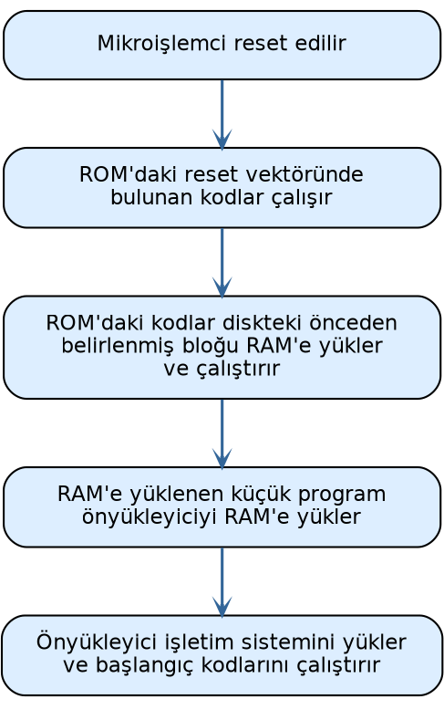
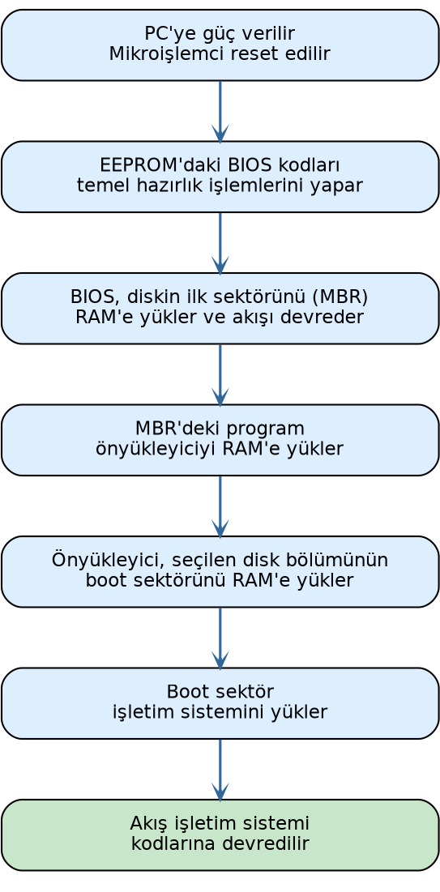

.. _giris:

===========
**Giriş**
===========

Gereksinimler
=============

Okuyucunun bir sanal makineye herhangi bir Linux dağıtımını kurmasını tavsiye ediyoruz. 
Dağıtım minimalist biçimde kurulabilir. Ancak Linux içerisinde C derleyicisinin (gcc ya da
clang) ve binary utility araçlarının bulunuyor olması gerekir. Kursumuzda Linux kaynak
kodları üzerinde değişiklikler yapıp çekirdeği yeniden derleyerek çeşitli denemeler
yapacağız. Bu nedenle kurduğunuz sistemin bir kopyasını da saklamanızı salık veriyoruz.

Kitabımızda Debian türevi bir Linux dağıtımının kurulmuş olduğu varsayılacaktır. Biz bazı
konularda açıklamalar yaparken Debian dağıtımının *apt* paket sistemini kullanacağız.

Çekirdek Kodları Üzerinde Gezinme 
=================================

Kursumuzda Linux işletim sisteminin kaynak kodlarında gezinmek için
https://elixir.bootlin.com/linux/ sitesini kullanacağız. Bu sitede Linux'un 0.01
versiyonundan günümüzdeki en son versiyonuna kadar bütün resmi versiyonlarının kaynak
kodları bulunmaktadır ve bu kaynak kodlar üzerinde gezintiler (navigation) yapılabilmektedir.

İşletim Sistemi Nedir?
======================

İşletim sistemleri bilgisayar donanımının kaynaklarını yöneten, bilgisayar donanımı ile
kullanıcı arasında arayüz oluşturan sistem programlarıdır. Bilgisayar bilimlerinin akademik
öncülerinin çoğu işletim sistemlerini bir kaynak yöneticisi (resource manager) olarak
tanımlamıştır.

.. image:: /_static/os-layers.png
   :alt: İşletim sistemi katmanları
   :align: center

İşletim sistemlerinin yönettiği kaynakların en önemlileri şunlardır:

- **CPU:** İşletim sistemi hangi programın ne zaman, ne kadar süre için CPU'ya atanacağına
  karar verip bu işlemleri gerçekleştirmektedir.

- **Ana Bellek (Main Memory / RAM):** İşletim sistemi programların ana belleğin neresine
  yükleneceğine karar verir ve ana bellek kullanımını düzenler.

- **İkincil Bellekler:** İşletim sistemi bir dosya sistemi (file system) oluşturarak
  dosyaların parçalarını ikincil belleklerde etkin bir biçimde tutar ve kullanıcılara bir
  dosya kavramıyla sunar.

- **Çevre Birimleri (klavye, fare, yazıcı vb.):** İşletim sistemi fare, klavye, yazıcı
  gibi çevre birimlerini yöneterek onları kullanıma hazır hale getirir. Yardımcı
  işlemcileri (denetleyicileri) programlayarak onların işlev görmesini sağlamaktadır.

- **Ağ İşlemleri:** İşletim sistemi ağa ilişkin donanım birimlerini yöneterek dışarıdan
  gelen bilgileri onları talep eden programlara iletir.

İşletim sistemleri kaynak yönetimine göre alt sistemlere ayrılarak da incelenebilmektedir.
Örneğin işletim sisteminin *çizelgeleyici (scheduler)* alt sistemi demekle CPU yönetimini
sağlayan alt sistemi kastedilmektedir. Ana bellek yönetimi (memory management) yine
soyutlanarak incelenen önemli alt sistemlerden biridir. İşletim sistemlerinin ikincil bellek
yönetimine *dosya sistemi (file system)* da denilmektedir. Tabii bütün bu sistemler
birbirinden kopuk olarak değil birbirleriyle ilişkili bir biçimde işlev görmektedir. Bu
durumu insanın *solunum sistemi*, *dolaşım sistemi*, *sinir sistemi*, *boşaltım sistemi*
gibi alt sistemlerine benzetebiliriz. Bu alt sistemlerin birinde bile çalışma bozukluğu
oluşsa insan yaşamını yitirebilmektedir.

İşletim sistemleri yapı olarak iki kısımdan oluşmaktadır: Çekirdek (kernel) ve kabuk
(shell). Çekirdek işletim sisteminin donanımı kontrol eden ve kaynakları yöneten motor
kısmıdır. Aslında işletim sistemi denildiğinde akla çekirdek gelmektedir. Kabuk ise
işletim sisteminin kullanıcı ile arayüz oluşturan önyüzüdür. Örneğin UNIX/Linux
sistemlerinde bash gibi komut satırı, GNOME, KDE gibi pencere yöneticileri, Windows'taki
masaüstü (Explorer), macOS'teki masaüstü (Aqua) bu işletim sistemlerinin kabuk kısımlarını
oluşturmaktadır.

.. image:: /_static/os-kernel-shell.png
    :alt: İşletim sistemi katmanları
    :align: center
    :width: 25%

Peki işletim sistemi bu kadar temel donanım yönetimini sağlıyorsa işletim sistemi olmadan
programlama yapılabilir mi? İşletim sistemi olmadan programlama faaliyetine halk arasında
*bare metal programlama* denilmektedir. Bare metal programlama tipik olarak gömülü
sistemlerde, mikrodenetleyicilerin kullanıldığı uygulamalarda kullanılmaktadır. Bare metal
programlama genellikle özel bir amaca hizmet edecek biçimde yapılmaktadır. Amaçlar
fazlalaştığı zaman ve sistem karmaşıklaştığı zaman artık işletim sistemlerine gereksinim
duyulmaktadır.

Bazı kontrol yazılımları işletim sistemlerinin bazı etkinliklerini de sağlamaktadır. Bir
kontrol yazılımının işletim sistemi olarak isimlendirilmesi için yukarıda açıkladığımız
kaynak yönetimlerinin önemli bir bölümünü sağlıyor olması gerekir. Bu kaynak yönetimlerinin
çoğunu sağlamayan kontrol yazılımlarına genel olarak *firmware* de denilmektedir.

İşletim Sistemlerinin Sınıflandırılması
=========================================

İşletim sistemleri çeşitli biçimlerde sınıflandırılabilmektedir.

Proses Yönetimine Göre
-----------------------

Aynı anda tek bir programı çalıştıran işletim sistemlerine *tek prosesli (single
processing)*, aynı anda birden fazla programı çalıştırabilen işletim sistemlerine ise
*çok prosesli (multiprocessing) işletim sistemleri* denilmektedir. Örneğin DOS işletim
sistemi tek prosesli bir sistemdi. Biz bu işletim sisteminde bir programı çalıştırırdık
ancak çalıştırdığımız program sonlanınca başka bir programı çalıştırabilirdik. Halbuki
Windows, UNIX/Linux, macOS gibi işletim sistemleri çok prosesli işletim sistemleridir.

Kullanıcı Sayısına Göre
------------------------

Birden fazla farklı kullanıcının çalışabildiği sistemlere *çok kullanıcılı (multiuser)*,
tek bir kullanıcının çalışabildiği sistemlere *tek kullanıcılı (single user)* sistemler
denilmektedir. Genellikle çok prosesli işletim sistemleri aynı zamanda çok kullanıcılı
sistemlerdir. Birden fazla kullanıcının söz konusu olduğu sistemlerde kullanıcıların
yetkilerinin ayarlanması, kullanıcıların birbirlerinin alanlarına erişmesinin engellenmesi,
sistem kaynaklarını belli oranlarda bölüşmesi gerekebilmektedir. Örneğin DOS tek
kullanıcılı bir sistemdi. Halbuki Windows, UNIX/Linux ve macOS sistemleri çok kullanıcılı
sistemlerdir.

Çekirdek Yapısına Göre
-----------------------

İşletim sistemleri çekirdek yapısına göre *tek parçalı çekirdekli (monolithic kernel)* ve
*mikro çekirdekli (microkernel)* olmak üzere ikiye ayrılmaktadır. Tek parçalı çekirdekli
işletim sisteminin büyük kısmı çekirdek modunda çalışır. Mikro çekirdekli sistemlerde ise
çekirdek modunda çalışan kısım minimize edilmeye çalışılmıştır. Aslında tek parçalı ve
mikro çekirdekli tasarımları bir spektrum olarak düşünebiliriz. (Örneğin bu spektrumda
bazı çekirdekler tek parçalı tarafa yakın, bazıları ise mikro tarafa yakın olabilmektedir.)

Dışsal Olaylarla Yanıt Verebilme Özelliğine Göre
--------------------------------------------------

İşletim sistemleri dışsal olaylara yanıt verme bakımından gerçek zamanlı olan (real-time)
ve gerçek zamanlı olmayan (non-real-time) sistemler olmak üzere ikiye ayrılabilir. Dışsal
olaylara hızlı bir biçimde yanıt verebilecek çekirdek yapısına sahip olan işletim
sistemlerine *gerçek zamanlı (real-time) işletim sistemleri* denilmektedir. Gerçek zamanlı
işletim sistemleri de kendi aralarında *katı (hard real-time)* ve *gevşek (soft real-time)*
işletim sistemleri olmak üzere ikiye ayrılabilmektedir. Katı gerçek zamanlı sistemler
dışsal olaylara yanıt verme bakımından çok güvenilir olma iddiasındadır. Gevşek gerçek
zamanlı sistemler ise bu konuda daha toleranslıdır.

Dağıtıklık Durumuna Göre
-------------------------

İşletim sistemleri dağıtıklık durumuna göre *dağıtık olan (distributed)* ve *dağıtık
olmayan (non-distributed)* sistemler biçiminde ikiye ayrılabilmektedir. Dağıtık işletim
sistemlerinde sistem birden fazla bilgisayardan oluşan tek bir sistem gibi davranmaktadır.
Örneğin 10 tane makineyi tek bir sistem olarak düşünebilirsiniz. Bu durumda bu
bilgisayarların kaynakları (örneğin diskleri ve CPU'ları) bu 10 makine tarafından
paylaşılmaktadır. Windows, UNIX/Linux ve macOS dağıtık işletim sistemleri değildir. Ancak
bu sistemlerde dağıtık uygulamalar yapılabilmektedir.

Donanım Özelliğine Göre
------------------------

Neredeyse her yaygın masaüstü işletim sisteminin bir mobil versiyonu da oluşturulmuştur.
iOS (iPhone Operating System) ve iPadOS Apple firmasının (yani macOS sistemlerinin) mobil
işletim sistemleridir. Android bir çeşit mobil Linux sistemi olarak değerlendirilebilir.
Android projesinde Linux çekirdeği alınmış, biraz özelleştirilmiş, bazı parçaları atılmış,
buna bir mobil arayüz giydirilmiş ve sistem akıllı telefonlara ve tabletlere uygun hale
getirilmiştir. Nokia eskiden Symbian sistemlerinde büyük bir pazar payına sahipti. Ancak
bu firma akıllı telefon geçişini iyi yönetemedi. MeeGo ve Maemo gibi işletim sistemlerini
denedi. Sonra ekonomik sıkıntılar sonucunca büyük ölçüde Microsoft tarafından satın alındı.
Windows'un mobil versiyonuna genel olarak Windows CE denilmektedir. Windows CE'nin akıllı
telefonlar ve tabletler için özelleştirilmiş biçimine ise Windows Mobile ve Windows Phone
denilmektedir. Ancak Microsoft 2010 yılında Windows Mobile işletim sistemini, 2017'de de
Windows Phone işletim sistemini sonlandırmıştır ve bu alandaki rekabetten tamamen
çekilmiştir. Windows CE ise Windows IoT Core ismiyle farklı bir tasarımla evrimleşerek
devam ettirilmektedir.

Kaynak Kod Lisansına Göre
--------------------------

Kaynak kod lisansına göre işletim sistemlerini kabaca açık kaynak kodlu (open source) ve
mülkiyete bağlı (proprietary) olmak üzere ikiye ayırabiliriz. Açık kaynak kodlu işletim
sistemleri değişik açık kaynak kod lisanslarına sahip olabilmektedir. Bunların kaynak
kodları indirilip üzerinde değişiklikler yapılabilmektedir. Örneğin Windows işletim sistemi
mülkiyete sahiptir. Oysa Linux, BSD sistemleri, Solaris, Android gibi sistemler açık kaynak
kodludur. macOS sistemlerinin ise çekirdeği açık, diğer kısımları (örneğin kabuk kısmı ve
diğer katmanları) kapalıdır.

Kaynak Kodun Özgünlüğüne Göre
-------------------------------

Bazı işletim sistemleri bazı işletim sistemlerinin kodları alınıp değiştirilerek
oluşturulmuştur (örneğin Android ve macOS'ta olduğu gibi). Bazı işletim sistemlerinin
kodları ise sıfırdan yazılmıştır. Kodları sıfırdan yazılan, yani orijinal kod temeline
dayanan işletim sistemlerinden bazıları şunlardır:

- AT&T UNIX
- DOS
- Windows
- Linux
- BSD'ler (belli bir yıldan sonra)
- Solaris
- XENIX
- VMS

Burada orijinal mimari ile orijinal kod tabanını birbirine karıştırmamak gerekiyor. Linux
UNIX işletim sisteminin mimarisini temel almıştır. Ancak tüm kodları sıfırdan yazılmıştır.
Yani orijinal AT&T UNIX sistemindeki kaynak kodların bir bölümü kopyalanarak
kullanılmamıştır.

GUI Çalışma Desteğine Göre
---------------------------

Bazı işletim sistemleri GUI çalışma modelini doğrudan desteklerken bazıları
desteklememektedir. Örneğin Windows sistemleri çekirdekle entegre edilmiş bir GUI çalışma
modeli sunmaktadır. UNIX/Linux sistemleri de X Window (ya da X11) ve Wayland katmanlarıyla
benzer bir model sunmaktadır. Fakat örneğin DOS işletim sisteminin böyle bir doğal GUI
desteği yoktu.

Ağ Üzerinde Hizmet Alıp Verme Rollerine Göre
---------------------------------------------

İşletim sistemlerini ağ altında hizmet alıp verme rollerine göre *istemci (client) ve
sunucu (server)* biçiminde de iki gruba ayırabiliriz. Bazı işletim sistemlerinin istemci
versiyonları birbirlerinden ayrılmıştır. Bazılarında ise bu ayrım yapılmamıştır. Örneğin
Windows 7, 8, 10, 11 sistemleri bu bakımdan istemci (client) sistemleridir. Halbuki Windows
Server 2016, 2019 sunucu sistemleri olarak piyasaya sürülmüştür. Eskiden Mac OS X'in
istemci ve sunucu versiyonları farklıydı. Fakat Mac OS X 10.7 (Lion) ile birlikte istemci
ve sunucu versiyonları birleştirildi. Linux dağıtımlarının çoğu da hem istemci hem de
sunucu olarak kullanılabilmektedir. Ancak bazı dağıtımların istemci ve sunucu versiyonları
farklıdır.

Peki işletim sistemlerinin istemci ve sunucu versiyonları arasındaki farklılıklar nelerdir?
Kabaca iki tür farklılığın olduğunu söyleyebiliriz. Birincisi çekirdekle ilgili
farklılıklardır. Genellikle sunucu sistemlerinde çizelgeleyici alt sistemde istemci
sistemlerine göre farklılıklar bulunmaktadır. İkincisi ise barındırdıkları yardımcı
yazılımlardır. İşletim sistemlerinin sunucu versiyonları hazır bazı sunucu programlarını
da içermektedir.

İşletim Sistemlerinin Tarihsel Gelişimi
=========================================

1940'lı yıllarda ilk elektronik bilgisayarlar yapıldığında henüz bir işletim sistemi
kavramı yoktu. Bu bilgisayarlara program yazacak olanlar işletim sistemi faaliyetlerini de
kendileri yapmak zorunda kalıyordu. (Yani şimdi mikrodenetleyicilere bare metal kod
yazanlarda olduğu gibi.) Transistör bulunduktan sonra 1950'li yıllarda artık elektronik
bilgisayarlar yavaş yavaş transistörlerle yapılmaya başlandı. Transistörlerin ortaya
çıkması hem bilgisayarların kapasitelerini ve güvenilirliklerini artırmış, hem de güç
harcamalarını düşürmüştür.

1950'li yıllarda IBM gibi pek çok bilgisayar üreticisi firma yalnızca donanım satıyordu.
İşletim sistemi gibi programları yazmak kullanıcıların yapması gereken bir işti. Böylece
donanımı satın alan her kurum işletim sistemine benzeyen programları da kendisi yazıyordu.
Bu anlamda standart bir işletim sistemi yoktu. Bugünkü anlamda ilk işletim sisteminin
General Motors'un 1956 yılında IBM'in 701 sistemi için yazdığı NAA IO (North American
Aviation Input Output System) olduğu söylenebilir.

1960'lara gelindiğinde IBM, System/360 isminde yeni bir bilgisayar donanımı geliştirme
işine girişti ve artık donanımla işletim sistemini birlikte satma fikrini benimsedi. Bu
donanım 1964 yılında duyuruldu ve 1965 yılında gerçekleştirildi. İlk System/360 Model 30
bilgisayarları o zamanın *Solid Logic Technology (SLD)* teknolojisiyle üretilmişti. Hem
öncekilerden daha güçlüydü hem de daha az yer kaplıyordu. Saniyede 34500 işlem
yapabiliyordu ve 8K ile 64K ana belleğe sahipti. 1967 yılında System/360'ın Model 60'ı
piyasaya sürüldü. Bu model saniyede 16.6 milyon komut çalıştırabiliyordu ve ana belleği
tipik olarak 512K, 768K ve 1 MB idi. IBM Sistem 360 donanımları için 1964 yılında ilk kez
OS/360 işletim sistemini geliştirdi. IBM daha sonra 1967 yılında OS/360 Model 67 için
OS/360'ın TSS 360 isminde zaman paylaşımlı (time sharing system) bir versiyonunu daha
geliştirmiştir. IBM'in System/360 makineleri ve işletim sistemleri önemli ticari başarı
kazandı. System/360'ı System/370 izledi. System/360 ve System/370 için başka kurumlar da
işletim sistemleri geliştirmiştir. Michigan Terminal System (MTS) ve MUSIC/SP bunlar
arasında önemli olanlardandır.

1960'lı yıllarda başka firmalar da işletim sistemleri geliştirmiştir. Örneğin Control Data
Corporation firmasının SCOPE işletim sistemi batch işlemler yapabiliyordu. Aynı firma MACE
isminde bu işletim sisteminin zaman paylaşımlı bir versiyonunu da yazmıştır. Firma bu
çalışmalarını 1970'li yıllarda Kronos işletim sistemiyle devam ettirmiştir. Burroughs
firması 1961 yılında MCP işletim sistemi ile B5000 bilgisayarlarını, GE firması da 1962
yılında GECOS işletim sistemiyle GE-600 serisi bilgisayarlarını piyasaya sürdü. UNIVAC
dünyanın ilk ticari bilgisayarlarını üreten firmadır. Bu firma da 1962 yılında UNIVAC 1107
için EXEC I işletim sistemini yazdı. Bu işletim sistemini sırasıyla Exec 2 ve Exec 8 izledi.

DEC (Digital Equipment Corporation) eskilerin en önemli bilgisayar üretici firmalarından
biriydi. (DEC 1998 yılında Compaq firması tarafından, Compaq firması da 2002 yılında HP
firması tarafından satın alındı.) Firmanın en önemli ürünleri PDP (Programmed Data
Processor) isimli bilgisayarlarıdır. Firma PDP-1'den (1959) başlayarak PDP-16'ya
(1971-1972) kadar PDP makinelerinin 16 versiyonunu piyasaya sürmüştür. DEC'in PDP-8'inin
mini bilgisayar devrimini başlattığı söylenebilir. Bu model 50.000'in üzerinde satışa
ulaşmıştır. UNIX işletim sistemi 1969 yılında ilk kez DEC'in PDP-7 modeli üzerinde
yazılmıştır. 1965 yılında piyasaya sürülen DEC PDP-7 18 bitlik bir makineydi. Makine
DECsys denilen işletim sistemi benzeri bir yönetici programla beraber satılıyordu. DEC'in
1966 yılında çıkardığı PDP-10 26 bitlik bir makineydi. DEC bu modelle birlikte işletim
sistemi olarak TOPS-10 isimli bir sisteme geçti.

1960'lı yılların sonuna kadar işletim sistemleri ağırlıklı olarak sembolik makine diliyle
yazılıyordu. 1960'lı yılların sonlarında AT&T Bell Lab. tarafından UNIX işletim sistemi
geliştirildiğinde önemli bir devrim yaşandı. UNIX işletim sistemi 1973 yılında C ile yeniden
yazılmıştır. Böylece artık işletim sistemlerinin yüksek seviyeli dillerle de yazılabildiği
görülmüştür. PDP-11'i 16 bitlik PDP-12 izledi. PDP-12 Intel'in x86 ve Motorola'nın 6800
işlemcileri için ilham kaynağı olmuştur.

1970'li yılların ikinci yarısında entegre devrelerin de geliştirilmesiyle *ev bilgisayarları
(home computer)* ortaya çıkmaya başladı. Bunlarda genellikle BASIC yorumlayıcıları ile iç
içe geçmiş CP/M ya da GEOS işletim sistemleri kullanılıyordu. 1970'li yıllarda pek çok
firma farklı ev bilgisayarları üretmiştir. BBC Micro, Commodore 64, Apple II, Atari,
Amstrad, ZX Spectrum dönemin en ünlü ev bilgisayarlarındandı. Bu makinelerde kullanılan
işlemciler Intel'in 8080'i, Zilog'un Z80'i, Motorola'nın 6800'ü gibi 8 bitlik
işlemcilerdi.

DEC firması 1977 yılında VAX isimli bilgisayarı ve 32 bitlik işlemci birimini piyasaya
sürdü. VAX ailesi makineler o yıllarda önemli bir ticari başarı kazanmıştır. DEC VAX
makineleri için VAX/VMS isimli bir işletim sistemi yazmıştı. DEC bu işletim sisteminin
ismini 1992 yılında OpenVMS olarak değiştirdi. DEC 1992 yılında 64 bitlik RISC tasarımı
olan Alpha işlemcilerini piyasaya sürdü ve OpenVMS Alpha işlemcilerine port edildi. OpenVMS
hala kullanılmaya devam etmektedir. Itanium ve X86-64 portları da vardır.

Apple firması 1976 yılında kuruldu. Apple'ın ilk bilgisayarı Apple I idi. Bunu 1977'de
Apple II, 1980'de de Apple III izledi. Bu ilk Apple bilgisayarlarında AppleDOS isimli
işletim sistemleri kullanılıyordu. Daha sonra Apple 1983'te Lisa modelini piyasaya sürdü.
1983'ün sonlarında da ilk Macintosh bilgisayarını çıkardı. Lisa ile birlikte Apple grafik
tabanlı işletim sistemlerine geçiş yaptı. Lisa ve sonraki Apple bilgisayarlarının hepsi
grafik bir arayüze sahiptir. Macintosh markası daha sonra Mac olarak telaffuz edilmeye
başlandı. Lisa bilgisayarlarında kullanılan işletim sistemi LisaOS ismindeydi. Apple daha
sonra Macintosh bilgisayarlarının değişik versiyonlarını piyasaya sürdü. Bunlardaki işletim
sistemini *System Software 1 (1984), System Software 2 (1985), System Software 3 (1986),
System Software 4 (1987), System Software 5 (1987), System Software 6 (1988) ve System
Software 7 (1991)* olarak isimlendirdi. Apple *System Software* 7.5'ten sonra işletim
sisteminin ismini *System Software* yerine Mac OS olarak değiştirdi ve System Software 7.6
versiyonu Mac OS 7.6 ismiyle çıktı. Daha sonra Apple 1997 yılında Mac OS 8'i, 1999 yılında
da Mac OS 9'u çıkarmıştır.

1980'li yıllarda Mac bilgisayarlarının fiyatı çok yüksekti ve satışları da iyi gitmiyordu.
Çünkü Steve Jobs bilgisayarların program yazmak için değil kullanmak için satın alınması
gerektiğini düşünüyordu. Nihayet Apple'daki çalkantılar sonucunda Steve Jobs 1985 yılında
Apple'dan ayrılmak zorunda kaldı (kovuldu da denebilir) ve NeXT firmasını kurdu. NeXT
firması NeXT isimli bilgisayarları geliştirdi. Bu bilgisayarlarda NeXTSTEP isimli işletim
sistemi kullanılıyordu. Daha sonra bu sistem açık hale getirildi ve OPENSTEP ismini aldı.
Dünyanın ilk Web tarayıcısı Tim Berners Lee tarafından CERN'de NeXT bilgisayarları üzerinde
gerçekleştirilmiştir.

Steve Jobs 1997 yılında Apple'a geri döndü. Apple da NeXT firmasını 200 milyon dolara satın
aldı. Sonra piyasaya iMac ve Power Mac serileri çıktı. Daha sonra Steve Jobs Mac'lerin
çekirdeklerini tamamen değiştirme kararı aldı. Mac'ler Mac OS'un 10 versiyonu ile birlikte
yeni bir çekirdeğe geçtiler. Mac OS işletim sistemlerinin 10'lu versiyonları Roma rakamıyla
Mac OS X biçiminde isimlendirilmiştir. Apple Mac OS X ismini 2012 yılında Mountain Lion
(10.8) sürümü ile OS X olarak, 2016 yılında da Sierra (10.12) sürümüyle birlikte de macOS
olarak değiştirmiştir.

DOS işletim sistemi text ekranda çalışıyordu. Microsoft da geleceğin grafik tabanlı işletim
sistemlerinde olduğunu gördü ve yavaş yavaş DOS'u bırakarak grafik tabanlı bir sisteme
geçmeyi planladı. Bunun için Windows isimli grafik arayüzün birinci versiyonunu 1985'te
çıkardı. Bunu 1987'de Windows 2, 1990'da Windows 3.0 ve 1992'de de Windows 3.1 izledi.
Bu 16 bit Windows sistemleri işletim sistemi değildi; DOS üzerinden çalıştırılan birer
grafik arayüz gibiydi. Microsoft daha sonra Windows'u Windows NT 3.1 ile bağımsız bir
işletim sistemi haline getirdi. Microsoft bundan sonra sırasıyla 1994 yılında Windows NT
3.5'i, 1995 yılında Windows NT 3.51'i ve Windows 95'i, 1998 yılında Windows 98'i, 2000
yılında Windows 2000 ve Windows ME'yi, 2001 yılında Windows XP'yi, 2006 yılında Windows
Vista'yı, 2012 yılında Windows 8'i, 2015 yılında Windows 10'u ve nihayet 2021 yılında da
Windows 11'i çıkarmıştır.

Linux işletim sistemi 1992 yılında bir dağıtım biçiminde piyasaya çıkmıştır. Linux işletim
sisteminin hikayesi daha geniş olarak izleyen derste ele alınmaktadır.

.. _ders03:

UNIX Türevi Sistemlerin Tarihsel Gelişimi
==========================================

UNIX işletim sistemi AT&T Bell Laboratuvarlarında 1969-1971 yılları arasında geliştirildi.
Proje ekibinin lideri Ken Thompson'du. Çalışma ekibinde Dennis Ritchie, Brian Kernighan gibi
önemli isimler de vardı. Ekip daha önce General Electric'in GE-645 mainframe bilgisayarı
için Multics işletim sistemi üzerinde çalışıyordu. (Multics işletim sisteminin
geliştirilmesine 1964 yılında başlandı. Projede General Electric, MIT ve Bell Lab birlikte
çalışıyordu. Sonra proje Honeywell şirketi tarafından devralınmıştır.)

AT&T 1969 yılında bu projeden çekilerek kendi işletim sistemini geliştirmek istemiştir.
Geliştirme çalışmasına DEC'in PDP-7 makinelerinde başlanmıştır. UNIX ismi 1970 yılında
Brian Kernighan tarafından Multics'ten kelime oyunu yapılarak uydurulmuştur. Proje ekibi
AT&T'yi DEC PDP-11 almaya ikna etti ve böylece geliştirme çalışmaları PDP-11 ile devam
etti. UNIX'in resmi olarak ilk sürümü Ekim 1971'de, ikinci sürümü Aralık 1972'de, üçüncü
ve dördüncü sürümleri de 1973 yılında yayınlanmıştır.

UNIX işletim sistemi büyük ölçüde PDP'nin sembolik makine dili ve Ken Thompson'ın B isimli
programlama diliyle geliştirilmiştir. B programlama dili fonksiyonları alıp DEC'in makine
diline dönüştürüyordu. Bu bakımdan B bir yorumlayıcı değil derleyiciydi. İşte 1972 yılında
Dennis Ritchie, Ken Thompson'ın B programlama dilinden hareketle C Programlama Dilini
geliştirmiştir. UNIX işletim sisteminin dördüncü sürümü 1973 yılında yeniden C Programlama
Dili ile yazılmıştır.

1974 yılında UNIX'in beşinci sürümü oluşturuldu. Bu sürümlerin hepsi araştırma amaçlıydı
ve *educational license* ismiyle lisanslanmıştı. UNIX işletim sistemi bir araştırma projesi
olarak organize edilmişti. Bu nedenle AT&T kaynak kodlarını araştırma kuruluşlarına ücretsiz
dağıtmıştır. 1975 yılında UNIX'in altıncı sürümü şirketlere yönelik hazırlandı. UNIX'in
altıncı versiyonunun kaynak kodları 20.000 dolara (bugünün yaklaşık 120.000 doları) şirketlere
sunuldu. 1977 yılında Bell Lab, UNIX'i Interdata 7/32 isimli 32 bit mimariye port etti.
Bunu 1978'de VAX portu izledi.

1974 yılında California Üniversitesi (Berkeley) işletim sisteminin kopyasını Bell Lab'tan
aldı. 1978 yılında *Berkeley Software Distribution (1BSD)* ismiyle AT&T dışındaki ilk UNIX
dağıtımını gerçekleştirdi. Bu dağıtım hayatını hala FreeBSD, OpenBSD ve NetBSD olarak
devam ettirmektedir. 1979'da BSD'nin ikinci versiyonu (2BSD) ve 1979'un sonlarına doğru da
üçüncü versiyonu (3BSD) piyasaya sürüldü. Bunu 1980 yılında versiyon 4 (4BSD) izlemiştir.
1991 yılında BSD UNIX'ten AT&T kodları tamamen arındırılmış ve kod bakımından özgün hale
getirilmiştir. BSD'nin son versiyonu 1995'te 4.4BSD Lite Release 2 olarak çıkmıştır.

1980'li yıllarda pek çok kurum ve ticari firma UNIX kodlarını lisans ücreti ödeyerek
AT&T'den satın alıp kendilerine yönelik UNIX sistemleri oluşturmuştur. Bunların önemli
olanları şunlardır:

AIX
    IBM tarafından geliştirilmiş olan UNIX türevi sistemlerdir. İlk kez 1986 yılında
    piyasaya sürülmüştür. IBM AIX'i System/370, RS/6000 ve PS2 bilgisayarlarında
    kullanıyordu. Bu sistemler AT&T UNIX System 5 kodları temel alınarak geliştirilmiştir.
    AIX hala kullanılmaktadır. Son sürümü 2021 yılında 7.3 olarak piyasaya sürülmüştür.
    AIX PowerPC ve x86 işlemcileri için de port edilmiştir.

IRIX
    SGI firması tarafından AT&T ve BSD kodları değiştirilerek 1988'de oluşturulmuştur.
    2006'da bırakılmıştır.

HP-UX
    HP 9000 bilgisayarları için 1982'de oluşturulmuştur. Motorola 68000 ve Itanium
    işlemcileri için yazılmıştır. Hala devam ettirilmektedir.

ULTRIX
    DEC firmasının PDP-7, PDP-11 ve VAX donanımları için geliştirdiği UNIX sistemiydi.
    İlk versiyonu 1984 yılında çıktı. 1995 yılında piyasadan çekildi.

XENIX
    Microsoft tarafından 1980 yılında geliştirilmeye başlanmıştır. İlk versiyonu 1980'in
    sonlarına doğru çıkmıştır. Daha sonra SCO firması Microsoft'la bu konuda iş birliği
    yapmış, 1987 yılında da Microsoft sistemi tamamen SCO'ya devretmiştir.

SCO-UNIX
    SCO firması XENIX'i Microsoft'tan alınca bunu SCO-UNIX olarak devam ettirdi. SCO-UNIX'in
    ilk versiyonu 1989 yılında çıktı. SCO sonra bunu OpenServer ismiyle devam ettirmiştir.

FreeBSD, NetBSD ve OpenBSD
    4.3BSD sistemleri temel alınarak geliştirilmiştir. FreeBSD ve NetBSD 1993 yılında,
    OpenBSD ise 1996 yılında piyasaya çıkmıştır. Sürdürülmeye devam etmektedir. FreeBSD
    genel amaçlı client ve server işletim sistemi olma niyetindedir. NetBSD daha taşınabilir
    ve geniş bir port'a sahiptir; daha çok bilimsel çalışmalarda tercih edilmektedir.
    OpenBSD güvenliğin önemli olduğu alanlarda tercih edilmektedir.

SunOS / Solaris
    Sun firmasının BSD kodlarıyla oluşturduğu UNIX türevi işletim sistemiydi. İlk versiyonu
    1982 yılında çıktı. SunOS işletim sistemi 5.2 versiyonundan sonra (1992) Solaris ismiyle
    pazarlanmaya başlamıştır. Solaris daha sonra OpenSolaris biçiminde açık kaynak kodlu
    olarak bir süre varlığını devam ettirdi. Oracle firmasının Sun firmasını 2010'da satın
    almasından sonra bu proje de durduruldu. Bu proje Illumos ismiyle başka bir ekip
    tarafından devam ettirilmektedir.

Linux
    Linus Torvalds'ın öncülüğünde geliştirilmiş en yaygın UNIX türevi işletim sistemidir.
    İlk versiyonu 1991 yılında çıkmıştır. Hala devam ettirilmektedir. Linux'un tarihsel
    gelişimi aşağıdaki bölümde ayrıntılı bir biçimde açıklanmaktadır.

Mac OS X / OS X / macOS
    Carnegie Mellon üniversitesinin Mach isimli çekirdeği ile BSD UNIX sisteminin bir araya
    getirilmesiyle oluşturulmuştur. İlk versiyonu 2001 yılında piyasaya sürülmüştür.

Mac OS X (macOS) Türevi Sistemler
=================================

İşletim sistemlerinin tarihsel gelişimini ele aldığımız önceki bölümde de belirttiğimiz gibi
Apple firmasının Mac bilgisayarları Mac OS'un 10 versiyonu ile birlikte yeni bir çekirdeğe
geçtiler. Mac OS işletim sistemlerinin 10'lu versiyonları Roma rakamıyla Mac OS X biçiminde
isimlendirildi. Apple Mac OS X ismini 2012 yılında Mountain Lion (10.8) sürümü ile OS X
olarak, 2016 yılında da Sierra (10.12) sürümüyle birlikte de macOS olarak değiştirdi. Biz
Mac OS X, OS X ve macOS sistemlerine bu bölümde *Mac OS X türevi sistemler* de diyeceğiz.

Mac OS X türevi işletim sistemleri UNIX türevi sistemlerdir. Bu işletim sistemlerinin
çekirdeğine Darwin denilmektedir. Darwin açık kaynak kodlu bir işletim sistemdir. Ancak
Mac OS X türevi sistemler tam anlamıyla açık sistemler değildir. Bu sistemlerin çekirdeği
açık olsa da geri kalan kısımları mülkiyete sahip (proprietary) biçimdedir.

Darwin'in hikayesi 1989 yılında NeXT'in NeXTSTEP işletim sistemiyle başladı. NeXTSTEP
daha sonra OpenStep ismiyle API düzeyinde standart hale getirildi. 1996'nın sonunda,
1997'nin başında Steve Jobs Apple'a dönerken Apple da NeXT firmasını satın aldı ve sonraki
işletim sistemini OpenStep üzerine kuracağını açıkladı. Bundan sonra Apple 1997'de OpenStep
üzerine kurulu olan Rapsody'yi çıkardı. 1998'de de yeni işletim sisteminin Mac OS X
olacağını açıkladı. Daha sonra 2000 yılında Apple Rapsody'den Darwin projesini türetti.
Darwin her ne kadar Mac sistemlerinin çekirdeği olarak tasarlanmışsa da ayrı bir işletim
sistemi olarak da yüklenebilmektedir. Ancak Darwin grafik arayüzü olmadığı için Mac
programlarını çalıştıramamaktadır. Daha sonra Darwin'i bağımsız bir işletim sistemi haline
getirmek amacıyla Darwin'den de çeşitli projeler türetilmiştir. Bunlardan biri Apple
tarafından 2002'de başlatılan OpenDarwin'dir. Bu proje 2006'da sonlandırılmıştır. 2007'de
PureDarwin projesi başlatılmıştır.

Darwin'in çekirdeği XNU üzerine oturtulmuştur. XNU, NeXT firması tarafından NEXTSTEP
işletim sisteminde kullanılmak üzere geliştirilmiş bir çekirdektir. XNU, Carnegie Mellon
(*Karnegi* diye okunuyor) üniversitesinin Mach 3 mikrokernel çekirdeği ile 4.3BSD karışımı
hibrit bir sistemdir.

Mac OS X türevi sistemlerin versiyonları şunlardır:

- Mac OS X 10.0 (Cheetah, 2001)
- Mac OS X 10.1 (Puma, 2001)
- Mac OS X 10.2 (Jaguar, 2002)
- Mac OS X 10.3 (Panther, 2003)
- Mac OS X 10.4 (Tiger, 2005)
- Mac OS X 10.5 (Leopard, 2007)
- Mac OS X 10.6 (Snow Leopard, 2009)
- Mac OS X 10.7 (Lion, 2011)
- OS X 10.8 (Mountain Lion, 2012)
- OS X 10.9 (Mavericks, 2013)
- OS X 10.10 (Yosemite, 2014)
- OS X 10.11 (El Capitan, 2015)
- macOS 10.12 (Sierra, 2017)
- macOS 10.13 (High Sierra, 2017)
- macOS 10.14 (Mojave, 2018)
- macOS 10.15 (Catalina, 2019)
- macOS 11 (Big Sur, 2020)
- macOS 12 (Monterey, 2021)
- macOS 13 (Ventura, 2022)
- macOS 14 (Sonoma, 2023)
- macOS 15 (Sequoia, 2024)

macOS büyük ölçüde POSIX uyumlu bir sistemdir.

GNU Projesi ve Özgür Yazılım
=============================

UNIX/Linux dünyasında önemli bir yeri olan GNU Projesi, özgür yazılım ve açık kaynak kod
akımları üzerinde durmak istiyoruz.

1970'lerdeki mikro bilgisayarlar devrimine kadar yazılımda bir telif anlayışı yoktu. Yani
yazılımın dağıtılması konusunda sözleşmeler ve hukuki yaptırımlara gerek duyulmamıştı.
Yazılım zaten donanımla birlikte satılıyordu ya da kuruma özel yapılıyordu. 1969 yılında
IBM yazılımı donanımla birlikte verdiği için rekabet kurallarına uymadığı gerekçesiyle
mahkemeye verilmiştir ve cezaya çarptırılmıştır. 1970'li yıllarda yazılım maliyetleri
artmış, yazılım sektörü genişlemiş ve lisanslama politikaları da uygulamaya sokulmuştur.
Pek çok yazılım bu yıllarda özel lisanslarla piyasaya sürülmeye başlanmıştır. 1980'li
yıllarda bu lisanslama faaliyetleri hız kazanmıştır.

1980'li yıllarda tüm UNIX türevi sistemler çeşitli biçimlerde sınırlandırıcı lisanslara
sahipti. Bu nedenle bedava ve sınırlamasız UNIX türevi bir işletim sistemine gereksinim
duyulmaya başlandı. İşte durumdan vazife çıkaran ünlü Emacs editörünün yazarı Richard
Stallman 1983 yılının sonlarına doğru GNU projesini başlattı ve özgür yazılım (free
software) fikrini ortaya attı. GNU projesinin amacı açık kaynak kodlu UNIX benzeri bir
işletim sistemini ve geliştirme araçlarını yazmaktı. Proje fiilen 1984 yılında başlamıştır.

Stallman 1985 yılında özgür yazılım kavramını yaygınlaştırmak amacıyla Free Software
Foundation (https://www.fsf.org) isimli kurumu kurdu ve artık GNU projesi bu kurum
tarafından yürütülmeye başlandı. FSF özgür yazılım modeli için GPL (GNU Public License)
denilen bir lisans da geliştirdi. Özgür yazılım akımında oluşturulan bir yazılım
istenildiği gibi çalıştırılabilir, kopyalanabilir, incelenebilir, dağıtılabilir,
değiştirilebilir ve iyileştirilebilir. Özgür yazılım tipik olarak aşağıdaki dört özgürlükle
tanımlanmıştır:

Özgürlük 0
    Programı her türlü amaç için çalıştırma özgürlüğü.

Özgürlük 1
    Programın kaynak kodunu inceleme ve değiştirebilme özgürlüğü.

Özgürlük 2
    Programın kopyalarını çıkartabilme ve yeniden dağıtabilme özgürlüğü.

Özgürlük 3
    Programı iyileştirebilme ve iyileştirilmiş programı yayınlama özgürlüğü.

GNU projesi bağlamında pek çok temel araç (gcc derleyici, ld bağlayıcı vb.) geliştirilmiştir.
Fakat hedeflenen çekirdek bir türlü oluşturulamamıştır.

Aslında özgür yazılım (free software) ile açık kaynak kod (open source) akımları arasında
bazı farklar olmakla birlikte her iki akımın da hedefleri benzerdir. Özgür yazılım bir
sosyal harekete benzetilirken açık kaynak kod akımı bir geliştirme metodolojisine
benzetilmektedir. Biz kursumuzda tüm bu akımları *açık kaynak kod (open source)* olarak
nitelendireceğiz. Özgür yazılım akımının temel lisansı GPL'dir (GNU Public Licence). Bunun
yumuşatılmış LGPL (Lesser GPL) biçiminde bir versiyonu da oluşturulmuştur. Ayrıca Apache,
MIT, BSD gibi açık kaynak kodlu başka lisanslar da vardır.

Linux'un Tarihsel Gelişimi
===========================

Linus Torvalds Helsinki Üniversitesinde öğrenciyken bir işletim sistemi yazmaya
niyetlenmiştir. O zamanlarda telif uygulanmayan UNIX türevi bir işletim sistemi kalmamıştı
ve GNU projesinin işletim sistemi de (GNU Hurd) bitirilememişti. MINIX isimli bir işletim
sistemi Andrew Tanenbaum tarafından yazılmıştı ancak bu sisteminin lisansı yalnızca akademik
kullanımlara izin verecek biçimde sınırlandırılmıştı. Linus Torvalds projesini USENET haber
gruplarında duyurdu ve zamanla kendisine gönüllü yardım edecek sistem programcıları buldu.
Yazılım dünyasında bu tür girişimlerle sık karşılaşıldığı halde başarı olasılığı nispeten
düşük olmaktadır. Linus Torvalds'ın bu girişimi başarıya ulaşmıştır.

1991 yılında Linux'un 0.01 sürümü oluşturuldu. 1994 yılında stabil bir biçimde Linux 1.0
versiyonu dağıtılmaya başlandı. Bunu 1996 yılında Linux 2.0, 1999 yılında 2.2, 2000 yılında
2.4 ve 2003 yılında 2.6 izledi. Daha sonra Linux versiyon numaralandırma sistemi
değiştirilmiştir. 2011 yılında 3.0, 2015 yılında 4.0, 2019 yılında 5.0, 2022 yılında da
6.0 versiyonu çıkmıştır.

Linux çekirdeklerinin versiyonları ve bu versiyonlarda eklenen önemli özellikler aşağıdaki
tabloda verilmiştir.

.. list-table:: Linux Çekirdeği Sürüm Geçmişi
   :header-rows: 1
   :widths: 10 18 72

   * - Sürüm
     - Tarih
     - Önemli Yenilikler
   * - 0.01
     - Ağustos 1991
     - Linus Torvalds tarafından duyurulan ilk sürüm; sadece temel fonksiyonlara sahipti.
   * - 1.0
     - Mart 1994
     - İlk resmi sürüm; çoklu işlemci desteği yoktu. Ağ üzerinden TCP/IP desteği sağlandı.
   * - 1.2
     - Mart 1995
     - x86 dışı mimarilere (Alpha, MIPS) ilk destekler geldi.
   * - 2.0
     - Haziran 1996
     - SMP (Simetrik Çoklu İşlemci) desteği eklendi. Daha fazla mimari desteği sunuldu.
   * - 2.2
     - Ocak 1999
     - Gelişmiş ağ yığını, IPv6 desteği, daha fazla SMP ölçeklenebilirliği.
   * - 2.4
     - Ocak 2001
     - USB, PCMCIA ve Bluetooth desteği; 64 GB RAM'e kadar bellek desteği (PAE ile).
   * - 2.6
     - Aralık 2003
     - Yeni scheduler (O(1)), udev ile dinamik aygıt yönetimi, sysfs, Native POSIX Thread
       Library (NPTL), preemptive kernel.
   * - 3.0
     - Temmuz 2011
     - Büyük bir teknik değişiklik yok; sadece sürüm numarası sadeleştirildi (2.6.x'lerin
       devamı).
   * - 4.0
     - Nisan 2015
     - Canlı kernel güncelleme (live patching) özelliği eklendi.
   * - 5.0
     - Mart 2019
     - Yeni donanım desteği, enerji verimliliği iyileştirmeleri, Adiantum şifreleme
       algoritması.
   * - 5.4
     - Kasım 2019
     - Lockdown modu, fs-verity desteği.
   * - 5.10
     - Aralık 2020
     - EXT4 ve Btrfs iyileştirmeleri, AMD GPU desteği.
   * - 5.15
     - Kasım 2021
     - NTFS3 dosya sistemi, yeni I/O kontrolcüsü.
   * - 6.0
     - Ekim 2022
     - Rust diline ilk çekirdek içi destek, Scheduler ve TCP performans iyileştirmeleri.
   * - 6.1
     - Aralık 2022
     - Rust desteği genişletildi, Intel AMX desteği.
   * - 6.6
     - Kasım 2023
     - Apple Silicon (M1/M2) desteği, yeni enerji yönetimi özellikleri.

Linux monolithic bir çekirdek yapısına sahiptir. Büyük ölçüde POSIX uyumu bulunmaktadır.

Linux Dağıtımları
==================

Açık kaynak kodlu yazılımlar bir araya getirilip paketlenerek istenildiği gibi
dağıtılabilmektedir. Dağıtım (distribution) bu anlamda kullanılan genel bir terimdir ve
her türlü açık kaynak kodlu yazılım için dağıtım söz konusu olabilir. Ancak biz burada
Linux dağıtımları üzerinde duracağız.

Linux temel olarak bir çekirdek geliştirme projesidir. Linux kaynak kodlarına baktığınızda
tüm kodların çekirdekle ilgili olduğunu görürsünüz. Çekirdeğin dışındaki tüm yazılımlar
(örneğin init prosesinden başlayarak, kabuk yazılımları, paket yöneticileri, pencere
yöneticileri vb.) hep başka proje grupları tarafından gerçekleştirilmiş açık kaynak kodlu
yazılımlardır. İşte tüm bu açık kaynak kodlu yazılımların Linux çekirdeği temelinde bir
araya getirilmesi ve doğrudan kullanıcının install edip çalıştırabileceği biçimde
paketlenmesine Linux dağıtımları denilmektedir. Linux dağıtımları pencere yöneticileri
(KDE, GNOME gibi), paket yöneticileri (APT, RPM, YUM, DPKG, PACMAN, ZYPPER gibi) ve
diğer yararlı uygulama programları bakımından farklılıklar gösterebilmektedir.

Toplamda iki yüzün üzerinde Linux dağıtımının olduğu söylenebilir. Ancak bunlar arasında
az sayıda dağıtım çok popüler olmuştur. Bazı dağıtımlar bazı dağıtımlardan fork edilerek
oluşturulmuştur. Aşağıda en çok kullanılan dağıtımlara ilişkin dağıtım ağacı verilmektedir:

.. code-block:: text

    Linux
    ├── Debian
    │   ├── Ubuntu
    │   │   ├── Linux Mint
    │   │   ├── Pop!_OS
    │   │   ├── elementary OS
    │   │   └── Zorin OS
    │   ├── Devuan       # Systemd olmayan Debian
    │   └── Kali Linux   # Güvenlik test amaçlı
    ├── Red Hat Linux (eski)
    │   ├── Fedora       # Topluluk temelli, RHEL'in test yatağı
    │   │   └── RHEL (Red Hat Enterprise Linux)
    │   │       ├── CentOS (→ 2021 sonrası CentOS Stream)
    │   │       ├── AlmaLinux
    │   │       └── Rocky Linux
    ├── Slackware
    │   └── Slax         # Hafif sürüm
    ├── Arch Linux
    │   ├── Manjaro
    │   └── EndeavourOS
    ├── Gentoo
    │   └── Calculate Linux
    ├── SUSE Linux
    │   ├── openSUSE Leap
    │   └── openSUSE Tumbleweed
    ├── Android          # Mobil, Linux çekirdeğine dayalı
    ├── Alpine Linux     # Minimal, güvenli, konteyner dostu
    └── Chrome OS
        └── Chromium OS  # Açık kaynak tabanı

En çok kullanılan Linux dağıtımları aşağıda özetlenmiştir.

**Debian:** En önemli ve en eski Linux dağıtımlarından biridir. Knoppix, Mint ve Ubuntu
dağıtımları Debian türevi dağıtımlardır.

**Fedora:** Red Hat firması tarafından çıkarılmış olan dağıtımdır. İlk kez 2003 yılında
oluşturulmuştur. RPM paket yöneticisini kullanır. CentOS ve Scientific Linux en önemli
Fedora türevi dağıtımlardır. 2000 yılında ilk sürümü yapılan Red Hat Enterprise Linux
(RHEL) en önemli Fedora türevidir. Ondan da CentOS, Scientific Linux gibi dağıtımlar
türetilmiştir. CentOS server makinelerde en yaygın kullanılan Linux versiyonudur.

**OpenSUSE:** Alman SUSE firmasının desteklediği dağıtımdır. SUSE Linux Enterprise isminde
ticari bir versiyonu da vardır. ZYpp, YaST ve RPM paket yöneticilerini kullanmaktadır.

**Slackware:** En eski Linux dağıtımıdır. 1993 yılında oluşturulmuştur. Sürdürümü yavaş
olmakla birlikte hala devam etmektedir.

POSIX Standartları
===================

1980'li yıllarda AT&T ya da BSD kodlarından türetilmiş olan ve çoğunluğu şirketlere ait
olan pek çok UNIX türevi işletim sistemi oluşturuldu. Bu işletim sistemleri birbirlerine
çok benzemekle birlikte aralarında bazı farklılıklara da sahipti. İşte IEEE durumdan vazife
çıkartarak bu UNIX türevi sistemleri standardize etmek için kolları sıvadı ve bunun sonucu
olarak da POSIX standartlarını oluşturdu.

POSIX sözcüğü Richard Stallman tarafından önerilmiştir. *Portable Operating System Interface
for UNIX* sözcüklerinden kısaltılarak uydurulmuştur ve *poziks* biçiminde okunmaktadır.
POSIX standartları üzerinde çalışmalar 1985 yılında başlamıştır ve ilk standartlar 1988
yılında *IEEE Std 1003.1-1988* kod numarasıyla oluşturulmuştur. POSIX her ne kadar UNIX
türevi sistemler için düşünülmüşse de UNIX türevi mimariye sahip olmayan sistemler için de
kullanılabilecek bir standarttır. (Örneğin Windows sistemleri Interix denilen alt sistemle
POSIX uyumlu olarak da kullanılabilmekteydi. Interix alt sistemi daha sonra Windows 8 ile
birlikte Windows'tan kaldırılmıştır.)

POSIX standartları 4 bölümden oluşmaktadır:

1. **Base Definitions:** Bu bölümde temel tanımlamalar bulunmaktadır.
2. **Shell & Utilities:** Bu bölümde kabuk komutları ve standart utility programlar ele
   alınmaktadır.
3. **System Interfaces:** Bu bölümde C programcıları için hazır bulunan POSIX fonksiyonları
   açıklanmaktadır.
4. **Rationale:** Çeşitli kuralların ve özelliklerin gerekçeleri bu bölümde açıklanmaktadır.

POSIX standartlarının zaman içerisinde çeşitli versiyonları çıkartılmıştır. Bu versiyonlarda
hem yeni POSIX fonksiyonları kütüphaneye eklenmiş hem de standartlardaki bazı bozukluklar
ve uyumsuzluklar düzeltilmiştir. Standardın önemli versiyonları şu senelerde yayınlanmıştır:
1992, 1993, 1995, 1997, 2001, 2004, 2008, 2017. Standartlardaki en önemli değişim 1993
yılında *POSIX 1.b* diye de isimlendirilen *Realtime-extensions* ile 1995 yılında *POSIX 1.c*
diye isimlendirilen *Thread-extensions* isimli eklemelerdir. Bu eklemelerle POSIX'e gerçek
zamanlı işlemler için çeşitli özelliklerle thread kullanımı eklenmiştir.

Single UNIX Specification, UNIX türevi sistemler için oluşturulmuş diğer önemli standarttır.
Bir sistemin UNIX olarak değerlendirilebilmesi için bu standartlara uygun olması
gerekmektedir. Standartlar Austin Group isimli toplulukla Open Group isimli dernek tarafından
geliştirilmiştir. Sürdürümü Open Group tarafından yapılmaktadır. Open Group hali hazırda
UNIX sistemlerinin isim haklarını elinde bulundurmaktadır.

POSIX standartları ile Single UNIX Specification standartları arasında eskiden daha fazla
farklılıklar vardı. Ancak bugün itibariyle bu iki standart birbirlerine yaklaştırılmış ve
son versiyonlarla aynı hale getirilmiştir. Single UNIX Specification dokümanlarına
İnternet'ten Open Group'un web sitesinden erişilebilir:

https://pubs.opengroup.org/onlinepubs/9799919799/

Linux Çekirdeğinin Kaynak Kod Yapısı
======================================

Linux çekirdeğinin kaynak kod ağacı üzerinde temel dizinler aynı kalmak üzere zaman
içerisinde çeşitli değişiklikler yapılmıştır. Biz burada çekirdeğin son versiyonlarını
dikkate alarak açıklamalar yapacağız. Linux kaynak kod ağacındaki temel dizinler şunlardır:

.. code-block:: text

    linux-6.x/
    ├── arch/          → Mimarilere özel kodlar (x86, ARM, RISC-V, vb.)
    ├── block/         → Blok aygıt altyapısı
    ├── certs/         → Kernel modül imzalama için sertifikalar
    ├── crypto/        → Kriptografik algoritmalar ve API'ler
    ├── Documentation/ → Belgeler (API, özellikler, davranışlar)
    ├── drivers/       → Aygıt sürücüleri (net, usb, gpu, vb.)
    ├── fs/            → Dosya sistemi sürücüleri (ext4, btrfs, vb.)
    ├── include/       → Global başlık dosyaları (headers)
    ├── io_uring/      → 5.1 çekirdeği ile eklenen asenkron io_uring sistem fonksiyonları
    ├── init/          → Kernelin ilk başlatma kodları
    ├── ipc/           → IPC mekanizmaları (semaphore, message queue, vb.)
    ├── kernel/        → Temel kernel işlevleri (zamanlayıcı, process, vb.)
    ├── lib/           → Genel amaçlı yardımcı fonksiyonlar
    ├── mm/            → Bellek yönetimi
    ├── net/           → Ağ yığını (TCP/IP, socket, protokoller)
    ├── rust/          → Rust dili ile yazılmış çekirdek kodları (6.x ile)
    ├── samples/       → Örnek kodlar (eBPF, modül kodları, vb.)
    ├── scripts/       → Derleme sürecine yardımcı betikler
    ├── security/      → Güvenlik altyapısı (LSM, SELinux, AppArmor, vb.)
    ├── sound/         → Ses sürücüleri (ALSA, vb.)
    ├── tools/         → Kullanıcı uzayı araçları (perf, bpftool, vb.)
    ├── usr/           → Yerleşik initramfs oluşturmak için
    ├── virt/          → Sanallaştırma (KVM, Xen, vb.)
    ├── MAINTAINERS    → Dosyaların kim tarafından korunduğu bilgisi
    ├── Makefile       → Ana derleme talimatı
    └── Kconfig        → Kernel yapılandırma seçenekleri

Dizinlerin açıklamaları aşağıda verilmiştir.

``arch``
    Dizin adı *architecture* sözcüğünden kısaltılmıştır. Bu dizinde işlemci mimarisine göre
    değişebilen çekirdek kodları, her bir işlemci ailesi ayrı bir dizinde olacak biçimde
    bulundurulmaktadır.

``block``
    Eskiden bu dizin *drivers* dizini içerisindeydi. Burada işletim sisteminin blok düzeyinde
    işlemler yapan kodları bulundurulmuştur.

``certs``
    Bu dizinde çekirdek modüllerine ilişkin sertifikasyonlarla ilgili kodlar bulunmaktadır.

``crypto``
    Çekirdeğin içerisinde kullanılan şifreleme işlemlerine yönelik kaynak kodlar
    bulunmaktadır.

``Documentation``
    Burada çeşitli alt sistemlere ilişkin dokümanlar bulunmaktadır.

``drivers``
    Burada aygıt sürücülere ilişkin çekirdek kodları bulunmaktadır. Tabii bu aygıt sürücüler
    isteğe göre seçilerek yalnızca bir grubu derlenmektedir.

``fs``
    Bu dizinde dosya sistemlerine yönelik çekirdek kodları bulundurulmaktadır.

``include``
    Çekirdek kodlarında include edilen tüm başlık dosyaları bu dizinin içerisinde
    bulundurulmaktadır. Tabii bu dizinde de alt dizinler vardır.

``init``
    Çekirdeğin çalışabilir hale gelmesi için yapılan ilk işlemlere ilişkin kodlar burada
    bulundurulmaktadır.

``io_uring``
    5.1 çekirdekleri ile eklenen yüksek performanslı asenkron IO işlemleri için kullanılan
    sistem fonksiyonlarının gerçekleştirimine ilişkin kodlar bu dizinde bulunmaktadır.

``ipc``
    Borular, mesaj kuyrukları gibi IPC nesnelerine ilişkin kaynak kodlar bu dizin
    içerisindedir.

``kernel``
    Bu dizin çekirdeğin en temel işlevlerine ilişkin kaynak kodları barındırmaktadır.
    (Çekirdek kodlarının içerisinde ayrıca bir ``kernel`` dizinin bulunması biraz tuhaf olsa
    da bu aslında adeta *çekirdeğin çekirdeği* gibi bir anlama gelmektedir.)

``lib``
    Bu dizinde çekirdeğin değişik yerlerinde kullanılan genel amaçlı utility fonksiyonların
    kodları bulundurulmaktadır. Burada *lib* sözcüğünün statik ve dinamik kütüphane ile bir
    ilgisi yoktur. Zaten Linux derlenirken bu biçimde kütüphane dosyaları
    oluşturulmamaktadır.

``mm``
    Çekirdeğin tüm ana bellek yönetim kodları bu dizinde bulunmaktadır.

``net``
    Çekirdeğin tüm ağ (network) alt sistemine ilişkin kodları bu dizinde bulunmaktadır.

``rust``
    Linux çekirdeğinde 6'lı versiyonlarla Rust Programlama Dili de kullanılmaya başlanmıştır.
    Bu dizinde çekirdeğe ilişkin Rust kodları bulunmaktadır. Kursun yapıldığı tarihteki
    Linux çekirdeklerinde Rust kodları çok az yer kaplamaktadır.

``samples``
    Burada alt sistemlere ilişkin örnek kodlar bulunmaktadır.

``scripts``
    Bu dizinde çekirdek derlemesi sırasında faydalanılan script dosyaları
    bulundurulmuştur.

``security``
    Çekirdeğin sistem güvenliği ile ilgili kodları bu dizinde bulunmaktadır.

``sound``
    Ses işlemlerine yönelik çekirdek kodları bu dizinde bulunmaktadır.

``tools``
    Bu dizinde çekirdek geliştirmesinde ve analizinde kullanılan yardımcı programlar
    bulundurulmaktadır. Aslında bu dizindeki programların çekirdekle bir ilgisi yoktur.
    Bunlar yardımcı araçlardır; çekirdek kodlarının içerisinde yer almazlar.

``usr``
    Bu dizinde *geçici kök dosya sistemine (initial ramdisk)* ilişkin kodlar
    bulunmaktadır. Bunların bazı sistemlerde konfigürasyon yoluyla çekirdek kodlarına
    aktarılmaktadır.

``virt``
    Burada çekirdeğin sanallaştırmaya hizmet eden kodları bulundurulmaktadır.

İşletim Sistemlerinin Boot Süreci
=================================

İşletim sisteminin otomatik olarak yüklenerek çalışır hale getirilmesi sürecine *boot* işlemi denilmektedir. 
(*Boot* terimi İngilizce *askeri bottan (çizmeden)* gelmektedir.) Biz bilgisayar sistemine güç verdiğimizde bir 
süre sonra işletim sisteminin otomatik yüklendiğini görmekteyiz. Aslında işletim sisteminin yüklenmesi biraz karmaşık 
bir süreçle gerçekleşmektedir.

Reset Vektörü ve BIOS/Firmware
--------------------------------

Mikroişlemciler güç uygulandığında (reset edildiğinde) belli bir adresten itibaren çalışacak biçimde tasarlanmıştır.
Buna işlemcilerin *reset vektörü* denilmektedir. İşlemcilerin reset vektörleri genellikle fiziksel belleğin başında
ya da sonunda bulunmaktadır. Örneğin Intel işlemcilerinde reset vektörü belleğin sonunda, ARM işlemcilerinde ise
belleğin başında bulunmaktadır. İşlemci reset edildiğinde belli bir adresten çalışmaya başladığına göre orada
çalışmaya hazır bir kodun bulunuyor olması gerekir. Tabii bu kod RAM (DRAM) bellekte bulunamaz. Çünkü sisteme güç
uygulandığında RAM belleğin de içeriği sıfırlanmaktadır, ayrıca bugünkü DRAM belleklerin kullanılabilmesi için de
onların donanımsal olarak programlanması gerekmektedir. İşte bilgisayar sistemlerinde işlemcinin reset vektöründe
tipik olarak ROM bellekler bulundurulur. Eskiden bu amaçla EPROM bellekler kullanılıyordu. Artık uzunca bir süredir
EEPROM (flash EPROM) bellekler kullanılmaktadır.

Bugün kullandığımız DRAM bellekler güç kaynağı verilir verilmez kullanıma hazır hale getirilememektedir. Onların da
kullanıma hazır hale getirilmesi (initialize edilmesi) gerekir. Benzer biçimde yine bazı donanım aygıtlarının
kullanılmadan önce kullanıma hazır hale getirilmesi de gerekmektedir. İşte reset vektörüne yerleştirilmiş olan
kodlar bilgisayar sistemini kullanıma hazır hale getirecek kodları barındırmaktadır. Tabii burada donanımdan
donanıma değişen bazı ayrıntılar da söz konusu olabilmektedir. Reset vektöründeki kodlar genellikle donanımı üreten
firmalar tarafından yazılmaktadır. Bunlar çok temel kodlar olduğu için bunlara *BIOS* ya da *firmware* gibi isimler
verilmiştir. Bu tür temel BIOS ya da firmware kodlarının donanımı kullanıma hazır hale getirmek için yaptığı
işlemlerden bazıları şunlardır:

- DRAM bellekleri (bildiğimiz RAM) kullanıma hazır getirilmesi
- Çok çekirdekli sistemlerde çekirdeklerin kullanıma hazır hale getirilmesi
- Donanım aygıtlarının ve çevre birimlerinin tespit edilmesi ve bunlar hakkındaki bilgilerin oluşturulması
  (örneğin ACPI tablosunun oluşturulması)
- Çevre birimlerinin (yani yardımcı işlemcilerin) kullanıma hazır hale getirilmesi
- SSD ve HDD gibi depolama birimlerinin kullanıma hazır hale getirilmesi
- Klavye, fare gibi giriş çıkış aygıtlarının kullanıma hazır hale getirilmesi
- Ekran kartı gibi görüntü aygıtlarının kullanıma hazır hale getirilmesi

Reset vektöründeki kodlar çalıştırılınca artık donanım genel olarak çalışmaya hazır bir duruma getirilmiştir.
Bundan sonra akışın bir biçimde sistem programcısına devredilmesi gerekir. Akışın devredilmesi tipik olarak
ikincil bellekteki belli bir disk bloğunun RAM'e yüklenmesi ve oradaki kodun çalıştırılması yoluyla yapılmaktadır.
Tersten gidersek sistem programcısı programını ikincil belleğin (diskin) bir bloğuna yerleştirir ve bu süreçler
sonucunda bu program çalışır hale gelir. Peki işletim sistemi nasıl yüklenmektedir? ROM'daki BIOS ya da firmware
kodunun işletim sistemini yüklemesi genel olarak mümkün değildir. Bunun temel nedenleri şunlardır:

- İşletim sistemleri çok büyük olabilir. ROM'daki kod bunu yapabilecek yeterlilikte olmayabilir.
- İşletim sistemlerinin yüklenmesi sistemden sisteme değişebilen ve nispeten karmaşık bir süreçtir. ROM'daki küçük
  kodun bunu yapması genellikle mümkün olamamaktadır.
- İkincil bellekte birden fazla işletim sistemi bulunuyor olabilir. Bu durumda bunların hangisinin nasıl
  yükleneceğine karar verilmesi ve karar verilen işletim sisteminin yüklenmesi ROM'daki küçük program tarafından
  genellikle yapılamamaktadır.

O halde tek çıkar yol ROM'daki programın diskteki bir önyükleyiciyi yüklemesi ve işletim sisteminin yüklenmesinin
bu program tarafından yapılmasıdır.

Önyükleyici (Bootloader) Programlar
--------------------------------------

İşletim sistemlerini yükleyen bu tür programlara *önyükleyici (bootloader)* denilmektedir. (Biz *bootloader*
terimi yerine bunun Türkçesi olan *önyükleyici* terimini de kullanacağız.) Yani yukarıda da belirttiğimiz gibi
sistem programcısı diskteki önceden tespit edilmiş alana kendi kodunu yerleştirir. (Genellikle BIOS ya da firmware
kodları küçük bir disk bloğunu yükleyip çalıştırmaktadır.) İşte sistem programcısının özel disk bloğuna
yerleştirdiği bu program da önyükleyici (bootloader) programını yüklemektedir.

Bugün değişik platformlarda kullanılan değişik *önyükleyici* programlar bulunmaktadır. Örneğin Microsoft Windows
sistemleri için kendi *önyükleyici* programını kullanmaktadır. Buna *Windows Boot Manager (bootmgr)* denilmektedir.
UNIX/Linux sistemlerinde değişik proje grupları tarafından yazılmış olan değişik önyükleyici programlar
kullanılabilmektedir. Örneğin Linux sistemlerinde eskiden *LILO* isimli önyükleyici yoğun biçimde kullanılıyordu.
Daha sonra *GRUB* isimli önyükleyici yaygın biçimde kullanılmaya başlandı. Son yıllarda SYSLINUX isimli bootloader
paketi de belli bir ölçüde kullanım bulmuştur. SYSLINUX önyükleyicisi minimalist bir tasarıma sahiptir ve daha çok
küçük sistemlerde tercih edilmektedir. Gömülü Linux sistemlerinde ise bugün en çok tercih edilen *Das U-Boot* ya da
kısaca *U-Boot (Universal Bootloader)* denilen önyükleyici programdır.

Peki ROM'daki program önyükleyici (bootloader) programını ikincil bellekte nasıl arayıp bulmaktadır? Bunun için
birkaç teknik kullanılabilmektedir. Birincisi ROM'daki programın doğrudan ikincil belleğin önceden belirlenmiş
bloklarını yüklemesidir. Örneğin klasik PC sistemlerinde ROM'daki (BIOS'taki) program diskin 0'ıncı bloğunu
(yani ilk 512 byte'ı içeren bloğu) yüklemektedir. (Ancak daha sonra PC sistemlerinde *UEFI BIOS* ismi altında eski
klasik BIOS kodları oldukça geliştirilmiştir. Artık bu UEFI BIOS kodları bazı dosya sistemlerini de tanımaktadır.)
Örneğin Raspberry Pi'da ROM'daki kodlar FAT dosya sistemini tanıyabilmektedir. FAT dosya sistemi Microsoft'un DOS
sistemlerinde kullandığı karmaşık olmayan sade bir dosya sistemidir. İşte ROM'daki kodlar FAT gibi bir dosya
sistemini tanıyorsa FAT dosya sisteminin kök dizininde belli isimdeki dosyayı bulup RAM'e de yükleyebilmektedir.
Bazı sistemlerde (örneğin Beaglebone Black'lerde) ROM'daki kod önce küçük bir önyükleyiciyi yüklemekte, bu küçük
önyükleyici de asıl önyükleyiciyi yükleyebilmektedir.

Burada birkaç soru aklınıza gelebilir. Bunlardan biri ROM'daki reset vektöründe bulunan kodların oraya kimin
tarafından yerleştirilmiş olduğudur. ROM'daki reset vektöründe bulunan kodlar çok aşağı seviyeli kodlar olduğu
için bunlar genellikle donanımı tasarlayan kurumlar tarafından yazılıp oraya yerleştirilmektedir. Örneğin bugün
kullandığımız PC sistemlerinde ROM'daki bu kodlara BIOS (Basic Input Output System) denilmektedir. BIOS kodları PC
donanımını tasarlayan IBM tarafından yazılmıştı. Örneğin Beaglebone Black kartlarındaki ROM programı Texas
Instruments (TI) firması tarafından, Raspberry Pi kartlarındaki ROM programı ise Broadcom firması tarafından
yazılmıştır. Özetle ROM'da bulunan bu aşağı seviyeli kodlar ilgili donanımı tasarlayan kurumlardaki sistem
programcıları tarafından yazılmaktadır. Belli bir süredir bu tür BIOS alanlarında EEPROM teknolojisi kullanıldığı
için BIOS güncellemeleri de yapılabilmektedir.

Genel Boot Akışı
-----------------

İşletim sisteminin yüklenmesi pek çok donanım ve platformda aşağıdaki aşamalardan geçilerek yapılmaktadır:

Boot Aşamalarına İlişkin Terminolojisi
--------------------------------------

Sistem reset edildiğinde tüm boot işlemi bir bütünün parçaları gibi düşünülürse burada devreye giren programlara
birer aşama numarası da verilebilmektedir. Örneğin boot işleminin reset vektöründe bulunan kısmına *birinci aşama
önyükleyici (stage-1 / first stage bootloader)*, bu programın yüklediği programa *ikinci aşama önyükleyici
(stage-2 / second stage bootloader)* ve bunun da yüklediği programa (yani işletim sistemini yükleyen GRUB gibi
programlara da) *üçüncü aşama önyükleyici (stage-3 / third stage bootloader)* denilebilmektedir. Ancak bazı
kaynaklar bu ROM'daki kodu boot sürecinin bir parçası olarak ele almamaktadır. Dolayısıyla bu kaynaklar ROM
kodunun kendisine değil, onun yüklediği programa *birinci aşama önyükleyici (stage-1 / first stage bootloader)*,
işletim sistemini yükleyen programa (yani GRUB gibi) ise *ikinci aşama önyükleyici (stage-2 / second stage
bootloader)* demektedir. Örneğin Wikipedia boot işleminde donanım bileşenlerini hazır hale getiren reset
vektöründeki programı *birinci aşama önyükleyici*, işletim sistemini yükleyen programı ise (GRUB gibi) *ikinci
aşama önyükleyici* olarak isimlendirmiştir. Biz kursumuzda izleyen paragraflarda bu terminolojiyi kullanacağız.

Bugün pek çok masaüstü Linux dağıtımında GRUB isimli önyükleyici program kullanılmaktadır. Bu önyükleyici program
Linux çekirdek imajını belleğe yükleyerek çalıştırmaktadır. Linux'un çekirdek parametreleri de bu önyükleyici
tarafından kullanıcıdan alınıp Linux'a verilmektedir. Biz kursumuzda çekirdek derlemesi yaparken ve sistemi
çekirdekle boot ederken önyükleyicinin GRUB olduğunu varsayacağız.

PC Sistemlerinde Boot Süreci (Klasik BIOS)
-------------------------------------------

Kursumuzdaki örnekler x86 tabanlı masaüstü bilgisayar kullanılarak verilmektedir. (Burada *masaüstü (desktop)*
terimi yalnızca kasalı bilgisayarlar için değil notebook'lar için de kullanılan genel bir terimdir.) x86 tabanlı
masaüstü bilgisayarlara tarihsel bakımdan *PC (Personal Computer)* de denilmektedir. (2000'lerin başında Apple
Intel tabanlı PC mimarisine geçtiyse de kullandığı PC donanımında bazı farklılıklar da oluşturmuştur. Sonra
Apple'ın Intel mimarisini de bırakıp ARM mimarisine geçtiğini biliyorsunuz. Ancak PC denildiğinde Intel ve ARM
tabanlı macOS sistemleri kastedilmemektedir.)

Bugün kullandığımız PC sistemlerinin temel donanımları 70'li yılların sonlarında ve 80'li yılların başlarında IBM
tarafından tasarlanmıştır. Bu bilgisayarlar 1980'in Aralık ayında IBM'in tasarladığı donanım ve Microsoft'un
tasarladığı DOS işletim sistemiyle piyasaya sürüldü. Zaman ilerledikçe bu PC donanımlarında bazı iyileştirmeler
yapıldıysa da temel mimari büyük ölçüde aynı kalmıştır.

Eskiden PC'lerde klasik BIOS (*legacy BIOS*) kullanılıyordu. Ancak 2010'lardan sonra modern UEFI BIOS'lar
yaygınlaştı. Artık bugün ağırlıklı olarak UEFI BIOS'lar kullanılıyor. (Ancak bu modern UEFI BIOS'lar eski klasik
BIOS (*legacy BIOS*) gibi de çalışabilecek özelliklere sahip olabilmektedir.) Biz burada klasik eski BIOS'a sahip
PC'lerin boot sürecinden bahsedeceğiz.

Eski klasik BIOS'lara (*legacy BIOS*) sahip PC'ler reset edildiğinde BIOS kodları DRAM belleği ve pek çok donanım
birimini programladıktan sonra CMOS setup'ta belirtilen *boot sırasına (boot sequence)* göre ilgili medyanın
0'ıncı sektörünü belleğe yükleyip akışı oraya devretmektedir. (PC mimarisinde diskten okunabilecek ya da diske
yazılabilecek en küçük birime *sektör (sector)* denilmektedir.) İkincil belleklerdeki ilk sektöre *MBR (Master
Boot Record)* denilmektedir. MBR'de toplam 512 byte'lık bir program bulunur. MBR'nin sonunda 64 byte'lık *Disk
Bölümleme Tablosu (Disk Partition Table)* vardır. MBR'deki program duruma göre ya bir önyükleyici programını
yüklemekte ya da default durumda aktif disk bölümünün 0'ıncı sektörünü RAM'e yükleyip akışı oraya devretmektedir.
(PC sistemlerinde her disk bölümünün ilk sektörüne (0'ıncı sektörüne) *boot sektör* denilmektedir. Boot sektör
ilgili işletim sisteminin yüklenmesinden sorumludur.) Tabii MBR'deki program daha büyük bir önyükleyici programını
da yükleyebilmektedir. Bu durumda hangi işletim sisteminin yükleneceği önyükleyici program tarafından bir menü
yoluyla kullanıcıya da sorulabilmektedir.

UEFI BIOS öncesindeki eski BIOS sistemini kullanan (*legacy BIOS*) PC sistemlerindeki boot sürecini aşağıdaki
gibi özetleyebiliriz:

   
Kursumuzda UEFI BIOS sistemlerinin işlevi ve temel çalışma mekanizması başka bir bölümde ele alınacaktır.

Yukarıda da belirttiğimiz gibi bugünkü Linux yüklü olan Intel x86 tabanlı PC sistemlerinde genellikle önyükleyici
olarak GRUB tercih edilmektedir.

