=========================
Çekirdek Senkronizasyonu
=========================

Kitabımızın bu bölümünde Linux çekirdeğindeki senkronizasyon mekanizmaları üzerinde
duracağız. Çekirdek içerisindeki kodlar iç içe geçebilecek biçimde (re-entrant)
çalışabilmektedir. Eğer makinenizde birden fazla işlemci ya da çekirdek varsa
çekirdek kodları bunlar tarafından eş zamanlı biçimde işletilebilmektedir. Tek
işlemcili ya da çekirdekli sistemlerde de *thread'ler arası geçiş ve kesme
mekanizmalarından dolayı* akışların iç içe geçmesi söz konusu olabilmektedir.

Linux çekirdekleri 2.6 ile birlikte *preemptive* hale getirilmiştir. Eskiden
2.6'dan önceki çekirdeklerde bir thread akışı çekirdek moduna geçtiğinde oradan
çıkana kadar kesilme (preemption) oluşmuyordu. Ancak 2.6 çekirdekleriyle birlikte
bir thread akışı örneğin bir sistem fonksiyonunda ilerlerken de quantum süresi
dolduğundan dolayı çekirdek içerisinde de kesilebilmektedir.

Linux çekirdeğinde oldukça çeşitli senkronizasyon nesneleri bulunmaktadır. Bu
bölümde biz bu nesneleri ele alıp onların nasıl kullanıldığını açıklayacağız.
Aynı zamanda çok işlemcili ya da çekirdeklerdeki senkronizasyon sorunlarını ele
alacağız.

Kritik Kod Blokları
===================

Çekirdek kodlarında senkronizasyona neden gerek duyulmaktadır? İşte tıpkı kullanıcı
modundaki çok thread'li uygulamalarda olduğu gibi bir akış çekirdek içerisinde
paylaşılan bir veri yapısı üzerinde işlem yaparken bir biçimde thread'ler arası
geçiş ya da kesme olayı söz konusu olduğunda başka bir akış da bu paylaşılan veri
yapısını kullanmak isterse bu veri yapısı bozulabilmektedir. Çok çekirdekli
sistemlerde farklı çekirdeklerdeki thread'ler de çekirdek içerisindeki ortak veri
yapıları üzerinde eş zamanlı işlemler yapabilmektedir. Örneğin çekirdek kodunun bir
bağlı listeye eleman eklediğini varsayalım. Tam bu işlemin ortalarında bir yerde
thread'ler arası geçiş oluşursa ya da başka bir çekirdekteki thread de aynı bağlı
liste üzerinde işlem yapmaya çalışırsa tüm veri yapısı bozulabilecektir.

Çekirdek senkronizasyonunda en önemli kavram *kritik kod blokları (critical section)* denilen
kavramdır. Başından sonuna kadar tek bir akış tarafından işletilmesi gereken kod bloklarına
*kritik kod blokları* denilmektedir. Kritik kod kavramını atomiklikle karıştırmayınız.
Atomiklik "bir işlem yapılırken thread'ler arası geçiş ya da kesme mekanizması
yoluyla işlemin kesintiye uğramaması" anlamına gelmektedir. Bir akış çekirdekteki
bir kritik kod bloğuna girdiğinde akış *preemption*'dan dolayı kesintiye uğrayabilir.
Ancak bu durumda bile başka bir akış kesintiye uğramış olan akış işini bitirene kadar
kritik kod bloğuna girmemelidir. Yani kritik kod bloğuna girmiş olan bir akışın kesintiye uğramaması
biçiminde bir koşul yoktur.

Çekirdek kodları kullanıcı modundaki kodlar gibi değildir. Çekirdek kodları aynı
zaman diliminde pek çok akış tarafından iç içe geçecek biçimde çalıştırılabilmektedir.
Bu nedenle çekirdek tasarımında ve aygıt sürücü yazımında senkronizasyon her zaman
göz önüne alınmalıdır. Maalesef senkronizasyon sorunlarının tespit edilmesi oldukça
zor olabilmektedir. Çünkü senkronizasyon problemlerinin oluşturduğu böceklerin
yeniden üretilmesi edilmesi oldukça zordur.

Çekirdek içerisindeki kritik kod bloklarının önemli bir bölümü birden fazla akışın
paylaşılan bir veri yapısına erişilmesi nedeniyle oluşturulmaktadır. Örneğin aynı
hash tablosuna birden fazla prosesin çağırdığı sistem fonksiyonları eleman ekleyebilir.
Bu durumda bu hash tablosunun böyle erişimlerde *seri hale getirilmesi (serialize edilmesi)* gerekir. Ancak
senkronizasyon sorunu yalnızca ortak veri yapılarına ve nesnelere erişirken ortaya
çıkmaz. Bu bölümde ele alacağımız senkronizasyonu gerektiren başka durumlar da
vardır.

Genel olarak (ancak her zaman değil) bir nesne — burada çekirdek alanı içerisinde
tahsis edilmiş bir alanı kastediyoruz — eğer birden fazla akış tarafından
kullanılıyorsa bu nesnenin senkronize edilmesi için ayrı bir senkronizasyon nesnesi
bulundurulmaktadır. Linux'un çekirdek kodlarında yapıların içerisinde senkronizasyon
nesnelerini görürseniz şaşırmayınız. Bir senkronizasyon nesnesi ile birden fazla
nesneyi korumak genel olarak iyi bir fikir değildir; çünkü bu nesnelerden birine
erişirken kilit alındığı için aslında alakasız olan diğerine erişim de engellenmiş
olacaktır. Her nesnenin ayrı bir senkronizasyon nesnesi ile korunması en normal olan
durumdur. Linux çekirdek nesnelerini incelediğinizde onları belirten yapıların
elemanlarında senkronizasyon nesneleri göreceksiniz.

Kritik Kod Bloklarının Manuel Oluşturulmasındaki Sorunlar
---------------------------------------------------------

Kritik kod blokları ancak özel makine komutları kullanılarak oluşturulabilmektedir.
Aşağıdaki gibi basit bir mantıkla kritik kod bloğu oluşturulamaz:

.. code-block:: c

    int g_flag = 0;
    /* ... */

    while (g_flag)
        ;
    g_flag = 1;
    ...
    ...         <KRİTİK KOD BLOĞU>
    ...
    g_flag = 0;

Bu biçimdeki manuel kritik kod bloğu oluşturma girişiminin iki sorunu vardır:

1. Bekleme bloke edilerek değil meşgul bir döngüde (busy loop) yapılmaktadır.
   Yani bir thread kritik kod bloğu içerisindeyse diğeri CPU zamanı harcayarak meşgul
   bir döngüde sürekli bekler.

2. Kodda açık bir pencere bulunmaktadır:

   .. code-block:: c

       while (g_flag)
           ;

       /* ← DİKKAT: burada thread'ler arası geçiş oluşabilir! */

       g_flag = 1;
       ...
       ...      <KRİTİK KOD BLOĞU>
       ...
       g_flag = 0;

   Yukarıda gösterilen noktada thread'ler arası geçiş oluşursa birden fazla
   thread kritik kod bloğuna girebilir.

İşte bu sakıncayı ortadan kaldırmak için özel makine komutlarından
faydalanılmaktadır. Bugün bilgisayar sistemlerinde birden fazla işlemci ya da çekirdek
bulunabildiği için kritik kod bloğunu oluşturan sistem programcılarının bunlara dikkat
etmesi gerekir. Linux'un çekirdek kodlarında zaten çeşitli senaryolar için
kullanılabilecek senkronizasyon nesneleri hazır biçimde bulunmaktadır. Bu bölümde
biz bu senkronizasyon nesnelerini ele alacağız. Bölümün sonlarına doğru da bu
senkronizasyon nesnelerinin oluşturulabilmesi için gereken makine komutları hakkında
bilgiler vereceğiz.

Blokeye Yol Açabilen ve Blokeye Yol Açmayan Senkronizasyon Nesneleri
--------------------------------------------------------------------

İşletim sistemindeki senkronizasyon nesnelerini temelde iki gruba ayırabiliriz:

1) Blokeye yol açabilen senkronizasyon nesneleri
2) Blokeye yol açmayan senkronizasyon nesneleri

Blokeye yol açabilen senkronizasyon nesneleri çalışmakta olan kodun çalışmasına ara vererek ileride ele alacağımız
*bekleme kuyruklarında (wait queue)* bekletilebildiği, yani göreli olarak uzun süre beklemeye yol açabilen senkronizasyon
nesneleridir. Blokeye yol açmayan senkronizasyon nesneleri ise akışın uykuya yatırılarak bekletilmediği senkronizasyon 
nesneleridir. Bunları da kendi aralarında iki kısma ayırabiliriz. Bunların bir bölümü okuma sırasında spin
yaparak beklemeye yol açabilmekte, diğer bölümü ise bekleme yapmadan okumayı sağlayabilmektedir. Okuma sırasında beklemeye 
yol açmayan modern senkronizasyon nesnelerine "klitsiz (lock-free) senkronizasyon nesnesleri" denilmektedir.

Bu bölümde açıklayacağımız çekirdek senkronizasyon nesnelerini kullanıcı modundaki thread senkronizasyonunda
kullanılan senkronizasyon nesneleri ile karıştırmayınız. Kullanıcı modundaki senkronizasyon nesneleri kullanıcı
modundaki thread'leri senkronize etmek için bulundurulmuştur. Oysa bu bölümde göreceğimiz senkronizasyon nesneleri
-isimleri benzer olsa da- çekirdek kodlarının senkronizasyonunda kullanılmaktadır. Tabii kullanıcı modundaki
senkronizasyon nesnelerinin bir bölümü aslında burada açıklayacağımız çekirdekteki senkronizasyon nesneleri
kullanılarak yazılmıştır.

Mutex Nesneleri
===============

Kritik kod bloğu oluşturmak için en çok kullanılan senkronizasyon nesnelerinden biri *mutex (mutual exclusion)*
denilen nesnelerdir. (UNIX/Linux sistemlerinde kullanıcı modundan kullanılabilecek mutex nesneleri de
vardır. Yukarıda belirttiğimiz gibi biz burada çekirdeğin içerisinde bulunan mutex nesneleri üzerinde
duracağız.) Mutex nesneleri Linux çekirdeğine 2.6 versiyonlarıyla eklenmiştir. Bundan önce mutex işlemleri
ikili semaphore'larla yapılıyordu.

Çekirdeğin mutex mekanizması kullanım bakımından kullanıcı modundaki mutex mekanizmasına çok
benzemektedir. Çekirdek mutex nesnelerinin yine thread temelinde sahipliği vardır. Çekirdek mutex
nesneleri thread'i bloke edip onu bekleme kuyruklarında bekletebilmektedir.

Mutex mekanizması şöyle işletilmektedir: Önce global düzeyde ya da çekirdeğin heap sisteminde bir mutex
nesnesi yaratılır. Kritik kod bloğuna girişte bu mutex nesnesinin sahipliği ele geçirilmeye çalışılır. Mutex'in
sahipliğinin ele geçirilmesine *mutex'in kilitlenmesi (mutex lock)* de denilmektedir. Eğer mutex'in
sahipliği ele geçirilirse (yani mutex kilitlenirse) sahiplik bırakılana kadar (yani kilit bırakılana kadar)
başka bir thread kritik kod bloğuna giremez. Mutex'in sahipliğini almaya çalışan thread mutex kilitli ise bloke
olarak mutex kilidi açılana kadar bekler. Mutex'in sahipliğini almış olan thread kritik kod bloğundan çıkarken
mutex'in sahipliğini bırakır (yani mutex'in kilidini açar). Böylece blokede bekleyen thread'lerden biri
mutex'in sahipliğini alarak kritik kod bloğuna girer. Kritik kod bloğu tipik olarak şöyle oluşturulmaktadır:

.. code-block:: c

    mutex_lock(...);
    ...
    ...    <KRİTİK KOD BLOĞU>
    ...
    mutex_unlock(...);

Akışlardan biri ``mutex_lock`` fonksiyonuna geldiğinde eğer mutex kilitlenmemişse mutex'i kilitler ve
kritik kod bloğuna giriş yapar. Eğer mutex zaten kilitlenmişse ``mutex_lock`` fonksiyonunda thread bloke edilir
ve bekleme kuyruğuna alınır. Kritik kod bloğuna girmiş olan akış ``mutex_unlock`` fonksiyonu ile mutex nesnesinin
kilidini bırakır. Böylece nesneyi bekleyen thread'lerden biri nesnenin sahipliğini alarak mutex'i
kilitler. Birden fazla akışın ``mutex_lock`` fonksiyonunda bloke edilmesi durumunda mutex'in kilidi
açıldığında bunlardan hangisinin mutex kilidini alarak kritik kod bloğuna gireceği konusunda bir garanti
verilmemektedir. (İlk bloke olan akışın mutex kilidini alarak kritik kod bloğuna gireceğini düşünebilirsiniz,
ancak bunun bir garantisi yoktur.)

Çekirdekteki mutex mekanizmasının tipik gerçekleştirimi şöyledir:

1) ``mutex_lock`` işlemi sırasında işlemcinin maliyetsiz CAS (compare-and-swap) komutlarıyla mutex'in
   kilitli olup olmadığına bakılır. CAS komutları ileride ayrı bir başlıkta ele alınacaktır.

2) Diğer bir işlemcideki ya da çekirdekteki thread mutex'i kilitlemişse gereksiz bloke olmamak için yine
   CAS komutlarıyla biraz spin işlemi yapılır. Buradaki spin süresi çeşitli faktörlere bağlı olarak
   değişebilmektedir. Ancak ortalama 1 ile 10 ms arasında sürebilmektedir. Spin işleminin ne olduğu
   izleyen paragraflarda açıklanacaktır.

3) Spin işleminden sonuç elde edilemezse bloke oluşturulur.

4) Mutex nesnesinin kilidini alan thread mutex'in kilidini bırakınca çekirdek bu mutex'i bekleyen
   thread'leri uykudan uyandırır ve bunlardan biri mutex'in kilidini ele geçirir, diğerleri yine uykuya
   dalar.

Çekirdeğin mutex nesneleri tipik olarak şöyle kullanılmaktadır:

**1)** Mutex nesnesi ``mutex`` isimli bir yapıyla temsil edilmektedir. Sistem programcısı bu yapı türünden
global olarak ya da çekirdeğin heap sisteminde dinamik biçimde bir nesne yaratır ve ona ilkdeğerini
verir. ``DEFINE_MUTEX(name)`` makrosu hem ``struct mutex`` türünden nesneyi tanımlamakta hem de ona ilk
değerini vermektedir. Örneğin:

.. code-block:: c

    #include <linux/mutex.h>

    static DEFINE_MUTEX(g_mutex);

Bu makro güncel çekirdeklerde şöyle tanımlanmıştır:

.. code-block:: c

    #define DEFINE_MUTEX(mutexname)                                     \
        struct mutex mutexname = __MUTEX_INITIALIZER(mutexname)

Buradaki ``__MUTEX_INITIALIZER`` makrosu da şöyle tanımlanmıştır:

.. code-block:: c

    #define __MUTEX_INITIALIZER(lockname)                               \
        { .owner = ATOMIC_LONG_INIT(0)                                  \
        , .wait_lock = __RAW_SPIN_LOCK_UNLOCKED(lockname.wait_lock)     \
        , .wait_list = LIST_HEAD_INIT(lockname.wait_list)               \
        __DEBUG_MUTEX_INITIALIZER(lockname)                             \
        __DEP_MAP_MUTEX_INITIALIZER(lockname) }

``DEFINE_MUTEX`` makrosu yerine önce mutex nesnesi tanımlanıp nesneye ilkdeğerini ``mutex_init``
fonksiyonuyla da verebiliriz. Bu fonksiyon güncel çekirdeklerde makro biçiminde yazılmıştır:

.. code-block:: c

    #define mutex_init(mutex)                       \
    do {                                            \
        static struct lock_class_key __key;         \
        __mutex_init((mutex), #mutex, &__key);      \
    } while (0)

Fonksiyon mutex nesnesinin adresini almaktadır. Örneğin:

.. code-block:: c

    static struct mutex g_mutex;
    ...

    mutex_init(&g_mutex);

**2)** Mutex nesnesini kilitlemek için ``mutex_lock`` fonksiyonu kullanılır:

.. code-block:: c

    #include <linux/mutex.h>

    void mutex_lock(struct mutex *lock);

Fonksiyon parametresiyle mutex nesnesinin adresini almaktadır. Bloke olmadan mutex'i kilitlemek için
``mutex_trylock`` fonksiyonu da bulundurulmuştur:

.. code-block:: c

    #include <linux/mutex.h>

    int mutex_trylock(struct mutex *lock);

Eğer mutex kilitliyse bu fonksiyon bloke olmadan 0 değeriyle geri döner. Eğer mutex kilitli değilse
mutex'i kilitler ve fonksiyon 1 değeri ile geri döner.

Mutex nesnesi ``mutex_lock`` ile kilitlenmek istendiğinde bloke oluşursa bu blokeden sinyal yoluyla
çıkılamamaktadır. Örneğin ``mutex_lock`` ile çekirdek modunda biz mutex kilidini alamadığımızdan dolayı
bloke oluştuğunu düşünelim. Bu durumda ilgili prosese bir sinyal gelirse ve eğer o sinyal için sinyal
fonksiyonu set edilmişse thread uyandırılıp sinyal fonksiyonu çalıştırılmamaktadır. Ayrıca bu durumda biz
ilgili prosese ``SIGINT`` gibi, ``SIGKILL`` gibi sinyaller göndererek de prosesi sonlandıramayız. İşte eğer
mutex'in kilitli olması nedeniyle bloke oluştuğunda sinyal yoluyla thread'in uyandırılıp sinyal
fonksiyonunun çalıştırması ya da sinyal fonksiyonu set edilmemişse prosesin sonlandırılması isteniyorsa
mutex nesnesi ``mutex_lock`` ile değil, ``mutex_lock_interruptible`` fonksiyonu ile kilitlenmeye
çalışılmalıdır. ``mutex_lock_interruptible`` fonksiyonunun prototipi şöyledir:

.. code-block:: c

    #include <linux/mutex.h>

    int mutex_lock_interruptible(struct mutex *lock);

Fonksiyon eğer mutex kilidini alarak sonlanırsa 0 değerine, bloke olup sinyal dolayısıyla sonlanırsa
``-EINTR`` değerine geri dönmektedir. Programcı bu fonksiyonun 0 ile geri dönmediğini ya da ``-EINTR`` ile
geri döndüğünü tespit ettiğinde ilgili sistem fonksiyonunun yeniden çalıştırılabilirliğini sağlamak için
``-ERESTARTSYS`` ile geri dönebilir. Örneğin:

.. code-block:: c

    if (mutex_lock_interruptible(&g_mutex) != 0)
        return -ERESTARTSYS;

Sistem programcıları çoğu kez ``mutex_lock`` yerine ``mutex_lock_interruptible`` fonksiyonunu tercih
etmektedir.

**3)** Mutex nesnesinin kilidini bırakmak için (nesneyi unlock etmek için) ``mutex_unlock`` fonksiyonu
kullanılmaktadır:

.. code-block:: c

    #include <linux/mutex.h>

    void mutex_unlock(struct mutex *lock);

Bu durumda örneğin tipik olarak çekirdek kodlarında belli bir bölgeyi mutex yoluyla koruma işlemi şöyle
yapılmaktadır:

.. code-block:: c

    static DEFINE_MUTEX(g_mutex);
    ...

    if (mutex_lock_interruptible(&g_mutex) != 0)
        return -ERESTARTSYS;
    ...
    ...    KRİTİK KOD
    ...
    mutex_unlock(&g_mutex);

Mutex nesnesini kilitledikten sonra fonksiyonlarınızı geri döndürürken kilidi açmayı unutmayınız.

Çekirdeğin mutex nesneleri *özyinelemeli (recursive)* değildir. Yani thread kilitlediği bir mutex nesnesini
yeniden kilitlemeye çalışırsa *deadlock* oluşur.

Mutex Kullanımına Bir Örnek
---------------------------

Aşağıda mutex mekanizmasının çalışmasına ilişkin bir örnek verilmiştir. Burada aygıt sürücü için iki *ioctl*
kodu oluşturulmuştur. ``IOCTL_TEST1`` kodunda mutex'in sahipliği alınıp 30 saniye beklenmektedir.
``IOCTL_TEST2`` kodunda ise bekleme yapılmadan mutex'in sahipliği alınmak istenmiştir. Test için farklı terminallerde önce
*test-sync1* programını sonra da *test-sync2* programını çalıştırmalısınız. Mesajları *dmesg* komutuyla inceleyebilirsiniz.

Aygıt sürücüyü şöyle derleyebilirsiniz:

.. code-block:: console

    $ make file=test-driver

Aşağıdaki gibi yükleyebilirsiniz:

.. code-block:: console

    $ sudo ./load test-driver

Farklı terminallerden *test-sync1* ve *test-sync2* programlarını çalıştırdıktan sonra aygıt sürücüyü
çekirdekten çıkarmalısınız:

.. code-block:: console

    $ sudo ./unload test-driver

``test-driver.h``

.. code-block:: c

    #ifndef TEST_DRIVER_H_
    #define TEST_DRIVER_H_

    #include <linux/stddef.h>
    #include <linux/ioctl.h>

    #define TEST_DRIVER_MAGIC   't'
    #define IOC_TEST1           _IO(TEST_DRIVER_MAGIC, 0)
    #define IOC_TEST2           _IO(TEST_DRIVER_MAGIC, 1)

    #endif

``test-driver.c``

.. code-block:: c

    #include <linux/module.h>
    #include <linux/kernel.h>
    #include <linux/fs.h>
    #include <linux/cdev.h>
    #include <linux/delay.h>
    #include "test-driver.h"

    MODULE_LICENSE("GPL");
    MODULE_AUTHOR("Kaan Aslan");
    MODULE_DESCRIPTION("test-driver");

    static int test_driver_open(struct inode *inodep, struct file *filp);
    static int test_driver_release(struct inode *inodep, struct file *filp);
    static ssize_t test_driver_read(struct file *filp, char *buf, size_t size, loff_t *off);
    static ssize_t test_driver_write(struct file *filp, const char *buf, size_t size, loff_t *off);
    static long test_driver_ioctl(struct file *filp, unsigned int cmd, unsigned long arg);

    static long ioctl_test1(struct file *filp, unsigned long arg);
    static long ioctl_test2(struct file *filp, unsigned long arg);

    static dev_t g_dev;
    static struct cdev g_cdev;
    static struct file_operations g_fops = {
        .owner = THIS_MODULE,
        .open = test_driver_open,
        .read = test_driver_read,
        .write = test_driver_write,
        .release = test_driver_release,
        .unlocked_ioctl = test_driver_ioctl
    };

    static DEFINE_MUTEX(g_mutex);

    static int __init test_driver_init(void)
    {
        int result;

        printk(KERN_INFO "test-driver module initialization...\n");

        if ((result = alloc_chrdev_region(&g_dev, 0, 1, "test-driver")) < 0) {
            printk(KERN_INFO "cannot alloc char driver!...\n");
            return result;
        }
        cdev_init(&g_cdev, &g_fops);
        if ((result = cdev_add(&g_cdev, g_dev, 1)) < 0) {
            unregister_chrdev_region(g_dev, 1);
            printk(KERN_ERR "cannot add device!...\n");
            return result;
        }

        return 0;
    }

    static void __exit test_driver_exit(void)
    {
        cdev_del(&g_cdev);
        unregister_chrdev_region(g_dev, 1);

        printk(KERN_INFO "test-driver module exit...\n");
    }

    static int test_driver_open(struct inode *inodep, struct file *filp)
    {
        return 0;
    }

    static int test_driver_release(struct inode *inodep, struct file *filp)
    {
        return 0;
    }

    static ssize_t test_driver_read(struct file *filp, char *buf, size_t size, loff_t *off)
    {
        return 0;
    }

    static ssize_t test_driver_write(struct file *filp, const char *buf, size_t size, loff_t *off)
    {
        return 0;
    }

    static long test_driver_ioctl(struct file *filp, unsigned int cmd, unsigned long arg)
    {
        long result;

        switch (cmd) {
            case IOC_TEST1:
                result = ioctl_test1(filp, arg);
                break;
            case IOC_TEST2:
                result = ioctl_test2(filp, arg);
                break;
            default:
                result = -ENOTTY;
        }

        return result;
    }

    static long ioctl_test1(struct file *filp, unsigned long arg)
    {
        if (mutex_lock_interruptible(&g_mutex) != 0)
            return -ERESTARTSYS;

        printk(KERN_INFO "mutex locked and wait 30 seconds...\n");

        ssleep(30);

        mutex_unlock(&g_mutex);

        printk(KERN_INFO "mutex unlocked...\n");

        return 0;
    }

    static long ioctl_test2(struct file *filp, unsigned long arg)
    {
        if (mutex_lock_interruptible(&g_mutex) != 0)
            return -ERESTARTSYS;

        printk(KERN_INFO "mutex locked...\n");

        mutex_unlock(&g_mutex);

        printk(KERN_INFO "mutex unlocked...\n");

        return 0;
    }

    module_init(test_driver_init);
    module_exit(test_driver_exit);

``Makefile``

.. code-block:: makefile

    obj-m += ${file}.o

    all:
    	make -C /lib/modules/$(shell uname -r)/build M=${PWD} modules
    clean:
    	make -C /lib/modules/$(shell uname -r)/build M=${PWD} clean

``load``

.. code-block:: bash

    #!/bin/bash

    module=$1
    mode=666

    /sbin/insmod ./${module}.ko ${@:2} || exit 1
    major=$(awk "\$2 == \"$module\" {print \$1}" /proc/devices)
    rm -f $module
    mknod -m $mode $module c $major 0

``unload``

.. code-block:: bash

    #!/bin/bash

    module=$1

    /sbin/rmmod ./${module}.ko || exit 1
    rm -f $module

``test-sync1.c``

.. code-block:: c

    #include <stdio.h>
    #include <stdlib.h>
    #include <fcntl.h>
    #include <unistd.h>
    #include <sys/ioctl.h>
    #include "test-driver.h"

    void exit_sys(const char *msg);

    int main(void)
    {
        int fd;

        if ((fd = open("test-driver", O_RDONLY)) == -1)
            exit_sys("open");

        if (ioctl(fd, IOC_TEST1) == -1)
            exit_sys("ioctl");

        close(fd);

        return 0;
    }

    void exit_sys(const char *msg)
    {
        perror(msg);
        exit(EXIT_FAILURE);
    }

``test-sync2.c``

.. code-block:: c

    #include <stdio.h>
    #include <stdlib.h>
    #include <fcntl.h>
    #include <unistd.h>
    #include <sys/ioctl.h>
    #include "test-driver.h"

    void exit_sys(const char *msg);

    int main(void)
    {
        int fd;

        if ((fd = open("test-driver", O_RDONLY)) == -1)
            exit_sys("open");

        if (ioctl(fd, IOC_TEST2) == -1)
            exit_sys("ioctl");

        close(fd);

        return 0;
    }

    void exit_sys(const char *msg)
    {
        perror(msg);
        exit(EXIT_FAILURE);
    }
    
Çekirdekteki Mutex Kodları
--------------------------

Güncel çekirdeklerde mutex yapısı ``linux/mutex_types.h`` dosyası içerisinde şöyle tanımlanmıştır:

.. code-block:: c

    struct mutex {
        atomic_long_t           owner;
        raw_spinlock_t          wait_lock;
    #ifdef CONFIG_MUTEX_SPIN_ON_OWNER
        struct optimistic_spin_queue osq; /* Spinner MCS lock */
    #endif
        struct list_head        wait_list;
    #ifdef CONFIG_DEBUG_MUTEXES
        void    *magic;
    #endif
    #ifdef CONFIG_DEBUG_LOCK_ALLOC
        struct lockdep_map      dep_map;
    #endif
    };

Yapıya bazı elemanların konfigürasyon seçeneklerine bağlı olarak eklendiğine dikkat ediniz. Burada ``owner``
elemanı mutex kilidi için kullanılmaktadır. ``wait_lock`` elemanı nesnenin bazı elemanlarına erişirken nesneyi
korumak için bulundurulmuştur. Bloke olan thread'ler yapının ``wait_list`` elemanında kaydedilmemektedir.
``mutex_lock`` fonksiyonu ``kernel/locking/mutex.c`` dosyasında şöyle tanımlanmıştır:

.. code-block:: c

    void __sched mutex_lock(struct mutex *lock)
    {
        might_sleep();

        if (!__mutex_trylock_fast(lock))
            __mutex_lock_slowpath(lock);
    }
    EXPORT_SYMBOL(mutex_lock);

Buradaki ``might_sleep`` fonksiyonu eğer mutex nesnesi *atomik bir bağlamda (atomic context)* çağrılmışsa
debug mesajları oluşturmaktadır. Bunun dışında çalışma üzerinde bir etkisi yoktur. ``__mutex_trylock_fast``
fonksiyonu kilide bakıp eğer kilit açıksa hemen onu almaktadır. Kilit kapalı ise ``__mutex_lock_slowpath``
fonksiyonu çağrılmaktadır. Bu fonksiyon kendi içerisinde yukarıda belirttiğimiz gibi önce spin yaparak kilidin
açılmasını beklemekte, eğer kilit açılmazsa thread'i wait kuyruğuna yerleştirerek bloke olmaktadır. Linux
çekirdeğinin ileri versiyonlarındaki bu tür spin mekanizmalarına *optimistic spin* de denilmektedir. Buradaki
spin süresi belli koşullara bağlı olarak değişebilmektedir.

Semaphore Nesneleri
===================

Çekirdekte yaygın kullanılan senkronizasyon nesnelerinden bir diğeri de *semaphore* nesneleridir. Semaphore
nesneleri 1965 yılında Hollandalı bilgisayar bilimcisi Edsger W. Dijkstra tarafından ortaya atılmıştır.
Semaphore'lar bugün işletim sistemlerinin çekirdeklerinde ve kullanıcı modundaki thread senkronizasyonunda en
yaygın kullanılan senkronizasyon nesnelerinden biridir. (Semaphore *tren yollarındaki dur-geç lambaları* için
kullanılan bir sözcüktür. Bunu anafor sözcüğü ile karıştırmayınız.) Eskiden Linux çekirdeklerinde mutex
nesneleri yoktu. Mutex nesneleri yerine sonraki paragraflarda açıklayacağımız ikili (binary) semaphore
nesneleri kullanılıyordu.

Semaphore'lar sayaçlı senkronizasyon nesneleridir. Kritik kod bloğuna en fazla n tane thread'in girebilmesini
sağlamaktadır. Örneğin biz kritik kod bloğuna en fazla 3 thread'in girebilmesini isteyelim. Bu durumda birinci
thread kritik kod bloğuna girecektir. İkinci thread de üçüncü thread de girecektir. Ancak dördüncü ve beşinci
thread'ler kritik kod bloğuna giremeyecek ve bloke edilerek bekleme kuyruklarında bekletilecektir. Kritik kod bloğu
içerisindeki üç thread'ten birinin kritik kod bloğundan çıktığını varsayalım. Bu durumda kritik kod bloğuna girmek için
bekleyen thread'lerden biri kritik kod bloğuna girecektir. Görüldüğü gibi kritik kod bloğunun içerisinde en fazla 3 thread
bulunabilmektedir.

Kritik kod bloğuna en fazla n tane thread'in girebilmesinin sağlanması size anlamsız gelebilir. Ne de olsa kritik
koddaki iki thread bile paylaşılan kaynağı bozabilmektedir. Ancak semaphore'lar genellikle kaynak paylaştırmak
için kullanılmaktadır. Örneğin elimizde üç kaynak olabilir. Her gelen thread'e bunlardan birini tahsis
edebiliriz. Bu durumda ilk üç thread'e eldeki üç kaynak atanacaktır ancak kaynağı talep eden diğer thread'ler
CPU zamanı harcamadan blokede bekletilecektir. İşte bu mekanizma semaphore nesneleriyle oluşturulabilmektedir.

Semaphore nesnelerinin bir başlangıç sayaç değeri vardır. Bu başlangıç sayaç değeri kritik kod bloğuna en fazla kaç
thread'in girebileceğini belirtir. Kritik kod bloğuna giren thread bu sayaç değerini azaltır, çıkan thread bu sayaç
değerini artırır. Eğer semaphore'un sayacı 0 ise kritik kod bloğuna girmek isteyen thread bloke edilerek bekletilir.
Ta ki sayaç değeri 0'dan büyük olana kadar. Tabii sayacın artırılması ve azaltılması atomik bir biçimde
yapılmaktadır.

Çekirdek semaphore nesneleri şöyle kullanılmaktadır:

**1)** Semaphore nesnesi ``semaphore`` isimli bir yapıyla temsil edilmiştir. Güncel çekirdeklerde ``semaphore``
yapısı şöyle tanımlanmıştır:

.. code-block:: c

    struct semaphore {
        raw_spinlock_t      lock;
        unsigned int        count;
        struct list_head    wait_list;
    #ifdef CONFIG_DETECT_HUNG_TASK_BLOCKER
        unsigned long       last_holder;
    #endif
    };

Buradaki ``lock`` elemanı nesne üzerinde işlem yaparken kritik kod bloğu oluşturmak için kullanılmaktadır. ``count``
elemanı semaphore sayacının o anki değerini belirtmektedir. ``wait_list`` elemanı ise bloke olan thread'lerin
saklandığı bekleme kuyruğunu temsil etmektedir. ``last_holder`` elemanın konfigürasyon seçeneği ile yapıya
eklendiğine dikkat ediniz. Bu eleman semaphore'dan geçen son thread'e ilişkin bilgiyi tutmaktadır.

Bir semaphore nesnesi ``DEFINE_SEMAPHORE(name)`` makrosuyla oluşturulabilir. Bu makro tıpkı mutex nesnelerinde
olduğu gibi hem semaphore nesnesini tanımlar hem de ona ilkdeğerini verir:

.. code-block:: c

    #include <linux/semaphore.h>

    static DEFINE_SEMAPHORE(g_sem);

Güncel çekirdeklerde bu makro şöyle tanımlanmıştır:

.. code-block:: c

    #define DEFINE_SEMAPHORE(_name, _n)     \
        struct semaphore _name = __SEMAPHORE_INITIALIZER(_name, _n)

Buradaki ``__SEMAPHORE_INITIALIZER`` makrosu da şöyle tanımlanmıştır:

.. code-block:: c

    #define __SEMAPHORE_INITIALIZER(name, n)                        \
    {                                                               \
        .lock       = __RAW_SPIN_LOCK_UNLOCKED((name).lock),        \
        .count      = n,                                            \
        .wait_list  = LIST_HEAD_INIT((name).wait_list)              \
        __LAST_HOLDER_SEMAPHORE_INITIALIZER                         \
    }

``DEFINE_SEMAPHORE`` makrosunun birinci parametresi semaphore değişkeninin ismini, ikinci parametresi ise
başlangıç semaphore sayacını belirtmektedir. Eskiden ``DEFINE_SEMAPHORE`` makrosu tek parametreliydi.
Semaphore sayacı da default 1 değeriyle olarak oluşturuluyordu. Bu makro 6.4 çekirdeği ile birlikte iki
parametreli hale getirilmiştir. 2.6 çekirdeği öncesinde bu makro yerine ``DECLARE_MUTEX`` makrosu
kullanılıyordu.

Semaphore nesnelerine başlangıç değerlerini vermek için ayrıca ``sema_init`` isimli bir fonksiyon da
bulundurulmuştur. Çünkü bazen semaphore nesnelerine ilkdeğer vermek mümkün olmayabilir. (Örneğin semaphore
nesnesi çekirdeğin heap alanında yaratılıyor olabilir.) Fonksiyonun prototipi şöyledir:

.. code-block:: c

    #include <linux/semaphore.h>

    void sema_init(struct semaphore *sem, int val);

Fonksiyon inline olarak yazılmıştır. Fonksiyonun birinci parametresi semaphore nesnesinin adresini, ikinci
parametresi ise semaphore sayacının başlangıç değerini belirtmektedir. Güncel çekirdeklerde bu fonksiyon
inline olarak şöyle yazılmıştır:

.. code-block:: c

    static inline void sema_init(struct semaphore *sem, int val)
    {
        static struct lock_class_key __key;
        *sem = (struct semaphore) __SEMAPHORE_INITIALIZER(*sem, val);
        lockdep_init_map(&sem->lock.dep_map, "semaphore->lock", &__key, 0);
    }

Fonksiyonun içerisinde ilkdeğer verme işleminin *designated initializer* sentaksıyla yapıldığına dikkat
ediniz.

**2)** Kritik kod bloğu ``down`` ve ``up`` fonksiyonları arasına alınır. ``down`` fonksiyonları sayacı bir eksilterek
kritik kod bloğuna giriş yapar. ``up`` fonksiyonu ise sayacı bir artırmaktadır. Fonksiyonların prototipleri
şöyledir:

.. code-block:: c

    #include <linux/semaphore.h>

    void down(struct semaphore *sem);
    int down_interruptible(struct semaphore *sem);
    int down_killable(struct semaphore *sem);
    int down_trylock(struct semaphore *sem);
    int down_timeout(struct semaphore *sem, long jiffies);
    void up(struct semaphore *sem);

Kritik kod bloğuna ``down`` fonksiyonu ile oluşturulduğunda thread bloke olursa sinyal yoluyla uyandırılamamaktadır.
Ancak kritik kod bloğu ``down_interruptible`` fonksiyonu ile oluşturulduğunda thread bloke olursa sinyal yoluyla
uyandırılabilmektedir. (Örneğin biz kritik kod bloğuna ``down`` fonksiyonuyla girmiş olalım. Thread'imizin bloke
olduğunu varsayalım. Şimdi kullanıcı modunda Ctrl+C tuşuyla ``SIGINT`` sinyalini oluşturduğumuzda bu bloke
çözülmeyecektir.) ``down_interruptible`` fonksiyonu normal sonlanmada 0 değerine, sinyal yoluyla sonlanmada
``-ERESTARTSYS`` değeri ile geri döner. Normal uygulama eğer bu fonksiyonlar ``-ERESTARTSYS`` ile geri
dönerse aygıt sürücüdeki fonksiyonun da aynı değerle geri döndürülmesidir. Zaten çekirdek bu ``-ERESTARTSYS``
geri dönüş değerini aldığında asıl sistem fonksiyonunu eğer sinyal için otomatik restart mekanizması aktif
değilse ``-EINTR`` değeri ile geri döndürmektedir. Bu da tabii POSIX fonksiyonlarının başarısız olup ``errno``
değerini ``-EINTR`` biçiminde set eder.

``down_killable`` fonksiyonu bloke olmuş thread'in yalnızca ``SIGKILL`` sinyalini kabul edip
sonlandırılabilmesini sağlamaktadır. ``down_killable`` fonksiyonunda eğer thread bloke olursa diğer sinyaller
yine blokeyi sonlandıramamaktadır.

``down_trylock`` nesnenin açık olup olmadığına bakmak için kullanılır. Eğer nesne açıksa yine sayaç 1
eksiltilir ve kritik kod bloğuna girilir. Bu durumda fonksiyon 0 dışı bir değerle geri döner. Nesne kapalıysa
(yani semaphore sayacı 0 ise) fonksiyon bloke olmadan 0 değerine geri döner. ``down_timeout`` ise en kötü
olasılıkla belli miktar *jiffy* zamanı kadar blokeye yol açmaktadır. (*jiffy* kavramı ileride ele
alınacaktır.) Fonksiyon zaman aşımı dolduğundan dolayı sonlanmışsa negatif hata koduna, normal bir biçimde
sonlanmışsa 0 değerine geri dönmektedir.

``up`` fonksiyonu yukarıda da belirttiğimiz gibi semaphore sayacını 1 artırmaktadır.

Bu durumda semaphore nesneleri ile kritik kod bloğu tipik olarak şöyle oluşturulmaktadır:

.. code-block:: c

    down_interruptible(&sem);
    ... 
    ...     <KRİTİK KOD BLOĞU> 
    ...
    up(&sem);

Binary Semaphore Örneği
------------------------

Aşağıda daha önce yapmış olduğumuz örneğin binary semaphore versiyonunu veriyoruz.

``test-driver.h``

.. code-block:: c

    #ifndef TEST_DRIVER_H_
    #define TEST_DRIVER_H_

    #include <linux/stddef.h>
    #include <linux/ioctl.h>

    #define TEST_DRIVER_MAGIC   't'
    #define IOC_TEST1           _IO(TEST_DRIVER_MAGIC, 0)
    #define IOC_TEST2           _IO(TEST_DRIVER_MAGIC, 1)

    #endif

``test-driver.c``

.. code-block:: c

    #include <linux/module.h>
    #include <linux/kernel.h>
    #include <linux/fs.h>
    #include <linux/cdev.h>
    #include <linux/delay.h>
    #include "test-driver.h"

    MODULE_LICENSE("GPL");
    MODULE_AUTHOR("Kaan Aslan");
    MODULE_DESCRIPTION("test-driver");

    static int test_driver_open(struct inode *inodep, struct file *filp);
    static int test_driver_release(struct inode *inodep, struct file *filp);
    static ssize_t test_driver_read(struct file *filp, char *buf, size_t size, loff_t *off);
    static ssize_t test_driver_write(struct file *filp, const char *buf, size_t size, loff_t *off);
    static long test_driver_ioctl(struct file *filp, unsigned int cmd, unsigned long arg);

    static long ioctl_test1(struct file *filp, unsigned long arg);
    static long ioctl_test2(struct file *filp, unsigned long arg);

    static dev_t g_dev;
    static struct cdev g_cdev;
    static struct file_operations g_fops = {
        .owner = THIS_MODULE,
        .open = test_driver_open,
        .read = test_driver_read,
        .write = test_driver_write,
        .release = test_driver_release,
        .unlocked_ioctl = test_driver_ioctl
    };

    static DEFINE_SEMAPHORE(g_sem, 1);

    static int __init test_driver_init(void)
    {
        int result;

        printk(KERN_INFO "test-driver module initialization...\n");

        if ((result = alloc_chrdev_region(&g_dev, 0, 1, "test-driver")) < 0) {
            printk(KERN_INFO "cannot alloc char driver!...\n");
            return result;
        }
        cdev_init(&g_cdev, &g_fops);
        if ((result = cdev_add(&g_cdev, g_dev, 1)) < 0) {
            unregister_chrdev_region(g_dev, 1);
            printk(KERN_ERR "cannot add device!...\n");
            return result;
        }

        return 0;
    }

    static void __exit test_driver_exit(void)
    {
        cdev_del(&g_cdev);
        unregister_chrdev_region(g_dev, 1);

        printk(KERN_INFO "test-driver module exit...\n");
    }

    static int test_driver_open(struct inode *inodep, struct file *filp)
    {
        return 0;
    }

    static int test_driver_release(struct inode *inodep, struct file *filp)
    {
        return 0;
    }

    static ssize_t test_driver_read(struct file *filp, char *buf, size_t size, loff_t *off)
    {
        return 0;
    }

    static ssize_t test_driver_write(struct file *filp, const char *buf, size_t size, loff_t *off)
    {
        return 0;
    }

    static long test_driver_ioctl(struct file *filp, unsigned int cmd, unsigned long arg)
    {
        long result;

        switch (cmd) {
            case IOC_TEST1:
                result = ioctl_test1(filp, arg);
                break;
            case IOC_TEST2:
                result = ioctl_test2(filp, arg);
                break;
            default:
                result = -ENOTTY;
        }

        return result;
    }

    static long ioctl_test1(struct file *filp, unsigned long arg)
    {
        if (down_interruptible(&g_sem) != 0)
            return -ERESTARTSYS;

        printk(KERN_INFO "semaphore down and wait 30 seconds...\n");

        ssleep(30);

        up(&g_sem);

        printk(KERN_INFO "semaphore up...\n");

        return 0;
    }

    static long ioctl_test2(struct file *filp, unsigned long arg)
    {
        if (down_interruptible(&g_sem) != 0)
            return -ERESTARTSYS;

        printk(KERN_INFO "semaphore down...\n");

        up(&g_sem);

        printk(KERN_INFO "semaphore up...\n");

        return 0;
    }

    module_init(test_driver_init);
    module_exit(test_driver_exit);

``Makefile``

.. code-block:: makefile

    obj-m += ${file}.o

    all:
    	make -C /lib/modules/$(shell uname -r)/build M=${PWD} modules
    clean:
    	make -C /lib/modules/$(shell uname -r)/build M=${PWD} clean

``load``

.. code-block:: bash

    #!/bin/bash

    module=$1
    mode=666

    /sbin/insmod ./${module}.ko ${@:2} || exit 1
    major=$(awk "\$2 == \"$module\" {print \$1}" /proc/devices)
    rm -f $module
    mknod -m $mode $module c $major 0

``unload``

.. code-block:: bash

    #!/bin/bash

    module=$1

    /sbin/rmmod ./${module}.ko || exit 1
    rm -f $module

``test-sync1.c``

.. code-block:: c

    #include <stdio.h>
    #include <stdlib.h>
    #include <fcntl.h>
    #include <unistd.h>
    #include <sys/ioctl.h>
    #include "test-driver.h"

    void exit_sys(const char *msg);

    int main(void)
    {
        int fd;

        if ((fd = open("test-driver", O_RDONLY)) == -1)
            exit_sys("open");

        if (ioctl(fd, IOC_TEST1) == -1)
            exit_sys("ioctl");

        close(fd);

        return 0;
    }

    void exit_sys(const char *msg)
    {
        perror(msg);
        exit(EXIT_FAILURE);
    }

``test-sync2.c``

.. code-block:: c

    #include <stdio.h>
    #include <stdlib.h>
    #include <fcntl.h>
    #include <unistd.h>
    #include <sys/ioctl.h>
    #include "test-driver.h"

    void exit_sys(const char *msg);

    int main(void)
    {
        int fd;

        if ((fd = open("test-driver", O_RDONLY)) == -1)
            exit_sys("open");

        if (ioctl(fd, IOC_TEST2) == -1)
            exit_sys("ioctl");

        close(fd);

        return 0;
    }

    void exit_sys(const char *msg)
    {
        perror(msg);
        exit(EXIT_FAILURE);
    }

Mutex ile Binary Semaphore Arasındaki Farklar
---------------------------------------------

Peki mutex nesneleriyle binary semaphore'lar arasında ne fark vardır? İki nesne arasındaki tipik farklılıklar
şunlardır:

1. Mutex nesnelerinin sahipliği thread temelinde alınmaktadır. Dolayısıyla mutex nesnelerini hangi thread
   kilitlemişse kilidini aynı thread açmak zorundadır. Halbuki semaphore'larda ``up`` işlemleri herhangi
   bir thread tarafından yapılabilmektedir. Bu da semaphore'ların *üretici-tüketici problemi
   (producer-consumer problem)* gibi klasik senkronizasyon kalıplarında kullanılabilmesini sağlamaktadır.

2. Linux çekirdeğinde semaphore nesneleri spin yapmamaktadır. Bir kez semaphore sayacına bakılmakta, eğer
   sayaç sıfırsa hemen thread bloke edilmektedir. Halbuki mutex nesnelerinde *optimistic spinning* işlemi
   yapılmaktadır. Yani "kilit belki açılır" diye bloke biraz ertelenmektedir.

3. Mutex nesnelerinin kilidi alındığında çekirdek yüksek öncelikli bloke olmuş thread'lerin önceliklerini
   biraz yükseltmektedir. Ancak semaphore nesnelerinde bu yapılmamaktadır.

Spinlock Nesneleri
==================

Linux çekirdeklerinde belki de en yoğun kullanılan senkronizasyon nesneleri *spinlock* denilen nesnedir.
Spinlock nesneleri hiçbir zaman blokeye yol açmamaktadır. Bu nesnelerde lock yapılmak istendiğinde eğer
kilit başka bir akış tarafından zaten alınmışsa bir döngü içerisinde sürekli "acaba kilit açıldı mı?" diye
kilide bakılmaktadır. Spinlock nesnelerinin *meşgul döngü (busy loop)* oluşturduğuna dikkat ediniz. İlk
bakışta bu nesnelerin kullanılmasının önemli bir CPU zamanının harcanmasına yol açacağını düşünebilirsiniz.
Ancak bu nesneler çekirdek tasarımcıları tarafından zaten "çok uzun süre beklenmeyecek durumlarda"
kullanılmaktadır. Bu nesnelerin yanlış yerlerde kullanılması çekirdeğin çökmesine ve *deadlock* oluşumuna
yol açabilmektedir.

Spin işlemine duyulan gereksinim açıktır. Thread'in uykuya yatırılması ve uyandırılması belli bir zaman
kaybına yol açmaktadır. Spinlock nesneleri bu zaman kaybını elimine etmek için düşünülmüştür. Spinlock
nesneleri "doğru yerde kullanılması koşuluyla" çok önemli ve faydalı nesnelerdir. Çekirdeğin her yerinde
birkaç satırlık kritik kodları oluşturmak için spinlock kullanımıyla karşılaşabilirsiniz.

Spinlock nesnelerinde kilit alındığında aynı zamanda ilgili işlemcide ya da çekirdekte thread'ler arası geçiş
(context switch) kapatılmaktadır. Böylece kilit bırakılana kadar kodun kesilmemesi garanti edilmiş olur.
(Tabii birden çok CPU ya da çekirdek söz konusu olduğunda yalnızca ilgili CPU'daki ya da çekirdekteki
thread'ler arası geçiş kapatılmaktadır.) Eğer ilgili CPU ya da çekirdek thread'ler arası geçişe
kapatılmasaydı bu durumda başka bir thread işlemi kesebilir ve başka thread'ler aynı spinlock nesnesini
kilitlemeye çalıştığında tüm quantum süresi boyunca CPU'yu meşgul bırakabilirdi.

Spinlock nesneleri çok işlemcili ya da çok çekirdekli sistemlerde anlamlı nesnelerdir. Tek işlemcili ya
da tek çekirdekli sistemlerde spin yapmanın hiçbir anlamı yoktur. Örneğin tek işlemcili ya da tek
çekirdekli bir sistem söz konusu olsun. Bu sistemlerde hiçbir zaman zaten bir thread spinlock nesnesini
kilitli göremez. Çünkü spinlock'a girildiğinde zaten işlemci ya da çekirdek thread'ler arası geçişe
kapatılmaktadır. Spinlock ile korunan kritik kod bloğu da zaten hiç kesilmeden çalıştırılmaktadır. Bu
durumda her zaman zaten spinlock kilidini alan thread'in onu bırakacağı garanti edilmektedir. O halde
spinlock kullanımından asıl amaç başka bir işlemci ya da çekirdek kritik kod bloğuna girmişse o çıkana
kadar spin yapmaktır. Peki aşağıda açıklayacağımız çekirdek fonksiyonları hem tek işlemcili ya da tek
çekirdekli hem de çok işlemcili ya da çok çekirdekli sistemlerde çalıştığına göre, tek işlemcili ya da tek
çekirdekli sistemlerde spin işlemi nasıl devre dışı bırakılmaktadır? İşte çekirdek kodları bu durumda
``CONFIG_SMP`` konfigürasyon parametresine bakmaktadır. Sembolik kod olarak çok işlemcili ya da çok
çekirdekli sistemlerde spinlock fonksiyonları şu yapıdadır:

.. code-block:: c

    spin_lock(...)
    {
        disable_preemption();

        for (;;) {
            if (kilit açıldı mı)
                <kilidi al>
                break;
        }
    }

    spin_unlock(...)
    {
        <kilidi_serbest_bırak>

        enable_preemption();
    }

Oysa tek işlemcili ya da tek çekirdekli sistemlerde kilidin alınması şu hale gelmektedir:

.. code-block:: c

    spin_lock(...)
    {
        disable_preemption();
    }

    spin_unlock(...)
    {
        enable_preemption();
    }

Linux çekirdeğindeki spinlock işlemleri şöyle yürütülmektedir:

**1)** Spinlock nesnesi ``spinlock_t`` türü ile temsil edilmektedir. Spinlock nesnesi aşağıdaki gibi
tanımlanabilir:

.. code-block:: c

    static spinlock_t g_spinlock;

Güncel Linux çekirdeklerinde çok işlemcili ya da çok çekirdekli sistemlerde ``CONFIG_SMP``
konfigürasyon parametresi ``=y`` yapıldığı için ``spinlock_t`` yapısı şöyle tanımlanmıştır:

.. code-block:: c

    typedef struct spinlock {
        struct rt_mutex_base    lock;
    #ifdef CONFIG_DEBUG_LOCK_ALLOC
        struct lockdep_map      dep_map;
    #endif
    } spinlock_t;

Tek işlemcili ya da tek çekirdekli sistemlerde (``CONFIG_SMP=n`` durumu) ise ``spinlock_t`` yapısı
yalnızca ``int`` eleman içerecek biçimdedir.

**2)** Spinlock nesnesine ilkdeğer ``DEFINE_SPINLOCK`` makrosuyla verilebilmektedir. Bu makro aynı zamanda yapı
nesnesini de tanımlar. Örneğin:

.. code-block:: c

    #include <linux/spinlock.h>

    static DEFINE_SPINLOCK(g_spinlock);

Buradaki ``DEFINE_SPINLOCK`` makrosu güncel çekirdeklerde şöyle tanımlanmıştır:

.. code-block:: c

    #define ___SPIN_LOCK_INITIALIZER(lockname)          \
    {                                                   \
        .raw_lock = __ARCH_SPIN_LOCK_UNLOCKED,          \
        SPIN_DEBUG_INIT(lockname)                       \
        SPIN_DEP_MAP_INIT(lockname) }

    #define __SPIN_LOCK_INITIALIZER(lockname)           \
        { { .rlock = ___SPIN_LOCK_INITIALIZER(lockname) } }

    #define __SPIN_LOCK_UNLOCKED(lockname)              \
        (spinlock_t) __SPIN_LOCK_INITIALIZER(lockname)

    #define DEFINE_SPINLOCK(x)  spinlock_t x = __SPIN_LOCK_UNLOCKED(x)

Tek işlemcili ya da tek çekirdekli sistemlerde (``CONFIG_SMP=n`` durumu) bu makro basit bir biçime
dönüşmektedir:

.. code-block:: c

    #define __SPIN_LOCK_UNLOCKED(lockname)  (spinlock_t) { 1 }
    #define DEFINE_SPINLOCK(x)  spinlock_t x = __SPIN_LOCK_UNLOCKED(x)

Spinlock nesnesine ``spin_lock_init`` makrosuyla da başlangıç değerleri verilebilmektedir. Güncel
çekirdeklerde bu makro şöyle tanımlanmıştır:

.. code-block:: c

    #define spin_lock_init(_lock)                   \
    do {                                            \
        spinlock_check(_lock);                      \
        *(_lock) = __SPIN_LOCK_UNLOCKED(_lock);     \
    } while (0)

Makronun parametre olarak spinlock nesnesinin adresini aldığını görüyorsunuz. Örneğin:

.. code-block:: c

    static spinlock_t g_spinlock;
    /* ... */

    spin_lock_init(&g_spinlock);

**3)** Spinlock kilidini almak için aşağıdaki fonksiyonlar kullanılmaktadır:

.. code-block:: c

    #include <linux/spinlock.h>

    void spin_lock(spinlock_t *lock);
    void spin_lock_irq(spinlock_t *lock);
    void spin_lock_irqsave(spinlock_t *lock, unsigned long flags);
    void spin_lock_bh(spinlock_t *lock);

``spin_lock`` fonksiyonu klasik spin yapan fonksiyondur. Bu fonksiyon thread'ler arası geçişi (preemption
mekanizmasını) kapatır, ancak kesmeleri kapatmaz. Preemption işleminin kapatılması IRQ'ların (yani donanım
kesmelerinin) kapatıldığı anlamına gelmemektedir. İşte ``spin_lock_irq`` fonksiyonu o anda çalışılan
işlemcideki IRQ'ları da (yani donanım kesmelerini de) kapatarak kilidi almaktadır. Yani biz bu fonksiyonla
kilidi almışsak kilidi bırakana kadar donanım kesmeleri o işlemcide oluşmayacaktır. (Ancak diğer
işlemcilerde aynı IRQ oluşabilir ve kesme kodu aynı kilidi almaya çalışırsa spin işlemi yapılabilir.)
``spin_lock_irqsave`` fonksiyonu ise hem o anda çalışılan işlemcideki kesmeleri kapatır hem de işlemcinin
bayrak yazmacını da saklar. Aslında bu fonksiyonların bazıları makro olarak yazılmıştır. Örneğin
``spin_lock_irqsave`` aslında bir makrodur. Biz bu fonksiyonun ikinci parametresine nesne adresini geçmiyor
olsak da bu bir makro olduğu için ikinci parametrede verdiğimiz nesnenin içerisine IRQ durumları
yazılmaktadır. ``spin_lock_irqsave`` fonksiyonu ile IRQ durumunun ``flags`` değişkenine kaydedilmesinin
nedeni kilit bırakılırken IRQ durumunun kilit alınmadan önceki biçimde bırakılmasının sağlanması içindir.
(Örneğin ``spin_lock_irqsave`` fonksiyonundan önce zaten yerel kesmeler disable edilmişse kilidi bırakırken
yerel kesmelerin enable edilmemesi gerekir.) ``spin_lock_bh`` fonksiyonu ise yalnızca yazılım kesmelerini
kapatmaktadır.

**4)** Spinlock kilidini bırakmak için ``spin_unlock`` fonksiyonları kullanılmaktadır:

.. code-block:: c

    #include <linux/spinlock.h>

    void spin_unlock(spinlock_t *lock);
    void spin_unlock_irq(spinlock_t *lock);
    void spin_unlock_irqrestore(spinlock_t *lock, unsigned long flags);
    void spin_unlock_bh(spinlock_t *lock);

Lock fonksiyonlarının hepsinin birer unlock karşılığının olduğunu görüyorsunuz. Biz kilidi hangi lock
fonksiyonu ile almışsak o unlock fonksiyonu ile bırakmalıyız. Kritik kod bloğu ``spin_lock`` ile
``spin_unlock`` fonksiyonları arasında alınmalıdır. Örneğin:

.. code-block:: c

    spin_lock(&g_spinlock);
    ... 
    ...         <KRİTİK KOD BLOĞU> 
    ... 
    spin_unlock(&g_spinlock);

Ya da örneğin:

.. code-block:: c

    unsigned long irqstate;
    /* ... */

    spin_lock_irqsave(&g_spinlock, irqstate);
    ... 
    ...     <KRİTİK KOD BLOĞU> 
    ...
    spin_unlock_irqrestore(&g_spinlock, irqstate);

Yine kernel spinlock nesnelerinde de try'lı lock fonksiyonları bulunmaktadır:

.. code-block:: c

    #include <linux/spinlock.h>

    int spin_trylock(spinlock_t *lock);
    int spin_trylock_bh(spinlock_t *lock);

Bu fonksiyonlar eğer spinlock kilitliyse spin yapmazlar ve 0 ile geri dönerler. Eğer kilidi alırlarsa sıfır
dışı bir değerle geri dönerler. Böylece çekirdek programcısı eğer spinlock kilidi başka bir işlemci
tarafından alınmışsa başka işlemler yapabilmektedir.

simplefs Dosya Sisteminde Spinlock
----------------------------"------

Biz *simplefs* dosya sistemimizde kendi süper blok nesnemize yaptığımız *eşzamanlı (concurrent)* erişimlerde
kodumuz zarar görmesin diye spinlock nesnesi kullanmıştık. Çağırdığımız çekirdek fonksiyonları ise zaten
çekirdek nesnelerine erişirken kendi içlerinde spinlock nesnelerini kullanıyordu. Dolayısıyla bizim
simplefs dosya sisteminde yalnızca kendimize ilişkin nesneleri korumamız yetiyordu. Kodumuzun bu kısmını
anımsatmak istiyoruz:

.. code-block:: c

    static int simplefs_alloc_inode_num(struct super_block *sb)
    {
        struct simplefs_super_block *sfs_sb;
        struct simplefs_disk_super_block *sfs_sbd;
        int ino;
        /* ... */

        spin_lock(&sfs_sb->lock);

        if (sfs_sbd->free_inodes == 0) {
            spin_unlock(&sfs_sb->lock);
            return -ENOSPC;
        }

        ino = find_first_zero_bit(sfs_sb->inode_bitmap, sfs_sbd->inode_count);
        if (ino >= sfs_sbd->inode_count) {
            spin_unlock(&sfs_sb->lock);
            return -ENOSPC;
        }

        set_bit(ino, sfs_sb->inode_bitmap);
        sfs_sbd->free_inodes--;
        mark_buffer_dirty(sfs_sb->inode_bitmap_bh);
        mark_buffer_dirty(sfs_sb->sb_bh);

        spin_unlock(&sfs_sb->lock);

        /* ... */

        return ino;
    }

Spinlock nesnesini bir fonksiyon içerisinde kilitlediyseniz fonksiyondan geri dönmeden önce onun kilidini
açmayı unutmayınız. Yukarıdaki fonksiyonda da fonksiyondan çıkmadan önce spinlock kilidinin açıldığına
dikkat ediniz.

Spinlock ile Mutex Nesnelerinin Karşılaştırılması
----------------------------------------------------

Spinlock nesnelerinin "kısa sürecek kritik kodlar için" kullanılması uygundur. Aksi takdirde diğer işlemci
ya da çekirdekteki kilidi bekleyen thread'ler meşgul döngüde spin yaparak uzun süre beklerler; bu da
gereksiz CPU zamanının harcanmasına yol açar. Spinlock kilidi alındıktan sonra akışın bloke olmadan hızlı
bir biçimde kilidi geri bırakması gerekir. Spinlock kilidi alındıktan sonra bloke oluşması pek çok soruna
yol açabilmektedir. IRQ bağlamında (yani IRQ kesme kodları içerisinde) ``mutex`` gibi ``semaphore`` gibi
blokeye yol açabilecek senkronizasyon nesneleri kullanılmamalıdır. Bu tür durumlarda spinlock
kullanılmalıdır. Aşağıdaki tabloda spinlock kullanımı ile mutex kullanımı çeşitli bakımlardan
karşılaştırılmıştır.

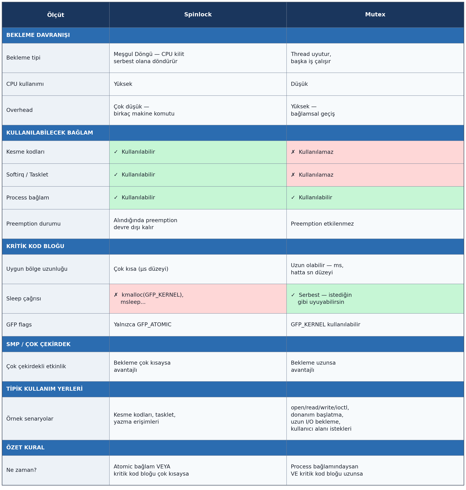

Okuma Yazma Kilitleri 
=====================

Diğer çok kullanılan senkronizasyon nesnelerinden biri de *okuma yazma kilitleri (readers-writer lock)*
denilen nesnelerdir. Önce bu nesnelere neden gereksinim duyulduğunu bir örnekle açıklamak istiyoruz.
Çekirdek kodlarında paylaşılan bir kaynak bulunuyor olsun. Örneğin bunun global bir bağlı liste (linked
list) olduğunu düşünelim. Bu bağlı listeye bir grup thread eleman (düğüm) ekliyor olsun, bir grup thread
de bu bağlı listeyi dolaşarak eleman arıyor olsun. Burada bağlı listede arama yapmak *okuma (read)*
işlemi gibi düşünülebilir. Çünkü bu işlem paylaşılan kaynakta (burada bağlı liste) bir durum değişikliğine
yol açmadığı için farklı thread'lerden aynı anda yürütülebilmektedir. Ancak bağlı listeye eleman ekleyen
thread bu işlem sırasında bağlı listenin düğümlerini değiştirdiği için tam o sırada başka bir thread de
aynı bağlı listeye ekleme yaparsa ya da ondan arama yaparsa bu durum çökmeye yol açabilir. Burada bağlı
listeye eleman ekleme bir *yazma (write)* işlemi olarak ele alınabilir. O halde bizim öyle bir kritik kod
bloğu oluşturmamız gerekir ki birden fazla okuma yapan thread bu kritik kod bloğuna bekleme yapmadan
girebilsin ancak bir thread okuma yaparken yazma yapan bir thread okuma yapan thread kritik kod bloğundan
çıkana kadar beklesin. Benzer biçimde eğer yazma yapan bir thread kritik kod bloğuna girmişse bu işlem
bitene kadar okuma yapan bir thread de kritik kod bloğuna giremesin. Aşağıda Thread-1 kritik kod bloğuna
girmişse Thread-2'nin kritik kod bloğuna girip girmeyeceği bir tablo biçiminde verilmiştir:

Görüldüğü gibi bu mekanizma yalnızca eş zamanlı okumalar için kritik kod bloğuna girilmesine izin
vermektedir.

Böyle bir mekanizma tek başına mutex ya da semaphore nesneleriyle sağlanamaz. Aşağıdaki temsili koda
(pseudo code) dikkat ediniz:

.. code-block:: c

    static DEFINE_MUTEX(g_mutex);

    read()
    {
        mutex_lock(&g_mutex);
        /* okuma işlemi yapılıyor */
        mutex_unlock(&g_mutex);
    }

    write()
    {
        mutex_lock(&g_mutex);
        /* yazma işlemi yapılıyor */
        mutex_unlock(&g_mutex);
    }

Burada birden fazla okuma işlemi de blokeye yol açacaktır. Halbuki bizim istediğimiz birden fazla okumanın
kilide yakalanmadan yapılabilmesidir.

Linux çekirdeğinde readers/writer lock nesneleri spinlock mekanizmasıyla çalışmaktadır. Yani bu nesneler
thread'i bloke ederek uykuya yatırmazlar. Thread'ler arası geçişi (preemption) kapatarak meşgul bir
döngüde kilidin açılmasını beklerler. Yine bu nesnelerin de tek işlemcili ya da tek çekirdekli sistemlerde
bir kullanımı yoktur. Bu sistemlerde bu kilit fonksiyonları yalnızca thread'ler arası geçişi kapatıp
açmaktadır. (Yani kritik kod bloğunun kesilmeden çalıştırılmasını sağlamaktadır.)

Okuma yazma kilitleri ``rwlock_t`` türünden bir yapıyla temsil edilmektedir. Bu yapı güncel çekirdeklerde
şöyle tanımlanmıştır:

.. code-block:: c

    typedef struct {
        struct rwbase_rt    rwbase;
        atomic_t            readers;
    #ifdef CONFIG_DEBUG_LOCK_ALLOC
        struct lockdep_map  dep_map;
    #endif
    } rwlock_t;

Okuma yazma kilit nesnelerinin yaratılması ``DEFINE_RWLOCK`` makrosuyla ya da ``rwlock_init`` fonksiyonuyla
yapılmaktadır. ``DEFINE_RWLOCK`` makrosu ``include/linux/rwlock_types.h`` dosyası içerisinde aşağıdaki
gibi tanımlanmıştır:

.. code-block:: c

    #ifdef CONFIG_DEBUG_SPINLOCK
    #define __RW_LOCK_UNLOCKED(lockname)                            \
        (rwlock_t) {    .raw_lock = __ARCH_RW_LOCK_UNLOCKED,        \
                        .magic = RWLOCK_MAGIC,                      \
                        .owner = SPINLOCK_OWNER_INIT,               \
                        .owner_cpu = -1,                            \
                        RW_DEP_MAP_INIT(lockname) }
    #else
    #define __RW_LOCK_UNLOCKED(lockname)                            \
        (rwlock_t) {    .raw_lock = __ARCH_RW_LOCK_UNLOCKED,        \
                        RW_DEP_MAP_INIT(lockname) }
    #endif

    #define DEFINE_RWLOCK(x)    rwlock_t x = __RW_LOCK_UNLOCKED(x)

``rwlock_init`` fonksiyonunun parametrik yapısı da şöyledir:

.. code-block:: c

    #include <linux/rwlock.h>

    void rwlock_init(rwlock_t *lock);

Okuma yazma kilitlerinin kilidini alan ve kilidini bırakan fonksiyonlar şunlardır:

.. code-block:: c

    void read_lock(rwlock_t *lock);
    void read_lock_irq(rwlock_t *lock);
    void read_lock_irqsave(rwlock_t *lock, unsigned long flags);
    void read_lock_bh(rwlock_t *lock);

    void read_unlock(rwlock_t *lock);
    void read_unlock_irq(rwlock_t *lock);
    void read_unlock_irqrestore(rwlock_t *lock, unsigned long flags);
    void read_unlock_bh(rwlock_t *lock);

    void write_lock(rwlock_t *lock);
    void write_lock_irq(rwlock_t *lock);
    void write_lock_irqsave(rwlock_t *lock, unsigned long flags);
    void write_lock_bh(rwlock_t *lock);
    int  write_trylock(rwlock_t *lock);

    void write_unlock(rwlock_t *lock);
    void write_unlock_irq(rwlock_t *lock);
    void write_unlock_irqrestore(rwlock_t *lock, unsigned long flags);
    void write_unlock_bh(rwlock_t *lock);

Nesne ``read_lock`` fonksiyonlarıyla kilitlenmişse nesnenin açılması ``read_unlock`` fonksiyonlarıyla,
nesne ``write_lock`` fonksiyonlarıyla kilitlenmişse nesnenin açılması ``write_unlock`` fonksiyonlarıyla
yapılmalıdır. Örneğin okuma amaçlı kritik kod şöyle oluşturulabilir:

.. code-block:: c

    static DEFINE_RWLOCK(g_rwlock);
    /* ... */

    read_lock(&g_rwlock);
    ... 
    ...         <KRİTİK KOD BLOĞU> 
    ...
    read_unlock(&g_rwlock);

Yazma amaçlı kritik kod bloğu da şöyle oluşturulabilir:

.. code-block:: c

    write_lock(&g_rwlock);
    ...
    ...         <KRİTİK KOD BLOĞU> 
    ... 
    write_unlock(&g_rwlock);

Örneğin biz bu fonksiyonlarla okuma yazma işlemlerini aşağıdaki gibi senkronize edebiliriz:

.. code-block:: c

    static DEFINE_RWLOCK(g_rwlock);

    read()
    {
        read_lock(&g_rwlock);
        /* okuma işlemi yapılıyor */
        read_unlock(&g_rwlock);
    }

    write()
    {
        write_lock(&g_rwlock);
        /* yazma işlemi yapılıyor */
        write_unlock(&g_rwlock);
    }

Burada artık okuma yapmak isteyen thread ``read_lock`` fonksiyonu ile spinlock kilidini aldığında başka bir
thread bu kilidi ``write_lock`` ile alamaz ve spin yapmaya başlar. Ancak başka bir thread kilidi yine
``read_lock`` ile alabilir. Eğer bir thread kilidi ``write_lock`` ile almışsa başka bir thread kilidi
``read_lock`` ile de ``write_lock`` ile de alamaz ve spin yaparak bekler.

``read_lock`` ve ``write_lock`` fonksiyonlarının irq sonekli versiyonları spinlock konusunda belirttiğimiz
gibi akış kritik koda girdiğinde ilgili işlemci ya da çekirdeğin yerel kesmelerini kapatmaktadır. irqsave
sonekli fonksiyonlar yine önce IRQ durumunu ``flags`` değişkeninde saklayıp unlock işlemi sırasında IRQ
durumunu önceki duruma set etmektedir.

UMA ve NUMA Mimarileri
======================

Biz Linux çekirdeğindeki temel senkronizasyon nesnelerini tanıttık. Ancak çekirdek senkronizasyon
mekanizmasının özellikle çok işlemcili ya da çok çekirdekli sistemler söz konusu olduğunda pek çok
ayrıntısı da vardır. Burada bu ayrıntılar üzerinde duracağız.

Bugün çok işlemcili ya da çok çekirdekli sistemlerde işlemci ile bellek arasındaki bağlantı söz konusu
olduğunda iki mimari kullanılmaktadır: *SMP (Symmetric Multiprocessor) Mimarisi* ve *NUMA (Non-Unified
Memory Access) Mimarisi*.

SMP Mimarisi
------------

UMA mimarisinde tüm işlemci ya da çekirdekler aynı fiziksel RAM'e bağlıdır. Dolayısıyla bir işlemci ya da
çekirdek RAM'e erişirken diğeri o erişim bitene kadar beklemektedir. Tabii bu senkronizasyon donanım
tarafından sağlanmaktadır. SMP mimarisindeki RAM erişimini aşağıdaki şekille betimleyebiliriz:

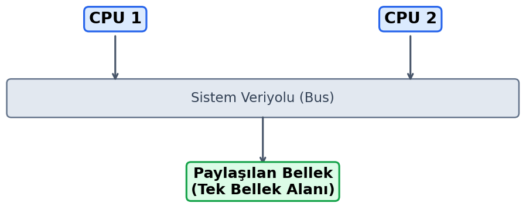

UMA sisteminde bir CPU ya da çekirdek DRAM belleğe eriştiği zaman diğeri nano saniyeler mertebesinde
beklediği için tam bir paralel çalışma mümkün olamamaktadır. Tabii işlemcilerin ya da çekirdeklerin içsel
önbellekleri DRAM erişimini azaltmayı hedeflemektedir. Ancak işlemci içerisindeki önbellek mekanizmasının
da *önbellek tutarlılığı (cache coherency)* denilen sorunları vardır. Örneğin bir işlemci ya da çekirdek
DRAM bellekten belli bir yeri içsel önbelleğine çekmiş olsun. Şimdi o işlemci ya da çekirdek oraya bir
şey yazdığında diğer işlemcilerin ya da çekirdeklerin onu fark etmesi gerekir. İşte bunu sağlamak
için *önbellek tutarlılığına* ilişkin bazı mekanizmalar işletilmektedir. Biz burada önbellek protokolleri
üzerinde durmayacağız. Bunlar hakkındaki bilgileri başka kaynaklardan edinebilirsiniz.

Eskiden UMA yerine (o zamanlar NUMA yoktu) "SMP (Symmetric Multiprocessing)" kavramı kullanılıyordu. Yani bu kavramlar
eşanlamlı idi. Ancak daha sonra SMP kavramı "tüm işlemcilerin eşit hakka sahip olduğu çok işlemcili sistemleri" belirtmek
için kullanılmaya başlandı. Linux çekirdeklerinde CONFIG_SMP parametresi sistemin birden fazla CPU için mi yoksa tek CPU
için mi derleneceğini belirtmektedir. 

NUMA Mimarisi
-------------

NUMA mimarisinde DRAM bellek bank'lara ayrılmıştır. Her işlemcinin ya da çekirdeğin ayrı bir bank'ı
vardır. Bunlar kendi bank'larına diğer bank'lardan daha hızlı erişebilmektedir. Çünkü bunlar kendi
bank'larına erişirken diğer CPU ya da çekirdekleri durdurmamaktadır. Bu nedenle bu mimarilerde belleğin
her bölgesine erişim aynı sürede yapılamamaktadır. *Non-unified* sözcüğü bunu anlatmaktadır. Bu mimariyi
aşağıdaki şekille betimleyebiliriz:

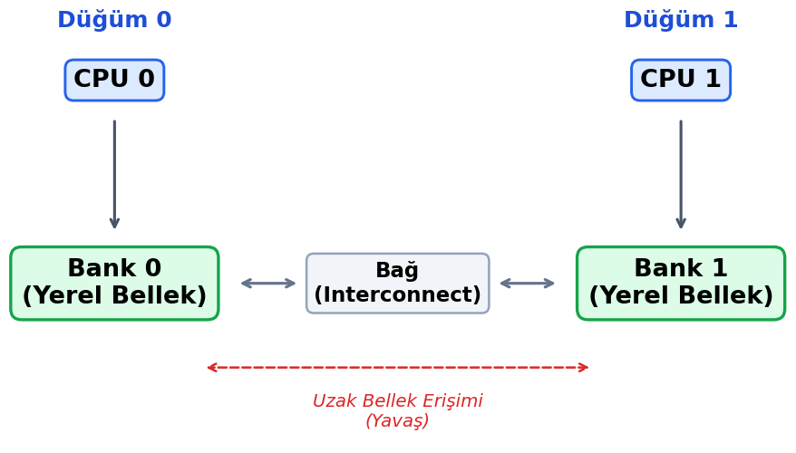

UMA ve NUMA Mimarilerinin Avantaj ve Dezavantajları
----------------------------------------------------

SMP mimarisinin de NUMA mimarisinin de bazı avantajları ve dezavantajları vardır. Ancak kişisel
bilgisayarlarımızda yaygın olarak SMP mimarisi kullanılmaktadır.

**NUMA Mimarisinin Avantajları:**

- Daha yüksek ölçeklenebilirlik sunar (64+ işlemciye kadar ölçeklenebilir).
- Yerel bellek (kendi bank'ına) erişimleri çok hızlıdır (düşük gecikme).
- Bellek bant genişliği toplamda daha yüksektir (her çekirdek kendi belleğine erişir).
- Büyük ve paylaşımlı bellek sistemleri için daha uygundur.
- Bellek kapasitesi daha kolay arttırılabilir (düğüm başına bellek eklenebilir).
- Performansı artırmak için veri yerelliği (data locality) optimizasyonu yapılabilir.

**NUMA Mimarisinin Dezavantajları:**

- Programlama tarafı ve yönetimi daha karmaşıktır.
- Uzak bellek erişimleri (diğer bank'lara erişim) yavaştır (yerelden 2-3 kat daha yavaş olabilir).
- İşletim sisteminin ve uygulamaların *NUMA-farkında (NUMA-aware)* olması gerekir.
- Yanlış veri yerleşimi performansı ciddi şekilde düşürebilir.
- Donanım maliyeti daha yüksektir.
- Önbellek tutarlılık (cache consistency) mekanizmaları daha karmaşıktır.

**UMA Mimarisinin Avantajları:**

- Programlama modeli çok daha basittir.
- Tüm işlemciler ya da çekirdekler için bellek erişim gecikmesi aynıdır (tutarlı performans).
- İşletim sistemlerinin ve uygulamaların geliştirilmesi daha kolaydır.
- Donanım tasarımı nispeten daha basittir.
- Küçük sistemlerde (2-8 işlemci) daha verimli olabilir.
- Önbellek tutarlılık mekanizması daha basittir.

**UMA Mimarisinin Dezavantajları:**

- Ölçeklenebilirlik sınırlıdır (genellikle 8 işlemciden sonra verim düşer).
- Bellek veri yolu (memory bus) darboğaz oluşturabilir.
- Tüm işlemciler ya da çekirdekler aynı veri yolunu paylaştığı için trafik sıkışabilir.
- Bellek bant genişliği sınırlıdır (paylaşılan veri yolu kapasitesiyle sınırlı).
- Büyük sistemlerde performans ölçeklemesi zayıftır.
- Yüksek işlemci sayılarında veri yolu çakışmaları artar.

**Kullanım Senaryoları**

- **UMA:** Küçük sunucular, iş istasyonları, gömülü sistemler.
- **NUMA:** Büyük veritabanı sunucuları, HPC sistemleri, bulut sunucuları.
- **UMA:** Daha az sayıda thread çalıştıran uygulamalar.
- **NUMA:** Yüzlerce thread çalıştıran paralel uygulamalar.
- **UMA:** Bellek erişim modelinin basit olması gereken durumlar.
- **NUMA:** Bellek kapasitesi ve bant genişliğinin kritik olduğu durumlar.

**Modern Eğilim**

- Günümüzde çok işlemcili büyük çapta sunucuların çoğu NUMA mimarisi kullanır.
- Modern işletim sistemleri (Linux, Windows) NUMA optimizasyonlarına sahiptir.
- Bulut bilişimde NUMA performans için kritiktir.
- Sanallaştırma ortamlarında NUMA yapılandırması önemli bir optimizasyon alanıdır.

Linux çekirdeği hem UMA hem de NUMA mimarisini destekleyecek biçimde gerçekleştirilmiştir. Yani biz UMA
içeren sistemlerde de NUMA içeren sistemlerde de Linux'u kurduğumuzda Linux bunu fark etmekte ve o
mimariye özgü çalışmayı desteklemektedir. Genel olarak Linux çekirdeği (konfigürasyona da bağlıdır) UMA
sistemlerini sanki tek düğümden oluşan NUMA sistemleri gibi ele almaktadır. 

Çok İşlemcili Sistemlerde Senkronizasyon Sorunları
====================================================

Çok işlemcili ya da çok çekirdekli sistemlerde senkronizasyon bakımından iki önemli sorun kaynağı vardır:

1. Aynı bellek bölgesine erişimde oluşan sorunlar.
2. Komutların yer değiştirmesi (instruction reordering) nedeniyle oluşan sorunlar.

Birden fazla işlemci ya da çekirdeğin aynı global değişkeni tesadüfen aynı zamanda güncellemeye çalıştığını
düşünelim. Ya da bir işlemci ya da çekirdek o global değişkeni güncellerken diğerinin onu okumaya çalıştığını
düşünelim. Yukarıda biz modern sistemlerde bir işlemci ya da çekirdeğin belleğe erişirken zaten diğerlerini
durdurduğunu belirtmiştik. Ancak Intel gibi bazı mimarilerde bu durdurma bazı durumlarda tüm makine komutu
süresince yapılmamaktadır. Intel ve 64 bit ARM işlemcileri bazı koşullarda belleğe erişim yapan makine
komutunu çalışırken veri yolunu birden fazla kez tutup bırakabilmektedir. Örneğin 32 bit Intel işlemcilerinde
aslında işlemci fiziksel belleğe hep 32 bit genişliğinde erişmektedir. Bu işlemciler bellekten 1 byte bile
okuyacak olsalar aslında 4 byte okuyup o 4 byte içerisinden o byte'ı ayrıştırmaktadır. İşte bu işlemcilerde
eğer 4 byte'lık nesneler hizalanmamışsa makine komutunun başından sonuna kadar veri yolu tutulmamaktadır.
Aşağıdaki gibi bir bellek içeriğinde işlemcinin 4'ün katlarına hizalanmamış olan yyyy byte'larına tek bir
makine komutuyla yazmak istediğini varsayalım:

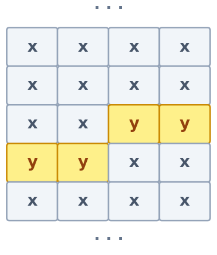

İşte bu biçimdeki hizalı olmayan erişimlerde işlemci makine komutunun sonuna kadar veri yolunu tutarak
diğer işlemcileri durdurmamaktadır. Performans artışını sağlamak için işlemci önce ``xxyy`` satırını
yazmakta, o sırada veri yolunu bırakmakta, sonra diğer ``yyxx`` satırını yazmaktadır. İşte tam bu sırada
diğer işlemci ya da çekirdek araya girerse buradaki hizalanmamış nesne içindeki değeri yanlış
okuyabilmektedir. Intel işlemcileri bunu yalnızca hizalanmamış veriler üzerinde yapmaktadır. Burada
hizalama demekle *her nesnenin kendi uzunluğunun katlarında bulunması durumunu* kastediyoruz. Örneğin
1 byte bir bilginin okunup yazılmasında anlattığımız çalışma sisteminde hiçbir sorun oluşmayacaktır:

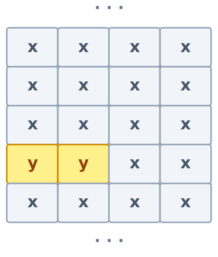

Ya da aşağıdaki 2 byte'lık bilginin okunup yazılmasında da bir sorun oluşmayacaktır:

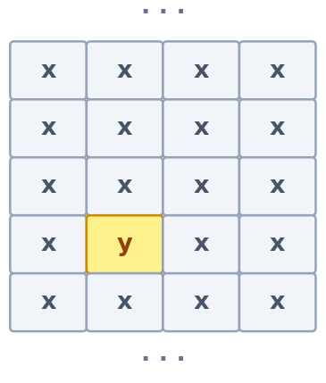

Ancak aşağıdaki 2 byte'lık bilginin okunup yazılmasında bir sorun oluşabilecektir:

Çünkü 32 bit Intel işlemcileri bellek okumalarını 4'ün katlarından dörder byte'lık verileri çekerek
yapmaktadır. Benzer biçimde 64 bit Intel işlemcileri de 4'ün katları yerine 8'in katlarıyla okuma ve yazma
yapmaktadır. Tabii bildiğiniz gibi C/C++ derleyicileri zaten default ayarlarında hizalama uygulamaktadır. Bu nedenle
yukarıda bahsettiğimiz sorun genellikle ortaya çıkmayacaktır.

Intel gibi CISC tarzı işlemcilerde read-modify-write içeren makine komutları da vardır. Örneğin
``INC mem`` makine komutu önce bellekteki değeri CPU içerisine çeker, artırımı orada yapıp sonucu
belleğe geri yazar. Read-modify-write komutları birden fazla işlemci ya da çekirdeğin bulunduğu
sistemlerde diğer işlemci ya da çekirdekler bağlamında atomik değildir.

Peki Intel'de hizalanmamış olan ya da read-modify-write içeren 
makine komutlarında  sistem programcısının ne yapması gerekir? İşte Intel işlemcilerini tasarlayanlar komutların önüne getirilebilen 
1 byte'lık LOCK önek komutu bulundurmuşlardırhizalanmamış olan yukarıdaki
gibi durumlarda sistem programcısının ne yapması gerekir? İşte Intel işlemcilerini tasarlayanlar komutların
önüne getirilebilen 1 byte'lık ``LOCK`` önek komutu bulundurmuşlardır. Eğer erişim bu ``LOCK`` önekiyle
yapılırsa ilgili işlemci ya da çekirdek makine komutunun sonuna kadar veri yolunu (data bus) diğer
işlemciler ya da çekirdekler erişmesin diye tutmaktadır. Tabii C'de ve C++'ta biz makine komutlarını
doğrudan kullanamayız ancak sembolik makine dilinde yazılmış fonksiyonları çağırabiliriz ya da
derleyicilerin sunduğu *inline assembly* özelliği ile taşınabilir olmayan bir biçimde C/C++ kodları ile
makine kodlarını bir arada kullanabiliriz. Linux çekirdeğinde mümkün olduğunca gcc derleyicisinin
*inline assembly* özelliği kullanılmıştır.

32 bit ARM işlemcilerinde (ARM V7) zaten bellek erişimlerinin hizalanmış olması zorunludur. Aksi takdirde
işlemci exception oluşturmaktadır. Ancak daha sonra 64 bit ARM işlemcileri (ARM V8) de hizalanmamış
nesneler üzerinde exception oluşturmadan işlem yapabilir hale getirilmiştir. 64 bit ARM işlemcilerinde bu
durumu ortadan kaldırmak için Intel'in ``LOCK`` önekinin işlevinin bir bakıma benzerini yapan özel
``LDREX`` (load exclusive) ve ``STREX`` (store exclusive) makine komutları bulunmaktadır.
Ayrıca ARMV8 ile ARM'a da bazı read-modify-write komutları da eklenmiştir.

Atomik İşlemler
===============

Peki çok işlemcili ya da çok çekirdekli sistemlerde *atomik işlem* ne anlama gelmektedir? Bilindiği gibi
atomik işlem demek "kesilmeden, bölünmeden, yani araya başka bir unsur girmeden tek parça halinde yapılan
işlem" demektir. Şimdi şu soruyu soralım: Bir işlemci ya da çekirdekte çalışan makine komutları atomik
midir? İşte bu durum işlemcilerde çeşitli unsurlara bağlı olarak değişebilmektedir. Yukarıda da
belirttiğimiz gibi örneğin Intel ve ARM64 V8 işlemcilerinde hizalanmamış bellek bölgelerine yapılan
erişimler atomik değildir. Çünkü bu işlemler yapılırken araya başka bir işlemci ya da çekirdek girip
yapılan işlemi kararsız bir biçimde görebilmektedir. Çok işlemcili ya da çok çekirdekli sistemlerde
atomiklik "bir işlem bir CPU'da yapılırken diğer CPU'ların da bu işlemin yan etkisini ya tamamen görmeleri
ya da hiç görmemeleri" biçiminde tanımlanabilir. Peki yukarıdaki hizalanmamış bellek erişimleri dışında
makine komutları bu yaptığımız tanıma göre atomik midir? Evet istisnai başka birkaç durum dışında makine
komutları genel olarak atomiktir.

Yukarıda da belirttiğimiz gibi Intel gibi CISC işlemcilerinde doğrudan bellek üzerinde işlem yapan read-modfy-write makine 
komutları bulunmaktadır. Örneğin bu işlemcilerde aşağıdaki gibi tek bir makine komutuyla belli bir adresteki değer 1
artırılabilmektedir:

.. code-block:: nasm

    INC mem

Peki Intel ailesine ilişkin bir işlemcide bu işlem atomik midir? İşte bu tür işlemcilerde
*read-modify-write* biçiminde gerçekleştirilen işlemlerde ilgili bellek adresi hizalanmış olsa bile işlem
birden fazla işlemci ya da çekirdek söz konusu olduğunda atomik değildir. Biz atomikliği yukarıda "bir
işlemcinin ya da çekirdeğin yaptığı işlemi diğeri ya tam olarak görecek ya da görmeyecek" biçiminde
tanımlamıştık. Bu makine komutunu örneğin iki işlemci aynı zaman dilimi içerisinde yapmaya çalışırsa
birinin belleğe yazdığı artırılmış değer diğeri tarafından ezilebilmektedir. Bu durumda da bellekteki
değer iki kez değil sanki bir kez artırılmış gibi bir durum oluşabilmektedir. İşte bu tür durumlar
işlemcilerin makine komutu bitene kadar veri yolunu kilitlemesiyle ya da buna benzer bir mekanizmayla
engellenmektedir. Intel işlemcilerinde ``LOCK`` öneki bu işlemi yapmaktadır:

.. code-block:: nasm

    LOCK INC mem

Atomiklik ile komutların yer değiştirmesi (instruction reordering) kavramlarını birbirine karıştırmayınız.
Komutların yer değiştirmesinde komutlar yine atomik olabilir. Ancak diğer bir işlemci ya da çekirdek
bunları farklı sıralarda yapılmış gibi görebilmektedir.

Bizim C'de tek bir operatör ile gerçekleştirdiğimiz ifadeler atomik davranış bakımından hiçbir garanti
oluşturmamaktadır. Örneğin:

.. code-block:: c

    ++g_count;

Burada ``g_count`` değişkeni 1 artırılmıştır. Ancak bu işlem örneğin Intel x86 kodu üreten derleyiciler
tarafından tek bir makine komutuyla ``LOCK`` öneki getirilerek yapılmak zorunda değildir. RISC mimarisi
için kod üreten derleyicilerde ise bu tür işlemler zaten tek bir makine komutuyla yapılamamaktadır.
Örneğin Intel x86 derleyicileri yukarıdaki gibi C'de tek bir operatörden oluşan ifade için aşağıdaki gibi
üç makine komutu üretebilmektedir:

.. code-block:: nasm

    MOV reg, g_count
    INC reg
    MOV g_count, reg

Kaldı ki x86 kodu üreten bir derleyici bunun için tek bir makine komutu üretse bile komuta ``LOCK`` öneki
getirmedikten sonra yine birden fazla işlemci ya da çekirdeğin bulunduğu durumda atomiklik
sağlanamamaktadır:

.. code-block:: nasm

    INC count

Burada veri yolu ``LOCK`` önekiyle kilitlenmedikten sonra birden fazla işlemcinin bu komutu tesadüfen aynı
zaman diliminde çalıştırması sonucunda artırım değeri yanlış oluşabilecektir.

C'de Atomik Değişkenler
-----------------------

Aslında C'deki basit birtakım işlemler için derleyicinin atomik kod üretmesi çeşitli biçimlerde
sağlanabilmektedir. Örneğin C11 ile C'ye ``_Atomic(type)`` biçiminde tür belirleyicisi ve ``_Atomic``
biçiminde tür niteleyicisi eklenmiştir. Eğer bir değişken bu ``_Atomic(type)`` tür belirleyicisi ya da
``_Atomic`` tür niteleyicisi ile tanımlanırsa derleyici o değişkenle yapılan işlemlerin atomik yapılmasını
(örneğin ``LOCK`` önekleriyle yapılmasını) kendi sağlamaktadır. Örneğin:

.. code-block:: c

    _Atomic int g_count;

Yukarıda da belirttiğimiz gibi C11'de ``_Atomic`` tür niteleyicisinin yanı sıra ``_Atomic`` tür
belirleyicisi de bulunmaktadır. ``_Atomic`` tür belirleyicisi parantezli biçimde kullanılmaktadır.
Örneğin:

.. code-block:: c

    _Atomic(int) g_count;

C11 ile C'ye sokulan ``_Atomic`` niteleyicisi ve tür belirleyicisi *isteğe bağlı (optional)* bir
özelliktir. Derleyicilerin bunu desteklemesi zorunlu değildir. Derleyicinin bu özelliği destekleyip
desteklemediği derleme aşamasında ``__STDC_NO_ATOMICS__`` önceden tanımlanmış sembolik sabitiyle
belirlenebilmektedir.

Artık biz ``++g_count`` gibi bir işlemi yaptığımızda derleyici bunu yapacak atomik kodu kendisi
üretecektir. Ayrıca C11 ile eklenen ``<stdatomic.h>`` dosyasında aşağıdaki ``typedef`` bildirimleri de
bulunmaktadır:

.. code-block:: c

    typedef atomic_bool    _Atomic _Bool;
    typedef atomic_char    _Atomic char;
    typedef atomic_schar   _Atomic signed char;
    typedef atomic_uchar   _Atomic unsigned char;
    typedef atomic_short   _Atomic short;
    typedef atomic_ushort  _Atomic unsigned short;
    typedef atomic_int     _Atomic int;
    typedef atomic_uint    _Atomic unsigned int;
    typedef atomic_long    _Atomic long;
    typedef atomic_ulong   _Atomic unsigned long;
    typedef atomic_llong   _Atomic long long;
    typedef atomic_ullong  _Atomic unsigned long long;
    /* ... */

``_Atomic`` tür niteleyicisi Microsoft C derleyicileri tarafından desteklenmemektedir. C11 standartlarına
göre ``_Atomic`` niteleyicisi gerçek sayı türleriyle, göstericilerle ve yapı türleriyle de
kullanılabilmektedir. Ancak derleyici atomikliği tek bir makine komutuyla sağlayamadığı durumda kendi
içerisindeki senkronizasyon nesnelerini de kullanabilmektedir. Derleyiciler arasında bu konuda işlevsel
farklılıklar ve birtakım kusurlar bulunabilmektedir.

Ayrıca C11'den daha eski zamanlarda da C derleyicileri atomik işlemler için *built-in* (ya da *intrinsic*
de denilmektedir) fonksiyonlar bulunduruyordu. Örneğin atomik işlemler gcc tarafından sağlanan *built-in*
``__atomic_xxx`` önekli fonksiyonlar tarafından yapılabilmektedir. Microsoft derleyicileri de aynı amaçla
``InterlockedXXX`` fonksiyonlarını bulundurmaktadır.

C++'ta da ``<atomic>`` başlık dosyası içerisinde tanımlanmış olan ``atomic`` isimli sınıf şablonu ile
atomik işlemler yapılabilmektedir. Örneğin:

.. code-block:: cpp

    atomic<int> count;

Ancak Linux çekirdeği yukarıda bahsettiğimiz ``_Atomic`` tür niteleyicisini ve gcc derleyicilerinin
sağladığı *built-in* ``__atomic_xxx`` fonksiyonlarını kullanmamaktadır. Bunun en önemli nedeni çekirdeğin
derleyicinin versiyonundan ve yeteneğinden bağımsız biçimde pek çok platformu destekleyecek biçimde
yazılmak istenmesidir. Atomik işlemler çekirdek içerisindeki fonksiyonlarla gerçekleştirilmektedir.
Çekirdek geliştirmesi yapan ve aygıt sürücü yazan sistem programcıları da bu mekanizmayı kullanmalıdır.

Linux Çekirdeğinde Atomik İşlemler
----------------------------------

Linux çekirdeklerinde atomik işlemler ``atomic_t``, ``atomic64_t`` ve ``atomic_long_t`` isimli türler
kullanılarak yapılmaktadır. Bu türler birer yapı belirtir. Bu yapılar ``include/linux/types.h`` içerisinde
şöyle tanımlanmıştır:

.. code-block:: c

    /* include/linux/types.h */

    typedef struct {
        int counter;
    } atomic_t;

    #ifdef CONFIG_64BIT
    typedef struct {
        s64 counter;
    } atomic64_t;
    #endif

    typedef struct {
        long counter;
    } atomic_long_t;

Yeni çekirdeklere ``atomic_long_t`` türü de eklenmiştir. `atomic_long_t`` türü ``include/linux/atomic/atomic_long.h`` 
dosyası içerisinde diğer türlerle ``typedef`` edilmiş durumdadır:

.. code-block:: c

    #ifdef CONFIG_64BIT
    typedef atomic64_t atomic_long_t;
    /* ... */
    #else
    typedef atomic_t atomic_long_t;
    /* ... */
    #endif

``atomic_t`` türündeki atomik değişken ``int`` türünden, ``atomic64_t`` türündeki atomik değişken ise
``long long`` türündendir. ``atomic_long_t`` türündeki atomik değişkenin türü de o sistemdeki ``long``
türünün uzunluğuna bağlı olarak değişebilmektedir. Bu türlerin neden yapılarla sarmalandığını merak
edebilirsiniz. Bunun en önemli nedeni atomik işlemler yapan çekirdek fonksiyonlarına yanlışlıkla başka
bir türün parametre olarak geçilmesinin engellenmek istenmesidir. Örneğin eğer ``atomic_t`` türü ``int``
olarak ``typedef`` edilseydi ``atomic_t`` türünden bir değişkene doğrudan ``int`` bir değer atanabilirdi.
Aynı zamanda bu atomik temsilin daha okunabilir olacağı düşünülmüştür. Örneğin:

.. code-block:: c

    atomic_t count;

    count++;                /* HATA: invalid operands to binary ++ */
    count = count + 1;      /* HATA: invalid operands to binary + */

Atomik türden bir nesneye pratik biçimde ilkdeğer vermek için makrolar bulundurulmuştur. Örneğin:

.. code-block:: c

    static atomic_t      my_counter          = ATOMIC_INIT(0);
    static atomic64_t    my_long_counter     = ATOMIC64_INIT(1000);
    static atomic_long_t my_platform_counter = ATOMIC_LONG_INIT(-1);

Bu makrolar aslında küme parantezleri oluşturup yapının ``counter`` elemanına değer atanmasını
sağlamaktadır. Örneğin ``ATOMIC_INIT`` makrosu şöyle tanımlanmıştır:

.. code-block:: c

    #define ATOMIC_INIT(i)      { (i) }

Ancak yerel değişken söz konusu ise bu biçimde ilkdeğer verme atomikliği bozabilmektedir. Çünkü
derleyiciler yerel değişkenlere de makine komutlarıyla değer atamaktadır. Atomik değişkenlere daha sonra
değer atamak için ``atomic_set`` fonksiyonu kullanılmaktadır. Güncel çekirdeklerde ``atomic_set``
fonksiyonu inline biçimde şöyle tanımlanmıştır:

.. code-block:: c

    static __always_inline void
    atomic_set(atomic_t *v, int i)
    {
        instrument_atomic_write(v, sizeof(*v));
        raw_atomic_set(v, i);
    }

Görüldüğü gibi fonksiyonun birinci parametresi ``atomic_t`` türünden nesnenin adresini, ikinci parametresi
ise buna atanacak değeri almaktadır. Buradaki asıl işlem platforma göre değişebilen ``raw_atomic_set``
tarafından yapılmaktadır. Fonksiyondaki ``instrument_atomic_write`` çağrısı çekirdek geliştirme süreci
için debug amaçlı bulunmaktadır. Normal olarak bu çağrı koddan çıkartılmaktadır. ``atomic64_t`` türü için
de ``atomic64_set`` isimli fonksiyon bulundurulmuştur:

.. code-block:: c

    static __always_inline void
    atomic64_set(atomic64_t *v, s64 i)
    {
        instrument_atomic_write(v, sizeof(*v));
        raw_atomic64_set(v, i);
    }

Benzer biçimde ``atomic_long_t`` türü için de ``atomic_long_set`` fonksiyonu bulundurulmuştur:

.. code-block:: c

    static __always_inline void
    atomic_long_set(atomic_long_t *v, long i)
    {
        instrument_atomic_write(v, sizeof(*v));
        raw_atomic_long_set(v, i);
    }

Şimdi ``atomic_set`` fonksiyonunun çağırdığı ``raw_atomic_set`` fonksiyonuna bakalım:

.. code-block:: c

    static __always_inline void
    raw_atomic_set(atomic_t *v, int i)
    {
        arch_atomic_set(v, i);
    }

Burada ``arch_atomic_set`` fonksiyonu işlemciye bağlı olarak değişebilecek asıl işlemi yapan
fonksiyondur. Derlemenin yapıldığı işlemci modeli neyse ``arch/<işlemci_türü>/include/asm/atomic.h``
içerisindeki ``arch_atomic_set`` fonksiyonu çağrılmaktadır. ``arch_atomic_set`` bazı mimariler için
makro olarak bazı mimariler için inline fonksiyon olarak yazılmıştır. Örneğin Intel x86 işlemcileri için
``arch/x86/include/asm/atomic.h`` içerisindeki bu fonksiyon şöyle yazılmıştır:

.. code-block:: c

    static __always_inline void arch_atomic_set(atomic_t *v, int i)
    {
        __WRITE_ONCE(v->counter, i);
    }

Buradaki ``__WRITE_ONCE`` makrosu ise şöyle yazılmıştır:

.. code-block:: c

    #define __WRITE_ONCE(x, val)                        \
    do {                                                \
        *(volatile typeof(x) *)&(x) = (val);            \
    } while (0)

Burada görüldüğü gibi erişim ``volatile`` olarak yapılmıştır. Yani yazma işleminin doğrudan bellek
erişimi ile yapılması istenmiştir. Yukarıdaki makroda aklınıza şu sorular gelebilir:

- Nesne hizalanmamışsa yukarıdaki atama işlemi atomik olur mu?
- ``volatile`` erişim, erişimin atomik yapılmasını garanti eder mi?

Nesne hizalanmamışsa yukarıdaki atama tek makine komutuyla yapılsa bile atomik olmaz. Ancak Linux
çekirdeğindeki tüm nesneler her zaman zaten hizalıdır. Yani bu garanti zaten vardır. Yukarıdaki
``volatile`` erişim için gcc'nin tek makine komutu üreteceği de bilinmektedir. gcc ``volatile`` atama
işlemlerini her zaman tek makine komutuyla yapmaktadır. Ayrıca yukarıdaki işlemde ileride ele alacağımız
bir bellek bariyerinin kullanılmadığına dikkatinizi çekmek istiyoruz. Bellek bariyerleri bir grup makine
komutunun sıralamasını garanti etmek için kullanılmaktadır. Atomiklik ise bir işlemin araya girilmeden,
kesilmeden tek parça bir işlem olarak yapılması anlamına gelmektedir.

Yukarıdaki akış Linux çekirdeğinde çok karşılaşılan bir kalıptır. İşlemler işlemci bağımsız fonksiyonlar
çağrılarak yapılır. Ancak belli bir aşamadan sonra işlemciye ilişkin ``arch`` dizini içerisindeki
fonksiyonlar ya da makrolar devreye girer. Bazen yalnızca bazı işlemciler için özel işlemlerin yapılması
söz konusu olabilmektedir. Bu durumda ilgili fonksiyonlar ya da makrolar o işlemciler için yazılır,
diğerleri için de *generic* bir tanımlama yapılır. Bu tür kodlarda isminde "generic" geçen dosyalar
görürseniz şaşırmayınız. Bunlar adeta "geri kalan işlemcilerin hepsi için" anlamına gelmektedir. Atomik
fonksiyonlardaki çağırma dizgesi tipik olarak şöyledir:

.. code-block:: none

    atomic_xxx ---> raw_atomic_xxx ---> arch_atomic_xxx (işlemciye özgü fonksiyon ya da makro)

Atomik Okuma, Artırım ve Eksiltim Fonksiyonları
~~~~~~~~~~~~~~~~~~~~~~~~~~~~~~~~~~~~~~~~~~~~~~~

Atomik türlerden atomik biçimde değer okumak için read fonksiyonları kullanılmaktadır:

.. code-block:: c

    int atomic_read(const atomic_t *v);
    s64 atomic64_read(const atomic64_t *v);
    long atomic_long_read(const atomic_long_t *v);

Tabii bu değer okuma işlemi de tek bir işlemle yani başka bir işlemcinin araya girmesi engellenerek
yapılmaktadır. ``atomic_read`` fonksiyonu şöyle yazılmıştır:

.. code-block:: c

    static __always_inline int
    atomic_read(const atomic_t *v)
    {
        instrument_atomic_read(v, sizeof(*v));
        return raw_atomic_read(v);
    }

Buradaki ``instrument_atomic_read`` fonksiyonu çekirdek geliştirmesi sırasında debug amaçlı
çağrılmaktadır. Normal çekirdek derlemelerinde bu çağrı koddan çıkartılmaktadır. ``raw_atomic_read``
fonksiyonu şöyle tanımlanmıştır:

.. code-block:: c

    static __always_inline int
    raw_atomic_read(const atomic_t *v)
    {
        return arch_atomic_read(v);
    }

``arch_atomic_read`` fonksiyonunun Intel x86 gerçekleştirimi şöyledir:

.. code-block:: c

    static __always_inline int arch_atomic_read(const atomic_t *v)
    {
        /*
         * Note for KASAN: we deliberately don't use READ_ONCE_NOCHECK() here,
         * it's non-inlined function that increases binary size and stack usage.
         */
        return __READ_ONCE((v)->counter);
    }

``__READ_ONCE`` makrosu da şöyle oluşturulmuştur:

.. code-block:: c

    #define __READ_ONCE(x)  (*(const volatile __unqual_scalar_typeof(x) *)&(x))

Burada değişkenin adresi alınarak bu adres ``volatile`` bir adrese dönüştürülmüş ve yukarıda
belirttiğimiz gibi ``volatile`` erişim yapılmıştır. Fonksiyonun kullanımına şöyle bir örnek
verebiliriz:

.. code-block:: c

    atomic_t g_counter = ATOMIC_INIT(100);
    /* ... */

    int value = atomic_read(&g_counter);    /* atomik okuma */

Atomik artırımlar ve eksiltimler için şu fonksiyonlar bulundurulmuştur:

.. code-block:: c

    void atomic_inc(atomic_t *v);       /* v++ */
    void atomic_dec(atomic_t *v);       /* v-- */

    void atomic64_inc(atomic64_t *v);
    void atomic64_dec(atomic64_t *v);

    void atomic_long_inc(atomic_long_t *v);
    void atomic_long_dec(atomic_long_t *v);

Bu fonksiyonlar artırımın atomik bir biçimde yapılmasını garanti etmektedir. Intel'de atomik bellek
artırımları ``LOCK`` öneki getirilmiş tek makine komutuyla yapılabilmektedir. Ancak 32 bitlik ARM gibi
RISC işlemcilerinde bu işlemler bir döngü içerisinde özel makine komutlarıyla yapılmaktadır.
``atomic_inc`` fonksiyonu güncel çekirdeklerde şöyle yazılmıştır:

.. code-block:: c

    static __always_inline void
    atomic_inc(atomic_t *v)
    {
        instrument_atomic_read_write(v, sizeof(*v));
        raw_atomic_inc(v);
    }

``raw_atomic_inc`` fonksiyonu da şöyle yazılmıştır:

.. code-block:: c

    static __always_inline void
    raw_atomic_inc(atomic_t *v)
    {
    #if defined(arch_atomic_inc)
        arch_atomic_inc(v);
    #else
        raw_atomic_add(1, v);
    #endif
    }

Her mimaride 1 artırma yapan makine komutu olmadığı için yukarıdaki kodda bir kontrolün yapıldığını
görüyorsunuz. ``raw_atomic_add`` fonksiyonu da şöyle yazılmıştır:

.. code-block:: c

    static __always_inline void
    raw_atomic_add(int i, atomic_t *v)
    {
        arch_atomic_add(i, v);
    }

Burada artık işlemciye özgü fonksiyon çağrılmıştır. Intel x86 mimarisi için bu fonksiyon şöyledir:

.. code-block:: c

    static __always_inline void arch_atomic_add(int i, atomic_t *v)
    {
        asm_inline volatile(LOCK_PREFIX "addl %1, %0"
                : "+m" (v->counter)
                : "ir" (i) : "memory");
    }

Makine komutunun önüne ``LOCK`` öneki getirilmiş olduğuna dikkat ediniz.

Artırma yapan atomik fonksiyonların artırılmış yeni değeri veren biçimleri de vardır:

.. code-block:: c

    int atomic_inc_return(atomic_t *v);
    int atomic_dec_return(atomic_t *v);

    s64 atomic64_inc_return(atomic64_t *v);
    s64 atomic64_dec_return(atomic64_t *v);

    long atomic_long_inc_return(atomic_long_t *v);
    long atomic_long_dec_return(atomic_long_t *v);

Örneğin çekirdek kodlarında ya da aygıt sürücülerde aşağıdaki gibi bir referans sayacı
oluşturulabilir:

.. code-block:: c

    struct my_object {
        atomic_t refcount;
        /* ... */
    };

    struct my_object *create_object(void)
    {
        struct my_object *obj;

        obj = kzalloc(sizeof(*obj), GFP_KERNEL);
        if (!obj)
            return NULL;

        atomic_set(&obj->refcount, 1);

        return obj;
    }

    void get_object(struct my_object *obj)
    {
        atomic_inc(&obj->refcount);
        /* ... */
    }

    void put_object(struct my_object *obj)
    {
        int new_count;

        if (atomic_dec_return(&obj->refcount) == 0) {
            /* kaynaklar boşaltılıyor */
        }
        /* ... */
    }

Bellekteki atomik nesneye değer eklemek ve onun içerisindeki değeri eksiltmek için de şu fonksiyonlar
bulundurulmuştur:

.. code-block:: c

    void atomic_add(int i, atomic_t *v);    /* v += i */
    void atomic_sub(int i, atomic_t *v);    /* v -= i */

    void atomic64_add(s64 a, atomic64_t *v);
    void atomic64_sub(s64 a, atomic64_t *v);

    void atomic_long_add(long i, atomic_long_t *v);
    void atomic_long_sub(long i, atomic_long_t *v);

Bunların artırılmış ya da eksiltilmiş değerle geri dönen biçimleri de vardır:

.. code-block:: c

    int atomic_add_return(int i, atomic_t *v);
    int atomic_sub_return(int i, atomic_t *v);

    s64 atomic64_add_return(s64 a, atomic64_t *v);
    s64 atomic64_sub_return(s64 a, atomic64_t *v);

    long atomic_long_add_return(long i, atomic_long_t *v);
    long atomic_long_sub_return(long i, atomic_long_t *v);

Artırım ve eksiltim işlemlerinde artırılmış ya da eksiltilmiş değerle değil de eski değerle geri dönen
fetch'li biçimleri de vardır:

.. code-block:: c

    int  atomic_fetch_add(int i, atomic_t *v);
    int  atomic_fetch_sub(int i, atomic_t *v);

    s64  atomic64_fetch_add(s64 i, atomic64_t *v);
    s64  atomic64_fetch_sub(s64 i, atomic64_t *v);

    long atomic_long_fetch_add(long i, atomic_long_t *v);
    long atomic_long_fetch_sub(long i, atomic_long_t *v);

Atomik işlemler için ``xchg`` fonksiyonları da bulunmaktadır:

.. code-block:: c

    int atomic_xchg(atomic_t *v, int new);
    s64 atomic64_xchg(atomic64_t *v, s64 new);
    long atomic_long_xchg(atomic_long_t *v, long new);

Bu fonksiyonlar *read-modify-write* denilen atama işlemini yapmaktadır. Yani bu fonksiyonlar atomik bir
biçimde bellekteki nesneye değer atayıp onun eski değerini geri döndürmektedir. ``atomic_xchg``
fonksiyonu şöyle yazılmıştır:

.. code-block:: c

    static __always_inline int
    atomic_xchg(atomic_t *v, int new)
    {
        kcsan_mb();
        instrument_atomic_read_write(v, sizeof(*v));
        return raw_atomic_xchg(v, new);
    }

``raw_atomic_xchg`` fonksiyonu da şöyle yazılmıştır:

.. code-block:: c

    static __always_inline int
    raw_atomic_xchg(atomic_t *v, int new)
    {
    #if defined(arch_atomic_xchg)
        return arch_atomic_xchg(v, new);
    #elif defined(arch_atomic_xchg_relaxed)
        int ret;
        __atomic_pre_full_fence();
        ret = arch_atomic_xchg_relaxed(v, new);
        __atomic_post_full_fence();
        return ret;
    #else
        return raw_xchg(&v->counter, new);
    #endif
    }

Buradaki ``arch_atomic_xchg`` fonksiyonu da Intel x86 işlemcileri için şöyle yazılmıştır:

.. code-block:: c

    static __always_inline int arch_atomic_xchg(atomic_t *v, int new)
    {
        return arch_xchg(&v->counter, new);
    }

Bundan sonra da Intel'deki ``XCHG`` makine komutu kullanılarak işlem yapılmıştır.

ARM gibi RISC işlemcilerinde atomik işlemlerin nasıl yapıldığını izleyen paragraflarda açıklayacağız.
``atomic_set`` fonksiyonlarının bir değer geri döndürmediğine, ``atomic_xchg`` fonksiyonlarının ise eski
değeri geri döndürdüğüne dikkat ediniz. Ayrıca ``atomic_xchg`` fonksiyonları işlemlerin başına ve sonuna
bellek bariyerleri de yerleştirmektedir. (Intel x86 işlemcilerinde ``XCHG`` makine komutu zaten atomiktir
yani ``LOCK`` uygulanmış gibidir. Dolayısıyla bu işlemcilerde bellek bariyerine gerek kalmamaktadır.)

Aslında çekirdekte atomik ``xchg`` fonksiyonunun dışında herhangi bir nesneye atomik değer atayan genel
bir ``xchg`` makrosu da bulundurulmuştur. Bu makronun birinci parametresi nesnenin bellek adresini,
ikinci parametresi ise ona aktarılacak değeri almaktadır. Makro atomik bir biçimde bu değeri nesneye
yerleştirirken onun önceki değerini de geri döndürmektedir:

.. code-block:: c

    #define xchg(ptr, new)  /* arch-specific */

Bu genel makro herhangi bir temel tamsayı türüyle çalışabilmektedir.

Compare-Exchange (Compare-And-Swap) Fonksiyonları
~~~~~~~~~~~~~~~~~~~~~~~~~~~~~~~~~~~~~~~~~~~~~~~~~

Özellikle senkronizasyon nesnelerinin gerçekleştirilmesinde kullanılan, İngilizce genellikle
*compare-exchange* ya da *compare-and-swap (CAS)* biçiminde ifade edilen önemli bir mekanizma vardır.
İşlemciler bu mekanizmanın gerçekleştirilebilmesi için özel makine komutları bulundurmaktadır. Bu
mekanizma Linux çekirdeğinde atomik fonksiyonlar biçiminde oluşturulmuştur:

.. code-block:: c

    int atomic_cmpxchg(atomic_t *v, int old, int new);
    s64  atomic64_cmpxchg(atomic64_t *v, s64 old, s64 new);
    long atomic_long_cmpxchg(long *v, long old, long new);

Ayrıca çekirdekte genel bir ``cmpxchg`` makrosu da bulunmaktadır. Bu genel makro herhangi bir temel
tamsayı türüyle çalışabilmektedir:

.. code-block:: c

    #define cmpxchg(ptr, old, new)  /* ... */

*Compare-exchange* mekanizması şu işlemin yapılmasına yol açmaktadır: *Eğer bellekteki bir nesne
içerisinde bulunan değer benim belirttiğim değerle aynıysa o zaman onun yerine şu değeri yaz.* Tabii bu
işlem atomik bir biçimde yapılmaktadır. Örneğin bir nesne içerisinde 0 değeri bulunuyor olsun. Biz de bu
mekanizmayla şu işlemi atomik olarak yapabiliriz: *Eğer nesne içerisinde 0 varsa onu 1 yap.* Burada bir
koşulun yani karşılaştırmanın (compare) olduğuna dikkat ediniz. Bu örneğimizde nesne içerisinde 0 yoksa
işlem başarısız olacaktır, ancak 0 varsa başarılı olacaktır. Buradaki karşılaştırma ve atama atomik bir
biçimde yani tek bir işlemmiş gibi yapılmaktadır. *Compare-exchange* işleminin mantıksal temsili şöyle
ifade edilebilir:

.. code-block:: c

    int cmpxchg(int *ptr, int old_val, int new_val)     /* dikkat: bu temsili bir koddur */
    {
        int current = *ptr;

        if (current == old_val)
            *ptr = new_val;     /* Eşitse güncelle */

        return current;         /* Eski değeri döndür */
    }

Tabii tüm işlem aslında tek bir makine komutuyla kesilmeden yapılmaktadır. Fonksiyonların hedeflenen
nesnenin önceki değeriyle geri döndüğüne dikkat ediniz.

*Compare-exchange* mekanizması senkronizasyon nesnelerinin gerçekleştiriminde kullanılan bir mekanizmadır.
Örneğin manuel bir spinlock gerçekleştirimi yapacak olalım:

.. code-block:: c

    static atomic_t g_flag = ATOMIC_INIT(0);
    /* ... */

    preempt_disable();

    while (atomic_read(&g_flag) == 1)
        ;
    atomic_set(&g_flag, 1);
    ... 
    ...         <KRİTİK KOD BLOĞU> 
    ...
    atomic_set(&g_flag, 0);

    preempt_enable();

Buradaki sorun ``g_flag`` değişkeni 0 ise onun 1 yapılması sırasında başka bir işlemcideki kodun açık
pencere bularak kritik kod bloğuna girebilmesidir:

.. code-block:: c

    while (atomic_read(&g_flag) == 1)
        ;

    /* ---> DİKKAT: BURADA AÇIK BİR PENCERE VAR! */

    atomic_set(&g_flag, 1);

İşte *compare-exchange* mekanizması bu pencerenin oluşumunu engellemektedir. Çünkü bu mekanizma atomik
yürütülmektedir:

.. code-block:: c

    preempt_disable();

    while (atomic_cmpxchg(&g_flag, 0, 1) != 0)
        ;
    ...
    ...         <KRİTİK KOD BLOĞU>
    ... 
    atomic_set(&g_flag, 0);

    preempt_enable();

Yukarıdaki döngüye dikkat ediniz. ``cmpxchg`` fonksiyonları nesnenin önceki değeriyle geri dönmektedir.
Buradaki spinlock gerçekleştirimini gerçeğine biraz daha benzetebiliriz:

.. code-block:: c

    typedef struct {
        atomic_t lock;
    } spinlock_t;

    #define SPINLOCK_INIT   {.lock = ATOMIC_INIT(0)}

    static inline void spin_lock_init(spinlock_t *lock)
    {
        atomic_set(&lock->lock, 0);
    }

    static inline void spin_lock(spinlock_t *lock)
    {
        preempt_disable();
        while (atomic_cmpxchg(&lock->lock, 0, 1) != 0) {
            cpu_relax();
        }
        smp_mb();
    }

    static inline void spin_unlock(spinlock_t *lock)
    {
        smp_mb();
        atomic_set(&lock->lock, 0);
        preempt_enable();
    }

    static inline int spin_trylock(spinlock_t *lock)
    {
        preempt_disable();
        if (atomic_cmpxchg(&lock->lock, 0, 1) == 0) {
            smp_mb();
            return 1;
        }
        preempt_enable();

        return 0;
    }

Bu gerçekleştirim biraz daha gerçeğe uygundur. ``smp_mb`` bariyer fonksiyonunu izleyen paragraflarda ele
alacağız. ``cpu_relax`` işlemi CPU'da bir duraklama yaratmaktadır. Bu sürekli dönme durumlarında CPU'nun
güç tüketimini azaltıcı bir etki yaratmaktadır. Intel x86 mimarisinde bu fonksiyon ``PAUSE`` makine
komutunu, ARM işlemcilerinde ise ``YIELD`` makine komutunu oluşturmaktadır. Eski sistemlerde ``NOP``
komutları da benzer etkileri yaratabilmektedir.

Peki *compare-exchange* biçiminde bir mekanizma olmasaydı ne olurdu? İşte bu tür durumlarda çok
işlemcili ya da çok çekirdekli sistemlerdeki senkronizasyon nesnelerinin gerçekleştirilmesi mümkün
olmazdı. *Compare-exchange* işlemleri işlemcilerdeki özel makine komutlarıyla gerçekleştirilmektedir.
Bu makine komutlarına sahip olmayan işlemcilerde bu mekanizma oluşturulamamaktadır.

Biz kitabımızda *compare-exchange* yerine *compare-and-swap* terimini ya da doğrudan CAS kısaltmasını da
kullanacağız.

Koşullu Atomik İşlemler
~~~~~~~~~~~~~~~~~~~~~~~

Linux çekirdeğinde bir koşula bağlı olarak atomik artırma ve eksiltme gibi işlemleri yapan atomik
fonksiyonlar da vardır. ``atomic_add_unless`` fonksiyonu bir koşul sağlamadığında artırma yapmaktadır.
Fonksiyonun parametrik yapısı şöyledir:

.. code-block:: c

    bool atomic_add_unless(atomic_t *v, int a, int u);

Bu fonksiyon ``v`` içerisindeki değer ``u``'ya eşit değilse ``v`` içerisindeki değeri ``a`` kadar
artırmaktadır. Fonksiyonun yaptığı işin temsili (pseudo) kodu şöyledir:

.. code-block:: c

    if (atomic_read(v) != u) {
        atomic_add(a, v);
        return 1;           /* Başarılı */
    }
    return 0;               /* Değer u idi, ekleme yapılmadı */

Tabii yukarıdaki kod yalnızca temsili bir koddur. Yukarıdaki işlemler başka bir işlemci araya girmeden
atomik bir biçimde yapılmaktadır.

Örneğin çekirdek içerisinde belli bir sayaç belli bir değerden daha fazla artırılamayacak olsun. Bu işlem
``atomic_add_unless`` fonksiyonu ile kolay bir biçimde yapılabilir:

.. code-block:: c

    #define MAX_CONNECTIONS     1000

    static atomic_t connection_count = ATOMIC_INIT(0);

    int try_new_connection(void)
    {
        /* 1000'e ulaşmadıysa artır */
        if (!atomic_add_unless(&connection_count, 1, MAX_CONNECTIONS)) {
            printk(KERN_WARNING "Max connections reached!\n");
            return -EBUSY;
        }

        return 0;
    }

Burada görüldüğü gibi sayaç değeri 1000 değilse 1 artırılmaktadır. Eğer sayaç değeri 1000'e gelmişse
artırım yapılmamakta ve fonksiyon 0 değeri ile geri dönmektedir. Bu fonksiyonun koşullu biçimde 1
artıran biçimi de vardır:

.. code-block:: c

    bool atomic_inc_not_zero(atomic_t *v);

Bu fonksiyonun temsili (pseudo) kodu da şöyledir:

.. code-block:: c

    if (atomic_read(v) != 0) {
        atomic_inc(v);
        return 1;       /* Başarılı */
    }
    return 0;           /* Değer 0 idi, artırma yapılmadı */

Test-And-Set Atomik İşlemleri
~~~~~~~~~~~~~~~~~~~~~~~~~~~~~

Çekirdekte atomik türlerle *test-and-set* işlemlerini yapan bir grup fonksiyon da bulunmaktadır. Bu
işlemler de yine işlemcilerin bulundurduğu özel makine komutlarıyla yapılabilmektedir:

.. code-block:: c

    int atomic_dec_and_test(atomic_t *v);
    int atomic_inc_and_test(atomic_t *v);
    int atomic_sub_and_test(int i, atomic_t *v);
    int atomic_add_negative(int i, atomic_t *v);

``atomic_dec_and_test`` fonksiyonu atomik değişkendeki değeri 1 eksiltir ve sonucun 0 olup olmadığına
bakar. Eğer değer 0 olmuşsa 1, olmamışsa 0 geri döndürmektedir. ``atomic_inc_and_test`` fonksiyonu ise
atomik değişkendeki değeri 1 artırır, eğer artırılmış değer sıfırsa 1, sıfır değilse 0 geri döndürür.
Bu fonksiyon negatif değerden sıfıra geçişi tespit etmek için kullanılmaktadır. ``atomic_sub_and_test``
değişkendeki değeri belli miktarda eksiltip sonucun 0 olup olmadığına bakmaktadır. Eğer eksiltilmiş
değer 0 ise fonksiyon 1 değerine, değilse 0 değerine geri dönmektedir. ``atomic_add_negative``
fonksiyonu ise atomik değişkene belli bir değeri ekleyip sonucun hâlâ negatif olup olmadığına
bakmaktadır. Eğer sonuç negatifse fonksiyon 1 değerine, negatif değilse 0 değerine geri dönmektedir.

Atomik Bit İşlemleri
~~~~~~~~~~~~~~~~~~~~

Linux çekirdeklerinde atomik bir biçimde bir nesnenin bitleri üzerinde işlem yapan fonksiyonlar da
bulundurulmuştur. Bu fonksiyonlar ilgili işlemcideki özel makine komutlarını kullanmaktadır. Bu işlemler
*read-modify-write* biçimindedir. Intel işlemcilerinin bellek üzerinde doğrudan bit işlemlerini yapan
makine komutlarına sahip olduğunu anımsayınız. Intel işlemcilerinde bu makine komutlarının başına ``LOCK``
öneki getirilmesi yeterli olmaktadır. Ancak ARM gibi RISC işlemcilerinde bu tür işlemler izleyen
paragraflarda açıklayacağız gibi özel load/store komutlarını kullanarak bir döngü ile yapılabilmektedir.
Atomik bit işlemleri için güncel çekirdeklerde farklı mimarilerde farklı inline fonksiyonlar ya da
makrolar bulundurulmuştur. Bu fonksiyonların ya da makroların parametrik yapıları şöyledir:

.. code-block:: c

    void set_bit(int nr, volatile unsigned long *addr);
    void clear_bit(int nr, volatile unsigned long *addr);
    void change_bit(int nr, volatile unsigned long *addr);

    int test_and_set_bit(int nr, volatile unsigned long *addr);
    int test_and_clear_bit(int nr, volatile unsigned long *addr);
    int test_and_change_bit(int nr, volatile unsigned long *addr);

    int test_bit(int nr, const volatile unsigned long *addr);

Örneğin ``set_bit`` işlemi aşağıdaki fonksiyon ile yapılmaktadır:

.. code-block:: c

    static __always_inline void set_bit(long nr, volatile unsigned long *addr)
    {
        instrument_atomic_write(addr + BIT_WORD(nr), sizeof(long));
        arch_set_bit(nr, addr);
    }

Burada asıl işlemin ``arch_set_bit`` tarafından yapıldığını görüyorsunuz. Bu fonksiyon da çeşitli
işlemciler için ayrı ayrı yazılmıştır. Tabii daha önceden belirttiğimiz gibi bir grup işlemci aynı
özelliğe sahipse bunların *generic* biçimleri de vardır. Intel x86 işlemcileri için buradaki
``arch_set_bit`` fonksiyonu şöyle yazılmıştır:

.. code-block:: c

    static __always_inline void
    arch_set_bit(long nr, volatile unsigned long *addr)
    {
        if (__builtin_constant_p(nr)) {
            asm_inline volatile(LOCK_PREFIX "orb %b1,%0"
                : CONST_MASK_ADDR(nr, addr)
                : "iq" (CONST_MASK(nr))
                : "memory");
        } else {
            asm_inline volatile(LOCK_PREFIX __ASM_SIZE(bts) " %1,%0"
                : : RLONG_ADDR(addr), "Ir" (nr) : "memory");
        }
    }

Burada *inline assembly* sentaksıyla doğrudan bellek üzerinde ``LOCK`` öneki kullanılarak bit set işlemi
yapılmıştır.

Yukarıdaki atomik bit fonksiyonlarının parametrelerinin ``unsigned long *`` türünden olduğuna dikkat
ediniz. Her ne kadar parametreler bu türdense de bu fonksiyonlar ``unsigned int`` türü için de tür
dönüştürmesi uygulanarak kullanılabilir.

Şimdi de bu fonksiyonların işlevlerini açıklayalım. ``set_bit`` fonksiyonu bir nesnenin diğer bitlerine
dokunmadan belli bir bitini atomik bir biçimde 1 yapmak için, ``clear_bit`` fonksiyonu 0 yapmak için
kullanılmaktadır. ``change_bit`` fonksiyonu ise yine atomik bir biçimde nesnenin diğer bitlerine
dokunmadan belli bir bitini 1 ise 0, 0 ise 1 yapmaktadır.

``test_and_xxx`` fonksiyonları işlemi yapmakla birlikte ilgili bitin eski durumunu da geri
döndürmektedir. Örneğin ``test_and_set_bit`` fonksiyonu diğer bitlere dokunmadan belli bir biti atomik
olarak set eder ve eski değeri geri döndürür. Bu fonksiyonu *compare-exchange* fonksiyonuna
benzetebilirsiniz. Yani bu fonksiyon adeta ilgili bitteki değer 0 ise onu 1 yapmaktadır. Tabii yukarıda
da belirttiğimiz gibi genellikle bu işlemler için işlemcinin özel makine komutlarından faydalanılmaktadır.
Bu makine komutlarının içsel işleyişleri farklı olabilmektedir. ``test_and_clear_bit`` ve
``test_and_change_bit`` fonksiyonları da benzer biçimde eski değeri geri döndürmektedir. ``test_bit``
fonksiyonu ise belli bir bitin durumunu atomik bir biçimde elde etmek için kullanılmaktadır. Aşağıda bu
fonksiyonların işlevleri tablo biçiminde verilmiştir:

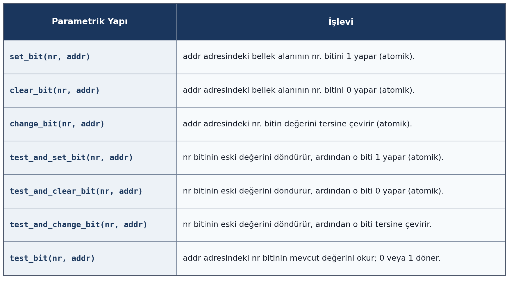

Atomik bit fonksiyonları bit maskelerinden oluşan bayraklı nesnelerdeki bit bayraklarını set ya da clear
etmek için kullanılmaktadır. Örneğin:

.. code-block:: c

    unsigned long *flags_addr = /* bellek tabanlı aygıt adresi */;

    /* Flag bit pozisyonları */
    #define FLAG_DEVICE_READY       0
    #define FLAG_DMA_ENABLED        1
    #define FLAG_INTERRUPT_ENABLED  2
    #define FLAG_LOW_POWER_MODE     3
    #define FLAG_ERROR_STATE        4

    /* Flag'leri ayarla */
    void device_init(void)
    {
        set_bit(FLAG_DEVICE_READY, flags_addr);     /* Aygıtı hazır olarak işaretle */
        set_bit(FLAG_DMA_ENABLED, flags_addr);      /* DMA'yı etkinleştir */
    }

    /* Flag kontrolü */
    int is_device_ready(void)
    {
        return test_bit(FLAG_DEVICE_READY, flags_addr);
    }

    /* Flag temizle */
    void disable_dma(void)
    {
        clear_bit(FLAG_DMA_ENABLED, flags_addr);
    }

    /* Flag tersine çevir */
    void toggle_interrupt(void)
    {
        change_bit(FLAG_INTERRUPT_ENABLED, flags_addr);
    }

Burada bir aygıtı programlayan bazı fonksiyonlar bulunmaktadır. Aygıtın çeşitli bitleri çeşitli
durumları temsil etmektedir. Tabii bu aygıta *bellek tabanlı (memory mapped)* biçimde erişilmektedir.
Yukarıdaki fonksiyonlar da bu aygıtın çeşitli bitleriyle atomik işlemler yapmaktadır.

``test_and_xxxx`` fonksiyonları genellikle bitleri kilit olarak ele alındığı spinlock işlemlerinde
kullanılmaktadır. Örneğin:

.. code-block:: c

    #define LOCK_BIT    0

    static unsigned long lock_word = 0;

    void my_lock(void)
    {
        /* Bit 0 set olana kadar dene */
        preempt_disable();

        while (test_and_set_bit(LOCK_BIT, &lock_word)) {   /* spin işlemi */
            cpu_relax();
        }

        preempt_enable();

        /* Kilit alındı */
    }

    void my_unlock(void)
    {
        /* Bit 0'ı temizle */
        clear_bit(LOCK_BIT, &lock_word);
    }

Burada ``my_lock`` fonksiyonu belli bir bit üzerinde o bit 1 olduğu sürece spin yaparak beklemektedir.

ARM Mimarilerinde Atomik İşlemler 
---------------------------------

Intel x86 mimarisi temel olarak CISC tarzı bir mimaridir. CISC mimarilerinde doğrudan bellek üzerinde ve
yazmaçla bellek üzerinde işlemler yapan makine komutları bulunabilmektedir. Böylece zaten bazı işlemler
tek bir makine komutuyla yapılabilmektedir. Daha önceden de belirttiğimiz gibi Intel x86 mimarisinde bu
biçimdeki makine komutları çok işlemcili ya da çekirdekli ortamlarda atomik değildir. Biz bu atomikliği
sağlamak için komutların başına ``LOCK`` önekinin getirildiğini belirtmiştik. Böylece örneğin Intel x86
mimarisinde bellekteki bir nesnenin çok işlemcili ya da çok çekirdekli sistemlerde atomik bir
artırılması aşağıdaki gibi sağlanabiliyordu:

.. code-block:: nasm

    LOCK ADD [mem_addr], 1

Ancak ARM gibi RISC tarzı işlemcilerde doğrudan bellek üzerinde bu biçimde işlemler yapabilen makine
komutları yoktur. ARM işlemcilerinde ``ADD [mem_addr], 1`` işlemi tipik olarak şöyle yapılmaktadır:

.. code-block:: none

    LDR  R0, =mem_addr
    LDR  R1, [R0]
    ADD  R2, R1, #1
    STR  R2, [R0]

ARM işlemcilerinde genellikle bellek erişimleri doğrudan değil yazmaç indekslemesiyle yapılmaktadır. ARM
gibi RISC işlemcilerinde ``LOAD`` ve ``STORE`` gibi isimlere sahip bellekten yazmaçlara, yazmaçlardan
belleğe aktarım yapan makine komutları vardır. Ancak tüm aritmetik ve bitsel işlemler yazmaçlar üzerinde
yapılmaktadır. RISC işlemcilerinde genel olarak ``LOAD`` ve ``STORE`` dışındaki komutların üç
operand'lı olduğunu kursumuzun giriş kısımlarında belirtmiştik. İşte ARM işlemcilerinde bu tür işlemler
tek makine komutuyla yapılamadığı için ne tek çekirdekli sistemlerde ne de çok çekirdekli sistemlerde
atomiklik yukarıdaki biçimle sağlanamamaktadır. Ancak ARM işlemcileri 8.1 versiyonuyla birlikte
Intel'deki gibi bellek üzerinde atomik işlemler yapabilen makine komutlarına sahip olmuştur. Fakat bu
makine komutları ancak 64 bit yeni ARM işlemcilerinde kullanılabilmektedir. ARM V8.1 öncesinde atomik
işlemler ``LDREX`` ve ``STREX`` makine komutlarıyla bir döngü oluşturularak sağlanıyordu.

ARM'daki LDREX, STREX ve Exclusive Monitor Mekanizması
~~~~~~~~~~~~~~~~~~~~~~~~~~~~~~~~~~~~~~~~~~~~~~~~~~~~~~

ARM işlemcilerinde ``LDREX`` özel komutu bellekten yazmaca yükleme yaparken aynı zamanda işlemci
içerisinde *exclusive monitor* denilen bir bayrağı da set etmektedir. Örneğin:

.. code-block:: none

    LDR    R0, =mem_addr
    LDREX  R1, [R0]

Burada işlemci içerisindeki *exclusive monitor* set edilmiş, aynı zamanda hangi bellek adresinin (daha
doğrusu hangi bellek bloğunun) izlendiği de kaydedilmiştir. Bu durumun reset edilmesi temel olarak iki
makine komutuyla sağlanır:

.. code-block:: none

    STREX
    CLREX

``CLREX`` hiçbir bellek erişimi yapmadan doğrudan bayrağı reset eder. ``STREX`` ise, başarılı olsun ya
da olmasın, çalıştıktan sonra bayrağı her zaman reset eder; bu nedenle başarısız bir ``STREX``'ten sonra
yapılacak yeni deneme ``STREX``'ten değil, ``LDREX``'ten itibaren baştan başlatılmalıdır. (Exception
alınması gibi durumlarda da bayrağın reset edilmesi beklenir, ama bu mimari olarak kesin garanti
edilmediğinden işletim sistemleri böyle durumlarda genellikle açıkça ``CLREX`` çalıştırır.)

Ancak burada dikkat edilmesi gereken önemli bir nokta var: ``LDREX`` bayrağı *toggle* etmez, yani bayrak
zaten set durumdaysa onu reset edip sonra tekrar set etmek gibi bir davranışı yoktur; ``LDREX`` her
çalıştığında bayrağı (yeniden) set eder ve hangi adresi izlediğini de günceller. Bu da şu soruyu akla
getirir: biz bir çekirdekte ``LDREX`` ile bayrağı set ettiğimizde, başka bir çekirdek kendi
``LDREX``'ini çalıştırdığında bizim bayrağımız bundan etkilenir mi? Cevap hayırdır. ``LDREX`` sadece bir
okuma (``LOAD``) işlemidir; başka bir çekirdeğin ``LDREX`` çalıştırması bizim bayrağımızı reset etmez.
Bayrağı reset eden şey okuma değil, yazmadır (``STORE``): eğer başka bir çekirdek (veya DMA gibi bellek
erişimi yapan başka bir birim) bizim izlediğimiz bellek bloğuna bir yazma yaparsa, ancak o zaman
exclusive monitor durumumuz reset edilir. Dolayısıyla exclusive monitor, *adresten bağımsız, sadece
işlemci başına bir bayrak* olarak düşünülmemelidir; her çekirdeğin bayrağı hangi adresi/bloğu izlediği
bilgisini de taşır ve invalidation bu bilgiye bağlı olarak gerçekleşir. (Aynı çekirdek üzerinde, ``STREX``
yapmadan art arda farklı adreslere ``LDREX`` çağrılırsa, bayrak tek bir kayıt tuttuğu için önceki adrese
ait izleme bilgisinin üzerine yazılır; bu bir bakıma *reset* gibi görünür ama nedeni adresin önemsiz
olması değil, bayrağın çekirdek başına yalnızca bir kayıt tutabilmesidir.)

``STREX`` komutu bayrak set durumdaysa ve yazılacak adres ``LDREX``'te izlenen adresle eşleşiyorsa
``STORE`` işlemini yapmakta ve işlemin başarısını da bize vermektedir. ``STREX`` makine komutu şöyle
kullanılmaktadır:

.. code-block:: none

    LDR    R0, =mem_addr
    LDREX  R1, [R0]
    ADD    R2, R1, #1
    STREX  R3, R2, [R0]

``STREX`` makine komutundaki birinci operand (örneğimizdeki ``R3``) işlemin başarısını belirtmektedir.
Eğer bu birinci operand 0 olarak yüklenirse işlem başarılıdır ve yazma yapılmıştır. Eğer bu birinci
operand 1 ile yüklenirse işlem başarısızdır, yani yazma yapılamamıştır. Başka bir deyişle komutun
birinci operandı (örneğimizdeki ``R3`` yazmacı) komutun yazma yapıp yapmadığını belirtmektedir. İşte
eğer yazma yapılamamışsa bir döngü içerisinde bu işlem başarılana kadar deneme yapılmalıdır. Bu döngüyü
şöyle oluşturabiliriz:

.. code-block:: none

    LDR     R0, =mem_addr
    REPEAT:
    LDREX   R1, [R0]
    ADD     R2, R1, #1
    STREX   R3, R2, [R0]
    CMP     R3, #0
    BNE     REPEAT

``STREX`` komutunun, başarılı olsun ya da olmasın, monitör bayrağını her zaman reset ettiğine dikkat
ediniz. Yani hem yazma başarılı olduğunda hem de başarısız olduğunda bayrak reset edilmiş olur; bu
yüzden başarısız durumda döngü ``STREX``'ten değil, ``LDREX``'ten itibaren tekrar başlatılır.

ARM V8.1 ile Gelen Atomik Makine Komutları
~~~~~~~~~~~~~~~~~~~~~~~~~~~~~~~~~~~~~~~~~~

Peki yukarıdaki döngü etkin bir çalışma sağlamakta mıdır? Düşük ve orta çekirdek sayılarında bu biçimde
yürütme dikkate değer bir performans sorunu yaşatmıyordu. Ancak çekirdek sayısı arttıkça, sürekli
tekrarlanan ``LDREX``/``STREX`` denemelerinin getirdiği ek coherency trafiği nedeniyle performansın
etkilendiği görülmüştür. Bu nedenle ARM işlemcileri 8.1 versiyonuyla birlikte read-modify-write
işlemini kendi içerisinde yapan Intel mimarisine benzer atomik makine komutlarını da komut kümesine
eklemiştir. Bunların listesi şöyledir:

.. code-block:: none

    /* Atomic ADD */
    LDADD   Xs, Xt, [Xn|SP]      // *Xn += Xs, return old value to Xt
    LDADDA  Xs, Xt, [Xn|SP]      // + Acquire
    LDADDL  Xs, Xt, [Xn|SP]      // + Release
    LDADDAL Xs, Xt, [Xn|SP]      // + Acquire + Release

    /* Atomic SET (OR) */
    LDSET   Xs, Xt, [Xn|SP]      // *Xn |= Xs

    /* Atomic CLR (AND NOT) */
    LDCLR   Xs, Xt, [Xn|SP]      // *Xn &= ~Xs

    /* Atomic XOR */
    LDEOR   Xs, Xt, [Xn|SP]      // *Xn ^= Xs

    /* Atomic SWAP */
    SWP     Xs, Xt, [Xn|SP]      // swap *Xn and Xs
    SWPA    Xs, Xt, [Xn|SP]      // + Acquire
    SWPL    Xs, Xt, [Xn|SP]      // + Release
    SWPAL   Xs, Xt, [Xn|SP]      // + Acquire + Release

    /* Compare-and-Swap */
    CAS     Xs, Xt, [Xn|SP]      // if (*Xn == Xs) *Xn = Xt
    CASA    Xs, Xt, [Xn|SP]      // + Acquire
    CASL    Xs, Xt, [Xn|SP]      // + Release
    CASAL   Xs, Xt, [Xn|SP]      // + Acquire + Release

    /* Byte/Halfword/Word variants */
    LDADDB, LDADDH, LDADDW
    CASB, CASH, CAS

Bu komutlar için Intel'de olduğu gibi ``LOCK`` benzeri bir önek kullanılmamaktadır. Bu komutların hepsi
çok çekirdekli sistemlerde atomiktir.

Komutların Yer Değiştirmesi
===========================

İşlemciler biri diğerini etkilemeyen makine komutlarının sırasını değiştirerek çalıştırabilmektedir. 
Örneğin:

.. code-block:: none

    LOAD reg1, [mem1]
    LOAD reg2, [mem2]

Burada belleğin iki farklı bölgesindeki değerler işlemcinin farklı iki yazmacına çekilmiştir. Bu makine
komutlarının hangisinin önce yapıldığı sonuç üzerinde etkili olmayacaktır. İşte modern işlemciler kodun
çalışmasını hızlandırmak için bu komutları derleyicinin yazdığı sırada değil farklı sıralarda
yapabilmektedir. Bu duruma İngilizce *out of order execution* denilmektedir. Örneğin yukarıdaki makine
komutları işlemci tarafından aşağıdaki sırada da yapılabilecektir:

.. code-block:: none

    LOAD reg2, [mem2]
    LOAD reg1, [mem1]

Tabii işlemciler birbirleriyle ilişkili olan makine komutlarının sırasını değiştirmezler. Örneğin:

.. code-block:: none

    LOAD reg1, [mem]
    LOAD reg2, reg1

Ya da örneğin:

.. code-block:: none

    LOAD [mem], reg1
    LOAD reg2, [mem]

Bu makine komutlarının yer değiştirmesi programın yanlış çalışmasına yol açacağından işlemci bunları yer
değiştirmez. Ancak maalesef birden fazla CPU ya da çekirdek söz konusu olduğunda diğer çekirdekler
birbirine bağlı bazı işlemleri bile farklı sıralarda görebilmektedir. Komutların yer değiştirmesinin
gözlemlenebilir etkisi çok işlemcili ya da çok çekirdekli sistemlerde ortaya çıkmaktadır. Bu konunun
ayrıntılarını *bellek bariyerleri (memory barriers)* konusu içerisinde ele alacağız.

Burada "mademki çalışan kodu etkilemiyor o zaman sorun nerede?"*" diye düşünebilirsiniz. Ancak işte birden
fazla işlemci ya da çekirdeğin bulunduğu sistemlerde bu komut yer değiştirmesi (daha doğru bir ifadeyle
görünürlüğün yer değiştirmesi) bazı sorunlara yol açabilmektedir.

İşlemcilerin komutları farklı sıralarda yapıyormuş gibi görünmesinin nedenlerinden biri *boru hattı
(pipeline) mekanizmasıdır*. İşlemci komutları boru hattı kuyruğuna göndermekte, bu kuyrukta işlemler
daha küçük evrelere (phases) ayrılmakta ve bu evreler mümkün olduğu kadar eşzamanlı biçimde
yapılmaktadır. Ancak salt bu evrelere ayırma işlemi tek başına komutların bitirme sırasını değiştirmez;
basit, tek yola sahip bir boru hattında komutlar girdikleri sırayla çıkar. Bitirme sırasının değişmesi,
genellikle boru hattına eklenen ek mekanizmalardan kaynaklanır: örneğin çarpma veya bölme gibi işlemler
için ayrı ve daha gecikmeli yürütme birimleri bulunması ya da işlemcinin operandı hazır olan komutu,
önündeki bekleyen bir komutu atlayarak çalıştırdığı gerçek *sıra-dışı yürütme (out-of-order execution)*
mekanizmasıdır. Bu durumda önce kuyruğa gönderilen bir makine komutu, sonra gönderilen başka bir
komuttan daha sonra işlemini bitirebilir. İşlemcilerin boru hattı mekanizması oldukça ilginç ve detaylı
bir mekanizmadır. Biz burada bu mekanizmanın ayrıntıları üzerinde durmayacağız. Ancak bütün bunların bir
sonucu olarak, aynı çekirdek içinde birbirleriyle ilişkili olmayan makine komutları sanki farklı
sıralarda yapılıyormuş gibi bir etki oluşabilmektedir.

Çok işlemcili ya da çok çekirdekli sistemlerde ise, birbirleriyle ilişkili (bağımlı) komutların bile
diğer çekirdekler tarafından farklı sırada görünmesi söz konusu olabilir. Bunun nedeni boru hattı
mekanizması değildir; tamamen ayrı ve daha önemli bir konudur. Her çekirdek, belleğe yazma işlemini
hemen tamamlamak yerine önce kendi *yazma tamponuna (store buffer)* yazar, tampon arka planda cache'e
ve oradan da *önbellek tutarlılık (cache coherency)* protokolü üzerinden diğer çekirdeklere yansıtır. Eğer
işlemci mimarisi *zayıf bellek tutarlılık modeli (weak memory consistency model)* kullanıyorsa, bu
tamponun yansıtılma sırası program sırasıyla aynı olmak zorunda değildir; dolayısıyla bir çekirdeğin
ardışık iki yazması, başka bir çekirdeğe ters sırada görünebilir. 

İşlemciler komutları evrelere bölüp çalıştırırken genel olarak her cycle'da bir evreyi çalıştırmaktadır.
Böylece her cycle'da boru hattında sonraki komutların evreleri de yapılmaktadır. Bu durum özellikle
basit, tek yola sahip RISC işlemcilerinde, hazard oluşmadığı sürece her cycle'da bir makine komutunun
tamamlanmasını sağlayabilmektedir.

Ayrıca işlemciler daha karmaşık komutları kendi içerisinde de parçalara ayırabilmektedir. Bunlara da
işlemci terminolojisinde genel olarak *mikrokod (microcode)* denilmektedir. Mikrokodları *işlemcinin
kendi içindeki yazılımı* gibi de düşünebilirsiniz. Örneğin aşağıdaki gibi bir makine komutu söz konusu
olsun:

.. code-block:: none

    ADD R1, R2

Bu komut işlemci tarafından alt işlemlere ayrılmaktadır. Örneğin:

1. R1'i oku
2. R2'yi oku
3. ALU'da topla
4. Sonucu R1'e yaz

Mikrokodlar daha çok CISC işlemcilerine özgüdür. RISC işlemcileri komutları mikrokodlara bölerek işlem
yapmaz; tek bir lojik devreyle bütünsel bir biçimde işlemleri yapar. Tabii bu sırada komutlar evrelere
ayrılarak yukarıda belirttiğimiz gibi kendi içlerinde pipeline mekanizması eşliğinde çalıştırılmaktadır.

Konuyu derinleştirmeden önce bazı önemli terimlerin ne anlam ifade ettiğini açıklayalım:

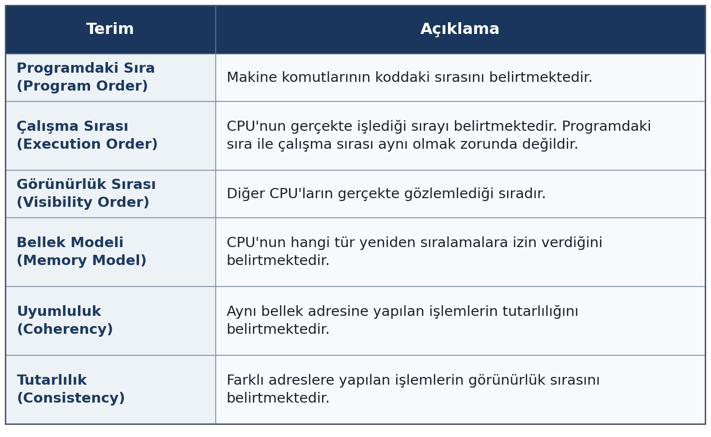

Modern işlemcilerde işlemlerin "programdaki sırası", "çalışma sırası" ve "görünürlük sırası" farklı
olabilmektedir. Örneğin:

.. code-block:: c

    data = 42;
    ready = 1;

Burada ``STORE`` işlemleri birbirinden farklı yerlere yapıldığı için işlemci bunları değişik sırada
yapabilmekte ya da farklı işlemciler ve çekirdekler bunları farklı sıralarda yapılıyormuş gibi
görebilmektedir. Yani burada diğer bir işlemci ya da çekirdek ``ready`` değerini 1 olarak gördüğünde
``data`` değerinin o anda 42 olması zorunlu değildir.

Ancak maalesef birden fazla işlemci ya da çekirdeğin bulunduğu sistemlerde birbirleri ile ilişkili
komutları bile başka çekirdekler değişik sırada yapılıyormuş gibi görebilmektedir. Örneğin ``a`` ve
``b``'nin önceki değerleri 0 olsun. Bir işlemci ya da çekirdekte aşağıdaki işlemlerin yapıldığını
varsayalım:

.. code-block:: c

    a = 1;
    b = a;

Diğer bir işlemci ya da çekirdek ``b``'de 1 gördüğü halde ``a``'da 0 görebilmektedir.

İşlemcilerin birbirinden bağımsız ``LOAD``/``STORE`` komutları için kendi içlerinde uyguladıkları dört
farklı *çalıştırma sıralaması (execution reordering)* vardır: Load/Load, Load/Store, Store/Store ve
Store/Load.

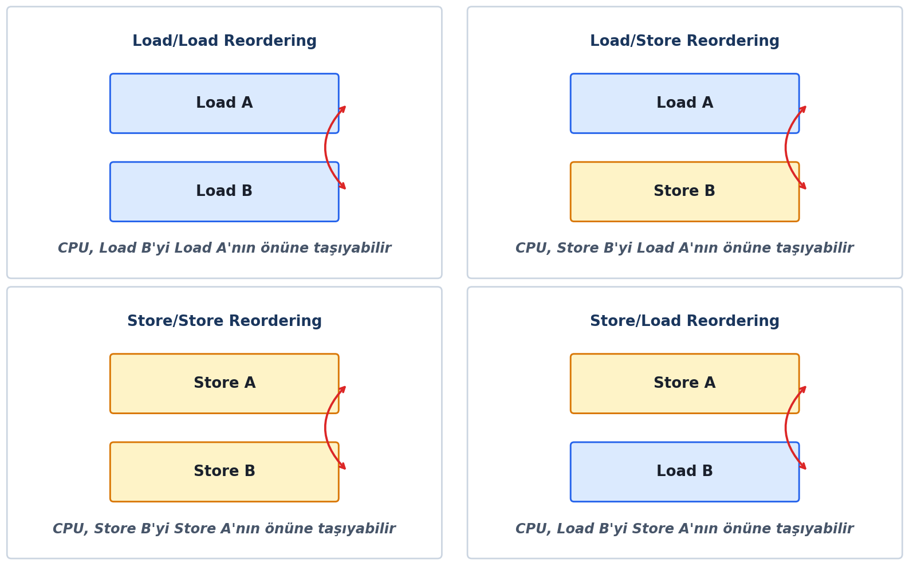

Yukarıdaki dört yer değiştirme her türlü işlemci tarafından uygulanmamaktadır. Örneğin Intel işlemcileri
yalnızca Store/Load işlemlerinin yerlerini değiştirebilmektedir. Diğer işlemlerde yer değiştirme
yapmamaktadır. Ancak genel olarak RISC işlemcileri yukarıdaki dört yer değiştirmeyi de yapabilmektedir.
Aşağıda bazı yaygın işlemcilerin hangi yer değiştirmeleri yaptığını tablo biçiminde veriyoruz:

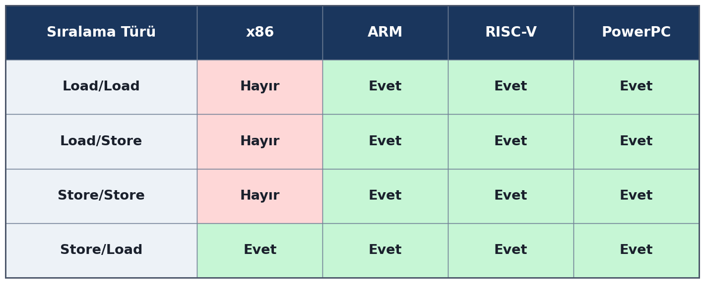

Genel olarak diğer işlemciler söz konusu olduğunda görünürlük sıralaması üç biçimde olabilmektedir:

1. **Sequential Consistency (SC):** Bu modelde komutlar her işlemci ya da çekirdekte program sırasında
   gözükür.

2. **Total Store Order (TSO):** Bu modelde yalnızca Store/Load program sırası değiştirilebilmekte ve
   diğer işlemci ya da çekirdekler yalnızca Store/Load işlemlerini farklı sıralarda yapılıyormuş gibi
   görebilmektedir. Intel x86 işlemci ailesi bu modeli kullanmaktadır.

3. **Relaxed (Weak) Memory Ordering:** Bu modelde yukarıda belirttiğimiz dört grup işlemin de program
   sırası değiştirilebilmektedir. Diğer işlemciler ve çekirdekler bunları farklı sıralarda
   görebilmektedir. ARM, RISC-V, PowerPC gibi işlemciler bu modeli kullanmaktadır.

Komutların yer değiştirmesi aslında derleyici tarafından da yapılan bir optimizasyon etkinliğidir. 
Derleyiciler de komutlar daha hızlı çalışsın diye birbirleriyle ilişkisi olmayan makine komutlarının 
yerlerini değiştirebilmektedir. Ancak senkronizasyon sorunlarını oluşturan ana unsur derleyiciden ziyade 
işlemci tarafından yapılan komut yer değiştirmesidir. Zaten bildiğiniz gibi derleyiciler optimizasyon 
aşamasında programcının yazdığı deyimleri de eğer mümkünse elimine edebilmektedir. Örneğin:

.. code-block:: c

    a = 10;
    a = 20;

Burada derleyici ``a = 10`` deyimini tamamen elimine edebilir. Çünkü bu deyim kaldırıldığında programın
gözlemlenebilir davranışında bir değişiklik oluşmayacaktır. Ancak işlemciler böyle bir eliminasyonu
yapmazlar. İşlemciler yalnızca komut çalıştırması sırasında basit birtakım iyileştirmeler yapabilmektedir.

Bellek Bariyerleri
==================

*Bellek bariyerleri (memory barriers)* bir işlem yapılmadan önce diğer işlemlerin yapılmış
olduğunu garanti etmek amacıyla oluşturulan mekanizmalardır. Bellek bariyerleri uygun yerlerde
kullanılmazsa çok işlemcili ya da çok çekirdekli sistemlerde çalışan kodlarda böcekler oluşabilmektedir.
Aşağıdaki koda dikkat ediniz:

.. code-block:: c

    /* Thread 1 */

    data = 42;
    ready = 1;

    /* Thread 2 */

    while (ready == 0)
        ;
    use(data);

Burada kodu yazan sistem programcısı *ready = 1 ise kesinlikle data = 42 olacağını* varsaymıştır.
Çünkü ``data`` ataması ``ready`` atamasından önce yapılmıştır. Dolayısıyla Thread 2'de ``ready == 1``
olduğunda ``data == 42`` olacağı sanılmaktadır. Ancak burada bir ihmal söz konusudur. Derleyici ya da
işlemci ``data`` ve ``ready`` değişkenleri birbirlerinden bağımsız olduğu için bu atamaları yer
değiştirebilmekte ya da başka bir işlemci ya da çekirdek bunları farklı sıralarda yapılıyormuş gibi
görebilmektedir. Bu atamalar yer değiştirildiğinde aşağıdaki durum oluşacaktır:

.. code-block:: c

    /* Thread 1 */

    ready = 1;
    /* ---> Dikkat! diğer işlemcideki kod bu arada çalışabilir */
    data = 42;

    /* Thread 2 */

    while (ready == 0)
        ;
    use(data);

Artık sorun kolaylıkla anlaşılabilir. Diğer işlemci ya da çekirdek ``ready = 1`` durumu oluştuğunda
``use`` işlemine girebilir. Bu durumda ``data`` değişkeni eski değeriyle kullanılacaktır. İşte sistem
programcısının *görünürlük sırasının (visibility order)* değişebileceğini göz önünde bulundurarak bu
tür durumlara önlem alması gerekir. Bu tür önlemler *bellek bariyerleri (memory barriers)* denilen
mekanizmalarla alınmaktadır.

Burada bir noktaya dikkatinizi çekmek istiyoruz. Derleyici de işlemci kendi akışlarında bağımsız
olmayan komutları yer değiştirmemektedir. Örneğin:

.. code-block:: c

    data = 42;
    use(data);

Buradaki işlemi yürüten işlemci ya da çekirdekte bu sıra korunmaktadır. Buradaki sorun başka işlemci
ya da çekirdeklerin bu işlemleri sanki farklı sıralarda yapılıyormuş gibi görmesidir. Buna da
*görünürlük sırası (visibility order)* denildiğini anımsayınız.

Biz yukarıdaki örnekte yalnızca peş peşe iki işlemin çalışma sırası ve görünürlük sırası üzerinde
örnek verdik. Aslında bu durum yalnızca peş peşe gelen iki makine komutu için söz konusu değildir.
Peş peşe gelen ikiden fazla makine komutunda da çalışma sırası ve görünürlük sırası değişebilmektedir.

Yukarıda da belirttiğimiz gibi komut yer değiştirmesi derleyici tarafından da işlemci tarafından da
yapılabilmektedir. Ancak komut yer değiştirmesi denildiğinde akla ilk olarak işlemcilerin yaptığı yer
değiştirmeler gelmektedir.

Derleyici Bariyerleri 
---------------------

Derleyici bariyerlerinin işlevi oldukça basittir. Biz bir yere derleyici bariyeri yerleştirirsek ondan önceki tüm
Load ve Store işlemleri ondan sonraki tüm Load ve Store işlemlerinden önce yapılır. Yani biz bir yere
derleyici bariyeri yerleştirdiğimizde derleyiciye şunu demiş oluruz: "Önce yukarıdaki işlemler için
makine kodları üret, sonra aşağıdaki işlemler için makine kodları üret, bariyerin yukarısıyla aşağısı
arasında komut yer değiştirmesi yapma." Linux çekirdeklerinde derleyici bariyerleri için ``barrier``
isimli makro kullanılmaktadır:

.. code-block:: c

    #define barrier()   __asm__ __volatile__("": : :"memory")

Örneğin:

.. code-block:: c

    a = 10;
    b = 20;
    barrier();
    c = 30;
    d = 40;

Burada derleyici asla bariyerin yukarısıyla aşağısındaki kodları yer değiştirmemektedir. Ancak tabii bu
örnekte ``a = 10`` ile ``b = 20`` kendi aralarında, ``c = 30`` ile de ``d = 40`` işlemleri kendi
aralarında yer değiştirebilir. Derleyici bariyerlerinin bir makine kodu üretmediğine, yalnızca derleyici
için bir direktif oluşturduğuna dikkat ediniz. Linux çekirdeğinin gcc ile derlenebildiğini anımsayınız.
(Son yıllarda clang derleyicileri ile derleme de artık başarılı biçimde yapılabilmektedir.)

volatile Erişimler
------------------

Derleyiciler kod optimizasyonunu tek thread'li çalışmayı esas alarak yapmaktadır. Kodun daha etkin 
çalışabilmesini sağlamak amacıyla derleyiciler nesneleri yazmaçlarda saklayıp bellek erişimi yapmadan onları yazmaçlardan alarak 
kullanabilmektedir. Ancak bu optimzasyon tek akışlı programlarda bir soruna yol açmazken çok akışlı programlarda 
sorunlara yol açabilmektedir. İşte ``volatile`` niteleyici derleyiciye adeta "bu nesneyi kullandığımda o nesne yazmaçta olsa bile 
sen her zaman belleğe başvurarak ona eriş" demektedir. Örneğin:

.. code-block:: c

    int g_flag;
    /* ... */

    while (g_flag == 1) {
        /* ... */
    }

Burada başka bir thread ``g_flag`` değişkenini 0'a çektiğinde bu thread bunu anlamayabilir. Çünkü
derleyici ``while`` parantezindeki ``g_flag`` değişkeni için döngünün her yinelenmesinde
belleğe başvurmak zorunda değildir. Derleyici ``g_flag`` değişkenini bir yazamaca çekip yazmaçtaki değeri de 
kullanabilir. İşte derleyicinin döngünün her yinelenmesinde bellekteki ``g_flag`` değişkenine başvurmasını sağlamak 
için bu değişkenin ``volatile`` olarak tanımlanması gerekir:

.. code-block:: c

    volatile int g_flag;
    /* ... */

    while (g_flag == 1) {
        /* ... */
    }

C standartlarına göre aynı nesneye yapılan ``volatile`` erişimler kodda yazıldığı sırada yapılmak
zorundadır. Örneğin ``val`` int türünden bir nesne olsun:

.. code-block:: c

    x = *(volatile int *)&val;
    y = *(volatile int *)&val;

Burada C standartlarına göre erişim programdaki sırada yapılmak zorundadır. C standartları farklı
nesnelere yapılan ``volatile`` erişimlerin sırasının korunması konusunda bir garanti vermemektedir. Ancak
gcc ve clang derleyicilerinde farklı nesnelere yapılan ``volatile`` erişimler de sıra korunmaktadır.
Örneğin ``val1`` ve ``val2`` int türünden birer nesne olsun:

.. code-block:: c

    x = *(volatile int *)&val1;
    y = *(volatile int *)&val2;

Burada her ne kadar ``val1`` ve ``val2`` farklı nesneler olsa da gcc ve clang derleyicileri bu sırayı
korumaktadır. Fakat gcc ve clang derleyicilerindeki bu ``volatile`` semantiği derleyici bariyeri görevini
tam olarak yerine getirememektedir. gcc ve clang derleyicilerinde ``volatile`` erişimlerin sıraları
yalnızca kendi aralarında korunmaktadır. Bu derleyicilerde ``volatile`` olmayan erişimlerle ``volatile``
erişimlerin arasındaki sıranın korunması gibi bir garanti verilmemektedir. Örneğin ``val1``, ``val2`` ve
``val3`` int türünden birer nesne olsun:

.. code-block:: c

    x = *(volatile int *)&val1;
    y = val2;
    z = *(volatile int *)&val3;

Burada ``val1`` erişimi ile ``val2`` erişiminin, ``val2`` erişimi ile ``val3`` erişiminin yerleri
derleyici tarafından değiştirilebilir.

READ_ONCE ve WRITE_ONCE Makroları
~~~~~~~~~~~~~~~~~~~~~~~~~~~~~~~~~

Biz ``READ_ONCE`` ve ``WRITE_ONCE`` makrolarıyla daha önce karşılaşmıştık. Linux çekirdeğindeki bu makrolar 
ilgili erişimin ``volatile`` semantiği ile yapılmasını sağlamaktadır. ``READ_ONCE`` ve ``WRITE_ONCE``
makroları üç işleve sahiptir:

1. Bu makrolar erişimi ``volatile`` olarak yaparlar. Dolayısıyla derleyici ilgili nesne için her zaman
   bellek başvurusu yapar.

2. Bu makrolar ``volatile`` erişim yaptığından derleyiciler bunların birbirlerine göre sırasını
   korurlar. Ancak bu tam bir derleyici bariyeri anlamına gelmemektedir.

3. Eğer erişim tek bir makine komutuyla yapılabiliyorsa (yırtılma (tearing) olmuyorsa) bu makrolar okuma
   ve yazma işlemlerinin atomik biçimde yapılmasını sağlarlar.

Güncel çekirdeklerde ``READ_ONCE`` ve ``WRITE_ONCE`` makroları ``include/asm-generic/rwonce.h`` dosyası
içerisinde şöyle tanımlanmıştır:

.. code-block:: c

    #ifndef __READ_ONCE
    #define __READ_ONCE(x)  (*(const volatile __unqual_scalar_typeof(x) *)&(x))
    #endif

    #define READ_ONCE(x)                        \
    ({                                          \
        compiletime_assert_rwonce_type(x);      \
        __READ_ONCE(x);                         \
    })

    #define __WRITE_ONCE(x, val)                \
    do {                                        \
        *(volatile typeof(x) *)&(x) = (val);    \
    } while (0)

Burada görüldüğü gibi tek yapılan şey ``volatile`` erişimdir.

Daha önceden de belirttiğimiz gibi Linux çekirdeği ancak gcc ile derlenebilmektedir. 
Linux çekirdeğinde gcc derleyicisine özgü onlarca özellik kullanılmaktadır. Dolayısıyla
çekirdek kodları herhangi bir derleyiciyle derlenememektedir. Bilindiği gibi clang derleyicileri büyük
ölçüde gcc uyumludur; gcc'nin eklentilerini desteklemektedir. Eskiden Linux çekirdeği clang
derleyicileri ile derlenemiyordu. Ancak son yıllarda artık derlenebilir hale gelmiştir. Linux çekirdeğini
derlerken make işleminde derleyiciyi clang olarak şöyle seçebilirsiniz:

.. code-block:: console

    $ make CC=clang

Ancak Linux çekirdeğinde değişkenler genellikle ``volatile`` yapılmamaktadır. Çünkü bu durum performans
kaybına yol açmaktadır. Linux çekirdeğinde ``READ_ONCE`` ve ``WRITE_ONCE`` makrolarıyla "gerektiğinde
volatile erişim" yapılmaktadır. Örneğin:

.. code-block:: c

    int g_flag;
    /* ... */

    while (READ_ONCE(g_flag) == 1) {
        /* ... */
    }

Çekirdek kodlarında paylaşılan bellek alanlarına erişimlerde her zaman ``READ_ONCE`` ve ``WRITE_ONCE``
makrolarını kullanmalısınız.

İşlemci Düzeyinde İşlev Gören Bariyer Makroları
-----------------------------------------------

İşlemciler için bellek bariyerleri işlemciye özgü makine komutlarıyla oluşturulmaktadır. Linux çekirdeği
bazı fonksiyon ve makrolarla donanım bariyerlerinin işlemciden bağımsız biçimde kullanılmasını
sağlamaktadır. İşlemci bariyeri oluşturan üç temel çekirdek makrosu vardır:

.. code-block:: c

    rmb()
    wmb()
    mb()

Bu makrolar parametre almamaktadır ve aşağıdaki bariyerleri uygulamaktadır:

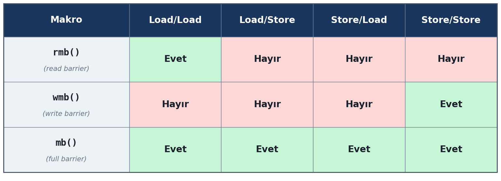

``rmb`` makrosu *okuma amaçlı bellek bariyeri* oluşturmak için kullanılmaktadır. Bu makro Load/Load
bariyeri oluşturmaktadır. Yani ``rmb()`` çağrısının yapıldığı yerin yukarısındaki bellek okumalarıyla bu
çağrının yapıldığı yerin aşağısındaki bellek okumaları yer değiştiremez. Örneğin:

.. code-block:: none

    bellek okuması - 1
    bellek yazması - 2
    bellek okuması - 3
    rmb();
    bellek okuması - 4
    bellek yazması - 5
    bellek okuması - 6

Burada ``rmb()`` çağrısı 1 ve 3'ün 4 ve 6 ile yer değiştirmesini engellemektedir. Yani aşağıdaki
okumalar yapılmadan önce kesinlikle yukarıdaki okumalar yapılmış olmak zorundadır. Ancak örneğimizde bu
``rmb()`` çağrısı 1, 2 ve 3'ün kendi aralarındaki, 4, 5 ve 6'nın da kendi aralarındaki yer
değiştirmeleri üzerinde etkili olmamaktadır. Bariyer üsttekilerle alttakiler arasında bir sınır
çizmektedir. Burada ``rmb`` bariyeri 2 ile 5 arasındaki yer değiştirme üzerinde etkili olmaz. Çünkü bu
bariyer yalnızca okuma için (Load/Load) kullanılmaktadır.

``wmb`` makrosu *yazma amaçlı bellek bariyeri* oluşturmak için kullanılmaktadır. Bu makro Store/Store
bariyeri oluşturmaktadır. Yani ``wmb`` çağrısının yapıldığı yerin yukarısındaki bellek yazmalarıyla bu
çağrının yapıldığı yerin aşağısındaki bellek yazmaları yer değiştiremez. Örneğin:

.. code-block:: none

    bellek yazması - 1
    bellek okuması - 2
    bellek yazması - 3
    wmb();
    bellek yazması - 4
    bellek okuması - 5
    bellek yazması - 6

Burada kesinlikle 1 ve 3 numaralı bellek yazmaları 4 ve 6 numaralı bellek yazmalarından daha önce
yapılacaktır. Ancak 1, 2, 3 ve 4, 5, 6 bellek işlemlerini işlemci kendi aralarında, koşullar uygunsa,
yer değiştirebilir. ``wmb`` makrosu yalnızca yazma bariyeri oluşturduğu için yukarıdaki örneğimizde 2
ile 5 yer değiştirebilir. Örneğin bellek tabanlı IO kullanılarak bir aygıtın kontrol yazmacına yazma
yapılarak önce bir ayar yapılıyor olsun, sonra da bu ayar doğrultusunda başka bir yazmacına yazma
yapılıyor olsun:

.. code-block:: none

    <kontrol_yazmacına_yazarak_durumu_ayarla>
    <bilgiyi_hedefe_yaz>

Bu iki bellek bölgesi birbirinden bağımsız olduğu için işlemci bu iki işlemi ters sırada yapabilir.
Halbuki bunların yukarıda belirtilen sırada yapılması gerekmektedir. Çünkü kontrol yazmacını set etmeden
diğer yazma işlemi anlamsızdır. İşte bu iki yazma arasına ``wmb`` eklenerek yazma sıralarının yer
değiştirmemesi sağlanmalıdır:

.. code-block:: none

    <kontrol_yazmacına_yazarak_durumu_ayarla>
    wmb()
    <bilgiyi_hedefe_yaz>

``mb`` makrosu Load/Load, Load/Store, Store/Load ve Store/Store bariyerlerinin hepsini oluşturmaktadır.
Yani bu makronun yukarısındaki bellek okumaları ve yazmaları aşağısındaki bellek okumaları ve yazmalarıyla
yer değiştiremez. Örneğin:

.. code-block:: none

    bellek yazması - 1
    bellek okuması - 2
    bellek yazması - 3
    mb();
    bellek yazması - 4
    bellek okuması - 5
    bellek yazması - 6

Burada ``mb`` çağrısının yukarısındaki okuma ve yazma işlemleri aşağısındaki okuma ve yazma
işlemlerinden kesinlikle daha önce yapılacaktır. Yani 1, 2, 3 işlemleri ile 4, 5, 6 işlemleri
birbirleriyle yer değiştiremez. Tabii işlemci eğer koşullar uygunsa 1, 2, 3 ve 4, 5, 6 işlemlerini
kendi aralarında yer değiştirebilir. Örneğin biz bellek tabanlı IO işlemlerinde önce ilgili aygıtın
kontrol yazmacına bir değer yazarak belli bir yazmacının aktive edilmesini sağlıyor olabiliriz. Sonra o
yazmaçtan okuma yapıyor olabiliriz:

.. code-block:: none

    <kontrol_yazmacına_yazarak_durumu_ayarla>
    <bilgiyi_hedeften_oku>

Burada Store/Load durumu oluştuğuna dikkat ediniz. İşlemci bu iki bellek adresi birbirleriyle ilgili
olmadığı için iki işlemin yerlerini değiştirebilir. Bunun engellenmesi için araya ``mb`` makrosu ile
genel bariyer yerleştirmemiz gerekir:

.. code-block:: none

    <kontrol_yazmacına_yazarak_durumu_ayarla>
    mb()
    <bilgiyi_hedeften_oku>

Burada bir noktaya dikkatinizi çekmek istiyoruz. ``rmb`` makrosu Load/Load, ``wmb`` makrosu Store/Store
bariyerini oluşturmaktadır. Load/Store ve Store/Load bariyerlerini oluşturan ayrı bir makro yoktur.
``mb`` makrosu tüm bariyerleri oluşturmaktadır. Genel olarak işlemcilerde Load/Store ve Store/Load
bariyerleri için diğer bariyerlerin de oluşturulması gerekmektedir. Linux çekirdeği de ``mb`` makrosuyla
genel bariyer oluşturmuştur.

``rmb``, ``wmb`` ve ``mb`` makroları zaten derleyici bariyerini de oluşturmaktadır. Yani bu makroları
kullanıyorsanız ayrıca derleyici bariyeri oluşturmanıza gerek yoktur. Bu makroların herhangi birini
çağırdığınızda onun yukarısıyla aşağısı arasında derleyici komut yer değiştirmesi yapmamaktadır.
(Derleyici için Load/Load, Load/Store, Store/Load ve Store/Store biçiminde ayrı yer değiştirme biçimleri
yoktur. Derleyici bariyerleri yalnızca ``barrier`` isimli fonksiyonla oluşturulmaktadır.)

Anımsanacağı gibi Intel x86 mimarisinde zaten işlemci Load/Load, Load/Store, Store/Store yer
değiştirmesini yapmıyordu. Yalnızca Store/Load yer değiştirmesini yapıyordu. Peki bu durumda biz çekirdek
kodlarında kullandığımız ``rmb()`` ve ``wmb()`` makrolarının Intel'de bir etkisi olacak mıdır? Hayır;
genel olarak bu makroları Intel'de çağırdığınızda, bazı ayrıntıları göz ardı edersek, bu makrolar
yalnızca derleyici bariyeri oluşturacaktır. Yani koda ekstra bir makine komutu eklemeyecektir.

İşlemcilerin komut yer değiştirmesinin yalnızca çok işlemcili ya da çok çekirdekli sistemlerde sorun
oluşturduğunu belirtmiştik. Tek işlemcili ya da tek çekirdekli sistemlerde komut yer değiştirmesi bir
sorun oluşturmamaktadır. (Bellek tabanlı IO işlemlerinde aygıta bilgi aynı sırada gitmektedir.) Peki bu
durumda sistemimizde tek işlemci ya da tek çekirdek varsa ``rmb``, ``wmb`` ve ``mb`` çağrıları gereksiz
bir işlem haline gelmez mi? Evet gerçekten de tek işlemcili ya da tek çekirdekli sistemlerde bu çağrılar
gereksiz hale gelmektedir. İşte Linux çekirdeğinde bu sorunu çözmek için ``smp_rmb``, ``smp_wmb`` ve
``smp_mb`` makroları da bulundurulmuştur. Bu makrolar ``CONFIG_SMP`` çekirdek konfigürasyon parametresine
göre işlevini aşağıdaki gibi değiştirmektedir:

.. code-block:: c

    /* include/asm-generic/barrier.h */

    #ifdef CONFIG_SMP
    #define smp_mb()    mb()            /* işlemci bariyeri */
    #define smp_rmb()   rmb()           /* işlemci bariyeri */
    #define smp_wmb()   wmb()           /* işlemci bariyeri */
    #else
    /* UP (Uniprocessor): CPU bariyeri gerekli değil */
    #define smp_mb()    barrier()       /* yalnızca derleyici bariyeri */
    #define smp_rmb()   barrier()       /* yalnızca derleyici bariyeri */
    #define smp_wmb()   barrier()       /* yalnızca derleyici bariyeri */
    #endif

Görüldüğü gibi bu makrolar tek işlemcili ya da tek çekirdekli sistemlerde yalnızca derleyici bariyeri
oluşturmaktadır. O halde biz çekirdek kodlarımızda ya da aygıt sürücülerimizde ``rmb``, ``wmb`` ya da
``mb`` yerine ``smp_rmb``, ``smp_wmb`` ve ``smp_mb`` makrolarını kullanabiliriz. Böylece bu makrolar
çalıştığımız sisteme göre en uygun davranışı gösterecektir. Burada bir noktayı anımsatmak istiyoruz.
Bugün kullandığımız Ubuntu, Debian gibi dağıtımlardaki çekirdekler ``CONFIG_SMP=y`` biçiminde
derlenmiştir. Yani biz bu dağıtımları tek çekirdekli işlemcilerde kullanıyor olsak bile çekirdek çok
çekirdekli işlemciler için derlenmiş durumdadır. Fakat örneğin BeagleBone Black (BBB) isimli SBC'de tek
çekirdekli ARM işlemcileri kullanılmaktadır. Orada çalışacak Linux çekirdekleri ``CONFIG_SMP=n``
biçiminde derlenebilmektedir.

İşlemci için oluşturulan yukarıda gördüğümüz bellek bariyerleri ve aşağıda göreceğimiz acquire/release
bariyerleri özellikle birden çok işlemci ya da çekirdeğin söz konusu olduğu sistemlerde kullanılması
gereken mekanizmalardır. Sistemde bir tane işlemci varsa bu işlemci için özel bazı durumlar dışında
bellek bariyerleri oluşturmaya gerek yoktur. Zaten yukarıdaki ``smp_rmb``, ``smp_wmb`` ve ``smp_mb``
makrolarının tek işlemcili sistemlerde işlemci için bir bariyer oluşturmadığını belirtmiştik. Tek
işlemcili sistemlerde işlemci yine komutların sırasını değiştirebilir. Ancak bundan çok thread'li
çalışma olumsuz etkilenmez. Çünkü tek işlemcili sistemlerde bir kesme oluşsa bile işlemci o ana kadar
boru hattı (pipeline) kuyruğuna sokulan işlemlerin komut sırasına göre görünür olmasını sağladıktan
sonra kesme durumunu ele almaktadır.

Tabii tek işlemcili sistemlerde de derleyici bariyeri gerekebilmektedir. Çünkü derleyiciler komut
sırasını değiştirdiği durumda o arada kesmeler ve dolayısıyla da bağlamsal geçişler oluşabilir. Tüm
bağlamsal geçişin (context switch) kesme yoluyla gerçekleştiğini de anımsayınız. Örneğin:

.. code-block:: c

    data = 42;
    ready = 1;

Burada derleyici bu iki deyimin yerini değiştirirse ``ready = 1`` işleminden sonra thread'ler arası
geçiş ya da bu değişkenlerle ilgili işlem yapan bir kesme oluşursa sorun ortaya çıkabilecektir.

Acquire/Release Semantiği
-------------------------

``rmb``, ``wmb`` ve ``mb`` makroları çift yönlü bariyer oluşturmaktadır. Bu bariyerler modern
işlemcilerdeki boru hattı mekanizması üzerinde olumsuz etkiler oluşturduğu için çalışmayı göreli biçimde
yavaşlatmaktadır. İşte ``mb`` ile genel bir bariyer oluşturmak yerine boru hattı mekanizmasını bozmadan
istenilen bellek erişimlerinin güvenle yapılabilmesi için *acquire/release semantics* denilen mekanizmalar
da bulundurulmuştur. Ancak acquire/release mekanizması her işlemci tarafından desteklenmemektedir. Çünkü
Intel gibi bazı işlemcilerde zaten komut yer değiştirmesi gevşek değildir. Ancak ARM gibi RISC
işlemcileri için bu mekanizmalar önemlidir. Bu mekanizmalar bazı programlama dillerinin standart
kütüphaneleri içerisinde de *bellek sıralaması (memory order)* adı altında bulundurulmaktadır.

smp_load_acquire Makrosu
~~~~~~~~~~~~~~~~~~~~~~~~

En çok kullanılan acquire/release makrosu ``smp_load_acquire`` isimli makrodur. Bu makronun parametrik
yapısı şöyledir:

.. code-block:: c

    smp_load_acquire(p)

Bu makro parametre olarak okuma yapılacak nesnenin adresini almaktadır. ``smp_load_acquire`` makrosu tek
yönlü bir biçimde işlemcinin komut sıralaması üzerinde etki oluşturmaktadır. Bu makronun aşağısındaki
bellek erişimleri (hem LOAD hem de STORE erişimleri) bu çağrıdaki erişimin yukarısına taşınamaz. Ancak
yukarısındaki bellek erişimleri aşağısına taşınabilir. Örneğin:

.. code-block:: none

    smp_load_acquire(&object);
    bellek yazması - 1
    bellek okuması - 2
    bellek yazması - 3

Burada 1, 2, 3 numaralı bellek erişimleri işlemci tarafından ``smp_load_acquire()`` çağrısının yukarına
taşınamaz. Ancak yukarısındakiler aşağısına taşınabilir. Görüldüğü gibi burada belli bir adrese dayalı 
tek yönlü bir bariyer söz konusudur. ``rmb``, ``wmb`` ve ``mb`` makrolarının hepsi çift yönlü bariyer oluşturmaktadır. 
Peki bu tek yönlü bariyerin anlamı nedir? İşte bazen önce bir bellek okuması yapılıp sonra ona göre başka yerlerden
okumalar yapılabilir. Bunlar bağımsız işlemler olduğu için ARM gibi RISC işlemcileri komutları yer
değiştirebilmektedir. Bu tür durumlarda çift yönlü bariyer uygulamak yerine tek yönlü bariyer uygulanması
modern işlemcilerdeki performansı artırabilmektedir. ``smp_load_acquire`` makrosunun bir erişim yaptığına
ve bu erişimin aşağısındaki kodların bu erişimin yukarısına taşınmasını engellediğine dikkat ediniz. Bu
makronun kullanım amacı dikkate alındığında zaten makronun yukarısındaki erişimlerin makrodaki erişimin
aşağısına alınmasında bir sorun oluşturmayacağı görülecektir.

Örneğin birden fazla thread paylaşılan bir alandan bilgi okuyup yazacak olsun:

.. code-block:: c

    struct shared_data {
        int payload;
        int flag;     /* 0 = boş, 1 = dolu */
    };

Okuyan taraf yeni bilginin gelip gelmediğini geldiğini ``flag`` elemanına bakarak tespit ediyor olsun. Bu durumda okuyan
tarafın önce ``flag`` elemanına bakarak ``payload`` elemanına başvurması gerekir. Bu işlemin aşağıdaki
biçimde yapılması çok işlemcili ya da çok çekirdekli sistemlerde soruna yol açacaktır:

.. code-block:: c

    if (READ_ONCE(sd.flag) == 1) {          /* Dikkat! Sorun oluşabilir! */
        val = READ_ONCE(sd.payload);
        WRITE_ONCE(sd.flag, 0);
        use(val);
    }
    /* ... */

Burada işlemci ya da çekirdek ``sd.payload`` okumasını ``sd.flag`` okumasının yukarısına taşıyabilecektir.
İşlemcinin ``sd.payload`` okumasını yukarıya taşımasını ve işleme sokmasını sembolik kodlarla şöyle gösterebiliriz:

.. code-block:: c

    <rob tamponu> = sd.payload;
    if (READ_ONCE(sd.flag) == 1) {
        WRITE_ONCE(sd.flag, 0);
        <yazmaç> = <rob tamponu>;
        val = <yazmaç>;
        use(val);
    }
    /* koşul sağlanmaza rob tamponundaki değer yazmaca yansıtılmayacak */

Buradaki *<rob tamponu>* işlemcinin "reorder tamponunu (reorder buffer)" belirtmektedir. İşlemci *reorden tmponundaki*
okunmuş olan değeri yazamaca aktaralabilir ya da onun etkisini ortadan kaldırabilir (geri alabilir). 

Tabii burada siz "işlemci bu okumayı yukarıya taşıyamaz, çünkü o zaman kodun anlamı değişir" diye düşünebilirsiniz. 
Çünkü işlemci eğer ``payload`` okumasını yukarı taşırsa bu artık ``if`` içerisinde olmaktan çıkacaktır. Ancak 
işlemciler bu yukarı taşıma işlemini koşul altında bile yapabilmektedir. Buna *speculative load* işlemi denilmektedir. 
*Speculative load* işleminde işlemci koşul altında bile olsa bellek erişimlerini koşulun yukarısına taşıyabilmekte 
ancak koşul sağlanmıyorsa onun etkisini geri alabilmektedir. Peki buradaki sorun nedir? İşte başka bir işlemci
ya da çekirdek aşağıda ok ile gösterilen noktada ``sd.payload`` değişkenine değer yazıp sonra ``sd.flag`` değişkenini"
set ederse yanlış bilgi okunabilecektir:

.. code-block:: c

    <rob tamponu> = sd.payload;
            <--- Dikkat! bu noktada sd.payload değeri değiştirilirse bu kod istenildiği gibi çalışmaz
    if (READ_ONCE(sd.flag) == 1) {
        WRITE_ONCE(sd.flag, 0);
        <yazmaç> = <rob tamponu>;
        val = <yazmaç>;
        use(val);
    }
    /* koşul sağlanmaza rob tamponundaki değer yazmaca yansıtılmayacak */

Biz yukarıdaki işlemi bellek bariyeri ile de yapabiliriz:

.. code-block:: c

    if (READ_ONCE(sd.flag) == 1) {  
        smp_rmb();        
        val = READ_ONCE(sd.payload);
        WRITE_ONCE(sd.flag, 0);
        use(val);
    }
    /* ... */

Burada aşağıdaki iki işlem arasında bir bariyer uygulamaya gerek olmadığına dikkat ediniz:

.. code-block:: c

    val = READ_ONCE(sd.payload);
    WRITE_ONCE(sd.flag, 0);

Bunlar zaten birbirinden bağımsız işlemlerdir. İşlemci bağımlılık nedeniyle ``WRITE_ONCE(sd.flag, 0)`` ataması 
zaten ``if`` deyiminin yukarısına taşınamaz. *Speculative store* biçiminde bir işlem de yoktur.

Daha önce de belirttiğimiz gibi yukarıdaki sorunda ``smp_rb`` bellek bariyeri işlemcinin boru hattı mekanizmasını 
bozduğundan dolayı göreli bir performans kaybına yol açmaktadır. İşte bu performans kaybı büyük ölçüde ``smp_load_acquire``
makrosu ile ortadan kaldırılabilmektedir. Bu tür tek yönlü okuma bariyerleri için ``smp_load_acquire`` tercih 
edilmelidir:

.. code-block:: c

    if (smp_load_acquire(&sd.flag) == 1) {
        val = READ_ONCE(sd.payload);
        WRITE_ONCE(sd.flag, 0);
        use(val);
    }

Intel işlemcilerinde yalnızca Store/Load işlemlerinde komut yer değiştirmesinin uygulandığını anımsayınız.
Bu nedenle Intel işlemcilerinde yukarıdaki önlem alınmasa bile bir sorun oluşmayacaktır. Ancak ARM gibi RISC
işlemcilerinde bu önlemin mutlaka alınması gerekmektedir.

smp_store_release Makrosu
~~~~~~~~~~~~~~~~~~~~~~~~~

Diğer önemli acquire/release makrosu da ``smp_store_release`` isimli makrodur. Bu makro
``smp_load_acquire`` makrosunun ters yönlüsüdür. Bu makro erişilecek nesnenin adresini ve ona
yerleştirilecek değeri parametre olarak almaktadır:

.. code-block:: c

    smp_store_release(ptr, val)

Bu makro ile yapılan erişimin yukarısındaki bellek erişimleri makronun çağrıldığı yerin aşağısına
taşınmamaktadır. Örneğin:

.. code-block:: none

    bellek yazması - 1
    bellek okuması - 2
    bellek yazması - 3
    smp_store_release(&object, val);

Burada 1, 2 ve 3 numaralı bellek erişimlerini işlemci ``smp_store_release`` çağrısının aşağısına
taşıyamaz. Genellikle üretici-tüketici problemi tarzındaki kalıplarda tüketici ``smp_load_acquire``
fonksiyonunu kullanırken üretici de ``smp_store_release`` fonksiyonunu kullanmaktadır. Yukarıdaki
``shared_data`` örneğimizde tüketici kodunu şöyle yazmıştık:

.. code-block:: c

    if (smp_load_acquire(&sd.flag) == 1) {
        val = READ_ONCE(sd.payload);
        WRITE_ONCE(sd.flag, 0);
        use(val);
    }

Üretici tarafın da önce yapının ``payload`` elemanına yerleştirme yapıp ondan sonra ``flag`` değişkenini
set etmesi gerekir. Üretici bu işlemi aşağıdaki gibi yapmaya çalışırsa sorun oluşur:

.. code-block:: c

    WRITE_ONCE(sd.payload, val);
    WRITE_ONCE(sd.flag, 1);

Buradaki sorun işlemcinin yukarıdaki iki erişimin sırasını değiştirebilmesidir. Bu durumda diğer
işlemcideki kod ``sd.flag`` değişkenini 1 gördüğünde ``sd.payload`` değişkeninin önceki değerini
okuyabilecektir. Bu durumu engellemek için bellek bariyeri kullanabiliriz:

.. code-block:: c

    WRITE_ONCE(sd.payload, val);
    smp_wmb();                              /* store → store bariyeri */
    WRITE_ONCE(sd.flag, 1);

Ancak bu işlem ``smp_wmb`` kullanmadan daha maliyetsiz bir biçimde ``smp_store_release`` makrosuyla da
yapılabilmektedir:

.. code-block:: c

    WRITE_ONCE(sd.payload, val);
    smp_store_release(&sd.flag, 1);         /* store + release bariyeri */

Yukarıdaki üretici-tüketici probleminde bir noktaya daha dikkatinizi çekmek istiyoruz. Burada üretici
yalnızca bir kez yerleştirme yapıp tüketici de yalnızca bir kez okuma yapıyorsa bir sorun oluşmaz.
Ancak bu işlemler birden fazla kez yapılırsa iç içe geçmeden dolayı sorun oluşabilir. Bu tür durumlarda
işlemler blokesiz yapılacaksa spinlock, blokeli yapılacaksa semaphore nesneleri tercih edilmelidir.
Örneğin spinlock ile koruma şöyle sağlanabilir:

.. code-block:: c

    void producer(int val)
    {
        spin_lock(&sd.lock);
        sd.payload = val;
        sd.flag = 1;
        spin_unlock(&sd.lock);
    }

    int consumer(void)
    {
        int val;

        spin_lock(&sd.lock);
        if (sd.flag == 1) {
            val = sd.payload;
            sd.flag = 0;
            spin_unlock(&sd.lock);
            return val;
        }
        spin_unlock(&sd.lock);

        return -1;
    }

``spin_lock`` / ``spin_unlock`` fonksiyonları kendi içerisinde ``barrier()`` çağrısı ile derleyici
bariyeri de oluşturduğu için artık ``READ_ONCE`` ve ``WRITE_ONCE`` ile ``volatile`` erişime de gerek
kalmamaktadır.

Atomik Acquire/Release Fonksiyonları
~~~~~~~~~~~~~~~~~~~~~~~~~~~~~~~~~~~~

``smp_load_acquire`` ve ``smp_store_release`` makroları erişimi atomik yapmak zorunda değildir.
Örneğin:

.. code-block:: c

    smp_store_release(&sd.flag, 1);

Burada ``sd.flag`` değişkenine 1 atanmıştır. Ancak ARM gibi RISC işlemcilerinde bu işlem tek bir makine
komutuyla yapılamamaktadır. Dolayısıyla yukarıdaki çağrı komut yer değiştirmesi üzerinde etkili olsa da
atomiklik sağlamamaktadır. İşte atomik işlemlerin acquire/release semantiği ile yapılabilmesi için
aşağıdaki fonksiyonlar bulundurulmuştur:

.. code-block:: c

    atomic_read_acquire(v)              /* atomic_t için acquire load */
    atomic_set_release(v, i)            /* atomic_t için release store */

    atomic64_read_acquire(v)            /* 64-bit için */
    atomic64_set_release(v, i)

    atomic_long_read_acquire(v)         /* long için */
    atomic_long_set_release(v, i)

Bu fonksiyonlar gördüğünüz gibi ``atomic_t``, ``atomic64_t`` ve ``atomic_long_t`` türleri üzerinde
acquire ve release işlemlerini yapmaktadır. Bu fonksiyonların işlem yapıp önceki değeri döndüren
fetch'li biçimleri de vardır:

.. code-block:: c

    atomic_fetch_add_acquire(i, v)      /* add ve eski değeri döndür, acquire */
    atomic_fetch_add_release(i, v)      /* add ve eski değeri döndür, release */

    atomic_fetch_sub_acquire(i, v)
    atomic_fetch_sub_release(i, v)

    atomic_fetch_or_acquire(i, v)
    atomic_fetch_or_release(i, v)

    atomic_fetch_and_acquire(i, v)
    atomic_fetch_and_release(i, v)

    atomic_cmpxchg_acquire(v, old, new)
    atomic_cmpxchg_release(v, old, new)

Bu fonksiyonların compare-exchange biçimleri de bulunmaktadır:

.. code-block:: c

    /* Her iki durum için relaxed */

    atomic_cmpxchg_relaxed(v, old, new)

    /* Gösterici versiyonları */

    cmpxchg_acquire(ptr, old, new)
    cmpxchg_release(ptr, old, new)
    cmpxchg_relaxed(ptr, old, new)

Eğer hem atomik işlemlerin yapılması hem de acquire/release işlemlerinin yapılması isteniyorsa
yukarıdaki fonksiyonlar kullanılabilir.

C ve C++ Standartlarında Bariyerler ve Acquire/Release İşlemleri
~~~~~~~~~~~~~~~~~~~~~~~~~~~~~~~~~~~~~~~~~~~~~~~~~~~~~~~~~~~~~~~~

Konuya girişte de belirttiğimiz gibi bariyerler ve acquire/release işlemleri artık çeşitli programlama
dillerine de onların standart kütüphaneleri yoluyla sokulmuştur. Acquire/release mekanizması C'ye C11
ile birlikte *isteğe bağlı (optional)* bir özellik olarak eklenmiştir. Bu özelliğin derleyicide olup
olmadığı ``__STDC_NO_ATOMICS__`` makrosuyla belirlenebilmektedir. C11 ile eklenen acquire/release
fonksiyonları ve bunların yaklaşık Linux çekirdeğindeki karşılıklarını aşağıda tablo biçiminde
veriyoruz:

+----------------------------------------------------------------+-----------------------------------------+----------------------------------+
|                              C11                               |             Linux Çekirdeği             |             Açıklama             |
+================================================================+=========================================+==================================+
| atomic_load_explicit(…, acquire)                               | smp_load_acquire                        | Acquire load, normal değişken    |
+----------------------------------------------------------------+-----------------------------------------+----------------------------------+
| atomic_load_explicit(…, acquire)                               | atomic_read_acquire                     | Acquire load, atomic_t           |
+----------------------------------------------------------------+-----------------------------------------+----------------------------------+
| atomic_store_explicit(…, release)                              | smp_store_release                       | Release store, normal değişken   |
+----------------------------------------------------------------+-----------------------------------------+----------------------------------+
| atomic_store_explicit(…, release)                              | atomic_set_release                      | Release store, atomic_t          |
+----------------------------------------------------------------+-----------------------------------------+----------------------------------+
| atomic_exchange_explicit(…, acq_rel)                           | xchg + barrier                          | Exchange, her iki yön            |
+----------------------------------------------------------------+-----------------------------------------+----------------------------------+
| atomic_compare_exchange_strong_explicit(…, acquire, relaxed)   | cmpxchg_acquire                         | CAS, acquire                     |
+----------------------------------------------------------------+-----------------------------------------+----------------------------------+
| atomic_compare_exchange_strong_explicit(…, release, relaxed)   | cmpxchg_release                         | CAS, release                     |
+----------------------------------------------------------------+-----------------------------------------+----------------------------------+
| atomic_compare_exchange_strong_explicit(…, acq_rel, relaxed)   | cmpxchg                                 | CAS, tam barrier                 |
+----------------------------------------------------------------+-----------------------------------------+----------------------------------+
| atomic_fetch_add_explicit(…, acquire)                          | atomic_fetch_add_acquire                | Add + acquire load               |
+----------------------------------------------------------------+-----------------------------------------+----------------------------------+
| atomic_fetch_add_explicit(…, release)                          | atomic_fetch_add_release                | Add + release store              |
+----------------------------------------------------------------+-----------------------------------------+----------------------------------+
| atomic_thread_fence(acquire)                                   | smp_rmb / smp_acquire__after_ctrl_dep   | Acquire fence                    |
+----------------------------------------------------------------+-----------------------------------------+----------------------------------+
| atomic_thread_fence(release)                                   | smp_wmb                                 | Release fence                    |
+----------------------------------------------------------------+-----------------------------------------+----------------------------------+
| atomic_thread_fence(seq_cst)                                   | smp_mb                                  | Full barrier                     |
+----------------------------------------------------------------+-----------------------------------------+----------------------------------+
| atomic_load_explicit(…, relaxed)                               | READ_ONCE                               | Barrier yok, compiler fence      |
+----------------------------------------------------------------+-----------------------------------------+----------------------------------+
| atomic_store_explicit(…, relaxed)                              | WRITE_ONCE                              | Barrier yok, compiler fence      |
+----------------------------------------------------------------+-----------------------------------------+----------------------------------+

Bu fonksiyonların ayrıntıları için C standartlarına başvurabilirsiniz. Tabii daha önceden de
belirttiğimiz gibi hiçbir zaman Linux çekirdeğinde derleyicinin sunduğu bu tür fonksiyonlar
kullanılmamaktadır. C++'a da C++11 ile birlikte bariyer ve acquire/release fonksiyonları sınıfsal
bir temsille eklenmiştir:

+-------------------------------------------------------------------------------------------+-----------------------------------------+----------------------------------+
|                                           C++11                                           |             Linux Çekirdeği             |             Açıklama             |
+===========================================================================================+=========================================+==================================+
| atomic<T>.load(memory_order_acquire)                                                      | smp_load_acquire                        | Acquire load, normal değişken    |
+-------------------------------------------------------------------------------------------+-----------------------------------------+----------------------------------+
| atomic<T>.load(memory_order_acquire)                                                      | atomic_read_acquire                     | Acquire load, atomic_t           |
+-------------------------------------------------------------------------------------------+-----------------------------------------+----------------------------------+
| atomic<T>.store(val, memory_order_release)                                                | smp_store_release                       | Release store, normal değişken   |
+-------------------------------------------------------------------------------------------+-----------------------------------------+----------------------------------+
| atomic<T>.store(val, memory_order_release)                                                | atomic_set_release                      | Release store, atomic_t          |
+-------------------------------------------------------------------------------------------+-----------------------------------------+----------------------------------+
| atomic<T>.exchange(val, memory_order_acq_rel)                                             | xchg + barrier                          | Exchange, her iki yön            |
+-------------------------------------------------------------------------------------------+-----------------------------------------+----------------------------------+
| atomic<T>.compare_exchange_strong(exp, des, memory_order_acquire, memory_order_relaxed)   | cmpxchg_acquire                         | CAS, acquire                     |
+-------------------------------------------------------------------------------------------+-----------------------------------------+----------------------------------+
| atomic<T>.compare_exchange_strong(exp, des, memory_order_release, memory_order_relaxed)   | cmpxchg_release                         | CAS, release                     |
+-------------------------------------------------------------------------------------------+-----------------------------------------+----------------------------------+
| atomic<T>.compare_exchange_strong(exp, des, memory_order_acq_rel, memory_order_relaxed)   | cmpxchg                                 | CAS, tam barrier                 |
+-------------------------------------------------------------------------------------------+-----------------------------------------+----------------------------------+
| atomic<T>.fetch_add(val, memory_order_acquire)                                            | atomic_fetch_add_acquire                | Add + acquire load               |
+-------------------------------------------------------------------------------------------+-----------------------------------------+----------------------------------+
| atomic<T>.fetch_add(val, memory_order_release)                                            | atomic_fetch_add_release                | Add + release store              |
+-------------------------------------------------------------------------------------------+-----------------------------------------+----------------------------------+
| atomic_thread_fence(memory_order_acquire)                                                 | smp_rmb / smp_acquire__after_ctrl_dep   | Acquire fence                    |
+-------------------------------------------------------------------------------------------+-----------------------------------------+----------------------------------+
| atomic_thread_fence(memory_order_release)                                                 | smp_wmb                                 | Release fence                    |
+-------------------------------------------------------------------------------------------+-----------------------------------------+----------------------------------+
| atomic_thread_fence(memory_order_seq_cst)                                                 | smp_mb                                  | Full barrier                     |
+-------------------------------------------------------------------------------------------+-----------------------------------------+----------------------------------+
| atomic<T>.load(memory_order_relaxed)                                                      | READ_ONCE                               | Barrier yok, compiler fence      |
+-------------------------------------------------------------------------------------------+-----------------------------------------+----------------------------------+
| atomic<T>.store(val, memory_order_relaxed)                                                | WRITE_ONCE                              | Barrier yok, compiler fence      |
+-------------------------------------------------------------------------------------------+-----------------------------------------+----------------------------------+

Bu sınıfların ayrıntıları için de C++ standartlarına başvurabilirsiniz.

Ayrıca daha önceden de belirttiğimiz gibi bariyerler ve acquire/release mekanizması için gcc'de
built-in fonksiyonlar da bulunmaktadır. Bunların listesini de aşağıda tablo biçiminde veriyoruz:

+-----------------------------------------------+------------------------+------------------------------------------------+
|              GCC __sync Built-in              |      Linux Kernel      |                    Açıklama                    |
+===============================================+========================+================================================+
| __sync_fetch_and_add(ptr, val)                | atomic_fetch_add       | Add, full barrier, eski değeri döndürür        |
+-----------------------------------------------+------------------------+------------------------------------------------+
| __sync_fetch_and_sub(ptr, val)                | atomic_fetch_sub       | Sub, full barrier, eski değeri döndürür        |
+-----------------------------------------------+------------------------+------------------------------------------------+
| __sync_fetch_and_and(ptr, val)                | atomic_fetch_and       | AND, full barrier, eski değeri döndürür        |
+-----------------------------------------------+------------------------+------------------------------------------------+
| __sync_fetch_and_or(ptr, val)                 | atomic_fetch_or        | OR, full barrier, eski değeri döndürür         |
+-----------------------------------------------+------------------------+------------------------------------------------+
| __sync_fetch_and_xor(ptr, val)                | atomic_fetch_xor       | XOR, full barrier, eski değeri döndürür        |
+-----------------------------------------------+------------------------+------------------------------------------------+
| __sync_fetch_and_nand(ptr, val)               | —                      | NAND, full barrier, kernel karşılığı yok       |
+-----------------------------------------------+------------------------+------------------------------------------------+
| __sync_add_and_fetch(ptr, val)                | atomic_add_return      | Add, full barrier, yeni değeri döndürür        |
+-----------------------------------------------+------------------------+------------------------------------------------+
| __sync_sub_and_fetch(ptr, val)                | atomic_sub_return      | Sub, full barrier, yeni değeri döndürür        |
+-----------------------------------------------+------------------------+------------------------------------------------+
| __sync_and_and_fetch(ptr, val)                | —                      | AND, full barrier, yeni değeri döndürür        |
+-----------------------------------------------+------------------------+------------------------------------------------+
| __sync_or_and_fetch(ptr, val)                 | —                      | OR, full barrier, yeni değeri döndürür         |
+-----------------------------------------------+------------------------+------------------------------------------------+
| __sync_xor_and_fetch(ptr, val)                | —                      | XOR, full barrier, yeni değeri döndürür        |
+-----------------------------------------------+------------------------+------------------------------------------------+
| __sync_bool_compare_and_swap(ptr, old, new)   | cmpxchg (bool sonuç)   | CAS, full barrier, başarı/başarısız döndürür   |
+-----------------------------------------------+------------------------+------------------------------------------------+
| __sync_val_compare_and_swap(ptr, old, new)    | cmpxchg (eski değer)   | CAS, full barrier, eski değeri döndürür        |
+-----------------------------------------------+------------------------+------------------------------------------------+
| __sync_lock_test_and_set(ptr, val)            | xchg                   | Exchange, yalnızca acquire barrier             |
+-----------------------------------------------+------------------------+------------------------------------------------+
| __sync_lock_release(ptr)                      | smp_store_release      | Sıfırlama, yalnızca release barrier            |
+-----------------------------------------------+------------------------+------------------------------------------------+
| __sync_synchronize()                          | smp_mb                 | Full memory barrier                            |
+-----------------------------------------------+------------------------+------------------------------------------------+

RCU (Read-Copy-Update) Mekanizması
==================================

Şimdi de çekirdekteki *RCU (read-copy-update)* mekanizması üzerinde duralım. Biz daha önce bu
mekanizmanın farkına varmıştık. Burada bu mekanizmanın işleyişini ele alacağız.

RCU (Read-Copy-Update) *kilitsiz (lock-free)* veri yapılarının gerçekleştirilmesi için kullanılan bir
tekniktir. Bir veri yapısından okuma yapan ve ona yazma yapan birtakım thread'lerin bulunduğunu
düşünelim. Biz daha önce bu tür durumlarda *okuma-yazma kilitlerinin (readers-writer lock)*
kullanıldığını görmüştük. Anımsayacağınız gibi okuma-yazma kilitleri Linux çekirdeklerinde spinlock
mekanizmasını kullanıyordu. Paylaşılan alana okuma yazma kilidyle erişen aşağıdaki örneğe dikkat
ediniz:

.. code-block:: c

    read()
    {
        read_lock(...);
        ...
        ...
        ...
        read_unlock(...);
    }

    write()
    {
        write_lock(...);
        ...
        ...
        ...
        write_unlock(...);
    }

Burada birden fazla okuyan thread beklemeden işlemlerini yapmaktadır. Ancak işin içerisine bir yazan
thread girdiği zaman okuma yapan thread'ler de yazma yapan thread'ler de yazan thread'i bekleme
yapmaktadır. Okuma yazma kilitlerinin performans üzerindeki etkisi için şunları söyleyebiliriz:

- Eğer çok sayıda yazan varsa beklemeler uzar.
- Okuyan sayısı aşırı fazla ise, yazan sayısı az ise kilit hep okuyan thread'ler tarafından alındığı
  için yazan thread'lerin yazması gecikebilmektedir.
- Çok sayıda okuma yapanın bulunması durumunda bloke olunmasa da yine kilit işlemi yapıldığı için
  küçük bir performans kaybı oluşabilmektedir.

İşte RCU mekanizması okuma-yazma kilitlerinin yukarıda belirttiğimiz sorunlarını ortadan kaldırmak
için düşünülmüştür. RCU mekanizması Linux çekirdeklerinde 2.6 sürümü ile stabil bir biçime
getirilmiştir.

Biz aşağıdaki paragraflarda thread terimi yerine akış terimini kullanacağız. Çünkü RCU mekanizması
thread'lerin dışında örneğin kesme kodları tarafından da kullanılabilmektedir.

RCU'nun Temel Fikri
---------------------

RCU mekanizmasının dayandığı fikir basittir: Okuma yapan akışlar hiç kilit almadan doğrudan okuma
işlemini yaparlar. Ancak yazma yapan akışlar paylaşılan veri yapısının bir kopyasını çıkartarak
işlemleri onun üzerinde yaparlar. Sonra oluşturdukları bu kopyayı asıl veri yapısı haline getirip
sonraki işlemlerde onun kullanılmasını sağlarlar.

RCU mekanizmasında paylaşılan nesne yani veri yapısı bir gösterici ile gösterilmektedir:

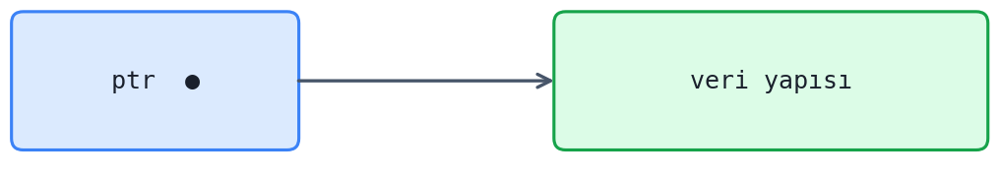

Okuma yapan akışlar ``ptr`` göstericisinin gösterdiği yerdeki paylaşılan alana hiç kilit almadan
erişirler. Ancak yazma yapan akışlar bu veri yapısının bir kopyasını oluşturup yazmayı bu kopya
üzerinde yaparlar:

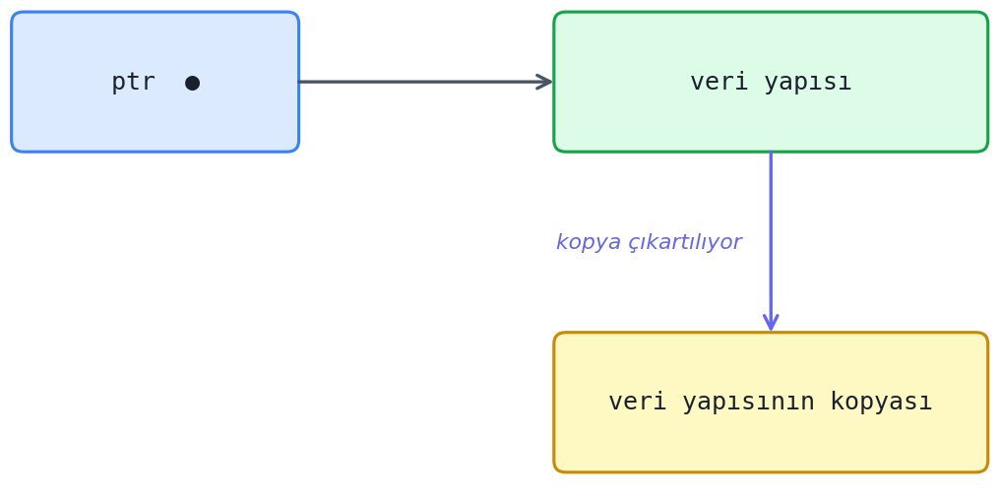

Yazma yapan akışlar yazma işlemini kopya üzerinde yaptıktan sonra ``ptr`` göstericisini bu kopyayı
gösterecek biçimde güncellerler:

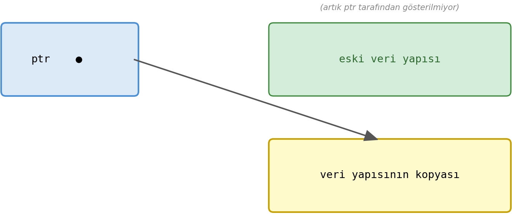

Burada önemli bir sorun eski veri yapısının ne zaman, nasıl ve kim tarafından yok edileceğidir. İlk
akla gelen yöntem en son okuma yapan akışın bu veri yapısını silmesidir. Ancak bu yöntemin genel bir
biçimde işletilmesi mümkün olamamaktadır.

RCU mekanizmasını şuna benzetebiliriz: Önümüzde bir beyaz tahta var. Kişiler bu tahtadaki yazıyı
okuyorlar. Bu beyaz tahtada değişiklik yapacak kişi okuyanların dikkati dağılmasın diye beyaz
tahtanın üzerindeki yazıların bir kopyasını arkadaki başka bir beyaz tahtada oluşturuyor ve
değişiklikleri bu arkadaki beyaz tahtada yapıyor. Sonra da tahtaları değiştirerek kendi tahtasının
görünür hale gelmesini sağlıyor. Ancak eski beyaz tahtadan okuyanlar okumayı bitirene kadar eski
tahtayı kullanmaya devam ediyor.

rcu_read_lock ve rcu_read_unlock 
--------------------------------

RCU mekanizmasının çekirdekte işletilebilmesi için bazı yardımcı fonksiyonlar oluşturulmuştur. RCU
korumalı veri yapısından okuma yapacak akışlar bu işlemi thread'ler arası geçişi kapatıp (yani
preemption'ı disable edip) yaparlar, işlem bitince de thread'ler arası geçişi açarlar. Thread'ler
arası geçişin açılıp kapatılması ``rcu_read_lock`` ve ``rcu_read_unlock`` fonksiyonlarıyla
yapılmaktadır. Örneğin:

.. code-block:: c

    rcu_read_lock();
    ...
    ...         <OKUMA İŞLEMİ> 
    ... 
    rcu_read_unlock();

Bu fonksiyonların parametrik yapıları şöyledir:

.. code-block:: c

    #include <linux/rcupdate.h>

    void rcu_read_lock(void);
    void rcu_read_unlock(void);

Buradaki ``rcu_read_lock`` ve ``rcu_read_unlock`` fonksiyonları aslında ``preempt_disable`` ve
``preempt_enable`` işlemlerini yapmaktadır. ``rcu_read_lock`` fonksiyonu güncel çekirdeklerde
``include/linux/rcupdate.h`` içerisinde aşağıdaki gibi tanımlanmıştır:

.. code-block:: c

    static __always_inline void rcu_read_lock(void)
    {
        __rcu_read_lock();
        __acquire(RCU);
        rcu_lock_acquire(&rcu_lock_map);
        RCU_LOCKDEP_WARN(!rcu_is_watching(),
                         "rcu_read_lock() used illegally while idle");
    }

Buradaki ``__rcu_read_lock`` fonksiyonu dışındaki çağrılar debug amaçlıdır, konfigürasyon
parametrelerine bağlı olarak zaten koda yansıtılmayabilmektedir. ``__rcu_read_lock`` fonksiyonu da
şöyle tanımlanmıştır:

.. code-block:: c

    static inline void __rcu_read_lock(void)
    {
        preempt_disable();
    }

rcu_dereference
-----------------

Çekirdeğin RCU mekanizmasında paylaşılan veri yapısını gösteren gösterici içerisindeki adresi elde
etmek için ``rcu_dereference`` fonksiyonu kullanılmaktadır. Bu fonksiyon
``include/linux/rcupdate.h`` dosyası içerisinde bir makro biçiminde yazılmıştır:

.. code-block:: c

    #define rcu_dereference(p)  rcu_dereference_check(p, 0)

Bu makronun çağrı zinciri şöyledir:

.. code-block:: c

    #define rcu_dereference_check(p, c)                                 \
            __rcu_dereference_check((p), __UNIQUE_ID(rcu),              \
            (c) || rcu_read_lock_held(), __rcu)

    #define __rcu_dereference_check(p, local, c, space)                 \
    ({                                                                  \
        typeof(**(p)) *local = (typeof(**(p)) *__force)(p);             \
        RCU_LOCKDEP_WARN(!(c), "suspicious rcu_dereference_check()");   \
        rcu_dereference_raw(local);                                     \
    })

    #define rcu_dereference_raw(p)      READ_ONCE(p)

Burada neden bu kadar çok kod vardır? Aslında buradaki kodlar debug amaçlı bazı kontrolleri
yapmaktadır. Bu kontroller çekirdek konfigürasyon parametreleriyle etkin hale getirilmektedir.
Bizim kullandığımız dağıtımların çekirdekleri derlenirken bu konfigürasyon parametreleri zaten
kapatılmış durumdadır. Böylece aslında bu kod ``READ_ONCE(p)`` ile göstericinin içerisindeki adresi
``volatile`` erişimle elde etmektedir.

rcu_assign_pointer
--------------------

Çekirdek RCU mekanizmasında yazan akış yazma işlemini bitirdiği zaman göstericiyi
``rcu_assign_pointer`` fonksiyonu ile güncellemektedir. Bu fonksiyon da aslında
``include/linux/rcupdate.h`` dosyası içerisinde bir makro biçiminde yazılmıştır:

.. code-block:: c

    #define rcu_assign_pointer(p, v)                                        \
    do {                                                                    \
        uintptr_t _r_a_p__v = (uintptr_t)(v);                               \
        rcu_check_sparse(p, __rcu);                                         \
                                                                            \
        if (__builtin_constant_p(v) && (_r_a_p__v) == (uintptr_t)NULL)      \
            WRITE_ONCE((p), (typeof(p))(_r_a_p__v));                        \
        else                                                                \
            smp_store_release(&p, RCU_INITIALIZER((typeof(p))_r_a_p__v));   \
    } while (0)

Bu makro biraz karışık olsa da özünde ``v`` değerini ``p`` göstericisine atomik bir biçimde
atamaktadır. ``smp_store_release`` makrosunu görmüştük; bu makro tek yönlü bariyer oluşturmaktaydı.
Buradaki ``__builtin_constant_p`` gcc ve clang derleyicilerinin built-in bir fonksiyonudur. Makro
parametresi olan ``v``'nin bir sabit olup olmadığına bakmaktadır. Eğer ``v`` değeri NULL adres
sabiti ise atama işlemi ``WRITE_ONCE`` makrosuyla yapılmıştır. ``rcu_check_sparse`` fonksiyonu ise
gcc ve clang derleyicilerinin ``__CHECKER__`` isimli önceden tanımlanmış (predefined) sembolik sabiti
1 ise birtakım kontrol işlemlerini yapmaktadır. Normal bir çekirdek derlemesinde aslında
``rcu_check_sparse`` fonksiyonu da debug amaçlı olduğu için koddan kaldırılacaktır.

synchronize_rcu ve call_rcu Fonksiyonları
-----------------------------------------

RCU mekanizmasında yazan akış (yani *update* işlemini yapan akış) göstericinin gösterdiği yerdeki
veri yapısının kopyasını çıkartır. Sonra da ``rcu_assign_pointer`` makrosuyla artık bu yeni kopyayı
yayınlar. Tabii okuyan tarafların işlemlerini bitirmesinden sonra eski veri yapısının da silinmesi
gerekir. Bu silme işlemi yazan akış tarafından yapılmaktadır. Eski veri yapısından okuma yapan tüm
akışların işlemini bitirmesi için geçen süreye *grace period* denilmektedir. Eski veri yapısının bu
*grace period* bittikten sonra silinmesi gerekir. İşte bu işlem iki biçimde yapılabilmektedir:
birincisi ``synchronize_rcu`` fonksiyonu ile, ikincisi de ``call_rcu`` fonksiyonu ile.

``synchronize_rcu`` fonksiyonu *grace period* bitene kadar yazan akışı blokede bekletmektedir. RCU
mekanizmasında yazan tarafın bekletilmesi size tuhaf gelebilir. Ancak RCU mekanizmasının ana amacı
okuyan akışların bekletilmeden çalışmasının sağlanmasıdır.

``call_rcu`` fonksiyonu ise beklemeye yol açmaz. Bu fonksiyon bir callback fonksiyonu parametre
olarak alır. *Grace period* bittiğinde çekirdek bu callback fonksiyonu çağırır ve eski veri yapısı
bu callback fonksiyon tarafından silinir. Bu fonksiyonların parametrik yapıları şöyledir:

.. code-block:: c

    #include <linux/rcupdate.h>

    void synchronize_rcu(void);
    void call_rcu(struct rcu_head *head, rcu_callback_t func);

``rcu_callback_t`` türü de şöyle ``typedef`` edilmiştir:

.. code-block:: c

    typedef void (*rcu_callback_t)(struct rcu_head *head);

Her ne kadar ``call_rcu`` fonksiyonu yazan tarafı bekletmiyorsa da bazı uygulamalarda yazan tarafın
açıkça bekletilmesi de gerekebilmektedir. ``call_rcu`` fonksiyonu hakkında daha ayrıntılı açıklamayı
izleyen paragraflarda yapacağız.

RCU Mekanizmasının Kullanımına Örnek
------------------------------------

Şimdi RCU mekanizmasının kullanımına birkaç örnek verelim. Örneğin paylaşılan veri yapısı aşağıdaki
gibi olsun:

.. code-block:: c

    #define MAX_NAME     32

    struct DEVICE_INFO {
        int  id;
        char name[MAX_NAME];
    };

Burada bu veri yapısının tahsis edilmiş olduğunu ve aşağıdaki gösterici tarafından gösterildiğini
kabul edelim:

.. code-block:: c

    static struct DEVICE_INFO __rcu *device_info;

Buradaki ``__rcu`` niteleyicisi, bu gösterici yanlışlıkla başka bir amaçla kullanıldığında debug
amaçlı uyarı oluşturmak ve okunabilirliği artırmak için kullanılmaktadır. Bunun düzgün kodların
çalışmasında herhangi bir etkisi yoktur.

Şimdi veri yapısından okuma yapan thread'lerin olduğunu varsayalım. Bu thread'ler aşağıdaki gibi
okumayı yapabilirler:

.. code-block:: c

    static long ioctl_read_device(struct file *filp, unsigned long arg)
    {
        struct DEVICE_INFO *di;

        rcu_read_lock();

        di = rcu_dereference(device_info);
        if (di != NULL)
            printk(KERN_INFO "Device: id=%d Name=%s\n", di->id, di->name);

        rcu_read_unlock();

        return 0;
    }

Bu veri yapısına yazma yapan thread'ler olsa bile okuma yapan thread'lerin hiç beklemeden işlemini
yaptığına dikkat ediniz. Burada okuma faaliyeti olarak aygıt bilgileri çekirdeğin log sistemine
yazılmıştır. Veri yapısına yazan fonksiyon işlemini şöyle yapabilir:

.. code-block:: c

    static int update_device(int new_id, const char *new_name)
    {
        struct DEVICE_INFO *di_new, *di_old;

        /* yeni kopya oluşturuluyor */
        if ((di_new = (struct DEVICE_INFO *)kmalloc(sizeof(struct DEVICE_INFO), GFP_KERNEL)) == NULL)
            return -ENOMEM;

        /* değişiklikler yapılıyor */
        di_new->id = new_id;
        strscpy(di_new->name, new_name, MAX_NAME);

        /* eski göstericinin gösterdiği yer değiştiriliyor */
        spin_lock(&dev_lock);
        di_old = rcu_dereference(device_info);
        rcu_assign_pointer(device_info, di_new);
        spin_unlock(&dev_lock);

        /* tüm okuyan thread'ler bitene kadar bekletiliyor */
        synchronize_rcu();

        /* eski veri yapısı serbest bırakılıyor */
        kfree(di_old);

        return 0;
    }

Burada bir noktaya dikkat ediniz. Global gösterici okunduktan sonra araya bir yazıcı girip eski alanı
serbest bırakırsa tanımsız davranış oluşur. Bu nedenle eski değerin alınması ve yeni değerin
yerleştirilmesi kısmı spinlock ile kritik kod bloğu oluşturularak ele alınmıştır.

Çekirdekte ``rcu_dereference`` işlemi ile ``rcu_assign_pointer`` işlemini tek hamlede yapan
``rcu_replace_pointer`` isimli bir makro da bulunmaktadır:

.. code-block:: c

    #define rcu_replace_pointer(rcu_ptr, ptr, c)                            \
    ({                                                                      \
        typeof(ptr) __tmp = rcu_dereference_protected((rcu_ptr), (c));      \
        rcu_assign_pointer((rcu_ptr), (ptr));                               \
        __tmp;                                                              \
    })

Yukarıdaki kodda bu makroyu da kullanabilirdik. Örneğin:

.. code-block:: c

    di_old = rcu_replace_pointer(device_info, di_new, true);

Makronun son parametresi genellikle ``true`` biçimde geçilmektedir.

Yukarıdaki örnek RCU uygulamasını bir aygıt sürücü yoluyla test edebiliriz. Tabii test için kullanıcı
modundaki thread'lerin iç içe girmesini sağlamalıyız. Biz testi rastgele beklemelerle yüzeysel olarak
yapacağız. Aşağıda bu aygıt sürücü kodları verilmiştir.

``rcu-test-driver.h``

.. code-block:: c

    #ifndef TEST_DRIVER_H_
    #define TEST_DRIVER_H_

    #include <linux/stddef.h>
    #include <linux/ioctl.h>

    #define MAX_NAME     32

    struct DEVICE_INFO {
        int id;
        char name[MAX_NAME];
    };

    #define TEST_DRIVER_MAGIC    'r'
    #define IOC_RCU_READ         _IOR(TEST_DRIVER_MAGIC, 0, struct DEVICE_INFO)
    #define IOC_RCU_WRITE        _IOW(TEST_DRIVER_MAGIC, 1, struct DEVICE_INFO)

    #endif

``rcu-test-driver.c``

.. code-block:: c

    #include <linux/module.h>
    #include <linux/kernel.h>
    #include <linux/fs.h>
    #include <linux/cdev.h>
    #include "rcu-test-driver.h"

    MODULE_LICENSE("GPL");
    MODULE_AUTHOR("Kaan Aslan");
    MODULE_DESCRIPTION("rcu-test-driver");

    static int test_driver_open(struct inode *inodep, struct file *filp);
    static int test_driver_release(struct inode *inodep, struct file *filp);
    static ssize_t test_driver_read(struct file *filp, char *buf, size_t size, loff_t *off);
    static ssize_t test_driver_write(struct file *filp, const char *buf, size_t size, loff_t *off);
    static long test_driver_ioctl(struct file *filp, unsigned int cmd, unsigned long arg);

    static long ioctl_read_device(struct file *filp, unsigned long arg);
    static long ioctl_update_device(struct file *filp, unsigned long arg);

    static dev_t g_dev;
    static struct cdev g_cdev;
    static struct file_operations g_fops = {
        .owner = THIS_MODULE,
        .open = test_driver_open,
        .read = test_driver_read,
        .write = test_driver_write,
        .release = test_driver_release,
        .unlocked_ioctl = test_driver_ioctl
    };

    static struct DEVICE_INFO __rcu *g_device_info;
    static DEFINE_SPINLOCK(g_dev_lock);

    static int __init test_driver_init(void)
    {
        int result;

        printk(KERN_INFO "rcu-test-driver initialization...\n");

        if ((result = alloc_chrdev_region(&g_dev, 0, 1, "rcu-test-driver")) < 0) {
            printk(KERN_INFO "cannot alloc char driver!...\n");
            return result;
        }
        cdev_init(&g_cdev, &g_fops);
        if ((result = cdev_add(&g_cdev, g_dev, 1)) < 0) {
            unregister_chrdev_region(g_dev, 1);
            printk(KERN_ERR "cannot add device!...\n");
            return result;
        }

        if ((g_device_info = (struct DEVICE_INFO *)kmalloc(sizeof(struct DEVICE_INFO),
                GFP_KERNEL)) == NULL) {
            unregister_chrdev_region(g_dev, 1);
            cdev_del(&g_cdev);
            return -ENOMEM;
        }

        g_device_info->id = 100;
        strscpy(g_device_info->name, "Sample", MAX_NAME);

        return 0;
    }

    static void __exit test_driver_exit(void)
    {
        cdev_del(&g_cdev);
        unregister_chrdev_region(g_dev, 1);
        kfree(g_device_info);

        printk(KERN_INFO "rcu-test-driver exit...\n");
    }

    static int test_driver_open(struct inode *inodep, struct file *filp)
    {
        return 0;
    }

    static int test_driver_release(struct inode *inodep, struct file *filp)
    {
        return 0;
    }

    static ssize_t test_driver_read(struct file *filp, char *buf, size_t size, loff_t *off)
    {
        return 0;
    }

    static ssize_t test_driver_write(struct file *filp, const char *buf, size_t size, loff_t *off)
    {
        return 0;
    }

    static long test_driver_ioctl(struct file *filp, unsigned int cmd, unsigned long arg)
    {
        long result;

        switch (cmd) {
            case IOC_RCU_READ:
                result = ioctl_read_device(filp, arg);
                break;
            case IOC_RCU_WRITE:
                result = ioctl_update_device(filp, arg);
                break;
            default:
                result = -ENOTTY;
        }

        return result;
    }

    static long ioctl_read_device(struct file *filp, unsigned long arg)
    {
        struct DEVICE_INFO *di;

        rcu_read_lock();

        di = rcu_dereference(g_device_info);
        if (di != NULL) {
            if (copy_to_user((struct DEVICE_INFO *)arg, di, sizeof(struct DEVICE_INFO)) != 0)
                return -EFAULT;
            printk(KERN_INFO "Device: id=%d Name=%s\n", di->id, di->name);
        }

        rcu_read_unlock();

        return 0;
    }

    static long ioctl_update_device(struct file *filp, unsigned long arg)
    {
        struct DEVICE_INFO *di_new, *di_old;
        struct DEVICE_INFO di_user;

        if (copy_from_user(&di_user, (struct DEVICE_INFO *)arg,
                sizeof(struct DEVICE_INFO)) != 0)
            return -EFAULT;

        if ((di_new = (struct DEVICE_INFO *)kmalloc(sizeof(struct DEVICE_INFO),
                GFP_KERNEL)) == NULL)
            return -ENOMEM;

        di_new->id = di_user.id;
        strscpy(di_new->name, di_user.name, MAX_NAME);

        spin_lock(&g_dev_lock);
        di_old = rcu_dereference(g_device_info);
        rcu_assign_pointer(g_device_info, di_new);
        spin_unlock(&g_dev_lock);

        synchronize_rcu();

        kfree(di_old);

        printk(KERN_INFO "DEVICE_INFO updated: %d, %s\n", di_user.id, di_user.name);

        return 0;
    }

    module_init(test_driver_init);
    module_exit(test_driver_exit);

``Makefile``

.. code-block:: makefile

    obj-m += ${file}.o

    all:
        make -C /lib/modules/$(shell uname -r)/build M=${PWD} modules
    clean:
        make -C /lib/modules/$(shell uname -r)/build M=${PWD} clean

``load``

.. code-block:: bash

    #!/bin/bash

    module=$1
    mode=666

    /sbin/insmod ./${module}.ko ${@:2} || exit 1
    major=$(awk "\$2 == \"$module\" {print \$1}" /proc/devices)
    rm -f $module
    mknod -m $mode $module c $major 0

Aşağıdaki ``unload`` betiği sürücüyü sistemden kaldırır:

.. code-block:: bash

    #!/bin/bash

    module=$1

    /sbin/rmmod ./${module}.ko || exit 1
    rm -f $module

``rcu-test.c``

.. code-block:: c

    #include <stdio.h>
    #include <stdlib.h>
    #include <string.h>
    #include <time.h>
    #include <stdint.h>
    #include <fcntl.h>
    #include <unistd.h>
    #include <pthread.h>
    #include <sys/ioctl.h>
    #include "rcu-test-driver.h"

    void exit_sys(const char *msg);
    void *thread_proc_read(void *param);
    void *thread_proc_update(void *param);

    int main(void)
    {
        int fd;
        int result;
        pthread_t tid_read, tid_update;

        srand(time(NULL));

        if ((fd = open("rcu-test-driver", O_RDWR)) == -1)
            exit_sys("open");

        if ((result = pthread_create(&tid_update, NULL, thread_proc_update,
                (void *)fd)) != 0) {
            fprintf(stderr, "pthread_create: %s\n", strerror(result));
            exit(EXIT_FAILURE);
        }

        if ((result = pthread_create(&tid_read, NULL, thread_proc_read,
                (void *)fd)) != 0) {
            fprintf(stderr, "pthread_create: %s\n", strerror(result));
            exit(EXIT_FAILURE);
        }

        pthread_join(tid_read, NULL);
        pthread_join(tid_update, NULL);

        close(fd);

        return 0;
    }

    void *thread_proc_read(void *param)
    {
        int fd;
        struct DEVICE_INFO di;

        fd = (int)param;

        for (int i = 0; i < 10; ++i) {
            if (ioctl(fd, IOC_RCU_READ, &di) == -1)
                exit_sys("ioctl");
            printf("Device: id=%d Name=%s\n", di.id, di.name);
            usleep(rand() % 100000);
        }

        return NULL;
    }

    void *thread_proc_update(void *param)
    {
        int fd;
        struct DEVICE_INFO di;

        fd = (int)param;

        for (int i = 0; i < 10; ++i) {
            di.id = i + 1000;
            strcpy(di.name, "My Device");

            if (ioctl(fd, IOC_RCU_WRITE, &di) == -1)
                exit_sys("ioctl");
            usleep(rand() % 100000);
        }

        return NULL;
    }

    void exit_sys(const char *msg)
    {
        perror(msg);
        exit(EXIT_FAILURE);
    }

call_rcu Fonksiyonu ve kfree_rcu Makrosu
----------------------------------------

Yukarıda da belirttiğimiz gibi yazan taraflar ``synchronize_rcu`` fonksiyonunu çağırdığında *grace
period* kadar bir bloke oluşabilmektedir. Bunun ``call_rcu`` fonksiyonu ile engellenebileceğini
söylemiştik. ``call_rcu`` fonksiyonu bir callback fonksiyonu argüman olarak alır ve bunu saklar;
çekirdek de *grace period* bittiğinde bu callback fonksiyonu çağırır. ``call_rcu`` fonksiyonunun
parametrik yapısını anımsatmak istiyoruz:

.. code-block:: c

    void call_rcu(struct rcu_head *head, rcu_callback_t func);

Buradaki ``rcu_head`` yapısı callback mekanizmasının işletilmesinde kullanılmaktadır. Sistem
programcısı paylaşılan nesneye ilişkin yapının içerisine ``rcu_head`` isimli yapı türünden bir eleman
yerleştirmeli ve fonksiyonun birinci parametresine bu elemanın adresini vermelidir. Örneğin:

.. code-block:: c

    struct DEVICE_INFO {
        int id;
        char name[MAX_NAME];
        struct rcu_head rcu;
    };

İşte ``call_rcu`` fonksiyonunun birinci parametresine paylaşılan alana ilişkin yapının içerisindeki
``rcu_head`` türünden elemanın adresi (örneğimizde yapının ``rcu`` elemanı), ikinci parametresine de
callback fonksiyonun adresi geçirilmelidir. Fonksiyonun ikinci parametresindeki türün typedef bildirimine
dikkat ediniz:

.. code-block:: c

    typedef void (*rcu_callback_t)(struct rcu_head *head);

Bu durumda sistem programcısının ``call_rcu`` fonksiyonunun ikinci parametresine geri dönüş değeri
``void`` olan, parametresi ``struct rcu_head *`` türünden olan bir fonksiyonun adresini geçmesi gerekir.
``struct rcu_head`` yapısı çekirdeğin callback mekanizmasının yönetebilmesi için gereken elemanları
barındırmaktadır. Bu yapı şöyle tanımlanmıştır:

.. code-block:: c

    struct callback_head {
        struct callback_head *next;
        void (*func)(struct callback_head *head);
    } __attribute__((aligned(sizeof(void *))));
    #define rcu_head callback_head

Örneğin:

.. code-block:: c

    struct DEVICE_INFO *di_new, *di_old;
    /* ... */

    spin_lock(&g_dev_lock);
    di_old = rcu_dereference(g_device_info);
    rcu_assign_pointer(g_device_info, di_new);
    spin_unlock(&g_dev_lock);

    if (di_old != NULL)
        call_rcu(&di_old->rcu, device_rcu_callback);

``call_rcu`` fonksiyonunun ikinci parametresine geçirdiğimiz callback fonksiyonun parametresi aslında
kendi yapı nesnemizin içerisindeki ``rcu_head`` elemanının adresidir. Biz de bu adresten hareketle asıl
nesne adresini ``container_of`` makrosuyla elde edebiliriz. Örneğin:

.. code-block:: c

    static void device_rcu_callback(struct rcu_head *hrcu)
    {
        struct DEVICE_INFO *di;

        di = container_of(hrcu, struct DEVICE_INFO, rcu);
        kfree(di);
    }

Ayrıca Linux çekirdeğinde ``call_rcu`` işlemi ile ``kfree`` işlemini birlikte yapan ``kfree_rcu`` isimli
bir makro da bulunmaktadır. ``kfree_rcu`` makrosu iki parametre almaktadır:

.. code-block:: c

    kfree_rcu(ptr, rcu_head_fieldname);

Makronun birinci parametresi serbest bırakılacak nesnenin adresini, ikinci parametresi de nesneye ilişkin
yapıdaki ``rcu_head`` elemanının ismini almaktadır. Örneğin:

.. code-block:: c

    struct DEVICE_INFO *di_new, *di_old;
    /* ... */

    spin_lock(&g_dev_lock);
    di_old = rcu_dereference(g_device_info);
    rcu_assign_pointer(g_device_info, di_new);
    spin_unlock(&g_dev_lock);

    if (di_old != NULL)
        kfree_rcu(di_old, rcu);

Yukarıda yaptığımız örneği aşağıda ``call_rcu`` kullanarak yeniden veriyoruz.

Aşağıda, önceki bölümlerde açıkladığımız ``call_rcu`` mekanizmasını kullanan tam bir çekirdek modülü
örneği verilmektedir:

``rcu-test-driver.c``

.. code-block:: c

    #include <linux/module.h>
    #include <linux/kernel.h>
    #include <linux/fs.h>
    #include <linux/cdev.h>
    #include "rcu-test-driver.h"

    MODULE_LICENSE("GPL");
    MODULE_AUTHOR("Kaan Aslan");
    MODULE_DESCRIPTION("rcu-test-driver");

    static int test_driver_open(struct inode *inodep, struct file *filp);
    static int test_driver_release(struct inode *inodep, struct file *filp);
    static ssize_t test_driver_read(struct file *filp, char *buf, size_t size, loff_t *off);
    static ssize_t test_driver_write(struct file *filp, const char *buf, size_t size, loff_t *off);
    static long test_driver_ioctl(struct file *filp, unsigned int cmd, unsigned long arg);

    static long ioctl_read_device(struct file *filp, unsigned long arg);
    static long ioctl_update_device(struct file *filp, unsigned long arg);

    static void device_rcu_callback(struct rcu_head *hrcu);

    static dev_t g_dev;
    static struct cdev g_cdev;
    static struct file_operations g_fops = {
        .owner = THIS_MODULE,
        .open = test_driver_open,
        .read = test_driver_read,
        .write = test_driver_write,
        .release = test_driver_release,
        .unlocked_ioctl = test_driver_ioctl
    };

    struct DEVICE_INFO {
        int id;
        char name[MAX_NAME];
        struct rcu_head rcu;
    };

    static struct DEVICE_INFO __rcu *g_device_info;
    static DEFINE_SPINLOCK(g_dev_lock);

    static int __init test_driver_init(void)
    {
        int result;

        printk(KERN_INFO "rcu-test-driver module initialization...\n");

        if ((result = alloc_chrdev_region(&g_dev, 0, 1, "rcu-test-driver")) < 0) {
            printk(KERN_INFO "cannot alloc char driver!...\n");
            return result;
        }
        cdev_init(&g_cdev, &g_fops);
        if ((result = cdev_add(&g_cdev, g_dev, 1)) < 0) {
            unregister_chrdev_region(g_dev, 1);
            printk(KERN_ERR "cannot add device!...\n");
            return result;
        }

        if ((g_device_info = (struct DEVICE_INFO *)kmalloc(sizeof(struct DEVICE_INFO), GFP_KERNEL)) == NULL) {
            unregister_chrdev_region(g_dev, 1);
            cdev_del(&g_cdev);
            return -ENOMEM;
        }

        g_device_info->id = 100;
        strscpy(g_device_info->name, "Sample", MAX_NAME);

        return 0;
    }

    static void __exit test_driver_exit(void)
    {
        cdev_del(&g_cdev);
        unregister_chrdev_region(g_dev, 1);
        kfree(g_device_info);

        printk(KERN_INFO "rcu-test-driver module exit...\n");
    }

    static int test_driver_open(struct inode *inodep, struct file *filp)
    {
        return 0;
    }

    static int test_driver_release(struct inode *inodep, struct file *filp)
    {
        return 0;
    }

    static ssize_t test_driver_read(struct file *filp, char *buf, size_t size, loff_t *off)
    {
        return 0;
    }

    static ssize_t test_driver_write(struct file *filp, const char *buf, size_t size, loff_t *off)
    {
        return 0;
    }

    static long test_driver_ioctl(struct file *filp, unsigned int cmd, unsigned long arg)
    {
        long result;

        switch (cmd) {
            case IOC_RCU_READ:
                result = ioctl_read_device(filp, arg);
                break;
            case IOC_RCU_WRITE:
                result = ioctl_update_device(filp, arg);
                break;
            default:
                printk(KERN_INFO "invalid ioctl code!..\n");
                result = -ENOTTY;
        }

        return result;
    }

    static long ioctl_read_device(struct file *filp, unsigned long arg)
    {
        struct DEVICE_INFO *di;
        struct DEVICE_PARAM di_param;

        rcu_read_lock();
        di = rcu_dereference(g_device_info);
        if (di != NULL) {
            di_param.id = di->id;
            strscpy(di_param.name, di->name, MAX_NAME);
            if (copy_to_user((struct DEVICE_PARAM *)arg, &di_param, sizeof(struct DEVICE_PARAM)) != 0)
                return -EFAULT;
            printk(KERN_INFO "Device: id=%d Name=%s\n", di->id, di->name);
        }
        rcu_read_unlock();

        return 0;
    }

    static long ioctl_update_device(struct file *filp, unsigned long arg)
    {
        struct DEVICE_INFO *di_new, *di_old;
        struct DEVICE_PARAM di_param;

        if (copy_from_user(&di_param, (struct DEVICE_PARAM *)arg, sizeof(struct DEVICE_PARAM)) != 0)
            return -EFAULT;

        if ((di_new = (struct DEVICE_INFO *)kmalloc(sizeof(struct DEVICE_INFO), GFP_KERNEL)) == NULL)
            return -ENOMEM;

        di_new->id = di_param.id;
        strscpy(di_new->name, di_param.name, MAX_NAME);

        spin_lock(&g_dev_lock);
        di_old = rcu_dereference(g_device_info);
        rcu_assign_pointer(g_device_info, di_new);
        spin_unlock(&g_dev_lock);

        if (di_old != NULL)
            call_rcu(&di_old->rcu, device_rcu_callback);

        /*
        if (di_old != NULL)
            kfree_rcu(di_old, rcu);
        */

        printk(KERN_INFO "DEVICE_INFO updated: %d, %s\n", di_param.id, di_param.name);

        return 0;
    }

    static void device_rcu_callback(struct rcu_head *hrcu)
    {
        struct DEVICE_INFO *di;

        di = container_of(hrcu, struct DEVICE_INFO, rcu);
        kfree(di);
    }

    module_init(test_driver_init);
    module_exit(test_driver_exit);

RCU'lu Bağlı Listeler
---------------------

Biz çekirdekteki veri yapılarını ele alırken bazı veri yapılarının RCU'lu biçimlerinin olduğunu da
görmüştük. Örneğin bağlı liste işlemlerini yapan fonksiyonların RCU biçimleri de vardı. RCU'lu bağlı
liste fonksiyonlarını anımsatmak istiyoruz:

.. code-block:: c

    void list_add_rcu(struct list_head *new, struct list_head *head);
    void list_add_tail_rcu(struct list_head *new, struct list_head *head);

    void list_del_rcu(struct list_head *entry);

    void list_replace_rcu(struct list_head *old, struct list_head *new);
    void list_splice_init_rcu(struct list_head *list, struct list_head *head, synchronize_rcu_func wait);

    #define list_entry_rcu(ptr, type, member)
    #define list_first_entry_rcu(ptr, type, member)
    #define list_next_rcu(list)

    #define list_for_each_entry_rcu(pos, head, member)
    #define list_for_each_entry_from_rcu(pos, head, member)
    #define list_for_each_entry_continue_rcu(pos, head, member)

Şimdi bu RCU'lu bağlı listeler üzerinde ek açıklamalar yapmak istiyoruz. Buradaki RCU'lu bağlı liste
fonksiyonları ile bağlı liste üzerinde güncelleme yapılırken aynı bağlı listeden okuma yapan akışlar
bekletilmemektedir. Örneğin bağlı listeden bir düğüm silinecek olsun. Bu durumda okuma yapan akışlar
hiç bloke olmadan işlemlerine devam ederler, silme işlemi ise *grace period* bittiğinde görünür hale
gelir.

Linux çekirdeğindeki RCU'lu bağlı listelerdeki düğümler de yine ``list_head`` yapısıyla temsil
edilmektedir:

.. code-block:: c

    struct list_head {
        struct list_head *next, *prev;
    };

Hash tablolarında kök düğümün tek bir gösterici içerdiğini anımsayınız:

.. code-block:: c

    struct hlist_head {
        struct hlist_node *first;
    };

    struct hlist_node {
        struct hlist_node *next, **pprev;
    };

RCU'lu bağlı listelerden okuma yapan thread'ler (örneğin bağlı listeyi dolaşan thread'ler) yine
``rcu_read_lock`` ve ``rcu_read_unlock`` çağrıları arasında thread'ler arası geçişi kapatarak
işlemlerini yapmaktadır:

.. code-block:: c

    struct SAMPLE {
        /* ... */
        struct list_head link;
        struct rcu_head rcu;
    };
    LIST_HEAD(g_mylist);

    /* ... */

    struct SAMPLE *ps;

    rcu_read_lock();

    list_for_each_entry_rcu(ps, &g_mylist, link) {
        /* ... */
    }

    rcu_read_unlock();

Burada ``struct SAMPLE`` nesneleri bir bağlı liste ile birbirine bağlanmış durumdadır. Bağlı listeyi
dolaşmadan önce ``rcu_read_lock`` fonksiyonunun, dolaşım sonunda da ``rcu_read_unlock`` fonksiyonunun
çağrıldığına dikkat ediniz. Dolaşım yapan makro ``list_for_each_entry_rcu`` ismindedir. RCU'suz bağlı
listelerde bu makronun isminin ``list_for_each_entry`` biçiminde olduğunu anımsayınız. Aslında
``list_for_each_entry`` makrosuyla ``list_for_each_entry_rcu`` makrosu arasında çok küçük bir fark
vardır. ``list_for_each_entry_rcu`` makrosu ``include/linux/rculist.h`` içerisinde şöyle
tanımlanmıştır:

.. code-block:: c

    #define list_for_each_entry_rcu(pos, head, member, cond...)            \
        for (__list_check_rcu(dummy, ## cond, 0),                          \
            pos = list_entry_rcu((head)->next, typeof(*pos), member);      \
            &pos->member != (head);                                        \
            pos = list_entry_rcu(pos->member.next, typeof(*pos), member))

Buradaki ``list_entry_rcu`` makrosu ise şöyle tanımlanmıştır:

.. code-block:: c

    #define list_entry_rcu(ptr, type, member)           \
        container_of(READ_ONCE(ptr), type, member)

Aslında iki makro arasındaki fark yalnızca bağ okumasının ``READ_ONCE`` ile yapılmasıdır.

RCU'lu bağlı listelerde liste üzerinde yazma işlemleri (örneğin düğüm ekleme, düğüm silme gibi
işlemler) yapılırken yine yazan tarafların bir spinlock ile senkronize edilmesi gerekmektedir. Bu
spinlock nesnesini sistem programcısı kendisi oluşturmalıdır. Örneğin:

.. code-block:: c

    spin_lock(&g_myspinlock);                       /* yazan tarafların senkronize edilmesi gerekiyor */
    list_add_rcu(&new_node->list, &g_mylist);
    spin_unlock(&g_myspinlock);

Burada ``list_add_rcu`` fonksiyonu ile bağlı listenin başına bir düğüm eklenmiştir. Ancak bu işlem
sırasında bir spinlock ile yazan tarafların senkronize edilmesi sağlanmıştır.

Peki ``list_add_rcu`` fonksiyonu okuyan tarafları bekletmeden işlemini nasıl yapmaktadır? İşte bu
fonksiyon önce eklenecek düğümün ``next`` ve ``prev`` göstericilerini ayarlar, sonra da eklemeyi
yaparken ``rcu_assign_pointer`` makrosunu kullanır. Böylece *grace period* bittikten sonra artık yeni
okuyucular bu düğümü görmeye başlayacaktır. ``list_add_rcu`` fonksiyonunun gerçekleştirimi şöyle
yapılmıştır:

.. code-block:: c

    static inline void list_add_rcu(struct list_head *new, struct list_head *head)
    {
        __list_add_rcu(new, head, head->next);
    }

    static inline void __list_add_rcu(struct list_head *new, struct list_head *prev, struct list_head *next)
    {
        if (!__list_add_valid(new, prev, next))
            return;

        new->next = next;
        new->prev = prev;
        rcu_assign_pointer(list_next_rcu(prev), new);   /* store-release */
        next->prev = new;
    }

    #define list_next_rcu(list) (*((struct list_head __rcu **)(&(list)->next)))

Buradaki ``list_add_rcu`` fonksiyonu bağlı listenin başına düğüm eklemektedir. Peki bu düğüm ekleme
işlemi burada nasıl yapılmıştır? Anımsayacağınız gibi bağlı listenin başına, sonuna ve arasında düğüm
ekleme işlemi ortak bir fonksiyonla yapılmaktadır. Bu fonksiyon da örneğimizde ``__list_add_rcu``
fonksiyonudur. Yeni düğümün ``next`` ve ``prev`` göstericileri aşağıdaki gibi ayarlanmıştır:

.. code-block:: c

    new->next = next;
    new->prev = prev;

Sonra kök düğümün ``next`` göstericisinin ilk düğümü göstermesi sağlanmıştır. Tabii bu işlem yeni
veri yapısının yayınlanması işlemidir. Dolayısıyla bu işlem ``rcu_assign_pointer`` makrosuyla
yapılmıştır:

.. code-block:: c

    rcu_assign_pointer(list_next_rcu(prev), new);   /* store-release */

Nihayetinde eski ilk düğümün yeni düğümü göstermesi de şöyle sağlanmıştır:

.. code-block:: c

    next->prev = new;

Peki burada kök gösterici yayınlandıktan sonra ``next->prev = new`` işleminin yapılması bir soruna yol
açmaz mı? Yani tam o sırada geriye doğru listeyi okuyan bir thread varsa bir kararsızlık oluşmaz mı?
İşte Linux çekirdeğinin RCU'lu bağlı listelerinden okuma yapan taraflar hiçbir zaman geriye doğru okuma
yapmamaktadır. Sizin de bu kurala uymanız gerekir.

RCU'lu bağlı listelerden silme işlemi de yine benzer biçimde spinlock kilidi alınarak yapılmalıdır.
Örneğin:

.. code-block:: c

    spin_lock(&g_myspinlock);
    list_del_rcu(&node->link);
    spin_unlock(&g_myspinlock);
    call_rcu(&node->rcu, free_node_callback);   /* grace period sonrası serbest bırak */

Burada görüldüğü gibi önce spinlock kilidi alınmış sonra düğüm silme işlemi ``list_del_rcu`` fonksiyonu
ile yapılmıştır. Düğüm silme işlemi *grace period* sonunda gerçekleştiğinde ek birtakım işlemlerin de
yapılması gerekebilmektedir. Bu nedenle örneğimizde ``call_rcu`` fonksiyonu ile düğümün serbest
bırakılması sırasında ``free_node_callback`` isimli bizim bir fonksiyonumuz çağrılmıştır. Eğer düğümler
çekirdeğin heap alanı içerisinde tahsis edilmişse bu fonksiyon onları serbest bırakabilir.
``list_del_rcu`` fonksiyonu da şöyle yazılmıştır:

.. code-block:: c

    static inline void list_del_rcu(struct list_head *entry)
    {
        __list_del_entry(entry);
        entry->prev = LIST_POISON2;
        /* entry->next kasıtlı olarak bozulmaz! */
    }

    static inline void __list_del_entry(struct list_head *entry)
    {
        if (!__list_del_entry_valid(entry))
            return;

        __list_del(entry->prev, entry->next);
    }

    static inline void __list_del(struct list_head *prev, struct list_head *next)
    {
        next->prev = prev;
        WRITE_ONCE(prev->next, next);
    }

Düğüm silme işleminin herhangi bir yerinde ``rcu_assign_pointer`` makrosunun kullanılmadığına dikkat
ediniz.

Kullanıcı Modu Senkronizasyonları ve Futex Mekanizması
======================================================

Biz senkronizasyon konusunda çekirdek tarafından kullanılan senkronizasyon nesnelerini ele aldık. Peki kullanıcı
modundan kullandığımız yani pthread kütüphanesinin kullandığı senkronizasyon nesneleri nasıl oluşturulmuştur?
pthread kütüphanesi bu senkronizasyon nesnelerini hangi sistem fonksiyonlarıyla gerçekleştirmektedir? Şimdi bu
konu üzerinde biraz durmak istiyoruz.

Bilindiği gibi UNIX türevi sistemlerin programlama bağlamındaki kullanıcı arayüzü POSIX standartlarıyla
belirlenmiştir. POSIX standartları tüm UNIX türevi işletim sistemlerinin taşınabilir programlama arayüzüdür.
Dolayısıyla C, C++, Java, C#, Python gibi dillerin kütüphaneleri aşağı seviyeli işlemleri programcılar fark
etmese de Linux sistemlerinde bu POSIX fonksiyonlarını çağırarak gerçekleştirmektedir. Zaten bu konu üzerinde
daha önce durmuştuk. Anımsanacağı gibi Linux sistemlerinde POSIX fonksiyonlarının bir bölümü hemen belli bir
sistem fonksiyonunu çağırmaktadır. Örneğin ``open`` POSIX fonksiyonu aslında Linux'ta ``sys_open`` sistem
fonksiyonunu çağıran bir sarma fonksiyon gibidir.

UNIX/Linux sistemlerinde kullanıcı modundaki thread senkronizasyonu işlemleri ``pthread_xxx`` fonksiyonlarıyla
yapılmaktadır. pthread kütüphanesi POSIX'in resmi thread kütüphanesidir. Dolayısıyla programlama dili ne olursa
olsun Linux sistemlerinde aslında o programlama dillerinin kendi thread ve senkronizasyon fonksiyonları Linux
sistemlerinde pthread kütüphanesinin fonksiyonlarını çağırmaktadır. Örneğin siz C++'ın C++11 ile eklenen thread
kütüphanesini Linux'ta kullanıyorsanız bunlar eninde sonunda asıl işlemleri ``pthread_xxx`` fonksiyonlarını
çağırarak yapmaktadır. Benzer durum Qt kütüphanesi için de geçerlidir. Tabii programlama dillerinin ve
framework'lerin thread kütüphaneleri ve senkronizasyon nesneleri o programlama dili ya da framework temelinde
taşınabilir (portable) durumdadır. Yani örneğin biz C++'ın thread kütüphanesini hem Windows'ta hem de Linux'ta
aynı biçimde kullanırız. Ancak bunların gerçekleştirimleri işletim sistemine özgü bir biçimde yapılmaktadır.

Futex Mekanizması
-----------------

Linux sistemlerinde pthread kütüphanesinin kullanıcı modundan kullanılabilen senkronizasyon nesneleri şunlardır:

- ``pthread_mutex_t`` (mutex)
- ``pthread_cond_t`` (condition variable)
- ``pthread_rwlock_t`` (read-write lock)
- ``pthread_spinlock_t`` (spinlock)
- ``pthread_barrier_t`` (barrier)
- semaphore

İşte kullanıcı modundaki tüm bu senkronizasyon nesneleri aslında çekirdekteki *futex (fast user space mutex)*
denilen sistem fonksiyonunu ve bu sistem fonksiyonunun sağladığı mekanizmayı kullanmaktadır. Yani çekirdekte her
senkronizasyon nesnesi için ayrı bir sistem fonksiyonu yoktur. Yalnızca *futex* isimli bir sistem fonksiyonu
vardır. pthread kütüphanesinin senkronizasyon fonksiyonları bu *futex* sistem fonksiyonunu çağırmaktadır.

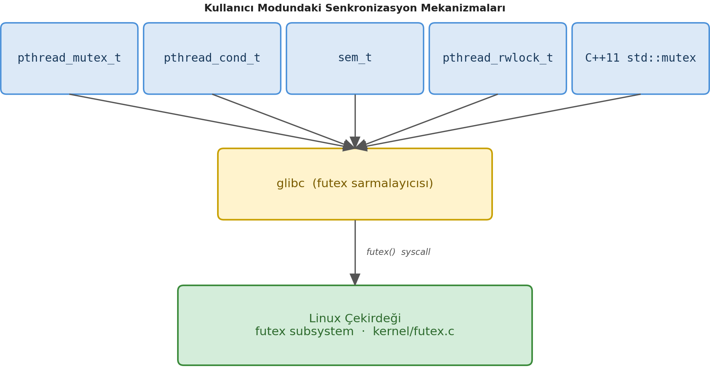

*futex* sistem fonksiyonu için bir POSIX sarma fonksiyonu olmadığı gibi *libc* kütüphanesinde de bir sarma
fonksiyon bulunmamaktadır. Ancak anımsanacağı gibi sistem fonksiyonları kullanıcı modundan *libc* kütüphanesinin
bulundurduğu ``syscall`` isimli fonksiyon yoluyla çağrılabilmektedir. ``syscall`` fonksiyonunun parametrik
yapısını anımsayınız:

.. code-block:: c

    #include <sys/syscall.h>

    long syscall(long number, ...);

Her sistem fonksiyonun bir numarası vardır. Bu numaralar da ``<sys/syscall.h>`` dosyası içerisinde ``SYS_xxx``
biçiminde define edilmiştir. Örneğin ``sys_open`` sistem fonksiyonunun numarası ``SYS_open`` sembolik sabiti,
``sys_futex`` sistem fonksiyonunun numarası için ``SYS_futex`` sembolik sabiti bulunmaktadır. O halde *futex*
sistem fonksiyonu doğrudan kullanıcı modundan şöyle çağrılabilir:

.. code-block:: c

    int futex(uint32_t *uaddr, int op, uint32_t val, const struct timespec *timeout,
              uint32_t *uaddr2, uint32_t val3)
    {
        return syscall(SYS_futex, uaddr, op, val, timeout, uaddr2, val3);
    }

Futex kullanımında kullanıcı modundaki programcı ``uint32_t`` türünden (64 bit sistem olsa bile bu türden) bir
nesnenin adresini sistem fonksiyona verir (*uaddr* parametresi). Sonra yapılacak işlemi (*op* parametresi)
belirtir. Diğer parametrelerin anlamı yapılacak işleme göre değişebilmektedir.

Futex Mekanizmasının Çalışma Biçimi
~~~~~~~~~~~~~~~~~~~~~~~~~~~~~~~~~~~

Futex mekanizmasının ana kullanımı şöyledir: Kullanıcı modundaki programcı ya da kütüphane (örneğin
``pthread_xxx`` fonksiyonları) global bir değişken tanımlar. Bu değişken kilidin durumunu belirtir. Hiç çekirdek
moduna geçmeden önce bu değişkenin içerisindeki değere bakarak senkronizasyon nesnesinin kilitli olup olmadığını
*CAS (compare-and-swap)* makine komutlarıyla belirler. Eğer kilit açıksa bunu kilitler ve hiç çekirdek moduna
geçiş yapmaz. Eğer kilit kapalıysa futex sistem fonksiyonunu çağırarak bloke oluşturur. Blokenin çözülmesi de
yine futex sistem fonksiyonunun çağrılmasıyla yapılmaktadır. Bu mekanizmada çekirdek moduna gereksiz bir biçimde
geçilmesinin engellendiğine dikkat ediniz. Eğer senkronizasyon nesneleri için doğrudan sistem fonksiyonları
çağrılsaydı çekirdek moduna gereksiz geçiş yapılabilirdi. Çekirdekteki daha önce görmüş olduğumuz senkronizasyon
nesnelerinin kullanıcı moduyla bir ilgisi olmadığına dikkat ediniz. (Windows sistemlerindeki
``CRITICAL_SECTION`` nesneler de tamamen bu biçimde çalışmaktadır. Bu sistemlerde ayrıca tamamen çekirdek
modunda işlem yapan ve ismine "çekirdek senkronizasyon nesneleri" denilen kullanıcı modu mekanizmalar da
bulunmaktadır.)

Futex İşlem Kodları
~~~~~~~~~~~~~~~~~~~

Futex sistem fonksiyonunun yaptığı işlemler yani *op* parametresine girilebilecek değerler şunlardır:

.. code-block:: c

    #define FUTEX_WAIT              0
    #define FUTEX_WAKE              1
    #define FUTEX_FD                2       /* KULLANIM DIŞI — kaldırıldı */
    #define FUTEX_REQUEUE           3
    #define FUTEX_CMP_REQUEUE       4
    #define FUTEX_WAKE_OP           5
    #define FUTEX_LOCK_PI           6
    #define FUTEX_UNLOCK_PI         7
    #define FUTEX_TRYLOCK_PI        8
    #define FUTEX_WAIT_BITSET       9
    #define FUTEX_WAKE_BITSET      10
    #define FUTEX_WAIT_REQUEUE_PI  11
    #define FUTEX_CMP_REQUEUE_PI   12
    #define FUTEX_LOCK_PI2         13

Burada en önemli iki işlem ``FUTEX_WAIT`` ve ``FUTEX_WAKE`` işlemleridir.

Futex'te bloke oluşturmak için kullanılan ``FUTEX_WAIT`` işleminin çalışma biçimi şöyledir:

.. code-block:: c

    if (*uaddr == val) {
        /* thread'i bekleme kuyruğuna ekle ve uyut */
        /* bu kontrol + ekleme atomik olarak gerçekleşir */
    }
    else {
        /* EAGAIN döndür — değer değişmiş */
    }

Yani futex'e verilen adresteki değerle ona verilen değer (*val* parametresi) eğer aynıysa bloke işlemi
yapılmaktadır, değilse fonksiyon başarısızlıkla geri dönmektedir. ``FUTEX_WAKE`` işlemi de uyutulan
thread'lerin uyandırılması için kullanılmaktadır. Burada kaç thread'in uyandırılacağı da belirtilebilmektedir.

``FUTEX_WAIT`` işleminin çekirdekteki çağrı zinciri şöyledir:

.. code-block:: text

    sys_futex(FUTEX_WAKE)
    └── futex_wake()
            ├── hash_futex()                 ← aynı bucket'ı bul
            ├── spin_lock(&hb->lock)         ← bucket'ı kilitle
            ├── plist_for_each_entry_safe()  ← zinciri tara
            │       └── futex_wake_mark()    ← görevi işaretle
            │               └── wake_q_add()
            └── wake_up_q()                  ← asıl uyandırma
                    └── try_to_wake_up()     ← görev → TASK_RUNNING

``FUTEX_WAKE`` işleminde fonksiyonun *val* parametresi uyandırılacak thread sayısını belirtmektedir. Örneğin bu
parametreye 1 girildiğinde futex yalnızca 1 tane thread'i uyandırmaktadır. Örneğin:

.. code-block:: c

    futex(&m->state, FUTEX_WAKE | FUTEX_PRIVATE_FLAG, 1, NULL, NULL, 0);

``FUTEX_WAKE`` işleminin çağrı zinciri de şöyledir:

.. code-block:: text

    sys_futex(FUTEX_WAIT)
    └── futex_wait()
            ├── futex_wait_setup()       ← anahtar oluştur, bucket kilitle
            ├── futex_wait_queue()       ← kuyruğa ekle + uyut
            │       ├── set_current_state(TASK_INTERRUPTIBLE)
            │       └── schedule()       ← CPU'yu bırak
            └── futex_wait_restart()     ← sinyal gelirse yeniden dene

Futex'in Çekirdek Gerçekleştirimi
~~~~~~~~~~~~~~~~~~~~~~~~~~~~~~~~~

Sistemdeki tüm prosesler için aynı sistem fonksiyonunu kullandığından dolayı futex'in çekirdek gerçekleştirimi
buna uygun bir biçimde yapılmıştır. Çekirdekteki futex sistem fonksiyonu bir hash tablosu kullanır. Bloke
edilecek thread'ler için çekirdek hiç bekleme kuyruğu oluşturmadan yukarıda belirttiğimiz gibi thread'in
durumunu ``TASK_INTERRUPTIBLE`` haline getirip schedule işlemini uygular. Tabii uyutulan thread'lerin
``task_struct`` adresleri de hash tablosunda saklanmaktadır. Uyandırma işleminde de ``task_struct`` nesnesi bu
hash tablosundan bulunur ve ``try_to_wake_up`` fonksiyonuyla (yani görmüş olduğumuz ``wake_up_state``
fonksiyonunun çağırdığı fonksiyonla) uyandırılmaktadır. Görüldüğü gibi futex mekanizmada da uyutma ve uyandırma
işleminde daha önce görmüş olduğumuz standart bekleme kuyrukları kullanılmamaktadır.

Futex Yoluyla Kullanıcı Modunda Mutex Gerçekleştirimi Örneği
~~~~~~~~~~~~~~~~~~~~~~~~~~~~~~~~~~~~~~~~~~~~~~~~~~~~~~~~~~~~

Şimdi de son olarak futex sistem fonksiyonu yoluyla kullanıcı modundan kullanılabilecek bir utex
gerçekleştirimini yapalım. (pthread kütüphanesinde zaten mutex gerçekleştiriminin bulunduğunu belirtmiştik. Biz
burada futex sistem fonksiyonunun nasıl kullanıldığını bir örnek üzerinde ele almak istiyoruz.)

Mutex için kullanıcı alanı içerisinde ``uint32_t`` türünden bir global değişken tutmak gerekir. Biz bu
değişkeni soyutlama sağlamak için bir yapının içerisine yerleştirelim:

.. code-block:: c

    #define MUTEX_UNLOCKED          0
    #define MUTEX_LOCKED            1
    #define MUTEX_LOCKED_WAITERS    2

    typedef struct {
        uint32_t state;
    } mutex_t;

Burada ``MUTEX_UNLOCKED`` değeri mutex'in kilidinin açık olduğunu, ``MUTEX_LOCKED`` değeri mutex'in kilitli
olduğunu ancak mutex'i bekleyen uykuya dalmış bir thread olmadığını ve ``MUTEX_LOCKED_WAITERS`` değeri ise
mutex'in kilitli olduğunu ama mutex'i bekleyen uykuya dalmış bir thread'in olduğunu belirtmektedir. Mutex
kilidi açıldığında uyandırma işleminin yapılıp yapılmayacağı bu ``MUTEX_LOCKED_WAITERS`` değerine bakılarak
belirlenmektedir.

Bu yapıya ilkdeğer veren bir makro ve inline fonksiyon yazabiliriz:

.. code-block:: c

    #define MUTEX_INIT {MUTEX_UNLOCKED}

    static inline void init_mutex(mutex_t *mutex)
    {
        mutex->state = MUTEX_UNLOCKED;
    }

Şimdi de ``mutex_lock`` fonksiyonumuzu yazalım. Bu fonksiyonda biz önce atomik bir biçimde CAS işlemi ile
kullanıcı modunda mutex'in kilitli olup olmadığına bakacağız. Eğer mutex kilitliyse futex sistem fonksiyonu
ile kendimizi bloke edeceğiz.

Mutex'in kilidini atomic CAS işlemleriyle almaya çalışmalıyız. Bunun için gcc'nin built-in
``__atomic_compare_exchange_n`` fonksiyonunu kullanabiliriz. Bu fonksiyonu aşağıdaki gibi bir fonksiyonla
sarmalayalım:

.. code-block:: c

    static inline uint32_t cmpxchg(uint32_t *ptr, uint32_t expected, uint32_t desired)
    {
        __atomic_compare_exchange_n(ptr, &expected, desired, 0, __ATOMIC_SEQ_CST, __ATOMIC_SEQ_CST);

        return expected;
    }

gcc'nin built-in ``__atomic_compare_exchange_n`` fonksiyonu şöyle çalışmaktadır: Fonksiyon birinci
parametresine verilen adresteki değerle ikinci parametresine verilen adresteki değeri karşılaştırır. Eğer bu
değerler eşitse üçüncü parametresindeki değeri birinci parametresine girilen adrese yerleştirir. Eğer birinci
parametresine girilen adresteki değer ile ikinci parametresine girilen adresteki değer aynı değilse bu durumda
birinci parametresine girilen adrese bir şey yerleştirmez, birinci parametresine girilen adresteki değeri ikinci
parametresine girilen adrese yerleştirir. Fonksiyon yerleştirmeyi yaparsa sıfır dışı bir değere, yapamazsa
sıfır değerine geri dönmektedir. Ayrıca fonksiyon geri döndüğünde ikinci parametresine girilen adreste ya
üçüncü parametreye girilen değer ya da birinci parametreye girilen adresteki değerin bulunacağına dikkat ediniz.
Fonksiyonun son iki parametresi kullanılacak bellek modeliyle ilgilidir. Fonksiyonun çalışmasını aşağıdaki
sözde kodla da açıklayabiliriz:

.. code-block:: text

    function atomic_compare_exchange(ptr, expected_ptr, desired, success_order, fail_order):

        // Tüm bu işlem atomik olarak (kesilemez şekilde) gerçekleşir

        ATOMIC_BEGIN:
            current_value ← *ptr          // ptr'nin şu anki değerini oku

            if current_value == *expected_ptr:
                *ptr ← desired            // Eşleşti → ptr'ye desired'ı yaz
                return TRUE               // Swap başarılı
            else:
                *expected_ptr ← current_value  // Eşleşmedi → expected'ı güncelle
                return FALSE                    // Swap başarısız
        ATOMIC_END

O halde biz atomic CAS işlemiyle kilit kontrolünü yukarıdaki fonksiyonu kullanarak şöyle yapabiliriz:

.. code-block:: c

    result = cmpxchg(&mutex->state, 0, 1);
    if (result == 0)
        return;

Burada ``mutex->state`` değeri eğer 0 ise o değer atomik bir biçimde 1 yapılacaktır. Fonksiyon da 0 değeri ile
geri dönecektir. Dolayısıyla bu durum mutex'in hiç çekirdek moduna geçmeden kilitlendiği anlamına gelmektedir.
Eğer ``mutex->state`` değeri 1 ise bu durumda ``mutex->state`` olduğu gibi kalacak ancak fonksiyon 1 ile geri
dönecektir. Akış da aşağıdan devam edecektir. Burada artık futex sistem fonksiyonu çağrılacaktır:

.. code-block:: c

    do {
        if (result == MUTEX_LOCKED_WAITERS || xchg(&mutex->state, MUTEX_LOCKED_WAITERS) != 0)
            futex(&mutex->state, FUTEX_WAIT | FUTEX_PRIVATE_FLAG, 2, NULL, NULL, 0);
        result = cmpxchg(&mutex->state, MUTEX_UNLOCKED, MUTEX_LOCKED_WAITERS);
    } while (result != MUTEX_UNLOCKED);

Burada henüz futex sistem fonksiyonu çağrılmadan ``mutex->state`` nesnesine ``MUTEX_LOCKED_WAITERS`` değerinin
yerleştirildiğine dikkat ediniz. Buradaki ``xchg`` fonksiyonu gcc'nin built-in ``__atomic_exchange_n``
fonksiyonunu sarmalamaktadır:

.. code-block:: c

    static inline uint32_t xchg(uint32_t *ptr, uint32_t val)
    {
        return __atomic_exchange_n(ptr, val, __ATOMIC_SEQ_CST);
    }

gcc'nin atomik ``__atomic_exchange_n`` built-in fonksiyonu ikinci parametresine girilen değeri birinci
parametresine girilen adrese yerleştirmektedir. Fonksiyon her zaman birinci parametresine girilen adresteki eski
değerle geri dönmektedir. Yukarıdaki kodda futex çağrısının yapılma koşuluna dikkat ediniz:

.. code-block:: c

    if (result == MUTEX_LOCKED_WAITERS || xchg(&mutex->state, MUTEX_LOCKED_WAITERS) != 0)
        futex(&mutex->state, FUTEX_WAIT | FUTEX_PRIVATE_FLAG, 2, NULL, NULL, 0);

Burada önce ``mutex->state`` değeri ``MUTEX_LOCKED_WAITERS`` değilse bu değer ``MUTEX_LOCKED_WAITERS`` yapılarak
futex sistem fonksiyonuyla uykuya dalınmıştır. Uykudan uyanıldığında aşağıdaki çağrı yapılmıştır:

.. code-block:: c

    result = cmpxchg(&mutex->state, MUTEX_UNLOCKED, MUTEX_LOCKED_WAITERS);

Kritik kod uygulamalarında mutex yüzünden uyanan thread kritik koda gireceğinden dolayı yeniden mutex'in
kilidini almak zorundadır. Buradaki ``cmpxchg`` çağrısı ile mutex'in kilidi alınmak istenmiştir. Bu çağrı
sonucunda biz mutex'i kilitleyemeyebiliriz. Çünkü o sırada başka bir thread mutex'i kilitlemiş olabilir. Bu
nedenle bizim yeniden uykuya dalmamız gerekir. İşte döngü bunu sağlamaktadır. Döngüye bir kez daha dikkat
ediniz:

.. code-block:: c

    do {
        if (result == MUTEX_LOCKED_WAITERS || xchg(&mutex->state, MUTEX_LOCKED_WAITERS) != 0)
            futex(&mutex->state, FUTEX_WAIT | FUTEX_PRIVATE_FLAG, 2, NULL, NULL, 0);

        /* Bu sırada kilit başka bir thread tarafından alınmış olabilir */

        result = cmpxchg(&mutex->state, MUTEX_UNLOCKED, MUTEX_LOCKED_WAITERS);
    } while (result != MUTEX_UNLOCKED);

``mutex_lock`` fonksiyonunun bütünsel hali şöyledir:

.. code-block:: c

    void mutex_lock(mutex_t *mutex)
    {
        uint32_t result;

        result = cmpxchg(&mutex->state, MUTEX_UNLOCKED, MUTEX_LOCKED);
        if (result == 0)
            return;

        do {
            if (result == MUTEX_LOCKED_WAITERS || xchg(&mutex->state, MUTEX_LOCKED_WAITERS) != 0)
                futex(&mutex->state, FUTEX_WAIT | FUTEX_PRIVATE_FLAG, 2, NULL, NULL, 0);
            result = cmpxchg(&mutex->state, MUTEX_UNLOCKED, MUTEX_LOCKED_WAITERS);
        } while (result != MUTEX_UNLOCKED);
    }

Şimdi de ``mutex_unlock`` fonksiyonunu yazalım:

.. code-block:: c

    void mutex_unlock(mutex_t *m)
    {
        uint32_t old;

        old = __atomic_exchange_n(&m->state, MUTEX_UNLOCKED, __ATOMIC_SEQ_CST);
        if (old == MUTEX_LOCKED_WAITERS)
            futex(&m->state, FUTEX_WAKE | FUTEX_PRIVATE_FLAG, 1, NULL, NULL, 0);
    }

Burada kilit açılırken ``mutex->state`` nesnesine kullanıcı modunda ``MUTEX_UNLOCKED`` değeri yerleştirilmiştir.
Ancak ``mutex->state`` değeri ``MUTEX_LOCKED_WAITERS`` ise kuyrukta bekleyen en az bir thread olduğu için
uyandırma işlemi yapılmıştır.

Aslında tasarımda yalnızca ``MUTEX_LOCKED`` ve ``MUTEX_UNLOCKED`` değerleri kullanılabilirdi. Ancak bu durumda
uyanırken bekleyen bir thread olmasa bile mecburen ``FUTEX_WAKE`` işleminin yapılması gerekirdi. Buradaki
``MUTEX_LOCKED_WAITERS`` durumu "kuyrukta mutex'i bekleyen en az bir thread var, kilidi bırakırken
``FUTEX_WAKE`` işlemini yap" anlamına gelmektedir.

Aşağıda bir test kodu eşliğinde tüm gerçekleştirimi veriyoruz. Kodu derlerken eski derleyicilerde
çalışıyorsanız *"-lpthread"* seçeneğini komut satırına eklemelisiniz. gcc derleyici sistemi bir süredir bu
kütüphaneyi varsayılan biçimde link aşamasına dahil etmeye başlamıştır.

``user-mutex.h``

.. code-block:: c

    #ifndef USER_MUTEX_H_
    #define USER_MUTEX_H_

    #define MUTEX_UNLOCKED          0
    #define MUTEX_LOCKED            1
    #define MUTEX_LOCKED_WAITERS    2

    typedef struct {
        uint32_t state;
    } mutex_t;

    #define MUTEX_INIT {MUTEX_UNLOCKED}

    static inline void init_mutex(mutex_t *mutex)
    {
        mutex->state = MUTEX_UNLOCKED;
    }

    static inline uint32_t cmpxchg(uint32_t *ptr, uint32_t expected, uint32_t desired)
    {
        __atomic_compare_exchange_n(ptr, &expected, desired, 0, __ATOMIC_SEQ_CST, __ATOMIC_SEQ_CST);

        return expected;
    }

    static inline uint32_t xchg(uint32_t *ptr, uint32_t val)
    {
        return __atomic_exchange_n(ptr, val, __ATOMIC_SEQ_CST);
    }

    void mutex_lock(mutex_t *mutex);
    void mutex_unlock(mutex_t *mutex);

    #endif

``user-mutex.c``

.. code-block:: c

    #include <stdio.h>
    #include <stdlib.h>
    #include <string.h>
    #include <time.h>
    #include <stdint.h>
    #include <unistd.h>
    #include <pthread.h>
    #include <linux/futex.h>
    #include <sys/syscall.h>
    #include "user-mutex.h"

    int futex(uint32_t *uaddr, int op, uint32_t val, const struct timespec *timeout,
              uint32_t *uaddr2, uint32_t val3)
    {
        return syscall(SYS_futex, uaddr, op, val, timeout, uaddr2, val3);
    }

    void mutex_lock(mutex_t *mutex)
    {
        uint32_t result;

        result = cmpxchg(&mutex->state, MUTEX_UNLOCKED, MUTEX_LOCKED);
        if (result == 0)
            return;

        do {
            if (result == MUTEX_LOCKED_WAITERS || xchg(&mutex->state, MUTEX_LOCKED_WAITERS) != 0)
                futex(&mutex->state, FUTEX_WAIT | FUTEX_PRIVATE_FLAG, 2, NULL, NULL, 0);
            result = cmpxchg(&mutex->state, MUTEX_UNLOCKED, MUTEX_LOCKED_WAITERS);
        } while (result != MUTEX_UNLOCKED);
    }

    void mutex_unlock(mutex_t *m)
    {
        uint32_t old;

        old = __atomic_exchange_n(&m->state, MUTEX_UNLOCKED, __ATOMIC_SEQ_CST);
        if (old == MUTEX_LOCKED_WAITERS)
            futex(&m->state, FUTEX_WAKE | FUTEX_PRIVATE_FLAG, 1, NULL, NULL, 0);
    }

    #define NTHREADS    10

    void exit_sys_errno(const char *msg, int eno);
    void *thread_proc(void *param);

    mutex_t g_mutex = MUTEX_INIT;

    int main(void)
    {
        pthread_t tids[NTHREADS];
        char *name;
        int result;

        srand(time(NULL));

        for (int i = 0; i < NTHREADS; ++i) {
            if ((name = (char *)malloc(32)) == NULL) {
                fprintf(stderr, "cannot allocate memory!...\n");
                exit(EXIT_FAILURE);
            }
            sprintf(name, "thread %d", i + 1);
            if ((result = pthread_create(&tids[i], NULL, thread_proc, name)) != 0)
                exit_sys_errno("pthread_create", result);
        }

        for (int i = 0; i < NTHREADS; ++i)
            if ((result = pthread_join(tids[i], NULL)) != 0)
                exit_sys_errno("pthread_join", result);

        return 0;
    }

    void *thread_proc(void *param)
    {
        const char *name = (const char *)param;

        for (int i = 0; i < 10; ++i) {
            mutex_lock(&g_mutex);
            printf("%s: mutex locked....\n", name);

            usleep(rand() % 10000);

            printf("%s: mutex unlocked....\n", name);
            mutex_unlock(&g_mutex);
        }
    }

    void exit_sys_errno(const char *msg, int eno)
    {
        fprintf(stderr, "%s:%s\n", msg, strerror(eno));
        exit(EXIT_FAILURE);
    }
    