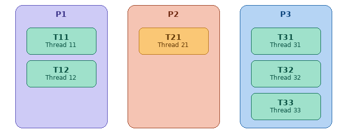

===========================
Bellek Yönetimi - I. Bölüm
===========================

Bu bölümde Linux çekirdeklerinin *bellek yönetimi (memory management)* alt sistemini inceleyeceğiz.
Bellek yönetimi modern işletim sistemlerinde oldukça karmaşık ve ayrıntılı bir konudur. Dolayısıyla
bu bölüm kitabımızda önemli bir yr kaplayacaktır. Bu nedenle biz konuyu iki bölüme ayırıp ele almayı 
uygun gördük. 

Modern işletim sistemlerinin bellek yönetimlerini ele almadan önce bazı temel konuların gözden
geçirilmesi gerekmektedir. Biz de bu birinci bölümde önce bu temel konuları gözden geçireceğiz. Ondan sonra
Linux çekirdeğinin bellek yönetimini ele alacağız.

İşlemcilerin Sayfalama Mekanizması
==================================

Linux işletim sisteminin tam olarak çalışabilmesi için ilgili işlemcinin *sayfalama (paging)* mekanizmasına sahip
olması gerekir. CPU'nun sayfalama mekanizması ve bununla ilişkili olan özellikleri barındıran kısmına mantıksal
olarak *MMU (Memory Management Unit)* de denilmektedir. *uClinux (microcontroller Linux)* isimli proje ile Linux
çekirdeğinin sayfalama mekanizmasına sahip olmayan mikrodenetleyiciler için kullanımı mümkün hale getirilmiştir.
Ancak bu durumda çekirdeğin pek çok işlevselliği devre dışı kalmaktadır. Projenin geliştirilmesi durdurulmuş gibi
gözükmektedir. Ancak Linux çekirdekleri zaman içerisinde bu projenin açtığı yol sayesinde
``CONFIG_MMU=n`` konfigürasyon parametresiyle sayfalama mekanizması devre dışı bırakılarak da derlenebilmektedir.
Fakat yukarıda da belirttiğimiz gibi bu durumda çekirdeğin sağladığı pek çok işlevsellik devre dışı
bırakılmaktadır.

Intel 80386 ile birlikte sayfalama mekanizmasına sahip olmuştur. ARM işlemcilerinin Cortex A *(Application)*
profilleri sayfalama mekanizmasına sahiptir. Diğer güçlü işlemcilerin hemen hepsinde sayfalama mekanizması
bulunmaktadır. Aşağıda sayfalama mekanizmasına sahip önemli işlemciler bir tablo biçiminde verilmektedir:

.. list-table:: Sayfalama Mekanizmasına Sahip Önemli İşlemciler
   :header-rows: 1
   :widths: 18 35 47

   * - Mimari
     - Öne Çıkan İşlemciler
     - Notlar
   * - x86 / x86-64
     - Intel 80386+, AMD64, Core, Xeon
     - 80286'da segmentasyon, 80386'da sayfalama eklendi
   * - ARM (A-profil)
     - Cortex-A5/7/8/9/15/53/55/72/76, ARM11, ARM926EJ-S
     - M-profil (Cortex-M) MMU içermez; A-profil içerir
   * - AArch64
     - Cortex-A35/A55/A72/A78, Apple M1/M2/M3, Qualcomm Snapdragon
     - ARMv8-A ve üzeri; 4 seviyeli sayfa tablosu (4K/16K/64K)
   * - MIPS
     - MIPS32/64, Loongson
     - TLB tabanlı yazılım destekli MMU (donanım page-walk yoktur)
   * - PowerPC / POWER
     - POWER8/9/10, e500, e600, Freescale MPC serisi
     - Hash tabanlı ve radix tabanlı iki farklı MMU modeli mevcuttur
   * - SPARC
     - SPARC V8, UltraSPARC T1/T2/T3, LEON3/4 (Gaisler)
     - Sun-4u MMU; Solaris ve Linux tarafından kullanılır
   * - RISC-V (G/S)
     - SiFive U54/U74, StarFive JH7110, Milk-V Pioneer
     - Sv32 (32-bit), Sv39/Sv48/Sv57 (64-bit) sayfalama şemaları
   * - LoongArch
     - Loongson 3A5000/3A6000
     - Çin yapımı; MIPS'ten türedi; Linux 5.19'dan itibaren destekli
   * - s390 / z
     - IBM z13/z14/z15/z16
     - Segment + sayfa tablosu; 5 seviyeye kadar destekler
   * - Alpha
     - DEC Alpha 21064/21164/21264
     - Tarihi; 64-bit öncü mimari; Linux 5.18'de kaldırıldı
   * - PA-RISC
     - HP PA-7000, PA-8000 serisi
     - HP-UX ve Linux (parisc) destekli
   * - Itanium (IA-64)
     - Intel Itanium 2
     - VHPT (Virtual Hash Page Table); Linux 6.7'de kaldırıldı
   * - m68k (020+)
     - Motorola 68020/30/40/60
     - 68000/08/10 MMU içermez; 68020 ve üzeri içerir

Bu tablodaki işlemcilerin hepsinde işlemci reset edildiğinde sayfalama mekanizması *kapalı (disabled)*
durumdadır. Sayfalama mekanizmasını çalışır hale getirmek genellikle işlemcinin belli bir kontrol yazmaçındaki
belli bir biti 1 yaparak sağlanmaktadır.

İşlemcilerdeki sayfalama mekanizması aynı zamanda *sanal bellek (virtual memory)* kullanımını da mümkün hale
getirmektedir. Yani sayfalama mekanizmasına sahip olmayan işlemcilerde aynı zamanda sanal bellek kullanımı da
mümkün olamamaktadır.

Sayfalama mekanizmasına sahip olan (ve bu mekanizmanın aktif edildiği) işlemcilerde makine kodlarındaki adresler
RAM'de gerçek fiziksel adres belirtmemektedir. Bu adreslere *sanal adres (virtual address)*, *doğrusal adres
(linear address)* ya da *mantıksal adres (logical address)* denilmektedir. Biz kursumuzda bu adreslere
*sanal adresler* diyeceğiz. Örneğin C'de aşağıdaki gibi bir atama işlemi yapılmış olsun:

.. code-block:: c

   x = 100;

Derleyici de bu deyimi 32 bit Intel işlemcilerinde aşağıdaki gibi makine komutlarına dönüştürmüş olsun:

.. code-block:: asm

   MOV EAX, 100
   MOV [x_addr], EAX

Burada ``x_addr`` ifadesi ``x`` değişkeninin bellekteki adresini belirtmektedir. Ancak bu adres gerçek fiziksel
adres değildir, sanal bir adrestir. İşlemci çalışırken sanal adresleri *sayfa tablosu (page table)* denilen bir
tabloya başvurarak önce gerçek fiziksel adrese dönüştürür, sonra erişimi yapar. Aynı anda çalışan iki farklı
programdaki aynı sanal adresler aynı fiziksel adresi belirtmezler (yani böyle bir zorunluluk yoktur). Çünkü
işlemci bu sanal adresleri izleyen paragraflarda açıklayacağımız gibi farklı sayfa tablolarına başvurarak farklı
fiziksel adreslere dönüştürmektedir. (Örneğin biz bir C programını derlediğimizde makine kodlarındaki tüm
adresler sanal adreslerdir. Bu programı biz birden fazla kez çalıştırdığımızda aslında çalışan programlardaki
sanal adresler aynı olsa da program çalışırken erişilen fiziksel adreslerin birbirleriyle ilgisi yoktur.)

Biz yukarıda sayfalama mekanizmasına sahip olan işlemcilerde reset işlemi yapıldığında başlangıçta sayfalama
mekanizmasının pasif durumda olduğunu belirtmiştik. Sayfalama mekanizması pasif durumdayken program içerisindeki
sanal adresler artık gerçekten fiziksel adresleri belirtmektedir. Yani bu durumda işlemci *sayfa tablosuna*
başvurarak bir dönüştürme yapmaya çalışmamaktadır. Sayfalama mekanizması Linux sistemleri boot edilirken işletim
sisteminin yükleyici kodları tarafından aktif hale getirilmektedir.

Bir sayfa belli uzunlukta ardışıl byte'tan oluşmaktadır. Sayfa büyüklükleri işlemciden işlemciye ve aynı
işlemcide onların modlarına göre değişebilmektedir. En yaygın kullanılan sayfa büyüklüğü 4K (4096 byte)'dır.
Ancak yukarıda da belirttiğimiz gibi işlemciler değişik modlarda değişik sayfa büyüklüklerini
destekleyebilmektedir. 4K sayfa büyüklüğü pek çok işlemci tarafından (ama hepsi tarafından değil)
desteklenmektedir. Bu büyüklük halen en uygun sayfa büyüklüğü olarak kabul edilmektedir. (Ancak bellek
miktarları arttıkça daha büyük sayfalar daha uygun hale gelmeye başlayabilecektir.)

32 Bit Intel işlemcileri tarafından desteklenen sayfa büyüklükleri şunlardır:

.. list-table:: 
   :header-rows: 1
   :widths: 30 50

   * - Sayfa Büyüklüğü
     - Kullanım Alanı
   * - 4 KB
     - Standart bellek yönetimi
   * - 4 MB
     - Büyük çekirdek eşlemeleri
   * - 2 MB
     - 4 GB üzeri fiziksel RAM

64 Bit Intel işlemcileri tarafından desteklenen sayfa büyüklükleri şöyledir:

.. list-table:: 
   :header-rows: 1
   :widths: 30 50

   * - Sayfa Büyüklüğü
     - Kullanım Alanı
   * - 4 KB
     - Standart bellek yönetimi
   * - 2 MB
     - Büyük çekirdek eşlemeleri, hugepages (TLB verimliliği)
   * - 1 GB
     - Büyük veri tabanları, HPC iş yükleri
   * - 4 KB / 2 MB / 1 GB
     - 57-bit sanal adres alanı, çok büyük bellek sunucuları

32 Bit ARM işlemcileri tarafından desteklenen sayfa büyüklükleri şöyledir:

.. list-table:: 
   :header-rows: 1
   :widths: 30 50

   * - Sayfa Büyüklüğü
     - Kullanım Alanı
   * - 4 KB
     - Standart bellek yönetimi, Linux varsayılan sayfası
   * - 64 KB
     - Gömülü sistemler, DMA tampon bölgeleri
   * - 1 MB
     - Çekirdek doğrudan eşleme, bootloader bellek haritası
   * - 16 MB
     - Büyük fiziksel bellek bloklarının eşlenmesi

64 Bit ARM işlemcileri tarafından desteklenen sayfa büyüklükleri ise şöyledir:

.. list-table:: 
   :header-rows: 1
   :widths: 30 50

   * - Sayfa Büyüklüğü
     - Kullanım Alanı
   * - 4 KB
     - Standart bellek yönetimi
   * - 2 MB
     - Büyük çekirdek eşlemeleri, hugepages, TLB verimliliği
   * - 1 GB
     - Büyük veri tabanları, HPC iş yükleri
   * - 16 KB
     - Apple Silicon (macOS/iOS), özel çekirdek yapılandırması
   * - 32 MB
     - Apple Silicon büyük bellek eşlemeleri
   * - 64 KB
     - Gömülü sistemler, DMA, büyük TLB entry verimliliği
   * - 512 MB
     - Büyük fiziksel bellek bloklarının eşlenmesi

Buradan da görüldüğü gibi 32 bit, 64 bit Intel ve ARM işlemcileri 4K sayfa büyüklüklerini desteklemektedir.
Linux tarafından bu işlemcilerde temel olarak 4K büyüklüğünde sayfalar kullanılmaktadır.

Son olarak yaygın tüm işlemcilerin desteklediği sayfa büyüklüklerini de aşağıdaki tabloda veriyoruz:

.. list-table:: 
   :header-rows: 1
   :widths: 20 40 

   * - İşlemci
     - Sayfa Büyüklükleri
   * - Intel IA-32 (x86)
     - 4 KB, 4 MB, 2 MB (PAE modunda)
   * - Intel/AMD x86-64
     - 4 KB, 2 MB, 1 GB
   * - ARM (AArch32)
     - 4 KB, 64 KB, 1 MB, 16 MB
   * - ARM (AArch64)
     - 4 KB, 16 KB, 64 KB, 2 MB, 32 MB, 512 MB, 1 GB
   * - RISC-V (Sv32)
     - 4 KB, 4 MB
   * - RISC-V (Sv39)
     - 4 KB, 2 MB, 1 GB
   * - RISC-V (Sv48)
     - 4 KB, 2 MB, 1 GB, 512 GB
   * - RISC-V (Sv57)
     - 4 KB, 2 MB, 1 GB, 512 GB, 256 TB
   * - PowerPC (32-bit)
     - 4 KB, 256 KB, 512 KB, 1 MB, 2 MB, 4 MB, 8 MB, 16 MB
   * - PowerPC / POWER (64-bit)
     - 4 KB, 64 KB, 16 MB, 16 GB
   * - IBM S/390 / z/Arch
     - 4 KB, 1 MB, 2 GB
   * - Alpha (AXP)
     - 8 KB, 64 KB, 512 KB, 4 MB
   * - SPARC (32-bit)
     - 4 KB, 256 KB, 16 MB
   * - SPARC64 / UltraSPARC
     - 8 KB, 64 KB, 512 KB, 4 MB, 32 MB, 256 MB, 2 GB
   * - MIPS (32-bit)
     - 4 KB, 16 KB, 64 KB, 256 KB, 1 MB, 4 MB, 16 MB, 64 MB
   * - MIPS (64-bit)
     - 4 KB, 16 KB, 64 KB, 256 KB, 1 MB, 4 MB, 16 MB, 64 MB
   * - IA-64 (Itanium)
     - 4 KB, 8 KB, 16 KB, 64 KB, 256 KB, 1 MB, 4 MB, 16 MB, 64 MB, 256 MB
   * - PA-RISC (HP)
     - 4 KB, 16 KB, 64 KB, 256 KB, 1 MB, 4 MB, 16 MB, 64 MB
   * - m68k (Motorola)
     - 4 KB
   * - OpenRISC
     - 8 KB
   * - LoongArch
     - 4 KB, 16 KB, 64 KB, 2 MB, 1 GB
   * - Xtensa
     - 4 KB, 16 KB, 64 KB, 256 KB, 1 MB, 4 MB

Biz anlatımlarımızda sayfa büyüklüğünün 4K olduğunu varsayacağız.

Sayfalama mekanizması aktif hale getirildiğinde artık işlemci fiziksel bellekteki her sayfaya 0'dan itibaren
bir sayfa numarası karşılık getirmektedir. Örneğin 32 bit Intel ya da ARM işlemcilerinde 4K'lık sayfalar
kullanıldığında fiziksel belleğin ilk 4K'lık bölgesi 0'ıncı sayfa ikinci 4K'lık bölgesi 1'inci sayfa
biçiminde numaralandırılmaktadır:

.. image:: /_static/physical-.address-space-page.png
   :alt: Fiziksel adres alanı ve sayfa numaraları tablosu
   :align: center
   :width: 40%

32 bit bir sistemde sayfa büyüklükleri 4K olduğunda toplam 2³² ÷ 2¹² = 2²⁰ = 1.048.576 = 1048576 sayfanın
bulunduğuna dikkat ediniz.

Sayfa Tabloları ve Sanal Adreslerin Fiziksel Adreslere Dönüştürülmesi
---------------------------------------------------------------------

Sayfalama mekanizması aktif hale getirildiğinde artık işlemci makine kodlarındaki adresleri *sayfa tablosu
(page table)* denilen bir tabloya bakarak fiziksel adrese dönüştürmektedir. Sayfa tablolarının organizasyonu
kademeli bir biçimdedir. Biz önce bu dönüşümün nasıl yapıldığını açıklayabilmek için sanki sayfa tablosunu
tek kademeymiş gibi ele alacağız. Sonra bu kademeli yapı hakkında bilgi vereceğiz.

32 bit bir sistemdeki sayfa tablosunun işlevini kolay anlayabilmek için onun şöyle bir yapıda olduğunu
düşünebiliriz (buradaki değerler hex sistemdedir):

.. list-table::
   :header-rows: 1
   :widths: 50 50

   * - Sanal Sayfa No
     - Fiziksel Sayfa No
   * - 00000
     - 01000
   * - 00001
     - 10401
   * - 00002
     - 11301
   * - ...
     - ...
   * - 1A400
     - 10045
   * - 1A401
     - 3F17A
   * - 1A402
     - 2417B
   * - ...
     - ...

32 bit işlemcinin program içerisindeki sanal adresi nasıl fiziksel adrese dönüştürdüğünü açıklayalım. Örneğin
işlemci aşağıdaki gibi bir makine komutuyla karşılaşmış olsun:

.. code-block:: asm

   MOV EAX, [1A4005A0]

Buradaki ``1A4005A0`` adresi sanal bir adrestir. İşlemci sayfa tablosuna başvurarak bu sanal adresi fiziksel
adrese dönüştürecektir. Bunun için işlemci önce sanal adresi sayfa büyüklüğüne (yani 4096'ya bölerek) hangi
sanal sayfaya ilişkin olduğunu belirler. Bu bölmenin ikilik (ya da 16'lık) sistemde yapılması oldukça kolaydır.
32 bitlik bir sayı 12 kere sağa ötelenirse ya da onun düşük anlamlı 12 biti atılırsa 4096'ya bölünmüş olur.
32 bitlik bir sayının sağındaki 12 bitin aynı zamanda sayının 4096'ya bölümünden elde edilen kalan değeri
olduğuna dikkat ediniz. İşte işlemci 32 bitlik sanal adresi 20 bitlik ve 12 bitlik iki kısma ayırmaktadır.
Örneğin ``1A4005A0`` sanal adresi iki kısma şöyle ayrılmaktadır:

.. code-block:: text

   1A400 5A0

Buradaki ``1A400`` değeri sanal sayfa numarasını, ``5A0`` değeri ise o sanal sayfanın başından itibaren sayfa
offset'ini belirtmektedir. İşte işlemci bu örnekte önce sayfa tablosuna başvurarak ``1A400`` sanal sayfaya
karşı gelen fiziksel sayfa numarasını, bu fiziksel sayfa numarasına da sayfa offset'ini ekleyerek gerçek
fiziksel adresi elde eder. Örneğimizdeki sayfa tablosuna göre ``1A4005A0`` sanal adres ile işlemci aslında
``100455A0`` adresine erişecektir.

Şimdi bir programın tamamının (genellikle böyle olmaz) fiziksel RAM'e yüklendiğini düşünelim. Bu durumda
prosesin sanal bellek alanı ardışıl olacaktır ancak aslında prosesin fiziksel bellekteki yerleşimi ardışıl
olmayacaktır. Örneğin program içerisinde ``malloc`` fonksiyonu ile 8K'lık bir tahsisat yapmış olalım. Bu
durumda aslında tahsis edilen alan iki sayfa uzunluğundadır. ``malloc`` bize sanal adresi vermektedir. Yani
``malloc`` fonksiyonunun verdiği sanal adresten itibaren 8K'lık alanı biz programcı olarak ardışıl bir
biçimde kullanabiliriz. Ancak arka planda aslında bu tahsis edilen alan iki sayfaya bölündüğü için fiziksel
RAM'de ardışıl olmak zorunda değildir. Aynı durum programın makine kodlarının bulunduğu bölümler için de
yerel değişkenlerin tutulduğu stack için de geçerlidir.

Peki işlemci sayfa tablosunun yerini nasıl bilmektedir? İşte işlemcilerde özel bir yazmaç sayfa tablosunun
yerini göstermektedir. Örneğin Intel işlemcilerinde ``CR3`` yazmacı sayfa tablosunun fiziksel adresini
gösterir. Yani Intel işlemcilerinde işlemci her zaman sayfa tablosuna ``CR3`` yazmacının gösterdiği yerden
erişmektedir. ARM işlemcileri de benzer biçimde sayfa tablosuna ``TTBR0_EL1`` ve ``TTBR1_EL1`` yazmaçlarının
gösterdiği yerden erişmektedir. Tabii sayfa tablolarını oluşturan ve bu yazmaca sayfa tablolarının başlangıç
adresini yerleştiren işletim sistemidir.

Sayfalama mekanizmasını kullanan işletim sistemlerinde her proses için (thread için değil) ayrı bir sayfa
tablosu oluşturulmaktadır. İşletim sistemi *thread'ler arası geçiş (context switch)* oluştuğunda eğer
çalışmasına ara verilen thread'le geçilen thread farklı proseslere ilişkinse sayfa tablosunun yerini gösteren
yazmacı (Intel işlemcilerindeki ``CR3`` yazmacı) değiştirerek yeni geçilen thread'in artık kendi prosesine
ilişkin sayfa tablosunu göstermesini sağlamaktadır. Örneğin sistemde o anda P1, P2 ve P3 olmak üzere üç
proses çalışıyor olsun. Bu durumda işletim sistemi bu üç proses için üç farklı sayfa tablosu oluşturacaktır.
Bu üç prosesin thread'leri de aşağıdaki gibi olsun:

Eğer şu anda ``T11`` thread'i çalışıyorsa işlemcinin ilgili yazmacı (Intel'deki ``CR3`` yazmacı) P1
prosesinin sayfa tablosunu gösteriyor durumdadır. Thread'ler arası geçiş oluşup ``T12`` thread'i çalışmaya
başlayınca ``T12`` thread'i de P1 prosesinin bir thread'i olduğu için kullanılan sayfa tablosu (yani
Intel'deki ``CR3`` yazmacı) değiştirilmez. Ancak ``T12`` thread'inden ``T21`` thread'ine geçilirken işletim
sistemi işlemcinin ilgili yazmacını değiştirerek işlemcinin artık P2 prosesinin sayfa tablosunu göstermesini
sağlamaktadır.

Page Fault Mekanizması
----------------------

Sayfa tablosundaki her sanal sayfa için bir fiziksel sayfa karşı düşürülmüş müdür? Yanıt hayırdır. Aslında işletim
sistemi bir program yüklendiğinde o programın hepsini fiziksel belleğe yüklemez. Yalnızca bazı kısımlarını fiziksel
belleğe yükler. Yani programlar onların tamamı değil küçük bir kısmı fiziksel RAM'e yüklenerek çalışmaya başlamaktadır.
İşte işletim sistemi de o prosesin sayfa tablosunu oluştururken yalnızca programın fiziksel RAM'e yüklenen sayfalarını
sayfa tablosunda eşleştirmektedir. Prosesin diğer sanal sayfalarını fiziksel RAM'le eşleştirmemektedir. Bunun nasıl
yapıldığını izleyen paragraflarda göreceğiz. Örneğin bir proses yüklendiğinde onun sayfa tablosu aşağıdaki gibi
olabilir:

.. list-table:: Örnek Sayfa Tablosu
   :header-rows: 1
   :widths: 50 50

   * - Sanal Sayfa No
     - Fiziksel Sayfa No
   * - 00000
     - \-
   * - 00001
     - \-
   * - 00002
     - \-
   * - ...
     - ...
   * - 1A400
     - 10045
   * - 1A401
     - \-
   * - 1A402
     - 2417B
   * - 1A403
     - \-
   * - ...
     - ...

Burada ``-`` olan girişler sanal sayfanın fiziksel sayfaya eşleştirilmediğini belirtmektedir. Örneğin ``1A400`` sanal
sayfası fiziksel sayfaya eşleştirilmiştir, ancak ``1A401`` sanal sayfası fiziksel sayfaya eşleştirilmemiştir. Peki
işlemci kod ya da data bakımından fiziksel sayfaya eşleştirme yapılmamış bir sayfa tablosu girişiyle karşılaştığında
ne olacaktır? İşlemciler fiziksel sayfa eşleştirmesi yapılmamış sayfa tablosu girişleriyle karşılaştığında bir içsel
kesme oluşturmaktadır. Bu içsel kesmelere genel olarak *page fault* denilmektedir. Bu kesme oluştuğunda işlemci
çalıştırdığı koda ara vererek işletim sistemi tarafından yerleştirilmiş kesme kodunu (*page fault handler*)
çalıştırmaktadır. Böylece fiziksel sayfa eşleştirmesi yapılmamış sayfalara erişim işletim sisteminin yerleştirdiği
kodun çalıştırılmasına yol açmaktadır. Peki işletim sistemi bu kesme kodunda (*page fault handler*) ne yapmaktadır?
İşte bu noktada sayfalama mekanizmasının en önemli faydası olan *sanal bellek (virtual memory)* kavramı devreye
girmektedir. İzleyen paragraflarda sanal belleğin anlama geldiğini ve sayfalama mekanizmasının buradaki rolünü ele
alacağız.

Sayfa tablolarında sanal sayfa numarasının ayrı tutulmasına gerek yoktur. Yalnızca fiziksel sayfa numaralarının
tutulması yeterlidir. Girişlerin uzunlukları belli olduğuna göre işlemci sayfa tablosunun n'inci elemanına kolaylıkla
erişebilmektedir.

Sanal Bellek Mekanizması
========================

Fiziksel sayfa eşleştirmesi yapılmamış bir sayfaya erişimde işlemcilerin bir içsel kesme (*page fault*) oluşturduğunu
ve bu içsel kesmede işletim sisteminin devreye girerek kesme kodunun otomatik çalıştırıldığını belirtmiştik. İşletim
sisteminin bu kesme kodunun (*page fault handler*) yaptığı işlemlerin ayrıntıları vardır. Ancak biz burada önce kabaca
nelerin yapıldığını açıklayacağız:

**1)** İşletim sistemi önce kesmeye (*fault*'a) yol açan sanal adresi inceler. Eğer bu sanal adres program içerisindeki
geçerli bir adres değilse prosesi cezalandırarak sonlandırır. Örneğin biz tahsis etmediğimiz bir bellek alanına
erişmek istediğimizde programımız böyle sonlandırılmaktadır. (UNIX/Linux sistemlerinde işletim sistemi bu durumda
proses üzerinde ``SIGSEGV`` isimli bir sinyal oluşturmaktadır. Bu sinyal programcı tarafından işlenebilir. Ancak
akış programcının sinyal için set ettiği fonksiyondan çıktığında sinyal yeniden tetiklenmektedir. Yani programcı
bu sinyali işledikten sonra programını kendisi sonlandırmalıdır.)

**2)** Eğer kesmeye yol açan adres program içerisinde geçerli bir adresse işletim sistemi programın o kısmına ilişkin
sayfayı fiziksel belleğe yüklemeye çalışır. Eğer fiziksel bellekte boş bir sayfa bulursa yüklemeyi bulduğu o sayfaya
yapar. Biz yukarıda sayfa tablosunu basit bir biçimde soyutladık. Gerçekte sayfa tabloları çok kademeli bir biçimde
organize edilmektedir. Kesmeye yol açan adresin geçerli olduğunu varsayalım. Bu adresin bulunduğu kısım program
dosyasının içinde olmayabilir. (Örneğin ``malloc`` fonksiyonu ile dinamik bellek tahsisatı yapılmış olabilir ve
tahsis edilen alana ulaşılmak istenmiş olabilir.) İşte işletim sistemleri aynı zamanda disk üzerinde *swap alanları
(swap space)* kullanmaktadır. Yani erişilmek istenen geçerli adrese ilişkin program parçası çalıştırılabilir dosyada
olabileceği gibi diskteki bu swap alanlarında da bulunuyor olabilir. Linux sistemlerinde swap alanları ayrı bir disk
bölümü biçiminde ya da bir dosya biçiminde oluşturulabilmektedir.

İşletim sistemi diskteki programa ilişkin kısmı fiziksel belleğe yükledikten sonra sayfa tablosunu artık düzeltir.
Böylece kesmeye yol açan makine komutuna ilişkin sanal sayfa artık bir fiziksel sayfayla ilişkilendirilmiş olur.
Bu tür kesmelerin (bu tür kesmelere *fault* da denilmektedir) kesme kodlarından çıkıldığında işlemci akışı kesmeye
yol açan komutun kendisinden devam ettirmektedir. Ancak artık fiziksel sayfa eşleştirmesi yapılmış olduğundan yeniden
kesme oluşmayacaktır. Görüldüğü gibi işletim sistemi başlangıçta tüm programı yüklememekte, talep oluştuğunda
programın ilgili kısmını fiziksel belleğe yüklemektedir. Bu davranışa işletim sistemleri dünyasında İngilizce
*demand paging* de denilmektedir.

**3)** Peki geçerli bir adres için *page fault* kesmesi oluştuğunda fiziksel bellek tıka basa doluysa bu durumda ne
olacaktır? İşte bu durumda bazı süreçler devreye girmektedir. Linux'ta bu sürecin ayrıntıları vardır. Ancak tipik
olarak işletim sistemi bu tür durumlarda "son zamanlarda en az kullanılan sayfaları fiziksel bellekten atıp" yerine
erişilmek istenen sayfaları diskten fiziksel belleğe yüklemektedir.

İşletim sistemleri terminolojisinde diskteki bir sayfanın fiziksel belleğe yüklenmesine İngilizce *swap-in*, fiziksel
bellekteki bir sayfanın diske geri yazılmasına *swap-out*, bu sürece de genel olarak *swapping* denilmektedir.

.. image:: /_static/swap-diagram.png
   :alt: Fiziksel RAM ile Swap Alanı arasındaki swap-in ve swap-out işlemleri
   :align: center

Yukarıda maddelerle açıkladığımız mekanizmaya işletim sistemlerinde *sanal bellek (virtual memory)* denilmektedir.
Sanal bellek "programların hepsinin değil, belirli kısımlarının fiziksel belleğe yüklenerek disk ile fiziksel bellek
arasında yer değiştirmeli bir biçimde çalıştırılması" anlamına gelmektedir. Linux gibi, Windows gibi, macOS gibi işletim
sistemleri sanal bellek mekanizmasına sahiptir. Sanal bellek sayesinde fiziksel RAM'in çok ötesinde çok sayıda
programın birlikte çalışması sağlanabilmektedir.

Proseslerin Bellek Alanlarının Sayfa Tabloları Yoluyla İzole Edilmesi
=====================================================================

Sayfalama ve sanal bellek mekanizmaları sayesinde prosesler arasında tam bir bellek izolasyonu sağlanabilmektedir.
Yani bu mekanizma sayesinde bir proses istese bile diğer bir prosesin bellek alanına erişememektedir. Örneğin P1
prosesinin sayfa tablosu aşağıdaki gibi olsun:

.. list-table:: P1 Prosesinin Sayfa Tablosu
   :header-rows: 1
   :widths: 50 50

   * - Sanal Sayfa No
     - Fiziksel Sayfa No
   * - 00000
     - \-
   * - 00001
     - \-
   * - 00002
     - \-
   * - ...
     - ...
   * - 1A400
     - 10045
   * - 1A401
     - \-
   * - 1A402
     - 2417B
   * - 1A403
     - 281BC
   * - ...
     - ...

P2 prosesinin de sayfa tablosu şöyle olsun:

.. list-table:: P2 Prosesinin Sayfa Tablosu
   :header-rows: 1
   :widths: 50 50

   * - Sanal Sayfa No
     - Fiziksel Sayfa No
   * - 00000
     - \-
   * - 00001
     - \-
   * - 00002
     - \-
   * - ...
     - ...
   * - 1A400
     - 4A1C2
   * - 1A401
     - 2116C
   * - 1A402
     - 23170
   * - 1A403
     - 4621A
   * - ...
     - ...

Sayfa tablolarını işletim sisteminin oluşturduğunu anımsayınız. İşletim sistemi proseslerin fiziksel sayfa numaralarını
özel bazı durumlar dışında zaten çakıştırmaz. Bu durumda bir proses asla diğerinin fiziksel bellekteki alanına erişemez.
Her proses ayrı fiziksel sayfaları kullanmaktadır. *Page fault* oluştuğunda *swap-in* işlemi sırasında işletim sistemi
hiçbir proses tarafından kullanılmayan bir fiziksel sayfayı tahsis etmektedir.

Pek çok işletim sisteminde (ve tabii Linux sistemlerinde de) prosesleri haberleştirmek için *paylaşılan bellek alanları
(shared memory)* denilen bir yöntem grubu da kullanılmaktadır. Paylaşılan bellek alanları yönteminde iki proses (daha
fazla da olabilir) farklı sanal adresleri kullanarak aynı fiziksel sayfaya erişebilmektedir. Böylece birinin bir sanal
adres yoluyla o fiziksel sayfaya yazdığını diğeri başka bir sanal adres yoluyla o fiziksel sayfadan okuyabilmektedir.
Örneğin 32 bit bir sistemde P1 ve P2 proseslerinin sayfa tabloları şöyle olsun:

.. image:: /_static/shared-memory-page-tables.png
   :alt: P1 ve P2 proseslerinin paylaşılan fiziksel sayfayı farklı sanal adreslerle eşleştirmesi
   :align: center

Burada P1 prosesinin sayfa tablosundaki ``28A00`` sanal sayfa numarasının P2 prosesinin sayfa tablosundaki ``32B00``
sanal sayfa numarası ile fiziksel bellek bağlamında çakıştırıldığını görüyorsunuz. Tabii işletim sistemi böyle bir
çakıştırmayı iki prosesin isteği doğrultusunda yapmaktadır. Bu durumda P1 prosesi ``[28A00000]-[28A00FFF]`` arasındaki
sanal adres aralığını, P2 prosesi de ``[32B00000]-[32B00FFF]`` sanal adres alanını kullanarak aynı fiziksel sayfaya
erişebilmektedir.

Sayfa Tablolarının İçeriğine İlişkin Ayrıntılar
===============================================

Biz yukarıdaki çizimlerde sayfa tablosu girişlerinde yalnızca fiziksel sayfa numarasının bulunduğunu ima ettik.
Ancak aslında durum böyle değildir. Sayfa tablosu girişleri yalnızca fiziksel sayfa numarasını değil aynı zamanda
o fiziksel sayfaya ilişkin ek birtakım bilgileri de tutmaktadır. Örneğin 32 bit Intel işlemcilerindeki 4K'lık sayfa
tablosu girişlerinin (*Page Table Entry*) formatı şöyledir:

.. code-block:: none

   ┌─────────────────────────┬─────────┬───┬────┬───┬───┬────┬────┬─────┬─────┬───┐
   │        31 .. 12         │ 11 .. 9 │ 8 │  7 │ 6 │ 5 │  4 │  3 │  2  │  1  │ 0 │
   ├─────────────────────────┼─────────┼───┼────┼───┼───┼────┼────┼─────┼─────┼───┤
   │ Physical Page No (20 b) │IGN (3b) │ G │ PS │ D │ A │ CD │ WT │ U/S │ R/W │ P │
   └─────────────────────────┴─────────┴───┴────┴───┴───┴────┴────┴─────┴─────┴───┘

.. list-table:: Alan Açıklamaları
   :header-rows: 1
   :widths: 20 80

   * - Alan
     - Açıklama
   * - Bit 31..12 (PPN)
     - Fiziksel sayfa adresi — ``PPN << 12 | offset`` = fiziksel adres
   * - Bit 11..9 (IGN)
     - CPU tarafından yok sayılır; işletim sistemi serbest kullanabilir
   * - Bit 8 (G)
     - *Global* — CR3 değişiminde TLB'den silinmez (çekirdek sayfaları)
   * - Bit 7 (PS)
     - *Page Size* — PTE'de daima 0; PDE'de 1 ise 4 MB büyük sayfa
   * - Bit 6 (D)
     - *Dirty* — CPU, sayfaya yazma yapılınca otomatik set eder
   * - Bit 5 (A)
     - *Accessed* — CPU, sayfaya erişilince otomatik set eder
   * - Bit 4 (CD)
     - *Cache Disable* — 1 ise bu sayfa için önbellek devre dışı
   * - Bit 3 (WT)
     - *Write-Through* — 1: write-through, 0: write-back
   * - Bit 2 (U/S)
     - *User/Supervisor* — 0: yalnızca çekirdek (ring 0), 1: kullanıcı modundan erişebilir
   * - Bit 1 (R/W)
     - *Read/Write* — 0: salt okunur, 1: okuma + yazma
   * - Bit 0 (P)
     - *Present* — 0: page fault, 1: sayfa fiziksel bellekte mevcut

Görüldüğü gibi sayfa tablosunun bir elemanı (yani bir sayfa girişi) 4 byte uzunluktadır. Bu 4 byte'ın yüksek anlamlı
20 biti ([31-12] bitleri) fiziksel sayfa numarasını tutmaktadır. Ancak kalan 12 bitte o sayfaya ilişkin başka bilgiler
vardır. 3 bitlik IGN alanı kullanılmamaktadır. Sayfa tablosu da aşağıdaki gibi dörder byte'lık girişlerden oluşmaktadır:

.. list-table::
   :widths: 70 30

   * - 0 Numaralı Sayfa Tablosu Girişi
     - 4 Byte
   * - 1 Numaralı Sayfa Tablosu Girişi
     - 4 Byte
   * - 2 Numaralı Sayfa Tablosu Girişi
     - 4 Byte
   * - ...
     -
   * - Son Sayfa Tablosu Girişi
     - 4 Byte

Sayfa tablosu girişlerini şöyle de temsil edebiliriz:

.. list-table::
   :widths: 50 50

   * - Fiziksel Adres
     - Sayfa Özellikleri
   * - Fiziksel Adres
     - Sayfa Özellikleri
   * - Fiziksel Adres
     - Sayfa Özellikleri
   * - ...
     - ...
   * - Fiziksel Adres
     - Sayfa Özellikleri

32 bit Intel işlemcilerindeki 4K'lık sayfaların sayfa özelliklerinin bazılarını açıklamak istiyoruz.

- Sanal sayfa için fiziksel sayfanın eşleştirilmiş olup olmadığı ``P`` biti ile belirlenmektedir. Bu ``P`` biti 0 ise
  eşleştirme yapılmamıştır, yani işlemci bu sayfaya erişmek istediğinde *page fault* oluşur. Bu ``P`` biti 1 ise işlemci
  yüksek anlamlı 20 bit ile belirtilen fiziksel sayfadan erişimini yapar.

- ``R/W`` biti sayfanın *read-only* olup olmadığını belirtmektedir. Eğer bu bit 0 ise sayfa *read-only* durumdadır.
  Sayfaya yazma yapıldığında *page fault* oluşur. Örneğin C derleyicileri genellikle string ifadelerini ve global
  ``const`` nesneleri ELF formatının ``.const`` bölümüne yerleştirmektedir. İşletim sisteminin yükleyicisi de (yani
  ``exec`` fonksiyonları) bu ``.const`` bölüm için *read-only* sayfalar oluşturmaktadır. Böylece buraya yazma
  yapıldığında program çökmektedir. (Derleyiciler yerel ``const`` nesneleri ``.const`` bölümüne yerleştiremez. Yerel
  değişkenlerin hepsi stack'tedir. Stack sayfaları da *read-only* yapılamamaktadır.)

- Sayfa girişindeki ``U/S`` biti sayfanın kullanıcı modunda mı çekirdek modunda mı olduğunu belirtmektedir. Eğer bu
  bit 0 ise sayfa çekirdek modundadır. Çekirdek modundaki sayfaya kullanıcı modundaki prosesler erişmeye çalışırsa
  *page fault* oluşmaktadır. Çekirdek kendi kodlarını ``U/S`` biti 0 olan sayfalara yerleştirmektedir. Böylece çekirdek
  kendini kullanıcı modundaki proseslere karşı korumaktadır. Eğer ``U/S`` biti 1 ise sayfa kullanıcı modundadır.
  Kullanıcı modundaki sayfalara hem kullanıcı modundaki prosesler hem de çekirdek modundaki prosesler erişebilmektedir.

- Sayfa girişinde ``D`` (*Dirty*) biti işlemci tarafından sayfaya her yazma yapıldığında set edilmektedir. Böylece
  işletim sistemi bu biti sıfırlayıp daha sonra bu bite baktığında sayfaya yazma yapılıp yapılmadığını anlayabilmektedir.
  ``D`` biti sanal bellek mekanizmasında önemli bir işleve sahiptir. İşletim sistemi *swap-in* işlemini yaptığında
  (yani diskteki bir sayfayı fiziksel belleğe çektiğinde) ilgili sayfaya ilişkin sayfa girişinin ``D`` bitini de 0
  yapmaktadır. Daha sonra işletim sisteminin bu sayfayı *swap-out* yapmak için fiziksel bellekten atmak istediğini
  düşünelim. Eğer bu sayfaya hiç yazma yapılmadıysa yani ``D`` biti hala 0 ise bu sayfanın *swap-out* sırasında diske
  geri yazılmasına gerek kalmaz. Ancak bu sayfanın ``D`` biti 1 ise sayfada değişiklik yapıldığı için sayfanın diskteki
  swap alanına geri yazılması gerekir.

- Sayfa girişindeki ``A`` (*Accessed*) biti sayfadan her okuma ve yazma yapıldığında set edilmektedir. Bu bitten
  işletim sistemleri sanal bellek mekanizmasında istatistik yapmak için faydalanmaktadır. İşletim sistemi bu biti belli
  periyotlarda kontrol edip sıfırlar. Eğer bu bit çok sayıda set edildiyse bu sayfaya erişim son zamanlarda çok
  yapılmıştır. Bu sayfanın *swap-out* amaçlı fiziksel bellekten çıkartılması uygun değildir.

- Sayfa girişlerinde CPU'nun önbellek mekanizmasıyla ilgili çeşitli bitler de bulunmaktadır. ``CD`` (*Cache Disable*)
  biti işletim sistemi tarafından 1 yapılırsa CPU bu fiziksel sayfayı önbellek mekanizmasının dışında bırakır. Yani
  bu fiziksel sayfaya yapılan yazma ve okumalar doğrudan önbelleğe uğramadan gerçekleştirilir. ``WT`` (*Write-Through*)
  biti ilgili sayfa içeriğinin CPU önbelleğini *write-through* biçimde kullanıp kullanmayacağını belirtmektedir. Eğer
  bu bit 1 yapılırsa bu sayfayla ilgili yazma işleminde CPU'nun önbelleği kullanılmaz, yazma doğrudan fiziksel belleğe
  yapılır; okuma işlemlerinde ise CPU'nun önbelleğine başvurulmaktadır. Tabii bu bit ``CD`` biti 1 ise işlev
  görmemektedir. Bu iki biti birlikte şöyle de ele alabiliriz:

.. list-table:: CD ve WT Bitlerinin Önbellek Davranışına Etkisi
   :header-rows: 1
   :widths: 10 10 80

   * - CD
     - WT
     - Önbellek Davranışı
   * - 0
     - 0
     - *Write-back* — normal RAM sayfaları
   * - 0
     - 1
     - *Write-through* — yazma önbellekten geçer ama doğrudan RAM'e de iletilir
   * - 1
     - 0
     - Önbellek tamamen devre dışı (MMIO)
   * - 1
     - 1
     - Önbellek tamamen devre dışı (WT biti CD=1 durumunda anlamsız)

- Sayfa girişindeki ``G`` (*Global*) biti ilgili sayfa girişinin izleyen paragraflarda ele alacağımız gibi
  *TLB (Translation Lookaside Buffer)* içerisinde kalmasını sağlamaktadır.

Çok Kademeli Sayfa Tabloları
----------------------------

Biz yukarıda 32 bit Intel işlemcilerindeki 4K'lık sayfa girişlerinin formatını ele aldık. Bu format işlemciden işlemciye
hatta aynı işlemcide sayfa büyüklüklerine bağlı olarak da değişebilmektedir. Bizim burada 32 bit Intel işlemcilerinin
4K'lık sayfa girişlerini incelememizin nedeni aslında buradaki formatın benzerlerinin kullanılmasındandır. Yani ARM
işlemcilerinde de ana hatlarıyla organizasyon buna benzer biçimdedir. Sayfa özellikleri de buradakine benzemektedir.
Tabii hangi işlemcinin hangi modunda çalışıyorsanız sayfa girişlerinin gerçek formatını ona göre yeniden incelemelisiniz.

Biz yukarıda sayfa tablolarını tek kademeli bir biçimde resmettik. Aslında sayfa tabloları tek kademeli değildir.
Önce sayfa tablolarının neden çok kademeli olduğunu açıklayalım. Daha sonra da mekanizmanın ayrıntılarına değinelim.

4K sayfa kullanan 32 bit bir sistem söz konusu olsun. Sayfa büyüklüğünün de 4K olduğunu varsayalım. Her sayfa tablosu
girişi de 4 byte olsun. Bu durumda sayfa tabloları 2²⁰ × 2² = 2²² = 4MB büyüklüğünde olurdu. Her proses için ayrı
sayfa tabloları oluşturulduğunu anımsayınız. Bu durumda işletim sistemi her proses için fiziksel RAM'de 4MB büyüklüğünde
ayrı sayfa tabloları oluştururdu. Proseslerin sayfa tablolarının aslında pek çok yeri boştur. Ancak o boş yerlere
erişildiğinde *page fault* oluşması için o boş yerlere ilişkin sayfaların da ``P`` bitinin 0 yapılması gerekmektedir.
İşte çok kademeli sayfa tabloları hem bu sorunu hem de sayfa tablolarının fiziksel bellekteki ardışıl olma zorunluluğunu
ortadan kaldırmaktadır.

Şimdi çok kademeli sayfa tablolarının organizasyonunu 32 bit Intel işlemcileri üzerinde örneklendirerek açıklayalım.
Çok kademeli sayfa tablolarında sanal adres ikiden fazla parçaya ayrılmaktadır. Örneğin 4K sayfa kullanan 32 bit Intel
işlemcileri iki kademeli sayfa tablolarına sahiptir ve bu işlemcilerde sanal adresler üç parçaya ayrılmaktadır:

.. code-block:: none

   ┌─────────────────────────────────────────────────────────────────────┐
   │              32-bit Intel — 2 Kademeli Sayfa Tablosu                │
   ├───────────────────────┬───────────────────────┬─────────────────────┤
   │    Page Directory     │      Page Table       │    Page Offset      │
   │        (PGD)          │        (PTE)          │                     │
   ├───────────────────────┼───────────────────────┼─────────────────────┤
   │  31              22   │  21              12   │  11               0 │
   ├───────────────────────┼───────────────────────┼─────────────────────┤
   │        10 bit         │        10 bit         │       12 bit        │
   └───────────────────────┴───────────────────────┴─────────────────────┘
   ◄──────────────────────────── 32 bit ───────────────────────────────►

Görüldüğü gibi 4K sayfa kullanan 32 bit Intel işlemcilerinde sanal adres üç kısma ayrılmaktadır: 10 bitlik
*PGD (Page Directory)* alanı, 10 bitlik *PTE (Page Table Entry)* alanı ve 12 bitlik *Page Offset* alanı. Bu
sistemlerde *sayfa dizini (page directory)* denilen bir tablo bulunmaktadır. Bu tablonun da her elemanı 4 byte
uzunluktadır. Dolayısıyla sayfa dizini tablosu toplamda 2¹⁰ × 2² = 2¹² = 4K yer kaplamaktadır. Sayfa dizininin
her girişi bir sayfa tablosunun fiziksel adresini göstermektedir. Yani sayfa tabloları bir tane değil aslında
1024 tanedir. Sayfa tabloları yukarıda da belirttiğimiz gibi sayfa tablosu girişlerinden oluşmaktadır. Bir sayfa
tablosu girişi 4 byte olduğu için sayfa tablolarının uzunlukları da 2¹⁰ × 2² = 2¹² = 4K'dır. Nihayet sanal
adresin *sayfa offset'i (page offset)* alanı o fiziksel sayfada gerçek fiziksel adresin yerini belirtmektedir.
32 bit Intel işlemcilerinde sayfa dizinindeki girişler sayfa tablolarının fiziksel bellekteki yerini, sayfa
tablosundaki girişler de sayfaların fiziksel bellekteki yerini göstermektedir. Sayfa dizininin yeri ise işlemci
içerisindeki ``CR3`` yazmacı tarafından gösterilmektedir.

4K sayfa kullanan 32 bit Intel işlemcilerinde 4 byte'lık sayfa dizin girişlerinin formatı şöyledir:

.. code-block:: none

   ┌──────────────────────────────────────┬─────┬──┬──┬────┬──┬───┬─────┬─────┬─────┬─────┬───┐
   │   Page Table Base Address [31:12]    │ AVL │  │  │ PS │  │ A │ PCD │ PWT │ U/S │ R/W │ P │
   │              (20 bit)                │     │  │  │    │  │   │     │     │     │     │   │
   └──────────────────────────────────────┴─────┴──┴──┴────┴──┴───┴─────┴─────┴─────┴─────┴───┘
    31                                  12  11 9  8  7   6  5   4    3    2    1    0

Buradaki yüksek anlamlı 20 bit sayfa tablosunun fiziksel bellekteki adresini belirtmektedir. (Tabii sayfa tabloları
4K olduğu için 20 bitin son 12 bitinin 0 olduğu kabul edilmektedir.) Diğer bitlerin anlamları şöyledir:

.. list-table:: Sayfa Dizini Giriş Alanları
   :header-rows: 1
   :widths: 12 20 68

   * - Bit(ler)
     - Alan
     - Açıklama
   * - 31–12
     - Page Table Base Addr.
     - Alt sayfa tablosunun fiziksel taban adresi. 4 KB hizalı olduğundan alt 12 bit sıfırdır,
       yalnızca üst 20 bit saklanır.
   * - 11–9
     - AVL
     - *Available* — işletim sistemi tarafından serbestçe kullanılabilir, donanım bu bitleri yok sayar.
   * - 8
     - —
     - Ayrılmış, 0 olmalı.
   * - 7
     - PS
     - *Page Size* — 0 ise alt tablo 4 KB sayfaları gösterir; 1 ise (PSE etkinse) bu giriş doğrudan
       4 MB'lık büyük sayfayı gösterir.
   * - 6
     - —
     - Ayrılmış, 0 olmalı.
   * - 5
     - A
     - *Accessed* — MMU bu girişe erişildiğinde 1 yapar; işletim sistemi LRU takibi için kullanır.
   * - 4
     - PCD
     - *Page Cache Disable* — 1 ise bu tablonun işaret ettiği sayfa önbelleklenmez.
   * - 3
     - PWT
     - *Page Write-Through* — 1 ise write-through önbellek politikası uygulanır.
   * - 2
     - U/S
     - *User/Supervisor* — 0 ise yalnızca kernel (CPL 0–2) erişebilir; 1 ise kullanıcı alanı da
       (CPL 3) erişebilir.
   * - 1
     - R/W
     - *Read/Write* — 0 ise sayfa salt okunur; 1 ise yazılabilir.
   * - 0
     - P
     - *Present* — 0 ise giriş geçersizdir ve MMU sayfa hatası (#PF) üretir; 1 ise geçerlidir.
       Linux, P=0 girişlerde swap bilgisi saklar.

Sayfa dizini girişlerinin formatının yukarıda ele almış olduğumuz sayfa tablosu girişi formatına oldukça benzediğine
dikkat ediniz. Sayfa dizini girişlerinin yine en düşük anlamlı biti ``P`` bitidir. Eğer bu bit 0 ise daha sayfa
tablosuna erişim yapılmadan *page fault* oluşmaktadır. Yani işletim sisteminin o giriş için sayfa tablosu
oluşturmasına gerek kalmamaktadır. Böylece sanal adres alanını az kullanan programların sayfa tabloları bellekte
çok daha az yer kaplar duruma gelmektedir. Benzer biçimde sayfa dizininin ``R/W`` biti de sayfa tablosu girişinde
olduğu gibi sayfanın *read-only* olup olmadığını belirtmektedir.

Sayfa dizininin her bir girişinin sanal adres alanında 4 MB'lik bir alanı belirttiğine dikkat ediniz.
2¹⁰ × 2¹² = 4M'dir.

Bu durumda 4K sayfa kullanan 32 bit Intel işlemcisi sanal adresi fiziksel adrese şöyle dönüştürmektedir. Örneğin
dönüştürülecek sanal adres ``1F3243A4`` olsun. Bu adresi bitlerine ayrıştıralım:

.. code-block:: none

   0001 1111 0011 0010 0100 0011 1010 0100

1. İşlemci önce sayfa dizininin yerini ``CR3`` yazmacı yoluyla elde eder.

2. Sanal adresin yüksek anlamlı 10 bitini bu tabloya indeks yaparak sayfa dizininin ilgili elemanına erişir.
   Örneğimizdeki sanal adresin yüksek anlamlı 10 biti ``0001111100`` biçimindedir. Bu değer onluk sistemde
   124'tür. O halde işlemci sayfa dizininin 124'üncü elemanına erişir. Sayfa dizininin 124'üncü elemanında
   1024 girişlik bir sayfa tablosu bulunacaktır. İşlemci bu sayfa tablosuna erişir.

3. İşlemci sanal adresin ikinci 10 bitini indeks yaparak eriştiği sayfa tablosunun ilgili girişini okur.
   Örneğimizde sanal adresin ikinci 10 bitlik kısmı ``1100100100`` biçimindedir. Bu da onluk sistemde 804
   değerine karşılık gelmektedir. İşte işlemci sayfa tablosunun 804'üncü girişine erişerek oradan sayfanın
   fiziksel adresini elde eder.

4. Nihayet işlemci elde ettiği fiziksel sayfa adresine sanal adresin düşük anlamlı 12 bitini toplayarak gerçek
   fiziksel adrese erişir. Örneğimizde sayfa offset'ini belirten 12 bit ``001110100100`` biçimindedir. Bu değer
   de onluk sistemde 932'dir.

Biz yukarıda 4K sayfa kullanan 32 bit Intel işlemcileri üzerinde örnek verdik. Sayfa büyüklükleri değiştiğinde
sanal adres dönüştürmesinin formatı da değişmektedir. Örneğin 4 MB'lık büyük sayfalar söz konusu olduğunda 32
bit Intel işlemcileri sanal adresi 2 kısma ayırmaktadır:

.. code-block:: none

   ┌──────────────────────┬────────────────────────────────────────┐
   │   Page Directory     │           Page Offset                  │
   │       Index          │                                        │
   ├──────────────────────┼────────────────────────────────────────┤
   │  31               22 │  21                                  0 │
   ├──────────────────────┼────────────────────────────────────────┤
   │        10 bit        │               22 bit                   │
   └──────────────────────┴────────────────────────────────────────┘
   ◄──────────────────────── 32 bit ──────────────────────────────►

Burada artık tek kademeli bir dönüştürmenin olduğuna dikkat ediniz. Bu durumda işlemci yüksek anlamlı 10 bitten
sayfa dizininin indeksini elde edip sayfa dizininin o indeksine başvurarak 4 MB'lik sayfanın yerini tespit
etmektedir. Artık sanal adresin düşük anlamlı 22 bitinin (4 MB) sayfa offset'i belirttiğine dikkat ediniz.
32 bit Intel işlemcilerinde 4K'lık sayfalarla 4 MB'lik sayfalar bir arada kullanılabilmektedir. Sayfa dizini
girişlerinin sanal bellekte 4 MB'lik alan belirttiğini anımsayınız. Bu durumda bir sayfa dizini girişi 4 MB'lik
büyük sayfaya da ilişkin olabilir 4K'lık küçük sayfaya da ilişkin olabilir. Sayfa dizini girişlerindeki ``PS``
biti 0 ise bu giriş 4K'lık sayfa tablosunu gösteriyor durumdadır, ``PS`` biti 1 ise bu giriş 4 MB'lik fiziksel
sayfayı gösteriyor durumdadır. Linux işletim sistemi de 4K sayfaların dışında 4 MB'lik sayfaları da
desteklemektedir.