====================================================
Bellek Yönetimi - I. Bölüm :raw-html:`<br>` Temeller
====================================================

Bu bölümde Linux çekirdeklerinin *bellek yönetimi (memory management)* alt sistemini inceleyeceğiz.
Bellek yönetimi modern işletim sistemlerinde oldukça karmaşık ve ayrıntılı bir konudur. Dolayısıyla
bu bölüm kitabımızda önemli bir yr kaplayacaktır. Bu nedenle biz konuyu iki bölüme ayırıp ele almayı 
uygun gördük. 

Modern işletim sistemlerinin bellek yönetimlerini ele almadan önce bazı temel konuların gözden
geçirilmesi gerekmektedir. Biz de bu birinci bölümde önce bu temel konuları gözden geçireceğiz. Ondan sonra
Linux çekirdeğinin bellek yönetimini ele alacağız.

İşlemcilerin Sayfalama Mekanizması
==================================

Linux işletim sisteminin tam olarak çalışabilmesi için ilgili işlemcinin *sayfalama (paging)* mekanizmasına sahip
olması gerekir. CPU'nun sayfalama mekanizması ve bununla ilişkili olan özellikleri barındıran kısmına mantıksal
olarak *MMU (Memory Management Unit)* de denilmektedir. *uClinux (microcontroller Linux)* isimli proje ile Linux
çekirdeğinin sayfalama mekanizmasına sahip olmayan mikrodenetleyiciler için kullanımı mümkün hale getirilmiştir.
Ancak bu durumda çekirdeğin pek çok işlevselliği devre dışı kalmaktadır. Projenin geliştirilmesi durdurulmuş gibi
gözükmektedir. Ancak Linux çekirdekleri zaman içerisinde bu projenin açtığı yol sayesinde
``CONFIG_MMU=n`` konfigürasyon parametresiyle sayfalama mekanizması devre dışı bırakılarak da derlenebilmektedir.
Fakat yukarıda da belirttiğimiz gibi bu durumda çekirdeğin sağladığı pek çok işlevsellik devre dışı
bırakılmaktadır.

Intel 80386 ile birlikte sayfalama mekanizmasına sahip olmuştur. ARM işlemcilerinin Cortex A *(Application)*
profilleri sayfalama mekanizmasına sahiptir. Diğer güçlü işlemcilerin hemen hepsinde sayfalama mekanizması
bulunmaktadır. Aşağıda sayfalama mekanizmasına sahip önemli işlemciler bir tablo biçiminde verilmektedir:

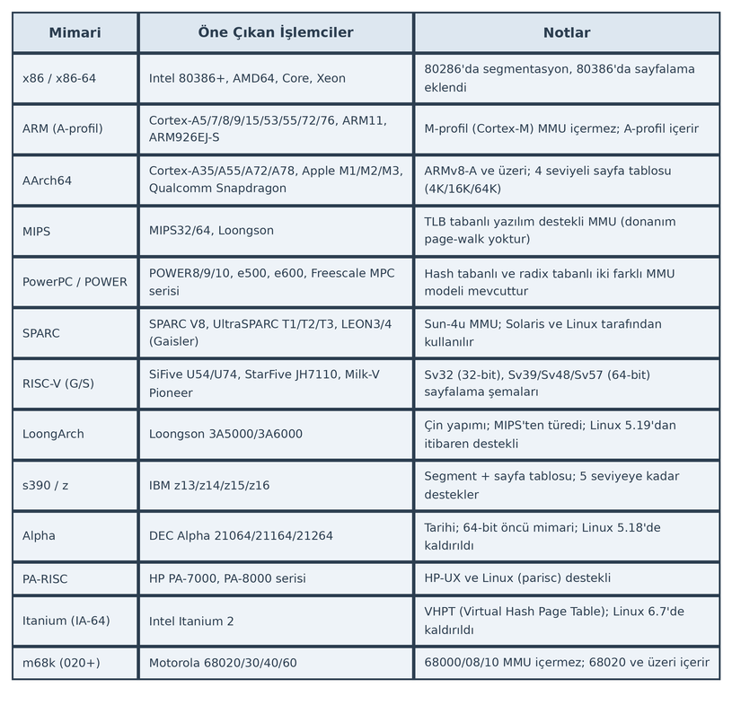

Bu tablodaki işlemcilerin hepsinde işlemci reset edildiğinde sayfalama mekanizması *kapalı (disabled)*
durumdadır. Sayfalama mekanizmasını çalışır hale getirmek genellikle işlemcinin belli bir kontrol yazmaçındaki
belli bir biti 1 yaparak sağlanmaktadır.

İşlemcilerdeki sayfalama mekanizması aynı zamanda *sanal bellek (virtual memory)* kullanımını da mümkün hale
getirmektedir. Yani sayfalama mekanizmasına sahip olmayan işlemcilerde aynı zamanda sanal bellek kullanımı da
mümkün olamamaktadır.

Sayfalama mekanizmasına sahip olan (ve bu mekanizmanın aktif edildiği) işlemcilerde makine kodlarındaki adresler
RAM'de gerçek fiziksel adres belirtmemektedir. Bu adreslere *sanal adres (virtual address)*, *doğrusal adres
(linear address)* ya da *mantıksal adres (logical address)* denilmektedir. Biz kursumuzda bu adreslere
*sanal adresler* diyeceğiz. Örneğin C'de aşağıdaki gibi bir atama işlemi yapılmış olsun:

.. code-block:: c

   x = 100;

Derleyici de bu deyimi 32 bit Intel işlemcilerinde aşağıdaki gibi makine komutlarına dönüştürmüş olsun:

.. code-block:: asm

   MOV EAX, 100
   MOV [x_addr], EAX

Burada ``x_addr`` ifadesi ``x`` değişkeninin bellekteki adresini belirtmektedir. Ancak bu adres gerçek fiziksel
adres değildir, sanal bir adrestir. İşlemci çalışırken sanal adresleri *sayfa tablosu (page table)* denilen bir
tabloya başvurarak önce gerçek fiziksel adrese dönüştürür, sonra erişimi yapar. Aynı anda çalışan iki farklı
programdaki aynı sanal adresler aynı fiziksel adresi belirtmezler (yani böyle bir zorunluluk yoktur). Çünkü
işlemci bu sanal adresleri izleyen paragraflarda açıklayacağımız gibi farklı sayfa tablolarına başvurarak farklı
fiziksel adreslere dönüştürmektedir. (Örneğin biz bir C programını derlediğimizde makine kodlarındaki tüm
adresler sanal adreslerdir. Bu programı biz birden fazla kez çalıştırdığımızda aslında çalışan programlardaki
sanal adresler aynı olsa da program çalışırken erişilen fiziksel adreslerin birbirleriyle ilgisi yoktur.)

Biz yukarıda sayfalama mekanizmasına sahip olan işlemcilerde reset işlemi yapıldığında başlangıçta sayfalama
mekanizmasının pasif durumda olduğunu belirtmiştik. Sayfalama mekanizması pasif durumdayken program içerisindeki
sanal adresler artık gerçekten fiziksel adresleri belirtmektedir. Yani bu durumda işlemci *sayfa tablosuna*
başvurarak bir dönüştürme yapmaya çalışmamaktadır. Sayfalama mekanizması Linux sistemleri boot edilirken işletim
sisteminin yükleyici kodları tarafından aktif hale getirilmektedir.

Bir sayfa belli uzunlukta ardışıl byte'tan oluşmaktadır. Sayfa büyüklükleri işlemciden işlemciye ve aynı
işlemcide onların modlarına göre değişebilmektedir. En yaygın kullanılan sayfa büyüklüğü 4K (4096 byte)'dır.
Ancak yukarıda da belirttiğimiz gibi işlemciler değişik modlarda değişik sayfa büyüklüklerini
destekleyebilmektedir. 4K sayfa büyüklüğü pek çok işlemci tarafından (ama hepsi tarafından değil)
desteklenmektedir. Bu büyüklük halen en uygun sayfa büyüklüğü olarak kabul edilmektedir. (Ancak bellek
miktarları arttıkça daha büyük sayfalar daha uygun hale gelmeye başlayabilecektir.)

32 Bit Intel işlemcileri tarafından desteklenen sayfa büyüklükleri şunlardır:

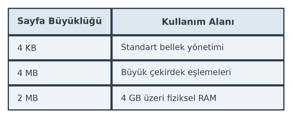

64 Bit Intel işlemcileri tarafından desteklenen sayfa büyüklükleri şöyledir:

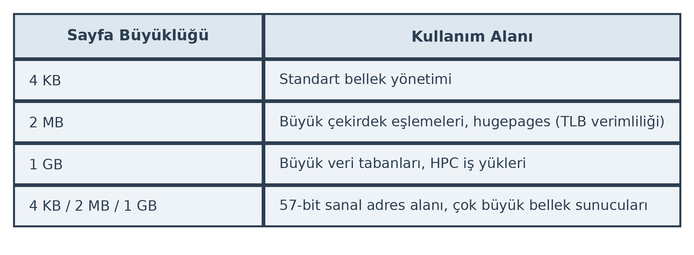

32 Bit ARM işlemcileri tarafından desteklenen sayfa büyüklükleri şöyledir:

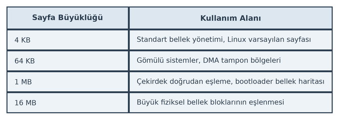

64 Bit ARM işlemcileri tarafından desteklenen sayfa büyüklükleri ise şöyledir:

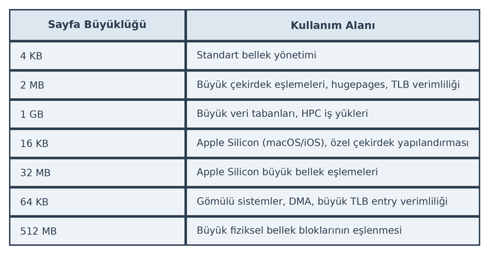

Buradan da görüldüğü gibi 32 bit, 64 bit Intel ve ARM işlemcileri 4K sayfa büyüklüklerini desteklemektedir.
Linux tarafından bu işlemcilerde temel olarak 4K büyüklüğünde sayfalar kullanılmaktadır.

Son olarak yaygın tüm işlemcilerin desteklediği sayfa büyüklüklerini de aşağıdaki tabloda veriyoruz:

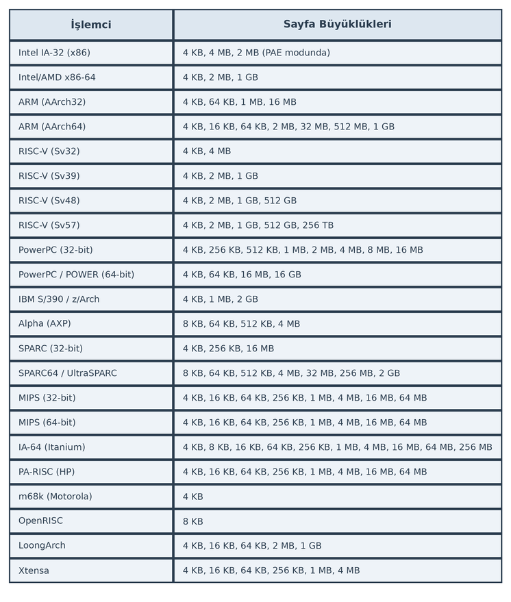

Biz anlatımlarımızda sayfa büyüklüğünün 4K olduğunu varsayacağız.

Sayfalama mekanizması aktif hale getirildiğinde artık işlemci fiziksel bellekteki her sayfaya 0'dan itibaren
bir sayfa numarası karşılık getirmektedir. Örneğin 32 bit Intel ya da ARM işlemcilerinde 4K'lık sayfalar
kullanıldığında fiziksel belleğin ilk 4K'lık bölgesi 0'ıncı sayfa ikinci 4K'lık bölgesi 1'inci sayfa
biçiminde numaralandırılmaktadır:

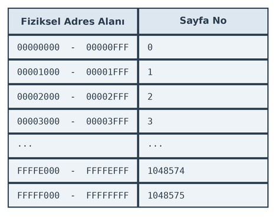

32 bit bir sistemde sayfa büyüklükleri 4K olduğunda toplam 2³² ÷ 2¹² = 2²⁰ = 1.048.576 = 1048576 sayfanın
bulunduğuna dikkat ediniz.

Sayfa Tabloları ve Sanal Adreslerin Fiziksel Adreslere Dönüştürülmesi
=====================================================================

Sayfalama mekanizması aktif hale getirildiğinde artık işlemci makine kodlarındaki adresleri *sayfa tablosu
(page table)* denilen bir tabloya bakarak fiziksel adrese dönüştürmektedir. Sayfa tablolarının organizasyonu
kademeli bir biçimdedir. Biz önce bu dönüşümün nasıl yapıldığını açıklayabilmek için sanki sayfa tablosunu
tek kademeymiş gibi ele alacağız. Sonra bu kademeli yapı hakkında bilgi vereceğiz.

32 bit bir sistemdeki sayfa tablosunun işlevini kolay anlayabilmek için onun şöyle bir yapıda olduğunu
düşünebiliriz (buradaki değerler hex sistemdedir):

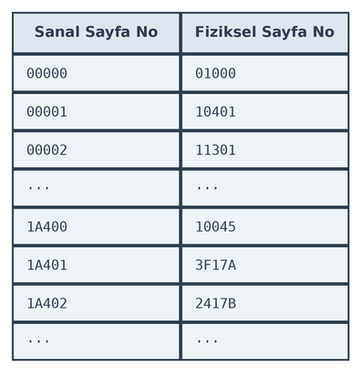

32 bit işlemcinin program içerisindeki sanal adresi nasıl fiziksel adrese dönüştürdüğünü açıklayalım. Örneğin
işlemci aşağıdaki gibi bir makine komutuyla karşılaşmış olsun:

.. code-block:: asm

   MOV EAX, [1A4005A0]

Buradaki ``1A4005A0`` adresi sanal bir adrestir. İşlemci sayfa tablosuna başvurarak bu sanal adresi fiziksel
adrese dönüştürecektir. Bunun için işlemci önce sanal adresi sayfa büyüklüğüne (yani 4096'ya bölerek) hangi
sanal sayfaya ilişkin olduğunu belirler. Bu bölmenin ikilik (ya da 16'lık) sistemde yapılması oldukça kolaydır.
32 bitlik bir sayı 12 kere sağa ötelenirse ya da onun düşük anlamlı 12 biti atılırsa 4096'ya bölünmüş olur.
32 bitlik bir sayının sağındaki 12 bitin aynı zamanda sayının 4096'ya bölümünden elde edilen kalan değeri
olduğuna dikkat ediniz. İşte işlemci 32 bitlik sanal adresi 20 bitlik ve 12 bitlik iki kısma ayırmaktadır.
Örneğin ``1A4005A0`` sanal adresi iki kısma şöyle ayrılmaktadır:

.. code-block:: text

   1A400 5A0

Buradaki ``1A400`` değeri sanal sayfa numarasını, ``5A0`` değeri ise o sanal sayfanın başından itibaren sayfa
offset'ini belirtmektedir. İşte işlemci bu örnekte önce sayfa tablosuna başvurarak ``1A400`` sanal sayfaya
karşı gelen fiziksel sayfa numarasını, bu fiziksel sayfa numarasına da sayfa offset'ini ekleyerek gerçek
fiziksel adresi elde eder. Örneğimizdeki sayfa tablosuna göre ``1A4005A0`` sanal adres ile işlemci aslında
``100455A0`` adresine erişecektir.

Şimdi bir programın tamamının (genellikle böyle olmaz) fiziksel RAM'e yüklendiğini düşünelim. Bu durumda
prosesin sanal bellek alanı ardışıl olacaktır ancak aslında prosesin fiziksel bellekteki yerleşimi ardışıl
olmayacaktır. Örneğin program içerisinde ``malloc`` fonksiyonu ile 8K'lık bir tahsisat yapmış olalım. Bu
durumda aslında tahsis edilen alan iki sayfa uzunluğundadır. ``malloc`` bize sanal adresi vermektedir. Yani
``malloc`` fonksiyonunun verdiği sanal adresten itibaren 8K'lık alanı biz programcı olarak ardışıl bir
biçimde kullanabiliriz. Ancak arka planda aslında bu tahsis edilen alan iki sayfaya bölündüğü için fiziksel
RAM'de ardışıl olmak zorunda değildir. Aynı durum programın makine kodlarının bulunduğu bölümler için de
yerel değişkenlerin tutulduğu stack için de geçerlidir.

Peki işlemci sayfa tablosunun yerini nasıl bilmektedir? İşte işlemcilerde özel bir yazmaç sayfa tablosunun
yerini göstermektedir. Örneğin Intel işlemcilerinde ``CR3`` yazmacı sayfa tablosunun fiziksel adresini
gösterir. Yani Intel işlemcilerinde işlemci her zaman sayfa tablosuna ``CR3`` yazmacının gösterdiği yerden
erişmektedir. ARM işlemcileri de benzer biçimde sayfa tablosuna ``TTBR0_EL1`` ve ``TTBR1_EL1`` yazmaçlarının
gösterdiği yerden erişmektedir. Tabii sayfa tablolarını oluşturan ve bu yazmaca sayfa tablolarının başlangıç
adresini yerleştiren işletim sistemidir.

Sayfalama mekanizmasını kullanan işletim sistemlerinde her proses için (thread için değil) ayrı bir sayfa
tablosu oluşturulmaktadır. İşletim sistemi *thread'ler arası geçiş (context switch)* oluştuğunda eğer
çalışmasına ara verilen thread'le geçilen thread farklı proseslere ilişkinse sayfa tablosunun yerini gösteren
yazmacı (Intel işlemcilerindeki ``CR3`` yazmacı) değiştirerek yeni geçilen thread'in artık kendi prosesine
ilişkin sayfa tablosunu göstermesini sağlamaktadır. Örneğin sistemde o anda P1, P2 ve P3 olmak üzere üç
proses çalışıyor olsun. Bu durumda işletim sistemi bu üç proses için üç farklı sayfa tablosu oluşturacaktır.
Bu üç prosesin thread'leri de aşağıdaki gibi olsun:

.. image:: _static/proses-thread-diagram.png
   :alt: Proses ve Thread Hiyerarşisi
   :align: center
   :width: 70%

Eğer şu anda ``T11`` thread'i çalışıyorsa işlemcinin ilgili yazmacı (Intel'deki ``CR3`` yazmacı) P1
prosesinin sayfa tablosunu gösteriyor durumdadır. Thread'ler arası geçiş oluşup ``T12`` thread'i çalışmaya
başlayınca ``T12`` thread'i de P1 prosesinin bir thread'i olduğu için kullanılan sayfa tablosu (yani
Intel'deki ``CR3`` yazmacı) değiştirilmez. Ancak ``T12`` thread'inden ``T21`` thread'ine geçilirken işletim
sistemi işlemcinin ilgili yazmacını değiştirerek işlemcinin artık P2 prosesinin sayfa tablosunu göstermesini
sağlamaktadır.

Page Fault Mekanizması
----------------------

Sayfa tablosundaki her sanal sayfa için bir fiziksel sayfa karşı düşürülmüş müdür? Yanıt hayırdır. Aslında işletim
sistemi bir program yüklendiğinde o programın hepsini fiziksel belleğe yüklemez. Yalnızca bazı kısımlarını fiziksel
belleğe yükler. Yani programlar onların tamamı değil küçük bir kısmı fiziksel RAM'e yüklenerek çalışmaya başlamaktadır.
İşte işletim sistemi de o prosesin sayfa tablosunu oluştururken yalnızca programın fiziksel RAM'e yüklenen sayfalarını
sayfa tablosunda eşleştirmektedir. Prosesin diğer sanal sayfalarını fiziksel RAM'le eşleştirmemektedir. Bunun nasıl
yapıldığını izleyen paragraflarda göreceğiz. Örneğin bir proses yüklendiğinde onun sayfa tablosu aşağıdaki gibi
olabilir:

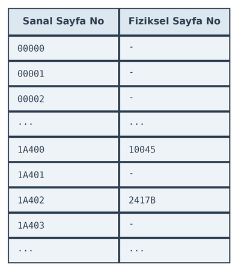

Burada ``-`` olan girişler sanal sayfanın fiziksel sayfaya eşleştirilmediğini belirtmektedir. Örneğin ``1A400`` sanal
sayfası fiziksel sayfaya eşleştirilmiştir, ancak ``1A401`` sanal sayfası fiziksel sayfaya eşleştirilmemiştir. Peki
işlemci kod ya da data bakımından fiziksel sayfaya eşleştirme yapılmamış bir sayfa tablosu girişiyle karşılaştığında
ne olacaktır? İşlemciler fiziksel sayfa eşleştirmesi yapılmamış sayfa tablosu girişleriyle karşılaştığında bir içsel
kesme oluşturmaktadır. Bu içsel kesmelere genel olarak *page fault* denilmektedir. Bu kesme oluştuğunda işlemci
çalıştırdığı koda ara vererek işletim sistemi tarafından yerleştirilmiş kesme kodunu (*page fault handler*)
çalıştırmaktadır. Böylece fiziksel sayfa eşleştirmesi yapılmamış sayfalara erişim işletim sisteminin yerleştirdiği
kodun çalıştırılmasına yol açmaktadır. Peki işletim sistemi bu kesme kodunda (*page fault handler*) ne yapmaktadır?
İşte bu noktada sayfalama mekanizmasının en önemli faydası olan *sanal bellek (virtual memory)* kavramı devreye
girmektedir. İzleyen paragraflarda sanal belleğin anlama geldiğini ve sayfalama mekanizmasının buradaki rolünü ele
alacağız.

Sayfa tablolarında sanal sayfa numarasının ayrı tutulmasına gerek yoktur. Yalnızca fiziksel sayfa numaralarının
tutulması yeterlidir. Girişlerin uzunlukları belli olduğuna göre işlemci sayfa tablosunun n'inci elemanına kolaylıkla
erişebilmektedir.

Sanal Bellek Mekanizması
========================

Fiziksel sayfa eşleştirmesi yapılmamış bir sayfaya erişimde işlemcilerin bir içsel kesme (*page fault*) oluşturduğunu
ve bu içsel kesmede işletim sisteminin devreye girerek kesme kodunun otomatik çalıştırıldığını belirtmiştik. İşletim
sisteminin bu kesme kodunun (*page fault handler*) yaptığı işlemlerin ayrıntıları vardır. Ancak biz burada önce kabaca
nelerin yapıldığını açıklayacağız:

**1)** İşletim sistemi önce kesmeye (*fault*'a) yol açan sanal adresi inceler. Eğer bu sanal adres program içerisindeki
geçerli bir adres değilse prosesi cezalandırarak sonlandırır. Örneğin biz tahsis etmediğimiz bir bellek alanına
erişmek istediğimizde programımız böyle sonlandırılmaktadır. (UNIX/Linux sistemlerinde işletim sistemi bu durumda
proses üzerinde ``SIGSEGV`` isimli bir sinyal oluşturmaktadır. Bu sinyal programcı tarafından işlenebilir. Ancak
akış programcının sinyal için set ettiği fonksiyondan çıktığında sinyal yeniden tetiklenmektedir. Yani programcı
bu sinyali işledikten sonra programını kendisi sonlandırmalıdır.)

**2)** Eğer kesmeye yol açan adres program içerisinde geçerli bir adresse işletim sistemi programın o kısmına ilişkin
sayfayı fiziksel belleğe yüklemeye çalışır. Eğer fiziksel bellekte boş bir sayfa bulursa yüklemeyi bulduğu o sayfaya
yapar. Biz yukarıda sayfa tablosunu basit bir biçimde soyutladık. Gerçekte sayfa tabloları çok kademeli bir biçimde
organize edilmektedir. Kesmeye yol açan adresin geçerli olduğunu varsayalım. Bu adresin bulunduğu kısım program
dosyasının içinde olmayabilir. (Örneğin ``malloc`` fonksiyonu ile dinamik bellek tahsisatı yapılmış olabilir ve
tahsis edilen alana ulaşılmak istenmiş olabilir.) İşte işletim sistemleri aynı zamanda disk üzerinde *swap alanları
(swap space)* kullanmaktadır. Yani erişilmek istenen geçerli adrese ilişkin program parçası çalıştırılabilir dosyada
olabileceği gibi diskteki bu swap alanlarında da bulunuyor olabilir. Linux sistemlerinde swap alanları ayrı bir disk
bölümü biçiminde ya da bir dosya biçiminde oluşturulabilmektedir.

İşletim sistemi diskteki programa ilişkin kısmı fiziksel belleğe yükledikten sonra sayfa tablosunu artık düzeltir.
Böylece kesmeye yol açan makine komutuna ilişkin sanal sayfa artık bir fiziksel sayfayla ilişkilendirilmiş olur.
Bu tür kesmelerin (bu tür kesmelere *fault* da denilmektedir) kesme kodlarından çıkıldığında işlemci akışı kesmeye
yol açan komutun kendisinden devam ettirmektedir. Ancak artık fiziksel sayfa eşleştirmesi yapılmış olduğundan yeniden
kesme oluşmayacaktır. Görüldüğü gibi işletim sistemi başlangıçta tüm programı yüklememekte, talep oluştuğunda
programın ilgili kısmını fiziksel belleğe yüklemektedir. Bu davranışa işletim sistemleri dünyasında İngilizce
*demand paging* de denilmektedir.

**3)** Peki geçerli bir adres için *page fault* kesmesi oluştuğunda fiziksel bellek tıka basa doluysa bu durumda ne
olacaktır? İşte bu durumda bazı süreçler devreye girmektedir. Linux'ta bu sürecin ayrıntıları vardır. Ancak tipik
olarak işletim sistemi bu tür durumlarda "son zamanlarda en az kullanılan sayfaları fiziksel bellekten atıp" yerine
erişilmek istenen sayfaları diskten fiziksel belleğe yüklemektedir.

İşletim sistemleri terminolojisinde diskteki bir sayfanın fiziksel belleğe yüklenmesine İngilizce *swap-in*, fiziksel
bellekteki bir sayfanın diske geri yazılmasına *swap-out*, bu sürece de genel olarak *swapping* denilmektedir.

.. image:: /_static/swap-diagram.png
   :alt: Fiziksel RAM ile Swap Alanı arasındaki swap-in ve swap-out işlemleri
   :align: center

Yukarıda maddelerle açıkladığımız mekanizmaya işletim sistemlerinde *sanal bellek (virtual memory)* denilmektedir.
Sanal bellek "programların hepsinin değil, belirli kısımlarının fiziksel belleğe yüklenerek disk ile fiziksel bellek
arasında yer değiştirmeli bir biçimde çalıştırılması" anlamına gelmektedir. Linux gibi, Windows gibi, macOS gibi işletim
sistemleri sanal bellek mekanizmasına sahiptir. Sanal bellek sayesinde fiziksel RAM'in çok ötesinde çok sayıda
programın birlikte çalışması sağlanabilmektedir.

Proseslerin Bellek Alanlarının Sayfa Tabloları Yoluyla İzole Edilmesi
=====================================================================

Sayfalama ve sanal bellek mekanizmaları sayesinde prosesler arasında tam bir bellek izolasyonu sağlanabilmektedir.
Yani bu mekanizma sayesinde bir proses istese bile diğer bir prosesin bellek alanına erişememektedir. Örneğin P1
prosesinin sayfa tablosu aşağıdaki gibi olsun:

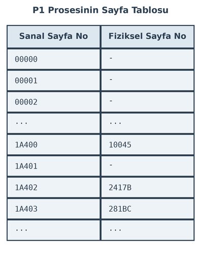

P2 prosesinin de sayfa tablosu şöyle olsun:

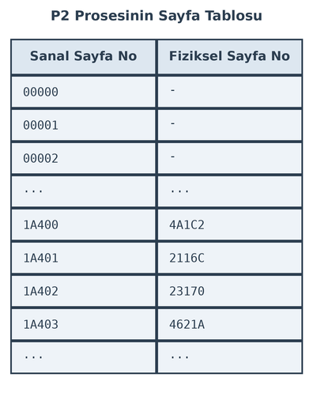

Sayfa tablolarını işletim sisteminin oluşturduğunu anımsayınız. İşletim sistemi proseslerin fiziksel sayfa numaralarını
özel bazı durumlar dışında zaten çakıştırmaz. Bu durumda bir proses asla diğerinin fiziksel bellekteki alanına erişemez.
Her proses ayrı fiziksel sayfaları kullanmaktadır. *Page fault* oluştuğunda *swap-in* işlemi sırasında işletim sistemi
hiçbir proses tarafından kullanılmayan bir fiziksel sayfayı tahsis etmektedir.

Pek çok işletim sisteminde (ve tabii Linux sistemlerinde de) prosesleri haberleştirmek için *paylaşılan bellek alanları
(shared memory)* denilen bir yöntem grubu da kullanılmaktadır. Paylaşılan bellek alanları yönteminde iki proses (daha
fazla da olabilir) farklı sanal adresleri kullanarak aynı fiziksel sayfaya erişebilmektedir. Böylece birinin bir sanal
adres yoluyla o fiziksel sayfaya yazdığını diğeri başka bir sanal adres yoluyla o fiziksel sayfadan okuyabilmektedir.
Örneğin 32 bit bir sistemde P1 ve P2 proseslerinin sayfa tabloları şöyle olsun:

.. image:: /_static/shared-memory-page-tables.png
   :alt: P1 ve P2 proseslerinin paylaşılan fiziksel sayfayı farklı sanal adreslerle eşleştirmesi
   :align: center
   :width: 70%

Burada P1 prosesinin sayfa tablosundaki ``28A00`` sanal sayfa numarasının P2 prosesinin sayfa tablosundaki ``32B00``
sanal sayfa numarası ile fiziksel bellek bağlamında çakıştırıldığını görüyorsunuz. Tabii işletim sistemi böyle bir
çakıştırmayı iki prosesin isteği doğrultusunda yapmaktadır. Bu durumda P1 prosesi ``[28A00000]-[28A00FFF]`` arasındaki
sanal adres aralığını, P2 prosesi de ``[32B00000]-[32B00FFF]`` sanal adres alanını kullanarak aynı fiziksel sayfaya
erişebilmektedir.

Sayfa Tablolarının İçeriğine İlişkin Ayrıntılar
===============================================

Biz yukarıdaki çizimlerde sayfa tablosu girişlerinde yalnızca fiziksel sayfa numarasının bulunduğunu ima ettik.
Ancak aslında durum böyle değildir. Sayfa tablosu girişleri yalnızca fiziksel sayfa numarasını değil aynı zamanda
o fiziksel sayfaya ilişkin ek birtakım bilgileri de tutmaktadır. Örneğin 32 bit Intel işlemcilerindeki 4K'lık *sayfa
tablosu girişlerinin (page table entry)* formatı şöyledir:

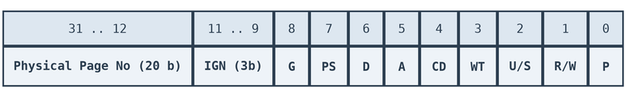

Buradaki alanların anlamları da şöyledir:

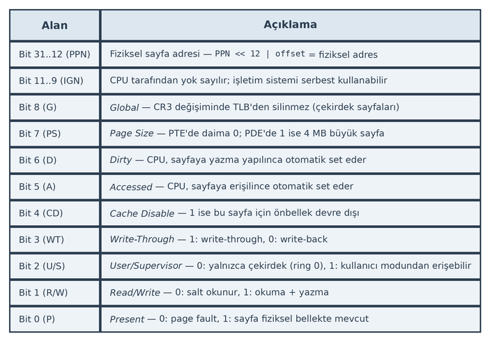

Görüldüğü gibi sayfa tablosunun bir elemanı (yani bir sayfa girişi) 4 byte uzunluktadır. Bu 4 byte'ın yüksek anlamlı
20 biti ([31-12] bitleri) fiziksel sayfa numarasını tutmaktadır. Ancak kalan 12 bitte o sayfaya ilişkin başka bilgiler
vardır. 3 bitlik IGN alanı kullanılmamaktadır. Sayfa tablosu da aşağıdaki gibi dörder byte'lık girişlerden oluşmaktadır:

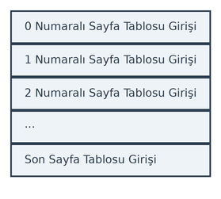

Sayfa tablosu girişlerini şöyle de temsil edebiliriz:

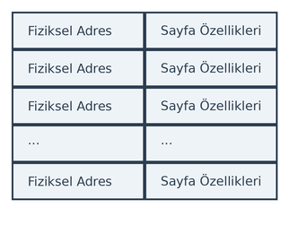

32 bit Intel işlemcilerindeki 4K'lık sayfaların sayfa özelliklerinin bazılarını açıklamak istiyoruz.

- Sanal sayfa için fiziksel sayfanın eşleştirilmiş olup olmadığı ``P`` biti ile belirlenmektedir. Bu ``P`` biti 0 ise
  eşleştirme yapılmamıştır, yani işlemci bu sayfaya erişmek istediğinde *page fault* oluşur. Bu ``P`` biti 1 ise işlemci
  yüksek anlamlı 20 bit ile belirtilen fiziksel sayfadan erişimini yapar.

- ``R/W`` biti sayfanın *read-only* olup olmadığını belirtmektedir. Eğer bu bit 0 ise sayfa *read-only* durumdadır.
  Sayfaya yazma yapıldığında *page fault* oluşur. Örneğin C derleyicileri genellikle string ifadelerini ve global
  ``const`` nesneleri ELF formatının ``.const`` bölümüne yerleştirmektedir. İşletim sisteminin yükleyicisi de (yani
  ``exec`` fonksiyonları) bu ``.const`` bölüm için *read-only* sayfalar oluşturmaktadır. Böylece buraya yazma
  yapıldığında program çökmektedir. (Derleyiciler yerel ``const`` nesneleri ``.const`` bölümüne yerleştiremez. Yerel
  değişkenlerin hepsi stack'tedir. Stack sayfaları da *read-only* yapılamamaktadır.)

- Sayfa girişindeki ``U/S`` biti sayfanın kullanıcı modunda mı çekirdek modunda mı olduğunu belirtmektedir. Eğer bu
  bit 0 ise sayfa çekirdek modundadır. Çekirdek modundaki sayfaya kullanıcı modundaki prosesler erişmeye çalışırsa
  *page fault* oluşmaktadır. Çekirdek kendi kodlarını ``U/S`` biti 0 olan sayfalara yerleştirmektedir. Böylece çekirdek
  kendini kullanıcı modundaki proseslere karşı korumaktadır. Eğer ``U/S`` biti 1 ise sayfa kullanıcı modundadır.
  Kullanıcı modundaki sayfalara hem kullanıcı modundaki prosesler hem de çekirdek modundaki prosesler erişebilmektedir.

- Sayfa girişinde ``D`` (*Dirty*) biti işlemci tarafından sayfaya her yazma yapıldığında set edilmektedir. Böylece
  işletim sistemi bu biti sıfırlayıp daha sonra bu bite baktığında sayfaya yazma yapılıp yapılmadığını anlayabilmektedir.
  ``D`` biti sanal bellek mekanizmasında önemli bir işleve sahiptir. İşletim sistemi *swap-in* işlemini yaptığında
  (yani diskteki bir sayfayı fiziksel belleğe çektiğinde) ilgili sayfaya ilişkin sayfa girişinin ``D`` bitini de 0
  yapmaktadır. Daha sonra işletim sisteminin bu sayfayı *swap-out* yapmak için fiziksel bellekten atmak istediğini
  düşünelim. Eğer bu sayfaya hiç yazma yapılmadıysa yani ``D`` biti hala 0 ise bu sayfanın *swap-out* sırasında diske
  geri yazılmasına gerek kalmaz. Ancak bu sayfanın ``D`` biti 1 ise sayfada değişiklik yapıldığı için sayfanın diskteki
  swap alanına geri yazılması gerekir.

- Sayfa girişindeki ``A`` (*Accessed*) biti sayfadan her okuma ve yazma yapıldığında set edilmektedir. Bu bitten
  işletim sistemleri sanal bellek mekanizmasında istatistik yapmak için faydalanmaktadır. İşletim sistemi bu biti belli
  periyotlarda kontrol edip sıfırlar. Eğer bu bit çok sayıda set edildiyse bu sayfaya erişim son zamanlarda çok
  yapılmıştır. Bu sayfanın *swap-out* amaçlı fiziksel bellekten çıkartılması uygun değildir.

- Sayfa girişlerinde CPU'nun önbellek mekanizmasıyla ilgili çeşitli bitler de bulunmaktadır. ``CD`` (*Cache Disable*)
  biti işletim sistemi tarafından 1 yapılırsa CPU bu fiziksel sayfayı önbellek mekanizmasının dışında bırakır. Yani
  bu fiziksel sayfaya yapılan yazma ve okumalar doğrudan önbelleğe uğramadan gerçekleştirilir. ``WT`` (*Write-Through*)
  biti ilgili sayfa içeriğinin CPU önbelleğini *write-through* biçimde kullanıp kullanmayacağını belirtmektedir. Eğer
  bu bit 1 yapılırsa bu sayfayla ilgili yazma işleminde CPU'nun önbelleği kullanılmaz, yazma doğrudan fiziksel belleğe
  yapılır; okuma işlemlerinde ise CPU'nun önbelleğine başvurulmaktadır. Tabii bu bit ``CD`` biti 1 ise işlev
  görmemektedir. Bu iki biti birlikte şöyle de ele alabiliriz:

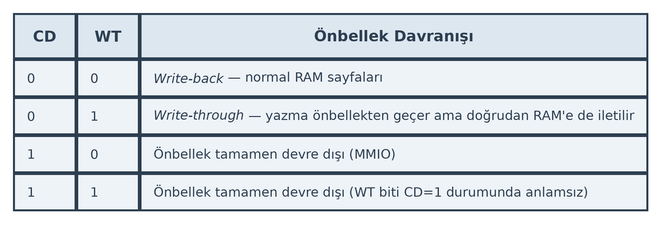

- Sayfa girişindeki ``G`` (*Global*) biti ilgili sayfa girişinin izleyen paragraflarda ele alacağımız gibi
  *TLB (Translation Lookaside Buffer)* içerisinde kalmasını sağlamaktadır.

Çok Kademeli Sayfa Tabloları
----------------------------

Biz yukarıda 32 bit Intel işlemcilerindeki 4K'lık sayfa girişlerinin formatını ele aldık. Bu format işlemciden işlemciye
hatta aynı işlemcide sayfa büyüklüklerine bağlı olarak da değişebilmektedir. Bizim burada 32 bit Intel işlemcilerinin
4K'lık sayfa girişlerini incelememizin nedeni aslında buradaki formatın benzerlerinin kullanılmasındandır. Yani ARM
işlemcilerinde de ana hatlarıyla organizasyon buna benzer biçimdedir. Sayfa özellikleri de buradakine benzemektedir.
Tabii hangi işlemcinin hangi modunda çalışıyorsanız sayfa girişlerinin gerçek formatını ona göre yeniden incelemelisiniz.

Biz yukarıda sayfa tablolarını tek kademeli bir biçimde resmettik. Aslında sayfa tabloları tek kademeli değildir.
Önce sayfa tablolarının neden çok kademeli olduğunu açıklayalım. Daha sonra da mekanizmanın ayrıntılarına değinelim.

4K sayfa kullanan 32 bit bir sistem söz konusu olsun. Sayfa büyüklüğünün de 4K olduğunu varsayalım. Her sayfa tablosu
girişi de 4 byte olsun. Bu durumda sayfa tabloları 2²⁰ × 2² = 2²² = 4MB büyüklüğünde olurdu. Her proses için ayrı
sayfa tabloları oluşturulduğunu anımsayınız. Bu durumda işletim sistemi her proses için fiziksel RAM'de 4MB büyüklüğünde
ayrı sayfa tabloları oluştururdu. Proseslerin sayfa tablolarının aslında pek çok yeri boştur. Ancak o boş yerlere
erişildiğinde *page fault* oluşması için o boş yerlere ilişkin sayfaların da ``P`` bitinin 0 yapılması gerekmektedir.
İşte çok kademeli sayfa tabloları hem bu sorunu hem de sayfa tablolarının fiziksel bellekteki ardışıl olma zorunluluğunu
ortadan kaldırmaktadır.

Şimdi çok kademeli sayfa tablolarının organizasyonunu 32 bit Intel işlemcileri üzerinde örneklendirerek açıklayalım.
Çok kademeli sayfa tablolarında sanal adres ikiden fazla parçaya ayrılmaktadır. Örneğin 4K sayfa kullanan 32 bit Intel
işlemcileri iki kademeli sayfa tablolarına sahiptir ve bu işlemcilerde sanal adresler üç parçaya ayrılmaktadır:

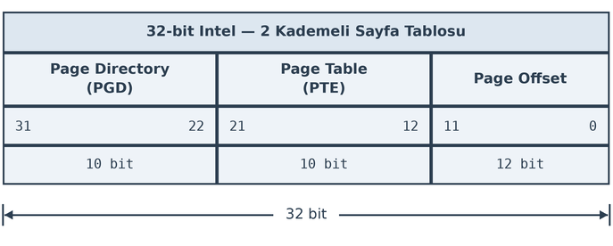

Görüldüğü gibi 4K sayfa kullanan 32 bit Intel işlemcilerinde sanal adres üç kısma ayrılmaktadır: 10 bitlik
*PGD (Page Directory)* alanı, 10 bitlik *PTE (Page Table Entry)* alanı ve 12 bitlik *Page Offset* alanı. Bu
sistemlerde *sayfa dizini (page directory)* denilen bir tablo bulunmaktadır. Bu tablonun da her elemanı 4 byte
uzunluktadır. Dolayısıyla sayfa dizini tablosu toplamda 2¹⁰ × 2² = 2¹² = 4K yer kaplamaktadır. Sayfa dizininin
her girişi bir sayfa tablosunun fiziksel adresini göstermektedir. Yani sayfa tabloları bir tane değil aslında
1024 tanedir. Sayfa tabloları yukarıda da belirttiğimiz gibi sayfa tablosu girişlerinden oluşmaktadır. Bir sayfa
tablosu girişi 4 byte olduğu için sayfa tablolarının uzunlukları da 2¹⁰ × 2² = 2¹² = 4K'dır. Nihayet sanal
adresin *sayfa offset'i (page offset)* alanı o fiziksel sayfada gerçek fiziksel adresin yerini belirtmektedir.
32 bit Intel işlemcilerinde sayfa dizinindeki girişler sayfa tablolarının fiziksel bellekteki yerini, sayfa
tablosundaki girişler de sayfaların fiziksel bellekteki yerini göstermektedir. Sayfa dizininin yeri ise işlemci
içerisindeki ``CR3`` yazmacı tarafından gösterilmektedir.

4K sayfa kullanan 32 bit Intel işlemcilerinde 4 byte'lık sayfa dizin girişlerinin formatı şöyledir:

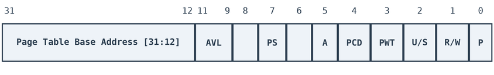

Buradaki yüksek anlamlı 20 bit sayfa tablosunun fiziksel bellekteki adresini belirtmektedir. (Tabii sayfa tabloları
4K olduğu için 20 bitin son 12 bitinin 0 olduğu kabul edilmektedir.) Diğer bitlerin anlamları şöyledir:

.. list-table:: 
   :header-rows: 1

   * - Bit(ler)
     - Alan
     - Açıklama
   * - 31–12
     - Page Table Base Addr.
     - Alt sayfa tablosunun fiziksel taban adresi. 4 KB hizalı olduğundan alt 12 bit sıfırdır,
       yalnızca üst 20 bit saklanır.
   * - 11–9
     - AVL
     - *Available* — işletim sistemi tarafından serbestçe kullanılabilir, donanım bu bitleri yok sayar.
   * - 8
     - —
     - Ayrılmış, 0 olmalı.
   * - 7
     - PS
     - *Page Size* — 0 ise alt tablo 4 KB sayfaları gösterir; 1 ise (PSE etkinse) bu giriş doğrudan
       4 MB'lık büyük sayfayı gösterir.
   * - 6
     - —
     - Ayrılmış, 0 olmalı.
   * - 5
     - A
     - *Accessed* — MMU bu girişe erişildiğinde 1 yapar; işletim sistemi LRU takibi için kullanır.
   * - 4
     - PCD
     - *Page Cache Disable* — 1 ise bu tablonun işaret ettiği sayfa önbelleklenmez.
   * - 3
     - PWT
     - *Page Write-Through* — 1 ise write-through önbellek politikası uygulanır.
   * - 2
     - U/S
     - *User/Supervisor* — 0 ise yalnızca kernel (CPL 0–2) erişebilir; 1 ise kullanıcı alanı da
       (CPL 3) erişebilir.
   * - 1
     - R/W
     - *Read/Write* — 0 ise sayfa salt okunur; 1 ise yazılabilir.
   * - 0
     - P
     - *Present* — 0 ise giriş geçersizdir ve MMU sayfa hatası (#PF) üretir; 1 ise geçerlidir.
       Linux, P=0 girişlerde swap bilgisi saklar.

Sayfa dizini girişlerinin formatının yukarıda ele almış olduğumuz sayfa tablosu girişi formatına oldukça benzediğine
dikkat ediniz. Sayfa dizini girişlerinin yine en düşük anlamlı biti ``P`` bitidir. Eğer bu bit 0 ise daha sayfa
tablosuna erişim yapılmadan *page fault* oluşmaktadır. Yani işletim sisteminin o giriş için sayfa tablosu
oluşturmasına gerek kalmamaktadır. Böylece sanal adres alanını az kullanan programların sayfa tabloları bellekte
çok daha az yer kaplar duruma gelmektedir. Benzer biçimde sayfa dizininin ``R/W`` biti de sayfa tablosu girişinde
olduğu gibi sayfanın *read-only* olup olmadığını belirtmektedir.

Sayfa dizininin her bir girişinin sanal adres alanında 4 MB'lik bir alanı belirttiğine dikkat ediniz.
2¹⁰ × 2¹² = 4M'dir.

Bu durumda 4K sayfa kullanan 32 bit Intel işlemcisi sanal adresi fiziksel adrese şöyle dönüştürmektedir. Örneğin
dönüştürülecek sanal adres ``1F3243A4`` olsun. Bu adresi bitlerine ayrıştıralım:

.. code-block:: none

   0001 1111 0011 0010 0100 0011 1010 0100

1. İşlemci önce sayfa dizininin yerini ``CR3`` yazmacı yoluyla elde eder.

2. Sanal adresin yüksek anlamlı 10 bitini bu tabloya indeks yaparak sayfa dizininin ilgili elemanına erişir.
   Örneğimizdeki sanal adresin yüksek anlamlı 10 biti ``0001111100`` biçimindedir. Bu değer onluk sistemde
   124'tür. O halde işlemci sayfa dizininin 124'üncü elemanına erişir. Sayfa dizininin 124'üncü elemanında
   1024 girişlik bir sayfa tablosu bulunacaktır. İşlemci bu sayfa tablosuna erişir.

3. İşlemci sanal adresin ikinci 10 bitini indeks yaparak eriştiği sayfa tablosunun ilgili girişini okur.
   Örneğimizde sanal adresin ikinci 10 bitlik kısmı ``1100100100`` biçimindedir. Bu da onluk sistemde 804
   değerine karşılık gelmektedir. İşte işlemci sayfa tablosunun 804'üncü girişine erişerek oradan sayfanın
   fiziksel adresini elde eder.

4. Nihayet işlemci elde ettiği fiziksel sayfa adresine sanal adresin düşük anlamlı 12 bitini toplayarak gerçek
   fiziksel adrese erişir. Örneğimizde sayfa offset'ini belirten 12 bit ``001110100100`` biçimindedir. Bu değer
   de onluk sistemde 932'dir.

Biz yukarıda 4K sayfa kullanan 32 bit Intel işlemcileri üzerinde örnek verdik. Sayfa büyüklükleri değiştiğinde
sanal adres dönüştürmesinin formatı da değişmektedir. Örneğin 4 MB'lık büyük sayfalar söz konusu olduğunda 32
bit Intel işlemcileri sanal adresi iki kısma ayırmaktadır:

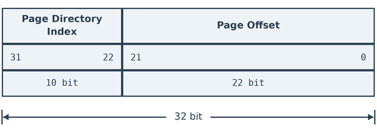

Burada artık tek kademeli bir dönüştürmenin olduğuna dikkat ediniz. Bu durumda işlemci yüksek anlamlı 10 bitten
sayfa dizininin indeksini elde edip sayfa dizininin o indeksine başvurarak 4 MB'lik sayfanın yerini tespit
etmektedir. Artık sanal adresin düşük anlamlı 22 bitinin (4 MB) sayfa offset'i belirttiğine dikkat ediniz.
32 bit Intel işlemcilerinde 4K'lık sayfalarla 4 MB'lik sayfalar bir arada kullanılabilmektedir. Sayfa dizini
girişlerinin sanal bellekte 4 MB'lik alan belirttiğini anımsayınız. Bu durumda bir sayfa dizini girişi 4 MB'lik
büyük sayfaya da ilişkin olabilir 4K'lık küçük sayfaya da ilişkin olabilir. Sayfa dizini girişlerindeki ``PS``
biti 0 ise bu giriş 4K'lık sayfa tablosunu gösteriyor durumdadır, ``PS`` biti 1 ise bu giriş 4 MB'lik fiziksel
sayfayı gösteriyor durumdadır. Linux işletim sistemi de 4K sayfaların dışında 4 MB'lik sayfaları da
desteklemektedir.

4K sayfalara ilişkin 32 bit ARM işlemcilerinde de iki kademeli sayfa tabloları kullanılmaktadır. Bu işlemcilerde
sanal adres yine üç kısma ayrılmaktadır. Ancak bu üç kısmın isimleri ve kullanılan terminoloji Intel işlemcilerinden
farklıdır:

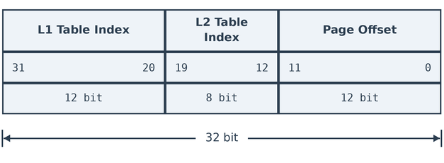

Buradaki sanal adresin parçalarının uzunluklarına dikkat ediniz. L1 tablosunun (Intel'deki sayfa dizini) indeksi
12 bittir. Yani bu tablo fiziksel bellekte 2¹² × 2² = 16K yer kaplamaktadır. Ancak L2 tabloları (yani
Intel'deki sayfa tabloları) burada 2⁸ × 2² = 1K yer kaplamaktadır. Sayfalar 4K olduğu için sayfa offset'i yine
12 bittir.

Aşağıda 4K sayfa kullanan 32 bit Intel işlemcileri ile ARM işlemcilerinin organizasyon karşılaştırmasını bir
tablo biçiminde veriyoruz:

.. list-table:: 
   :header-rows: 1
   :widths: 40 30 30

   * - Ölçüt
     - Intel 32-bit (4 KB sayfa)
     - ARM 32-bit (4 KB sayfa)
   * - L1 giriş sayısı
     - 1024
     - 4096
   * - L1 tablo boyutu
     - 4 KB
     - 16 KB
   * - L2 giriş sayısı
     - 1024
     - 256
   * - Tek L2 tablo boyutu
     - 4 KB
     - 1 KB
   * - Toplam L2 (max)
     - 4 MB
     - 4 MB

4K'lık sayfa kullanan 64 bit işlemcilerdeki sayfa tabloları genellikle 3 kademelidir. Çünkü 64 bitlik adres alanı
16 exabyte gibi çok yüksek bir değerdedir. Örneğin 64 bitlik Intel işlemcilerindeki sanal adres aşağıdaki gibi 4
kısma ayrılmaktadır:

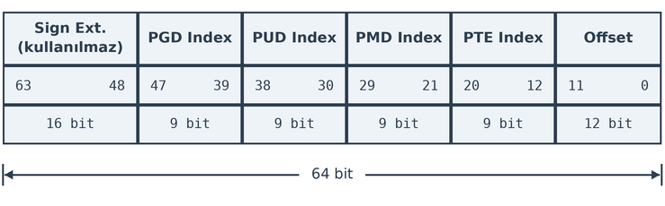

64 bit Intel işlemcileri aslında 48 bit ya da 57 bitlik sanal adresler kullanmaktadır. Bu işlemcilerin adresleyebildiği teorik
fiziksel bellek uzunluğu ise 2⁶⁴ (16 exabyte) değil daha azdır. Modellere göre 64 bit Intel işlemcilerinin
kullanabildiği fiziksel RAM aşağıdaki tabloda verilmiştir:

.. list-table:: 
   :header-rows: 1
   :widths: 35 32 33

   * - Ölçüt
     - Sanal Adres
     - Fiziksel Adres
   * - 4 Kademeli (LA48)
     - 48 bit → 256 TB
     - 46–52 bit (nesle göre)
   * - 5 Kademeli (LA57)
     - 57 bit → 128 PB
     - 52 bit → 4 PB
   * - Teorik maksimum
     - 57 bit → 128 PB
     - 52 bit → 4 PB

Fiziksel RAM'in sanal adres alanından fazla olması bir sorun yaratmamaktadır.

64 bit Intel işlemcilerinde sanal adresin dört parçaya ayrıldığına dikkat ediniz. Beşinci parça zaten
kullanılmamaktadır, her zaman 0'dır. Sanal adres dönüştürmesi yapılırken dört farklı tabloya başvurulmaktadır:

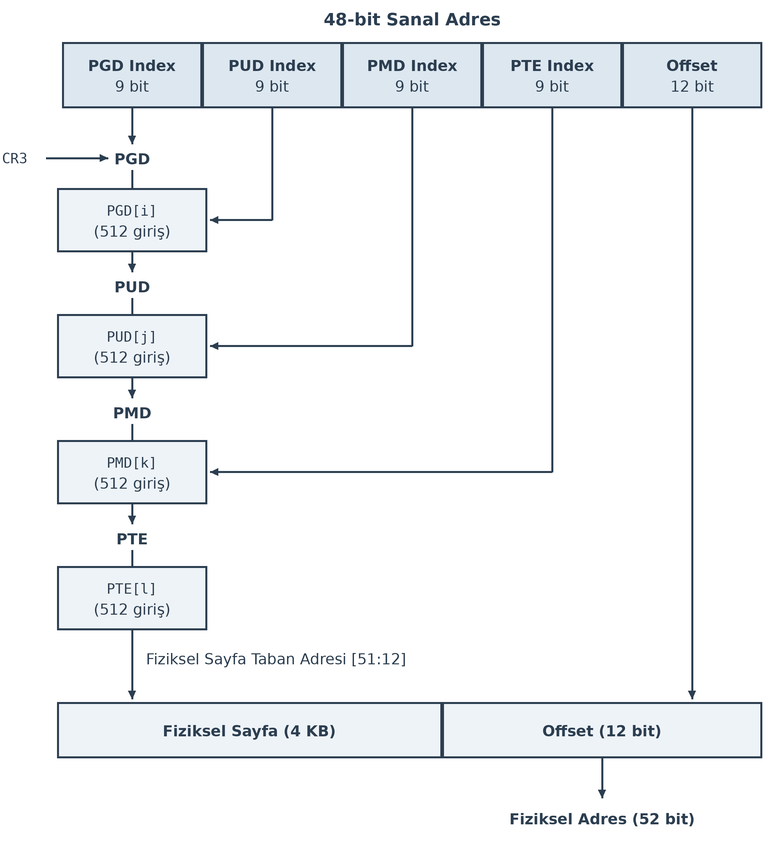

Burada toplamda dört kademe tablo vardır:

- ``PGD`` (*Page Global Directory*) Tablosu
- ``PUD`` (*Page Upper Directory*) Tablosu
- ``PMD`` (*Page Middle Directory*) Tablosu
- ``PTE`` (*Page Table Entry*) Tablosu

Dönüştürme yukarıdaki şekilden de gördüğünüz gibi şöyle yapılmaktadır:

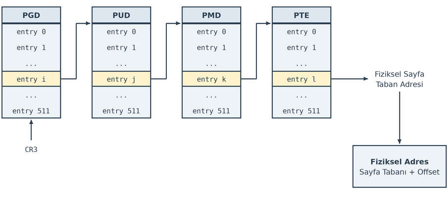

Intel'de 48 bit sanal adres kullanımında sanal adresin yüksek anlamlı 16 biti 47'inci bitle aynı olmak zorundadır. 
Benzer biçimde 57 bit sanal adres kullanımında ise sanal adresin yüksek anlamlı biti 56'ıncı bitle aynı olmak zorundadır.
Bu kurala uymayan adres erişimlerinde işlemci exception oluşturmaktadır.

4K sayfalar kullanan 64 bit ARM işlemcilerinde de sanal adres aşağıdaki gibi dört parçaya ayrılmaktadır:

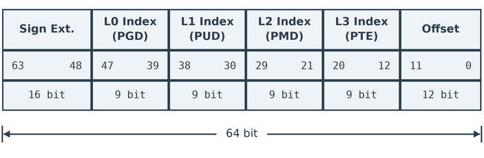

64 bit ARM işlemcilerinde de sanal adres alanı Intel'de olduğu gibi 64 bit değil 48 bittir. Adres dönüştürme 
mekanizmaları biraz farklı olsa da 64 bit ARM işlemcilerinde de sanal adresin yüksek anlamlı 16 biti 47'inci bit 
ile aynı olmazsa dönüştürme sırasında exception (translation fault) oluşmaktadır. 64 bit Intel işlemcileri ile 64 
bit ARM işlemcilerinin sayfalama aşamalarını aşağıdaki tabloyla karşılaştırıyoruz:

.. list-table:: 
   :header-rows: 1
   :widths: 36 32 32

   * - Ölçüt
     - x86-64 (LA48)
     - AArch64 (48-bit)
   * - Kullanılan bit
     - 48 bit
     - 48 bit
   * - Kademe sayısı
     - 4
     - 4
   * - Her kademedeki giriş
     - 512
     - 512
   * - Tablo boyutu
     - 4 KB
     - 4 KB
   * - Sayfa boyutu
     - 4 KB
     - 4 KB
   * - Taban adresi yazmacı
     - ``CR3``
     - ``TTBR0`` / ``TTBR1``
   * - Kullanıcı/Çekirdek ayrımı
     - Canonical bits
     - ``TTBR0`` / ``TTBR1`` ayrımı

Translation Lookaside Buffer (TLB)
----------------------------------

İşlemcilerin bu kademelerden geçiş sırasında çok fazla bellek başvurusu yaptığını görüyorsunuz. Bu başvurular
çalışmayı göreli olarak yavaşlatmaktadır. İşte bu nedenle işlemciler kendi içerisinde son erişilen dizin ve sayfa
tablosu içeriklerini bir önbellek (cache) içerisinde tutmaktadır. Bu önbellek sistemine İngilizce
*Translation Lookaside Buffer (TLB)* denilmektedir. Bu önbellek sayesinde işlemci son zamanlarda kullanılan sayfa
dizini ve sayfa tablosu girişlerine hiç bellek okuması yapmadan hızlı bir biçimde erişebilmektedir.

TLB, sanal adresten fiziksel adrese dönüştürme sonuçlarını önbelleğe alan, CPU çekirdeği içindeki özel bir donanım
yapısıdır. Teknik olarak bir *associative cache (içerik adreslenebilir bellek, CAM)* biçiminde
gerçekleştirilmektedir. Eğer dönüştürülecek sanal adrese ilişkin dönüştürme bilgisi TLB içerisinde varsa işlemci
çok hızlı bir biçimde erişimi yapar. Aşağıda bir fikir verebilmek amacıyla 32 bit ve 64 bit Intel işlemcilerinin
TLB önbelleğinin kaç girişi tutabildiğini gösteren bir tablo veriyoruz:

.. list-table:: Intel İşlemcilerinde TLB Önbellek Girişleri
   :header-rows: 1
   :widths: 22 30 30 18

   * - Mimari
     - L1 ITLB
     - L1 DTLB
     - L2 TLB (STLB)
   * - Core 2 (32-bit)
     - 128 giriş (4K), 4-yollu
     - 16 giriş (yalnız load)
     - 256 giriş
   * - Nehalem (64-bit)
     - 128 giriş (4K), 7 giriş (2M/4M)
     - 64 giriş (4K), 32 giriş (2M/4M)
     - 512 giriş (4K), 4-yollu
   * - Sandy Bridge
     - 64 giriş/thread (4K), 4-yollu
     - 64 giriş (4K), 4-yollu
     - 1024 giriş, 4-yollu

Proseslerin Sanal Adres Alanları
================================

Şimdi de 32 bit ve 64 bit Linux işletim sistemlerinde proseslerin sanal adres alanları üzerinde duralım. Biz yukarıda
her proses için sanki o proses fiziksel belleğe tek başına yükleniyormuş gibi bir sanal adres alanının oluşturulduğunu
belirtmiştik. Böylece örneğin 32 bit Linux sistemlerinde her bir proses sanki 4 GB belleği tek başına kullanabiliyormuş
gibi bir çalışma sistemi oluşturulmuştur. Peki işletim sisteminin kendisi sanal belleğin neresindedir? Sistem
fonksiyonları çağrıldığında sayfa tablosu değiştirilmemektedir. Bir sistem fonksiyonu çağrıldığında thread'in çalışma
modu kullanıcı modundan (*user mode*) çekirdek moduna (*kernel mode*) geçirilir ve sistem fonksiyonuna dallanılır. O
halde işletim sisteminin kodlarının da her proses tarafından erişilebilir bir yerde bulundurulması gerekmektedir.
İşte Linux sistemlerinde (Windows sistemlerinde de benzer) işletim sistemi sanal adres alanının belli bir yerine
haritalanmıştır. 32 bit Linux sistemlerinde bir prosesin sanal bellek alanı şöyledir:

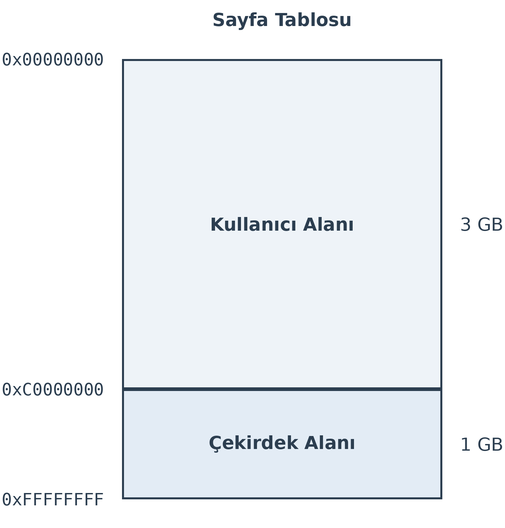

Buradan da görüldüğü gibi 32 bit Linux sistemlerinde kullanıcı alanı (yani prosesin sanal bellekte kapladığı maksimum
alan) 3 GB, çekirdek alanı da 1 GB'dir. Her proseste çekirdek alanı o prosesin sanal belleğinin aynı yerine
(``0xC0000000``'dan itibaren) haritalanmıştır. Sayfa tablolarının çok kademeli olması bu haritalama işlemini
kolaylaştırmaktadır. Buradaki alanların içeriklerini biraz daha ayrıntılandırabiliriz (şeklin uzamaması için içeriklerini
İngilizce yazıyoruz):

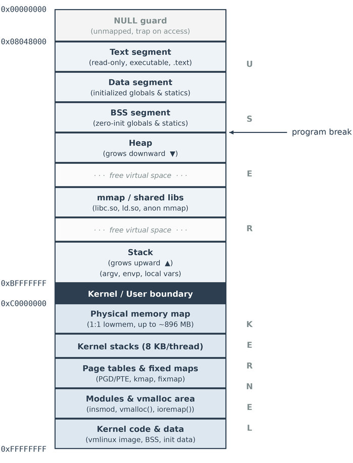

64 bit Linux sistemlerinde ise prosesin sanal bellek alanı şöyledir:

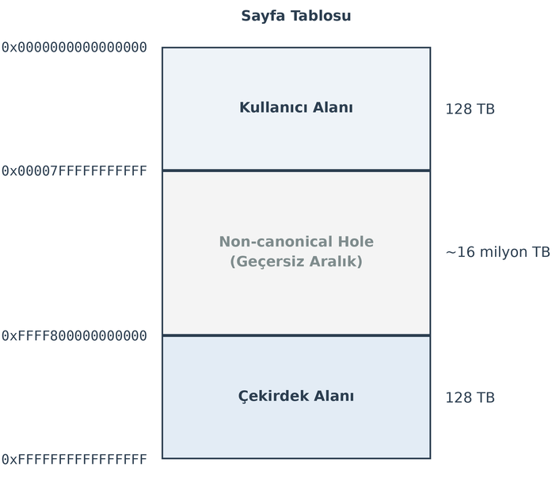

64 bit Linux sistemlerinde prosesin sanal bellek alanının 256 TB büyüklüğünde olduğuna dikkat ediniz. Bu sistemlerde
sanal adreslerin 48 bit olduğunu ve sanal adreslerin yüksek anlamlı 16 bitinin 47'inci bit ile aynı olmak zorunda
olduğunu anımsayınız. 64 bit Linux sistemlerinde kullanıcı alanı 128 TB ve çekirdek alanı da 128 TB'dir. Bugün için
bu büyüklük oldukça yeterlidir. Bellekte 128 TB yer kaplayabilecek programlar yok denilecek kadar azdır. Kullanıcı
alanının sanal bellek alanının düşük adresinde, çekirdek alanının da yüksekte bulunduğuna dikkat ediniz. Yine her
proseste çekirdek alanı aynı yere haritalanmıştır. Buradaki şekli biraz daha ayrıntılı biçimde aşağıdaki gibi de
çizebiliriz (şeklin uzamaması için içeriklerini İngilizce yazıyoruz):

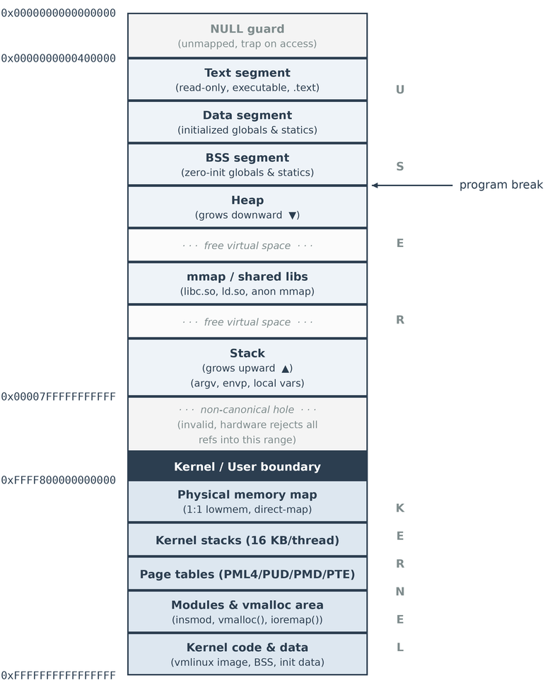

NUMA Düğümlerinin Çekirdek Temsili
==================================

Anımsanacağı gibi çok işlemcili ya da çekirdekli sistemlerde iki mimari kullanılıyordu: UMA ve NUMA. UMA mimarisinde
her işlemci ya da çekirdek aynı fiziksel RAM'e erişiyordu. Erişim sırasında diğerlerini durduruyordu. NUMA mimarisinde
ise her işlemci ya da çekirdeğin daha hızlı erişebildiği bir *düğüm (node)* (*"bank" da denilmektedir*) bulunmaktaydı.
NUMA mimarilerinde işlemciler ya da çekirdekler kendi düğümlerine ve komşu düğümlere daha hızlı, diğer düğümlere
göreli olarak daha yavaş erişiyordu. 

Linux'un bellek yönetimi hem UMA hem de NUMA mimarilerinde çalışacak biçimde tasarlanmıştır. Bu nedenle daha genel
veri yapıları oluşturulmuştur. Linux çekirdeklerinde NUMA düğümleri (yani bank'ları) ``pglist_data`` isimli bir yapı
ile temsil edilmektedir. Bu yapı ``pg_data_t`` ismiyle de typedef edilmiştir. Güncel çekirdeklerde bu yapı
``include/linux/mmzone.h`` dosyası içerisinde şöyle tanımlanmıştır:

.. code-block:: c

   typedef struct pglist_data {
       /*
        * node_zones contains just the zones for THIS node. Not all of the
        * zones may be populated, but it is the full list. It is referenced by
        * this node's node_zonelists as well as other node's node_zonelists.
        */
       struct zone node_zones[MAX_NR_ZONES];

       /*
        * node_zonelists contains references to all zones in all nodes.
        * Generally the first zones will be references to this node's
        * node_zones.
        */
       struct zonelist node_zonelists[MAX_ZONELISTS];

       int nr_zones; /* number of populated zones in this node */
   #ifdef CONFIG_FLATMEM   /* means !SPARSEMEM */
       struct page *node_mem_map;
   #ifdef CONFIG_PAGE_EXTENSION
       struct page_ext *node_page_ext;
   #endif
   #endif
   #if defined(CONFIG_MEMORY_HOTPLUG) || defined(CONFIG_DEFERRED_STRUCT_PAGE_INIT)
       /*
        * Must be held any time you expect node_start_pfn,
        * node_present_pages, node_spanned_pages or nr_zones to stay constant.
        * Also synchronizes pgdat->first_deferred_pfn during deferred page
        * init.
        *
        * pgdat_resize_lock() and pgdat_resize_unlock() are provided to
        * manipulate node_size_lock without checking for CONFIG_MEMORY_HOTPLUG
        * or CONFIG_DEFERRED_STRUCT_PAGE_INIT.
        *
        * Nests above zone->lock and zone->span_seqlock
        */
       spinlock_t node_size_lock;
   #endif
       unsigned long node_start_pfn;
       unsigned long node_present_pages; /* total number of physical pages */
       unsigned long node_spanned_pages; /* total size of physical page
                           range, including holes */
       int node_id;
       wait_queue_head_t kswapd_wait;
       wait_queue_head_t pfmemalloc_wait;

       /* workqueues for throttling reclaim for different reasons. */
       wait_queue_head_t reclaim_wait[NR_VMSCAN_THROTTLE];

       atomic_t nr_writeback_throttled; /* nr of writeback-throttled tasks */
       unsigned long nr_reclaim_start; /* nr pages written while throttled
                       * when throttling started. */
   #ifdef CONFIG_MEMORY_HOTPLUG
       struct mutex kswapd_lock;
   #endif
       struct task_struct *kswapd; /* Protected by kswapd_lock */
       int kswapd_order;
       enum zone_type kswapd_highest_zoneidx;

       atomic_t kswapd_failures; /* Number of 'reclaimed == 0' runs */

   #ifdef CONFIG_COMPACTION
       int kcompactd_max_order;
       enum zone_type kcompactd_highest_zoneidx;
       wait_queue_head_t kcompactd_wait;
       struct task_struct *kcompactd;
       bool proactive_compact_trigger;
   #endif
       /*
        * This is a per-node reserve of pages that are not available
        * to userspace allocations.
        */
       unsigned long totalreserve_pages;

   #ifdef CONFIG_NUMA
       /*
        * node reclaim becomes active if more unmapped pages exist.
        */
       unsigned long min_unmapped_pages;
       unsigned long min_slab_pages;
   #endif /* CONFIG_NUMA */

       /* Write-intensive fields used by page reclaim */
       CACHELINE_PADDING(_pad1_);

   #ifdef CONFIG_DEFERRED_STRUCT_PAGE_INIT
       /*
        * If memory initialisation on large machines is deferred then this
        * is the first PFN that needs to be initialised.
        */
       unsigned long first_deferred_pfn;
   #endif /* CONFIG_DEFERRED_STRUCT_PAGE_INIT */

   #ifdef CONFIG_TRANSPARENT_HUGEPAGE
       struct deferred_split deferred_split_queue;
   #endif

   #ifdef CONFIG_NUMA_BALANCING
       /* start time in ms of current promote rate limit period */
       unsigned int nbp_rl_start;
       /* number of promote candidate pages at start time of current rate limit period */
       unsigned long nbp_rl_nr_cand;
       /* promote threshold in ms */
       unsigned int nbp_threshold;
       /* start time in ms of current promote threshold adjustment period */
       unsigned int nbp_th_start;
       /*
        * number of promote candidate pages at start time of current promote
        * threshold adjustment period
        */
       unsigned long nbp_th_nr_cand;
   #endif
       /* Fields commonly accessed by the page reclaim scanner */

       /*
        * NOTE: THIS IS UNUSED IF MEMCG IS ENABLED.
        *
        * Use mem_cgroup_lruvec() to look up lruvecs.
        */
       struct lruvec __lruvec;

       unsigned long flags;

   #ifdef CONFIG_LRU_GEN
       /* kswap mm walk data */
       struct lru_gen_mm_walk mm_walk;
       /* lru_gen_folio list */
       struct lru_gen_memcg memcg_lru;
   #endif

       CACHELINE_PADDING(_pad2_);

       /* Per-node vmstats */
       struct per_cpu_nodestat __percpu *per_cpu_nodestats;
       atomic_long_t vm_stat[NR_VM_NODE_STAT_ITEMS];
   #ifdef CONFIG_NUMA
       struct memory_tier __rcu *memtier;
   #endif
   #ifdef CONFIG_MEMORY_FAILURE
       struct memory_failure_stats mf_stats;
   #endif
   } pg_data_t;

Yapının bazı elemanlarının çeşitli konfigürasyon parametreleri seçilmişse yapıya dahil edildiğine dikkat ediniz.
Sistemdeki tüm NUMA düğümlerine ilişkin ``pglist_data_t`` nesnelerinin adresleri ``mm/numa.c`` dosyası içerisindeki
``node_data`` isimli global bir dizide saklanmaktadır:

.. code-block:: c

   struct pglist_data *node_data[MAX_NUMNODES];
   EXPORT_SYMBOL(node_data);

Buradaki ``MAX_NUMNODES`` bir üst sınır belirtmektedir. NUMA düğümlerinin sayısı masaüstü sistemlerde donanım
tarafından ACPI protokolü ile belirlenip ACPI tablosunun *SRAT (System Resource Affinity Table)* kısmına
yazılmaktadır. ACPI protokolü tipik olarak modern UEFI BIOS'ların bulunduğu sistemlerde işletilmektedir. (Ancak
eski BIOS'larda (*legacy BIOS*) ACPI protokolü sınırlamalarla işletilebilmektedir.) ACPI protokolünün kullanıldığı
masaüstü sistemlerinde Linux çekirdeği NUMA bilgilerini bu ACPI tablosundan elde etmektedir. Pek çok gömülü
sistemde bu biçimde bir donanım belirlemesi yapılamadığı ve bu sistemler de UEFI BIOS'lara sahip olmadığı için
NUMA düğümleri hakkında bilgiler *aygıt ağacı (device tree)* denilen dosyalar yoluyla çekirdeğe iletilmektedir.
İşte NUMA düğümlerinin gerçek sayısı yukarıda açıkladığımız biçimde çekirdek tarafından elde edilip ``nr_node_ids``
ve ``nr_online_nodes`` isimli global değişkenlere yazılmaktadır. ``nr_node_ids`` toplam NUMA düğümlerinin sayısını,
``nr_online_nodes`` ise çekirdek tarafından kullanılabilecek NUMA düğümlerinin sayısını belirtmektedir. Çekirdek
bellek yönetiminde ``nr_online_nodes`` değerini dikkate almaktadır.

Linux çekirdeği UMA ve NUMA sistemleri için ayrı kodlar bulundurmamaktadır. UMA sistemleri sanki tek düğümden oluşan
NUMA sistemiymiş gibi ele alınmaktadır. Örneğin ``nr_node_ids`` ve ``nr_online_nodes`` global değişkenleri UMA
sistemleri söz konusu olduğunda ``include/linux/nodemask.h`` dosyasında birer sembolik sabite dönüştürülmektedir:

.. code-block:: c

   #ifdef CONFIG_NUMA
       ...
       extern int nr_node_ids;
       extern int nr_online_nodes;
       ...
   #else
       ...
       #define nr_node_ids     1U
       #define nr_online_nodes 1U
       ...
   #endif

Başka bir deyişle Linux çekirdeği sanki donanım her zaman NUMA mimarisine sahipmiş gibi çalışmaktadır. Tek düğüme
sahip NUMA sistemi aslında UMA sistemidir.

Çekirdekte NUMA konfigürasyonunun ``CONFIG_NUMA`` konfigürasyon parametresi ile yapıldığına dikkat ediniz. Ancak
dağıtımlardaki çekirdekler hem UMA hem de NUMA mimarisinde kullanılabilsin diye genel olarak ``CONFIG_NUMA=y``
konfigürasyon seçeneği ile çekirdek derlemesini yapmaktadır. Yani kullandığınız çekirdeğin konfigürasyon dosyasında
``CONFIG_NUMA`` konfigürasyonunun *"y"* olduğunu görürseniz şaşırmayınız. ACPI sistemi UMA için tek bir NUMA
düğümü varmış gibi rapor oluşturmaktadır.

Çekirdekte her NUMA düğümünün bir indeks numarası vardır. Bir NUMA düğümünün yukarıdaki dizi içerisindeki elemanına
erişmek için ``NODE_DATA(index)`` makrosu kullanılmaktadır. Örneğin UMA sistemleri tek bir NUMA düğümü varmış gibi
organize edildiği için UMA sistemlerinde biz bu bilgilere ``NODE_DATA(0)`` makrosuyla erişebiliriz. Aslında
``CONFIG_NUMA=n`` yapıldığında çekirdek ``#ifdef`` komutlarıyla aşağıdaki bildirimleri ve tanımlamaları devreye 
sokmaktadır:

.. code-block:: c

   #ifndef CONFIG_NUMA
   extern struct pglist_data contig_page_data;
   static inline struct pglist_data *NODE_DATA(int nid)
   {
       return &contig_page_data;
   }
   ...
   #else
   ...
   #endif

``CONFIG_NUMA=n`` durumunda bu makroya biz hangi indeksi verirsek verelim makro hep aynı nesnenin adresini
döndürmektedir. ``CONFIG_NUMA=n`` durumunda zaten ``node_data`` gösterici dizisinin yalnızca bir elemanı vardır.
Bu eleman da ``contig_page_data`` nesnesini göstermektedir. Tabii yukarıda belirttiğimiz gibi dağıtımlar
çekirdeklerini ``CONFIG_NUMA=y`` parametresiyle derlemektedir.

Sisteminizdeki NUMA bilgilerini sys dosya sistemi yoluyla ``/sys/devices/system/node`` dizininden elde
edebilirsiniz. UMA sistemlerinde burada ``node0`` biçiminde tek bir NUMA düğüm dizini bulunacaktır. Bir düğümün
bellek kullanımı hakkında genel bilgiler de ``/sys/devices/system/node/nodeN/meminfo`` dosyası yoluyla elde
edilebilir. Örneğin:

.. code-block:: console

   $ cat /sys/devices/system/node/node0/meminfo

Fiziksel Bellek Bölgeleri 
=========================

NUMA sistemlerinde her düğüm kendi içerisinde bölgelerden (*zones*) ouşmaktadır. UMA sistemlerinin Linux çekirdeği
tarafından tek düğümlü NUMA sistemleri gibi ele alındığını belirtmiştik. Fiziksel belleğin (ya da NUMA düğümlerinin)
bölgelere ayrılmasının anlamı nedir? İşte fiziksel bellekteki bölgeler "bazı işlemlerin yapılabilirliği" ile ilgili
olabilmektedir. Örneğin bazı sistemlerde DMA ile aktarım RAM'in her yerine yapılamamaktadır. Yalnızca özel bir
bölgesine yapılabilmektedir. Linux çekirdeklerinde bu bölgeye ``ZONE_DMA`` denilmektedir. İşletim sistemlerinin
çekirdeklerinin pek çok donanımda çalışacak biçimde genel tasarlandığına dikkatinizi çekmek istiyoruz. Linux
çekirdeğinde her *bölge (zone)* bellek yönetimi tarafından ayrı bir biçimde yönetilmektedir.

Linux çekirdeğinde kullanılan bölgeler şunlardır:

- ``ZONE_DMA``
- ``ZONE_DMA32``
- ``ZONE_NORMAL``
- ``ZONE_HIGHMEM``
- ``ZONE_MOVABLE``
- ``ZONE_DEVICE``

Bu bölgelerin hepsi her türlü donanımda bulunmak zorunda değildir. Bölge türleri ``include/linux/mmzone.h`` dosyası
içerisinde aşağıdaki gibi bir ``enum`` türü ile sembolik sabitler biçiminde tanımlanmıştır:

.. code-block:: c

   enum zone_type {
   #ifdef CONFIG_ZONE_DMA
       ZONE_DMA,
   #endif
   #ifdef CONFIG_ZONE_DMA32
       ZONE_DMA32,
   #endif
       ZONE_NORMAL,
   #ifdef CONFIG_HIGHMEM
       ZONE_HIGHMEM,
   #endif
       ZONE_MOVABLE,
   #ifdef CONFIG_ZONE_DEVICE
       ZONE_DEVICE,
   #endif
       __MAX_NR_ZONES
   };

Görüldüğü gibi bazı bölgeler bazı konfigürasyon parametreleri aktifse ``enum`` içerisinde yer almaktadır. Örneğin
64 bit sistemlerde ``ZONE_HIGHMEM`` yoktur. Çünkü 64 bit sistemlerde sayfa tablosu değiştirilmeden fiziksel belleğin
her yerine erişilebilmektedir. 32 bit Linux çekirdeklerinin derlenmesinde kullanılan ``CONFIG_HIGHMEM`` konfigürasyon
parametresi *"y"* biçiminde, 64 bit Linux çekirdeklerinin derlenmesinde kullanılan ``CONFIG_HIGHMEM`` konfigürasyon
parametresi ise *"n"* biçimindedir.

``ZONE_DMA``, 24 bit fiziksel adres kullanabilen DMA'ların bulunduğu donanımlar için, ``ZONE_DMA32`` ise 32 bit
fiziksel adres kullanabilen DMA'ların bulunduğu donanımlar için tanımlı bölgelerdir. Genellikle konfigürasyon
dosyalarında ``CONFIG_ZONE_DMA32=y`` ise aynı zamanda ``CONFIG_ZONE_DMA=y`` biçimindedir.

``ZONE_NORMAL`` bölgesi çekirdeğin doğrudan adresleme yapabildiği en geniş bölgedir. 32 bit Linux sistemlerinde
ileride açıklayacağımız gerekçeler nedeniyle ``ZONE_NORMAL`` bölgesi fiziksel belleğin 16 MB ile 896 MB arasındaki
kısmını, 64 bit sistemlerde ise 4 GB'den itibaren geri kalan tüm fiziksel belleği belirtmektedir.

``ZONE_HIGHMEM`` alanı 32 bit Linux sistemlerinde ileride açıklayacağımız gerekçeler nedeniyle doğrudan
adreslenemeyen ilk 896 MB'lik alanın ötesini belirtmektedir. Çekirdek bu bölgeye sayfa tablosunda değişiklikler
yaparak erişmektedir.

Yukarıda belirttiğimiz fiziksel bellek bölgelerine ilişkin bilgiler güncel çekirdeklerde ``include/linux/mmzone.h``
dosyası içerisinde tanımlanmış olan ``zone`` yapısı içerisinde tutulmaktadır:

.. code-block:: c

   struct zone {
       /* Read-mostly fields */

       /* zone watermarks, access with *_wmark_pages(zone) macros */
       unsigned long _watermark[NR_WMARK];
       unsigned long watermark_boost;

       unsigned long nr_reserved_highatomic;
       unsigned long nr_free_highatomic;

       /*
        * We don't know if the memory that we're going to allocate will be
        * freeable or/and it will be released eventually, so to avoid totally
        * wasting several GB of ram we must reserve some of the lower zone
        * memory (otherwise we risk to run OOM on the lower zones despite
        * there being tons of freeable ram on the higher zones).  This array is
        * recalculated at runtime if the sysctl_lowmem_reserve_ratio sysctl
        * changes.
        */
       long lowmem_reserve[MAX_NR_ZONES];

   #ifdef CONFIG_NUMA
       int node;
   #endif
       struct pglist_data *zone_pgdat;
       struct per_cpu_pages __percpu *per_cpu_pageset;
       struct per_cpu_zonestat __percpu *per_cpu_zonestats;
       /*
        * the high and batch values are copied to individual pagesets for
        * faster access
        */
       int pageset_high_min;
       int pageset_high_max;
       int pageset_batch;

   #ifndef CONFIG_SPARSEMEM
       /*
        * Flags for a pageblock_nr_pages block. See pageblock-flags.h.
        * In SPARSEMEM, this map is stored in struct mem_section
        */
       unsigned long *pageblock_flags;
   #endif /* CONFIG_SPARSEMEM */

       /* zone_start_pfn == zone_start_paddr >> PAGE_SHIFT */
       unsigned long zone_start_pfn;

       /*
        * spanned_pages is the total pages spanned by the zone, including
        * holes, which is calculated as:
        * 	spanned_pages = zone_end_pfn - zone_start_pfn;
        *
        * present_pages is physical pages existing within the zone, which
        * is calculated as:
        *	present_pages = spanned_pages - absent_pages(pages in holes);
        *
        * present_early_pages is present pages existing within the zone
        * located on memory available since early boot, excluding hotplugged
        * memory.
        *
        * managed_pages is present pages managed by the buddy system, which
        * is calculated as (reserved_pages includes pages allocated by the
        * bootmem allocator):
        *	managed_pages = present_pages - reserved_pages;
        *
        * cma pages is present pages that are assigned for CMA use
        * (MIGRATE_CMA).
        *
        * So present_pages may be used by memory hotplug or memory power
        * management logic to figure out unmanaged pages by checking
        * (present_pages - managed_pages). And managed_pages should be used
        * by page allocator and vm scanner to calculate all kinds of watermarks
        * and thresholds.
        *
        * Locking rules:
        *
        * zone_start_pfn and spanned_pages are protected by span_seqlock.
        * It is a seqlock because it has to be read outside of zone->lock,
        * and it is done in the main allocator path.  But, it is written
        * quite infrequently.
        *
        * The span_seq lock is declared along with zone->lock because it is
        * frequently read in proximity to zone->lock.  It's good to
        * give them a chance of being in the same cacheline.
        *
        * Write access to present_pages at runtime should be protected by
        * mem_hotplug_begin/done(). Any reader who can't tolerant drift of
        * present_pages should use get_online_mems() to get a stable value.
        */
       atomic_long_t managed_pages;
       unsigned long spanned_pages;
       unsigned long present_pages;
   #if defined(CONFIG_MEMORY_HOTPLUG)
       unsigned long present_early_pages;
   #endif
   #ifdef CONFIG_CMA
       unsigned long cma_pages;
   #endif

       const char *name;

   #ifdef CONFIG_MEMORY_ISOLATION
       /*
        * Number of isolated pageblock. It is used to solve incorrect
        * freepage counting problem due to racy retrieving migratetype
        * of pageblock. Protected by zone->lock.
        */
       unsigned long nr_isolate_pageblock;
   #endif

   #ifdef CONFIG_MEMORY_HOTPLUG
       /* see spanned/present_pages for more description */
       seqlock_t span_seqlock;
   #endif

       int initialized;

       /* Write-intensive fields used from the page allocator */
       CACHELINE_PADDING(_pad1_);

       /* free areas of different sizes */
       struct free_area free_area[NR_PAGE_ORDERS];

   #ifdef CONFIG_UNACCEPTED_MEMORY
       /* Pages to be accepted. All pages on the list are MAX_PAGE_ORDER */
       struct list_head unaccepted_pages;

       /* To be called once the last page in the zone is accepted */
       struct work_struct unaccepted_cleanup;
   #endif

       /* zone flags, see below */
       unsigned long flags;

       /* Primarily protects free_area */
       spinlock_t lock;

       /* Pages to be freed when next trylock succeeds */
       struct llist_head trylock_free_pages;

       /* Write-intensive fields used by compaction and vmstats. */
       CACHELINE_PADDING(_pad2_);

       /*
        * When free pages are below this point, additional steps are taken
        * when reading the number of free pages to avoid per-cpu counter
        * drift allowing watermarks to be breached
        */
       unsigned long percpu_drift_mark;

   #if defined CONFIG_COMPACTION || defined CONFIG_CMA
       /* pfn where compaction free scanner should start */
       unsigned long compact_cached_free_pfn;
       /* pfn where compaction migration scanner should start */
       unsigned long compact_cached_migrate_pfn[ASYNC_AND_SYNC];
       unsigned long compact_init_migrate_pfn;
       unsigned long compact_init_free_pfn;
   #endif

   #ifdef CONFIG_COMPACTION
       /*
        * On compaction failure, 1<<compact_defer_shift compactions
        * are skipped before trying again. The number attempted since
        * last failure is tracked with compact_considered.
        * compact_order_failed is the minimum compaction failed order.
        */
       unsigned int compact_considered;
       unsigned int compact_defer_shift;
       int compact_order_failed;
   #endif

   #if defined CONFIG_COMPACTION || defined CONFIG_CMA
       /* Set to true when the PG_migrate_skip bits should be cleared */
       bool compact_blockskip_flush;
   #endif

       bool contiguous;

       CACHELINE_PADDING(_pad3_);
       /* Zone statistics */
       atomic_long_t vm_stat[NR_VM_ZONE_STAT_ITEMS];
       atomic_long_t vm_numa_event[NR_VM_NUMA_EVENT_ITEMS];
   } ____cacheline_internodealigned_in_smp;

Görüldüğü gibi bir bölgeyi temsil eden pek çok bilgi bulunmaktadır. Bu yapı içerisinde bölgenin fiziksel belleğin
neresinden başladığı ve ne uzunlukta olduğu belirtilmektedir.

Bir NUMA düğümündeki bölgeler düğümü temsil eden ``pglist_data`` yapısının ``node_zones`` elemanında tutulmaktadır.
Bu eleman ``MAX_NR_ZONES`` uzunluğunda bir dizi biçiminde tanımlanmıştır. Ancak buradaki ``MAX_NR_ZONES`` değeri
olabilecek en yüksek bölge sayısını belirtmektedir. Bu dizinin dolu olan elemanlarının sayısı ise ``pglist_data``
yapısının ``nr_zones`` elemanında tutulmaktadır:

.. code-block:: c

   typedef struct pglist_data {
       /* ... */
       struct zone node_zones[MAX_NR_ZONES];
       int nr_zones;
       /* ... */
   } pg_data_t;

Bölge bilgilerinin NUMA düğümlerinin içerisinde olduğuna bir kez daha dikkatinizi çekmek istiyoruz.

Fiziksel Sayfaların page Yapısıyla Temsil Edilmesi
==================================================

Çekirdek fiziksel belleği NUMA düğümlerinden, NUMA düğümlerini bellek bölgelerinden (*zones*), bellek bölgelerini
de sayfalardan oluşuyormuş gibi ele almaktadır. İzleyen paragraflarda ele alacağımız *ikiz blok sayfa tahsisat
sistemi (buddy allocator)* bölge temelinde oluşturulmuştur. Ancak çekirdek tüm fiziksel belleğin sayfalarını da
ayrıca kayıt altında tutup izlemektedir. Linux çekirdeğinde bir fiziksel bellek sayfası ``page`` isimli bir yapıyla
temsil edilmiştir. Güncel çekirdeklerde ``page`` yapısı ``include/linux/mm_types.h`` dosyası içerisinde aşağıdaki
gibi tanımlanmıştır:

.. code-block:: c

   struct page {
       memdesc_flags_t flags; /* Atomic flags, some possibly
                   * updated asynchronously */
       /*
        * Five words (20/40 bytes) are available in this union.
        * WARNING: bit 0 of the first word is used for PageTail(). That
        * means the other users of this union MUST NOT use the bit to
        * avoid collision and false-positive PageTail().
        */
       union {
           struct { /* Page cache and anonymous pages */
               /**
                * @lru: Pageout list, eg. active_list protected by
                * lruvec->lru_lock.  Sometimes used as a generic list
                * by the page owner.
                */
               union {
                   struct list_head lru;

                   /* Or, free page */
                   struct list_head buddy_list;
                   struct list_head pcp_list;
                   struct llist_node pcp_llist;
               };
               struct address_space *mapping;
               union {
                   pgoff_t __folio_index; /* Our offset within mapping. */
                   unsigned long share; /* share count for fsdax */
               };
               /**
                * @private: Mapping-private opaque data.
                * Usually used for buffer_heads if PagePrivate.
                * Used for swp_entry_t if swapcache flag set.
                * Indicates order in the buddy system if PageBuddy
                * or on pcp_llist.
                */
               unsigned long private;
           };
           struct { /* page_pool used by netstack */
               /**
                * @pp_magic: magic value to avoid recycling non
                * page_pool allocated pages.
                */
               unsigned long pp_magic;
               struct page_pool *pp;
               unsigned long _pp_mapping_pad;
               unsigned long dma_addr;
               atomic_long_t pp_ref_count;
           };
           struct { /* Tail pages of compound page */
               unsigned long compound_head; /* Bit zero is set */
           };
           struct { /* ZONE_DEVICE pages */
               /*
                * The first word is used for compound_head or folio
                * pgmap
                */
               void *_unused_pgmap_compound_head;
               void *zone_device_data;
               /*
                * ZONE_DEVICE private pages are counted as being
                * mapped so the next 3 words hold the mapping, index,
                * and private fields from the source anonymous or
                * page cache page while the page is migrated to device
                * private memory.
                * ZONE_DEVICE MEMORY_DEVICE_FS_DAX pages also
                * use the mapping, index, and private fields when
                * pmem backed DAX files are mapped.
                */
           };

           /** @rcu_head: You can use this to free a page by RCU. */
           struct rcu_head rcu_head;
       };

       union { /* This union is 4 bytes in size. */
           /*
            * For head pages of typed folios, the value stored here
            * allows for determining what this page is used for. The
            * tail pages of typed folios will not store a type
            * (page_type == _mapcount == -1).
            *
            * See page-flags.h for a list of page types which are currently
            * stored here.
            *
            * Owners of typed folios may reuse the lower 16 bit of the
            * head page page_type field after setting the page type,
            * but must reset these 16 bit to -1 before clearing the
            * page type.
            */
           unsigned int page_type;

           /*
            * For pages that are part of non-typed folios for which mappings
            * are tracked via the RMAP, encodes the number of times this page
            * is directly referenced by a page table.
            *
            * Note that the mapcount is always initialized to -1, so that
            * transitions both from it and to it can be tracked, using
            * atomic_inc_and_test() and atomic_add_negative(-1).
            */
           atomic_t _mapcount;
       };

       /* Usage count. *DO NOT USE DIRECTLY*. See page_ref.h */
       atomic_t _refcount;

   #ifdef CONFIG_MEMCG
       unsigned long memcg_data;
   #elif defined(CONFIG_SLAB_OBJ_EXT)
       unsigned long _unused_slab_obj_exts;
   #endif

       /*
        * On machines where all RAM is mapped into kernel address space,
        * we can simply calculate the virtual address. On machines with
        * highmem some memory is mapped into kernel virtual memory
        * dynamically, so we need a place to store that address.
        * Note that this field could be 16 bits on x86 ... ;)
        *
        * Architectures with slow multiplication can define
        * WANT_PAGE_VIRTUAL in asm/page.h
        */
   #if defined(WANT_PAGE_VIRTUAL)
       void *virtual; /* Kernel virtual address (NULL if
                   not kmapped, ie. highmem) */
   #endif /* WANT_PAGE_VIRTUAL */

   #ifdef LAST_CPUPID_NOT_IN_PAGE_FLAGS
       int _last_cpupid;
   #endif

   #ifdef CONFIG_KMSAN
       /*
        * KMSAN metadata for this page:
        *  - shadow page: every bit indicates whether the corresponding
        *    bit of the original page is initialized (0) or not (1);
        *  - origin page: every 4 bytes contain an id of the stack trace
        *    where the uninitialized value was created.
        */
       struct page *kmsan_shadow;
       struct page *kmsan_origin;
   #endif
   } _struct_page_alignment;

Tabii eskiden bu yapı bu kadar büyük değildi. Zaman içerisinde yapıya çeşitli konfigürasyon parametreleri eşliğinde
alanlar eklendi ve yapı büyüdü. Örneğin çekirdeğin 2.2 versiyonunda ``page`` yapısı şöyleydi:

.. code-block:: c

   typedef struct page {
       /* these must be first (free area handling) */
       struct page *next;
       struct page *prev;
       struct inode *inode;
       unsigned long offset;
       struct page *next_hash;
       atomic_t count;
       unsigned long flags; /* atomic flags, some possibly updated asynchronously */
       struct wait_queue *wait;
       struct page **pprev_hash;
       struct buffer_head *buffers;
   } mem_map_t;

2.4 çekirdeğinde yapı şu hale geldi:

.. code-block:: c

   typedef struct page {
       struct list_head list; /* ->mapping has some page lists. */
       struct address_space *mapping; /* The inode (or ...) we belong to. */
       unsigned long index; /* Our offset within mapping. */
       struct page *next_hash; /* Next page sharing our hash bucket in
                   the pagecache hash table. */
       atomic_t count; /* Usage count, see below. */
       unsigned long flags; /* atomic flags, some possibly
                   updated asynchronously */
       struct list_head lru; /* Pageout list, eg. active_list;
                   protected by pagemap_lru_lock !! */
       struct page **pprev_hash; /* Complement to *next_hash. */
       struct buffer_head *buffers; /* Buffer maps us to a disk block. */

       /*
        * On machines where all RAM is mapped into kernel address space,
        * we can simply calculate the virtual address. On machines with
        * highmem some memory is mapped into kernel virtual memory
        * dynamically, so we need a place to store that address.
        * Note that this field could be 16 bits on x86 ... ;)
        *
        * Architectures with slow multiplication can define
        * WANT_PAGE_VIRTUAL in asm/page.h
        */
   #if defined(CONFIG_HIGHMEM) || defined(WANT_PAGE_VIRTUAL)
       void *virtual; /* Kernel virtual address (NULL if
                   not kmapped, ie. highmem) */
   #endif /* CONFIG_HIGMEM || WANT_PAGE_VIRTUAL */
   } mem_map_t;

Güncel çekirdeklerde ``page`` yapısının uzunluğu 64 byte'tır. Dolayısıyla bir fiziksel sayfaya bu ``page``
yapılarından 64 tanesi sığabilmektedir.

Tüm Fiziksel Sayfalara İlişkin Bilgilerin Tutulması
---------------------------------------------------

Linux çekirdeklerinde -belli bir süredir- tüm ``page`` nesneleri ``CONFIG_FLATMEM``, ``CONFIG_SPARSEMEM`` ve
``CONFIG_SPARSEMEM_VMEMMAP`` konfigürasyon parametrelerine bağlı olarak değişik biçimlerde tutulmaktadır.
``CONFIG_FLATMEM`` ilgili sistemdeki fiziksel belleğin delikler olmadan düz bir biçimde bulunduğunu
belirtmektedir. Yani ``CONFIG_FLATMEM`` durumunda fiziksel bellek "her sayfası kullanılabilen ve arada hiç boşluk
olmayan tek parçadan" oluşmaktadır. Şimdi siz "zaten fiziksel belleğin bu biçimde olması gerektiğini" düşünebilirsiniz. 
Ancak bazı mimarilerde fiziksel belleğin belli bölgelerinde delikler (yani işletim sistemi tarafından kullnılamayan 
alanlar) bulunmaktadır. Tabii bu delikle boşuna oluşturulmuş değildir, onların çeşitli işlevleri vardır. Ancak bu delikler 
işletim sistemi tarafından bellek yönetiminde kullanılamamaktadır. Örneğin bugün kökeni IBM PC'ye dayanan Intel 
işlemcilerinin kullanıldığı masaüstü bilgisayar mimarisinde BIOS alanı fiziksel adres alanı içerisindedir ve burayı 
işletim sistemi kullanamamaktadır. Bu bölge aslında fiziksel belleği kesintiye uğratan bir delik oluşturmaktadır. İşte 
fiziksel belleğin aralarında böyle boşlukların bulunduğu durum çekirdekte ``CONFIG_SPARSEMEM_VMEMMAP`` ve ``CONFIG_SPARSEMEM`` 
konfigürasyon parametreleriyle belirtilmektedir. Örneğin Intel 32 bit Intel tabanlı masaüstü bilgisayarlarındaki fiziksel 
bellek delikleri aşağıdaki gibidir:

.. list-table:: 
   :header-rows: 1

   * - Başlangıç Adresi
     - Bitiş Adresi
     - Boyut
     - Tür
     - Açıklama
   * - ``0x00000000``
     - ``0x0009FFFF``
     - 640 KB
     - Kullanılabilir RAM
     - Conventional (Low) Memory
   * - ``0x000A0000``
     - ``0x000BFFFF``
     - 128 KB
     - DELİK
     - VGA Frame Buffer
   * - ``0x000C0000``
     - ``0x000DFFFF``
     - 128 KB
     - DELİK
     - Option ROM
   * - ``0x000E0000``
     - ``0x000EFFFF``
     - 64 KB
     - DELİK
     - Genişletilmiş Sistem BIOS
   * - ``0x000F0000``
     - ``0x000FFFFF``
     - 64 KB
     - DELİK
     - Sistem BIOS ROM
   * - ``0x00100000``
     - ``0xBFFFFFFF``
     - ~3067 MB
     - Kullanılabilir RAM
     - Extended Memory
   * - ``0xC0000000``
     - ``0xDFFFFFFF``
     - 512 MB
     - DELİK
     - PCI/PCIe BAR, GPU aperture
   * - ``0xE0000000``
     - ``0xEFFFFFFF``
     - 256 MB
     - DELİK
     - MMCONFIG / PCIe ECAM
   * - ``0xF0000000``
     - ``0xFEBFFFFF``
     - ~236 MB
     - DELİK / REZERVE
     - Ek chipset rezerve alanı
   * - ``0xFEC00000``
     - ``0xFEC00FFF``
     - 4 KB
     - DELİK
     - I/O APIC
   * - ``0xFED00000``
     - ``0xFED003FF``
     - 1 KB
     - DELİK
     - HPET
   * - ``0xFEE00000``
     - ``0xFEE00FFF``
     - 4 KB
     - DELİK
     - Local APIC
   * - ``0xFF000000``
     - ``0xFFFFFFFF``
     - 16 MB
     - DELİK
     - Firmware / BIOS Flash
   * - ``0x100000000``
     - Değişken
     - Değişken
     - Kullanılabilir RAM
     - 4 GB Üzeri Remap Edilen RAM

Buradaki deliklerin bir kusurdan kaynaklanmadığına, bir tasarım biçiminden kaynaklandığına dikkat ediniz. Fiziksel
bellekte deliklerin bulunması durumunda deliklerdeki sayfalar için ``page`` nesneleri sayfa tabloları yoluyla daha
etkin bir biçimde (bellekte yer kaplamadan) temsil edilebilir durumdaysa buna ``CONFIG_SPARSEMEM_VMEMMAP``
konfigürasyonu denilmektedir. İşte aslında Intel tabanlı masaüstü bilgisayarlarımızda delikler olmakla birlikte
bunların ``page`` nesneleri sayfa tabloları yoluyla daha etkin bir biçimde oluşturulabilmektedir. Yani bu sistemler
``CONFIG_SPARSEMEM_VMEMMAP`` biçiminde konfigüre edilmiştir. Örneğin 32 bit ARM tabanlı *Beaglebone Black (BBB)*
mimarisinde fiziksel RAM en fazla 2 GB olabilmektedir ve deliksizdir. Bu mimari ``CONFIG_FLATMEM`` biçiminde
konfigüre edilmiştir. Raspberry Pi 5 ve ARM tabanlı Mac bilgisayar mimarileri ise ``CONFIG_SPARSEMEM_VMEMMAP``
biçiminde konfigüre edilmektedir. Aşağıda üç mimariyi bir tablo eşliğinde karşılaştırıyoruz:

.. list-table:: 
   :header-rows: 1

   * - Özellik
     - Intel Masaüstü (x86-64)
     - Beaglebone Black (AM335x/ARMv7)
     - Raspberry Pi 5 (BCM2712/ARM64)
   * - İşletim Sistemi (tipik)
     - Linux
     - Linux
     - Linux
   * - CPU Çekirdeği
     - Çeşitli (Alder Lake vb.)
     - Cortex-A8
     - Cortex-A76 (quad-core)
   * - ISA
     - x86-64 (64-bit)
     - ARMv7 (32-bit)
     - ARMv8.2 (64-bit)
   * - Max RAM
     - TB mertebesi
     - 512 MB – 2 GB
     - 4/8/16 GB
   * - Linux çekirdeği kullanıyor mu?
     - Evet
     - Evet
     - Evet
   * - Linux Bellek Modeli
     - ``SPARSEMEM_VMEMMAP``
     - ``FLATMEM``
     - ``SPARSEMEM_VMEMMAP``
   * - Model değiştirilebilir mi?
     - Hayır (tek seçenek)
     - Evet (``SPARSEMEM`` de seçilebilir)
     - Hayır (2021'den beri tek seçenek)
   * - Sayfa Boyutu
     - 4 KB
     - 4 KB
     - 4 KB
   * - NUMA Desteği
     - Evet (Xeon)
     - Hayır
     - Hayır
   * - RAM Hot-plug
     - Desteklenir
     - Desteklenmez
     - Desteklenmez
   * - Fiziksel adres alanının yapısı
     - Çok sayıda büyük delik
     - Tek sürekli blok (``0x80000000``'dan)
     - GPU MMIO + RP1 PCIe deliği

CONFIG_FLATMEM Organizasyonu
~~~~~~~~~~~~~~~~~~~~~~~~~~~~~

``CONFIG_FLATMEM`` durumunda fiziksel bellek sayfalarına ilişkin ``page`` nesneleri ``mem_map`` isimli global bir
göstericinin gösterdiği dizide bulundurulmaktadır. Bu dizi çekirdek yüklendiğinde bellek yönetimi alt sistemine
ilişkin ilk değer verme işlemleri sırasında yaratılmaktadır. ``mem_map`` dizisinin tanımlanması güncel çekirdeklerde
``mm/mm_init.c`` dosyası içerisinde aşağıdaki gibi yapılmıştır:

.. code-block:: c

   #ifndef CONFIG_NUMA
   unsigned long max_mapnr;
   EXPORT_SYMBOL(max_mapnr);

   struct page *mem_map;
   EXPORT_SYMBOL(mem_map);
   #endif

Görüldüğü gibi bu dizinin uzunluğu da ``max_mapnr`` değişkeninde tutulmaktadır. Yani sistemde en fazla
``max_mapnr`` kadar fiziksel sayfa vardır. Fiziksel belleğin hangi miktarda olduğunun tespiti masaüstü
bilgisayarlarda ACPI protokolü yoluyla, gömülü sistemlerde aygıt ağaçları yoluyla yapılmaktadır.

CONFIG_SPARSEMEM_VMEMMAP Organizasyonu
~~~~~~~~~~~~~~~~~~~~~~~~~~~~~~~~~~~~~~

Eğer ``CONFIG_SPARSEMEM_VMEMMAP`` durumu söz konusuysa fiziksel sayfalar için ``page`` dizisinin başlangıç adresi
``vmemmap`` değişkeninde tutulmaktadır. ``vmemmap`` bazı mimarilerde bir nesne biçiminde bazı mimarilerde ise bir
makro biçiminde tanımlanmıştır. Örneğin Intel x86 mimarisi için güncel çekirdeklerde ``vmemmap``
``arch/x86/include/asm/pgtable_64.h`` dosyasında aşağıdaki gibi bir makro biçiminde tanımlanmıştır:

.. code-block:: c

   #define vmemmap     ((struct page *)VMEMMAP_START)

Buradaki ``VMEMMAP_START`` değeri şöyle define edilmiştir:

.. code-block:: c

   #define VMEMMAP_START   vmemmap_base
   ...
   extern unsigned long vmemmap_base;

Buradan ``vmemmap`` dizisinin adresinin sanal bellekte belli bir değişkenin içindeki değerden alındığını
görüyorsunuz. Yani ``vmemmap_base`` aslında sabit bir adres belirtmektedir. Peki neden
``CONFIG_SPARSEMEM_VMEMMAP`` durumunda doğrudan bir dizi kullanılmamış da bir sanal adrese referans edilmiştir?
İşte bunun nedeni delikli olan ancak deliklerin belli büyüklüklerde ve makul sayıda olduğu sistemlerde daha etkin
bir temsilin oluşturulmasını sağlamaktır. ``vmemmap`` sanal adresinin gösterdiği yerde ``page`` yapılarından oluşan
bir dizi vardır; ancak bu dizinin deliklere karşı gelen elemanları için sayfa tablosunda eşleştirme
yapılmamıştır. ``vmemmap`` göstericisinin gösterdiği sanal adrese ilişkin sayfa tablosunu aşağıdaki gibi
düşünebilirsiniz (basitlik oluşturmak için sayfa tablosunu tek kademeymiş gibi çizeceğiz):

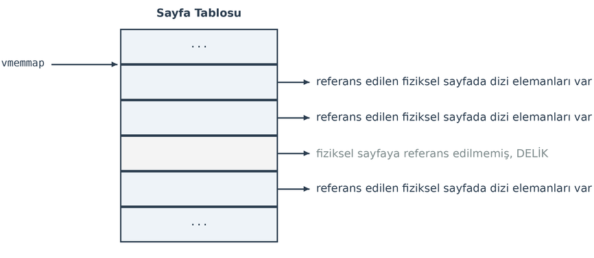

Görüldüğü gibi sanki ``vmemmap`` adresinden itibaren ardışıl bir ``page`` dizisi varmış gibi bir durum
oluşturulmuştur. Ancak bu dizinin bazı elemanları deliklere ilişkin olduğu için o elemanlara ilişkin sayfa
tablosunda fiziksel sayfa eşleştirmesi yapılmamıştır. Dolayısıyla delikli yapı aslında fiziksel bellekte hiç yer
harcanmadan oluşturulabilmektedir. Tabii burada bir noktaya dikkat ediniz. Bir sayfa tipik olarak 4K
büyüklüğündedir. ``page`` yapı nesnesinin de bellekte 64 byte yer kapladığını belirtmiştik. O halde bir sayfa
toplam 64 dizi elemanını tutacak genişliktedir. Eğer delikler 4K'dan küçükse böyle bir temsil
uygulanamayacaktır.

CONFIG_SPARSEMEM Organizasyonu
~~~~~~~~~~~~~~~~~~~~~~~~~~~~~~

Peki ``CONFIG_SPARSEMEM`` organizasyonu nasıldır? İşte eğer delikler oldukça büyükse ``CONFIG_SPARSEMEM``
organizasyonu daha verimli hale gelmektedir. ``CONFIG_SPARSEMEM`` organizasyonunda çekirdek fiziksel belleği
bölümlere (*sections*) ayırmaktadır. Her bölüm ardışıl uzunluktadır. Çekirdekte bu uzunluk
``SECTION_SIZE_BITS`` değeri ile belirtilmektedir. Bu değer bölümün 2 üzeri kaç uzunlukta olduğunu belirtir.
Bölümler tipik olarak 128 MB'dir ve 32768 sayfa içermektedir. Bu durumu aşağıdaki gibi bir çizimle
betimleyebiliriz:

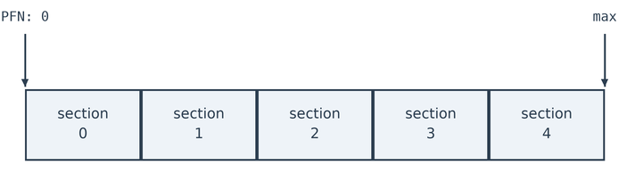

Buradaki *PFN*, *"Page Frame Number"* sözcüklerinden kısaltılmıştır.

Bölümler ``mem_section`` isminde bir yapıyla temsil edilmektedir. Bu yapı güncel çekirdeklerde şöyle
tanımlanmıştır:

.. code-block:: c

   struct mem_section {
       /*
        * This is, logically, a pointer to an array of struct
        * pages.  However, it is stored with some other magic.
        * (see sparse.c::sparse_init_one_section())
        *
        * Additionally during early boot we encode node id of
        * the location of the section here to guide allocation.
        * (see sparse.c::memory_present())
        *
        * Making it a UL at least makes someone do a cast
        * before using it wrong.
        */
       unsigned long section_mem_map;

       struct mem_section_usage *usage;
   #ifdef CONFIG_PAGE_EXTENSION
       /*
        * If SPARSEMEM, pgdat doesn't have page_ext pointer. We use
        * section. (see page_ext.h about this.)
        */
       struct page_ext *page_ext;
       unsigned long pad;
   #endif
       /*
        * WARNING: mem_section must be a power-of-2 in size for the
        * calculation and use of SECTION_ROOT_MASK to make sense.
        */
   };

Yapının ``section_mem_map`` elemanı o bölümdeki ``page`` nesnelerinin başlangıç adresini belirtmektedir. Çekirdek
aynı zamanda tüm bölümleri ``mem_section`` isimli bir dizide saklamaktadır:

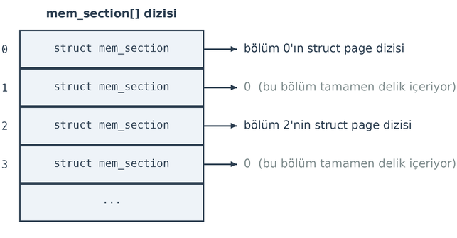

Bu sistemlerde çekirdek için fiziksel sayfa numarası iki bileşenden oluşmaktadır:

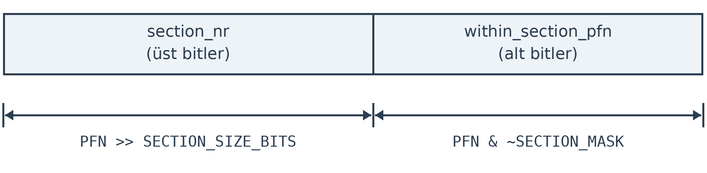

Bu bileşenleri veren makrolar vardır:

.. code-block:: c

   #define pfn_to_section_nr(pfn)       ((pfn) >> PFN_SECTION_SHIFT)
   #define pfn_to_section_offset(pfn)   ((pfn) & ~PAGE_SECTION_MASK)

Bu durumda çekirdek fiziksel sayfa numarası verildiğinde ilgili ``page`` nesnesine şöyle erişmektedir:

1. Çekirdek önce fiziksel sayfa numarasını iki bileşene ayırır.

2. Fiziksel sayfa numarasındaki bölüm numarasını ``mem_section`` dizisine indeks yaparak oradan ilgili bölümün
   bilgilerine, dolayısıyla ``section_mem_map`` elemanından da o bölümün ``page`` dizisinin adresine erişir.

3. Fiziksel sayfa numarasında offset'i (yukarıdaki şekildeki ``within_section_pfn`` kısmını) indeks yaparak bu
   dizideki ``page`` nesnesine erişir.

Bu işlemi şekilsel olarak da aşağıdaki gibi ifade edebiliriz:

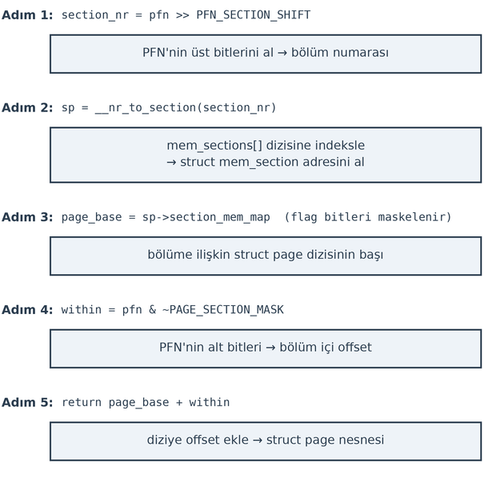

Örnek bir erişim görseli de şöyle olabilir:

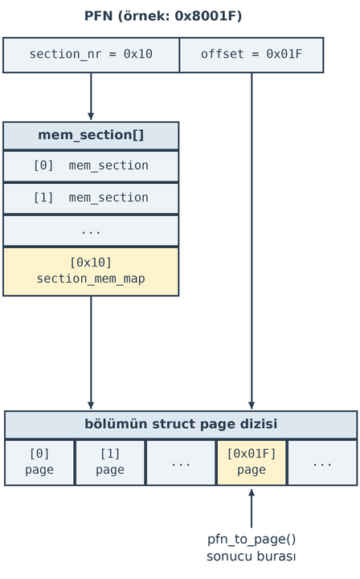

Üç Konfigürasyonun Karşılaştırılması
~~~~~~~~~~~~~~~~~~~~~~~~~~~~~~~~~~~~

Yukarıda açıkladığımız üç konfigürasyonun hangi durumlarda tercih edileceğini şöyle özetleyebiliriz:

.. list-table:: 
   :header-rows: 1
   :widths: 25 75

   * - Konfigürasyon
     - Tercih Edilme Durumu
   * - ``FLATMEM``
     - Bellek haritasında hiç delik olmayan, küçük ya da orta ölçekli UMA sistemler.
   * - ``SPARSEMEM``
     - Fiziksel bellekte büyük boşluklar olan veya bellek yapısının çalışma anında
       değiştiği (*hotplug*) sistemler.
   * - ``SPARSEMEM_VMEMMAP``
     - Modern, büyük ölçekli ve yüksek performans gerektiren tüm x86-64 ve ARM64
       sistemler.

Üç konfigürasyon parametresini erişim bakımından da şöyle karşılaştırabiliriz:

.. list-table:: 
   :header-rows: 1
   :widths: 20 40

   * - Konfigürasyon
     - ``pfn_to_page()`` yöntemi
   * - ``CONFIG_FLATMEM``
     - ``mem_map + (pfn - ARCH_PFN_OFFSET)`` → tek global dizi, tek toplama
   * - ``CONFIG_SPARSEMEM_VMEMMAP``
     - ``vmemmap + pfn`` → ``FLATMEM`` kadar hızlı, tek toplama; ama delikler için
       fiziksel sayfa yok
   * - ``CONFIG_SPARSEMEM`` (VMEMMAP'siz)
     - ``mem_sections[pfn >> SHIFT].section_mem_map + pfn`` 

page Nesneleri ile İlgili Erişim Makroları ve Fonksiyonları
-----------------------------------------------------------

Çekirdeğin yukarıda belirttiğimiz ``CONFIG_FLATMEM``, ``CONFIG_SPARSEMEM_VMEMMAP`` ve ``CONFIG_SPARSEMEM``
konfigürasyon parametreleri ne olursa olsun, çekirdek belli bir fiziksel sayfa numarasını alarak ``page``
nesnesinin adresini veren ``pfn_to_page`` isimli bir makro bulundurmaktadır. Yani bu makro bu üç konfigürasyon
parametresinde de kullanılabilir durumdadır. Makro ``CONFIG_FLATMEM`` durumunda şöyle tanımlanmıştır:

.. code-block:: c

   #define pfn_to_page          __pfn_to_page
   #define __pfn_to_page(pfn)   (mem_map + ((pfn) - ARCH_PFN_OFFSET))

Buradaki ``ARCH_PFN_OFFSET`` değeri genellikle 0'dır. Görüldüğü gibi makronun yaptığı tek şey ``mem_map``
dizisinin ilgili elemanının adresini elde etmektir. ``CONFIG_SPARSEMEM_VMEMMAP`` durumunda ise makro şöyle
tanımlanmıştır:

.. code-block:: c

   #define pfn_to_page          __pfn_to_page
   #define __pfn_to_page(pfn)   (vmemmap + (pfn))

Burada da görüldüğü gibi ``page`` yapı nesnesinin adresi ``vmemmap`` adresine ``pfn`` toplanarak elde edilmiştir.
``CONFIG_SPARSEMEM`` durumunda ise makro şöyledir:

.. code-block:: c

   #define pfn_to_page          __pfn_to_page
   #define __pfn_to_page(pfn)                                      \
   ({  unsigned long __pfn = (pfn);                                \
       struct mem_section *__sec = __pfn_to_section(__pfn);        \
       __section_mem_map_addr(__sec) + __pfn;                      \
   })

Burada yukarıda açıkladığımız gibi önce fiziksel sayfa numarasından bölüm (*section*), sonra da bu bölüm
içerisindeki ``page`` nesnesi elde edilmiştir. Buradaki ``__pfn_to_section`` fonksiyonu sayfa numarasından bölüm
nesnesini, ``__section_mem_map_addr`` fonksiyonu ise sayfa numarasından offset'i elde etmektedir.

Örneğin 12345 numaralı fiziksel sayfanın ``page`` yapı nesnesinin adresini elde etmek isteyelim. Yukarıda da
belirttiğimiz gibi bizim artık çekirdeğin hangi konfigürasyonu kullandığını bilmemize gerek kalmamaktadır. Tek
yapacağımız şey ``pfn_to_page(12345)`` çağrısını uygulamaktır.

Bazen yukarıdaki işlemin tersinin de yapılması gerekebilmektedir. Yani elimizde bir ``page`` nesnesinin adresi
vardır ve bunun hangi fiziksel sayfa numarasına karşı geldiğini bulmak isteyebiliriz. Eskiden ``page`` yapısının
içerisinde bu bilgi vardı. Ancak daha sonra bu bilgi kaldırıldı. Bu işlemi yapan ``page_to_pfn`` makrosu
bulundurulmuştur. Bu makro yukarıdaki işlemlerin tersini yapmaktadır. Örneğin ``CONFIG_FLATMEM`` durumunda şöyle
tanımlanmıştır:

.. code-block:: c

   #define page_to_pfn          __page_to_pfn
   #define __page_to_pfn(page)  ((unsigned long)((page) - mem_map) + ARCH_PFN_OFFSET)

``CONFIG_SPARSEMEM_VMEMMAP`` durumunda ise şöyle tanımlanmıştır:

.. code-block:: c

   #define page_to_pfn          __page_to_pfn
   #define __page_to_pfn(page)  ((unsigned long)((page) - vmemmap))

``CONFIG_SPARSEMEM`` durumunda ise şöyle tanımlanmıştır:

.. code-block:: c

   #define __page_to_pfn(pg)                                                           \
   ({  const struct page *__pg = (pg);                                                 \
       int __sec = memdesc_section(__pg->flags);                                       \
       (unsigned long)(__pg - __section_mem_map_addr(__nr_to_section(__sec)));         \
   })

``page_to_virt`` isimli makro ``page`` nesnesinin adresini parametre olarak alıp sanal adres vermektedir. Bu işlem
aslında zaten ``page_to_pfn`` kullanılarak yapılabilmektedir. Bu makro ``include/linux/pfn.h`` dosyasında tipik
olarak şöyle yazılmıştır:

.. code-block:: c

   #define page_to_virt(x)    __va(PFN_PHYS(page_to_pfn(x)))

Buradaki ``PFN_PHYS`` makrosu aslında değeri sayfa büyüklüğü ile çarpmaktadır:

.. code-block:: c

   #define PFN_PHYS(x)    ((phys_addr_t)(x) << PAGE_SHIFT)

``virt_to_page`` makrosu da ters işlem yapmaktadır. Yani sanal adresi verilen sayfanın ``page`` nesne adresini
bize vermektedir. Makro tipik olarak şöyle yazılmıştır:

.. code-block:: c

   #define virt_to_page(kaddr)  pfn_to_page(__pa(kaddr) >> PAGE_SHIFT)

Burada tam ters işlem yapıldığını görüyorsunuz.

Ayrıca çekirdekte ``page_to_virt`` fonksiyonuna benzer ``page_address`` isimli bir fonksiyon da bulunmaktadır.
Bu fonksiyon da ``page`` nesne adresini alıp sayfanın sanal bellek adresini vermektedir. Ancak bu fonksiyon
``page_to_virt`` fonksiyonundan daha temkinli yazılmıştır. ``page_to_virt`` fonksiyonu 32 bit sistemlerdeki
``HIGHMEM`` alanındaki sayfa adreslerini dönüştürememektedir. Halbuki ``page_address`` fonksiyonu bu işlemi de
yapmaktadır. Fonksiyon mevcut çekirdeklerde ``mm/highmem.c`` içerisinde aşağıdaki parametrik yapıya sahip
biçimde tanımlanmıştır:

.. code-block:: c

   void *page_address(const struct page *page);

Tabii 64 bit sistemlerde ``page_to_virt`` fonksiyonuyla ``page_address`` fonksiyonu arasında işlevsel bir fark
yoktur.

Çekirdeğin Fiziksel Adresler Yoluyla Belleğe Erişimi
====================================================

Şimdi de çekirdeğin fiziksel belleğe nasıl eriştiği üzerinde duralım. Bu konuya Linux çekirdek terminolojisinde
*doğrudan haritalama* (*kernel direct mapping*) de denilmektedir. Anımsanacağı gibi proseslerin sayfa tablolarında
çekirdeğe ilişkin alanlar aynıdır ve prosesler arası geçiş olsa bile çekirdek her zaman sanal belleğin aynı
yerindedir. Örneğin 32 bit Linux sistemlerinde sayfa tablolarının aşağıdakine benzediğini belirtmiştik (aslında bu
sistemlerde sayfa tabloları iki kademelidir, ancak biz algısal kolaylık sağlamak amacıyla sanki bunu tek
kademeliymiş gibi gösteriyoruz):


64 bit sistemlerde de sayfa tablosu şöyleydi:


Peki çekirdek (ya da aygıt sürücüler) belli bir fiziksel adrese erişmek isterse bunu nasıl yapabiliyor? Çünkü
çekirdek kodları da yine aynı sayfa tablosunu kullanmaktadır. Yani çekirdek kodları da sayfa tablosu
dönüştürmesiyle fiziksel belleğe erişmektedir. İşte Linux çekirdeğinde sayfa tablosunun çekirdek alanı fiziksel
belleğin başından itibaren haritalanmıştır (map edilmiştir). Örneğin 32 bit bir sistemde sayfa tablosunda çekirdek
alanının ilk sayfası 0 numaralı fiziksel sayfaya, ikinci sayfası 1 numaralı fiziksel sayfaya, üçüncü sayfası 2
numaralı fiziksel sayfaya ve diğer sayfaları da bu biçimde fiziksel belleğin diğer sayfalarına referans
etmektedir. Başka bir deyişle örneğin 32 bit Linux sistemlerinde biz çekirdek modunda ``0xC0000000`` sanal
adresini kullandığımızda aslında fiziksel belleğin 0'ıncı adresine erişmiş oluruz. Bu durumda biz 32 bit bir
sistemde çekirdek modunda fiziksel belleğin ``paddr`` adresine erişmek için ``0xC0000000 + paddr`` sanal adresini
kullanırız. Ya da biz çekirdek modunda sanal ``vaddr`` adresinin fiziksel belleğin neresini belirttiğini
``vaddr - 0xC0000000`` işlemiyle tespit edebiliriz. Çekirdek alanının başlangıcı çekirdek kodlarında
``PAGE_OFFSET`` sembolik sabitiyle belirtilmektedir. 32 bit Linux sistemlerinde ``PAGE_OFFSET`` değeri tipik
olarak ``0xC0000000`` biçimindedir. 32 bit Linux sistemlerinde sayfa tablosunun çekirdek kısmını şöyle
düşünebilirsiniz:

.. list-table::
   :header-rows: 1
   :widths: 50 50

   * - Sanal Sayfa Numarası
     - Fiziksel Sayfa Numarası
   * - ...
     - ...
   * - ``C0000``
     - ``00000``
   * - ``C0001``
     - ``00001``
   * - ``C0002``
     - ``00002``
   * - ...
     - ...

32 Bit Sİstemlerde HIGHMEM Alanına Erişim
-----------------------------------------
    
32 bit Linux sistemlerinde *doğrudan haritalama (direct mapping)* konusunda bir sorun vardır. Sayfa
tablosunda çekirdek alanı için 1 GB yer kaldığına göre ancak bu yolla olsa olsa fiziksel belleğin ilk 1 GB'sine
doğrudan erişilebilmektedir. Aslında durum tam böyle de değildir. 32 bit Linux çekirdeklerinde sayfa tablosunun
çekirdek kısmının hepsi değil yalnızca ilk 896 MB'lik kısmı doğrudan haritalama için kullanılmaktadır. Çünkü
32 bit Linux çekirdekleri geri kalan 128 MB'lik alanı başka yerlere erişmek için yani başka amaçlarla
kullanmaktadır:

.. image:: /_static/32bit-linux-kernel-direct-map.png
   :alt: 32 bit Linux sisteminde kullanıcı ve çekirdek alanının doğrudan haritalama ile fiziksel belleğe erişimi
   :align: center
   :width: 65%

32 bit Linux sistemlerinde doğrudan haritalamada sanal adres ile fiziksel adres dönüştürmesi şöyle yapılmaktadır:

.. code-block:: none

   VA = PA + PAGE_OFFSET
   PA = VA − PAGE_OFFSET

Şekilden de gördüğünüz gibi 896 MB'nin yukarısı başka amaçlarla kullanılmaktadır. 32 bit Linux sistemlerinde
fiziksel bellekteki ilk 896 MB'nin yukarısına *HIGHMEM* denilmektedir. NUMA düğümleri içerisinde (UMA sistemleri
tek NUMA düğümü varmış gibi ele alınıyordu) ``ZONE_HIGHMEM`` isimli bir bölgenin de var olduğunu anımsayınız.
Bu bölge yalnızca 32 bit Linux sistemlerinde bulunmaktadır. İzleyen paragraflarda göreceğimiz gibi 64 bit Linux
sistemlerinde fiziksel belleğin her yeri zaten doğrudan haritalanabilmektedir.

Peki 32 bit Linux sistemlerinde çekirdek ya da aygıt sürücüler *HIGHMEM* fiziksel bellek alanına nasıl
erişmektedir? İşte bu erişim ancak çekirdeğin sayfa tablosunun belli kısmını belli kısımlarını (buraya *pkmap alanı* 
ve *fixmap alanı* denilmektedir) geçici biçimde değiştirmesiyle sağlanabilmektedir.

.. image:: /_static/32bit-physmem-virtmem-map.png
   :alt: 32 bit Linux sisteminde fiziksel RAM ile çekirdek sanal bellek alanının haritalanması
   :align: center
   :width: 80%

kmap, kmap_atomic ve kmap_local_page Fonksiyonları
~~~~~~~~~~~~~~~~~~~~~~~~~~~~~~~~~~~~~~~~~~~~~~~~~~

Geçici eşleştirme için ``kmap``, ``kmap_atomic`` ve ``kmap_local_page`` fonksiyonları kullanılmaktadır. Bu fonksiyonlar 
sayfa tablosunun *pkmap* ya da *fixmap* alanını geçici olarak değiştirmektedir. 

.. image:: /_static/kernel_virtual_memory_layout.png
   :alt: 32 bit Linux sisteminde fiziksel RAM ile çekirdek sanal bellek alanının haritalanması
   :align: center
   :width: 60%

``kmap`` fonksiyonunun parametrik yapısı şöyledir:

.. code-block:: c

    void *kmap(struct page *page);

Fonksiyon fiziksel sayfayı temsil eden bir ``page`` nesnesini parametre olarak alır. Eğer bu ``page``
nesnesi ``HIGHMEM`` bölgesine ilişkinse çekirdeğin sayfa tablosunun kmap alanında giriş oluşturarak o
fiziksel sayfaya erişmekte kullanılan sanal adresi geri döndürür. Eğer fonksiyona verilen ``page``
nesnesi ``HIGHMEM`` bölgesine ilişkin değilse fonksiyon doğrudan o ``page`` nesnesine ilişkin sanal adresi
geri döndürmektedir. Fonksiyon güncel çekirdeklerde ```include/linux/highmem-internals.h`` dosyası içerisinde şöyle tanımlanmıştır:

.. code-block:: c

    static inline void *kmap(struct page *page)
    {
        void *addr;

        might_sleep();
        if (!PageHighMem(page))
            addr = page_address(page);
        else
            addr = kmap_high(page);
        kmap_flush_tlb((unsigned long)addr);
        return addr;
    }

Görüldüğü gibi önce sayfanın ``HIGHMEM`` bölgesinde olup olmadığına bakılmış, sayfa ``HIGHMEM`` bölgesinde
değilse onun sanal adresi doğrudan verilmiş, sayfa ``HIGHMEM`` bölgesindeyse ``kmap_high`` fonksiyonuyla
sanal adres oluşturulmuştur.

``kmap`` işlemi sırasında bloke oluşabilir. Ancak blokesiz eşleştirme için çekirdek içerisinde ayrıca
``kmap_atomic`` ya da bunun daha modern biçimi olan ``kmap_local_page`` fonksiyonu bulundurulmuştur.
Bu fonksiyonlar tahsisatı *fixmap* alanından yapmaktadır. 

.. code-block:: c

    void *kmap_atomic(const struct page *page);
    void *kmap_local_page(struct page *page);

Tabii ``kmap``, ``kmağ_atomic``ve ``kmap_local_page`` fonksiyonlarını kullanmak için önceden bir ``page`` 
nesnesinin bir bölge içerisinde tahsis edilmiş olması gerekir. Biz bu tahsisatın nasıl yapıldığını 
*ikiz blok tahsisat sistemi (buddy allocator)* kısmında açıklayacağız.

Çekirdeğin 6'lı versiyonlarında ``kmap`` ve ``kmap_atomic`` fonksiyonları *deprecated* yapılmıştır ve
artık ``kmap_local_page`` fonksiyonunun kullanılması tavsiye edilmektedir. ``kmap`` fonksiyonu eskiden
tasarımdan dolayı (performansı artırmak için değil) bloke olabiliyordu. Yeni tasarım bu zorunluluğu ortadan
kaldırmıştır. ``kmap_local_page`` artık hiçbir zaman bloke olmamaktadır. ``kmap()`` "kıt kaynağı adil
paylaştır, gerekirse beklet" biçiminde tasarlanmıştı. Oysa ``kmap_local_page()`` "kaynağı kıt olmaktan
çıkar, bekleme diye bir kavram kalmasın" biçiminde tasarlanmıştır. Bu tasarım hem daha hızlıdır hem her
bağlamdan çağrılabilir.

Bu fonksiyonlarla oluşturulan geçici haritalama aşağıdaki fonksiyonlarla kaldırılabilmektedir:

.. code-block:: c

    void kunmap(const struct page *page);

    #define kunmap_atomic(__addr)                           \
    do {                                                    \
        BUILD_BUG_ON(__same_type((__addr), struct page *)); \
        __kunmap_atomic(__addr);                            \
    } while (0)

    void kunmap_local(void *addr);

Bir ``page`` nesnesinin ``HIGHMEM`` alanına ilişkin olup olmadığı ``is_highmem_page`` fonksiyonuyla
kontrol edilebilmektedir:

.. code-block:: c

    bool is_highmem_page(struct page *page);

5.11 öncesi çekirdek versiyonarı için ``HIGHMEM`` bölgesine erişmekte kullanılan ``kmap``, ``kmap_atomic``
ve ``kmap_local_page`` fonksiyonlarından hangisinin hangi durumda kullanılacağına ilişkin karar ağacını
aşağıdaki gibi oluşturabiliriz:

.. code-block:: text

    HIGHMEM sayfasına erişmem gerekiyor
            │
            ▼
    Interrupt / IRQ bağlamı içerisinde miyim?
    ├── Evet ──► kmap_atomic() veya kmap_local_page()
    │              │
    │              ▼
    │         Çok kısa bir erişim mi? (birkaç satır)
    │         ├── Evet ──► kmap_atomic()
    │         └── Hayır ─► kmap_local_page() (kernel 5.x+)
    │
    └── Hayır ─► Process bağlamı içerisinde miyim?
                   │
                   ▼
              Uzun süreli erişim gerekli mi?
              ├── Evet ──► kmap()  (proses uyuyabilir)
              └── Hayır ─► kmap_local_page() tercih et

Aynı karar ağacı güncel çekirdekler için şöyle oluşturulabilir:

.. code-block:: text

    HIGHMEM sayfasına erişmem gerekiyor
            │
            ▼
    Eşlenen adres başka bir task'a/CPU'ya verilecek
    ya da fonksiyon kapsamı dışında saklanacak mı?
    │
    ├── Evet ──► kmap()
    │            (tek meşru kullanım alanı; process bağlamı
    │             gerektirir, slot beklerken uyuyabilir)
    │
    └── Hayır ─► kmap_local_page()   ◄── varsayılan tercih
                    │
                    ▼
            Eşleştirme sırasında page fault
            olmaması mı gerekiyor?
            ├── Evet ──► kmap_local_page() + pagefault_disable()
            └── Hayır ─► olduğu gibi kullan
                    │
                    ▼
            (IRQ / softirq / spinlock altı dahil her
            bağlamdan çağrılabilir; LIFO sırayla
            kunmap_local(), task başına en çok 16 iç içe)

Aşağıdaki tabloda bu üç fonksiyonu karşılaştırıyoruz:

.. list-table:: 
   :header-rows: 1
   :widths: 32 23 23 22

   * - Özellik
     - ``kmap``
     - ``kmap_atomic``
     - ``kmap_local_page``
   * - Bölge
     - pkmap
     - fixmap
     - fixmap
   * - Slot takibi
     - global dizi
     - CPU başına
     - thread başına stack
   * - Bloke oluşur mu?
     - Evet
     - Hayır
     - Hayır
   * - Preemption disable
     - Hayır
     - Evet
     - Hayır
   * - Pagefault disable
     - Hayır
     - Evet
     - Hayır
   * - Migration disable
     - Hayır
     - Evet (örtük)
     - Evet
   * - IRQ içinde güvenli
     - Hayır
     - Evet
     - Evet
   * - Bağlamsal geçiş güvenli
     - Evet
     - Hayır
     - Evet
   * - Adres paylaşılabilir
     - Evet
     - Hayır
     - Hayır
   * - Max eşzamanlı slot
     - 512 (global)
     - CPU başına 16
     - görev başına 16
   * - LOWMEM sayfası için
     - ``page_address``
     - ``page_address``
     - ``page_address``
   * - Önerilen bağlam
     - Yalnız adres paylaşımı için
     - Önerilmiyor (*deprecated*)
     - Her bağlam (varsayılan)
   * - Çekirdek versiyonu
     - 2.x+
     - 2.x+ (*depr.*)
     - 5.11+

64 bit sistemlerde ``HIGHMEM`` diye bir bölgenin (*zone*) olmadığına bir kez daha dikkatinizi çekmek istiyoruz.
Bu nedenle 64 bit sistemlerde yukarıdaki fonksiyonlar ``CONFIG_HIGHMEM`` konfigürasyon parametresi yoluyla
sayfanın doğrudan sanal bellek adresini döndürecek biçime getirilmektedir. Örneğin 64 bit sistemlerde
``kmap_local_page`` fonksiyonu şu hale gelmektedir:

.. code-block:: c

   static inline void *kmap_local_page(const struct page *page)
   {
       return page_address(page);
   }

Bir kez daha vurgulamak istiyoruz: Burada açıkladığımız HIGHMEM sorunu ve geçici haritalama yalnızca 32 bit Linux
sistemlerinde söz konusudur. 64 bit Linux sistemlerinde zaten sayfa tablosunun çekirdek alanındaki kısmı tüm
fiziksel belleği haritalayabilmektedir. Dolayısıyla ``ZONE_HIGHMEM`` de yalnızca 32 bit sistemlerde bulunan bir
bölgedir. 64 bit Linux sistemlerinde proseslerin ve çekirdeğin sanal bellek alanı 128 TB olsa da bu sistemler
şimdilik ancak 64 TB'lik fiziksel belleği kullanabilmektedir. 128 TB'lik çekirdek alanının sayfa tablosunda
64 TB'lik fiziksel bellek zaten doğrudan haritalanabilmektedir:

.. image:: /_static/32bit-linux-virtual-memory.png
   :alt: 64 bit Linux sisteminde sanal adres alanının kullanıcı, non-canonical delik ve çekirdek bölümleri
   :align: center
   :width: 70%

Doğrudan Haritalanan Fiziksel Belleğe Erişim Makroları ve Fonksiyonları
-----------------------------------------------------------------------

Linux çekirdeklerinde doğrudan haritalanan bölge için sanal adres ve fiziksel adres dönüştürmelerini
yapan ``__pa`` ve ``__va`` makroları bulundurulmuştur. Bu makrolar şöyle yazılmıştır:

.. code-block:: c

    #define __pa(x)   ((unsigned long)(x) - PAGE_OFFSET)
    #define __va(x)   ((void *)((unsigned long)(x) + PAGE_OFFSET))

Makroların yerleri mimariye göre değişebilmektedir.

Buradaki ``PAGE_OFFSET`` değeri 32 bit sistemlerle 64 bit sistemlerde farklıdır. Ayrıca 64 bit Intel,
ARM ve RISC-V mimarisinde de küçük bir farklılık bulunmaktadır:

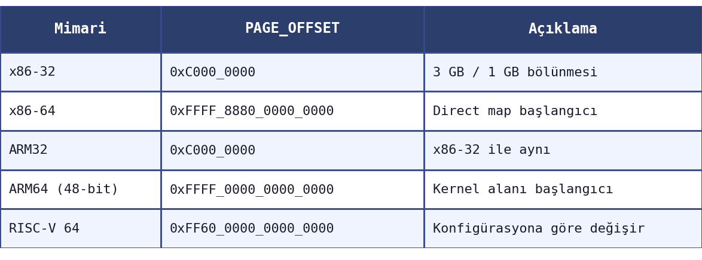

Bu makroların fonksiyon biçimleri de oluşturulmuştur:

.. code-block:: c

    static inline phys_addr_t virt_to_phys(volatile void *address)
    {
        return __pa(address);
    }

    static inline void *phys_to_virt(phys_addr_t address)
    {
        return __va(address);
    }

``__pa`` ve ``__va`` makroları ve fonksiyonlar platforma bağlı dizinlerde bulunmaktadır (örneğin
``arch/x86/asm/io.h`` gibi). Fiziksel adresle sanal adres yapan makro ve fonksiyonları aşağıda da
tablo halinde veriyoruz:

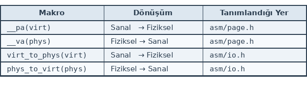

Son olarak page nesnesi ile ilgili erişim yapan makro ve fonksiyonları da ayrı bir tablo halinde veriyoruz: 

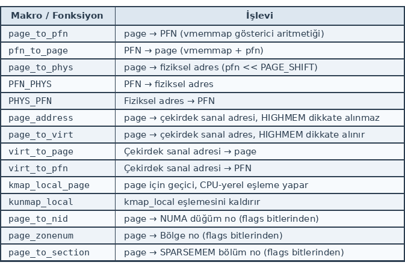
