===============================================================
Bellek Yönetimi - 2. Bölüm :raw-html:`<br>` Tahsisat İşlemleri
===============================================================

Bu bölümde Linux çekirdeğinin sayfa düzeyindeki ve byte düzeyindeki tahsisat mekanizmalarını ele
alacağız. Bölüm içerisinde önce çekirdeğin boş sayfaları nasıl belirlediğini ve sayfa düzeyinde
tahsisatları nasıl yaptığını açıklayacağız. Sonra da byte düzeyindeki tahsisat işlemleri üzerinde
duracağız.

Linux çekirdeğinde iki düzeyli tahsisat sistemi vardır:

1. Sayfa düzeyinde tahsisat sistemi (*buddy allocator*)
2. Byte düzeyinde tahsisat sistemi (*slab allocator*)

Linux çekirdeğindeki sayfa düzeyinde tahsisat sistemine *ikiz blok tahsisat sistemi* ya da
İngilizcesiyle *buddy allocator*, byte düzeyinde tahsisat sistemine ise *dilimli tahsisat sistemi*
ya da İngilizcesiyle *slab allocator* denilmektedir.  Dilimli tahsisat sistemi, ikiz blok tahsisat sistemini 
kullanrarak tahsis ettiği sayfaları byte düzeyinde tahsisatlar için organize etmektedir. Dilimli tahsisat 
sisteminin ikiz blok tahsisat sisteminin üzerine oturtulduğunu söyleyebiliriz: 

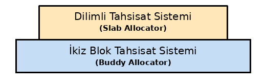

İkiz Blok Tahsisat Sistemi (Buddy Allocator)
============================================

Çekirdek tüm fiziksel sayfaları bir heap alanıymış gibi ele alıp onların tahsisatlarını yönetmektedir.
Fiziksel sayfaları temsil eden ``page`` nesneleri ilgili sayfanın tahsis edilip edilmediği gibi bilgileri
de tutmaktadır. Biz bir aygıt sürücü yazarken ya da çekirdeğe bir modül eklerken bir fiziksel sayfayı
doğrudan kullanamayız. Çünkü o sayfa başka amaçlarla başka kaynaklar tarafından kullanılıyor olabilir.
Biz önce sayfa düzeyinde tahsisat yapan fonksiyonlarla sayfayı tahsis edip ondan sonra o sayfayı
kullanabiliriz. Yukarıda da belirttiğimiz gibi Linux çekirdeğinde sayfa düzeyinde tahsisat yapan bir
tahsisat sistemi bulunmaktadır. Biz bu sisteme Türkçe *ikiz blok tahsisat sistemi* diyeceğiz. Bu sistemin
İngilizce ismi *buddy allocator* biçimindedir. İzleyen paragraflarda ikiz blok tahsisat sisteminin
algoritmik yapısını açıklayacağız.

İşletim sistemlerinde sayfa düzeyinde tahsisatların hızlı yapılması gerekir. Aynı zamanda sayfa tahsisat
sisteminin mümkün olduğunca bellek bölünmesi (*fragmentation*) olgusuna dirençli olması da istenir. İkiz
blok tahsisat sistemi ilk kez Knowlton tarafından ortaya atılmıştır. Knowlton bu algoritmayı 1965 yılında
*Communications of the ACM* dergisinde *A Fast Storage Allocator* başlıklı makalesinde açıklamıştır. Bu
sistem Linux çekirdeklerine 1.2 versiyonuyla (1995) eklenmiştir. Linux çekirdeklerinde zamanla ikiz blok 
tahsisat sistemi daha karmaşık hale getirilmiştir. Bu karmaşıklık tahsisat algoritmasının kendisinden değil 
*boş listelerin (free lists)* ve bölgelerin (zones) *fallback* denilen gözden geçirilmesi mekanizmasından 
kaynaklanmaktadır. Biz burada önce ikiz blok tahsisat sisteminin algoritmik yapısını açıklayacağız sonra 
Linux çekirdeğindeki gerçekleştirimi üzerinde
duracağız.

İkiz Blok Tahsisat Sisteminin Algoritmik Yapısı
------------------------------------------------

İkiz blok tahsisat sisteminde boş bloklar 2'nin kuvvetlerine ilişkin ardışıl fiziksel sayfalardan oluşan
bloklar biçiminde organize edilmektedir. Buradaki 2'nin kuvvetine ilişkin boş blok listelerine İngilizce
*order* denilmektedir. Biz *order* sözcüğü yerine Türkçe *düzey* sözcüğünü kullanacağız. Aşağıda 5
düzeyli bir ikiz blok sisteminin çizimi yapılmıştır:

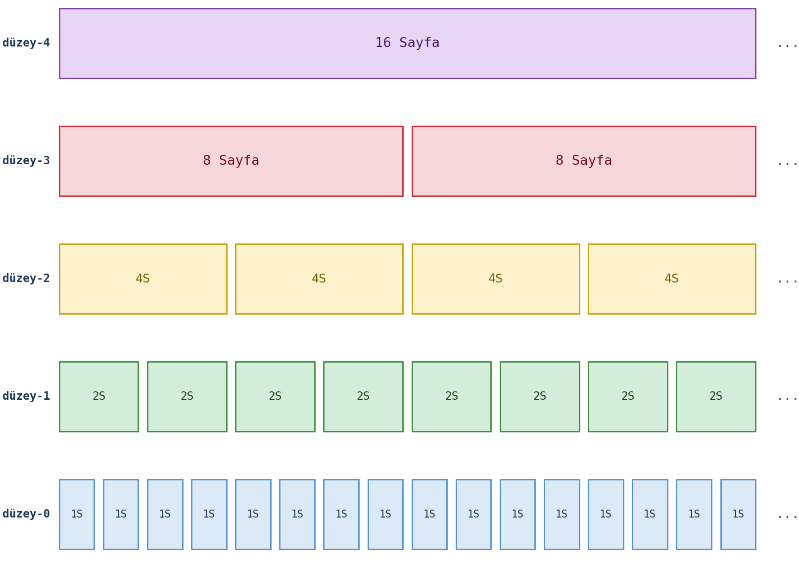

Tabii buradaki listeler boş sayfa listeleridir. Tahsis edilen sayfalar bu listelerden çıkartılmaktadır.
Tahsisat her zaman 2ⁿ sayfa olacak biçimde düzey belirtilerek yapılmaktadır. Örneğin 4 sayfanın (2²
sayfanın) tahsis edilmek istendiğini düşünelim. Tahsisat 2'inci düzeydeki boş listeden sağlanacaktır.
Peki ya istenilen düzeyde hiç boş sayfa bloğu yoksa ne olur? İşte bu durumda daha yüksek düzeylere
başvurulup onlar parçalanmaktadır. Örneğin 2'inci düzeyde boş sayfa bloğu bulunmuyor olsun. Algoritma
bu durumda 3'üncü düzeye bakar. Eğer 3'üncü düzeyde 8 sayfalık boş bir sayfa bloğu varsa onu 2 parçaya
ayırır. Parçalardan birini 2'inci düzeydeki sayfa bloğu listesine ekler, diğerini verir. Peki biz sayfa
tahsis etmek istediğimizde 2'inci düzeyde de 3'üncü düzeyde de boş sayfa bloğu yoksa ne olacaktır? İşte
bu durumda gittikçe yukarı çıkılır, ilk boş sayfa bloğu olan düzeyden blok tahsis edilir. Sonra blok
bölüne bölüne aşağıya inilir. Örneğin 4 sayfa tahsis etmek istediğimizde 3'üncü düzeyde boş sayfa bloğu
yoksa ancak 4'üncü düzeyde boş sayfa bloğu varsa bu düzeydeki 16 sayfalık blok yarıya bölünür. Bunun
8'lik kısmı 3'üncü düzeydeki boş listeye eklenir, diğer 8'lik kısmı yine bölünür, onun 4'lük kısmı
2'inci düzey listeye eklenir, diğeri de tahsis edilir. Şimdi bu süreci şekillerle adım adım gösterelim.
Başlangıç durumu şöyledir:

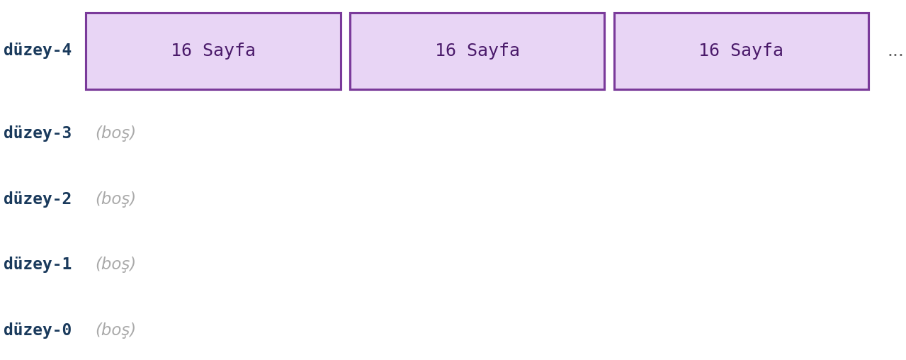

2'inci düzeyde ve 3'üncü düzeyde boş sayfa bloğu olmadığı için 4'üncü düzeydeki boş sayfa bloklarının
biri alınıp bölünür. Bölünen bloklar 8 sayfalık olacaktır. Bunlardan biri 3'üncü düzeydeki boş listeye
eklenir, diğeri bölünmeye devam eder:

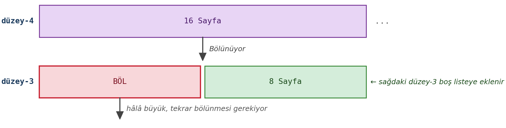

Burada 3'üncü düzeydeki 8 sayfanın yeniden ikiye bölünmesiyle bunlardan biri 2'inci düzeydeki boş listeye eklenir:

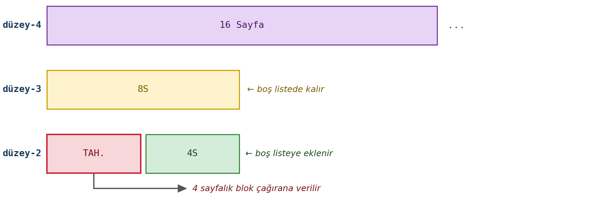

İşte 8 sayfanın 4'lük kısmı 2'inci düzeydeki bağlı listeye eklenip kalan 4'lük kısmı da çağrıyı yapana verilmektedir. 
Boş listelerin son hali şöyle olacaktır:

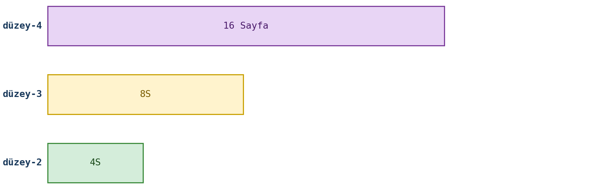

Peki tahsis edilen bu 4 sayfalık blok free hale getirildiğinde ne olmaktadır? İşte algoritma bu durumda
tersten işletilmektedir. Yani bu 4 sayfalık blok 2'inci düzeye yerleştirilir. Ancak bu 2'inci düzeyde onun
*ikizi (buddy'si)* varsa free hale getirilenle bu ikizi birleştirilerek üst düzeydeki boş listeye eklenir.
Tabii aynı durum üst düzey için de yapılacaktır. Burada bir noktaya dikkatinizi çekmek istiyoruz: Free hale
getirme algoritmasından amaç en yüksek sayfa içeren ardışıl bloğun oluşturulmasıdır. Free edilen blokla onun
*ikizinin (buddy'sinin)* birleştirilip üst bloğa taşınmasının temel amacı budur. Şimdi bu birleştirme işlemini
yine adım adım gösterelim. Free işlemi öncesindeki durum şöyledir:

Şimdi 4 sayfalık bloğu free hale getirelim. Algoritma önce bu bloğu 2'inci düzeye eklerken onun ikizi (buddy'si)
o düzeyde var mı diye bakar. Eğer varsa onları birleştirip bir yukarıdaki düzeye eklemeye çalışır. Bizim örneğimizde
onun ikizi 2'inci düzeyde bulunmaktadır:

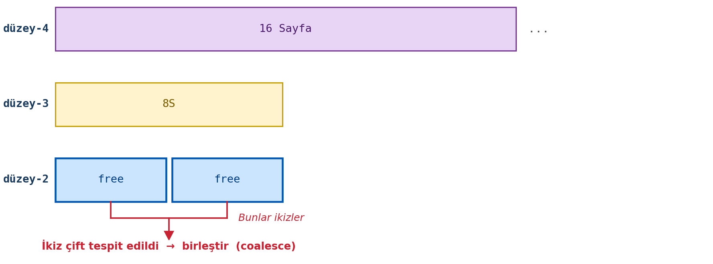

Birleştirme sonucunda şu durum oluşacaktır:

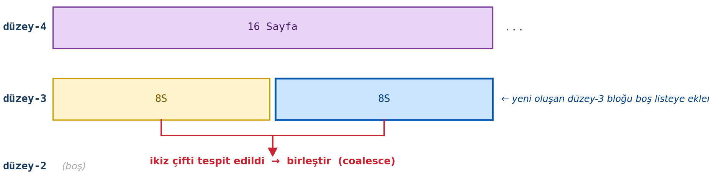

İşte 3'üncü düzeyde de birleştirilmiş bloğun ikizi bulunduğu için o ikiz blok da birleştirilip üst boş blok listesine
(4'üncü düzeydeki boş blok listesine) yerleştirilecektir:


Görüldüğü gibi her şey ters sırada eski haline gelmiştir. 

Linux çekirdeklerinde maksimum düzey ``include/linux/mmzone.h`` dosyasındaki ``MAX_ORDER`` sembolik
sabitiyle belirtiliyordu. Ancak en son çekirdeklerde (>= 6.8) artık ``MAX_ORDER`` yerine aşağıdaki
iki sembolik sabit kullanılmaya başlanmıştır:

.. code-block:: c

   #define MAX_PAGE_ORDER    10                       /* en yüksek düzey indeksi  */
   #define NR_PAGE_ORDERS    (MAX_PAGE_ORDER + 1)     /* listelerin sayısı = 11   */

``MAX_PAGE_ORDER`` maksimum düzeyin indeks numarasını, ``NR_PAGE_ORDERS`` ise bunların sayısını
belirtmektedir. Linux çekirdeklerinde maksimum düzey 10'dur. (Yani toplam 11 tane düzey listesi
bulunmaktadır.) 6.1 çekirdeği ve öncesinde ``MAX_ORDER`` toplam liste sayısını belirtirken, daha
sonra en yüksek düzey indeksini belirtir hale getirilmiştir. Nihayet yukarıda da belirttiğimiz gibi
6.8 ile birlikte bu sembolik sabitlerin isimleri değiştirilmiştir.

.. list-table::
   :header-rows: 1
   :widths: 22 78

   * - Versiyon
     - Durum
   * - ≤ 6.1
     - ``MAX_ORDER = 11``; maksimum düzey indeksi 10.
   * - 6.2 – 6.7
     - ``MAX_ORDER = 10``; anlam düzeltildi (artık indeks numarasını belirtiyor).
   * - ≥ 6.8
     - ``MAX_ORDER`` kaldırıldı → ``MAX_PAGE_ORDER = 10``, ``NR_PAGE_ORDERS = 11``.

Linux çekirdeklerinde en yüksek düzey 10 olduğuna göre ve 2\ :sup:`10` = 1024 olduğuna göre, en
yüksek düzeydeki sayfa blokları 1024 sayfadan oluşmaktadır. 1024 sayfa da 4 MB yer kaplamaktadır.

Bellek Bölgeleri ve Göç Türleri
-------------------------------

Biz yukarıda ikiz blok tahsisat sisteminin temel algoritmasını açıkladık. Ancak Linux çekirdeğinde ikiz blok
tahsisat sistemi bir tane değildir. Her NUMA düğümü bellek bölgelerinden (memory zones), her bellek bölgesi
de göç türlerine (migration types) ilişkin ikiz blok tahsisat sistemlerinden (buddy allocators)
oluşmaktadır. Yani bir bellek bölgesinde bile birden fazla ikiz blok tahsisat sistemi bulunmaktadır.

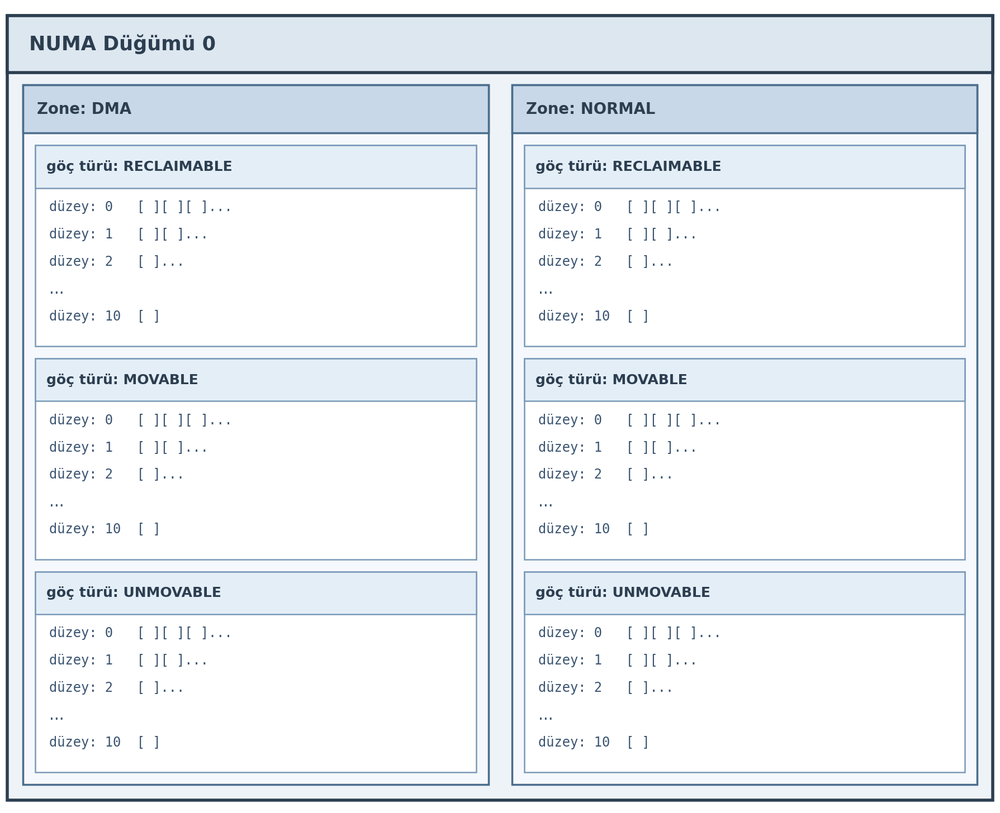

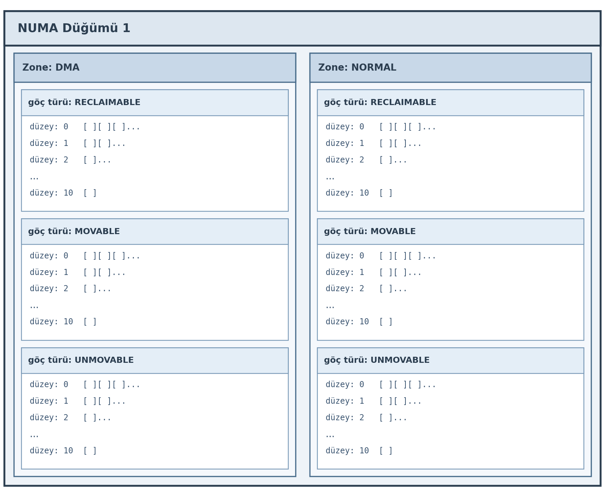

Görüldüğü gibi NUMA düğümleri bellek bölgelerinden, bellek bölgeleri ise göç türlerine göre birden fazla
ikiz blok tahsisat sisteminden oluşmaktadır.

NUMA düğümleri içerisindeki her bölgenin *zone* isimli bir yapıyla temsil edildiğini belirtmiştik.
İşte ``zone`` yapısının ``free_area`` elemanı o bölgedeki ikiz blok tahsisat sistemlerini
tutmaktadır:

.. code-block:: c

   struct zone {
       /* ... */
       struct free_area  free_area[NR_PAGE_ORDERS];
       int               nr_zones;
       /* ... */
   };

Görüldüğü gibi ``free_area`` dizisi *free_area* isimli yapı türündendir ve uzunluğu maksimum düzey
sayısına eşittir. (Yani dizi 11 elemanlıdır; ilk elemanı 0'ıncı düzeyi, son elemanı 10'uncu düzeyi
belirtmektedir.)

``free_area`` yapısı şöyle tanımlanmıştır:

.. code-block:: c

   struct free_area {
       struct list_head  free_list[MIGRATE_TYPES];
       unsigned long     nr_free;
   };

Görüldüğü gibi ``free_area`` aslında her göç türü için bağlı listelerden oluşmaktadır. Aşağıdaki
şekil bu veri yapısını daha iyi anlaşılmasına yardımcı olacaktır:

.. code-block:: text

   zone (örn. ZONE_NORMAL):
   │
   ├── free_area[0]   (düzey-0, 4 KB bloklar)
   │   ├── free_list[MIGRATE_UNMOVABLE]   → [pg1] → [pg4] → [pg9] → NULL
   │   ├── free_list[MIGRATE_MOVABLE]     → [pg2] → [pg7] → NULL
   │   ├── free_list[MIGRATE_RECLAIMABLE] → [pg3] → NULL
   │   ├── free_list[MIGRATE_HIGHATOMIC]  → NULL
   │   ├── free_list[MIGRATE_CMA]         → NULL
   │   └── free_list[MIGRATE_ISOLATE]     → NULL
   │
   ├── free_area[1]   (düzey-1, 8 KB bloklar)
   │   ├── free_list[MIGRATE_UNMOVABLE]   → [pg16,17] → NULL
   │   ├── free_list[MIGRATE_MOVABLE]     → [pg32,33] → [pg64,65] → NULL
   │   └── ...
   │
   ├── free_area[2]   (düzey-2, 16 KB bloklar)
   │   └── ...
   │
   ...
   │
   └── free_area[10]  (düzey-10, 4 MB bloklar)
       └── ...

Buradaki ``free_area``'nın düzeylerden oluşan bir dizi olduğuna, dizinin her elemanının her göç türü
için ayrı listeler barındırdığına dikkat ediniz. ``free_area`` listesinin her elemanı aslında bir
bağlı liste dizisidir. ``free_area[n]`` bağlı liste dizisi *n*'inci düzeyin her göç türü için bağlı
listelerini tutmaktadır. (Örneğin ``free_area[0]`` bağlı liste dizisi her göç türü için 0'ıncı
düzeyin bağlı listelerini, ``free_area[1]`` bağlı liste dizisi her göç türü için 1'inci düzeyin
bağlı listelerini tutmaktadır.) Göç türlerinin ne amaçla kullanıldığını izleyen paragraflarda
açıklayacağız.

Güncel çekirdeklerde ``free_area`` nesnelerinin içerisindeki ``free_list`` bağlı listeleri
``buddy_list`` elemanı yoluyla *page* nesnelerini tutar durumdadır:

.. code-block:: c

   struct page {
       memdesc_flags_t flags;

       union {
           struct {
               union {
                   /* ... */
                   struct list_head buddy_list;  /* free_list tarafından kullanılan düğüm */
                   /* ... */
               };
               /* ... */
           };
           /* ... */
       }
   } _struct_page_alignment;

Sayfa Tahsisat Fonksiyonları
----------------------------

``alloc_pages`` fonksiyonu ikiz blok tahsisat sisteminden sayfa tahsis eden en temel
fonksiyondur. Fonksiyonun parametrik yapısı şöyledir:

.. code-block:: c

    struct page *alloc_pages(gfp_t gfp_mask, unsigned int order);

``alloc_pages`` eskiden ``include/linux/gfp.h`` dosyasında ``CONFIG_NUMA`` konfigürasyon
parametresine göre makro ya da inline fonksiyon biçiminde tanımlanıyordu. Ancak daha sonra
makro haline getirilmiştir.

``alloc_pages`` fonksiyonun birinci parametresi tahsisatın nereden yapılacağını belirtmektedir.
İkinci parametresi ise tahsisat için düzey belirtmektedir. (Yani örneğin 1 sayfa tahsis
edilecekse bu parametre 0, iki sayfa tahsis edilecekse 1, 4 sayfa tahsis edilecekse 2
girilmelidir.) Fonksiyonun birinci parametresindeki ``gfp_t`` türü tipik olarak ``unsigned int``
biçiminde typedef edilmektedir. Bu parametreye çeşitli mask bayrakları bit düzeyinde OR işlemine
sokularak verilmektedir. Mask bayrakları ``include/linux/gfp_types.h`` dosyası içerisinde
define edilmiştir. Bunları aşağıda bir tablo biçiminde veriyoruz:

.. list-table:: 
   :header-rows: 1

   * - Bayraklar
     - İşlevi
   * - ``__GFP_DMA``
     - Tahsisatı ZONE_DMA'dan yap (eski ISA DMA uyumu için)
   * - ``__GFP_HIGHMEM``
     - Tahsisatı ZONE_HIGHMEM'den yap
   * - ``__GFP_DMA32``
     - Tahsisatları 32-bit adreslenebilir ZONE_DMA32'den yap
   * - ``__GFP_MOVABLE``
     - ZONE_MOVABLE'a izin ver; sayfa göç ile taşınabilir
   * - ``__GFP_RECLAIMABLE``
     - Sayfa shrinker'lar aracılığıyla geri alınabilir (dilim için)
   * - ``__GFP_WRITE``
     - Sayfa kirletilecek; bölgeler arasında dağıtılır (fair policy)
   * - ``__GFP_HARDWALL``
     - cpuset bellek tahsisat politikasını zorla uygula
   * - ``__GFP_THISNODE``
     - Yalnızca belirtilen NUMA düğümlerini ayır, fallback yok
   * - ``__GFP_ACCOUNT``
     - Tahsisatı kmemcg'ye hesapla (kernel memory cgroup)
   * - ``__GFP_HIGH``
     - Yüksek öncelikli; atomic rezervlere erişebilir
   * - ``__GFP_MEMALLOC``
     - Tüm belleğe (rezervler dahil) erişime izin ver
   * - ``__GFP_NOMEMALLOC``
     - Acil rezervlere erişimi açıkça yasakla
   * - ``__GFP_IO``
     - Bellek geri almak için fiziksel I/O başlatabilir
   * - ``__GFP_FS``
     - Bellek geri almak için dosya sistemi çağrısı yapabilir
   * - ``__GFP_DIRECT_RECLAIM``
     - Çağıran doğrudan geri alıma girebilir
   * - ``__GFP_KSWAPD_RECLAIM``
     - Low watermark'ta kswapd'yi uyandırabilir
   * - ``__GFP_RECLAIM``
     - ``__GFP_DIRECT_RECLAIM | __GFP_KSWAPD_RECLAIM`` kısayolu
   * - ``__GFP_RETRY_MAYFAIL``
     - İlerleme varsa geri alımı tekrar dene; OOM'u tetiklemez
   * - ``__GFP_NOFAIL``
     - Sonsuz yineleme; asla başarısız olamaz, bloke olabilir
   * - ``__GFP_NORETRY``
     - Yalnızca hafif geri alım dene; "OOM killer" çağrılmaz
   * - ``__GFP_NOWARN``
     - Ayırma başarısız olursa çekirdek uyarı mesajını bastır
   * - ``__GFP_COMP``
     - Bileşik sayfalar için metadata ekle (büyük sayfa grupları için)
   * - ``__GFP_ZERO``
     - Başarılı tahsisatlarda sıfırlanmış sayfa döndür
   * - ``__GFP_ZEROTAGS``
     - Bellek sıfırlanırken KASAN HW bellek etiketlerini de sıfırla
   * - ``__GFP_SKIP_ZERO``
     - KASAN HW etiket sıfırlamasını atla
   * - ``__GFP_SKIP_KASAN``
     - KASAN sayfa zehirleme/çözme kontrollerini atla
   * - ``__GFP_NOLOCKDEP``
     - GFP context takibi için lockdep denetimini devre dışı bırak

Linux çekirdek kodlamasında başı ``__`` ile başlayan değişkenlerin "aşağı seviyeli kodlar
tarafından kullanıldığını" anımsayınız. Yukarıdaki bayraklar ince ayar için kullanılmaktadır.
Bunların her bileşimi anlamlı değildir. Yani örneğin bazı bayraklar bazı bayraklarla
kullanılamamaktadır. Aslında çekirdek içerisinde yukarıdaki bayraklar kullanılarak oluşturulmuş
başı ``__`` ile başlamayan daha yüksek seviyeli bayraklar da vardır. Bunların listesini de
aşağıdaki tabloda veriyoruz:

.. list-table:: 
   :width: 70%
   :header-rows: 1
  
   * - Bileşke Bayraklar
     - Bileşen Bayraklar
   * - ``GFP_ATOMIC``
     - ``__GFP_HIGH | __GFP_KSWAPD_RECLAIM``
   * - ``GFP_KERNEL``
     - ``__GFP_RECLAIM | __GFP_IO | __GFP_FS``
   * - ``GFP_KERNEL_ACCOUNT``
     - ``GFP_KERNEL | __GFP_ACCOUNT``
   * - ``GFP_NOWAIT``
     - ``__GFP_KSWAPD_RECLAIM``
   * - ``GFP_NOIO``
     - ``__GFP_RECLAIM``
   * - ``GFP_NOFS``
     - ``__GFP_RECLAIM | __GFP_IO``
   * - ``GFP_USER``
     - ``__GFP_RECLAIM | __GFP_IO | __GFP_FS | __GFP_HARDWALL``
   * - ``GFP_HIGHUSER``
     - ``GFP_USER | __GFP_HIGHMEM``
   * - ``GFP_HIGHUSER_MOVABLE``
     - ``GFP_HIGHUSER | __GFP_MOVABLE | __GFP_SKIP_KASAN``
   * - ``GFP_DMA``
     - ``__GFP_DMA``
   * - ``GFP_DMA32``
     - ``__GFP_DMA32``
   * - ``GFP_TRANSHUGE``
     - ``GFP_HIGHUSER_MOVABLE | __GFP_COMP | __GFP_NOMEMALLOC |``
       ``__GFP_NORETRY | __GFP_NOWARN | __GFP_KSWAPD_RECLAIM``
   * - ``GFP_TRANSHUGE_LIGHT``
     - ``GFP_HIGHUSER_MOVABLE | __GFP_COMP | __GFP_NOMEMALLOC |``
       ``__GFP_NORETRY | __GFP_NOWARN``

Programcılar genellikle bu yüksek seviyeli bayrakları kullanmaktadır. Örneğin ``GFP_ATOMIC``,
``GFP_KERNEL``, ``GFP_USER``, ``GFP_DMA``, ``GFP_DMA32`` en çok kullanılan yüksek seviyeli
bayraklardır. Biz bu bayraklar hakkında izleyen paragraflarda daha fazla bilgi vereceğiz.

``alloc_pages`` fonksiyonu başarı durumunda tahsis edilen sayfaların ilkine ilişkin ``page``
yapı nesnesinin adresiyle, başarısızlık durumunda ``NULL`` adresle geri dönmektedir.
Anımsanacağı gibi zaten çekirdek tüm sayfaları doğrudan ya da dolaylı biçimde bir dizi
içerisinde tutmaktadır. ``alloc_pages`` bize ilgili ``page`` nesnesinin bu dizideki adresini
vermektedir. Burada bize verilen ``page`` adresini biz ilerleterek ilgili dizinin sonraki
elemanına erişiriz. İkiz blok tahsisat sisteminde her zaman fiziksel bellekte ardışıl fiziksel
sayfaların tahsis edildiğini anımsayınız. Tabii ``alloc_pages`` fonksiyonun bize verdiği adres
sanal adrestir. Anımsanacağı gibi bir ``page`` nesnesinin adresi bilindiğinde bunun fiziksel
bellekteki kaç numaralı sayfaya ilişkin olduğu ``page_to_pfn`` fonksiyonuyla elde
edilebilmekteydi.

``alloc_pages`` fonksiyonuyla tahsis edilen sayfaların ``__free_pages`` fonksiyonuyla serbest
bırakılması gerekir:

.. code-block:: c

    void __free_pages(struct page *page, unsigned int order);

Fonksiyon ``mm/page_alloc.c`` dosyası içerisinde tanımlanmıştır. Fonksiyonun birinci parametresi
tahsisata ilişkin ilk ``page`` nesnesinin adresini, ikinci parametresi ise düzey bilgisini
belirtmektedir. Örneğin 2'inci düzeyden 4 sayfa tahsis etmiş olalım. Bu sayfaları serbest
bırakırken yine düzey bilgisini 2 olarak girmeliyiz. Örneğin:

.. code-block:: c

    struct page *pages;

    pages = alloc_pages(GFP_KERNEL, 2);  /* 2'inci düzeyden 4 ardışıl fiziksel sayfa tahsis ediliyor */
    if (pages == NULL)
        return -ENOMEM;

    /* ... */

    __free_pages(pages, 2);              /* 2'inci düzeyden yapılan tahsisat iade ediliyor */

``alloc_pages`` ve ``__free_pages`` fonksiyonları export edildiği için aygıt sürücüler
tarafından da kullanılabilmektedir.

``alloc_pages`` fonksiyonun başında ``__`` yokken yapılan tahsisatı serbest bırakan
``__free_pages`` fonksiyonun başında ``__`` olması bir uyumsuzluk oluşturmaktadır. Çekirdekte
aslında ``free_pages`` isimli başka bir fonksiyon da vardır. Bu fonksiyon sayfaları onların
sanal adreslerini (``page`` adreslerini değil sanal adreslerini) alarak serbest bırakmaktadır.

``alloc_pages`` ile tahsis edilen sayfaları farklı miktarlarda iade etmeye çalışmayınız. Bu
durumda dilimli tahsisat sistemini bozabilirsiniz:

.. code-block:: c

    __free_pages(pages + 0, 0);  /* dikkat! yanlış kullanım */
    __free_pages(pages + 1, 0);  /* dikkat! yanlış kullanım */
    __free_pages(pages + 2, 0);  /* dikkat! yanlış kullanım */
    __free_pages(pages + 3, 0);  /* dikkat! yanlış kullanım */

``__get_free_pages`` fonksiyonunun tek sayfayı serbest bırakan ``__get_free_page`` isimli makrosu da bulunmaktadır:

.. code-block:: c

   #define __get_free_page(gfp_mask) __get_free_pages((gfp_mask), 0)

``alloc_pages`` fonksiyonunun bize fiziksel sayfanın sanal adresini vermediğine, o sayfayı
yönetmekte kullanılan ``page`` nesnesinin adresini verdiğine dikkat ediniz. Biz eğer ilgili
sayfanın içeriğine erişmek istiyorsak ``page_to_virt`` makrosunu ya da ``page_address``
fonksiyonunu kullanmalıyız.

Eğer tek sayfalık tahsisat yapılacaksa ``alloc_pages`` yerine ``alloc_page`` makrosu
kullanılabilir. Bu makro ``include/linux/gfp.h`` dosyasında şöyle yazılmıştır:

.. code-block:: c

    #define alloc_page(gfp_mask)    alloc_pages(gfp_mask, 0)

Yukarıda da belirttiğimiz gibi artık ``alloc_pages`` de çekirdeklerde bir süredir makro olarak
yazılmaktadır. 

Burada çekirdekteki makroların ve ``static inline`` fonksiyonların aygıt sürücülerde kullanımına ilişkin bir
noktayı belirtmek istiyoruz. Bir makro ya da ``inline`` fonksiyon koda açılmaktadır. Açılan koddaki makrolar da
yeniden açılmaktadır. Makroların ve ``inline`` fonksiyonların export edilmesi söz konusu değildir. Makroların ve
``inline`` fonksiyonların çekirdek modülleri ve aygıt sürücüler tarafından kullanılabilmesi için onların açımları
sonucunda çağrılan fonksiyonların export edilmiş olması gerekir.

Aşağıda ``alloc_pages`` ve ``__free_pages`` fonksiyonlarının kullanımına ilişkin basit bir aygıt sürücü örneği
verilmiştir. Aygıt sürücünün ``init`` fonksiyonunda sayfa tahsisatı yapılmış ve sayfanın sanal adresi bir global
değişkende saklanmıştır. ``write`` işleminde bu sayfaya yazma yapılıp, ``read`` işleminde de yazılanlar okunmuştur.
Aygıt sürücünün ``exit`` fonksiyonunda da tahsis edilen sayfa serbest bırakılmıştır.

Aygıt sürücünün ``init`` fonksiyonunda sayfa tahsisatı şöyle yapılmıştır:

.. code-block:: c

    static void *g_pageaddr;

    static int __init test_driver_init(void)
    {
        struct page *page;

        if ((page = alloc_pages(GFP_KERNEL, 0)) == NULL) {
            printk(KERN_ERR "cannot alloc pages!..\n");
            cdev_del(&g_cdev);
            unregister_chrdev_region(g_dev, 1);
            return -ENOMEM;
        }

        g_pageaddr = page_address(page);

        return 0;
    }

Aygıt sürücünün ``exit`` fonksiyonunda tahsisat şöyle geri alınmıştır:

.. code-block:: c

    static void __exit test_driver_exit(void)
    {
        __free_pages(virt_to_page(g_pageaddr), 0);

        /* ... */
    }

Aygıt sürücünün ``read`` ve ``write`` fonksiyonları da şöyledir:

.. code-block:: c

    static ssize_t test_driver_read(struct file *filp, char *buf, size_t size, loff_t *off)
    {
        if (copy_to_user(buf, g_pageaddr, size) != 0)
            return -EFAULT;

        return size;
    }

    static ssize_t test_driver_write(struct file *filp, const char *buf, size_t size, loff_t *off)
    {
        if (copy_from_user(g_pageaddr, buf, size) != 0)
            return -EFAULT;

        return size;
    }

Aygıt sürücünün tam kaynak kodu aşağıda verilmiştir. Aygıt sürücüyü yükledikten sonra ``test-page.c`` programı
ile test edebilirsiniz.

``test-driver.c``

.. code-block:: c

    #include <linux/module.h>
    #include <linux/kernel.h>
    #include <linux/fs.h>
    #include <linux/cdev.h>
    #include <linux/gfp.h>
    #include <linux/mm.h>

    MODULE_LICENSE("GPL");
    MODULE_AUTHOR("Kaan Aslan");
    MODULE_DESCRIPTION("test-driver");

    static int test_driver_open(struct inode *inodep, struct file *filp);
    static int test_driver_release(struct inode *inodep, struct file *filp);
    static ssize_t test_driver_read(struct file *filp, char *buf, size_t size, loff_t *off);
    static ssize_t test_driver_write(struct file *filp, const char *buf, size_t size, loff_t *off);

    static dev_t g_dev;
    static struct cdev g_cdev;
    static struct file_operations g_fops = {
        .owner = THIS_MODULE,
        .open = test_driver_open,
        .read = test_driver_read,
        .write = test_driver_write,
        .release = test_driver_release,
    };
    static void *g_pageaddr;

    static int __init test_driver_init(void)
    {
        int result;
        struct page *page;

        printk(KERN_INFO "test-driver module initialization...\n");

        if ((result = alloc_chrdev_region(&g_dev, 0, 1, "test-driver")) < 0) {
            printk(KERN_INFO "cannot alloc char driver!...\n");
            return result;
        }
        cdev_init(&g_cdev, &g_fops);
        if ((result = cdev_add(&g_cdev, g_dev, 1)) < 0) {
            unregister_chrdev_region(g_dev, 1);
            printk(KERN_ERR "cannot add device!...\n");
            return result;
        }

        if ((page = alloc_pages(GFP_KERNEL, 0)) == NULL) {
            printk(KERN_ERR "cannot alloc pages!..\n");
            cdev_del(&g_cdev);
            unregister_chrdev_region(g_dev, 1);
            return -ENOMEM;
        }

        g_pageaddr = page_address(page);

        return 0;
    }

    static void __exit test_driver_exit(void)
    {
        __free_pages(virt_to_page(g_pageaddr), 0);
        cdev_del(&g_cdev);
        unregister_chrdev_region(g_dev, 1);

        printk(KERN_INFO "test-driver module exit...\n");
    }

    static int test_driver_open(struct inode *inodep, struct file *filp)
    {
        return 0;
    }

    static int test_driver_release(struct inode *inodep, struct file *filp)
    {
        return 0;
    }

    static ssize_t test_driver_read(struct file *filp, char *buf, size_t size, loff_t *off)
    {
        if (copy_to_user(buf, g_pageaddr, size) != 0)
            return -EFAULT;

        return size;
    }

    static ssize_t test_driver_write(struct file *filp, const char *buf, size_t size, loff_t *off)
    {
        if (copy_from_user(g_pageaddr, buf, size) != 0)
            return -EFAULT;

        return size;
    }

    module_init(test_driver_init);
    module_exit(test_driver_exit);

``makefile``

.. code-block:: makefile

    obj-m += ${file}.o

    all:
        make -C /lib/modules/$(shell uname -r)/build M=${PWD} modules
    clean:
        make -C /lib/modules/$(shell uname -r)/build M=${PWD} clean

``load``

.. code-block:: bash

    #!/bin/bash

    module=$1
    mode=666

    /sbin/insmod ./${module}.ko ${@:2} || exit 1
    major=$(awk "\$2 == \"$module\" {print \$1}" /proc/devices)
    rm -f $module
    mknod -m $mode $module c $major 0

``unload```

.. code-block:: bash

    #!/bin/bash

    module=$1

    /sbin/rmmod ./${module}.ko || exit 1
    rm -f $module

``page-test.c``

.. code-block:: c

    #include <stdio.h>
    #include <stdlib.h>
    #include <string.h>
    #include <fcntl.h>
    #include <unistd.h>

    void exit_sys(const char *msg);

    int main(void)
    {
        int fd;
        char wbuf[] = "this is a test";
        char rbuf[4096 + 1];
        size_t result;

        if ((fd = open("test-driver", O_RDWR)) == -1)
            exit_sys("open");

        if (write(fd, wbuf, strlen(wbuf)) == -1)
            exit_sys("write");

        if ((result = read(fd, rbuf, strlen(wbuf))) == -1)
            exit_sys("read");
        rbuf[result] = '\0';

        printf("%s\n", rbuf);

        close(fd);

        return 0;
    }

    void exit_sys(const char *msg)
    {
        perror(msg);
        exit(EXIT_FAILURE);
    }

Çekirdekteki ``__get_free_pages`` fonksiyonu ``alloc_pages`` gibi sayfa tahsisatı yapmakla birlikte bize ``page``
nesnesinin adresini değil doğrudan tahsis edilen fiziksel sayfanın sanal bellek adresini vermektedir. (Çekirdek
alanındaki fiziksel sayfaların ardışıl biçimde sanal adrese haritalandığını anımsayınız.) ``__get_free_pages``
aslında ``include/linux/gfp.h`` dosyasında bir makro olarak yazılmıştır. Biz burada anlatımı kolaylaştırmak için
ona fonksiyon diyeceğiz. Fonksiyonun parametrik yapısı şöyledir:

.. code-block:: c

    unsigned long __get_free_pages(gfp_t gfp_mask, unsigned int order);

Fonksiyon tahsis edilen fiziksel sayfaların sanal adresine geri dönmektedir. Geri dönüş değerinin ``unsigned long``
türünden olması sizi şaşırtmasın. ``__get_free_pages`` fonksiyonu ile tahsis edilen sayfalar ``free_pages``
fonksiyonu ile serbest bırakılabilir. (Bu fonksiyonu ``__free_pages`` fonksiyonu ile karıştırmayınız.)
``free_pages`` fonksiyonunun parametrik yapısı şöyledir:

.. code-block:: c

    void free_pages(unsigned long addr, unsigned int order);

Tabii aslında bu fonksiyon da ``__free_pages`` fonksiyonunu çağırmaktadır. Şöyle yazılmıştır:

.. code-block:: c

    void free_pages(unsigned long addr, unsigned int order)
    {
        if (addr != 0) {
            VM_BUG_ON(!virt_addr_valid((void *)addr));
            __free_pages(virt_to_page((void *)addr), order);
        }
    }

    EXPORT_SYMBOL(free_pages);

Örneğin:

.. code-block:: c

    unsigned long addr;
    void *buf;

    if ((addr = __get_free_pages(GFP_KERNEL, 1)) != 0)
        return -ENOMEM;

    buf = (void *)addr;
    memset(buf, 0, PAGE_SIZE * 2);

    free_pages(addr, 1);

Çekirdekteki ``get_zeroed_page`` fonksiyonu içi sıfırlanmış tek bir sayfanın tahsisatını yapmaktadır. Fonksiyon
tahsis edilen sayfanın sanal bellek adresiyle geri dönmektedir:

.. code-block:: c

    unsigned long get_zeroed_page(gfp_t gfp_mask);

Çekirdekte ``alloc_pages_exact`` isimli ilginç bir sayfa tahsisat fonksiyonu (aslında bir makro) da vardır.
Fonksiyonun parametrik yapısı şöyledir:

.. code-block:: c

    void *alloc_pages_exact(size_t size, gfp_t gfp_mask);

Fonksiyonun birinci parametresi byte cinsinden büyüklük belirtmektedir. Fonksiyon parametresiyle belirtilen
büyüklüğü kapsayan en küçük sayfa miktarını tahsis eder. Ancak ikiz blok tahsisat sisteminde tahsisatlar 2'nin
kuvvetlerine göre yapıldığı için artan sayfalar oluşabilecektir. Bunlar fonksiyon tarafından geri bırakılmaktadır.
Örneğin biz bu fonksiyonun birinci parametresine 25000 değerini girmiş olalım. 25000 byte'ı karşılayabilecek sayfa
sayısı 6'dır. Ancak ikiz blok tahsisat sisteminde 6 sayfa tahsis edilememektedir, ancak 8 sayfa tahsis
edilebilmektedir. İşte fonksiyon 8 sayfayı tahsis edip 2 sayfayı geri bırakmaktadır. Fonksiyonun doğrudan sanal
adresle geri döndüğüne dikkat ediniz.

``alloc_pages_exact`` fonksiyonuyla tahsis edilen sayfalar ``free_pages_exact`` fonksiyonuyla serbest
bırakılmaktadır:

.. code-block:: c

    void free_pages_exact(void *virt, size_t size);

NUMA mimarisinde ``alloc_pages`` gibi sayfa tahsis eden fonksiyonlar çağrı hangi işlemcideki ya da çekirdekteki
koddan yapılmışsa o işlemcinin ya da çekirdeğin NUMA düğümünden tahsisatı yapmaya çalışmaktadır. Ancak ilgili
düğümde boş yer bulunamazsa *fallback* mekanizması devreye sokularak diğer düğümlere de bakılabilmektedir.
*Fallback* mekanizması izleyen paragraflarda ele alınmaktadır. İşte ayrıca çekirdekte belli NUMA düğümlerinden
sayfa tahsisatı yapan bir fonksiyon da bulundurulmuştur:

.. code-block:: c

    struct page *alloc_pages_node(int nid, gfp_t gfp_mask, unsigned int order);

Fonksiyonun birinci parametresi NUMA düğümünün indeksini belirtmektedir.

Sayfa Tahsisatlarında Fallback Mekanizması
------------------------------------------

Şimdi de ikiz blok tahsisat sistemindeki *fallback* mekanizması üzerinde duracağız. (*fallback* Türkçe "yedek
plan", "B planı" gibi anlamlara gelmektedir.) *Fallback* "belli bir NUMA düğümünde ya da belli bir bölgede ya da
belli bir göç türünde tahsisat yapılamazsa diğer başka düğümlere, bölgelere ve göç türlerine de bakılması"
anlamına gelmektedir.

Bellek yönetiminin giriş bölümünde de açıkladığımız gibi Linux çekirdeği fiziksel belleği NUMA düğümlerinden
(node), NUMA düğümlerini bellek bölgelerinden (zones), bellek bölgelerini de göç türlerinden (migration type)
oluşan bir sistem biçiminde ele almaktadır. Linux çekirdeğinde her göç türünün ayrı bir ikiz blok tahsisat
sistemi vardır. Bu tahsisat sisteminin kullandığı veri yapılarını yukarıda açıklamıştık. Yeniden anımsatmak
istiyoruz:

.. code-block:: c

    typedef struct pglist_data {
        /* ... */
        struct zonelist node_zonelists[MAX_ZONELISTS];
        int nr_zones;
        /* ... */
    };

    struct zone {
        /* ... */
        struct free_area free_area[NR_PAGE_ORDERS];
        int nr_zones;
        /* ... */
    };

    struct free_area {
        struct list_head free_list[MIGRATE_TYPES];
        unsigned long    nr_free;
    };

.. code-block:: none

    zone (örn. ZONE_NORMAL):
    │
    ├── free_area[0]   (düzey-0, 4 KB bloklar)
    │   ├── free_list[MIGRATE_UNMOVABLE]   → [pg1] → [pg4] → [pg9] → NULL
    │   ├── free_list[MIGRATE_MOVABLE]     → [pg2] → [pg7] → NULL
    │   ├── free_list[MIGRATE_RECLAIMABLE] → [pg3] → NULL
    │   ├── free_list[MIGRATE_HIGHATOMIC]  → NULL
    │   ├── free_list[MIGRATE_CMA]         → NULL
    │   └── free_list[MIGRATE_ISOLATE]     → NULL
    │
    ├── free_area[1]   (düzey-1, 8 KB bloklar)
    │   ├── free_list[MIGRATE_UNMOVABLE]   → [pg16,17] → NULL
    │   ├── free_list[MIGRATE_MOVABLE]     → [pg32,33] → [pg64,65] → NULL
    │   └── ...
    │
    ├── free_area[2]   (düzey-2, 16 KB bloklar)
    │   └── ...
    │
    ...
    │
    └── free_area[10]  (düzey-10, 4 MB bloklar)
        └── ...

Aslında sayfa tahsisatları "belli bir düğümün, belli bir bölgesinin, belli bir göç türünü" hedef alarak süreci
başlatmaktadır. İşte ``alloc_pages`` gibi fonksiyonların birinci parametresindeki bayraklar bu tespitin
yapılmasını sağlamaktadır. Aşağıda hangi bayraklar kullanıldığında işlemlerin hangi bölgeden ve hangi göç
türünden başlatılacağı bilgisi bir tablo halinde verilmiştir:

.. list-table:: 
   :header-rows: 1

   * - GFP Kombinasyonu
     - Hedef Bölge
     - Göç Türü
     - Tipik Kullanım
   * - ``GFP_KERNEL``
     - ``ZONE_NORMAL``
     - ``MIGRATE_UNMOVABLE``
     - kmalloc, kzalloc, genel kernel
   * - ``GFP_ATOMIC``
     - ``ZONE_NORMAL``
     - ``MIGRATE_UNMOVABLE``
     - IRQ handler, spinlock tutan kod
   * - ``GFP_USER``
     - ``ZONE_NORMAL``
     - ``MIGRATE_MOVABLE``
     - kullanıcı alanı tahsisatları
   * - ``GFP_HIGHUSER_MOVABLE``
     - ``ZONE_HIGHMEM``
     - ``MIGRATE_MOVABLE``
     - anonim kullanıcı sayfaları
   * - ``GFP_NOFS``
     - ``ZONE_NORMAL``
     - ``MIGRATE_UNMOVABLE``
     - FS kritik yol (deadlock önlemi)
   * - ``GFP_NOIO``
     - ``ZONE_NORMAL``
     - ``MIGRATE_UNMOVABLE``
     - I/O kritik yol (deadlock önlemi)
   * - ``GFP_TRANSHUGE_MOVABLE``
     - ``ZONE_NORMAL``
     - ``MIGRATE_MOVABLE``
     - transparent huge page (THP)
   * - ``GFP_KERNEL | __GFP_RECLAIMABLE``
     - ``ZONE_NORMAL``
     - ``MIGRATE_RECLAIMABLE``
     - slab cache (kmem_cache)
   * - ``GFP_KERNEL | __GFP_DMA``
     - ``ZONE_DMA``
     - ``MIGRATE_UNMOVABLE``
     - eski ISA/legacy DMA aygıtları
   * - ``GFP_ATOMIC | __GFP_DMA``
     - ``ZONE_DMA``
     - ``MIGRATE_UNMOVABLE``
     - IRQ ctx'te DMA tamponu
   * - ``GFP_KERNEL | __GFP_DMA32``
     - ``ZONE_DMA32``
     - ``MIGRATE_UNMOVABLE``
     - 32-bit DMA aygıtları (PCIe vs.)
   * - ``GFP_ATOMIC | __GFP_DMA32``
     - ``ZONE_DMA32``
     - ``MIGRATE_UNMOVABLE``
     - IRQ ctx'te 32-bit DMA tamponu
   * - ``GFP_DMA``
     - ``ZONE_DMA``
     - ``MIGRATE_UNMOVABLE``
     - ``GFP_KERNEL | __GFP_DMA`` kısayolu
   * - ``GFP_DMA32``
     - ``ZONE_DMA32``
     - ``MIGRATE_UNMOVABLE``
     - ``GFP_KERNEL | __GFP_DMA32`` kısayolu

Biz daha önce bellek bölgelerinin anlamlarını açıklamıştık. Ancak göç türleri hakkında ayrıntılı bir açıklama
yapmamıştık. Önce bölgelerdeki göç türleri üzerinde açıklamalar yapalım.

Linux çekirdeğinde kullanılan göç türleri şunlardır:

.. code-block:: c

    enum migratetype {
        MIGRATE_UNMOVABLE,      /* 0 — taşınamaz, geri alınamaz */
        MIGRATE_MOVABLE,        /* 1 — taşınabilir */
        MIGRATE_RECLAIMABLE,    /* 2 — geri alınabilir */
        MIGRATE_PCPTYPES,       /* 3 — PCP listelerinin sonu (marker) */
        MIGRATE_HIGHATOMIC = MIGRATE_PCPTYPES,  /* 3 — acil rezerv */
        MIGRATE_CMA,            /* 4 — Contiguous Memory Allocator */
        MIGRATE_ISOLATE,        /* 5 — izole edilmiş, tahsisat yapılmaz */
        MIGRATE_TYPES           /* toplam tür sayısı */
    };
    
``MIGRATE_UNMOVABLE`` ve ``MIGRATE_MOVABLE`` göç türleri tahsis edilen sayfanın yerinin çekirdek tarafından
değiştirilip değiştirilmeyeceği anlamına gelmektedir. Çekirdek ikiz blok tahsisat sisteminde ardışıl yeteri
kadar blok bulunamadığında (yani *fragmentation* durumunda) ardışıl sayfa elde etmek için sayfaların fiziksel
bellekteki yerlerini değiştirebilmektedir. İşte bu tür sayfalara Linux çekirdeğinde *movable sayfalar*
denilmektedir. Tabii çekirdek fiziksel sayfanın yerini değiştirdiğinde bu sayfaya referans eden öğelerin
fiziksel adreslerini de sayfa tablolarında değiştirmektedir. Örneğin ikiz blok tahsisat sisteminde 1 sayfalık
çok sayıda blok bulunduğu halde yan yana 2 sayfalık hiç blok bulunmasın. İşte çekirdek 1 sayfalık bloğun
yanındaki ikizinin fiziksel bellekte yerini değiştirerek (yani onu boş sayfalardan birine taşıyarak) yan yana
iki fiziksel sayfa oluşturabilmektedir. Tabii bu durum oldukça seyrek gerçekleşir. Bir sayfanın taşınabilmesi
için onun *reversible* özelliklere sahip olması gerekmektedir. İşte ``MIGRATE_MOVABLE`` bayrağı sayfayı
taşınabilir hale getirmektedir. Görüldüğü gibi çekirdekte taşınabilen sayfalarla, taşınamayan sayfalar ayrı
ikiz blok tahsisat sisteminde tutulmaktadır. Çekirdekte sayfa taşıma işlemi şu aşamalardan geçilerek
yapılmaktadır:

.. code-block:: none

    migrate_page(old_page, new_page):
        1. new_page için fiziksel frame al
        2. old_page içeriğini new_page'e kopyala
        3. rmap üzerinden tüm PTE'leri bul
        4. Her old_page sayfa tablosu girişini new_page'e yönlendir (TLB flush)
        5. old_page'i iade et

C'deki ``malloc`` fonksiyonu gerektiğinde ``brk`` ya da ``mmap`` sistem fonksiyonlarını çağırarak tahsisatları
yapmaktadır. Bunlar için tahsis edilen sayfalar ``MIGRATE_MOVABLE`` biçimdedir.

``MIGRATE_RECLAIMABLE`` göç türü fiziksel olarak taşınamaz ancak çekirdek tarafından *swap out* amacıyla
boşaltılabilen sayfaların bulunduğu ikiz blok sistemini belirtmektedir. Bu göç türünden işlemleri başlatmak
için ``__GFP_RECLAIMABLE`` bayrağının da eklenmesi gerekmektedir. Dilimli tahsisat sisteminden
(slab allocator) tahsis edilen sayfalar bu özelliğe sahiptir. Çekirdekteki pek çok nesne zaten dilimli
tahsisat sistemi ile tahsis edilmektedir. Örneğin:

.. code-block:: none

    kmem_cache_alloc()
        │
        ├─► inode          ──┐
        ├─► dentry         ──┤ ──► Hepsi dilimli tahsisat sistemi ile
        ├─► vm_area_struct ──┤     MIGRATE_RECLAIMABLE kullanılarak
        └─► task_struct    ──┘     tahsis ediliyor

Aşağıdaki tabloda ``MIGRATE_UNMOVABLE`` , ``MIGRATE_MOVABLE`` ve ``MIGRATE_RECLAIMABLE`` göç türlerini karşılaştırıyoruz:

.. list-table:: 
   :header-rows: 1
   :widths: 22 26 26 26

   * - Özellik
     - ``MIGRATE_UNMOVABLE``
     - ``MIGRATE_RECLAIMABLE``
     - ``MIGRATE_MOVABLE``
   * - Fiziksel taşıma
     - Hayır
     - Hayır
     - Evet
   * - Geri alma (reclaim)
     - Hayır
     - Evet
     - Dolaylı
   * - Compaction katkısı
     - Hayır
     - Dolaylı
     - Doğrudan
   * - Tipik tahsisat
     - kmalloc, DMA, modül kodu, IRQ
     - kmem_cache, page/buffer cache
     - malloc, mmap, THP, KSM


``MIGRATE_HIGHATOMIC`` göç türü yüksek öncelikli, bloke olmaması gereken kodların kullanması amacıyla
oluşturulmuş özel bir ikiz blok tahsisat sistemidir.

``MIGRATE_CMA`` (*Contiguous Memory Allocator*) göç türü: multimedya SoC'ları (kamera, video codec, GPU)
büyük fiziksel ardışıl belleklere gereksinim duymaktadır. Bu alanların boot anında rezerve edilmesi israfa
yol açabilmektedir. CMA göç türü bu bölgeleri normalde ``MIGRATE_MOVABLE`` gibi kullanır; CMA tahsisatı
gerektiğinde ise bölgedeki taşınabilir sayfaları başka yere taşıyarak ardışıl alan açar.

``MIGRATE_ISOLATE`` göç türü geçici olarak ikiz blok tahsisat sisteminden izole edilmiş sayfaları barındırmak
için kullanılmaktadır. Buradan hiçbir zaman yeni tahsisat yapılmaz. Çekirdek bu alanı bazı önlemler için
geçici olarak oluşturmaktadır.

Başlangıçta tüm göç türlerine ilişkin ikiz blok tahsisat sistemleri dolu olmak zorunda değildir. Zaten
*fallback* mekanizması "eğer bu liste boşsa başka listeden al" anlamına gelmektedir.

Yukarıda da belirttiğimiz gibi *fallback* mekanizması "burada boş yer bulamazsan şuralara da bak" anlamına
gelen bir mekanizmadır. *Fallback* mekanizmasının bazı ayrıntıları vardır. Ancak mekanizma temel olarak şöyle
yürütülmektedir:

1. ``alloc_pages`` gibi bir fonksiyonla sayfa tahsisatı yapılmak istensin.
2. Tahsisat önce çağrıyı yapan işlemci ya da çekirdeğin NUMA düğümünden hareketle yapılmaya çalışılır.
3. İlgili NUMA düğümünde GFP bayraklarına bakılarak başlangıç bölgesi (zone) ve göç türü (migration type)
   belirlenir.
4. Önce ilgili bölgedeki belirlenen göç türünden tahsisat yapılmaya çalışılır; eğer orada boş yer yoksa
   belirlenmiş olan (ayrıntıları var) diğer göç türlerine de bakılır.
5. Eğer ilgili bölgedeki göç türlerinde boş sayfa bulunamazsa bu kez aynı NUMA düğümündeki diğer bölgelere
   (ayrıntıları var) geçilir. Arama o bölgelerin ilgili göç türlerinde de benzer biçimde yapılır.
6. Eğer ilgili NUMA düğümünde aranan hiçbir bölgenin göç türünde boş yer bulunamazsa belirlenen diğer NUMA
   düğümlerine geçilir.

Aşağıda bu süreç şekilsel olarak da gösterilmiştir:

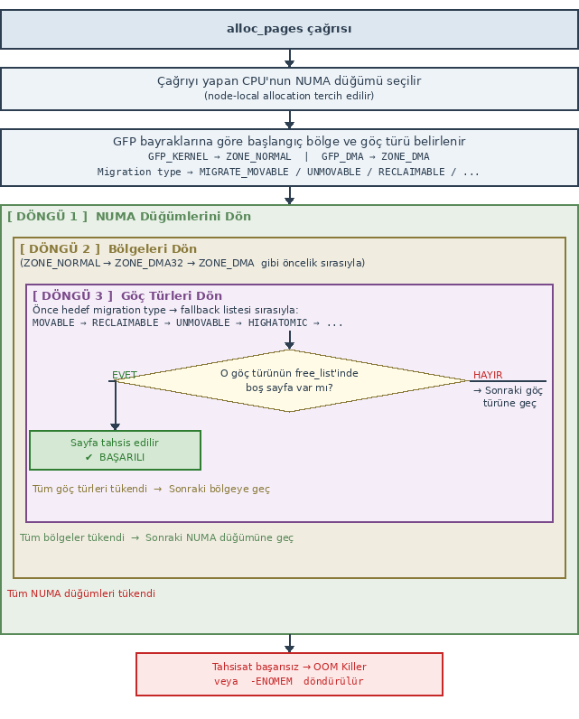

Güncel çekirdeklerde göç türlerine ilişkin *fallback* sırası ``mm/page_alloc.c`` dosyasında ``fallbacks`` isimli
iki boyutlu bir dizide belirtilmiştir. Bu dizi şöyle tanımlanmıştır:

.. code-block:: c

    static int fallbacks[MIGRATE_PCPTYPES][MIGRATE_PCPTYPES - 1] = {
        [MIGRATE_UNMOVABLE]   = { MIGRATE_RECLAIMABLE, MIGRATE_MOVABLE   },
        [MIGRATE_MOVABLE]     = { MIGRATE_RECLAIMABLE, MIGRATE_UNMOVABLE },
        [MIGRATE_RECLAIMABLE] = { MIGRATE_UNMOVABLE,   MIGRATE_MOVABLE   },
    };

Matrisin satırları her göç türü için "eğer orada boş sayfa bulunamazsa sırasıyla hangi göç türlerine
bakılacağını" belirtmektedir. Örneğin ``MIGRATE_UNMOVABLE`` göç türünden tahsisat yapılmak istensin. İşte
burada boş sayfa bulunamazsa sırasıyla ``MIGRATE_RECLAIMABLE`` ve ``MIGRATE_MOVABLE`` göç türlerine de
bakılacaktır. Bu *fallback* sırasının statik bir biçimde çekirdek kodlarında belirtildiğine dikkat ediniz.

Burada önemli bir noktayı vurgulamak istiyoruz. Çekirdek belli bir göç türünde boş blok bulamayıp diğer göç
türüne başvurup oradan boş blok aldığında artık kopardığı blokları hedef göç türüne taşımaktadır. Bu sayfalar
free hale getirildiğinde alınan yere iade edilmemektedir, taşınan yere iade edilmektedir. Ayrıca önemli bir
ayrıntı da vardır. Diğer göç türlerinden arama her zaman en yüksek düzeyden (order'dan) başlanarak aşağıya
doğru yapılmaktadır. (En yüksek düzeyin 10 olduğunu ve 4 MB sayfa bloğu belirttiğini anımsayınız.) Örneğin
biz 4 sayfa tahsis etmek isteyelim. Ancak *fallback* durumu oluşup bu sayfa başka bir göç türünde aranıyor
olsun. İşte arama 10'uncu düzeydeki bağlı listeden başlatılıp aşağıya doğru inecektir. Böylece yalnızca 4
sayfa değil ilgili sayfa bloğunun tüm sayfaları göçe tabi tutulacaktır. Örneğin ilgili göç türünde 10'uncu
düzeyde boş sayfa bloğu olmasın, 9'uncu düzeyde de olmasın ama 8'inci düzeyde olsun. İşte 8'inci düzeydeki
1 MB'lik sayfa bloğu göçe tabi tutularak hedefe taşınıp oradan 4 sayfa verilmektedir. Böylece bir göç türünde
boş sayfa bulunamayınca diğer göç türünden daha büyük bir parçanın alınması sağlanmıştır.

Fallback Mekanizmasına İlişkin Veri Yapıları
~~~~~~~~~~~~~~~~~~~~~~~~~~~~~~~~~~~~~~~~~~~~~

Şimdi *fallback* mekanizmasının işletildiği veri yapıları üzerinde dikkatimizi yoğunlaştıralım. NUMA düğümlerini
temsil eden ``pglist_data`` yapısının (bu yapı ``pg_data_t`` olarak da typedef edilmiştir) ``node_zones`` dizisi
o düğümün bölgelerini, ``node_zonelists`` dizisi ise o düğümün fallback bölge listesini tutmaktadır.

.. code-block:: c

    typedef struct pglist_data {
        /* ... */

        struct zone     node_zones[MAX_NR_ZONES];
        struct zonelist node_zonelists[MAX_ZONELISTS];   /* fallback amaçlı */

        /* ... */
    } pg_data_t;

``node_zonelists`` dizisi ``zonelist`` isimli bir yapı türündendir. Bu yapı şöyle tanımlanmıştır:

.. code-block:: c

    struct zonelist {
        struct zoneref _zonerefs[MAX_ZONES_PER_ZONELIST + 1];
    };

Görüldüğü gibi bu yapı da ``zoneref`` türünden bir yapı dizisi içermektedir. ``zoneref`` yapısı da şöyle
tanımlanmıştır:

.. code-block:: c

    struct zoneref {
        struct zone *zone;   /* Pointer to actual zone */
        int zone_idx;        /* zone_idx(zoneref->zone) */
    };

Görüldüğü gibi burada bölgeyi temsil eden nesnenin adresi ve onun ``node_zones`` dizisindeki indeksi
tutulmaktadır. İşte aslında ``node_zonelists`` fallback amaçlı kullanılmaktadır. Bölge türlerini de yeniden
anımsatmak istiyoruz:

.. code-block:: c

    enum zone_type {
        ZONE_DMA,        // İlk 16 MB — eski ISA DMA için
        ZONE_DMA32,      // İlk 4 GB — 32-bit DMA için
        ZONE_NORMAL,     // Normal kernel sayfaları
        ZONE_MOVABLE,    // Taşınabilir sayfalar (hugepage, migration için)
        ZONE_DEVICE,     // Kalıcı bellek (PMEM) için
        __MAX_NR_ZONES
    };

``node_zonelists`` dizisinin ``MAX_ZONELISTS`` kadar elemanı içerdiğine dikkat ediniz. Bu sembolik sabit şöyle
tanımlanmıştır:

.. code-block:: c

    enum {
        ZONELIST_FALLBACK,      /* zonelist with fallback */
    #ifdef CONFIG_NUMA
        /*
         * The NUMA zonelists are doubled because we need zonelists that
         * restrict the allocations to a single node for __GFP_THISNODE.
         */
        ZONELIST_NOFALLBACK,    /* zonelist without fallback (__GFP_THISNODE) */
    #endif
        MAX_ZONELISTS
    };

Görüldüğü gibi aslında ``node_zonelists`` en fazla iki boyutlu bir dizidir. Dizinin birinci elemanı fallback
listesini tutmaktadır. İkinci elemanı ise düğüm temelinde fallback yapılmaması durumunda kullanılmaktadır. Biz
burada dizinin 0'ıncı indeksli ilk elemanı ile ilgileniyoruz. O halde aslında NUMA düğümünün fallback listesi
``zoneref`` dizisi biçimindedir. ``zoneref`` nesnesi de ilgili bölgeyi belirtmektedir. (Başka bir deyişle NUMA
düğümünün fallback listesi aslında bir bölge listesinden oluşmaktadır.)

``node_zonelists`` dizisinin uzunluğunun ``MAX_ZONES_PER_ZONELIST`` ile belirtildiğine dikkat ediniz. Bu
sembolik sabit şöyle tanımlanmıştır:

.. code-block:: c

    #define MAX_ZONES_PER_ZONELIST (MAX_NUMNODES * MAX_NR_ZONES)

Buradaki ``MAX_NUMNODES`` ve ``MAX_NR_ZONES`` değerleri çeşitli etmenlere göre değişebilmektedir.

Burada önemli bir noktayı belirtmek istiyoruz. ``node_zonelists`` elemanının 0'ıncı indeksindeki
(``ZONELIST_FALLBACK``) bölge dizisi aslında yalnızca o NUMA düğümünün bölgelerini belirtmemektedir; diğer
NUMA düğümlerinin bölgeleri de bu dizi içerisindedir. ``node_zonelists`` dizisinin temsili görüntüsü şöyledir:

.. code-block:: none

    pg_data_t (Node 0)
    ├── node_zonelists[0]  ← ZONELIST_FALLBACK
    │   └── _zonerefs[]
    │         [0]: zone=&node0.zone[NORMAL],  zone_idx=ZONE_NORMAL
    │         [1]: zone=&node0.zone[DMA32],   zone_idx=ZONE_DMA32
    │         [2]: zone=&node0.zone[DMA],     zone_idx=ZONE_DMA
    │         [3]: zone=&node1.zone[NORMAL],  zone_idx=ZONE_NORMAL  ← komşu node
    │         [4]: zone=&node1.zone[DMA32],   zone_idx=ZONE_DMA32
    │         [5]: zone=&node2.zone[NORMAL],  zone_idx=ZONE_NORMAL  ← uzak node
    │         [6]: zone=&node3.zone[NORMAL],  zone_idx=ZONE_NORMAL  ← en uzak
    │         [7]: zone=NULL                                         ← LİSTE SONU
    │
    └── node_zonelists[1]  ← ZONELIST_NOFALLBACK (__GFP_THISNODE için)
        └── _zonerefs[]
            [0]: zone=&node0.zone[NORMAL],  zone_idx=ZONE_NORMAL
            [1]: zone=&node0.zone[DMA32],   zone_idx=ZONE_DMA32
            [2]: zone=&node0.zone[DMA],     zone_idx=ZONE_DMA
            [3]: zone=NULL

Bu temsili çizimde örnek olarak 0'ıncı NUMA düğümünün ``node_zonelists`` dizisi gösterilmiştir. Görüldüğü
gibi bu dizinin 0'ıncı elemanı bölgelerden oluşmaktadır; ancak bölgeler yalnızca 0'ıncı düğümün bölgelerini
içermemektedir, diğer düğümlerin bölgelerini de içermektedir. Örneğin 0'ıncı NUMA düğümünde ``alloc_pages``
ile ``ZONE_DMA32`` bölgesinden ``MIGRATE_UNMOVABLE`` tahsisatı yapılmak istensin. İşte bölge listesinin
dolaşılmasına 0'ıncı düğümdeki DMA32'den başlatılacaktır:

.. code-block:: none

    pg_data_t (Node 0)
    ├── node_zonelists[0]  ← ZONELIST_FALLBACK
    │   └── _zonerefs[]
    │         [0]: zone=&node0.zone[NORMAL],  zone_idx=ZONE_NORMAL
    │  Bölge araması buradan başlatılacak ──► [1]: zone=&node0.zone[DMA32],   zone_idx=ZONE_DMA32
    │         [2]: zone=&node0.zone[DMA],     zone_idx=ZONE_DMA
    │         [3]: zone=&node1.zone[NORMAL],  zone_idx=ZONE_NORMAL  ← komşu node
    │         [4]: zone=&node1.zone[DMA32],   zone_idx=ZONE_DMA32
    │         [5]: zone=&node2.zone[NORMAL],  zone_idx=ZONE_NORMAL  ← uzak node
    │         [6]: zone=&node3.zone[NORMAL],  zone_idx=ZONE_NORMAL  ← en uzak
    │         [7]: zone=NULL                                         ← LİSTE SONU
    │
    └── node_zonelists[1]  ← ZONELIST_NOFALLBACK (__GFP_THISNODE için)
        └── _zonerefs[]
            [0]: zone=&node0.zone[NORMAL],  zone_idx=ZONE_NORMAL
            [1]: zone=&node0.zone[DMA32],   zone_idx=ZONE_DMA32
            [2]: zone=&node0.zone[DMA],     zone_idx=ZONE_DMA
            [3]: zone=NULL

Eğer bu bölgenin göç *fallback* listesinin hiçbir yerinde talep edilen miktarda boş sayfa bulunamazsa bundan
sonra arama 0'ıncı düğümün ``ZONE_DMA`` bölgesinden devam edecek, orada da bulunamazsa 1'inci düğümün
``ZONE_NORMAL`` bölgesinden devam edecektir.

``node_zonelists[1]`` elemanının (``ZONELIST_NOFALLBACK``) ne işe yaradığını merak edebilirsiniz. Bu elemanda
belirtilen bölge dizisi aramanın kesinlikle belirli bir NUMA düğümünde kalması gerektiği durumlar için
bulundurulmuştur. Bu dizi elemanı ``__GFP_THISNODE`` bayrağı girildiğinde kullanılmaktadır. Bu dizi elemanında
yalnızca ilgili düğümün bölümleri vardır. Yani ``alloc_pages_node`` çağrısında GFP bayrakları içinde
``__GFP_THISNODE`` varsa ``node_zonelists[1]`` (``ZONELIST_NOFALLBACK``) seçilir. Bu liste yalnızca o düğümün
kendi bölgelerini içerdiği için arama diğer düğümlere hiçbir koşulda taşmaz.

Bölgelerdeki Boş sayfa Listelerinin Başlangıç Durumu
~~~~~~~~~~~~~~~~~~~~~~~~~~~~~~~~~~~~~~~~~~~~~~~~~~~~~

Şimdi de başlangıçta (yani boot işleminden sonra) boş sayfa listelerinin durumu hakkında bilgi verelim.
Başlangıçta her sayfa kendi bellek bölgesinin en yüksek düzeyli ``MIGRATE_MOVABLE`` göç türüne ilişkin ikiz
blok tahsisat sistemindedir. Örneğin UMA x86-64 mimarisindeki başlangıç durumu şöyledir:

.. code-block:: none

    node 0 (pgdat)
    ├── ZONE_DMA      (0–16MB)
    │     free_area[10].free_list[MIGRATE_MOVABLE]  → ~birkaç adet 4MB blok
    │     (diğer tüm göç listeleri boş)
    │
    ├── ZONE_DMA32    (16MB–4GB)
    │     free_area[10].free_list[MIGRATE_MOVABLE]  → ~binlerce sayfa
    │     (diğer tüm göç listeleri boş)
    │
    └── ZONE_NORMAL   (4GB–16GB)
          free_area[10].free_list[MIGRATE_MOVABLE]  → belleğin ana gövdesi
          (diğer tüm göç listeleri boş)

Örneğin ARM64 kullanılan Raspberry Pi modelleri için başlangıç durumu şöyledir:

.. code-block:: none

    node 0 (pgdat) — RPi, UMA
    ├── ZONE_DMA      (0 – 1GB)
    │     free_area[10].free_list[MIGRATE_MOVABLE]  → ~1GB'ın boş kısmı, çoğu 4MB'lık blok
    │     (diğer tüm göç listeleri boş)
    ├── ZONE_DMA32    (1GB – 4GB)
    │     free_area[10].free_list[MIGRATE_MOVABLE]  → ~3GB
    │     (diğer tüm göç listeleri boş)
    └── ZONE_NORMAL   (4GB – 8GB)
          free_area[10].free_list[MIGRATE_MOVABLE]  → ~4GB
          (diğer tüm göç listeleri boş)

ARM32 kullanan BeagleBone modelleri için de başlangıç durumu şöyledir:

.. code-block:: none

    node 0 (pgdat) — BBB, UMA
    └── ZONE_NORMAL   (0x80000000 – 0x9FFFFFFF, 512MB)
          free_area[10].free_list[MIGRATE_MOVABLE]  → tüm boş bellek burada, çoğu 4MB'lık blok

Fallback Mekanizmasında NUMA Düğümlerinin Dolaşım Sırası
~~~~~~~~~~~~~~~~~~~~~~~~~~~~~~~~~~~~~~~~~~~~~~~~~~~~~~~~

Peki bölgelerde *fallback* yapılırken NUMA düğümlerine hangi sırada bakılmaktadır? İşte *fallback* işlemlerinde 
NUMA düğümlerine NUMA uzaklık matrisindeki uzaklık değerleri dikkate alınarak bakılmaktadır. Yani node_zonelists 
dizisinde NUMA düğümleri NUMA uzaklıklarına göre küçükten büyüğe sort edilmiş durumdadır. Peki NUMA uzaklık 
matrisi nedir? İzleyen paragraflarda NUMA uzaklık matrisinin ne anlama geldiğini açıklıyoruz. 

Bilgisayar ana kartında CPU'lar için soketler bulunmaktadır. Bu soketlere takılan entegre devrelere
*paket (package)* denilmektedir. Biz bu paketlere *işlemci paketleri* de diyeceğiz. Bu işlemci paketleri
içerisinde İngilizce *die* denilen silikon kalıplar bulunmaktadır. Çekirdekler bu silikon kalıplar
üzerindedir. Her çekirdek bağımsız bir işlemci gibi davranmaktadır. Bir kasa içerisindeki soketlerin
sayısında da belli bir sınır vardır. Bu sınır donanımsal kısıtlardan kaynaklanmaktadır. Eğer kasa soket
sayısını kaldıramıyorsa bu durumda kasa sayısı artırılmaktadır. Tabii kasalar arasındaki RAM iletişimi de
yüksek hızlı iletkenlerle sağlanmaktadır. Böylece büyük NUMA sistemlerinde dağıtık RAM blokları
bulunabilmektedir ve her çekirdek bu RAM bloklarına (yani düğümlerine) farklı hızlarda erişebilmektedir.

Linux çekirdeği her soket ve dolayısıyla çekirdek için NUMA düğümlerine *NUMA uzaklığı (NUMA distance)*
denilen bir uzaklık derecesi atamaktadır. Tabii çekirdek bu bilgiyi de aslında donanımdan, yani modern
sistemlerde ACPI tablosundan elde etmektedir. NUMA uzaklık matrisindeki değerler gerçek bir gecikme değeri
değil göreli bir değer belirtmektedir. Örneğin soketlerin NUMA düğümlerine uzaklıkları aşağıdakine benzer
olabilmektedir:

.. list-table:: NUMA Erişim Türlerine Göre Tipik Uzaklık Skorları
   :header-rows: 1
   :widths: 60 40

   * - Erişim Türü
     - Tipik Skor Aralığı
   * - Kendi düğümü (local)
     - 10
   * - Aynı soket, farklı die (SNC modu)
     - 12–16
   * - Farklı soket, doğrudan bağlı
     - 20–22
   * - Farklı soket, 2 hop
     - 30–32
   * - Farklı kasa (multi-chassis)
     - 40–100+

NUMA uzaklık matrisi aşağıdaki gibi temsil edilebilir:

.. code-block:: none

             Node0  Node1  Node2  Node3
    Soket0  [  10     21     31     41  ]
    Soket1  [  21     10     21     31  ]
    Soket2  [  31     21     10     21  ]
    Soket3  [  41     31     21     10  ]

Tipik bazı NUMA donanımlarındaki gecikmeler nanosaniyeler mertebesinde şöyledir:

.. code-block:: none

    2 soketli Intel Xeon (UPI):
      Local RAM erişimi:   ~80–90 ns
      Remote RAM erişimi:  ~130–150 ns
      Oran: ~1.7x yavaş

    2 soketli AMD EPYC (Infinity Fabric):
      Local RAM erişimi:   ~75–85 ns
      Remote RAM erişimi:  ~140–170 ns
      Oran: ~1.9x yavaş

    4 soketli Intel (eski, 2-hop mümkün):
      Local:               ~80 ns
      1-hop remote:        ~150 ns
      2-hop remote:        ~220 ns

Örneğin 2 soketli bir NUMA sistemi aşağıdaki gibi bir mimariye sahip olabilmektedir:

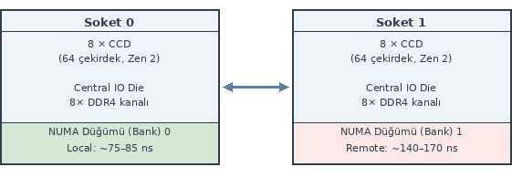

Her soketteki çekirdek o sokete ilişkin RAM bank'ına (yani NUMA düğümüne) daha hızlı erişmektedir. Yukarıdaki
sistemde her sokette 64 çekirdekli bir işlemci paketi, 2 sokette toplamda 128 çekirdek bulunmaktadır. 

Dilimli Tahsisat Sistemi (Slab Allocator)
=========================================

Biz Linux çekirdeklerindeki bellek tahsisat sistemini iki kısma ayırmıştık: sayfa düzeyinde tahsisat ve byte
düzeyinde tahsisat. Sayfa düzeyinde tahsisatların "ikiz blok tahsisat sistemi (buddy allocator)" ile
yapıldığını gördük. Şimdi de çekirdeğin byte düzeyinde tahsisat sistemi üzerinde duracağız. Daha önceden de
belirttiğimiz gibi çekirdeğin byte düzeyinde tahsisat sistemine "dilimli tahsisat sistemi (slab allocator)"
denilmektedir.

Dilimli tahsisat sistemi 1994 yılında Jeff Bonwick tarafından önerilmiştir. Bonwick'in orijinal makalesine
aşağıdaki bağlantıdan erişebilirsiniz:

`The Slab Allocator: An Object-Caching Kernel Memory Allocator (Bonwick, 1994)
<https://people.eecs.berkeley.edu/~kubitron/courses/cs194-24-S14/hand-outs/bonwick_slab.pdf>`_

Dilimli tahsisat sistemi ilk kez Solaris sistemlerinde kullanılmıştır. Bunu FreeBSD sistemleri izlemiştir.
Sonra da Linux'un 2.2 kararlı sürümüyle çekirdekte yerini almıştır.

Klasik Tahsisat Algoritması: Boş Blokların Bağlı Listede Saklanması
-------------------------------------------------------------------

Dilimli tahsisat sistemini açıklamadan önce klasik byte düzeyinde tahsisat işleminin (yani ``malloc`` gibi bir
fonksiyonun) nasıl gerçekleştirildiği üzerinde duralım. Klasik byte düzeyinde tahsisat algoritması oldukça
basittir. Bellekte bir bölge *heap* olarak ayrılır. Bu bölgedeki "yalnızca boş alanlar" bir bağlı listede
tutulur. Tahsis edilmiş alanlar için bir kayıt tutulmaz. Tahsisat yapılmak istendiğinde boş blokları tutan
bağlı liste üzerinde istenilen uzunlukta ilk blokla karşılaşılana kadar (buna İngilizce *first fit* yöntemi
de denilmektedir) sıralı arama yapılır. Klasik tahsis algoritması D. Ritchie ve B. Kernighan'ın ünlü
*"The C Programming Language"* kitabında "8.7 Example - A Storage Allocator (Sayfa 163)" başlığı altında
da açıklanmıştır. Pek çok ``malloc``/``realloc``/``free`` benzeri tahsisat sistemi burada belirtilen
algoritmayı temel almıştır. Örneğin Windows sistemlerindeki ``HeapAlloc``, ``HeapFree`` gibi API
fonksiyonlarının temeli de bu algoritmadır. Linux sistemlerinde ``malloc``/``realloc``/``free`` fonksiyonlarında
da uzun süre bu klasik algoritmanın iyileştirilmiş biçimleri kullanılmıştır. D. Ritchie ve B. Kernighan tarafından
*The C Programming Language* kitabında verilen örnek ``malloc`` ve ``free`` algoritmaları aşağıda
verilmiştir.

.. code-block:: c

    #include <stddef.h>
    #include <unistd.h>

    typedef long Align;  /* alignment for longs */

    union header {
        struct {
            union header *ptr;   /* next block if on free list */
            unsigned size;       /* size of this block */
        } s;
        Align x;                 /* force alignment of blocks */
    };

    typedef union header Header;

    static Header base;              /* empty list to get started */
    static Header *freep = NULL;     /* start of free list */

    void free(void *ap)
    {
        Header *bp, *p;

        bp = (Header *)ap - 1;    /* point to block header */

        for (p = freep; !(bp > p && bp < p->s.ptr); p = p->s.ptr)
            if (p >= p->s.ptr && (bp > p || bp < p->s.ptr))
                break;  /* freed block at start or end of arena */

        if (bp + bp->s.size == p->s.ptr) {    /* join to upper nbr */
            bp->s.size += p->s.ptr->s.size;
            bp->s.ptr = p->s.ptr->s.ptr;
        } else
            bp->s.ptr = p->s.ptr;

        if (p + p->s.size == bp) {            /* join to lower nbr */
            p->s.size += bp->s.size;
            p->s.ptr = bp->s.ptr;
        } else
            p->s.ptr = bp;

        freep = p;
    }

    #define NALLOC 1024  /* minimum #units to request */

    static Header *morecore(unsigned nu);

    void *malloc(unsigned nbytes)
    {
        Header *p, *prevp;
        unsigned nunits;

        nunits = (nbytes + sizeof(Header) - 1) / sizeof(Header) + 1;

        if ((prevp = freep) == NULL) {   /* no free list yet */
            base.s.ptr = freep = prevp = &base;
            base.s.size = 0;
        }

        for (p = prevp->s.ptr; ; prevp = p, p = p->s.ptr) {
            if (p->s.size >= nunits) {       /* big enough */
                if (p->s.size == nunits)     /* exactly */
                    prevp->s.ptr = p->s.ptr;
                else {                       /* allocate tail end */
                    p->s.size -= nunits;
                    p += p->s.size;
                    p->s.size = nunits;
                }
                freep = prevp;
                return (void *)(p + 1);
            }
            if (p == freep)                  /* wrapped around free list */
                if ((p = morecore(nunits)) == NULL)
                    return NULL;             /* none left */
        }
    }

*"The C Programming Language"* kitabında belirtilen klasik tahsisat algortimasındaki işlemlerin algoritma
karmaşıklıkları şöyledir:

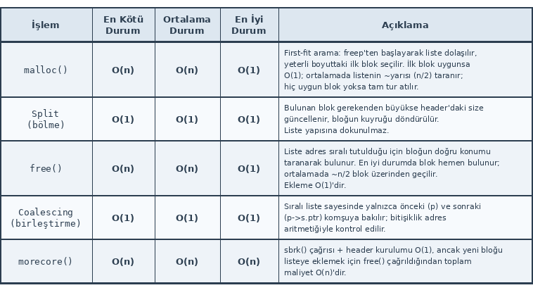

Zaman içerisinde pek çok sistem kullanıcı modundaki tahsisatlar için bu klasik tahsisat algoritmasının
iyileştirilmiş varyasyonlarını kullanmaya başlamıştır. Biz kitabımızda bunları incelemeyeceğiz. 

Dilimli Tahsisat Sisteminin Ana Fikri
-------------------------------------

Yukarıda açıkladığımız klasik tahsisat sistemindeki bağlı listede tutulan boş bloklar aynı uzunlukta olsaydı
tahsisat ve serbest bırakma işlemleri O(1) karmaşıklıkta yapılabilirdi. Çünkü boş bağlı listedeki tüm bloklar
eşit uzunlukta olduğuna göre tahsisat sırasında hemen listenin başındaki blok verilebilirdi. Benzer biçimde
serbest bırakma işleminde de hemen blok listenin başına O(1) karmaşıklıkta eklenebilirdi. Ancak böyle bir
yöntemde blok uzunluğunun belirlenmesi sorunlu bir noktayı oluşturmaktadır. Örneğin boş bağlı listedeki
blokların 64 byte uzunlukta olduğunu düşünelim. Bu durumda biz 100 byte'lık bir tahsisat yapamayız. 30
byte tahsisat yapmak istediğimizde de bloktaki 34 byte boşa gidecektir. (Blok içerisinde kullanılmayan
alanların oluşması durumuna "içsel bölünme (internal fragmentation)" dendiğini anımsayınız.) Bu durumda ilk
akla gelecek yöntem değişik uzunlukta birden fazla boş bağlı liste bulundurmaktır. Böylece tahsisat hangi
uzunluğa en yakınsa o listeden yapılabilir. Tabii yine "içsel bölünme" kaçınılmazdır ancak daha tolere
edilebilir bir noktaya indirgenmiştir.

Çekirdekte aynı türden pek çok nesne yaratılmaktadır. Örneğin bir proses yaratıldığında ``task_struct``
nesnesi, bir dosya açıldığında ``file`` nesnesi, ``dentry`` nesnesi, duruma göre de ``inode`` nesnesi tahsis
edilmektedir. Bu nesnelerin uzunlukları farklıdır. İşte bu farklı uzunluktaki nesneler için tam o uzunlukta
farklı boş blok listeleri oluşturulursa hem bu nesnelerin tahsis edilmesi hızlandırılır hem de "içsel
bölünme" ortadan kaldırılır. Modern işletim sistemlerinin büyük çoğunluğunda bu teknik kullanılmaktadır.
Dilimli tahsisat sistemi de bu tekniği temel almaktadır.

Linux çekirdeğindeki dilimli tahsisat sistemi zaman içerisinde iyileştirilmiştir. İlk kullanılan
gerçekleştirimin adı SLAB'dır. Bunun iyileştirilmiş biçimine de SLUB denilmektedir. Bir noktaya kadar
çekirdek kodlarında her iki gerçekleştirim de bulunuyordu ve hangi gerçekleştirimin kullanılacağı
konfigürasyon parametreleriyle seçilebiliyordu. Ancak çekirdeğin 6.5 sürümüyle birlikte ilk SLAB
gerçekleştirimi çekirdek kodlarından atılmıştır. Yani bugünkü sistemler SLUB gerçekleştirimini
kullanmaktadır. Ayrıca 6.2 sürümüne kadar çekirdekte bir de SLOB gerçekleştirimi bulunuyordu. Bu SLOB
gerçekleştirimi yukarıda açıkladığımız klasik tahsisat algoritmasını kullanıyordu. Bellek kısıtı olan gömülü
sistemlerde kullanılmak üzere çekirdekte bulunduruluyordu. Bu SLOB gerçekleştirimi de çekirdek kodlarından
6.2 sürümüyle çıkartılmıştır. Yani güncel çekirdeklerde artık yalnızca SLUB gerçekleştirimi kullanılmaktadır.

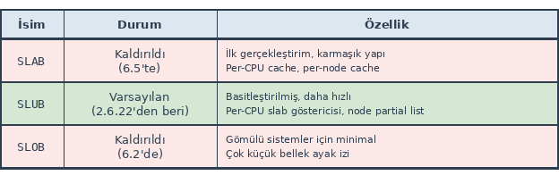

Her ne kadar güncel gerçekleştirimin adı SLUB olsa da sisteme genel olarak yine İngilizce *slab allocator*
denilmektedir. SLUB ismi *"Unqueued SLAB"* sözcüklerinden, SLOB ismi ise *"Simple List Of Blocks"*
sözcüklerinden çağrışımla uydurulmuştur.

Burada bir noktaya dikkatinizi çekmek istiyoruz. Çekirdek kaynak kodlarında var olan her şey derlemede
çekirdek imajına yansıtılmamaktadır. Konfigürasyon aşamasında "yalnızca seçilen özellikler" çekirdek imajına
yansıtılmaktadır. Zaten konfigürasyon işleminin amaçlarından biri de budur.

SLUB gerçekleştirimi oldukça ayrıntılıdır. Biz kursumuzda bu gerçekleştirimin ana hatları üzerinde
duracağız. Ancak SLUB sözcüğü yerine "dilimli tahsisat sistemi (slab allocator)" ve "dilim (slab)"
terimlerini kullanacağız.

Dilimli Tahsisat Sistemine İlişkin Veri Yapıları ve Algoritmalar
----------------------------------------------------------------

Dilimli tahsisat sisteminde üç önemli kavram vardır: Dilim Önbellek (Slab Cache), Dilim (Slab) ve Nesne
(Object). Dilim önbelleği bu terminolojide tahsisat sistemini belirtmektedir. Dilim önbelleği dilimlerden,
dilimler de nesnelerden oluşmaktadır. Tahsis edilecek öğeler eşit uzunluktaki nesnelerdir.

Dilimli tahsisat sistemindeki dilim önbelleği (slab cache) ana taşıyıcıdır. Tahsisat sistemi ile ilgili
önemli bilgiler burada tutulmaktadır. Dilimler (slabs) ardışıl sayfalardan oluşan bellek bloklarıdır.
Nesneler dilimlerin içerisindedir. Tahsisat sistemi dilimleri dilim önbelleği içerisindeki bir bağlı
listede tutmaktadır. SLUB gerçekleştiriminde her dilim önbelleği (slab cache) her NUMA düğümü için ayrı
bir dilim listesi tutmaktadır. Yani aslında dilim önbelleği NUMA düğümlerinden, NUMA düğümleri dilimlerden,
dilimler de nesnelerden oluşmaktadır. Bu sistemi şekille şöyle gösterebiliriz:

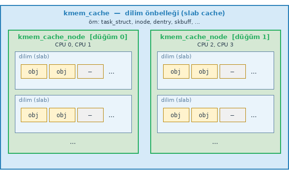

Bu şekilde iki NUMA düğümü vardır. Her NUMA düğümünde dilimler bulunmaktadır. Dilimler de tahsis edilecek
blokları içermektedir.

Dilim Önbelleği ve kmem_cache Yapısı
~~~~~~~~~~~~~~~~~~~~~~~~~~~~~~~~~~~~

Şimdi bu sistemin veri yapısı üzerinde duralım. Dilim önbelleği ``mm/slab.h`` dosyası içerisindeki
``kmem_cache`` yapısıyla temsil edilmiştir. Güncel çekirdeklerde bu yapı şöyledir:

.. code-block:: c

    struct kmem_cache {
        struct slub_percpu_sheaves __percpu *cpu_sheaves;
        /* Used for retrieving partial slabs, etc. */
        slab_flags_t flags;
        unsigned long min_partial;
        unsigned int size;              /* Object size including metadata */
        unsigned int object_size;       /* Object size without metadata */
        struct reciprocal_value reciprocal_size;
        unsigned int offset;            /* Free pointer offset */
        unsigned int sheaf_capacity;
        struct kmem_cache_order_objects oo;

        /* Allocation and freeing of slabs */
        struct kmem_cache_order_objects min;
        gfp_t allocflags;               /* gfp flags to use on each alloc */
        int refcount;                   /* Refcount for slab cache destroy */
        void (*ctor)(void *object);     /* Object constructor */
        unsigned int inuse;             /* Offset to metadata */
        unsigned int align;             /* Alignment */
        unsigned int red_left_pad;      /* Left redzone padding size */
        const char *name;               /* Name (only for display!) */
        struct list_head list;          /* List of slab caches */
    #ifdef CONFIG_SYSFS
        struct kobject kobj;            /* For sysfs */
    #endif
    #ifdef CONFIG_SLAB_FREELIST_HARDENED
        unsigned long random;
    #endif

    #ifdef CONFIG_NUMA
        /*
         * Defragmentation by allocating from a remote node.
         */
        unsigned int remote_node_defrag_ratio;
    #endif

    #ifdef CONFIG_SLAB_FREELIST_RANDOM
        unsigned int *random_seq;
    #endif

    #ifdef CONFIG_KASAN_GENERIC
        struct kasan_cache kasan_info;
    #endif

    #ifdef CONFIG_HARDENED_USERCOPY
        unsigned int useroffset;        /* Usercopy region offset */
        unsigned int usersize;          /* Usercopy region size */
    #endif

    #ifdef CONFIG_SLUB_STATS
        struct kmem_cache_stats __percpu *cpu_stats;
    #endif

        struct kmem_cache_node *node[MAX_NUMNODES];
    };

Yapının pek çok elemanının çeşitli konfigürasyon parametreleri seçildiğinde yapıya dahil edildiğine dikkat
ediniz. Yapının ``object_size`` elemanı dilimlerde tutulan nesnelerin büyüklüğünü belirtmektedir. Ancak
aslında sistem çeşitli konfigürasyon parametrelerine de bağlı olarak nesneler için metadata bilgileri
nedeniyle daha büyük yer ayırabilmektedir. Yapının ``size`` elemanı nesneler için dilim içerisinde ayrılan
gerçek alanı belirtmektedir. Nesneler için kullanılan ek metadata bilgileri şöyledir:

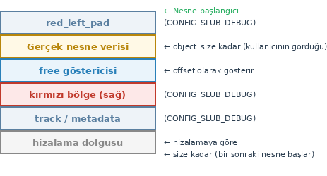

Buradaki ``flags`` elemanı tahsisat sırasındaki davranışı belirtmektedir. Bu eleman aşağıdaki bayrakların
bileşimlerinden oluşabilmektedir:

.. list-table:: 
   :header-rows: 1

   * - Flag
     - Anlamı
   * - ``SLAB_HWCACHE_ALIGN``
     - Nesneleri CPU önbelleğine göre hizala
   * - ``SLAB_PANIC``
     - Tahsisat başarısız olursa kernel panic yap
   * - ``SLAB_POISON``
     - Serbest nesneleri bilinen bir byte ile doldur (debug)
   * - ``SLAB_RED_ZONE``
     - Nesne etrafına kırmızı bölge ekle (debug)
   * - ``SLAB_ACCOUNT``
     - Tahsisatları cgroup'a say
   * - ``SLAB_RECLAIM_ACCOUNT``
     - Dilimleri geri alınabilir (reclaimable) olarak işaretle
   * - ``SLAB_TYPESAFE_BY_RCU``
     - RCU grace period'u bitmeden slab'ı serbest bırakma

Yapının ``allocflags`` elemanı ise ``alloc_pages`` fonksiyonuyla tahsisat yapılırken kullanılan bayrakları
içermektedir. Zaten bu bayraklar izleyen paragraflarda göreceğimiz ``kmem_cache_create`` fonksiyonuna
argüman olarak verilmektedir. Her dilim önbelleğinin bir ismi vardır. Bu isim yapının ``name`` elemanında
tutulmaktadır. Biz dilim önbelleğinin düğümlerden, düğümlerin dilimlerden ve dilimlerin de nesnelerden
oluştuğunu belirtmiştik. İşte dilim önbelleğindeki düğümler yapının ``node`` elemanında tutulmaktadır.
``node`` elemanının dilim önbelleğindeki düğümleri belirten ``kmem_cache_node`` türünden nesnelerin
adreslerini tutan bir dizi olduğuna dikkat ediniz:

.. code-block:: c

    struct kmem_cache_node *node[MAX_NUMNODES];

SLUB gerçekleştiriminde her nesneden sonra yukarıda açıkladığımız bazı metadata bilgileri tutulmaktadır.
Yapının ``inuse`` elemanında nesnelerin metadata alanlarının "hangi offset'ten itibaren başladığı" bilgisi
bulundurulmaktadır. Aşağıdaki şekli inceleyiniz:

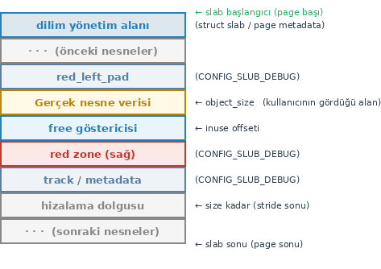

Yapının ``align`` elemanı yukarıdaki şekilden de görüldüğü gibi nesneler için ayrılan alanın kaçın
katlarına göre hizalanacağını belirtmektedir. Yapının ``min_partial`` elemanı dilimlerin sisteme iadesi
için gereken minimum dilim sayısını belirtmektedir:

.. code-block:: none

    Dilim önbelleğindeki dilim sayısı >  min_partial  →  boşalan dilimin sayfaları iade edilir
    Dilim önbelleğindeki dilim sayısı <= min_partial  →  boşalan dilimin sayfaları iade edilmez

``min_partial`` elemanının değeri şöyle tespit edilmektedir:

.. code-block:: c

    #define MIN_PARTIAL  5
    #define MAX_PARTIAL  10

    static inline unsigned long slub_min_partial(void)
    {
        return ilog2(nr_cpu_ids);
    }

    static void set_min_partial(struct kmem_cache *s, unsigned long min)
    {
        if (min < MIN_PARTIAL)
            min = MIN_PARTIAL;
        else if (min > MAX_PARTIAL)
            min = MAX_PARTIAL;
        s->min_partial = min;
    }

``min_partial`` bu algoritmaya göre şu değerlerden biri olabilmektedir:

.. list-table:: 
   :header-rows: 1

   * - CPU Sayısı
     - ilog2(nr_cpus)
     - min_partial
   * - 1
     - 0
     - 5  (MIN_PARTIAL alt sınırı)
   * - 2
     - 1
     - 5  (MIN_PARTIAL alt sınırı)
   * - 4
     - 2
     - 5  (MIN_PARTIAL alt sınırı)
   * - 8
     - 3
     - 5  (MIN_PARTIAL alt sınırı)
   * - 16
     - 4
     - 5  (MIN_PARTIAL alt sınırı)
   * - 32
     - 5
     - 5  (MIN_PARTIAL alt sınırı)
   * - 64
     - 6
     - 6
   * - 128
     - 7
     - 7
   * - 256
     - 8
     - 8
   * - 512
     - 9
     - 9
   * - 1024
     - 10
     - 10  (MAX_PARTIAL üst sınırı)
   * - 2048+
     - 11+
     - 10  (MAX_PARTIAL üst sınırı)

``min_partial`` elemanının amacı dilim önbelleğinde hazır durumda tutulacak belli miktarda boş dilimlerin
bulundurulmasını sağlamaktır.

``kmem_cache`` yapısının ``ctor`` elemanında aşağıdaki gibi bir fonksiyon göstericisi tutulmaktadır:

.. code-block:: c

    void (*ctor)(void *object);

Ne zaman sistemden bir nesne tahsis edilmek istense önce o nesne bu ``ctor`` fonksiyonuna verilir. Bu
fonksiyon nesnenin içerisine ilkdeğerlerini verir; bu işlemden sonra nesne tahsis edene iletilir. Bu
elemanda ``NULL`` adresi varsa böyle bir işlem yapılmamaktadır. Buraya yerleştirilecek fonksiyon
``kmem_cache_create`` fonksiyonuna argüman olarak girilmektedir.

Dilimlerin ardışıl fiziksel sayfalardan oluştuğunu söylemiştik. Peki bir dilim ardışıl kaç fiziksel sayfadan
oluşmaktadır? Soruyu şöyle de sorabiliriz: Bir dilim ikiz blok tahsisat sisteminin hangi düzeyinden
yapılmaktadır? İşte dilimlerin sayfa büyüklüklerinin belirlenmesinde ``kmem_cache`` yapısının iki elemanı
etkili olmaktadır:

.. code-block:: c

    struct kmem_cache {
        /* ... */
        struct kmem_cache_order_objects oo;   /* optimal order + nesne sayısı */
        struct kmem_cache_order_objects min;  /* fallback: minimum order + nesne sayısı */
        /* ... */
    };

İlk denemede yapının ``oo`` elemanına başvurulmaktadır. Eğer ikiz blok sisteminden ``oo`` elemanında
belirtilen sayfa düzeyinde (order) tahsisat yapılamazsa bu kez yapının ``min`` elemanına başvurulmaktadır.
Yapının ``min`` elemanına nesne boyutunu içeren en küçük düzey değeri (genellikle 0) atanmaktadır. Yani
en az tahsisat değeri 1 sayfadır. ``oo`` elemanına atanacak düzey değeri dilim önbelleği yaratılırken
``kmem_cache_create`` fonksiyonunun çağrı zincirindeki ``calculate_sizes`` fonksiyonu tarafından
verilmektedir. Ancak değerin asıl hesaplandığı yer ``calculate_order`` fonksiyonudur. ``calculate_order``
fonksiyonu ``oo`` için sayfa büyüklüğü değerini şu faktörlere bağlı olarak hesaplar:

- **CPU sayısı:** Çok CPU'lu sistemde aynı nesne boyutu daha büyük düzeye yol açabilmektedir. Ayrıntılara
  burada girmeyeceğiz. Çekirdek kaynak kodlarına başvurabilirsiniz.

- **Sınırlar:** Elde edilen değer ``slub_min_order`` ile ``slub_max_order`` değişkenlerinin arasına
  çekilir. Başlangıçta ``slub_min_order = 0`` ve ``slub_max_order = 3`` durumundadır. (Yani en fazla
  bir dilim 8 sayfadan oluşabilmektedir.)

- **İstisnai Durum:** Nesne boyutu ``slub_max_order``'lık slab'a tek başına bile sığmıyorsa sınır aşılır
  ve nesnenin boyutuna uygun en küçük düzey kullanılır.

Aşağıda somut "x86-64, 16 CPU" için çeşitli nesne boyutlarına göre ``min`` ve ``oo`` değerlerini
veriyoruz:

.. list-table:: 
   :header-rows: 1
   :widths: 18 13 16 15 12 13

   * - size (bayt)
     - oo:order
     - oo:objects
     - Slab boyutu
     - İsraf
     - min:order
   * - 64
     - 0
     - 64
     - 4 KB
     - %0.0
     - 0
   * - 96
     - 0
     - 42
     - 4 KB
     - %1.6
     - 0
   * - 192
     - 1
     - 42
     - 8 KB
     - %1.6
     - 0
   * - 256
     - 1
     - 32
     - 8 KB
     - %0.0
     - 0
   * - 512
     - 2
     - 32
     - 16 KB
     - %0.0
     - 0
   * - 1024
     - 3
     - 32
     - 32 KB
     - %0.0
     - 0
   * - 2048
     - 3
     - 16
     - 32 KB
     - %0.0
     - 0
   * - 4096
     - 3
     - 8
     - 32 KB
     - %0.0
     - 0
   * - 5000
     - 3
     - 6
     - 32 KB
     - %8.4
     - 1
   * - 8192
     - 3
     - 4
     - 32 KB
     - %0.0
     - 1
   * - 12000
     - 3
     - 2
     - 32 KB
     - %26.8
     - 2
   * - 40960
     - 4
     - 1
     - 64 KB
     - %37.5
     - 4

Bu tabloda sütunlarda neden ``oo:order`` ve ``min:order`` yazıldığını merak edebilirsiniz. Aslında ``oo``
ve ``min`` elemanları yalnızca dilim için yapılacak tahsisatın düzey bilgisini değil aynı zamanda bir
dilimde kaç nesnenin yer aldığı bilgisini de tutmaktadır. Bu elemanların ``kmem_cache_order_objects``
türünden olduğuna dikkat ediniz. Bu yapı şöyle tanımlanmıştır:

.. code-block:: c

    struct kmem_cache_order_objects {
        unsigned int x;
    };

Görüldüğü gibi yapının ``x`` isminde tek bir elemanı vardır. İşte bu ``x`` elemanının düşük anlamlı 16
biti nesne sayısını, yüksek anlamlı 16 biti de düzey değerini tutmaktadır.

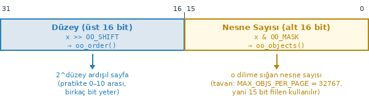

kmem_cache_node Yapısı
~~~~~~~~~~~~~~~~~~~~~~~

Bir dilim önbelleğinin düğümlerden, düğümlerin dilimlerden ve dilimlerin de nesnelerden oluştuğunu
söylemiştik. Dilim önbelleğinin düğümleri ``kmem_cache_node`` isimli yapıyla temsil edilmektedir. Bu yapı
güncel çekirdeklerde ``mm/slab.h`` dosyası içerisinde şöyle tanımlanmıştır:

.. code-block:: c

    struct kmem_cache_node {
        spinlock_t list_lock;

    #ifdef CONFIG_SLAB
        struct list_head slabs_partial;  /* partial list first, better asm code */
        struct list_head slabs_full;
        struct list_head slabs_free;
        unsigned long total_slabs;       /* length of all slab lists */
        unsigned long free_slabs;        /* length of free slab list only */
        unsigned long free_objects;
        unsigned int free_limit;
        unsigned int colour_next;        /* Per-node cache coloring */
        struct array_cache *shared;      /* shared per node */
        struct alien_cache **alien;      /* on other nodes */
        unsigned long next_reap;         /* updated without locking */
        int free_touched;                /* updated without locking */
    #endif

    #ifdef CONFIG_SLUB
        unsigned long nr_partial;
        struct list_head partial;
    #ifdef CONFIG_SLUB_DEBUG
        atomic_long_t nr_slabs;
        atomic_long_t total_objects;
        struct list_head full;
    #endif
    #endif
    };

Güncel çekirdekler derlenirken yalnızca ``CONFIG_SLUB`` define edilmiş durumdadır. Eski tip SLAB ve SLOB
gerçekleştirimlerinin çekirdekten çıkartıldığını belirtmiştik. Dolayısıyla aslında yukarıdaki yapı güncel
çekirdeklerde aşağıdaki hale gelmektedir:

.. code-block:: c

    struct kmem_cache_node {
        spinlock_t list_lock;

        /* CONFIG_SLUB */
        unsigned long nr_partial;
        struct list_head partial;

    #ifdef CONFIG_SLUB_DEBUG
        atomic_long_t nr_slabs;
        atomic_long_t total_objects;
        struct list_head full;
    #endif
    };

Yapının ``partial`` elemanı bu düğümdeki dilimlerin listesini, ``nr_partial`` elemanı ise bunların sayısını
tutmaktadır. UMA mimarisinde zaten tek bir düğümün olduğunu anımsayınız.

Dilimler ve slab Yapısı
~~~~~~~~~~~~~~~~~~~~~~~~

