===============================================================
Bellek Yönetimi - II. Bölüm :raw-html:`<br>` Tahsisat İşlemleri
===============================================================

Bu bölümde Linux çekirdeğinin sayfa düzeyindeki ve byte düzeyindeki tahsisat mekanizmalarını ele
alacağız. Bölüm içerisinde önce çekirdeğin boş sayfaları nasıl belirlediğini ve sayfa düzeyinde
tahsisatları nasıl yaptığını açıklayacağız. Sonra da byte düzeyindeki tahsisat işlemleri üzerinde
duracağız.

Linux çekirdeğinde iki düzeyli tahsisat sistemi vardır:

1. Sayfa düzeyinde tahsisat sistemi (*buddy allocator*)
2. Byte düzeyinde tahsisat sistemi (*slab allocator*)

Linux çekirdeğindeki sayfa düzeyinde tahsisat sistemine *ikiz blok tahsisat sistemi* ya da
İngilizcesiyle *buddy allocator*, byte düzeyinde tahsisat sistemine ise *dilimli tahsisat sistemi*
ya da İngilizcesiyle *slab allocator* denilmektedir.  Dilimli tahsisat sistemi, ikiz blok tahsisat sistemini 
kullanrarak tahsis ettiği sayfaları byte düzeyinde tahsisatlar için organize etmektedir. Dilimli tahsisat 
sisteminin ikiz blok tahsisat sisteminin üzerine oturtulduğunu söyleyebiliriz: 

.. image:: _static/buddy-slab-layers.png
   :alt: Dilimli ve İkiz Blok Tahsisat Sistemi şeması
   :align: center
   :width: 45%

Biz bu bölümde önce ikiz blok tahsisat sistemini sonra da dilimli tahsisat sistemini inceleyeceğiz.

İkiz Blok Tahsisat Sistemi (Buddy Allocator)
============================================

Çekirdek tüm fiziksel sayfaları bir heap alanıymış gibi ele alıp onların tahsisatlarını yönetmektedir.
Fiziksel sayfaları temsil eden ``page`` nesneleri ilgili sayfanın tahsis edilip edilmediği gibi bilgileri
de tutmaktadır. Biz bir aygıt sürücü yazarken ya da çekirdeğe bir modül eklerken bir fiziksel sayfayı
doğrudan kullanamayız. Çünkü o sayfa başka amaçlarla başka kaynaklar tarafından kullanılıyor olabilir.
Biz önce sayfa düzeyinde tahsisat yapan fonksiyonlarla sayfayı tahsis edip ondan sonra o sayfayı
kullanabiliriz. Yukarıda da belirttiğimiz gibi Linux çekirdeğinde sayfa düzeyinde tahsisat yapan bir
tahsisat sistemi bulunmaktadır. Biz bu sisteme Türkçe *ikiz blok tahsisat sistemi* diyeceğiz. Bu sistemin
İngilizce ismi *buddy allocator* biçimindedir. İzleyen paragraflarda ikiz blok tahsisat sisteminin
algoritmik yapısını açıklayacağız.

İşletim sistemlerinde sayfa düzeyinde tahsisatların hızlı yapılması gerekir. Aynı zamanda sayfa tahsisat
sisteminin mümkün olduğunca bellek bölünmesi (*fragmentation*) olgusuna dirençli olması da istenir. İkiz
blok tahsisat sistemi ilk kez Knowlton tarafından ortaya atılmıştır. Knowlton bu algoritmayı 1965 yılında
*Communications of the ACM* dergisinde *A Fast Storage Allocator* başlıklı makalesinde açıklamıştır. Bu
sistem Linux çekirdeklerine 1.2 versiyonuyla (1995) eklenmiştir. Linux çekirdeklerinde zamanla ikiz blok 
tahsisat sistemi daha karmaşık hale getirilmiştir. Bu karmaşıklık tahsisat algoritmasının kendisinden değil 
*boş listelerin (free lists)* ve bölgelerin (zones) *fallback* denilen gözden geçirilmesi mekanizmasından 
kaynaklanmaktadır. Biz burada önce ikiz blok tahsisat sisteminin algoritmik yapısını açıklayacağız sonra 
Linux çekirdeğindeki gerçekleştirimi üzerinde
duracağız.

İkiz Blok Tahsisat Sisteminin Algoritmik Yapısı
------------------------------------------------

İkiz blok tahsisat sisteminde boş bloklar 2'nin kuvvetlerine ilişkin ardışıl fiziksel sayfalardan oluşan
bloklar biçiminde organize edilmektedir. Buradaki 2'nin kuvvetine ilişkin boş blok listelerine İngilizce
*order* denilmektedir. Biz *order* sözcüğü yerine Türkçe *düzey* sözcüğünü kullanacağız. Aşağıda 5
düzeyli bir ikiz blok sisteminin çizimi yapılmıştır:

.. image:: _static/buddy-levels.png
   :align: center
   :width: 70%

Tabii buradaki listeler boş sayfa listeleridir. Tahsis edilen sayfalar bu listelerden çıkartılmaktadır.
Tahsisat her zaman 2ⁿ sayfa olacak biçimde düzey belirtilerek yapılmaktadır. Örneğin 4 sayfanın (2²
sayfanın) tahsis edilmek istendiğini düşünelim. Tahsisat 2'inci düzeydeki boş listeden sağlanacaktır.
Peki ya istenilen düzeyde hiç boş sayfa bloğu yoksa ne olur? İşte bu durumda daha yüksek düzeylere
başvurulup onlar parçalanmaktadır. Örneğin 2'inci düzeyde boş sayfa bloğu bulunmuyor olsun. Algoritma
bu durumda 3'üncü düzeye bakar. Eğer 3'üncü düzeyde 8 sayfalık boş bir sayfa bloğu varsa onu 2 parçaya
ayırır. Parçalardan birini 2'inci düzeydeki sayfa bloğu listesine ekler, diğerini verir. Peki biz sayfa
tahsis etmek istediğimizde 2'inci düzeyde de 3'üncü düzeyde de boş sayfa bloğu yoksa ne olacaktır? İşte
bu durumda gittikçe yukarı çıkılır, ilk boş sayfa bloğu olan düzeyden blok tahsis edilir. Sonra blok
bölüne bölüne aşağıya inilir. Örneğin 4 sayfa tahsis etmek istediğimizde 3'üncü düzeyde boş sayfa bloğu
yoksa ancak 4'üncü düzeyde boş sayfa bloğu varsa bu düzeydeki 16 sayfalık blok yarıya bölünür. Bunun
8'lik kısmı 3'üncü düzeydeki boş listeye eklenir, diğer 8'lik kısmı yine bölünür, onun 4'lük kısmı
2'inci düzey listeye eklenir, diğeri de tahsis edilir. Şimdi bu süreci şekillerle adım adım gösterelim.
Başlangıç durumu şöyledir:

.. image:: _static/buddy-initial.png
   :align: center
   :width: 60%

2'inci düzeyde ve 3'üncü düzeyde boş sayfa bloğu olmadığı için 4'üncü düzeydeki boş sayfa bloklarının
biri alınıp bölünür. Bölünen bloklar 8 sayfalık olacaktır. Bunlardan biri 3'üncü düzeydeki boş listeye
eklenir, diğeri bölünmeye devam eder:

.. image:: _static/buddy-split-step1.png
   :align: center
   :width: 70%

Burada 3'üncü düzeydeki 8 sayfanın yeniden ikiye bölünmesiyle bunlardan biri 2'inci düzeydeki boş listeye eklenir:

.. image:: _static/buddy-split-step2.png
   :align: center
   :width: 70%

İşte 8 sayfanın 4'lük kısmı 2'inci düzeydeki bağlı listeye eklenip kalan 4'lük kısmı da çağrıyı yapana verilmektedir. 
Boş listelerin son hali şöyle olacaktır:

.. image:: _static/buddy-final-state.png
   :align: center
   :width: 70%

Peki tahsis edilen bu 4 sayfalık blok free hale getirildiğinde ne olmaktadır? İşte algoritma bu durumda
tersten işletilmektedir. Yani bu 4 sayfalık blok 2'inci düzeye yerleştirilir. Ancak bu 2'inci düzeyde onun
*ikizi (buddy'si)* varsa free hale getirilenle bu ikizi birleştirilerek üst düzeydeki boş listeye eklenir.
Tabii aynı durum üst düzey için de yapılacaktır. Burada bir noktaya dikkatinizi çekmek istiyoruz: Free hale
getirme algoritmasından amaç en yüksek sayfa içeren ardışıl bloğun oluşturulmasıdır. Free edilen blokla onun
*ikizinin (buddy'sinin)* birleştirilip üst bloğa taşınmasının temel amacı budur. Şimdi bu birleştirme işlemini
yine adım adım gösterelim. Free işlemi öncesindeki durum şöyledir:

Şimdi 4 sayfalık bloğu free hale getirelim. Algoritma önce bu bloğu 2'inci düzeye eklerken onun ikizi (buddy'si)
o düzeyde var mı diye bakar. Eğer varsa onları birleştirip bir yukarıdaki düzeye eklemeye çalışır. Bizim örneğimizde
onun ikizi 2'inci düzeyde bulunmaktadır:

.. image:: _static/buddy-coalesce.png
   :align: center
   :width: 70%

Birleştirme sonucunda şu durum oluşacaktır:

.. image:: _static/buddy-coalesce-lv3.png
   :align: center
   :width: 70%

İşte 3'üncü düzeyde de birleştirilmiş bloğun ikizi bulunduğu için o ikiz blok da birleştirilip üst boş blok listesine
(4'üncü düzeydeki boş blok listesine) yerleştirilecektir:

.. image:: _static/buddy-final-merge.png
   :align: center
   :width: 70%

Görüldüğü gibi her şey ters sırada eski haline gelmiştir. 

Linux çekirdeklerinde maksimum düzey ``include/linux/mmzone.h`` dosyasındaki ``MAX_ORDER`` sembolik
sabitiyle belirtiliyordu. Ancak en son çekirdeklerde (>= 6.8) artık ``MAX_ORDER`` yerine aşağıdaki
iki sembolik sabit kullanılmaya başlanmıştır:

.. code-block:: c

   #define MAX_PAGE_ORDER    10                       /* en yüksek düzey indeksi  */
   #define NR_PAGE_ORDERS    (MAX_PAGE_ORDER + 1)     /* listelerin sayısı = 11   */

``MAX_PAGE_ORDER`` maksimum düzeyin indeks numarasını, ``NR_PAGE_ORDERS`` ise bunların sayısını
belirtmektedir. Linux çekirdeklerinde maksimum düzey 10'dur. (Yani toplam 11 tane düzey listesi
bulunmaktadır.) 6.1 çekirdeği ve öncesinde ``MAX_ORDER`` toplam liste sayısını belirtirken, daha
sonra en yüksek düzey indeksini belirtir hale getirilmiştir. Nihayet yukarıda da belirttiğimiz gibi
6.8 ile birlikte bu sembolik sabitlerin isimleri değiştirilmiştir.

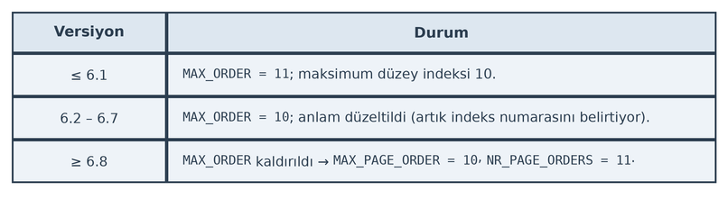

Linux çekirdeklerinde en yüksek düzey 10 olduğuna göre ve 2\ :sup:`10` = 1024 olduğuna göre, en
yüksek düzeydeki sayfa blokları 1024 sayfadan oluşmaktadır. 1024 sayfa da 4 MB yer kaplamaktadır.

Bellek Bölgeleri ve Göç Türleri
-------------------------------

Biz yukarıda ikiz blok tahsisat sisteminin temel algoritmasını açıkladık. Ancak Linux çekirdeğinde ikiz blok
tahsisat sistemi bir tane değildir. Her NUMA düğümü bellek bölgelerinden (memory zones), her bellek bölgesi
de göç türlerine (migration types) ilişkin ikiz blok tahsisat sistemlerinden (buddy allocators)
oluşmaktadır. Yani bir bellek bölgesinde bile birden fazla ikiz blok tahsisat sistemi bulunmaktadır.

.. figure:: _static/numa-buddy-node0.png
   :alt: NUMA Düğümü 0 — Zone ve göç türü hiyerarşisi
   :align: center
   :width: 80%

.. figure:: _static/numa-buddy-node1.png
   :alt: NUMA Düğümü 1 — Zone ve göç türü hiyerarşisi
   :align: center
   :width: 80%

Görüldüğü gibi NUMA düğümleri bellek bölgelerinden, bellek bölgeleri ise göç türlerine göre birden fazla
ikiz blok tahsisat sisteminden oluşmaktadır.

NUMA düğümleri içerisindeki her bölgenin *zone* isimli bir yapıyla temsil edildiğini belirtmiştik.
İşte ``zone`` yapısının ``free_area`` elemanı o bölgedeki ikiz blok tahsisat sistemlerini
tutmaktadır:

.. code-block:: c

   struct zone {
       /* ... */
       struct free_area  free_area[NR_PAGE_ORDERS];
       int               nr_zones;
       /* ... */
   };

Görüldüğü gibi ``free_area`` dizisi *free_area* isimli yapı türündendir ve uzunluğu maksimum düzey
sayısına eşittir. (Yani dizi 11 elemanlıdır; ilk elemanı 0'ıncı düzeyi, son elemanı 10'uncu düzeyi
belirtmektedir.)

``free_area`` yapısı şöyle tanımlanmıştır:

.. code-block:: c

   struct free_area {
       struct list_head  free_list[MIGRATE_TYPES];
       unsigned long     nr_free;
   };

Görüldüğü gibi ``free_area`` aslında her göç türü için bağlı listelerden oluşmaktadır. Aşağıdaki
şekil bu veri yapısını daha iyi anlaşılmasına yardımcı olacaktır:

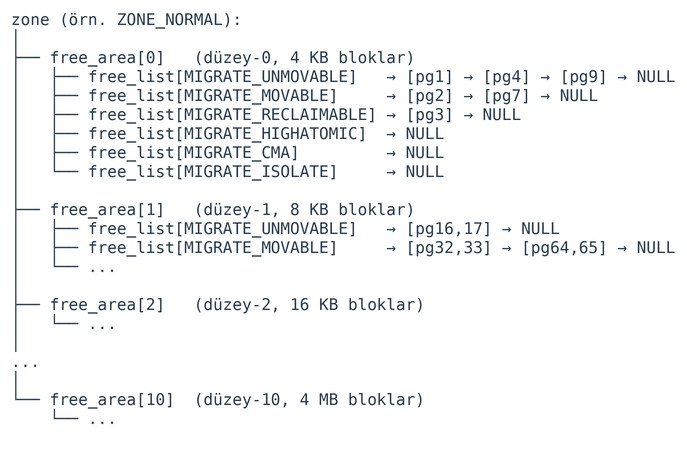

Buradaki ``free_area``'nın düzeylerden oluşan bir dizi olduğuna, dizinin her elemanının her göç türü
için ayrı listeler barındırdığına dikkat ediniz. ``free_area`` listesinin her elemanı aslında bir
bağlı liste dizisidir. ``free_area[n]`` bağlı liste dizisi *n*'inci düzeyin her göç türü için bağlı
listelerini tutmaktadır. (Örneğin ``free_area[0]`` bağlı liste dizisi her göç türü için 0'ıncı
düzeyin bağlı listelerini, ``free_area[1]`` bağlı liste dizisi her göç türü için 1'inci düzeyin
bağlı listelerini tutmaktadır.) Göç türlerinin ne amaçla kullanıldığını izleyen paragraflarda
açıklayacağız.

Güncel çekirdeklerde ``free_area`` nesnelerinin içerisindeki ``free_list`` bağlı listeleri
``buddy_list`` elemanı yoluyla *page* nesnelerini tutar durumdadır:

.. code-block:: c

   struct page {
       memdesc_flags_t flags;

       union {
           struct {
               union {
                   /* ... */
                   struct list_head buddy_list;  /* free_list tarafından kullanılan düğüm */
                   /* ... */
               };
               /* ... */
           };
           /* ... */
       }
   } _struct_page_alignment;

Sayfa Tahsisat Fonksiyonları
----------------------------

``alloc_pages`` fonksiyonu ikiz blok tahsisat sisteminden sayfa tahsis eden en temel
fonksiyondur. Fonksiyonun parametrik yapısı şöyledir:

.. code-block:: c

    struct page *alloc_pages(gfp_t gfp_mask, unsigned int order);

``alloc_pages`` eskiden ``include/linux/gfp.h`` dosyasında ``CONFIG_NUMA`` konfigürasyon
parametresine göre makro ya da inline fonksiyon biçiminde tanımlanıyordu. Ancak daha sonra
makro haline getirilmiştir.

``alloc_pages`` fonksiyonun birinci parametresi tahsisatın nereden yapılacağını belirtmektedir.
İkinci parametresi ise tahsisat için düzey belirtmektedir. (Yani örneğin 1 sayfa tahsis
edilecekse bu parametre 0, iki sayfa tahsis edilecekse 1, 4 sayfa tahsis edilecekse 2
girilmelidir.) Fonksiyonun birinci parametresindeki ``gfp_t`` türü tipik olarak ``unsigned int``
biçiminde typedef edilmektedir. Bu parametreye çeşitli mask bayrakları bit düzeyinde OR işlemine
sokularak verilmektedir. Mask bayrakları ``include/linux/gfp_types.h`` dosyası içerisinde
define edilmiştir. Bunları aşağıda bir tablo biçiminde veriyoruz:

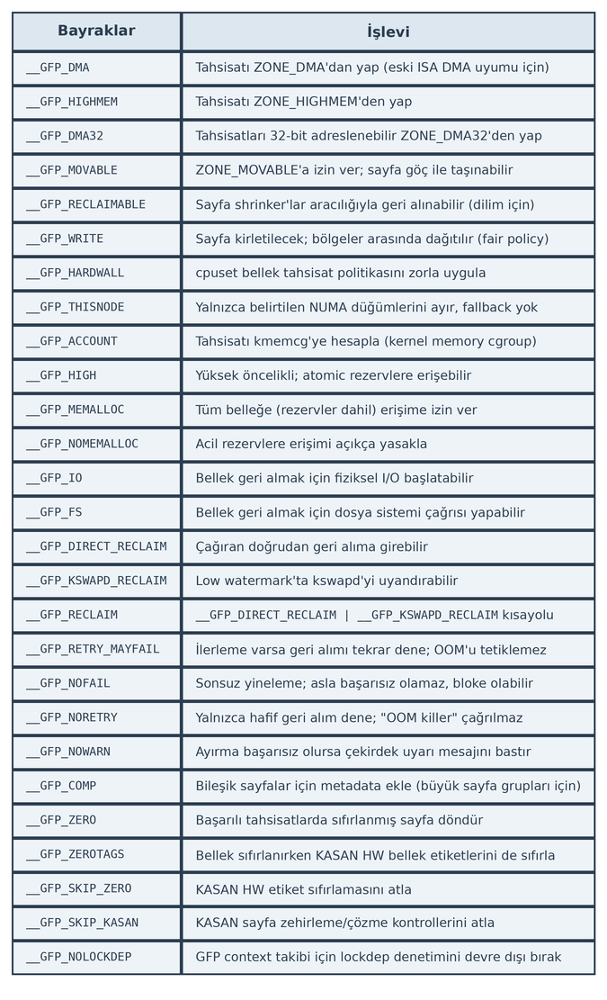

Linux çekirdek kodlamasında başı ``__`` ile başlayan değişkenlerin "aşağı seviyeli kodlar
tarafından kullanıldığını" anımsayınız. Yukarıdaki bayraklar ince ayar için kullanılmaktadır.
Bunların her bileşimi anlamlı değildir. Yani örneğin bazı bayraklar bazı bayraklarla
kullanılamamaktadır. Aslında çekirdek içerisinde yukarıdaki bayraklar kullanılarak oluşturulmuş
başı ``__`` ile başlamayan daha yüksek seviyeli bayraklar da vardır. Bunların listesini de
aşağıdaki tabloda veriyoruz:

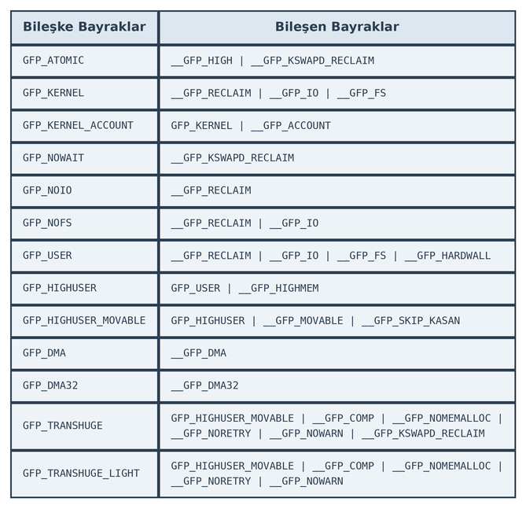

Programcılar genellikle bu yüksek seviyeli bayrakları kullanmaktadır. Örneğin ``GFP_ATOMIC``,
``GFP_KERNEL``, ``GFP_USER``, ``GFP_DMA``, ``GFP_DMA32`` en çok kullanılan yüksek seviyeli
bayraklardır. Biz bu bayraklar hakkında izleyen paragraflarda daha fazla bilgi vereceğiz.

``alloc_pages`` fonksiyonu başarı durumunda tahsis edilen sayfaların ilkine ilişkin ``page``
yapı nesnesinin adresiyle, başarısızlık durumunda ``NULL`` adresle geri dönmektedir.
Anımsanacağı gibi zaten çekirdek tüm sayfaları doğrudan ya da dolaylı biçimde bir dizi
içerisinde tutmaktadır. ``alloc_pages`` bize ilgili ``page`` nesnesinin bu dizideki adresini
vermektedir. Burada bize verilen ``page`` adresini biz ilerleterek ilgili dizinin sonraki
elemanına erişiriz. İkiz blok tahsisat sisteminde her zaman fiziksel bellekte ardışıl fiziksel
sayfaların tahsis edildiğini anımsayınız. Tabii ``alloc_pages`` fonksiyonun bize verdiği adres
sanal adrestir. Anımsanacağı gibi bir ``page`` nesnesinin adresi bilindiğinde bunun fiziksel
bellekteki kaç numaralı sayfaya ilişkin olduğu ``page_to_pfn`` fonksiyonuyla elde
edilebilmekteydi.

``alloc_pages`` fonksiyonuyla tahsis edilen sayfaların ``__free_pages`` fonksiyonuyla serbest
bırakılması gerekir:

.. code-block:: c

    void __free_pages(struct page *page, unsigned int order);

Fonksiyon ``mm/page_alloc.c`` dosyası içerisinde tanımlanmıştır. Fonksiyonun birinci parametresi
tahsisata ilişkin ilk ``page`` nesnesinin adresini, ikinci parametresi ise düzey bilgisini
belirtmektedir. Örneğin 2'inci düzeyden 4 sayfa tahsis etmiş olalım. Bu sayfaları serbest
bırakırken yine düzey bilgisini 2 olarak girmeliyiz. Örneğin:

.. code-block:: c

    struct page *pages;

    pages = alloc_pages(GFP_KERNEL, 2);  /* 2'inci düzeyden 4 ardışıl fiziksel sayfa tahsis ediliyor */
    if (pages == NULL)
        return -ENOMEM;

    /* ... */

    __free_pages(pages, 2);              /* 2'inci düzeyden yapılan tahsisat iade ediliyor */

``alloc_pages`` ve ``__free_pages`` fonksiyonları export edildiği için aygıt sürücüler
tarafından da kullanılabilmektedir.

``alloc_pages`` fonksiyonun başında ``__`` yokken yapılan tahsisatı serbest bırakan
``__free_pages`` fonksiyonun başında ``__`` olması bir uyumsuzluk oluşturmaktadır. Çekirdekte
aslında ``free_pages`` isimli başka bir fonksiyon da vardır. Bu fonksiyon sayfaları onların
sanal adreslerini (``page`` adreslerini değil sanal adreslerini) alarak serbest bırakmaktadır.

``alloc_pages`` ile tahsis edilen sayfaları farklı miktarlarda iade etmeye çalışmayınız. Bu
durumda dilimli tahsisat sistemini bozabilirsiniz:

.. code-block:: c

    __free_pages(pages + 0, 0);  /* dikkat! yanlış kullanım */
    __free_pages(pages + 1, 0);  /* dikkat! yanlış kullanım */
    __free_pages(pages + 2, 0);  /* dikkat! yanlış kullanım */
    __free_pages(pages + 3, 0);  /* dikkat! yanlış kullanım */

``__get_free_pages`` fonksiyonunun tek sayfayı serbest bırakan ``__get_free_page`` isimli makrosu da bulunmaktadır:

.. code-block:: c

   #define __get_free_page(gfp_mask) __get_free_pages((gfp_mask), 0)

``alloc_pages`` fonksiyonunun bize fiziksel sayfanın sanal adresini vermediğine, o sayfayı
yönetmekte kullanılan ``page`` nesnesinin adresini verdiğine dikkat ediniz. Biz eğer ilgili
sayfanın içeriğine erişmek istiyorsak ``page_to_virt`` makrosunu ya da ``page_address``
fonksiyonunu kullanmalıyız.

Eğer tek sayfalık tahsisat yapılacaksa ``alloc_pages`` yerine ``alloc_page`` makrosu
kullanılabilir. Bu makro ``include/linux/gfp.h`` dosyasında şöyle yazılmıştır:

.. code-block:: c

    #define alloc_page(gfp_mask)    alloc_pages(gfp_mask, 0)

Yukarıda da belirttiğimiz gibi artık ``alloc_pages`` de çekirdeklerde bir süredir makro olarak
yazılmaktadır. 

Burada çekirdekteki makroların ve ``static inline`` fonksiyonların aygıt sürücülerde kullanımına ilişkin bir
noktayı belirtmek istiyoruz. Bir makro ya da ``inline`` fonksiyon koda açılmaktadır. Açılan koddaki makrolar da
yeniden açılmaktadır. Makroların ve ``inline`` fonksiyonların export edilmesi söz konusu değildir. Makroların ve
``inline`` fonksiyonların çekirdek modülleri ve aygıt sürücüler tarafından kullanılabilmesi için onların açımları
sonucunda çağrılan fonksiyonların export edilmiş olması gerekir.

Aşağıda ``alloc_pages`` ve ``__free_pages`` fonksiyonlarının kullanımına ilişkin basit bir aygıt sürücü örneği
verilmiştir. Aygıt sürücünün ``init`` fonksiyonunda sayfa tahsisatı yapılmış ve sayfanın sanal adresi bir global
değişkende saklanmıştır. ``write`` işleminde bu sayfaya yazma yapılıp, ``read`` işleminde de yazılanlar okunmuştur.
Aygıt sürücünün ``exit`` fonksiyonunda da tahsis edilen sayfa serbest bırakılmıştır.

Aygıt sürücünün ``init`` fonksiyonunda sayfa tahsisatı şöyle yapılmıştır:

.. code-block:: c

    static void *g_pageaddr;

    static int __init test_driver_init(void)
    {
        struct page *page;

        if ((page = alloc_pages(GFP_KERNEL, 0)) == NULL) {
            printk(KERN_ERR "cannot alloc pages!..\n");
            cdev_del(&g_cdev);
            unregister_chrdev_region(g_dev, 1);
            return -ENOMEM;
        }

        g_pageaddr = page_address(page);

        return 0;
    }

Aygıt sürücünün ``exit`` fonksiyonunda tahsisat şöyle geri alınmıştır:

.. code-block:: c

    static void __exit test_driver_exit(void)
    {
        __free_pages(virt_to_page(g_pageaddr), 0);

        /* ... */
    }

Aygıt sürücünün ``read`` ve ``write`` fonksiyonları da şöyledir:

.. code-block:: c

    static ssize_t test_driver_read(struct file *filp, char *buf, size_t size, loff_t *off)
    {
        if (copy_to_user(buf, g_pageaddr, size) != 0)
            return -EFAULT;

        return size;
    }

    static ssize_t test_driver_write(struct file *filp, const char *buf, size_t size, loff_t *off)
    {
        if (copy_from_user(g_pageaddr, buf, size) != 0)
            return -EFAULT;

        return size;
    }

Aygıt sürücünün tam kaynak kodu aşağıda verilmiştir. Aygıt sürücüyü yükledikten sonra ``test-page.c`` programı
ile test edebilirsiniz.

``test-driver.c``

.. code-block:: c

    #include <linux/module.h>
    #include <linux/kernel.h>
    #include <linux/fs.h>
    #include <linux/cdev.h>
    #include <linux/gfp.h>
    #include <linux/mm.h>

    MODULE_LICENSE("GPL");
    MODULE_AUTHOR("Kaan Aslan");
    MODULE_DESCRIPTION("test-driver");

    static int test_driver_open(struct inode *inodep, struct file *filp);
    static int test_driver_release(struct inode *inodep, struct file *filp);
    static ssize_t test_driver_read(struct file *filp, char *buf, size_t size, loff_t *off);
    static ssize_t test_driver_write(struct file *filp, const char *buf, size_t size, loff_t *off);

    static dev_t g_dev;
    static struct cdev g_cdev;
    static struct file_operations g_fops = {
        .owner = THIS_MODULE,
        .open = test_driver_open,
        .read = test_driver_read,
        .write = test_driver_write,
        .release = test_driver_release,
    };
    static void *g_pageaddr;

    static int __init test_driver_init(void)
    {
        int result;
        struct page *page;

        printk(KERN_INFO "test-driver module initialization...\n");

        if ((result = alloc_chrdev_region(&g_dev, 0, 1, "test-driver")) < 0) {
            printk(KERN_INFO "cannot alloc char driver!...\n");
            return result;
        }
        cdev_init(&g_cdev, &g_fops);
        if ((result = cdev_add(&g_cdev, g_dev, 1)) < 0) {
            unregister_chrdev_region(g_dev, 1);
            printk(KERN_ERR "cannot add device!...\n");
            return result;
        }

        if ((page = alloc_pages(GFP_KERNEL, 0)) == NULL) {
            printk(KERN_ERR "cannot alloc pages!..\n");
            cdev_del(&g_cdev);
            unregister_chrdev_region(g_dev, 1);
            return -ENOMEM;
        }

        g_pageaddr = page_address(page);

        return 0;
    }

    static void __exit test_driver_exit(void)
    {
        __free_pages(virt_to_page(g_pageaddr), 0);
        cdev_del(&g_cdev);
        unregister_chrdev_region(g_dev, 1);

        printk(KERN_INFO "test-driver module exit...\n");
    }

    static int test_driver_open(struct inode *inodep, struct file *filp)
    {
        return 0;
    }

    static int test_driver_release(struct inode *inodep, struct file *filp)
    {
        return 0;
    }

    static ssize_t test_driver_read(struct file *filp, char *buf, size_t size, loff_t *off)
    {
        if (copy_to_user(buf, g_pageaddr, size) != 0)
            return -EFAULT;

        return size;
    }

    static ssize_t test_driver_write(struct file *filp, const char *buf, size_t size, loff_t *off)
    {
        if (copy_from_user(g_pageaddr, buf, size) != 0)
            return -EFAULT;

        return size;
    }

    module_init(test_driver_init);
    module_exit(test_driver_exit);

``makefile``

.. code-block:: makefile

    obj-m += ${file}.o

    all:
        make -C /lib/modules/$(shell uname -r)/build M=${PWD} modules
    clean:
        make -C /lib/modules/$(shell uname -r)/build M=${PWD} clean

``load``

.. code-block:: bash

    #!/bin/bash

    module=$1
    mode=666

    /sbin/insmod ./${module}.ko ${@:2} || exit 1
    major=$(awk "\$2 == \"$module\" {print \$1}" /proc/devices)
    rm -f $module
    mknod -m $mode $module c $major 0

``unload```

.. code-block:: bash

    #!/bin/bash

    module=$1

    /sbin/rmmod ./${module}.ko || exit 1
    rm -f $module

``page-test.c``

.. code-block:: c

    #include <stdio.h>
    #include <stdlib.h>
    #include <string.h>
    #include <fcntl.h>
    #include <unistd.h>

    void exit_sys(const char *msg);

    int main(void)
    {
        int fd;
        char wbuf[] = "this is a test";
        char rbuf[4096 + 1];
        size_t result;

        if ((fd = open("test-driver", O_RDWR)) == -1)
            exit_sys("open");

        if (write(fd, wbuf, strlen(wbuf)) == -1)
            exit_sys("write");

        if ((result = read(fd, rbuf, strlen(wbuf))) == -1)
            exit_sys("read");
        rbuf[result] = '\0';

        printf("%s\n", rbuf);

        close(fd);

        return 0;
    }

    void exit_sys(const char *msg)
    {
        perror(msg);
        exit(EXIT_FAILURE);
    }

Çekirdekteki ``__get_free_pages`` fonksiyonu ``alloc_pages`` gibi sayfa tahsisatı yapmakla birlikte bize ``page``
nesnesinin adresini değil doğrudan tahsis edilen fiziksel sayfanın sanal bellek adresini vermektedir. (Çekirdek
alanındaki fiziksel sayfaların ardışıl biçimde sanal adrese haritalandığını anımsayınız.) ``__get_free_pages``
aslında ``include/linux/gfp.h`` dosyasında bir makro olarak yazılmıştır. Biz burada anlatımı kolaylaştırmak için
ona fonksiyon diyeceğiz. Fonksiyonun parametrik yapısı şöyledir:

.. code-block:: c

    unsigned long __get_free_pages(gfp_t gfp_mask, unsigned int order);

Fonksiyon tahsis edilen fiziksel sayfaların sanal adresine geri dönmektedir. Geri dönüş değerinin ``unsigned long``
türünden olması sizi şaşırtmasın. ``__get_free_pages`` fonksiyonu ile tahsis edilen sayfalar ``free_pages``
fonksiyonu ile serbest bırakılabilir. (Bu fonksiyonu ``__free_pages`` fonksiyonu ile karıştırmayınız.)
``free_pages`` fonksiyonunun parametrik yapısı şöyledir:

.. code-block:: c

    void free_pages(unsigned long addr, unsigned int order);

Tabii aslında bu fonksiyon da ``__free_pages`` fonksiyonunu çağırmaktadır. Şöyle yazılmıştır:

.. code-block:: c

    void free_pages(unsigned long addr, unsigned int order)
    {
        if (addr != 0) {
            VM_BUG_ON(!virt_addr_valid((void *)addr));
            __free_pages(virt_to_page((void *)addr), order);
        }
    }

    EXPORT_SYMBOL(free_pages);

Örneğin:

.. code-block:: c

    unsigned long addr;
    void *buf;

    if ((addr = __get_free_pages(GFP_KERNEL, 1)) != 0)
        return -ENOMEM;

    buf = (void *)addr;
    memset(buf, 0, PAGE_SIZE * 2);

    free_pages(addr, 1);

Çekirdekteki ``get_zeroed_page`` fonksiyonu içi sıfırlanmış tek bir sayfanın tahsisatını yapmaktadır. Fonksiyon
tahsis edilen sayfanın sanal bellek adresiyle geri dönmektedir:

.. code-block:: c

    unsigned long get_zeroed_page(gfp_t gfp_mask);

Çekirdekte ``alloc_pages_exact`` isimli ilginç bir sayfa tahsisat fonksiyonu (aslında bir makro) da vardır.
Fonksiyonun parametrik yapısı şöyledir:

.. code-block:: c

    void *alloc_pages_exact(size_t size, gfp_t gfp_mask);

Fonksiyonun birinci parametresi byte cinsinden büyüklük belirtmektedir. Fonksiyon parametresiyle belirtilen
büyüklüğü kapsayan en küçük sayfa miktarını tahsis eder. Ancak ikiz blok tahsisat sisteminde tahsisatlar 2'nin
kuvvetlerine göre yapıldığı için artan sayfalar oluşabilecektir. Bunlar fonksiyon tarafından geri bırakılmaktadır.
Örneğin biz bu fonksiyonun birinci parametresine 25000 değerini girmiş olalım. 25000 byte'ı karşılayabilecek sayfa
sayısı 6'dır. Ancak ikiz blok tahsisat sisteminde 6 sayfa tahsis edilememektedir, ancak 8 sayfa tahsis
edilebilmektedir. İşte fonksiyon 8 sayfayı tahsis edip 2 sayfayı geri bırakmaktadır. Fonksiyonun doğrudan sanal
adresle geri döndüğüne dikkat ediniz.

``alloc_pages_exact`` fonksiyonuyla tahsis edilen sayfalar ``free_pages_exact`` fonksiyonuyla serbest
bırakılmaktadır:

.. code-block:: c

    void free_pages_exact(void *virt, size_t size);

NUMA mimarisinde ``alloc_pages`` gibi sayfa tahsis eden fonksiyonlar çağrı hangi işlemcideki ya da çekirdekteki
koddan yapılmışsa o işlemcinin ya da çekirdeğin NUMA düğümünden tahsisatı yapmaya çalışmaktadır. Ancak ilgili
düğümde boş yer bulunamazsa *fallback* mekanizması devreye sokularak diğer düğümlere de bakılabilmektedir.
*Fallback* mekanizması izleyen paragraflarda ele alınmaktadır. İşte ayrıca çekirdekte belli NUMA düğümlerinden
sayfa tahsisatı yapan bir fonksiyon da bulundurulmuştur:

.. code-block:: c

    struct page *alloc_pages_node(int nid, gfp_t gfp_mask, unsigned int order);

Fonksiyonun birinci parametresi NUMA düğümünün indeksini belirtmektedir.

Sayfa Tahsisatlarında Fallback Mekanizması
------------------------------------------

Şimdi de ikiz blok tahsisat sistemindeki *fallback* mekanizması üzerinde duracağız. (*fallback* Türkçe "yedek
plan", "B planı" gibi anlamlara gelmektedir.) *Fallback* "belli bir NUMA düğümünde ya da belli bir bölgede ya da
belli bir göç türünde tahsisat yapılamazsa diğer başka düğümlere, bölgelere ve göç türlerine de bakılması"
anlamına gelmektedir.

Bellek yönetiminin giriş bölümünde de açıkladığımız gibi Linux çekirdeği fiziksel belleği NUMA düğümlerinden
(node), NUMA düğümlerini bellek bölgelerinden (zones), bellek bölgelerini de göç türlerinden (migration type)
oluşan bir sistem biçiminde ele almaktadır. Linux çekirdeğinde her göç türünün ayrı bir ikiz blok tahsisat
sistemi vardır. Bu tahsisat sisteminin kullandığı veri yapılarını yukarıda açıklamıştık. Yeniden anımsatmak
istiyoruz:

.. code-block:: c

    typedef struct pglist_data {
        /* ... */
        struct zonelist node_zonelists[MAX_ZONELISTS];
        int nr_zones;
        /* ... */
    };

    struct zone {
        /* ... */
        struct free_area free_area[NR_PAGE_ORDERS];
        int nr_zones;
        /* ... */
    };

    struct free_area {
        struct list_head free_list[MIGRATE_TYPES];
        unsigned long    nr_free;
    };


Aslında sayfa tahsisatları "belli bir düğümün, belli bir bölgesinin, belli bir göç türünü" hedef alarak süreci
başlatmaktadır. İşte ``alloc_pages`` gibi fonksiyonların birinci parametresindeki bayraklar bu tespitin
yapılmasını sağlamaktadır. Aşağıda hangi bayraklar kullanıldığında işlemlerin hangi bölgeden ve hangi göç
türünden başlatılacağı bilgisi bir tablo halinde verilmiştir:

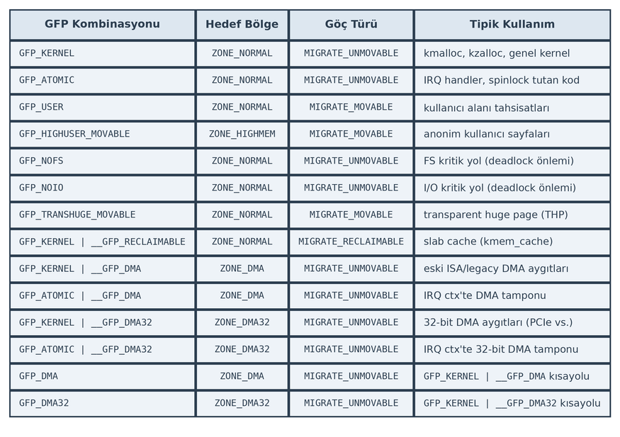

Biz daha önce bellek bölgelerinin anlamlarını açıklamıştık. Ancak göç türleri hakkında ayrıntılı bir açıklama
yapmamıştık. Önce bölgelerdeki göç türleri üzerinde açıklamalar yapalım.

Linux çekirdeğinde kullanılan göç türleri şunlardır:

.. code-block:: c

    enum migratetype {
        MIGRATE_UNMOVABLE,      /* 0 — taşınamaz, geri alınamaz */
        MIGRATE_MOVABLE,        /* 1 — taşınabilir */
        MIGRATE_RECLAIMABLE,    /* 2 — geri alınabilir */
        MIGRATE_PCPTYPES,       /* 3 — PCP listelerinin sonu (marker) */
        MIGRATE_HIGHATOMIC = MIGRATE_PCPTYPES,  /* 3 — acil rezerv */
        MIGRATE_CMA,            /* 4 — Contiguous Memory Allocator */
        MIGRATE_ISOLATE,        /* 5 — izole edilmiş, tahsisat yapılmaz */
        MIGRATE_TYPES           /* toplam tür sayısı */
    };
    
``MIGRATE_UNMOVABLE`` ve ``MIGRATE_MOVABLE`` göç türleri tahsis edilen sayfanın yerinin çekirdek tarafından
değiştirilip değiştirilmeyeceği anlamına gelmektedir. Çekirdek ikiz blok tahsisat sisteminde ardışıl yeteri
kadar blok bulunamadığında (yani *fragmentation* durumunda) ardışıl sayfa elde etmek için sayfaların fiziksel
bellekteki yerlerini değiştirebilmektedir. İşte bu tür sayfalara Linux çekirdeğinde *movable sayfalar*
denilmektedir. Tabii çekirdek fiziksel sayfanın yerini değiştirdiğinde bu sayfaya referans eden öğelerin
fiziksel adreslerini de sayfa tablolarında değiştirmektedir. Örneğin ikiz blok tahsisat sisteminde 1 sayfalık
çok sayıda blok bulunduğu halde yan yana 2 sayfalık hiç blok bulunmasın. İşte çekirdek 1 sayfalık bloğun
yanındaki ikizinin fiziksel bellekte yerini değiştirerek (yani onu boş sayfalardan birine taşıyarak) yan yana
iki fiziksel sayfa oluşturabilmektedir. Tabii bu durum oldukça seyrek gerçekleşir. Bir sayfanın taşınabilmesi
için onun *reversible* özelliklere sahip olması gerekmektedir. İşte ``MIGRATE_MOVABLE`` bayrağı sayfayı
taşınabilir hale getirmektedir. Görüldüğü gibi çekirdekte taşınabilen sayfalarla, taşınamayan sayfalar ayrı
ikiz blok tahsisat sisteminde tutulmaktadır. Çekirdekte sayfa taşıma işlemi şu aşamalardan geçilerek
yapılmaktadır:

.. code-block:: none

    migrate_page(old_page, new_page):
        1. new_page için fiziksel frame al
        2. old_page içeriğini new_page'e kopyala
        3. rmap üzerinden tüm PTE'leri bul
        4. Her old_page sayfa tablosu girişini new_page'e yönlendir (TLB flush)
        5. old_page'i iade et

C'deki ``malloc`` fonksiyonu gerektiğinde ``brk`` ya da ``mmap`` sistem fonksiyonlarını çağırarak tahsisatları
yapmaktadır. Bunlar için tahsis edilen sayfalar ``MIGRATE_MOVABLE`` biçimdedir.

``MIGRATE_RECLAIMABLE`` göç türü fiziksel olarak taşınamaz ancak çekirdek tarafından *swap out* amacıyla
boşaltılabilen sayfaların bulunduğu ikiz blok sistemini belirtmektedir. Bu göç türünden işlemleri başlatmak
için ``__GFP_RECLAIMABLE`` bayrağının da eklenmesi gerekmektedir. Dilimli tahsisat sisteminden
(slab allocator) tahsis edilen sayfalar bu özelliğe sahiptir. Çekirdekteki pek çok nesne zaten dilimli
tahsisat sistemi ile tahsis edilmektedir. Örneğin:

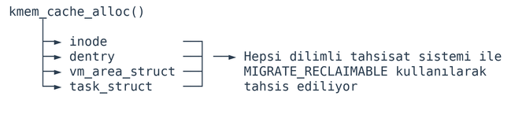

Aşağıdaki tabloda ``MIGRATE_UNMOVABLE`` , ``MIGRATE_MOVABLE`` ve ``MIGRATE_RECLAIMABLE`` göç türlerini karşılaştırıyoruz:

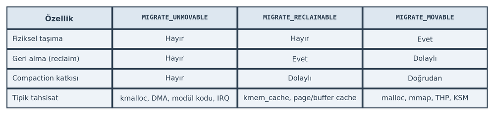

``MIGRATE_HIGHATOMIC`` göç türü yüksek öncelikli, bloke olmaması gereken kodların kullanması amacıyla
oluşturulmuş özel bir ikiz blok tahsisat sistemidir.

``MIGRATE_CMA`` (*Contiguous Memory Allocator*) göç türü: multimedya SoC'ları (kamera, video codec, GPU)
büyük fiziksel ardışıl belleklere gereksinim duymaktadır. Bu alanların boot anında rezerve edilmesi israfa
yol açabilmektedir. CMA göç türü bu bölgeleri normalde ``MIGRATE_MOVABLE`` gibi kullanır; CMA tahsisatı
gerektiğinde ise bölgedeki taşınabilir sayfaları başka yere taşıyarak ardışıl alan açar.

``MIGRATE_ISOLATE`` göç türü geçici olarak ikiz blok tahsisat sisteminden izole edilmiş sayfaları barındırmak
için kullanılmaktadır. Buradan hiçbir zaman yeni tahsisat yapılmaz. Çekirdek bu alanı bazı önlemler için
geçici olarak oluşturmaktadır.

Başlangıçta tüm göç türlerine ilişkin ikiz blok tahsisat sistemleri dolu olmak zorunda değildir. Zaten
*fallback* mekanizması "eğer bu liste boşsa başka listeden al" anlamına gelmektedir.

Yukarıda da belirttiğimiz gibi *fallback* mekanizması "burada boş yer bulamazsan şuralara da bak" anlamına
gelen bir mekanizmadır. *Fallback* mekanizmasının bazı ayrıntıları vardır. Ancak mekanizma temel olarak şöyle
yürütülmektedir:

1. ``alloc_pages`` gibi bir fonksiyonla sayfa tahsisatı yapılmak istensin.
2. Tahsisat önce çağrıyı yapan işlemci ya da çekirdeğin NUMA düğümünden hareketle yapılmaya çalışılır.
3. İlgili NUMA düğümünde GFP bayraklarına bakılarak başlangıç bölgesi (zone) ve göç türü (migration type)
   belirlenir.
4. Önce ilgili bölgedeki belirlenen göç türünden tahsisat yapılmaya çalışılır; eğer orada boş yer yoksa
   belirlenmiş olan (ayrıntıları var) diğer göç türlerine de bakılır.
5. Eğer ilgili bölgedeki göç türlerinde boş sayfa bulunamazsa bu kez aynı NUMA düğümündeki diğer bölgelere
   (ayrıntıları var) geçilir. Arama o bölgelerin ilgili göç türlerinde de benzer biçimde yapılır.
6. Eğer ilgili NUMA düğümünde aranan hiçbir bölgenin göç türünde boş yer bulunamazsa belirlenen diğer NUMA
   düğümlerine geçilir.

Aşağıda bu süreç şekilsel olarak da gösterilmiştir:

.. figure:: _static/fallback-mechanism.png
   :alt: Fallback mekanizması akış diyagramı
   :align: center
   :width: 70%

Güncel çekirdeklerde göç türlerine ilişkin *fallback* sırası ``mm/page_alloc.c`` dosyasında ``fallbacks`` isimli
iki boyutlu bir dizide belirtilmiştir. Bu dizi şöyle tanımlanmıştır:

.. code-block:: c

    static int fallbacks[MIGRATE_PCPTYPES][MIGRATE_PCPTYPES - 1] = {
        [MIGRATE_UNMOVABLE]   = { MIGRATE_RECLAIMABLE, MIGRATE_MOVABLE   },
        [MIGRATE_MOVABLE]     = { MIGRATE_RECLAIMABLE, MIGRATE_UNMOVABLE },
        [MIGRATE_RECLAIMABLE] = { MIGRATE_UNMOVABLE,   MIGRATE_MOVABLE   },
    };

Matrisin satırları her göç türü için "eğer orada boş sayfa bulunamazsa sırasıyla hangi göç türlerine
bakılacağını" belirtmektedir. Örneğin ``MIGRATE_UNMOVABLE`` göç türünden tahsisat yapılmak istensin. İşte
burada boş sayfa bulunamazsa sırasıyla ``MIGRATE_RECLAIMABLE`` ve ``MIGRATE_MOVABLE`` göç türlerine de
bakılacaktır. Bu *fallback* sırasının statik bir biçimde çekirdek kodlarında belirtildiğine dikkat ediniz.

Burada önemli bir noktayı vurgulamak istiyoruz. Çekirdek belli bir göç türünde boş blok bulamayıp diğer göç
türüne başvurup oradan boş blok aldığında artık kopardığı blokları hedef göç türüne taşımaktadır. Bu sayfalar
free hale getirildiğinde alınan yere iade edilmemektedir, taşınan yere iade edilmektedir. Ayrıca önemli bir
ayrıntı da vardır. Diğer göç türlerinden arama her zaman en yüksek düzeyden (order'dan) başlanarak aşağıya
doğru yapılmaktadır. (En yüksek düzeyin 10 olduğunu ve 4 MB sayfa bloğu belirttiğini anımsayınız.) Örneğin
biz 4 sayfa tahsis etmek isteyelim. Ancak *fallback* durumu oluşup bu sayfa başka bir göç türünde aranıyor
olsun. İşte arama 10'uncu düzeydeki bağlı listeden başlatılıp aşağıya doğru inecektir. Böylece yalnızca 4
sayfa değil ilgili sayfa bloğunun tüm sayfaları göçe tabi tutulacaktır. Örneğin ilgili göç türünde 10'uncu
düzeyde boş sayfa bloğu olmasın, 9'uncu düzeyde de olmasın ama 8'inci düzeyde olsun. İşte 8'inci düzeydeki
1 MB'lik sayfa bloğu göçe tabi tutularak hedefe taşınıp oradan 4 sayfa verilmektedir. Böylece bir göç türünde
boş sayfa bulunamayınca diğer göç türünden daha büyük bir parçanın alınması sağlanmıştır.

Fallback Mekanizmasına İlişkin Veri Yapıları
~~~~~~~~~~~~~~~~~~~~~~~~~~~~~~~~~~~~~~~~~~~~~

Şimdi *fallback* mekanizmasının işletildiği veri yapıları üzerinde dikkatimizi yoğunlaştıralım. NUMA düğümlerini
temsil eden ``pglist_data`` yapısının (bu yapı ``pg_data_t`` olarak da typedef edilmiştir) ``node_zones`` dizisi
o düğümün bölgelerini, ``node_zonelists`` dizisi ise o düğümün fallback bölge listesini tutmaktadır.

.. code-block:: c

    typedef struct pglist_data {
        /* ... */

        struct zone     node_zones[MAX_NR_ZONES];
        struct zonelist node_zonelists[MAX_ZONELISTS];   /* fallback amaçlı */

        /* ... */
    } pg_data_t;

``node_zonelists`` dizisi ``zonelist`` isimli bir yapı türündendir. Bu yapı şöyle tanımlanmıştır:

.. code-block:: c

    struct zonelist {
        struct zoneref _zonerefs[MAX_ZONES_PER_ZONELIST + 1];
    };

Görüldüğü gibi bu yapı da ``zoneref`` türünden bir yapı dizisi içermektedir. ``zoneref`` yapısı da şöyle
tanımlanmıştır:

.. code-block:: c

    struct zoneref {
        struct zone *zone;   /* Pointer to actual zone */
        int zone_idx;        /* zone_idx(zoneref->zone) */
    };

Görüldüğü gibi burada bölgeyi temsil eden nesnenin adresi ve onun ``node_zones`` dizisindeki indeksi
tutulmaktadır. İşte aslında ``node_zonelists`` fallback amaçlı kullanılmaktadır. Bölge türlerini de yeniden
anımsatmak istiyoruz:

.. code-block:: c

    enum zone_type {
        ZONE_DMA,        // İlk 16 MB — eski ISA DMA için
        ZONE_DMA32,      // İlk 4 GB — 32-bit DMA için
        ZONE_NORMAL,     // Normal kernel sayfaları
        ZONE_MOVABLE,    // Taşınabilir sayfalar (hugepage, migration için)
        ZONE_DEVICE,     // Kalıcı bellek (PMEM) için
        __MAX_NR_ZONES
    };

``node_zonelists`` dizisinin ``MAX_ZONELISTS`` kadar elemanı içerdiğine dikkat ediniz. Bu sembolik sabit şöyle
tanımlanmıştır:

.. code-block:: c

    enum {
        ZONELIST_FALLBACK,      /* zonelist with fallback */
    #ifdef CONFIG_NUMA
        /*
         * The NUMA zonelists are doubled because we need zonelists that
         * restrict the allocations to a single node for __GFP_THISNODE.
         */
        ZONELIST_NOFALLBACK,    /* zonelist without fallback (__GFP_THISNODE) */
    #endif
        MAX_ZONELISTS
    };

Görüldüğü gibi aslında ``node_zonelists`` en fazla iki boyutlu bir dizidir. Dizinin birinci elemanı fallback
listesini tutmaktadır. İkinci elemanı ise düğüm temelinde fallback yapılmaması durumunda kullanılmaktadır. Biz
burada dizinin 0'ıncı indeksli ilk elemanı ile ilgileniyoruz. O halde aslında NUMA düğümünün fallback listesi
``zoneref`` dizisi biçimindedir. ``zoneref`` nesnesi de ilgili bölgeyi belirtmektedir. (Başka bir deyişle NUMA
düğümünün fallback listesi aslında bir bölge listesinden oluşmaktadır.)

``node_zonelists`` dizisinin uzunluğunun ``MAX_ZONES_PER_ZONELIST`` ile belirtildiğine dikkat ediniz. Bu
sembolik sabit şöyle tanımlanmıştır:

.. code-block:: c

    #define MAX_ZONES_PER_ZONELIST (MAX_NUMNODES * MAX_NR_ZONES)

Buradaki ``MAX_NUMNODES`` ve ``MAX_NR_ZONES`` değerleri çeşitli etmenlere göre değişebilmektedir.

Burada önemli bir noktayı belirtmek istiyoruz. ``node_zonelists`` elemanının 0'ıncı indeksindeki
(``ZONELIST_FALLBACK``) bölge dizisi aslında yalnızca o NUMA düğümünün bölgelerini belirtmemektedir; diğer
NUMA düğümlerinin bölgeleri de bu dizi içerisindedir. ``node_zonelists`` dizisinin temsili görüntüsü şöyledir:

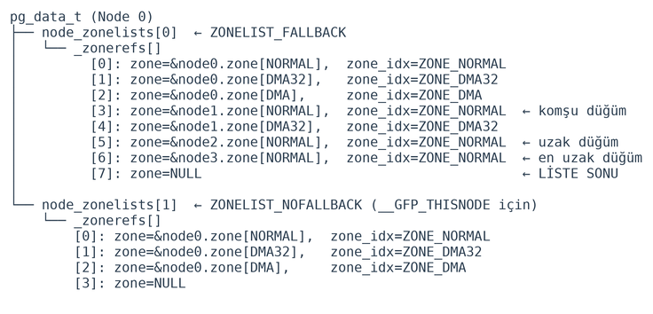

Bu temsili çizimde örnek olarak 0'ıncı NUMA düğümünün ``node_zonelists`` dizisi gösterilmiştir. Görüldüğü
gibi bu dizinin 0'ıncı elemanı bölgelerden oluşmaktadır; ancak bölgeler yalnızca 0'ıncı düğümün bölgelerini
içermemektedir, diğer düğümlerin bölgelerini de içermektedir. Örneğin 0'ıncı NUMA düğümünde ``alloc_pages``
ile ``ZONE_DMA32`` bölgesinden ``MIGRATE_UNMOVABLE`` tahsisatı yapılmak istensin. İşte bölge listesinin
dolaşılmasına 0'ıncı düğümdeki DMA32'den başlatılacaktır:

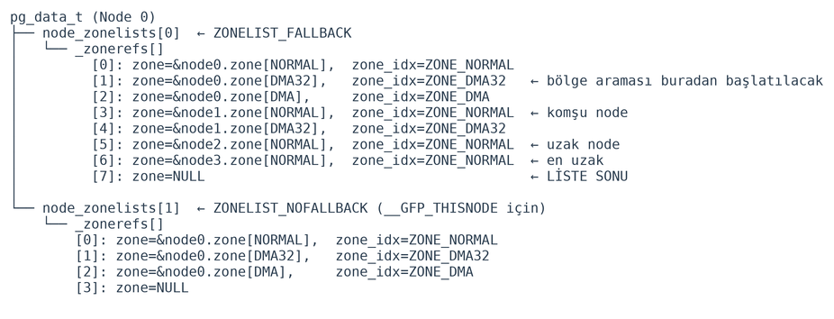

Eğer bu bölgenin göç *fallback* listesinin hiçbir yerinde talep edilen miktarda boş sayfa bulunamazsa bundan
sonra arama 0'ıncı düğümün ``ZONE_DMA`` bölgesinden devam edecek, orada da bulunamazsa 1'inci düğümün
``ZONE_NORMAL`` bölgesinden devam edecektir.

``node_zonelists[1]`` elemanının (``ZONELIST_NOFALLBACK``) ne işe yaradığını merak edebilirsiniz. Bu elemanda
belirtilen bölge dizisi aramanın kesinlikle belirli bir NUMA düğümünde kalması gerektiği durumlar için
bulundurulmuştur. Bu dizi elemanı ``__GFP_THISNODE`` bayrağı girildiğinde kullanılmaktadır. Bu dizi elemanında
yalnızca ilgili düğümün bölümleri vardır. Yani ``alloc_pages_node`` çağrısında GFP bayrakları içinde
``__GFP_THISNODE`` varsa ``node_zonelists[1]`` (``ZONELIST_NOFALLBACK``) seçilir. Bu liste yalnızca o düğümün
kendi bölgelerini içerdiği için arama diğer düğümlere hiçbir koşulda taşmaz.

Bölgelerdeki Boş sayfa Listelerinin Başlangıç Durumu
~~~~~~~~~~~~~~~~~~~~~~~~~~~~~~~~~~~~~~~~~~~~~~~~~~~~~

Şimdi de başlangıçta (yani boot işleminden sonra) boş sayfa listelerinin durumu hakkında bilgi verelim.
Başlangıçta her sayfa kendi bellek bölgesinin en yüksek düzeyli ``MIGRATE_MOVABLE`` göç türüne ilişkin ikiz
blok tahsisat sistemindedir. Örneğin UMA x86-64 mimarisindeki başlangıç durumu şöyledir:

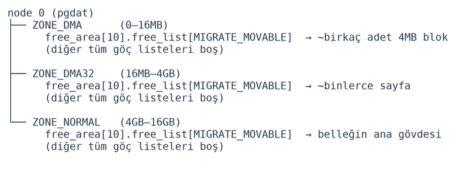

Örneğin ARM64 kullanılan Raspberry Pi modelleri için başlangıç durumu şöyledir:

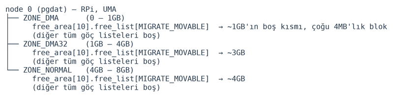

ARM32 kullanan BeagleBone modelleri için de başlangıç durumu şöyledir:

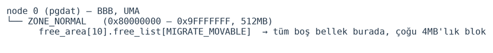

Fallback Mekanizmasında NUMA Düğümlerinin Dolaşım Sırası
~~~~~~~~~~~~~~~~~~~~~~~~~~~~~~~~~~~~~~~~~~~~~~~~~~~~~~~~

Peki bölgelerde *fallback* yapılırken NUMA düğümlerine hangi sırada bakılmaktadır? İşte *fallback* işlemlerinde 
NUMA düğümlerine NUMA uzaklık matrisindeki uzaklık değerleri dikkate alınarak bakılmaktadır. Yani node_zonelists 
dizisinde NUMA düğümleri NUMA uzaklıklarına göre küçükten büyüğe sort edilmiş durumdadır. Peki NUMA uzaklık 
matrisi nedir? İzleyen paragraflarda NUMA uzaklık matrisinin ne anlama geldiğini açıklıyoruz. 

Bilgisayar ana kartında CPU'lar için soketler bulunmaktadır. Bu soketlere takılan entegre devrelere
*paket (package)* denilmektedir. Biz bu paketlere *işlemci paketleri* de diyeceğiz. Bu işlemci paketleri
içerisinde İngilizce *die* denilen silikon kalıplar bulunmaktadır. Çekirdekler bu silikon kalıplar
üzerindedir. Her çekirdek bağımsız bir işlemci gibi davranmaktadır. Bir kasa içerisindeki soketlerin
sayısında da belli bir sınır vardır. Bu sınır donanımsal kısıtlardan kaynaklanmaktadır. Eğer kasa soket
sayısını kaldıramıyorsa bu durumda kasa sayısı artırılmaktadır. Tabii kasalar arasındaki RAM iletişimi de
yüksek hızlı iletkenlerle sağlanmaktadır. Böylece büyük NUMA sistemlerinde dağıtık RAM blokları
bulunabilmektedir ve her çekirdek bu RAM bloklarına (yani düğümlerine) farklı hızlarda erişebilmektedir.

Linux çekirdeği her soket ve dolayısıyla çekirdek için NUMA düğümlerine *NUMA uzaklığı (NUMA distance)*
denilen bir uzaklık derecesi atamaktadır. Tabii çekirdek bu bilgiyi de aslında donanımdan, yani modern
sistemlerde ACPI tablosundan elde etmektedir. NUMA uzaklık matrisindeki değerler gerçek bir gecikme değeri
değil göreli bir değer belirtmektedir. Örneğin soketlerin NUMA düğümlerine uzaklıkları aşağıdakine benzer
olabilmektedir:

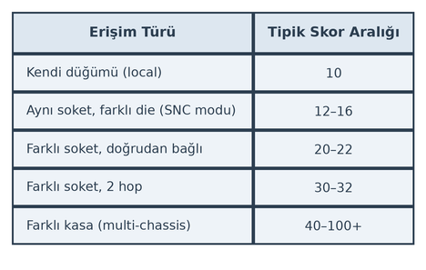

NUMA uzaklık matrisi aşağıdaki gibi temsil edilebilir:

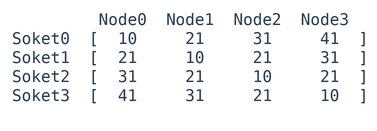

Tipik bazı NUMA donanımlarındaki gecikmeler nanosaniyeler mertebesinde şöyledir:

.. code-block:: none

    2 soketli Intel Xeon (UPI):
      Local RAM erişimi:   ~80–90 ns
      Remote RAM erişimi:  ~130–150 ns
      Oran: ~1.7x yavaş

    2 soketli AMD EPYC (Infinity Fabric):
      Local RAM erişimi:   ~75–85 ns
      Remote RAM erişimi:  ~140–170 ns
      Oran: ~1.9x yavaş

    4 soketli Intel (eski, 2-hop mümkün):
      Local:               ~80 ns
      1-hop remote:        ~150 ns
      2-hop remote:        ~220 ns

Örneğin 2 soketli bir NUMA sistemi aşağıdaki gibi bir mimariye sahip olabilmektedir:

.. figure:: _static/numa-two-socket.png
   :alt: 2 soketli NUMA mimarisi
   :align: center

Her soketteki çekirdek o sokete ilişkin RAM bank'ına (yani NUMA düğümüne) daha hızlı erişmektedir. Yukarıdaki
sistemde her sokette 64 çekirdekli bir işlemci paketi, 2 sokette toplamda 128 çekirdek bulunmaktadır. 

Dilimli Tahsisat Sistemi (Slab Allocator)
=========================================

Biz Linux çekirdeklerindeki bellek tahsisat sistemini iki kısma ayırmıştık: sayfa düzeyinde tahsisat ve byte
düzeyinde tahsisat. Sayfa düzeyinde tahsisatların "ikiz blok tahsisat sistemi (buddy allocator)" ile
yapıldığını gördük. Şimdi de çekirdeğin byte düzeyinde tahsisat sistemi üzerinde duracağız. Daha önceden de
belirttiğimiz gibi çekirdeğin byte düzeyinde tahsisat sistemine "dilimli tahsisat sistemi (slab allocator)"
denilmektedir.

Dilimli tahsisat sistemi 1994 yılında Jeff Bonwick tarafından önerilmiştir. Bonwick'in orijinal makalesine
aşağıdaki bağlantıdan erişebilirsiniz:

`The Slab Allocator: An Object-Caching Kernel Memory Allocator (Bonwick, 1994)
<https://people.eecs.berkeley.edu/~kubitron/courses/cs194-24-S14/hand-outs/bonwick_slab.pdf>`_

Dilimli tahsisat sistemi ilk kez Solaris sistemlerinde kullanılmıştır. Bunu FreeBSD sistemleri izlemiştir.
Sonra da Linux'un 2.2 kararlı sürümüyle çekirdekte yerini almıştır.

Klasik Tahsisat Algoritması: Boş Blokların Bağlı Listede Saklanması
-------------------------------------------------------------------

Dilimli tahsisat sistemini açıklamadan önce klasik byte düzeyinde tahsisat işleminin (yani ``malloc`` gibi bir
fonksiyonun) nasıl gerçekleştirildiği üzerinde duralım. Klasik byte düzeyinde tahsisat algoritması oldukça
basittir. Bellekte bir bölge *heap* olarak ayrılır. Bu bölgedeki "yalnızca boş alanlar" bir bağlı listede
tutulur. Tahsis edilmiş alanlar için bir kayıt tutulmaz. Tahsisat yapılmak istendiğinde boş blokları tutan
bağlı liste üzerinde istenilen uzunlukta ilk blokla karşılaşılana kadar (buna İngilizce *first fit* yöntemi
de denilmektedir) sıralı arama yapılır. Klasik tahsis algoritması D. Ritchie ve B. Kernighan'ın ünlü
*"The C Programming Language"* kitabında "8.7 Example - A Storage Allocator (Sayfa 163)" başlığı altında
da açıklanmıştır. Pek çok ``malloc``/``realloc``/``free`` benzeri tahsisat sistemi burada belirtilen
algoritmayı temel almıştır. Örneğin Windows sistemlerindeki ``HeapAlloc``, ``HeapFree`` gibi API
fonksiyonlarının temeli de bu algoritmadır. Linux sistemlerinde ``malloc``/``realloc``/``free`` fonksiyonlarında
da uzun süre bu klasik algoritmanın iyileştirilmiş biçimleri kullanılmıştır. D. Ritchie ve B. Kernighan tarafından
*The C Programming Language* kitabında verilen örnek ``malloc`` ve ``free`` algoritmaları aşağıda
verilmiştir.

.. code-block:: c

    #include <stddef.h>
    #include <unistd.h>

    typedef long Align;  /* alignment for longs */

    union header {
        struct {
            union header *ptr;   /* next block if on free list */
            unsigned size;       /* size of this block */
        } s;
        Align x;                 /* force alignment of blocks */
    };

    typedef union header Header;

    static Header base;              /* empty list to get started */
    static Header *freep = NULL;     /* start of free list */

    void free(void *ap)
    {
        Header *bp, *p;

        bp = (Header *)ap - 1;    /* point to block header */

        for (p = freep; !(bp > p && bp < p->s.ptr); p = p->s.ptr)
            if (p >= p->s.ptr && (bp > p || bp < p->s.ptr))
                break;  /* freed block at start or end of arena */

        if (bp + bp->s.size == p->s.ptr) {    /* join to upper nbr */
            bp->s.size += p->s.ptr->s.size;
            bp->s.ptr = p->s.ptr->s.ptr;
        } else
            bp->s.ptr = p->s.ptr;

        if (p + p->s.size == bp) {            /* join to lower nbr */
            p->s.size += bp->s.size;
            p->s.ptr = bp->s.ptr;
        } else
            p->s.ptr = bp;

        freep = p;
    }

    #define NALLOC 1024  /* minimum #units to request */

    static Header *morecore(unsigned nu);

    void *malloc(unsigned nbytes)
    {
        Header *p, *prevp;
        unsigned nunits;

        nunits = (nbytes + sizeof(Header) - 1) / sizeof(Header) + 1;

        if ((prevp = freep) == NULL) {   /* no free list yet */
            base.s.ptr = freep = prevp = &base;
            base.s.size = 0;
        }

        for (p = prevp->s.ptr; ; prevp = p, p = p->s.ptr) {
            if (p->s.size >= nunits) {       /* big enough */
                if (p->s.size == nunits)     /* exactly */
                    prevp->s.ptr = p->s.ptr;
                else {                       /* allocate tail end */
                    p->s.size -= nunits;
                    p += p->s.size;
                    p->s.size = nunits;
                }
                freep = prevp;
                return (void *)(p + 1);
            }
            if (p == freep)                  /* wrapped around free list */
                if ((p = morecore(nunits)) == NULL)
                    return NULL;             /* none left */
        }
    }

*"The C Programming Language"* kitabında belirtilen klasik tahsisat algortimasındaki işlemlerin algoritma
karmaşıklıkları şöyledir:

.. figure:: _static/malloc-complexity-table.png
   :alt: Klasik malloc/free algoritması karmaşıklık tablosu
   :align: center
   :width: 70%

Zaman içerisinde pek çok sistem kullanıcı modundaki tahsisatlar için bu klasik tahsisat algoritmasının
iyileştirilmiş varyasyonlarını kullanmaya başlamıştır. Biz kitabımızda bunları incelemeyeceğiz. 

Dilimli Tahsisat Sisteminin Ana Fikri
-------------------------------------

Yukarıda açıkladığımız klasik tahsisat sistemindeki bağlı listede tutulan boş bloklar aynı uzunlukta olsaydı
tahsisat ve serbest bırakma işlemleri O(1) karmaşıklıkta yapılabilirdi. Çünkü boş bağlı listedeki tüm bloklar
eşit uzunlukta olduğuna göre tahsisat sırasında hemen listenin başındaki blok verilebilirdi. Benzer biçimde
serbest bırakma işleminde de hemen blok listenin başına O(1) karmaşıklıkta eklenebilirdi. Ancak böyle bir
yöntemde blok uzunluğunun belirlenmesi sorunlu bir noktayı oluşturmaktadır. Örneğin boş bağlı listedeki
blokların 64 byte uzunlukta olduğunu düşünelim. Bu durumda biz 100 byte'lık bir tahsisat yapamayız. 30
byte tahsisat yapmak istediğimizde de bloktaki 34 byte boşa gidecektir. (Blok içerisinde kullanılmayan
alanların oluşması durumuna "içsel bölünme (internal fragmentation)" dendiğini anımsayınız.) Bu durumda ilk
akla gelecek yöntem değişik uzunlukta birden fazla boş bağlı liste bulundurmaktır. Böylece tahsisat hangi
uzunluğa en yakınsa o listeden yapılabilir. Tabii yine "içsel bölünme" kaçınılmazdır ancak daha tolere
edilebilir bir noktaya indirgenmiştir.

Çekirdekte aynı türden pek çok nesne yaratılmaktadır. Örneğin bir proses yaratıldığında ``task_struct``
nesnesi, bir dosya açıldığında ``file`` nesnesi, ``dentry`` nesnesi, duruma göre de ``inode`` nesnesi tahsis
edilmektedir. Bu nesnelerin uzunlukları farklıdır. İşte bu farklı uzunluktaki nesneler için tam o uzunlukta
farklı boş blok listeleri oluşturulursa hem bu nesnelerin tahsis edilmesi hızlandırılır hem de "içsel
bölünme" ortadan kaldırılır. Modern işletim sistemlerinin büyük çoğunluğunda bu teknik kullanılmaktadır.
Dilimli tahsisat sistemi de bu tekniği temel almaktadır.

Linux çekirdeğindeki dilimli tahsisat sistemi zaman içerisinde iyileştirilmiştir. İlk kullanılan
gerçekleştirimin adı SLAB'dır. Bunun iyileştirilmiş biçimine de SLUB denilmektedir. Bir noktaya kadar
çekirdek kodlarında her iki gerçekleştirim de bulunuyordu ve hangi gerçekleştirimin kullanılacağı
konfigürasyon parametreleriyle seçilebiliyordu. Ancak çekirdeğin 6.5 sürümüyle birlikte ilk SLAB
gerçekleştirimi çekirdek kodlarından atılmıştır. Yani bugünkü sistemler SLUB gerçekleştirimini
kullanmaktadır. Ayrıca 6.2 versiyonuna kadar çekirdekte bir de SLOB gerçekleştirimi bulunuyordu. Bu SLOB
gerçekleştirimi yukarıda açıkladığımız klasik tahsisat algoritmasını kullanıyordu. Bellek kısıtı olan gömülü
sistemlerde kullanılmak üzere çekirdekte bulunduruluyordu. Bu SLOB gerçekleştirimi de çekirdek kodlarından
6.2 sürümüyle çıkartılmıştır. Yani güncel çekirdeklerde artık yalnızca SLUB gerçekleştirimi kullanılmaktadır.

.. figure:: _static/slab-implementations-table.png
   :alt: SLAB, SLUB ve SLOB gerçekleştirimlerinin karşılaştırması
   :align: center

Her ne kadar güncel gerçekleştirimin adı SLUB olsa da sisteme genel olarak yine İngilizce *slab allocator*
denilmektedir. SLUB ismi *"Unqueued SLAB"* sözcüklerinden, SLOB ismi ise *"Simple List Of Blocks"*
sözcüklerinden çağrışımla uydurulmuştur.

Burada bir noktaya dikkatinizi çekmek istiyoruz. Çekirdek kaynak kodlarında var olan her şey derlemede
çekirdek imajına yansıtılmamaktadır. Konfigürasyon aşamasında "yalnızca seçilen özellikler" çekirdek imajına
yansıtılmaktadır. Zaten konfigürasyon işleminin amaçlarından biri de budur.

SLUB gerçekleştirimi oldukça ayrıntılıdır. Biz kitabmızda bu gerçekleştirimin ana hatları üzerinde
duracağız. Ancak SLUB sözcüğü yerine "dilimli tahsisat sistemi (slab allocator)" ve "dilim (slab)"
terimlerini kullanacağız.

Dilimli Tahsisat Sistemine İlişkin Veri Yapıları ve Algoritmalar
----------------------------------------------------------------

Dilimli tahsisat sisteminde üç önemli kavram vardır: Dilim Önbellek (Slab Cache), Dilim (Slab) ve Nesne
(Object). Dilim önbelleği bu terminolojide tahsisat sistemini belirtmektedir. Dilim önbelleği dilimlerden,
dilimler de nesnelerden oluşmaktadır. Tahsis edilecek öğeler eşit uzunluktaki nesnelerdir.

Dilimli tahsisat sistemindeki dilim önbelleği (slab cache) ana taşıyıcıdır. Tahsisat sistemi ile ilgili
önemli bilgiler burada tutulmaktadır. Dilimler (slabs) ardışıl sayfalardan oluşan bellek bloklarıdır.
Nesneler dilimlerin içerisindedir. Tahsisat sistemi dilimleri dilim önbelleği içerisindeki bir bağlı
listede tutmaktadır. SLUB gerçekleştiriminde her dilim önbelleği (slab cache) her NUMA düğümü için ayrı
bir dilim listesi tutmaktadır. Yani aslında dilim önbelleği NUMA düğümlerinden, NUMA düğümleri dilimlerden,
dilimler de nesnelerden oluşmaktadır. Bu sistemi şekille şöyle gösterebiliriz:

.. figure:: _static/slab-cache-structure.png
   :alt: Dilim önbelleği hiyerarşisi
   :align: center

Bu şekilde iki NUMA düğümü vardır. Her NUMA düğümünde dilimler bulunmaktadır. Dilimler de tahsis edilecek
blokları içermektedir.

Dilim Önbelleği ve kmem_cache Yapısı
~~~~~~~~~~~~~~~~~~~~~~~~~~~~~~~~~~~~

Şimdi bu sistemin veri yapısı üzerinde duralım. Dilim önbelleği ``mm/slab.h`` dosyası içerisindeki
``kmem_cache`` yapısıyla temsil edilmiştir. Güncel çekirdeklerde bu yapı şöyledir:

.. code-block:: c

    struct kmem_cache {
        struct slub_percpu_sheaves __percpu *cpu_sheaves;
        /* Used for retrieving partial slabs, etc. */
        slab_flags_t flags;
        unsigned long min_partial;
        unsigned int size;              /* Object size including metadata */
        unsigned int object_size;       /* Object size without metadata */
        struct reciprocal_value reciprocal_size;
        unsigned int offset;            /* Free pointer offset */
        unsigned int sheaf_capacity;
        struct kmem_cache_order_objects oo;

        /* Allocation and freeing of slabs */
        struct kmem_cache_order_objects min;
        gfp_t allocflags;               /* gfp flags to use on each alloc */
        int refcount;                   /* Refcount for slab cache destroy */
        void (*ctor)(void *object);     /* Object constructor */
        unsigned int inuse;             /* Offset to metadata */
        unsigned int align;             /* Alignment */
        unsigned int red_left_pad;      /* Left redzone padding size */
        const char *name;               /* Name (only for display!) */
        struct list_head list;          /* List of slab caches */
    #ifdef CONFIG_SYSFS
        struct kobject kobj;            /* For sysfs */
    #endif
    #ifdef CONFIG_SLAB_FREELIST_HARDENED
        unsigned long random;
    #endif

    #ifdef CONFIG_NUMA
        /*
         * Defragmentation by allocating from a remote node.
         */
        unsigned int remote_node_defrag_ratio;
    #endif

    #ifdef CONFIG_SLAB_FREELIST_RANDOM
        unsigned int *random_seq;
    #endif

    #ifdef CONFIG_KASAN_GENERIC
        struct kasan_cache kasan_info;
    #endif

    #ifdef CONFIG_HARDENED_USERCOPY
        unsigned int useroffset;        /* Usercopy region offset */
        unsigned int usersize;          /* Usercopy region size */
    #endif

    #ifdef CONFIG_SLUB_STATS
        struct kmem_cache_stats __percpu *cpu_stats;
    #endif

        struct kmem_cache_node *node[MAX_NUMNODES];
    };

Yapının pek çok elemanının çeşitli konfigürasyon parametreleri seçildiğinde yapıya dahil edildiğine dikkat
ediniz. Yapının ``object_size`` elemanı dilimlerde tutulan nesnelerin büyüklüğünü belirtmektedir. Ancak
aslında sistem çeşitli konfigürasyon parametrelerine de bağlı olarak nesneler için metadata bilgileri
nedeniyle daha büyük yer ayırabilmektedir. Yapının ``size`` elemanı nesneler için dilim içerisinde ayrılan
gerçek alanı belirtmektedir. Nesneler için kullanılan ek metadata bilgileri şöyledir:

.. figure:: _static/object-layout.png
   :alt: SLUB nesne bellek düzeni
   :align: center
   :width: 60%

Buradaki ``flags`` elemanı tahsisat sırasındaki davranışı belirtmektedir. Bu eleman aşağıdaki bayrakların
bileşimlerinden oluşabilmektedir:

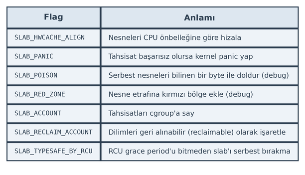

Yapının ``allocflags`` elemanı ise ``alloc_pages`` fonksiyonuyla tahsisat yapılırken kullanılan bayrakları
içermektedir. Zaten bu bayraklar izleyen paragraflarda göreceğimiz ``kmem_cache_create`` fonksiyonuna
argüman olarak verilmektedir. Her dilim önbelleğinin bir ismi vardır. Bu isim yapının ``name`` elemanında
tutulmaktadır. Biz dilim önbelleğinin düğümlerden, düğümlerin dilimlerden ve dilimlerin de nesnelerden
oluştuğunu belirtmiştik. İşte dilim önbelleğindeki düğümler yapının ``node`` elemanında tutulmaktadır.
``node`` elemanının dilim önbelleğindeki düğümleri belirten ``kmem_cache_node`` türünden nesnelerin
adreslerini tutan bir dizi olduğuna dikkat ediniz:

.. code-block:: c

    struct kmem_cache_node *node[MAX_NUMNODES];

SLUB gerçekleştiriminde her nesneden sonra yukarıda açıkladığımız bazı metadata bilgileri tutulmaktadır.
Yapının ``inuse`` elemanında nesnelerin metadata alanlarının "hangi offset'ten itibaren başladığı" bilgisi
bulundurulmaktadır. Aşağıdaki şekli inceleyiniz:

.. figure:: _static/slab-page-layout.png
   :alt: Dilim için ayrılan sayfa düzeni
   :align: center

Yapının ``align`` elemanı yukarıdaki şekilden de görüldüğü gibi nesneler için ayrılan alanın kaçın
katlarına göre hizalanacağını belirtmektedir. Yapının ``min_partial`` elemanı dilimlerin sisteme iadesi
için gereken minimum dilim sayısını belirtmektedir:

.. code-block:: none

    Dilim önbelleğindeki dilim sayısı >  min_partial  →  boşalan dilimin sayfaları iade edilir
    Dilim önbelleğindeki dilim sayısı <= min_partial  →  boşalan dilimin sayfaları iade edilmez

``min_partial`` elemanının değeri şöyle tespit edilmektedir:

.. code-block:: c

    #define MIN_PARTIAL  5
    #define MAX_PARTIAL  10

    static inline unsigned long slub_min_partial(void)
    {
        return ilog2(nr_cpu_ids);
    }

    static void set_min_partial(struct kmem_cache *s, unsigned long min)
    {
        if (min < MIN_PARTIAL)
            min = MIN_PARTIAL;
        else if (min > MAX_PARTIAL)
            min = MAX_PARTIAL;
        s->min_partial = min;
    }

``min_partial`` bu algoritmaya göre şu değerlerden biri olabilmektedir:

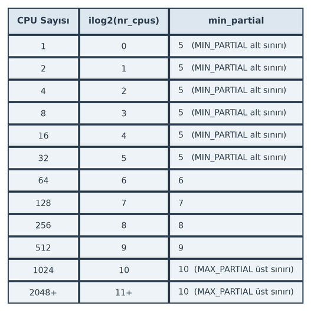

``min_partial`` elemanının amacı dilim önbelleğinde hazır durumda tutulacak belli miktarda boş dilimlerin
bulundurulmasını sağlamaktır.

``kmem_cache`` yapısının ``ctor`` elemanında aşağıdaki gibi bir fonksiyon göstericisi tutulmaktadır:

.. code-block:: c

    void (*ctor)(void *object);

Ne zaman sistemden bir nesne tahsis edilmek istense önce o nesne bu ``ctor`` fonksiyonuna verilir. Bu
fonksiyon nesnenin içerisine ilkdeğerlerini verir; bu işlemden sonra nesne tahsis edene iletilir. Bu
elemanda ``NULL`` adresi varsa böyle bir işlem yapılmamaktadır. Buraya yerleştirilecek fonksiyon
``kmem_cache_create`` fonksiyonuna argüman olarak girilmektedir.

Dilimlerin ardışıl fiziksel sayfalardan oluştuğunu söylemiştik. Peki bir dilim ardışıl kaç fiziksel sayfadan
oluşmaktadır? Soruyu şöyle de sorabiliriz: Bir dilim ikiz blok tahsisat sisteminin hangi düzeyinden
yapılmaktadır? İşte dilimlerin sayfa büyüklüklerinin belirlenmesinde ``kmem_cache`` yapısının iki elemanı
etkili olmaktadır:

.. code-block:: c

    struct kmem_cache {
        /* ... */
        struct kmem_cache_order_objects oo;   /* optimal order + nesne sayısı */
        struct kmem_cache_order_objects min;  /* fallback: minimum order + nesne sayısı */
        /* ... */
    };

İlk denemede yapının ``oo`` elemanına başvurulmaktadır. Eğer ikiz blok sisteminden ``oo`` elemanında
belirtilen sayfa düzeyinde (order) tahsisat yapılamazsa bu kez yapının ``min`` elemanına başvurulmaktadır.
Yapının ``min`` elemanına nesne boyutunu içeren en küçük düzey değeri (genellikle 0) atanmaktadır. Yani
en az tahsisat değeri 1 sayfadır. ``oo`` elemanına atanacak düzey değeri dilim önbelleği yaratılırken
``kmem_cache_create`` fonksiyonunun çağrı zincirindeki ``calculate_sizes`` fonksiyonu tarafından
verilmektedir. Ancak değerin asıl hesaplandığı yer ``calculate_order`` fonksiyonudur. ``calculate_order``
fonksiyonu ``oo`` için sayfa büyüklüğü değerini şu faktörlere bağlı olarak hesaplar:

- **CPU sayısı:** Çok CPU'lu sistemde aynı nesne boyutu daha büyük düzeye yol açabilmektedir. Ayrıntılara
  burada girmeyeceğiz. Çekirdek kaynak kodlarına başvurabilirsiniz.

- **Sınırlar:** Elde edilen değer ``slub_min_order`` ile ``slub_max_order`` değişkenlerinin arasına
  çekilir. Başlangıçta ``slub_min_order = 0`` ve ``slub_max_order = 3`` durumundadır. (Yani en fazla
  bir dilim 8 sayfadan oluşabilmektedir.)

- **İstisnai Durum:** Nesne boyutu ``slub_max_order``'lık slab'a tek başına bile sığmıyorsa sınır aşılır
  ve nesnenin boyutuna uygun en küçük düzey kullanılır.

Aşağıda somut *x86-64, 16 CPU* için çeşitli nesne boyutlarına göre ``min`` ve ``oo`` değerlerini
veriyoruz:

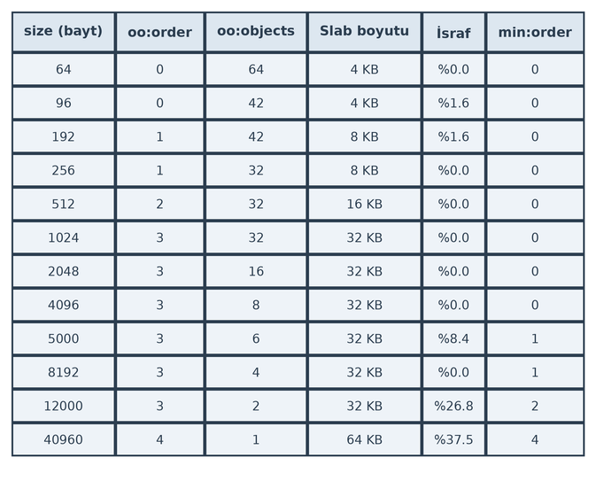

Bu tabloda sütunlarda neden ``oo:order`` ve ``min:order`` yazıldığını merak edebilirsiniz. Aslında ``oo``
ve ``min`` elemanları yalnızca dilim için yapılacak tahsisatın düzey bilgisini değil aynı zamanda bir
dilimde kaç nesnenin yer aldığı bilgisini de tutmaktadır. Bu elemanların ``kmem_cache_order_objects``
türünden olduğuna dikkat ediniz. Bu yapı şöyle tanımlanmıştır:

.. code-block:: c

    struct kmem_cache_order_objects {
        unsigned int x;
    };

Görüldüğü gibi yapının ``x`` isminde tek bir elemanı vardır. İşte bu ``x`` elemanının düşük anlamlı 16
biti nesne sayısını, yüksek anlamlı 16 biti de düzey değerini tutmaktadır.

.. figure:: _static/oo-bitfield.png
   :alt: kmem_cache_order_objects x alanının bit düzeni
   :align: center

kmem_cache_node Yapısı
~~~~~~~~~~~~~~~~~~~~~~~

Bir dilim önbelleğinin düğümlerden, düğümlerin dilimlerden ve dilimlerin de nesnelerden oluştuğunu
söylemiştik. Dilim önbelleğinin düğümleri ``kmem_cache_node`` isimli yapıyla temsil edilmektedir. Bu yapı
güncel çekirdeklerde ``mm/slab.h`` dosyası içerisinde şöyle tanımlanmıştır:

.. code-block:: c

    struct kmem_cache_node {
        spinlock_t list_lock;

    #ifdef CONFIG_SLAB
        struct list_head slabs_partial;  /* partial list first, better asm code */
        struct list_head slabs_full;
        struct list_head slabs_free;
        unsigned long total_slabs;       /* length of all slab lists */
        unsigned long free_slabs;        /* length of free slab list only */
        unsigned long free_objects;
        unsigned int free_limit;
        unsigned int colour_next;        /* Per-node cache coloring */
        struct array_cache *shared;      /* shared per node */
        struct alien_cache **alien;      /* on other nodes */
        unsigned long next_reap;         /* updated without locking */
        int free_touched;                /* updated without locking */
    #endif

    #ifdef CONFIG_SLUB
        unsigned long nr_partial;
        struct list_head partial;
    #ifdef CONFIG_SLUB_DEBUG
        atomic_long_t nr_slabs;
        atomic_long_t total_objects;
        struct list_head full;
    #endif
    #endif
    };

Güncel çekirdekler derlenirken yalnızca ``CONFIG_SLUB`` define edilmiş durumdadır. Eski tip SLAB ve SLOB
gerçekleştirimlerinin çekirdekten çıkartıldığını belirtmiştik. Dolayısıyla aslında yukarıdaki yapı güncel
çekirdeklerde aşağıdaki hale gelmektedir:

.. code-block:: c

    struct kmem_cache_node {
        spinlock_t list_lock;

        /* CONFIG_SLUB */
        unsigned long nr_partial;
        struct list_head partial;

    #ifdef CONFIG_SLUB_DEBUG
        atomic_long_t nr_slabs;
        atomic_long_t total_objects;
        struct list_head full;
    #endif
    };

Yapının ``partial`` elemanı bu düğümdeki dilimlerin listesini, ``nr_partial`` elemanı ise bunların sayısını
tutmaktadır. UMA mimarisinde zaten tek bir düğümün olduğunu anımsayınız.

Dilimler ve slab Yapısı
~~~~~~~~~~~~~~~~~~~~~~~~

Güncel çekirdeklerde dilimler ``mm/slab.h`` dosyası içerisindeki ``slab`` isimli yapıyla temsil
edilmektedir. Ancak bir süre önceye kadar bu yapı yerine doğrudan dilim bilgileri ``page`` nesnelerinin
içerisinde saklanıyordu. Güncel çekirdeklerdeki (7'li çekirdeklerdeki) ``slab`` yapısı şöyle
tanımlanmıştır:

.. code-block:: c

    struct slab {
        memdesc_flags_t flags;

        struct kmem_cache *slab_cache;
        union {
            struct {
                struct list_head slab_list;
                /* Double-word boundary */
                struct freelist_counters;
            };
            struct rcu_head rcu_head;
        };

        unsigned int __page_type;
        atomic_t __page_refcount;
    #ifdef CONFIG_SLAB_OBJ_EXT
        unsigned long obj_exts;
    #endif
    };

Buradaki elemanları ve işlevlerini aşağıdaki tabloda listeliyoruz:

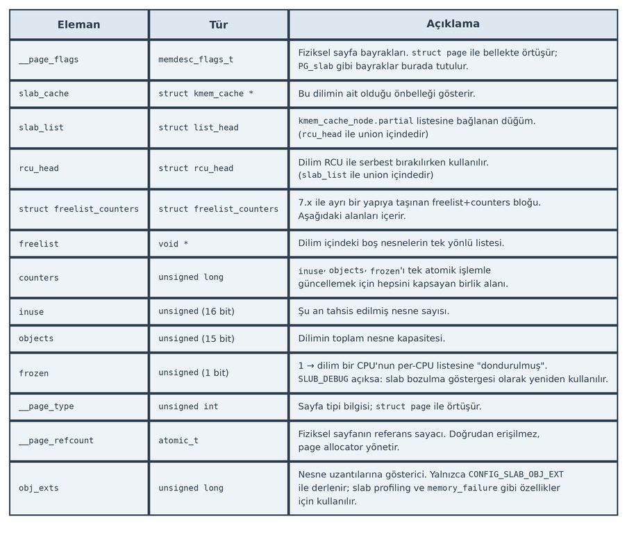

``slab`` yapısının önemli elemanları ``freelist_counters`` yapısına taşınmıştır. Yani bir süre önceye
kadar aslında bu ``freelist_counters`` yapısının elemanları ``slab`` yapısının içindeydi. Fakat zaten
yukarıdaki anonim birlik ve yapı tanımlaması ile sanki bu yapının elemanları ``slab`` yapısının
içerisindeymiş gibi ele alınmaktadır. Yani elemanlara erişim bakımından bir farklılık oluşmamaktadır.
6'lı çekirdeklerde ``slab`` yapısı şöyledir:

.. code-block:: c

    struct slab {
        memdesc_flags_t flags;

        struct kmem_cache *slab_cache;
        union {
            struct {
                union {
                    struct list_head slab_list;
                    struct { /* For deferred deactivate_slab() */
                        struct llist_node llnode;
                        void *flush_freelist;
                    };
    #ifdef CONFIG_SLUB_CPU_PARTIAL
                    struct {
                        struct slab *next;
                        int slabs;  /* Nr of slabs left */
                    };
    #endif
                };
                /* Double-word boundary */
                union {
                    struct {
                        void *freelist;     /* first free object */
                        union {
                            unsigned long counters;
                            struct {
                                unsigned inuse:16;
                                unsigned objects:15;
                                /*
                                 * If slab debugging is enabled then the
                                 * frozen bit can be reused to indicate
                                 * that the slab was corrupted
                                 */
                                unsigned frozen:1;
                            };
                        };
                    };
    #ifdef system_has_freelist_aba
                    freelist_aba_t freelist_counter;
    #endif
                };
            };
            struct rcu_head rcu_head;
        };

        unsigned int __page_type;
        atomic_t __page_refcount;
    #ifdef CONFIG_SLAB_OBJ_EXT
        unsigned long obj_exts;
    #endif
    };

Burada C standartları bağlamında bir noktaya dikkatinizi çekmek istiyoruz. C11'den sonra aşağıdaki gibi
bir yapı tanımlaması geçerlidir:

.. code-block:: c

    struct Sample {
        union {
            struct {
                int x;
                int y;
            };
            int z;
        };
        int k;
    };

Burada birlik içerisindeki yapının elemanları sanki birliğin elemanları gibi, birliğin elemanları da
sanki ``Sample`` yapısının elemanları gibi işlem görmektedir. Örneğin:

.. code-block:: c

    struct Sample s;

    s.x = 10;   // geçerli

Ancak yukarıdaki ``slab`` yapısında aşağıdakine benzer bir tanımlama yapılmıştır:

.. code-block:: c

    struct S {
        int x;
        int y;
    };

    struct Sample {
        union {
            struct S;       /* C11'de geçersiz, gcc eklentisi */
            int z;
        };
        int k;
    };

Bu örnekte anonim birliğin içerisinde ``S`` yapısına ilişkin bir değişken ismi belirtilmemiştir. Bu durum
C11'de geçerli değildir. Ancak gcc'de bir eklenti olarak desteklenmektedir. gcc derleyicileri bu
tanımlamayla öncekini eşdeğer gibi kabul etmektedir.

Güncel çekirdeklerdeki ``slab`` yapısının ``slab_cache`` elemanı geri doğru bu dilimin içinde bulunduğu
``kmem_cache`` nesnesini göstermektedir. Yapının ``slab_list`` elemanı dilimleri (yani ``slab`` nesnelerini)
birbirine bağlayan bağlı liste düğümünü belirtmektedir. ``rcu_head`` elemanı dilim RCU mekanizmasıyla
serbest bırakılırken kullanılmaktadır. Yukarıda da belirttiğimiz gibi aslında ``slab`` yapısının önemli
elemanlarının çoğu yapının ``freelist_counters`` elemanına ilişkin yapının içerisindedir. Ancak anonim
birlik ve yapı kuralları nedeniyle bunlara sanki ``slab`` yapısının elemanlarıymış gibi erişebilmektedir.

``freelist_counters`` yapısı şöyle tanımlanmıştır:

.. code-block:: c

    struct freelist_counters {
        union {
            struct {
                void *freelist;
                union {
                    unsigned long counters;
                    struct {
                        unsigned inuse:16;
                        unsigned objects:15;
                        /*
                         * If slab debugging is enabled then the
                         * frozen bit can be reused to indicate
                         * that the slab was corrupted
                         */
                        unsigned frozen:1;
    #ifdef CONFIG_64BIT
                        /*
                         * Some optimizations use free bits in 'counters' field
                         * to save memory. In case ->stride field is not available,
                         * such optimizations are disabled.
                         */
                        unsigned int stride;
    #endif
                    };
                };
            };
    #ifdef system_has_freelist_aba
            freelist_full_t freelist_counters;
    #endif
        };
    };

Yapının ``freelist`` elemanı o dilimdeki ilk boş nesnenin adresini belirtmektedir. Dilim içerisindeki
nesneler tek bağlı liste (single linked list) ile birbirine bağlanmıştır. Dolayısıyla dilimden bir nesne
tahsis edilmek istendiğinde tahsisat fonksiyonu (``kmem_cache_alloc``) hemen bu göstericinin gösterdiği
yerdeki nesneyi O(1) karmaşıklıkta vermektedir. Yapının ``inuse`` elemanı ilgili dilimdeki tahsis edilmiş
nesne sayısını belirtmektedir. ``objects`` elemanı ise dilim içerisinde toplam kaç nesne bulunduğunu
belirtmektedir. Aşağıda ``slab`` veri yapısına ilişkin örnek bir çizim verilmiştir:

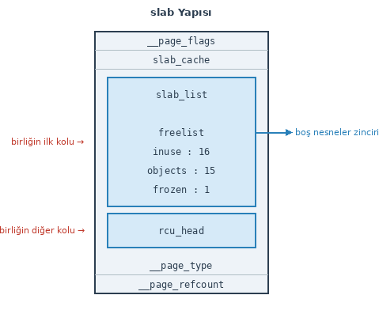

Dilim Önbelleklerinin Yaratılması
---------------------------------

Bir dilim önbelleği oluşturmak için yani ``kmem_cache`` türünden bir nesne oluşturmak için
``kmem_cache_create`` isimli çekirdek fonksiyonu kullanılmaktadır. ``kmem_cache_create`` fonksiyonunun
parametrik yapısı şöyledir:

.. code-block:: c

    struct kmem_cache *kmem_cache_create(
        const char *name,
        unsigned int size,
        unsigned int align,
        slab_flags_t flags,
        void (*ctor)(void *)
    );

Fonksiyonun birinci parametresi (``name``) yaratılacak dilim önbelleğinin ismini, ikinci parametresi
(``size``) tahsis edilecek nesnenin uzunluğunu belirtmektedir. Üçüncü parametre (``align``) nesnelerin
hangi değerin katlarına hizalanacağını belirtmektedir. Dördüncü parametre (``flags``) yukarıda
belirttiğimiz dilim bayraklarına ilişkindir. Son parametre (``ctor``) ise dilimden nesne tahsis
edildiğinde o nesneye ilkdeğerlerinin verilmesi için kullanılacak fonksiyonun adresini belirtmektedir.
Fonksiyonun hizalama belirten üçüncü parametresine (``align``) 0 değeri girilebilir. Bu durumda o
sisteme ilişkin varsayılan hizalama kullanılmaktadır. Çekirdek kodlarında bu varsayılan hizalama
``ARCH_KMALLOC_MINALIGN`` sembolik sabiti ile belirtilmektedir. Bu sembolik sabit şu değerlerden biri
olabilmektedir:

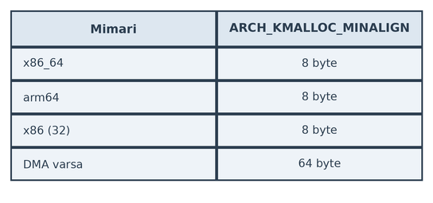

``kmem_cache_create`` fonksiyonunun kullanımına şöyle bir örnek verebiliriz:

.. code-block:: c

    struct myobject {
        int a;
        int b;
        char name[64];
    };
    /* ... */

    if ((g_myobject_cachep = kmem_cache_create("myobject_cache", sizeof(struct myobject),
            0, SLAB_HWCACHE_ALIGN, NULL)) == NULL)
        return -ENOMEM;

Eskiden ``kmem_cache_create`` fonksiyonu ``mm/slab.c`` dosyası içerisinde normal bir fonksiyon
biçiminde tanımlanıyordu. Çekirdeğin 6.12 sürümü ile birlikte artık bu fonksiyon bir makro biçimine
getirilmiştir. Çekirdeğin 6.10 versiyonunda ``kmem_cache_create`` fonksiyonu ``mm/slab_common.c``
dosyasında şöyle tanımlanmıştı:

.. code-block:: c

    struct kmem_cache *kmem_cache_create(const char *name, unsigned int size, unsigned int align,
            slab_flags_t flags, void (*ctor)(void *))
    {
        return kmem_cache_create_usercopy(name, size, align, flags, 0, 0, ctor);
    }
    EXPORT_SYMBOL(kmem_cache_create);

Buradaki ``kmem_cache_create_usercopy`` fonksiyonu asıl işlemi yapan fonksiyondur. Bu fonksiyon da
şöyle tanımlanmıştır:

.. code-block:: c

    struct kmem_cache *
    kmem_cache_create_usercopy(const char *name,
            unsigned int size, unsigned int align,
            slab_flags_t flags,
            unsigned int useroffset, unsigned int usersize,
            void (*ctor)(void *))
    {
        struct kmem_cache *s = NULL;
        const char *cache_name;
        int err;

    #ifdef CONFIG_SLUB_DEBUG
        /*
         * If no slab_debug was enabled globally, the static key is not yet
         * enabled by setup_slub_debug(). Enable it if the cache is being
         * created with any of the debugging flags passed explicitly.
         * It's also possible that this is the first cache created with
         * SLAB_STORE_USER and we should init stack_depot for it.
         */
        if (flags & SLAB_DEBUG_FLAGS)
            static_branch_enable(&slub_debug_enabled);
        if (flags & SLAB_STORE_USER)
            stack_depot_init();
    #endif

        mutex_lock(&slab_mutex);

        err = kmem_cache_sanity_check(name, size);
        if (err) {
            goto out_unlock;
        }

        /* Refuse requests with allocator specific flags */
        if (flags & ~SLAB_FLAGS_PERMITTED) {
            err = -EINVAL;
            goto out_unlock;
        }

        /*
         * Some allocators will constraint the set of valid flags to a subset
         * of all flags. We expect them to define CACHE_CREATE_MASK in this
         * case, and we'll just provide them with a sanitized version of the
         * passed flags.
         */
        flags &= CACHE_CREATE_MASK;

        /* Fail closed on bad usersize of useroffset values. */
        if (!IS_ENABLED(CONFIG_HARDENED_USERCOPY) ||
            WARN_ON(!usersize && useroffset) ||
            WARN_ON(size < usersize || size - usersize < useroffset))
            usersize = useroffset = 0;

        if (!usersize)
            s = __kmem_cache_alias(name, size, align, flags, ctor);
        if (s)
            goto out_unlock;

        cache_name = kstrdup_const(name, GFP_KERNEL);
        if (!cache_name) {
            err = -ENOMEM;
            goto out_unlock;
        }

        s = create_cache(cache_name, size,
                calculate_alignment(flags, align, size),
                flags, useroffset, usersize, ctor, NULL);
        if (IS_ERR(s)) {
            err = PTR_ERR(s);
            kfree_const(cache_name);
        }

    out_unlock:
        mutex_unlock(&slab_mutex);

        if (err) {
            if (flags & SLAB_PANIC)
                panic("%s: Failed to create slab '%s'. Error %d\n",
                    __func__, name, err);
            else {
                pr_warn("%s(%s) failed with error %d\n",
                    __func__, name, err);
                dump_stack();
            }
            return NULL;
        }
        return s;
    }
    EXPORT_SYMBOL(kmem_cache_create_usercopy);

Burada ``kmem_cache`` nesnesinin asıl yaratımı ``create_cache`` fonksiyonunda yapılmaktadır. Bu
fonksiyon da şöyle tanımlanmıştır:

.. code-block:: c

    static struct kmem_cache *create_cache(const char *name,
            unsigned int object_size, unsigned int align,
            slab_flags_t flags, unsigned int useroffset,
            unsigned int usersize, void (*ctor)(void *),
            struct kmem_cache *root_cache)
    {
        struct kmem_cache *s;
        int err;

        if (WARN_ON(useroffset + usersize > object_size))
            useroffset = usersize = 0;

        err = -ENOMEM;
        s = kmem_cache_zalloc(kmem_cache, GFP_KERNEL);
        if (!s)
            goto out;

        s->name         = name;
        s->size         = s->object_size = object_size;
        s->align        = align;
        s->ctor         = ctor;
    #ifdef CONFIG_HARDENED_USERCOPY
        s->useroffset   = useroffset;
        s->usersize     = usersize;
    #endif

        err = __kmem_cache_create(s, flags);
        if (err)
            goto out_free_cache;

        s->refcount = 1;
        list_add(&s->list, &slab_caches);
        return s;

    out_free_cache:
        kmem_cache_free(kmem_cache, s);
    out:
        return ERR_PTR(err);
    }

Aşağıda bu sürümdeki ``kmem_cache_create`` fonksiyonunun çağrı zinciri şekilsel olarak verilmiştir:

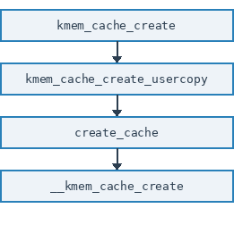

Peki çekirdek içerisindeki nesne tahsisatları dilimli tahsisat sistemiyle yapıldığına göre
``kmem_cache_create`` fonksiyonu ``kmem_cache`` nesnesini nasıl tahsis etmektedir? İşte ``kmem_cache``
nesneleri için de ayrı bir dilim önbelleği oluşturulmuştur:

.. code-block:: c

    s = kmem_cache_zalloc(kmem_cache, GFP_KERNEL);

Burada tahsisat çekirdek tarafından yaratılmış olan ``kmem_cache`` dilim önbelleğinden yapılmaktadır.

6.12 çekirdekleriyle birlikte ``kmem_cache_create`` fonksiyonu ``include/linux/slab.h`` dosyasında bir
makro biçimine getirilmiştir:

.. code-block:: c

    #define kmem_cache_create(__name, __object_size, __args, ...)           \
        _Generic((__args),                                                  \
            struct kmem_cache_args *: __kmem_cache_create_args,             \
            void *: __kmem_cache_default_args,                              \
            default: __kmem_cache_create)(__name, __object_size, __args, __VA_ARGS__)

``_Generic`` makrosu bir çeşit *function overloading* mekanizmasının makro düzeyinde sağlanması için
C11 ile C'ye eklenmiştir. Bu makro bir parametreye sahiptir. Bu parametrenin türüne göre açım yapar.
Eğer parametrenin türü belirtilen türlerden biri değilse ``default`` ile belirtilen açımı yapmaktadır.
Örneğin:

.. code-block:: c

    #define abs(x) _Generic((x),      \
        int:     abs_int,             \
        long:    abs_long,            \
        float:   abs_float,           \
        double:  abs_double,          \
        default: abs_default          \
    )(x)

Bu örnekte ``abs`` makrosunu ``int`` türünden bir argümanla çağırmışsak bu durumda aslında ``abs_int``
açımı yapılacaktır. Dolayısıyla ``abs_int`` çağrılmış olacaktır. Eğer ``abs`` makrosunu ``long`` bir
parametreyle çağırırsak bu durumda aslında ``abs_long`` fonksiyonu çağrılmış olacaktır. ``abs`` makrosunu
``int``, ``long``, ``float``, ``double`` türlerinin dışında bir türden argümanla çağırmışsak bu durumda
``abs_default`` fonksiyonu çağrılacaktır.

Şimdi yukarıdaki ``kmem_cache_create`` makrosuna yeniden dönelim. ``_Generic`` makrosuna aktarılan
parametre ``__args`` parametresidir. Bu parametre aslında eski biçimdeki ``align`` parametresidir. Biz
bu ``align`` parametresi için gerçekten hizalama amaçlı ``int`` bir değer girersek (örneğin 0) bu
durumda ``default`` kısım devreye girecek ve çağrı ``__kmem_cache_create`` haline gelecektir. Güncel
çekirdeklerde ``__kmem_cache_create`` de yukarıda vermiş olduğumuz 6.10'daki
``kmem_cache_create_usercopy`` fonksiyonuna benzemektedir.
  
Dilim Önbelleklerinin Birleştirilmesi
~~~~~~~~~~~~~~~~~~~~~~~~~~~~~~~~~~~~~

Dilim önbelleği yaratılırken "birleştirme (merge)" denilen bir işlem de yapılabilmektedir. Çekirdek bir
dilim önbelleği yaratılmak istendiğinde zaten o uzunlukta (bazı ayrıntıları var) daha önce yaratılmış
olan bir dilim önbelleği varsa gerçekte yeni bir dilim önbelleği yaratmamakta, daha önce yaratılmış
olanı sanki yeni yaratılmış gibi vermektedir. Birleştirme (merge) işlemi ``kmem_cache_create``
fonksiyonunun çağırdığı ``find_mergeable`` fonksiyonu tarafından yapılmaktadır. Bu fonksiyonun çağırma
akışı şöyledir:

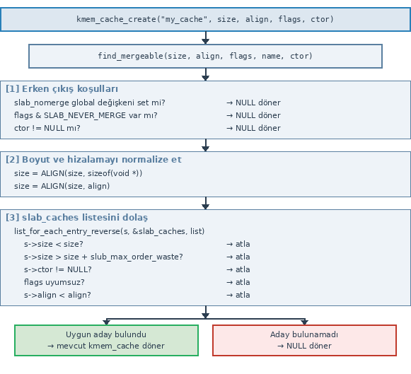

Yeni yaratılmak istenen bir dilim önbelleğinin zaten yaratılmış olana referans etmesinin (yani
birleştirme işleminin) bazı koşulları vardır:

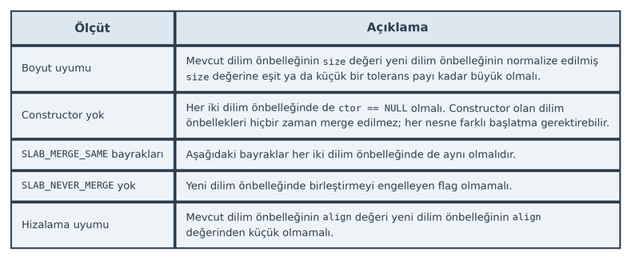

Aşağıdaki bayrakların herhangi biri iki dilim önbelleğinde farklıysa birleştirme yapılmamaktadır:

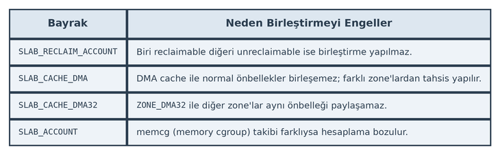

Birleştirmeyi kesin engelleyen bayraklar da şunlardır:

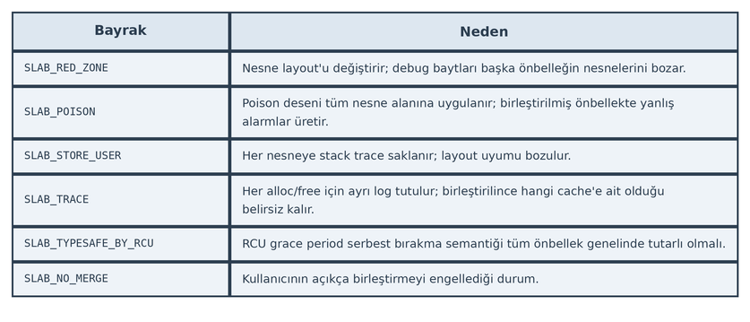

Önceden Yaratılmış Dilim Önbellekleri
~~~~~~~~~~~~~~~~~~~~~~~~~~~~~~~~~~~~~

Çekirdeğin ``task_struct`` gibi, ``file`` gibi, ``dentry`` gibi, ``inode`` gibi nesneleri tahsis etmekte
kullandığı önceden yaratılmış dilimli önbellek nesneleri (yani ``kmem_cache`` nesneleri) vardır. Aşağıda
bunların isimlerini ve bunlara erişmekte kullanılan ``kmem_cache`` türünden göstericilerin isimlerini
veriyoruz:

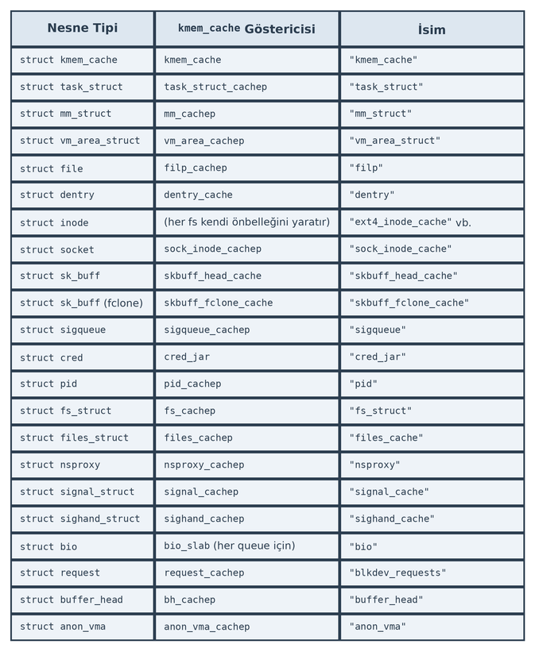

Peki yukarıdaki dilim önbellek nesneleri çekirdekte hangi aşamada yaratılmaktadır? Biz kursumuzda
çekirdeğin başlatılma sürecini ayrı bir bölümde ele alacağız. Linux çekirdek imajı belleğe
yüklendiğinde ``start_kernel`` isimli fonksiyon çağrılmaktadır. Bu fonksiyonu çekirdeğin main
fonksiyonu gibi düşünebilirsiniz. Bu fonksiyon içerisinde pek çok alt sistem ilklendirilmektedir.
İşte yukarıdaki dilim önbellekleri bu alt sistemlerin ilklendirildiği (initialize edildiği) yerlerde
yaratılmaktadır. Bunların yaratıldığı yerleri aşağıdaki tablolarda veriyoruz:

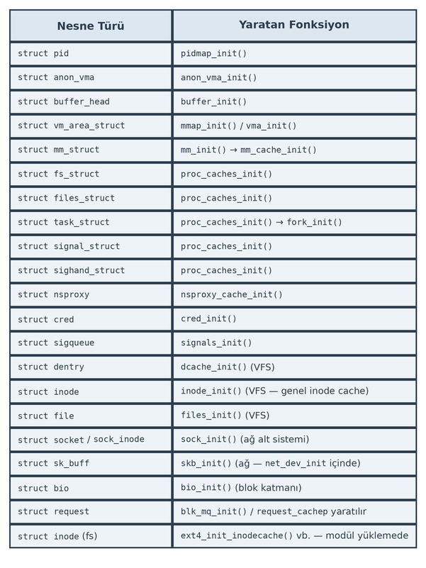

Bu nesnelerin yaratıldığı yerlere ilişkin çağrı zincirini de aşağıda veriyoruz:

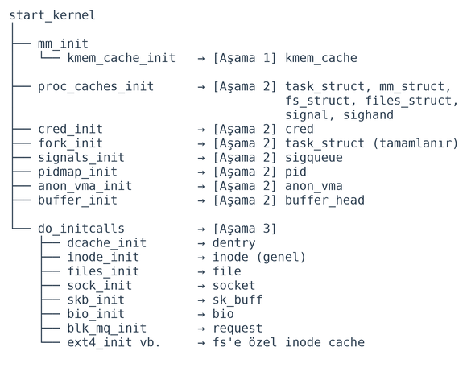

Dilim Önbelleklerinden Tahsisat İşlemleri
-----------------------------------------

Yaratılmış olan bir dilim önbelleğinden tahsisat yapmak için kullanılan temel fonksiyonlar şunlardır:

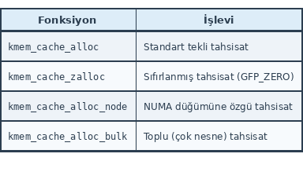

``kmem_cache_alloc`` ve ``kmem_cache_zalloc`` en çok kullanılan tahsisat fonksiyonlarıdır. Bu
fonksiyonlar belli bir dilim önbelleğinden nesne tahsis etmektedir. Fonksiyonların prototipleri
şöyledir:

.. code-block:: c

    void *kmem_cache_alloc(struct kmem_cache *cachep, int flags);
    void *kmem_cache_zalloc(struct kmem_cache *k, gfp_t flags);

Fonksiyonların birinci parametreleri tahsisatın hangi dilim önbelleğinden yapılacağını belirtmektedir.
Yani bu parametreye ``kmem_cache_create`` fonksiyonundan elde edilen ``kmem_cache`` nesnesinin adresi
geçirilmelidir. Fonksiyonların ikinci parametreleri ``alloc_pages`` çağrısı için gereken bayrakları
belirtmektedir. Yani bu parametre aslında ``alloc_pages`` fonksiyonuna geçirilen birinci parametreyle
aynıdır. Yukarıda da belirttiğimiz gibi aslında dilimli tahsisat sistemi arka planda ikiz blok tahsisat
sistemini kullanmaktadır. Yani dilimli tahsisat sistemindeki dilimler ``alloc_pages`` fonksiyonu ile
ikiz blok tahsisat sisteminden elde edilmektedir. Biz ``alloc_pages`` fonksiyonunu anlatırken bu
bayrakların anlamlarını açıklamıştık. Bu bayraklar hem "tahsisatın hangi bölgeden (zone)" yapılacağını
hem de göç türünün fallback mekanizması için nereden başlatılacağını belirtiyordu. En çok kullanılan
bayrağın ``GFP_KERNEL`` olduğunu anımsayınız. Bu bayrak ``ZONE_NORMAL`` bölgesinden
``MIGRATE_UNMOVABLE`` göç türünden hareketle sayfa tahsisatını yapmaktadır. Anımsanacağı gibi
``GFP_ATOMIC`` bayrağı da ``ZONE_NORMAL`` bölgesinden tahsisat yapmaya çalışır. Ancak bu bayrak
ilgili thread'in uykuya yatırılmasını engellemektedir. Kesme kodlarında ve örneğin ``spinlock``
nesnelerinin kilitlendiği durumlarda ``GFP_KERNEL`` yerine ``GFP_ATOMIC`` bayrağını tercih
etmelisiniz. ``kmem_cache_zalloc`` fonksiyonu aynı zamanda tahsis edilen alanı sıfırlamaktadır.
Aslında bu fonksiyon ``include/linux/slab.h`` dosyasında aşağıdaki gibi bir makro biçiminde
yazılmıştır:

.. code-block:: c

    #define kmem_cache_zalloc(_k, _flags)   kmem_cache_alloc(_k, (_flags)|__GFP_ZERO)

Anımsayacağınız gibi ``__GFP_ZERO`` bayrağı zaten ikiz blok tahsisat sisteminde tahsis edilen sayfaların
sıfırlanması için kullanılmaktadır.

Dilimli tahsisat sistemlerindeki tahsisat fonksiyonları başarısızlık durumunda ``NULL`` adresle geri
dönmektedir. Dilim önbelleğinde nesne kalmadığı zaman ``alloc_pages`` ile ikiz blok tahsisat sisteminden
sayfa tahsis edilmektedir. İkiz blok tahsis sisteminde *fallback* mekanizmasının da devreye girdiğini
anımsayınız. Sayfa tahsis edilemediğinde zaten çekirdeğin reclaim yapan thread'leri uyandırıldığı için
bu fonksiyonların bellek yetersizliğinde başarısız olmaları düşük bir olasılıktır. Ancak bu fonksiyonların
başarı kontrolleri mutlaka yapılmalıdır. Bu fonksiyonların başarısız olma nedenlerini aşağıdaki tabloda
açıklıyoruz:

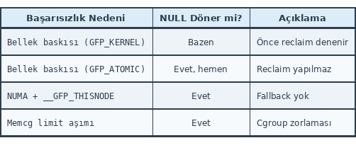

Eğer bu fonksiyonlar başka fonksiyonların içerisinde çağrılmışsa başarısızlık durumunda çağrımın
yapıldığı fonksiyonun ``-ENOMEM`` değeri ile geri döndürülmesi uygun olur.

Güncel çekirdeklerde ``kmem_cache_alloc`` fonksiyonunun çağrı grafı kabaca şöyledir:

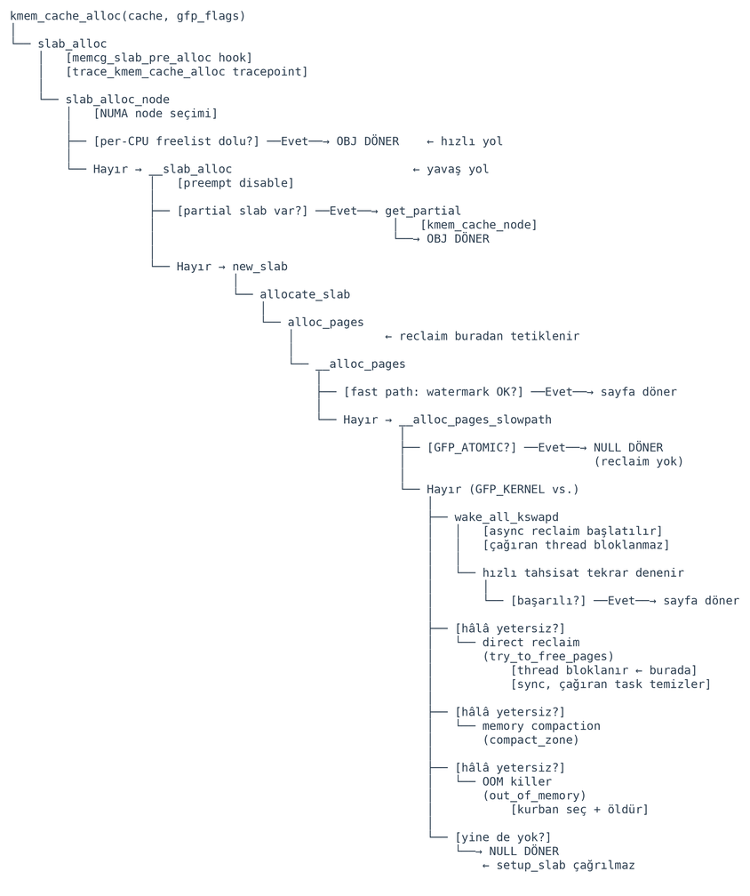

Tabii bu çağrı dizgesindeki ayrıntıları bir yana bırakırsak kabaca olanlar şunlardır:

- Nesne tahsis edilmeye çalışılır.
- Dilimlerde uygun nesne yoksa ikiz blok tahsisat sisteminden dilim tahsis edilmeye çalışılır.
- İkiz blok tahsisat sisteminde *fallback* mekanizmaları uygulanır.
- Eğer hâlâ sayfa yoksa *kswapd* çekirdek thread'i uyandırılır.
- Bir kez daha doğrudan reclaim denenir. Doğrudan reclaim başarısız olursa ve eğer ``GFP_ATOMIC``
  kullanılmamışsa thread uykuya yatırılır ve reclaim sonrasında uyandırılır.
- Eğer hâlâ sayfa tahsisatı yapılamıyorsa fonksiyon başarısız olur.

Tahsis edilmiş olan nesne ``kmem_cache_free`` fonksiyonuyla dilim önbelleğine iade edilmektedir.
Fonksiyon prototipi şöyledir:

.. code-block:: c

    void kmem_cache_free(struct kmem_cache *s, void *x);

Fonksiyonun birinci parametresi dilim önbelleğine ilişkin nesne adresini, ikinci parametresi serbest
bırakılacak nesnenin adresini almaktadır.

``kmem_cache_alloc_node`` fonksiyonu belli bir NUMA düğümünden tahsisat yapmaktadır. Başka bir deyişle
tahsisat için ilgili NUMA düğümünün bölgelerini kullanan dilim önbelleklerinden tahsisat yapılmaktadır.
Ancak fonksiyonda belirtilen NUMA düğümüne ilişkin bölgelerdeki dilim önbelleklerinde boş yer
bulunamazsa düğüm temelinde *fallback* yapılmamaktadır. Fonksiyonun prototipi şöyledir:

.. code-block:: c

    void *kmem_cache_alloc_node(struct kmem_cache *s, gfp_t gfpflags, int node);

Fonksiyonun birinci parametresi dilim önbelleğine ilişkin ``kmem_cache`` nesnesinin adresini, ikinci
parametresi tahsisat bayraklarını ve üçüncü parametresi de NUMA düğümünün numarasını almaktadır.

``kmem_cache_alloc_bulk`` fonksiyonu dilim önbelleğinden birden fazla nesne tahsis etmek için
kullanılmaktadır. Fonksiyonun prototipi şöyledir:

.. code-block:: c

    int kmem_cache_alloc_bulk(struct kmem_cache *s, gfp_t flags, size_t nr, void **p);

Fonksiyonun son iki parametresine dikkat ediniz. Son parametre (``p``) tahsis edilen nesnelerin
adreslerinin yerleştirileceği gösterici dizisinin adresini almaktadır. Sondan bir önceki parametre
(``nr``) toplam kaç nesnenin tahsis edileceğini belirtmektedir. Fonksiyon "ya hep ya hiç" biçiminde
tahsisat yapmaktadır. Yani burada belirtilen sayıdaki tahsisatın hepsi yapılamazsa hiçbir tahsisat
yapılmamış gibi geri dönmektedir.

kmalloc Fonksiyonu ve Türevleri
-------------------------------

Dilimli tahsisat sisteminin amacının belli uzunluklardaki nesneleri hızlı bir biçimde tahsis etmek
olduğunu söylemiştik. Ancak her farklı uzunluktaki nesne için yeni bir dilim önbelleği oluşturmak
zahmetlidir. Örneğin biz çekirdek kodlamasında 28 byte'lık bir tahsisat yapmak isteyelim. Bunun için
28 byte'lık nesnelerden oluşan bir dilim önbelleği yaratmak oldukça zahmetlidir. İşte Linux çekirdeğinde
bu zahmetten kurtulmak için belli uzunluklarda hazır dilim önbellekleri de oluşturulmuştur. Bu hazır
dilim önbelleklerinin nesne uzunlukları şöyledir:

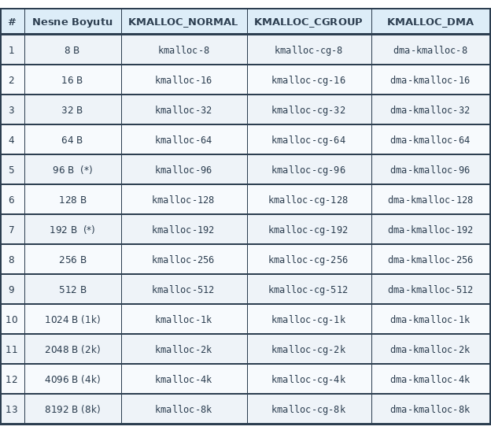

Burada nesne uzunlukları 2'nin kuvvetine ilişkin olsa da (*) ile gösterilen iki istisna bulunmaktadır.
Bu dilim önbellekleri çekirdek imajı belleğe yüklenip ilklenirken bellek yönetim işlevlerine ilişkin
ilkdeğerlerin verildiği ``mm_init`` fonksiyonu içerisinde yaratılmaktadır:

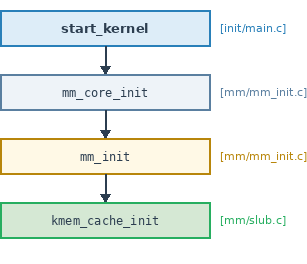

Tablodaki ``KMALLOC_CGROUP``, *docker* gibi *container* teknolojilerinin kullanımını daha etkin hale
getirmek için Linux çekirdekine sokulmuş olan "memcg (memory cgroup)" kavramı ile ilgilidir.
``kmalloc-cg-*`` önbellekleri memcg (memory cgroup) tarafından izlenmesi gereken tahsisatlar için
bulundurulmuştur. ``KMALLOC_DMA`` ise ``GFP_DMA`` bayrağıyla tahsisat yapıldığında kullanılan dilim
önbellekleridir.

Örneğin biz hiç yeni bir dilim önbelleği yaratmadan 12 byte tahsisat yapmak isteyelim. Tabloda 12
byte'lık hazır bir dilim önbelleği olmadığı için tahsisat 16 byte'lık dilim önbelleğinden yapılacaktır.
Tabii bu durumda 4 byte boşa harcanmış olacaktır. Yani bu hazır dilim önbelleklerini kullanmanın bir
"içsel bölünme (internal fragmentation)" maliyeti vardır.

Yukarıdaki genel dilim önbelleklerinden tahsisat yapan genel tahsisat fonksiyonları da bulundurulmuştur.
Şimdi onları açıklayacağız.

``kmalloc`` fonksiyonu özellikle çekirdek modülleri ve aygıt sürücüler tarafından sıkça kullanılmaktadır.
Bu fonksiyon yukarıdaki hazır dilim önbelleklerinin hangisi talep edilen uzunluk için uygunsa tahsisatı
oradan yapmaktadır. Dolayısıyla fonksiyonun kullanımı oldukça kolaydır. ``kmalloc`` fonksiyonunu adeta
C'nin ``malloc`` fonksiyonuna benzetebilirsiniz. Fonksiyonun prototipi şöyledir:

.. code-block:: c

    void *kmalloc(size_t size, gfp_t flags);

Fonksiyonun birinci parametresi tahsis edilecek nesnenin uzunluğunu, ikinci parametre ise yine tahsisat
bayraklarını belirtmektedir. Bu ikinci parametre ilgili dilim önbelleğinde sayfa bulunamadığında
``alloc_pages`` fonksiyonu ile ikiz blok tahsisat sisteminden sayfa istenirken kullanılmaktadır. Bu
ikinci parametreye tipik olarak ``GFP_KERNEL`` geçilmektedir. ``kmalloc`` fonksiyonu başarısızlık
durumunda ``NULL`` adrese geri dönmektedir. Örneğin:

.. code-block:: c

    if ((obj = kmalloc(12, GFP_KERNEL)) == NULL)
        return -ENOMEM;

``kmalloc`` fonksiyonun gerçekleştirimi eski çekirdeklerde oldukça basitti. Örneğin çekirdeğin 2.4
versiyonunda ``kmalloc`` şöyle yazılmıştı:

.. code-block:: c

    void *kmalloc(size_t size, int flags)
    {
        cache_sizes_t *csizep = cache_sizes;

        for (; csizep->cs_size; csizep++) {
            if (size > csizep->cs_size)
                continue;
            return __kmem_cache_alloc(flags & GFP_DMA ?
                csizep->cs_dmacachep : csizep->cs_cachep, flags);
        }
        return NULL;
    }

Bu sürümde tüm dilim önbelleklerinin uzunlukları ``cache_sizes`` isimli bir dizide toplanmıştır. Döngü
içerisinde talep edilen tahsisata en uygun dilim önbelleğinin tespit edildiğine dikkat ediniz. Sonra da
``__kmem_cache_alloc`` fonksiyonu ile o dilim önbelleğinden tahsisat yapılmıştır. Güncel çekirdeklerde
"memcg (memory cgroup)" gibi kavramların çekirdeğe dahil edilmesiyle fonksiyon daha karmaşık bir hale
gelmiştir. Güncel çekirdeklerdeki ``kmalloc`` çağrı dizgesi şöyledir:

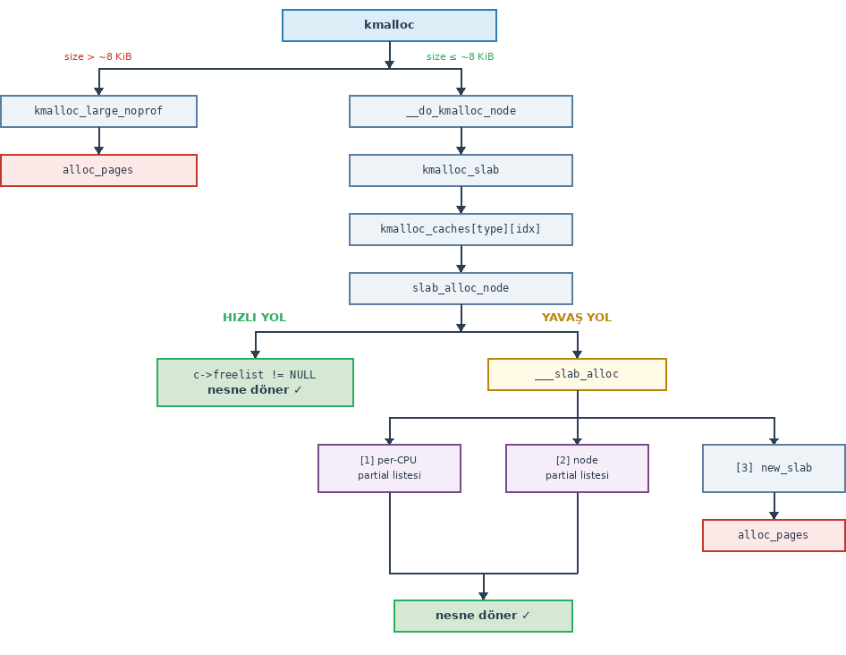

``kmalloc`` ailesinden başka çekirdek fonksiyonları da vardır. ``kzalloc`` fonksiyonu tahsis edilen
alanı aynı zamanda sıfırlamaktadır. Yani aşağıdaki işlemi yapmaktadır:

.. code-block:: c

    void *kzalloc(size_t size, gfp_t flags)
    {
        return kmalloc(size, flags | __GFP_ZERO);
    }

``kmalloc_array`` fonksiyonu iki parametresinin çarpımı kadar alanı tahsis etmektedir. Fonksiyonun
prototipi şöyledir:

.. code-block:: c

    void *kmalloc_array(size_t n, size_t size, gfp_t flags);

Tabii bu iki parametreyi programcı kendi çarpıp ``kmalloc`` fonksiyonuna verebilir. Ancak bazen ``n``
ve ``size`` değerleri başka bir yerden, örneğin kullanıcı alanından geliyor olabilir. Bu durumda taşma
kontrolünün yapılması gerekebilir. (İki büyük işaretsiz tamsayı çarpıldığında taşmadan dolayı küçük
bir işaretsiz tamsayının elde edilebileceğine dikkat ediniz.)

``kcalloc`` fonksiyonu C'deki ``calloc`` fonksiyonuna benzetilebilir. Bu fonksiyon ``kmalloc_array``
gibi iki uzunluk parametresi almaktadır ancak tahsis edilen alanı da sıfırlamaktadır. Fonksiyonun
prototipi şöyledir:

.. code-block:: c

    void *kcalloc(size_t n, size_t size, gfp_t flags);

``krealloc`` fonksiyonu C'nin ``realloc`` fonksiyonu gibi düşünülebilir. Daha önce tahsis edilmiş olan
bloğu büyütmek ya da küçültmek için kullanılmaktadır. Fonksiyonun prototipi şöyledir:

.. code-block:: c

    void *krealloc(const void *p, size_t new_size, gfp_t flags);

Fonksiyonun birinci parametresi daha önce ``kmalloc`` ve türevleri tarafından tahsis edilmiş olan
bloğun adresini, ikinci parametresi bu bloğun toplam yeni uzunluğunu ve üçüncü parametresi de tahsisat
bayraklarını belirtmektedir. Fonksiyon zaten daha önce tahsis edilmiş olan nesnede talep edilen
büyüklüğü içerecek kadar boş yer varsa ya da blok küçültülüyorsa aynı adresle geri döner. Ancak daha
önce tahsis edilmiş nesnede talep edilen uzunluk kadar boş yer yoksa bu durumda sanki yeniden
``kmalloc`` çağrılıyormuş gibi tahsisat daha büyük bir dilim önbelleğinden yapılmaktadır.

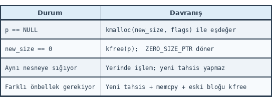

``krealloc_array`` fonksiyonu 6.1 çekirdekleriyle eklenmiştir. ``kmalloc_array`` fonksiyonunun
*realloc* biçimi gibidir:

.. code-block:: c

    void *krealloc_array(void *p, size_t new_n, size_t new_size, gfp_t flags);

``kmalloc`` türevi fonksiyonlarla tahsis edilen alanlar ``kfree`` fonksiyonu ile serbest
bırakılmaktadır. ``kfree`` fonksiyonunun prototipi şöyledir:

.. code-block:: c

    void kfree(const void *objp);

Fonksiyonun yalnızca blok adresini parametre olarak aldığına dikkat ediniz. Peki bu fonksiyon ilgili
dilim önbelleğini nasıl bulmaktadır? Eskiden eğer bir sayfa dilimli tahsisat sistemi tarafından
kullanılıyorsa ona ilişkin ``kmem_cache`` nesnesinin adresi de sayfayı temsil eden ``page`` yapısının
içerisinde tutuluyordu. Böylece eskiden herhangi bir nesnenin içinde bulunduğu sayfaya ilişkin ``page``
nesnesinden hareketle geriye doğru ``kmem_cache`` nesnesi elde edilebiliyordu. Çekirdeğin 5.17
versiyonuyla birlikte ayrı bir ``slab`` yapısı oluşturuldu (biz bu yapıyı incelemiştik) ve bu yapı
``page`` yapısının üstüne bindirildi. ``slab`` yapısının içerisinde de ``kmem_cache`` nesnesinin
adresinin tutulduğunu belirtmiştik. Yani hem eski çekirdeklerde hem de yeni çekirdeklerde biz nesnenin
adresini biliyorsak oradan onun bulunduğu ``page`` nesnesine ya da ``slab`` nesnesine, oradan da
``kmem_cache`` nesnesine erişebiliriz. 5.17 ve sonrasında aslında ``page`` nesnesinin ``slab`` nesnesi
ile aynı nesne olduğuna dikkat ediniz. Yani yeni çekirdeklerde erişim şu yoldan geçilerek
yapılmaktadır:

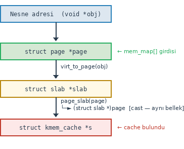

Dilim Önbelleklerine İlişkin Bilgilerin proc ve sys Dosya Sistemleri Yoluyla Elde Edilmesi
------------------------------------------------------------------------------------------

Çalışan bir sistemde ``proc`` ve ``sys`` dosya sistemi yoluyla dilim önbellekleri hakkındaki bilgiler
aşağıdaki dizin girişlerinden edinilebilmektedir:

.. code-block:: none

    /proc/slabinfo
    /proc/meminfo          (slab alanları)
    /sys/kernel/slab/<önbellek-adı>/

``/proc/slabinfo`` dosyası yaratılmış olan tüm dilim önbellekleri (yani ``kmem_cache`` nesneleri)
hakkında bilgiler bulundurmaktadır. Normal proseslerin bu dosyaya *r* hakkı olmadığı için dosyayı
ancak ``sudo`` ile görüntüleyebilirsiniz. Dosya aşağıdakine benzer bir içeriğe sahiptir:

.. code-block:: none

    slabinfo - version: 2.1
    # name            <active_objs> <num_objs> <objsize> <objperslab> <pagesperslab> : tunables
    # <limit> <batchcount> <sharedfactor> : slabdata <active_slabs> <num_slabs> <sharedavail>

    isofs_inode_cache     56     72    664   24    4 : tunables    0    0    0 : slabdata      3      3      0
    QIPCRTR               56     78    832   39    8 : tunables    0    0    0 : slabdata      2      2      0
    AF_VSOCK              48     50   1280   25    8 : tunables    0    0    0 : slabdata      2      2      0
    ext4_groupinfo_4k    960    962    152   26    1 : tunables    0    0    0 : slabdata     37     37      0
    btrfs_delayed_node     0      0    312   26    2 : tunables    0    0    0 : slabdata      0      0      0
    btrfs_ordered_extent   0      0    416   39    4 : tunables    0    0    0 : slabdata      0      0      0
    bio-328               28     42    384   21    2 : tunables    0    0    0 : slabdata      2      2      0
    bio-392               28     36    448   36    4 : tunables    0    0    0 : slabdata      1      1      0
    btrfs_extent_buffer    0      0    240   34    2 : tunables    0    0    0 : slabdata      0      0      0
    bio-408               28     36    448   36    4 : tunables    0    0    0 : slabdata      1      1      0
    btrfs_inode            0      0   1008   32    8 : tunables    0    0    0 : slabdata      0      0      0
    bio-424               28     36    448   36    4 : tunables    0    0    0 : slabdata      1      1      0
    fsverity_info          0      0    272   30    2 : tunables    0    0    0 : slabdata      0      0      0
    fscrypt_inode_info     0      0    128   32    1 : tunables    0    0    0 : slabdata      0      0      0
    ...

Buradaki sütunlarda dilim önbelleğinin ismi, oradaki toplam nesne sayısı, nesnelerin uzunlukları gibi
önemli bilgiler bulunmaktadır. Tabii liste çok uzun olabileceği için ``grep`` yardımıyla ilgili satırı
görüntüleyebilirsiniz. ``/proc/slabinfo`` dosyasındaki sütunların anlamları şöyledir:

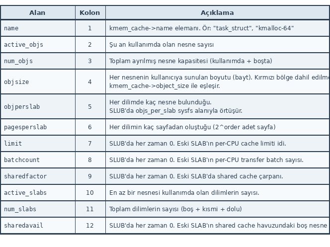

Örneğin belli bir dilim önbelleğine ilişkin bilgileri şöyle elde edebiliriz:

.. code-block:: bash

    $ sudo cat /proc/slabinfo | grep "myobject_cache"
    myobject_cache        60     64    128   32    1 : tunables    0    0    0 : slabdata      2      2      0

Buradaki kendi yarattığımız dilim önbelleği için değerleri tablo halinde veriyoruz:

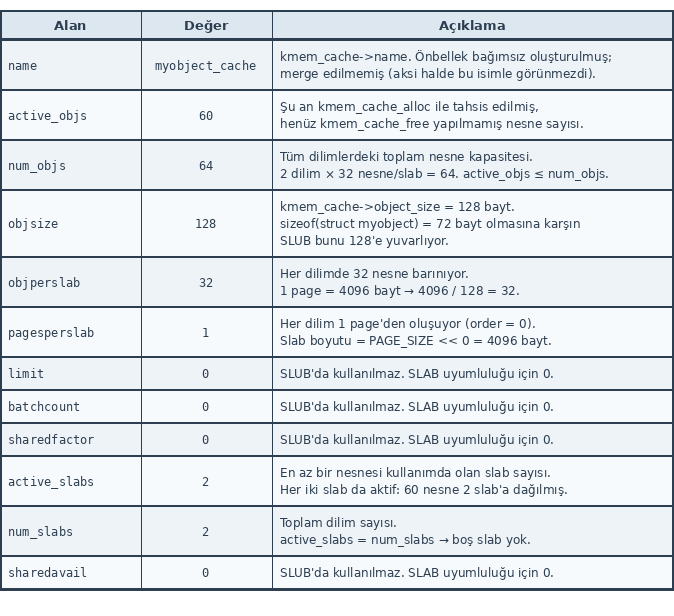

``/proc/meminfo`` dosyası aslında bellek kullanımı hakkında genel bilgi veren bir dosyadır. Bu dosyanın
içeriği aşağıdakine benzer biçimdedir:

.. code-block:: bash

    $ cat /proc/meminfo
    MemTotal:        8081824 kB
    MemFree:         2802508 kB
    MemAvailable:    6072932 kB
    Buffers:          372700 kB
    Cached:          3021924 kB
    SwapCached:            0 kB
    Active:          3296008 kB
    Inactive:        1342872 kB
    Active(anon):    1292996 kB
    Inactive(anon):        0 kB
    Active(file):    2003012 kB
    Inactive(file):  1342872 kB
    Unevictable:          64 kB
    Mlocked:              64 kB
    SwapTotal:       3991548 kB
    SwapFree:        3991548 kB
    Zswap:                 0 kB
    Zswapped:              0 kB
    Dirty:               132 kB
    Writeback:             0 kB
    AnonPages:       1244544 kB
    Mapped:           452140 kB
    Shmem:             48732 kB
    KReclaimable:     229804 kB
    Slab:             398272 kB
    SReclaimable:     229804 kB
    SUnreclaim:       168468 kB
    ...

Buradaki ``Slab`` satırı dilimli tahsisat sistemlerinin toplamda fiziksel RAM'de ne kadar yer
kapladığını belirtmektedir. ``SReclaimable`` çekirdek tarafından geri alınabilen dilim önbelleklerinin
büyüklüğünü, ``SUnreclaim`` ise geri alınamayan dilim önbelleklerinin büyüklüğünü belirtmektedir.

``sys`` dosya sistemindeki ``/sys/kernel/slab/<cache-adı>/`` dizini belli bir dilim önbelleğine
ilişkin bilgileri daha yapısal bir biçimde vermektedir. Bu dizinin içeriği şöyledir:

.. code-block:: bash

    $ ls /sys/kernel/slab/myobject_cache/
    aliases      ctor            object_size      poison                    sheaf_capacity     slab_size      validate
    align        destroy_by_rcu  objects_partial  reclaim_account           shrink             store_user
    cache_dma    hwcache_align   objs_per_slab    red_zone                  skip_kfence        total_objects
    cpu_partial  min_partial     order            remote_node_defrag_ratio  slabs              trace
    cpu_slabs    objects         partial          sanity_checks             slabs_cpu_partial  usersize

Bu dosyaların içerdiği bilgileri aşağıdaki tabloda veriyoruz:

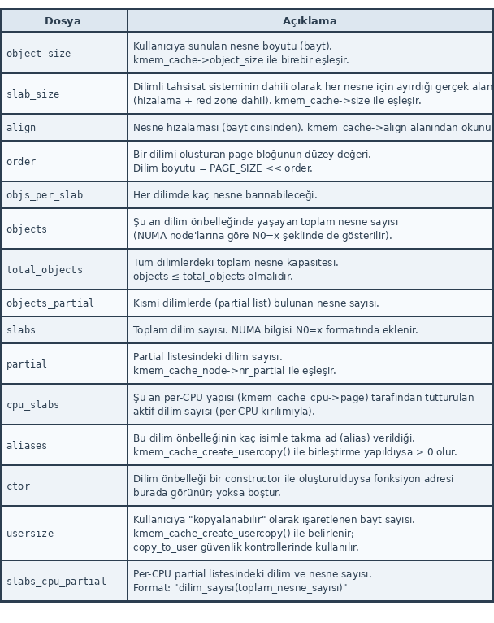

Fiziksel Bellekte Ardışıl Olmayan Tahsisatlar
=============================================

Biz şimdiye kadar fiziksel bellekte ardışıl olan tahsisat üzerinde durduk. Çekirdeğin sayfa
düzeyinde tahsisat yapan *ikiz blok tahsisat sistemi (buddy allocator)* fiziksel bellekte ardışıl
sayfaları tahsis ediyordu. Dilimli tahsisat sistemi de arka planda ikiz blok tahsisat sistemini
kullanıyordu. Ancak fiziksel bellekte ardışıl sayfa tahsisatları fiziksel belleğin bölünmesine
(fragmente olmasına) yol açabilmektedir. İşte bazı durumlarda fiziksel bellekte ardışıl olmayabilen
ancak sanal adres alanında (yani sayfa tablosunda) ardışıl olan tahsisatların da yapılması
gerekebilmektedir. Linux çekirdeğinde fiziksel bellekte ardışıl olmayan ancak sanal adres alanında
ardışıl olan tahsisatlar ``vmalloc`` ailesi fonksiyonlarla yapılmaktadır. Biz önce çekirdekteki
``vmalloc`` ailesi fonksiyonları ele alacağız, sonra da bu fonksiyonların tahsisatları nasıl yaptığı
üzerinde duracağız.

vmalloc Ailesi Fonksiyonlar
---------------------------

Güncel çekirdeklerde ``vmalloc`` ailesi fonksiyonlar makrolar yoluyla oluşturulmuştur. Ancak biz
burada fonksiyonun anlaşılabilir parametrik yapısı için eski çekirdeklerdeki gibi prototipleri
kullanacağız.

``vmalloc`` fonksiyonunun prototipi şöyledir:

.. code-block:: c

    void *vmalloc(unsigned long size);

Görüldüğü gibi fonksiyon tıpkı C'nin ``malloc`` fonksiyonunda olduğu gibi byte cinsinden tahsis
edilecek bellek miktarını parametre olarak almaktadır. Tahsis edilen alanın sanal bellek adresiyle
geri dönmektedir. ``vmalloc`` ile tahsis edilen alan ``vfree`` ve ``vfree_atomic`` fonksiyonlarıyla
serbest bırakılmaktadır:

.. code-block:: c

    void vfree(const void *addr);
    void vfree_atomic(const void *addr);        /* Linux 4.3'den itibaren */

``vfree_atomic`` fonksiyonu kesme kodlarından da çağrılabilmektedir.

``vzalloc`` fonksiyonu tahsis edilen alanı aynı zamanda sıfırlamaktadır. Tabii bu sıfırlama işlemi
aslında ikiz blok tahsisat sisteminde ``__GFP_ZERO`` bayrağı kullanılarak yapılmaktadır:

.. code-block:: c

    void *vzalloc(unsigned long size);

``vmalloc_node`` fonksiyonu belli bir NUMA düğümünü hedef alarak tahsisatı yapmaktadır:

.. code-block:: c

    void *vmalloc_node(unsigned long size, int node);

Ancak bu tahsisatlara ilişkin sayfaların hepsi *fallback* nedeniyle istenilen NUMA düğümünden
karşılanmak zorunda değildir. (Düğümler arasında *fallback* işleminin engellenmesi için
``alloc_pages`` gibi sayfa tahsisat fonksiyonlarında ``__GFP_THISNODE`` özel bayrağı
kullanılabilmektedir.)

``vmalloc_user`` fonksiyonu kullanıcı alanına haritalanabilen (map edilebilen) tahsisatlar
yapmaktadır. Bu konuyu ileride ele alacağız.

Yukarıda da belirttiğimiz gibi ``vmalloc`` ailesi fonksiyonlar arka planda ikiz blok tahsisat
sistemini kullanmaktadır. Aşağıdaki tabloda fonksiyonların ikiz blok tahsisat sisteminden sayfa
tahsis ederken hangi bayrakları kullandığı belirtilmektedir:

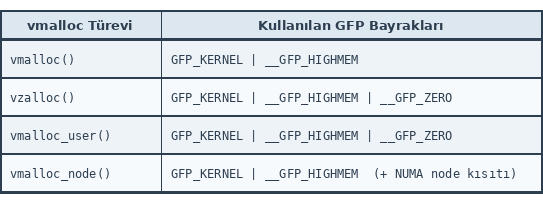

``vmalloc`` ailesi fonksiyonlar tahsisatları arka planda *ikiz blok tahsisat sistemini (buddy
allocator)* kullanarak sayfa düzeyinde yapmaktadır. Dolayısıyla bu fonksiyonlar tarafından yapılan
tahsisatlar her zaman sayfa katları büyüklüğünde olur. Örneğin biz ``vmalloc`` ile 1000 byte tahsis
etmek isteyelim. Aslında fonksiyon arka planda 4096 byte'lık (1 sayfalık) bir tahsisat yapacaktır.
Dolayısıyla ``vmalloc`` ailesi fonksiyonlarda sayfa katlarından küçük olan tahsisat yapmanın bir
anlamı yoktur.

Peki ne zaman dilim önbelleği yolu ile (örneğin ``kmalloc`` ile), ne zaman ``vmalloc`` ile ve ne
zaman sayfa düzeyinde (örneğin ``alloc_pages`` ile) tahsisat yapmalıyız? ``vmalloc`` ailesi
fonksiyonlar ile fiziksel bellekte çok büyük alanlar tahsis edilebilmektedir. Çünkü ``vmalloc``
ailesi sayfaların fiziksel bellekte ardışıl bulunmasını zorunlu tutmamaktadır. ``alloc_pages``
fonksiyonuyla en fazla 8 MB (order 11) kadar tahsisatın tek hamlede yapılabildiğini anımsayınız.
Öte yandan dilimli tahsisat sistemi de temel olarak küçük miktardaki byte tahsisatları için
düşünülmüştür. Ancak ``vmalloc`` ailesi fonksiyonlar toplamda daha fazla meta data kullanma
eğilimindedir. İzleyen paragraflarda açıklayacağımız gibi her ``vmalloc`` çağrısında çekirdek
tahsis edilen alanı yönetmek için ayrı bir nesne oluşturmaktadır. ``vmalloc`` ailesi çağrılar bir
döngü içerisinde sürekli olarak 0'ıncı düzeyde (order 0) sayfa tahsisatlarıyla sağlanmaktadır. Bu
işlem de göreli bir zaman kaybına yol açmaktadır. Aynı zamanda ``vmalloc`` ailesi fonksiyonlar sayfa
tablosunda da güncelleme yapmaktadır. Bu da ek bir maliyete yol açmaktadır. Aşağıdaki tabloda üç
tahsisat yöntemini birbirleriyle karşılaştırıyoruz:

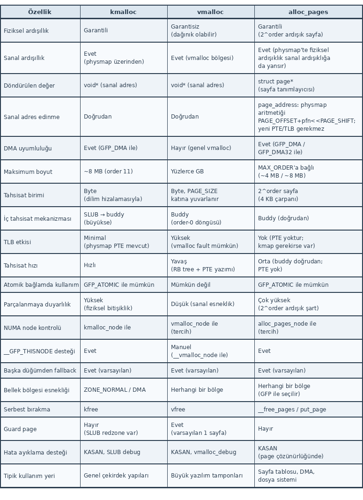

vmalloc Ailesi Fonksiyonların Gerçekleştirimleri
------------------------------------------------

Şimdi de ``vmalloc`` ailesi fonksiyonların gerçekleştirimleri üzerinde duralım. Biz burada anlatımı
``vmalloc`` üzerinden yapacağız. Ailenin diğer üyelerindeki temel çatı aynıdır. ``vmalloc``
fonksiyonu her çağrıldığında ``vm_struct`` isimli bir yapı türünden bir nesne tahsis edilmektedir.
Güncel çekirdeklerde ``vm_struct`` yapısı ``include/linux/vmalloc.h`` içerisinde şöyle
tanımlanmıştır:

.. code-block:: c

    struct vm_struct {
        union {
            struct vm_struct *next;   /* Early registration of vm_areas. */
            struct llist_node llnode; /* Asynchronous freeing on error paths. */
        };

        void            *addr;
        unsigned long    size;
        unsigned long    flags;
        struct page    **pages;
    #ifdef CONFIG_HAVE_ARCH_HUGE_VMALLOC
        unsigned int     page_order;
    #endif
        unsigned int     nr_pages;
        phys_addr_t      phys_addr;
        const void      *caller;
        unsigned long    requested_size;
    };

Bu nesne için çekirdek tarafından oluşturulmuş bir dilim önbelleği yoktur. Çünkü zaten bu yapı 64
byte uzunluktadır ve ``kmalloc`` ailesi için 64 byte'lık bir dilim önbelleği bulunmaktadır.

``vm_struct`` yapısı tahsis edilen alana ilişkin bilgileri barındırmaktadır. Yapının önemli
elemanlarını açıklayalım:

Yapının ``addr`` elemanı tahsis edilen bloğun başlangıç sanal adresini tutmaktadır. Bu adres zaten
``vmalloc`` tarafından geri döndürülen adrestir.

Yapının ``size`` elemanı tahsis edilen alanın uzunluğunu tutmaktadır. Aslında tahsisat yapılırken
eğer ``VM_NO_GUARD`` bayrağı set edilmemişse (varsayılan durumda set edilmez) tahsis edilen alanın
sonuna bir sayfalık daha sanal bellek tahsisatı yapılır. Buna "koruma sayfası (guard page)"
denilmektedir. Bu koruma sayfası yanlışlıkla tahsis edilen alanın dışına taşan erişimler
yapıldığında *page fault* oluşturmak için bulundurulmaktadır. Buradaki ``size`` değeri bu koruma
sayfası dahil edilmiş biçimde uzunluk belirtmektedir. Tabii koruma sayfası yalnızca sayfa tablosunda
tahsis edilmektedir. Fiziksel bellekte bunun için bir sayfanın tahsis edilmesine gerek yoktur.

Yapının ``flags`` elemanı tahsisatın hangi amaçla ve özelliklerle yapıldığı bilgisini tutmaktadır.
Örneğin tahsisat ``vmalloc`` fonksiyonuyla yapılmışsa ``VM_ALLOC`` bayrağı, ``vmap`` fonksiyonuyla
yapılmışsa ``VM_MAP`` bayrağı set edilmektedir. Koruma sayfasının tahsis edilip edilmeyeceği de yine
bu ``flags`` elemanında ``VM_NO_GUARD`` bayrağı ile belirtilmektedir. Buradaki bayraklar çekirdek
fonksiyonlarını kullanan kişiler tarafından set edilmezler. Çekirdek bu bayrakları kendisi set edip
kendisi kullanmaktadır. Örneğin ``VM_NO_GUARD`` bayrağını çekirdek modülleri içerisinde set etmenin
bir yolu yoktur. Bunun için ancak çekirdek kodlarının değiştirilip yeniden derlenmesi gerekir.

Yapının ``pages`` elemanı tahsis edilen fiziksel sayfalara ilişkin ``page`` nesnelerinin adreslerini
tutmaktadır:

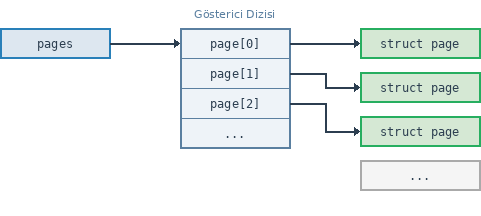

``pages`` elemanının göstericiyi gösteren gösterici olduğuna, yani gösterici dizisini gösterdiğine
dikkat ediniz.

Yapının ``nr_pages`` elemanı tahsis edilen sayfaların sayısını, başka bir deyişle ``pages``
göstericisinin gösterdiği yerdeki dizinin uzunluğunu tutmaktadır. Yapının ``requested_size`` elemanı
tahsisat için istenen uzunluğu tutmaktadır.

Aşağıda yapı elemanlarını bir tablo halinde veriyoruz:

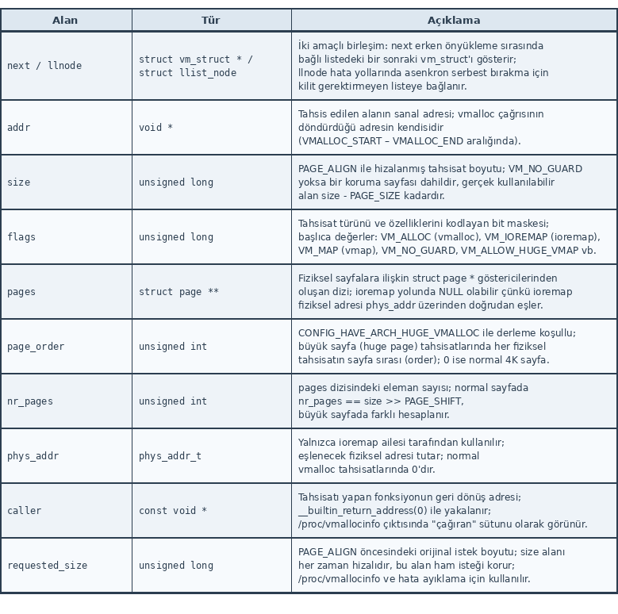

``vmalloc`` fonksiyonu ``VMALLOC_START`` ve ``VMALLOC_END`` sembolik sabitleriyle belirtilen sanal
adres aralığında tahsisatlar yapmaktadır. ``VMALLOC_START`` ve ``VMALLOC_END`` bölgesinin yeri ve
büyüklüğü x86 ve ARM işlemcilerinde tipik olarak aşağıdaki gibidir:

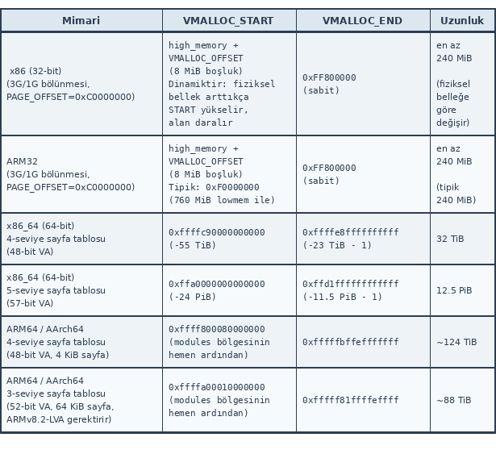

``vmalloc`` fonksiyonu çağrıldığında fonksiyonun boş bir sanal adres verebilmesi için çekirdeğin
sanal adres alanı içerisindeki tahsisatları bir biçimde izlemesi gerekir. İşte ``vmalloc`` tarafından
sanal adres alanındaki tahsisatlar için ``vmap_area`` isimli bir yapı kullanılmaktadır. Her sanal
adres alanındaki ``VMALLOC_START`` - ``VMALLOC_END`` arasındaki tahsisatta ``vm_struct`` nesnesinin
yanı sıra bir ``vmap_area`` nesnesi de yaratılmaktadır. Böylece çekirdek hangi sanal adres alanının
boş olup olmadığını izleyen paragraflarda açıklayacağımız biçimde izleyebilmektedir. Burada iki yapıyı
karıştırmayınız. ``vm_struct`` yapısı ``vmalloc`` tarafından tahsis edilen fiziksel sayfalara ilişkin
bilgileri tutarken, ``vmap_area`` yapısı sanal adres tahsisatlarını tutmaktadır. ``vmap_area`` yapısı
güncel çekirdeklerde ``include/linux/vmalloc.h`` dosyası içerisinde aşağıdaki gibi tanımlanmıştır:

.. code-block:: c

    struct vmap_area {
        unsigned long va_start;
        unsigned long va_end;

        struct rb_node rb_node;         /* address sorted rbtree */
        struct list_head list;          /* address sorted list */

        /*
         * The following two variables can be packed, because
         * a vmap_area object can be either:
         *    1) in "free" tree (root is free_vmap_area_root)
         *    2) or "busy" tree (root is vmap_area_root)
         */
        union {
            unsigned long subtree_max_size; /* in "free" tree */
            struct vm_struct *vm;           /* in "busy" tree */
        };
        unsigned long flags;            /* mark type of vm_map_ram area */
    };

Yapının ``va_start`` ve ``va_end`` elemanları tahsis edilen alanın sanal bellekteki başlangıç ve bitiş
adreslerini belirtmektedir. Bu elemanların ``void *`` türünden olmayıp ``unsigned long`` türünden
olduğuna dikkat ediniz. Çekirdek bu adreslerle ilgili daha kolay aritmetik işlemler yapabilmek için
bunları ``unsigned long`` türünden almıştır.

Yapının ``rb_node`` elemanı izleyen paragraflarda açıklayacağımız gibi "kırmızı-siyah ağacının
(red-black tree)" düğümünü tutmaktadır. Aynı zamanda çekirdek tüm ``vmap_area`` tahsisatlarını sıralı
bir biçimde bir bağlı listede de tutmaktadır.

Yapının ``list`` elemanı bu bağlı listenin düğümünü belirtmektedir.

Yapıdaki anonim birliğe dikkat ediniz. Yukarıda açıkladığımız ``vm_struct`` nesnesinin adresi aslında
``vmap_area`` nesnesinin içerisinde tutulmaktadır. İşte birliğin ``vm`` elemanı eğer ilgili blok tahsis
edilmiş durumdaysa bu adresi tutar; ancak ilgili blok tahsis edilmemişse yani boş durumdaysa
``subtree_max_size`` elemanı kırmızı-siyah ağacının alt düğümlerindeki en büyük boş alanı tutmaktadır.

Yapının ``flags`` elemanı tahsis edilen alanın türünü tutmaktadır.

``vmap_area`` nesneleri için ``vmap_area_cachep`` isimli bir dilim önbelleği kullanılmaktadır. Yani bu
nesnelerin tahsisatları bu önbellekten yapılmaktadır.

İzleyen paragraflarda açıklayacağımız gibi eskiden (çekirdeğin 5.15 versiyonundan önce) boş alanlarla dolu
alanlar farklı "kırmızı-siyah ağaçlarında" tutuluyordu. Bu iki ağacın kök düğümü ``vmap_area_root`` ve
``free_vmap_cache`` ismindeydi. Ancak 5.15 çekirdeği ile birlikte ağaç teke indirilmiştir. Ağacın kök
düğümü ``free_vmap_area_root`` değişkeninde tutulmaktadır.
