=========================================================
Sayfa Önbelleği - I. Bölüm :raw-html:`<br>` Temel İşleyiş
=========================================================

Biz şimdiye kadar Linux çekirdeğindeki bellek yönetimiyle ilgili önemli konuları gördük. Şimdi
dikkatimizi "sayfa önbelleğine (page cache)" yönelteceğiz. Sayfa önbelleği hem bellek yönetimi ile
hem de dosya sistemi ile ilişkili bir konudur. Çünkü sayfa önbelleği ağırlıklı olarak dosya
işlemlerinde devreye girmektedir. Biz sayfa önbelleğine dosya sistemini ele aldığımız beşinci ve
altıncı bölümlerde kavramsal olarak değinmiştik. Sayfa önbelleği kitabımızda iki bölüm halinde 
ele alınmaktadır. Birinci bölümde sayfa önbelleğinin genel işleyisi üzerinde duracağız. İkinci 
bölümde ise sayfa önbelleğindeki blokların geri yazımına (flush edilmesine) süreci inceleyeceğiz.

Sayfa önbelleği (page cache) dosyalara ilişkin disk bloklarının fiziksel bellekte tutularak disk
erişiminin azaltılmasını hedefleyen bir önbellek sistemidir. Böylece ``read``/``write`` gibi
işlemlerde diske başvurulmadan istek sayfa önbelleğinden karşılanabilmektedir. Sayfa önbelleğinin
kullanımını aşağıdaki şekille betimleyebiliriz:

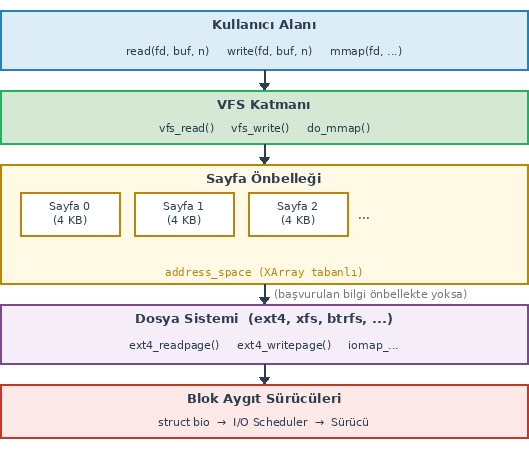

Biz *simplefs* dosya sistemimizde sayfa önbelleğini "tampon (buffer)" işlemleriyle dolaylı bir
biçimde kullandık. Daha önceden de belirttiğimiz gibi eskiden Linux çekirdeklerinde "tampon önbelleği
(buffer cache)" ile "sayfa önbelleği (page cache)" birbirinden ayrılıyordu. Sonra bunlar birleştirildi.
Ancak tampon önbelleği ile sayfa önbelleği birleştirildiği için biz aslında *simplefs* dosya
sistemimizde tampon işlemleri yapmış olsak da dolaylı olarak sayfa önbelleğini de kullanmış olduk.
Sayfa önbelleğini tampon işlemleriyle kullanmak oldukça kolaydır. Bu nedenle biz *simplefs* dosya
sisteminde bu yola saptık. Ancak modern dosya sistemleri (örneğin ext4 gibi) dosyaların
önbelleklenmesinde tampon işlemleri yapmadan sayfa önbelleğini doğrudan kullanmaktadır. (Bu dosya
sistemleri yine disk bloklarının okunması ve yazılması işlemlerini tampon yoluyla yapmaktadır.) Biz
de dosya sistemlerinde doğrudan sayfa önbelleğinin kullanılmasını ayrı bir başlık altında ele
alacağız.

Anımsatma: simplefs Dosya Sisteminde Sayfa Önbelleğinin Kullanımı
=================================================================

Önce *simplefs* dosya sistemimizdeki tampon işlemleriyle sayfa önbelleğini nasıl kullandığımızı
anımsatmak istiyoruz. *simplefs* dosya sistemimizde kullanıcı modundan ``read`` işlemi yapıldığında
aygıt sürücümüzün aşağıdaki fonksiyonu çalıştırılıyordu:

.. code-block:: c

    static ssize_t simplefs_read(struct file *filp, char *buf, size_t size, loff_t *off)
    {
        struct inode *inode;
        struct simplefs_inode *inode_sfs;
        struct buffer_head *bh;
        struct timespec64 now;
        size_t esize;

        inode = file_inode(filp);
        inode_sfs = container_of(inode, struct simplefs_inode, vfs_inode);

        if (*off >= inode->i_size)
            return 0;

        if (inode_sfs->block_no == 0)
            return 0;

        if ((bh = sb_bread(inode->i_sb, inode_sfs->block_no)) == NULL)
            return -EIO;

        esize = min_t(size_t, inode->i_size - *off, size);
        if (copy_to_user(buf, bh->b_data + *off, esize) != 0) {
            brelse(bh);
            return -EFAULT;
        }
        *off += esize;

        now = current_time(inode);
        inode_set_atime(inode, now.tv_sec, now.tv_nsec);

        mark_inode_dirty(inode);
        brelse(bh);

        return esize;
    }

Bu fonksiyonda biz diskteki dosya bilgilerinin bulunduğu bloğu ``sb_bread`` fonksiyonuyla okuyup bu
fonksiyondan bir ``buffer_head`` nesnesi elde etmiştik. ``sb_bread`` fonksiyonu okunmak istenen disk
bloğu sayfa önbelleğinde varsa gerçek bir okuma yapmadan bize o bloğa ilişkin ``buffer_head`` nesnesini
veriyordu. Ancak ilgili disk bloğu sayfa önbelleğinde yoksa gerçek disk okuması yaparak onu sayfa
önbelleğine çekiyordu. *simplefs* dosya sistemimizde kullanıcı modundan ``write`` işlemi yapıldığında
çağrılan fonksiyon da şöyleydi:

.. code-block:: c

    static ssize_t simplefs_write(struct file *filp, const char *buf, size_t size, loff_t *off)
    {
        struct inode *inode;
        struct simplefs_inode *inode_sfs;
        int block;
        struct buffer_head *bh;
        size_t esize;
        struct timespec64 now;

        inode = file_inode(filp);
        inode_sfs = container_of(inode, struct simplefs_inode, vfs_inode);

        printk(KERN_INFO "write stats...\n");

        if (*off >= SIMPLEFS_BLOCK_SIZE)
            return -EFBIG;

        if (inode_sfs->block_no == 0) {
            if ((block = simplefs_alloc_data_block(inode->i_sb)) < 0)
                return block;
            printk(KERN_INFO "New block allocated for file: %d\n", block);
            inode_sfs->block_no = block;
            inode->i_blocks = 1;
        }
        if ((bh = sb_bread(inode->i_sb, inode_sfs->block_no)) == NULL) {
            simplefs_free_data_block(inode->i_sb, block);
            return -EIO;
        }
        esize = min_t(size_t, SIMPLEFS_BLOCK_SIZE - *off, size);
        if (copy_from_user(bh->b_data + *off, buf, esize) != 0) {
            brelse(bh);
            simplefs_free_data_block(inode->i_sb, block);
            return -EFAULT;
        }

        *off += esize;
        if (*off > inode->i_size)
            inode->i_size = *off;

        now = current_time(inode);
        inode_set_mtime(inode, now.tv_sec, now.tv_nsec);
        inode_set_ctime(inode, now.tv_sec, now.tv_nsec);

        mark_buffer_dirty(bh);
        mark_inode_dirty(inode);
        brelse(bh);

        return esize;
    }

Burada da benzer işlemler yapılmıştır. Yazmanın yapılacağı blok için yine ``sb_bread`` fonksiyonuyla
sayfa önbelleğine başvurulmuştur. Eğer ilgili blok sayfa önbelleğinde yoksa ``sb_bread`` fonksiyonu
onu gerçekten diskten okuyup sayfa önbelleğine yerleştirmektedir. Anımsanacağı gibi biz yazma
işleminde yazmayı doğrudan önbelleğe yapıyorduk. Sayfa önbelleklerinin işletim sistemi tarafından
gecikmeli bir biçimde *flush* edildiğini anımsayınız.

``sb_bread`` fonksiyonu ileride de göreceğimiz gibi aslında okuma ve yazmaları blok aygıt sürücüsünün
sayfa önbelleğinden yapmaktadır.

Sayfa Önbelleğinin Organizasyonu
================================

Linux'un sayfa önbelleği belli bir uzunluğu olan global bir bellek bölgesi değildir. Dosya işlemleri
sırasında dosya temelinde önbellekleme yapılmaktadır. Yani adeta her dosyanın sanki ayrı bir önbelleği
varmış gibi bir durum söz konusudur. Sayfa önbelleği sayfalardan oluşmaktadır, önbellekteki sayfalar
da dosyanın sayfa büyüklüğündeki kısımlarını tutmaktadır.

Anımsanacağı gibi Linux çekirdeğinde ``inode`` nesneleri dosyanın diskteki varlığını temsil
ediyordu. Aynı dosyayı birden fazla kez açıkça ya da katı bağ (hard link) yoluyla açtığımızda
aslında birden fazla dosya nesnesi (``struct file``) oluşturulurken tek bir ``inode`` nesnesi
oluşturuluyordu. İşte bir dosyanın önbellek sayfaları ``inode`` elemanının ``i_mapping`` elemanında
tutulmaktadır:

.. code-block:: c

    struct inode {
        /* ... */
        struct address_space *i_mapping;
        /* ... */
    };

Burada ``i_mapping`` elemanının ``address_space`` isimli bir yapı türünden olduğuna dikkat ediniz.
Bu ``address_space`` yapısı dosyanın sayfa önbelleğinin giriş noktasıdır. Her dosya için çekirdek
bir ``address_space`` nesnesi oluşturmaktadır.

``address_space`` yapısı dosyaya ilişkin önbellek işlemlerinde gereksinim duyulacak tüm bilgileri
içermektedir. Nesneler arasındaki ilişkiyi aşağıdaki şekille betimleyebiliriz:

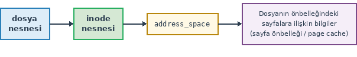

Peki bir dosyanın önbelleklenmiş sayfaları ``address_space`` nesnesi içerisinde nasıl
tutulmaktadır? Çekirdek dosyanın okunacak ya da yazılacak kısmının önbellekte olup olmadığını
nasıl anlamaktadır? İşte bunun için daha önce görmüş olduğumuz *XArray* veri yapısı
kullanılmaktadır. Anımsanacağı gibi *XArray* aslında "radix ağaçlarının (radix tree)" Linux'a özgü
bir gerçekleştirimiydi. Radix ağaçlarının sayısal anahtarlara sahip sistemlerde hızlı arama
amacıyla kullanıldığını anımsayınız. Radix ağaçlarında her düğümün n tane alt düğümü
olabilmektedir. İşte sayfa önbelleğinde kullanılan radix ağaçlarında dosyaya ilişkin sayfa
indeksi (sayfa offset'i de diyebiliriz) anahtar durumundadır. Bu ağaçlarda her kademede 6 bitlik
değer tutulmaktadır. Yani ağacın her düğümü 64 bit temel alındığından 64 alt düğüm içermektedir.
Tabii *XArray* gerçekleştiriminde düğümler ancak gerektiğinde yaratılmaktadır. Yani her düğümün 64
alt düğümü olmakla birlikte bu alt düğümlere ilişkin slotlar kullanılmadığı sürece ``NULL`` adres
içermektedir. Böylece belli bir sayfa numarası ağaçta 64 / 6 + 1 = 11 karşılaştırmayla
bulunabilmektedir.

Biz yukarıda sayfa önbelleğinin yalnızca disk tabanlı dosya işlemlerinde kullanıldığı yönünde bir
izlenim vermiş olabiliriz. Ancak sayfa önbelleği disk dosyalarının dışında başka çekirdek
mekanizmaları tarafından da kullanılmaktadır:

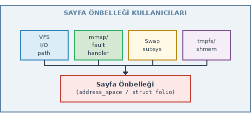

Buradaki VFS kutucuğu disk tabanlı dosya işlemlerini belirtmektedir.

address_space Yapısı
--------------------

Şimdi ``address_space`` yapısını inceleyelim. ``address_space`` yapısı güncel çekirdeklerde
``include/linux/fs.h`` dosyasında aşağıdaki gibi tanımlanmıştır:

.. code-block:: c

    struct address_space {
        struct inode                    *host;
        struct xarray                    i_pages;
        struct rw_semaphore              invalidate_lock;
        gfp_t                            gfp_mask;
        atomic_t                         i_mmap_writable;
    #ifdef CONFIG_READ_ONLY_THP_FOR_FS
        /* number of thp, only for non-shmem files */
        atomic_t                         nr_thps;
    #endif
        struct rb_root_cached            i_mmap;
        unsigned long                    nrpages;
        pgoff_t                          writeback_index;
        const struct address_space_operations *a_ops;
        unsigned long                    flags;
        errseq_t                         wb_err;
        spinlock_t                       i_private_lock;
        struct list_head                 i_private_list;
        struct rw_semaphore              i_mmap_rwsem;
        void                            *i_private_data;
    } __attribute__((aligned(sizeof(long)))) __randomize_layout;

``address_space`` yapısının ``i_pages`` elemanı ``xarray`` yapısı türündendir. Yani *XArray* ağacı
yapının bu elemanında tutulmaktadır. Başka bir deyişle önbellekte arama bu elemanın belirttiği ağaç
kullanılarak yapılmaktadır. Yapının ``nrpages`` elemanı bu dosyanın önbelleğinde tutulan sayfaların
toplam sayısını belirtmektedir. Bazı durumlarda elde bir ``address_space`` nesnesi varken geriye
dönüp ona ilişkin ``inode`` nesnesine erişilmesi gerekebilmektedir. Yapının ``host`` elemanı
``address_space`` nesnesinin sahibi olan ``inode`` nesnesini göstermektedir. Yapının içerisinde bazı
senkronizasyon nesnelerini görüyorsunuz. Bunlar dosyanın önbellek işlemlerinde eşzamanlı erişimlerde
koruma sağlamak için kullanılmaktadır. Yapının ``flags`` elemanında işleyiş sırasında kullanılan bazı
bayraklar tutulmaktadır. Yapının ``i_mmap`` elemanı bellek tabanlı dosyalarda ve genel olarak bellek
haritalama (memory mapping) işlemlerinde kullanılmaktadır. Yapının ``a_ops`` elemanı çokbiçimli
davranış için kullanılan fonksiyon göstericilerinden oluşan bir yapı nesnesinin adresini
tutmaktadır. Biz bu konuları ayrı bir paragrafta ele alacağız. Aşağıdaki tabloda yapı elemanlarının
işlevlerini özet olarak veriyoruz:

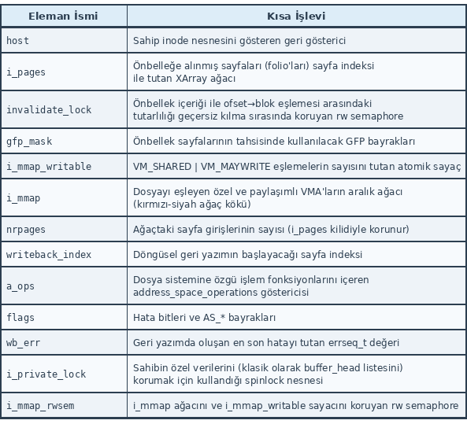

Dosya Offset'inden Hareketle Dosyanın Önbellekteki Kısmına Erişilmesi
-------------------------------------------------------------------------

Her ``inode`` nesnesinin ayrı bir sayfa önbelleği olduğunu ve sayfa önbelleğinde dosyaya ilişkin
kısımların tutulduğunu, arama işleminin de *XArray* yani radix ağacı yoluyla yapıldığını belirttik.
Şimdi önbelleğin organizasyonunun nasıl yapıldığı üzerinde duralım. Önbellekte anahtar dosyaya
ilişkin sayfa indeksidir. Yani dosyanın parçaları sayfa temelinde (tipik olarak 4K) sayfa
önbelleğinde tutulmaktadır. Örneğin bir dosyanın 80000 byte olduğunu düşünelim. Aslında bu dosya
4K'lık sayfaların söz konusu olduğu tipik sistemlerde 80000 / 4096 = 19.53125 yani 20 sayfa olarak
düşünülebilir. Tabii dosyaya offset yoluyla erişilmektedir. Dosya offset'inin dosyanın kaçıncı
sayfasında olduğunun hesabı oldukça basittir: ``offset >> PAGE_SHIFT``. Burada ``PAGE_SHIFT`` bir
sayfanın 2 üzeri kaç byte'tan oluştuğunu belirtmektedir. (4K sayfalar için ``PAGE_SHIFT`` değeri
12'dir.) Tabii ``offset % PAGE_SIZE`` değeri ile ilgili sayfadaki offset de elde edilebilir. İşte
çekirdek belli bir dosya offset'inden hareketle önce dosya offset'ini sayfa indeksine (sayfa
offset'i de diyebiliriz) dönüştürüp sonra ilgili sayfayı dosyanın sayfa önbelleğinde aramaktadır.
Örneğin biz aşağıdaki gibi bir çağrı yapmış olalım:

.. code-block:: c

    result = read(fd, buf, 100);

Dosya göstericisinin konumu da 10254 olsun. Çekirdek önce dosya nesnesine, oradan dosyaya ilişkin
``inode`` nesnesine, oradan da dosyanın önbellek bilgilerinin bulunduğu ``address_space`` nesnesine
erişir. *XArray* yani radix ağacının kökünün ``address_space`` nesnesi içerisinde olduğunu
belirtmiştik. İşte radix ağacındaki anahtar sayfa indeksidir. Çekirdek 10254 numaralı dosya
offset'ini 4096'ya tam bölerek sayfa indeksini elde eder. Örneğimizde bu değer 2'dir. İşte bu 2
değerini radix ağacına anahtar yapmaktadır.

*XArray* radix ağacının anahtarının sayfa indeksi (dosya offset'i değil) olduğunu söyledik. Peki
aramadan elde edilecek değer nedir? İşte güncel çekirdeklerde sayfa önbelleğindeki aramadan
``folio`` isimli bir yapı türünden nesne adresi elde edilmektedir. Yani radix ağacındaki anahtarlar
sayfa indeksidir, elde edilecek değerler ise ``folio`` nesneleridir. Eskiden (çekirdeğin 5.16
sürümünden önce) ``folio`` nesneleri yerine doğrudan ``page`` nesneleri kullanılıyordu. Yani
çekirdeğin 5.16 sürümünden önce buradaki radix ağacı bize dosyanın bellekteki kısmına ilişkin
``page`` nesnesinin adresini veriyordu. Ancak 5.16'dan itibaren sistem biraz daha iyileştirilmiş ve
``folio`` yapısı kullanılmaya başlanmıştır. Tabii izleyen paragraflarda ele alacağımız gibi ``folio``
nesnesinden ``page`` nesnesine, dolayısıyla da dosyanın ilgili kısmının fiziksel bellekteki kısmına
erişilmektedir.

Bir dosyaya ilişkin önbelleğin *XArray* ağacını sembolik biçimde şöyle betimleyebiliriz:

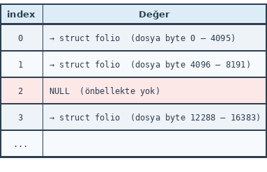

Sayfa Önbelleğinde Büyük Blokların Saklanması
--------------------------------------------- 

Sayfa önbelleğinde saklanan önbellek blokları genellikle sayfa büyüklüğündedir. Yani genellikle bir
dosyanın çeşitli kısımlarının birer sayfalık (tipik olarak 4K'lık) bölümleri önbelleğe alınmaktadır.
Ancak bazı durumlarda ilgili dosyanın (genellikle bellek haritalama işlemlerinde karşımıza çıkmaktadır)
daha büyük kısımları da önbelleğe alınabilmektedir. Biz bir dosyanın 4K'lık değil de 64K'lık
kısımlarının önbelleğe alınacağını düşünelim. Bu durumda organizasyon nasıl olacaktır? İşte sayfa
önbelleğindeki bir sayfadan büyük bloklara "bileşik sayfa (compound page)" denilmektedir. Örneğin
önbellekte 64K'lık blokların da tutulduğunu düşünelim. Çekirdek bu 64K'lık bileşik sayfayı aslında
16 tane normal sayfa gibi *XArray* ağacında tutmaktadır. Bu 16 sayfanın ilk sayfasına "baş (head)"
sayfa, diğerlerine ise "kuyruk (tail)" sayfaları denilmektedir. Yani kuyruk sayfaları bloğun baş
sayfa dışındaki sayfalarını temsil etmektedir.

*XArray* ağacında her zaman sayfa temelinde arama yapılmaktadır. Bu durumda örneğin dosyanın 64K'lık
bir kısmı tek bir birim gibi sayfa önbelleğine yerleştirilip belli bir offset'e dayalı arama
yapıldığında bulunan sayfa bu 16 sayfanın baş sayfası olabileceği gibi kuyruk sayfalarından biri de
olabilecektir. Bir sayfadan daha büyük birimlerin önbelleğe yerleştirilmesi durumunda sayfa önbelleği
için metadata bilgileri her zaman baş sayfada tutulmaktadır. O halde çekirdek bir sayfa indeksiyle
*XArray* ağacında arama yaptığında o sayfanın bir baş sayfa mı yoksa kuyruk sayfası mı olduğunu
anlayabilmeli; eğer erişilen sayfa bir kuyruk sayfası ise onun baş sayfasını bulabilmelidir. *XArray*
aramasında baş sayfanın nasıl bulunduğunu izleyen paragraflarda açıklayacağız. Ancak bazen çekirdeğin
bir ``page`` nesnesinden hareketle o ``page`` nesnesinin ilişkin olduğu büyük bloğun baş sayfasına
ilişkin ``page`` nesnesine de erişmesi gerekebilmektedir. İşte bu işlem ``page`` yapısının
içerisindeki ``compound_head`` isimli eleman yardımıyla yapılmaktadır:

.. code-block:: c

    struct page {
        /* ... */
        unsigned long compound_head;    /* Bit zero is set for tail pages */
        /* ... */
    };

``compound_head`` elemanının en düşük anlamlı biti (0 numaralı biti) 1 ise ``page`` nesnesi bir
kuyruk sayfasına, 0 ise baş sayfaya ilişkindir. Sayfa eğer kuyruk sayfasıysa ``compound_head``
elemanının en düşük anlamlı biti sıfırlandığında (bu işlem 1 çıkartılarak da yapılabilir)
``compound_head`` elemanı baş sayfaya ilişkin ``page`` nesnesinin adresini vermektedir. Eğer
``compound_head`` elemanının en düşük anlamlı biti 1 değilse zaten ilgili sayfa bir baş sayfadır.
Bu durumda bu eleman artık ``page`` içerisindeki birlik yoluyla LRU listesindeki sonraki elemanı
gösteren düğümle çakıştırılmış durumda olur. Çekirdekte bir ``page`` nesnesinin adresini parametre
olarak alıp nesnesinin baş sayfasına ilişkin ``page`` nesne adresini elde eden ``_compound_head``
isimli bir fonksiyon bulunmaktadır:

.. code-block:: c

    static __always_inline unsigned long _compound_head(const struct page *page)
    {
        unsigned long head = READ_ONCE(page->compound_head);

        if (unlikely(head & 1))
            return head - 1;
        return (unsigned long)page_fixed_fake_head(page);
    }

Bir sayfadan (tipik olarak 4K'dan) büyük birimlerin önbelleklerde tutulması Linux çekirdeğine 4.8
sürümüyle eklenmiş bir özelliktir. Dolayısıyla daha önceki çekirdeklerin ``page`` yapılarında
``compound_head`` elemanı yoktu.

Aslında sayfa önbelleğinde bir sayfadan (yani 4K'dan) daha büyük birimlerle seyrek karşılaşılmaktadır.
Bir sayfadan büyük önbellek birimleri kullanan başlıca kaynaklar şunlardır:

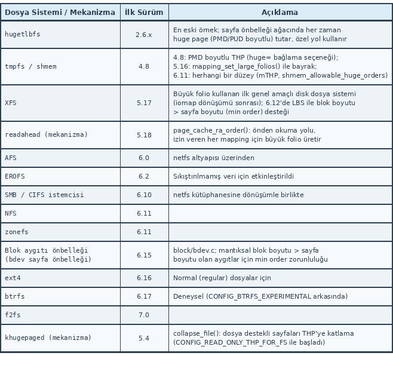

folio Yapısı
------------

Yukarıda da belirttiğimiz gibi eskiden sayfa önbelleğine ilişkin *XArray* ağacına dosyanın sayfa
indeksi verildiğinde o bize doğrudan sayfaya ilişkin ``page`` nesnesinin adresini veriyordu. Ancak
daha sonra ``folio`` nesneleri kullanılmaya başlandı. Mevcut çekirdeklerde sayfa önbelleğinden
yapılan başarılı aramalarda ``folio`` nesnelerinin adresleri elde edilmektedir. ``folio`` nesneleri için 
ayrıca bir tahsisat yapılmamaktadır. Yani ``folio`` nesneleri aslında ``page`` nesneleri 
ile aynı alanı kullanmaktadır.

``folio`` yapısı birlikler içeren oldukça karmaşık bir görünümdedir. Yapının tanımlaması
``include/linux/mm_types.h`` dosyası içerisinde şöyle yapılmıştır:

.. code-block:: c

    struct folio {
        /* private: don't document the anon union */
        union {
            struct {
        /* public: */
                memdesc_flags_t flags;
                union {
                    struct list_head lru;
        /* private: avoid cluttering the output */
                    /* For the Unevictable "LRU list" slot */
                    struct {
                        /* Avoid compound_head */
                        void *__filler;
        /* public: */
                        unsigned int mlock_count;
        /* private: */
                    };
        /* public: */
                    struct dev_pagemap *pgmap;
                };
                struct address_space *mapping;
                union {
                    pgoff_t index;
                    unsigned long share;
                };
                union {
                    void *private;
                    swp_entry_t swap;
                };
                atomic_t _mapcount;
                atomic_t _refcount;
    #ifdef CONFIG_MEMCG
                unsigned long memcg_data;
    #elif defined(CONFIG_SLAB_OBJ_EXT)
                unsigned long _unused_slab_obj_exts;
    #endif
    #if defined(WANT_PAGE_VIRTUAL)
                void *virtual;
    #endif
    #ifdef LAST_CPUPID_NOT_IN_PAGE_FLAGS
                int _last_cpupid;
    #endif
        /* private: the union with struct page is transitional */
            };
            struct page page;
        };
        union {
            struct {
                unsigned long _flags_1;
                unsigned long _head_1;
                union {
                    struct {
        /* public: */
                        atomic_t _large_mapcount;
                        atomic_t _nr_pages_mapped;
    #ifdef CONFIG_64BIT
                        atomic_t _entire_mapcount;
                        atomic_t _pincount;
    #endif /* CONFIG_64BIT */
                        mm_id_mapcount_t _mm_id_mapcount[2];
                        union {
                            mm_id_t _mm_id[2];
                            unsigned long _mm_ids;
                        };
        /* private: the union with struct page is transitional */
                    };
                    unsigned long _usable_1[4];
                };
                atomic_t _mapcount_1;
                atomic_t _refcount_1;
        /* public: */
    #ifdef NR_PAGES_IN_LARGE_FOLIO
                unsigned int _nr_pages;
    #endif /* NR_PAGES_IN_LARGE_FOLIO */
        /* private: the union with struct page is transitional */
            };
            struct page __page_1;
        };
        union {
            struct {
                unsigned long _flags_2;
                unsigned long _head_2;
        /* public: */
                struct list_head _deferred_list;
    #ifndef CONFIG_64BIT
                atomic_t _entire_mapcount;
                atomic_t _pincount;
    #endif /* !CONFIG_64BIT */
        /* private: the union with struct page is transitional */
            };
            struct page __page_2;
        };
        union {
            struct {
                unsigned long _flags_3;
                unsigned long _head_3;
        /* public: */
                void *_hugetlb_subpool;
                void *_hugetlb_cgroup;
                void *_hugetlb_cgroup_rsvd;
                void *_hugetlb_hwpoison;
        /* private: the union with struct page is transitional */
            };
            struct page __page_3;
        };
    };

Yapının anlaşılması oldukça zordur. Parça parça incelenerek daha kolay anlaşılabilir. Yapının baş
kısmı bir birlik içermektedir:

.. code-block:: c

    struct folio {
        union {
            struct {
                /* ... */
            };
            struct page page;
        };
        /* ... */
    };

``folio`` yapısının baş kısmı birlik kullanılarak tamamen ``page`` yapısının üzerine oturtulmuştur.
``folio`` yapısının ``page`` yapısı dışında kalan alanlarına ancak ``folio`` yapısı birden fazla
sayfadan oluşan bir önbellek bloğuna ilişkinse erişilmektedir. Bu alanlar ``folio`` nesnesi bir
sayfadan büyük birimleri tutuyorsa onun sonraki ``page`` nesnesi içerisinde bulunmaktadır. Bir
sayfadan büyük önbellek bloklarının ikinci ``page`` nesnesinde de bazı ``folio`` bilgileri
saklanmaktadır. Bunu aşağıdaki çizimle görselleştirebiliriz:

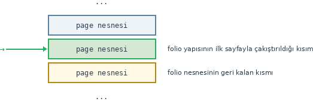

Peki bir ``folio`` nesnesinin belirttiği önbellek sayfasına nasıl erişilmektedir? ``folio`` nesnesi
aslında bir ``page`` nesnesi olduğuna göre ``folio`` nesnesinin adresi ile ``page`` nesnesinin adresi
aynıdır. Biz bir ``page`` nesnesinin adresi ile o nesnenin belirttiği sayfanın fiziksel ve sanal
adreslerine makrolar ve fonksiyonlarla erişebiliyorduk. ``include/linux/mm.h`` dosyası içerisinde
``folio`` nesnesinin adresini alarak ona ilişkin önbellek bloğunun adresini veren ``folio_address``
isimli fonksiyon bulunmaktadır:

.. code-block:: c

    static inline void *folio_address(const struct folio *folio)
    {
        return page_address(&folio->page);
    }

Gördüğünüz gibi fonksiyonun tek yaptığı şey ``page_address`` fonksiyonunu çağırmaktır. Biz bu
fonksiyonu incelemiştik. ``folio`` yapısının ``page`` elemanının aslında nesnesinin başlangıç
adresiyle, dolayısıyla da ``folio`` adresiyle aynı olduğuna dikkat ediniz. ``page_address``
fonksiyonu ``page`` türünden bir adres istediği için erişim bu biçimde yapılmıştır.

Peki bir sayfadan büyük (örneğin 64K) önbellek bloğuna sahip bir dosya sisteminde belli bir dosya
offset'inden ``read`` fonksiyonuyla okuma yapıldığında çekirdek önbellekteki yeri nasıl tespit
etmektedir? İşte çekirdek önce dosya offset'ini yine sayfa indeksine dönüştürerek bu sayfa indeksi
ile *XArray* ağacında arama yapar. *XArray* ağacında arama yapıldığında ağaçtaki alt düğümün yerlerini
belirten slotlarda aranan hedef slot bulunur (anımsayacağınız gibi düğümün slotları alt düğümlerin
yerlerini tutan göstericileri barındırmaktadır). İşte bulunan slot eğer baş sayfaya ilişkin bir slot
değilse buna *kardeş slot (sibling slot)* denilmektedir. Bu kardeş slotun içerisinde ``folio``
nesnesinin adresi değil baş sayfanın slot indeksinin yeri tutulmaktadır. Eğer bu slot baş sayfaya
ilişkinse (baş sayfaya ilişkin slotlara *kanonik slotlar* da denilmektedir) slot indeks değil
doğrudan ``folio`` nesnesinin adresini tutmaktadır. Yani bulunan kardeş slottan hareketle baş slotun
(kanonik slotun) yeri, oradan hareketle de büyük birimin ``folio`` nesne adresi elde edilmektedir.
Yani işlemler çekirdek tarafından şu aşamalardan geçilerek yürütülmektedir:

1. Dosya offset'inden hareketle erişilecek yerin sayfa indeksi elde edilir.
2. Bu sayfa indeksi *XArray* ağacına anahtar yapılarak ağaçtan bu sayfa indeksine ilişkin slot elde
   edilir. Bu slot baş sayfaya ilişkin değilse baş sayfaya ilişkin slota (kanonik slota) geçilir.
3. Baş sayfaya ilişkin slotun (kanonik slotun) içerisinden ``folio`` nesne adresinden hareketle bir
   sayfadan büyük (örneğin 64K) önbellek bloğunun başlangıç adresi elde edilir.
4. Aranan dosya offset'inin önbellek bloğu içerisindeki offset'i elde edilir.

Örneğin önbellek bloğunun 64K (16 sayfa) olduğunu varsayalım. Biz de ``read`` fonksiyonuyla
dosyanın 72128'inci offset'inden okuma yapmak isteyelim. İşte çekirdek önce 72128 offset değerini
sayfa indeksine dönüştürür. Bu değer 17'dir. Sonra bu 17'inci sayfa indeksini *XArray* içerisinde
arar. Buna ilişkin slot eğer bir kardeş slotsa onun baş slotuna geçer. Baş slottan ``folio``
nesnesinin adresini, ``folio`` nesnesinden de önbellek bloğunun adresini elde eder. Artık çekirdeğin
elinde 64K'lık önbellek bloğunun başlangıç adresi vardır. Erişilecek offset 72128 olduğuna göre
oradan 72128 % 65536 = 6592'inci offset'e erişir. Bu süreci şekilsel olarak şöyle gösterebiliriz:

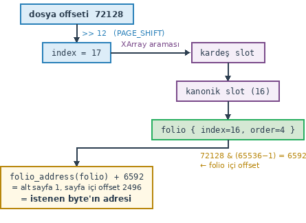

*XArray* ağacının organizasyonu hakkında bir anımsatma yapmak istiyoruz. *XArray* ağacında yapraklar
için ayrı düğümlerin tutulmasına gerek yoktur. Zaten arama son kademeye geldiğinde son kademedeki
slotlar doğrudan değeri ya da değerin bulunduğu nesnenin adresini tutmaktadır. Buradaki *XArray* ağacı
için her kademede 64 slot (6 bitlik kademeler) tutulduğunu anımsayınız. Bu durumda 64K'lık bir
bloğun son kademesindeki 16 slotun yalnızca ilk slotu ``folio`` nesnesinin adresini tutmaktadır.
Geri kalan 15 slot kardeş slottur.

Burada bir noktaya dikkatinizi çekmek istiyoruz. Sayfa önbelleğinde farklı büyüklüklere ilişkin
önbellek birimleri bir arada bulunabilir. Örneğin *XArray* ağacının bazı slotları 4K'lık sayfalara
ilişkin önbellek bloklarını tutarken bazı slotları 64K'ya ilişkin slotları tutuyor olabilir. *XArray*
ağacında sayfa tabanlı arama yapılırken ilgili slota erişildiğinde zaten bu slotun bir kardeş slot
mu yoksa baş slot mu olduğu anlaşılmaktadır. Eğer ilgili slot kardeş slotsa onun baş slotu elde
edilip ``folio`` nesnesine ulaşılabilmektedir. Erişimi yapan kodun erişilecek bloğun büyüklüğünü
bilmesi gerekmez. Erişim sonucunda elde edilen ``folio`` nesnesinin içerisinde zaten birimin
büyüklük bilgisi vardır. Peki *XArray* ağacındaki slotların kardeş slot (sibling slot) olup olmadığı
nasıl belirlenmektedir? İşte bir slota erişildiğinde onun düşük anlamlı 2 biti bu bilgiyi
barındırmaktadır. ``folio`` adresleri 4 byte'a hizalandığı için slotta ``folio`` adresi varsa zaten
düşük anlamlı 2 bit 0'dır. Düşük anlamlı 2 bitin değerleri şöyle yorumlanmaktadır:

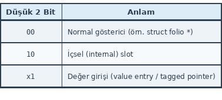

Düşük anlamlı 2 bit 10 durumundaysa ve yüksek anlamlı bitler 0 ile 62 arasındaysa slot bir kardeş
slottur ve yüksek anlamlı bitler 64 slot içerisindeki baş slotun indeksini belirtmektedir. Burada
kardeş slotun içerisindeki indeks değerinin en fazla 62 olabileceğine dikkat ediniz. (Kardeş slot en
kötü olasılıkla 63'üncü indekste olabilir. Bu durumda baş slot da en kötü olasılıkla 62'inci
indekste olabilir.) Yüksek anlamlı bitlerin ifade ettiği anlamlar da şöyledir:

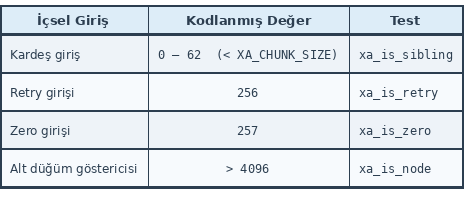

Çekirdek içerisinde erişilen slotun kardeş slot olup olmadığı ``xa_is_sibling`` fonksiyonuyla test
edilebilmektedir:

.. code-block:: c

    static inline bool xa_is_sibling(const void *entry)
    {
        return IS_ENABLED(CONFIG_XARRAY_MULTI) && xa_is_internal(entry) &&
                (entry < xa_mk_sibling(XA_CHUNK_SIZE - 1));
    }

Burada ``xa_is_internal`` slotun son iki bitinin ikilik sistemde 10 olup olmadığına bakmaktadır.
Slotun son iki biti 10 ise yüksek anlamlı bitlerin 0 ile 62 arasında olup olmadığına da bakılmıştır.

Çekirdek içerisindeki *XArray* gerçekleştiriminde çeşitli düzeylerde pek çok fonksiyon bulunmaktadır.
Örneğin ``xa_entry`` fonksiyonu sırasıyla ``xarray`` nesnesinin adresini, ilgili düğümün adresini ve
slot offset'ini parametre olarak alır, slotun içerisindeki değeri adres biçiminde geri döndürür:

.. code-block:: c

    static inline void *xa_entry(const struct xarray *xa,
                const struct xa_node *node, unsigned int offset)
    {
        XA_NODE_BUG_ON(node, offset >= XA_CHUNK_SIZE);
        return rcu_dereference_check(node->slots[offset],
                            lockdep_is_held(&xa->xa_lock));
    }

``xa_to_sibling`` fonksiyonu slot içerisindeki değeri adres olarak alır, onun düşük anlamlı iki biti dışındaki 
yüksek anlamlı bitlerinin değerini döndürür:

.. code-block:: c

    static inline unsigned long xa_to_sibling(const void *entry)
    {
        return xa_to_internal(entry);
    }

    static inline unsigned long xa_to_internal(const void *entry)
    {
        return (unsigned long)entry >> 2;
    }

``folio`` yapısının elemanlarının bazıları henüz görmediğimiz konularla ilgilidir. Ancak biz
aşağıdaki tabloda ``folio`` yapısının tüm elemanlarının anlamlarını özet olarak veriyoruz:

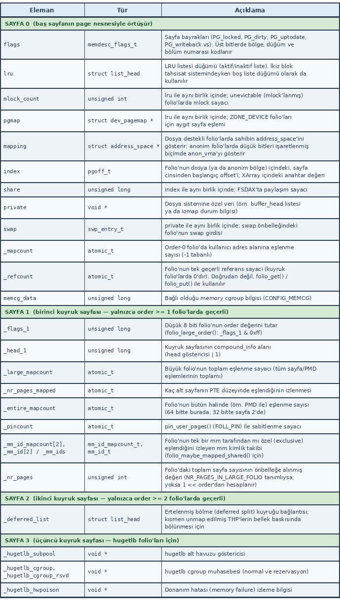

Bir ``folio`` nesnesine erişildiğinde bu ``folio`` nesnesinin kaç sayfalık önbellek birbloğunsimine ilişkin
olduğu bilgisi ``folio`` nesnesinin içerisinde bulunmaktadır. ``folio`` yapısının ``flags`` elemanı
``page`` yapısının ``flags`` elemanı ile çakışıktır. Yani bu iki eleman aynıdır. Bu eleman bitsel
olarak şöyle kodlanmıştır:

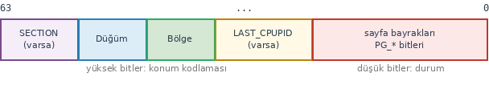

``flags`` elemanının yüksek anlamlı bitleri, sayfanın hangi bölgeye, hangi NUMA düğümüne ve hangi
bellek bölümüne ilişkin olduğu bilgisini tutmaktadır. Bu elemanın düşük anlamlı bitleri çeşitli
bayraklardan oluşmaktadır. ``PG_head`` bayrağı (6'ıncı bit) ``folio`` nesnesinin bir sayfalık bloğa
mı yoksa çok sayfalık bloğa mı ilişkin olduğu bilgisini tutmaktadır. Bu bit 1 ise ``folio`` nesnesi
bir sayfadan büyük önbellek bloğunu, 0 ise bir sayfalık önbellek bloğunu temsil etmektedir. Eğer
``folio`` nesnesi çok sayfalık bloğa ilişkinse onun düzey (order) bilgisi (ikiz blok tahsisat
sistemindeki düzeyi kastediyoruz) ``folio`` nesnesinin ikinci kısmındaki ``_flags_1`` elemanının
düşük anlamlı byte'ında kodlanmaktadır. Güncel çekirdeklerde ``folio`` nesnesinin düzey bilgisini
veren ``folio_order`` fonksiyonu ``include/linux/mm.h`` dosyasında şöyle tanımlanmıştır:

.. code-block:: c

    static inline unsigned int folio_order(struct folio *folio)
    {
        if (!folio_test_large(folio))
            return 0;
        return folio->_flags_1 & 0xff;
    }

``flags`` elemanının yüksek anlamlı bitleri, sayfanın hangi bölgeye, hangi NUMA düğümüne ve hangi
bellek bölümüne ilişkin olduğu bilgisini tutmaktadır. Bu elemanın düşük anlamlı bitleri çeşitli
bayraklardan oluşmaktadır. ``PG_head`` bayrağı (6'ıncı bit) ``folio`` nesnesinin bir sayfalık bloğa
mı yoksa çok sayfalık bloğa mı ilişkin olduğu bilgisini tutmaktadır. Bu bit 1 ise ``folio`` nesnesi
bir sayfadan büyük önbellek bloğunu, 0 ise bir sayfalık önbellek bloğunu temsil etmektedir. Eğer
``folio`` nesnesi çok sayfalık bloğa ilişkinse onun düzey (order) bilgisi (ikiz blok tahsisat
sistemindeki düzeyi kastediyoruz) ``folio`` nesnesinin ikinci kısmındaki ``_flags_1`` elemanının
düşük anlamlı byte'ında kodlanmaktadır. Güncel çekirdeklerde ``folio`` nesnesinin düzey bilgisini
veren ``folio_order`` fonksiyonu ``include/linux/mm.h`` dosyasında şöyle tanımlanmıştır:

.. code-block:: c

    static inline unsigned int folio_order(struct folio *folio)
    {
        if (!folio_test_large(folio))
            return 0;
        return folio->_flags_1 & 0xff;
    }

``folio`` yapısının ikinci kısmında bulunan ``_nr_pages`` elemanı 64 bit sistemlerde eğer ``folio``
nesnesi bir sayfadan büyük önbellek bloğuna ilişkinse doğrudan onun sayfa sayısını vermektedir.
Ancak bu eleman ``NR_PAGES_IN_LARGE_FOLIO`` makrosu define edilmişse ``folio`` içerisinde
bulunmaktadır. ``folio`` nesnesinin belirttiği önbellek bloğunun uzunluğu ``folio_nr_pages``
fonksiyonuyla elde edilebilmektedir. Bu fonksiyon güncel çekirdeklerde ``include/linux/mm.h``
dosyası içerisinde şöyle tanımlanmıştır:

.. code-block:: c

    static inline unsigned long folio_nr_pages(const struct folio *folio)
    {
        if (!folio_test_large(folio))
            return 1;
        return folio_large_nr_pages(folio);
    }

``folio_large_nr_pages`` fonksiyonu da aynı dosyada şöyle tanımlanmıştır:

.. code-block:: c

    #ifdef NR_PAGES_IN_LARGE_FOLIO
    static inline unsigned long folio_large_nr_pages(const struct folio *folio)
    {
        return folio->_nr_pages;
    }
    #else
    static inline unsigned long folio_large_nr_pages(const struct folio *folio)
    {
        return 1L << folio_large_order(folio);
    }
    #endif

Buradaki ``NR_PAGES_IN_LARGE_FOLIO`` makrosu ``folio`` yapısında ``_nr_pages`` alanının olup
olmadığını belirtmektedir. Görüldüğü gibi ``NR_PAGES_IN_LARGE_FOLIO`` makrosu define edilmemişse
``folio_large_nr_pages`` fonksiyonu bloğun düzeyini ikinci kısımdaki ``_flags_1`` elemanının düşük
anlamlı byte'ından elde etmektedir.

Sayfa Önbelleği Üzerinde İşlem Yapan Çekirdek Fonksiyonları
===========================================================

Çekirdekte sayfa önbelleği üzerinde işlemler yapan çeşitli düzeylerde fonksiyonlar bulunmaktadır.
Biz bu fonksiyonların bazılarını iomap modeliyle dosya sisteminin gerçekleştirilmesi kısmında
kullanacağız. Aşağıda önemli çekirdek fonksiyonlarını tablo halinde veriyoruz:

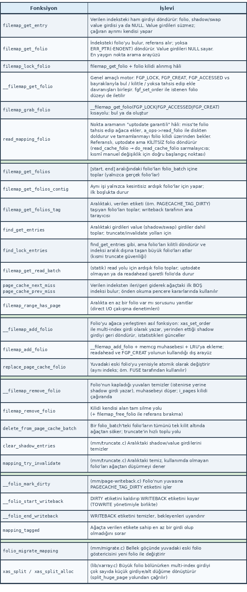

Buradaki fonksiyonların prototiplerini de veriyoruz:

.. code-block:: c

    void *filemap_get_entry(struct address_space *mapping, pgoff_t index);
    struct folio *filemap_get_folio(struct address_space *mapping, pgoff_t index);
    struct folio *filemap_lock_folio(struct address_space *mapping, pgoff_t index);
    struct folio *__filemap_get_folio(struct address_space *mapping, pgoff_t index,
            fgf_t fgp_flags, gfp_t gfp);
    struct folio *filemap_grab_folio(struct address_space *mapping, pgoff_t index);
    unsigned filemap_get_folios(struct address_space *mapping, pgoff_t *start,
            pgoff_t end, struct folio_batch *fbatch);
    unsigned filemap_get_folios_contig(struct address_space *mapping, pgoff_t *start,
            pgoff_t end, struct folio_batch *fbatch);
    unsigned filemap_get_folios_tag(struct address_space *mapping, pgoff_t *start,
            pgoff_t end, xa_mark_t tag, struct folio_batch *fbatch);
    unsigned find_get_entries(struct address_space *mapping, pgoff_t *start,
            pgoff_t end, struct folio_batch *fbatch, pgoff_t *indices);
    unsigned find_lock_entries(struct address_space *mapping, pgoff_t *start,
            pgoff_t end, struct folio_batch *fbatch, pgoff_t *indices);
    static void filemap_get_read_batch(struct address_space *mapping, pgoff_t index,
            pgoff_t max, struct folio_batch *fbatch);
    pgoff_t page_cache_next_miss(struct address_space *mapping, pgoff_t index,
            unsigned long max_scan);
    pgoff_t page_cache_prev_miss(struct address_space *mapping, pgoff_t index,
            unsigned long max_scan);
    bool filemap_range_has_page(struct address_space *mapping, loff_t start_byte,
            loff_t end_byte);
    noinline int __filemap_add_folio(struct address_space *mapping,
            struct folio *folio, pgoff_t index, gfp_t gfp, void **shadowp);
    int filemap_add_folio(struct address_space *mapping, struct folio *folio,
            pgoff_t index, gfp_t gfp);
    void replace_page_cache_folio(struct folio *old, struct folio *new);
    void __filemap_remove_folio(struct folio *folio, void *shadow);
    void filemap_remove_folio(struct folio *folio);
    void delete_from_page_cache_batch(struct address_space *mapping,
            struct folio_batch *fbatch);
    static void clear_shadow_entries(struct address_space *mapping,
            pgoff_t start, pgoff_t max);
    unsigned long mapping_try_invalidate(struct address_space *mapping,
            pgoff_t start, pgoff_t end, unsigned long *nr_failed);
    void __folio_mark_dirty(struct folio *folio, struct address_space *mapping,
            int warn);
    void __folio_start_writeback(struct folio *folio, bool keep_write);
    bool __folio_end_writeback(struct folio *folio);
    int mapping_tagged(struct address_space *mapping, xa_mark_t tag);
    int folio_migrate_mapping(struct address_space *mapping,
            struct folio *newfolio, struct folio *folio, int extra_count);
    void xas_split(struct xa_state *xas, void *entry, unsigned int order);
    void xas_split_alloc(struct xa_state *xas, void *entry,
            unsigned int order, gfp_t gfp);

Örneğin amacımız belli bir sayfa indeksine ilişkin ``folio`` nesnesinin adresini elde etmek olsun.
Bu işlemi ``filemap_get_folio`` fonksiyonuyla yapabiliriz. Fonksiyonun prototipine dikkat ediniz:

.. code-block:: c

    struct folio *filemap_get_folio(struct address_space *mapping, pgoff_t index);

Fonksiyon ``inode`` nesnesi içerisindeki ``address_space`` nesnesinin adresini ve sayfa indeksini
parametre olarak alır. Başarı durumunda ``folio`` nesnesinin adresine, başarısızlık durumunda ise
``ERR_PTR(-ENOENT)`` değerine geri döner.

Görüldüğü gibi ``folio`` nesnesinin adresi, ``folio`` nesnesinin belirttiği önbellek sanal adresi,
dosya offset'inin ``folio`` içerisindeki yeri yüksek seviyeli fonksiyonlarla kolay bir biçimde elde
edilebilmektedir. Bu fonksiyonların bazılarını izleyen paragraftaki çalışmada kullanacağız.

Dosya önbelleğindeki *XArray* ağacı üzerinde işlemler yapan fonksiyonların listesini pid aramasını
açıkladığımız bölümde vermiştik. ``folio`` nesneleri üzerinde işlem yapan alçak seviyeli çekirdek
fonksiyonlarını ve makrolarını da aşağıdaki tabloda veriyoruz:

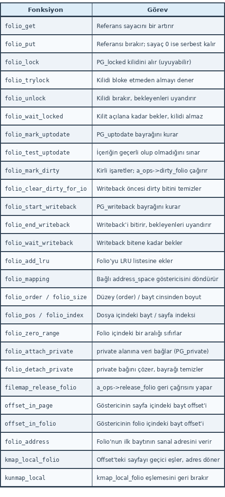

Bu fonksiyonların prototipleri ve makro tanımlamaları da şöyledir:

.. code-block:: c

    static inline void folio_get(struct folio *folio);
    void folio_put(struct folio *folio);
    static inline void folio_lock(struct folio *folio);
    static inline bool folio_trylock(struct folio *folio);
    void folio_unlock(struct folio *folio);
    static inline void folio_wait_locked(struct folio *folio);
    static inline void folio_mark_uptodate(struct folio *folio);
    static inline bool folio_test_uptodate(const struct folio *folio);
    bool folio_mark_dirty(struct folio *folio);
    bool folio_clear_dirty_for_io(struct folio *folio);
    static inline void folio_start_writeback(struct folio *folio);
    void folio_end_writeback(struct folio *folio);
    void folio_wait_writeback(struct folio *folio);
    void folio_add_lru(struct folio *folio);
    struct address_space *folio_mapping(struct folio *folio);
    static inline unsigned int folio_order(struct folio *folio);
    static inline size_t folio_size(const struct folio *folio);
    static inline loff_t folio_pos(const struct folio *folio);
    static inline pgoff_t folio_index(struct folio *folio);
    static inline void folio_zero_range(struct folio *folio, size_t start,
            size_t length);
    static inline void folio_attach_private(struct folio *folio, void *data);
    static inline void *folio_detach_private(struct folio *folio);
    bool filemap_release_folio(struct folio *folio, gfp_t gfp);
    #define offset_in_page(p)   ((unsigned long)(p) & ~PAGE_MASK)
    #define offset_in_folio(folio, p) \
            ((unsigned long)(p) & (folio_size(folio) - 1))
    static inline void *folio_address(const struct folio *folio);
    static inline void *kmap_local_folio(struct folio *folio, size_t offset);
    #define kunmap_local(__addr)   do { ... } while (0)

Sayfa Önbelleğinin Yok Edilmesi
===============================

Sayfa önbelleğinin dosyaya ilişkin ``inode`` nesnesinin içerisinde tutulduğunu gördük. Peki ``inode``
nesnesi içerisindeki bu sayfa önbelleği ne zaman yok edilmektedir? İşte anımsayacağınız gibi biz
başkalarının kullanmadığı bir dosyayı açıp kapatsak bile dosyaya ilişkin ``inode`` nesnesi inode
önbelleğinde kalmaya devam etmektedir. Bu önbellek sayfalarının sisteme iade edilmesi güncel
çekirdeklerde bellek baskısı altında ``kswapd`` isimli çekirdek thread'i yoluyla yapılmaktadır.
Bellek baskısı oluştuğunda bu çekirdek thread'i ``inode`` nesnelerinin sayfa önbelleklerini LRU
listeleri yardımıyla ikiz blok tahsisat sistemine iade etmektedir. Ancak ``inode`` nesnesine ilişkin
sayfa önbellekleri bazı işlemler sonucunda da sisteme iade edilebilmektedir. Örneğin ``truncate`` ya
da ``ftruncate`` fonksiyonlarıyla bir dosyanın uzunluğu küçültülürse ve küçültülen kısım da ``inode``
nesnesinin sayfa önbelleğindeyse o kısımlara ilişkin önbellek sayfaları ikiz blok tahsisat sistemine
iade edilmektedir.

Bellek baskısı altında sayfaların ikiz blok tahsisat sistemine (buddy allocator) iade edilmesine
"sayfa geri alımı (page reclaim)" denilmektedir. Bu geri alım işlemi bazen ``kswapd`` çekirdek
thread'ini beklemeden doğrudan da (buna "doğrudan geri alım (direct reclaim)" da denilmektedir)
yapılabilmektedir. Biz sayfa geri alımı konusunu ayrı bir başlık altında inceleyeceğiz.

Bir ``inode`` nesnesine ilişkin çok sayıda sayfa önbellekte olabilir. Bu durumda geri alım sırasında
(bu işlemi temel olarak ``kswapd`` isimli çekirdek thread'inin yaptığını belirtmiştik) son zamanlarda
en az kullanılan önbellek sayfaları öncelikle geri alınmaktadır. Çekirdek son zamanlarda en az
kullanılan ``folio`` nesnelerini ``inode`` nesnesinden hareketle tespit etmez, onları LRU bağlı
listelerinde saklar. Yani aslında çekirdek, ``inode`` nesnelerinden hareketle değil bu LRU
listelerinden hareketle sayfa önbelleğindeki sayfaları geri almaktadır.

Biz dosya sistemini incelediğimiz bölümde ``inode`` nesnelerinin de bellek baskısı oluştuğunda
sisteme iade edildiğini belirtmiştik. Ancak o zamanlar dilimli tahsisat sisteminden (slab allocator)
bahsetmemiştik. ``inode`` nesneleri aslında bu amaçla oluşturulmuş dilim önbelleklerinden tahsis
edilmektedir. Dolayısıyla bunların sisteme iade edilmesi doğrudan değil dilim önbelleği yoluyla
yapılmaktadır. Yani ``kswapd`` çekirdek thread'i inode önbelleğindeki ``inode`` nesnelerini önce
inode dilim önbelleğine iade etmekte, oradaki sayfalar da ikiz blok tahsisat sistemine iade
edilmektedir. Biz bu bilgileri sayfa geri alımı bölümünde göreceğiz.

``inode`` nesnesinin önbelleğindeki tüm sayfalar sisteme iade edilmeden ``inode`` nesnesi de inode
önbelleğinden atılmamaktadır. Bu durumda siz "sayfalarının çoğu önbellekten atılmış ancak çok azı
kalmış inode nesnelerinin önbellekten atılamayacağını" düşünebilirsiniz. Ancak genellikle bellek
baskısı altında uzun süre kullanılmayan ``inode`` nesnesine ilişkin önbellek sayfalarının hepsi
birkaç turda sisteme iade edilmektedir.

Sayfa Önbelleğine Erişime İlişkin Örnek Bir Uygulama
====================================================

Biz sayfa önbelleğinin veri yapısını ve kullanılan algoritmaları gördük. Şimdi küçük bir çalışma
yapalım. Bu çalışmada bir karakter aygıt sürücüsü oluşturalım. Karakter aygıt sürücüsünün içerisinde
``ioctl`` işlemiyle prosesin açmış olduğu bir dosyadan sayfa önbelleğini manuel bir biçimde
kullanarak okuma yapmaya çalışalım. ``ioctl`` fonksiyonuna geçirilecek okuma bilgilerini aşağıdaki
yapıyla temsil edebiliriz:

.. code-block:: c

    struct read_info {
        int fd;             /* okunacak dosyanin betimleyicisi */
        char *buf;          /* kullanici tamponunun adresi */
        size_t size;        /* okunacak bayt sayısı */
        off_t offset;       /* dosya icindeki baslangıç konumu */
        size_t count;       /* gerçekte okunan byte miktarı */
    };

Kullanacağımız ``ioctl`` kodu şöyle oluşturulmuştur:

.. code-block:: c

    #define PCACHE_DRIVER_MAGIC     'c'
    #define IOC_CACHE_READ          _IOR(PCACHE_DRIVER_MAGIC, 0, struct read_info)

Örneğin kullanıcı modundaki test programı şöyle olabilir:

.. code-block:: c

    int main(void)
    {
        int fd_dev;
        int fd_file;
        struct read_info ri;
        char buf[8192];

        if ((fd_file = open("test.txt", O_RDONLY)) == -1)
            exit_sys("open");

        if (read(fd_file, buf, 8192) == -1)      /* sayfa önbelleğine girsin diye */
            exit_sys("read");

        if ((fd_dev = open("pcache-driver", O_RDONLY)) == -1)
            exit_sys("open");

        ri.fd = fd_file;
        ri.buf = buf;
        ri.size = 10;
        ri.offset = 4090;

        if (ioctl(fd_dev, IOC_CACHE_READ, &ri) == -1)
            exit_sys("ioctl");
        buf[10] = '\0';
        printf("%s\n", buf);
        printf("bytes read: %zu\n", ri.count);

        close(fd_dev);
        close(fd_file);

        return 0;
    }

Burada biz sayfa önbelleğini manuel bir biçimde kullanarak ``test.txt`` dosyasının 4090'ıncı
offset'inden 10 byte okumak istiyoruz. Dosyanın okunacak kısmı sayfa önbelleğine çekilsin diye önce
dosyadan okuma yapılmıştır. Aygıt sürücümüzün ``ioctl`` fonksiyonu şöyle olabilir:

.. code-block:: c

    static long test_driver_ioctl(unsigned int cmd, unsigned long arg)
    {
        long result;

        printk(KERN_INFO "test_driver_ioctl...\n");

        switch (cmd) {
            case IOC_CACHE_READ:
                result = ioctl_cache_read(arg);
                break;
            default:
                result = -ENOTTY;
                break;
        }

        return result;
    }

Burada eğer ``ioctl`` kodu ``IOC_CACHE_READ`` ise işlemi ``ioctl_cache_read`` fonksiyonuna havale
ediyoruz. ``ioctl_cache_read`` fonksiyonunda ilk yapacağımız şey dosya nesnesinden hareketle
``inode`` nesnesine, ``inode`` nesnesinden hareketle de ``address_space`` nesnesine erişmektir.
Bunu şöyle yapabiliriz:

.. code-block:: c

    static long ioctl_cache_read(unsigned long arg)
    {
        struct file *filp;
        struct read_info ri;

        if (copy_from_user(&ri, (void *)arg, sizeof(struct read_info)) != 0)
            return -EFAULT;
        ri.count = 0;

        filp = fget(ri.fd);
        if (filp == NULL)
            return -EBADF;

        /* ... */

        return 0;
    }

Burada görüldüğü gibi önce ``copy_from_user`` fonksiyonu ile kullanıcı alanındaki ``read_info``
nesnesinin içeriği çekirdek alanına çekilmiştir. Sonra daha önce görmüş olduğumuz ``fget``
fonksiyonuyla dosya nesnesinin referans sayacı artırılarak dosya nesnesine erişilmiştir.

Dosya açılmış ancak ``read`` işleminde dosyaya *r* hakkı yoksa ``errno`` değerinin ``EBADF`` ile set
edildiğini anımsayınız. Bu kontrolü de aşağıdaki gibi yapabiliriz:

.. code-block:: c

    result = 0;
    if (!(filp->f_mode & FMODE_READ)) {
        result = -EBADF;
        goto EXIT;
    }

Artık dosya nesnesini kullanarak ``inode`` nesnesine erişebiliriz:

.. code-block:: c

    inode = filp->f_inode;

Bu erişimin ``file_inode`` isimli fonksiyonla da yapılabileceğini görmüştük:

.. code-block:: c

    struct inode *inode;
    /* ... */

    inode = file_inode(filp);

Fonksiyonun şöyle tanımlandığını anımsayınız:

.. code-block:: c

    static inline struct inode *file_inode(const struct file *f)
    {
        return f->f_inode;
    }

Dosya betimleyicisinin bir disk dosyasına ilişkin olduğunu doğrulamak gerekir. Çünkü örneğin bir
dizin dosyasından okuma yapmak kullanıcı için anlamlı değildir. Kontrolü şöyle yapabiliriz:

.. code-block:: c

    if (!S_ISREG(inode->i_mode)) {
        result = -EBADF;
        goto EXIT;
    }

Dosyaya ilişkin önbellek bilgilerinin ``inode`` nesnesinin ``i_mapping`` elemanında bulunduğunu
anımsayınız:

.. code-block:: c

    struct address_space *mapping;
    /* ... */

    mapping = inode->i_mapping;

Fonksiyonumuz şu duruma gelmiştir:

.. code-block:: c

    static long ioctl_cache_read(unsigned long arg)
    {
        struct file *filp;
        struct inode *inode;
        struct address_space *mapping;
        struct read_info ri;
        int result;

        if (copy_from_user(&ri, (void *)arg, sizeof(struct read_info)) != 0)
            return -EFAULT;

        filp = fget(ri.fd);
        if (!filp)
            return -EBADF;

        result = 0;
        if (!(filp->f_mode & FMODE_READ)) {
            result = -EBADF;
            goto EXIT;
        }
        inode = file_inode(filp);

        if (!S_ISREG(inode->i_mode)) {
            result = -EBADF;
            goto EXIT;
        }
        mapping = inode->i_mapping;

        /* ... */

    EXIT:
        fput(filp);
        return result;
    }

Biz ``address_space`` nesnesini elde ettik. Artık o ``address_space`` nesnesinin içerisinde
dosyanın ilgili offset'ine ilişkin sayfanın bulunup bulunmadığını anlayabiliriz ve o sayfanın
içeriğini sayfa önbelleğinden elde edebiliriz. Ancak burada çözmemiz gereken iki sorun vardır:

1. Bizim dosyadan okuyacağımız kısım tek bir önbellek sayfası içerisinde olmayabilir. Örneğin bir
   kısmı bir önbellek sayfası içerisinde diğer kısmı başka bir sayfanın içerisinde olabilir. Bu
   durumda okuma işlemini bir döngü içerisinde yapmamız gerekir.
2. Okumak istediğimiz yerin tamamı ya da bir kısmı sayfa önbelleğinde bulunmayabilir. Bu durumda
   biz işlemi kesebiliriz ya da ``kernel_read`` gibi bir çekirdek fonksiyonuyla olmayan kısmın
   çekirdek tarafından okunmasını sağlayabiliriz.

Okuma döngüsü şöyle oluşturulabilir:

.. code-block:: c

    u64 left;
    /* ... */

    left = ri.size;
    while (left > 0) {
        /* ... */
    }

Şimdi bizim döngü içerisinde öncelikle okumak istediğimiz offset'in sayfa indeksini elde etmemiz
gerekir:

.. code-block:: c

    loff_t pos, isize;
    u64 left;
    /* ... */

    pos = ri.pos;
    left = ri.size;
    while (left > 0) {
        isize = i_size_read(inode);
        if (pos >= isize)
            goto EXIT;
        index = pos >> PAGE_SHIFT;
        /* ... */
    }

Burada okuyacağımız offset dosyanın uzunluğundan büyükse döngüden çıktığımıza dikkat ediniz. Bizim
bu noktada talep ettiğimiz uzunlukla gerçekte var olan uzunluğu karşılaştırıp hangisi küçükse o
kadar okuma yapmaya çalışmamız gerekir. Bu işlemi şöyle yapabiliriz:

.. code-block:: c

    chunk = min_t(u64, left, isize - pos);

Döngümüz şu hale gelmiştir:

.. code-block:: c

    pos = ri.offset;
    left = ri.size;
    while (left > 0) {
        isize = i_size_read(inode);
        if (isize <= pos)
            break;
        index = pos >> PAGE_SHIFT;
        chunk = min_t(u64, left, isize - pos);
        /* ... */
    }

Artık bizim önbellek sayfasına ilişkin ``folio`` nesnesini elde etmemiz ve dosyanın önbellek
sayfasından okuma yapmamız gerekir. *XArray* ağacında sayfa indeksinden hareketle ``folio`` nesnesini
elde eden ``filemap_get_folio`` isimli yüksek seviyeli bir fonksiyonun bulunduğunu söylemiştik:

.. code-block:: c

    /* ... */
    folio = filemap_get_folio(mapping, index);
    if (!IS_ERR(folio)) {
        /* ... */
    }

``folio`` nesnesi elde edildiğinde önce onun güncel olup olmadığı kontrol edilmelidir. Çünkü
``folio`` nesnesi üzerinde işlemler yapılırken onun bazı elemanları değiştirilmiş olabilmekte, yani
bir ara durum oluşabilmektedir. Nesnenin güncel olup olmadığı ``flags`` elemanının ``PG_uptodate``
bayrağına bakılarak tespit edilmektedir. Zaten çekirdekte bu işlemi yapan ``folio_test_uptodate``
isimli bir fonksiyon bulunmaktadır:

.. code-block:: c

    /* ... */
    folio = filemap_get_folio(mapping, index);
    if (!IS_ERR(folio)) {
        if (folio_test_uptodate(folio)) {
            /* .. */
        }
    }

Artık ``folio`` nesnesinin gösterdiği önbellek sayfasına ilişkin (duruma göre birden fazla sayfa da
olabilir) sanal adres elde edilebilir. Dosya offset'inin karşı geldiği ``folio`` nesnesinin önbellek
bloğu içerisindeki offset değeri ``offset_in_folio`` fonksiyonuyla elde edilebilmektedir. (Bu
değerin zaten ``offset_in_page`` ile aynı olması gerektiğini düşünebilirsiniz. Ancak birden fazla
sayfadan oluşan bileşik önbellek bloklarında bu fonksiyon önbellek bloğunun uzunluğunu da dikkate
almaktadır.)

.. code-block:: c

    /* ... */
    folio = filemap_get_folio(mapping, index);
    if (!IS_ERR(folio)) {
        if (folio_test_uptodate(folio)) {
            foff = offset_in_folio(folio, pos);
            /* .. */
        }
    }

Bizim ``folio`` nesnesinin belirttiği önbellek bloğundan okuyacağımız byte miktarını tespit etmemiz
gerekir. Çünkü okunacak miktarın hepsi tespit edilen önbellek bloğunda bulunmak zorunda değildir.
``folio`` nesnesinin büyüklüğüne bağlı olarak önbellek bloğundan okunması gereken miktarı şöyle
hesaplayabiliriz:

.. code-block:: c

    chunk = min_t(u64, chunk, folio_size(folio) - foff);

Ancak burada bir noktaya da dikkatinizi çekmek istiyoruz. 32 bit sistemlerde önbellek sayfaları
HIGHMEM alanında ise sayfa tablosunda slotların da oluşturulması gerekir. Bu işlem
``kmap_local_folio`` fonksiyonuyla yapılmaktadır. Ancak bu fonksiyon 32 bit sistemlerde HIGHMEM
alanında yalnızca tek bir sayfayı eşlemektedir. O halde önbellek adresinden okuyacağımız yerin
HIGHMEM bölgesinde olup olmadığını tespit edip okuma miktarını ona göre hesaplamalıyız:

.. code-block:: c

    if (folio_test_highmem(folio))
        chunk = min_t(size_t, chunk, PAGE_SIZE - offset_in_page(pos));
    else
        chunk = min_t(u64, chunk, folio_size(folio) - foff);

Buradaki ``folio_test_highmem`` fonksiyonu ``folio`` nesnesinin belirttiği önbellek bloğunun
HIGHMEM içerisinde olup olmadığına bakmaktadır. ``offset_in_page`` makrosu ise verilen bir
offset'in sayfa büyüklüğüne bölümünden kalanı bulmaktadır. ``include/linux/mm.h`` dosyası
içerisinde şöyle tanımlanmıştır:

.. code-block:: c

    #define offset_in_page(p)   ((unsigned long)(p) & ~PAGE_MASK)

Artık ``kmap_local_folio`` fonksiyonu ile önbellek bloğunda erişeceğimiz yerin sanal adresini elde
edebiliriz. ``kmap_local_folio`` fonksiyonu 32 bit sistemlerde HIGHMEM durumunu da göz önünde
bulundurmaktadır. Yani gerektiğinde HIGHMEM alanına erişmek için sayfa tablosunda slot da
oluşturmaktadır. 64 bit sistemlerde zaten HIGHMEM biçiminde bir bölgenin olmadığını anımsayınız:

.. code-block:: c

    offaddr = kmap_local_folio(folio, foff);

Kodumuz şu hale gelmiştir:

.. code-block:: c

    /* ... */
    folio = filemap_get_folio(mapping, index);
    if (!IS_ERR(folio)) {
        foff = offset_in_folio(folio, pos);
        if (folio_test_highmem(folio))
            chunk = min_t(u64, chunk, PAGE_SIZE - offset_in_page(pos));
        else
            chunk = min_t(u64, chunk, folio_size(folio) - foff);
        offaddr = kmap_local_folio(folio, foff);

Bu noktada artık biz dosyada okumak istediğimiz yerin önbellek bloğundaki yerini ve o bloktan
transfer edilecek byte uzunluğunu tespit etmiş olduk. Bu kısmı kullanıcı modundaki alana
kopyalayabiliriz. Bu kopyalama işleminden sonra artık ``left``, ``ri.count``, ``pos`` ve ``ri.buf``
değerlerini güncellemeliyiz. Çünkü birden fazla sayfaya yayılmış olan bilgilerin okunması sırasında
diğer sayfalara geçmek için bu değişkenlerin güncellenmesi gerekmektedir:

.. code-block:: c

    /* ... */
    folio = filemap_get_folio(mapping, index);
    if (!IS_ERR(folio)) {
        foff = offset_in_folio(folio, pos);
        if (folio_test_highmem(folio))
            chunk = min_t(u64, chunk, PAGE_SIZE - offset_in_page(pos));
        else
            chunk = min_t(u64, chunk, folio_size(folio) - foff);
        offaddr = kmap_local_folio(folio, foff);

        if (copy_to_user(ri.buf, offaddr, chunk) != 0) {
            kunmap_local(offaddr);
            folio_put(folio);
            result = -EFAULT;
            goto EXIT;
        }
        kunmap_local(offaddr);
        left -= chunk;
        ri.count += chunk;
        pos += chunk;
        ri.buf += chunk;
        folio_put(folio);
    }
    else
        goto EXIT;

``if`` deyiminin ``else`` kısmına dikkat ediniz. Eğer dosyanın ilgili kısmı sayfa önbelleğinde
yoksa okunabilen kadar bilgi okunup okuma işlemi hemen sonlandırılmaktadır. Buradaki ``ioctl``
kodunda birden fazla akışın bu işlemi aynı anda yaptığı bir durumda bir senkronizasyon sorunu
oluşmayacaktır. Çünkü buradaki kodda ağırlıklı olarak zaten yerel değişkenler kullanılmıştır.

Yukarıdaki örneği bir bütün olarak aşağıda veriyoruz. Örneğimizde test kodunda ``test.txt`` isimli
bir dosyayı açıp onun ilk 8192 byte'lık kısmı sayfa önbelleğine girsin diye bir okuma yaptık. Yine
önce aygıt sürücüyü aşağıdaki gibi derlemelisiniz:

.. code-block:: bash

    $ make file=pcache-driver

Sonra ``load`` betiği ile yüklemelisiniz:

.. code-block:: bash

    $ sudo ./load pcache-driver

Test programını da şöyle derleyebilirsiniz:

.. code-block:: bash

    $ gcc -Wall -o pcache-driver-test pcache-driver-test.c

Test programını şöyle çalıştırabilirsiniz:

.. code-block:: bash

    $ ./pcache-driver-test

Test işlemi bittikten sonra aygıt sürücüyü ``unload`` betiği ile sistemden atabilirsiniz:

.. code-block:: bash

    $ sudo ./unload pcache-driver

``pcache-driver.h``

.. code-block:: c
  
    #ifndef PCACHE_DRIVER_H_
    #define PCACHE_DRIVER_H_

    #include <linux/stddef.h>
    #include <linux/ioctl.h>

    struct read_info {
        int fd;             /* okunacak dosyanin betimleyicisi */
        char *buf;           /* kullanici tamponunun adresi */
        size_t size;         /* okunacak bayt sayısı */
        off_t offset;        /* dosya icindeki baslangıç konumu */
        size_t count;        /* gerçekte okunan byte miktarı */
    };

    #define PCACHE_DRIVER_MAGIC     'c'
    #define IOC_CACHE_READ          _IOR(PCACHE_DRIVER_MAGIC, 0, struct read_info)

    #endif

``pcache-driver.c```

.. code-block:: c

    #include <linux/module.h>
    #include <linux/kernel.h>
    #include <linux/fs.h>
    #include <linux/cdev.h>
    #include <linux/fdtable.h>
    #include <linux/file.h>
    #include <linux/pagemap.h>
    #include "pcache-driver.h"

    MODULE_LICENSE("GPL");
    MODULE_AUTHOR("Kaan Aslan");
    MODULE_DESCRIPTION("pcache-driver");

    static long test_driver_ioctl(struct file *filp, unsigned int cmd, unsigned long arg);

    static long ioctl_cache_read(unsigned long arg);

    static dev_t g_dev;
    static struct cdev g_cdev;
    static struct file_operations g_fops = {
        .owner = THIS_MODULE,
        .unlocked_ioctl = test_driver_ioctl
    };

    static int __init test_driver_init(void)
    {
        int result;

        printk(KERN_INFO "pcache-driver module initialization...\n");

        if ((result = alloc_chrdev_region(&g_dev, 0, 1, "pcache-driver")) < 0) {
            printk(KERN_INFO "cannot alloc char driver!...\n");
            return result;
        }
        cdev_init(&g_cdev, &g_fops);
        if ((result = cdev_add(&g_cdev, g_dev, 1)) < 0) {
            unregister_chrdev_region(g_dev, 1);
            printk(KERN_ERR "cannot add device!...\n");
            return result;
        }

        return 0;
    }

    static void __exit test_driver_exit(void)
    {
        cdev_del(&g_cdev);
        unregister_chrdev_region(g_dev, 1);

        printk(KERN_INFO "pcache-driver module exit...\n");
    }

    static long test_driver_ioctl(struct file *filp, unsigned int cmd, unsigned long arg)
    {
        long result;

        printk(KERN_INFO "test_driver_ioctl...\n");

        switch (cmd) {
            case IOC_CACHE_READ:
                result = ioctl_cache_read(arg);
                break;
            default:
                result = -ENOTTY;
                break;
        }

        return result;
    }

    static long ioctl_cache_read(unsigned long arg)
    {
        struct file *filp;
        struct inode *inode;
        struct address_space *mapping;
        struct folio *folio;
        struct read_info ri;
        pgoff_t index;
        loff_t pos, isize;
        u64 left, chunk;
        size_t foff;
        void *offaddr;
        int result;

        if (copy_from_user(&ri, (void *)arg, sizeof(struct read_info)) != 0)
            return -EFAULT;
        ri.count = 0;

        filp = fget(ri.fd);
        if (!filp)
            return -EBADF;

        result = 0;
        if (!(filp->f_mode & FMODE_READ)) {
            result = -EBADF;
            goto EXIT;
        }
        inode = file_inode(filp);

        if (!S_ISREG(inode->i_mode)) {
            result = -EBADF;
            goto EXIT;
        }
        mapping = inode->i_mapping;

        pos = ri.offset;
        left = ri.size;

        while (left > 0) {
            isize = i_size_read(inode);
            if (pos >= isize)
                goto EXIT;

            index = pos >> PAGE_SHIFT;
            chunk = min_t(u64, left, isize - pos);

            folio = filemap_get_folio(mapping, index);
            if (!IS_ERR(folio)) {
                foff = offset_in_folio(folio, pos);
                if (folio_test_highmem(folio))
                    chunk = min_t(u64, chunk, PAGE_SIZE - offset_in_page(pos));
                else
                    chunk = min_t(u64, chunk, folio_size(folio) - foff);

                offaddr = kmap_local_folio(folio, foff);

                if (copy_to_user(ri.buf, offaddr, chunk) != 0) {
                    kunmap_local(offaddr);
                    folio_put(folio);
                    result = -EFAULT;
                    goto EXIT;
                }
                kunmap_local(offaddr);
                left -= chunk;
                ri.count += chunk;
                pos += chunk;
                ri.buf += chunk;
                folio_put(folio);
            }
            else
                goto EXIT;
        }

        if (copy_to_user((void *)arg, &ri, sizeof(struct read_info)) != 0)
            result = -EFAULT;
    EXIT:
        fput(filp);
        return result;
    }

    module_init(test_driver_init);
    module_exit(test_driver_exit);

``Makefile``

.. code-block:: makefile

    obj-m += ${file}.o

    all:
        make -C /lib/modules/$(shell uname -r)/build M=${PWD} modules
    clean:
        make -C /lib/modules/$(shell uname -r)/build M=${PWD} clean

``load```

.. code-block:: bash

    #!/bin/bash

    module=$1
    mode=666

    /sbin/insmod ./${module}.ko ${@:2} || exit 1
    major=$(awk "\$2 == \"$module\" {print \$1}" /proc/devices)
    rm -f $module
    mknod -m $mode $module c $major 0

``unload`` 

.. code-block:: bash

    #!/bin/bash

    module=$1

    /sbin/rmmod ./${module}.ko || exit 1
    rm -f $module
   
``pcache-driver-test.c``

.. code-block:: c

    #include <stdio.h>
    #include <stdlib.h>
    #include <fcntl.h>
    #include <unistd.h>
    #include <sys/ioctl.h>
    #include "pcache-driver.h"

    void exit_sys(const char *msg);

    int main(void)
    {
        int fd_dev;
        int fd_file;
        struct read_info ri;
        char buf[8192];

        if ((fd_file = open("test.txt", O_RDONLY)) == -1)
            exit_sys("open");

        read(fd_file, buf, 8192);

        if ((fd_dev = open("pcache-driver", O_RDONLY)) == -1)
            exit_sys("open");

        ri.fd = fd_file;
        ri.buf = buf;
        ri.size = 10;
        ri.offset = 4090;

        if (ioctl(fd_dev, IOC_CACHE_READ, &ri) == -1)
            exit_sys("ioctl");
        buf[10] = '\0';
        printf("%s\n", buf);
        printf("bytes read: %zu\n", ri.count);

        close(fd_dev);
        close(fd_file);

        return 0;
    }

    void exit_sys(const char *msg)
    {
        perror(msg);
        exit(EXIT_FAILURE);
    }

Yukarıdaki örnekte biz önbellekte olmayan bir sayfayla karşılaşıldığında işlemi sonlandırdık.
Alternatif olarak önbellekte olmayan bir sayfayla karşılaşıldığında çekirdeğin yaptığı okuma
işleminin benzeri ``kernel_read`` fonksiyonuyla yapılarak sayfanın önbelleğe çekilmesi de
sağlanabilir. ``kernel_read`` fonksiyonu belli bir offset'ten itibaren belli bir tampona okuma yapan
yüksek seviyeli bir çekirdek fonksiyonudur. Bu fonksiyon önce dosyadaki verileri sayfa önbelleğine
çekip sonra aynı zamanda parametresiyle belirtilen tampona da kopyalamaktadır. ``kernel_read``
fonksiyonunun prototipi şöyledir:

.. code-block:: c

    ssize_t kernel_read(struct file *file, void *buf, size_t count, loff_t *pos);

Fonksiyonun birinci parametresi dosya nesnesinin adresini, ikinci parametresi tamponun adresini,
üçüncü parametresi okunacak byte miktarını ve dördüncü parametresi okunacak dosya offset'inin
yerleştirileceği nesnenin adresini belirtmektedir. Bu offset okumadan sonra güncellenmektedir.
Fonksiyon başarı durumunda okunan byte sayısına, başarısızlık durumunda negatif ``errno`` değerine
geri dönmektedir.

Sayfa önbelleğinde olmayan kısımların ``kernel_read`` fonksiyonu ile okunmasını sağlayan kodu aygıt
sürücümüze eklediğimizde aygıt sürücümüzdeki ana döngü şu hale gelmektedir:

.. code-block:: c

    while (left > 0) {
        isize = i_size_read(inode);
        if (pos >= isize)
            goto EXIT;

        index = pos >> PAGE_SHIFT;
        chunk = min_t(u64, left, isize - pos);

        folio = filemap_get_folio(mapping, index);
        if (!IS_ERR(folio)) {
            printk(KERN_INFO "cache hit...\n");

            foff = offset_in_folio(folio, pos);
            if (folio_test_highmem(folio))
                chunk = min_t(u64, chunk, PAGE_SIZE - offset_in_page(pos));
            else
                chunk = min_t(u64, chunk, folio_size(folio) - foff);

            offaddr = kmap_local_folio(folio, foff);

            if (copy_to_user(ri.buf, offaddr, chunk) != 0) {
                kunmap_local(offaddr);
                folio_put(folio);
                result = -EFAULT;
                goto EXIT;
            }
            kunmap_local(offaddr);
            folio_put(folio);
        }
        else {                  /* önbellekte yoksa */
            ssize_t n;
            loff_t rpos = pos;

            printk(KERN_INFO "cache miss...\n");

            if (kbuf == NULL) {
                struct page *pg;

                if ((pg = alloc_pages(GFP_KERNEL, 0)) == NULL) {
                        result = -ENOMEM;
                        goto EXIT;
                }
                kbuf = page_address(pg);
            }
            if ((n = kernel_read(filp, kbuf, chunk, &rpos)) < 0) {
                free_page((unsigned long)kbuf);
                result = n;
                goto EXIT;
            }
            if (n == 0)          /* EOF */
                break;

            if (copy_to_user(ri.buf, kbuf, n)) {
                free_page((unsigned long)kbuf);
                result = -EFAULT;
                goto EXIT;
            }
            chunk = n;
        }
        left -= chunk;
        ri.count += chunk;
        pos += chunk;
        ri.buf += chunk;
    }

Burada ``if`` deyiminin ``else`` kısmına dikkat ediniz:

.. code-block:: c

    if (!IS_ERR(folio)) {
        /* ... */
    }
    else {                  /* önbellekte yoksa */
        ssize_t n;
        loff_t rpos = pos;

        printk(KERN_INFO "cache miss...\n");

        if (kbuf == NULL) {
            struct page *pg;

            if ((pg = alloc_pages(GFP_KERNEL, 0)) == NULL) {
                    result = -ENOMEM;
                    goto EXIT;
            }
            kbuf = page_address(pg);
        }
        if ((n = kernel_read(filp, kbuf, chunk, &rpos)) < 0) {
            free_page((unsigned long)kbuf);
            result = n;
            goto EXIT;
        }
        if (n == 0)          /* EOF */
            break;

        if (copy_to_user(ri.buf, kbuf, n)) {
            free_page((unsigned long)kbuf);
            result = -EFAULT;
            goto EXIT;
        }
        chunk = n;
    }

``kernel_read`` çağrısından önce okunacak bilgilerin yerleştirileceği bir sayfa ``alloc_pages``
fonksiyonuyla tahsis edilmiştir. Sonra ``page_address`` fonksiyonu ile onun sanal adresi elde
edilmiştir. Sonra da ``kernel_read`` fonksiyonu uygulanmıştır. Yukarıda da belirttiğimiz gibi
``kernel_read`` fonksiyonu hem okunanları sayfa önbelleğine yerleştirmekte hem de bizim verdiğimiz
adrese kopyalamaktadır. Biz de doğrudan ``copy_to_user`` fonksiyonu ile okunan bilgileri kullanıcı
alanına kopyaladık. Ayrıca kodda ``folio`` bulunduğu zaman "cache hit", bulunamadığı zaman "cache
miss" mesajlarının log olarak yazdırıldığını görüyorsunuz. ``dmesg`` komutuyla bu mesajları
görüntüleyebilirsiniz. Test kodunda önce sayfa önbelleğinde olmayan kısmı okuyup sonra okunan kısmı
yeniden okuyabiliriz. Böylece mekanizmanın çalışıp çalışmadığını kontrol edebiliriz:

.. code-block:: c

    ri.fd = fd_file;
    ri.buf = buf;
    ri.size = 10;
    ri.offset = 4090;

    if (ioctl(fd_dev, IOC_CACHE_READ, &ri) == -1)
        exit_sys("ioctl");
    buf[10] = '\0';
    printf("%s\n", buf);
    printf("bytes read: %zu\n", ri.count);

    ri.fd = fd_file;
    ri.buf = buf;
    ri.size = 10;
    ri.offset = 4090;

    if (ioctl(fd_dev, IOC_CACHE_READ, &ri) == -1)
        exit_sys("ioctl");
    buf[10] = '\0';
    printf("%s\n", buf);
    printf("bytes read: %zu\n", ri.count);

``pcache-driver.h``

.. code-block:: c

    #ifndef PCACHE_DRIVER_H_
    #define PCACHE_DRIVER_H_

    #include <linux/stddef.h>
    #include <linux/ioctl.h>

    struct read_info {
        int fd;             /* okunacak dosyanin betimleyicisi */
        char *buf;           /* kullanici tamponunun adresi */
        size_t size;         /* okunacak bayt sayısı */
        off_t offset;        /* dosya icindeki baslangıç konumu */
        size_t count;        /* gerçekte okunan byte miktarı */
    };

    #define PCACHE_DRIVER_MAGIC     'c'
    #define IOC_CACHE_READ          _IOR(PCACHE_DRIVER_MAGIC, 0, struct read_info)

    #endif

``pcache-driver.c``

.. code-block:: c

    #include <linux/module.h>
    #include <linux/kernel.h>
    #include <linux/fs.h>
    #include <linux/cdev.h>
    #include <linux/fdtable.h>
    #include <linux/file.h>
    #include <linux/pagemap.h>
    #include "pcache-driver.h"

    MODULE_LICENSE("GPL");
    MODULE_AUTHOR("Kaan Aslan");
    MODULE_DESCRIPTION("pcache-driver");

    static long test_driver_ioctl(struct file *filp, unsigned int cmd, unsigned long arg);

    static long ioctl_cache_read(unsigned long arg);

    static dev_t g_dev;
    static struct cdev g_cdev;
    static struct file_operations g_fops = {
        .owner = THIS_MODULE,
        .unlocked_ioctl = test_driver_ioctl
    };

    static int __init test_driver_init(void)
    {
        int result;

        printk(KERN_INFO "pcache-driver module initialization...\n");

        if ((result = alloc_chrdev_region(&g_dev, 0, 1, "pcache-driver")) < 0) {
            printk(KERN_INFO "cannot alloc char driver!...\n");
            return result;
        }
        cdev_init(&g_cdev, &g_fops);
        if ((result = cdev_add(&g_cdev, g_dev, 1)) < 0) {
            unregister_chrdev_region(g_dev, 1);
            printk(KERN_ERR "cannot add device!...\n");
            return result;
        }

        return 0;
    }

    static void __exit test_driver_exit(void)
    {
        cdev_del(&g_cdev);
        unregister_chrdev_region(g_dev, 1);

        printk(KERN_INFO "pcache-driver module exit...\n");
    }

    static long test_driver_ioctl(struct file *filp, unsigned int cmd, unsigned long arg)
    {
        long result;

        printk(KERN_INFO "test_driver_ioctl...\n");

        switch (cmd) {
            case IOC_CACHE_READ:
                result = ioctl_cache_read(arg);
                break;
            default:
                result = -ENOTTY;
                break;
        }

        return result;
    }

    static long ioctl_cache_read(unsigned long arg)
    {
        struct file *filp;
        struct inode *inode;
        struct address_space *mapping;
        struct folio *folio;
        struct read_info ri;
        pgoff_t index;
        loff_t pos, isize;
        u64 left, chunk;
        size_t foff;
        void *offaddr;
        void *kbuf;
        int result;

        if (copy_from_user(&ri, (void *)arg, sizeof(struct read_info)) != 0)
            return -EFAULT;
        ri.count = 0;

        filp = fget(ri.fd);
        if (!filp)
            return -EBADF;

        result = 0;
        if (!(filp->f_mode & FMODE_READ)) {
            result = -EBADF;
            goto EXIT;
        }
        inode = file_inode(filp);

        if (!S_ISREG(inode->i_mode)) {
            result = -EBADF;
            goto EXIT;
        }
        mapping = inode->i_mapping;

        pos = ri.offset;
        left = ri.size;

        while (left > 0) {
            isize = i_size_read(inode);
            if (pos >= isize)
                goto EXIT;

            index = pos >> PAGE_SHIFT;
            chunk = min_t(u64, left, isize - pos);

            folio = filemap_get_folio(mapping, index);
            if (!IS_ERR(folio)) {
                printk(KERN_INFO "cache hit...\n");

                foff = offset_in_folio(folio, pos);
                if (folio_test_highmem(folio))
                    chunk = min_t(u64, chunk, PAGE_SIZE - offset_in_page(pos));
                else
                    chunk = min_t(u64, chunk, folio_size(folio) - foff);

                offaddr = kmap_local_folio(folio, foff);

                if (copy_to_user(ri.buf, offaddr, chunk) != 0) {
                    kunmap_local(offaddr);
                    folio_put(folio);
                    result = -EFAULT;
                    goto EXIT;
                }
                kunmap_local(offaddr);
                folio_put(folio);
            }
            else {                  /* önbellekte yoksa */
                ssize_t n;
                loff_t rpos = pos;

                printk(KERN_INFO "cache miss...\n");

                if (kbuf == NULL) {
                    struct page *pg;

                    if ((pg = alloc_pages(GFP_KERNEL, 0)) == NULL) {
                            result = -ENOMEM;
                            goto EXIT;
                    }
                    kbuf = page_address(pg);
                }
                if ((n = kernel_read(filp, kbuf, chunk, &rpos)) < 0) {
                    free_page((unsigned long)kbuf);
                    result = n;
                    goto EXIT;
                }
                if (n == 0)          /* EOF */
                    break;

                if (copy_to_user(ri.buf, kbuf, n)) {
                    free_page((unsigned long)kbuf);
                    result = -EFAULT;
                    goto EXIT;
                }
                chunk = n;
            }
            left -= chunk;
            ri.count += chunk;
            pos += chunk;
            ri.buf += chunk;
        }

        if (copy_to_user((void *)arg, &ri, sizeof(struct read_info)) != 0)
            result = -EFAULT;
    EXIT:

        fput(filp);
        return result;
    }

    module_init(test_driver_init);
    module_exit(test_driver_exit);

``Makefile``

.. code-block:: makefile

    obj-m += ${file}.o

    all:
        make -C /lib/modules/$(shell uname -r)/build M=${PWD} modules
    clean:
        make -C /lib/modules/$(shell uname -r)/build M=${PWD} clean

``load`` 

.. code-block:: bash

    #!/bin/bash

    module=$1
    mode=666

    /sbin/insmod ./${module}.ko ${@:2} || exit 1
    major=$(awk "\$2 == \"$module\" {print \$1}" /proc/devices)
    rm -f $module
    mknod -m $mode $module c $major 0

``unload``

.. code-block:: bash

    #!/bin/bash

    module=$1

    /sbin/rmmod ./${module}.ko || exit 1
    rm -f $module

``pcache-driver-test.c``

.. code-block:: c

    #include <stdio.h>
    #include <stdlib.h>
    #include <fcntl.h>
    #include <unistd.h>
    #include <sys/ioctl.h>
    #include "pcache-driver.h"

    void exit_sys(const char *msg);

    int main(void)
    {
        int fd_dev;
        int fd_file;
        struct read_info ri;
        char buf[10 + 1];

        if ((fd_file = open("test.txt", O_RDONLY)) == -1)
            exit_sys("open");

        if ((fd_dev = open("pcache-driver", O_RDONLY)) == -1)
            exit_sys("open");

        ri.fd = fd_file;
        ri.buf = buf;
        ri.size = 10;
        ri.offset = 4090;

        if (ioctl(fd_dev, IOC_CACHE_READ, &ri) == -1)
            exit_sys("ioctl");
        buf[10] = '\0';
        printf("%s\n", buf);
        printf("bytes read: %zu\n", ri.count);

        ri.fd = fd_file;
        ri.buf = buf;
        ri.size = 10;
        ri.offset = 4090;

        if (ioctl(fd_dev, IOC_CACHE_READ, &ri) == -1)
            exit_sys("ioctl");
        buf[10] = '\0';
        printf("%s\n", buf);
        printf("bytes read: %zu\n", ri.count);

        close(fd_dev);
        close(fd_file);

        return 0;
    }

    void exit_sys(const char *msg)
    {
        perror(msg);
        exit(EXIT_FAILURE);
    }

Sayfa Önbelleğinin Yazma İşlemlerinde Kullanımı
===============================================


