====================
**Sayfa Geri Alımı**
====================

Bu bölümde ``alloc_pages`` gibi fonksiyonlarla tahsis edilen sayfaların çekirdek tarafından geri alınması sürecini
inceleyeceğiz. Bu konuya genel olarak *sayfa geri alımı (page reclaim)* denilmektedir. Linux çekirdeğinde zaman 
içerisinde sayfa geri alım mekanizması üzerinde sürekli iyileştirmeler yapılmıştır. Biz kursumuzda güncel çekirdeklerdeki g
eri alım mekanizmasını esas alacağız. Aşağıdaki tabloda geri alım mekanizması üzerinde yapılan iyileştirmeleri kronolojik 
bir sıra içerisinde veriyoruz:

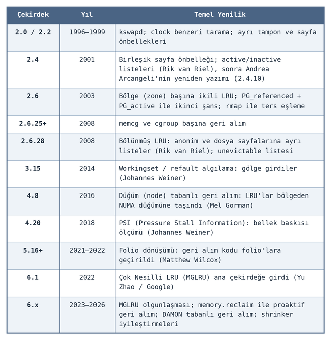

Geri Alınabilen ve Geri Alınamayan Sayfalar
===========================================

Çekirdek daha önce incelemiş olduğumuz sayfa önbelleğindeki, ``inode`` ve ``dentry`` önbelleklerindeki sayfaları
bellek baskısı oluşmadan geri almamaktadır. Örneğin bir dosyadan okuma yaptığımızı düşünelim. Dosyadan okunan
bloklar sayfa tahsis edilerek sayfa önbelleğine yerleştirilir. Dosya kapatıldığında dosyaya ilişkin ``inode``
nesnesi ``inode`` önbelleğinde kalmaya, ``inode`` nesnesine ilişkin sayfa önbelleğindeki sayfalar da sayfa
önbelleğinde kalmaya devam eder. Sistem hiçbir sorun yokken yani bellek bolken önbelleklerdeki sayfaları geri almaya
çalışmaz. Gereksiz geri alımın kimseye bir faydası yoktur.

Linux çekirdeğinde geri alıma konu olan önbellekleri aşağıdaki tabloda veriyoruz:

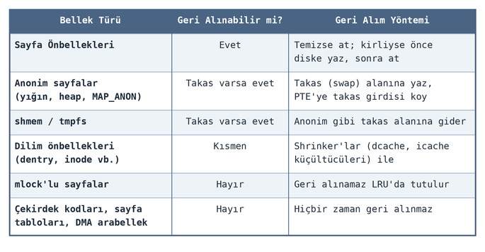

Anımsayacağınız gibi Linux'un tahsisat mekanizması fiziksel belleği düğümlere (*nodes*), düğümleri bölgelere (*zones*) 
ve bölgelerdeki ikiz blok düzey listeleri de "göç türlerine (migration types)" ayırıyordu. İkiz blok tahsisat sistemleri 
göç türlerinin içerisindeydi. Ancak sayfa tahsis edilmek istendiğinde *fallback* mekanizması devreye giriyor, bu
mekanizma belli bir bölge ve göç türünden başlayarak önce göç türlerini, sonra bölgeleri, sonra da düğümleri
tarıyordu. Ayrıca çekirdeğin her düğümdeki toplam boş sayfaların sayısını (yani o bölgenin her göç türündeki toplam boş
sayfaların sayısını) da tuttuğunu anımsayınız. (Göç türleri için toplam boş sayfalar çekirdek tarafından
tutulmamaktadır.)

Geri Alım Mekanizması
=====================

Güncel Linux çekirdeklerinde geri alım (*reclaim*) işlemi iki biçimde yapılmaktadır:

| **1.** ``kswapd`` çekirdek thread'i yoluyla
| **2.** Doğrudan tahsisat işleminin kendi akışında (*direct reclaim*)

Linux çekirdeği düğümlerdeki her bölgedeki boş sayfalar için dört *"su seviyesi (watermark)"* tutmaktadır:

.. code-block:: c

    WMARK_PROMO
    WMARK_HIGH
    WMARK_LOW
    WMARK_MIN

Normal durumda genellikle bölgedeki boş sayfaların sayısı ``WMARK_LOW`` ile ``WMARK_HIGH`` arasında olur. Bölgeden
(bölgenin göç türlerinden) sayfa tahsis edildikçe boş sayfaların sayısı azalır. Nihayet ``WMARK_LOW`` sınırına
ulaşır. ``alloc_pages`` gibi sayfa tahsisat fonksiyonları bir bölgedeki boş sayfa sayısı ``WMARK_LOW`` sınırına
düştüğünde (ya da o bölgedeki parçalanmadan dolayı istenilen düzeyde yer bulamayınca) artık o bölgeden tahsisat
yapmayıp *fallback* sürecinde diğer bölgelere geçer. Anımsanacağı gibi bir düğümün bölgeleri bittikten sonra tarama
diğer düğümlerin bölgeleri ile devam etmektedir. Eğer tarama sonunda hiçbir bölgeden tahsisat yapılamamışsa (bunun
sebebi boş sayfa sayısının ``WMARK_LOW`` eşiğinin altına düşmesi olabileceği gibi, parçalanma nedeniyle istenen
düzey büyüklüğünde serbest blok kalmamış olması ya da *cpuset*/kirli sayfa kotası gibi başka nedenler de olabilir)
bu durumda *"yavaş yola"* girilir ve *fallback* listesindeki düğümlerin ``kswapd`` thread'leri uyandırılır.
Çekirdek kodlarında *fallback* listesindeki düğümlerin bölgelerinden tahsisat yapılamadığında girilen yola *"yavaş
yol (slow path)"* de denilmektedir. ``kswapd`` çekirdek thread'inin bu bölgeleri doldurup boş sayfa sayılarını
``WMARK_HIGH`` seviyesinin yukarısına taşıma girişimi zaman alabilmektedir. İşte tahsisatı yapmak isteyen kod
(örneğin tipik olarak ``alloc_pages`` fonksiyonu) *fallback* listesindeki tüm düğümlerin tüm bölgelerinden tahsisat
yapamadığı durumda düğümlerin ``kswapd`` thread'lerini uyandırdıktan sonra kontrol seviyesini ``WMARK_MIN``
seviyesine indirerek gevşetilmiş kısıtlarla yeniden tarama yapmaktadır. Yani bu durumda arka planda ``kswapd``
thread'leri çalışmaktadır fakat tahsisatı yapmak isteyen akış artık ``WMARK_MIN`` seviyesini temel alarak tarama
işlemini yeniden yapmaktadır. Muhtemelen boş sayfa miktarı ``WMARK_LOW`` seviyesinin altında kalan fakat
``WMARK_MIN`` seviyesinin yukarısında kalan bölgeler vardır. Tahsisat artık bu bölgelerden yapılır. Peki düğümlerin
bölgelerindeki boş sayfa sayıları ``WMARK_MIN`` seviyesinin de altına düşmüşse ne olur? ``kswapd`` thread'lerinin
su seviyesini henüz yükseltemediğini varsayalım. İşte bu durumda tahsisat akışı artık ``kswapd``'yi beklemez ve geri
alımı kendisi üstlenir; buna *doğrudan geri alım (direct reclaim)* denir. Doğrudan geri alımda tahsisatı yapan
thread uyutulup başkası tarafından uyandırılmaz, geri alımı bizzat yürütür. 

Doğrudan geri alım işlemi bazı durumlarda hiç yapılmamaktadır. Örneğin ``GFP_ATOMIC`` bayrağı ile tahsisat
yapılırken doğrudan geri alım kodu çalıştırılmadan fonksiyon başarısızlıkla geri döndürülmektedir. Doğrudan geri
alım aynı zamanda *"ben uyuyabilirim"* anlamına gelmektedir. Doğrudan geri alım koduna girilebilmesi için tahsisat
fonksiyonlarında ``__GFP_DIRECT_RECLAIM`` bayrağının bulunuyor olması gerekir. Anımsanacağı gibi ``__GFP_RECLAIM``
bileşik bayrağı ``__GFP_DIRECT_RECLAIM`` bayrağını, ``GFP_KERNEL`` bayrağı da ``__GFP_RECLAIM`` bayrağını
barındırmaktadır. Yani en çok kullanılan bileşke bayrak olan ``GFP_KERNEL`` doğrudan geri alıma izin vermektedir.
Anımsatma amacıyla bileşke bayrakların listesini yeniden veriyoruz:

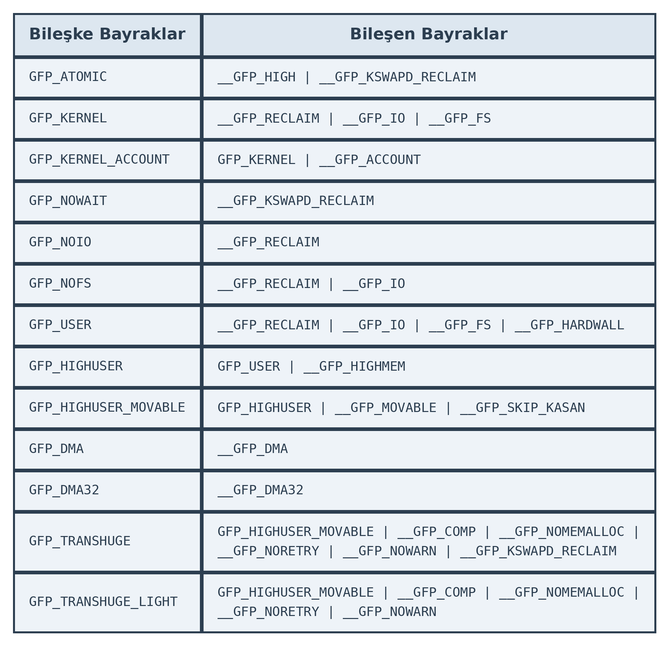

Peki ``kswapd`` çekirdek thread'leri önbelleklerden ne kadar sayfa koparacaktır? İşte ``WMARK_HIGH`` seviyesi bunu
belirtmektedir. ``kswapd`` bölgeleri doldururken boş sayfa sayıları ``WMARK_HIGH`` seviyesine geldiğinde bunu yeterli
görür daha fazla doldurma yapmaz. Çekirdeğin 5.18 (Mart 2022) versiyonuyla birlikte ``WMARK_PROMO`` denilen bir
seviye de eklenmiştir. ``kswapd`` çekirdek thread'i bazı koşullarda ``WMARK_HIGH`` seviyesinde değil
``WMARK_PROMO`` seviyesinde durmaktadır. Su seviyelerini aşağıdaki şekille de özetlemek istiyoruz:

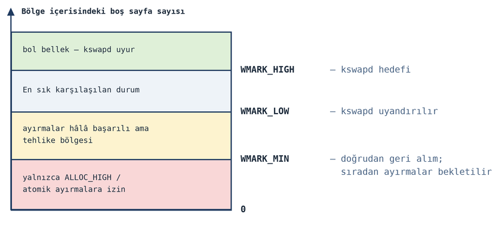

Yukarıdaki sürecin bazı ayrıntıları da vardır. Biz yukarıda tüm düğümlerdeki bölgelerde ``WMARK_MIN`` seviyesinin
aşağısına düşüldüğünde doğrudan geri alım uygulandığını belirtmiştik. Ancak bazı koşullarda doğrudan geri alım
uygulanmadan ``WMARK_MIN`` seviyesinin de aşağısına inilebilmektedir. Bu konudaki davranış sayfa tahsis edilirken
kullanılan bayraklara da bağlı olarak değişebilmektedir. Aşağıda çeşitli bayraklar için davranışın ayrıntıları
açıklanmaktadır:

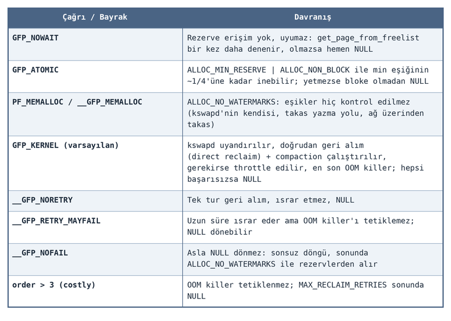

Sayfa tahsisat fonksiyonlarının başarısız olma olasılığı oldukça zayıftır.

Boş sayfalara ilişkin su seviyeleri çekirdekte ``include/linux/mmzone.h`` dosyası içerisinde aşağıdaki ``enum``
türüyle tanımlanmıştır:

.. code-block:: c

    enum zone_watermarks {
        WMARK_MIN,
        WMARK_LOW,
        WMARK_HIGH,
        WMARK_PROMO,
        NR_WMARK
    };

Yukarıda da belirttiğimiz gibi bu seviyeler bölgeleri belirten ``zone`` yapısının içerisinde tutulmaktadır:

.. code-block:: c

    struct zone {
        /* ... */
        unsigned long   _watermark[NR_WMARK];
        /* ... */
    };

``_watermark`` elemanı yukarıdaki seviyeler için geçerli seviye değerlerini tutmaktadır. Her bölgedeki toplam boş
sayfaların sayısı ise ``zone`` yapısının ``vm_stat`` elemanının belirttiği dizinin ``NR_FREE_PAGES`` indeksli elemanında
tutulmaktadır:

.. code-block:: c

    struct zone {
        /* ... */
        unsigned long       _watermark[NR_WMARK];
        atomic_long_t       vm_stat[NR_VM_ZONE_STAT_ITEMS];
        /* ... */
    };

Tabii ``vm_stat`` dizisi yalnızca bölgedeki toplam boş sayfa sayılarını değil başka bilgileri de tutmaktadır. Dizi
elemanlarının tuttuğu bilgilere ilişkin indeksler için ``zone_stat_item`` isimli bir ``enum`` bulundurulmuştur:

.. code-block:: c

    enum zone_stat_item {
        /* First 128 byte cacheline (assuming 64 bit words) */
        NR_FREE_PAGES,
        NR_FREE_PAGES_BLOCKS,
        NR_ZONE_LRU_BASE, /* Used only for compaction and reclaim retry */
        NR_ZONE_INACTIVE_ANON = NR_ZONE_LRU_BASE,
        NR_ZONE_ACTIVE_ANON,
        NR_ZONE_INACTIVE_FILE,
        NR_ZONE_ACTIVE_FILE,
        NR_ZONE_UNEVICTABLE,
        NR_ZONE_WRITE_PENDING,  /* Count of dirty, writeback and unstable pages */
        NR_MLOCK,               /* mlock()ed pages found and moved off LRU */
        /* Second 128 byte cacheline */
    #if IS_ENABLED(CONFIG_ZSMALLOC)
        NR_ZSPAGES,             /* allocated in zsmalloc */
    #endif
        NR_FREE_CMA_PAGES,
    #ifdef CONFIG_UNACCEPTED_MEMORY
        NR_UNACCEPTED,
    #endif
        NR_VM_ZONE_STAT_ITEMS
    };

Yukarıda da belirttiğimiz gibi ``vm_stat`` dizisinin ``NR_FREE_PAGES`` indeksli (0'ıncı indeksli) elemanında
bölgedeki toplam boş sayfaların sayısı tutulmaktadır. Bu değeri ``/proc/zoneinfo`` dosyasında *"pages free"*
satırından da görüntüleyebilirsiniz.

Biz bölgeleri incelerken bölgelerdeki ikiz blok sisteminin düzey listelerinin göç türlerinden oluştuğunu
belirtmiştik. Anımsanacağı gibi ikiz blok düzey listeleri ``zone`` yapısının ``free_area`` elemanında saklanıyordu:

.. code-block:: c

    struct zone {
        /* ... */
        unsigned long       _watermark[NR_WMARK];
        struct free_area    free_area[NR_PAGE_ORDERS];
        atomic_long_t       vm_stat[NR_VM_ZONE_STAT_ITEMS];
        /* ... */
    };

Buradaki ``free_area`` elemanının ``free_area`` isimli bir yapı türünden olduğunu belirtmiştik:

.. code-block:: c

    struct free_area {
        struct list_head    free_list[MIGRATE_TYPES];
        unsigned long       nr_free;
    };

İşte bu yapıdaki ``nr_free`` elemanı her düzey için toplam boş sayfa sayısını tutmaktadır. Bu durumda su seviyesi
(*watermark*) kontrolünü çekirdek ``zone`` nesnesinden hareketle iki aşamada yapmaktadır: Çekirdek önce ``zone``
nesnesindeki toplam boş sayfa sayısına bakar (bu ana şalter görevindedir), eğer toplam boş sayfa sayısı talep
edilen miktarı barındırıyorsa bu durumda hangi ikiz blok tahsisat düzeyinden tahsisat yapılacaksa ayrıca o
``free_area`` içerisindeki ``nr_free`` elemanını da kontrol eder.

Burada bir noktayı yeniden vurgulamak istiyoruz: *Fallback* mekanizması altında düğümlerin birden fazla bölgesi
taranmaktadır. Bir düğümün taranan bölgelerinin hepsinde ``WMARK_LOW`` altına düşülmüşse o düğüm için ``kswapd``
çekirdek thread'i uyandırılıp tarama diğer düğümlerle devam ettirilmektedir.

kswapd Çekirdek Thread'lerinin Uyguladığı Geri Alım İşlemleri
=============================================================

Şimdi de ``kswapd`` thread'leri tarafından geri alımın nasıl yapıldığı üzerinde duralım. Anımsanacağı gibi ``kswapd``
thread'leri zamanının önemli bölümünü uykuda geçirmektedir. Bunlar yukarıda belirttiğimiz koşullar oluşunca
tahsisat fonksiyonları tarafından uyandırılmaktadır. Bu thread'ler düğüm belirten ``pglist_data`` yapısının
``kswapd_wait`` bekleme kuyruğunu kullanmaktadır. Düğümü temsil eden ``pglist_data`` yapısının ``kswapd`` ile ilgili
elemanlarını aşağıda veriyoruz:

.. code-block:: c

    typedef struct pglist_data {
        /* ... */
        struct task_struct  *kswapd;
        wait_queue_head_t   kswapd_wait;                /* bekleme kuyruğu */
        wait_queue_head_t   pfmemalloc_wait;            /* kısma (throttle) bekleme kuyruğu */
        int                 kswapd_order;               /* istenen düzey */
        enum zone_type      kswapd_highest_zoneidx;
        int                 kswapd_failures;            /* ardışık başarısızlık sayacı */
        /* ... */
    } pg_data_t;

Aşağıdaki tabloda bu elemanların işlevlerini özetliyoruz:

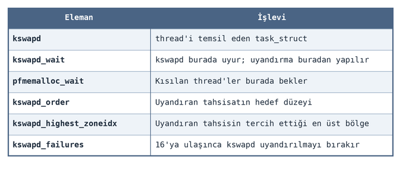

``kswapd`` thread'lerinin çalışma biçimleri oldukça ayrıntılıdır. Ancak kabaca bu *thread*'ler geri alımlar için
aşağıdaki iki işlemi yapmaktadır:

| **Evre-1:** ``inode`` nesnelerinin sayfa önbelleklerindeki sayfaları geri alırlar.

| **Evre-2:** Kullanılmayan ``inode`` nesnelerinin yok edilmelerini sağlarlar ve çekirdekteki dilim önbelleklerinden
    (``inode`` önbelleği, ``dentry`` önbelleği gibi) tahsis edilmiş ve artık kullanılmayan nesnelerin sistemden
    çıkartılarak (*evict* edilerek) dilim önbelleğine iade edilmesine önayak olurlar. Ancak ``kswapd`` thread'leri
    bunların dışında sistemdeki tüm büzücüleri (*shrinkers*) de işleme sokmaktadır.

Biz birinci evreye *"sayfa geri alımı (page reclaim)"*, ikinci evreye ise *"dilim geri alımı (slab reclaim)"*
diyeceğiz. Aşağıda birinci ve ikinci işlemi "evre 1" ve "evre 2" diye isimlendirerek ayrıntılı akışı veriyoruz:

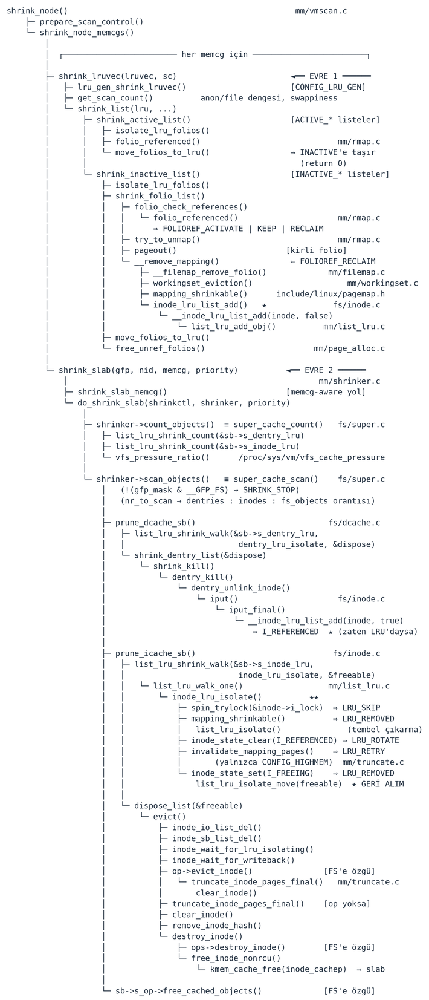

Bu akışı şekilsel olarak da şöyle betimleyebiliriz:

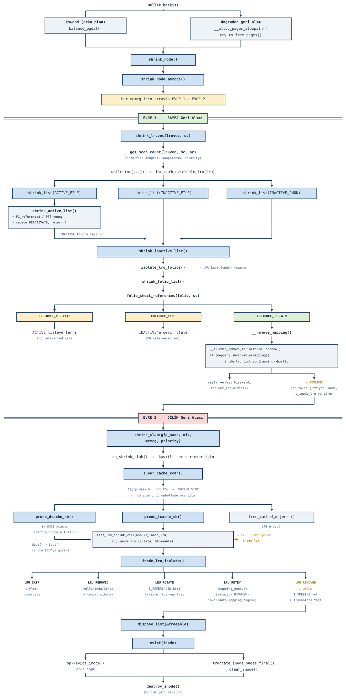

Evre-1: Sayfa Geri Alımı
------------------------

Şimdi *"Evre-1"* üzerinde duralım. Sayfa önbelleğindeki sayfaların geri alım süreci zaman içerisinde iyileştirilmiş
ve geliştirilmiştir. Güncel çekirdeklerde bu *"Evre-1"* işlemleri ``shrink_lruvec`` fonksiyonu tarafından
yapılmaktadır. Çekirdeğin bu konudaki evrimini aşağıdaki tabloyla özetlemek istiyoruz:

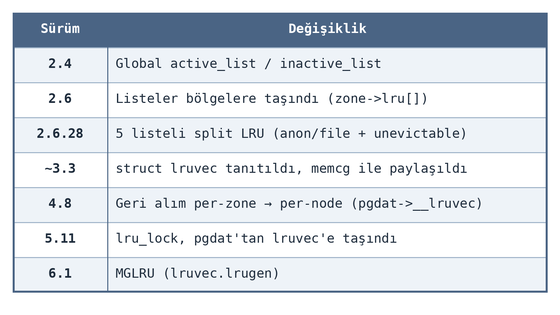

Geri alım için geri alımı yapılabilecek olan (her sayfanın geri alımının mümkün olmadığını anımsayınız) sayfalar 
LRU listelerinde tutulmaktadır. LRU listelerinde tutulan sayfalar şunlardır:

* Anonim sayfalar (*heap*, *stack*, *private mapping*'ler, *copy-on-write (COW)* kopyaları).
* Sayfa önbelleğindeki sayfalar (dosya içeriği taşıyan sayfalar, ``mmap`` edilmiş olsun ya da olmasın).
* *shmem/tmpfs* sayfaları (çekirdek bunları *anon* gibi takasa çıkarabilir ama sayfa önbelleğinde tutar).
* *takas önbelleğindeki* sayfalar (akas önbelleğini takas işlemlerini anlattığımız bölümde ele alacağız).
    
Şunlar LRU listelerinde değildir:

* Dilim önbelleğine ilişkin sayfalar. (Yani ``kmem_cache_alloc`` ve dolayısıyla ``kmalloc`` ile tahsis edilmiş olan sayfalar.)
* Sayfa tablolarına ilişkin sayfalar.
* Çekirdek *stack* alanları.
* ``vmalloc`` ve türevileri ile tahsis edilen (yani ``vmalloc`` alanında tahsis edilen) sayfalar).
* İkiz blok tahsisat sisteminde boşta duran sayfalar.
* *Reserved* olarak işaretlenmiş sayfalar.

Bunların bir kısmı hiç geri alınamaz; dilim önbelleğinde olan dentry ve inode nesneleri ise LRU üzerinden değil Evre-2'de açıklayacağımız 
*büzücüler (shrinkers)* yoluyla küçültülmektedir.

Güncel çekirdeklerde sayfalara ilişkin LRU listeleri eğer ``CONFIG_MEMCG`` konfigürasyon seçeneği aktif değilse
``pglist_data`` nesnesinde, aktifse ``mem_cgroup`` nesnesinin içerisinde tutulmaktadır:

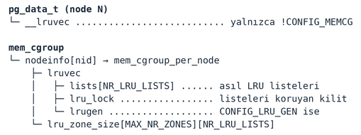

Biz daha önce de *memory cgroup* kavramından bellek yönetiminde üstünkörü bahsetmiştik. Bu mekanizma *docker* gibi
*container* teknolojilerinin gerçekleştirilmesi için diğer *cgroup* mekanizmalarıyla birlikte kullanılmaktadır. Biz
kursumuzda *"container"* oluşturabilmek için gereken çekirdek altyapısını ayrı bir bölümde ele alacağız. LRU
listelerinin tutulduğu yeri ve bunlara erişim fonksiyonlarını aşağıda bir tablo halinde de veriyoruz:

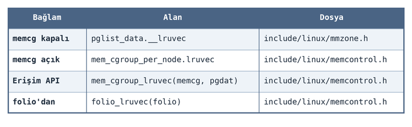

``pglist_data`` yapısının ``__lruvec`` elemanı sayfalar için LRU listelerini tutmaktadır:

.. code-block:: c

    typedef struct pglist_data {
        /* ... */

        struct lruvec           __lruvec;

        /* ... */
    } pg_data_t;

``lruvec`` yapısı şöyle tanımlanmıştır:

.. code-block:: c

    struct lruvec {
        struct list_head            lists[NR_LRU_LISTS];
        /* per lruvec lru_lock for memcg */
        spinlock_t                  lru_lock;
        /*
         * These track the cost of reclaiming one LRU - file or anon -
         * over the other. As the observed cost of reclaiming one LRU
         * increases, the reclaim scan balance tips toward the other.
         */
        unsigned long               anon_cost;
        unsigned long               file_cost;
        /* Non-resident age, driven by LRU movement */
        atomic_long_t               nonresident_age;
        /* Refaults at the time of last reclaim cycle */
        unsigned long               refaults[ANON_AND_FILE];
        /* Various lruvec state flags (enum lruvec_flags) */
        unsigned long               flags;
    #ifdef CONFIG_LRU_GEN
        /* evictable pages divided into generations */
        struct lru_gen_folio        lrugen;
    #ifdef CONFIG_LRU_GEN_WALKS_MMU
        /* to concurrently iterate lru_gen_mm_list */
        struct lru_gen_mm_state     mm_state;
    #endif
    #endif /* CONFIG_LRU_GEN */
    #ifdef CONFIG_MEMCG
        struct pglist_data *pgdat;
    #endif
        struct zswap_lruvec_state zswap_lruvec_state;
    };

Yapının ``lists`` elemanına dikkat ediniz:

.. code-block:: c

    struct list_head    lists[NR_LRU_LISTS];

Bu eleman LRU listelerini tutmaktadır. Ancak gördüğünüz gibi LRU listeleri bir tane değildir. LRU listelerinin türleri
``lru_list`` isimli ``enum`` türünün içerisinde belirtilmektedir:

.. code-block:: c

    enum lru_list {
        LRU_INACTIVE_ANON = LRU_BASE,
        LRU_ACTIVE_ANON = LRU_BASE + LRU_ACTIVE,
        LRU_INACTIVE_FILE = LRU_BASE + LRU_FILE,
        LRU_ACTIVE_FILE = LRU_BASE + LRU_FILE + LRU_ACTIVE,
        LRU_UNEVICTABLE,
        NR_LRU_LISTS
    };

Bu bağlı liste türlerini aşağıda tablo halinde de gösterebiliriz:

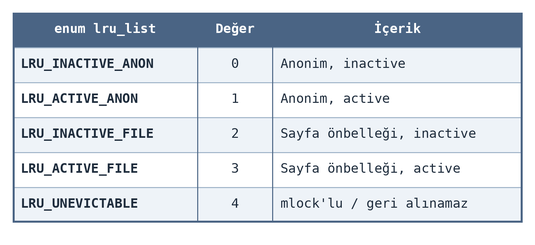

Bir ``folio`` nesnesi bu LRU bağlı listelerinin yalnızca birinde bulunmaktadır. ``folio`` yapısının ``lru`` elemanı
bu bağlı listelerin düğümlerini oluşturmaktadır:

.. code-block:: c

    struct folio {
        /* ... */
        union {
            struct list_head lru;   /* LRU listesine bağlantı */
            /* ... */
        };
        /* ... */
    };

Peki bir NUMA düğümünde ya da *memcg*'de neden tek bir LRU listesi yoktur da farklı beş tane LRU listesi
bulunmaktadır? İşte sayfa önbelleğindeki her sayfanın geri alınma maliyeti aynı değildir. Örneğin bir sayfa (genel
olarak *folio*) eğer ``mmap`` fonksiyonuyla *anonim (anonymous)* biçimde tahsis edilmişse bu sayfa geri alınırken
eğer kirli değilse *takas dosyasına (swap file)* geri yazılmak zorundadır. Ancak eğer sayfa bir dosyaya ilişkinse
(yani anonim değilse) ve kirli değilse bu durumda geri alınan sayfanın takas dosyasına yazılması gerekmez. Çünkü
zaten o bilgiler ilgili dosyanın içerisinde bulunmaktadır. İşte yukarıdaki LRU liste türlerinde ``_ANON`` sonekiyle
biten iki tür anonim sayfalar için LRU listesi, ``_FILE`` sonekiyle biten iki tür ise dosyalara ilişkin sayfalar
için LRU listesi belirtmek

Yukarıda anonim ve dosya tabanlı biçimde tahsis edilmiş sayfaların (genel olarak *folio*'ların) aktif ve aktif
olmayan biçiminde iki ayrı listede tutulduğunu belirttik. Aktif olmayan liste hem kolay geri alım için hem de 
*"ikinci şans (second chance)"* denilen durum için oluşturulmuştur. Aktif olmayan listede bulunan bir sayfaya (genel 
olarak *folio*'ya) dokunulduğunda bu sayfa aktif listeye alınmaktadır. Aktif olmayan liste bellek baskısı altında ilk 
geri alınacak listedir. Aktif liste ise geri alımı geciktirilen ancak yoğun bellek baskısı söz konusu olduğunda geri 
alım yapılan listedir:

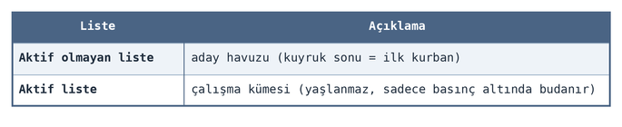

``LRU_UNEVICTABLE`` listesi geri alınamaz bir listedir. Bir *folio* üzerinde işlem yapılırken *folio* kilitlendiğinde
bu listeye alınmaktadır. Kilitli *folio*'ların geri alınması bozucu etkilere yol açmaktadır.tedir. Bu iki tür LRU listesi 
aynı zamanda *aktif olan* ve *aktif olmayan* biçiminde ikiye ayrılmaktadır.

Evre-1'de önce her listeden ne kadar sayfanın geri alınacağı hesaplanmaktadır. Sonra geri alım için döngü
içerisinde tarama yapılmaktadır. Tarama sırası şöyledir:

.. code-block:: none

    INACTIVE_ANON → ACTIVE_ANON → INACTIVE_FILE → ACTIVE_FILE

Aktif olmayan listeler kuyruğundan tüketilen, başından beslenen bir kuyruk biçimindedir. Aktif listelerden
geri alım yapılmaz. Aktif listelerdeki *folio*'lar önce aktif olmayan listelere alınır. Geri alım oradan yapılır.
Yukarıdaki listelerin taranması bir döngü içerisinde yapılmaktadır. Bu süreci biraz basitleştirerek aşağıdaki gibi
bir şekille açıklayabiliriz:

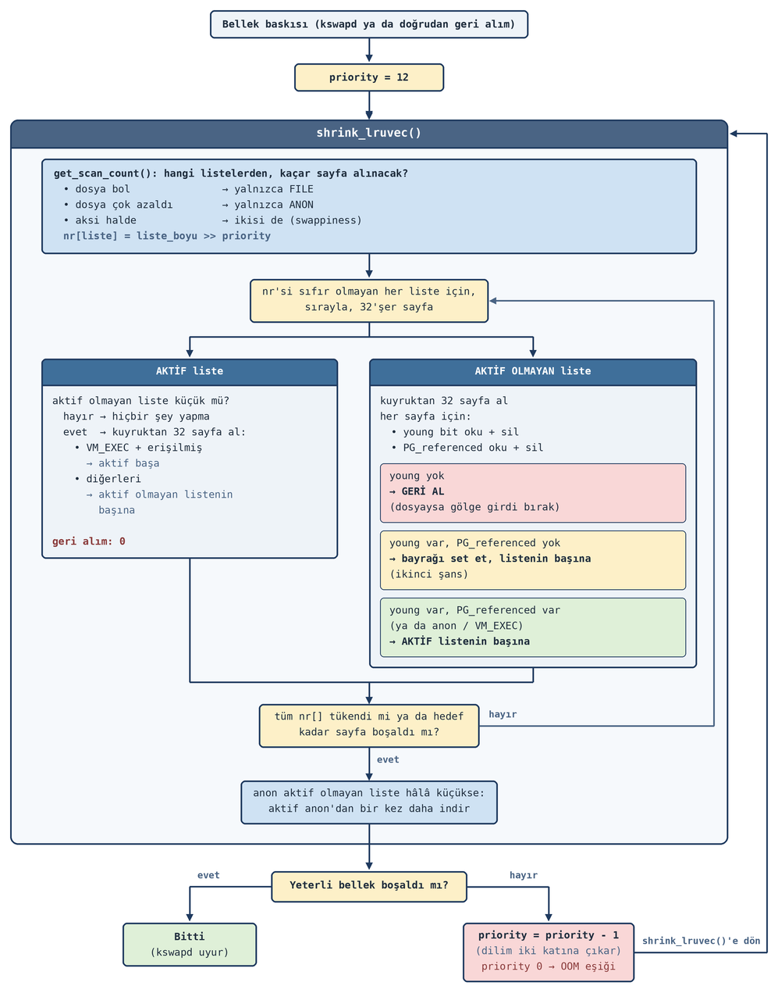

Buradaki döngüyü açıklarsak *kswapd*'nin Evre-1 süreci açıklığa kavuşacaktır. Ancak bu döngünün işleyişi oldukça
sofistikedir. Biz burada çok derine inmeden temel işleyişi açıklayacağız:

- Süreç bellek baskısıyla başlamaktadır. Bu baskı iki nedenden dolayı oluşabilir: Ya bir bölgedeki boş sayfa sayısı
  LOW su seviyesinin altına düşmüştür ve bunun sonucu olarak ``kswapd`` çekirdek thread'i uyandırılmıştır ya da
  *doğrudan geri alım (direct reclaim)* süreci başlatılmıştır. Her iki durumda da aynı döngü çalışır; fark yalnızca
  kimin çalıştırdığı ve ne zaman duracağıdır.

- Döngü ``priority`` değeri ``12`` ile başlatılır. Bu sayı, listelerin ne kadarının taranacağını belirleyen bir sağa
  kaydırma miktarıdır. Her listeden ``liste_uzunluğu >> priority`` kadar sayfa işlenecektir. ``12`` ile başlamak,
  listelerin yalnızca ``1/4096``'sına bakılacağı anlamına gelir. Amaç, hafif baskıda çok az iş yaparak yeterli belleği
  boşaltabilmek, ancak baskı sürerse kademeli olarak daha derine inmektir.

- ``shrink_lruvec`` fonksiyonunun içine girildiğinde ilk işlem ``get_scan_count`` fonksiyonu ile hangi listelerin
  taranacağına ve her birinden kaç sayfa işleneceğine karar vermektir. Takas alanı yoksa, ``swappiness`` değeri
  sıfırsa ya da aktif olmayan dosya listesi zaten yeterince büyükse yalnızca ``_FILE`` listeleri seçilir; ``_ANON``
  listelerinin sayacı sıfır bırakılır. ``_FILE`` sayfaları çok azalmışsa tersine yalnızca ``_ANON`` listeleri seçilir.
  İkisi de değilse her iki tür de taranır ve pay ``swappiness`` değeri ile birlikte son turlardaki tarama/döndürme
  maliyetine göre bölüştürülür. Sonuçta dört liste için ``nr[]`` dizisi doldurulur.

Buradaki ``swappiness`` değeri geri alma sırasında çekirdeğin anonim sayfaları mı yoksa dosya sayfalarını mı tercih
edeceğini belirleyen bir ayardır. ``/proc/sys/vm/swappiness`` dosyasından bu değer elde edilebilir ve
değiştirilebilir. Varsayılan ``swappiness`` değeri ``60``'tır, aralığı ise ``0–200``'dür (5.8'den önce ``0–100``'dü). 
``_ANON`` ve ``_FILE`` payları şöyle hesaplanır:

.. code-block:: none

    anon_prio = swappiness
    file_prio = 200 - swappiness

Örneğin ``swappiness = 60`` ise ``_ANON`` ``60``, ``_FILE`` ``140`` ağırlığa sahiptir. Yani ``_FILE`` sayfaları ``_ANON``
sayfalardan yaklaşık ``2.3`` kat daha istekli taranacaktır. Ancak bu ağırlıklar tek başına kullanılmaz; her tarafın son
turlardaki maliyeti ile bölünür:

.. code-block:: none

    anon_payı = anon_prio / (anon_cost + 1)
    file_payı = file_prio / (file_cost + 1)

``anon_cost`` ve ``file_cost``, o tarafta taranan ve döndürülen (yani boşuna izole edilip geri konan) sayfaların
ağırlıklı toplamıdır. Bir tarafta çok döndürme oluyorsa oradaki sayfalar gerçekten kullanılıyor demektir; o taraf
*pahalı* sayılır ve payı düşer. Böylece ``swappiness`` sabit bir oran değil, dinamik bir geri bildirim döngüsünün
başlangıç eğimidir.

- Ana döngü, sayacı sıfır olmayan listeleri ``enum`` sırasıyla (aktif olmayan ``_ANON``, aktif ``_ANON``, aktif
  olmayan ``_FILE``, aktif ``_FILE``) dolaşır; ancak hiçbir listeyi tek seferde bitirmez. Her uğrayışta o listeden en
  fazla ``32`` sayfa işlenir, sonra bir sonraki listeye geçilir. Böylece listeler arasında dönüşümlü, adil bir ilerleme
  sağlanır ve bir liste diğerinin aleyhine tüketilmez.

- Sıra bir aktif listeye geldiğinde önce tek bir soru sorulur: Bu türün aktif olmayan listesi, bellek boyutuna göre
  belirlenen orana kıyasla küçük kalmış mı? Hayırsa aktif listeye hiç dokunulmaz. Evetse aktif listenin kuyruğundan
  32 sayfa alınır ve her birinin PTE'lerindeki erişim bitleri okunup temizlenir. Sayfa çalıştırılabilir bir dosya
  eşlemesine aitse ve erişilmişse aktif listenin başına geri konur; diğer tüm sayfalar, erişilmiş olsun olmasın,
  ``PG_active`` bayrağı kaldırılarak aktif olmayan listenin başına indirilir. Bu adımda hiçbir sayfa boşaltılmaz;
  işin tek amacı aktif olmayan listeyi beslemektir.

- Sıra bir aktif olmayan listeye geldiğinde asıl geri alma işi yapılır. Listenin kuyruğundan 32 sayfa alınır ve her
  sayfa için iki erişim kanıtı toplanır: Sayfa girişlerindeki (PTE) *young biti (Intel'de A (Access) biti)* okunur ve
  temizlenir, sayfa üzerindeki ``PG_referenced`` bayrağı okunur ve temizlenir. Bu iki bilginin bileşimi sayfanın
  kaderini belirler.

- *Young* biti (*Access* biti) set edilmemişse sayfa aradan geçen sürede hiç kullanılmamıştır ve geri alınır. Temiz
  bir sayfa doğrudan serbest bırakılır; kirliyse önce yedek deposuna (dosyaya ya da takas alanına) yazdırılır. Dosya
  sayfalarında, sayfa önbelleğindeki yerine o anki tahliye sayacını taşıyan bir gölge girdi bırakılır; bu girdi, sayfa
  kısa süre sonra geri okunursa onun aslında çalışma kümesine ait olduğunu anlamaya yarar.

- *Young* biti (*Access* biti) set edilmişse ama ``PG_referenced`` set edilmemişse, sayfa bir kez kullanılmıştır
  fakat bunun kalıcı bir ilgi mi yoksa tek seferlik bir erişim mi olduğu belli değildir. Sayfaya ``PG_referenced``
  bayrağı konur ve aktif olmayan listenin başına geri gönderilir. Bu, ikinci şanstır: sayfa listeyi bir kez daha
  baştan sona dolaşacak ve kuyruğa yeniden geldiğinde tekrar sorgulanacaktır.

- *Young* biti (*Access* biti) de ``PG_referenced`` de set edilmişse, sayfa iki ayrı turda erişilmiştir ve gerçekten
  kullanılıyor demektir; aktif listenin başına terfi ettirilir. Anonim sayfalar ile çalıştırılabilir dosya sayfaları
  için bu ikinci kanıt aranmaz, tek *young* biti terfi için (yani aktif olmayan listeden aktif listeye aktarılması
  için) yeterlidir; çünkü ``_ANON`` sayfa *fault* ile geldiğinde zaten bir kez erişilmiştir ve takas maliyeti
  yüksektir, kodun ise yeniden okunması pahalıdır.

- Bir tur tamamlandığında iki koşul kontrol edilir: bütün ``nr[]`` sayaçları tükenmiş mi, ya da hedeflenen sayıda
  sayfa boşalmış mı? İkisi de sağlanmıyorsa döngü listeleri yeniden dolaşmaya döner. Hedef sağlanmışsa ve tarama her
  iki türü kapsıyorsa, az taranmış tarafın kalan sayaçları diğerine oranla kırpılır ki bir tür diğerinden orantısız
  taranmasın; sonra döngüden çıkılır.

- Döngüden çıkmadan hemen önce ``_ANON`` tarafı için son bir denge kontrolü yapılır. Ana döngünün sürme koşulunda
  aktif ``_ANON`` listesi bilerek yer almadığından, *anon* aktif olmayan listesi tur boyunca beslenmemiş olabilir.
  Hâlâ küçükse aktif ``_ANON`` listesinden bir kez daha sayfa aktif olmayan ``_ANON`` listesine alınır; böylece bir
  sonraki çağrıda *anon* aktif olmayan listesi boş yakalanmaz.

- ``shrink_lruvec`` fonksiyonu bittiğinde çağıran taraf yeterli belleğin boşalıp boşalmadığına bakar. Boşaldıysa
  süreç biter: ``kswapd`` bölgeler HIGH su seviyesine ulaştığında uyur, doğrudan geri alım yapan akış ise bekleyen
  ayırma isteğine geri döner.

- Yeterli bellek boşalmadıysa ``priority`` bir azaltılır ve ``shrink_lruvec`` fonksiyonu yeniden çağrılır. Her
  azalışta taranan dilim iki katına çıkar; ``11``'de ``1/2048``, ``10``'da ``1/1024`` ve nihayet ``0``'da listelerin tamamı. 
  Bu kademeli derinleşme, sistemin hafif baskıda ucuz, ağır baskıda kapsamlı davranmasını sağlar. ``priority`` sıfıra ulaştığında
  bile yeterli bellek bulunamıyorsa çekirdek *OOM killer*'ı devreye sokmayı değerlendirir.

Yukarıda maddeler halinde açıkladığımız süreci ayrıntıları atlayıp birkaç cümle ile özetlemek istersek şunları
söyleyebiliriz:

- Geri alım bir döngü içerisinde yapılmaktadır.

- Geri alım her zaman aktif olmayan listelerden yapılır. Süreç içerisinde aktif listelerden aktif olmayan listelere,
  aktif olmayan listelerden de aktif listelere geçiş aktarım yapılır. Aktif olmayan listelerdeki *folio*'lara koşula
  bağlı olarak ikinci bir şans verilmektedir.

- Geri alım düşük bir hedef değerden başlatılarak gitgide yükseltilmektedir.

Evre-2: Dentry ve Inode Nesnelerinin Geri Alımı
-----------------------------------------------

Şimdi kullanılmayan ``dentry`` ve ``inode`` ve  nesnelerinin nasıl geri alınarak dilime iade edildiği (yani *Evre-2*) üzerinde 
duralım. *Evre-2*'de önce ``dentry`` nesneleri sonra ``inode`` nesneleri geri alınmaktadır. Biz de bu bölümde önce ``dentry``
nesnelerinin geri alım mekanizmasını sonra ``inode`` nesnelerinin geri alım mekanizmasını inceleyeceğiz.

Dentry Nesnekerinin Geri Alımı
~~~~~~~~~~~~~~~~~~~~~~~~~~~~~~~

Eskiden ``dentry`` önbelleğinin geri alımı için tüm ``dentry`` nesnelerine ilişkin ``dentry_unused`` isimli
tek bir LRU listesi bulunuyordu. Güncel çekirdeklerde her süper blok nesnesi için ayrı bir ``dentry`` LRU listesi
tutulmaktadır. *Mount* edilmiş her dosya sistemi için bir ``super_block`` nesnesi oluşturulduğunu anımsayınız. Bu
``super_block`` nesnelerinin içerisinde o süper bloktaki kullanılmayan ``dentry`` nesneleri tutulmaktadır:

.. code-block:: c

    struct super_block {
        /* ... */

        struct list_lru     s_dentry_lru;

        /* ... */
    };

``super_block`` nesnelerinin içerisinde o süper bloktaki bütün ``dentry`` nesnelerini tutan bir liste yoktur.
``dentry`` nesnelerine global ``dentry_hashtable`` üzerinden erişilmektedir. Eskiden ``s_dentry_lru`` elemanı
``list_head`` türündendi. 3.12 sürümünden itibaren ``s_dentry_lru`` elemanının türü ``list_lru`` olarak
değiştirilmiştir. (Aynı versiyonda ``s_inode_lru`` elemanının türü de benzer biçimde değiştirilmiştir.) ``list_lru``
içinde her NUMA düğümü için (*memcg* etkinse ayrıca her *cgroup* için) ayrı listeler bulunmaktadır.

``dentry`` ve ``inode`` LRU listelerinin dolaşılarak ``dentry`` ve ``inode`` nesnelerinin geri alınması süreci zaman
içerisinde değiştirilmiş ve iyileştirilmiştir. Güncel çekirdeklerde (bir süredir bu sistem uygulanmaktadır) her
``super_block`` nesnesi için bir *"büzücü (shrinker)"* oluşturulmaktadır. Bu büzücülerdeki fonksiyonlar kendi süper
blok ``dentry`` ve ``inode`` nesnelerinin geri alımını yapmaktadır:

.. code-block:: c

    struct super_block {
        /* ... */

        struct shrinker     *s_shrink;      /* per-sb shrinker handle */

        /* ... */
    };

Büzücüler ``shrinker`` yapısıyla temsil edilmektedir. Mevcut çekirdeklerde ``shrinker`` yapısı `include/linux/shrinker.h`` 
dosyası içerisinde şöyle tanımlanmıştır:

.. code-block:: c

    struct shrinker {
        unsigned long (*count_objects)(struct shrinker *,
                        struct shrink_control *sc);
        unsigned long (*scan_objects)(struct shrinker *,
                        struct shrink_control *sc);

        long batch;     /* reclaim batch size, 0 = default */
        int seeks;      /* seeks to recreate an obj */
        unsigned flags;

        /*
         * The reference count of this shrinker. Registered shrinker have an
         * initial refcount of 1, then the lookup operations are now allowed
         * to use it via shrinker_try_get(). Later in the unregistration step,
         * the initial refcount will be discarded, and will free the shrinker
         * asynchronously via RCU after its refcount reaches 0.
         */
        refcount_t refcount;
        struct completion done;     /* use to wait for refcount to reach 0 */
        struct rcu_head rcu;

        void *private_data;

        /* These are for internal use */
        struct list_head list;
    #ifdef CONFIG_MEMCG
        /* ID in shrinker_idr */
        int id;
    #endif
    #ifdef CONFIG_SHRINKER_DEBUG
        int debugfs_id;
        const char *name;
        struct dentry *debugfs_entry;
    #endif
        /* objs pending delete, per node */
        atomic_long_t *nr_deferred;
    };

    Biz burada büzücüler konusunun ayrıntılarına girmeyeceğiz.

Aslında ``kswapd`` süper blokları doğrudan dolaşmamaktadır. Süper blokların ``shrinker`` nesneleri ``super_block`` nesnesi
yaratıldığında global bir bağlı listede biriktirilmektedir, ``kswapd`` de bu ``shrinker`` listesini dolaşmaktadır. Güncel
çekirdeklerde bu ``shrinker`` listesi ``mm/shrinker.c`` dosyası içerisinde aşağıdaki gibi tanımlanmıştır:

.. code-block:: c

    LIST_HEAD(shrinker_list);

Buradaki liste ``shrinker`` nesnelerini tutmaktadır. Ancak ``shrinker`` nesneleri de ``super_block`` nesneleri
içerisinde olduğundan ``container_of`` makrosuyla ``shrinker`` nesnesinin içinde bulunduğu ``super_block`` nesnesine
erişilebilmektedir:

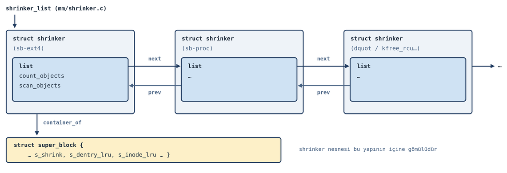

Her yeni *mount* işleminde *mount* edilen ``super_block`` nesnesi içerisindeki ``shrinker`` da ``shrinker``
listesine eklenmektedir.

``kswapd`` thread'leri aslında bu ``shrinker`` listesini dolaşıp ``dentry`` ve ``inode`` nesnelerinin geri alımı için
``shrinker`` nesnesi içerisindeki fonksiyonları çağırmaktadır. ``kswapd`` thread'i belli bir noktada
``shrink_node`` fonksiyonunu, bu fonksiyon da ``shrinker`` listesini dolaşarak ``shrinker`` nesneleri içerisindeki
``scan_objects`` fonksiyon göstericisinin gösterdiği super_cache_scan fonksiyonunu çağırmaktadır. ``dentry`` ve ``inode`` 
nesnelerinin yok edilmesi bu yoldan yapılmaktadır. Aşağıda ``kswapd`` tarafından çağrılan ``shrink_node`` çağrı 
zincirini sadeleştirerek veriyoruz:

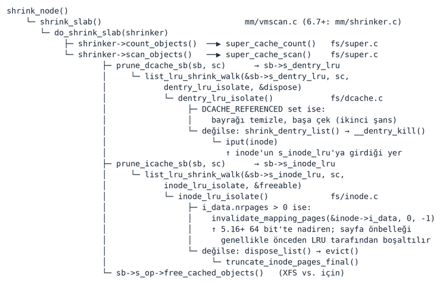

Güncel çekirdeklerde ``dentry`` nesneleri kimse tarafından kullanılmadığında yani referans sayacı 0'a düştüğünde
(``d_lockref.count`` elemanı) ``dput`` fonksiyonu ``dentry`` nesnesinin ``dentry`` önbelleğinde tutmaya değip
değmeyeceğine ``retain_dentry`` fonksiyonunu çağırarak karar verir. O ``dentry`` nesnesini ya önbelleğe alır ya da
dilime iade eder. Eğer ``dentry`` ilk kez kullanılmaz hale geliyorsa nesne LRU listesine eklenir. ``dentry`` zaten
LRU listesindeyse (yani önbellekteyken yeniden bulunup kullanılmış ve tekrar bırakılmışsa) nesnenin ``d_flags``
elemanının ``DCACHE_REFERENCED`` biti set edilir. Bu bayrak ``dentry_lru_isolate`` fonksiyonu tarafından nesneye
ikinci şans (*second chance*) vermektedir.

``dentry`` nesnelerinin hepsi ``prune_dcache_sb`` akışı tarafından taranıp ``dentry_lru_isolate`` fonksiyonuna
sokulmaktadır. Bu fonksiyon duruma göre nesnenin dilime iade edilmesini sağlayıp uyguladığı işlemin ne olduğu
bilgisine geri dönmektedir.

``dentry_lru_isolate`` fonksiyonunun geri dönüş değeri ``lru_status`` isimli ``enum`` türündendir. Bu ``enum``
türünün elemanları şöyledir:

.. code-block:: c

    enum lru_status {
        LRU_REMOVED,            /* item removed from list */
        LRU_REMOVED_RETRY,      /* item removed, but lock has been
                                   dropped and reacquired */
        LRU_ROTATE,             /* item referenced, give another pass */
        LRU_SKIP,               /* item cannot be locked, skip */
        LRU_RETRY,              /* item not freeable. May drop the lock
                                   internally, but has to return locked. */
        LRU_STOP,               /* stop lru list walking. May drop the lock
                                   internally, but has to return locked. */
    };

Peki ``dentry`` nesnelerinin LRU listeleri geri alınırken geri alım ne kadar ``dentry`` nesnesini kapsayacak biçimde
yapılmaktadır? İşte süper blok ``dentry`` LRU listelerindeki her ``dentry`` nesnesi geri alıma müsait değildir.
``dentry`` nesnesinin geri alınabilirliği konusundaki kararlar ``dentry_lru_isolate`` isimli fonksiyon tarafından
verilip işlemler de bu fonksiyon tarafından yapılmaktadır. Fonksiyon her nesne için *"ben şunu yaptım"* anlamında
bir ``enum lru_status`` değeri döndürmektedir:

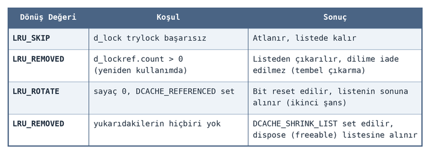

``dentry_lru_isolate`` fonksiyonu ( ``inode_lru_isolate`` fonksiyonundan farklı olarak) ``LRU_RETRY`` değerini hiçbir
zaman döndürmemektedir. Çünkü ``dentry`` nesnelerinin geri yazılacak bir içeriği, tamponu ya da sayfa önbelleği
yoktur ve fonksiyon liste kilidini hiçbir zaman bırakmaz. Ayrıca ``dispose`` listesine alınan ``dentry`` nesnesi
henüz öldürülmüş değildir; asıl öldürme işlemi liste yürüyüşü bittikten sonra ``shrink_dentry_list`` fonksiyonu
tarafından yapılmaktadır.

``dentry_lru_isolate`` fonksiyonu tarafından yapılan işlemler şunlardır:

1. **Kilit çekişmesi yaşanıyorsa (LRU_SKIP):** Normal kilit sırası önce ``d_lock``, sonra LRU listesinin kilididir.
   Tarayıcı ise liste kilidini tutarken ``d_lock`` kilidini almak zorundadır; yani sıra terstir. Bu yüzden
   ``spin_trylock`` kullanılır. Kilit alınamazsa nesne o taramada tamamen atlanır ve listede yerinde kalır.

2. **Listede olduğu halde yeniden referans edilmiş (yani d_lockref.count > 0) nesneler:** Nesne listedeyken bir yol
   aramasıyla (``__d_lookup_rcu()``, ``__d_lookup()``) bulunup kullanılmaya başlanmış olabilir. Arama nesneyi
   listeden çıkarmaz, yalnızca sayacı artırır. Nesne, ``dentry_lru_isolate`` fonksiyonu içindeki ``d_lru_isolate()``
   çağrısıyla listeden tembel biçimde (*lazily*) çıkarılır. Bu çağrı ``DCACHE_LRU_LIST`` bitini siler ve
   ``nr_dentry_unused`` sayacını düşürür. Fonksiyon ``LRU_REMOVED`` ile döner, ama nesne öldürülmez. Sayaç daha
   sonra ``dput()`` ile yeniden sıfıra indiğinde ``retain_dentry()`` nesneyi ``d_lru_add()`` ile tekrar listenin
   sonuna ekler. (``list_lru`` yapısında listenin başındakilerin en eski, sonundakilerin en yeni olduğunu
   anımsayınız.)

3. **Durum bitleri kontrolü yoktur:** ``inode`` tarafındaki ``I_DIRTY``, ``I_SYNC``, ``I_NEW``, ``I_FREEING``
   kontrolünün ``dentry`` tarafında bir karşılığı yoktur. ``dentry``'nin geri yazılacak bir içeriği ve yedek deposu
   olmadığından *"kirli"* durumu da yoktur. *Hash*'ten çıkarılmış, bağlantısız ya da ``DCACHE_DONTCACHE`` bayraklı
   ``dentry``'ler ise bu fonksiyona hiç ulaşmaz. Bunları ``retain_dentry()`` daha sayaç sıfıra indiği anda öldürür
   ve listeye hiç eklemez. Yani bu eleme taramada değil, listeye giriş kapısında yapılır.

4. **İkinci şans hakkı verilen nesneler:** Nesne listedeyken kullanılıp bırakıldıysa, ``retain_dentry()`` içinde
   (6.8 öncesinde ``dput()`` içinde) ``DCACHE_REFERENCED`` biti set edilir. Nesne zaten listede olduğu
   (``DCACHE_LRU_LIST`` set) için yeniden eklenmez, yalnızca bit işaretlenir. Tarayıcı biti siler, ``d_lock``
   kilidini bırakır ve ``LRU_ROTATE`` döner. Asıl taşıma işini liste yürüyüşünü yapan kod (``list_move_tail``)
   yapar ve nesne listenin sonuna, yani en yenilerin bulunduğu kısma alınır. ``d_lock`` bu taşımadan önce
   bırakılabilir, çünkü liste üzerindeki bütün hareketler liste kilidiyle korunur.

5. **Sayfa önbelleğine ilişkin bir kontrol yoktur:** ``dentry``'nin sayfa önbelleği ya da tamponu yoktur. Bu yüzden
   ``mapping_shrinkable``, ``remove_inode_buffers`` ve ``invalidate_mapping_pages`` karşılıkları da, ``LRU_RETRY``
   dönüşü de bulunmaz. Liste kilidi hiçbir zaman bırakılmadığından yürüyüşün baştan başlatılmasına gerek kalmaz.
   Sayfa önbelleğiyle ilgili iş, ``dentry`` öldürülüp ``inode`` referansını bıraktıktan sonra ``inode`` tarafında
   yapılır.

6. **Yukarıdaki durumların dışında:** ``dentry_lru_isolate`` fonksiyonu ``d_lru_shrink_move()`` ile nesneyi listeden
   çıkarır ve ``freeable`` (``dispose``) listesine alır. Bu sırada ``DCACHE_LRU_LIST`` biti silinir,
   ``DCACHE_SHRINK_LIST`` biti set edilir. Fonksiyon bu durumda ``LRU_REMOVED`` değeri ile geri döner. Nesne henüz
   öldürülmemiştir. Asıl öldürme, liste yürüyüşü bittikten sonra kilitsiz olarak ``shrink_dentry_list()`` içinde
   yapılır. Orada ``__dentry_kill()`` ``dentry``'yi *hash*'ten çıkarır, ``inode`` referansını ``iput()`` ile bırakır
   (``inode``'un sayacı sıfıra inerse ``inode``, ``inode`` LRU'suna girer) ve nesneyi dilime iade eder.

7. **Dispose listesindeyken yeniden bulunan nesneler:** Bu, 2. maddenin ``dispose`` listesindeki karşılığıdır. Nesne
   ``dispose`` listesine taşındığında hâlâ *hash* tablosundadır ve bu arada bir yol aramasıyla bulunup sayacı
   artırılabilir. ``shrink_dentry_list()`` bunu ``lock_for_kill()`` başarısız olduğunda anlar. Nesneyi öldürmez,
   yalnızca ``d_shrink_del()`` ile ``DCACHE_SHRINK_LIST`` bitini silip ``dispose`` listesinden çıkarır. Sayaç
   sonradan sıfıra indiğinde nesne olağan yoldan tekrar LRU'ya girer.

Inode Nesnelerinin Geri Alımı
~~~~~~~~~~~~~~~~~~~~~~~~~~~~~

Eskiden ``inode`` önbelleğinin geri alımı için tüm ``inode`` nesnelerine ilişkin toplamda bir tane LRU listesi
tutuluyordu. Güncel çekirdeklerde uzunca bir süredir her süper blok nesnesi için ayrı bir ``inode`` LRU listesi tutulmaktadır. 
Her dosya sistemi için bir ``super_block`` nesnesi oluşturulduğunu anımsayınız. Bu ``super_block`` nesnelerinin içerisinde 
hem o süper blokta bulunan bütün ``inode`` nesnelerini hem de kullanılmayan ``inode`` nesnelerini tutan elemanlar 
bulunmaktadır:

.. code-block:: c

    struct super_block {
        /* ... */
        spinlock_t          s_inode_list_lock;  /* s_inodes listesi için kilit */
        struct list_head    s_inodes;           /* tüm inode nesneleri */
        struct list_lru     s_inode_lru;        /* inode LRU listesi */
        /* ... */
    };

Burada ``s_inode_lru`` elemanı bu süper blok içerisindeki kullanılmayan ``inode`` nesnelerinin LRU listesini
belirtmektedir. Bu listenin başındaki (``list_head`` LRU listelerine göre ters sıra) ``inode`` nesneleri en eski
nesnelerdir. Dolayısıyla ``inode`` geri alımı baştan sona doğru yapılmaktadır. ``s_inode_lru`` elemanının güncel
çekirdeklerde ``list_head`` türünden değil ``list_lru`` türünden olduğuna dikkat ediniz. Bu geçiş de ``dentry`` LRU
listelerinde olduğu gibi çekirdeğin 3.12 versiyonunda yapılmıştır. Bu yapı *memcg* temelinde bağlı LRU listelerini
soyutlamaktadır. Bu sayede büzücüler (*shrinkers*) belirli bir düğüm ya da *cgroup* için çağrıldığında yalnızca
ilgili liste taranır. Her süper bloğun kendi büzücüsü bulunmaktadır. ``list_lru`` yapısının tanımlaması
``include/linux/list_lru.h`` dosyasında, gerçekleştirimi ise ``mm/list_lru.c`` dosyasında yapılmıştır. ``list_head``
ile ``list_lru`` yapıları arasındaki farklılıkları aşağıda bir tablo halinde veriyoruz:

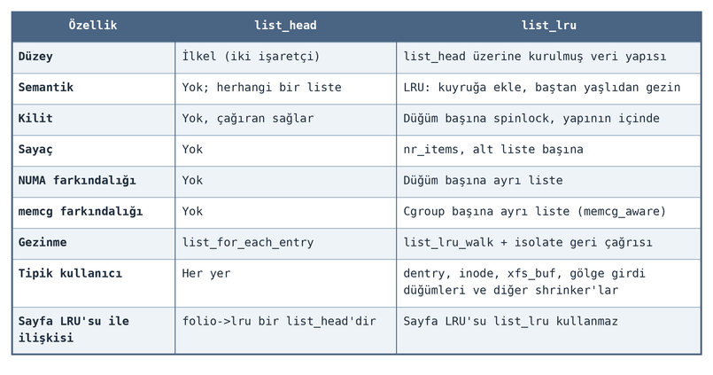

Süper blok nesnelerinin ``inode`` LRU listelerine (``s_inode_lru``) o süper bloktaki tüm ``inode`` nesneleri
yerleştirilmemektedir. Yalnızca geri alıma aday olan yani kullanılmayan (nesne sayacı ``0`` olan (``i_count = 0`` olan))
``inode`` nesneleri bu listeye yerleştirilmektedir. Dolayısıyla örneğin bir dosya açıkken ``inode`` nesnesi dosya
nesnesi tarafından gösterildiği için ``inode`` nesnesinin referans sayacı (``i_count``) ``0`` olmaktan çıkacaktır. Bu
nesne LRU listesinde bulunmayacaktır. Kendisine hiç referans edilmeyen (başka bir deyişle kullanılmayan) ``inode`` nesneleri 
bu LRU listesinde tutulmaktadır.

Inode LRU listelerinin geri alımı da yine ``super_block`` nesnelerinin içerisindeki ``shrinker`` nesnesi yoluyla
yapılmaktadır. Büzücüdeki ``scan_objects`` fonksiyon göstericisinin gösterdiği ``super_cache_scan`` fonksiyonu
``prune_dcache_sb`` fonksiyonundan sonra ``prune_icache_sb`` fonksiyonunu çağırmaktadır. ``inode`` nesnelerinin geri
alınması bu yoldan yapılmaktadır. Yukarıda vermiş olduğumuz çağrı zincirini yeniden veriyoruz:

Peki ``inode`` nesnelerinin LRU listeleri geri alınırken geri alım ne kadar ``inode`` nesnesini kapsayacak biçimde
yapılmaktadır? İşte süper blok ``inode`` LRU listelerindeki her ``inode`` nesnesi geri alıma müsait değildir.
``inode`` nesnesinin geri alınabilirliği konusundaki kararlar tıpkı ``dentry`` nesnelerinde olduğu gibi 
``inode_lru_isolate isimli`` fonksiyon tarafından verilip işlemler bu fonksiyon tarafından yapılmaktadır.  
Fonksiyon her nesne için *"ben şunu yaptım"* anlamında bir ``enum lru_status`` değeri döndürmektedir. Geri döndürülen 
değerler şunlardır:

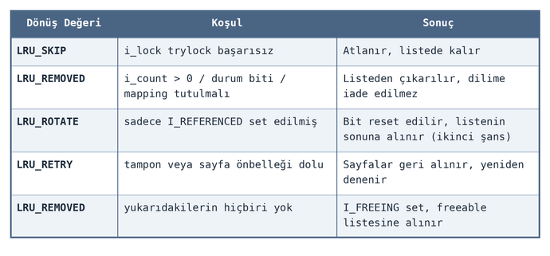
