=======================================================
Proses Kontrol Bloğu ve task_struct Yapısı
=======================================================

Bu bölümde proses kavramı ve proses kontrol bloğu üzerinde duracağız ve Linux çekirdeğindeki *proses
kontrol bloğunu* temsil eden ``task_struct`` yapısını ele alacağız. 

Proses Kavramı
================================

İşletim sistemlerinde *program* terimi çoğu kez "çalıştırılabilen bir dosyayı" ya da "bir kaynak dosyayı"
belirtmektedir. Çalışmakta olan programlara ise *proses* denilmektedir. Bir program çalıştırıldığında artık
o bir proses haline gelmektedir. Aynı programı birden fazla kez de çalıştırabiliriz. Bu durumda birbirinden
bağımsız birden fazla proses oluşacaktır.

Proses Kontrol Bloğu
================================

İşletim sistemlerinin proses yönetimlerindeki en önemli veri yapısı *proses kontrol bloğu (process control
block)* denilen veri yapısıdır. İşletim sistemleri her proses için kavramsal olarak ismine "proses kontrol
bloğu" denilen bir yapı türünden nesne oluşturmaktadır. Proseslerin yönetimi proses kontrol bloğu denilen
bu veri yapısına başvurularak yapılmaktadır. Proses kontrol bloğu terimi yerine bazı kaynaklar *proses
betimleyicisi (process descriptor)* terimini de kullanmaktadır.

Proses kontrol blokları içerisinde prosese ilişkin gerekli bütün bilgiler bulundurulmaktadır. Bu
bilgilerden bazıları şunlardır:

- Prosesin kullanıcı id'si, grup id'si gibi hesap (credential) bilgileri
- Proses id'si
- Prosesin üst prosesinin, alt proseslerinin, kardeş proseslerinin hangi prosesler olduğu bilgisi
- Prosesin durumsal bilgisi
- Prosesin bağlamsal geçişini (context switch) sağlama için gereksinim duyulan alanlar
- Prosesin bellekte nereye yüklü olduğu gibi bellekle ilgili bilgileri
- Prosesin çizelgeleyici ile ilgili olan bilgileri (örneğin çizelgeleme politikası, önceliği gibi)
- Prosesin CPU kullanım istatistiği
- Prosesin sinyal bilgileri
- Prosesin proseslerarası haberleşme için gerekli olan bilgileri
- Prosesin çalışma dizini (current working directory)
- Prosesin açmış olduğu dosyalara ilişkin bilgiler

task_struct Yapısı
==================================

Linux çekirdeğinde proses kontrol bloğu ``<include/linux/sched.h>`` dosyası içerisinde bulunan
``task_struct`` isimli yapıyla temsil edilmiştir. Bu ``task_struct`` nesnesi eskiden daha az eleman
içeriyordu. Sonra çekirdek gittikçe geliştirilince dev bir yapı haline geldi. Örneğin bu ``task_struct``
nesnesi Linus projeye ilk başlandığında (Linux 0.01) şu biçimdeydi:

.. code-block:: c

   struct task_struct {
   /* these are hardcoded - don't touch */
       long state;    /* -1 unrunnable, 0 runnable, >0 stopped */
       long counter;
       long priority;
       long signal;
       fn_ptr sig_restorer;
       fn_ptr sig_fn[32];
   /* various fields */
       int exit_code;
       unsigned long end_code,end_data,brk,start_stack;
       long pid,father,pgrp,session,leader;
       unsigned short uid,euid,suid;
       unsigned short gid,egid,sgid;
       long alarm;
       long utime,stime,cutime,cstime,start_time;
       unsigned short used_math;
   /* file system info */
       int tty;       /* -1 if no tty, so it must be signed */
       unsigned short umask;
       struct m_inode * pwd;
       struct m_inode * root;
       unsigned long close_on_exec;
       struct file * filp[NR_OPEN];
   /* ldt for this task 0 - zero 1 - cs 2 - ds&ss */
       struct desc_struct ldt[3];
   /* tss for this task */
       struct tss_struct tss;
   };

Çekirdeğin 2.4'lü versiyonunda bu yapı oldukça büyümüş, bellek, sinyal, dosya sistemi ve kimlik bilgileri
gibi pek çok alanı kapsayan kapsamlı bir yapı haline gelmiştir. Bugünkü 6'lı çekirdeklerde bu yapı birkaç
sayfa uzunluğundadır. Eskiden yapının her elemanı çekirdek derlemesine dahil ediliyordu. Ancak 2.6'lı
versiyonlardan başlanarak artık yapı elemanlarının bazıları konfigürasyona bağlı olarak yapıya dahil
edilmektedir. Bu nedenle gelişmiş çekirdeklerde yapıda aşağıdaki gibi ``#ifdef`` blokları görürseniz
şaşırmayınız:

.. code-block:: c

   struct task_struct {
   #ifdef CONFIG_THREAD_INFO_IN_TASK
       struct thread_info    thread_info;
   #endif
       unsigned int          __state;

       /* saved state for "spinlock sleepers" */
       unsigned int          saved_state;

       randomized_struct_fields_start

       void                  *stack;
       refcount_t            usage;
       unsigned int          flags;
       ...
   };

Bilindiği gibi Linux sistemlerinde yeni bir proses *fork* isimli POSIX fonksiyonuyla yaratılmaktadır.
*fork* POSIX fonksiyonu çekirdek içerisindeki *sys_fork* isimli sistem fonksiyonunu çağırmaktadır. Yeni
çekirdeklerde bu fonksiyon da *kernel_clone* isimli çekirdek fonksiyonunu çağırmaktadır. İşte
``task_struct`` nesnesi bu fonksiyonlar tarafından çekirdeğin heap alanında yaratılmaktadır.

Proseslerin ID Değerleri (PID)
==============================

Bilindiği gibi UNIX/Linux sistemlerinde her prosesin (yani çalışmakta olan her programın) o anda sistem
genelinde tek (unique) olan bir *proses id (process id)* değeri vardır. Proses id değeri hem çekirdek
tarafından hem de kullanıcı modundan çağrılabilen sistem fonksiyonları tarafından kullanılan bir
kavramdır. Proses id değeri bir prosesi temsil etmekte kullanılan tamsayısal bir değerdir. *ps* komutuyla
proseslere ilişkin proses id değerlerinin görüntülendiğini anımsayınız. Kullanıcı modunda *getpid* POSIX
fonksiyonu çalışmakta olan programın proses id değerini, *getppid* POSIX fonksiyonu ise üst prosesin
proses id değerini vermektedir. Tabii prosesin proses id değeri ve üst prosesin proses id değeri proses
kontrol bloğunda yani ``task_struct`` nesnesi içerisinde saklanmaktadır.

Thread Kavramı
===============

İşletim sistemlerine thread kavramı 90'lı yıllarda sokulmuştur. Ancak ilk thread denemeleri çeşitli
çalışmalar eşliğinde daha önceleri yapılmıştır. Linux işletim sistemine thread'ler ilk kez çekirdeğin
2.0 versiyonuyla eklenmiş olsa da daha sonra çeşitli düzeltmelerle thread yapısı biraz değiştirilmiştir.

Proses kavramı çalışmakta olan programın tüm bilgilerini temsil etmektedir. Halbuki thread yalnızca bir
akış belirtmektedir. Bir proses tek thread'le çalışmaya başlar. Prosesin çalışmaya başladığı thread'e
*ana thread (main thread)* de denilmektedir. Thread'ler de kullanıcı modundan sistem fonksiyonları
(*sys_clone* sistem fonksiyonu) ile yaratılmaktadır.

UNIX türevi sistemlere thread'ler ilk kez sokulduğunda farklı varyantlar farklı thread kütüphaneleri
kullanıyordu. Sonra thread kavramı POSIX standartlarına da POSIX.1c ile 1995 yılında sokuldu. Böylece
POSIX taşınabilir thread fonksiyonları oluşturuldu. POSIX'in taşınabilir thread fonksiyonlarının
gerçekleştirimi için Linux ve diğer UNIX varyantları çekirdek içerisinde de değişiklikler yapmak zorunda
kalmıştır.

Thread'lerin yalnızca bir akış belirttiğini söylemiştik. Proses kavramı ise tüm thread'lerle birlikte
çalışmakta olan programın tüm bilgilerini temsil etmektedir. Pek çok bilgi thread'e özgü değildir,
prosese özgüdür. Örneğin bir thread'in "çalışma dizini (current working directory)" diye bir kavram
yoktur. Prosesin çalışma dizini diye bir kavram vardır. Örneğin bir thread'in kullanıcı id'si, grup id'si
diye bir kavram yoktur. Prosesin kullanıcı id'si ve grup id'si diye bir kavram vardır. Yani çalışmakta
olan programa ilişkin pek çok bilgi programın tüm thread'leri için de geçerlidir.

Aslında thread'ler aynı bellek alanını ve ortak bilgileri kullanan prosesler gibi de düşünülebilir. Zaten
Linux işletim sisteminde thread yaratmakla proses yaratmak aslında aynı çekirdek fonksiyonuyla
yapılmaktadır. Yani bir prosesin thread'lerini biz aynı bellek alanını kullanan prosesler gibi de
düşünebiliriz.

Linux işletim sisteminde thread'ler de adeta aynı bellek alanı üzerinde çalışan birer proses gibi
düşünülmüştür. Bu nedenle yalnızca prosesler için değil thread'ler için de ``task_struct`` nesneleri
oluşturulmaktadır. Tabii işletim sistemi bir prosesin thread'lerini izleyen paragraflarda göreceğimiz
biçimde bağlı listelerde tutmaktadır.

Prosesler Arasındaki Altlık-Üstlük İlişkisi
============================================

UNIX/Linux sistemlerinde prosesler arasında kuvvetli bir *altlık-üstlük (parent-child)* ilişkisi vardır.
Bir proses yaratıldığında prosesin ``task_struct`` bilgilerinin çoğu üst prosesten (parent process)
alınmaktadır. Örneğin bir program başka bir programı *fork*/*exec* ile çalıştırdığında çalıştırılan
program çalıştıran programın pek çok özelliğini almaktadır. Örneğin *fork* işlemi sırasında *fork*
yapan programın kullanıcı id'si ve çalışma dizini neyse yeni yaratılan alt prosesin (child process)
kullanıcı id'si ve çalışma dizini de aynı olur. Daha teknik olarak ifade edersek *fork* işlemi sırasında
alt proses için yaratılan ``task_struct`` nesnesinin pek çok elemanı üst prosesin ``task_struct``
nesnesinden kopyalanmaktadır.

POSIX thread sisteminde thread'ler arasında önemli bir altlık-üstlük ilişkisi yoktur. Yani birkaç özel
durum dışında bir thread'i hangi thread'in yarattığının önemi yoktur.

task_struct Yapısının Dallı Budaklı Tasarımı
=============================================

``task_struct`` yapısının pek çok gösterici elemanı vardır. Bu gösterici elemanları başka yapıları
göstermektedir. Hatta o gösterici elemanların gösterdiği yapıların elemanları da başka yapıları
göstermektedir. O halde ``task_struct`` aslında dallı budaklı bir yapıdır. Biz bir bilginin proses
kontrol bloğunda olduğunu söylediğimiz zaman o bilginin hemen ``task_struct`` içerisindeki bir elemanda
olduğunu kastetmeyeceğiz. O bilgi ``task_struct`` içerisindeki bir elemanın gösterdiği başka bir yapının
içerisinde de olabilir. Önemli olan o bilgiye ``task_struct`` yapısından hareketle erişilebilmesidir.

Bir ``task_struct`` yapı nesnesinin ana elemanları diğer bir ``task_struct`` nesnesine kopyalanırsa
aslında asıl yapı nesnesi ile kopyalanmış olan yapı nesnesinin gösterici elemanları aynı yerleri gösterir
duruma gelir. Programlamada bu tür kopyalamaya *sığ kopyalama (shallow copy)* denildiğini anımsayınız.
Aslında ``task_struct`` yapısının bu biçimdeki dallı budaklı tasarımı üst proses-alt proses ilişkisinde
alt prosesin üst prosesten birtakım özellikleri alması (inherit etmesi) sürecinde faydalar sağlamaktadır.
Böylece alt prosesin ``task_struct`` nesnesine daha az eleman kopyalanmaktadır. Örneğin güncel
çekirdeklerdeki ``task_struct`` yapısının aşağıdaki kısmına dikkat ediniz:

.. code-block:: c

   struct task_struct {
       /* ... */

       /* Filesystem information: */
       struct fs_struct        *fs;

       /* Open file information: */
       struct files_struct     *files;

       /* ... */
   };

Burada aslında ``fs`` göstericisi aşağıdaki gibi bir yapıyı göstermektedir:

.. code-block:: c

   struct fs_struct {
       int users;
       spinlock_t lock;
       seqcount_spinlock_t seq;
       int umask;
       int in_exec;
       struct path root, pwd;
   } __randomize_layout;

Prosesin kök dizininin ve çalışma dizinin burada tutulduğuna dikkat ediniz. ``files`` göstericisi ise
aşağıdaki gibi bir yapıyı göstermektedir:

.. code-block:: c

   struct files_struct {
       atomic_t count;
       bool resize_in_progress;
       wait_queue_head_t resize_wait;

       struct fdtable __rcu *fdt;
       struct fdtable fdtab;

       spinlock_t file_lock ____cacheline_aligned_in_smp;
       unsigned int next_fd;
       unsigned long close_on_exec_init[1];
       unsigned long open_fds_init[1];
       unsigned long full_fds_bits_init[1];
       struct file __rcu * fd_array[NR_OPEN_DEFAULT];
   };

*fork* işlemi sırasında sığ kopyalama yapıldığından dolayı *fork* işleminden sonra üst ve alt prosesin
``task_struct`` nesnelerinin ``fs`` ve ``files`` göstericileri aynı ``fs_struct`` ve ``files_struct``
nesnelerini gösteriyor olacaktır.

current Makrosu 
===================
Thread'lerin de tıpkı prosesler gibi ``task_struct`` nesnelerine sahip olduğunu belirtmiştik. Peki
işletim sisteminin çizelgeleyici (scheduler) alt sistemi neleri çizelgelemektedir? İşte çizelgeleyici
alt sistem aslında yalnızca thread'leri yani thread'lere ilişkin ``task_struct`` nesnelerini
çizelgelemektedir. Yani çizelgeleyici alt sistemin *çalışma kuyruğunda (run queue)* yalnızca
``task_struct`` nesnelerinin olduğunu varsayabilirsiniz. Bir proses yaratıldığında zaten o proses için
yaratılan ``task_struct`` nesnesi aynı zamanda prosesin ana thread'inin ``task_struct`` nesnesi gibidir.
Başka bir deyişle aslında bütün ``task_struct`` nesneleri birer thread belirtmektedir.

Eskiden Linux sistemleri yalnızca tek işlemciyi destekliyordu. Sonra 2.0 versiyonuyla birlikte çekirdek
zamanla birden fazla işlemciyi ya da çekirdeği (core) destekler hale geldi. İşte bir thread çalışırken
``task_struct *`` türünden *current* isimli global değişken o anda çalışmakta olan thread'e ilişkin
``task_struct`` nesnesini gösterecek biçimde ayarlanmaktadır. Yani bir çekirdek kodunda *current*
göstericisini görürseniz bu *current* göstericisi o anda çalışmakta olan thread'e ilişkin ``task_struct``
nesnesini gösteriyor durumda olacaktır. Tabii bu *current* göstericisinin o anda çalışan thread'e ilişkin
``task_struct`` nesnesini göstermesini bağlamsal geçişi (context switch) gerçekleştiren çizelgeleyici alt
sistem sağlamaktadır.

Bir süredir birden fazla işlemciyi ya da çekirdeği destekleyen Linux çekirdeklerinde artık *current*
değişkeni bir gösterici değil fonksiyon belirtmektedir. Mevcut çekirdeklerde *current* aşağıdaki gibi bir
makro biçiminde tanımlanmıştır:

.. code-block:: c

   #define current get_current()

Görüldüğü gibi artık biz *current* değişkenini kullandığımızda aslında *get_current()* fonksiyonunu
çağırıp bu fonksiyonun geri dönüş değerini kullanmış olmaktayız. Bu konunun ayrıntıları thread'in
*çekirdek stack alanı (kernel stack)* ve *işlemciye özgü global alanlar* konusuyla ilgilidir ve başka
bir bölümde ele alınacaktır.

Biz kursumuzda *current* için "current göstericisi" ya da "current makrosu" terimlerini kullanacağız.

fork ve pthread_create Çağrı Zincirleri
================================================

Bilindiği gibi UNIX/Linux sistemlerinde kullanıcı modunda yeni bir proses *fork* POSIX fonksiyonu ile,
yeni bir thread de *pthread_create* fonksiyonu ile yaratılmaktadır. Yukarıda da belirttiğimiz gibi
aslında bu iki çağrı da belirli bir noktadan sonra çekirdek içerisindeki aynı fonksiyonları
çağırmaktadır:

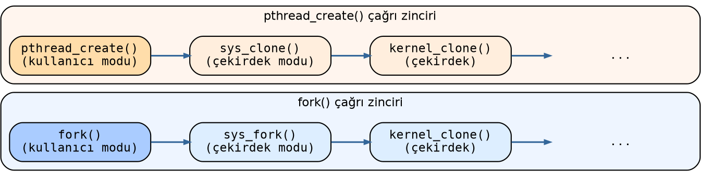

O halde aslında çekirdek gözüyle bakıldığında bir thread başka bir thread tarafından yaratılmaktadır.
Yani bu yaratımda iki thread söz konusudur: Yaratan thread ve yaratılan thread. Yaratan thread'e ilişkin
zaten ``task_struct`` nesnesi mevcuttur. O halde yaratılan thread için de bir ``task_struct`` nesnesi
oluşturulup bir biçimde bu yapılar ilişkilendirilecektir.

task_struct Nesneleri Arasındaki Bağ İlişkileri
================================================

Şimdi de ``task_struct`` nesneleri arasındaki ilişkilerin bağlı listelerle nasıl oluşturulduğu üzerinde
duracağız. Çekirdeğin bir prosesin thread'lerine sonra da alt proseslerine nasıl eriştiğini açıklayacağız.

Thread Listesi: thread_head ve thread_node
---------------------------------------------------

Bir prosesin thread'lerine erişim için eskiden ``task_struct`` içerisindeki ``thread_group`` isimli
döngüsel bağlı liste bağı kullanılıyordu. 4.2 çekirdeği (2015) ile birlikte bu veri yapısında bir
değişiklik yapılmıştır. Yeni sistemde prosesin thread'lerine ilişkin bağlı listenin kök düğümü prosesin
sinyal bilgilerinin bulunduğu yerde saklanmaktadır. Prosesin sinyal bilgileri ``task_struct`` içerisindeki
``signal`` göstericisinin gösterdiği yerdeki ``signal_struct`` yapısı içerisinde tutulmaktadır. İşte
``signal_struct`` yapısının ``thread_head`` elemanı da prosesin thread'lerine ilişkin bu kök düğümü
belirtmektedir. Prosesin thread'lerinin bağlı listesi için ise ``task_struct`` içerisindeki ``thread_node``
elemanı kullanılmaktadır. Thread listesine ilişkin ilgili elemanları şöyle betimleyebiliriz:

.. code-block:: c

   struct signal_struct {
       /* ... */
       struct list_head thread_head;
       /* ... */
   };

   struct task_struct {
       /* ... */
       struct signal_struct *signal;
       struct list_head thread_node;
       /* ... */
   };

Aşağıdaki diyagram bu bağlı listenin yapısını göstermektedir. Mavi renkteki ``thread_head`` kök düğümü
``signal_struct`` içerisindedir; turuncu renkteki ``thread_node`` düğümleri ise her bir thread'e ait
``task_struct`` içerisindedir:

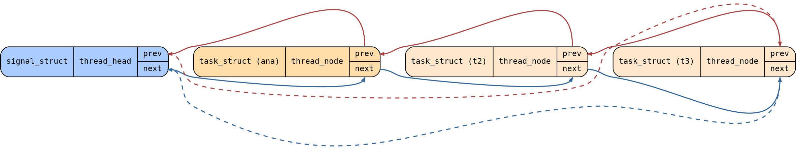

``thread_node`` bağlı listesi çekirdeğe ilk eklendiğinde bir süre eski ``thread_group`` listesi de
muhafaza edilmişti. Sonra tamamen eski ``thread_group`` listesi ``task_struct`` içerisinden kaldırıldı.
Artık yeni çekirdeklerde prosesin thread'lerinin ``task_struct`` nesnelerini elde etmek için prosesin
``signal_struct`` nesnesindeki ``thread_head`` kök düğümünden başlanarak bağlı listenin ``thread_node``
düğümlerinin dolaşılması gerekmektedir.

Aslında Linux çekirdeklerinde prosesin tüm thread'lerine ilişkin ``task_struct`` içerisinde bulunan
``signal`` göstericisi aynı ``signal_struct`` nesnesini göstermektedir. Yani ``thread_head`` kök düğümüne
biz prosesin ana thread'inden erişmek zorunda değiliz. Prosesin herhangi bir thread'ine ilişkin
``task_struct`` nesnesindeki ``signal`` göstericisi yoluyla bu kök düğüme erişebiliriz.

Çekirdek içerisinde bir ``task_struct`` yapısının prosesin ana thread'ine ilişkin olup olmadığını
belirleyen ``thread_group_leader`` isimli bir makro da vardır:

.. code-block:: c

   #include <linux/sched/signal.h>

   static inline bool thread_group_leader(struct task_struct *p)
   {
       return p->exit_signal >= 0;
   }

Tabii aslında bir ``task_struct`` nesnesinin ana thread'e ilişkin olup olmadığı ``p == p->group_leader``
ya da ``p->pid == p->tgid`` işlemiyle anlaşılabilir. Ancak özel bir bilgi olarak ``task_struct``
içerisindeki ``exit_signal`` elemanı da bu bilgiyi verebilmektedir. Bu eleman eğer thread ana thread
değilse -1 değerinde, ana thread ise >= 0 değerinde olmaktadır.

Linux çekirdeğinde terminoloji bağlamında "prosesin ana thread'i" yerine *thread grup lideri (thread group
leader)* terimi tercih edilmektedir.

pid ve tgid Elemanları
--------------------------------

Bilindiği gibi UNIX/Linux sistemlerinde her prosesin sistem genelinde tek (unique) olan bir *proses id
(pid)* değeri vardır. Linux çekirdeği prosesin id değerini prosesin ana thread'ine ilişkin ``task_struct``
içerisindeki ``pid`` elemanında saklamaktadır:

.. code-block:: c

   struct task_struct {
       /* ... */
       pid_t pid;
       /* ... */
   };

Linux'ta her thread'in ``task_struct`` nesnesinde ayrı bir ``pid`` değeri vardır, fakat prosesin pid
değeri denildiğinde prosesin ana thread'inin pid değeri anlaşılmaktadır. Ana thread'in pid değeri aynı
zamanda ``task_struct`` içerisindeki ``tgid`` isimli bir eleman da tutulmaktadır. ``task_struct`` nesnesi
hangi thread'e ilişkin olursa olsun ``tgid`` elemanı her zaman prosesin ana thread'inin pid değerini
tutmaktadır:

.. code-block:: c

   struct task_struct {
       /* ... */
       pid_t   pid;    /* o thread'e ilişkin pid değeri, POSIX'te böyle bir kavram yok */
       pid_t   tgid;   /* ana thread'e ilişkin pid değeri, getpid bu değeri veriyor */
       /* ... */
   };

O halde bazı ayrıntıları da göz ardı edersek *getpid* POSIX fonksiyonunun çağırdığı *sys_getpid* sistem
fonksiyonu prosesin proses id değerini doğrudan *current* göstericisinin gösterdiği ``task_struct``
nesnesinin içerisindeki ``tgid`` değerinden alarak vermektedir:

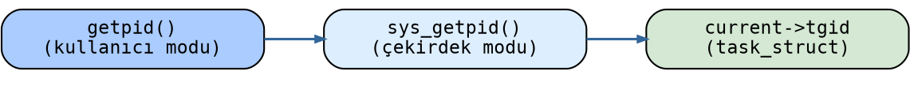

Şimdi aklınıza "neden her thread'te ayrıca ana thread'in pid değeri tgid ismiyle tutuluyor?" sorusu
gelebilir. Bunun iki nedeni vardır: Birincisi prosesin ana thread'i sonlanabilir, bu durumda ana thread'e
ilişkin ``task_struct`` nesnesine erişilemeyebilir. İkincisi ise bu yolla prosesin id değerine daha hızlı
erişimin sağlanabilmesidir.

Linux'ta thread'lere özgü pid değeri Linux'a özgü *gettid* fonksiyonu ile elde edilebilmektedir:

.. code-block:: c

   #define _GNU_SOURCE
   #include <unistd.h>

   pid_t gettid(void);

.. note::

   *gettid* fonksiyonunun bir POSIX fonksiyonu olmadığına dikkat ediniz.

group_leader Göstericisi
------------------------------

Aslında Linux çekirdeği thread'lere ilişkin ``task_struct`` nesnelerinde yalnızca prosesin ana thread'ine
ilişkin pid değerini değil, aynı zamanda ana thread'in ``task_struct`` nesnesinin adresini de
tutmaktadır. Ana thread'in ``task_struct`` nesnesinin adresi ``task_struct`` yapısının ``group_leader``
elemanında tutulmaktadır:

.. code-block:: c

   struct task_struct {
       /* ... */
       pid_t   pid;                        /* o thread'e ilişkin pid değeri */
       pid_t   tgid;                       /* ana thread'e ilişkin pid değeri */
       struct task_struct *group_leader;   /* ana thread'e ilişkin task_struct nesnesinin adresi */
       /* ... */
   };

Peki prosesin ana thread'i sonlandığında ``group_leader`` göstericisinin ve ``signal_struct`` yapısı
içerisindeki ``list_head`` düğümünün durumu ne olacaktır? İşte Linux çekirdeği prosesin ana thread'i
sonlandığında istisna olarak ana thread'e ilişkin ``task_struct`` nesnesini yok etmemektedir (başka bir
deyişle *hortlak (zombie)* olarak tutmaktadır). Yani bu ``group_leader`` göstericisi her zaman geçerli
bir ``task_struct`` nesnesini gösteriyor durumda olmaktadır.

real_parent ve parent Göstericileri
--------------------------------------------

Şimdi de Linux çekirdeğinde prosesler arasındaki altlık-üstlük ilişkisinin nasıl sağlandığı üzerinde
duralım. Bilindiği gibi UNIX/Linux sistemlerinde her proses başka bir prosesin thread'i tarafından *fork*
işlemi ile yaratılmaktadır. Bu durumda prosesi yaratan thread'in ilişkin olduğu prosese *üst proses
(parent process)*, yeni yaratılan prosese de *alt process (child process)* denilmektedir.

Her thread'in ``task_struct`` nesnesi içerisindeki ``real_parent`` ve ``parent`` isimli göstericiler o
thread'i yaratan thread'in ``task_struct`` nesnesinin adresini tutmaktadır:

.. code-block:: c

   struct task_struct {
       /* ... */
       pid_t   pid;
       pid_t   tgid;
       struct task_struct *group_leader;

       struct task_struct __rcu *real_parent;  /* fork yapan üst prosesteki thread */
       struct task_struct __rcu *parent;       /* fork yapan üst prosesteki thread */
       /* ... */
   };

Burada ``real_parent`` üst prosese ilişkin thread'in ``task_struct`` nesnesinin adresini tutmaktadır.
Normalde ``real_parent`` elemanı ile ``parent`` elemanı aynı ``task_struct`` nesnesini gösterir. Ancak
seyrek durumlarda (örneğin debug işlemlerinde ve *ptrace* işlemlerinde) geçici olarak ``parent`` başka
bir ``task_struct`` nesnesini de (reparenting işlemi) gösteriyor durumda olabilmektedir.

*getppid* POSIX fonksiyonu üst prosesin pid değerini vermektedir. İşte bu fonksiyonun çağırdığı
*sys_getppid* sistem fonksiyonu ``real_parent`` elemanının gösterdiği ``task_struct`` nesnesi içerisindeki
``tgid`` değerini geri döndürmektedir.

Alt Proses Listesi: children ve sibling Elemanları
----------------------------------------------------------

Şimdi de bir prosesin alt proseslerinin nasıl bağlı listelerde tutulduğu üzerinde duralım. Örneğin bir
proses üç kez *fork* yapmış olsun. Bu durumda bu prosesin üç tane alt prosesi olacaktır. Üst prosesleri
aynı olan proseslere *kardeş prosesler (sibling processes)* de denilmektedir. İşte bir prosesin alt
prosesleri ``children`` isimli kök düğümle erişilen ``sibling`` bağları yoluyla bağlı listede
tutulmaktadır:

.. code-block:: c

   struct task_struct {
       /* ... */
       struct list_head children;   /* alt proses listesinin kök düğümü */
       struct list_head sibling;    /* alt proseslerin bağlı liste bağı */
       /* ... */
   };

Aşağıdaki diyagram bu ilişkiyi görsel olarak ortaya koymaktadır. Üst prosesin ``children`` düğümü (kök)
mavi, alt proseslerin ``sibling`` düğümleri turuncu renkte gösterilmiştir:

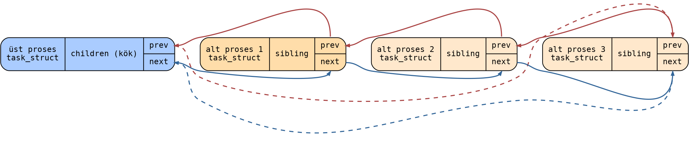

``sibling`` bağları her zaman prosesin ana thread'ine ilişkin (grup liderine ilişkin) ``task_struct``
nesnelerini göstermektedir. Bir thread akışında yeni bir thread yaratıldığı zaman yaratılan thread bu
``children``/``sibling`` listesinde bulunmaz; prosesin thread'leri yalnızca ``thread_head``/``thread_node``
listesinde tutulmaktadır.

Ayrıca Linux'ta alt proses listesi ana thread'in ``children`` kök düğümünden hareketle dolaşılmak
zorundadır. Alt prosesler yaratıldığında yalnızca ana thread'in ``children`` kök düğümü güncellenmektedir.

Tüm Proseslerin Listesi: tasks
------------------------------------

Çekirdek ayrıca proseslerin ana thread'lerine ilişkin ``task_struct`` nesnelerini de ``task_struct``
içerisindeki ``tasks`` isimli bir düğüm ile birbirine bağlamaktadır:

.. code-block:: c

   struct task_struct {
       /* ... */
       pid_t pid;
       pid_t tgid;
       struct task_struct *group_leader;

       struct task_struct __rcu *real_parent;
       struct task_struct __rcu *parent;

       struct list_head children;
       struct list_head sibling;
       struct list_head tasks;         /* ana thread'lerin tutulduğu liste bağı */
       /* ... */
   };

Bu ``tasks`` düğümlerine ilişkin bağlı listenin kök düğümü ``init_task`` prosesindedir. Linux'ta boot
işlemi sırasında ilk oluşturulan prosese *init_task* denilmektedir. Bu *init_task* prosesine ilişkin
``task_struct`` nesnesi statik bir biçimde ``init/init_task.c`` dosyasında bulunmaktadır. *init_task*
prosesinin pid değeri 0'dır. *init_task* prosesi *init* prosesini yarattıktan sonra işlevini sonlandırarak
durdurulmaktadır. Ancak bu prosese ilişkin ``task_struct`` nesnesi gerçek anlamda hiçbir zaman yok
edilmemektedir. İşte ``init_task.tasks`` elemanı proseslerin ana thread'lerine ilişkin ``task_struct``
nesnelerini dolaşmak için bir kök düğüm olarak kullanılmaktadır.

Aşağıdaki diyagram ``tasks`` bağlı listesini göstermektedir. Kök düğüm ``init_task`` (PID=0) koyu mavi,
proseslerin ana thread ``task_struct`` nesneleri açık mavi renktedir:

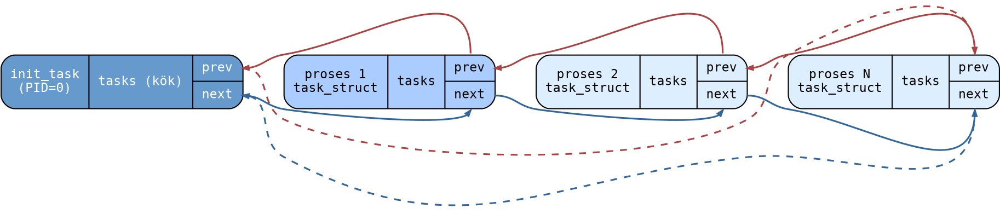

Özet: task_struct İlişkileri
----------------------------------

Yukarıda açıkladığımız konuyu madde madde özetleyelim:

- Her thread'in ayrı bir pid değeri vardır, ancak POSIX'teki *getpid* fonksiyonu ana thread'in (thread
  grup liderinin) pid değerini vermektedir.

- Bir prosesin tüm thread'lerini dolaşmak için ``signal`` göstericisinin gösterdiği ``signal_struct``
  yapısı içerisindeki ``thread_head`` bağlı listesi ``thread_node`` düğümleriyle dolaşılır.

- ``task_struct`` içerisindeki ``real_parent`` ve ``parent`` göstericileri o prosesi ya da thread'i
  yaratan thread'in ``task_struct`` nesnesini göstermektedir.

- ``task_struct`` içerisindeki ``tgid`` prosesin ana thread'inin pid değerini, ``group_leader``
  göstericisi ise prosesin ana thread'inin ``task_struct`` nesnesinin adresini tutmaktadır. Ana thread
  sonlansa bile onun ``task_struct`` nesnesi proses sonlanana kadar muhafaza edilmektedir.

- Bir prosesin bütün alt proseslerine ilişkin ana thread'lerin ``task_struct`` nesneleri
  ``children``/``sibling`` bağlı listesinde tutulmaktadır.

- Prosesin alt proseslerini elde etmek için prosesin ana thread'inin ``children`` kök düğümünden yola
  çıkmak gerekir.

- Çekirdek yaratılmış olan tüm proseslerin ana thread'lerine ilişkin ``task_struct`` nesnelerini ayrıca
  ``task_struct`` içerisindeki ``tasks`` düğümüyle birbirine bağlamaktadır. Bu düğümün kökü de
  ``init_task.tasks`` elemanıdır.

Sık Sorulan Sorular
--------------------

Aşağıda konuyla ilgili bazı işlemlerin bu bağlı listeler kullanılarak nasıl gerçekleştirileceğine yönelik
tipik sorular ve yanıtları verilmektedir:

**Soru:** Bir prosesin tüm thread'leri nasıl elde edilebilir?

Bir prosesin tüm thread'leri prosesin ``signal`` yapısı içerisinde bulunan ``thread_head`` elemanı kök
yapılarak ``thread_node`` düğümlerinin dolaşılmasıyla elde edilebilir.

**Soru:** Bir prosesin bütün alt prosesleri nasıl elde edilebilir?

Prosesin ana thread'indeki ``children`` düğümü kök yapılarak ``sibling`` düğümlerinin dolaşılmasıyla
prosesin tüm alt prosesleri elde edilebilir.

**Soru:** Bir ``task_struct`` nesnesinin prosesin ana thread'ine ilişkin olup olmadığı nasıl anlaşılır?

Eğer ``task_struct`` nesnesinde ``pid == tgid`` ise bu ``task_struct`` nesnesi ilgili prosesin ana
thread'ine ilişkin ``task_struct`` nesnesidir. Zaten prosesin tüm thread'lerine ilişkin ``task_struct``
nesnelerinde ``group_leader`` göstericisi ana thread'e ilişkin bu ``task_struct`` nesnesini
göstermektedir. O anda çalışmakta olan thread eğer prosesin ana thread'i ise ``current == group_leader``
koşulunun sağlanacağına da dikkat ediniz.

**Soru:** Sistemdeki tüm proseslerin ana thread'lerine ilişkin ``task_struct`` nesneleri nasıl dolaşılır?

``init_task`` prosesindeki ``tasks`` düğümü kök düğüm yapılıp ``tasks`` düğümleri dolaşılırsa tüm
proseslerin ana thread'lerine ilişkin ``task_struct`` nesneleri elde edilebilir.

task_struct Yapısına İlişkin Bağlı Listeler Üzerinde Gezinmelere Örnekler
==========================================================================

Şimdi de görmüş olduğumuz ``task_struct`` yapısına ilişkin bağlı listeler üzerinde gezinme işlemlerine
örnekler verelim. Bu biçimdeki küçük testler için çekirdeği yeniden derlememize gerek yoktur. Basit bir
karakter aygıt sürücüsü yazarak da bu işlemleri yapabiliriz.

Geliştirme Ortamının Hazırlanması
-----------------------------------

Genellikle bir Linux sistemini yüklediğimizde zaten çekirdek modüllerini ve aygıt sürücüleri
oluşturabilmek için gereken başlık dosyaları ve diğer gerekli öğeler ``/usr/src`` dizini içerisindeki
``linux-headers-$(uname -r)`` dizininde yüklü biçimde bulunmaktadır. Ancak bunlar yüklü değilse Debian
tabanlı sistemlerde bunları şöyle yükleyebilirsiniz:

.. code-block:: bash

   $ sudo apt-get install linux-headers-$(uname -r)

Derleme ve Yükleme
--------------------

Karakter aygıt sürücüleri bir ya da birden fazla kaynak ``.c`` dosyası oluşturularak yazılabilmektedir.
Aygıt sürücülerin derlenmesi oldukça karmaşık bir süreçle gerçekleşmektedir. Bu nedenle derleme işlemi
için hazır ``Makefile`` dosyaları bulundurulmuştur. Programcı kendisi bir ``Makefile`` dosyası oluşturup
asıl make dosyalarını buradan devreye sokar. Aygıt sürücüler için en basit ``Makefile`` dosyası aşağıdaki
gibi oluşturulabilir:

.. code-block:: makefile

   obj-m += ${file}.o

   all:
       make -C /lib/modules/$(shell uname -r)/build M=${PWD} modules
   clean:
       make -C /lib/modules/$(shell uname -r)/build M=${PWD} clean

Bu ``Makefile`` dışarıdan ``file`` isimli bir argüman almaktadır. Aygıt sürücünün derlenmesi şöyle
yapılır (kaynak dosya için uzantı belirtilmediğine dikkat ediniz):

.. code-block:: bash

   $ make file=mydriver

Aygıt sürücüler derlendikten sonra ``.ko`` uzantılı bir dosya elde edilecektir. Bu dosya çekirdeğe
yüklenmelidir. Aygıt sürücü dosyalarını (``.ko`` dosyalarını) çekirdeğe yüklemek için *insmod* ya da
*modprobe* komutları kullanılmaktadır. *insmod* komutu herhangi bir bağımlılığa bakmadan doğrudan yükleme
yapar. Biz kursumuzda aygıt sürücüleri *insmod* komutuyla yükleyeceğiz. Tabii aygıt sürücüleri
yükleyebilmek için *root* önceliğine sahip olmak gerekir. Örneğin:

.. code-block:: bash

   $ sudo insmod mydriver.ko

*insmod* ile yüklenmiş olan aygıt sürücü çekirdekten *rmmod* komutuyla çıkartılır:

.. code-block:: bash

   $ sudo rmmod mydriver.ko

Aygıt sürücünün yüklenip yüklenmediğini anlayabilmek için ``/proc/devices`` dosyasına başvurabilirsiniz.

Çekirdek Modülü ve Aygıt Sürücü Kavramları
--------------------------------------------

Aygıt sürücüler çekirdek modunda çekirdeğin bir parçasıymış gibi çalışan modüllerdir. Aygıt sürücüler
içerisinde kullanıcı modundaki standart C fonksiyonları ya da POSIX fonksiyonları kullanılamaz. Aygıt
sürücüler yalnızca çekirdek içerisinde *export* edilmiş fonksiyonları kullanabilirler. Bir fonksiyon ya
da nesne çekirdek kodlarında ``EXPORT_SYMBOL`` makrosu ile export edilmektedir. Örneğin:

.. code-block:: c

   void clear_nlink(struct inode *inode)
   {
       if (inode->i_nlink) {
           inode->__i_nlink = 0;
           atomic_long_inc(&inode->i_sb->s_remove_count);
       }
   }
   EXPORT_SYMBOL(clear_nlink);

Aslında Linux sistemlerinde bu bağlamda birbirleriyle ilişkili iki kavram vardır: *Çekirdek modülleri
(kernel modules)* ve *aygıt sürücüler (device drivers)*. Çekirdeğin içerisine yüklenebilen modüllere
"çekirdek modülleri" denilmektedir. Eğer bir çekirdek modülüne kullanıcı modundan bir dosya (buna *aygıt
dosyası (device file)* denilmektedir) yoluyla erişilip aygıt sürücüye işlemler yaptırılabiliyorsa bu tür
çekirdek modüllerine *aygıt sürücü (device driver)* de denilmektedir. Yani her aygıt sürücü bir çekirdek
modülü belirtir ancak her çekirdek modülü bir aygıt sürücü belirtmek zorunda değildir. Sistemdeki yüklü
olan çekirdek modülleri ``/proc/modules`` dosyası yoluyla, yüklü olan aygıt sürücüler ise
``/proc/devices`` dosyası yoluyla görüntülenebilmektedir.

Aşağıda iskelet bir çekirdek modülü görüyorsunuz:

.. code-block:: c

   #include <linux/module.h>
   #include <linux/kernel.h>

   MODULE_LICENSE("GPL");

   static int helloworld_init(void);
   static void helloworld_exit(void);

   static int helloworld_init(void)
   {
       printk(KERN_INFO "Hello World...\n");

       return 0;
   }

   static void helloworld_exit(void)
   {
       printk(KERN_INFO "Goodbye World...\n");
   }

   module_init(helloworld_init);
   module_exit(helloworld_exit);

Bir çekirdek modülü *insmod* komutuyla yüklendiğinde onun ``module_init`` makrosuyla belirtilen fonksiyonu
çağrılmaktadır. Çekirdek modülü *rmmod* ile sistemden çıkartılırken de ``module_exit`` makrosunda
belirtilen fonksiyon çağrılmaktadır.

Çekirdek modülleri içerisinde birtakım mesajlar iletilmek isteniyorsa bu mesajlar *kernel ring buffer*
denilen log sistemine yazdırılmaktadır. Bu log sistemine yazdırılan yazılar *dmesg* komutuyla ya da
``/var/log/syslog`` dosyası ile görüntülenebilmektedir. Çekirdek modülü içerisinde bu log sistemine
mesajlar *printk* isimli çekirdek fonksiyonuyla yazılmaktadır. Örneğin:

.. code-block:: c

   printk(KERN_INFO "Goodbye World...\n");

``KERN_INFO`` mesajın türünü belirtmektedir. ``KERN_INFO`` ile diğer argüman arasında virgül atomunun
bulunmadığına dikkat ediniz. ``KERN_INFO`` aslında bir sembolik sabittir ve bir string açımı
yapmaktadır. (C'de yana yana iki string'in birleştirildiğini anımsayınız.) ``KERN_INFO`` mesaj türü ile
mesaj yazdırmanın daha basit yolu ``pr_info`` makrosunu kullanmaktadır:

.. code-block:: c

   pr_info("Goodbye World...\n");

Aygıt Dosyaları
---------------

Aygıt sürücülere erişmekte kullanılan özel dosyalara *aygıt dosyaları (device files)* denilmektedir.
Aygıt dosyası *open* POSIX fonksiyonuyla açıldığında çekirdek diske değil yüklü olan aygıt sürücüye
referans etmektedir. Kullanıcı modundaki programcı aygıt dosyası üzerinde dosya işlemlerini yaptığında
aslında programın akışı çekirdek moduna geçerek aygıt sürücü içerisindeki ilgili fonksiyonlar
çalıştırılmaktadır:

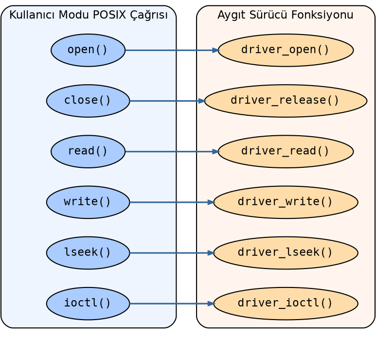

Linux sistemlerinde aygıt sürücüler (ve dolayısıyla aygıt dosyaları) iki kısma ayrılmaktadır:

- *Karakter Aygıt Sürücüleri (Character Device Drivers)*
- *Blok Aygıt Sürücüleri (Block Device Drivers)*

Blok aygıt sürücüleri *hard disk, SSD, CDROM, ramdisk* gibi blok blok transferlerin yapıldığı aygıtlar
söz konusu olduğunda kullanılmaktadır. Karakter aygıt sürücülerine ilişkin aygıt dosyaları UNIX/Linux
sistemlerinde ``c`` dosya türü ile, blok aygıt sürücülerine ilişkin aygıt dosyaları ise ``b`` dosya türü
ile temsil edilmektedir.

UNIX/Linux sistemlerinde aygıt dosyaları genel olarak ``/dev`` dizininde bulunmaktadır. Linux
sistemlerinde *udev* denilen bir servis (daemon) ile bu dizinde aygıt dosyalarının yaratılması mümkün
hale getirilmiştir.

Aygıt Sürücülerin Majör ve Minör Numaraları
--------------------------------------------

Her aygıt sürücünün *majör* ve *minör* numarası vardır. Bu majör ve minör numaralar çekirdeğin aygıt
sürücüye erişebilmesi için bir adres görevi görmektedir. Majör numara aygıt sürücünün ana kodunu temsil
eder. Minör numara ise onun örneklerini (instances) temsil etmektedir.

Aygıt dosyaları komut satırında *mknod* isimli programla yaratılmaktadır:

.. code-block:: bash

   $ sudo mknod -m 666 mydriver c 250 0

Tipik olarak sistem programcısı bir *kabuk betiği (shell script)* yazarak bu işlemi otomatize eder. Bu
betik önce *insmod* ile aygıt sürücüyü yükler, ``/proc/devices`` dosyasına başvurup onun majör numarasını
elde eder ve aygıt dosyasını *mknod* komutuyla dinamik bir biçimde oluşturur. Biz de denemelerimizde
böyle yapacağız. Bunun için aşağıdaki gibi bir *load* betiği kullanacağız:

.. code-block:: bash

   #!/bin/bash
   # load  (bu satırı dosyaya kopyalamayınız)

   module=$1
   mode=666

   /sbin/insmod ./${module}.ko ${@:2} || exit 1
   major=$(awk "\$2 == \"$module\" {print \$1}" /proc/devices)
   rm -f $module
   mknod -m $mode $module c $major 0

Bu betik dosyasını oluşturduktan sonra dosyaya ``x`` hakkını vermeyi unutmayınız:

.. code-block:: bash

   $ chmod +x load
   $ sudo ./load mydriver

Aygıt sürücüyü *rmmod* ile çıkartıp ilgili aygıt dosyasını silen *unload* betiği de aşağıdaki gibi
yazılabilir:

.. code-block:: bash

   #!/bin/bash
   # unload  (bu satırı dosyaya kopyalamayınız)

   module=$1

   /sbin/rmmod ./${module}.ko || exit 1
   rm -f $module

.. code-block:: bash

   $ chmod +x unload
   $ sudo ./unload mydriver

İskelet Karakter Aygıt Sürücüsü Örneği
--------------------------------------

Aşağıda iskelet bir karakter aygıt sürücüsü oluşturulmuştur. Bu karakter aygıt sürücüsü için bir ioctl
kodu da hazırlanmıştır.

``test-driver.h``

.. code-block:: c

   #ifndef TEST_DRIVER_H_
   #define TEST_DRIVER_H_

   #include <linux/stddef.h>
   #include <linux/ioctl.h>

   #define TEST_DRIVER_MAGIC    't'
   #define IOC_TEST             _IO(TEST_DRIVER_MAGIC, 0)

   #endif

``test-driver.c``

.. code-block:: c

   #include <linux/module.h>
   #include <linux/kernel.h>
   #include <linux/fs.h>
   #include <linux/cdev.h>
   #include "test-driver.h"

   MODULE_LICENSE("GPL");
   MODULE_AUTHOR("Kaan Aslan");
   MODULE_DESCRIPTION("test-driver");

   static int test_driver_open(struct inode *inodep, struct file *filp);
   static int test_driver_release(struct inode *inodep, struct file *filp);
   static ssize_t test_driver_read(struct file *filp, char *buf, size_t size, loff_t *off);
   static ssize_t test_driver_write(struct file *filp, const char *buf, size_t size, loff_t *off);
   static long test_driver_ioctl(struct file *filp, unsigned int cmd, unsigned long arg);
   static long ioctl_test(struct file *filp, unsigned long arg);

   static dev_t g_dev;
   static struct cdev g_cdev;
   static struct file_operations g_fops = {
       .owner = THIS_MODULE,
       .open = test_driver_open,
       .read = test_driver_read,
       .write = test_driver_write,
       .release = test_driver_release,
       .unlocked_ioctl = test_driver_ioctl
   };

   static int __init test_driver_init(void)
   {
       int result;

       printk(KERN_INFO "test-driver module initialization...\n");

       if ((result = alloc_chrdev_region(&g_dev, 0, 1, "test-driver")) < 0) {
           printk(KERN_INFO "cannot alloc char driver!...\n");
           return result;
       }
       cdev_init(&g_cdev, &g_fops);
       if ((result = cdev_add(&g_cdev, g_dev, 1)) < 0) {
           unregister_chrdev_region(g_dev, 1);
           printk(KERN_ERR "cannot add device!...\n");
           return result;
       }

       return 0;
   }

   static void __exit test_driver_exit(void)
   {
       cdev_del(&g_cdev);
       unregister_chrdev_region(g_dev, 1);
       printk(KERN_INFO "test-driver module exit...\n");
   }

   static int test_driver_open(struct inode *inodep, struct file *filp)
   {
       printk(KERN_INFO "test-driver opened...\n");

       return 0;
   }

   static int test_driver_release(struct inode *inodep, struct file *filp)
   {
       printk(KERN_INFO "test-driver closed...\n");

       return 0;
   }

   static ssize_t test_driver_read(struct file *filp, char *buf, size_t size, loff_t *off)
   {
       printk(KERN_INFO "test-driver read...\n");

       return 0;
   }

   static ssize_t test_driver_write(struct file *filp, const char *buf, size_t size, loff_t *off)
   {
       printk(KERN_INFO "test-driver write...\n");

       return 0;
   }

   static long test_driver_ioctl(struct file *filp, unsigned int cmd, unsigned long arg)
   {
       long result;

       printk(KERN_INFO "test_driver_ioctl...\n");

       switch (cmd) {
           case IOC_TEST:
               result = ioctl_test(filp, arg);
               break;
           default:
               result = -ENOTTY;
       }

       return result;
   }

   long ioctl_test(struct file *filp, unsigned long arg)
   {
       printk(KERN_INFO "IOC_test_driver_TEST1\n");

       return 0;
   }

   module_init(test_driver_init);
   module_exit(test_driver_exit);

``Makefile``

.. code-block:: makefile

    obj-m += ${file}.o

    all:
        make -C /lib/modules/$(shell uname -r)/build M=${PWD} modules
    clean:
        make -C /lib/modules/$(shell uname -r)/build M=${PWD} clean

``load``

.. code-block:: bash

    #!/bin/bash

    module=$1
    mode=666

    /sbin/insmod ./${module}.ko ${@:2} || exit 1
    major=$(awk "\$2 == \"$module\" {print \$1}" /proc/devices)
    rm -f $module
    mknod -m $mode $module c $major 0

``unload``

.. code-block:: bash

    #!/bin/bash

    module=$1

    /sbin/rmmod ./${module}.ko || exit 1
    rm -f $module

Aygıt sürücüyü şöyle derleyebilirsiniz:

.. code-block:: bash

   $ make file=test-driver
   $ sudo ./load test-driver

Testi yaptıktan sonra aygıt sürücüyü çekirdekten şöyle çıkartabilirsiniz:

.. code-block:: bash

   $ sudo ./unload test-drive

Aşağıdaki kullanıcı modu programı aygıt sürücüyü açıp ioctl kodunu çalıştırmaktadır:

``app.c``

.. code-block:: c

   #include <stdio.h>
   #include <stdlib.h>
   #include <fcntl.h>
   #include <unistd.h>
   #include <sys/ioctl.h>
   #include "test-driver.h"

   void exit_sys(const char *msg);

   int main(void)
   {
       int fd;

       if ((fd = open("test-driver", O_RDONLY)) == -1)
           exit_sys("open");

       if (ioctl(fd, IOC_TEST) == -1)
           exit_sys("ioctl");

       close(fd);

       return 0;
   }

   void exit_sys(const char *msg)
   {
       perror(msg);
       exit(EXIT_FAILURE);
   }

.. code-block:: bash

   $ gcc -Wall -o app app.c
   $ ./app

*app* programını çalıştırdıktan sonra *dmesg* komutunu kullandığımızda log mesajları aşağıdaki gibi
görülmelidir:

.. code-block:: text

   [  431.787375] test-driver module initialization...
   [  450.631940] test-driver opened...
   [  450.631953] test_driver_ioctl...
   [  450.631958] IOC_test_driver_TEST1
   [  450.631967] test-driver closed...

RCU Mekanizması ile task_struct Listelerinin Dolaşılması
------------------------------------------------------------

Biz ``task_struct`` listelerini dolaşırken çekirdek bu listelere eleman eklerse ya da bu listelerden
eleman silerse bizim dolaşım yapan kodumuzda *tanımsız davranışlar (undefined behaviours)* oluşabilir.
Bu da tüm sistemin çökmesine yol açabilir. Artık belli bir süredir çekirdek ``task_struct`` listeleri
üzerinde kilitsiz bir biçimde *RCU (Read-Copy-Update)* mekanizmasıyla işlemler yapmaktadır. Dolayısıyla
bizim de kendimizi çekirdeğin kullandığı bu RCU mekanizmasına uydurarak dolaşım yapmamız gerekir.

RCU mekanizmasının ayrıntılarını ileride ayrı başlıkta ele alacağız. Ancak bu noktada RCU mekanizması
ile ``task_struct`` listelerinin dolaşılması için bazı temel bilgileri de vereceğiz.

RCU mekanizmasıyla bağlı listeleri dolaşırken işlemin başında *rcu_read_lock* fonksiyonunun, işlemin
sonunda da *rcu_read_unlock* fonksiyonunun çağrılması gerekmektedir:

.. code-block:: c

   #include <linux/rcupdate.h>

   void rcu_read_lock(void);
   void rcu_read_unlock(void);

Bizim dolaşım kodunu bu iki çağrı arasına yerleştirmemiz gerekir. RCU mekanizması altında bağlı listelerin
bağlarına erişilirken ``rcu_dereference`` makrosu kullanılmalıdır. Örneğin sistemdeki bütün proseslerin
ana thread'lerine ilişkin ``task_struct`` nesneleri aşağıdaki gibi güvenli bir biçimde dolaşılabilir:

.. code-block:: c

   static void walk_processes(void)
   {
       struct task_struct *ts;
       struct list_head *lh;

       rcu_read_lock();

       lh = rcu_dereference(init_task.tasks.next);
       while (lh != &init_task.tasks) {
           ts = container_of(lh, struct task_struct, tasks);
           printk(KERN_INFO "PID = %d, COMM = %s", ts->pid, ts->comm);
           lh = rcu_dereference(ts->tasks.next);
       }

       rcu_read_unlock();
   }

``container_of`` makrosu ile ``list_entry`` makrosunun tamamen eşdeğer olduğunu anımsayınız.
``task_struct`` içerisindeki ``comm`` elemanında en fazla 16 karakterlik ``task_struct`` nesnesini
betimleyen bir yazı bulunmaktadır. *fork* işlemi ya da thread yaratımı sırasında bu yazı üst prosesin
``comm`` elemanından kopyalanmaktadır. *exec* işlemleri sırasında ise bu yazı çalıştırılan programın
dosya isminden hareketle değiştirilmektedir.

``<linux/sched/signal.h>`` dosyası içerisinde ``next_task`` isimli bir makro da vardır. Bu makro bir
``task_struct`` nesnesinin adresini parametre olarak alıp RCU mekanizmasına uygun olarak onun
``tasks.next`` göstericisinin gösterdiği yerdeki ``task_struct`` nesnesinin adresini vermektedir:

.. code-block:: c

   #include <linux/sched/signal.h>

   next_task(p)

Bu makro kullanılarak *walk_process* fonksiyonu şöyle de yazılabilir:

.. code-block:: c

   static void walk_processes(void)
   {
       struct task_struct *ts;

       rcu_read_lock();

       ts = next_task(&init_task);
       while (ts != &init_task) {
           printk(KERN_INFO "PID = %d, COMM = %s", ts->pid, ts->comm);
           ts = next_task(ts);
       }

       rcu_read_unlock();
   }

Tüm Prosesleri Dolaşan Çekirdek Modülü Örneği
---------------------------------------------

Aşağıda tüm proseslerin ana thread'lerini dolaşan örnek bir çekirdek modülü verilmiştir.

``test-module.c``

.. code-block:: c

   #include <linux/module.h>
   #include <linux/kernel.h>
   #include <linux/rcupdate.h>

   MODULE_LICENSE("GPL");

   static int test_module_init(void);
   static void test_module_exit(void);
   static void walk_processes(void);

   static int test_module_init(void)
   {
       printk(KERN_INFO "test_module_init...\n");
       walk_processes();

       return 0;
   }

   static void walk_processes(void)
   {
       struct task_struct *ts;

       rcu_read_lock();

       ts = next_task(&init_task);
       while (ts != &init_task) {
           printk(KERN_INFO "PID = %d, COMM = %s", ts->pid, ts->comm);
           ts = next_task(ts);
       }

       rcu_read_unlock();
   }

   static void test_module_exit(void)
   {
       printk(KERN_INFO "test_module_exit...\n");
   }

   module_init(test_module_init);
   module_exit(test_module_exit);

``<linux/sched/signal.h>`` başlık dosyasında bulunan ``for_each_process`` isimli döngü makrosu da
``tasks`` listesini daha kolay dolaşmak için kullanılabilmektedir. Bu makro kendi içerisinde
``rcu_dereference`` işlemini de yapmaktadır:

.. code-block:: c

   rcu_read_lock();

   for_each_process(ts) {
       /* ... */
   }

   rcu_read_unlock();

Aşağıda çekirdek modülünün kodlarını bütünsel olarak veriyoruz:

``test-module.c``

.. code-block:: c

   #include <linux/module.h>
   #include <linux/kernel.h>
   #include <linux/sched/signal.h>

   MODULE_LICENSE("GPL");

   static int test_module_init(void);
   static void test_module_exit(void);
   static void walk_processes(void);

   static int test_module_init(void)
   {
       printk(KERN_INFO "test_module_init...\n");
       walk_processes();

       return 0;
   }

   static void walk_processes(void)
   {
       struct task_struct *ts;

       rcu_read_lock();

       for_each_process(ts) {
           printk(KERN_INFO "PID = %d, COMM = %s", ts->pid, ts->comm);
       }

       rcu_read_unlock();
   }

   static void test_module_exit(void)
   {
       printk(KERN_INFO "test_module_exit...\n");
   }

   module_init(test_module_init);
   module_exit(test_module_exit);

Ayrıca ``<linux/rculist.h>`` dosyasında bulunan ``list_for_each_entry_rcu`` isimli döngü makrosu da
RCU mekanizmasına uygun biçimde bağlı listeleri dolaşmak için kullanılabilmektedir:

.. code-block:: c

   #include <linux/rculist.h>

   list_for_each_entry_rcu(pos, head, member)

Bu makroyu kullanarak tüm proseslerin ana thread'lerini dolaşan fonksiyon şöyle yazılabilir:

.. code-block:: c

   static void walk_processes(void)
   {
       struct task_struct *ts;

       rcu_read_lock();

       list_for_each_entry_rcu(ts, &init_task.tasks, tasks) {
           printk(KERN_INFO "PID = %d, COMM = %s", ts->pid, ts->comm);
       }

       rcu_read_unlock();
   }

Aynı başlık dosyasındaki ``list_entry_rcu`` makrosu bir bağın adresini alarak RCU mekanizmasına uygun bir
biçimde bağın bulunduğu nesnenin adresini vermektedir. Aslında önceki paragraflarda gördüğümüz
``next_task`` makrosu da bu makro kullanılarak yazılmıştır:

.. code-block:: c

   #define next_task(p) \
       list_entry_rcu((p)->tasks.next, struct task_struct, tasks)

Thread Listesini Dolaşan Aygıt Sürücü Örneği
--------------------------------------------

Şimdi de thread'lere ilişkin ``task_struct`` nesnelerinin dolaşılmasına örnekler verelim. Anımsanacağı
gibi yeni çekirdeklerde belli bir prosesin thread'lerine ilişkin ``task_struct`` nesneleri
``signal_struct`` nesnesindeki ``thread_head`` düğümü kök alınarak ``thread_node`` düğümlerinin
dolaşılmasıyla elde ediliyordu.

Belli bir prosesin thread'lerinin dolaşılabilmesi için çekirdek modülü yetersiz kalmaktadır. Çünkü
çekirdek modüllerindeki fonksiyonlar dışarıdan prosesler tarafından çağrılamamaktadır. Bu nedenle thread
dolaşım testlerini ancak bir aygıt sürücü yazarak oluşturabiliriz. Aygıt sürücülerdeki fonksiyonlar
kullanıcı modundaki thread'ler tarafından çağrılabilmektedir. Bu fonksiyonlarda *current* makrosu
kullanıldığında ilgili fonksiyonu çağıran thread'in ``task_struct`` nesnesinin adresi elde edilecektir.

Prosesin thread'leri aşağıdaki gibi dolaşılabilir:

.. code-block:: c

   static void walk_process_thread(void)
   {
       struct task_struct *ts;

       rcu_read_lock();

       list_for_each_entry_rcu(ts, &current->signal->thread_head, thread_node) {
           printk(KERN_INFO "Thread PID = %d, COMM = %s", ts->pid, ts->comm);
       }

       rcu_read_unlock();
   }

Bir ``task_struct`` adresini alıp onun ``thread_node.next`` göstericisinin gösterdiği yerdeki
``task_struct`` adresini veren ``next_thread`` isimli bir fonksiyon da vardır:

.. code-block:: c

   #include <linux/sched/signal.h>

   static inline struct task_struct *next_thread(struct task_struct *p)
   {
       return __next_thread(p) ?: p->group_leader;
   }

Bu fonksiyon ile prosesin herhangi bir thread'inden başlayarak tüm thread'leri dolaşılabilir:

.. code-block:: c

   static void walk_process_thread(void)
   {
       struct task_struct *ts;

       rcu_read_lock();

       ts = current;
       do {
           printk(KERN_INFO "Thread PID = %d, COMM = %s", ts->pid, ts->comm);
           ts = next_thread(ts);
       } while (ts != current);

       rcu_read_unlock();
   }

Aslında prosesin thread'lerini basit bir biçimde dolaşmak için ``for_each_thread`` döngü makrosu tercih
edilmektedir. Makronun birinci parametresi prosesin herhangi bir thread'inin ``task_struct`` adresini
almaktadır. Döngü her yinelendikçe yeni bir thread'e ilişkin ``task_struct`` yapının adresi ikinci
parametreyle belirtilen göstericinin içerisine yerleştirilmektedir:

.. code-block:: c

   #include <linux/sched/signal.h>

   for_each_thread(p, t)

.. code-block:: c

   static void walk_process_thread(void)
   {
       struct task_struct *ts;

       rcu_read_lock();

       for_each_thread(current, ts) {
           printk(KERN_INFO "Thread PID = %d, COMM = %s", ts->pid, ts->comm);
       }

       rcu_read_unlock();
   }

Aşağıda prosesin thread'lerini dolaşan örnek aygıt sürücü kodlarının tamamı verilmiştir. Aygıt sürücüyü yükledikten 
sonra ``app`` programı çalıştırmalısınız. Bu program önce 10 tane thread yaratıp sonra aygıt sürücüdeki ``ioctl`` kodunu 
çalıştırmaktadır. Ekrana çıkan thread'lere ilişkin pid değerleriyle ``dmesg`` komutunun çıktısını karşılaştırınızız.

``test-driver.h``

.. code-block:: c

    #ifndef TEST_DRIVER_H_
    #define TEST_DRIVER_H_

    #include <linux/stddef.h>
    #include <linux/ioctl.h>

    #define TEST_DRIVER_MAGIC   't'
    #define IOC_TEST            _IO(TEST_DRIVER_MAGIC, 0)

    #endif

``test-driver.c``

.. code-block:: c

    #include <linux/module.h>
    #include <linux/kernel.h>
    #include <linux/fs.h>
    #include <linux/cdev.h>
    #include "test-driver.h"

    MODULE_LICENSE("GPL");
    MODULE_AUTHOR("Kaan Aslan");
    MODULE_DESCRIPTION("test-driver");

    static int test_driver_open(struct inode *inodep, struct file *filp);
    static int test_driver_release(struct inode *inodep, struct file *filp);
    static ssize_t test_driver_read(struct file *filp, char *buf, size_t size, loff_t *off);
    static ssize_t test_driver_write(struct file *filp, const char *buf, size_t size, loff_t *off);
    static long test_driver_ioctl(struct file *filp, unsigned int cmd, unsigned long arg);

    static long ioctl_test(struct file *filp, unsigned long arg);
    static void walk_process_thread(void);

    static dev_t g_dev;
    static struct cdev g_cdev;
    static struct file_operations g_fops = {
        .owner          = THIS_MODULE,
        .open           = test_driver_open,
        .read           = test_driver_read,
        .write          = test_driver_write,
        .release        = test_driver_release,
        .unlocked_ioctl = test_driver_ioctl
    };

    static int __init test_driver_init(void)
    {
        int result;

        printk(KERN_INFO "test-driver module initialization...\n");

        if ((result = alloc_chrdev_region(&g_dev, 0, 1, "test-driver")) < 0) {
            printk(KERN_INFO "cannot alloc char driver!...\n");
            return result;
        }
        cdev_init(&g_cdev, &g_fops);
        if ((result = cdev_add(&g_cdev, g_dev, 1)) < 0) {
            unregister_chrdev_region(g_dev, 1);
            printk(KERN_ERR "cannot add device!...\n");
            return result;
        }

        return 0;
    }

    static void __exit test_driver_exit(void)
    {
        cdev_del(&g_cdev);
        unregister_chrdev_region(g_dev, 1);

        printk(KERN_INFO "test-driver module exit...\n");
    }

    static int test_driver_open(struct inode *inodep, struct file *filp)
    {
        printk(KERN_INFO "test-driver opened...\n");

        return 0;
    }

    static int test_driver_release(struct inode *inodep, struct file *filp)
    {
        printk(KERN_INFO "test-driver closed...\n");

        return 0;
    }

    static ssize_t test_driver_read(struct file *filp, char *buf, size_t size, loff_t *off)
    {
        printk(KERN_INFO "test-driver read...\n");

        return 0;
    }

    static ssize_t test_driver_write(struct file *filp, const char *buf, size_t size, loff_t *off)
    {
        printk(KERN_INFO "test-driver write...\n");

        return 0;
    }

    static long test_driver_ioctl(struct file *filp, unsigned int cmd, unsigned long arg)
    {
        long result;

        printk(KERN_INFO "test_driver_ioctl...\n");

        switch (cmd) {
            case IOC_TEST:
                result = ioctl_test(filp, arg);
                break;
            default:
                result = -ENOTTY;
        }

        return result;
    }

    long ioctl_test(struct file *filp, unsigned long arg)
    {
        walk_process_thread();

        return 0;
    }

    static void walk_process_thread(void)
    {
        struct task_struct *ts;

        rcu_read_lock();

        for_each_thread(current, ts) {
            printk(KERN_INFO "Thread PID = %d, COMM = %s", ts->pid, ts->comm);
        }

        rcu_read_unlock();
    }

    module_init(test_driver_init);
    module_exit(test_driver_exit);

``Makefile``

.. code-block:: makefile

    obj-m += ${file}.o

    all:
    	make -C /lib/modules/$(shell uname -r)/build M=${PWD} modules
    clean:
    	make -C /lib/modules/$(shell uname -r)/build M=${PWD} clean

``load``

.. code-block:: bash

    #!/bin/bash

    module=$1
    mode=666

    /sbin/insmod ./${module}.ko ${@:2} || exit 1
    major=$(awk "\$2 == \"$module\" {print \$1}" /proc/devices)
    rm -f $module
    mknod -m $mode $module c $major 0

``unload``

.. code-block:: bash

    #!/bin/bash

    module=$1

    /sbin/rmmod ./${module}.ko || exit 1
    rm -f $module

``app.c``

.. code-block:: c

    #define _GNU_SOURCE

    #include <stdio.h>
    #include <stdlib.h>
    #include <string.h>
    #include <stdint.h>
    #include <fcntl.h>
    #include <unistd.h>
    #include <pthread.h>
    #include <sys/ioctl.h>
    #include "test-driver.h"

    #define NTHREADS    10

    void exit_sys(const char *msg);
    void *thread_proc(void *param);

    int main(void)
    {
        int fd;
        int result;
        pthread_t tids[NTHREADS];

        for (int i = 0; i < NTHREADS; ++i) {
            if ((result = pthread_create(&tids[i], NULL, thread_proc, NULL)) != 0) {
                fprintf(stderr, "pthread_create: %s\n", strerror(result));
                exit(EXIT_FAILURE);
            }
        }

        if ((fd = open("test-driver", O_RDONLY)) == -1)
            exit_sys("open");

        if (ioctl(fd, IOC_TEST) == -1)
            exit_sys("ioctl");

        close(fd);

        for (int i = 0; i < NTHREADS; ++i)
            pthread_join(tids[i], NULL);

        return 0;
    }

    void *thread_proc(void *param)
    {
        printf("Thread PID: %jd\n", (intmax_t)gettid());

        sleep(120);

        return NULL;
    }

    void exit_sys(const char *msg)
    {
        perror(msg);
        exit(EXIT_FAILURE);
    }

Tüm task_struct Nesnelerinin Dolaşılması
----------------------------------------

Peki sistemdeki bütün ``task_struct`` nesnelerini dolaşabilir miyiz? Bunu yapmanın en pratik yolu
``init_task`` nesnesinden hareketle tüm proseslerin ana thread'lerine ilişkin ``task_struct`` nesnelerini
elde edip o ana thread'lerden faydalanarak onların diğer thread'lerine ilişkin ``task_struct`` nesnelerini
elde etmektir. Aslında bunu iç içe iki döngü oluşturarak RCU mekanizması eşliğinde yapan
``for_each_process_thread`` isimli bir makro vardır:

.. code-block:: c

    #include <linux/sched/signal.h>

    #define for_each_process_thread(p, t)   \
        for_each_process(p) for_each_thread(p, t)

Makroya biz iki ``task_struct`` göstericisi veririz. Makro her yinelemede prosesin ana thread'ine
ilişkin ``task_struct`` nesnesinin adresini birinci parametreyle verilen göstericinin içerisine, o
prosesin thread'lerine ilişkin ``task_struct`` nesnelerinin adresleri de ikinci parametreyle verilen
göstericinin içerisine yerleştirmektedir. O halde tüm thread'lere ilişkin ``task_struct`` nesneleri
aşağıdaki gibi elde edilebilir:

.. code-block:: c

    static void walk_all_threads(void)
    {
        struct task_struct *tsp;
        struct task_struct *tst;

        rcu_read_lock();

        for_each_process_thread(tsp, tst) {
            printk(KERN_INFO "Process Main Thread PID = %d, Thread PID == %d COMM = %s\n",
                   tsp->pid, tst->pid, tst->comm);
        }

        rcu_read_unlock();
    }

Tabii proseslerin thread'lerini girinti biçimde göstermek için kodu aşağıdaki gibi de
düzenleyebiliriz:

.. code-block:: c

    static void walk_all_threads(void)
    {
        struct task_struct *tsp;
        struct task_struct *tst;

        rcu_read_lock();

        for_each_process_thread(tsp, tst) {
            if (tsp == tst) {
                printk(KERN_INFO "Process Main Thread PID = %d, COMM = %s\n", tsp->pid, tst->comm);
            }
            else {
                printk(KERN_INFO "Thread PID == %d COMM = %s\n", tst->pid, tst->comm);
            }
        }

        rcu_read_unlock();
    }

``dmesg`` çıktısı aşağıdakine benzer biçimde elde edilecektir:

.. code-block:: none

    ...
    [ 6022.928026] Process Main Thread PID = 3494, COMM = kworker/u257:2
    [ 6022.928027] Process Main Thread PID = 3997, COMM = kworker/1:0
    [ 6022.928042] Process Main Thread PID = 4271, COMM = kworker/0:0
    [ 6022.928044] Process Main Thread PID = 4279, COMM = kworker/u259:0
    [ 6022.928045] Process Main Thread PID = 4543, COMM = kworker/3:1
    [ 6022.928048] Process Main Thread PID = 4546, COMM = kworker/5:2
    [ 6022.928049] Process Main Thread PID = 4547, COMM = kworker/u264:2
    [ 6022.928051] Process Main Thread PID = 4565, COMM = bash
    [ 6022.928053] Process Main Thread PID = 4599, COMM = app
    [ 6022.928054]     Thread PID == 4600 COMM = app
    [ 6022.928056]     Thread PID == 4601 COMM = app
    [ 6022.928057]     Thread PID == 4602 COMM = app
    [ 6022.928059]     Thread PID == 4603 COMM = app
    [ 6022.928060]     Thread PID == 4604 COMM = app
    [ 6022.928062]     Thread PID == 4605 COMM = app
    [ 6022.928064]     Thread PID == 4606 COMM = app
    [ 6022.928081]     Thread PID == 4607 COMM = app
    [ 6022.928083]     Thread PID == 4608 COMM = app
    [ 6022.928084]     Thread PID == 4609 COMM = app
    [ 6022.928087] Process Main Thread PID = 4610, COMM = sudo
    [ 6022.928089] Process Main Thread PID = 4611, COMM = sudo
    [ 6022.928090] Process Main Thread PID = 4612, COMM = insmod
    ...

Aşağıda bu işlemi yapan çekirdek modülünün tüm kodları verilmiştir.

``test-module.c``

.. code-block:: c

    #include <linux/module.h>
    #include <linux/kernel.h>
    #include <linux/sched/signal.h>

    MODULE_LICENSE("GPL");

    static int test_module_init(void);
    static void test_module_exit(void);
    static void walk_all_threads(void);

    static int test_module_init(void)
    {
        printk(KERN_INFO "test_module_init...\n");

        walk_all_threads();

        return 0;
    }

    static void walk_all_threads(void)
    {
        struct task_struct *tsp;
        struct task_struct *tst;

        rcu_read_lock();

        for_each_process_thread(tsp, tst) {
            if (tsp == tst) {
                printk(KERN_INFO "Process Main Thread PID = %d, COMM = %s\n", tsp->pid, tst->comm);
            }
            else {
                printk(KERN_INFO "Thread PID == %d COMM = %s\n", tst->pid, tst->comm);
            }
        }

        rcu_read_unlock();
    }

    static void test_module_exit(void)
    {
        printk(KERN_INFO "test_module_exit...\n");
    }

    module_init(test_module_init);
    module_exit(test_module_exit);

``Makefile``

.. code-block:: makefile

    obj-m += ${file}.o

    all:
    	make -C /lib/modules/$(shell uname -r)/build M=${PWD} modules
    clean:
    	make -C /lib/modules/$(shell uname -r)/build M=${PWD} clean

Alt Proses Listesininin Dolaşılması
-----------------------------------

Şimdi de son olarak bir prosesin alt proseslerini dolaşalım. Anımsanacağı gibi prosesin alt proses
listesinin kök düğümü ana prosesin ana thread'ine ilişkin ``task_struct`` nesnesinin ``children``
elemanında tutuluyordu. Bu ``children`` elemanı ``task_struct`` içerisindeki ``sibling`` düğümlerini
dolaşmakta kullanılıyordu. ``children``/``sibling`` listesinde yalnızca alt proseslerin ana thread'lerine
ilişkin ``task_struct`` nesnelerinin bulunduğunu da anımsayınız.

Alt prosesleri dolaşan hazır bir döngü makrosu yoktur. Ancak biz yukarıdaki tekniklerle dolaşımı
yapabiliriz. Örneğin bunun için RCU mekanizmasıyla bağlı listeyi dolaşan ``list_for_each_entry_rcu``
döngü makrosundan faydalanabiliriz:

.. code-block:: c

    static void walk_child_processes(void)
    {
        struct task_struct *ts;

        rcu_read_lock();

        list_for_each_entry_rcu(ts, &current->children, sibling) {
            printk(KERN_INFO "Child Process Main Thread PID = %d, COMM = %s\n", ts->pid, ts->comm);
        }

        rcu_read_unlock();
    }

Bu kodda ``current`` makrosunun belirttiği prosesin alt proses listesi dolaşılmaktadır. Tabii daha
önce de belirttiğimiz gibi alt proseslerin dolaşılması prosesin ana thread'inden hareketle yapılmalıdır.
Yukarıdaki fonksiyonda ``current`` makrosu kullanıldığı için biz dolaşımı basit bir çekirdek modülü
ile yapamayız, ancak bir aygıt sürücü yoluyla yapabiliriz. Bir karakter aygıt sürücüsü oluşturarak
yukarıdaki fonksiyonu onun ``ioctl`` kodu içerisinden çağırabiliriz:

.. code-block:: c

    static long test_driver_ioctl(struct file *filp, unsigned int cmd, unsigned long arg)
    {
        long result;

        printk(KERN_INFO "test_driver_ioctl...\n");

        switch (cmd) {
            case IOC_TEST:
                result = ioctl_test(filp, arg);
                break;
            default:
                result = -ENOTTY;
        }

        return result;
    }

    long ioctl_test(struct file *filp, unsigned long arg)
    {
        walk_child_processes();

        return 0;
    }

Kodu önce çeşitli alt prosesler yarattıktan sonra aygıt sürücü üzerinde ``ioctl`` çağrısı yapan bir
programla test edebilirsiniz. Biz test işlemini yapan *app.c* programında 10 tane alt proses ve her
alt proseste 3 tane thread yarattık. Aygıt sürücüyü yükleyip *app.c* programını derleyip çalıştırdıktan
sonra *dmesg* komutunu uygulayarak çıktıyı incelemelisiniz.

.. note::

   Çekirdeğin uyguladığı RCU mekanizması tek bir yazan ve birden fazla okuyan akışın bulunduğu durumda
   beklemeyi ortadan kaldırmaktadır. Ancak veri yapısına birden fazla yazanın olması durumunda yazan
   tarafların bir kilit mekanizmasıyla senkronize edilmesi gerekir. İşte güncel çekirdekler hala
   ``task_struct`` bağlı listelerine yazma için *tasklist_lock* kilidini kullanmaktadır. *tasklist_lock*
   okuma yazma kilidi artık çekirdek modülleri ve aygıt sürücüler için export edilmemektedir.

Aşağıda tüm kodları bütünsel olarak veriyoruz:

``test-driver.h``

.. code-block:: c

    #ifndef TEST_DRIVER_H_
    #define TEST_DRIVER_H_

    #include <linux/stddef.h>
    #include <linux/ioctl.h>

    #define TEST_DRIVER_MAGIC   't'
    #define IOC_TEST            _IO(TEST_DRIVER_MAGIC, 0)

    #endif

``test-driver.c``

.. code-block:: c

    #include <linux/module.h>
    #include <linux/kernel.h>
    #include <linux/fs.h>
    #include <linux/cdev.h>
    #include "test-driver.h"

    MODULE_LICENSE("GPL");
    MODULE_AUTHOR("Kaan Aslan");
    MODULE_DESCRIPTION("test-driver");

    static int test_driver_open(struct inode *inodep, struct file *filp);
    static int test_driver_release(struct inode *inodep, struct file *filp);
    static ssize_t test_driver_read(struct file *filp, char *buf, size_t size, loff_t *off);
    static ssize_t test_driver_write(struct file *filp, const char *buf, size_t size, loff_t *off);
    static long test_driver_ioctl(struct file *filp, unsigned int cmd, unsigned long arg);

    static long ioctl_test(struct file *filp, unsigned long arg);
    static void walk_child_processes(void);

    static dev_t g_dev;
    static struct cdev g_cdev;
    static struct file_operations g_fops = {
        .owner = THIS_MODULE,
        .open = test_driver_open,
        .read = test_driver_read,
        .write = test_driver_write,
        .release = test_driver_release,
        .unlocked_ioctl = test_driver_ioctl
    };

    static int __init test_driver_init(void)
    {
        int result;

        printk(KERN_INFO "test-driver module initialization...\n");

        if ((result = alloc_chrdev_region(&g_dev, 0, 1, "test-driver")) < 0) {
            printk(KERN_INFO "cannot alloc char driver!...\n");
            return result;
        }
        cdev_init(&g_cdev, &g_fops);
        if ((result = cdev_add(&g_cdev, g_dev, 1)) < 0) {
            unregister_chrdev_region(g_dev, 1);
            printk(KERN_ERR "cannot add device!...\n");
            return result;
        }

        return 0;
    }

    static void __exit test_driver_exit(void)
    {
        cdev_del(&g_cdev);
        unregister_chrdev_region(g_dev, 1);

        printk(KERN_INFO "test-driver module exit...\n");
    }

    static int test_driver_open(struct inode *inodep, struct file *filp)
    {
        printk(KERN_INFO "test-driver opened...\n");

        return 0;
    }

    static int test_driver_release(struct inode *inodep, struct file *filp)
    {
        printk(KERN_INFO "test-driver closed...\n");

        return 0;
    }

    static ssize_t test_driver_read(struct file *filp, char *buf, size_t size, loff_t *off)
    {
        printk(KERN_INFO "test-driver read...\n");

        return 0;
    }

    static ssize_t test_driver_write(struct file *filp, const char *buf, size_t size, loff_t *off)
    {
        printk(KERN_INFO "test-driver write...\n");

        return 0;
    }

    static long test_driver_ioctl(struct file *filp, unsigned int cmd, unsigned long arg)
    {
        long result;

        printk(KERN_INFO "test_driver_ioctl...\n");

        switch (cmd) {
            case IOC_TEST:
                result = ioctl_test(filp, arg);
                break;
            default:
                result = -ENOTTY;
        }

        return result;
    }

    long ioctl_test(struct file *filp, unsigned long arg)
    {
        walk_child_processes();

        return 0;
    }

    static void walk_child_processes(void)
    {
        struct task_struct *ts;

        rcu_read_lock();

        list_for_each_entry_rcu(ts, &current->children, sibling) {
            printk(KERN_INFO "Child Process Main Thread PID = %d, COMM = %s\n", ts->pid, ts->comm);
        }

        rcu_read_unlock();
    }

    module_init(test_driver_init);
    module_exit(test_driver_exit);

``Makefile``

.. code-block:: makefile

    obj-m += ${file}.o

    all:
    	make -C /lib/modules/$(shell uname -r)/build M=${PWD} modules
    clean:
    	make -C /lib/modules/$(shell uname -r)/build M=${PWD} clean

``load``

.. code-block:: bash

    #!/bin/bash

    module=$1
    mode=666

    /sbin/insmod ./${module}.ko ${@:2} || exit 1
    major=$(awk "\$2 == \"$module\" {print \$1}" /proc/devices)
    rm -f $module
    mknod -m $mode $module c $major 0

``unload``

.. code-block:: bash

    #!/bin/bash

    module=$1

    /sbin/rmmod ./${module}.ko || exit 1
    rm -f $module

``app.c``

.. code-block:: c

    #define _GNU_SOURCE

    #include <stdio.h>
    #include <stdlib.h>
    #include <string.h>
    #include <stdint.h>
    #include <fcntl.h>
    #include <unistd.h>
    #include <sys/wait.h>
    #include <pthread.h>
    #include <sys/ioctl.h>
    #include "test-driver.h"

    #define NCHILDS     10
    #define NTHREADS    3

    void exit_sys(const char *msg);
    void *thread_proc(void *param);

    int main(void)
    {
        int fd;
        int result;
        pid_t pid;

        for (int i = 0; i < NCHILDS; ++i) {
            if ((pid = fork()) == -1) {
                perror("fork");
                exit(EXIT_FAILURE);
            }

            if (pid == 0) {
                pthread_t tids[NTHREADS];

                for (int k = 0; k < NTHREADS; ++k) {
                    if ((result = pthread_create(&tids[k], NULL, thread_proc, NULL)) != 0) {
                        fprintf(stderr, "pthread_create: %s\n", strerror(result));
                        exit(EXIT_FAILURE);
                    }
                }

                for (int k = 0; k < NTHREADS; ++k)
                    pthread_join(tids[k], NULL);

                _exit(0);
            }
            else {
                printf("Child PID = %jd\n", (intmax_t)pid);
            }
        }

        if ((fd = open("test-driver", O_RDONLY)) == -1)
            exit_sys("open");

        if (ioctl(fd, IOC_TEST) == -1)
            exit_sys("ioctl");

        close(fd);

        for (int i = 0; i < NCHILDS; ++i)
            if (wait(NULL) == -1) {
                perror("fork");
                exit(EXIT_FAILURE);
            }

        return 0;
    }

    void *thread_proc(void *param)
    {
        sleep(60);

        return NULL;
    }

    void exit_sys(const char *msg)
    {
        perror(msg);
        exit(EXIT_FAILURE);
    }

PID Tahsisatı
==============

Şimdi de pid değerleriyle ``task_struct`` nesneleri arasındaki ilişkiyi ele alalım. Bilindiği gibi
kullanıcı modunda prosesler pid değerleriyle temsil edilmektedir. Örneğin pid parametresi alan tipik
POSIX fonksiyonları şunlardır: *kill*, *waitpid*, *getpgid*, *setpgid*, *getsid*, *getpriority*,
*setpriority*.

O halde çekirdeğin pid değerinden hareketle o pid değerine ilişkin ``task_struct`` nesnesini hızlı bir
biçimde elde etmesi gerekmektedir. Bu bağlamda çekirdek geliştiricisinin aşağıdaki iki sorunun yanıtını
biliyor olması gerekir:

1. Yeni bir proses ya da thread yaratıldığında çekirdek o proses ya da thread'e ilişkin pid değerini
   nasıl üretmektedir?
2. Çekirdek belli bir pid değerine ilişkin proses ya da thread'in ``task_struct`` nesnesine nasıl
   ulaşmaktadır?

PID Üretim Mekanizmasının Tarihsel Gelişimi
--------------------------------------------

Bir ``task_struct`` nesnesi çekirdek tarafından yaratıldığında ona atanacak pid değeri eskiden oldukça
basit bir biçimde belirleniyordu. Linux 0.01 versiyonundaki *find_empty_process* fonksiyonu bu bakımdan
çok ilkeldi:

.. code-block:: c

   int find_empty_process(void)
   {
       int i;

       repeat:
           if ((++last_pid) < 0) last_pid = 1;
           for (i = 0; i < NR_TASKS; i++)
               if (task[i] && task[i]->pid == last_pid) goto repeat;
       for (i = 1; i < NR_TASKS; i++)
           if (!task[i])
               return i;

       return -EAGAIN;
   }

Bu ilk versiyonda gördüğünüz gibi sistemde tahsis edilebilecek en fazla ``task_struct`` nesnesi 64 kadardı
(``NR_TASKS = 64``). Zaten bu versiyonda 64 tane ``task_struct`` yapısı baştan statik olarak tahsis
edilmişti:

.. code-block:: c

   struct task_struct *task[NR_TASKS] = {&(init_task.task), };

2.4 çekirdeğinde pid numarasının belirlenmesi işlemi belli bir değerden itibaren aday olan pid değerlerinin
herhangi bir ``task_struct`` nesnesi tarafından kullanılıp kullanılmadığına bakılarak yapılmıştır. Bu
versiyondaki *get_pid* fonksiyonu tüm ``task_struct`` nesnelerini dolaşarak boş bir pid değerini doğrusal
aramayla tespit etmeye çalışmaktadır.

pid araması 2.6 çekirdekleriyle birlikte bitmap veri yapısı kullanılarak elde edilmeye başlanmıştır.
Bitmap veri yapısı bitleri tutan bir veri yapısıdır. Modern işlemcilerde belli bir adresten itibaren 0
olan ilk bitin yerini veren makine komutları bulunmaktadır. Bu veri yapısı kullanılarak boş bir pid
değeri elde eden fonksiyondaki kilit satır şudur:

.. code-block:: c

   offset = find_next_offset(map, offset);

*find_next_offset* fonksiyonu bitmap'teki ilk boş olan 0 bitinin offset değerini bulan özel makine komutu
kullanılarak yazılmıştır. Kursumuzda bitmap veri yapısını ileride ayrı bir başlık altında inceleyeceğiz.

Çekirdeğin 4.15 versiyonu ile pid tahsisatında bitmap kullanımı bırakılarak radix ağaçları kullanılmaya
başlanmıştır. Güncel çekirdekler ise boş pid değerinin üretimi için artık radix ağaçlarının özel bir
biçimi olan *XArray* veri yapısını kullanmaktadır. Güncel çekirdeklerde boş pid değerini bu karmaşık
yöntemle elde eden ``alloc_pid`` isimli yüksek seviyeli bir fonksiyon bulunmaktadır:

.. code-block:: c

   struct pid *alloc_pid(struct pid_namespace *ns, pid_t *set_tid, size_t set_tid_size);

Maksimum PID Değeri
--------------------

Linux çekirdekleri maksimum pid değeri için bir üst limit kullanmaktadır. 2.6 ve günümüze kadarki
çekirdeklerde ``PID_MAX_LIMIT`` sembolik sabiti şöyle bildirilmiştir:

.. code-block:: c

   #define PID_MAX_LIMIT (IS_ENABLED(CONFIG_BASE_SMALL) ? PAGE_SIZE * 8 : \
           (sizeof(long) > 4 ? 4 * 1024 * 1024 : PID_MAX_DEFAULT))

Görüldüğü gibi ``CONFIG_BASE_SMALL`` konfigürasyon parametresi ``n`` yapılmış ve 64 bit sistemlerde bu
limit 4 × 1024 × 1024 = 4.194.304 değerini belirtmektedir. 32 bit sistemlerde ise bu değer ``PID_MAX_DEFAULT``
yani 32.768'dir.

Bugün kullandığımız 64 bitlik işlemcilerdeki Linux sistemlerinde maksimum pid değeri 4.194.304, 32 bit
sistemlerde ise 32.767 biçimindedir. Bu değer *proc* dosya sisteminde ``/proc/sys/kernel/pid_max``
dosyasında da belirtilmektedir. Programcı isterse *sysctl* komutu yoluyla sistem çalışırken bu değeri
düşürebilir ancak yükseltemez.

Sisteminizde tahsis edilebilecek maksimum ``task_struct`` nesnelerinin sayısını (yani maksimum thread
sayısını) ``/proc/sys/kernel/threads-max`` dosyasından öğrenebilirsiniz. Bu değer sistem çalışırken de
değiştirilebilir:

.. code-block:: bash

   $ echo 100000 | sudo tee /proc/sys/kernel/threads-max

PID'den task_struct Nesnesine Hızlı Erişim
==============================================

"Çekirdek belli bir pid değerine ilişkin ``task_struct`` adresini nasıl hızlı bir biçimde elde
etmektedir?" sorusuna yanıt verelim. Düz mantıkla sistemdeki bütün ``task_struct`` nesneleri dolaşılarak
elde edilebilir. Ancak böyle bir arama çekirdek için çok yavaştır. Bu tür hızlı aramalar için Linux
çekirdeğinde genel olarak hash tabloları, bazen de arama ağaçları kullanılmaktadır.

Linux'un 2.6.24 versiyonuna kadar bunun için hash tabloları kullanılıyordu. Ancak bu versiyondan itibaren
bu amaçla *radix ağaçları* da işin içine sokulmuştur. Güncel çekirdeklerdeki arama sistemi radix
ağaçlarının özel bir biçimi olan *XArray* veri yapısı ve hash tablolarının hibrit bir biçimine benzemektedir.
Biz kursumuzun bu noktasında Linux çekirdeğinde hash tablolarının gerçekleştirimi üzerinde duracağız.

Çekirdeğin ilk 0.01 versiyonunda zaten en fazla 64 tane ``task_struct`` nesnesi oluşturulabiliyordu.
Bu versiyonda pid değerine ilişkin ``task_struct`` nesnesinin bulunması için bu ``task_struct``
nesnelerinin tutulduğu ``task`` isimli global dizide sıralı arama yapılmıştır.

Çekirdeğin 2.2 versiyonlarında pid değerinden hareketle ``task_struct`` nesnesinin bulunması için hash
tablosu kullanılmıştır. Bu versiyonlarda bu işi yapan *find_task_by_pid* fonksiyonu aşağıdaki gibi
yazılmıştır:

.. code-block:: c

   extern __inline__ struct task_struct *find_task_by_pid(int pid)
   {
       struct task_struct *p, **htable = &pidhash[pid_hashfn(pid)];

       for (p = *htable; p && p->pid != pid; p = p->pidhash_next)
           ;

       return p;
   }

Bu versiyonlarda henüz daha sonra açıkladığımız ``hlist`` hash tablosu fonksiyonları çekirdekte
bulunmuyordu. *find_task_by_pid* fonksiyonunda önce pid değeri *pid_hashfn* isimli bir hash
fonksiyonuna sokularak bir indeks değeri elde edilmiş, sonra da ``pidhash`` dizisinin bu indeksteki
bağlı liste zincirinde arama yapılmıştır. ``pidhash`` dizisi şöyle tanımlanmıştır:

.. code-block:: c

   struct task_struct *pidhash[PIDHASH_SZ];

Görüldüğü gibi hash tablosundaki zincirler doğrudan ``task_struct`` nesnelerini tutmaktadır. Bu
versiyonlarda bu zincirler için ``task_struct`` içerisinde iki link elemanı bulunduruluyordu:

.. code-block:: c

   struct task_struct {
       /* ... */
       struct task_struct  *pidhash_next;
       struct task_struct **pidhash_pprev;
       /* ... */
   };

Çekirdeğin 2.4 versiyonunda da algoritmada ve yukarıdaki fonksiyonda bir değişiklik yapılmamıştır.
Yani yine bir hash tablosu eşliğinde arama yapılmaktadır.

2.6 Versiyonu: pid Nesnesi ve Bağlı Listeler
------------------------------------------------

Çekirdeğin 2.6'lı versiyonlarında artık her farklı pid değeri için o pid değerine ilişkin bir
``pid`` nesnesi (``struct pid`` nesnesi) oluşturulmaya başlanmıştır. Bu versiyonlarda çekirdek her
farklı pid değeri için bir ``pid`` nesnesi oluşturup bu ``pid`` nesnelerini de hash tablolarında
saklamaktadır. Her ``pid`` nesnesi de aşağıda açıklayacağımız gibi bir grup bağlı listenin kök
düğümlerini tutmaktadır. Bu versiyonlarda bir pid değerine ilişkin ``task_struct`` nesnesini bulmak
için çekirdek önce hash tablosundan o pid değerine ilişkin ``pid`` nesnesini elde etmekte, sonra o
``pid`` nesnesinin içerisindeki bağlı listelerde arama yapmaktadır:

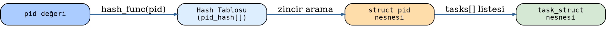

2.6'lı versiyonlardaki ``pid`` yapısı şöyleydi:

.. code-block:: c

   struct pid {
       atomic_t     count;
       unsigned int level;
       /* lists of tasks that use this pid */
       struct hlist_head tasks[PIDTYPE_MAX];
       struct rcu_head rcu;
       struct upid numbers[1];
   };

Bu versiyonlardaki durumu şöyle özetleyebiliriz:

1. Çekirdek her pid için bir ``pid`` nesnesi (``struct pid`` nesnesi) oluşturup onu bir hash
   tablosunda saklamaktadır. Yani ``pid`` nesneleri için bir hash tablosu kullanılmıştır.

2. ``pid`` yapısının içerisindeki ``tasks`` elemanı o pid değerine ilişkin bağlı liste zincirlerinin
   kök düğümlerini tutmaktadır.

3. Sistem bir pid değerine ilişkin ``task_struct`` nesnesini elde etmek için önce o pid değerine
   ilişkin ``pid`` nesnesini hash tablosundan bulmakta, sonra onun içerisindeki ilgili bağlı listede
   arama yapmaktadır.

2.6 çekirdekleriyle birlikte Linux'a *isim alanları (name spaces)* kavramı da sokulmaya başlanmıştır.
Bu versiyonlar artık pid değerleri için bir isim alanı da kullanmaktadır. Pid isim alanı sayesinde
sanki çekirdek birden fazla pid dünyasına sahip gibi bir etki oluşturulmaktadır. Pid isim alanları iç
içe de oluşturulabilmektedir. Artık bu versiyonlarla birlikte pid değerleri sistem genelinde tek değil
isim alanı genelinde tektir. Linux çekirdeğine eklenen bu isim alanları özelliği *docker* gibi container
teknolojilerinin gelişmesine katkı sağlamıştır.

pid_type Enum Değerleri ve Bağlı Listeler
-----------------------------------------

``pid`` yapısındaki ``tasks`` dizisinin ``PIDTYPE_MAX`` kadar elemana sahip olduğunu görüyorsunuz.
``PIDTYPE_MAX`` aşağıdaki gibi bir ``enum`` türünün elemanıdır:

.. code-block:: c

   /* 2.6'lı versiyonlar */
   enum pid_type {
       PIDTYPE_PID,
       PIDTYPE_PGID,
       PIDTYPE_SID,
       PIDTYPE_MAX   /* = 3 */
   };

   /* Güncel versiyonlar */
   enum pid_type {
       PIDTYPE_PID,
       PIDTYPE_TGID,
       PIDTYPE_PGID,
       PIDTYPE_SID,
       PIDTYPE_MAX   /* = 4 */
   };

Daha sonra ``PIDTYPE_TGID`` ile temsil edilen bir bağlı listenin daha eklendiğine dikkat ediniz.
Peki pid değerini saklamak için neden birden fazla bağlı liste kullanılmaktadır? İşte 2.6'lı
çekirdeklerle birlikte bu tarz aramalarda hız kazancı sağlamak için tasarım değiştirilmiştir.
Aşağıdaki diyagram her listenin hangi ``task_struct`` nesnelerini tuttuğunu göstermektedir:

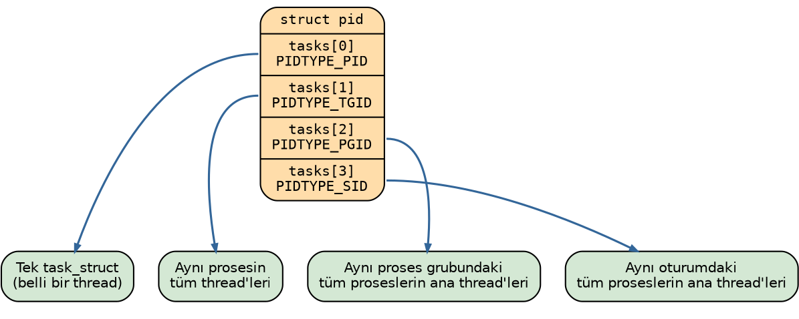

Bu bağlı listeleri daha ayrıntılı açıklayalım:

- **PIDTYPE_PID:** Bu bağlı liste zincirinde aslında tek bir eleman vardır. Amacımız yalnızca belli
  bir pid değerine ilişkin ``task_struct`` nesnesinin adresinin bulunmasıysa hemen bu listenin ilk
  elemanını alabiliriz.

- **PIDTYPE_TGID:** Bu bağlı liste belli bir prosesin thread'lerini dolaşmak için kullanılmaktadır.
  Bu bağlı listedeki tüm ``task_struct`` nesneleri aynı prosesin thread'lerini oluşturmaktadır. Yani
  biz çekirdeğe bir prosesin ana thread'ine ilişkin bir pid değeri verdiğimizde çekirdek bu bağlı
  liste zincirini dolaşarak o prosesin tüm thread'lerinin ``task_struct`` adreslerini elde
  edebilmektedir.

- **PIDTYPE_PGID:** Aynı proses grubuna ilişkin proseslerin ana thread'lerinin ``task_struct``
  nesnelerini tutmaktadır. Yani aranan pid değeri bir proses grup liderine ilişkin pid belirtiyorsa bu
  zincirde o proses grubundaki tüm proseslerin ana thread'lerinin ``task_struct`` nesnelerinin
  adresleri bulunmaktadır.

- **PIDTYPE_SID:** Belli bir oturuma (session) ilişkin tüm proseslerin (onların ana thread'lerinin)
  ``task_struct`` nesnelerinin adreslerini tutmaktadır.

2.6 versiyonlarından önce tek bir hash tablosu vardı. Bu nedenle proses grubundaki proseslerin
``task_struct`` nesneleri ancak tüm ``task_struct`` nesneleri dolaşılarak elde edilebiliyordu.
Halbuki 2.6'daki bu tasarımla bu biçimdeki dolaşımlar bu hash tablosu ve bağlı listeler yoluyla çok
daha hızlı yapılabilmektedir.

Aşağıda 2.6 versiyonlarında pid değerinden ``task_struct`` nesnesine ulaşım çağrı zinciri
görülmektedir:

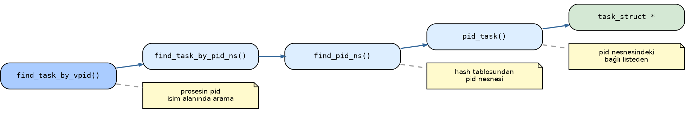

Hash tablosunda pid nesnesini arayan *find_pid_ns* fonksiyonu, ``upid`` yapı nesnelerini dolaşmakta
ve hem pid değerine hem de pid isim alanına birlikte bakmaktadır:

.. code-block:: c

   struct upid {
       int nr;
       struct pid_namespace *ns;
       struct hlist_node pid_chain;
   };

   static struct hlist_head *pid_hash;   /* global hash tablosu */

   struct pid *find_pid_ns(int nr, struct pid_namespace *ns)
   {
       struct hlist_node *elem;
       struct upid *pnr;

       hlist_for_each_entry_rcu(pnr, elem,
               &pid_hash[pid_hashfn(nr, ns)], pid_chain)
           if (pnr->nr == nr && pnr->ns == ns)
               return container_of(pnr, struct pid, numbers[ns->level]);
       return NULL;
   }

Burada ``hlist_node`` bağının ``upid`` nesnesinin içerisinde olduğuna, ``upid`` nesnesinin de ``pid``
nesnesinin içerisinde olduğuna dikkat ediniz.

4.20 Versiyonu: Hash Tablosundan XArray'e Geçiş
--------------------------------------------------

Çekirdek versiyonu 4.20'lere geldiğinde yukarıdaki mekanizmada önemli değişiklikler yapılmıştır. En
önemli değişiklik pid ve isim alanından hareketle ``pid`` nesnesinin bulunması işleminde hash tablosu
yerine *radix ağacının* kullanılmaya başlanmasıdır. Aslında 2.5 ile birlikte çekirdekte başka alt
sistemlerde radix ağacı kullanılmaya başlanmıştı. Sonra bu radix ağaçlarının 4.20 versiyonuyla birlikte
*XArray* isimli yeni bir gerçekleştirimi yapılmıştır.

4.20 ve sonrasında ``pid`` yapısındaki bağlı listelerde bir farklılık yoktur. Yalnızca pid ve isim alanı
bilgisinden hareketle ``pid`` yapı nesnesinin elde edilmesinde hash tablosu yerine radix ağacı (XArray
gerçekleştirimi) kullanılmaktadır.

Bu bağlamda pid mekanizmasında radix ağacının hash tablosuna tercih edilmesinin tipik nedenleri şunlardır:

- Radix ağacındaki arama hash tablolarından yavaş gözükse bile aslında pratikte durum tam böyle
  değildir. Buradaki radix ağacı seyrek tutulmaktadır. Bu yüzden arama hızlı yapılır.
- pid'leri artan sırayla gezmek, boş pid bulmak (en küçük kullanılmayan pid'i seçmek) çok daha
  kolaydır.
- Ağaçta yalnızca kullanılan düğümler tutulmaktadır. Bu da bellek kazancı sağlamaktadır.
- pid sayısı arttıkça hash tablosunun performansı düşme eğilimi gösterdiği halde radix ağacının
  performansı hash tablosuna kıyasla düşmez.
- Radix ağacı yalnızca pid araması için değil, aynı zamanda yeni yaratılan ``task_struct`` nesneleri
  için pid tahsis edilmesinde de kullanılabilmektedir.

Güncel çekirdeklerde hem pid aramaları hem de boş pid değerlerinin tespit edilmesi işlemleri bu XArray
gerçekleştirimi ile sağlanmaktadır.

Radix Ağaçlarının Kullanılması
------------------------------

Biz radix arama ağacını ve XArray gerçekleştirimini daha sonra başka bir bölümde ele alacağız. Burada
yalnızca radix arama ağacının temel mekanizması üzerinde açıklamalar yapacağız. Radix arama ağaçları
için *sayısal arama ağaçları (digital search tree)*, *önek arama ağacı (prefix search tree)*,
*sıkıştırılmış arama ağaçları (compressed search trie)* gibi isimler de kullanılmaktadır.

Bu arama ağaçlarında düğümlerde anahtar olarak anahtarın tamamı değil onun ön kısımları bulundurulmaktadır.
Böylece ağaç bir leksikografik sıralama ağacı gibi de kullanılabilmektedir. Örneğin 4 bitlik şu sayıların 
radix ağacına yerleştirilmek istendiğini düşünelim: ``1100``, ``1010``, ``0101``, ``1011``, ``0010``, ``0111``, 
``0000``, ``1000``. Burada bitler ``0`` ya da ``1`` değeri elabildiği için Radix ağacı da ikili ağaç görünümünde 
olacaktır. Ağacın her adımında yüksek anlamlı bitten başlanarak ``0`` için sola ``1`` için de sağa dallanma yapılır. 
Aşağıdaki diyagram bu sekiz anahtarın ağaca yerleştirilmesi sonucundaki durumu göstermektedir:

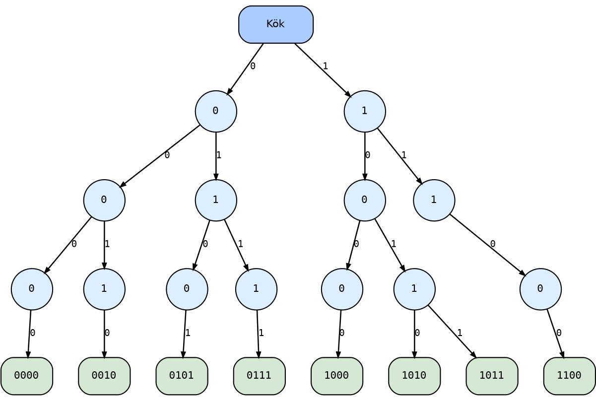

Peki bu ağaçta arama nasıl yapılır? İşte arama için kökten girilir. Her bit pozisyonu için bir aşağıya
inilir. Örneğin ``0000`` değerini arayacak olalım: ilk bit 0 olduğu için kökten sola ineriz, ikinci bit
de 0 olduğu için sola devam ederiz, üçüncü bit de 0 olduğu için sola, dördüncü bit de 0 olduğu için
sola gideriz. Artık değeri buluruz. Radix ağaçlarını enlemesine (breadth-first gibi) dolaştığımızda
anahtarların sıralı bir biçimde elde edilebildiğine dikkat ediniz.

Görüldüğü gibi bu tasarımda hiç anahtar saklanmadan yaprak görülene kadar ilerlenirse ya ilgili anahtar
bulunmuş olur ya da bulunamamış olur. Aslında Radix ağaçlarında anahtar ve değerler düğümlerde de turulabilir. 
Peki her düğümde anahtar ve değeri tutmakla yalnızca yapraklarda değeri tutmanın hangisi daha iyi bir yöntemdir?

.. list-table::
   :header-rows: 1
   :widths: 20 40 40

   * - Yöntem
     - Avantajları
     - Dezavantajları
   * - **Her düğümde anahtar saklama**
     - Erken durabilme; ara düğümde tam eşleşme bulununca yaprağa kadar inmek gerekmez.
       Prefix aramaları daha kolay.
     - Veri yapısı karmaşıklaşır; bellek kullanımı artar.
   * - **Yalnızca yapraklarda değer saklama**
     - Basit tasarım: iç düğümler yalnızca yönlendirme bilgisi tutar. Bellek daha düzenli kullanılır.
       Ekleme/silme algoritmaları daha etkin.
     - Her zaman yaprağa kadar inmek gerekir. Prefix tabanlı aramalarda ek iş yapılması gerekir.

.. note::

   Linux'un klasik radix ve XArray gerçekleştirimlerinde değerler her zaman yapraklarda tutulmaktadır.
   Ara düğümlerde anahtarlar tutulmamaktadır.

Radix ağacının ikili ağaç olması zorunlu değildir. Dallanma bit bit yapıldığında yukarıdaki örnekte
olduğu gibi radix ağacı ikili ağaç durumunda olur. Ancak dallanma n bit n bit de yapılabilir. Bu
durumda ağaç da 2\ :sup:`n`-li ağaç olacaktır.

Örneğin 32 bitlik pid değerlerini böyle bir ağaçta tutmak isteyelim ve dallanmayı 6 bit 6 bit yapalım.
6 bit → 2\ :sup:`6` = 64 farklı dallanmaya yol açacaktır. Bu durumda ağacımızın her düğümünde 64
gösterici bulunacaktır ve yapraklara varabilmek için en fazla 6 kademe ilerlenecektir:

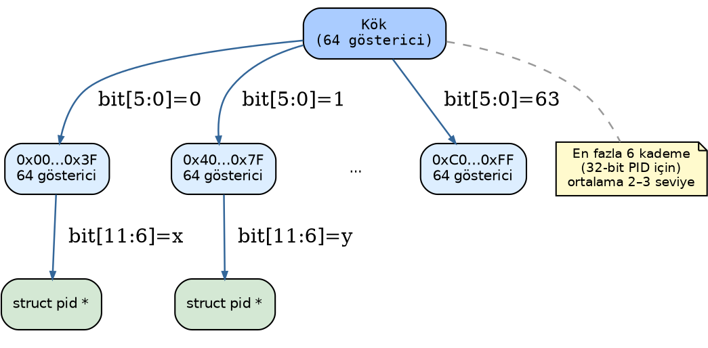

Güncel sürümlerde Linux'un pid araması için kullandığı XArray ağacı bu örnekteki gibi altışar bitlidir.

Hash tablosu ile XArray/Radix ağacı arasındaki avantaj ve dezavantajları karşılaştıralım:

.. list-table::
   :header-rows: 1

   * - Ölçüt
     - Hash Tablosu
     - XArray / Radix Ağacı
   * - **Arama karmaşıklığı**
     - Ortalama O(1); çakışmada en kötü O(N)
     - O(log\ :sub:`k` N), tipik derinlik 2–3
   * - **Bellek kullanımı**
     - Tablo önceden sabit boyutta ayrılır; seyrek pid'lerde boşa gider
     - Yalnızca kullanılan düğümler açılır; seyrek alanda çok verimli
   * - **Çakışma**
     - Mümkün; performansı düşürebilir
     - Yok; her pid tek bir yolu izler
   * - **Ölçeklenebilirlik**
     - Tablo boyutunu baştan iyi seçmek gerekir
     - pid alanı büyüse bile uyum sağlar
   * - **Sıralı gezinme**
     - Doğal sıralama yok; yavaş
     - Doğası gereği sıralı; çok hızlı
   * - **Boş pid bulma**
     - Ayrı veri yapısı gerektirir
     - Aynı ağaç hem arama hem tahsisat için kullanılır

Özetle: tekil arama için hash tablosu genellikle biraz daha hızlıdır; ancak büyük ve seyrek pid isim
alanlarında XArray çok daha verimli bellek kullanır. Sıralı gezinme ve boş pid bulma gerektirdiğinde
XArray üstün gelir. Güncel çekirdeklerde hem pid aramaları hem de boş pid değerlerinin tespit edilmesi
işlemleri bu XArray gerçekleştirimi ile sağlanmaktadır.

Güncel Çekirdeklerde pid Araması (4.20+)
----------------------------------------

Çekirdeğin 4.20 versiyonundan itibaren her pid isim alanı için ayrı bir XArray ağacı oluşturulmaya
başlanmıştır. Anımsanacağı gibi 2.6'lı versiyonlarda hash tablolarına geçildiğinde tüm pid isim alanları
aynı hash tablosunda bulunuyordu. Halbuki güncel çekirdeklerde bir pid nesnesi aranacaksa o nesne belli
bir pid isim alanındaki XArray ağacında aranmaktadır.

4.20 ve sonrasında ``task_struct`` yapısında ``thread_pid`` elemanı da eklenmiştir:

.. code-block:: c

   struct task_struct {
       /* ... */
       pid_t        pid;
       struct pid  *thread_pid;   /* pid değerine ilişkin pid nesnesinin adresi */
       /* ... */
   };

Güncel ``pid`` yapısı şöyledir:

.. code-block:: c

   struct pid {
       refcount_t count;
       unsigned int level;
       spinlock_t lock;
       struct {
           u64 ino;
           struct rb_node pidfs_node;
           struct dentry *stashed;
           struct pidfs_attr *attr;
       };
       struct hlist_head tasks[PIDTYPE_MAX];
       struct hlist_head inodes;
       wait_queue_head_t wait_pidfd;
       struct rcu_head rcu;
       struct upid numbers[];   /* isim alanı bilgisi */
   };

Güncel versiyonlarda ``upid`` yapısı şöyledir (``hlist_node`` bağı kaldırılmış, ns bilgisi korunmuştur):

.. code-block:: c

   struct upid {
       int nr;
       struct pid_namespace *ns;
   };

Güncel çekirdeklerde pid araması yapan yüksek seviyeli fonksiyonlardan biri *find_vpid* fonksiyonudur:

.. code-block:: c

   struct pid *find_vpid(int nr)
   {
       return find_pid_ns(nr, task_active_pid_ns(current));
   }
   EXPORT_SYMBOL_GPL(find_vpid);

Bu fonksiyon belli bir pid değerine ilişkin pid nesnesini çağrıyı yapan prosesin bulunduğu pid isim
alanı içerisindeki XArray ağacında aramaktadır. Aşağıdaki diyagram güncel çekirdekteki çağrı zincirini
göstermektedir:

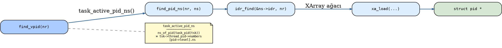

Prosesin içinde bulunduğu pid isim alanının bilgisine ulaşım çağrı zinciri şöyledir:

.. code-block:: c

   struct pid_namespace *task_active_pid_ns(struct task_struct *tsk)
   {
       return ns_of_pid(task_pid(tsk));
   }

   static inline struct pid *task_pid(struct task_struct *task)
   {
       return task->thread_pid;
   }

   static inline struct pid_namespace *ns_of_pid(struct pid *pid)
   {
       struct pid_namespace *ns = NULL;
       if (pid)
           ns = pid->numbers[pid->level].ns;
       return ns;
   }

XArray ağacında arama yapan *find_pid_ns* fonksiyonu artık son derece sade bir görünümdedir:

.. code-block:: c

   struct pid *find_pid_ns(int nr, struct pid_namespace *ns)
   {
       return idr_find(&ns->idr, nr);
   }
   EXPORT_SYMBOL_GPL(find_pid_ns);

Ağaçta arama yapan asıl fonksiyon *idr_find* isimli fonksiyondur.

XArray Gerçekleştirimi
----------------------

XArray veri yapısının aşağı seviyeli gerçekleştirimi ``include/linux/xarray.h`` dosyası içerisinde
yapılmıştır. XArray ağacı bu dosyadaki ``xarray`` isimli yapıyla temsil edilmiştir:

.. code-block:: c

   struct xarray {
       spinlock_t   xa_lock;
       /* private: */
       gfp_t        xa_flags;
       void __rcu   *xa_head;
   };

Bu ağaç üzerinde işlem yapan ``xa_`` öneki ile başlayan bir grup fonksiyon vardır:

.. code-block:: c

   void *xa_load(struct xarray *, unsigned long index);
   void *xa_store(struct xarray *, unsigned long index, void *entry, gfp_t);
   void *xa_erase(struct xarray *, unsigned long index);
   void *xa_store_range(struct xarray *, unsigned long first, unsigned long last, void *entry, gfp_t);
   bool xa_get_mark(struct xarray *, unsigned long index, xa_mark_t);
   void xa_set_mark(struct xarray *, unsigned long index, xa_mark_t);
   void xa_clear_mark(struct xarray *, unsigned long index, xa_mark_t);
   void *xa_find(struct xarray *, unsigned long *index, unsigned long max, xa_mark_t);
   void *xa_find_after(struct xarray *, unsigned long *index, unsigned long max, xa_mark_t);
   unsigned int xa_extract(struct xarray *, void **dst, unsigned long start, unsigned long max, unsigned int n, xa_mark_t);
   void xa_destroy(struct xarray *);

XArray ağacı üzerinde üzerinde işlemlerinde kullanılan daha ``xas_`` önekli fonksiyonlar da bulunmaktadır. Bunlar 
xa_state nesneleri ile çalışmaktadır. ``xa_state`` nesneleri ağaca yapılan erişimlerin taşıyıcıları gibi düşünebilirsiniz. 
Bunların bazıları her XArray ağacında değil bazı XArray ağaçlarında anlamlı bir kullanıma sahiptir:

.. code-block:: c

   void *xas_load(struct xa_state *);
   void *xas_store(struct xa_state *, void *entry);
   void *xas_find(struct xa_state *, unsigned long max);
   void *xas_find_conflict(struct xa_state *);
   void *xas_find_marked(struct xa_state *, unsigned long max, xa_mark_t);

   bool xas_get_mark(const struct xa_state *, xa_mark_t);
   void xas_set_mark(const struct xa_state *, xa_mark_t);
   void xas_clear_mark(const struct xa_state *, xa_mark_t);
   void xas_init_marks(const struct xa_state *);
   bool xas_nomem(struct xa_state *, gfp_t);
   void xas_destroy(struct xa_state *);
   void xas_pause(struct xa_state *);
   void xas_create_range(struct xa_state *);
   int xas_get_order(struct xa_state *xas);
   void xas_split(struct xa_state *, void *entry, unsigned int order);
   void xas_split_alloc(struct xa_state *, void *entry, unsigned int order, gfp_t);
   void xas_try_split(struct xa_state *xas, void *entry, unsigned int order);
           unsigned int xas_try_split_min_order(unsigned int order);
   int xas_error(const struct xa_state *xas);
   void xas_set_err(struct xa_state *xas, long err);
   bool xas_invalid(const struct xa_state *xas);
   bool xas_valid(const struct xa_state *xas);
   bool xas_is_node(const struct xa_state *xas);
   void xas_reset(struct xa_state *xas);
   void xas_set(struct xa_state *xas, unsigned long index);
   void xas_set_order(struct xa_state *xas, unsigned long index, unsigned int order);
   void xas_advance(struct xa_state *xas, unsigned long index);
   bool xas_retry(struct xa_state *xas, const void *entry);
   void *xas_reload(struct xa_state *xas);
   void *xas_next(struct xa_state *xas);
   void *xas_prev(struct xa_state *xas);
   void *xas_next_entry(struct xa_state *xas, unsigned long max);
   void *xas_next_marked(struct xa_state *xas, unsigned long max, xa_mark_t mark);
   void xas_set_update(struct xa_state *xas, xa_update_node_t update);
   void xas_set_lru(struct xa_state *xas, struct list_lru *lru);

Bu fonksiyonların tanımlamaları ``include/linux/xarray.h`` ve ``lib/xarray.c`` dosyalarında yapılmıştır.

Güncel çekirdeklerin yukarıda belirttiğimiz aşağı seviyeli fonksiyonlarının yanı sıra aynı zamanda
bunları kullanan yüksek seviyeli *IDR* fonksiyonları da bulunmaktadır. Çekirdek kodları incelendiğinde
genellikle bu yüksek seviyeli ``idr_`` önekli fonksiyonların kullanıldığı görülmektedir. Aşağıdaki
diyagram üç katman arasındaki ilişkiyi göstermektedir:
 
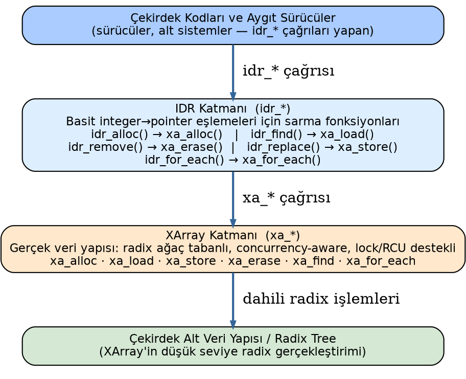

Boş pid değerinin elde edilmesi de aynı XArray altyapısı üzerinden yapılmaktadır:

.. code-block:: c

   /* Boş pid tahsisatı çağrı zinciri */
   alloc_pid --> idr_alloc_cyclic --> idr_alloc_u32 --> idr_get_free

XArray gerçekleştirimi hakkında ileride başka konularda ek bilgiler vereceğiz.