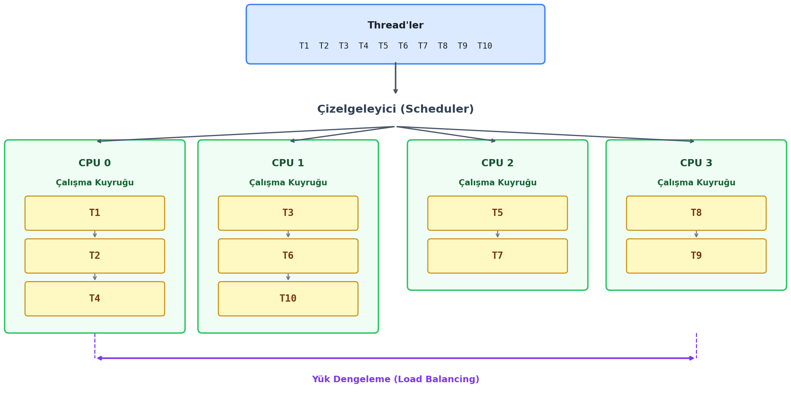
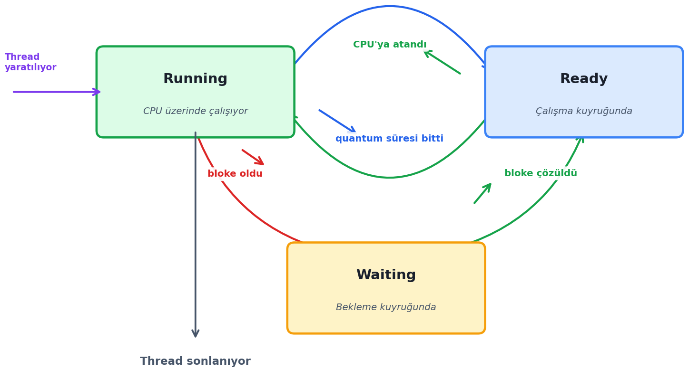
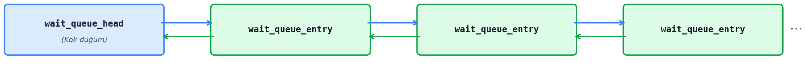

===================
Bekleme Kuyrukları
===================

Bu bölümde önce bekleme kuyruklarının (wait queues) genel yapısını açıklayacağız. Sonra da
thread'lerin çalışma kuyruğundan (run queue) bekleme kuyruklarına nasıl aktarıldığı (yani
thread'lerin nasıl bloke edildiği) ve yeniden nasıl çalışır duruma getirildiği (yani blokenin nasıl
çözüldüğü) konuları üzerinde duracağız. *Çizelgeleyici (scheduler)* alt sistem başka bir bölümde
ayrıntılarıyla ele alınacaktır.

Linux çekirdek programcılarının bloke işlemleri ile ilgili olan şu süreçler hakkında bilgi sahibi
olması gerekir:

- Bekleme kuyruklarının veri yapısı nasıldır?
- Bekleme kuyrukları nasıl oluşturulup nasıl yok edilmektedir?
- Çalışma kuyruklarından bekleme kuyruklarına aktarım (yani bloke işlemi) nasıl yapılmaktadır?
- Bekleme kuyruklarından çalışma kuyruklarına aktarım (yani blokenin çözülmesi) nasıl
  yapılmaktadır?
- Bekleme kuyrukları üzerinde işlem yapan çekirdek fonksiyonları bu işlemleri nasıl
  yapmaktadır?

Tabii Linux'un ilk versiyonlarında bu süreçler oldukça basit kodlarla gerçekleştirilmişti. Ancak
zaman içerisinde sinekten yağ çıkartma noktasına gelindi ve bu işlemler de gittikçe iyileştirildi.
Bunun sonucu olarak da kodlar biraz daha karmaşık hale geldi.

Çalışma Kuyrukları ve Thread'lerin Çizelgelenmesi
=================================================

Linux çekirdeklerinde çizelgeleyici (scheduler) alt sistem zaman içerisinde birkaç kere önemli ölçüde
değiştirilmiştir. Mevcut Linux çekirdeklerinde sistemdeki her işlemci ya da çekirdek için ayrı bir
*çalışma kuyruğu (run queue)* bulundurulmaktadır. Yani her işlemci ya da çekirdek kendi çalışma
kuyruğundaki thread'leri çizelgelemektedir. Çalışma temel olarak *zaman paylaşımlı (time sharing)* biçimde
yapılmaktadır. Yani sıradaki thread CPU'ya atanır, belli bir süre çalıştırılır, sonra thread'in
çalışmasına ara verilir ve kuyruktaki yeni thread CPU'ya atanır. Bu işlem böyle devam ettirilir. Bir
thread'in parçalı çalışma süresine *quantum süresi (time quantum)* denilmektedir. Thread'lerin quantum
süreleri aynı olmak zorunda değildir. Bu konunun ayrıntılarını çizelgeleyici alt sistemin ele alındığı
bölümde açıklayacağız. Aşağıda güncel çekirdeklerdeki çizelgeleme işlemlerini bir şekille betimliyoruz:

Çalışma kuyruğundaki bir thread'e çalışma sırası geldiğinde o thread CPU'ya atanıp belli bir süre
çalıştırılır. Bu süre dolduğunda bir sonraki turda kalınan yerden çalışmaya devam edebilmesi için
thread çalışma kuyruğuna geri bırakılır. Bir thread'in çalışmasına ara verilip çalışma kuyruğundaki
diğer thread'in CPU'ya atanması sürecine *bağlamsal geçiş (context switch)*, (bağlamsal geçiş terimi 
yerine *task switch* terimi de kullanılabilmektedir), thread'in quantum süresi bittiğinde CPU'dan 
alınması işlemine de *koparma (preemption)* denilmektedir. (*Preemption* İngilizcede "zorla ele geçirmek, 
el koymak" gibi anlamlara gelmektedir. Biz *preemption* yerine Türkçe "koparma" sözücüğünü de kullanacağız.) 
Bağlamsal geçiş donanım kesmeleriyle yapılmaktadır. Genel amaçlı bilgisayar donanımlarında periyodik kesme 
üreten *zamanlayıcı (timer)* devreler bulunmaktadır. Zamanlayıcı devreleri yoluyla oluşturulan kesmeler belli bir 
sayıya geldiğinde çizelgeleyici o anda çalışmakta olan kodu herhangi bir noktasında keserek çalışmaya ara verebilmektedir.

Thread'lerin çalışmasına ara verilmesi ve çalışmanın kalınan yerden devam ettirilmesi aslında zor bir
işlem değildir. Thread'in o andaki tüm konumu aslında CPU yazmaçlarının içerisindeki değerlerden
oluşmaktadır. Bağlamsal geçiş sırasında CPU yazmaçlarının içerisindeki değerler thread'in
``task_struct`` alanına kaydedilmektedir. Thread CPU'ya atanırken de bu kaydedilmiş bilgiler oradan
alınarak yeniden CPU yazmaçlarına aktarılmaktadır. Tabii tüm bu işlemler bir zaman kaybına da yol
açmaktadır. Eğer quantum süresi çok kısa tutulursa çok bağlamsal geçiş oluşur ve *birim zamanda yapılan
iş miktarı (throughput)* düşer. Eğer bağlamsal geçiş çok uzun tutulursa bu durumda da interaktivite
azalır. Bir thread işletim sistemi tarafından bir CPU'nun çalışma kuyruğuna atandığında onun hep o kuyrukta
kalması garanti değildir. Zaman içerisinde (tıpkı süper marketlerdeki kasa kuyruklarında
olduğu gibi) kuyruklar arasında dengesizlikler oluşabilmektedir. Bu durumda işletim sistemi dengeyi
sağlamak için thread'leri daha boş olan bir CPU'nun çalışma kuyruğuna taşıyabilmektedir.

Thread'lerin Bloke Olması
-------------------------

Bir thread uzun sürebilecek dışsal olayları CPU zamanı harcayarak beklemez. Bu tür durumlarda thread'ler CPU'nun 
çalışma kuyruğundan çıkartılarak *bekleme kuyrukları (wait queues)* denilen kuyruklarda bekletilmektedir. Bu sürece 
*thread'in bloke olması* denilmektedir. Örneğin ``read`` POSIX fonksiyonuyla bir dosyadan okuma yapmak isteyelim. 
Anımsanacağı gibi ``read`` fonksiyonu ``sys_read`` sistem fonksiyonunu çağırmaktadır. Bu fonksiyon da önce okunacak 
yerin sayfa önbelleğinde (page cache) olup olmadığına bakmaktadır. Okunacak yer page cache içerisindeyse thread bloke olmadan
okuma yapılır. Ancak okunacak yer sayfa önbelleğinde değilse disk okumaları yavaş olduğu için thread
bloke edilir, çalışma kuyruğundan çıkartılarak bir bekleme kuyruğunda bekletilir. Disk okuması
gerçekleştiğinde thread yeniden çalışma kuyruğuna yerleştirilmektedir. Spinlock ve readers/writer lock
nesneleri dışındaki senkronizasyon nesnelerinde de eğer kilit kapalıysa lock işlemini yapmaya çalışan
thread'ler benzer biçimde bloke edilmektedir. ``sleep`` gibi fonksiyonlar da yine blokeye yol açmaktadır.
Örneğin:

.. code-block:: c

    sleep(10);

Burada thread'in 10 saniye bekletilmesi istenmiştir. İşte işletim sistemi bu bekleme sırasında CPU
zamanı harcamasın diye thread'i çalışma kuyruğundan çıkartır ve bekleme kuyruğuna alır. 10 saniye
süre geçince de onu yeniden çalışma kuyruğuna yerleştirir. Böylece thread hiç CPU zamanı harcamadan
10 saniye bekletilmiş olur.

Thread'lerin Yaşam Döngüsü
--------------------------

Bir thread'in yaşam döngüsü yalın bir biçimde şöyle betimlenebilir:

Buradaki *Running* thread'in CPU'ya atanmış ve çalışmakta olduğu, *Ready* ise thread'in çalışma kuyruğunda 
bulunduğunu ve sonraki quantum'u beklediği anlamına gelmektedir. Thread dışsal bir olay nedeniyle bloke olduğunda 
bekleme kuyruklarına alınır. Şeklimizdeki *Waiting* ise thread'in bekleme kuyruğunda beklediğini belirtmektedir. 
Dışsal olay gerçekleştiğinde thread'in blokesi çözülüp yeniden çalışma kuyruğuna yerleştirilmektedir. Tabii buradaki 
şekil oldukça sadeleştirilmiş bir şekildir. Örneğin thread'in sonlanması başka biçimlerde de gerçekleşebilmektedir.

IO Yoğun ve CPU Yoğun Thread'ler
~~~~~~~~~~~~~~~~~~~~~~~~~~~~~~~~

Bir thread CPU'ya atandığında eğer quantum süresinin çok azını kullanıp hemen bloke olarak uykuya
dalıyorsa bu biçimdeki thread'lere *IO yoğun (IO bound)* thread'ler denilmektedir. Sistemde çok
sayıda IO yoğun thread'in bulunması CPU'yu önemli ölçüde meşgul etmeyeceği için ciddi bir yavaşlamaya
da yol açmayacaktır. Uygulama programlarının büyük çoğunluğundaki thread'ler IO yoğun biçimdedir.
Örneğin:

.. code-block:: c

    double val;
    /* ... */

    for (;;) {
        printf("Bir deger sayi giriniz:");
        fflush(stdout);
        scanf("%lf", &val);
        if (val == 0)
            break;
        printf("%f\n", val);
    }

Buradaki thread'in CPU kullanım oranı çok düşüktür. Çünkü biraz çalışıp hemen bloke olmaktadır. Eğer
bir thread CPU'ya atandığında quantum süresinin büyük bölümünü hiç bloke olmadan kullanıyorsa bu tür
thread'lere *CPU yoğun (CPU bound)* thread'ler denilmektedir. Genellikle matematiksel hesaplar yapan
thread'ler CPU yoğun olma eğilimindedir. Sistemde çok sayıda CPU yoğun thread'in bulunması ciddi
yavaşlamalara yol açabilmektedir. Örneğin:

.. code-block:: c

    long long count = 0;
    /* ... */

    for (long long i = 0; i < 100000000000; ++i)
        if (i % 7 == 0)
            ++count;

    printf("%lld\n", count);

Buradaki thread CPU yoğundur. Çünkü kendisine verilen quantum süresini hiç bloke olmadan sonuna kadar
kullanmaktadır. Programınızdaki thread'lerin CPU kullanım sürelerini çeşitli utility programlarla
gözlemleyebilirsiniz. Örneğin ``htop`` programı (``top`` programının biraz daha gelişmiş bir
versiyonudur) ve ``perf`` programı ile thread'lerinizin CPU kullanımlarını görebilirsiniz.

Bekleme Kuyruğuklarına İlişkin Veri Yapıları ve Çekirdek Temel Fonksiyonları
============================================================================

Linux çekirdeklerinde bekleme kuyruklarının genel yapısı zaman içerisinde pek değişmemiştir. Biz
burada doğrudan çekirdeğin güncel versiyonlarını temel alacağız. Çekirdeğin güncel versiyonlarında
bekleme kuyrukları bir bağlı liste biçiminde organize edilmiştir. Bu bağlı listenin kök düğümü
``include/linux/wait.h`` dosyasındaki ``wait_queue_head`` isimli bir yapıda tutulmaktadır. Bu yapı
aynı zamanda ``wait_queue_head_t`` ismiyle de typedef edilmiştir:

.. code-block:: c

    struct wait_queue_head {
        spinlock_t       lock;      /* listeyi koruyan spinlock kilidi */
        struct list_head head;      /* bağlı listenin kök düğümü */
    };
    typedef struct wait_queue_head wait_queue_head_t;

Buradaki ``lock`` elemanı bağlı liste işlemleri yapılırken eş zamanlı erişimlerde kuyruğu korumak
için bulundurulmuştur. ``head`` elemanı ise kök düğümü belirtmektedir.

``wait_queue_head`` bağlı listesi elemanları ``wait_queue_entry`` türünden olan düğümleri
tutmaktadır. Başka bir deyişle ``wait_queue_head`` yapısı aslında ``wait_queue_entry`` nesnelerini
tutan bir bağlı listedir. ``wait_queue_entry`` yapısı şöyle bildirilmiştir:

.. code-block:: c

    struct wait_queue_entry {
        unsigned int        flags;
        void               *private;
        wait_queue_func_t   func;
        struct list_head    entry;
    };

Yapıdaki ``flags`` elemanı bitsel biçimde temsil edilen bayrakları tutmaktadır. Bu bayraklar bekleme
kuyruğunu işleten algoritmalar tarafından set edilip kullanılmaktadır. İzleyen paragraflarda bu
bayraklar hakkında bilgiler vereceğiz. Yapının ``private`` elemanı her ne kadar ``void`` bir
göstericiyse de aslında tipik olarak bekleme kuyruğundaki thread'in ``task_struct`` nesne adreslerini
tutmaktadır. (Veri yapısı genel tasarlanmıştır; bazı durumlarda bu eleman başka nesneleri de
gösterebilmektedir.) Yapının ``func`` elemanı thread uyandırılacağı zaman çağrılacak uyandırma
fonksiyonun adresini tutmaktadır. Veri yapısı genel olduğu için çokbiçimli etki yaratmak amacıyla
fonksiyon göstericisinden faydalanılmıştır. Yapının ``entry`` elemanı sonraki düğümün yerini
göstermektedir.

Çekirdek içerisinde thread'i bekleme kuyruklarına bir düğüm olarak yerleştiren ve oradan çıkartarak
yine çalışma kuyruklarına yerleştiren daha yüksek seviyeli çekirdek fonksiyonları oluşturulmuştur.
Bu yüksek seviyeli fonksiyonlar export edildikleri için çekirdek modülleri ve aygıt sürücüler
tarafından kullanılabilmektedir.

Bekleme Kuyruklarının Yaratılması
---------------------------------

Bir bekleme kuyruğunu boş bir biçimde oluşturmak için ``DECLARE_WAIT_QUEUE_HEAD`` makrosu
kullanılmaktadır. Bu makro ``include/linux/wait.h`` dosyası içerisinde bildirilmiştir. Makroya
tanımlanacak olan ``wait_queue_head`` yapısı türünden değişkenin ismi verilmektedir. Örneğin:

.. code-block:: c

    static DECLARE_WAIT_QUEUE_HEAD(g_wq);

Bu örnekte bizim bekleme kuyruğumuzun ismi ``g_wq`` biçimindedir. Tabii bekleme kuyrukları
genellikle static ömürlü olmaktadır. Yani tipik olarak global bir değişken olarak oluşturulmaktadır.
``DECLARE_WAIT_QUEUE_HEAD`` makrosu şöyle tanımlanmıştır:

.. code-block:: c

    #define __WAIT_QUEUE_HEAD_INITIALIZER(name) {                   \
        .lock   = __SPIN_LOCK_UNLOCKED(name.lock),                  \
        .head   = LIST_HEAD_INIT(name.head) }

    #define DECLARE_WAIT_QUEUE_HEAD(name)                           \
        struct wait_queue_head name = __WAIT_QUEUE_HEAD_INITIALIZER(name)

Buradan görüldüğü gibi ``DECLARE_WAIT_QUEUE_HEAD`` makrosu açık bir kilitle boş bir bağlı liste
oluşturmaktadır. ``DECLARE_WAIT_QUEUE_HEAD`` makrosu nesneyi ilk değer vererek tanımlamak için
kullanılmaktadır. Dinamik olarak tahsis edilmiş bekleme kuyruklarına ilk değerlerin verilebilmesi
için ``include/linux/wait.h`` dosyasındaki ``init_waitqueue_head`` makrosu kullanılmaktadır. Bu
makro güncel çekirdeklerde şöyle yazılmıştır:

.. code-block:: c

    #define init_waitqueue_head(wq_head)                            \
        do {                                                        \
            static struct lock_class_key __key;                     \
                                                                    \
            __init_waitqueue_head((wq_head), #wq_head, &__key);     \
        } while (0)

Buradaki ``__init_waitqueue_head`` fonksiyonu ``kernel/sched/wait.c`` dosyası içerisinde aşağıdaki
gibi tanımlanmıştır:

.. code-block:: c

    void __init_waitqueue_head(struct wait_queue_head *wq_head, const char *name,
                               struct lock_class_key *key)
    {
        spin_lock_init(&wq_head->lock);
        lockdep_set_class_and_name(&wq_head->lock, key, name);
        INIT_LIST_HEAD(&wq_head->head);
    }

Görüldüğü gibi burada da spinlock ve bağlı liste ilk durumuna getirilmiştir. Buradaki
``lockdep_set_class_and_name`` fonksiyonu debug amaçlı çağrılmaktadır. Normal bir çekirdek
derlemesinde ``CONFIG_LOCKDEP`` konfigürasyon parametresi ``'y'`` yapılmadığı için zaten önişlemci
tarafından bu çağrı koddan çıkartılmaktadır. Fonksiyon aygıt sürücüler içerisinde şöyle
kullanılabilir:

.. code-block:: c

    static wait_queue_head_t g_wq;
    /* ... */

    init_waitqueue_head(&g_wq);

Thread'lerin Bekleme Kuyrukları Yoluyla Uykuya Yatırılması ve Uyandırılması
---------------------------------------------------------------------------

Bir thread çalışırken kendisini bekleme kuyruğuna yerleştirmektedir. Yani çekirdek tasarımında bir
thread'in başka bir thread'i bekleme kuyruklarına yerleştirmesi gibi bir durum uygun olmadığı
gerekçesiyle doğrudan mümkün hale getirilmemiştir. Yani bir thread "tamam şimdi artık benim uyumam
gerekir" diyerek kendini uyutmaktadır. Thread'in uyandırılması ise tek bir thread'in uyandırılması
biçiminde değil bekleme kuyruğundaki bir grup thread'in uyandırılması biçiminde yapılmaktadır. Yani
uyandırma işlemi aslında thread temelinde değil bekleme kuyruğu temelinde yapılmaktadır. Bu duruma
işletim sistemleri terminolojisinde İngilizce *thundering herd (gürüldeyen sürü)* denilmektedir. Bu
terim bir ahır kapısı açıldığında sürünün gürültülü bir biçimde hep beraber dışarı çıkması
çağrışımından hareketle uydurulmuştur. İzleyen paragraflarda görüleceği gibi *exclusive uyandırma*
denilen bir uyandırma biçimi de vardır. Bu uyandırma biçiminde nispeten daha az sayıda thread
uyandırılmaktadır.

Bir thread'in bekleme kuyruğuna yerleştirilip uykuya yatırılması aşağıdaki çekirdek makroları
tarafından yapılmaktadır:

.. code-block:: c

    wait_event(wq_head, condition);
    wait_event_interruptible(wq_head, condition);
    wait_event_killable(wq_head, condition);
    wait_event_timeout(wq_head, condition, timeout);
    wait_event_interruptible_timeout(wq_head, condition, timeout);
    wait_event_interruptible_exclusive(wq_head, condition);

Bu makroların birinci parametreleri bekleme kuyruğunu temsil eden ``wait_queue_head`` türünden yapı
nesnesini almaktadır. (Makroya nesnenin adresinin değil kendisinin parametre olarak geçirildiğini
vurgulamak istiyoruz. Zaten makro gerektiğinde kendisi adres alma işlemini yapmaktadır.) Makroların
ikinci parametreleri *uyandırma koşulunu* belirtmektedir. Yukarıda da belirttiğimiz gibi aslında,
exclusive özelliğini göz ardı edersek, bekleme kuyruğundaki tüm thread'ler uyandırılmaktadır.
Ancak bu uyandırma sonrasında koşul sağlanmıyorsa uyandırılan thread'ler yeniden uykuya
yatırılmaktadır. Buradaki koşul tipik olarak global değişkenlere dayalı olarak oluşturulmaktadır.
Örneğin ``g_flag`` isminde bir global değişkenimiz olsun. Biz de koşulu ``g_flag != 0`` biçiminde
oluşturabiliriz. Bu durumda ``g_flag`` değişkeni 0 ise biz uyandırma işlemini uygulasak bile
thread'ler önce uyandırılacak, koşul sağlanmadığı için yeniden uykuya dalacaktır. Makroların
``timeout`` parametresine sahip versiyonları koşul sağlanmasa bile en kötü olasılıkla belli bir süre
sonra thread'lerin uyandırılmasını sağlamaktadır. Bekleme kuyruğuna yerleştirilen thread'lerin bir
sinyal geldiğinde uyandırılabilmesi için beklemenin *interruptible* biçimde yapılması gerekir.
Killable olan bekleme fonksiyonu ise yalnızca ``SIGKILL`` sinyaline yanıt vermektedir.

wait_event Makrosunun Gerçekleştirimi
~~~~~~~~~~~~~~~~~~~~~~~~~~~~~~~~~~~~~

``wait_event`` makrosu güncel çekirdeklerde ``include/linux/wait.h`` dosyası içerisinde aşağıdaki
gibi yazılmıştır:

.. code-block:: c

    #define wait_event(wq_head, condition)              \
    do {                                                \
        might_sleep();                                  \
        if (condition)                                  \
            break;                                      \
        __wait_event(wq_head, condition);               \
    } while (0)

Buradaki ``might_sleep`` makrosu debug amaçlı bulundurulmuştur. Eğer ``CONFIG_DEBUG_ATOMIC_SLEEP``
konfigürasyon parametresi açık değilse bu makro hemen hemen boş gibidir. Burada daha uykuya
dalmadan koşulun kontrol edildiğine dikkat ediniz. Yani aslında koşul zaten sağlanıyorsa uyuma
gerçekleşmemektedir. Kodda asıl uykuya daldırma işlemini ``__wait_event`` makrosu yapmaktadır. Bu
makro da güncel çekirdeklerde üç alt tireli başka bir makroyu çalıştırmaktadır:

.. code-block:: c

    #define __wait_event(wq_head, condition)                                \
        (void)___wait_event(wq_head, condition, TASK_UNINTERRUPTIBLE,       \
                            0, 0, schedule())

İşte thread'i bekleme kuyruğuna yerleştiren asıl makro budur:

.. code-block:: c

    #define ___wait_event(wq_head, condition, state, exclusive, ret, cmd)       \
    ({                                                                          \
        __label__ __out;                                                        \
        struct wait_queue_entry __wq_entry;                                     \
        long __ret = ret;   /* explicit shadow */                               \
                                                                                \
        init_wait_entry(&__wq_entry, exclusive ? WQ_FLAG_EXCLUSIVE : 0);        \
        for (;;) {                                                              \
            long __int = prepare_to_wait_event(&wq_head, &__wq_entry, state);   \
                                                                                \
            if (condition)                                                      \
                break;                                                          \
                                                                                \
            if (___wait_is_interruptible(state) && __int) {                     \
                __ret = __int;                                                  \
                goto __out;                                                     \
            }                                                                   \
                                                                                \
            cmd;                                                                \
                                                                                \
            if (condition)                                                      \
                break;                                                          \
        }                                                                       \
        finish_wait(&wq_head, &__wq_entry);                                     \
    __out: __ret;                                                               \
    })

Bekleme işleminin nasıl gerçekleştiğini ve uyanmanın nasıl yapıldığını anlayabilmek için bu makronun
üzerinde biraz durmamız gerekiyor. Makroda bekleme kuyruğunun elemanı olan ``wait_queue_entry``
nesnesinin yerel bir biçimde tanımlandığına dikkat ediniz. Bekleme kuyrukları genellikle global
düzeyde oluşturuluyor olsa da onun düğümleri olan nesneler yerel biçimde stack'te oluşturulmaktadır.
Bunun bir sakıncası yoktur. Çünkü uyanma durumunda zaten bu stack'teki nesne otomatik biçimde
boşaltılacaktır. Böylece gereksiz bir heap tahsisatı yapılmamaktadır. Stack'te yaratılan yerel
``wait_queue_entry`` nesnesine ilk değer aşağıdaki gibi verilmiştir:

.. code-block:: c

    init_wait_entry(&__wq_entry, exclusive ? WQ_FLAG_EXCLUSIVE : 0);

Burada *exclusive bekleme* kontrol edilmiş ve duruma göre yapının ``flags`` elemanına
``WQ_FLAG_EXCLUSIVE`` bayrağı yerleştirilmiştir. Bu fonksiyon da ``kernel/sched/wait.c`` dosyası
içerisinde şöyle tanımlanmıştır:

.. code-block:: c

    void init_wait_entry(struct wait_queue_entry *wq_entry, int flags)
    {
        wq_entry->flags   = flags;
        wq_entry->private = current;
        wq_entry->func    = autoremove_wake_function;
        INIT_LIST_HEAD(&wq_entry->entry);
    }
    EXPORT_SYMBOL(init_wait_entry);

Oluşturulan ve ilk değer verilen ``wait_queue_entry`` nesnesinin bekleme kuyruğuna yerleştirilmesi
``kernel/sched/wait.c`` dosyasındaki ``prepare_to_wait_event`` fonksiyonu tarafından yapılmaktadır:

.. code-block:: c

    long prepare_to_wait_event(struct wait_queue_head *wq_head,
                               struct wait_queue_entry *wq_entry, int state)
    {
        unsigned long flags;
        long ret = 0;

        spin_lock_irqsave(&wq_head->lock, flags);
        if (signal_pending_state(state, current)) {
            list_del_init(&wq_entry->entry);
            ret = -ERESTARTSYS;
        } else {
            if (list_empty(&wq_entry->entry)) {
                if (wq_entry->flags & WQ_FLAG_EXCLUSIVE)
                    __add_wait_queue_entry_tail(wq_head, wq_entry);
                else
                    __add_wait_queue(wq_head, wq_entry);
            }
            set_current_state(state);
        }
        spin_unlock_irqrestore(&wq_head->lock, flags);

        return ret;
    }
    EXPORT_SYMBOL(prepare_to_wait_event);

Bu fonksiyonun thread'i çalışma kuyruğundan (run queue) çıkartmadığına, yalnızca ilgili bekleme
kuyruğuna eklediğine dikkat ediniz. ``__wait_event`` makrosunda ``prepare_to_wait_event`` çağrısından
sonra yeniden koşul kontrol edilmiştir. Çünkü bu arada koşul sağlanmış da olabilir:

.. code-block:: c

    if (condition)
        break;

Buradaki ``break`` akışı döngünün dışına çıkartmaktadır. Bekleme kuyruğundan thread'in silinmesi
döngünün sonundaki ``finish_wait`` fonksiyonu tarafından yapılmaktadır. Daha sonra ``__wait_event``
makrosunda ``___wait_is_interruptible`` makrosu çağrılıp ``prepare_to_wait_event`` fonksiyonun geri
dönüş değeri kontrol edilmiştir:

.. code-block:: c

    if (___wait_is_interruptible(state) && __int) {
        __ret = __int;
        goto __out;
    }

Şimdi artık thread bekleme kuyruğuna eklenmiştir, ancak henüz çalışma kuyruğundan çıkartılmamıştır
ve thread hâlâ CPU'da çalışmaktadır. İşte son darbe ``schedule`` fonksiyonu tarafından vurulmaktadır.
``schedule`` çağrısı ``__wait_event`` makrosuna ``cmd`` parametresi yoluyla geçilmiştir. Dolayısıyla
``__wait_event`` makrosunun içerisinde bulunan aşağıdaki çağrı aslında ``schedule`` fonksiyonun
çağrılmasını sağlamaktadır:

.. code-block:: c

    cmd;

``schedule`` fonksiyonunu çizelgeleyici alt sistemini incelerken ele alacağız. Ancak bu fonksiyon
kabaca şunları yapmaktadır:

- Çalışmakta olan thread'in yazmaç bilgilerini ``task_struct`` alanına aktarmaktadır.
- Gerekiyorsa thread'i çalışma kuyruğundan çıkartmaktadır.

İşte thread'in konumunun saklanması ``schedule`` fonksiyonu içerisinde yapılmaktadır. Dolayısıyla
aslında thread uykudan ``schedule`` fonksiyonun içerisinden uyanacaktır. Yani uyandırma gerçekleştiğinde
çalışma aşağıdaki okla gösterilen noktadan devam edecektir:

.. code-block:: c

    #define ___wait_event(wq_head, condition, state, exclusive, ret, cmd)       \
    ({                                                                          \
        __label__ __out;                                                        \
        struct wait_queue_entry __wq_entry;                                     \
        long __ret = ret;   /* explicit shadow */                               \
                                                                                \
        init_wait_entry(&__wq_entry, exclusive ? WQ_FLAG_EXCLUSIVE : 0);       \
        for (;;) {                                                              \
            long __int = prepare_to_wait_event(&wq_head, &__wq_entry, state);  \
                                                                                \
            if (condition)                                                      \
                break;                                                          \
                                                                                \
            if (___wait_is_interruptible(state) && __int) {                    \
                __ret = __int;                                                  \
                goto __out;                                                     \
            }                                                                   \
                                                                                \
            cmd;                                                                \
                                                                                \
    /* -----> uyandırılan thread çalışmasına buradan devam eder! */            \
                                                                                \
            if (condition)                                                      \
                break;                                                          \
        }                                                                       \
        finish_wait(&wq_head, &__wq_entry);                                     \
    __out: __ret;                                                               \
    })

Burada uyanma sonrasında koşulun sağlanıp sağlanmadığına bakılmıştır. Eğer koşul sağlanıyorsa
döngüden çıkılmıştır. Ancak koşul sağlanmıyorsa döngü yine başa saracak ve thread yeniden
uyuyacaktır. Döngüden çıkıldığında ``finish_wait`` fonksiyonunun çağrıldığını görüyorsunuz:

.. code-block:: c

    finish_wait(&wq_head, &__wq_entry);

Bu fonksiyon thread'i bekleme kuyruğundan çıkarmaktadır. Burada bir noktaya dikkat ediniz. İzleyen
paragraflarda ele alacak olduğumuz thread'i uyandıran ``wake_up`` makroları thread'i bekleme
kuyruğundan da çıkarmaktadır. Dolayısıyla yukarıda okla gösterdiğimiz yerden akış devam ettiğinde
thread bekleme kuyruğunda değildir. Tabii koşul sağlanıyorsa zaten bekleme kuyruğunda olmayan
thread'in kuyruktan da çıkartılmaması gerekir. ``finish_wait`` içerisinde bu kontrol uygulanmıştır.
Yani ``finish_wait`` içerisinde eğer thread kuyruktan zaten çıkartılmışsa kuyruktan çıkartma işlemi
yapılmamaktadır.

.. code-block:: c

    void finish_wait(struct wait_queue_head *wq_head, struct wait_queue_entry *wq_entry)
    {
        unsigned long flags;

        __set_current_state(TASK_RUNNING);
        /*
         * We can check for list emptiness outside the lock
         * IFF:
         *  - we use the "careful" check that verifies both
         *    the next and prev pointers, so that there cannot
         *    be any half-pending updates in progress on other
         *    CPU's that we haven't seen yet (and that might
         *    still change the stack area.
         * and
         *  - all other users take the lock (ie we can only
         *    have _one_ other CPU that looks at or modifies
         *    the list).
         */
        if (!list_empty_careful(&wq_entry->entry)) {   /* burada kontrol uygulanmış */
            spin_lock_irqsave(&wq_head->lock, flags);
            list_del_init(&wq_entry->entry);
            spin_unlock_irqrestore(&wq_head->lock, flags);
        }
    }
    EXPORT_SYMBOL(finish_wait);

O halde özetlersek ``wait_event`` fonksiyonu çağrıldığında şunlar gerçekleşmektedir:

1. Daha uykuya dalma girişiminden önce hemen koşul kontrol edilmektedir.

2. Thread yeni bir düğüm yaratılarak bekleme kuyruğuna eklenmektedir. Ancak henüz bağlamsal geçiş
   yapılmadan koşul yeniden kontrol edilmekte ve sinyal durumu dikkate alınmaktadır.

3. Thread uyandırıldığında zaten uyandıran taraf onu bekleme kuyruğundan çıkarmaktadır.

4. Thread uyandırıldığında koşul sağlanıyorsa artık kesin uyandırılmıştır, sağlanmıyorsa yeniden
   uykuya yatırılmaktadır.